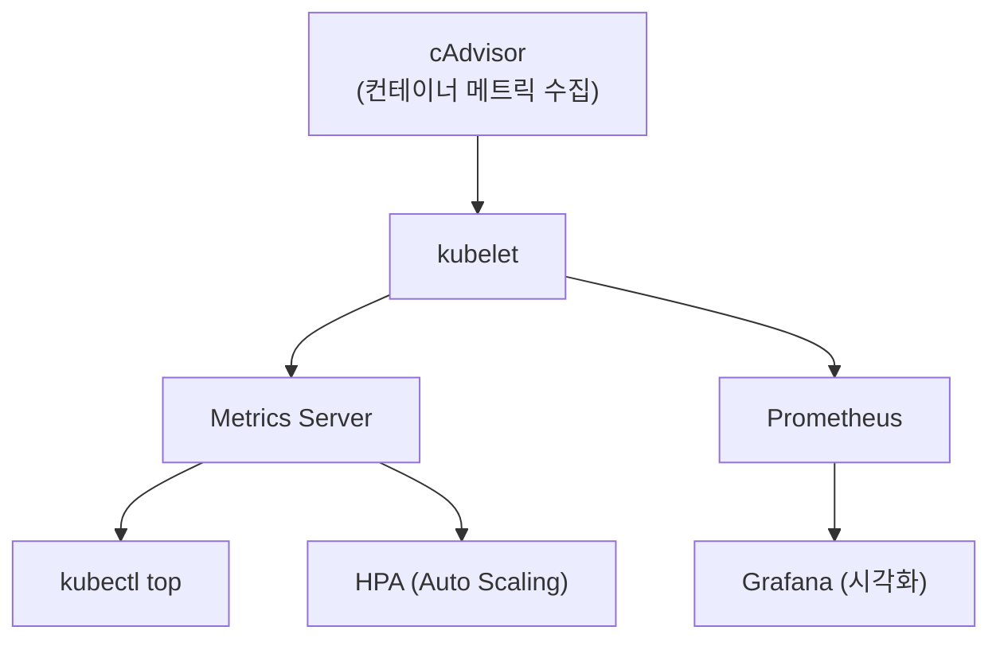
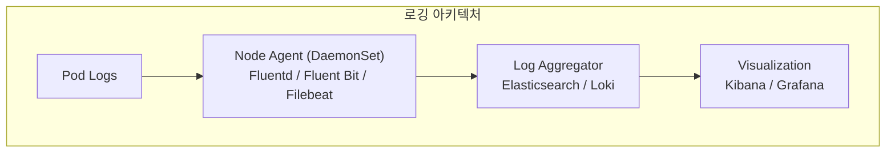

Kubernetes 클러스터 운영에서 **모니터링**과 **로깅**은 문제 진단과 성능 최적화의 핵심이다. 이 장에서는 Kubernetes의 기본 모니터링 도구와 로그 수집 방법을 다룬다.

## 모니터링 개요

### Kubernetes 모니터링 아키텍처



**핵심 컴포넌트**:
- **cAdvisor**: 각 노드에서 컨테이너 메트릭 수집
- **Metrics Server**: 클러스터 전체 메트릭 집계
- **Prometheus**: 시계열 메트릭 저장 및 쿼리
- **Grafana**: 메트릭 시각화

## Metrics Server

### 개념

> **원문 ([kubernetes.io - Metrics Server](https://github.com/kubernetes-sigs/metrics-server)):**
> Metrics Server is a scalable, efficient source of container resource metrics for Kubernetes built-in autoscaling pipelines. Metrics Server collects resource metrics from Kubelets and exposes them in Kubernetes apiserver.

**번역:** Metrics Server는 Kubernetes 내장 오토스케일링 파이프라인을 위한 확장 가능하고 효율적인 컨테이너 리소스 메트릭 소스이다. Metrics Server는 Kubelet에서 리소스 메트릭을 수집하고 Kubernetes apiserver에서 노출한다.

Metrics Server는 **Resource Metrics API**를 제공하는 클러스터 컴포넌트이다.

```bash
# Metrics Server 설치 확인
kubectl get deployment metrics-server -n kube-system

# 설치 (없는 경우)
kubectl apply -f https://github.com/kubernetes-sigs/metrics-server/releases/latest/download/components.yaml
```

**제공 기능**:
- `kubectl top` 명령어 지원
- Horizontal Pod Autoscaler(HPA) 동작 지원
- Vertical Pod Autoscaler(VPA) 지원

**주의**: Metrics Server는 **실시간 메트릭만** 제공. 과거 데이터는 저장하지 않는다.

### kubectl top 명령어

```bash
# 노드 리소스 사용량
kubectl top nodes

# 출력 예시:
# NAME    CPU(cores)   CPU%   MEMORY(bytes)   MEMORY%
# node1   256m         6%     1024Mi          13%
# node2   512m         12%    2048Mi          26%

# Pod 리소스 사용량
kubectl top pods
kubectl top pods -n kube-system
kubectl top pods --all-namespaces

# 컨테이너별 사용량
kubectl top pods --containers

# 정렬
kubectl top pods --sort-by=cpu
kubectl top pods --sort-by=memory
```

### Metrics Server 트러블슈팅

```bash
# Metrics Server Pod 확인
kubectl get pods -n kube-system | grep metrics-server
kubectl logs -n kube-system deployment/metrics-server

# 일반적인 문제: TLS 인증서 오류
# 해결: kubelet-insecure-tls 옵션 추가 (테스트 환경에서만)
kubectl edit deployment metrics-server -n kube-system
# args에 추가:
# - --kubelet-insecure-tls
```

## 로깅

> **원문 ([kubernetes.io - Logging Architecture](https://kubernetes.io/docs/concepts/cluster-administration/logging/)):**
> Kubernetes logging is decoupled from cluster components, meaning that Kubernetes itself does not determine where logs are stored; it expects each application to write logs to standard output or standard error streams.

**번역:** Kubernetes 로깅은 클러스터 컴포넌트와 분리되어 있다. 이는 Kubernetes 자체가 로그가 저장되는 위치를 결정하지 않으며, 각 애플리케이션이 표준 출력 또는 표준 오류 스트림에 로그를 작성할 것으로 예상한다.

### 컨테이너 로그 조회

```bash
# 기본 로그 조회
kubectl logs <pod-name>

# 특정 컨테이너 (multi-container pod)
kubectl logs <pod-name> -c <container-name>

# 이전 컨테이너 로그 (재시작된 경우)
kubectl logs <pod-name> --previous

# 실시간 로그 (tail -f)
kubectl logs <pod-name> -f

# 최근 N줄
kubectl logs <pod-name> --tail=100

# 시간 기반 필터
kubectl logs <pod-name> --since=1h
kubectl logs <pod-name> --since-time=2024-01-20T10:00:00Z

# 모든 컨테이너 로그
kubectl logs <pod-name> --all-containers

# Label selector로 여러 Pod
kubectl logs -l app=nginx --all-containers
```

### 로그 수준 (Log Levels)

Kubernetes 컴포넌트의 로그 수준을 조정할 수 있다.

```bash
# kube-apiserver 로그 수준 확인
# /etc/kubernetes/manifests/kube-apiserver.yaml
# --v=4  (기본값은 보통 2)

# 로그 수준:
# 0: 항상 표시
# 1: 최소 로그
# 2: 유용한 정보 (기본값)
# 3: 확장된 정보
# 4: 디버그 수준
# 5+: 상세 디버그
```

### 노드 수준 로깅

```bash
# kubelet 로그
sudo journalctl -u kubelet -f
sudo journalctl -u kubelet --since "1 hour ago"

# 컨테이너 런타임 로그
sudo journalctl -u containerd -f
sudo journalctl -u docker -f  # Docker 사용 시
```

### 로그 로테이션

Kubernetes는 기본적으로 **컨테이너 로그 로테이션**을 제공한다.

kubelet 설정:
```yaml
# kubelet config
containerLogMaxSize: "10Mi"   # 파일당 최대 크기
containerLogMaxFiles: 5       # 파일 개수
```

### 클러스터 수준 로깅

프로덕션 환경에서는 **중앙 집중식 로깅**이 필요하다.

**일반적인 아키텍처**:



**EFK Stack (Elasticsearch, Fluentd, Kibana)**:
- Fluentd가 각 노드에서 로그 수집
- Elasticsearch에 저장
- Kibana로 검색/시각화

**PLG Stack (Promtail, Loki, Grafana)**:
- 경량화된 로그 수집
- Prometheus와 통합 용이

## 이벤트 모니터링

### Kubernetes Events

```bash
# 모든 이벤트 조회
kubectl get events -A

# 특정 namespace 이벤트
kubectl get events -n <namespace>

# 정렬 (최신 순)
kubectl get events --sort-by='.lastTimestamp'

# 특정 리소스 이벤트
kubectl describe pod <pod-name>
# Events 섹션 확인

# watch 모드
kubectl get events -w
```

**이벤트 유형**:
- `Normal`: 정상 동작
- `Warning`: 문제 가능성

**주요 이벤트 예시**:
- `Scheduled`: Pod가 노드에 스케줄됨
- `Pulling`: 이미지 다운로드 중
- `Created`: 컨테이너 생성됨
- `Started`: 컨테이너 시작됨
- `FailedScheduling`: 스케줄링 실패
- `BackOff`: 컨테이너 재시작 대기

### 이벤트 보존

기본적으로 이벤트는 **1시간** 후 삭제된다.

```bash
# API Server 설정으로 변경 가능
# --event-ttl=2h
```

## 디버그 컨테이너

### kubectl debug

실행 중인 Pod에 디버그 컨테이너를 추가한다.

```bash
# 기존 Pod에 디버그 컨테이너 추가
kubectl debug <pod-name> -it --image=busybox

# 새 Pod로 복제하여 디버깅
kubectl debug <pod-name> -it --image=busybox --copy-to=debug-pod

# 노드 디버깅
kubectl debug node/<node-name> -it --image=busybox

# 컨테이너 쉘 접속
kubectl exec -it <pod-name> -- /bin/sh
kubectl exec -it <pod-name> -c <container> -- /bin/bash
```

### Ephemeral Containers

Pod 스펙에 직접 디버그 컨테이너를 추가한다.

```bash
# ephemeral container 추가
kubectl debug <pod-name> -it \
  --image=busybox \
  --target=<container-name>  # 대상 컨테이너의 네임스페이스 공유
```

## Prometheus 기초

### 메트릭 타입

| 타입 | 설명 | 예시 |
|------|------|------|
| Counter | 단조 증가 값 | 요청 수, 오류 수 |
| Gauge | 변동 가능한 값 | 메모리 사용량, Pod 수 |
| Histogram | 분포 데이터 | 응답 시간 분포 |
| Summary | 백분위 계산 | 지연 시간 p99 |

### 주요 Kubernetes 메트릭

```
# 노드 메트릭
node_cpu_seconds_total
node_memory_MemAvailable_bytes
node_filesystem_avail_bytes

# 컨테이너 메트릭
container_cpu_usage_seconds_total
container_memory_usage_bytes
container_network_receive_bytes_total

# Kubernetes 메트릭
kube_pod_status_phase
kube_deployment_status_replicas
kube_node_status_condition
```

### PromQL 기본 쿼리

```
# CPU 사용률
rate(container_cpu_usage_seconds_total[5m])

# 메모리 사용량 (MB)
container_memory_usage_bytes / 1024 / 1024

# Pod 상태
kube_pod_status_phase{phase="Running"}

# Node Ready 상태
kube_node_status_condition{condition="Ready",status="true"}
```

## 트러블슈팅

### 메트릭 수집 안 됨

```bash
# Metrics Server 상태 확인
kubectl get pods -n kube-system | grep metrics-server
kubectl logs -n kube-system deployment/metrics-server

# API 확인
kubectl get --raw "/apis/metrics.k8s.io/v1beta1/nodes"
```

### 로그 조회 실패

```bash
# Pod 상태 확인
kubectl get pod <pod-name> -o wide

# 컨테이너 상태 확인
kubectl describe pod <pod-name>

# 노드에서 직접 로그 확인
# /var/log/containers/<pod-name>_<namespace>_<container>-<id>.log
# /var/log/pods/<namespace>_<pod-name>_<uid>/<container>/
```

## 기술 면접 대비

### 자주 묻는 질문

**Q: kubectl top 명령이 동작하려면 무엇이 필요한가?**

A: Metrics Server가 설치되어 있어야 한다. Metrics Server는 각 노드의 kubelet에서 cAdvisor를 통해 메트릭을 수집하고, Resource Metrics API를 통해 제공한다. HPA도 이 메트릭을 사용한다.

**Q: 컨테이너 로그는 어디에 저장되는가?**

A: 컨테이너 런타임이 stdout/stderr를 캡처하여 노드의 /var/log/containers/ 디렉토리에 저장한다. kubelet이 로그 로테이션을 관리하며, kubectl logs 명령은 이 파일을 읽어 보여준다. Pod가 삭제되면 로그도 함께 삭제된다.

**Q: 클러스터 수준 로깅은 왜 필요한가?**

A: 기본 컨테이너 로그는 Pod 삭제 시 사라지고, 여러 노드에 분산되어 있어 검색이 어렵다. 중앙 집중식 로깅은 로그를 영구 저장하고, 여러 서비스의 로그를 통합 검색할 수 있게 한다. 장애 분석, 감사, 컴플라이언스에 필수적이다.

**Q: Kubernetes Events의 용도와 보존 기간은?**

A: Events는 클러스터에서 발생하는 상태 변경과 오류를 기록한다. 스케줄링 결정, 이미지 pull 상태, 컨테이너 시작/종료 등이 기록된다. 기본 보존 기간은 1시간이며, 이후 자동 삭제된다. 장기 보존이 필요하면 별도 수집 시스템이 필요하다.

**Q: --previous 플래그는 언제 사용하는가?**

A: 컨테이너가 재시작된 경우 이전 인스턴스의 로그를 조회할 때 사용한다. CrashLoopBackOff 상태에서 크래시 원인을 파악하거나, OOMKilled 직전 로그를 확인하는 데 유용하다.

## CKA 시험 대비 필수 명령어

```bash
# 메트릭 조회
kubectl top nodes
kubectl top pods -A
kubectl top pods --sort-by=cpu
kubectl top pods --sort-by=memory

# 로그 조회
kubectl logs <pod>
kubectl logs <pod> -c <container>
kubectl logs <pod> --previous
kubectl logs <pod> -f --tail=100
kubectl logs <pod> --since=1h

# 이벤트 조회
kubectl get events -A --sort-by='.lastTimestamp'
kubectl get events -n <namespace>

# 디버깅
kubectl exec -it <pod> -- /bin/sh
kubectl debug <pod> -it --image=busybox
```

### CKA 빈출 시나리오

```bash
# 시나리오 1: CPU 사용량이 가장 높은 Pod 찾기
kubectl top pods -A --sort-by=cpu | head -5

# 시나리오 2: 특정 Pod의 이전 크래시 로그 확인
kubectl logs <pod> --previous

# 시나리오 3: 최근 5분간 이벤트 확인
kubectl get events -A --sort-by='.lastTimestamp' | tail -20

# 시나리오 4: 노드 리소스 사용량 확인
kubectl top nodes
kubectl describe node <node> | grep -A5 "Allocated resources"
```

---

## 참고 자료

### 공식 문서

- [Tools for Monitoring Resources](https://kubernetes.io/docs/tasks/debug/debug-cluster/resource-usage-monitoring/)
- [Metrics For The Kubernetes Control Plane](https://kubernetes.io/docs/concepts/cluster-administration/system-metrics/)
- [Logging Architecture](https://kubernetes.io/docs/concepts/cluster-administration/logging/)
- [Metrics Server](https://github.com/kubernetes-sigs/metrics-server)
- [Debug Pods](https://kubernetes.io/docs/tasks/debug/debug-application/debug-pods/)

## 다음 단계

- [Kubernetes - 트러블슈팅](/kubernetes/kubernetes-22-troubleshooting)
- [Kubernetes - Helm과 패키지 관리](/kubernetes/kubernetes-23-helm)
