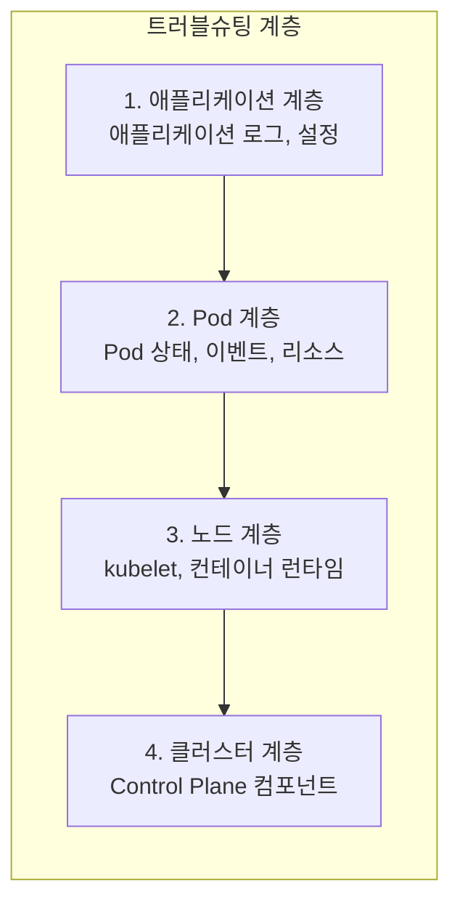

Kubernetes 트러블슈팅은 체계적인 접근이 필요하다. 문제가 발생한 계층(애플리케이션, Pod, 노드, 클러스터)을 파악하고, 단계별로 원인을 좁혀나가야 한다.

## 트러블슈팅 접근 방법

### 계층별 점검



## Pod 문제 해결

> **원문 ([kubernetes.io - Debug Pods](https://kubernetes.io/docs/tasks/debug/debug-application/debug-pods/)):**
> When debugging a pod that is not starting correctly, you should first examine the pod's status and events. The events are recorded in the Kubernetes API and can be retrieved using kubectl describe.

**번역:** 올바르게 시작되지 않는 Pod를 디버깅할 때 먼저 Pod의 상태와 이벤트를 검사해야 한다. 이벤트는 Kubernetes API에 기록되며 kubectl describe를 사용하여 검색할 수 있다.

### Pod 상태별 진단

**Pending**:
```bash
kubectl describe pod <pod-name>
# 이벤트 섹션 확인

# 일반적인 원인:
# - Insufficient cpu/memory: 노드 리소스 부족
# - No nodes available: 스케줄 가능한 노드 없음
# - PersistentVolumeClaim not found: PVC 대기 중
# - Taints/Tolerations: nodeSelector/affinity 불일치
```

**ContainerCreating**:
```bash
kubectl describe pod <pod-name>

# 일반적인 원인:
# - ImagePullBackOff: 이미지 pull 실패
# - ErrImagePull: 이미지 없음 또는 인증 실패
# - ConfigMap/Secret not found: 의존성 리소스 없음
# - Volume mount failed: 볼륨 마운트 실패
```

**CrashLoopBackOff**:
```bash
# 현재 로그
kubectl logs <pod-name>

# 이전 컨테이너 로그
kubectl logs <pod-name> --previous

# 일반적인 원인:
# - 애플리케이션 오류
# - 잘못된 command/args
# - 환경 변수 누락
# - 종료 코드 확인
```

**ImagePullBackOff / ErrImagePull**:
```bash
kubectl describe pod <pod-name>

# 확인 사항:
# - 이미지 이름/태그 오타
# - 프라이빗 레지스트리 인증 (imagePullSecrets)
# - 네트워크 연결 문제
# - 이미지가 레지스트리에 존재하는지
```

**OOMKilled**:
```bash
kubectl describe pod <pod-name>
# Last State: Terminated
# Reason: OOMKilled

# 해결:
# - memory limits 증가
# - 애플리케이션 메모리 누수 수정
# - JVM heap size 조정 (Java 앱)
```

**Evicted**:
```bash
kubectl get pods -A | grep Evicted

# 원인: 노드 리소스 부족
# - 디스크 부족 (ephemeral-storage)
# - 메모리 부족

# 해결:
# - Evicted Pod 정리
kubectl delete pods --field-selector=status.phase=Failed -A
```

### Pod 상세 진단

```bash
# 1. Pod 상태 확인
kubectl get pod <pod-name> -o wide
kubectl describe pod <pod-name>

# 2. 로그 확인
kubectl logs <pod-name>
kubectl logs <pod-name> --previous
kubectl logs <pod-name> -c <container>

# 3. Pod 내부 접속
kubectl exec -it <pod-name> -- /bin/sh

# 4. 이벤트 확인
kubectl get events --field-selector involvedObject.name=<pod-name>

# 5. YAML 확인
kubectl get pod <pod-name> -o yaml
```

### 컨테이너 내부 디버깅

```bash
# 컨테이너 쉘 접속
kubectl exec -it <pod-name> -- /bin/sh
kubectl exec -it <pod-name> -c <container> -- /bin/bash

# DNS 테스트
nslookup kubernetes.default
nslookup <service-name>

# 네트워크 연결 테스트
wget -qO- http://service-name:port
curl http://service-name:port

# 환경 변수 확인
env
printenv

# 프로세스 확인
ps aux

# 파일 시스템 확인
df -h
ls -la /path/to/volume

# 네트워크 인터페이스
ip addr
cat /etc/resolv.conf
```

## Service 문제 해결

> **원문 ([kubernetes.io - Debug Services](https://kubernetes.io/docs/tasks/debug/debug-application/debug-service/)):**
> The first step in debugging a Service is to check that the Service has endpoints. You can do this by checking if the Service has any endpoints in the Kubernetes API.

**번역:** Service 디버깅의 첫 번째 단계는 Service에 endpoints가 있는지 확인하는 것이다. Kubernetes API에서 Service에 endpoints가 있는지 확인하여 이를 수행할 수 있다.

### Service 연결 문제

```bash
# 1. Service 확인
kubectl get svc <service-name> -o wide
kubectl describe svc <service-name>

# 2. Endpoints 확인 (가장 중요!)
kubectl get endpoints <service-name>
# ENDPOINTS가 비어있다면 → selector 불일치

# 3. selector 확인
kubectl get svc <service-name> -o jsonpath='{.spec.selector}'
kubectl get pods -l <key>=<value>

# 4. Pod Ready 상태 확인
kubectl get pods -l <key>=<value> -o wide
# Pod가 Ready 상태여야 Endpoints에 등록됨

# 5. Service 내부에서 테스트
kubectl run test --rm -it --image=busybox -- /bin/sh
# nslookup <service-name>
# wget -qO- http://<service-name>:<port>
```

### DNS 문제

```bash
# DNS Pod 확인
kubectl get pods -n kube-system -l k8s-app=kube-dns

# DNS 테스트
kubectl run test --rm -it --image=busybox -- nslookup kubernetes.default

# resolv.conf 확인
kubectl exec <pod-name> -- cat /etc/resolv.conf

# DNS 로그 확인
kubectl logs -n kube-system -l k8s-app=kube-dns
```

### 외부 접근 문제 (NodePort/LoadBalancer)

```bash
# NodePort 확인
kubectl get svc <service-name>
# 외부에서 <NodeIP>:<NodePort>로 접근

# 방화벽 확인
# - 클라우드: Security Group, Network ACL
# - 온프레미스: iptables, firewalld

# externalTrafficPolicy 확인
kubectl get svc <service-name> -o jsonpath='{.spec.externalTrafficPolicy}'
```

## 노드 문제 해결

### 노드 상태 확인

```bash
# 노드 상태
kubectl get nodes
kubectl describe node <node-name>

# Conditions 확인
# - Ready: 노드 정상
# - MemoryPressure: 메모리 부족
# - DiskPressure: 디스크 부족
# - PIDPressure: PID 부족
# - NetworkUnavailable: 네트워크 문제

# 리소스 사용량
kubectl top node <node-name>
kubectl describe node <node-name> | grep -A5 "Allocated resources"
```

### kubelet 문제

```bash
# 노드에서 실행
# kubelet 상태
sudo systemctl status kubelet

# kubelet 로그
sudo journalctl -u kubelet -f
sudo journalctl -u kubelet --since "10 minutes ago"

# kubelet 재시작
sudo systemctl restart kubelet
```

### 컨테이너 런타임 문제

```bash
# containerd 상태
sudo systemctl status containerd
sudo journalctl -u containerd

# containerd로 컨테이너 확인
sudo crictl ps
sudo crictl pods
sudo crictl images

# Docker (사용 시)
sudo systemctl status docker
sudo docker ps
```

### 노드 NotReady 문제

```bash
# 1. 노드 상태 확인
kubectl describe node <node-name>

# 2. kubelet 로그 확인
sudo journalctl -u kubelet -f

# 일반적인 원인:
# - kubelet 중지
# - 컨테이너 런타임 문제
# - 네트워크 연결 끊김
# - 인증서 만료
# - 디스크 가득 참

# 3. 네트워크 확인 (API Server와 통신)
curl -k https://<api-server>:6443/healthz

# 4. 디스크 확인
df -h
```

## Control Plane 문제 해결

### Control Plane 컴포넌트 확인

```bash
# Static Pod 확인
kubectl get pods -n kube-system | grep -E 'api|controller|scheduler|etcd'

# 각 컴포넌트 로그
kubectl logs -n kube-system kube-apiserver-<node>
kubectl logs -n kube-system kube-controller-manager-<node>
kubectl logs -n kube-system kube-scheduler-<node>
kubectl logs -n kube-system etcd-<node>

# 또는 노드에서 직접
sudo crictl logs <container-id>
```

### API Server 문제

```bash
# API Server 접근 테스트
kubectl cluster-info
kubectl get --raw /healthz

# API Server 상태 확인
kubectl get pods -n kube-system | grep api

# 로그 확인
kubectl logs -n kube-system kube-apiserver-<master>
# 또는
sudo cat /var/log/pods/kube-system_kube-apiserver-*/kube-apiserver/*.log

# 일반적인 문제:
# - 인증서 만료
# - etcd 연결 실패
# - 메모리 부족
```

### etcd 문제

```bash
# etcd 상태 확인
ETCDCTL_API=3 etcdctl endpoint health \
  --endpoints=https://127.0.0.1:2379 \
  --cacert=/etc/kubernetes/pki/etcd/ca.crt \
  --cert=/etc/kubernetes/pki/etcd/server.crt \
  --key=/etc/kubernetes/pki/etcd/server.key

# etcd 멤버 확인
ETCDCTL_API=3 etcdctl member list \
  --endpoints=https://127.0.0.1:2379 \
  --cacert=/etc/kubernetes/pki/etcd/ca.crt \
  --cert=/etc/kubernetes/pki/etcd/server.crt \
  --key=/etc/kubernetes/pki/etcd/server.key

# etcd 로그
kubectl logs -n kube-system etcd-<master>
```

### 인증서 문제

```bash
# 인증서 만료 확인
sudo kubeadm certs check-expiration

# 개별 인증서 확인
openssl x509 -in /etc/kubernetes/pki/apiserver.crt -noout -enddate

# 인증서 갱신
sudo kubeadm certs renew all
```

## 네트워크 문제 해결

### Pod-to-Pod 통신

```bash
# 같은 노드
kubectl run test1 --image=busybox -- sleep 3600
kubectl run test2 --image=busybox -- sleep 3600

# test1에서 test2로 ping
kubectl exec test1 -- ping <test2-ip>

# 다른 노드 간 통신 테스트
kubectl get pods -o wide  # Pod가 다른 노드에 있는지 확인
```

### CNI 플러그인 문제

```bash
# CNI 플러그인 Pod 확인
kubectl get pods -n kube-system | grep -E 'calico|flannel|weave|cilium'

# CNI 로그
kubectl logs -n kube-system <cni-pod>

# CNI 설정 확인 (노드에서)
ls /etc/cni/net.d/
cat /etc/cni/net.d/*.conf
```

### NetworkPolicy 문제

```bash
# NetworkPolicy 확인
kubectl get networkpolicy -A
kubectl describe networkpolicy <name>

# 연결 테스트
kubectl run test --rm -it --image=busybox -- wget -qO- --timeout=2 http://<service>

# NetworkPolicy 일시적 제거 (테스트용)
kubectl delete networkpolicy <name>
```

## 스토리지 문제 해결

### PVC Pending

```bash
# PVC 상태
kubectl get pvc
kubectl describe pvc <pvc-name>

# 일반적인 원인:
# - PV 없음 (정적 프로비저닝)
# - StorageClass 없거나 잘못됨
# - accessModes 불일치
# - 용량 부족

# StorageClass 확인
kubectl get storageclass
kubectl describe storageclass <name>
```

### 볼륨 마운트 실패

```bash
kubectl describe pod <pod-name>
# Events에서 "MountVolume.SetUp failed" 확인

# 원인:
# - PVC가 bound 상태가 아님
# - 권한 문제
# - fsType 불일치
# - 노드에 볼륨이 이미 attach됨 (다른 Pod에서 사용 중)
```

## 일반적인 트러블슈팅 체크리스트

```bash
# 1. 기본 상태 확인
kubectl get nodes
kubectl get pods -A
kubectl get events -A --sort-by='.lastTimestamp' | tail -20

# 2. 문제 Pod 상세 확인
kubectl describe pod <pod-name>
kubectl logs <pod-name>
kubectl logs <pod-name> --previous

# 3. 관련 리소스 확인
kubectl get svc
kubectl get endpoints
kubectl get pvc
kubectl get configmap
kubectl get secret

# 4. 노드 상태 확인
kubectl describe node <node-name>
kubectl top nodes

# 5. 클러스터 컴포넌트 확인
kubectl get pods -n kube-system
kubectl cluster-info
```

## 기술 면접 대비

### 자주 묻는 질문

**Q: Pod가 Pending 상태일 때 어떻게 진단하는가?**

A: kubectl describe pod로 이벤트를 확인한다. 일반적인 원인은 리소스 부족(Insufficient cpu/memory), 노드 selector/affinity 불만족, PVC 바인딩 대기, taints/tolerations 불일치 등이다. 이벤트 메시지가 원인을 명확히 알려준다.

**Q: CrashLoopBackOff 문제는 어떻게 해결하는가?**

A: kubectl logs --previous로 이전 컨테이너의 로그를 확인한다. 애플리케이션 오류, 잘못된 command/args, 환경 변수 누락, 의존 서비스 연결 실패 등이 원인이다. Exit code도 힌트가 된다 (1: 일반 오류, 137: OOMKilled, 143: SIGTERM).

**Q: Service에 연결이 안 될 때 점검 순서는?**

A: 먼저 kubectl get endpoints로 Endpoints가 있는지 확인한다. Endpoints가 비어있으면 selector와 Pod label 일치 여부, Pod가 Ready 상태인지 확인한다. Endpoints가 있으면 Pod 내부에서 직접 연결 테스트를 한다. 그래도 안 되면 NetworkPolicy를 확인한다.

**Q: 노드가 NotReady일 때 어떻게 진단하는가?**

A: kubectl describe node로 Conditions를 확인한다. 노드에서 sudo systemctl status kubelet과 journalctl -u kubelet로 kubelet 상태를 확인한다. 컨테이너 런타임(containerd/docker) 상태도 확인한다. 네트워크 연결, 디스크 공간, 인증서 만료도 점검한다.

**Q: kubectl 명령이 API Server에 연결되지 않을 때?**

A: kubeconfig 설정(~/.kube/config)을 확인하고, API Server 주소와 인증 정보가 올바른지 확인한다. Master 노드에서 직접 kubectl cluster-info를 실행해본다. API Server Pod 상태와 로그를 확인한다. 인증서 만료 여부도 점검한다.

---

## 참고 자료

### 공식 문서

- [Troubleshooting Applications](https://kubernetes.io/docs/tasks/debug/debug-application/)
- [Troubleshooting Clusters](https://kubernetes.io/docs/tasks/debug/debug-cluster/)
- [Debug Pods](https://kubernetes.io/docs/tasks/debug/debug-application/debug-pods/)
- [Debug Services](https://kubernetes.io/docs/tasks/debug/debug-application/debug-service/)
- [Debug Running Pods](https://kubernetes.io/docs/tasks/debug/debug-application/debug-running-pod/)

## CKA 시험 대비 필수 명령어

```bash
# Pod 진단
kubectl get pods -A
kubectl describe pod <pod>
kubectl logs <pod>
kubectl logs <pod> --previous
kubectl exec -it <pod> -- /bin/sh

# Service 진단
kubectl get svc,endpoints
kubectl describe svc <svc>
kubectl run test --rm -it --image=busybox -- wget -qO- http://<svc>

# 노드 진단
kubectl get nodes
kubectl describe node <node>
kubectl top nodes
sudo journalctl -u kubelet -f

# 클러스터 진단
kubectl get pods -n kube-system
kubectl cluster-info
kubectl get events -A --sort-by='.lastTimestamp'

# Control Plane 로그
kubectl logs -n kube-system kube-apiserver-<master>
kubectl logs -n kube-system kube-controller-manager-<master>
kubectl logs -n kube-system kube-scheduler-<master>
```

## 다음 단계

- [Kubernetes - Helm과 패키지 관리](/kubernetes/kubernetes-23-helm)
- [Kubernetes - CRD와 Operator](/kubernetes/kubernetes-24-crd-operator)
