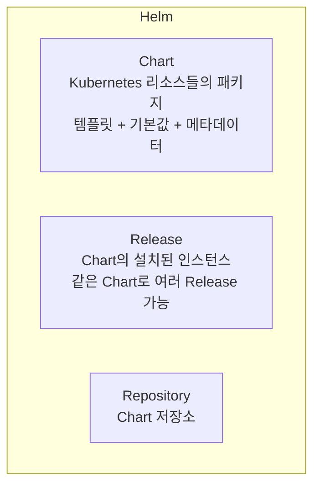

Kubernetes 애플리케이션 배포에서 여러 YAML 파일을 관리하는 것은 번거롭다. **Helm**과 **Kustomize**는 이 문제를 해결하는 대표적인 도구이다. Helm은 패키지 관리자 방식으로, Kustomize는 오버레이 방식으로 설정을 관리한다.

## Helm

### Helm 개요

> **원문 ([helm.sh](https://helm.sh/)):**
> Helm is the package manager for Kubernetes. Helm Charts help you define, install, and upgrade even the most complex Kubernetes application.

**번역:** Helm은 Kubernetes를 위한 패키지 관리자이다. Helm Charts는 가장 복잡한 Kubernetes 애플리케이션도 정의, 설치 및 업그레이드하는 데 도움이 된다.

Helm은 Kubernetes의 **패키지 관리자**이다.



**주요 개념**:
- **Chart**: 애플리케이션을 정의하는 패키지
- **Release**: Chart를 클러스터에 설치한 인스턴스
- **Repository**: Chart를 저장하고 공유하는 저장소

### Helm 설치

```bash
# macOS
brew install helm

# Linux
curl https://raw.githubusercontent.com/helm/helm/main/scripts/get-helm-3 | bash

# 버전 확인
helm version
```

### 기본 명령어

```bash
# Repository 추가
helm repo add bitnami https://charts.bitnami.com/bitnami
helm repo add stable https://charts.helm.sh/stable
helm repo update

# Chart 검색
helm search repo nginx
helm search hub nginx  # Artifact Hub 검색

# Chart 정보 확인
helm show chart bitnami/nginx
helm show values bitnami/nginx  # 설정 가능한 값

# Chart 설치
helm install my-nginx bitnami/nginx
helm install my-nginx bitnami/nginx --namespace web --create-namespace

# 커스텀 값으로 설치
helm install my-nginx bitnami/nginx -f values.yaml
helm install my-nginx bitnami/nginx --set replicaCount=3

# Release 목록
helm list
helm list -A  # 모든 namespace

# Release 상태
helm status my-nginx

# Release 업그레이드
helm upgrade my-nginx bitnami/nginx --set replicaCount=5
helm upgrade my-nginx bitnami/nginx -f new-values.yaml

# Release 롤백
helm rollback my-nginx 1  # 리비전 번호

# Release 삭제
helm uninstall my-nginx

# Release 히스토리
helm history my-nginx
```

### Chart 구조

```
mychart/
├── Chart.yaml         # Chart 메타데이터
├── values.yaml        # 기본 설정값
├── charts/            # 의존성 Chart
├── templates/         # 템플릿 파일
│   ├── deployment.yaml
│   ├── service.yaml
│   ├── ingress.yaml
│   ├── _helpers.tpl   # 템플릿 헬퍼
│   └── NOTES.txt      # 설치 후 메시지
└── .helmignore        # 패키징 제외 파일
```

### Chart.yaml

```yaml
apiVersion: v2
name: mychart
description: My application chart
type: application
version: 0.1.0           # Chart 버전
appVersion: "1.16.0"     # 애플리케이션 버전
dependencies:
- name: postgresql
  version: "12.x.x"
  repository: https://charts.bitnami.com/bitnami
```

### values.yaml

```yaml
# 기본 설정값
replicaCount: 1

image:
  repository: nginx
  tag: "1.24"
  pullPolicy: IfNotPresent

service:
  type: ClusterIP
  port: 80

resources:
  limits:
    cpu: 100m
    memory: 128Mi
  requests:
    cpu: 50m
    memory: 64Mi

nodeSelector: {}
tolerations: []
affinity: {}
```

### 템플릿 작성

```yaml
# templates/deployment.yaml
apiVersion: apps/v1
kind: Deployment
metadata:
  name: {{ include "mychart.fullname" . }}
  labels:
    {{- include "mychart.labels" . | nindent 4 }}
spec:
  replicas: {{ .Values.replicaCount }}
  selector:
    matchLabels:
      {{- include "mychart.selectorLabels" . | nindent 6 }}
  template:
    metadata:
      labels:
        {{- include "mychart.selectorLabels" . | nindent 8 }}
    spec:
      containers:
      - name: {{ .Chart.Name }}
        image: "{{ .Values.image.repository }}:{{ .Values.image.tag }}"
        imagePullPolicy: {{ .Values.image.pullPolicy }}
        ports:
        - containerPort: 80
        {{- if .Values.resources }}
        resources:
          {{- toYaml .Values.resources | nindent 12 }}
        {{- end }}
```

### 템플릿 함수

```yaml
# 문자열 함수
{{ .Values.name | upper }}           # 대문자
{{ .Values.name | lower }}           # 소문자
{{ .Values.name | title }}           # 첫글자 대문자
{{ .Values.name | quote }}           # 따옴표 추가
{{ .Values.name | default "nginx" }} # 기본값

# 조건문
{{- if .Values.ingress.enabled }}
apiVersion: networking.k8s.io/v1
kind: Ingress
...
{{- end }}

# 반복문
{{- range .Values.hosts }}
- host: {{ . }}
{{- end }}

# 변수
{{- $fullName := include "mychart.fullname" . -}}

# YAML 변환
{{- toYaml .Values.nodeSelector | nindent 8 }}
```

### Chart 개발

```bash
# 새 Chart 생성
helm create mychart

# 템플릿 렌더링 (디버깅)
helm template my-release ./mychart
helm template my-release ./mychart -f custom-values.yaml

# 문법 검사
helm lint ./mychart

# 설치 전 미리보기 (dry-run)
helm install my-release ./mychart --dry-run --debug

# Chart 패키징
helm package ./mychart

# 의존성 관리
helm dependency update ./mychart
```

## Kustomize

### Kustomize 개요

> **원문 ([kustomize.io](https://kustomize.io/)):**
> Kustomize traverses a Kubernetes manifest to add, remove or update configuration options without forking. It is available both as a standalone binary and as a native feature of kubectl.

**번역:** Kustomize는 포크 없이 구성 옵션을 추가, 제거 또는 업데이트하기 위해 Kubernetes 매니페스트를 순회한다. 독립 실행형 바이너리와 kubectl의 기본 기능으로 모두 사용할 수 있다.

Kustomize는 **템플릿 없이** YAML을 커스터마이징한다.

```
Base YAML + Overlay = 최종 YAML
```

**특징**:
- kubectl에 내장 (`kubectl apply -k`)
- 원본 YAML 수정 없이 오버레이
- 환경별 설정 관리에 적합

### 기본 구조

```
├── base/                    # 기본 리소스
│   ├── kustomization.yaml
│   ├── deployment.yaml
│   └── service.yaml
└── overlays/                # 환경별 오버레이
    ├── development/
    │   ├── kustomization.yaml
    │   └── replica-patch.yaml
    └── production/
        ├── kustomization.yaml
        └── replica-patch.yaml
```

### base/kustomization.yaml

```yaml
apiVersion: kustomize.config.k8s.io/v1beta1
kind: Kustomization

resources:
- deployment.yaml
- service.yaml
```

### base/deployment.yaml

```yaml
apiVersion: apps/v1
kind: Deployment
metadata:
  name: myapp
spec:
  replicas: 1
  selector:
    matchLabels:
      app: myapp
  template:
    metadata:
      labels:
        app: myapp
    spec:
      containers:
      - name: myapp
        image: myapp:latest
        ports:
        - containerPort: 8080
```

### overlays/production/kustomization.yaml

```yaml
apiVersion: kustomize.config.k8s.io/v1beta1
kind: Kustomization

resources:
- ../../base

namespace: production

namePrefix: prod-
nameSuffix: -v1

commonLabels:
  env: production

commonAnnotations:
  managed-by: kustomize

replicas:
- name: myapp
  count: 5

images:
- name: myapp
  newTag: "1.0.0"

patches:
- path: replica-patch.yaml
```

### 패치 방식

**Strategic Merge Patch**:
```yaml
# overlays/production/replica-patch.yaml
apiVersion: apps/v1
kind: Deployment
metadata:
  name: myapp
spec:
  replicas: 5
  template:
    spec:
      containers:
      - name: myapp
        resources:
          limits:
            cpu: "500m"
            memory: "256Mi"
```

**JSON Patch**:
```yaml
# kustomization.yaml
patches:
- target:
    kind: Deployment
    name: myapp
  patch: |-
    - op: replace
      path: /spec/replicas
      value: 5
```

### Kustomize 사용

```bash
# 빌드 (YAML 출력)
kustomize build overlays/production/
kubectl kustomize overlays/production/

# 적용
kustomize build overlays/production/ | kubectl apply -f -
kubectl apply -k overlays/production/

# 삭제
kubectl delete -k overlays/production/
```

### ConfigMap/Secret 생성

```yaml
# kustomization.yaml
configMapGenerator:
- name: app-config
  literals:
  - LOG_LEVEL=info
  - DB_HOST=localhost
- name: app-config-file
  files:
  - config.json

secretGenerator:
- name: db-secret
  literals:
  - username=admin
  - password=secret123

generatorOptions:
  disableNameSuffixHash: true  # 해시 접미사 비활성화
```

### 이미지 변경

```yaml
# kustomization.yaml
images:
- name: myapp
  newName: registry.example.com/myapp
  newTag: "2.0.0"
- name: nginx
  digest: sha256:abc123...  # digest로 지정
```

## Helm vs Kustomize

| 특성 | Helm | Kustomize |
|------|------|-----------|
| 방식 | 템플릿 | 오버레이 |
| 복잡도 | 높음 | 낮음 |
| 학습 곡선 | 가파름 | 완만함 |
| 패키지 배포 | 적합 | 부적합 |
| 환경별 설정 | 가능 | 매우 적합 |
| 커뮤니티 Chart | 풍부 | 해당없음 |
| kubectl 통합 | 별도 설치 | 내장 |

**사용 시나리오**:
- **Helm**: 복잡한 애플리케이션, 커뮤니티 Chart 사용, 릴리스 관리 필요
- **Kustomize**: 환경별 설정 관리, 간단한 커스터마이징, GitOps

### 함께 사용하기

```bash
# Helm Chart를 Kustomize로 커스터마이징
helm template my-release bitnami/nginx > base/nginx.yaml

# kustomization.yaml에서 patches 적용
```

## 기술 면접 대비

### 자주 묻는 질문

**Q: Helm Chart와 Release의 차이는?**

A: Chart는 애플리케이션을 정의하는 패키지(템플릿과 기본값의 묶음)이다. Release는 Chart를 클러스터에 설치한 인스턴스이다. 같은 Chart로 여러 Release를 만들 수 있으며, 각 Release는 독립적으로 업그레이드하고 롤백할 수 있다.

**Q: Helm 3와 Helm 2의 차이점은?**

A: Helm 3에서 Tiller(클러스터 내 서버 컴포넌트)가 제거되었다. 이로써 RBAC 설정이 간소화되고 보안이 향상되었다. Release 정보는 Secret으로 저장되며, 클라이언트가 직접 API Server와 통신한다.

**Q: Kustomize의 장점은?**

A: 원본 YAML을 수정하지 않고 오버레이로 커스터마이징한다. 템플릿 언어를 배울 필요 없이 순수 YAML로 작업한다. kubectl에 내장되어 별도 설치가 필요 없다. 환경별 설정 관리에 매우 적합하다.

**Q: Helm과 Kustomize를 함께 사용하는 이유는?**

A: Helm은 복잡한 애플리케이션 패키징과 커뮤니티 Chart 활용에 좋고, Kustomize는 환경별 세밀한 커스터마이징에 좋다. Helm Chart를 렌더링한 후 Kustomize로 환경별 패치를 적용하는 방식으로 두 도구의 장점을 결합할 수 있다.

## CKA 시험 대비 필수 명령어

CKA 시험에서는 주로 Kustomize가 출제된다.

```bash
# Kustomize 빌드
kubectl kustomize <directory>

# Kustomize 적용
kubectl apply -k <directory>

# Kustomize 삭제
kubectl delete -k <directory>

# Helm (기본 명령)
helm install <release> <chart>
helm upgrade <release> <chart>
helm list
helm uninstall <release>
```

---

## 참고 자료

### 공식 문서

- [Helm Documentation](https://helm.sh/docs/)
- [Helm Charts](https://helm.sh/docs/topics/charts/)
- [Kustomize](https://kustomize.io/)
- [Kustomize Documentation](https://kubectl.docs.kubernetes.io/references/kustomize/)
- [Managing Kubernetes Objects Using Kustomize](https://kubernetes.io/docs/tasks/manage-kubernetes-objects/kustomization/)

## 다음 단계

- [Kubernetes - CRD와 Operator](/kubernetes/kubernetes-24-crd-operator)
- [Kubernetes - CKA 시험 대비](/kubernetes/kubernetes-25-cka-prep)
