> **원문 ([argo-cd.readthedocs.io](https://argo-cd.readthedocs.io/en/stable/)):**
> Argo CD is a declarative, GitOps continuous delivery tool for Kubernetes. Application definitions, configurations, and environments should be declarative and version controlled.

**번역:** Argo CD는 Kubernetes를 위한 선언적 GitOps 지속적 배포 도구이다. 애플리케이션 정의, 구성 및 환경은 선언적이어야 하며 버전 제어되어야 한다.

ArgoCD는 Kubernetes를 위한 **GitOps 기반 CD(Continuous Delivery)** 도구이다. Git 저장소를 "단일 진실 공급원(Single Source of Truth)"으로 삼아 클러스터 상태를 선언적으로 관리한다.

## GitOps란?

> **원문 ([argo-cd.readthedocs.io](https://argo-cd.readthedocs.io/en/stable/)):**
> GitOps is a way to do Kubernetes cluster management and application delivery. It works by using Git as a single source of truth for declarative infrastructure and applications.

**번역:** GitOps는 Kubernetes 클러스터 관리 및 애플리케이션 전달을 수행하는 방법이다. 선언적 인프라 및 애플리케이션의 단일 진실 소스로 Git을 사용하여 작동한다.

### 전통적인 배포 vs GitOps

**전통적인 방식(Push 기반)**은 CI 파이프라인이 클러스터에 직접 배포 명령을 보낸다.

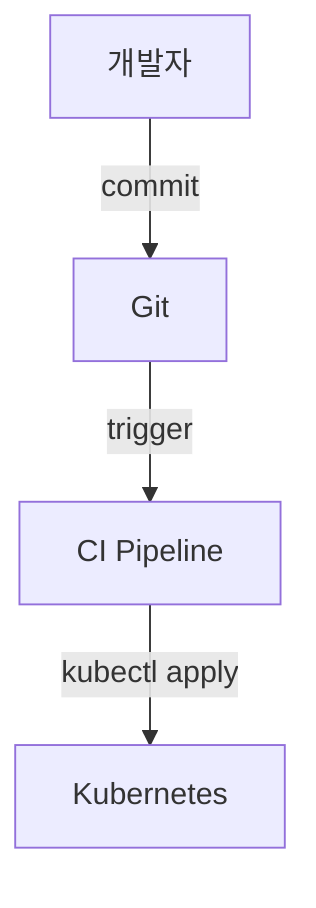

문제점:
- CI 서버가 클러스터 접근 권한 필요 (보안 위험)
- 수동 변경 시 Git과 불일치 발생
- 롤백이 복잡함

**GitOps 방식(Pull 기반)**은 클러스터 내부의 에이전트가 Git을 감시하고 변경을 반영한다.

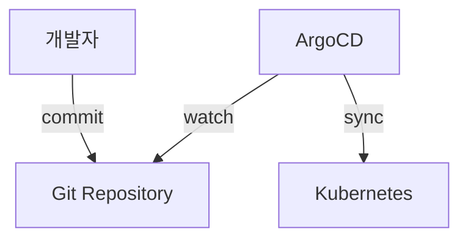

장점:
- Git이 유일한 진실 공급원
- 클러스터 자격 증명이 외부에 노출되지 않음
- 모든 변경이 Git 히스토리에 남음
- 롤백 = Git revert

### GitOps의 4가지 원칙

| 원칙 | 설명 |
|------|------|
| **선언적(Declarative)** | 시스템 상태를 선언적으로 정의 |
| **버전 관리(Versioned)** | 모든 변경은 Git에 기록 |
| **자동 반영(Automated)** | 승인된 변경은 자동으로 적용 |
| **지속적 조정(Reconciled)** | 실제 상태를 원하는 상태로 지속적으로 맞춤 |

---

## ArgoCD 아키텍처

### 핵심 컴포넌트

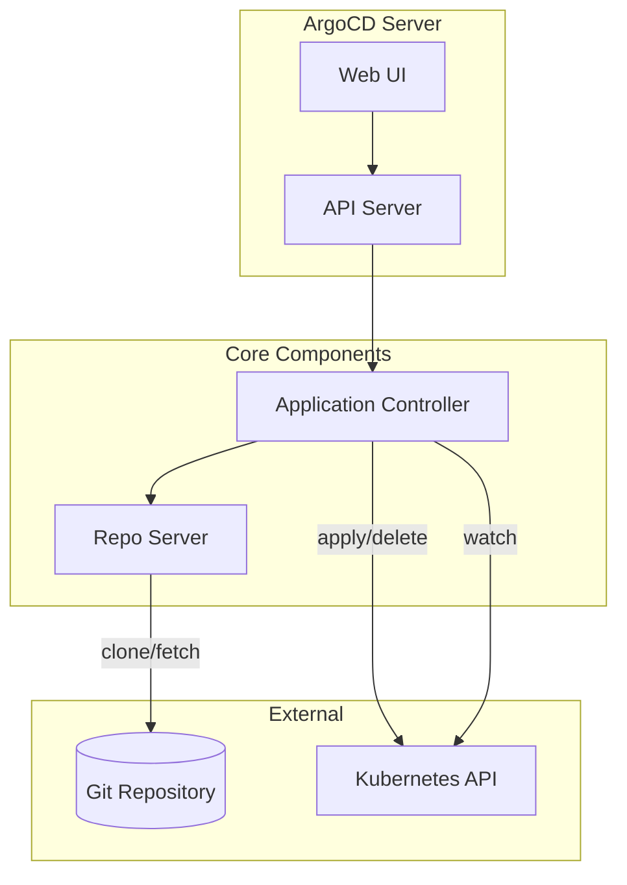

| 컴포넌트 | 역할 |
|----------|------|
| **API Server** | gRPC/REST API 제공, 인증/인가 처리 |
| **Repo Server** | Git 저장소 클론, 매니페스트 생성 |
| **Application Controller** | 클러스터 상태 감시, 동기화 수행 |
| **Redis** | 캐싱, 상태 저장 |
| **Dex** | SSO 인증 (선택) |

### Application 상태 흐름

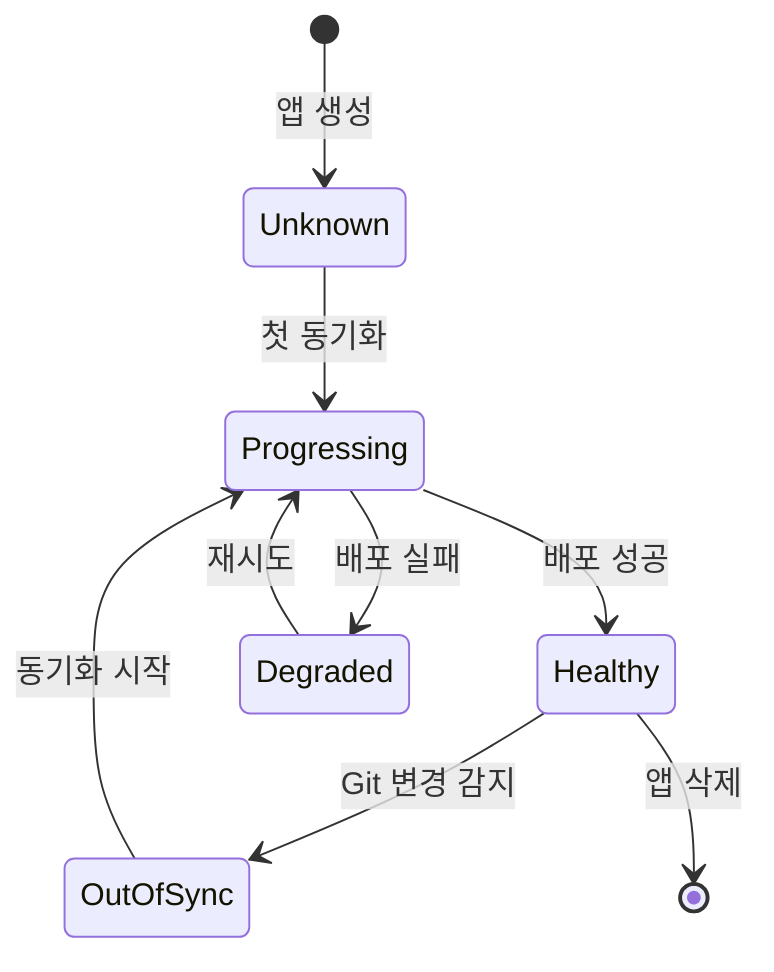

---

## ArgoCD 설치

### Namespace 생성 및 설치

```bash
# Namespace 생성
kubectl create namespace argocd

# ArgoCD 설치 (안정 버전)
kubectl apply -n argocd -f https://raw.githubusercontent.com/argoproj/argo-cd/stable/manifests/install.yaml

# 설치 확인
kubectl get pods -n argocd
```

### 초기 비밀번호 확인

```bash
# admin 초기 비밀번호 (argocd-initial-admin-secret)
kubectl -n argocd get secret argocd-initial-admin-secret \
  -o jsonpath="{.data.password}" | base64 -d && echo

# 비밀번호 변경 (CLI 사용)
argocd account update-password
```

### Web UI 접근

```bash
# 방법 1: Port Forward
kubectl port-forward svc/argocd-server -n argocd 8080:443

# 방법 2: LoadBalancer로 변경
kubectl patch svc argocd-server -n argocd -p '{"spec": {"type": "LoadBalancer"}}'

# 방법 3: Ingress 설정
```

### ArgoCD CLI 설치

```bash
# macOS
brew install argocd

# Linux
curl -sSL -o argocd-linux-amd64 https://github.com/argoproj/argo-cd/releases/latest/download/argocd-linux-amd64
sudo install -m 555 argocd-linux-amd64 /usr/local/bin/argocd

# 로그인
argocd login localhost:8080
```

---

## Application 생성

### Application이란?

ArgoCD에서 **Application**은 "무엇을 어디에 배포할 것인가"를 정의하는 CRD이다.

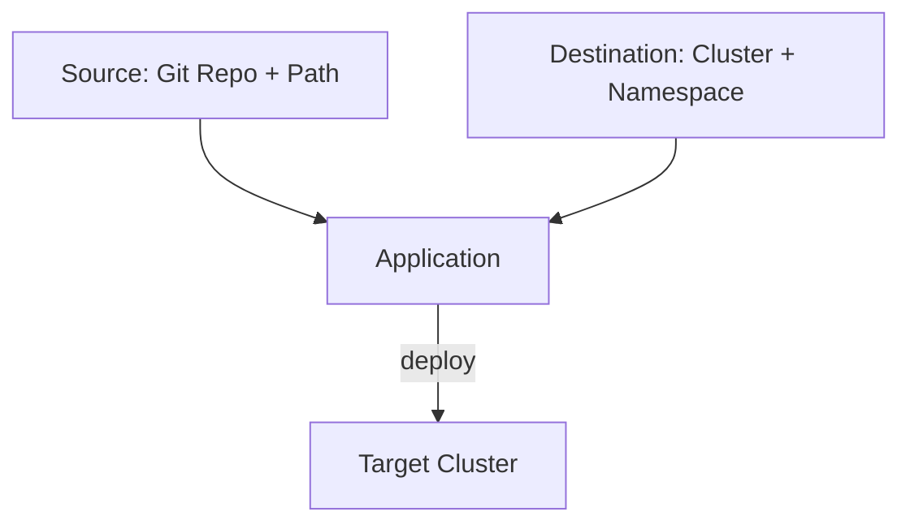

### YAML로 Application 정의

```yaml
apiVersion: argoproj.io/v1alpha1
kind: Application
metadata:
  name: my-app
  namespace: argocd  # Application은 항상 argocd namespace에
spec:
  # 프로젝트 (권한 그룹)
  project: default

  # 소스: 어디서 매니페스트를 가져올 것인가
  source:
    repoURL: https://github.com/myorg/my-app.git
    targetRevision: main  # 브랜치, 태그, 커밋 해시
    path: k8s/overlays/production  # 저장소 내 경로

  # 목적지: 어디에 배포할 것인가
  destination:
    server: https://kubernetes.default.svc  # 클러스터 API
    namespace: production  # 대상 namespace

  # 동기화 정책
  syncPolicy:
    automated:
      prune: true       # Git에서 삭제된 리소스 제거
      selfHeal: true    # 수동 변경 시 자동 복구
    syncOptions:
    - CreateNamespace=true  # namespace 자동 생성
```

### CLI로 Application 생성

```bash
argocd app create my-app \
  --repo https://github.com/myorg/my-app.git \
  --path k8s/overlays/production \
  --dest-server https://kubernetes.default.svc \
  --dest-namespace production \
  --sync-policy automated \
  --auto-prune \
  --self-heal
```

### Helm Chart 배포

```yaml
apiVersion: argoproj.io/v1alpha1
kind: Application
metadata:
  name: nginx-ingress
  namespace: argocd
spec:
  project: default
  source:
    # Helm 저장소
    repoURL: https://kubernetes.github.io/ingress-nginx
    chart: ingress-nginx  # Chart 이름
    targetRevision: 4.8.3  # Chart 버전

    # Helm values 오버라이드
    helm:
      releaseName: nginx-ingress
      values: |
        controller:
          replicaCount: 2
          service:
            type: LoadBalancer
      # 또는 개별 파라미터
      parameters:
      - name: controller.replicaCount
        value: "2"

  destination:
    server: https://kubernetes.default.svc
    namespace: ingress-nginx
```

### Kustomize 배포

```yaml
apiVersion: argoproj.io/v1alpha1
kind: Application
metadata:
  name: my-app-prod
  namespace: argocd
spec:
  project: default
  source:
    repoURL: https://github.com/myorg/my-app.git
    targetRevision: main
    path: k8s/overlays/production  # kustomization.yaml 위치

    # Kustomize 옵션 (선택)
    kustomize:
      namePrefix: prod-
      commonLabels:
        env: production

  destination:
    server: https://kubernetes.default.svc
    namespace: production
```

---

## 동기화(Sync) 이해하기

### Sync 상태

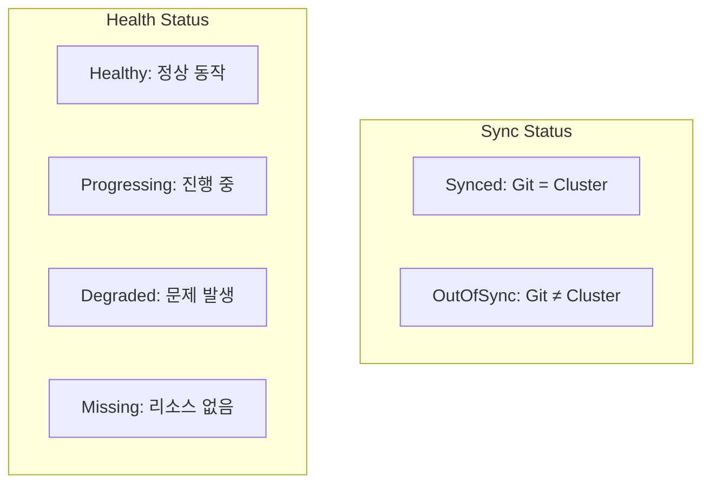

| Sync 상태 | 의미 |
|-----------|------|
| **Synced** | Git 상태 = 클러스터 상태 |
| **OutOfSync** | Git 상태 ≠ 클러스터 상태 |

| Health 상태 | 의미 |
|-------------|------|
| **Healthy** | 모든 리소스 정상 |
| **Progressing** | 배포/롤아웃 진행 중 |
| **Degraded** | 일부 리소스 비정상 |
| **Suspended** | 일시 중단 (HPA 등) |
| **Missing** | 리소스가 클러스터에 없음 |

### 수동 동기화

```bash
# 동기화 실행
argocd app sync my-app

# 특정 리소스만 동기화
argocd app sync my-app --resource deployment:my-deployment

# Dry-run (실제 적용 안 함)
argocd app sync my-app --dry-run
```

### 자동 동기화 설정

```yaml
spec:
  syncPolicy:
    automated:
      # Git에서 삭제된 리소스를 클러스터에서도 삭제
      prune: true

      # 클러스터에서 수동 변경 시 Git 상태로 복구
      selfHeal: true

      # 동기화 실패 시에도 prune 허용
      allowEmpty: false

    # 재시도 설정
    retry:
      limit: 5
      backoff:
        duration: 5s
        factor: 2
        maxDuration: 3m
```

### Sync Options

```yaml
spec:
  syncPolicy:
    syncOptions:
    # Namespace 자동 생성
    - CreateNamespace=true

    # kubectl apply 대신 replace 사용
    - Replace=true

    # 서버 사이드 적용 (대용량 리소스)
    - ServerSideApply=true

    # 특정 리소스 prune 제외
    - PrunePropagationPolicy=foreground

    # 검증 건너뛰기 (위험!)
    - Validate=false
```

---

## 멀티 클러스터 관리

### 클러스터 등록

```bash
# 현재 kubeconfig의 클러스터 목록
kubectl config get-contexts

# ArgoCD에 클러스터 등록
argocd cluster add my-production-cluster

# 등록된 클러스터 확인
argocd cluster list
```

### Secret으로 클러스터 등록

```yaml
apiVersion: v1
kind: Secret
metadata:
  name: production-cluster
  namespace: argocd
  labels:
    argocd.argoproj.io/secret-type: cluster
type: Opaque
stringData:
  name: production
  server: https://production.example.com:6443
  config: |
    {
      "bearerToken": "<service-account-token>",
      "tlsClientConfig": {
        "insecure": false,
        "caData": "<base64-encoded-ca-cert>"
      }
    }
```

### 멀티 클러스터 Application

```yaml
apiVersion: argoproj.io/v1alpha1
kind: Application
metadata:
  name: my-app-production
  namespace: argocd
spec:
  project: default
  source:
    repoURL: https://github.com/myorg/my-app.git
    path: k8s/overlays/production
    targetRevision: main
  destination:
    # 등록된 외부 클러스터
    server: https://production.example.com:6443
    namespace: production
```

---

## Project로 권한 관리

### Project란?

**AppProject**는 Application들의 논리적 그룹이다. 접근 권한, 허용된 소스/목적지를 제한한다.

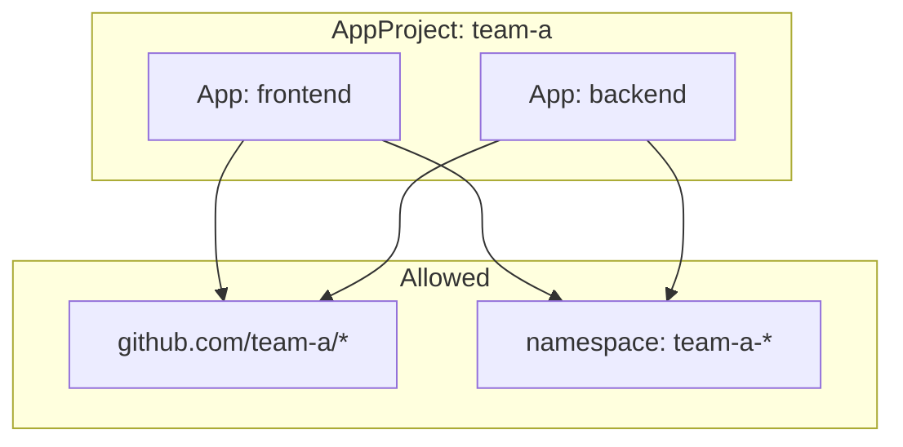

### Project 정의

```yaml
apiVersion: argoproj.io/v1alpha1
kind: AppProject
metadata:
  name: team-a
  namespace: argocd
spec:
  description: Team A 프로젝트

  # 허용된 소스 저장소
  sourceRepos:
  - 'https://github.com/myorg/team-a-*'
  - 'https://charts.example.com/*'

  # 허용된 배포 대상
  destinations:
  - namespace: 'team-a-*'
    server: https://kubernetes.default.svc
  - namespace: 'team-a-prod'
    server: https://production.example.com

  # 허용된 클러스터 리소스
  clusterResourceWhitelist:
  - group: ''
    kind: Namespace

  # 허용된 Namespace 리소스
  namespaceResourceWhitelist:
  - group: '*'
    kind: '*'

  # 차단된 리소스 (보안)
  namespaceResourceBlacklist:
  - group: ''
    kind: ResourceQuota
  - group: ''
    kind: LimitRange

  # RBAC 역할
  roles:
  - name: developer
    description: 개발자 역할
    policies:
    - p, proj:team-a:developer, applications, get, team-a/*, allow
    - p, proj:team-a:developer, applications, sync, team-a/*, allow
    groups:
    - team-a-developers  # SSO 그룹
```

### Default Project vs Custom Project

| 특성 | default | custom |
|------|---------|--------|
| 소스 제한 | 없음 (*) | 설정 가능 |
| 목적지 제한 | 없음 (*) | 설정 가능 |
| 리소스 제한 | 없음 | Whitelist/Blacklist |
| 용도 | 테스트/개발 | 프로덕션/멀티테넌트 |

---

## ApplicationSet

### ApplicationSet이란?

**ApplicationSet**은 여러 Application을 템플릿으로 자동 생성한다. 멀티 클러스터, 멀티 환경 배포에 유용하다.

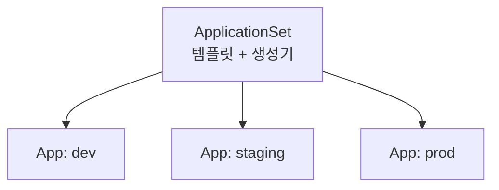

### List Generator

정적 목록으로 Application 생성:

```yaml
apiVersion: argoproj.io/v1alpha1
kind: ApplicationSet
metadata:
  name: my-app-environments
  namespace: argocd
spec:
  generators:
  - list:
      elements:
      - env: dev
        namespace: my-app-dev
        revision: develop
      - env: staging
        namespace: my-app-staging
        revision: main
      - env: prod
        namespace: my-app-prod
        revision: v1.2.3

  template:
    metadata:
      name: 'my-app-{{env}}'
    spec:
      project: default
      source:
        repoURL: https://github.com/myorg/my-app.git
        targetRevision: '{{revision}}'
        path: k8s/overlays/{{env}}
      destination:
        server: https://kubernetes.default.svc
        namespace: '{{namespace}}'
      syncPolicy:
        automated:
          prune: true
```

### Cluster Generator

등록된 모든 클러스터에 배포:

```yaml
apiVersion: argoproj.io/v1alpha1
kind: ApplicationSet
metadata:
  name: cluster-addons
  namespace: argocd
spec:
  generators:
  - clusters:
      selector:
        matchLabels:
          env: production  # 특정 라벨의 클러스터만

  template:
    metadata:
      name: '{{name}}-monitoring'  # 클러스터 이름 사용
    spec:
      project: default
      source:
        repoURL: https://github.com/myorg/cluster-addons.git
        path: monitoring
        targetRevision: main
      destination:
        server: '{{server}}'  # 클러스터 서버 URL
        namespace: monitoring
```

### Git Generator

Git 저장소 구조 기반으로 자동 생성:

```yaml
apiVersion: argoproj.io/v1alpha1
kind: ApplicationSet
metadata:
  name: apps-from-git
  namespace: argocd
spec:
  generators:
  - git:
      repoURL: https://github.com/myorg/apps.git
      revision: main
      directories:
      - path: apps/*  # apps/ 하위 각 디렉토리마다 App 생성

  template:
    metadata:
      name: '{{path.basename}}'  # 디렉토리 이름
    spec:
      project: default
      source:
        repoURL: https://github.com/myorg/apps.git
        targetRevision: main
        path: '{{path}}'
      destination:
        server: https://kubernetes.default.svc
        namespace: '{{path.basename}}'
```

디렉토리 구조:
```
apps/
├── frontend/
│   ├── deployment.yaml
│   └── service.yaml
├── backend/
│   └── ...
└── database/
    └── ...
```

→ `frontend`, `backend`, `database` 3개의 Application 자동 생성

---

## Sync Hooks와 Waves

### Sync Hook이란?

**Sync Hook**은 동기화 과정에서 특정 시점에 실행되는 리소스이다.

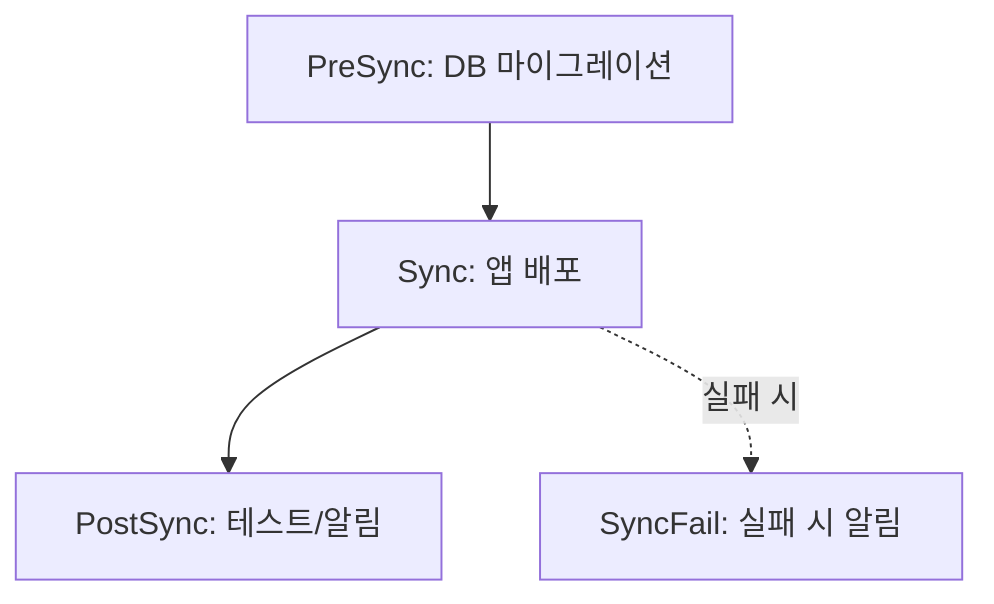

| Hook | 실행 시점 | 용도 |
|------|----------|------|
| **PreSync** | 동기화 전 | DB 마이그레이션, 백업 |
| **Sync** | 동기화 중 | 일반 리소스 |
| **PostSync** | 동기화 후 | 테스트, 알림 |
| **SyncFail** | 동기화 실패 시 | 실패 알림 |
| **Skip** | 건너뜀 | ArgoCD 관리 제외 |

### Hook 예시

```yaml
apiVersion: batch/v1
kind: Job
metadata:
  name: db-migration
  annotations:
    argocd.argoproj.io/hook: PreSync
    argocd.argoproj.io/hook-delete-policy: HookSucceeded
spec:
  template:
    spec:
      containers:
      - name: migrate
        image: myapp:latest
        command: ["./migrate.sh"]
      restartPolicy: Never
  backoffLimit: 1
---
apiVersion: batch/v1
kind: Job
metadata:
  name: slack-notification
  annotations:
    argocd.argoproj.io/hook: PostSync
    argocd.argoproj.io/hook-delete-policy: HookSucceeded
spec:
  template:
    spec:
      containers:
      - name: notify
        image: curlimages/curl
        command:
        - curl
        - -X
        - POST
        - -d
        - '{"text":"Deployment completed!"}'
        - $SLACK_WEBHOOK_URL
      restartPolicy: Never
```

### Hook Delete Policy

| 정책 | 동작 |
|------|------|
| `HookSucceeded` | 성공 시 삭제 |
| `HookFailed` | 실패 시 삭제 |
| `BeforeHookCreation` | 다음 실행 전 삭제 (기본값) |

### Sync Waves

**Wave**는 리소스 배포 순서를 제어한다. 낮은 번호부터 순차 실행.

```yaml
# Wave 0: 먼저 배포
apiVersion: v1
kind: ConfigMap
metadata:
  name: app-config
  annotations:
    argocd.argoproj.io/sync-wave: "0"
---
# Wave 1: ConfigMap 후 배포
apiVersion: apps/v1
kind: Deployment
metadata:
  name: my-app
  annotations:
    argocd.argoproj.io/sync-wave: "1"
---
# Wave 2: Deployment 후 배포
apiVersion: v1
kind: Service
metadata:
  name: my-app
  annotations:
    argocd.argoproj.io/sync-wave: "2"
```

---

## Rollback과 히스토리

### 배포 히스토리 확인

```bash
# 히스토리 목록
argocd app history my-app

# 출력 예시:
# ID  DATE                           REVISION
# 0   2024-01-10 10:00:00 +0000 UTC  abc1234
# 1   2024-01-11 14:30:00 +0000 UTC  def5678
# 2   2024-01-12 09:15:00 +0000 UTC  ghi9012
```

### Rollback 실행

```bash
# 특정 버전으로 롤백
argocd app rollback my-app 1

# 또는 특정 리비전으로
argocd app sync my-app --revision abc1234
```

### Git Revert vs ArgoCD Rollback

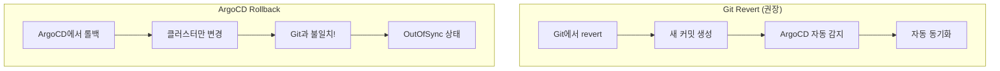

| 방법 | 장점 | 단점 |
|------|------|------|
| **Git Revert** | Git과 클러스터 일치, 히스토리 명확 | 커밋 필요 |
| **ArgoCD Rollback** | 즉시 롤백 가능 | Git과 불일치, 자동 동기화 시 덮어씀 |

---

## 실전 구성 예시

### 디렉토리 구조 (Kustomize)

```
my-app/
├── base/
│   ├── deployment.yaml
│   ├── service.yaml
│   └── kustomization.yaml
└── overlays/
    ├── dev/
    │   ├── kustomization.yaml
    │   └── patch-replicas.yaml
    ├── staging/
    │   ├── kustomization.yaml
    │   └── patch-replicas.yaml
    └── production/
        ├── kustomization.yaml
        ├── patch-replicas.yaml
        └── patch-resources.yaml
```

### App of Apps 패턴

"앱을 배포하는 앱"을 만들어 전체 인프라를 한 번에 관리:

```yaml
# apps/app-of-apps.yaml
apiVersion: argoproj.io/v1alpha1
kind: Application
metadata:
  name: app-of-apps
  namespace: argocd
spec:
  project: default
  source:
    repoURL: https://github.com/myorg/argocd-apps.git
    path: apps
    targetRevision: main
  destination:
    server: https://kubernetes.default.svc
    namespace: argocd
  syncPolicy:
    automated:
      prune: true
```

```yaml
# apps/frontend.yaml
apiVersion: argoproj.io/v1alpha1
kind: Application
metadata:
  name: frontend
spec:
  project: default
  source:
    repoURL: https://github.com/myorg/frontend.git
    path: k8s
    targetRevision: main
  destination:
    server: https://kubernetes.default.svc
    namespace: frontend
```

```yaml
# apps/backend.yaml
apiVersion: argoproj.io/v1alpha1
kind: Application
metadata:
  name: backend
spec:
  # ...
```

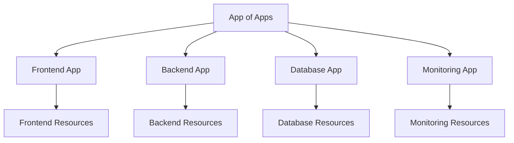

---

## 보안 설정

### RBAC 설정

```yaml
# argocd-rbac-cm ConfigMap
apiVersion: v1
kind: ConfigMap
metadata:
  name: argocd-rbac-cm
  namespace: argocd
data:
  policy.csv: |
    # 역할 정의
    p, role:developer, applications, get, */*, allow
    p, role:developer, applications, sync, */*, allow

    p, role:admin, applications, *, */*, allow
    p, role:admin, clusters, *, *, allow
    p, role:admin, repositories, *, *, allow

    # 그룹 매핑
    g, developers, role:developer
    g, admins, role:admin

  policy.default: role:readonly
```

### SSO 설정 (OIDC)

```yaml
# argocd-cm ConfigMap
apiVersion: v1
kind: ConfigMap
metadata:
  name: argocd-cm
  namespace: argocd
data:
  url: https://argocd.example.com

  oidc.config: |
    name: Okta
    issuer: https://mycompany.okta.com
    clientID: xxxxxx
    clientSecret: $oidc.okta.clientSecret
    requestedScopes: ["openid", "profile", "email", "groups"]
```

### Private Repository 접근

```bash
# HTTPS 인증
argocd repo add https://github.com/myorg/private-repo.git \
  --username git \
  --password $GITHUB_TOKEN

# SSH 키
argocd repo add git@github.com:myorg/private-repo.git \
  --ssh-private-key-path ~/.ssh/id_rsa
```

```yaml
# Secret으로 등록
apiVersion: v1
kind: Secret
metadata:
  name: private-repo
  namespace: argocd
  labels:
    argocd.argoproj.io/secret-type: repository
stringData:
  type: git
  url: https://github.com/myorg/private-repo.git
  username: git
  password: ghp_xxxxxxxxxxxx
```

---

## 트러블슈팅

### 일반적인 문제들

**1. OutOfSync가 계속 발생**

```bash
# 차이점 확인
argocd app diff my-app

# 원인: 컨트롤러가 추가한 필드 (예: status)
# 해결: ignoreDifferences 설정
```

```yaml
spec:
  ignoreDifferences:
  - group: apps
    kind: Deployment
    jsonPointers:
    - /spec/replicas  # HPA가 관리하는 경우
  - group: "*"
    kind: "*"
    managedFieldsManagers:
    - kube-controller-manager
```

**2. Sync 실패**

```bash
# 상세 로그 확인
argocd app get my-app
argocd app logs my-app

# 리소스 상태 확인
argocd app resources my-app
```

**3. Webhook 미동작**

```bash
# ArgoCD가 변경을 감지하도록 수동 새로고침
argocd app get my-app --refresh

# Webhook 설정 확인
kubectl logs -n argocd deployment/argocd-server | grep webhook
```

### 유용한 명령어

```bash
# Application 상태 확인
argocd app get my-app

# 리소스 트리 확인
argocd app resources my-app --tree

# 매니페스트 확인 (적용될 내용)
argocd app manifests my-app

# 실시간 로그
argocd app logs my-app -f

# 강제 새로고침 (캐시 무시)
argocd app get my-app --hard-refresh

# Application 삭제 (리소스 유지)
argocd app delete my-app --cascade=false

# Application 삭제 (리소스도 삭제)
argocd app delete my-app
```

---

## ArgoCD vs 다른 CD 도구

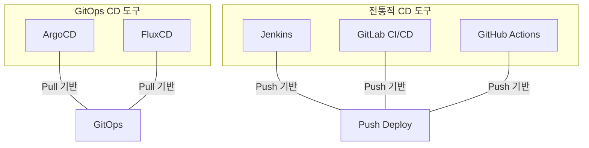

| 도구 | 방식 | 특징 |
|------|------|------|
| **ArgoCD** | Pull (GitOps) | Web UI, 멀티클러스터, SSO |
| **FluxCD** | Pull (GitOps) | 경량, CLI 중심, Helm 통합 |
| **Jenkins** | Push | 범용, 복잡한 파이프라인 |
| **GitHub Actions** | Push | GitHub 통합, 간편 설정 |

---

---

## 참고 자료

### 공식 문서

- [ArgoCD Documentation](https://argo-cd.readthedocs.io/)
- [ArgoCD Getting Started](https://argo-cd.readthedocs.io/en/stable/getting_started/)
- [Application CRD](https://argo-cd.readthedocs.io/en/stable/operator-manual/declarative-setup/)
- [ApplicationSet Controller](https://argo-cd.readthedocs.io/en/stable/user-guide/application-set/)
- [GitOps Engine](https://github.com/argoproj/gitops-engine)

## 마무리

ArgoCD 사용 시 핵심 포인트:

1. **Git이 진실** - 모든 변경은 Git을 통해
2. **자동 동기화** - selfHeal과 prune 활용
3. **Project로 격리** - 멀티테넌트 환경에서 필수
4. **ApplicationSet** - 대규모 환경에서 템플릿 활용
5. **App of Apps** - 전체 인프라를 코드로 관리

## 다음 단계

- [Kubernetes - CRD와 Operator](/kubernetes/kubernetes-25-crd-operator)
- [Kubernetes - CKA 시험 대비](/kubernetes/kubernetes-26-cka-prep)
