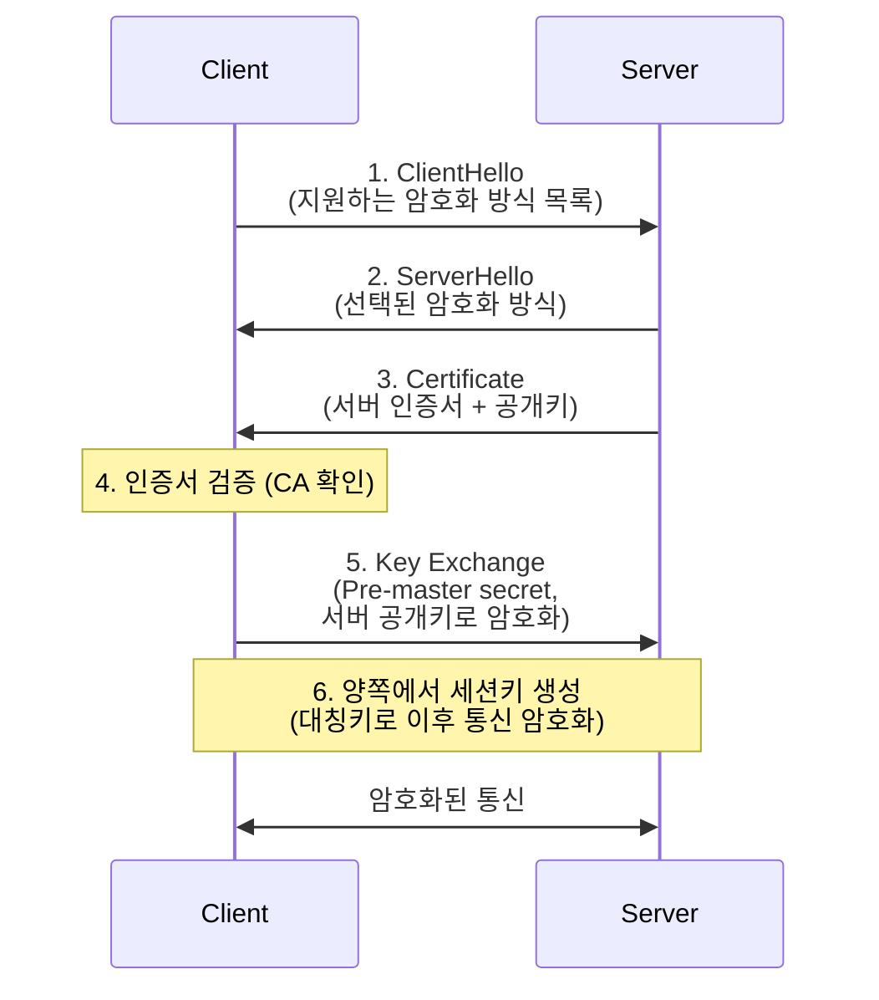

Kubernetes 보안을 이해하려면 **TLS와 PKI(Public Key Infrastructure)**의 원리를 알아야 한다. 이 장에서는 자주 헷갈리는 공개키/개인키 암호화 원리부터 Kubernetes 인증서 구조까지 다룬다.

## 암호화 기초

### 대칭키 vs 비대칭키 암호화

**대칭키 암호화**:
- 암호화와 복호화에 같은 키 사용
- 빠르지만, 키 교환이 어려움
- 예: AES, DES

```
A가 메시지를 B에게:
  메시지 + 공유키 → 암호문 → 공유키 + 암호문 → 메시지

문제: 공유키를 어떻게 안전하게 전달하는가?
```

**비대칭키(공개키) 암호화**:
- 공개키(public key)와 개인키(private key) 쌍 사용
- 공개키로 암호화 → 개인키로만 복호화
- 개인키로 서명 → 공개키로 검증
- 느리지만, 키 교환 문제 해결
- 예: RSA, ECDSA

```
공개키로 암호화하면:     개인키만 복호화 가능
개인키로 서명하면:       공개키로 검증 가능
```

### 자주 헷갈리는 질문: 공개키로 암호화하면 해커도 암호화할 수 있지 않나?

**질문**: "내 공개키로 암호화한 걸 개인키로 복호화한다는데, 해커가 내 공개키를 탈취해서 요청을 보내면 난 해커의 암호화된 내용을 받아들이는 거야?"

**답변**: 공개키 암호화와 디지털 서명은 **다른 용도**이다.

**1. 기밀성(암호화)** - 상대방만 읽을 수 있게:
```
클라이언트 → 서버 (기밀 메시지 전송)

1. 클라이언트가 서버의 공개키로 암호화
2. 서버만 개인키로 복호화 가능

해커가 서버의 공개키로 암호화해서 보낼 수 있다.
→ 그래서 "인증"이 필요하다.
```

**2. 인증(서명)** - 보낸 사람이 진짜인지:
```
서버 → 클라이언트 (인증서 제공)

1. 서버가 개인키로 서명
2. 클라이언트가 공개키로 검증
→ 서버의 개인키를 가진 사람만 서명 가능

해커는 서버의 개인키가 없으므로 서명할 수 없다.
```

**주요 포인트**: TLS에서는 **암호화**와 **인증** 모두 사용한다.

## TLS 핸드셰이크 과정

TLS는 **인증 → 키 교환 → 암호화 통신** 순서로 동작한다.



### 각 단계 상세 설명

**1-2. Hello 교환**
- 지원하는 TLS 버전, 암호화 알고리즘 협상

**3. 서버 인증서 전송**
- 서버의 공개키 + 서버 정보 + CA 서명

**4. 인증서 검증**
- CA의 공개키로 서버 인증서의 서명 검증
- 인증서 체인 확인 (Root CA → Intermediate CA → Server Cert)
- 도메인 일치 확인

**5. 키 교환**
- 클라이언트가 pre-master secret 생성
- 서버의 **공개키로 암호화**하여 전송
- 서버만 **개인키로 복호화** 가능

**6. 세션키 생성**
- pre-master secret으로 양쪽에서 같은 세션키(대칭키) 생성
- 이후 통신은 빠른 대칭키 암호화 사용

## TLS vs SSH

### SSH 인증 방식

**비밀번호 인증**:
```bash
ssh user@server
# 비밀번호 입력
```

**공개키 인증**:
```bash
# 1. 키 쌍 생성 (클라이언트)
ssh-keygen -t rsa -b 4096

# 2. 공개키를 서버에 등록
ssh-copy-id user@server
# ~/.ssh/authorized_keys에 공개키 추가

# 3. 접속 (개인키로 서명하여 인증)
ssh user@server
```

**SSH 공개키 인증 과정**:
```
1. 클라이언트: 서버에 연결 요청
2. 서버: 랜덤 챌린지 전송
3. 클라이언트: 개인키로 챌린지에 서명
4. 서버: authorized_keys의 공개키로 서명 검증
5. 검증 성공 → 인증 완료
```

### TLS와 SSH 비교

| 특성 | TLS | SSH |
|------|-----|-----|
| 주 용도 | 웹 통신 (HTTPS) | 원격 접속 |
| 인증 대상 | 주로 서버 (클라이언트 선택) | 주로 클라이언트 |
| 인증서 | CA가 발급 | 자체 키 쌍 |
| 포트 | 443 (HTTPS) | 22 |

## PKI (Public Key Infrastructure)

### 인증서 체인

```
┌─────────────────────────────────────────────────────┐
│  Root CA (신뢰 앵커)                                │
│  - 자체 서명                                        │
│  - OS/브라우저에 미리 설치                          │
└────────────────────┬────────────────────────────────┘
                     │ 서명
┌────────────────────▼────────────────────────────────┐
│  Intermediate CA                                     │
│  - Root CA가 서명                                    │
│  - 서버 인증서 발급                                  │
└────────────────────┬────────────────────────────────┘
                     │ 서명
┌────────────────────▼────────────────────────────────┐
│  Server Certificate                                  │
│  - Intermediate CA가 서명                            │
│  - 서버 공개키 포함                                  │
└─────────────────────────────────────────────────────┘
```

### 인증서 검증 과정

```
1. 서버 인증서의 서명을 Intermediate CA 공개키로 검증
2. Intermediate CA 인증서의 서명을 Root CA 공개키로 검증
3. Root CA가 신뢰할 수 있는 목록에 있는지 확인
4. 모든 검증 통과 → 서버 신뢰
```

### 인증서 내용

```bash
openssl x509 -in server.crt -noout -text

# 주요 필드:
# Subject: CN=example.com (누구의 인증서인가)
# Issuer: CN=Intermediate CA (누가 발급했는가)
# Validity: Not Before, Not After (유효 기간)
# Public Key: 서버의 공개키
# Signature: 발급자의 서명
# X509v3 Subject Alternative Name: DNS:example.com, DNS:*.example.com
```

## Kubernetes PKI 구조

> **원문 ([kubernetes.io - PKI certificates and requirements](https://kubernetes.io/docs/setup/best-practices/certificates/)):**
> Kubernetes requires PKI certificates for authentication over TLS. If you install Kubernetes with kubeadm, the certificates that your cluster requires are automatically generated.

**번역:** Kubernetes는 TLS를 통한 인증을 위해 PKI 인증서가 필요하다. kubeadm으로 Kubernetes를 설치하면 클러스터에 필요한 인증서가 자동으로 생성된다.

### Kubernetes 인증서 종류

```
/etc/kubernetes/pki/
├── ca.crt, ca.key              # 클러스터 CA
├── apiserver.crt, apiserver.key # API Server
├── apiserver-kubelet-client.*   # API Server → kubelet 통신
├── front-proxy-ca.*             # Aggregation layer
├── front-proxy-client.*
├── sa.key, sa.pub               # ServiceAccount 토큰 서명
└── etcd/
    ├── ca.crt, ca.key          # etcd CA
    ├── server.crt, server.key   # etcd 서버
    ├── peer.crt, peer.key       # etcd 노드 간 통신
    └── healthcheck-client.*     # etcd 헬스체크
```

### 인증서별 용도

| 인증서 | 용도 |
|--------|------|
| ca.crt/key | 클러스터의 루트 CA |
| apiserver.crt | API Server의 서버 인증서 |
| apiserver-kubelet-client.crt | API Server가 kubelet에 접근할 때 |
| kubelet.crt | kubelet의 서버/클라이언트 인증서 |
| admin.crt | cluster-admin 사용자 |
| scheduler.crt | kube-scheduler |
| controller-manager.crt | kube-controller-manager |

### API Server TLS 설정

```yaml
# /etc/kubernetes/manifests/kube-apiserver.yaml
spec:
  containers:
  - command:
    - kube-apiserver
    - --tls-cert-file=/etc/kubernetes/pki/apiserver.crt
    - --tls-private-key-file=/etc/kubernetes/pki/apiserver.key
    - --client-ca-file=/etc/kubernetes/pki/ca.crt
    - --kubelet-client-certificate=/etc/kubernetes/pki/apiserver-kubelet-client.crt
    - --kubelet-client-key=/etc/kubernetes/pki/apiserver-kubelet-client.key
    - --etcd-cafile=/etc/kubernetes/pki/etcd/ca.crt
    - --etcd-certfile=/etc/kubernetes/pki/apiserver-etcd-client.crt
    - --etcd-keyfile=/etc/kubernetes/pki/apiserver-etcd-client.key
```

### 인증서 생성 (kubeadm)

```bash
# 모든 인증서 생성
kubeadm init phase certs all

# 개별 인증서 생성
kubeadm init phase certs apiserver
kubeadm init phase certs apiserver-kubelet-client

# 인증서 만료 확인
kubeadm certs check-expiration

# 인증서 갱신
kubeadm certs renew all
```

### 수동 인증서 생성

```bash
# 1. 개인키 생성
openssl genrsa -out server.key 2048

# 2. CSR 생성
openssl req -new -key server.key -out server.csr \
  -subj "/CN=kube-apiserver/O=system:masters"

# 3. 인증서 서명 (CA로)
openssl x509 -req -in server.csr \
  -CA ca.crt -CAkey ca.key \
  -CAcreateserial \
  -out server.crt \
  -days 365
```

## Kubernetes 인증 방식

> **원문 ([kubernetes.io - Authenticating](https://kubernetes.io/docs/reference/access-authn-authz/authentication/)):**
> Kubernetes uses client certificates, bearer tokens, or an authenticating proxy to authenticate API requests through authentication plugins.

**번역:** Kubernetes는 인증 플러그인을 통해 API 요청을 인증하기 위해 클라이언트 인증서, 베어러 토큰 또는 인증 프록시를 사용한다.

### 인증서 기반 (X.509)

```yaml
# kubeconfig
apiVersion: v1
kind: Config
clusters:
- cluster:
    certificate-authority-data: <ca.crt base64>
    server: https://api-server:6443
  name: kubernetes
users:
- name: admin
  user:
    client-certificate-data: <client.crt base64>
    client-key-data: <client.key base64>
```

### ServiceAccount 토큰

```bash
# SA 토큰은 JWT 형식
# sa.key로 서명, sa.pub로 검증
kubectl create token my-sa

# Pod에 자동 마운트
/var/run/secrets/kubernetes.io/serviceaccount/
├── token      # JWT 토큰
├── ca.crt     # 클러스터 CA
└── namespace  # Pod의 namespace
```

## 트러블슈팅

### 인증서 문제 진단

```bash
# 인증서 내용 확인
openssl x509 -in /etc/kubernetes/pki/apiserver.crt -noout -text

# 만료일 확인
openssl x509 -in /etc/kubernetes/pki/apiserver.crt -noout -enddate

# 인증서 체인 검증
openssl verify -CAfile ca.crt server.crt

# TLS 연결 테스트
openssl s_client -connect api-server:6443 -CAfile ca.crt

# kubeadm 인증서 확인
kubeadm certs check-expiration
```

### 인증서 만료 문제

```bash
# 에러: x509: certificate has expired or is not yet valid

# 해결: 인증서 갱신
kubeadm certs renew all

# kubelet 재시작
systemctl restart kubelet

# Control Plane 컴포넌트 재시작 (static pod)
# /etc/kubernetes/manifests의 파일 수정하면 자동 재시작
```

## 기술 면접 대비

### 자주 묻는 질문

**Q: 공개키로 암호화하면 누구나 암호화할 수 있는 건가요?**

A: 맞다. 누구나 공개키로 암호화할 수 있다. 그래서 TLS에서는 **암호화**와 **인증**을 함께 사용한다. 서버는 인증서를 통해 자신의 신원을 증명하고(CA 서명), 클라이언트는 인증서를 검증한 후에만 해당 공개키를 신뢰한다. 또한 mTLS(상호 TLS)에서는 클라이언트도 인증서로 자신을 증명한다.

**Q: 개인키로 서명하면 누구나 복호화할 수 있는데 보안상 괜찮은가?**

A: 서명의 목적은 기밀성이 아니라 **무결성과 인증**이다. 개인키로 서명한 것을 공개키로 검증할 수 있다는 것은, 해당 서명이 개인키 소유자만 만들 수 있다는 것을 의미한다. 따라서 서명은 "이 메시지가 변조되지 않았고, 특정 발신자가 보냈다"를 증명한다.

**Q: TLS에서 대칭키와 비대칭키를 모두 사용하는 이유는?**

A: 비대칭키 암호화는 안전하지만 느리다. 대칭키 암호화는 빠르지만 키 교환이 어렵다. TLS는 비대칭키로 안전하게 대칭키를 교환한 후, 이후 통신은 빠른 대칭키로 암호화한다. 이를 "하이브리드 암호화"라고 한다.

**Q: Kubernetes에서 인증서가 만료되면 어떻게 되는가?**

A: API Server 인증서가 만료되면 kubectl 명령이 동작하지 않는다. kubelet 인증서가 만료되면 노드가 NotReady 상태가 된다. kubeadm certs renew 명령으로 갱신할 수 있다. kubeadm으로 생성한 인증서는 기본 1년 유효하다.

**Q: CA(Certificate Authority)의 역할은?**

A: CA는 인증서를 발급하고 서명하는 신뢰된 기관이다. 클라이언트는 CA를 신뢰하고, CA가 서명한 인증서도 신뢰한다. 이를 통해 서버의 신원을 검증할 수 있다. Kubernetes는 자체 CA를 사용하여 클러스터 내 모든 인증서를 발급한다.

---

## 참고 자료

### 공식 문서

- [PKI certificates and requirements](https://kubernetes.io/docs/setup/best-practices/certificates/)
- [Certificate Management with kubeadm](https://kubernetes.io/docs/tasks/administer-cluster/kubeadm/kubeadm-certs/)
- [Manage TLS Certificates in a Cluster](https://kubernetes.io/docs/tasks/tls/managing-tls-in-a-cluster/)
- [Authenticating](https://kubernetes.io/docs/reference/access-authn-authz/authentication/)

## 다음 단계

- [Kubernetes 생태계 - Service Mesh와 Istio](/kubernetes/kubernetes-ecosystem-istio)
- [Kubernetes 생태계 - CNI 플러그인 비교](/kubernetes/kubernetes-ecosystem-cni)
