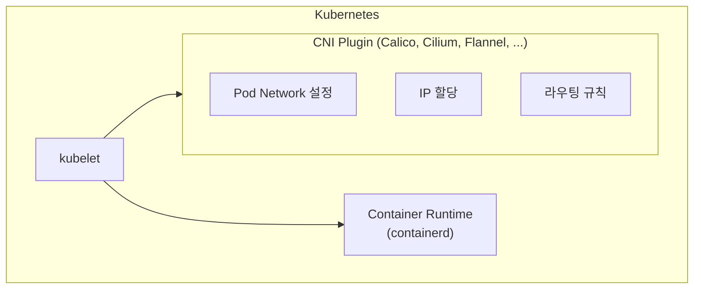
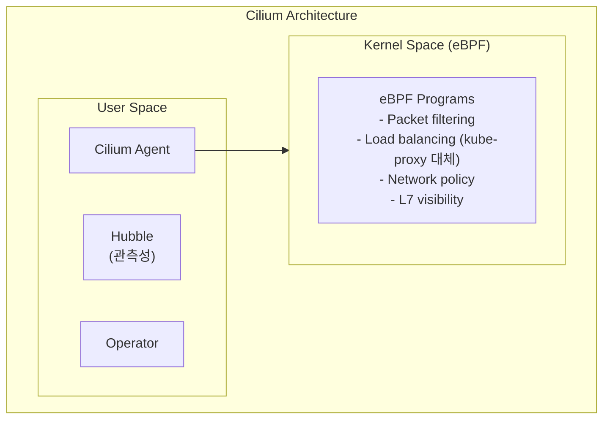
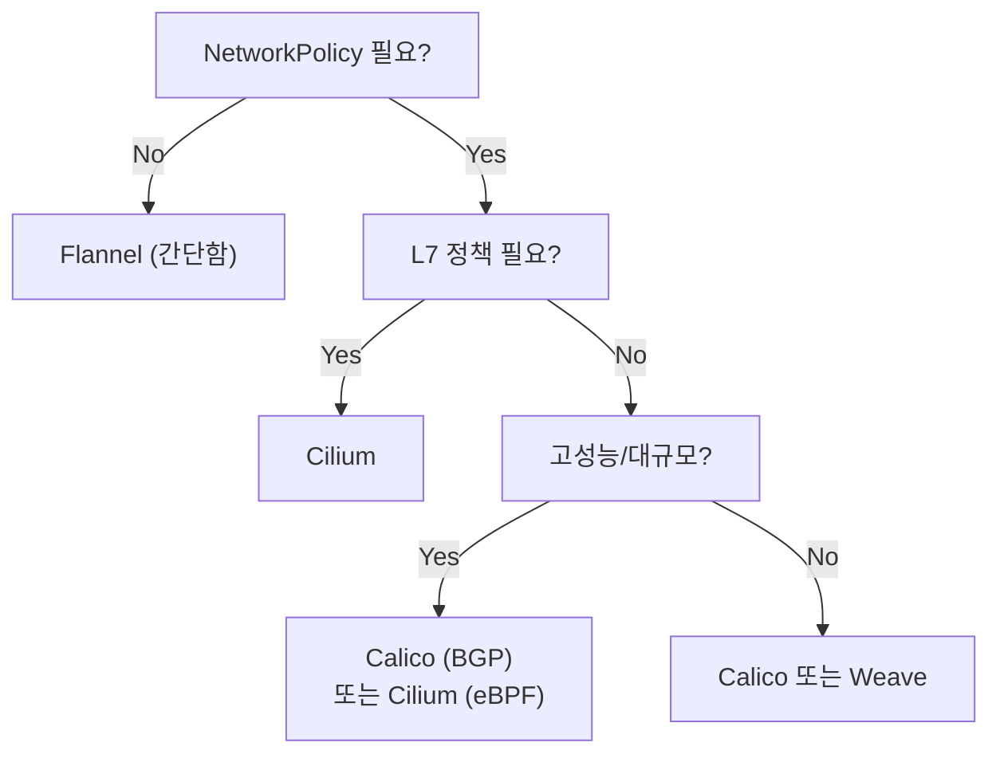

Kubernetes 네트워킹은 **CNI(Container Network Interface)** 플러그인이 담당한다. 클러스터의 요구사항에 따라 적절한 CNI를 선택하는 것이 중요하다. 이 장에서는 주요 CNI 플러그인의 특징과 선택 기준을 다룬다.

## CNI 개요

### CNI란?

> **원문 ([kubernetes.io - Network Plugins](https://kubernetes.io/docs/concepts/extend-kubernetes/compute-storage-net/network-plugins/)):**
> Kubernetes uses the Container Network Interface (CNI) to interact with networking providers like Calico, Cilium, Contiv, Flannel, and Weave Net to implement networking. A CNI plugin is required to implement the Kubernetes network model. You must use a CNI plugin that is compatible with the v0.4.0 or later releases of the CNI specification.

**번역:** Kubernetes는 Calico, Cilium, Contiv, Flannel, Weave Net과 같은 네트워킹 제공자와 상호작용하기 위해 CNI(Container Network Interface)를 사용한다. Kubernetes 네트워크 모델을 구현하려면 CNI 플러그인이 필요하다. CNI 사양의 v0.4.0 이상 릴리스와 호환되는 CNI 플러그인을 사용해야 한다.

**설명:** CNI는 컨테이너 네트워킹을 위한 **표준 인터페이스**이다. Kubernetes는 CNI를 통해 다양한 네트워킹 솔루션(Flannel, Calico, Cilium 등)을 플러그인 방식으로 지원한다. 각 CNI 플러그인은 Pod에 IP를 할당하고, Pod 간 네트워크 연결을 구성하며, 필요에 따라 NetworkPolicy를 구현한다.



**CNI의 역할**:
1. Pod에 IP 주소 할당
2. Pod 간 네트워크 연결
3. Pod-to-Service 통신
4. 외부 네트워크 연결
5. NetworkPolicy 구현 (선택적)

### Kubernetes 네트워크 모델

Kubernetes가 요구하는 네트워크 규칙:
- 모든 Pod는 NAT 없이 다른 모든 Pod와 통신 가능
- 모든 Node는 NAT 없이 모든 Pod와 통신 가능
- Pod가 보는 자신의 IP와 다른 Pod가 보는 IP가 동일

## 주요 CNI 플러그인 비교

### 비교 표

| 특성 | Flannel | Calico | Cilium | Weave Net |
|------|---------|--------|--------|-----------|
| 복잡도 | 낮음 | 중간 | 높음 | 중간 |
| NetworkPolicy | 미지원 | 완전 지원 | 완전 지원 | 지원 |
| 성능 | 좋음 | 매우 좋음 | 매우 좋음 | 좋음 |
| 암호화 | WireGuard | WireGuard/IPsec | WireGuard/IPsec | 지원 |
| eBPF | 미지원 | 지원 | 핵심 기능 | 미지원 |
| 모니터링 | 기본 | Prometheus | Hubble | 기본 |
| 학습 곡선 | 낮음 | 중간 | 높음 | 중간 |

## Flannel

### 개요

Flannel은 **가장 단순한** CNI 플러그인이다.

**특징**:
- 설치와 운영이 간단
- Layer 3 네트워크 (IP 기반)
- VXLAN 또는 host-gw 백엔드
- **NetworkPolicy 미지원**

**적합한 환경**:
- 학습용, 개발 환경
- 단순한 네트워크 요구사항
- 빠른 클러스터 구성

### 설치

```bash
kubectl apply -f https://github.com/flannel-io/flannel/releases/latest/download/kube-flannel.yml
```

### 설정

```yaml
# ConfigMap
net-conf.json: |
  {
    "Network": "10.244.0.0/16",
    "Backend": {
      "Type": "vxlan"   # 또는 "host-gw"
    }
  }
```

**백엔드 유형**:
- `vxlan`: 오버레이 네트워크 (기본값, 범용)
- `host-gw`: 직접 라우팅 (더 빠름, L2 연결 필요)

### 한계

```
Flannel의 한계:
- NetworkPolicy 미지원 → 보안 정책 적용 불가
- 고급 기능 부재 (BGP, IP-in-IP 등)
- 대규모 클러스터에서 성능 저하 가능

해결책: Flannel + Calico 조합 (Canal)
```

## Calico

### 개요

Calico는 **가장 널리 사용되는** 엔터프라이즈급 CNI이다.

**특징**:
- NetworkPolicy 완전 지원
- BGP 기반 라우팅 (고성능)
- eBPF 데이터플레인 지원
- WireGuard/IPsec 암호화
- Tigera에서 상용 지원

**적합한 환경**:
- 프로덕션 환경
- 보안이 중요한 환경
- 하이브리드/멀티 클라우드

### 설치

```bash
# Operator 설치
kubectl create -f https://raw.githubusercontent.com/projectcalico/calico/v3.27.0/manifests/tigera-operator.yaml

# Calico 설치
kubectl create -f https://raw.githubusercontent.com/projectcalico/calico/v3.27.0/manifests/custom-resources.yaml
```

### 데이터플레인 옵션

**1. iptables (기본)**
```yaml
# Installation 리소스
spec:
  calicoNetwork:
    linuxDataplane: Iptables
```

**2. eBPF (고성능)**
```yaml
spec:
  calicoNetwork:
    linuxDataplane: BPF
```

**3. VPP (DPDK 기반, 초고성능)**
```yaml
spec:
  calicoNetwork:
    linuxDataplane: VPP
```

### BGP 설정

```yaml
apiVersion: projectcalico.org/v3
kind: BGPConfiguration
metadata:
  name: default
spec:
  logSeverityScreen: Info
  nodeToNodeMeshEnabled: true
  asNumber: 64512
---
apiVersion: projectcalico.org/v3
kind: BGPPeer
metadata:
  name: rack1-tor
spec:
  peerIP: 192.168.1.1
  asNumber: 64513
```

### IP Pool 설정

```yaml
apiVersion: projectcalico.org/v3
kind: IPPool
metadata:
  name: default-pool
spec:
  cidr: 10.244.0.0/16
  encapsulation: VXLAN   # VXLAN, IPIP, None
  natOutgoing: true
  nodeSelector: all()
```

### Calico NetworkPolicy

Calico는 Kubernetes NetworkPolicy를 완전 지원하며, 추가로 **GlobalNetworkPolicy**도 제공한다.

```yaml
apiVersion: projectcalico.org/v3
kind: GlobalNetworkPolicy
metadata:
  name: deny-all-egress
spec:
  selector: app == 'database'
  types:
  - Egress
  egress:
  - action: Deny
```

### calicoctl

```bash
# 설치
curl -L https://github.com/projectcalico/calico/releases/download/v3.27.0/calicoctl-linux-amd64 -o calicoctl
chmod +x calicoctl

# 노드 상태 확인
calicoctl node status

# IP Pool 조회
calicoctl get ippool -o wide

# BGP Peer 확인
calicoctl get bgppeer
```

## Cilium

### 개요

Cilium은 **eBPF 기반**의 차세대 CNI이다.

**특징**:
- eBPF를 핵심으로 사용
- L3/L4/L7 NetworkPolicy
- 서비스 메시 기능 내장 (Envoy 없이)
- Hubble로 네트워크 관측성
- 클러스터 메시 (멀티 클러스터)

**적합한 환경**:
- 고성능 요구
- L7 정책 필요 (HTTP, gRPC)
- 마이크로서비스 관측성
- 서비스 메시 대안

### 설치

```bash
# Cilium CLI 설치
curl -L --remote-name-all https://github.com/cilium/cilium-cli/releases/latest/download/cilium-linux-amd64.tar.gz
tar xzvf cilium-linux-amd64.tar.gz
sudo mv cilium /usr/local/bin

# Cilium 설치
cilium install

# 상태 확인
cilium status
```

### eBPF 기반 아키텍처



### L7 NetworkPolicy

Cilium은 HTTP, gRPC, Kafka 등 **L7 정책**을 지원한다.

```yaml
apiVersion: cilium.io/v2
kind: CiliumNetworkPolicy
metadata:
  name: l7-rule
spec:
  endpointSelector:
    matchLabels:
      app: api
  ingress:
  - fromEndpoints:
    - matchLabels:
        app: frontend
    toPorts:
    - ports:
      - port: "80"
        protocol: TCP
      rules:
        http:
        - method: "GET"
          path: "/api/v1/.*"
        - method: "POST"
          path: "/api/v1/users"
```

### Hubble (네트워크 관측성)

```bash
# Hubble 활성화
cilium hubble enable

# Hubble CLI
hubble observe --pod myapp
hubble observe --verdict DROPPED

# Hubble UI
cilium hubble ui
```

### kube-proxy 대체

Cilium은 eBPF로 kube-proxy를 완전히 대체할 수 있다.

```bash
# kube-proxy 없이 설치
cilium install --set kubeProxyReplacement=true

# 확인
cilium status | grep KubeProxyReplacement
```

**장점**:
- iptables 규칙 없음
- 더 빠른 서비스 라우팅
- 연결 추적 성능 향상

## Weave Net

### 개요

Weave Net은 **설치가 간편한** 범용 CNI이다.

**특징**:
- 간단한 설치 (단일 DaemonSet)
- NetworkPolicy 지원
- 암호화 지원
- 멀티캐스트 지원

**적합한 환경**:
- 빠른 시작이 필요한 환경
- 중소규모 클러스터

### 설치

```bash
kubectl apply -f https://github.com/weaveworks/weave/releases/download/v2.8.1/weave-daemonset-k8s.yaml
```

### 암호화 설정

```bash
# 암호화 활성화
kubectl create secret -n kube-system generic weave-passwd \
  --from-literal=weave-passwd=$(openssl rand -base64 32)
```

## CNI 선택 가이드

### 선택 기준



### 환경별 추천

**개발/테스트 환경**:
- Flannel: 가장 간단, 빠른 설정
- Weave: NetworkPolicy가 필요하면

**프로덕션 (일반)**:
- Calico: 안정성, 넓은 지원
- Cilium: 현대적 기능, eBPF

**고성능/대규모**:
- Calico (BGP + eBPF)
- Cilium (eBPF + kube-proxy 대체)

**클라우드 환경**:
- 클라우드 제공 CNI (AWS VPC CNI, Azure CNI, GKE)
- 또는 Calico/Cilium

## 트러블슈팅

### CNI 문제 진단

```bash
# CNI Pod 상태 확인
kubectl get pods -n kube-system | grep -E 'calico|cilium|flannel|weave'

# CNI 로그
kubectl logs -n kube-system <cni-pod>

# CNI 설정 확인 (노드에서)
ls /etc/cni/net.d/
cat /etc/cni/net.d/*.conflist

# Pod 네트워크 확인
kubectl exec <pod> -- ip addr
kubectl exec <pod> -- ip route
```

### 일반적인 문제

**Pod IP가 할당되지 않음**:
```bash
# CNI 플러그인 상태 확인
kubectl get pods -n kube-system | grep cni

# IP Pool 확인 (Calico)
calicoctl get ippool -o wide
```

**Pod 간 통신 불가**:
```bash
# 라우팅 테이블 확인
kubectl exec <pod> -- ip route

# 방화벽 규칙 확인 (노드에서)
iptables -L -n -v
```

## 기술 면접 대비

### 자주 묻는 질문

**Q: Flannel이 NetworkPolicy를 지원하지 않는데 어떻게 해결하는가?**

A: Flannel과 Calico를 함께 사용하는 Canal을 사용하거나, Flannel 대신 NetworkPolicy를 지원하는 Calico나 Cilium으로 교체한다. Flannel은 네트워킹만 담당하고 Calico가 NetworkPolicy를 담당하는 조합이 가능하다.

**Q: Calico와 Cilium의 주요 차이점은?**

A: Calico는 iptables 또는 eBPF를 선택적으로 사용하고, BGP 기반 라우팅에 강점이 있다. Cilium은 eBPF를 핵심으로 사용하여 L7 가시성과 정책을 제공하고, kube-proxy를 완전히 대체할 수 있다. Cilium은 Hubble로 네트워크 관측성이 뛰어나고, Calico는 엔터프라이즈 지원(Tigera)이 있다.

**Q: eBPF 기반 CNI의 장점은?**

A: eBPF는 커널 내에서 직접 패킷을 처리하여 iptables보다 빠르다. 동적으로 프로그램을 로드하여 유연성이 높고, L7 수준의 관측성과 정책이 가능하다. kube-proxy를 대체하여 서비스 라우팅 성능을 향상시킬 수 있다.

**Q: 대규모 클러스터에서 CNI 선택 시 고려사항은?**

A: IP 주소 관리(IPAM)의 효율성, 라우팅 테이블 크기, 제어 플레인 부하를 고려해야 한다. BGP 기반 라우팅(Calico)은 대규모에서 효율적이고, eBPF(Cilium)는 iptables 규칙 폭증 문제를 해결한다. 또한 Pod CIDR 계획과 IP 고갈 가능성도 고려해야 한다.

## 다음 단계

- [Kubernetes 생태계 - Service Mesh와 Istio](/kubernetes/kubernetes-ecosystem-02-istio)
- [Kubernetes 생태계 - OPA/Gatekeeper](/kubernetes/kubernetes-ecosystem-03-opa)
