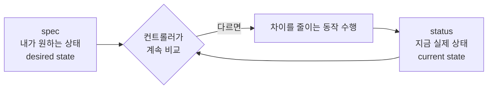
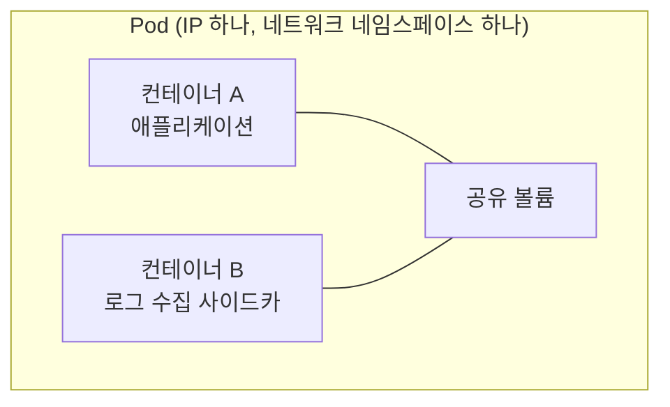
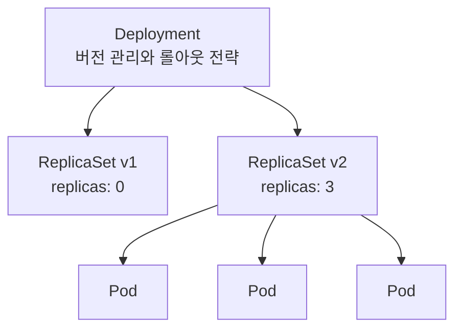
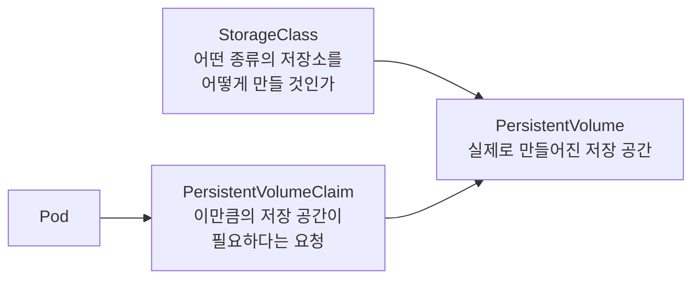
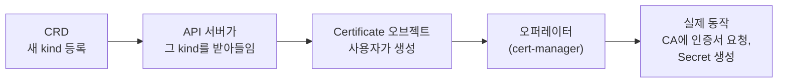
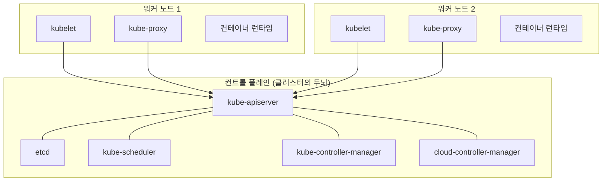
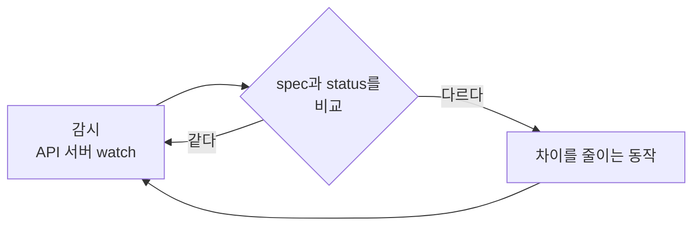
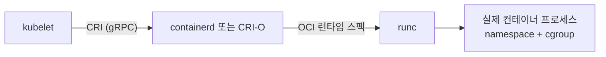
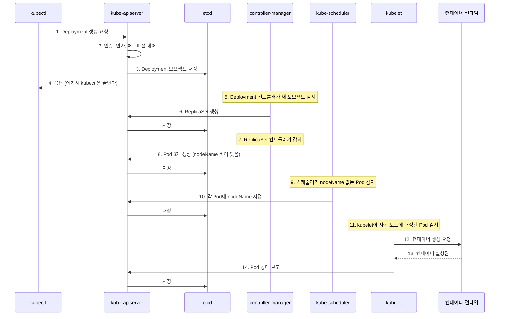
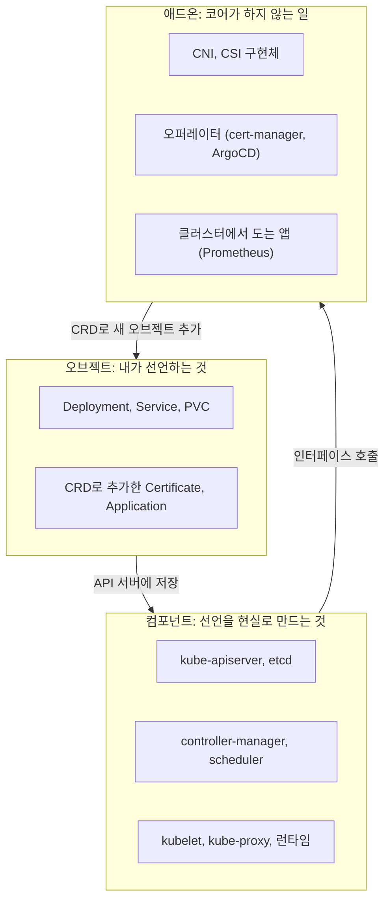

---

title: "쿠버네티스에서 오브젝트, 컴포넌트, 애드온은 각각 무엇인가"
date: 2026-01-19
categories: [Kubernetes]
tags: [Kubernetes, Object, Component, Addon, ControlPlane, Controller, CRD, Operator]
layout: post
toc: true
math: true
mermaid: true

---

## 참고자료

- [Kubernetes - Cluster Architecture](https://kubernetes.io/docs/concepts/overview/components/)
- [Kubernetes - Objects In Kubernetes](https://kubernetes.io/docs/concepts/overview/working-with-objects/)
- [Kubernetes - Controllers](https://kubernetes.io/docs/concepts/architecture/controller/)
- [Kubernetes - Pods](https://kubernetes.io/docs/concepts/workloads/pods/)
- [Kubernetes - Deployment](https://kubernetes.io/docs/concepts/workloads/controllers/deployment/)
- [Kubernetes - Service](https://kubernetes.io/docs/concepts/services-networking/service/)
- [Kubernetes - Container Runtime Interface](https://kubernetes.io/docs/concepts/architecture/cri/)
- [Kubernetes - Custom Resources](https://kubernetes.io/docs/concepts/extend-kubernetes/api-extension/custom-resources/)
- [Kubernetes - Addons](https://kubernetes.io/docs/concepts/cluster-administration/addons/)

---

## 배경

쿠버네티스를 쓰기 시작하면 이름이 한꺼번에 쏟아진다. Pod, Deployment, Service, kubelet, kube-proxy, CNI, CSI, CRD, Operator, Helm, ArgoCD.

한동안 이것들을 그냥 "쿠버네티스 관련 용어"로 뭉뚱그려 외웠다. 그러다 보니 설명이 안 되는 것들이 남았다.

- Deployment를 지웠는데 왜 Pod도 같이 사라지는가? 누가 지운 건가?
- `kubectl apply`를 했을 때 실제로 무슨 일이 일어나는가?
- CNI는 쿠버네티스의 일부인가 아닌가? 왜 클러스터를 만들면 따로 설치해야 하는가?
- Prometheus나 ArgoCD는 쿠버네티스 기능인가, 그냥 클러스터에서 도는 앱인가?

정리하고 나서 알게 된 것은, 이 이름들이 **세 개의 다른 층에 속한다**는 것이었다. 그 층을 나누고 나니 나머지가 따라 정리됐다.

- **오브젝트(Object)**: 내가 "이렇게 되어 있으면 좋겠다"고 선언하는 대상
- **컴포넌트(Component)**: 그 선언을 실제 상태로 만드는 프로그램
- **애드온(Add-on)**: 쿠버네티스가 스스로 하지 않고 남에게 맡긴 일을 채워주는 것

순서대로 하나씩 풀어본다.

---

## 1. 오브젝트: 내가 선언하는 것

### 1.1 오브젝트가 무엇인가

쿠버네티스에서 오브젝트는 **클러스터의 상태를 나타내는 영속적인 기록**이다. [공식 문서](https://kubernetes.io/docs/concepts/overview/working-with-objects/)는 오브젝트를 "의도의 기록(record of intent)"이라고 표현한다.

이 표현이 핵심이다. 오브젝트를 만든다는 것은 **명령이 아니라 선언**이다.

"Pod를 3개 띄워라"라고 명령하는 것이 아니라, "이 클러스터에는 Pod가 3개 있는 상태여야 한다"라고 적어두는 것이다. 명령은 한 번 실행되고 끝나지만 선언은 남는다. 그래서 Pod가 죽으면 선언과 현실이 어긋나고, 누군가 그것을 다시 맞춘다. 그 "누군가"가 2장의 컨트롤러다.

### 1.2 모든 오브젝트가 갖는 네 부분

오브젝트를 YAML로 쓰면 반드시 나오는 네 가지가 있다.

```yaml
apiVersion: apps/v1     # 1. 이 오브젝트를 정의한 API 버전
kind: Deployment        # 2. 오브젝트의 종류
metadata:               # 3. 이름표
  name: my-app
  namespace: default
  labels:
    app: my-app
spec:                   # 4. 내가 원하는 상태
  replicas: 3
  ...
```

용어를 하나씩 짚는다.

**`apiVersion`.** 이 오브젝트의 정의가 어느 API 그룹의 몇 번째 버전에 속하는지를 적는다. `apps/v1`은 "apps 그룹의 v1 버전"이라는 뜻이다. `v1`처럼 그룹 없이 쓰는 것들(Pod, Service, ConfigMap)은 가장 먼저 만들어진 core 그룹에 속한다. 그룹을 나눈 이유는 기능이 늘어날 때 서로 독립적으로 버전을 올리기 위해서다.

**`kind`.** 오브젝트 종류다. Pod, Deployment, Service처럼 대문자로 시작한다.

**`metadata`.** 이름, 네임스페이스, 라벨, 어노테이션이 들어간다. `labels`는 나중에 이 오브젝트를 골라내는 데 쓰고, `annotations`는 사람이나 도구가 참고할 정보를 붙이는 데 쓴다. 둘의 차이는 **라벨로는 검색이 되고 어노테이션으로는 안 된다**는 것이다.

**`spec`.** 내가 원하는 상태다. `kind`마다 안에 들어갈 내용이 다르다.

그리고 만들고 나면 하나가 더 생긴다.

**`status`.** 지금 실제로 어떤 상태인지를 시스템이 채워 넣는다. 내가 쓰는 것이 아니다. `spec`과 `status`의 차이가 쿠버네티스 동작 방식 전체를 설명한다.



### 1.3 워크로드 오브젝트: Pod에서 시작한다

#### Pod

배포할 수 있는 가장 작은 단위다. 컨테이너 하나가 아니라 **컨테이너 하나 이상의 묶음**이다.

왜 컨테이너가 아니라 묶음이 최소 단위인가. 같은 Pod 안의 컨테이너들은 **네트워크 네임스페이스와 볼륨을 공유**하기 때문이다. 서로를 `localhost`로 부를 수 있고 같은 IP를 쓴다.



이 구조가 필요한 대표적인 경우가 사이드카 패턴이다. 애플리케이션이 파일로 로그를 쓰고, 옆 컨테이너가 그 파일을 읽어 중앙으로 보낸다. 볼륨을 공유하니까 가능하다.

Pod에 대해 반드시 알아야 할 성질이 하나 더 있다. **Pod는 고쳐지지 않는다.** 죽으면 새로 만들어진다. 새로 만들어진 Pod는 IP도 다르고 이름도 다르다. 그래서 Pod를 직접 만들어 쓰는 일은 거의 없다.

#### ReplicaSet

Pod를 정해진 개수만큼 유지하는 오브젝트다. 하나가 죽으면 새로 만든다.

그런데 이것도 직접 쓰지 않는다. 이미지를 새 버전으로 바꾸려면 어떻게 해야 하는지가 문제이기 때문이다. ReplicaSet 하나로는 "기존 것을 조금씩 줄이면서 새 것을 조금씩 늘리는" 동작을 표현할 수 없다.

#### Deployment

ReplicaSet을 관리하는 오브젝트다. 실제로 쓰는 것은 대부분 이것이다.



배포할 때 일어나는 일이 이 그림에 있다. Deployment는 새 ReplicaSet을 만들고, 새 것의 개수를 올리면서 옛 것의 개수를 내린다. 옛 ReplicaSet은 개수 0으로 남겨둔다. 롤백할 때 다시 올리기 위해서다.

여기서 처음 질문 하나가 풀린다. **Deployment를 지우면 왜 Pod도 사라지는가.**

Pod의 `metadata.ownerReferences`에 자기를 만든 ReplicaSet이 적혀 있고, ReplicaSet에는 Deployment가 적혀 있다. 이 사슬을 소유 관계라고 하고, 부모가 지워지면 자식도 지우는 것을 가비지 컬렉션이라고 부른다. 이 일을 하는 것이 컨트롤러 매니저 안의 가비지 컬렉터다.

```bash
# 소유 관계를 직접 확인해본다
kubectl get pod <pod-name> -o jsonpath='{.metadata.ownerReferences[0].kind}/{.metadata.ownerReferences[0].name}'
```

#### 그 밖의 워크로드 오브젝트

| 오브젝트 | 언제 쓰는가 | Deployment와 다른 점 |
|---|---|---|
| StatefulSet | 각 Pod가 고유한 신원과 저장소를 가져야 할 때 (DB, Kafka) | Pod 이름이 `-0`, `-1`로 고정되고 순서대로 뜨고 죽는다 |
| DaemonSet | 모든 노드에 하나씩 떠야 할 때 (로그 수집, 모니터링 에이전트) | replica 개수를 정하지 않는다. 노드 수를 따라간다 |
| Job | 한 번 실행하고 끝나야 할 때 (마이그레이션, 배치) | 완료되면 다시 띄우지 않는다 |
| CronJob | Job을 일정에 맞춰 반복 실행할 때 | 스케줄에 따라 Job을 만든다 |

### 1.4 네트워크 오브젝트

#### Service

Pod는 죽으면 IP가 바뀐다. 그러면 다른 Pod가 어떻게 부르는가. 이 문제를 푸는 것이 Service다.

Service는 **바뀌지 않는 이름과 IP**를 제공하고, 뒤에 있는 Pod들에게 트래픽을 나눠준다. 어떤 Pod를 뒤에 둘지는 라벨로 고른다.

```yaml
apiVersion: v1
kind: Service
metadata:
  name: my-app
spec:
  selector:
    app: my-app      # 이 라벨을 가진 Pod들이 대상
  ports:
    - port: 80         # Service가 여는 포트
      targetPort: 8080 # Pod의 포트
```

`selector`가 요점이다. Service는 Pod를 이름으로 지정하지 않는다. **라벨이 맞는 것을 그때그때 찾는다.** 그래서 Pod가 죽고 새로 떠도 라벨만 같으면 자동으로 대상에 들어온다.

실제로 그 목록을 들고 있는 오브젝트가 따로 있다.

**EndpointSlice.** Service의 selector에 맞는 Pod들의 IP 목록이다. 사람이 만들지 않고 컨트롤러가 만든다. Service가 동작하지 않을 때 여기부터 본다. 목록이 비어 있으면 라벨이 안 맞는 것이다.

```bash
kubectl get endpointslice -l kubernetes.io/service-name=my-app
```

Service의 타입도 짚고 넘어간다.

| 타입 | 무엇을 하는가 |
|---|---|
| `ClusterIP` | 클러스터 안에서만 접근 가능한 가상 IP를 준다. 기본값 |
| `NodePort` | 모든 노드의 특정 포트를 열어 외부에서 접근하게 한다 |
| `LoadBalancer` | 외부 로드밸런서를 붙인다. 클라우드나 MetalLB 같은 구현체가 필요하다 |
| `ExternalName` | 클러스터 밖 주소로 가는 DNS 별칭을 만든다. Pod가 없다 |

`ExternalName`은 클러스터 밖에 있는 기존 시스템을 클러스터 안 이름으로 부르고 싶을 때 쓴다. 마이그레이션 중간 단계에서 유용하다. 애플리케이션은 계속 `legacy-db`라는 이름을 부르고, 그 이름이 실제로 어디를 가리키는지는 Service 하나만 고치면 된다.

#### Ingress와 Gateway API

Service의 `LoadBalancer` 타입을 서비스마다 만들면 외부 IP가 서비스 수만큼 필요하다. 그래서 진입점 하나를 두고 경로나 호스트명으로 나눠 보내는 방식을 쓴다. 그것이 Ingress다.

Ingress에는 한계가 있었다. 표현할 수 있는 규칙이 적어서 구현체마다 어노테이션으로 기능을 확장했고, 그 결과 특정 구현체에 종속되는 설정이 늘었다.

**Gateway API**가 그 후속이다. 역할을 세 오브젝트로 쪼갠 것이 가장 큰 차이다.

| 오브젝트 | 누가 관리하는가 | 무엇을 정하는가 |
|---|---|---|
| `GatewayClass` | 인프라 담당 | 어떤 구현체를 쓸 것인가 |
| `Gateway` | 인프라 담당 | 어떤 포트와 프로토콜을 열 것인가, 인증서는 무엇인가 |
| `HTTPRoute` | 애플리케이션 담당 | 어떤 경로를 어느 Service로 보낼 것인가 |

이 분리가 실무에서 의미가 있다. 애플리케이션 팀이 자기 경로를 추가할 때 인프라 설정을 건드리지 않아도 된다.

#### NetworkPolicy

기본적으로 클러스터 안의 모든 Pod는 서로 통신할 수 있다. 이것을 제한하는 오브젝트다.

주의할 점은 이 오브젝트가 **스스로는 아무것도 하지 않는다**는 것이다. 실제로 트래픽을 막는 것은 CNI 플러그인이고, 그 CNI가 NetworkPolicy를 지원하지 않으면 오브젝트를 만들어도 아무 일도 일어나지 않는다. 에러도 안 난다. 3장에서 다시 나온다.

### 1.5 설정과 저장소 오브젝트

**ConfigMap**은 설정값을 담고, **Secret**은 민감한 값을 담는다. 둘의 차이는 생각보다 작다. Secret도 기본 설정에서는 base64로 인코딩될 뿐 암호화되지 않는다. 차이는 접근 권한을 따로 줄 수 있다는 점, 그리고 etcd 저장 시 암호화를 켤 수 있다는 점이다.

저장소 쪽은 세 오브젝트가 한 세트다.



Pod는 PV를 직접 쓰지 않고 PVC를 통해 요청한다. 이 간접 참조 덕분에 애플리케이션 정의가 저장소 구현에 묶이지 않는다. 개발 환경에서는 로컬 디스크를, 운영에서는 네트워크 스토리지를 쓰더라도 Pod 정의는 같다.

### 1.6 CRD: 오브젝트 종류를 내가 추가하기

지금까지 본 것들은 쿠버네티스가 처음부터 알고 있는 종류다. 여기에 **내가 새 종류를 추가**할 수 있다.

**CRD(CustomResourceDefinition)** 가 그 방법이다. "이제부터 `Certificate`라는 kind를 받아줘"라고 API 서버에 등록하는 오브젝트다.

CRD를 등록하면 그 순간부터 `kubectl get certificate`가 동작한다. 다만 **동작만 하고 아무 일도 일어나지 않는다.** 저장은 되는데 그것을 보고 뭔가 하는 프로그램이 없기 때문이다.

그 프로그램이 **오퍼레이터(Operator)** 다. CRD로 정의한 오브젝트를 감시하다가 그 선언대로 실제 자원을 만드는 컨트롤러를 말한다.



**CRD와 오퍼레이터는 짝이다.** CRD만 있으면 데이터베이스 테이블만 만든 것이고, 오퍼레이터가 있어야 그 데이터가 의미를 갖는다. 뒤에 나올 애드온의 상당수가 이 구조로 되어 있다.

---

## 2. 컴포넌트: 선언을 현실로 만드는 프로그램

오브젝트는 "이렇게 되어 있으면 좋겠다"는 기록일 뿐이다. 그것을 실제로 만드는 프로그램들이 컴포넌트다.

### 2.1 이름부터 보면 역할이 보인다

컴포넌트 이름을 외우기 어려웠는데, 어원을 알고 나니 훨씬 잘 붙었다.

**쿠버네티스라는 이름 자체가 그리스어 조타수에서 왔다.** 그래서 로고가 배의 방향타이고, 주변 도구 이름도 항해에서 따온 것이 많다.

| 이름 | 어디서 왔는가 | 그래서 무엇을 하는가 |
|---|---|---|
| kubelet | kube + let(작은 프로그램) | 노드마다 붙어서 파드가 제대로 도는지 지킨다 |
| kubectl | kube + control | 클러스터를 조종하는 명령줄 도구 |
| kubeadm | kube + admin | 클러스터를 세우는 관리자용 도구 |
| kube-proxy | kube + proxy | 서비스로 온 트래픽을 실제 파드로 넘긴다 |
| etcd | /etc + distributed | 설정을 담는 `/etc`를 여러 대에 분산한 것 |
| Pod | 고래나 돌고래의 무리 | 컨테이너 여럿을 한 묶음으로 다룬다 |
| Helm | 배의 조타 장치 | 쿠버네티스 위 애플리케이션을 조종하는 패키지 매니저 |
| Istio | 그리스어로 돛 | 서비스 사이 트래픽을 다루는 메시 |
| Knative | kube + native | 쿠버네티스 위의 서버리스 |
| Kind | Kubernetes in Docker | 도커 컨테이너를 노드로 삼는 로컬 클러스터 |
| k3s | k8s의 경량판 | 엣지나 IoT를 겨냥한 작은 배포판 |

**`etcd`의 어원이 특히 도움이 됐다.** 리눅스에서 `/etc`가 설정 파일이 있는 곳이고, 그것을 여러 대에 나눠 갖는 것이 `etcd`다. **"클러스터의 설정 파일"** 이라고 생각하면 백업이 왜 그렇게 중요한지도 함께 설명된다.

`kubelet`의 `-let`도 그렇다. 작은 프로그램이라는 뜻이고, 실제로 노드마다 하나씩 붙어 도는 작은 에이전트다.

### 2.2 컨트롤 플레인과 노드

클러스터는 두 부분으로 나뉜다.



**컨트롤 플레인**은 클러스터 전체의 결정을 내린다. **노드**는 실제로 컨테이너를 실행한다.

이 그림에서 눈에 띄는 것이 있다. **모든 화살표가 API 서버를 향한다.** 컴포넌트끼리 직접 대화하지 않는다.

### 2.3 kube-apiserver

클러스터로 들어가는 유일한 문이다. `kubectl`도, kubelet도, 컨트롤러도 전부 여기를 거친다.

하는 일이 넷이다.

1. **인증(Authentication)**: 요청을 보낸 것이 누구인가
2. **인가(Authorization)**: 그 주체가 이 작업을 할 권한이 있는가 (RBAC)
3. **어드미션 제어(Admission Control)**: 이 요청을 받아들여도 되는가, 값을 채워 넣거나 검사한다
4. **etcd에 저장**

컴포넌트끼리 직접 통신하지 않고 전부 여기를 거치게 만든 이유가 있다. **인증, 인가, 감사 로그를 한 곳에서 처리할 수 있고, 컴포넌트끼리는 서로를 몰라도 된다.** 스케줄러는 kubelet의 존재를 모르고, kubelet도 스케줄러를 모른다. 둘 다 API 서버만 안다.

### 2.4 etcd

클러스터의 모든 상태가 저장되는 키-값 저장소다. Raft라는 합의 알고리즘으로 여러 대가 같은 데이터를 유지한다.

**클러스터에서 유일하게 진짜 데이터가 있는 곳**이다. 나머지 컴포넌트는 전부 상태를 갖지 않는다. 그래서 etcd를 잃으면 클러스터를 복구할 방법이 없다. 백업 전략에서 etcd 스냅샷이 항상 1순위인 이유다.

```bash
# 스냅샷 생성
ETCDCTL_API=3 etcdctl snapshot save /backup/etcd-snapshot.db \
  --endpoints=https://127.0.0.1:2379 \
  --cacert=/etc/kubernetes/pki/etcd/ca.crt \
  --cert=/etc/kubernetes/pki/etcd/server.crt \
  --key=/etc/kubernetes/pki/etcd/server.key

# 스냅샷 상태 확인
ETCDCTL_API=3 etcdctl snapshot status /backup/etcd-snapshot.db --write-out=table
```

### 2.5 kube-scheduler

**아직 노드가 정해지지 않은 Pod를 보고, 어느 노드에 놓을지 결정**하는 컴포넌트다. 실행은 하지 않는다. `spec.nodeName` 필드를 채워 넣는 것이 전부다.

결정은 두 단계로 한다.

**필터링(Filtering).** 이 Pod를 놓을 수 **없는** 노드를 걸러낸다. 자원이 부족한 노드, taint가 걸린 노드, nodeSelector가 안 맞는 노드가 빠진다.

**스코어링(Scoring).** 남은 노드에 점수를 매기고 가장 높은 곳을 고른다.

여기서 실무에서 크게 데인 지점이 있다. **스케줄러는 실제 사용량이 아니라 `requests` 값으로 판단한다.**

`requests.memory: 1Gi`라고 적어두고 실제로는 3Gi를 쓰는 Pod가 있으면, 스케줄러는 그 Pod가 1Gi를 쓴다고 믿고 노드를 고른다. 그래서 노드 하나에 실사용이 몰려도 스케줄러는 균형이 맞다고 판단한다.

실제로 워커 노드 두 대의 메모리 사용률이 78%와 48%로 벌어진 적이 있다. 원인이 정확히 이것이었다. 모든 백엔드가 `requests.memory: 1Gi`로 고정되어 있었고 실사용은 그보다 훨씬 많았다. 노드를 늘리기 전에 `requests`를 실측 기준으로 올리는 것이 먼저였다.

```bash
# 노드별 requests 합계 (스케줄러가 보는 값)
kubectl describe node <node> | grep -A 6 "Allocated resources"

# 노드별 실제 사용량 (metrics-server 필요)
kubectl top node
```

두 값이 크게 다르면 `requests`가 현실과 어긋나 있다는 뜻이다.

### 2.6 kube-controller-manager

여러 컨트롤러를 하나의 프로세스로 묶어 실행한다. 컨트롤러가 무엇인지부터 본다.

**컨트롤러는 `spec`과 `status`를 계속 비교하면서 차이를 줄이는 루프**다. [공식 문서](https://kubernetes.io/docs/concepts/architecture/controller/)는 이것을 온도 조절기에 비유한다. 목표 온도를 설정하면, 조절기가 현재 온도를 재서 낮으면 켜고 높으면 끈다. 한 번 하고 끝내는 것이 아니라 계속한다.



이 루프를 **조정 루프(reconciliation loop)** 라고 부른다. 쿠버네티스의 거의 모든 동작이 이 형태다.

들어 있는 컨트롤러 중 몇 가지다.

| 컨트롤러 | 하는 일 |
|---|---|
| Deployment | ReplicaSet을 만들고 롤아웃을 진행한다 |
| ReplicaSet | Pod 개수를 맞춘다 |
| Node | 노드가 응답하지 않으면 표시하고, 일정 시간 뒤 그 노드의 Pod를 다른 곳으로 옮긴다 |
| EndpointSlice | Service selector에 맞는 Pod IP 목록을 갱신한다 |
| 가비지 컬렉터 | 부모가 사라진 오브젝트를 정리한다 |
| ServiceAccount 토큰 | ServiceAccount에 딸린 토큰을 관리한다 |

여기서 **선언형(declarative)** 이라는 말의 의미가 분명해진다. 명령형이면 "Pod를 만들어라"를 한 번 실행하고 끝난다. 선언형이면 "Pod가 3개인 상태"를 적어두고, 컨트롤러가 계속 그 상태를 유지한다. 노드가 죽어도, 누가 Pod를 지워도 다시 맞춘다.

### 2.7 kubelet

각 노드에서 도는 에이전트다. **API 서버로부터 자기 노드에 할당된 Pod 명세를 받아 컨테이너를 실행하고, 그 상태를 다시 보고한다.**

하는 일을 나열하면 이렇다.

- 자기 노드에 할당된 Pod 감시
- 컨테이너 런타임에 컨테이너 생성과 삭제 요청
- 볼륨 마운트
- probe 실행 (liveness, readiness, startup)
- 노드와 Pod 상태를 API 서버에 보고
- 노드 자원이 부족하면 Pod를 쫓아냄 (eviction)

kubelet은 컨테이너로 뜨지 않고 **노드에서 systemd 서비스로 뜬다.** 이유가 있다. 컨테이너를 실행하는 주체가 컨테이너 안에 있으면 부팅 순서가 꼬인다.

```bash
systemctl status kubelet
journalctl -u kubelet -f
```

컨트롤 플레인 컴포넌트들은 반대로 컨테이너로 뜬다. **스태틱 Pod(static Pod)** 라고 부르는 방식인데, kubelet이 특정 디렉터리의 YAML 파일을 읽어 직접 띄우는 Pod다. API 서버를 거치지 않으므로 API 서버 자신도 이 방식으로 뜰 수 있다.

```bash
ls /etc/kubernetes/manifests/
# etcd.yaml  kube-apiserver.yaml  kube-controller-manager.yaml  kube-scheduler.yaml
```

이 파일을 고치면 kubelet이 알아채고 해당 Pod를 다시 띄운다. `kubectl delete`로는 지워지지 않는다. 파일을 옮겨야 한다.

### 2.8 kube-proxy와 컨테이너 런타임

**kube-proxy**는 Service의 가상 IP로 온 트래픽을 실제 Pod로 보내는 규칙을 노드에 설치한다. 기본 모드에서는 iptables 규칙을, 대규모에서는 IPVS를 쓴다. 최근 CNI 중에는 kube-proxy를 아예 대체하는 것들도 있다.

**컨테이너 런타임**은 실제로 컨테이너를 실행한다. kubelet은 특정 런타임에 묶여 있지 않고 **CRI(Container Runtime Interface)** 라는 표준 인터페이스로 대화한다.



계층이 나뉜 이유는 교체 가능하게 하기 위해서다. kubelet은 CRI만 알면 되고, containerd를 CRI-O로 바꿔도 kubelet 코드는 그대로다.

### 2.9 kubectl apply를 하면 무슨 일이 일어나는가

지금까지 본 컴포넌트를 이어 붙이면 처음 질문 하나가 풀린다.



여기서 두 가지가 눈에 띈다.

**`kubectl`은 4번에서 끝난다.** 오브젝트를 저장했다는 응답을 받고 종료한다. 그 뒤의 일은 컨트롤러들이 각자 알아서 한다. 그래서 `kubectl apply`가 성공했다는 것과 Pod가 떴다는 것은 다른 사실이다.

**아무도 다음 단계를 직접 호출하지 않는다.** Deployment 컨트롤러가 스케줄러를 부르지 않는다. 각자 API 서버를 감시하다가 자기 일이 생기면 처리하고, 그 결과가 다시 API 서버에 저장되면서 다음 컴포넌트의 일이 된다. 이 방식을 **레벨 기반(level-triggered)** 이라고 부른다.

이 설계의 장점이 실무에서 드러난다. 스케줄러가 잠깐 죽어도 Pod 생성 요청이 사라지지 않는다. `nodeName`이 비어 있는 Pod로 남아 있다가, 스케줄러가 살아나면 그때 처리된다. 이벤트를 놓치면 끝나는 방식이었다면 요청이 유실됐을 것이다.

---

## 3. 애드온: 쿠버네티스가 하지 않는 일

### 3.1 왜 애드온이 필요한가

여기서 처음 질문 하나가 더 풀린다. **CNI는 쿠버네티스의 일부인가.**

아니다. 쿠버네티스는 네트워크가 만족해야 할 **규칙만 정하고 구현은 하지 않는다.**

규칙은 이렇다.

- 모든 Pod는 NAT 없이 다른 모든 Pod와 통신할 수 있다
- 모든 노드는 NAT 없이 모든 Pod와 통신할 수 있다
- Pod가 보는 자기 IP와 남이 보는 그 Pod의 IP가 같다

이 규칙을 어떻게 만족시킬지는 정하지 않았다. 그래서 `kubeadm init`만 하면 노드가 `NotReady`로 남는다. 규칙을 구현할 것이 없기 때문이다.

같은 구조가 여러 곳에 있다.

| 인터페이스 | 무엇을 위한 것인가 | 구현체 |
|---|---|---|
| CNI (Container Network Interface) | Pod 네트워킹 | Cilium, Calico, Flannel |
| CSI (Container Storage Interface) | 저장소 연결 | 각 스토리지 벤더 드라이버 |
| CRI (Container Runtime Interface) | 컨테이너 실행 | containerd, CRI-O |

**쿠버네티스가 인터페이스를 정하고 남이 구현한다.** 이 구조 덕분에 환경에 맞는 것을 고를 수 있고, 대신 클러스터를 만들 때 무엇을 쓸지 직접 정해야 한다.

### 3.2 애드온의 종류

애드온은 **클러스터에 기능을 더하는 컴포넌트**다. 그런데 그 형태가 하나가 아니다. 세 가지로 나뉜다.

**1. 인터페이스 구현체.** 없으면 클러스터가 아예 동작하지 않는다. CNI가 대표적이다.

**2. 쿠버네티스 API를 확장하는 것.** CRD와 오퍼레이터로 새 오브젝트 종류를 추가한다. cert-manager, Kyverno, ArgoCD가 여기 해당한다.

**3. 그냥 클러스터에서 도는 애플리케이션.** 특별한 확장 없이 Deployment로 뜬다. Prometheus, Grafana가 대체로 이쪽이다.

여기서 처음 질문이 풀린다. **Prometheus나 ArgoCD는 쿠버네티스 기능인가.**

둘 다 아니다. 클러스터에서 도는 프로그램이다. 다만 ArgoCD는 CRD로 `Application`이라는 새 오브젝트 종류를 추가하므로 2번에 가깝고, Prometheus는 3번에 가깝다. 그리고 둘 다 없어도 클러스터는 돈다.

### 3.3 실제 클러스터에 무엇이 들어가는가

운영 중인 클러스터의 애드온을 역할별로 정리하면 이렇다.

| 역할 | 무엇이 필요한가 | 왜 필요한가 |
|---|---|---|
| 네트워킹 | CNI 플러그인 | 없으면 노드가 `NotReady` |
| 부하 분산 | LoadBalancer 구현체 | 온프레미스에는 클라우드 LB가 없다 |
| 인그레스 | Gateway API 구현체 | 외부 트래픽을 서비스로 라우팅 |
| 저장소 | CSI 드라이버 | PVC를 실제 저장소에 연결 |
| 메트릭 | metrics-server | `kubectl top`과 HPA가 이것을 쓴다 |
| 상태 메트릭 | kube-state-metrics | 오브젝트 상태를 메트릭으로 노출 |
| 노드 메트릭 | node-exporter | 노드의 CPU, 메모리, 디스크 |
| 관측성 수집 | OpenTelemetry Collector | 메트릭, 로그, 트레이스 수집과 전달 |
| 정책 | 정책 엔진 (Kyverno 등) | 조직 규칙을 admission에서 강제 |
| 런타임 탐지 | Falco | 실행 중 이상 시스템 콜 탐지 |
| 이미지 스캔 | Trivy Operator | 실행 중 워크로드의 취약점 스캔 |
| 인증서 | cert-manager | 인증서 발급과 갱신 자동화 |
| 시크릿 | 외부 시크릿 오퍼레이터 | 외부 저장소의 값을 Secret으로 동기화 |
| 재시작 트리거 | Reloader | ConfigMap이나 Secret이 바뀌면 Pod 재시작 |
| 배포 | ArgoCD | git 선언을 클러스터에 반영 |

이 목록을 보면 **애드온이 클러스터 운영의 상당 부분을 차지한다.** 코어 컴포넌트는 다섯 개 남짓인데 애드온은 열 개가 넘는다.

여기서 나오는 운영 문제가 있다. 애드온마다 자기 CRD를 등록하고, 자기 컨트롤러를 띄우고, 자기 권한을 요구한다. 이것들을 각각 `helm install`로 설치하면 무엇이 어느 버전으로 깔려 있는지 아무도 모르게 된다. 그래서 애드온도 선언형으로 관리해야 하고, 그것이 GitOps를 쓰는 이유 중 하나다.

### 3.4 Reloader가 필요한 이유

애드온 하나를 예로 들어 "왜 이런 것까지 따로 필요한가"를 보면 이해가 빠르다.

ConfigMap이나 Secret을 볼륨으로 마운트하면 값이 바뀔 때 파일도 갱신된다. 그런데 **환경 변수로 주입하면 갱신되지 않는다.** 환경 변수는 컨테이너가 시작할 때 한 번 정해지고 그 뒤로 바뀌지 않기 때문이다.

그래서 Secret을 갱신해도 애플리케이션은 옛 값을 계속 쓴다. Pod를 다시 띄워야 반영된다.

Reloader는 이 일을 대신한다. 어노테이션으로 연결해두면 대상 Secret이 바뀔 때 Deployment를 롤아웃한다.

```yaml
metadata:
  annotations:
    secret.reloader.stakater.com/reload: "app-secrets"
```

쿠버네티스가 이 기능을 기본으로 제공하지 않는 이유도 생각해볼 만하다. **모든 설정 변경이 재시작을 요구하는 것은 아니기 때문이다.** 어떤 애플리케이션은 파일을 다시 읽고, 어떤 것은 재시작이 필요하다. 그 판단은 애플리케이션마다 다르므로 플랫폼이 일괄로 정하지 않고 선택지로 남겨둔 것이다.

---

## 4. 세 층을 다시 겹쳐보기



세 층이 순환한다는 점이 중요하다. 애드온이 CRD를 등록하면 그것이 다시 오브젝트 층에 들어오고, 그 오브젝트를 처리하는 컨트롤러가 다시 컴포넌트처럼 동작한다.

**그래서 "쿠버네티스를 안다"는 것은 오브젝트 종류를 외우는 것이 아니라 이 순환을 이해하는 것에 가깝다.** 새로운 이름을 만났을 때 이렇게 물으면 대부분 자리를 찾는다.

- 이것은 내가 선언하는 것인가, 그 선언을 처리하는 프로그램인가?
- 코어에 들어 있는 것인가, 따로 설치한 것인가?
- 이것이 없으면 클러스터가 안 도는가, 기능 하나가 빠지는 것인가?

---

## 5. 디버깅할 때 이 구조가 쓰이는 방식

층을 나눠두면 문제가 났을 때 어디를 볼지가 정해진다.

### Pod가 Pending에서 안 넘어간다

스케줄러가 노드를 못 고른 것이다. 컴포넌트 층의 문제다.

```bash
kubectl describe pod <pod> | tail -20
```

`Events`에 이유가 나온다. `Insufficient memory`면 자원 부족, `node(s) had untolerated taint`면 taint 문제, `no persistent volumes available`이면 PVC를 만족할 PV가 없는 것이다.

### Pod는 Running인데 접속이 안 된다

Service 오브젝트와 EndpointSlice를 본다.

```bash
kubectl get endpointslice -l kubernetes.io/service-name=<svc>
```

목록이 비어 있으면 Service의 `selector`와 Pod의 라벨이 안 맞는 것이다. 목록이 있는데도 안 되면 kube-proxy나 NetworkPolicy 쪽을 본다.

### NetworkPolicy를 만들었는데 아무것도 안 막힌다

3.1절에서 본 그대로다. CNI가 NetworkPolicy를 지원하지 않으면 오브젝트만 저장되고 아무 일도 일어나지 않는다. 에러가 나지 않으므로 적용됐다고 착각하기 쉽다.

```bash
# 실제로 막히는지 직접 시도해본다
kubectl run netcheck --rm -it --image=busybox --restart=Never -- \
  sh -c 'wget -qO- --timeout=3 http://target-service:8080 || echo BLOCKED'
```

### CRD를 적용했는데 아무 일도 안 일어난다

1.6절에서 본 그대로다. CRD는 종류만 등록한다. 그 오브젝트를 감시하는 오퍼레이터가 떠 있는지 확인한다.

```bash
kubectl get crd | grep <name>
kubectl get pods -A | grep <operator-name>
kubectl logs -n <ns> deploy/<operator> --tail=50
```

### 노드가 NotReady다

kubelet 쪽이다. 그리고 클러스터를 막 만들었다면 CNI가 없어서일 가능성이 높다.

```bash
kubectl describe node <node> | grep -A 10 Conditions
systemctl status kubelet
journalctl -u kubelet --since "10 minutes ago" | tail -50
```

---

## 정리하며

처음 던진 질문들에 대한 답이다.

**Deployment를 지우면 왜 Pod도 사라지는가.** Pod의 `ownerReferences`에 ReplicaSet이, ReplicaSet에는 Deployment가 적혀 있다. 부모가 사라지면 컨트롤러 매니저 안의 가비지 컬렉터가 자식을 정리한다.

**`kubectl apply`를 하면 무슨 일이 일어나는가.** API 서버가 인증, 인가, 어드미션 제어를 거쳐 etcd에 저장하고 응답한다. `kubectl`은 거기서 끝난다. 그 뒤로 Deployment 컨트롤러, ReplicaSet 컨트롤러, 스케줄러, kubelet이 각자 API 서버를 감시하다가 자기 일이 생기면 처리한다. 서로를 직접 호출하지 않는다.

**CNI는 쿠버네티스의 일부인가.** 아니다. 쿠버네티스는 네트워크가 만족해야 할 규칙만 정하고 구현은 CNI 플러그인에 맡긴다. 그래서 CNI를 설치하기 전까지 노드가 `NotReady`로 남는다. CSI와 CRI도 같은 구조다.

**Prometheus나 ArgoCD는 쿠버네티스 기능인가.** 아니다. 클러스터에서 도는 애플리케이션이다. ArgoCD는 CRD로 새 오브젝트 종류를 추가하므로 API를 확장하는 쪽이고, Prometheus는 그냥 도는 앱에 가깝다. 둘 다 없어도 클러스터는 동작한다.

정리하고 나서 남은 것은 개별 지식이 아니라 판별 기준이었다. 새 이름을 만나면 **선언하는 것인지 처리하는 것인지, 코어인지 애드온인지, 없으면 못 도는지 기능 하나가 빠지는지**를 묻는다. 이 세 질문으로 대부분 자리를 찾는다.
