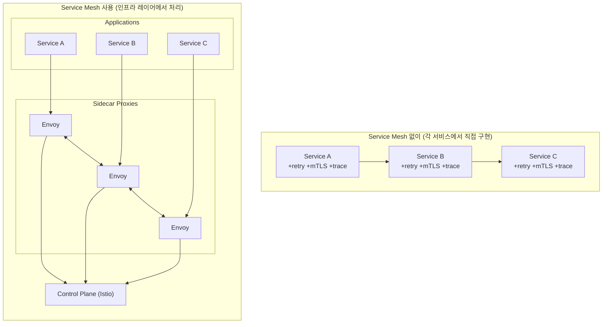
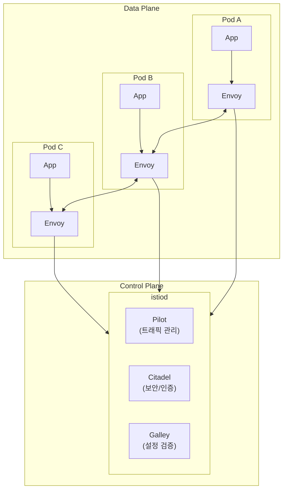

마이크로서비스 아키텍처에서 서비스 간 통신 관리는 복잡하다. **Service Mesh**는 이 복잡성을 인프라 레이어로 추상화하여 관리한다. **Istio**는 가장 널리 사용되는 Service Mesh 솔루션이다.

## Service Mesh 개념

### Service Mesh란?

> **원문 ([istio.io - The Istio service mesh](https://istio.io/latest/about/service-mesh/)):**
> A service mesh is an infrastructure layer that gives applications capabilities like zero-trust security, observability, and advanced traffic management, without code changes.

**번역:** 서비스 메시는 애플리케이션에 제로 트러스트 보안, 관측성, 고급 트래픽 관리와 같은 기능을 코드 변경 없이 제공하는 인프라 계층이다.

**설명:** Service Mesh는 마이크로서비스 간 통신을 관리하는 전용 인프라 계층이다. 애플리케이션 코드를 수정하지 않고도 서비스 간 보안, 관측성, 트래픽 제어를 구현할 수 있다. Istio는 이러한 Service Mesh를 Kubernetes 환경에서 구현하는 가장 인기 있는 솔루션이다.

### 왜 Service Mesh가 필요한가?

마이크로서비스의 네트워킹 과제:
- 서비스 간 보안 통신 (mTLS)
- 트래픽 관리 (로드밸런싱, 라우팅)
- 관측성 (메트릭, 트레이싱, 로깅)
- 장애 복구 (재시도, 서킷 브레이커)



### Service Mesh 솔루션 비교

| 솔루션 | Sidecar | 특징 |
|--------|---------|------|
| Istio | Envoy | 가장 풍부한 기능, 복잡함 |
| Linkerd | linkerd2-proxy (Rust) | 경량, 단순함 |
| Cilium Service Mesh | eBPF (No Sidecar) | 고성능, CNI 통합 |
| Consul Connect | Envoy 또는 내장 | HashiCorp 에코시스템 |

## Istio 아키텍처

### 주요 컴포넌트



**istiod**: 통합 Control Plane
- **Pilot**: 서비스 디스커버리, 트래픽 관리
- **Citadel**: 인증서 관리, mTLS
- **Galley**: 설정 검증 및 배포

**Envoy Proxy**: Data Plane (Sidecar)
- 모든 인/아웃바운드 트래픽 처리
- L7 로드밸런싱
- mTLS 적용
- 메트릭 수집

### 설치

```bash
# istioctl 설치
curl -L https://istio.io/downloadIstio | sh -
cd istio-*
export PATH=$PWD/bin:$PATH

# Istio 설치 (demo 프로파일)
istioctl install --set profile=demo -y

# 프로파일 옵션:
# - minimal: 최소 설치
# - default: 프로덕션 기본
# - demo: 모든 기능 (학습용)

# 사이드카 자동 주입 활성화
kubectl label namespace default istio-injection=enabled

# 확인
kubectl get pods -n istio-system
istioctl analyze
```

### Sidecar 주입

**자동 주입** (권장):
```bash
# Namespace에 라벨 추가
kubectl label namespace default istio-injection=enabled

# 이후 생성되는 Pod에 자동으로 Envoy 사이드카 주입
```

**수동 주입**:
```bash
istioctl kube-inject -f deployment.yaml | kubectl apply -f -
```

## 트래픽 관리

### VirtualService

트래픽 라우팅 규칙을 정의한다.

```yaml
apiVersion: networking.istio.io/v1beta1
kind: VirtualService
metadata:
  name: reviews
spec:
  hosts:
  - reviews
  http:
  - match:
    - headers:
        end-user:
          exact: jason
    route:
    - destination:
        host: reviews
        subset: v2
  - route:
    - destination:
        host: reviews
        subset: v1
      weight: 80
    - destination:
        host: reviews
        subset: v2
      weight: 20
```

### DestinationRule

서비스의 서브셋과 정책을 정의한다.

```yaml
apiVersion: networking.istio.io/v1beta1
kind: DestinationRule
metadata:
  name: reviews
spec:
  host: reviews
  trafficPolicy:
    connectionPool:
      tcp:
        maxConnections: 100
      http:
        h2UpgradePolicy: UPGRADE
    loadBalancer:
      simple: ROUND_ROBIN
  subsets:
  - name: v1
    labels:
      version: v1
  - name: v2
    labels:
      version: v2
    trafficPolicy:
      loadBalancer:
        simple: LEAST_CONN
```

### Canary 배포

```yaml
# 90% v1, 10% v2
apiVersion: networking.istio.io/v1beta1
kind: VirtualService
metadata:
  name: myapp
spec:
  hosts:
  - myapp
  http:
  - route:
    - destination:
        host: myapp
        subset: v1
      weight: 90
    - destination:
        host: myapp
        subset: v2
      weight: 10
```

### 헤더 기반 라우팅

```yaml
apiVersion: networking.istio.io/v1beta1
kind: VirtualService
metadata:
  name: myapp
spec:
  hosts:
  - myapp
  http:
  - match:
    - headers:
        x-canary:
          exact: "true"
    route:
    - destination:
        host: myapp
        subset: v2
  - route:
    - destination:
        host: myapp
        subset: v1
```

### 장애 주입 (테스트용)

```yaml
apiVersion: networking.istio.io/v1beta1
kind: VirtualService
metadata:
  name: ratings
spec:
  hosts:
  - ratings
  http:
  - fault:
      delay:
        percentage:
          value: 10.0
        fixedDelay: 5s
      abort:
        percentage:
          value: 10.0
        httpStatus: 500
    route:
    - destination:
        host: ratings
```

### 타임아웃과 재시도

```yaml
apiVersion: networking.istio.io/v1beta1
kind: VirtualService
metadata:
  name: reviews
spec:
  hosts:
  - reviews
  http:
  - route:
    - destination:
        host: reviews
    timeout: 10s
    retries:
      attempts: 3
      perTryTimeout: 2s
      retryOn: 5xx,reset,connect-failure
```

### 서킷 브레이커

```yaml
apiVersion: networking.istio.io/v1beta1
kind: DestinationRule
metadata:
  name: reviews
spec:
  host: reviews
  trafficPolicy:
    outlierDetection:
      consecutive5xxErrors: 5
      interval: 10s
      baseEjectionTime: 30s
      maxEjectionPercent: 50
```

## 보안

### mTLS 활성화

```yaml
# Strict mTLS (모든 통신 암호화)
apiVersion: security.istio.io/v1beta1
kind: PeerAuthentication
metadata:
  name: default
  namespace: istio-system
spec:
  mtls:
    mode: STRICT
---
# Namespace별 설정
apiVersion: security.istio.io/v1beta1
kind: PeerAuthentication
metadata:
  name: default
  namespace: production
spec:
  mtls:
    mode: STRICT
```

**mTLS 모드**:
- `STRICT`: mTLS 필수
- `PERMISSIVE`: 평문과 mTLS 모두 허용 (마이그레이션용)
- `DISABLE`: mTLS 비활성화

### AuthorizationPolicy

서비스 수준 접근 제어를 정의한다.

```yaml
apiVersion: security.istio.io/v1beta1
kind: AuthorizationPolicy
metadata:
  name: httpbin-policy
  namespace: default
spec:
  selector:
    matchLabels:
      app: httpbin
  action: ALLOW
  rules:
  - from:
    - source:
        principals: ["cluster.local/ns/default/sa/frontend"]
    to:
    - operation:
        methods: ["GET", "POST"]
        paths: ["/api/*"]
```

### JWT 인증

```yaml
apiVersion: security.istio.io/v1beta1
kind: RequestAuthentication
metadata:
  name: jwt-auth
  namespace: default
spec:
  selector:
    matchLabels:
      app: api
  jwtRules:
  - issuer: "https://accounts.google.com"
    jwksUri: "https://www.googleapis.com/oauth2/v3/certs"
---
apiVersion: security.istio.io/v1beta1
kind: AuthorizationPolicy
metadata:
  name: require-jwt
  namespace: default
spec:
  selector:
    matchLabels:
      app: api
  action: ALLOW
  rules:
  - from:
    - source:
        requestPrincipals: ["*"]
```

## 관측성

### Kiali (대시보드)

```bash
# Kiali 설치 (demo 프로파일에 포함)
kubectl apply -f https://raw.githubusercontent.com/istio/istio/release-1.20/samples/addons/kiali.yaml

# 접근
istioctl dashboard kiali
```

### Prometheus & Grafana

```bash
# 설치
kubectl apply -f https://raw.githubusercontent.com/istio/istio/release-1.20/samples/addons/prometheus.yaml
kubectl apply -f https://raw.githubusercontent.com/istio/istio/release-1.20/samples/addons/grafana.yaml

# 접근
istioctl dashboard grafana
```

### Jaeger (분산 트레이싱)

```bash
# 설치
kubectl apply -f https://raw.githubusercontent.com/istio/istio/release-1.20/samples/addons/jaeger.yaml

# 접근
istioctl dashboard jaeger
```

## Gateway

외부 트래픽을 메시로 유입한다.

```yaml
apiVersion: networking.istio.io/v1beta1
kind: Gateway
metadata:
  name: myapp-gateway
spec:
  selector:
    istio: ingressgateway
  servers:
  - port:
      number: 80
      name: http
      protocol: HTTP
    hosts:
    - "myapp.example.com"
  - port:
      number: 443
      name: https
      protocol: HTTPS
    tls:
      mode: SIMPLE
      credentialName: myapp-tls
    hosts:
    - "myapp.example.com"
---
apiVersion: networking.istio.io/v1beta1
kind: VirtualService
metadata:
  name: myapp
spec:
  hosts:
  - "myapp.example.com"
  gateways:
  - myapp-gateway
  http:
  - route:
    - destination:
        host: myapp
        port:
          number: 80
```

## 트러블슈팅

### 일반적인 문제

```bash
# Istio 상태 확인
istioctl analyze

# Proxy 상태 확인
istioctl proxy-status

# Envoy 설정 확인
istioctl proxy-config routes <pod-name>
istioctl proxy-config clusters <pod-name>
istioctl proxy-config listeners <pod-name>

# Sidecar 로그
kubectl logs <pod-name> -c istio-proxy

# mTLS 상태 확인
istioctl authn tls-check <pod>.<namespace>
```

### 디버깅 명령어

```bash
# 특정 Pod의 Envoy 대시보드
istioctl dashboard envoy <pod-name>

# 설정 diff
istioctl proxy-config dump <pod-name> -o json

# 네트워크 문제
kubectl exec <pod> -c istio-proxy -- curl localhost:15000/stats
```

## 기술 면접 대비

### 자주 묻는 질문

**Q: Service Mesh가 필요한 이유는?**

A: 마이크로서비스 간 통신의 복잡성(보안, 관측성, 장애 복구)을 애플리케이션 코드에서 분리하여 인프라 레이어에서 처리한다. 개발자는 비즈니스 로직에 집중하고, 운영 팀은 일관된 정책을 적용할 수 있다. mTLS, 트래픽 관리, 분산 트레이싱 등을 코드 변경 없이 적용할 수 있다.

**Q: Sidecar 패턴의 장단점은?**

A: 장점은 애플리케이션 코드 수정 없이 네트워킹 기능을 추가할 수 있고, 언어/프레임워크에 독립적이다. 단점은 각 Pod마다 프록시가 추가되어 리소스 오버헤드(CPU, 메모리)가 발생하고, 지연 시간이 약간 증가한다. 대규모 클러스터에서는 이 오버헤드가 누적될 수 있다.

**Q: Istio와 Kubernetes NetworkPolicy의 차이는?**

A: NetworkPolicy는 L3/L4(IP, 포트) 수준에서 트래픽을 필터링한다. Istio AuthorizationPolicy는 L7(HTTP 메서드, 경로, 헤더)까지 제어할 수 있고, JWT 인증, mTLS 등 ID 기반 정책도 적용할 수 있다. 또한 Istio는 트래픽 관리(카나리, 서킷 브레이커)와 관측성도 제공한다.

**Q: Istio 없이 mTLS를 구현할 수 있는가?**

A: 가능하지만 복잡하다. 각 서비스에서 인증서를 관리하고, TLS 핸드셰이크 코드를 구현해야 한다. 인증서 갱신 자동화도 직접 구현해야 한다. Istio는 이 모든 것을 Citadel/istiod가 자동으로 처리하고, Envoy가 투명하게 mTLS를 적용한다.

## 다음 단계

- [Kubernetes 생태계 - OPA/Gatekeeper](/kubernetes/kubernetes-ecosystem-03-opa)
- [Kubernetes 생태계 - ArgoCD와 GitOps](/kubernetes/kubernetes-ecosystem-04-argocd)
