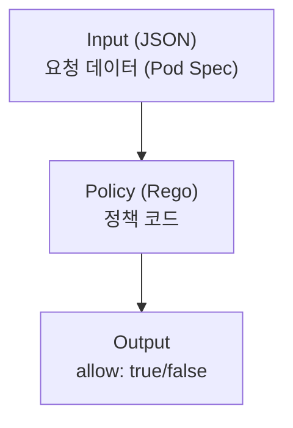
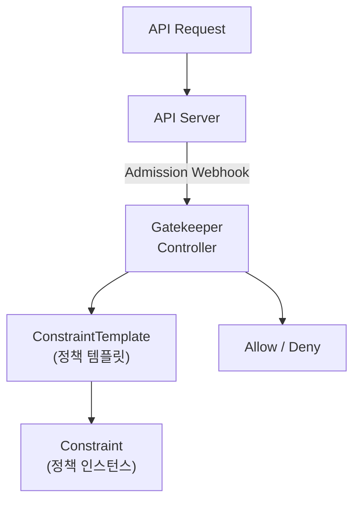

**OPA(Open Policy Agent)**는 범용 정책 엔진이고, **Gatekeeper**는 OPA를 Kubernetes에 통합하여 Admission Control 정책을 관리한다. 이를 통해 "컨테이너는 반드시 non-root로 실행되어야 한다" 같은 정책을 선언적으로 적용할 수 있다.

## OPA 개요

### OPA란?

> **원문 ([openpolicyagent.org - Introduction](https://www.openpolicyagent.org/docs/latest/)):**
> The Open Policy Agent (OPA, pronounced "oh-pa") is an open source, general-purpose policy engine that unifies policy enforcement across the stack. OPA provides a high-level declarative language that lets you specify policy as code and simple APIs to offload policy decision-making from your software.

**번역:** OPA(Open Policy Agent, "오-파"라고 발음)는 스택 전반에 걸쳐 정책 시행을 통합하는 오픈소스 범용 정책 엔진이다. OPA는 정책을 코드로 지정할 수 있는 고수준 선언적 언어와 소프트웨어에서 정책 의사결정을 오프로드할 수 있는 간단한 API를 제공한다.

**설명:** OPA는 **정책을 코드로 관리**하는 오픈소스 정책 엔진이다. Rego라는 선언적 언어로 정책을 작성하며, Kubernetes뿐만 아니라 마이크로서비스, CI/CD 파이프라인, API 게이트웨이 등 다양한 환경에서 정책을 시행할 수 있다. Kubernetes에서는 Gatekeeper를 통해 Admission Controller로 통합되어 리소스 생성 시 정책을 검증한다.



**특징**:
- 범용 정책 엔진 (Kubernetes 외에도 사용)
- Rego 언어로 정책 작성
- JSON 입력, JSON 출력
- 경량, 고성능

### Rego 언어 기초

```rego
# 기본 구조
package kubernetes.admission

# 거부 규칙 정의
deny[msg] {
    input.request.kind.kind == "Pod"
    container := input.request.object.spec.containers[_]
    not container.securityContext.runAsNonRoot
    msg := sprintf("Container %v must run as non-root", [container.name])
}

# 조건문
allow {
    input.request.kind.kind == "Pod"
    input.request.object.spec.containers[_].image == "nginx"
}

# 변수 할당
pod := input.request.object
containers := pod.spec.containers
```

**Rego 주요 개념**:
- 규칙은 조건이 모두 참일 때 true
- `_`는 반복 변수 (any)
- `[msg]`는 메시지를 포함한 set 반환

## Gatekeeper

### Gatekeeper란?

Gatekeeper는 **OPA를 Kubernetes Admission Controller로 통합**한 것이다.



**주요 개념**:
- **ConstraintTemplate**: 정책의 템플릿 (Rego 코드 포함)
- **Constraint**: ConstraintTemplate의 인스턴스 (파라미터 지정)

### 설치

```bash
# Gatekeeper 설치
kubectl apply -f https://raw.githubusercontent.com/open-policy-agent/gatekeeper/v3.14.0/deploy/gatekeeper.yaml

# 확인
kubectl get pods -n gatekeeper-system
kubectl get crd | grep gatekeeper
```

### ConstraintTemplate 작성

```yaml
apiVersion: templates.gatekeeper.sh/v1
kind: ConstraintTemplate
metadata:
  name: k8srequiredlabels
spec:
  crd:
    spec:
      names:
        kind: K8sRequiredLabels
      validation:
        openAPIV3Schema:
          type: object
          properties:
            labels:
              type: array
              items:
                type: string
  targets:
  - target: admission.k8s.gatekeeper.sh
    rego: |
      package k8srequiredlabels

      violation[{"msg": msg, "details": {"missing_labels": missing}}] {
        provided := {label | input.review.object.metadata.labels[label]}
        required := {label | label := input.parameters.labels[_]}
        missing := required - provided
        count(missing) > 0
        msg := sprintf("Missing required labels: %v", [missing])
      }
```

### Constraint 생성

```yaml
apiVersion: constraints.gatekeeper.sh/v1beta1
kind: K8sRequiredLabels
metadata:
  name: require-app-label
spec:
  match:
    kinds:
    - apiGroups: [""]
      kinds: ["Pod"]
    namespaces:
    - production
    excludedNamespaces:
    - kube-system
  parameters:
    labels:
    - "app"
    - "owner"
```

### 동작 확인

```bash
# 정책 위반 시
kubectl run test --image=nginx -n production
# Error: admission webhook "validation.gatekeeper.sh" denied the request:
# [require-app-label] Missing required labels: {"app", "owner"}

# 정책 준수 시
kubectl run test --image=nginx -n production \
  --labels="app=test,owner=team-a"
# pod/test created
```

## 일반적인 정책 예시

### 1. 프라이빗 레지스트리만 허용

```yaml
apiVersion: templates.gatekeeper.sh/v1
kind: ConstraintTemplate
metadata:
  name: k8sallowedrepos
spec:
  crd:
    spec:
      names:
        kind: K8sAllowedRepos
      validation:
        openAPIV3Schema:
          type: object
          properties:
            repos:
              type: array
              items:
                type: string
  targets:
  - target: admission.k8s.gatekeeper.sh
    rego: |
      package k8sallowedrepos

      violation[{"msg": msg}] {
        container := input.review.object.spec.containers[_]
        satisfied := [good | repo := input.parameters.repos[_]; good := startswith(container.image, repo)]
        not any(satisfied)
        msg := sprintf("Container image %v is not from an allowed registry", [container.image])
      }
---
apiVersion: constraints.gatekeeper.sh/v1beta1
kind: K8sAllowedRepos
metadata:
  name: allowed-repos
spec:
  match:
    kinds:
    - apiGroups: [""]
      kinds: ["Pod"]
  parameters:
    repos:
    - "registry.company.com/"
    - "gcr.io/my-project/"
```

### 2. Privileged 컨테이너 금지

```yaml
apiVersion: templates.gatekeeper.sh/v1
kind: ConstraintTemplate
metadata:
  name: k8sblockprivileged
spec:
  crd:
    spec:
      names:
        kind: K8sBlockPrivileged
  targets:
  - target: admission.k8s.gatekeeper.sh
    rego: |
      package k8sblockprivileged

      violation[{"msg": msg}] {
        container := input.review.object.spec.containers[_]
        container.securityContext.privileged
        msg := sprintf("Privileged container not allowed: %v", [container.name])
      }

      violation[{"msg": msg}] {
        container := input.review.object.spec.initContainers[_]
        container.securityContext.privileged
        msg := sprintf("Privileged init container not allowed: %v", [container.name])
      }
---
apiVersion: constraints.gatekeeper.sh/v1beta1
kind: K8sBlockPrivileged
metadata:
  name: block-privileged
spec:
  match:
    kinds:
    - apiGroups: [""]
      kinds: ["Pod"]
    excludedNamespaces:
    - kube-system
```

### 3. 리소스 제한 필수

```yaml
apiVersion: templates.gatekeeper.sh/v1
kind: ConstraintTemplate
metadata:
  name: k8srequireresources
spec:
  crd:
    spec:
      names:
        kind: K8sRequireResources
  targets:
  - target: admission.k8s.gatekeeper.sh
    rego: |
      package k8srequireresources

      violation[{"msg": msg}] {
        container := input.review.object.spec.containers[_]
        not container.resources.limits.cpu
        msg := sprintf("Container %v must have CPU limits", [container.name])
      }

      violation[{"msg": msg}] {
        container := input.review.object.spec.containers[_]
        not container.resources.limits.memory
        msg := sprintf("Container %v must have memory limits", [container.name])
      }
---
apiVersion: constraints.gatekeeper.sh/v1beta1
kind: K8sRequireResources
metadata:
  name: require-resources
spec:
  match:
    kinds:
    - apiGroups: [""]
      kinds: ["Pod"]
    namespaces:
    - production
```

### 4. HostPath 볼륨 금지

```yaml
apiVersion: templates.gatekeeper.sh/v1
kind: ConstraintTemplate
metadata:
  name: k8sblockhostpath
spec:
  crd:
    spec:
      names:
        kind: K8sBlockHostPath
  targets:
  - target: admission.k8s.gatekeeper.sh
    rego: |
      package k8sblockhostpath

      violation[{"msg": msg}] {
        volume := input.review.object.spec.volumes[_]
        volume.hostPath
        msg := sprintf("HostPath volume not allowed: %v", [volume.name])
      }
---
apiVersion: constraints.gatekeeper.sh/v1beta1
kind: K8sBlockHostPath
metadata:
  name: block-hostpath
spec:
  match:
    kinds:
    - apiGroups: [""]
      kinds: ["Pod"]
```

### 5. 최신 태그 금지

```yaml
apiVersion: templates.gatekeeper.sh/v1
kind: ConstraintTemplate
metadata:
  name: k8sblocklatest
spec:
  crd:
    spec:
      names:
        kind: K8sBlockLatest
  targets:
  - target: admission.k8s.gatekeeper.sh
    rego: |
      package k8sblocklatest

      violation[{"msg": msg}] {
        container := input.review.object.spec.containers[_]
        endswith(container.image, ":latest")
        msg := sprintf("Container %v uses 'latest' tag", [container.name])
      }

      violation[{"msg": msg}] {
        container := input.review.object.spec.containers[_]
        not contains(container.image, ":")
        msg := sprintf("Container %v has no tag (implies 'latest')", [container.name])
      }
---
apiVersion: constraints.gatekeeper.sh/v1beta1
kind: K8sBlockLatest
metadata:
  name: block-latest-tag
spec:
  match:
    kinds:
    - apiGroups: [""]
      kinds: ["Pod"]
```

## Gatekeeper 라이브러리

### 기본 제공 라이브러리

Gatekeeper는 **gatekeeper-library**에서 일반적인 정책 템플릿을 제공한다.

```bash
# gatekeeper-library 설치
kubectl apply -f https://raw.githubusercontent.com/open-policy-agent/gatekeeper-library/master/library/pod-security-policy/allow-privilege-escalation/template.yaml

# 사용 가능한 템플릿들:
# - K8sBlockProcessNamespaceSharing
# - K8sContainerLimits
# - K8sDisallowedTags
# - K8sPSPAllowPrivilegeEscalation
# - K8sPSPCapabilities
# - K8sPSPHostFilesystem
# - K8sPSPHostNamespace
# - K8sPSPPrivilegedContainer
# - K8sRequiredProbes
# 등...
```

## Audit 모드

### Dry-Run (감사만)

```yaml
apiVersion: constraints.gatekeeper.sh/v1beta1
kind: K8sRequiredLabels
metadata:
  name: require-app-label-audit
spec:
  enforcementAction: dryrun  # 차단 안 함, 로그만
  match:
    kinds:
    - apiGroups: [""]
      kinds: ["Pod"]
  parameters:
    labels:
    - "app"
```

**enforcementAction 옵션**:
- `deny`: 정책 위반 시 거부 (기본값)
- `dryrun`: 감사만, 거부 안 함
- `warn`: 경고만 출력, 거부 안 함

### 감사 결과 확인

```bash
# Constraint 상태 확인
kubectl describe k8srequiredlabels require-app-label

# 위반 목록
kubectl get k8srequiredlabels require-app-label -o yaml
# status.violations에 위반 리소스 목록
```

## Mutation

### Gatekeeper Mutation

Gatekeeper 3.7+부터 **Mutation(변형)** 기능을 지원한다.

```yaml
# 기본 라벨 자동 추가
apiVersion: mutations.gatekeeper.sh/v1
kind: Assign
metadata:
  name: add-default-owner
spec:
  applyTo:
  - groups: [""]
    kinds: ["Pod"]
    versions: ["v1"]
  match:
    scope: Namespaced
    kinds:
    - apiGroups: ["*"]
      kinds: ["Pod"]
  location: "metadata.labels.owner"
  parameters:
    assign:
      value: "default-team"
```

```yaml
# SecurityContext 강제 설정
apiVersion: mutations.gatekeeper.sh/v1
kind: Assign
metadata:
  name: force-nonroot
spec:
  applyTo:
  - groups: [""]
    kinds: ["Pod"]
    versions: ["v1"]
  match:
    scope: Namespaced
  location: "spec.securityContext.runAsNonRoot"
  parameters:
    assign:
      value: true
```

## 트러블슈팅

### 일반적인 문제

```bash
# Gatekeeper Pod 상태
kubectl get pods -n gatekeeper-system

# Gatekeeper 로그
kubectl logs -n gatekeeper-system deployment/gatekeeper-controller-manager

# Constraint 상태
kubectl get constraints
kubectl describe constraint <name>

# ConstraintTemplate 상태
kubectl get constrainttemplates
kubectl describe constrainttemplate <name>
```

### Webhook 타임아웃

```bash
# Webhook 설정 확인
kubectl get validatingwebhookconfigurations gatekeeper-validating-webhook-configuration -o yaml

# 타임아웃 조정
# webhooks[].timeoutSeconds 값 조정
```

### 정책 테스트

```bash
# 로컬에서 정책 테스트
opa eval -i input.json -d policy.rego "data.kubernetes.admission.deny"

# Gatekeeper 없이 정책 검증
opa test ./policies -v
```

## 기술 면접 대비

### 자주 묻는 질문

**Q: OPA와 Gatekeeper의 관계는?**

A: OPA는 범용 정책 엔진으로 Rego 언어로 정책을 작성하고 평가한다. Gatekeeper는 OPA를 Kubernetes Admission Controller로 통합한 것이다. Gatekeeper는 ConstraintTemplate(정책 템플릿)과 Constraint(정책 인스턴스) CRD를 제공하여 Kubernetes 친화적인 방식으로 정책을 관리한다.

**Q: Gatekeeper와 Pod Security Admission(PSA)의 차이는?**

A: PSA는 Kubernetes 내장 기능으로 사전 정의된 3가지 수준(Privileged, Baseline, Restricted)의 정책만 적용할 수 있다. Gatekeeper는 Rego로 커스텀 정책을 작성할 수 있어 훨씬 유연하다. 이미지 레지스트리 검증, 라벨 필수화, 리소스 제한 등 다양한 정책을 구현할 수 있다.

**Q: ConstraintTemplate과 Constraint를 분리한 이유는?**

A: 관심사 분리를 위해서다. ConstraintTemplate은 보안 팀이 정책 로직(Rego)을 정의하고, Constraint는 플랫폼 팀이나 개발 팀이 파라미터(적용 범위, 허용 값 등)를 지정한다. 하나의 템플릿으로 여러 Constraint를 만들어 환경별로 다른 파라미터를 적용할 수 있다.

**Q: Gatekeeper의 성능 영향은?**

A: Admission Webhook으로 동작하므로 모든 API 요청에 지연이 추가된다. 정책이 복잡하거나 많으면 지연이 증가한다. audit 모드로 먼저 검증하고, 정책을 점진적으로 활성화하는 것이 좋다. 또한 excludedNamespaces로 kube-system 등 중요 namespace를 제외해야 한다.

## 다음 단계

- [Kubernetes 보안 심화 - CKS 준비](/kubernetes/kubernetes-security-cks)
- [Kubernetes 생태계 - ArgoCD와 GitOps](/kubernetes/kubernetes-ecosystem-04-argocd)
