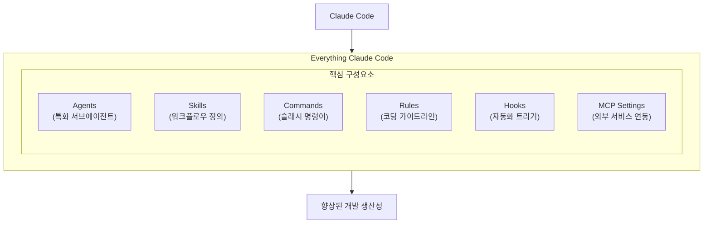
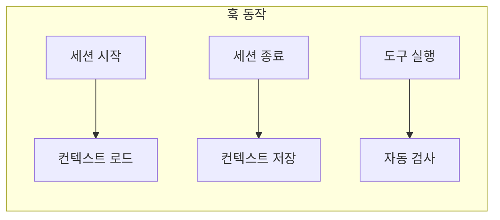
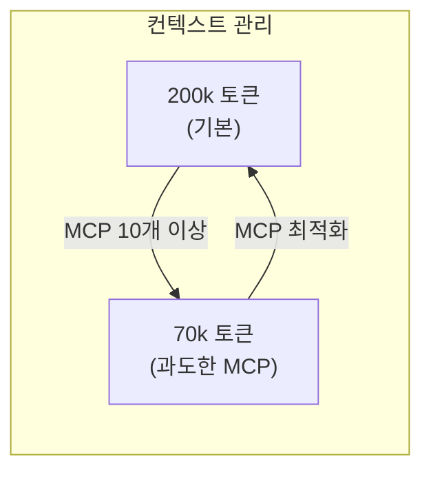

**Everything Claude Code**는 Anthropic 해커톤 우승자가 10개월 이상 실제 제품 개발에 사용해온 Claude Code 설정 모음이다. 에이전트, 스킬, 훅, 명령어, 규칙 등 프로덕션 레벨의 AI 워크플로우를 담고 있다.

## 프로젝트 개요

GitHub: [affaan-m/everything-claude-code](https://github.com/affaan-m/everything-claude-code)



## 주요 구성요소

### 1. Agents (에이전트)

특정 작업에 특화된 서브에이전트들이다. Claude Code가 복잡한 작업을 처리할 때 적절한 에이전트에게 위임한다.

| 에이전트 | 역할 |
|---------|------|
| `planner.md` | 기능 구현 계획 수립 |
| `architect.md` | 시스템 아키텍처 설계 |
| `tdd-guide.md` | 테스트 주도 개발 가이드 |
| `code-reviewer.md` | 코드 품질 검토 |
| `security-reviewer.md` | 보안 취약점 분석 |
| `build-error-resolver.md` | 빌드 에러 해결 |
| `e2e-runner.md` | E2E 테스트 실행 |
| `go-reviewer.md` | Go 코드 검토 |
| `go-build-resolver.md` | Go 빌드 문제 해결 |

### 2. Skills (스킬)

워크플로우 정의와 도메인 지식을 담는다.

- **코딩 표준**: 일관된 코드 스타일 유지
- **백엔드/프론트엔드 패턴**: 아키텍처 패턴 가이드
- **TDD 워크플로우**: 테스트 주도 개발 프로세스
- **보안 검토**: 취약점 체크리스트
- **지속적 학습**: 프로젝트별 컨텍스트 유지
- **Go 패턴 및 테스팅**: Go 언어 특화 가이드

### 3. Commands (명령어)

슬래시 명령어로 빠르게 워크플로우를 실행한다.

```bash
/tdd          # 테스트 주도 개발 시작
/plan         # 구현 계획 수립
/code-review  # 코드 품질 검토
/setup-pm     # 패키지 매니저 설정
/go-review    # Go 코드 검토
/go-test      # Go 테스트 실행
/go-build     # Go 빌드
```

### 4. Rules (규칙)

항상 따라야 할 지침들이다.

- **보안 규칙**: 민감 정보 처리, 입력 검증
- **코딩 스타일**: 네이밍 컨벤션, 포맷팅
- **테스팅 규칙**: 테스트 커버리지, 테스트 패턴
- **Git 워크플로우**: 커밋 메시지, 브랜치 전략
- **에이전트 위임**: 작업 분배 기준

### 5. Hooks (훅)

도구 실행 시점에 자동으로 트리거되는 자동화다.



### 6. MCP Settings

GitHub, Supabase, Vercel 등 외부 서비스와의 연동 설정이다.

## 설치 방법

### 방법 1: 플러그인으로 설치 (권장)

```bash
# Claude Code에서 실행
/plugin marketplace add affaan-m/everything-claude-code
/plugin install everything-claude-code@everything-claude-code
```

또는 `~/.claude/settings.json`에 직접 추가:

```json
{
  "extraKnownMarketplaces": {
    "everything-claude-code": {
      "source": {
        "source": "github",
        "repo": "affaan-m/everything-claude-code"
      }
    }
  },
  "enabledPlugins": {
    "everything-claude-code@everything-claude-code": true
  }
}
```

### 방법 2: 수동 설치

```bash
# 저장소 클론
git clone https://github.com/affaan-m/everything-claude-code.git

# 에이전트 복사
cp everything-claude-code/agents/*.md ~/.claude/agents/

# 규칙 복사
cp everything-claude-code/rules/*.md ~/.claude/rules/

# 명령어 복사
cp everything-claude-code/commands/*.md ~/.claude/commands/

# 스킬 복사
cp -r everything-claude-code/skills/* ~/.claude/skills/
```

`hooks/hooks.json`의 훅 설정은 `~/.claude/settings.json`에 수동으로 복사한다.

## 패키지 매니저 자동 감지

npm, pnpm, yarn, bun을 자동으로 감지한다. 우선순위:

1. 환경 변수 (`CLAUDE_PACKAGE_MANAGER`)
2. 프로젝트 설정
3. `package.json`의 `packageManager` 필드
4. 락 파일 감지 (`pnpm-lock.yaml`, `yarn.lock` 등)

```bash
# 환경 변수로 설정
export CLAUDE_PACKAGE_MANAGER=pnpm

# 스크립트로 설정
node scripts/setup-package-manager.js --project bun

# 현재 설정 확인
node scripts/setup-package-manager.js --detect
```

## 사용 예시

### TDD 워크플로우

```bash
# Claude Code에서
/tdd

# Claude가 TDD 가이드 에이전트를 활성화하고
# 1. 실패하는 테스트 작성
# 2. 테스트 통과하는 최소 코드 작성
# 3. 리팩토링
# 순서로 진행한다
```

### 코드 리뷰

```bash
/code-review

# Claude가 code-reviewer 에이전트를 활성화하고
# - 코드 품질
# - 보안 취약점
# - 성능 이슈
# - 베스트 프랙티스 위반
# 등을 검토한다
```

### 구현 계획

```bash
/plan "사용자 인증 기능 추가"

# Claude가 planner 에이전트를 활성화하고
# - 요구사항 분석
# - 기술 스택 선정
# - 구현 단계 정의
# - 예상 이슈 식별
# 등을 포함한 계획을 수립한다
```

## 주의사항

### 컨텍스트 윈도우 관리

**중요**: 모든 MCP를 동시에 활성화하면 안 된다.

- 기본 컨텍스트 윈도우: 200k 토큰
- 과도한 도구 활성화 시: 70k 토큰으로 축소 가능
- **권장**: 프로젝트당 10개 미만의 MCP 활성화



### 커스터마이징

제공된 설정은 출발점이다. 자신의 워크플로우에 맞게 수정하여 사용한다:

1. 불필요한 에이전트/스킬 제거
2. 프로젝트 특성에 맞는 규칙 추가
3. 자주 사용하는 명령어 커스터마이징

## 테스트

```bash
# 전체 테스트 실행
node tests/run-all.js

# 개별 테스트
node tests/lib/utils.test.js
node tests/lib/package-manager.test.js
```

## 관련 도구

### ecc.tools

저장소로부터 Claude Code 스킬을 자동 생성하는 도구다.

- SKILL.md 파일 자동 생성
- 코드 패턴 추출
- 프로젝트 구조 분석

## 정리

Everything Claude Code는 실전에서 검증된 Claude Code 설정 모음이다.

| 구성요소 | 용도 |
|---------|------|
| Agents | 특화된 작업 처리 |
| Skills | 워크플로우 정의 |
| Commands | 빠른 실행 |
| Rules | 일관된 가이드라인 |
| Hooks | 자동화 |
| MCP | 외부 서비스 연동 |

**핵심 포인트**:
- 프로덕션 레벨 설정으로 바로 사용 가능
- 크로스 플랫폼 지원 (Windows, macOS, Linux)
- 패키지 매니저 자동 감지
- 컨텍스트 윈도우 관리 필수 (MCP 10개 미만 권장)

## 귀찮은 사람용 TL;DR

읽기 싫고 그냥 바로 쓰고 싶은 사람은 아래만 복붙하면 된다.

### 방법 1: Claude Code에서 바로 실행 (제일 쉬움)

```bash
/plugin marketplace add affaan-m/everything-claude-code
/plugin install everything-claude-code@everything-claude-code
```

끝. 이제 `/tdd`, `/plan`, `/code-review` 같은 명령어 쓸 수 있다.

### 방법 2: settings.json에 복붙

`~/.claude/settings.json` 열어서 아래 내용 추가:

```json
{
  "extraKnownMarketplaces": {
    "everything-claude-code": {
      "source": {
        "source": "github",
        "repo": "affaan-m/everything-claude-code"
      }
    }
  },
  "enabledPlugins": {
    "everything-claude-code@everything-claude-code": true
  }
}
```

### 방법 3: 터미널 원라이너 (수동 설치)

```bash
git clone https://github.com/affaan-m/everything-claude-code.git && \
mkdir -p ~/.claude/{agents,rules,commands,skills} && \
cp everything-claude-code/agents/*.md ~/.claude/agents/ && \
cp everything-claude-code/rules/*.md ~/.claude/rules/ && \
cp everything-claude-code/commands/*.md ~/.claude/commands/ && \
cp -r everything-claude-code/skills/* ~/.claude/skills/ && \
rm -rf everything-claude-code
```

### 설치 후 자주 쓰는 명령어

| 명령어 | 설명 |
|--------|------|
| `/tdd` | 테스트 먼저 작성하고 코드 짜기 |
| `/plan` | 기능 구현 계획 세우기 |
| `/code-review` | 코드 리뷰 받기 |
| `/go-review` | Go 코드 전용 리뷰 |

**주의**: MCP 10개 넘게 켜면 컨텍스트 70k로 줄어드니까 필요한 것만 켜라.

## 참고 자료

- [GitHub 저장소](https://github.com/affaan-m/everything-claude-code)
- [Claude Code 공식 문서](https://docs.anthropic.com/claude-code)
- [ecc.tools](https://ecc.tools) - 스킬 자동 생성 도구
