Kubernetes 네트워킹을 이해하려면 기본적인 네트워크 개념부터 알아야 한다. 이 장에서는 OSI 모델, 오버레이 네트워크, VXLAN, iptables 등 CNI를 이해하는 데 필요한 기초 개념을 상세히 설명한다.

## 네트워크 기초

### OSI 7계층 모델

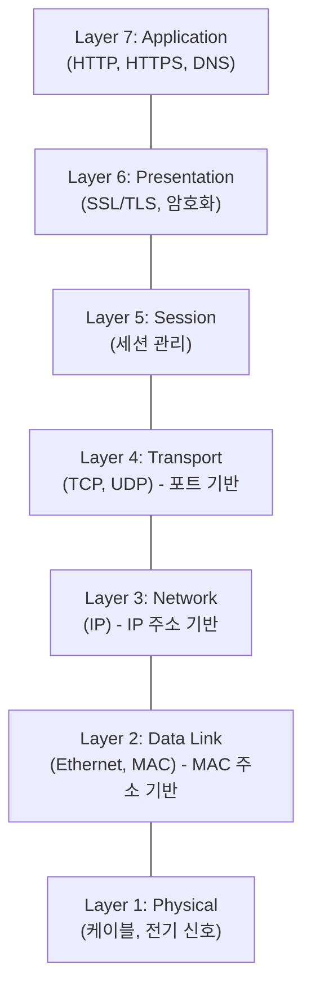

**Kubernetes/CNI에서 중요한 계층**:
- **L2 (Data Link)**: MAC 주소, 같은 네트워크 내 통신
- **L3 (Network)**: IP 주소, 라우팅
- **L4 (Transport)**: TCP/UDP 포트
- **L7 (Application)**: HTTP 경로, 헤더

### L2 vs L3

**L2 (Layer 2) 네트워크**:
- MAC 주소 기반 통신
- 같은 물리적 네트워크(브로드캐스트 도메인)에서만 직접 통신
- 스위치가 패킷 전달

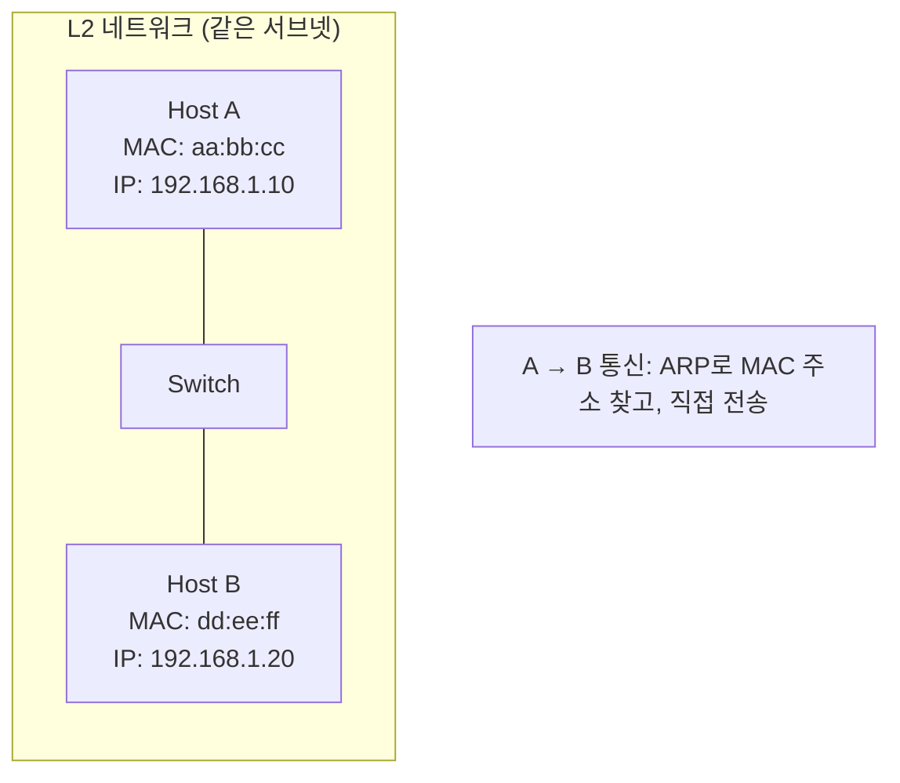

**L3 (Layer 3) 네트워크**:
- IP 주소 기반 통신
- 다른 네트워크 간 라우팅 필요
- 라우터가 패킷 전달

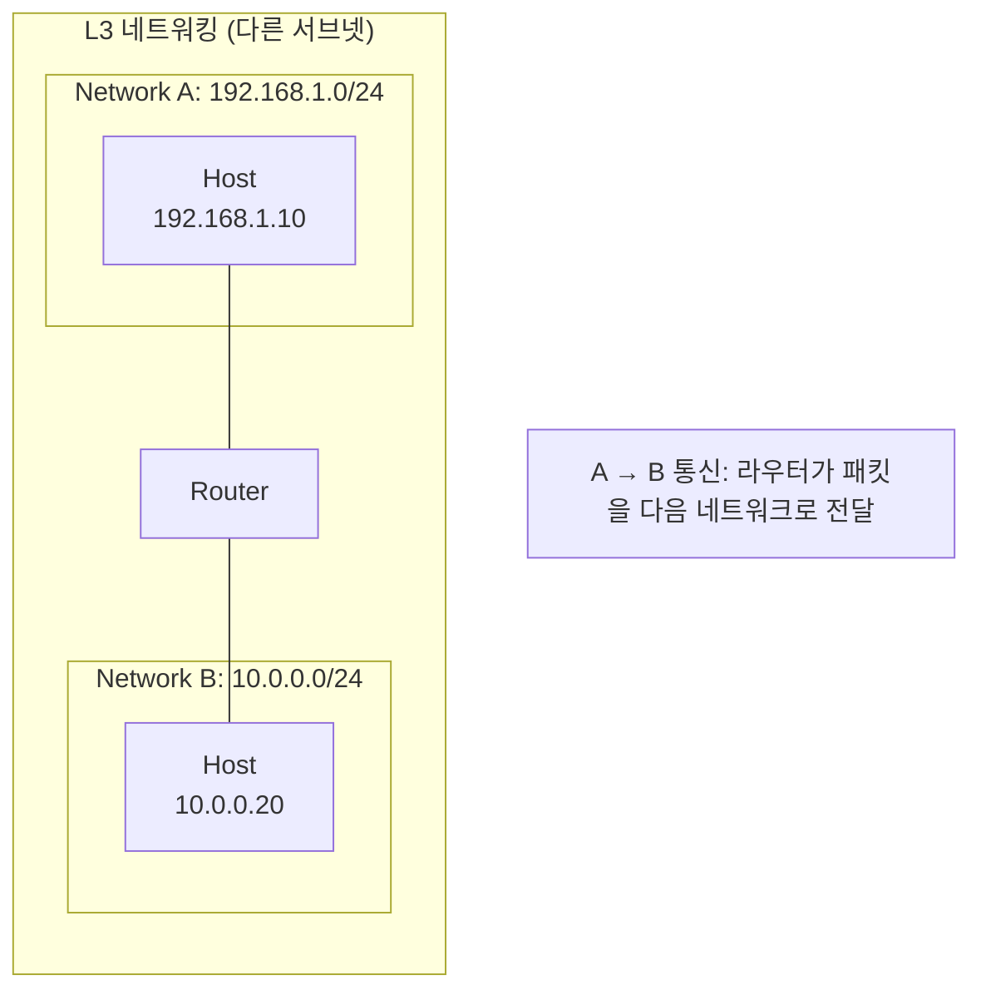

### 컨테이너 네트워킹의 문제

Kubernetes 클러스터는 보통 **여러 노드에 걸쳐** 있다.

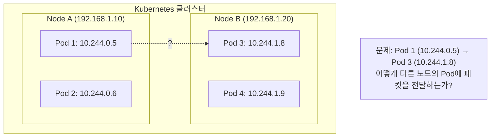

**문제점**:
1. Pod IP (10.244.x.x)는 가상 IP로 물리 네트워크에서 라우팅 안 됨
2. 노드 간에는 물리적 네트워크(192.168.1.0/24)만 연결
3. 물리 라우터는 Pod IP(10.244.0.0/16)를 모름

**해결책**: **오버레이 네트워크** 또는 **직접 라우팅**

## 오버레이 네트워크

### 오버레이란?

**오버레이 네트워크**는 기존 물리 네트워크 위에 가상의 네트워크를 구축하는 것이다.

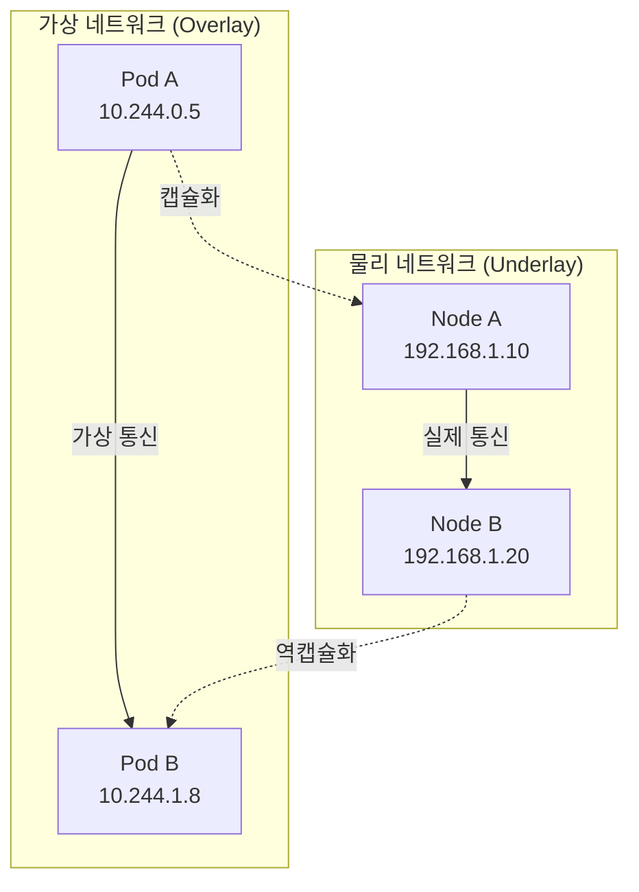

**동작 원리**:
1. Pod A → Pod B 패킷 생성 (src: 10.244.0.5, dst: 10.244.1.8)
2. 노드 A에서 이 패킷을 **캡슐화** (외부 헤더 추가)
3. 외부 헤더: src: 192.168.1.10, dst: 192.168.1.20
4. 물리 네트워크로 전송
5. 노드 B에서 **역캡슐화** (외부 헤더 제거)
6. 원본 패킷(10.244.0.5 → 10.244.1.8)을 Pod B에 전달

### 캡슐화(Encapsulation)

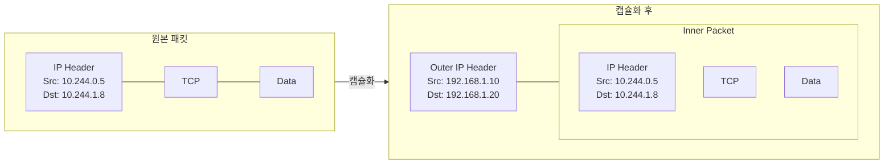

## VXLAN

### VXLAN이란?

**VXLAN(Virtual Extensible LAN)**은 L2 네트워크를 L3 네트워크 위에 오버레이하는 기술이다.

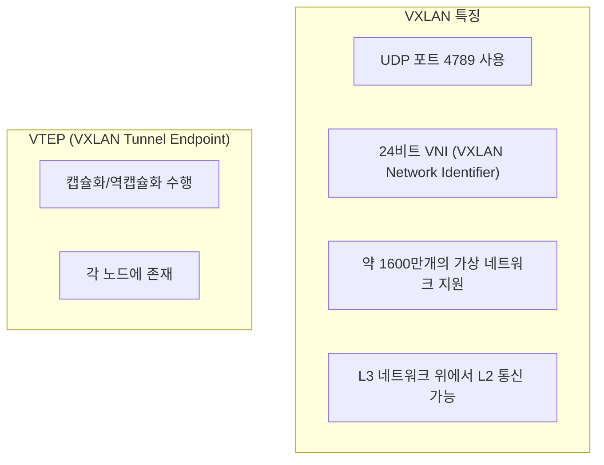

### VXLAN 패킷 구조

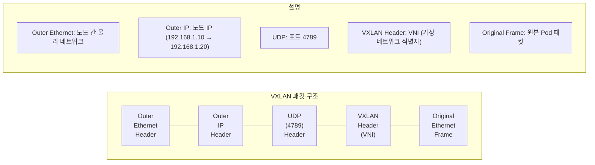

### Flannel에서의 VXLAN

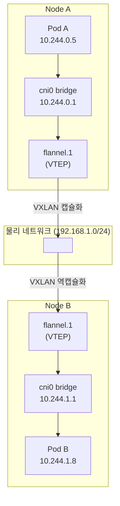

**Flannel 동작 순서**:
1. Pod A → Pod B 패킷 전송 (10.244.0.5 → 10.244.1.8)
2. cni0 bridge에서 flannel.1로 전달 (라우팅 테이블)
3. flannel.1 (VTEP)에서 VXLAN 캡슐화
4. 물리 네트워크로 Node B에 전송
5. Node B의 flannel.1에서 역캡슐화
6. cni0 bridge를 통해 Pod B로 전달

## host-gw (직접 라우팅)

### host-gw란?

**host-gw**는 캡슐화 없이 **직접 라우팅**을 사용한다.

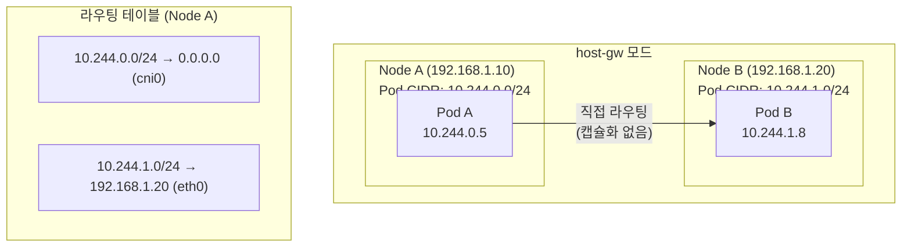

### VXLAN vs host-gw

| 특성 | VXLAN | host-gw |
|------|-------|---------|
| 캡슐화 | 있음 (오버헤드) | 없음 |
| 성능 | 상대적으로 낮음 | 더 빠름 |
| 요구사항 | L3 연결만 필요 | L2 연결 필요 (같은 서브넷) |
| 유연성 | 높음 | 낮음 |

**host-gw 제약**: 모든 노드가 같은 L2 네트워크에 있어야 함 (직접 라우팅 가능해야 함)

## Flannel이 NetworkPolicy를 지원하지 않는 이유

### NetworkPolicy의 구현 방식

NetworkPolicy를 구현하려면 **패킷 필터링**이 필요하다.

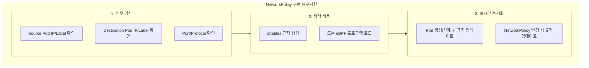

### Flannel의 설계

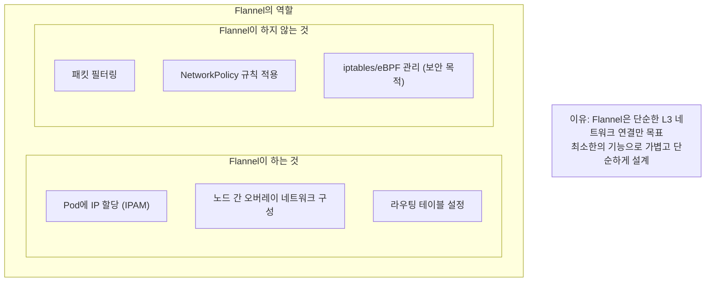

### Calico가 NetworkPolicy를 지원하는 이유

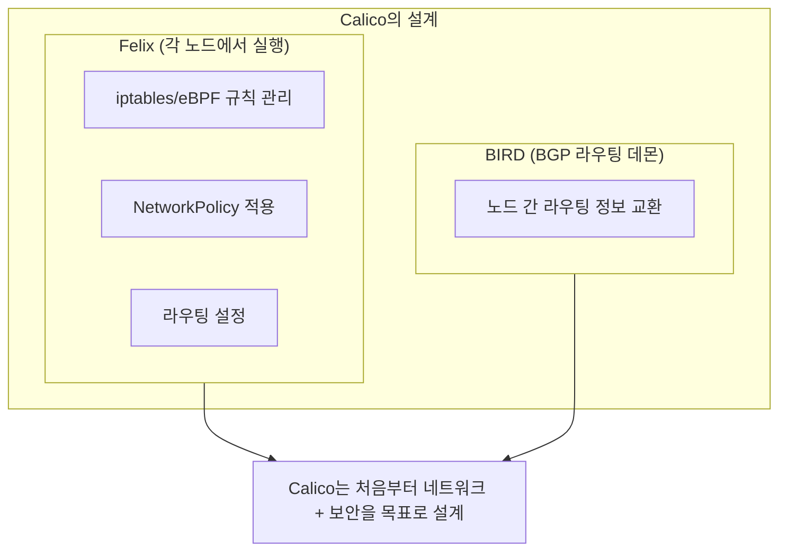

## iptables 기초

### iptables란?

iptables는 Linux 커널의 **패킷 필터링 프레임워크**이다.

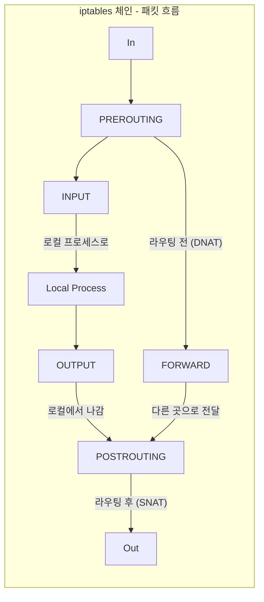

### iptables 테이블

| 테이블 | 용도 |
|--------|------|
| filter | 패킷 필터링 (ACCEPT, DROP) |
| nat | 주소 변환 (SNAT, DNAT) |
| mangle | 패킷 수정 |
| raw | 연결 추적 제외 |

### Kubernetes Service와 iptables

```bash
# Service 관련 iptables 규칙 확인
iptables -t nat -L KUBE-SERVICES -n

# 예시: ClusterIP Service
# KUBE-SVC-xxx → KUBE-SEP-yyy (Pod IP로 DNAT)
```

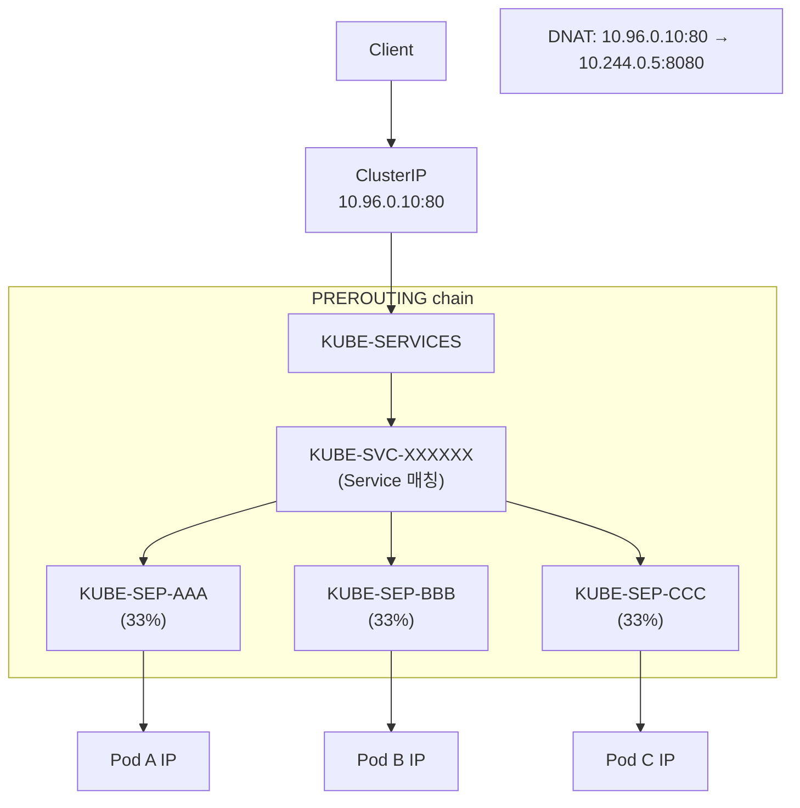

### NetworkPolicy와 iptables

Calico가 NetworkPolicy를 적용하면 iptables 규칙이 생성된다.

```bash
# NetworkPolicy 관련 규칙 확인
iptables -L cali-fw-xxx -n

# 예시 규칙:
# -A cali-fw-xxx -m set --match-set cali-s:xxx src -j ACCEPT
# -A cali-fw-xxx -j DROP
```

## eBPF 기초

### eBPF란?

**eBPF(extended Berkeley Packet Filter)**는 커널에서 안전하게 프로그램을 실행하는 기술이다.

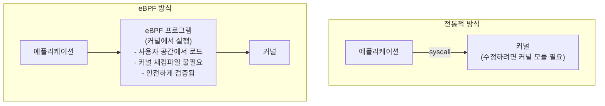

### eBPF vs iptables

| 특성 | iptables | eBPF |
|------|----------|------|
| 성능 | 규칙 많아지면 느려짐 | 일정한 성능 |
| 유연성 | 제한적 | 프로그래밍 가능 |
| 관측성 | 기본적 | 상세한 메트릭 |
| 복잡도 | 낮음 | 높음 |

### Cilium의 eBPF 활용

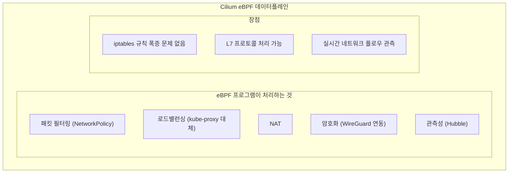

## 정리

### CNI 선택 시 고려사항

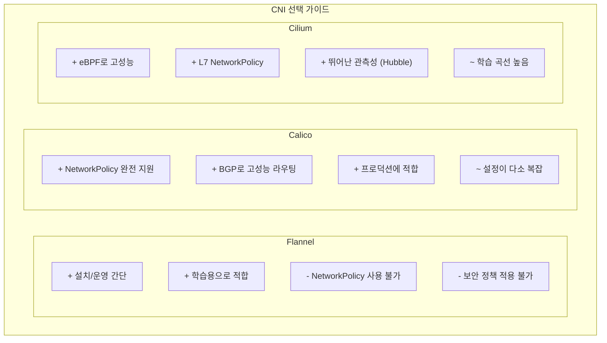

### 핵심 용어 정리

| 용어 | 설명 |
|------|------|
| Overlay | 물리 네트워크 위의 가상 네트워크 |
| Underlay | 실제 물리 네트워크 |
| VXLAN | UDP 기반 L2 오버레이 기술 |
| VTEP | VXLAN 캡슐화/역캡슐화 엔드포인트 |
| BGP | 라우팅 프로토콜 (Border Gateway Protocol) |
| iptables | Linux 패킷 필터링 |
| eBPF | 커널 내 프로그램 실행 기술 |
| L2/L3 | OSI 모델 Data Link/Network 계층 |

## 다음 단계

- [Kubernetes 네트워킹 심화 - Service와 kube-proxy](/kubernetes/kubernetes-network-service)
- [Kubernetes 보안 - NetworkPolicy 심화](/kubernetes/kubernetes-networkpolicy-advanced)
