**CKS(Certified Kubernetes Security Specialist)**는 Kubernetes 보안 전문 자격증이다. 이 장에서는 CKS 시험 범위에 맞춰 클러스터 보안, 시스템 하드닝, 워크로드 보안을 종합적으로 다룬다. 각 개념을 처음 접하는 독자를 위해 상세히 설명한다.

## CKS 시험 개요

### 시험 정보

| 항목 | 내용 |
|------|------|
| 전제조건 | CKA 자격증 |
| 시간 | 2시간 |
| 합격 점수 | 67% 이상 |
| 문제 수 | 15-20문제 |
| 형식 | 실습 기반 |

### 시험 도메인

| 도메인 | 비중 |
|--------|------|
| Cluster Setup (클러스터 설정) | 10% |
| Cluster Hardening (클러스터 하드닝) | 15% |
| System Hardening (시스템 하드닝) | 15% |
| Minimize Microservice Vulnerabilities | 20% |
| Supply Chain Security | 20% |
| Monitoring, Logging, Runtime Security | 20% |

---

## 클러스터 설정 보안

### API Server란?

**API Server**는 Kubernetes의 "정문"이다. 모든 요청(kubectl 명령, Pod 생성, 조회 등)은 API Server를 통해 처리된다.

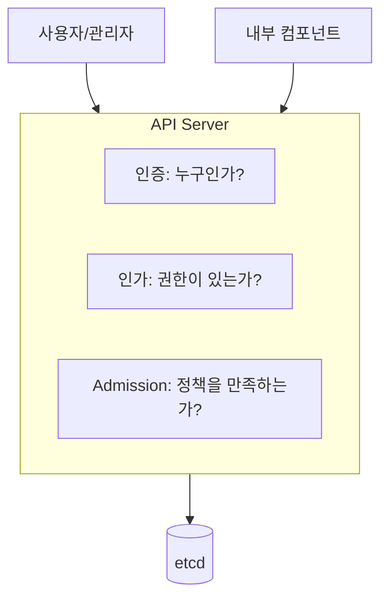

API Server가 해킹당하면 클러스터 전체가 위험해진다. 따라서 API Server 보안이 가장 중요하다.

### API Server 보안 설정

API Server는 `/etc/kubernetes/manifests/kube-apiserver.yaml` 파일에서 설정한다. 주요 보안 설정을 하나씩 살펴보자.

```yaml
# /etc/kubernetes/manifests/kube-apiserver.yaml
spec:
  containers:
  - command:
    - kube-apiserver

    # 1. 익명 접근 비활성화
    # 인증 없이 API에 접근하는 것을 막는다
    - --anonymous-auth=false

    # 2. 감사 로깅 - 누가 무엇을 했는지 기록
    - --audit-log-path=/var/log/kubernetes/audit.log
    - --audit-policy-file=/etc/kubernetes/audit-policy.yaml
    - --audit-log-maxage=30        # 30일간 보관
    - --audit-log-maxbackup=10     # 최대 10개 파일
    - --audit-log-maxsize=100      # 파일당 100MB

    # 3. etcd 데이터 암호화
    - --encryption-provider-config=/etc/kubernetes/enc.yaml

    # 4. Admission Plugin 활성화
    - --enable-admission-plugins=NodeRestriction,PodSecurity

    # 5. TLS 최소 버전 (오래된 암호화 방식 차단)
    - --tls-min-version=VersionTLS12
    - --tls-cipher-suites=TLS_ECDHE_RSA_WITH_AES_128_GCM_SHA256
```

**각 설정의 의미**:

| 설정 | 설명 | 왜 필요한가? |
|------|------|-------------|
| `anonymous-auth=false` | 익명 요청 차단 | 인증 없이 API 접근 방지 |
| `audit-log-*` | 모든 API 요청 기록 | 보안 사고 시 추적 |
| `encryption-provider-config` | Secret 등 민감 데이터 암호화 | etcd 유출 시에도 데이터 보호 |
| `tls-min-version` | 최소 TLS 버전 지정 | 취약한 암호화 프로토콜 차단 |

### 감사(Audit) 로그란?

**감사 로그**는 "누가, 언제, 무엇을 했는지"를 기록하는 것이다. 보안 사고가 발생했을 때 원인을 추적할 수 있다.

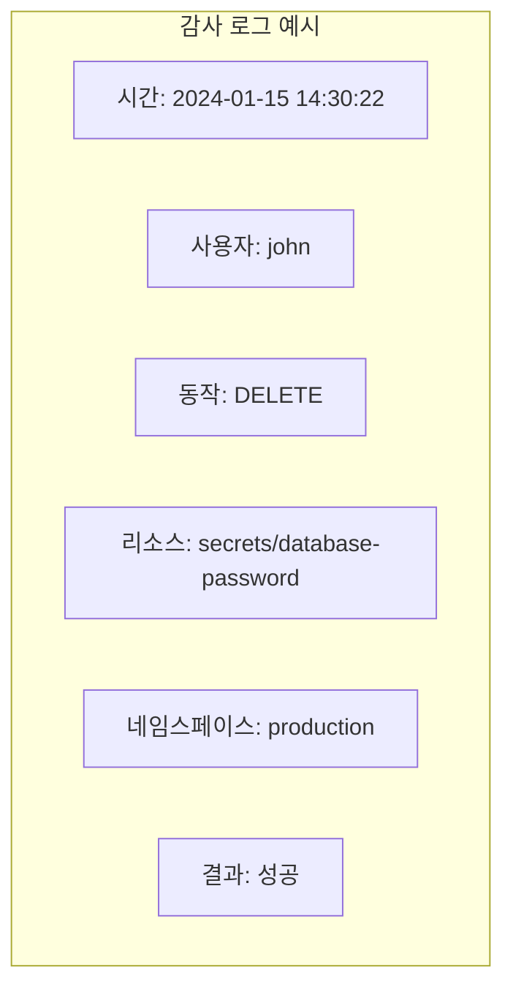

### 감사 정책 설정

감사 정책은 "무엇을 얼마나 상세히 기록할지"를 정한다.

```yaml
# /etc/kubernetes/audit-policy.yaml
apiVersion: audit.k8s.io/v1
kind: Policy
rules:
# Secret과 ConfigMap은 모든 내용을 기록 (가장 상세)
- level: RequestResponse
  resources:
  - group: ""
    resources: ["secrets", "configmaps"]

# 인증 관련은 메타데이터만 기록
- level: Metadata
  resources:
  - group: "authentication.k8s.io"
    resources: ["tokenreviews"]

# 나머지는 메타데이터만, RequestReceived 단계는 생략
- level: Metadata
  omitStages:
  - "RequestReceived"
```

**감사 레벨 설명**:

| 레벨 | 기록 내용 | 사용 예 |
|------|----------|---------|
| `None` | 기록 안 함 | 중요하지 않은 리소스 |
| `Metadata` | 누가, 언제, 무엇을 | 일반적인 로깅 |
| `Request` | Metadata + 요청 본문 | 중요 리소스 |
| `RequestResponse` | Request + 응답 본문 | Secret 등 민감 데이터 |

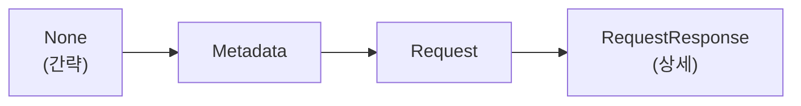

### etcd 암호화란?

**etcd**는 Kubernetes의 모든 데이터를 저장하는 데이터베이스이다. Secret, ConfigMap, Pod 정보 등 모든 것이 여기에 저장된다.

문제는 etcd의 데이터가 **기본적으로 암호화되지 않는다**는 것이다.

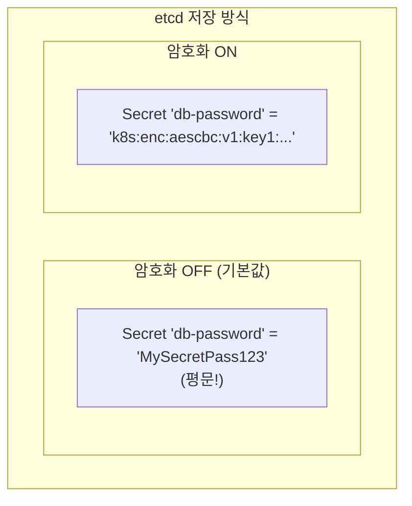

etcd 백업 파일이 유출되거나, etcd에 직접 접근이 가능하면 모든 Secret이 노출된다. 따라서 암호화가 필수이다.

### etcd 암호화 설정

```yaml
# /etc/kubernetes/enc.yaml
apiVersion: apiserver.config.k8s.io/v1
kind: EncryptionConfiguration
resources:
- resources:
  - secrets  # Secret 리소스를 암호화
  providers:
  # 첫 번째 provider로 암호화
  - aescbc:
      keys:
      - name: key1
        # 32바이트 키를 base64 인코딩한 값
        secret: <base64-encoded-32-byte-key>
  # 복호화 시 기존 평문도 읽을 수 있도록
  - identity: {}
```

**provider 순서의 의미**:
- **첫 번째 provider**: 새로 저장할 때 사용 (aescbc로 암호화)
- **identity**: 암호화하지 않음 (기존 평문 데이터 읽기용)

```bash
# 32바이트 암호화 키 생성
head -c 32 /dev/urandom | base64

# 기존 Secret들을 새 암호화 방식으로 재저장
kubectl get secrets -A -o json | kubectl replace -f -

# 암호화 확인 (암호화되면 읽을 수 없는 문자열)
ETCDCTL_API=3 etcdctl get /registry/secrets/default/my-secret \
  --endpoints=https://127.0.0.1:2379 \
  --cacert=/etc/kubernetes/pki/etcd/ca.crt \
  --cert=/etc/kubernetes/pki/etcd/server.crt \
  --key=/etc/kubernetes/pki/etcd/server.key | hexdump -C
```

### kubelet이란?

**kubelet**은 각 워커 노드에서 실행되는 에이전트이다. Pod를 실제로 실행하고 관리하는 역할을 한다.

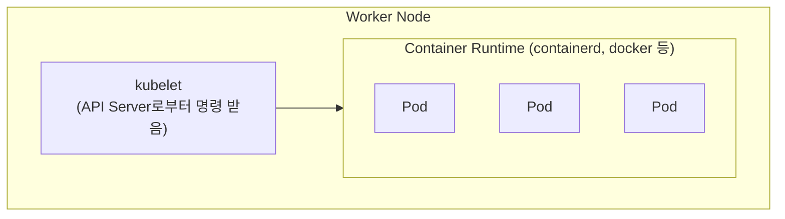

kubelet도 API를 제공하는데, 이것이 열려 있으면 공격자가 Pod 정보를 조회하거나 명령을 실행할 수 있다.

### kubelet 보안 설정

```yaml
# /var/lib/kubelet/config.yaml
authentication:
  anonymous:
    enabled: false      # 익명 접근 차단
  webhook:
    enabled: true       # API Server를 통한 인증
authorization:
  mode: Webhook         # API Server를 통한 인가
readOnlyPort: 0         # 읽기 전용 포트 비활성화 (10255)
protectKernelDefaults: true  # 커널 파라미터 보호
```

| 설정 | 기본값 | 권장값 | 이유 |
|------|--------|--------|------|
| `anonymous.enabled` | true | false | 인증 없는 접근 차단 |
| `readOnlyPort` | 10255 | 0 (비활성화) | 메트릭 노출 방지 |
| `authorization.mode` | AlwaysAllow | Webhook | 권한 확인 |

```bash
# kubelet 설정 확인
ps aux | grep kubelet
cat /var/lib/kubelet/config.yaml

# kubelet API 접근 테스트 (차단되어야 함)
curl -k https://localhost:10250/pods
```

---

## 네트워크 보안

### NetworkPolicy란?

**NetworkPolicy**는 Pod 간 네트워크 트래픽을 제어하는 방화벽 규칙이다.

기본적으로 Kubernetes의 모든 Pod는 서로 통신할 수 있다. 이것은 편리하지만 보안상 위험하다. 공격자가 하나의 Pod를 장악하면 다른 모든 Pod에 접근할 수 있기 때문이다.

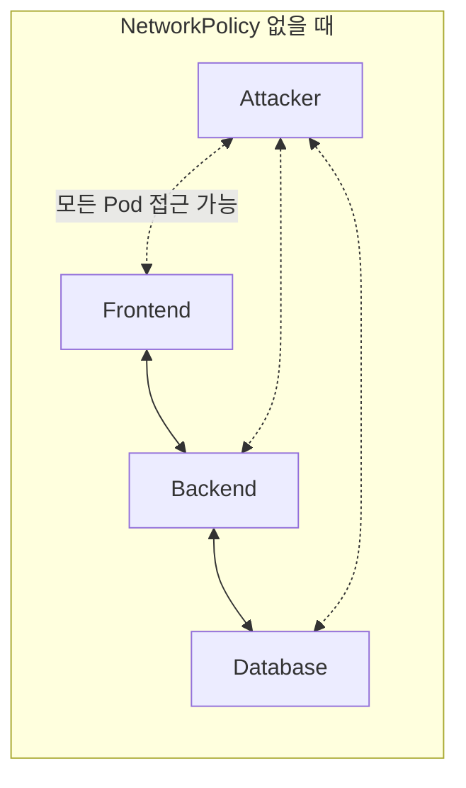

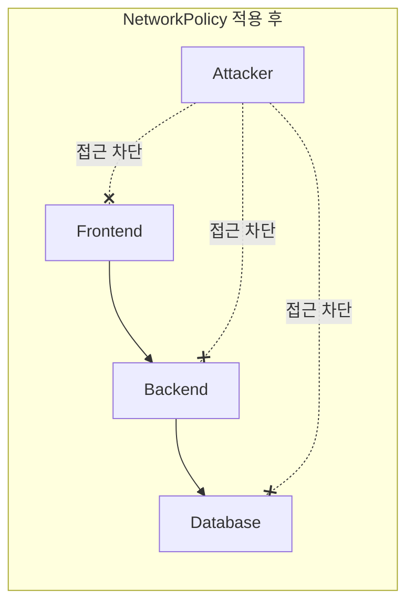

### Default Deny 정책

보안의 기본 원칙은 **"기본적으로 모두 차단, 필요한 것만 허용"**이다.

```yaml
# 기본 거부 정책 - 이 namespace의 모든 트래픽 차단
apiVersion: networking.k8s.io/v1
kind: NetworkPolicy
metadata:
  name: default-deny-all
  namespace: production
spec:
  podSelector: {}      # 모든 Pod에 적용
  policyTypes:
  - Ingress            # 들어오는 트래픽 차단
  - Egress             # 나가는 트래픽 차단
```

**spec.podSelector: {}** 의 의미:
- 빈 selector `{}`는 "모든 Pod"를 의미한다
- 이 정책이 적용되면 해당 namespace의 모든 Pod가 격리된다

### 특정 트래픽 허용

Default Deny 후 필요한 트래픽만 허용한다.

```yaml
# Backend가 Frontend로부터만 8080 포트 접근 허용
apiVersion: networking.k8s.io/v1
kind: NetworkPolicy
metadata:
  name: allow-frontend-to-backend
  namespace: production
spec:
  podSelector:
    matchLabels:
      app: backend         # 이 정책이 적용될 Pod
  policyTypes:
  - Ingress
  ingress:
  - from:
    - namespaceSelector:
        matchLabels:
          name: frontend   # frontend namespace에서
      podSelector:
        matchLabels:
          app: web         # app=web 라벨을 가진 Pod만
    ports:
    - protocol: TCP
      port: 8080           # 8080 포트만 허용
```

**from 조건 해석**:
```yaml
from:
- namespaceSelector: ...
  podSelector: ...       # AND 조건 (둘 다 만족해야 함)

from:
- namespaceSelector: ...
- podSelector: ...       # OR 조건 (둘 중 하나만 만족)
```

### Egress(외부 접속) 제어

Pod가 외부로 나가는 트래픽도 제어할 수 있다.

```yaml
# DNS와 특정 서비스만 외부 접속 허용
apiVersion: networking.k8s.io/v1
kind: NetworkPolicy
metadata:
  name: allow-egress
  namespace: production
spec:
  podSelector:
    matchLabels:
      app: backend
  policyTypes:
  - Egress
  egress:
  # DNS 허용 (필수!)
  - to:
    - namespaceSelector: {}
      podSelector:
        matchLabels:
          k8s-app: kube-dns
    ports:
    - protocol: UDP
      port: 53
  # 특정 외부 API만 허용
  - to:
    - ipBlock:
        cidr: 203.0.113.0/24
    ports:
    - protocol: TCP
      port: 443
```

**DNS 허용이 필수인 이유**:
- Egress를 차단하면 DNS 조회도 차단된다
- DNS가 안 되면 서비스 이름으로 통신 불가
- 따라서 kube-dns Pod로의 Egress는 항상 허용해야 한다

---

## 워크로드 보안

### Pod Security Standards (PSS)란?

**Pod Security Standards**는 Pod의 보안 수준을 정의하는 표준이다. Kubernetes 1.25부터 기본 제공된다.

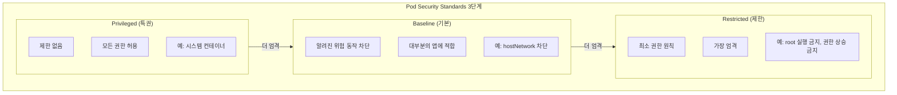

### PSS를 Namespace에 적용

```yaml
apiVersion: v1
kind: Namespace
metadata:
  name: production
  labels:
    # enforce: 위반 시 Pod 생성 거부
    pod-security.kubernetes.io/enforce: restricted
    pod-security.kubernetes.io/enforce-version: latest
    # audit: 위반 시 감사 로그에 기록
    pod-security.kubernetes.io/audit: restricted
    # warn: 위반 시 경고 메시지 표시
    pod-security.kubernetes.io/warn: restricted
```

| 모드 | 동작 | 사용 시기 |
|------|------|----------|
| `enforce` | Pod 생성 거부 | 프로덕션 환경 |
| `audit` | 감사 로그에 기록 | 모니터링 |
| `warn` | 경고 메시지 표시 | 개발/테스트 |

### SecurityContext란?

**SecurityContext**는 Pod나 컨테이너의 보안 설정을 정의한다. "이 컨테이너를 어떤 권한으로 실행할 것인가"를 결정한다.

```yaml
apiVersion: v1
kind: Pod
metadata:
  name: secure-pod
spec:
  # Pod 레벨 보안 설정 (모든 컨테이너에 적용)
  securityContext:
    runAsUser: 1000        # UID 1000으로 실행
    runAsGroup: 1000       # GID 1000으로 실행
    fsGroup: 1000          # 볼륨 파일의 그룹 소유권
    runAsNonRoot: true     # root로 실행 금지
    seccompProfile:
      type: RuntimeDefault # 시스템 콜 필터링

  containers:
  - name: app
    image: myapp:1.0@sha256:abc123...  # 이미지 digest 사용

    # 컨테이너 레벨 보안 설정
    securityContext:
      allowPrivilegeEscalation: false  # 권한 상승 금지
      readOnlyRootFilesystem: true     # 루트 파일시스템 읽기 전용
      capabilities:
        drop:
        - ALL                          # 모든 권한 제거

    resources:
      limits:
        cpu: "500m"
        memory: "256Mi"
      requests:
        cpu: "100m"
        memory: "128Mi"

    volumeMounts:
    - name: tmp
      mountPath: /tmp

  # ServiceAccount 토큰 자동 마운트 비활성화
  automountServiceAccountToken: false

  volumes:
  - name: tmp
    emptyDir: {}  # /tmp용 쓰기 가능 볼륨
```

**각 설정의 의미**:

| 설정 | 의미 | 왜 필요한가? |
|------|------|-------------|
| `runAsNonRoot: true` | root 실행 금지 | 컨테이너 탈출 시 피해 최소화 |
| `readOnlyRootFilesystem` | 파일 수정 금지 | 악성코드 설치 방지 |
| `allowPrivilegeEscalation: false` | 권한 상승 금지 | sudo 등 권한 획득 방지 |
| `capabilities.drop: ALL` | 모든 리눅스 권한 제거 | 최소 권한 원칙 |
| `automountServiceAccountToken: false` | SA 토큰 마운트 안 함 | API 접근 권한 제거 |

### Capabilities란?

**Capabilities**는 리눅스에서 root 권한을 세분화한 것이다. 전통적으로 root는 모든 권한을 가지지만, Capabilities로 필요한 권한만 부여할 수 있다.

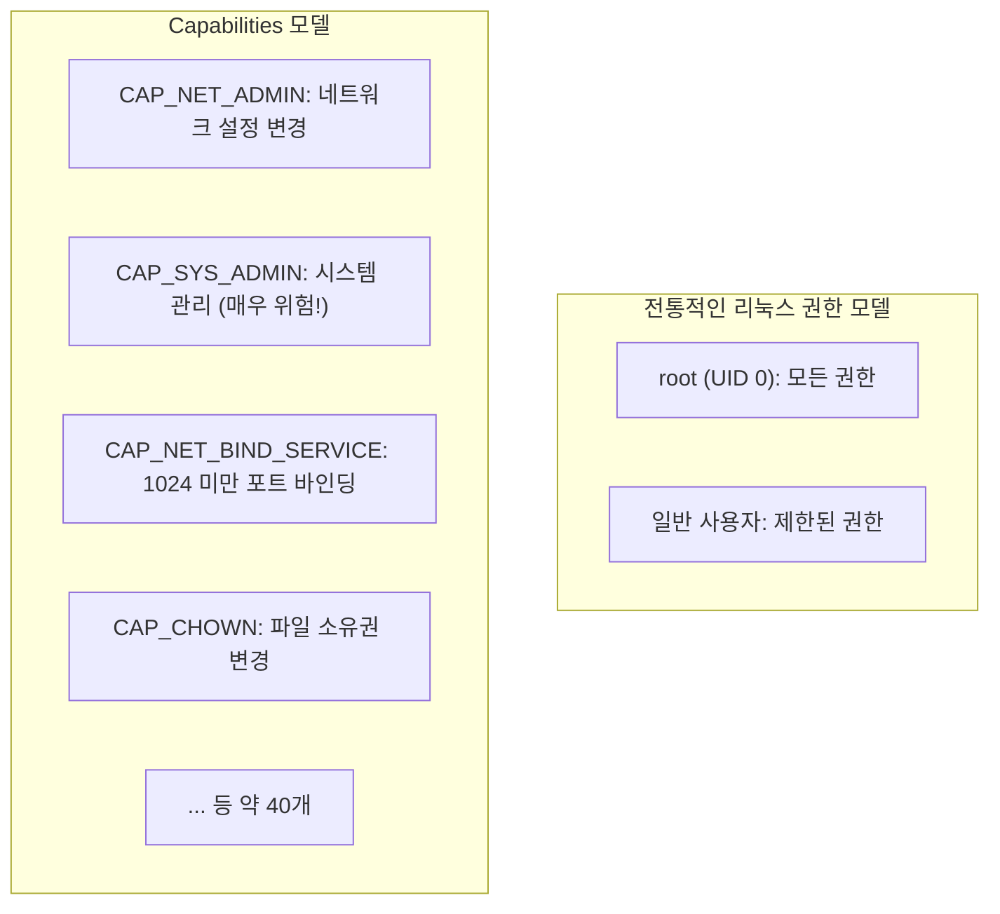

```yaml
securityContext:
  capabilities:
    drop:
    - ALL           # 모든 권한 제거
    add:
    - NET_BIND_SERVICE  # 80 포트 바인딩만 허용
```

### RuntimeClass와 gVisor란?

**RuntimeClass**는 Pod를 실행할 컨테이너 런타임을 선택하는 기능이다.

기본 컨테이너 런타임(runc)은 호스트 커널을 직접 사용한다. 이것은 성능은 좋지만, 컨테이너가 커널 취약점을 악용하면 호스트를 공격할 수 있다.

**gVisor**는 Google이 만든 샌드박스 런타임이다. 가상의 커널을 제공하여 컨테이너와 호스트 커널을 격리한다.

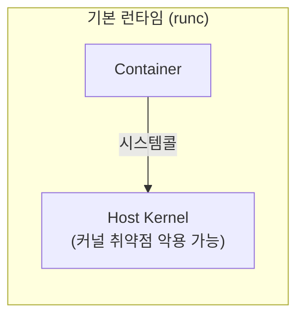

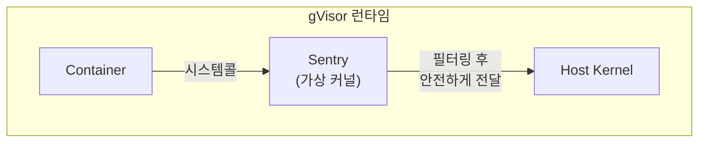

```yaml
# RuntimeClass 정의
apiVersion: node.k8s.io/v1
kind: RuntimeClass
metadata:
  name: gvisor
handler: runsc  # containerd 설정의 handler 이름
---
# Pod에서 사용
apiVersion: v1
kind: Pod
metadata:
  name: sandboxed-pod
spec:
  runtimeClassName: gvisor  # gVisor로 실행
  containers:
  - name: app
    image: nginx
```

| 런타임 | 특징 | 사용 시기 |
|--------|------|----------|
| runc (기본) | 빠름, 커널 직접 접근 | 신뢰할 수 있는 워크로드 |
| gVisor | 느림, 커널 격리 | 멀티테넌트, 신뢰 불가 코드 |
| Kata Containers | 경량 VM | 강력한 격리 필요 시 |

---

## 시스템 하드닝

**하드닝(Hardening)**이란 시스템의 공격 표면을 줄이는 것이다. 불필요한 기능을 끄고, 필요한 기능은 제한하여 보안을 강화한다.

### AppArmor란?

**AppArmor**는 리눅스 커널의 보안 모듈이다. 프로세스가 접근할 수 있는 파일, 네트워크, 기능을 제한한다.

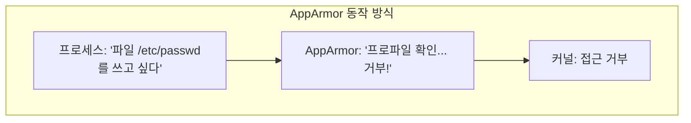

```bash
# AppArmor 상태 확인
sudo aa-status

# 로드된 프로파일 목록
sudo aa-status | grep profiles

# 프로파일 모드
# - enforce: 위반 시 차단
# - complain: 위반 시 로그만 (학습 모드)
```

### Pod에 AppArmor 적용

```yaml
apiVersion: v1
kind: Pod
metadata:
  name: apparmor-pod
  annotations:
    # container.apparmor.security.beta.kubernetes.io/<컨테이너이름>: <프로파일>
    container.apparmor.security.beta.kubernetes.io/app: localhost/k8s-deny-write
spec:
  containers:
  - name: app
    image: busybox
    command: ["sh", "-c", "sleep 3600"]
```

**프로파일 종류**:
- `runtime/default`: 기본 프로파일
- `localhost/<프로파일명>`: 노드에 설치된 커스텀 프로파일
- `unconfined`: AppArmor 비활성화 (권장 안 함)

### Seccomp이란?

**Seccomp(Secure Computing)**은 프로세스가 사용할 수 있는 **시스템 콜을 제한**한다. 시스템 콜은 프로세스가 커널에 요청하는 기능이다.

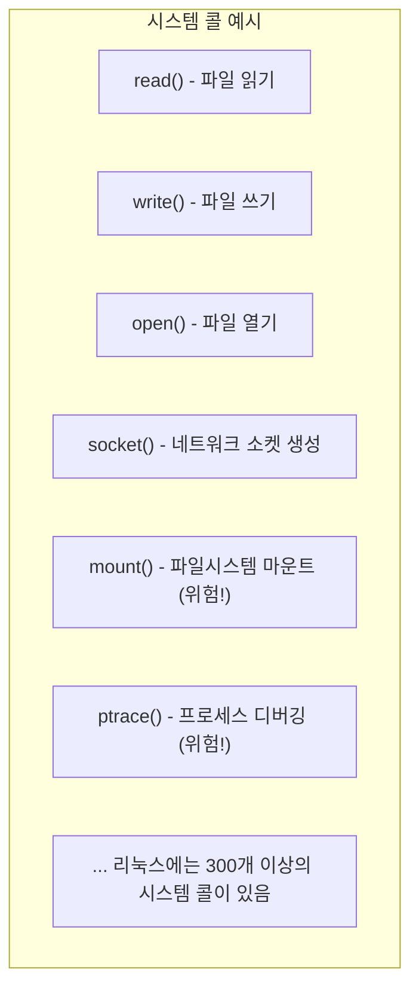

대부분의 애플리케이션은 전체 시스템 콜 중 일부만 사용한다. Seccomp으로 불필요한 시스템 콜을 차단하면 공격 표면을 줄일 수 있다.

```yaml
apiVersion: v1
kind: Pod
metadata:
  name: seccomp-pod
spec:
  securityContext:
    seccompProfile:
      type: RuntimeDefault  # 기본 프로파일 (권장)
  containers:
  - name: app
    image: nginx
```

**Seccomp 프로파일 종류**:

| 타입 | 설명 |
|------|------|
| `RuntimeDefault` | 컨테이너 런타임의 기본 프로파일 |
| `Localhost` | 노드의 커스텀 프로파일 |
| `Unconfined` | Seccomp 비활성화 (권장 안 함) |

```yaml
# 커스텀 프로파일 사용
spec:
  securityContext:
    seccompProfile:
      type: Localhost
      localhostProfile: profiles/custom.json  # /var/lib/kubelet/seccomp/ 기준
```

### AppArmor vs Seccomp

| 구분 | AppArmor | Seccomp |
|------|----------|---------|
| 제어 대상 | 파일/네트워크/기능 | 시스템 콜 |
| 설정 방식 | 프로파일 파일 | JSON 또는 BPF |
| 세밀도 | 경로 기반 | 시스템 콜 기반 |
| 사용 | annotation | securityContext |

---

## 공급망 보안 (Supply Chain Security)

**공급망 보안**이란 소프트웨어가 만들어지고 배포되는 전체 과정의 보안을 말한다. 컨테이너 이미지가 안전한지, 의존성에 취약점은 없는지 확인하는 것이다.

### 이미지 취약점 스캐닝

**Trivy**는 컨테이너 이미지의 취약점을 스캔하는 도구이다.

```bash
# Trivy 설치 (Ubuntu)
sudo apt install trivy

# 이미지 스캔
trivy image nginx:latest

# 심각도 필터링 (HIGH, CRITICAL만)
trivy image --severity HIGH,CRITICAL nginx:latest

# JSON 출력
trivy image -f json -o result.json nginx:latest
```

**출력 예시**:
```
nginx:latest (debian 11.6)
===========================
Total: 142 (UNKNOWN: 0, LOW: 85, MEDIUM: 45, HIGH: 10, CRITICAL: 2)

┌──────────────────┬────────────────┬──────────┬─────────────────────────┐
│     Library      │ Vulnerability  │ Severity │    Installed Version    │
├──────────────────┼────────────────┼──────────┼─────────────────────────┤
│ openssl          │ CVE-2023-0286  │ CRITICAL │ 1.1.1n-0+deb11u3       │
│ curl             │ CVE-2023-27536 │ HIGH     │ 7.74.0-1.3+deb11u7     │
└──────────────────┴────────────────┴──────────┴─────────────────────────┘
```

### 이미지 서명 및 검증

**이미지 서명**은 이미지가 신뢰할 수 있는 출처에서 왔고, 변조되지 않았음을 증명한다.

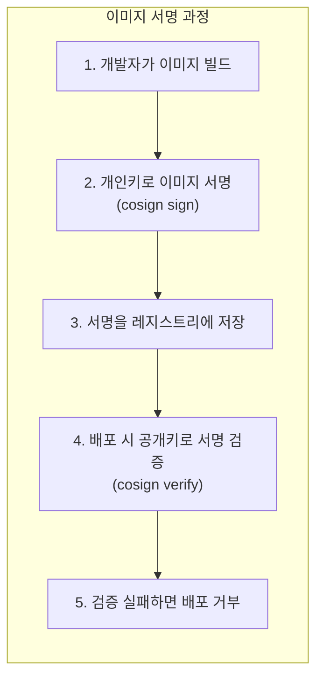

```bash
# cosign으로 이미지 서명
cosign sign --key cosign.key registry.example.com/myapp:1.0

# 서명 검증
cosign verify --key cosign.pub registry.example.com/myapp:1.0
```

### 이미지 Digest 사용

태그(`:latest`, `:1.0`)는 변경될 수 있다. 같은 태그로 다른 이미지가 푸시될 수 있어 보안상 위험하다.

**Digest**는 이미지 내용의 해시값으로, 내용이 바뀌면 digest도 바뀐다.

```yaml
# 나쁜 예 - 태그 사용
image: nginx:latest      # 내용이 바뀔 수 있음

# 좋은 예 - digest 사용
image: nginx@sha256:abc123def456...  # 정확히 이 이미지만 사용
```

### Dockerfile 보안 베스트 프랙티스

```dockerfile
# 나쁜 예
FROM ubuntu:latest              # 태그가 변할 수 있음
RUN apt-get update && apt-get install -y curl wget vim  # 불필요한 패키지
USER root                       # root로 실행
COPY . /app                     # 모든 파일 복사
CMD ["./app"]

# 좋은 예
# 1. 정확한 버전 + digest
FROM ubuntu:22.04@sha256:abc123...

# 2. 최소한의 패키지만 설치, 캐시 삭제
RUN apt-get update && apt-get install -y --no-install-recommends curl \
    && apt-get clean \
    && rm -rf /var/lib/apt/lists/*

# 3. non-root 사용자 생성
RUN useradd -r -u 1000 appuser
USER appuser

# 4. 작업 디렉토리 설정
WORKDIR /app

# 5. 필요한 파일만 복사, 소유권 설정
COPY --chown=appuser:appuser ./bin/app ./app

CMD ["./app"]
```

| 원칙 | 이유 |
|------|------|
| 최소 베이스 이미지 | 공격 표면 감소 |
| non-root 사용자 | 권한 상승 방지 |
| 불필요한 패키지 제거 | 취약점 감소 |
| digest 사용 | 이미지 무결성 보장 |

### ImagePolicyWebhook

**ImagePolicyWebhook**은 Pod 생성 시 이미지를 검증하는 Admission Controller이다.

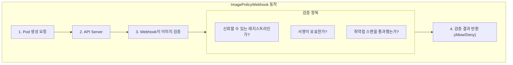

```yaml
# /etc/kubernetes/admission/admission.yaml
apiVersion: apiserver.config.k8s.io/v1
kind: AdmissionConfiguration
plugins:
- name: ImagePolicyWebhook
  configuration:
    imagePolicy:
      kubeConfigFile: /etc/kubernetes/image-policy/kubeconfig.yaml
      allowTTL: 50
      denyTTL: 50
      retryBackoff: 500
      defaultAllow: false  # 검증 실패 시 기본 거부
```

---

## 런타임 보안

**런타임 보안**은 컨테이너가 실행 중일 때 이상 행위를 탐지하고 대응하는 것이다.

### Falco란?

**Falco**는 CNCF의 런타임 보안 프로젝트이다. 커널 레벨에서 시스템 콜을 모니터링하여 이상 행위를 탐지한다.

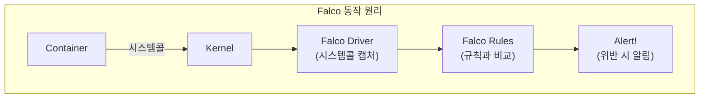

### Falco 설치

```bash
# Helm으로 설치
helm repo add falcosecurity https://falcosecurity.github.io/charts
helm install falco falcosecurity/falco

# 로그 확인
kubectl logs -n falco -l app=falco
```

### Falco 규칙 예시

```yaml
# 컨테이너에서 쉘 실행 탐지
- rule: Terminal shell in container
  desc: A shell was spawned in a container
  condition: >
    spawned_process and container
    and shell_procs
    and proc.tty != 0
  output: >
    Shell spawned in container
    (user=%user.name container=%container.name shell=%proc.name)
  priority: WARNING

# 민감한 파일 읽기 탐지
- rule: Read sensitive file
  desc: Sensitive file was read
  condition: >
    open_read and container
    and fd.name in (/etc/shadow, /etc/passwd)
  output: >
    Sensitive file read
    (user=%user.name file=%fd.name container=%container.name)
  priority: WARNING

# 비정상적인 외부 접속 탐지
- rule: Unexpected outbound connection
  desc: Container made outbound connection
  condition: >
    outbound and container
    and not allowed_outbound_destinations
  output: >
    Outbound connection from container
    (command=%proc.cmdline connection=%fd.name)
  priority: NOTICE
```

**Falco 조건 키워드**:

| 키워드 | 의미 |
|--------|------|
| `spawned_process` | 새 프로세스 생성 |
| `container` | 컨테이너 내부 |
| `shell_procs` | sh, bash 등 쉘 프로세스 |
| `open_read` | 파일 읽기 |
| `outbound` | 외부 네트워크 접속 |

### 탐지 예시

```bash
# 실시간 알림 확인
kubectl logs -n falco -l app=falco -f

# 출력 예시:
# 14:30:22.123 Warning Shell spawned in container
#   (user=root container=myapp-pod shell=/bin/bash
#    parent=python cmdline=bash)
```

---

## RBAC 보안 심화

### 최소 권한 원칙

RBAC에서 가장 중요한 원칙은 **"필요한 최소한의 권한만 부여"**이다.

```yaml
# 나쁜 예 - 너무 많은 권한
apiVersion: rbac.authorization.k8s.io/v1
kind: Role
metadata:
  name: too-permissive
rules:
- apiGroups: ["*"]
  resources: ["*"]
  verbs: ["*"]

# 좋은 예 - 특정 ConfigMap만 읽기
apiVersion: rbac.authorization.k8s.io/v1
kind: Role
metadata:
  name: configmap-reader
  namespace: production
rules:
- apiGroups: [""]
  resources: ["configmaps"]
  resourceNames: ["app-config"]  # 특정 리소스만!
  verbs: ["get", "watch"]
```

### 권한 검증

```bash
# 특정 사용자의 권한 목록 확인
kubectl auth can-i --list --as jane

# 특정 동작 확인
kubectl auth can-i create pods --as jane -n production
kubectl auth can-i delete secrets --as system:serviceaccount:default:my-sa

# 클러스터 관리자 권한 확인 (있으면 위험!)
kubectl auth can-i '*' '*' --as system:serviceaccount:default:my-sa
```

### ServiceAccount 보안

**ServiceAccount**는 Pod가 API Server에 인증할 때 사용하는 계정이다. 기본적으로 Pod에 자동 마운트된다.

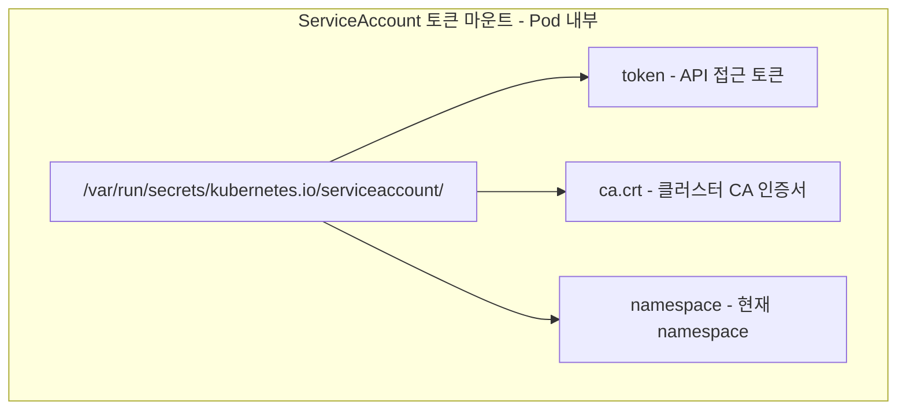

이 토큰이 유출되면 공격자가 해당 ServiceAccount의 권한으로 API를 호출할 수 있다.

```yaml
# 토큰 자동 마운트 비활성화 (ServiceAccount 레벨)
apiVersion: v1
kind: ServiceAccount
metadata:
  name: no-token-sa
automountServiceAccountToken: false

---
# Pod 레벨에서도 비활성화
apiVersion: v1
kind: Pod
metadata:
  name: secure-pod
spec:
  serviceAccountName: my-sa
  automountServiceAccountToken: false  # 여기서도 명시
```

---

## 인증서 관리

### Kubernetes 인증서 구조

Kubernetes는 TLS 인증서로 컴포넌트 간 통신을 암호화한다.

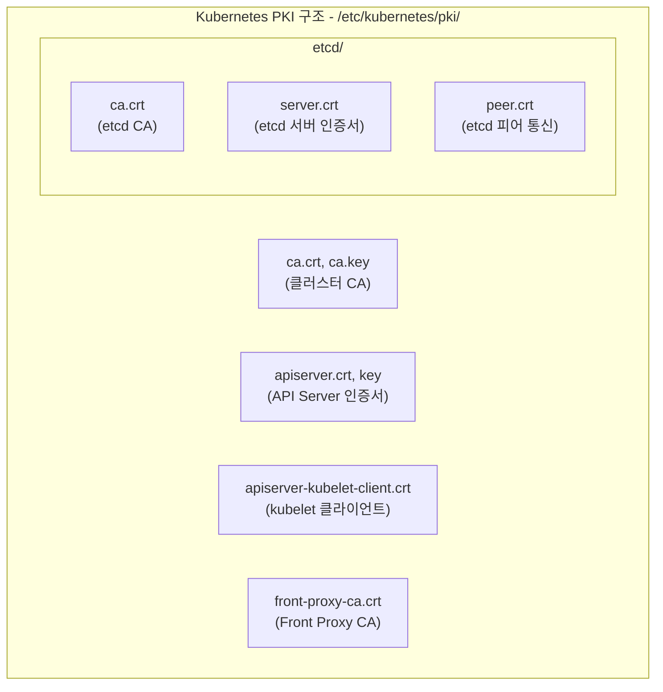

### 인증서 만료 확인

kubeadm으로 설치한 클러스터의 인증서는 **1년** 후 만료된다. 만료되면 클러스터가 동작하지 않는다.

```bash
# 모든 인증서 만료일 확인
kubeadm certs check-expiration

# 출력 예시:
# CERTIFICATE                EXPIRES                  RESIDUAL TIME
# admin.conf                 Jan 15, 2025 09:00 UTC   364d
# apiserver                  Jan 15, 2025 09:00 UTC   364d
# apiserver-kubelet-client   Jan 15, 2025 09:00 UTC   364d
# ...

# 특정 인증서 상세 확인
openssl x509 -in /etc/kubernetes/pki/apiserver.crt -noout -dates -subject

# 출력 예시:
# notBefore=Jan 15 09:00:00 2024 GMT
# notAfter=Jan 15 09:00:00 2025 GMT
# subject=CN = kube-apiserver
```

### 인증서 갱신

```bash
# 모든 인증서 갱신
kubeadm certs renew all

# 개별 인증서 갱신
kubeadm certs renew apiserver
kubeadm certs renew apiserver-kubelet-client

# 갱신 후 API Server 재시작 필요
# (Static Pod이므로 매니페스트 파일 수정하면 자동 재시작)
```

### CSR (Certificate Signing Request)

새로운 사용자나 컴포넌트에 인증서를 발급할 때 CSR을 사용한다.

```bash
# CSR 목록 확인
kubectl get csr

# 출력 예시:
# NAME        AGE   SIGNERNAME                     REQUESTOR       CONDITION
# john-csr    10s   kubernetes.io/kube-apiserver-client   admin   Pending

# CSR 상세 확인
kubectl describe csr john-csr

# CSR 승인
kubectl certificate approve john-csr

# CSR 거부
kubectl certificate deny john-csr
```

---

## CKS 필수 명령어 정리

```bash
# === 보안 컨텍스트 확인 ===
kubectl get pod <pod> -o jsonpath='{.spec.securityContext}'
kubectl get pod <pod> -o jsonpath='{.spec.containers[0].securityContext}'

# === NetworkPolicy ===
kubectl get networkpolicy -A
kubectl describe networkpolicy <name>

# === 감사 로그 ===
sudo cat /var/log/kubernetes/audit.log | jq .

# === 이미지 스캔 ===
trivy image <image>
trivy image --severity HIGH,CRITICAL <image>

# === AppArmor ===
sudo aa-status

# === Seccomp ===
# 프로파일 위치: /var/lib/kubelet/seccomp/

# === RBAC ===
kubectl auth can-i --list
kubectl auth can-i <verb> <resource> --as <user>
kubectl auth can-i --list --as system:serviceaccount:<ns>:<sa>

# === 인증서 ===
kubeadm certs check-expiration
openssl x509 -in <cert> -noout -text
kubectl get csr
kubectl certificate approve <csr>

# === Secret 암호화 확인 ===
ETCDCTL_API=3 etcdctl get /registry/secrets/<namespace>/<name> \
  --endpoints=https://127.0.0.1:2379 \
  --cacert=/etc/kubernetes/pki/etcd/ca.crt \
  --cert=/etc/kubernetes/pki/etcd/server.crt \
  --key=/etc/kubernetes/pki/etcd/server.key

# === kubelet 설정 ===
ps aux | grep kubelet
cat /var/lib/kubelet/config.yaml

# === API Server 설정 ===
cat /etc/kubernetes/manifests/kube-apiserver.yaml
```

---

## CKS 빈출 시나리오

### 시나리오 1: Default Deny NetworkPolicy

```yaml
# 모든 트래픽 차단 후 필요한 것만 허용
apiVersion: networking.k8s.io/v1
kind: NetworkPolicy
metadata:
  name: default-deny
  namespace: production
spec:
  podSelector: {}
  policyTypes:
  - Ingress
  - Egress
```

### 시나리오 2: 보안 Pod 생성

```yaml
apiVersion: v1
kind: Pod
metadata:
  name: secure-app
spec:
  securityContext:
    runAsUser: 1000
    runAsNonRoot: true
    seccompProfile:
      type: RuntimeDefault
  containers:
  - name: app
    image: nginx
    securityContext:
      allowPrivilegeEscalation: false
      readOnlyRootFilesystem: true
      capabilities:
        drop:
        - ALL
  automountServiceAccountToken: false
```

### 시나리오 3: etcd 암호화 적용

```bash
# 1. 암호화 키 생성
head -c 32 /dev/urandom | base64

# 2. 암호화 설정 파일 생성 (/etc/kubernetes/enc.yaml)

# 3. API Server에 --encryption-provider-config 추가

# 4. API Server 재시작 (매니페스트 수정)

# 5. 기존 Secret 재암호화
kubectl get secrets -A -o json | kubectl replace -f -
```

### 시나리오 4: Trivy 스캔

```bash
# HIGH, CRITICAL만 출력
trivy image --severity HIGH,CRITICAL nginx:1.24

# 특정 CVE 확인
trivy image nginx:1.24 | grep CVE-2023-
```

### 시나리오 5: AppArmor 적용

```yaml
apiVersion: v1
kind: Pod
metadata:
  name: apparmor-pod
  annotations:
    container.apparmor.security.beta.kubernetes.io/app: runtime/default
spec:
  containers:
  - name: app
    image: nginx
```

### 시나리오 6: RBAC 권한 확인

```bash
# ServiceAccount의 모든 권한 확인
kubectl auth can-i --list --as system:serviceaccount:default:my-sa

# 위험한 권한 확인
kubectl auth can-i create pods --as system:serviceaccount:default:my-sa
kubectl auth can-i get secrets --as system:serviceaccount:default:my-sa
```

---

## 마무리

CKS 시험 준비를 위한 핵심 포인트:

1. **CKA 먼저** - CKS는 CKA 자격이 전제조건
2. **핸즈온 연습** - killer.sh에서 CKS 모의고사
3. **공식 문서 숙지** - kubernetes.io/docs의 보안 섹션
4. **도구 익숙해지기** - trivy, falco, AppArmor, seccomp

**학습 순서 권장**:
1. NetworkPolicy 완전 이해
2. Pod SecurityContext 설정 연습
3. RBAC 권한 분석
4. 이미지 스캐닝 (Trivy)
5. 시스템 하드닝 (AppArmor, Seccomp)
6. 런타임 보안 (Falco)

