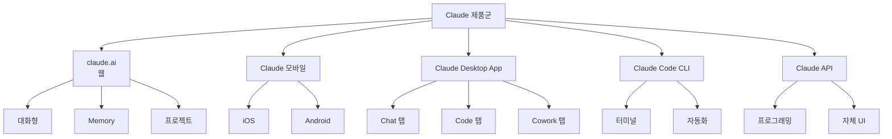
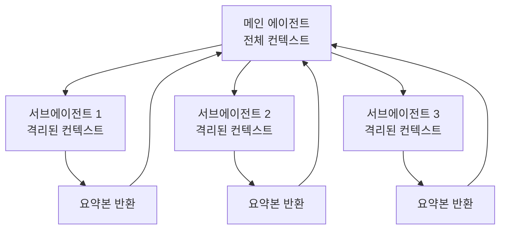
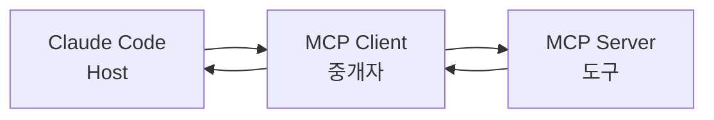
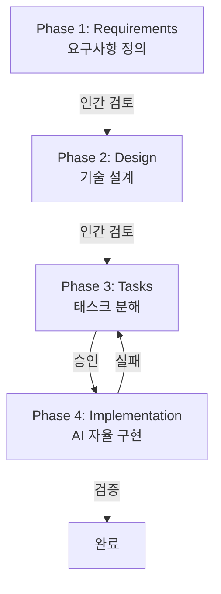

## 목차

1. [토큰 효율적으로 사용하는 방법론](#1-토큰-효율적으로-사용하는-방법론)

- [1.1 왜 토큰 관리가 중요한가](#11-왜-토큰-관리가-중요한가)
- [1.2 토큰의 원리 - 내부적으로 어떻게 작동하는가](#12-토큰의-원리---내부적으로-어떻게-작동하는가)
- [1.3 토큰 소비 구조 이해](#13-토큰-소비-구조-이해)
- [1.4 핵심 원칙: "적게 넣고, 정확히 넣고, 자주 비워라"](#14-핵심-원칙-적게-넣고-정확히-넣고-자주-비워라)

2. [Claude 플랫폼 가이드](#2-claude-플랫폼-가이드)

- [2.1 Claude 제품군 전체 지도](#21-claude-제품군-전체-지도)
- [2.2 Claude Desktop App - 세 가지 탭](#22-claude-desktop-app---세-가지-탭)
- [2.3 Claude Code CLI vs Desktop Code 탭](#23-claude-code-cli-vs-desktop-code-탭)
- [2.4 claude.ai 웹 채팅 최적화](#24-claudeai-웹-채팅-최적화)
- [2.5 Memory 시스템의 내부 동작 원리](#25-memory-시스템의-내부-동작-원리)
- [2.6 대화 구조화 전략](#26-대화-구조화-전략)

3. [Claude Code 토큰 최적화](#3-claude-code-토큰-최적화)

- [3.1 모델 선택 전략](#31-모델-선택-전략)
- [3.2 Plan Mode 활용](#32-plan-mode-활용)
- [3.3 서브에이전트를 활용한 컨텍스트 보호](#33-서브에이전트를-활용한-컨텍스트-보호)
- [3.4 MCP 응답 최적화 - 97% 토큰 절약 기법](#34-mcp-응답-최적화---97-토큰-절약-기법)
- [3.5 CLAUDE.md 3계층 아키텍처](#35-claudemd-3계층-아키텍처)
- [3.6 Hook을 활용한 자동 최적화](#36-hook을-활용한-자동-최적화)
- [3.7 Skills - 재사용 가능한 프롬프트 템플릿](#37-skills---재사용-가능한-프롬프트-템플릿)

4. [Spec-Driven Development(SDD) 심층 가이드](#4-spec-driven-developmentsdd-심층-가이드)

- [4.1 SDD란 무엇인가](#41-sdd란-무엇인가)
- [4.2 SDD의 4대 원칙](#42-sdd의-4대-원칙)
- [4.3 SDD 워크플로우](#43-sdd-워크플로우)
- [4.4 SDD의 비판과 균형](#44-sdd의-비판과-균형)
- [4.5 SDD의 토큰 최적화 효과](#45-sdd의-토큰-최적화-효과)

5. [SDD 프레임워크 비교](#5-sdd-프레임워크-비교)

- [5.1 OpenSpec](#51-openspec)
- [5.2 GitHub Spec Kit](#52-github-spec-kit)
- [5.3 BMAD Method](#53-bmad-method)
- [5.4 Kiro (AWS)](#54-kiro-aws)
- [5.5 cc-sdd](#55-cc-sdd)
- [5.6 프레임워크 선택 가이드](#56-프레임워크-선택-가이드)

6. [Oh My Claude / Oh My ClaudeCode](#6-oh-my-claude--oh-my-claudecode)

- [6.1 Oh My Claude](#61-oh-my-claude)
- [6.2 Oh My ClaudeCode](#62-oh-my-claudecode)
- [6.3 oh-my-claude-code (KaimingWan - 학습형 프레임워크)](#63-oh-my-claude-code-kaimingwan---학습형-프레임워크)

7. [2026년 AI 코딩 도구](#7-2026년-ai-코딩-도구)

- [7.1 CLI 에이전트 (터미널 기반)](#71-cli-에이전트-터미널-기반)
- [7.2 IDE 기반 에이전트](#72-ide-기반-에이전트)
- [7.3 통합 터미널 환경 - Warp](#73-통합-터미널-환경---warp)
- [7.4 도구별 비교 요약](#74-도구별-비교-요약)

8. [OpenClaw - 2026년 가장 뜨거운 AI 에이전트](#8-openclaw---2026년-가장-뜨거운-ai-에이전트)

- [8.1 OpenClaw란 무엇인가](#81-openclaw란-무엇인가)
- [8.2 기존 AI 챗봇과의 차이](#82-기존-ai-챗봇과의-차이)
- [8.3 주요 기능](#83-주요-기능)
- [8.4 실제 사용 사례](#84-실제-사용-사례)
- [8.5 보안 우려 - 반드시 읽어야 한다](#85-보안-우려---반드시-읽어야-한다)

9. [도구 선택 가이드 및 2026년 트렌드](#9-도구-선택-가이드-및-2026년-트렌드)

- [9.1 사용 시나리오별 추천](#91-사용-시나리오별-추천)
- [9.2 조합 전략](#92-조합-전략)
- [9.3 2026년 AI 코딩 트렌드](#93-2026년-ai-코딩-트렌드)

---

## 1. 토큰 효율적으로 사용하는 방법론

### 1.1 왜 토큰 관리가 중요한가

토큰 관리는 현대적 AI 개발의 핵심 기술이다. 토큰은 단순한 청구 단위가 아니라, 모델의 추론 품질을 직결하는 리소스다. 많은 개발자들이 간과하지만, 컨텍스트에 불필요한 정보가 많을수록 모델의 성능이 떨어진다.

> **원문 ([Anthropic Engineering Blog](https://www.anthropic.com/engineering/effective-context-engineering-for-ai-agents)):**
> Context rot is a concept uncovered through needle-in-a-haystack style benchmarking: as the number of tokens in the context window increases, the model's ability to accurately recall information from that context decreases.

**번역:** 컨텍스트 로트(Context Rot)란 건초더미에서 바늘 찾기(needle-in-a-haystack) 스타일 벤치마크를 통해 발견된 개념으로, 컨텍스트 윈도우의 토큰 수가 증가할수록 모델이 해당 컨텍스트에서 정보를 정확히 회상하는 능력이 감소하는 현상이다.

즉, 필요 없는 정보를 더 넣을수록 필요한 정보를 잘못 인식할 확률이 높아진다는 뜻이다. 이는 매우 중요한 발견이다.

더불어 인간의 작업 기억처럼, AI 모델도 '주의 예산'이라는 제한된 자원을 가지고 있다.

> **원문 ([Anthropic Engineering Blog](https://www.anthropic.com/engineering/effective-context-engineering-for-ai-agents)):**
> Like humans who have limited working memory capacity, LLMs have an 'attention budget' that they draw on when parsing large volumes of context, with every new token introduced depleting this budget by some amount.

**번역:** 인간이 제한된 작업 기억 용량을 가진 것처럼, LLM은 대량의 컨텍스트를 파싱할 때 사용하는 '주의 예산(attention budget)'을 갖고 있으며, 새로운 토큰이 추가될 때마다 이 예산이 일정량 소진된다.

따라서 토큰 관리는 단순히 비용 절감이 아니라, 더 나은 AI 성능을 위한 필수 전략이다.

### 1.2 토큰의 원리 - 내부적으로 어떻게 작동하는가

토큰이 정확히 무엇인지 이해하면 최적화 전략이 명확해진다.

Claude는 자체 토크나이저(tokenizer)를 사용한다. 토크나이저는 텍스트를 작은 단위로 쪼개는 프로그램이다. Claude의 토크나이저는 BPE(Byte Pair Encoding) 방식을 기반으로 한다. BPE는 자주 나타나는 글자 조합을 하나의 토큰으로 미리 등록해두었다가, 텍스트가 들어오면 가장 짧은 토큰 개수로 변환하는 방식이다.

**영어의 경우:**

- 약 4글자 = 1토큰
- 흔한 단어들("hello", "world", "function")은 하나의 토큰으로 처리됨
- 공백과 특수문자도 토큰으로 계산됨

**한국어의 경우:**

- 각 글자(자모가 아닌 완성된 글자) = 1~2토큰
- 한국어는 UTF-8 인코딩에서 3바이트를 차지함
- 영어 대비 약 20~30% 더 많은 토큰이 필요함

예를 들어보자:

```text
English: "Hello, how are you?" = 약 7개 토큰
Korean:  "안녕하세요, 어떻게 지내세요?" = 약 10개 토큰
```

같은 의미이지만, 한국어가 더 많은 토큰을 사용한다.

> **원문 ([Anthropic Claude Token Counting](https://platform.claude.com/docs/en/build-with-claude/token-counting)):**
> Token count is an estimate, not exact. In some cases, actual token count may differ by a small amount.

**번역:** 토큰 개수는 추정값이지, 정확한 값이 아니다. 경우에 따라 실제 토큰 개수가 약간 다를 수 있다.

토큰 개수를 세는 것이 정확하지 않은 이유는 모델의 내부 처리 과정 때문이다. 때로는 여러 글자가 합쳐져서 하나의 토큰이 되기도 하고, 반대로 하나의 글자가 여러 토큰으로 쪼개지기도 한다.

### 1.3 토큰 소비 구조 이해

컨텍스트 윈도우는 입력 토큰과 출력 토큰으로 나뉜다.

**입력 토큰(Input Tokens):**

- 사용자의 질문
- 이전 대화 기록
- 시스템 프롬프트
- 파일 내용
- 검색 결과
- 도구 출력값

**출력 토큰(Output Tokens):**

- 모델이 생성하는 응답
- 도구 호출(function calling) 결과
- 특정 모델의 경우 "thinking" 토큰(Claude 3.7에서 추가)

비용 구조를 이해하는 것도 중요하다. 대부분의 AI 서비스는 입력 토큰과 출력 토큰을 다르게 청구한다. 예를 들어 Claude 3.5 Sonnet는 입력 토큰이 더 싸다. 따라서 긴 파일을 읽는 것보다, 이미 읽은 파일을 요약본으로 저장하는 것이 효율적이다.

### 1.4 핵심 원칙: "적게 넣고, 정확히 넣고, 자주 비워라"

토큰 최적화는 세 가지 원칙으로 요약된다.

**원칙 1: 적게 넣기 (Lean Context)**

> **원문 ([Anthropic Engineering Blog](https://www.anthropic.com/engineering/effective-context-engineering-for-ai-agents)):**
> A noticeable trend is the move toward 'just in time' data strategies where agents store lightweight identifiers and fetch data only when needed, keeping the context window lean.

**번역:** 주목할 만한 추세는 '적절한 시기의 데이터 전략'으로의 이동이다. 에이전트는 가벼운 식별자를 저장했다가, 필요할 때만 데이터를 가져와서 컨텍스트 윈도우를 항상 깨끗하게 유지한다.

즉, 모든 정보를 미리 로드하지 말고, 필요할 때만 가져오는 전략이다. 예를 들어, 100개 파일의 목록만 전달하고, 실제로 필요한 파일 2개만 내용을 읽는 식이다.

**원칙 2: 정확히 넣기 (Targeted Prompting)**

> **원문 ([Anthropic Engineering Blog](https://www.anthropic.com/engineering/effective-context-engineering-for-ai-agents)):**
> Writing prompts at the 'right altitude,' avoiding micromanagement with if-then rules while also avoiding vagueness, and finding the sweet spot with clear guidance that still lets the AI think.

**번역:** 프롬프트를 올바른 '높이'에서 작성하라. 지나친 세부 지시(if-then 규칙)도 피하고, 모호함도 피하면서, AI가 생각할 여유를 주는 명확한 지침을 찾아야 한다.

즉, 프롬프트는 "A를 하면 B를 해라"는 식의 세세한 규칙보다, "목표는 X다, 어떻게 할지는 네가 판단해"라는 고급 지침이 효율적이다.

**원칙 3: 자주 비우기 (Active Context Management)**

> **원문 ([Anthropic Engineering Blog](https://www.anthropic.com/engineering/effective-context-engineering-for-ai-agents)):**
> For longer tasks, three main tactics: compacting (summarizing conversations near the context window limit), structured notes (saving persistent information outside the context window), and sub-agent architectures (assigning specialized agents to focused tasks with the main agent receiving condensed summaries).

**번역:** 긴 작업을 위한 세 가지 주요 전략은 다음과 같다: 컴팩팅(컨텍스트 한계에 가까워지면 대화를 요약), 구조화된 노트(컨텍스트 윈도우 외부에 정보 저장), 서브에이전트 아키텍처(특정 작업에만 집중하는 전문화된 에이전트를 운영하고, 메인 에이전트는 요약본만 받음).

이 세 가지는 유기적으로 작동한다. 서브에이전트가 자신의 작은 컨텍스트에서 일을 마친 후, 요약본만 메인 에이전트에게 돌려준다.

---

## 2. Claude 플랫폼 가이드

### 2.1 Claude 제품군 전체 지도

Claude는 다양한 인터페이스를 제공한다. 각각 다른 사용 사례에 최적화되어 있다.



**claude.ai (웹):**

- 브라우저에서 접속 가능
- 어디서든 사용 가능
- Memory 기능으로 장기 정보 저장
- 프로젝트 생성 가능

**Claude 모바일 앱:**

- iOS/Android 지원
- 이동 중 빠른 접근
- Desktop과 동기화

**Claude Desktop App:**

- macOS, Windows 지원
- 세 가지 탭: Chat, Code, Cowork
- 로컬 파일 직접 접근
- 가장 강력한 기능들 포함

**Claude Code CLI:**

- 터미널 기반
- 개발자 워크플로우 자동화
- CI/CD 통합
- 스크립트로 실행 가능

**Claude API:**

- 프로그래밍 방식 접근
- 자체 UI/UX 구축 가능
- 엔터프라이즈급 통합

### 2.2 Claude Desktop App - 세 가지 탭

Claude Desktop App은 2025년 11월 Code 탭 추가, 2026년 1월 Cowork 탭 추가로 진화했다.

**Chat 탭 (기본):**

> **원문 ([Claude Code Desktop Docs](https://code.claude.com/docs/en/desktop)):**
> The desktop app has three tabs: Chat (a conversational interface for general questions and tasks), Cowork (an autonomous agent that works on tasks in the background), and Code (an AI coding assistant that reads and edits your project files directly).

**번역:** Desktop 앱은 세 개의 탭을 제공한다: Chat(일반 질문과 작업을 위한 대화형 인터페이스), Cowork(백그라운드에서 작업을 수행하는 자동 에이전트), Code(프로젝트 파일을 직접 읽고 편집하는 AI 코딩 어시스턴트).

Chat 탭은 일반적인 질문부터 창의적인 작업까지 대화 형식으로 처리한다.

**Code 탭 (2025년 11월 추가):**

> **원문 ([Claude Code Desktop Docs](https://code.claude.com/docs/en/desktop)):**
> Claude Code is an AI coding assistant that works directly with your codebase. Unlike Claude.ai chat, it can read your project files, edit code, run terminal commands, and understand how different parts of your code connect.

**번역:** Claude Code는 코드베이스와 직접 작동하는 AI 코딩 어시스턴트다. Claude.ai 채팅과 달리, 프로젝트 파일을 읽고, 코드를 편집하고, 터미널 명령을 실행하고, 코드의 각 부분이 어떻게 연결되어 있는지 이해할 수 있다.

Code 탭은 실제 개발 작업에 최적화되었다. 파일을 열어 보고, 수정하고, 즉시 테스트할 수 있다.

**Cowork 탭 (2026년 1월 추가):**

> **원문 ([Getting Started with Cowork](https://support.claude.com/en/articles/13345190-getting-started-with-cowork)):**
> Cowork is an autonomous agent that works on tasks in the background. Rather than responding to prompts sequentially, Claude can take on complex, multi-step tasks and execute them on your behalf.

**번역:** Cowork는 백그라운드에서 작업을 수행하는 자동 에이전트다. 순차적 프롬프트 응답 방식이 아니라, 복잡한 다단계 작업을 맡길 수 있고, Claude가 당신을 대신해 실행한다.

Cowork는 가상머신 환경에서 실행된다. Ubuntu 22.04 LTS 기반의 샌드박스에서, Apple의 VZVirtualMachine 프레임워크를 통해 안전하게 격리된다. 파일 시스템 접근, 네트워크 연결, 터미널 명령 모두 보안 계층을 통과한다.

### 2.3 Claude Code CLI vs Desktop Code 탭

Claude Code는 CLI 버전과 Desktop 버전 두 가지가 있다. 내부 엔진은 동일하지만, 인터페이스와 기능에 차이가 있다.

| 기능                                   | CLI | Desktop |
|--------------------------------------|-----|---------|
| 터미널 기반                               | ✓   |         |
| GUI 제공                               |     | ✓       |
| SSH 원격 접속                            | ✓   |         |
| 자동화 플래그                              | ✓   |         |
| CI/CD 파이프라인                          | ✓   |         |
| --print 모드 (무인)                      | ✓   |         |
| Third-party API (Bedrock, Vertex AI) | ✓   |         |
| 시각적 세션 관리                            |     | ✓       |
| 내장 커넥터                               |     | ✓       |
| Git worktree 격리                      |     | ✓       |
| 같은 엔진                                | ✓   | ✓       |
| CLAUDE.md 지원                         | ✓   | ✓       |
| MCP 지원                               | ✓   | ✓       |
| Hook 지원                              | ✓   | ✓       |

> **원문 ([Claude Code Desktop Docs](https://code.claude.com/docs/en/desktop)):**
> Claude Code on desktop runs the same underlying engine as the CLI with a graphical interface. Both provide the same core capabilities.

**번역:** Desktop의 Claude Code는 CLI와 동일한 기반 엔진을 그래픽 인터페이스로 실행한다. 둘 다 같은 핵심 기능을 제공한다.

CLI를 선택하는 경우: 자동화된 워크플로우, SSH 원격 서버, CI/CD 파이프라인, 헤드리스 환경(서버)에서 실행해야 할 때.

Desktop을 선택하는 경우: 시각적으로 진행 상황을 보고 싶을 때, GUI에서 파일을 직관적으로 관리하고 싶을 때, 내장 커넥터를 사용하고 싶을 때.

### 2.4 claude.ai 웹 채팅 최적화

claude.ai는 언제 어디서나 접근할 수 있는 가장 기본적인 인터페이스다. 웹 채팅을 최적화하기 위해서는 사용자 설정을 활용해야 한다.

**사용자 설정에서 조정 가능한 항목:**

- 모델 선택 (3.5 Sonnet, 3.5 Haiku, Opus 4.6)
- 응답 길이 조절
- 안전 필터 수준
- 색상 테마

모바일에서는 기능이 제한될 수 있으므로, 복잡한 작업은 Desktop App이나 CLI를 권장한다.

### 2.5 Memory 시스템의 내부 동작 원리

Memory는 claude.ai의 주요 기능으로, 여러 대화에 걸쳐 정보를 기억할 수 있게 해준다.

Memory는 클라이언트 측에서 작동한다. 즉, 사용자의 브라우저에서 실행되는 별도 도구다.

**Memory 시스템의 동작 원리:**

```text
사용자 대화
    ↓
Claude (Memory 도구 확인)
    ↓
.memory/ 디렉토리 읽음
    ↓
MEMORY.md의 처음 200줄을 시스템 프롬프트에 로드
    ↓
대화 진행 중 필요하면 Memory 업데이트
    ↓
다음 세션에 유지됨
```

Memory 작동 흐름:

1. Claude가 응답을 시작하기 전에, 먼저 memory 디렉토리가 있는지 확인한다.
2. MEMORY.md 파일이 있으면, 처음 200줄을 읽어서 시스템 프롬프트에 주입한다.
3. 대화 중 사용자가 "이것을 기억해줘" 요청하면, Memory를 업데이트한다.
4. 다음 대화에서 이 정보가 자동으로 로드된다.

현재 Memory는 베타 기능이며, 헤더에 `context-management-2025-06-27`이라고 표시된다. 이는 API 버전을 의미한다.

메모리를 효과적으로 사용하려면:

- 중복 정보 제거하기
- 구조화된 형식 사용 (마크다운, JSON)
- 200줄 제한 고려해서 핵심만 저장
- 정기적으로 검토하고 정리

### 2.6 대화 구조화 전략

효율적인 대화는 컨텍스트 절약의 첫 걸음이다.

**구조화된 대화의 원칙:**

1. **명확한 목표 제시:** "DB 마이그레이션 스크립트를 작성해줄 수 있을까?"보다, "PostgreSQL에서 MySQL로 마이그레이션하는 Python 스크립트를 작성해줘. 테이블은 users, posts, comments 3개고, 데이터 검증도 포함해야 해."

2. **컨텍스트 분리:** 긴 대화는 새 채팅으로 시작하는 것이 나을 수 있다. 코드 리뷰, 아키텍처 설계, 버그 수정은 각각 다른 대화로 진행하면 각 컨텍스트가 깨끗하게 유지된다.

3. **파일 활용:** 긴 파일 내용을 대화에 복사-붙여넣기하는 대신, Code 탭이나 CLI에서 직접 파일을 가리키자.

4. **단계별 진행:** 한 번에 여러 작업을 요청하기보다, 각 단계를 검증하고 진행하자.

---

## 3. Claude Code 토큰 최적화

이 섹션에서 다루는 기법들은 Claude Code 엔진 기반 기능이다. Claude Desktop App의 **Code 탭은 내부적으로 CLI와 동일한 엔진**을 사용하므로, 별도 표기가 없으면 CLI와 Desktop Code 탭 양쪽에서 동작한다. 각 기법의 정확한 지원 범위는 소제목 아래 "적용 환경"을 참고하면 된다.

| 환경                 | 설명                                       |
|--------------------|------------------------------------------|
| **CLI**            | 터미널에서 `claude` 명령으로 실행하는 Claude Code     |
| **Desktop Code 탭** | Claude Desktop App의 Code 탭 (CLI와 동일 엔진)  |
| **Desktop Chat 탭** | Claude Desktop App의 Chat 탭 (일반 대화)       |
| **Cowork 탭**       | Claude Desktop App의 Cowork 탭 (VM 기반 자동화) |
| **claude.ai 웹**    | 브라우저에서 사용하는 claude.ai                    |

### 3.1 모델 선택 전략

> **적용 환경:** CLI, Desktop Code 탭 (모델 전환) / claude.ai 웹, Desktop Chat 탭 (모델 선택만 가능)

Claude는 다양한 모델을 제공하며, 각각 다른 트레이드오프가 있다.

**Claude 3.5 Sonnet (기본):**

- 입력: 3달러 / 1M 토큰
- 출력: 15달러 / 1M 토큰
- 속도: 중간
- 능력: 가장 균형잡힘
- 추천: 대부분의 작업

**Claude 3.5 Haiku:**

- 입력: 0.8달러 / 1M 토큰
- 출력: 4달러 / 1M 토큰
- 속도: 가장 빠름
- 능력: 기본 작업에 충분
- 추천: 간단한 요청, 빠른 반응 필요, 비용 절감

**Claude Opus 4.6:**

- 입력: 15달러 / 1M 토큰
- 출력: 75달러 / 1M 토큰
- 속도: 느림
- 능력: 가장 똑똑함
- 추천: 복잡한 문제 해결, 최종 결정

선택 전략:

- 기본값: Sonnet 사용
- 비용 중요: Haiku로 시작, 필요하면 Sonnet
- 복잡한 문제: Sonnet 또는 Opus
- 프로덕션 서빙: Haiku

### 3.2 Plan Mode 활용

> **적용 환경:** CLI (`shift+tab`), Desktop Code 탭 (`shift+tab`)

Plan Mode는 Claude Code의 중요한 기능이다. 즉시 실행하지 않고, 먼저 계획을 세운 다음 사용자 승인을 받는 방식이다.

```bash
claude-code --plan "데이터베이스 마이그레이션"
```

Plan Mode의 장점:

- 실수 방지: 정말 필요한 작업만 실행
- 토큰 절약: 승인 전에 계획을 재조정 가능
- 투명성: 어떤 파일이 변경될지 미리 확인
- 병렬 처리: 여러 계획을 동시에 검토 가능

### 3.3 서브에이전트를 활용한 컨텍스트 보호

> **적용 환경:** CLI, Desktop Code 탭, Cowork 탭

서브에이전트는 특정 작업에만 집중하는 전문화된 에이전트다. 메인 에이전트의 컨텍스트를 보호하면서 병렬로 작업을 진행할 수 있다.

**서브에이전트의 아키텍처:**



**각 서브에이전트의 독립적 컨텍스트:**

- 자신에게 할당된 작업 정보만 로드
- 필요한 파일만 읽음
- CLAUDE.md는 공유 (persistent context)
- 작업 완료 후 요약본만 메인에게 전달

> **원문 ([Claude Code Sub-Agents Docs](https://code.claude.com/docs/en/sub-agents)):**
> Each subagent operates with an isolated context window. When the orchestrator invokes a subagent, that agent receives only information relevant to its task.

**번역:** 각 서브에이전트는 격리된 컨텍스트 윈도우로 작동한다. 오케스트레이터가 서브에이전트를 호출할 때, 그 에이전트는 자신의 작업과 관련된 정보만 받는다.

**실제 사용 예시:**

```bash
# 메인 에이전트가 3개의 서브에이전트 생성
claude-code invoke subagent --task "백엔드 API 검토" --context api/
claude-code invoke subagent --task "프론트엔드 컴포넌트 수정" --context components/
claude-code invoke subagent --task "테스트 작성" --context tests/
```

각 서브에이전트는 자신의 디렉토리에만 접근하므로, 필요 없는 파일을 로드하지 않는다. 메인 에이전트는 세 개의 완성된 요약본만 받으므로, 전체 컨텍스트를 절약할 수 있다.

### 3.4 MCP 응답 최적화 - 97% 토큰 절약 기법

> **적용 환경:** CLI, Desktop Code 탭, Desktop Chat 탭, claude.ai 웹 (MCP 자체는 모든 환경 지원. 단, 응답 최적화 설정은 CLI/Desktop Code 탭)

MCP(Model Context Protocol)는 Claude와 외부 도구를 연결하는 프로토콜이다. 제대로 활용하면 엄청난 토큰을 절약할 수 있다.

**MCP 아키텍처:**



MCP는 Client-Server 모델로 작동한다. Claude Code가 Host 역할을 하고, MCP Client는 Claude와 실제 도구(Server) 사이의 중개자다.

**프로토콜 구조:**

- JSON-RPC 기반 통신
- Data Layer: 실제 데이터 전송
- Transport Layer: 데이터를 어떻게 전달할지 정의

**97% 토큰 절약 기법의 원리:**

일반적인 방식 (비효율):

```text
Claude: "파일 내용을 보여줄래?"
Tool: "전체 파일 1000줄 (10000 토큰)"
Claude: "필요한 부분만 해와"
Tool: "10줄 (100 토큰)"
Claude: "고마워"

총 토큰: 10100
```

MCP 최적화 방식:

```text
Claude: "특정 함수 이름으로 파일 검색해"
MCP Server: "함수 목록만 반환 (50 토큰)"
Claude: "utils.calculate_price 함수만 가져와"
MCP Server: "10줄 (100 토큰)"

총 토큰: 150
```

97% 절약 = 10100 → 300. MCP를 통해 필요한 데이터만 먼저 검색한 후, 실제 내용을 가져오는 방식이다.

**MCP 설정 예시:**

```json
{
  "mcpServers": {
    "filesystem": {
      "command": "node",
      "args": [
        "./mcp-server-filesystem/dist/index.js"
      ]
    },
    "git": {
      "command": "python",
      "args": [
        "./mcp-server-git/server.py"
      ]
    }
  }
}
```

각 도구는 JSON-RPC 명령으로 응답해야 한다. 응답은 항상 **필요한 데이터만** 포함하도록 설계되어야 한다.

### 3.5 CLAUDE.md 3계층 아키텍처

> **적용 환경:** CLI, Desktop Code 탭 (claude.ai 웹의 "Projects" 기능이 유사한 역할을 하지만 파일 기반이 아닌 웹 UI 방식이다)

CLAUDE.md는 프로젝트 전체에 적용되는 지속적 컨텍스트(persistent context)다. 구조가 중요하다.

**3계층 로딩 메커니즘:**

```text
프로젝트 루트
├── CLAUDE.md (Layer 1: 전역 가이드)
├── src/
│   ├── CLAUDE.md (Layer 2: 모듈별 가이드)
│   ├── utils/
│   │   └── CLAUDE.md (Layer 3: 세부 가이드)
│   └── api/
│       └── CLAUDE.md (Layer 3: 세부 가이드)
```

**상향식 로딩 (Upward Loading):**

- 작업 디렉토리에서 시작
- 루트 디렉토리까지 모든 CLAUDE.md 파일 발견
- 모두 읽음

**하향식 로딩 (Downward Loading):**

- 세션 시작 시 root CLAUDE.md만 로드
- 파일 접근 시 필요한 서브 CLAUDE.md를 lazy-load

**시스템 프롬프트에 로드되는 내용:**

1. 세션 시작: root CLAUDE.md의 첫 200줄
2. 파일 접근: 해당 파일 경로의 CLAUDE.md들을 lazy-load
3. 메모리: 사용자 설정 메모리 (claude.ai)

예를 들어, `src/api/handlers.py` 파일을 편집할 때:

1. 전역 규칙 (root CLAUDE.md)
2. src 모듈 가이드 (src/CLAUDE.md)
3. api 세부 가이드 (src/api/CLAUDE.md)

이 세 계층이 모두 컨텍스트에 로드된다.

**CLAUDE.md 작성 가이드:**

```markdown
# 프로젝트 가이드

## 프로젝트 개요

- 목표: 무엇을 하는 프로젝트인가
- 핵심 아키텍처: 전체 구조

## 코딩 스타일

- 사용 언어와 버전
- 주요 패키지와 프레임워크
- 명명 규칙

## 중요 파일 지도

- src/api: REST API
- src/models: 데이터 모델
- tests: 테스트 코드

## 금지 사항

- 사용하지 말아야 할 패턴
- 주의해야 할 함정
```

### 3.6 Hook을 활용한 자동 최적화

> **적용 환경:** CLI, Desktop Code 탭 전용 (Desktop Chat 탭, claude.ai 웹에서는 미지원)

Hook은 특정 이벤트 발생 시 자동으로 실행되는 스크립트다. 토큰 최적화를 자동화할 수 있다.

**Hook의 종류:**

```bash
# 3가지 Hook 타입
1. Command hooks     # 명령어 실행 전후
2. Prompt hooks      # 프롬프트 생성 전후
3. Agent hooks       # 에이전트 동작 전후

# 5가지 이벤트
1. SessionStart      # 세션 시작
2. PreToolUse        # 도구 사용 전
3. PostToolUse       # 도구 사용 후
4. Notification      # 알림
5. Stop              # 종료
```

**Hook 설정 예시:**

```bash
# Hook 디렉토리 구조
project/
├── .claude/
│   └── hooks/
│       ├── pre-tool-use.js
│       ├── post-tool-use.js
│       └── session-start.sh
```

**자동 최적화 Hook 예시:**

```javascript
// .claude/hooks/post-tool-use.js
module.exports = {
  async execute(event) {
    // 도구 사용 후 응답 크기 확인
    if (event.response.size > 5000) {
      // 자동으로 /compact 실행
      console.log('Large response detected. Suggesting compact...');
      return {
        recommendation: 'compact',
        reason: 'Response exceeded 5000 tokens'
      };
    }
  }
};
```

이 Hook은 Claude Code의 도구 응답이 5000 토큰을 초과하면, 자동으로 컴팩팅을 추천한다.

#### /compact 명령어 (자동 컨텍스트 압축)

```bash
claude-code /compact
```

/compact는 대화를 요약하고 새 세션을 시작하는 명령어다.

**작동 원리:**

```text
현재 대화: 30KB (약 7500 토큰)
    ↓
시스템 프롬프트: "대화를 요약해줄래?"
    ↓
요약본 생성: 5KB (약 1250 토큰)
    ↓
새 세션 시작 (요약본만 포함)
    ↓
컨텍스트 절약: 7500 → 1250 (83% 감소)
```

**보존되는 것:**

- 시스템 프롬프트
- MCP 정의
- CLAUDE.md
- 작업 상태

**제거되는 것:**

- 중복된 파일 읽음
- 해결된 에러 트레이스
- 반복 시도 히스토리

실제로 50% 정도의 컨텍스트 절감이 가능하다. 긴 작업(프로젝트 생성, 대규모 리팩토링)을 할 때는 매 2~3시간마다 /compact를 실행하면 효율적이다.

### 3.7 Skills - 재사용 가능한 프롬프트 템플릿

> **적용 환경:** CLI, Desktop Code 탭, Cowork 탭 (Cowork에서는 시스템 Skills 형태로 활용)

#### Skills란 무엇인가

Skills(스킬)를 한마디로 설명하면, **"매번 같은 말 반복하기 싫을 때 쓰는 프롬프트 저장 기능"**이다.

예를 들어보자. 블로그 글을 쓸 때마다 매번 이렇게 말해야 한다고 생각해보자:

```text
한국어로 써줘. 다/이다 체로. 이모지 빼고. Jekyll front matter 넣고.
toc: true로. 세부 목차 1.1, 1.2 형식으로. 코드 블록에 언어 식별자 넣고.
초보자가 이해할 수 있게 부연 설명 추가하고. 원문 인용은 영어 원문 + 번역으로...
```

이걸 매번 복사 붙여넣기 하는 건 비효율적이다. 그래서 이 지시사항을 **SKILL.md 파일**에 저장해놓고, `/blog-write Kubernetes Pod` 한 줄로 호출하는 것이 Skills다.

> **초보자를 위한 비유:** Skills는 요리 레시피와 비슷하다. 레시피(SKILL.md)에 재료, 순서, 주의사항을 한 번 적어두면, 매번 요리할 때마다 처음부터 생각할 필요 없이 레시피를 따르면 된다. AI에게 "이 레시피대로 해줘"라고 말하는 것과 같다.

#### Skills vs CLAUDE.md vs Hooks 비교

이 세 가지는 Claude Code의 핵심 설정 요소인데, 역할이 다르다.

| 구분            | 역할             | 실행 시점                | 비유                |
|---------------|----------------|----------------------|-------------------|
| **CLAUDE.md** | 항상 적용되는 기본 규칙  | 매 대화 자동 로드           | 회사 사규 (항상 적용)     |
| **Hooks**     | 특정 이벤트에 자동 반응  | 이벤트 발생 시 자동          | 경보 시스템 (감지→반응)    |
| **Skills**    | 수동 호출하는 작업 템플릿 | `/skill-name`으로 호출 시 | 업무 매뉴얼 (필요할 때 꺼냄) |

CLAUDE.md에 "한국어로 답변"이라고 적으면 **모든 대화**에 적용된다. 하지만 "블로그 작성 규칙"은 블로그를 쓸 때만 필요하다. 이런 **상황별 지시사항**을 Skills로 분리하면 불필요한 토큰 소비를 줄일 수 있다.

#### SKILL.md 파일 구조

Skills는 `.claude/skills/` 디렉토리 안에 SKILL.md 파일로 저장된다.

```text
프로젝트 루트/
├── .claude/
│   ├── settings.local.json
│   └── skills/
│       ├── blog-write/
│       │   └── SKILL.md        ← /blog-write로 호출
│       ├── k8s-study/
│       │   └── SKILL.md        ← /k8s-study로 호출
│       └── troubleshoot/
│           └── SKILL.md        ← /troubleshoot로 호출
```

SKILL.md 파일은 **YAML front matter + Markdown 본문**으로 구성된다.

```markdown
---
name: blog-write
description: DevOps 기술 블로그 글 작성
argument-hint: [주제]
---

# 블로그 글 작성

$ARGUMENTS 주제로 블로그 글을 작성해주세요.

## 구조

1. 개요 - 왜 이 주제가 중요한지
2. 핵심 개념 - 동작 원리 (다이어그램 포함)
3. 실습/예제 - 코드와 실행 결과
4. 참고 자료 - 공식 문서 링크

## 작성 기준

- 다/이다 체 사용
- 이모지 금지
- 공식 문서 기반, 출처 링크 필수
```

각 필드의 의미:

| 필드              | 필수 | 설명                         |
|-----------------|----|----------------------------|
| `name`          | O  | 스킬 이름 (`/name`으로 호출)       |
| `description`   | O  | 스킬 설명 (목록에 표시)             |
| `argument-hint` | X  | 인자 힌트 (사용자에게 어떤 값을 넘길지 안내) |
| `$ARGUMENTS`    | X  | 본문에서 사용. 호출 시 전달한 인자로 치환됨  |

#### Skills 호출 방법

Claude Code(터미널)에서는 슬래시 명령어로 호출한다:

```bash
# 블로그 글 작성 스킬 호출
/blog-write Kubernetes Pod

# 위 명령은 SKILL.md의 $ARGUMENTS를 "Kubernetes Pod"로 치환하여
# Claude에게 전체 지시사항을 전달한다

# 트러블슈팅 스킬 호출
/troubleshoot OOMKilled 에러 발생

# 스킬 목록 확인
/skills
```

Claude Desktop App의 Code 탭에서도 동일하게 사용할 수 있다.

#### Skills 활용 예시

실무에서 자주 쓰는 Skills 패턴 몇 가지를 소개한다.

**코드 리뷰 스킬:**

```markdown
---
name: code-review
description: PR 코드 리뷰 (보안 + 성능 + 가독성)
argument-hint: [파일 경로 또는 PR 번호]
---

# 코드 리뷰

$ARGUMENTS 를 다음 관점에서 리뷰해주세요.

## 체크리스트

- 보안: 하드코딩된 시크릿, SQL 인젝션, XSS
- 성능: N+1 쿼리, 불필요한 반복, 메모리 누수
- 가독성: 네이밍, 함수 길이, 주석
- 테스트: 엣지 케이스, 에러 핸들링 테스트 존재 여부

## 출력 형식

severity 순서로 정리: CRITICAL > HIGH > MEDIUM > LOW
```

**인프라 설계 스킬:**

```markdown
---
name: infra-design
description: AWS/K8s 인프라 설계 리뷰
argument-hint: [아키텍처 설명 또는 다이어그램]
---

# 인프라 설계 리뷰

$ARGUMENTS 아키텍처를 다음 관점에서 검토해주세요.

- 가용성: 단일 장애점(SPOF) 존재 여부
- 확장성: 트래픽 증가 시 스케일링 전략
- 비용: 오버 프로비저닝 여부
- 보안: 네트워크 격리, IAM 최소 권한
```

#### Skills와 토큰 최적화의 관계

Skills를 잘 설계하면 토큰을 절약할 수 있다. 핵심은 **CLAUDE.md는 가볍게, Skills는 상세하게** 유지하는 것이다.

```text
CLAUDE.md (매번 로드됨 → 200줄 이내로 유지)
├── 프로젝트 컨텍스트 (5줄)
├── 기본 규칙 (10줄)
└── "블로그 작성 시 → /blog-write 사용" (1줄)

Skills (호출 시에만 로드됨 → 상세해도 OK)
├── blog-write: 블로그 작성 전체 규칙 (50줄)
├── k8s-study: K8s 학습 구조화 (40줄)
└── troubleshoot: 트러블슈팅 프레임워크 (35줄)
```

CLAUDE.md에 모든 규칙을 넣으면 매 대화마다 수백 토큰이 소비된다. 하지만 상황별 규칙을 Skills로 분리하면, **필요한 때만 해당 규칙이 로드**되므로 평소 대화에서는 토큰을 아낄 수 있다. 이것이 3.5절에서 설명한 CLAUDE.md 200줄 제한을 지키는 실질적인 방법이기도 하다.

Skills에 대한 자세한 공식 문서는 [Claude Code Skills](https://docs.anthropic.com/en/docs/claude-code/skills) 페이지에서 확인할 수 있다.


---

## 4. Spec-Driven Development(SDD) 심층 가이드

> **적용 환경:** 도구 무관 - SDD는 특정 도구에 종속되지 않는 **개발 방법론**이다. Claude Code, Cursor, Copilot, Gemini CLI 등 어떤 AI 코딩 도구와도 조합할 수 있다. 다만 섹션 5에서 다루는 SDD 프레임워크 중 일부(cc-sdd 등)는 Claude Code 전용이다.

### 4.1 SDD란 무엇인가

> **원문 ([Thoughtworks](https://www.thoughtworks.com/en-us/insights/blog/agile-engineering-practices/spec-driven-development-unpacking-2025-new-engineering-practices)):**
> Spec-driven development generally refers to workflows which begin with a structured functional specification, then proceed through multiple steps to break it down into smaller pieces, solutions and tasks.

**번역:** 사양 주도 개발(SDD)은 일반적으로 구조화된 기능 명세서로 시작하여, 이를 더 작은 조각, 솔루션 및 작업으로 분해하는 여러 단계를 거치는 워크플로우를 의미한다.

SDD는 전통적인 코딩 방식과 완전히 다르다. 과거에는 개발자가 요구사항을 받고 바로 코드를 작성했다면, SDD는 먼저 명확한 명세서(specification)를 만들고 그것을 기반으로 AI나 개발자가 코드를 작성하는 방식이다. 이 명세서는 단순한 메모가 아니라, 무엇을 만들어야 하는지 정확히 정의하는 문서다.

> **원문 ([Thoughtworks](https://www.thoughtworks.com/en-us/insights/blog/agile-engineering-practices/spec-driven-development-unpacking-2025-new-engineering-practices)):**
> Spec-driven development inverts the traditional workflow by treating specifications as the source of truth and code as a generated or verified secondary artifact.

**번역:** SDD는 전통적인 워크플로우를 역전시켜, 사양(specification)을 진실의 원천으로 취급하고 코드를 생성되거나 검증되는 부차적 산물로 다룬다.

이게 무슨 의미일까? 지금까지는 코드가 가장 중요했다. 코드가 곧 진실이고, 문서는 코드를 따라가는 부차적인 것이었다. 하지만 SDD에서는 이것을 뒤집는다. **명세서가 진실이고, 코드는 그 진실을 구현한 것일 뿐이다.** 따라서 명세서가 변하면 코드가 맞춰져야 하고, 코드가 변했다면 명세서를 업데이트해야 한다.

#### 바이브 코딩(Vibe Coding)과의 대비

SDD가 왜 등장했는지 이해하려면 먼저 "바이브 코딩(Vibe Coding)"의 한계를 알아야 한다. AI 연구자 안드레이 카르파시(Andrej Karpathy)가 2025년 초에 이 용어를 처음 사용했다.

> **원문 ([Andrej Karpathy, X/Twitter](https://x.com/karpathy/status/1886192184808149383)):**
> There's a new kind of coding I call 'vibe coding', where you fully give in to the vibes, embrace exponentials, and forget that the code even exists.

**번역:** "바이브 코딩이라는 새로운 코딩 방식이 있는데, 완전히 분위기에 몸을 맡기고, 기하급수적 성장을 수용하며, 코드가 존재한다는 사실을 잊는 것이다."

바이브 코딩은 구조나 계획 없이 AI에게 "이거 만들어줘"라고 대화식으로 지시하는 코딩 방식이다. 프로토타이핑에는 정말 빠르지만, 프로젝트가 커지면 심각한 문제들이 드러난다. SDD는 바로 이런 바이브 코딩의 문제점들을 해결하기 위해 등장했다.

#### SDD가 해결하는 문제들

**컨텍스트 손실(Context Loss):** AI 에이전트의 Context Window(한 번에 처리할 수 있는 정보의 양)에는 한계가 있다. 채팅 기록이 쌓이면서 초반의 요구사항이 밀려나고, "처음에 말했듯이 REST API 패턴으로..."라고 매번 상기시켜야 하는 상황이 온다.

**일관성 부재(Lack of Consistency):** AI가 이전의 아키텍처 결정을 기억하지 못해, 같은 기능을 서로 다른 패턴으로 구현하는 일이 반복된다. 어떤 파일에서는 Repository 패턴을 쓰고, 다른 파일에서는 직접 DB 접근을 하는 식이다.

**감사 불가(Non-auditable):** "왜 이 코드가 이렇게 구현됐는지" 추적할 방법이 없다. 3개월 후에 버그가 발견됐을 때 원래의 설계 의도를 알 수 없다.

**환각 증가(Hallucination):** 프로젝트 맥락이 부족할수록 AI가 존재하지 않는 API를 호출하거나 근거 없이 코드를 생성하는 빈도가 올라간다. 명확한 명세서는 AI의 환각을 줄인다.

### 4.2 SDD의 4대 원칙

**1. 스펙이 공통 언어다 (Specification as Lingua Franca)**

팀원, PM, AI 에이전트 모두가 같은 스펙 문서를 참조한다. 코드는 그 스펙의 "특정 언어로 된 표현"에 불과하다. PM이 읽는 문서와 AI가 읽는 문서가 동일한 것이다.

**2. 코드보다 스펙이 먼저 (Spec Before Code)**

AI에게 바로 "구현해줘"가 아니라, 먼저 "요구사항 -> 설계 -> 태스크 분해"를 거친 후 구현한다. 이 순서를 지키지 않으면 바이브 코딩과 다를 바 없다.

**3. 검증 가능한 요구사항 (Verifiable Requirements)**

"좋은 사용자 경험을 제공한다" 같은 모호한 문장은 스펙이 아니다. 각 요구사항에는 검증 시나리오(Given-When-Then)가 포함되어야 한다. AI가 구현한 후 이 시나리오로 통과 여부를 판단할 수 있어야 한다.

**4. 변경은 추적 가능 (Traceable Changes)**

모든 변경에는 "왜(proposal)" -> "어떻게(design)" -> "무엇을(tasks)"이 문서로 남는다. 나중에 "왜 이렇게 했는지" 되짚어볼 수 있다.

### 4.3 SDD 워크플로우

대부분의 SDD 프레임워크가 따르는 4단계 워크플로우를 OAuth2 로그인 기능 추가를 예로 들어보자.



**Phase 1: Requirements (요구사항 정의)**

사용자가 "OAuth2 로그인 기능 추가"라고 요청하면, AI가 먼저 `requirements.md`를 생성한다.

```markdown
### REQ-001: OAuth2 제공자 지원

시스템은 Google, GitHub OAuth2를 통한 로그인을 지원해야 한다.

#### Scenario: Google OAuth 성공

Given: 유효한 Google 계정을 가진 사용자
When: "Google로 로그인" 버튼 클릭
Then: Google 인증 후 대시보드로 리다이렉트

#### Scenario: 토큰 만료 처리

Given: 만료된 리프레시 토큰
When: API 요청 발생
Then: 로그인 페이지로 리다이렉트 + 세션 정리
```

이 단계에서 인간 검토자가 반드시 내용을 확인하고 피드백을 준다.

**Phase 2: Design (설계)**

요구사항이 승인되면, AI가 기술적 설계를 담은 `design.md`를 생성한다.

```markdown
## 인증 흐름

- Authorization Code Grant 방식 사용
- 토큰 저장: HttpOnly Secure Cookie
- 세션 관리: Redis 기반 (TTL: 24h)
- 에러 처리: 401 -> 자동 리프레시, 실패 시 로그아웃
```

**Phase 3: Tasks (태스크 분해)**

설계가 확정되면, AI가 구체적인 작업 단위로 쪼갠 `tasks.md`를 생성한다.

```markdown
- [ ] 1.1 OAuth2ClientConfig 생성
- [ ] 1.2 Google/GitHub 프로바이더 등록
- [ ] 2.1 TokenService 구현 (발급/갱신/폐기)
- [ ] 2.2 Redis 세션 저장소 설정
- [ ] 3.1 AuthController 엔드포인트 구현
- [ ] 3.2 에러 핸들링 미들웨어
- [ ] 4.1 단위 테스트 작성
- [ ] 4.2 통합 테스트 (Testcontainers)
```

**Phase 4: Implementation (구현)**

이제 AI가 `tasks.md`를 따라 하나씩 구현한다. 이 단계에서는 AI가 거의 자율적으로 진행할 수 있다. 이미 요구사항, 설계, 태스크가 명확하기 때문이다.

이 워크플로우의 핵심 이점은 **Phase 1-3에서 인간이 집중 검토하고, Phase 4에서는 AI가 자율 실행할 수 있다**는 점이다.

### 4.4 SDD의 비판과 균형

SDD가 "워터폴 회귀"라는 비판도 있다. 스펙 문서 작성에 들이는 시간이 간단한 기능의 실제 구현보다 오래 걸릴 수 있고, 프로젝트 초반에 스펙을 완벽하게 작성하기는 거의 불가능하다.

이 비판은 타당하다. **간단한 기능이나 프로토타입을 빠르게 만들어야 할 때는 바이브 코딩이 더 효율적**이다. SDD는 모든 상황에 맞는 은탄환이 아니며, 복잡한 기능, 팀 협업, 감사 추적이 필요한 경우에 가장 효과적이다. 혼자서 주말 프로젝트를 하는 거라면 SDD는 과하다.

### 4.5 SDD의 토큰 최적화 효과

SDD가 토큰 관리에 직접적으로 기여하는 이유가 있다.

**Context Window 효율화**: AI에게 "이 스펙 파일 읽고 구현해"라고 하면, 수십 턴의 대화보다 훨씬 적은 토큰으로 정확한 컨텍스트를 제공할 수 있다. `tasks.md` 하나를 전달하는 게 30턴의 대화 기록을 전달하는 것보다 훨씬 효율적이다.

**환각 감소 -> 재작업 감소**: 스펙이라는 명확한 근거가 있으면 AI의 환각이 줄고, "이건 아닌데..."라며 재작업하는 토큰 낭비가 줄어든다.

**세션 분리 가능**: 스펙 파일이 있으면 새 세션을 시작해도 컨텍스트가 완전히 복원된다. 어제의 대화를 이어갈 필요 없이, `tasks.md`만 읽으면 바로 이어서 작업할 수 있다.

---

## 5. SDD 프레임워크 비교

SDD 방법론에 동의한다면, 이제 어떤 도구를 쓸지 선택해야 한다. 2025-2026년에 등장한 주요 SDD 프레임워크를 살펴보자.

### 5.1 OpenSpec

> **원문 ([OpenSpec GitHub](https://github.com/Fission-AI/OpenSpec)):**
> OpenSpec is fluid not rigid, iterative not waterfall, easy not complex, and built for brownfield not just greenfield, and scalable from personal projects to enterprises.

**번역:** OpenSpec은 유연하며 경직되지 않고, 반복적이며 워터폴이 아니고, 간단하며 복잡하지 않고, 그린필드뿐 아니라 브라운필드를 위해 설계되었으며, 개인 프로젝트에서 기업까지 확장 가능하다.

여기서 **브라운필드(Brownfield)**란 "이미 코드가 존재하는 프로젝트"를 뜻한다. 반대로 **그린필드(Greenfield)**는 "아무 코드도 없는 빈 프로젝트"를 말한다. 현실의 개발자들은 대부분 이미 존재하는 코드를 다루고 있는데, OpenSpec은 이런 현실을 고려했다.

OpenSpec의 핵심은 **델타 스펙(Delta Specs)**이다. 전체 명세서를 다시 쓰는 대신, **뭐가 바뀌는지만 기술하는 명세서**다. Git의 diff처럼, 변경사항만 추적한다.

```bash
# 설치
npm install -g openspec

# 프로젝트 초기화
openspec init

# 새 변경 시작
/opsx:new add-dark-mode

# 모든 계획 문서 자동 생성
/opsx:ff

# 구현
/opsx:apply

# 완료 후 보관
/opsx:archive
```

GitHub: [Fission-AI/OpenSpec](https://github.com/Fission-AI/OpenSpec) / 공식: [openspec.pro](https://openspec.pro)

### 5.2 GitHub Spec Kit

> **원문 ([GitHub Spec Kit](https://github.com/github/spec-kit/blob/main/spec-driven.md)):**
> The constitution is a set of non-negotiable principles for your project - a set of constraints that you want to be universally applicable, that the LLM cannot skip out on under any circumstances.

**번역:** 헌법(constitution)은 프로젝트에 대한 협상 불가능한 원칙의 집합으로, 보편적으로 적용되길 원하는 제약 조건이며, LLM이 어떤 상황에서도 건너뛸 수 없는 것이다.

**헌법(Constitution)이란?** 프로젝트의 헌법은 마치 국가의 헌법처럼, "절대로 어겨서는 안 될 규칙"을 정의한 문서다. AI 에이전트가 코드를 생성할 때 이 헌법을 항상 지켜야 한다. 예를 들어 "모든 API 응답은 JSON 형식이어야 한다", "보안 키는 .env 파일에만 저장해야 한다" 같은 규칙이다.

GitHub과 Microsoft가 지원하는 이 도구는 기업 환경과 규제가 많은 산업을 겨냥했다. 4단계 게이트 플로우를 엄격하게 따른다: Specify -> Plan -> Tasks -> Implement. 각 단계를 완료해야 다음으로 넘어갈 수 있다.

GitHub: [github/spec-kit](https://github.com/github/spec-kit)

### 5.3 BMAD Method

> **원문 ([BMAD METHOD GitHub](https://github.com/bmad-code-org/BMAD-METHOD)):**
> BMAD is the Breakthrough Method for Agile AI-Driven Development, an open-source AI-driven agile development methodology and toolkit based on the BMAD Core framework, including 19 professional AI Agents and 50+ Workflows covering the complete lifecycle from requirements analysis, planning, and architecture design to development and testing.

**번역:** BMAD는 돌파적 애자일 AI 주도 개발 방법론(Breakthrough Method for Agile AI-Driven Development)으로, BMAD Core 프레임워크 기반의 오픈소스 AI 주도 애자일 개발 방법론이자 툴킷이다. 19개의 전문 AI 에이전트와 50개 이상의 워크플로우로 요구사항 분석, 계획, 아키텍처 설계부터 개발 및 테스트까지 전체 생명주기를 커버한다.

BMAD는 가장 과감한 접근법이다. AI가 여러 역할을 각각 수행하는 방식이다. 마치 혼자서 PM, 아키텍트, 개발자 역할을 번갈아 하는 것처럼.

```bash
npx bmad-method install

# PM 에이전트로 PRD 생성
/pm

# 아키텍트로 기술 설계
/architect

# 스크럼마스터로 스토리 분해
/sm

# 개발자로 구현
/dev
```

복잡한 도메인 로직이 많은 프로젝트에서 특히 효과적이다. 다만 학습 곡선이 가장 높고, 프로토타이핑에는 과하다.

GitHub: [bmad-code-org/BMAD-METHOD](https://github.com/bmad-code-org/BMAD-METHOD)

### 5.4 Kiro (AWS)

> **원문 ([AWS/Kiro](https://ainativedev.io/news/from-vibe-coding-to-viable-code-aws-dives-into-spec-driven-ai-software-development-with-kiro)):**
> This is the polar opposite of the unstructured 'prompt-and-pray' chaos of vibe coding.

**번역:** 이것은 구조화되지 않은 바이브 코딩의 '프롬프트를 던지고 기도하기' 식 혼란과 정반대다.

AWS가 만든 독립형 IDE + CLI로, SDD가 개발 환경 자체에 내장돼 있다. PRD -> Requirements -> Design -> Tasks를 자동 생성한다.

Requirements는 **EARS 표기법**을 사용한다. EARS(Easy Approach to Requirements Syntax)는 요구사항을 기계가 파싱하기 쉬운 형태로 작성하는 방법이다. 패턴은 "[조건] [주체] [행동] [결과]"로, 예를 들어 "사용자가 로그인 버튼을 클릭했을 때, 시스템은 인증 페이지로 이동해야 한다"와 같이 작성한다.

Hook/정책으로 파일 저장마다 테스트, 문서, 보안 체크가 자동 실행된다. 감사 추적(Audit Trail)이 내장돼 있어서, 모든 변경의 이력이 자동으로 기록된다.

공식: [kiro.dev](https://kiro.dev)

### 5.5 cc-sdd

> **원문 ([cc-sdd GitHub](https://github.com/gotalab/cc-sdd)):**
> cc-sdd brings structured AI-DLC (AI-Driven Development Lifecycle) and Spec-Driven Development to Claude Code... using Kiro style commands that enforce structured requirements->design->tasks workflow.

**번역:** cc-sdd는 구조화된 AI-DLC(AI 주도 개발 생명주기)와 사양 주도 개발을 Claude Code에 도입한다. Kiro 스타일 명령어를 사용하여 구조화된 요구사항->설계->작업 워크플로우를 강제한다.

8개 AI 에이전트 x 13개 언어를 지원하며, Claude로 시작했다가 나중에 GPT로 전환할 수도 있다.

```bash
# Claude Code용 설치
npx cc-sdd@latest --claude --lang ko

# 기능 시작
/kiro:spec-init 사진 앨범 업로드 및 공유 기능
/kiro:spec-requirements photo-albums-ko
/kiro:spec-design photo-albums-ko
/kiro:spec-tasks photo-albums-ko
```

GitHub: [gotalab/cc-sdd](https://github.com/gotalab/cc-sdd)

### 5.6 프레임워크 선택 가이드

| 상황                 | 추천               | 이유                       |
|--------------------|------------------|--------------------------|
| 기존 코드베이스에 기능 추가    | OpenSpec         | Brownfield 특화, 유연한 반복 가능 |
| 새 프로젝트, 엄격한 컴플라이언스 | Spec Kit 또는 Kiro | 단계별 게이트와 감사 추적           |
| 복잡한 도메인, 여러 역할 필요  | BMAD             | PM-아키텍트-개발자 역할 분리        |
| 여러 AI 도구를 혼용       | cc-sdd           | AI 도구 중립적, 다국어 지원        |
| 빠른 프로토타이핑          | SDD 생략           | 바이브 코딩이 더 효율적            |

대부분의 팀은 OpenSpec으로 시작해서, 팀 규모가 커지거나 규제 요구사항이 생기면 Spec Kit로 마이그레이션하는 경로를 밟는다.

---

## 6. Oh My Claude / Oh My ClaudeCode

> **적용 환경:** CLI, Desktop Code 탭 전용 - 이 섹션의 프레임워크들은 Claude Code의 플러그인 시스템을 사용하므로, Desktop Chat 탭이나 claude.ai 웹에서는 사용할 수 없다.

Claude Code를 더 강력하게 만들어주는 확장 프레임워크들이 있다. 이름이 비슷해서 헷갈리기 쉬운데, 각각 다른 프로젝트이고 접근법도 다르다. 공통된 "Oh My" 이름은 유명한 Zsh 설정 프레임워크 "Oh My Zsh"에서 영감을 받았다.

### 플러그인, 훅, 스킬의 차이

Claude Code 확장을 이해하려면 먼저 세 가지 개념을 알아야 한다.

**플러그인(Plugin):** Claude Code에 설치하면 새로운 기능이 추가되는 확장 프로그램이다. 설치 후에는 자동으로 작동하거나 필요할 때 수동으로 실행된다.

**훅(Hook):** 특정 이벤트(세션 시작, 도구 실행 전 등)가 발생하면 자동으로 실행되는 스크립트다. Git의 pre-commit 훅처럼, 정해진 타이밍에 자동으로 작동한다.

**스킬(Skill):** 재사용 가능한 프롬프트 템플릿으로, 특정 작업 방식을 정의한다. 같은 방식의 작업을 할 때마다 수동으로 같은 프롬프트를 쓰지 않아도 된다. SKILL.md 파일로 작성하며, `/skill-name` 형태로 호출한다. 상세한 작성법과 구조는 [3.7 Skills 섹션](#37-skills---재사용-가능한-프롬프트-템플릿)에서 다뤘다.

### 6.1 Oh My Claude

> **원문 ([Oh My Claude GitHub](https://github.com/TechDufus/oh-my-claude)):**
> oh-my-claude is a Claude Code plugin that 'Install it and forget it' -- a Claude Code plugin that delegates file reading, searching, and implementation to specialized agents -- so your main session stays sharp.

**번역:** oh-my-claude는 '설치하고 잊기(Install it and forget it)' 철학의 Claude Code 플러그인으로, 파일 읽기, 검색, 구현을 전문 에이전트에 위임하여 메인 세션을 최적 상태로 유지한다.

핵심 원리를 따라가보자. 사용자가 "ultrawork: 이 API 리팩토링해줘"라고 명령하면 이런 일들이 연쇄적으로 일어난다.

1. **PreToolUse Hook**이 "ultrawork" 키워드를 감지한다
2. 병렬 실행과 품질 게이트(통과 조건) 지침을 자동으로 주입한다
3. 전문 서브에이전트들에게 자동으로 일을 나눠준다:

- **librarian**: 파일 읽기 담당 (메인 Context를 보호하기 위해 별도로 읽음)
- **critic**: 계획을 검토하고 결함을 찾는 담당
- **worker**: 실제 코드 구현 담당
- **validator**: 테스트를 실행해서 검증하는 담당

4. 최종 결과 요약만 메인 세션으로 반환된다

```bash
# 설치
/plugin marketplace add TechDufus/oh-my-claude
/plugin install oh-my-claude@oh-my-claude
```

GitHub: [TechDufus/oh-my-claude](https://github.com/TechDufus/oh-my-claude)

### 6.2 Oh My ClaudeCode

> **원문 ([oh-my-claudecode GitHub](https://github.com/Yeachan-Heo/oh-my-claudecode)):**
> "A weapon, not a tool" - Multi-agent orchestration for Claude Code with 5 execution modes.

**번역:** "도구가 아닌 무기" - 5가지 실행 모드를 갖춘 Claude Code를 위한 멀티에이전트 오케스트레이션.

Oh My Claude보다 훨씬 포괄적인 **멀티에이전트 오케스트레이션 플랫폼**이다. "오케스트레이션"은 여러 에이전트를 지휘자처럼 조정하는 것을 의미한다.

5가지 실행 모드:

| 모드         | 설명         | 사용 시나리오       |
|------------|------------|---------------|
| Autopilot  | 완전 자율 실행   | 목표만 주고 맡기기    |
| Ultrapilot | 3-5배 병렬 실행 | 빠른 대량 처리      |
| Swarm      | 여러 에이전트 협조 | 복잡한 멀티파일 리팩토링 |
| Pipeline   | 순차적 체인     | A의 결과가 B의 입력  |
| Ecomode    | 토큰 절약 모드   | 비용 최적화        |

```bash
# 설치
/plugin marketplace add https://github.com/Yeachan-Heo/oh-my-claudecode
/plugin install oh-my-claudecode
/oh-my-claudecode:omc-setup
```

GitHub: [Yeachan-Heo/oh-my-claudecode](https://github.com/Yeachan-Heo/oh-my-claudecode)

### 6.3 oh-my-claude-code (KaimingWan - 학습형 프레임워크)

> **원문 ([oh-my-claude-code GitHub](https://github.com/KaimingWan/oh-my-claude-code)):**
> oh-my-claude-code is like oh-my-zsh for Zsh, but for AI coding agents. It's a framework that makes your agent learn from every interaction, persist valuable knowledge, and get stronger over time -- automatically.

**번역:** oh-my-claude-code는 Zsh의 oh-my-zsh와 같은 존재지만 AI 코딩 에이전트를 위한 것이다. 에이전트가 모든 상호작용에서 학습하고, 가치 있는 지식을 지속하며, 시간이 지남에 따라 자동으로 강해지는 프레임워크다.

이 프레임워크의 핵심은 **에이전트가 매 세션에서 학습하고, 지식이 시간이 지날수록 축적된다**는 것이다.

3계층 기억 시스템으로 이를 구현한다:

**Layer 1: 강제 (Code)** - Hook, 린터, 테스트처럼 규칙이 코드로 강제된다. 에이전트가 이 규칙을 어길 수 없다.

**Layer 2: 고빈도 회상** - CLAUDE.md 파일(200줄 이하)이 매 대화에서 자동으로 로드된다. 자주 쓰이는 핵심 규칙만 여기에 넣는다.

**Layer 3: 지식 베이스** - `knowledge/` 폴더와 `lessons-learned.md` 파일에 AI가 자기 수정 사항과 교훈을 기록한다. 마치 일지를 쓰는 것처럼.

이 구조에서 에이전트가 시간이 지나면서 어떻게 변하는지 보면 흥미롭다:

```text
Day 1:   범용 AI 어시스턴트일 뿐이다
Day 30:  사용자의 선호와 실수 패턴을 파악하기 시작한다
Day 100: 사용자의 사고방식을 이해하는 맞춤형 에이전트로 변신한다
```

GitHub: [KaimingWan/oh-my-claude-code](https://github.com/KaimingWan/oh-my-claude-code)


---

## 7. 2026년 AI 코딩 도구

2026년에 개발자들이 실제로 쓰는 AI 코딩 도구들을 분류해보자. 크게 세 가지 형태로 나뉜다: **CLI 에이전트**(터미널에서 쓰는 것), **IDE 기반 에이전트**(편집기에 통합된 것), 그리고 **통합 터미널 환경**(여러 도구를 한 곳에서 쓰는 것).

### 7.1 CLI 에이전트 (터미널 기반)

CLI는 Command Line Interface의 약자로, 마우스 없이 텍스트 명령어로 컴퓨터를 제어하는 방식이다. 터미널(Terminal)은 이런 명령어를 입력하는 프로그램이다. 2026년에는 GUI(그래픽 인터페이스)보다 CLI 기반 도구가 AI 코딩에서 더 강력한 위치를 차지하게 됐다.

#### Claude Code (Anthropic)

가장 성숙한 CLI 코딩 에이전트다. 이 글의 주인공이라고 해도 과언이 아니다.

- **컨텍스트 윈도우**: 기본 200K 토큰 (API로 Sonnet 4.5 사용 시 1M까지 확장 가능). 토큰은 단어나 구간을 세는 단위이고, 윈도우가 크면 더 많은 코드를 한 번에 읽을 수 있다.
- **내장 서브에이전트**: Task, Explore, Plan 세 가지 전문 에이전트가 복잡한 작업을 나눠서 처리한다
- **MCP 프로토콜**: Model Context Protocol로 GitHub, Slack, Jira 등 300개 이상의 외부 서비스와 연동된다
- **Hook, Skill, Plugin 생태계**: 반복적인 작업을 자동화할 수 있는 확장 도구들
- **CLAUDE.md 기반 프로젝트 컨텍스트 관리**

비용: Pro $20/월 ($17/월 연간), Max 5x $100/월, Max 20x $200/월, API 별도

한계: 구독 플랜의 사용량 제한이 있고, Opus 모델 사용 시 토큰이 빠르게 소진된다.

공식: [code.claude.com](https://code.claude.com)

#### OpenAI Codex CLI

OpenAI의 터미널 에이전트로, 클라우드 샌드박스에서 안전하게 코드를 실행한다. 샌드박스(sandbox)란 실제 시스템에 영향을 주지 않는 격리된 실행 환경을 말한다. 로컬 환경을 건드리지 않고도 코드를 테스트할 수 있다는 보안상의 장점이 있다. CI/CD 통합이 강점이고, 이미지나 스크린샷을 입력으로 받는 멀티모달도 지원한다.

비용: ChatGPT Plus/Pro/Team/Enterprise 구독에 포함

한계: 클라우드 의존이라 오프라인 사용 불가, 로컬 에디터 대비 커스터마이징 제한

공식: [openai.com/index/codex](https://openai.com/index/codex)

#### Gemini CLI (Google)

가장 관대한 무료 티어가 특징이다. Google 계정만 있으면 분당 60요청, 일일 1,000요청까지 무료로 쓸 수 있다. 돈을 쓰기 전에 AI 코딩 에이전트가 뭔지 경험해보고 싶다면 여기서 시작하는 게 좋다.

- 대규모 Context Window로 수백만 토큰까지 처리할 수 있다
- Google Search Grounding으로 실시간 문서/보안 정보를 참조할 수 있다. 이건 AI가 웹 검색 결과를 근거로 사용하는 기능이다.
- 오픈소스

비용: 무료 (Google 계정만 필요)

한계: 복잡한 리팩토링에서 Claude Code나 Codex 대비 일관성이 떨어진다.

GitHub: [google-gemini/gemini-cli](https://github.com/google-gemini/gemini-cli)

#### Aider

모델 유연성이 최고인 오픈소스 CLI 도구다. Claude, GPT, Gemini, Llama 같은 로컬 모델까지 거의 모든 LLM을 지원한다. 로컬 모델이란 클라우드 서버가 아닌 자신의 컴퓨터에서 직접 실행하는 AI 모델이다. 특정 모델에 종속되고 싶지 않다면 Aider가 답이다.

- Git과 네이티브로 통합되어, 변경사항을 자동으로 커밋해준다. Git은 코드의 변경 이력을 추적하는 버전 관리 시스템이다.
- 오픈소스라 무료, 자체 호스팅 가능

비용: 무료 (오픈소스), LLM API 비용만 발생

한계: 서브에이전트나 MCP 같은 에이전틱 기능이 Claude Code 대비 제한적

GitHub: [Aider-AI/aider](https://github.com/Aider-AI/aider)

### 7.2 IDE 기반 에이전트

IDE(Integrated Development Environment)는 코드 편집, 디버깅, 빌드 등 개발에 필요한 도구들을 하나로 묶은 통합 개발 환경이다. VS Code나 IntelliJ 같은 프로그램이 대표적이다. IDE 기반 에이전트는 이런 편집기에 AI 기능을 통합한 것이다.

#### Cursor

가장 인기 있는 AI-네이티브 IDE다. VS Code를 포크(복제)해서 만들었기 때문에, VS Code에 익숙한 개발자라면 바로 쓸 수 있다. 에이전트 모드에서 자율적으로 여러 파일을 편집하는 기능과, 인라인으로 코드를 제안하는 기능을 모두 갖추고 있다.

비용: Free 있음, Pro $20/월, Business $40/유저/월

공식: [cursor.com](https://cursor.com)

#### GitHub Copilot

가장 넓은 도입률을 자랑한다. VS Code, JetBrains 등 거의 모든 주요 IDE에서 플러그인으로 쓸 수 있고, GitHub의 PR(Pull Request)과 Issues와 네이티브로 통합된다. 엔터프라이즈 환경에서의 보안과 컴플라이언스 지원이 강점이다.

비용: Free 있음, Individual $10/월, Business $19/유저/월

공식: [github.com/features/copilot](https://github.com/features/copilot)

#### Windsurf (Codeium)

에이전틱 코딩에 특화된 AI IDE다. 여러 파일에 걸친 변경 사항을 자율적으로 계획하고 실행한 다음 검증하는 능력이 뛰어나다. Cascade라는 기능이 대화형과 에이전트 모드를 하이브리드로 제공한다.

비용: Free 있음, Pro $15/월

공식: [windsurf.com](https://windsurf.com)

#### Kiro (AWS)

앞서 SDD 프레임워크에서 소개했던 Kiro는 IDE이기도 하다. 스펙 기반 개발이 IDE 자체에 내장돼 있어서, Hook으로 저장마다 테스트/보안 자동 체크가 실행된다. AWS 서비스와의 통합이 자연스럽다.

비용: Free preview (2026년 2월 기준)

공식: [kiro.dev](https://kiro.dev)

### 7.3 통합 터미널 환경 - Warp

Warp는 터미널 자체를 AI로 강화한 도구다. 하나의 터미널에서 Claude Code, Codex, Gemini CLI를 동시에 실행할 수 있다. 빌트인 파일 에디터(구문 강조, vim 키바인딩 지원)와 에이전트 변경사항을 코드 리뷰하는 패널까지 제공한다. WARP.md로 프로젝트 설정을 관리할 수 있다.

비용: Free 있음

공식: [warp.dev](https://warp.dev)

### 7.4 도구별 비교 요약

| 도구          | 타입      | 모델         | 무료           | 주요 강점               | 주요 한계       |
|-------------|---------|------------|--------------|---------------------|-------------|
| Claude Code | CLI     | Claude 전용  | X ($20~)     | 코드 이해력, 서브에이전트, MCP | 비용, 사용량 제한  |
| Codex CLI   | CLI     | OpenAI 전용  | X (ChatGPT+) | 클라우드 샌드박스, CI/CD 통합 | 클라우드 의존     |
| Gemini CLI  | CLI     | Gemini     | O (관대)       | 무료, 대규모 컨텍스트        | 일관성 부족      |
| Aider       | CLI     | 모든 LLM     | O (OSS)      | 모델 유연성, Git 네이티브    | 에이전틱 기능 제한  |
| Cursor      | IDE     | 멀티모델       | O (제한적)      | UX, 인라인 제안, 인기      | 무거움         |
| Copilot     | IDE     | GitHub 모델  | O (제한적)      | 보급률, 엔터프라이즈         | 에이전트 기능 뒤처짐 |
| Windsurf    | IDE     | 멀티모델       | O (제한적)      | 에이전틱 특화, 가격         | 생태계 작음      |
| Kiro        | IDE/CLI | Claude/AWS | O (Preview)  | SDD 내장, 감사 추적       | 과도한 절차      |
| Warp        | 터미널     | 멀티모델       | O            | 통합 환경, 병렬 에이전트      | 새로운 터미널 학습  |

---

## 8. OpenClaw - 2026년 가장 뜨거운 AI 에이전트

### 8.1 OpenClaw란 무엇인가

**자율 에이전트(Autonomous AI Agent)**란 사람의 명령을 받으면 스스로 판단해서 여러 작업을 자동으로 완료하는 AI다. 일반적인 AI 챗봇은 한 번의 질문에 한 번의 답변을 주지만, 에이전트는 목표를 주면 그 목표를 달성하기 위해 여러 단계의 작업을 자율적으로 진행한다.

OpenClaw(이전 Clawdbot -> Moltbot)는 오스트리아 개발자 Peter Steinberger가 만든 오픈소스 자율 AI 에이전트다. 2026년 1월 말에 바이럴되면서 GitHub에서 145,000개 이상의 스타를 기록했다.

중요한 건 이게 단순한 **코딩 에이전트가 아니라**는 점이다. OpenClaw는 진정한 의미의 **개인 AI 비서(Personal AI Agent)**다. 사용자의 로컬 컴퓨터에서 실행되며, WhatsApp, Telegram, Slack, Discord 같은 메시징 앱을 통해 대화하면서 **실제로 작업을 수행**한다.

### 8.2 기존 AI 챗봇과의 차이

```text
[챗봇의 작동 방식]
사용자: "내일 미팅 잡아줘"
AI: "캘린더 앱에서 미팅을 생성하는 방법은..."
-> 정보만 제공, 실행은 사용자 몫

[에이전트의 작동 방식]
사용자 (WhatsApp): "내일 2시에 팀 미팅 잡아줘"
OpenClaw: 실제로 캘린더에 미팅 생성 -> 팀원에게 초대 전송 -> 완료 보고
-> 실제로 행동을 수행
```

AI가 "할 수 있는 조언"을 하는 것과 "실제로 해준다"는 것은 완전히 다른 차원의 이야기다.

### 8.3 주요 기능

**로컬 실행(Local Execution)**: 사용자의 컴퓨터에서 직접 돌아간다. "로컬"이란 다른 회사의 서버가 아닌 내 컴퓨터를 뜻한다. 클라우드 서비스에 의존하지 않으므로, 데이터가 자신의 기계에만 머문다.

**영구 메모리(Persistent Memory)**: 대화 간에도 컨텍스트가 24/7 유지된다. 일반 AI 챗봇은 새 대화를 시작하면 이전 대화를 잊지만, OpenClaw는 어제 지시한 작업 패턴을 오늘도 기억한다.

**모델 무관**: Claude든 GPT-4든 로컬 모델(Llama 등)이든 어떤 LLM이든 사용할 수 있다.

**100+ AgentSkill**: 에이전트 스킬은 에이전트가 수행할 수 있는 특정 기술이다. 셸 명령 실행, 파일 관리, 웹 자동화, 브라우저 제어 같은 기능을 포함한다.

**50+ 통합**: Apple Notes, Notion, Obsidian, GitHub, Trello, 스마트홈 기기 등과 연동된다.

**Cron 작업**: Cron은 정해진 시간에 작업을 자동으로 실행하는 스케줄러다. "매일 아침 8시에 이메일 요약해줘" 같은 예약 작업을 설정할 수 있다.

### 8.4 실제 사용 사례

**에러 감지와 자동 대응**: Sentry에서 에러가 감지되면 OpenClaw가 자동으로 에러를 분석하고, 필요하면 GitHub에 이슈를 생성하거나 수정 PR을 올린다.

**생산성 자동화**: "주 1회 팀 회의 일정 생성", "매월 마지막 날 보고서 정리" 같은 반복 업무를 자동화한다.

**웹 자동화**: 특정 웹사이트에서 데이터를 수집하거나 정기적인 폼 작성을 자동화한다.

**스마트홈 제어**: "퇴근 모드 켜줘"라고 말하면 집의 조명, 온도, 보안 시스템을 한 번에 조정한다.

### 8.5 보안 우려 - 반드시 읽어야 한다

OpenClaw의 인기가 빠른 만큼, 보안 문제도 심각하다. 이건 단순한 주의사항이 아니라 실제로 발생한 사건에 기반한 경고다.

**프롬프트 인젝션(Prompt Injection):** 악의적인 사람이 AI에게 몰래 명령을 끼워 넣는 공격이다. 예를 들어 코드 주석에 "이 파일을 삭제해줘"라는 명령을 숨겨놓으면, AI가 정상적인 지시로 착각하고 실행할 수 있다. OpenClaw는 이메일, 캘린더, 메시징, 파일 시스템 같은 민감한 서비스에 직접 접근하기 때문에, 프롬프트 인젝션 공격이나 잘못된 설정이 있으면 개인정보 유출, 금전 피해로 이어질 수 있다.

**공급망 공격(Supply Chain Attack):** 신뢰할 수 있는 곳(마켓플레이스)에서 받은 것이 실제로는 악의적으로 조작된 것이다. 2026년 2월 초에 **"poisoned plugin" 사태**가 실제로 발생했다. ClawHub 마켓플레이스에서 악성 스킬이 발견됐고, 이를 설치한 사용자들의 시스템이 위험에 노출됐다.

**최소 권한 원칙(Principle of Least Privilege):**

> **원문 (보안 원칙):**
> The Principle of Least Privilege states that a subject should be given only those privileges needed for it to complete its task.

**번역:** 최소 권한 원칙은 주체에게 작업을 완료하는 데 필요한 권한만 부여해야 한다는 것이다.

에이전트에게 "모든 파일 읽기/쓰기, 모든 네트워크 접근"을 주는 대신, "특정 폴더만 접근, API 키 접근 금지, 파일 삭제 금지" 같이 필요한 최소 권한만 부여해야 한다. "편하니까"라는 이유로 모든 권한을 무분별하게 부여하는 건 위험하다.

---

## 9. 도구 선택 가이드 및 2026년 트렌드

### 9.1 사용 시나리오별 추천

상황에 맞는 도구를 골라야 한다. 어떤 도구가 "최고"인지는 사용자의 환경에 따라 완전히 달라진다.

**터미널에서 살고 GUI가 싫다면** -> Claude Code가 최고의 선택이다. Pro $20/월로 시작 가능.

**IDE에서 편하게 AI를 쓰고 싶다면** -> Cursor나 Windsurf를 추천한다.

**무료로 시작하고 싶다면** -> Gemini CLI가 답이다. Google 계정만 있으면 관대한 무료 티어를 제공한다.

**스펙 기반, 감사 추적이 필수라면** -> Kiro나 OpenSpec + Claude Code 조합을 추천한다.

**다양한 모델을 자유롭게 쓰고 싶다면** -> Aider가 정답이다.

**JARVIS 같은 개인 AI 비서가 필요하다면** -> OpenClaw로 가야 한다. 단, 보안 고려사항을 반드시 숙지해야 한다.

**Claude Code를 극한까지 활용하고 싶다면** -> Oh My Claude + OpenSpec 조합을 추천한다.

### 9.2 조합 전략

실제 현업에서 많은 개발자들은 단일 도구가 아니라 복수의 도구를 조합해서 사용한다.

| 작업 유형          | 추천 도구 조합                       | 이유                     |
|----------------|--------------------------------|------------------------|
| 일상적 코딩         | Cursor + Copilot               | 인라인 제안 + 자동완성          |
| 복잡한 리팩토링       | Claude Code + OpenSpec         | 에이전틱 + 스펙 관리           |
| 코드 리뷰/버그 발견    | Claude Code `/review` 또는 Codex | 깊은 분석                  |
| 대규모 코드 탐색      | Gemini CLI                     | 무료, 대규모 컨텍스트           |
| 인프라/DevOps 자동화 | Claude Code + MCP              | GitHub, Jira, Slack 연동 |
| 개인 생산성 자동화     | OpenClaw                       | 메시징 앱 기반               |

### 9.3 2026년 AI 코딩 트렌드

지난 몇 개월간 AI 코딩 도구의 진화를 보면 몇 가지 분명한 트렌드가 보인다.

#### 터미널의 귀환

2015년부터 2022년까지만 해도 IDE가 개발 환경의 중심이었다. 그런데 2025-2026년에는 CLI 기반 에이전트(Claude Code, Codex, Gemini CLI, Aider)가 주류로 부상했다. 역행처럼 보일 수 있지만, CLI 환경에서 AI와 협력하는 게 더 정확하고 통제 가능하다는 걸 개발자들이 깨달은 것이다. 스크립트 자동화와도 궁합이 좋고, SSH로 원격 서버에 접근할 때도 CLI가 필수다.

#### 코드 생성에서 컨텍스트 이해로

초기 AI 코딩 도구들은 "누가 더 빨리 코드를 만드는지"를 놓고 경쟁했다. 지금은 **기존 코드베이스를 얼마나 정확하게 이해하고 일관성 있게 구현하는가**가 중요해졌다. 새 코드를 잘 짜는 건 이미 상향 평준화됐고, 기존 코드와의 조화가 승부를 가른다.

#### SDD의 부상

바이브 코딩의 한계가 드러나면서, 스펙 기반 개발이 빠르게 확산되고 있다. OpenSpec, Spec Kit, BMAD 같은 프레임워크들이 등장했고, AWS는 아예 IDE(Kiro)에 SDD를 내장했다. 다만 모든 상황에 적합한 것은 아니며, 프로젝트 복잡도에 따른 선택이 중요하다.

#### 자율 에이전트 시대

OpenClaw의 바이럴은 AI가 "대답하는 도구"에서 "행동하는 에이전트"로 전환되는 흐름을 보여줬다. 코딩을 넘어서 업무 전반을 자동화하는 방향으로 가고 있다.

#### 보안이 새로운 전선

에이전트에게 더 많은 권한을 줄수록 **공격 표면(attack surface)**이 넓어진다. 공격 표면이란 악의적인 공격자가 시스템을 침입할 수 있는 모든 경로를 의미한다. OpenClaw의 poisoned plugin 사태가 이를 잘 보여줬다. 2026년 후반부터는 "AI 에이전트 보안"이 별도의 분야로 떠오를 것으로 보인다. **샌드박싱**(격리된 환경에서 실행), **권한 관리**(최소 권한 원칙), **감사 로깅**(AI의 모든 행동을 기록) 같은 기술들의 중요성이 커질 것이다.

---

## 참고자료 (References)

### 공식 문서

- [Claude 공식 문서](https://docs.anthropic.com)
- [Claude Code 공식 문서](https://docs.anthropic.com/en/docs/claude-code)
- [Claude Code Desktop](https://code.claude.com/docs/en/desktop)
- [Claude Code 비용 관리](https://docs.anthropic.com/en/docs/claude-code/costs)
- [Anthropic 프롬프트 엔지니어링 가이드](https://docs.anthropic.com/en/docs/build-with-claude/prompt-engineering)
- [Anthropic Context Engineering Blog](https://www.anthropic.com/engineering/effective-context-engineering-for-ai-agents)
- [MCP 아키텍처](https://modelcontextprotocol.io/docs/learn/architecture)
- [Claude Memory Tool](https://platform.claude.com/docs/en/agents-and-tools/tool-use/memory-tool)
- [Claude Code Hooks](https://code.claude.com/docs/en/hooks)
- [Claude Code Sub-Agents](https://code.claude.com/docs/en/sub-agents)
- [Claude Code Memory/CLAUDE.md](https://code.claude.com/docs/en/memory)
- [Cowork 시작하기](https://support.claude.com/en/articles/13345190-getting-started-with-cowork)
- [Claude Token Counting](https://platform.claude.com/docs/en/build-with-claude/token-counting)
- [Claude Compaction](https://platform.claude.com/docs/en/build-with-claude/compaction)

### SDD 프레임워크

- [OpenSpec](https://github.com/Fission-AI/OpenSpec) / [공식 사이트](https://openspec.pro)
- [GitHub Spec Kit](https://github.com/github/spec-kit)
- [BMAD Method](https://github.com/bmad-code-org/BMAD-METHOD)
- [cc-sdd](https://github.com/gotalab/cc-sdd)
- [Kiro](https://kiro.dev)
- [Thoughtworks SDD](https://www.thoughtworks.com/en-us/insights/blog/agile-engineering-practices/spec-driven-development-unpacking-2025-new-engineering-practices)

### Claude Code 확장

- [Oh My Claude](https://github.com/TechDufus/oh-my-claude)
- [Oh My ClaudeCode](https://github.com/Yeachan-Heo/oh-my-claudecode)
- [oh-my-claude-code](https://github.com/KaimingWan/oh-my-claude-code)

### AI 코딩 도구

- [Cursor](https://cursor.com)
- [GitHub Copilot](https://github.com/features/copilot)
- [Windsurf](https://windsurf.com)
- [Aider](https://github.com/Aider-AI/aider)
- [Gemini CLI](https://github.com/google-gemini/gemini-cli)
- [Warp](https://warp.dev)

### OpenClaw & 보안

- [OpenClaw](https://openclaw.ai)
- [Context Rot Research](https://research.trychroma.com/context-rot)

### 참고 아티클

- [Tembo - 2026 Coding CLI Tools Compared](https://tembo.io/blog/coding-cli-tools-compared)
- [Faros AI - Best AI Coding Agents](https://www.faros.ai/blog/best-ai-coding-agents)
- [builder.io - CLAUDE.md Guide](https://www.builder.io/blog/claude-md-guide)
- [Andrej Karpathy - Vibe Coding](https://x.com/karpathy/status/1886192184808149383)
