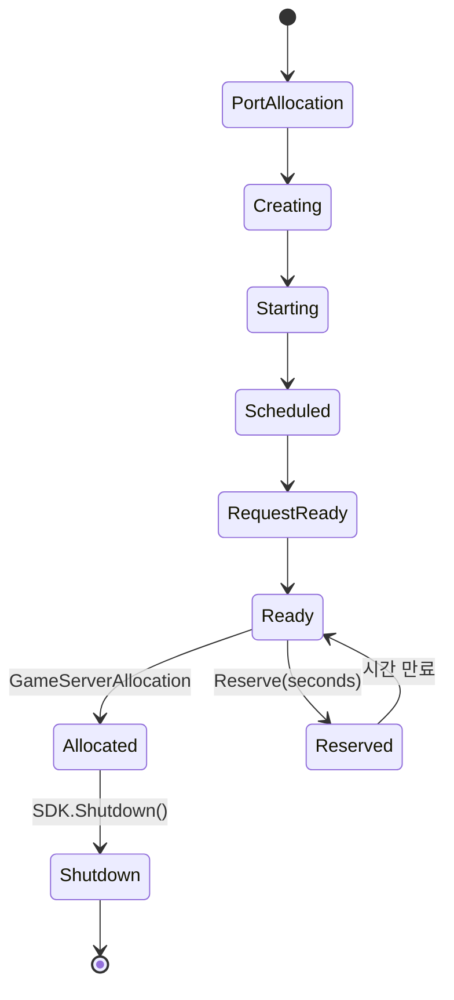

크래프톤(PUBG)은 EC2 기반 인프라에서 EKS로의 점진적 전환을 진행하며, QA 환경 프로비저닝 시간을 20분에서 5분으로 단축하고, Graviton(ARM) 전환으로 35%의 비용 절감을 달성했다. 김정헌 PUBG DevOps 팀장이 Games on AWS 2022와 AWS re:Invent 2024에서 이 여정을 공유했다.

이 글에서는 PUBG의 마이그레이션 사례를 축으로, EKS 운영 Best Practice, Agones 기반 게임 서버 관리, Karpenter를 활용한 노드 프로비저닝, 비용 최적화 전략까지 정리한다.

---

## 1. PUBG의 EC2 → EKS 마이그레이션

### 1.1 마이그레이션 타임라인

| 시점      | 이벤트                                         |
|---------|---------------------------------------------|
| 2018.11 | Lobby Server QA 환경 컨테이너화 시작                 |
| 2019.10 | Lobby Server Production 완전 컨테이너화 (EKS)      |
| 2021.07 | Session Server(게임 서버) 아키텍처 재설계 및 EKS 마이그레이션 |
| 2023.06 | Lobby Server AWS Graviton(ARM) 전환           |

> 참고: [Games on AWS 2022 - PUBG EKS 전환 사례](https://www.slideshare.net/slideshow/9pubg-battlegrounds-eks-300-pubg-devops-games-on-aws-2022/254068962)

### 1.2 EC2 기반 인프라의 문제점

PUBG의 EC2 환경에서는 세 가지 운영 부담이 지속적으로 증가했다.

**QA 환경 비용/시간 문제:**

- QA 환경 생성에 20~60분 소요
- DevOps 팀에 QA 환경 구성 요청이 끊임없이 들어옴
- 동적 프로비저닝이 어려워 불필요한 리소스가 상시 가동

**리소스 격리 부재:**

- 하나의 EC2 호스트에서 여러 게임 세션이 실행
- 한 서버의 CPU/메모리 급증이 같은 호스트의 다른 서버에 영향

**운영 부담 증가:**

- 소규모 서버 배포 요청이 DevOps 팀 병목으로 작용
- 인프라 변경의 셀프서비스가 불가능

### 1.3 EKS 전환 후 개선사항

- **QA 환경 생성 시간:** 20~60분 → 5분 이내
- **셀프서비스:** QA, PM, 디자이너, 개발자가 Web UI를 통해 Kubernetes YAML로 직접 환경 생성
- **리소스 격리:** 컨테이너 기반 격리로 세션 간 간섭 제거
- **배포 유연성:** 소규모 변경을 DevOps 팀 없이 자율 배포 가능

> 참고: [KRAFTON Migration to Container-Based Orchestration - Edgegap](https://edgegap.com/blog/krafton-s-migration-to-container-based-orchestration-for-pubg-battleground-insights-for-multiplayer-game-developers)

### 1.4 PUBG 서버의 두 가지 유형

PUBG 서버는 성격이 완전히 다른 두 유형으로 나뉜다.

| 구분     | MainShard (Lobby) | GameShard (Session)    |
|--------|-------------------|------------------------|
| 역할     | 로비, 매칭, 상점 등      | 실제 게임 플레이              |
| 프로토콜   | HTTP/TCP          | **UDP**                |
| 상태     | Stateless         | **Stateful**           |
| 통신 방식  | 일반 웹서버            | Host IP:Port 직접 통신     |
| K8s 관리 | 표준 Deployment     | **Agones GameServer**  |
| ARM 전환 | 완료 (2023.06)      | 미완 (Unreal Engine 의존성) |

Lobby Server는 일반적인 웹 서비스와 동일하게 Kubernetes Deployment로 관리할 수 있다. 반면 Session Server는 UDP 기반의 Stateful 워크로드라 특수한 관리가 필요하며, 이를 위해 Agones를 도입했다.

---

## 2. Agones - Kubernetes 위의 게임 서버 오케스트레이션

### 2.1 Agones란

[Agones](https://agones.dev/site/)는 Google과 Ubisoft가 공동 개발한 오픈소스 게임 서버 오케스트레이션 플랫폼이다. Kubernetes CRD(Custom Resource Definition)와 Controller를 통해 멀티플레이어 전용 게임 서버의 배포, 스케일링, 할당을 관리한다.

### 2.2 핵심 CRD

| CRD                    | 역할                                                 |
|------------------------|----------------------------------------------------|
| `GameServer`           | 개별 게임 서버 인스턴스 (1 Pod = 1 GameServer)               |
| `Fleet`                | GameServer 그룹 관리 (replicas로 Ready/Allocated 상태 유지) |
| `FleetAutoscaler`      | Fleet의 자동 확장/축소                                    |
| `GameServerAllocation` | Ready 상태의 서버에 플레이어 배정                              |

### 2.3 GameServer 라이프사이클



- **Ready**: 서버가 플레이어를 받을 준비가 된 상태
- **Allocated**: 플레이어가 접속 중인 상태. 스케일 다운이나 업데이트로부터 보호된다.
- **Reserved**: 일시적으로 Allocation과 축소로부터 보호. 지정 시간 후 Ready로 복귀.

Allocated 상태의 GameServer는 게임 세션이 끝날 때까지 절대 삭제되지 않는다. 게임 세션 종료 후 SDK의 `Shutdown()` 호출로 Pod이 정리된다.

> 참고: [Agones - GameServer Specification](https://agones.dev/site/docs/reference/gameserver/)

### 2.4 UDP 네트워킹

게임 서버는 대부분 UDP 프로토콜을 사용한다. Agones는 `hostPort` 기반으로 네트워크를 구성한다.

```yaml
apiVersion: agones.dev/v1
kind: GameServer
spec:
  ports:
    - name: default
      portPolicy: Dynamic
      containerPort: 7654
      protocol: UDP
  template:
    spec:
      containers:
        - name: game-server
          image: my-game-server:latest
```

**포트 할당 정책:**

| 정책            | 설명                           |
|---------------|------------------------------|
| `Dynamic`     | 시스템이 빈 hostPort를 자동 할당 (기본값) |
| `Static`      | 사용자가 hostPort를 지정            |
| `Passthrough` | containerPort = 동적 hostPort  |

`hostPort`를 사용하되 `hostNetwork`는 사용하지 않는다. 네트워크 네임스페이스 격리를 유지하면서 iptables/IPVS를 통해 트래픽을 컨테이너로 라우팅한다. 최악의 경우에도 추가 지연은 약 0.5ms 수준이다.

> 참고: [Agones FAQ](https://agones.dev/site/docs/faq/)

### 2.5 Fleet Autoscaler

```yaml
apiVersion: autoscaling.agones.dev/v1
kind: FleetAutoscaler
metadata:
  name: game-fleet-autoscaler
spec:
  fleetName: game-fleet
  policy:
    type: Buffer
    buffer:
      bufferSize: 5         # Ready + Reserved 상태로 유지할 서버 수
      minReplicas: 3
      maxReplicas: 100
```

- **Buffer-based**: Ready 상태 서버를 일정 수(또는 비율)로 유지. 가장 일반적인 전략.
- **Webhook-based**: 외부 서비스에 스케일링 판단을 위임. 매치메이킹 시스템 통합 등 커스텀 로직에 적합.
- **Cluster Autoscaler/Karpenter 연동**: Agones가 Fleet을 확장하면 pending Pod이 발생하고, 이를 감지한 Cluster Autoscaler나 Karpenter가 노드를 추가한다.

> 참고: [Agones FleetAutoscaler](https://agones.dev/site/docs/reference/fleetautoscaler/), [AWS - Agones + Open Match on EKS](https://aws.amazon.com/solutions/guidance/game-server-hosting-using-agones-and-open-match-on-amazon-eks/)

---

## 3. EKS 노드 관리

### 3.1 Managed Node Groups vs Self-Managed vs Fargate

| 구분     | Managed Node Groups       | Self-Managed                    | Fargate              |
|--------|---------------------------|---------------------------------|----------------------|
| 관리 수준  | AWS가 노드 라이프사이클, AMI 패치 제공 | 사용자가 kubelet, 런타임, 오토스케일링 전체 관리 | 완전 서버리스              |
| 커스터마이징 | 중간                        | 최대                              | 최소                   |
| 보안 패치  | AWS가 AMI 빌드 제공, 사용자가 배포   | 사용자 전적 책임                       | AWS 전적 관리            |
| 추천 사례  | **대부분의 프로덕션 워크로드 (권장)**   | 극도의 커스텀 필요 시                    | 인프라 관리 최소화, 간헐적 워크로드 |

대부분의 경우 **Managed Node Groups**가 적절하다. Fargate는 DaemonSet을 지원하지 않고 GPU를 사용할 수 없어, 모니터링 에이전트나 게임 서버 워크로드에는 부적합하다.

> 참고: [EKS Node Types 비교](https://docs.cloudposse.com/blog/2025/10/15/fargate-vs-managed-node-groups/)

### 3.2 Karpenter

Karpenter는 Kubernetes 노드 프로비저닝을 자동화하는 도구로, 기존 Cluster Autoscaler의 한계를 해결한다.

**Cluster Autoscaler와의 핵심 차이:**

| 구분       | Karpenter                      | Cluster Autoscaler |
|----------|--------------------------------|--------------------|
| 작동 방식    | EC2 API 직접 호출 (ASG 우회)         | ASG를 통한 노드 관리      |
| 프로비저닝 속도 | ~45-60초                        | 수 분 (ASG 경유)       |
| 인스턴스 선택  | 워크로드에 맞는 최적 인스턴스 자동 선택         | 사전 정의된 노드 그룹 기반    |
| 비용 최적화   | 내장 통합(consolidation) + Spot 인식 | 제한적                |
| 이벤트 응답   | pending Pod 즉시 감지              | 10초+ 주기 스캔         |

**Karpenter Best Practice:**

1. **NodePool 분리**: 팀별, 워크로드 유형별(GPU, ARM, 일반)로 별도 NodePool 구성

```yaml
apiVersion: karpenter.sh/v1
kind: NodePool
metadata:
  name: game-servers
spec:
  template:
    spec:
      requirements:
        - key: kubernetes.io/arch
          operator: In
          values: [ "amd64" ]
        - key: karpenter.sh/capacity-type
          operator: In
          values: [ "on-demand" ]
        - key: node.kubernetes.io/instance-type
          operator: In
          values: [ "c6i.2xlarge", "c6i.4xlarge", "c7i.2xlarge" ]
  limits:
    cpu: 1000
    memory: 2000Gi
```

2. **인스턴스 다양화**: 제한을 최소화하여 Spot 안정성을 높인다. `ec2-instance-selector` 도구로 적합한 인스턴스 타입을 탐색할 수 있다.

3. **Interruption Handling**: SQS 큐 + `--interruption-queue` 설정으로 Spot 회수 전 자동 taint/drain/terminate.

4. **컨트롤러 배치**: Karpenter 컨트롤러는 Fargate나 전용 Managed Node Group에서 실행한다. Karpenter가 관리하는 노드에서 Karpenter 자신을 실행하면 자기 자신을 제거할 위험이 있다.

5. **리소스 requests 정확도**: Karpenter는 pending Pod의 requests 합산으로 필요한 인스턴스 크기를 결정한다. requests가 부정확하면 과도하거나 부족한 인스턴스가 선택된다.

> 참고: [EKS Best Practices - Karpenter](https://aws.github.io/aws-eks-best-practices/karpenter/), [Karpenter vs Cluster Autoscaler](https://spacelift.io/blog/karpenter-vs-cluster-autoscaler)

---

## 4. VPC CNI 플러그인

### 4.1 동작 원리

AWS VPC CNI는 각 Pod에 VPC CIDR의 실제 IP를 할당한다. 오버레이 네트워크 없이 네이티브 VPC 네트워킹을 사용하므로 성능이 좋지만, 대규모 클러스터에서 **IPv4 주소 고갈** 문제가 발생할 수 있다.

### 4.2 IP 최적화 전략

AWS가 권장하는 우선순위:

**1. IPv6 채택 (최우선 권장)**

RFC1918 IP 제한을 완전히 해소한다. 새 클러스터라면 IPv6를 기본으로 고려할 것.

**2. Custom Networking + Secondary CIDR**

기존 VPC에 CG-NAT 대역(100.64.0.0/10)을 추가하여 Pod에 별도 IP 공간을 할당한다.

```
기존 VPC CIDR: 10.0.0.0/16 (노드 IP)
추가 CIDR:     100.64.0.0/16 (Pod IP)
```

**3. Prefix Delegation**

ENI(Elastic Network Interface)당 IP 주소 수를 증가시켜 노드당 Pod 밀도를 높인다.

**4. 모니터링**

CNI Metrics Helper로 서브넷 IP 재고를 모니터링하고, CloudWatch 알람으로 임계값 도달 전 경고를 받는다.

> 참고: [EKS Best Practices - VPC CNI](https://aws.github.io/aws-eks-best-practices/networking/vpc-cni/), [Optimizing IP Utilization](https://docs.aws.amazon.com/eks/latest/best-practices/ip-opt.html)

---

## 5. 비용 최적화

### 5.1 Graviton (ARM) 인스턴스

AWS Graviton은 ARM 기반 프로세서로, x86 대비:

- **최대 20% 낮은 비용**
- **최대 40% 더 나은 가격 대비 성능**
- **최대 60% 적은 에너지 소비**

PUBG는 2023년 6월에 Lobby Server를 Graviton으로 전환하여 **35%의 비용 절감**을 달성했다. 다만 Session Server(Unreal Engine 기반)는 의존 라이브러리의 ARM 호환 수정이 필요하여 전환이 어려운 상태다.

**멀티 아키텍처 빌드:**

Graviton으로 전환하려면 컨테이너 이미지가 ARM 아키텍처를 지원해야 한다.

```dockerfile
# 멀티 아키텍처 빌드 (Docker Buildx)
FROM --platform=$BUILDPLATFORM golang:1.21 AS builder
ARG TARGETARCH
RUN GOARCH=$TARGETARCH go build -o app .

FROM --platform=$TARGETPLATFORM alpine:3.18
COPY --from=builder /app /app
```

```bash
docker buildx build --platform linux/amd64,linux/arm64 -t myapp:latest --push .
```

> 참고: [EKS Workshop - Graviton](https://www.eksworkshop.com/docs/fundamentals/managed-node-groups/graviton/), [EKS Best Practices - Cost Optimization](https://aws.github.io/aws-eks-best-practices/cost_optimization/cost_opt_compute/)

### 5.2 Spot Instances

On-Demand 대비 최대 90%까지 저렴하지만, AWS가 2분 전 경고와 함께 인스턴스를 회수할 수 있다.

**안전한 Spot 운영 방법:**

1. **다양한 인스턴스 타입 지정**: 단일 타입 대신 여러 타입을 지정하여 가용 풀을 넓힌다.
2. **Pod Disruption Budget (PDB)**: 동시 eviction 수를 제한하여 가용성을 유지한다.

```yaml
apiVersion: policy/v1
kind: PodDisruptionBudget
metadata:
  name: web-pdb
spec:
  minAvailable: 2
  selector:
    matchLabels:
      app: web
```

3. **Node Termination Handler**: 인스턴스 회수 이벤트를 감지하여 노드를 cordon → drain → 워크로드를 안전하게 이동한다. EKS Managed Node Groups 사용 시에는 별도 handler가 불필요하다.

4. **terminationGracePeriodSeconds**: 충분한 종료 시간을 설정하여 in-flight 요청 처리를 보장한다.

**Spot이 적합한 워크로드:** 배치 작업, CI/CD, 스테이트리스 웹 서버, 개발/테스트 환경
**Spot이 부적합한 워크로드:** 데이터베이스, Stateful 게임 서버(Allocated 상태), 단일 인스턴스에 의존하는 서비스

> 참고: [EC2 Spot Instance Best Practices](https://aws.amazon.com/blogs/compute/best-practices-for-handling-ec2-spot-instance-interruptions/), [AWS Node Termination Handler](https://github.com/aws/aws-node-termination-handler)

### 5.3 PUBG의 부트스트래핑 최적화

PUBG는 Agones 기반 스케일링 이벤트 시 15분의 부트스트래핑 시간이 문제였다.

| 단계                      | 소요 시간    |
|-------------------------|----------|
| 인스턴스 프로비저닝              | 1~3분     |
| 인스턴스 부트스트래핑             | 2~3분     |
| Pod 프로비저닝 (이미지 pull 포함) | 5~10분    |
| **합계**                  | **~15분** |

**해결:**

- **Karpenter 도입**: ASG 대신 EC2 API를 직접 호출하여 인스턴스 프로비저닝 시간 단축
- **컨테이너 레지스트리 프록시**: Harbor + S3 캐싱 + CloudFront 배포로 이미지 pull 시간 단축

**결과:** 15분 → **3~4분**으로 단축

> 참고: [re:Invent 2024 GAM311 - PUBG Architecture Evolution](https://www.antstack.com/talks/reinvent24/the-evolution-story-of-game-architecture-pubg-battlegrounds-krafton-gam311/)

---

## 6. PUBG re:Invent 2024 교훈

김정헌 팀장이 공유한 마이그레이션 핵심 교훈 세 가지:

**1. 중요한 것에 집중하라 (Focus on what matters)**

모든 것을 한 번에 전환하지 말고, 비즈니스 임팩트가 큰 부분부터 점진적으로 접근한다. PUBG는 Lobby → Session 순으로 전환했다.

**2. 사이드 이펙트를 인지하라 (Be aware of side effects)**

컨테이너화로 인한 네트워킹 변경, 스토리지 동작 차이, 의존성 변화를 사전에 파악한다. Session Server의 UDP 특성과 Stateful 요구사항이 대표적인 사이드 이펙트였다.

**3. 견고한 롤백 계획을 갖춰라 (Have a robust rollback plan)**

전환 중 문제가 발생하면 즉시 이전 환경으로 되돌릴 수 있어야 한다. EC2 기반 인프라를 전환 완료 전까지 유지했다.

---

## 7. 정리

| 단계 | 학습 내용                                                             |
|----|-------------------------------------------------------------------|
| 기본 | EKS 클러스터 구축, Managed Node Group, kubectl 기본 운영                    |
| 응용 | Karpenter 노드 프로비저닝, VPC CNI IP 최적화, Spot/Graviton 비용 최적화          |
| 심화 | Agones GameServer/Fleet 관리, UDP 네트워킹, FleetAutoscaler, 멀티 아키텍처 빌드 |
| 실전 | PUBG EC2→EKS 마이그레이션 전략, 부트스트래핑 최적화, QA 셀프서비스 플랫폼                  |

---

**참고 문서:**

- [Games on AWS 2022 - PUBG EKS 전환](https://www.slideshare.net/slideshow/9pubg-battlegrounds-eks-300-pubg-devops-games-on-aws-2022/254068962)
- [re:Invent 2024 GAM311 Slides](https://reinvent.awsevents.com/content/dam/reinvent/2024/slides/gam/GAM311_The-evolution-story-of-game-architecture-PUBG-Battlegrounds-Krafton.pdf)
- [Agones 공식 문서](https://agones.dev/site/docs/overview/)
- [EKS Best Practices - Karpenter](https://aws.github.io/aws-eks-best-practices/karpenter/)
- [EKS Best Practices - VPC CNI](https://aws.github.io/aws-eks-best-practices/networking/vpc-cni/)
- [EKS Best Practices - Cost Optimization](https://aws.github.io/aws-eks-best-practices/cost_optimization/cost_opt_compute/)
- [AWS - Agones + Open Match on EKS](https://aws.amazon.com/solutions/guidance/game-server-hosting-using-agones-and-open-match-on-amazon-eks/)
- [KRAFTON Migration - Edgegap](https://edgegap.com/blog/krafton-s-migration-to-container-based-orchestration-for-pubg-battleground-insights-for-multiplayer-game-developers)
