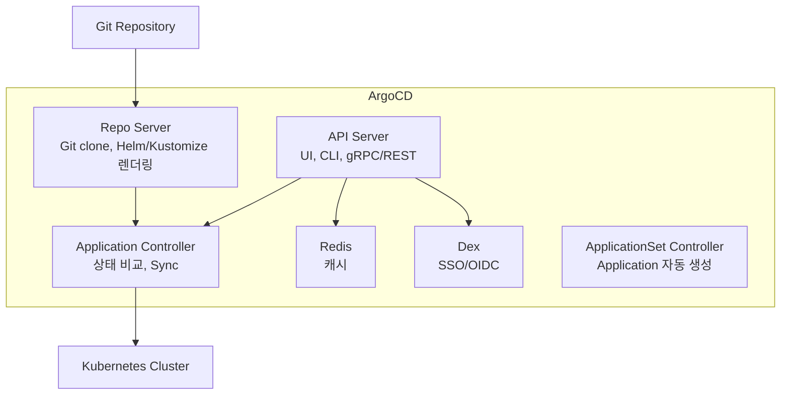

이 글에서는 GitOps 원칙부터 ArgoCD 아키텍처, 엔터프라이즈 패턴, Argo Rollouts를 활용한 Canary 배포, 보안 관리까지 정리한다.

---

## 1. GitOps 원칙

[OpenGitOps v1.0.0](https://opengitops.dev/)이 정의한 4대 원칙이다.

### 1.1 선언적 (Declarative)

시스템의 원하는 상태(Desired State)를 선언적으로 기술한다. Kubernetes YAML, Helm Chart, Kustomize 등이 해당한다.

### 1.2 버전 관리 및 불변성 (Versioned and Immutable)

원하는 상태는 불변성을 강제하는 방식으로 저장한다. Git이 Single Source of Truth(SSOT)로서 모든 변경 이력을 추적한다.

### 1.3 자동 Pull (Pulled Automatically)

승인된 변경이 자동으로 시스템에 적용된다. ArgoCD가 Git 리포지토리를 polling하여 변경을 감지하고 클러스터에 반영한다.

### 1.4 지속적 조정 (Continuously Reconciled)

소프트웨어 에이전트가 원하는 상태와 실제 상태의 차이를 지속적으로 감지하고 수정한다. ArgoCD의 Self-Heal 기능이 이를 구현한다.

### 1.5 Push vs Pull 배포 비교

| 구분       | Push 기반 (Jenkins, GitHub Actions) | Pull 기반 (ArgoCD, Flux)    |
|----------|-----------------------------------|---------------------------|
| 동작       | CI 파이프라인이 클러스터에 직접 배포             | 클러스터 내 에이전트가 Git을 polling |
| 보안       | 클러스터 외부에 kubeconfig 노출            | 클러스터 내부에서만 동작             |
| Drift 감지 | 없음                                | 자동 감지 및 수정                |
| CI/CD 분리 | 혼재                                | CI(빌드)와 CD(배포) 완전 분리      |

> 참고: [삼성SDS GitOps 인사이트](https://www.samsungsds.com/kr/insights/gitops.html)

---

## 2. ArgoCD 아키텍처



| 컴포넌트                      | 역할                                                                        |
|---------------------------|---------------------------------------------------------------------------|
| API Server                | UI, CLI, gRPC/REST 인터페이스. 사용자 인증/인가 처리.                                   |
| Repo Server               | Git 리포지토리를 clone하고, Helm/Kustomize/Jsonnet을 렌더링하여 Kubernetes manifest 생성. |
| Application Controller    | Git의 Desired State와 클러스터의 Live State를 비교하고, Sync 수행.                      |
| Redis                     | Repo Server의 렌더링 결과 캐시, Application 상태 캐시.                                |
| Dex                       | SSO/OIDC 인증 제공. GitHub, Google, LDAP 등 연동.                                |
| ApplicationSet Controller | 템플릿 기반으로 여러 Application을 자동 생성.                                           |

> 참고: [ArgoCD Architecture](https://argo-cd.readthedocs.io/en/stable/operator-manual/architecture/)

---

## 3. 엔터프라이즈 패턴

### 3.1 App of Apps 패턴

하나의 "루트" Application이 다른 여러 Application을 자식으로 관리하는 패턴이다.

```
root-app/
├── Chart.yaml
├── values.yaml
└── templates/
    ├── monitoring.yaml      # Prometheus/Grafana Application
    ├── logging.yaml         # Loki Application
    ├── ingress.yaml         # Ingress Controller Application
    └── app-a.yaml           # 서비스 A Application
```

```yaml
# templates/monitoring.yaml
apiVersion: argoproj.io/v1alpha1
kind: Application
metadata:
  name: monitoring
  namespace: argocd
spec:
  project: default
  source:
    repoURL: https://github.com/org/infra-manifests.git
    targetRevision: main
    path: monitoring
  destination:
    server: https://kubernetes.default.svc
    namespace: monitoring
  syncPolicy:
    automated:
      prune: true
      selfHeal: true
```

루트 Application 하나만 ArgoCD에 등록하면, 나머지 모든 Application이 자동으로 생성되고 관리된다.

### 3.2 ApplicationSet Controller

App of Apps보다 유연한 방식으로, Generator를 통해 Application을 자동 생성한다.

**주요 Generator:**

| Generator     | 용도                                  |
|---------------|-------------------------------------|
| Git Directory | Git 리포의 디렉토리 구조 기반으로 Application 생성 |
| Git File      | Git 리포의 설정 파일(JSON/YAML) 기반         |
| Cluster       | 등록된 클러스터별로 Application 생성 (멀티 클러스터) |
| Matrix        | 두 Generator의 조합 (데카르트 곱)            |
| Merge         | 여러 Generator 결과를 병합                 |

```yaml
# Git Directory Generator 예시
apiVersion: argoproj.io/v1alpha1
kind: ApplicationSet
metadata:
  name: cluster-addons
  namespace: argocd
spec:
  generators:
    - git:
        repoURL: https://github.com/org/cluster-addons.git
        revision: main
        directories:
          - path: '*'
  template:
    metadata:
      name: '{{path.basename}}'
    spec:
      project: default
      source:
        repoURL: https://github.com/org/cluster-addons.git
        targetRevision: main
        path: '{{path}}'
      destination:
        server: https://kubernetes.default.svc
        namespace: '{{path.basename}}'
```

디렉토리를 추가하면 자동으로 Application이 생성된다.

> 참고: [ArgoCD ApplicationSet](https://argo-cd.readthedocs.io/en/stable/operator-manual/applicationset/)

### 3.3 Sync Policy

```yaml
syncPolicy:
  automated:
    prune: true       # Git에서 삭제된 리소스를 클러스터에서도 삭제
    selfHeal: true     # 수동 변경(kubectl edit 등)을 자동으로 되돌림
  syncOptions:
    - CreateNamespace=true
    - ApplyOutOfSyncOnly=true
  retry:
    limit: 5
    backoff:
      duration: 5s
      factor: 2
      maxDuration: 3m0s
```

| 옵션                   | 동작                                     |
|----------------------|----------------------------------------|
| `prune: true`        | Git에서 제거된 리소스를 클러스터에서 자동 삭제            |
| `selfHeal: true`     | 클러스터의 수동 변경을 Git 상태로 자동 복원             |
| `ApplyOutOfSyncOnly` | 변경된 리소스만 apply (대규모 Application 성능 개선) |

### 3.4 Sync Waves와 Hooks

리소스의 배포 순서를 제어한다. `argocd.argoproj.io/sync-wave` 어노테이션으로 순서를 지정하며, 낮은 wave가 먼저 실행된다.

```yaml
# Wave 0: Namespace 생성
apiVersion: v1
kind: Namespace
metadata:
  name: app
  annotations:
    argocd.argoproj.io/sync-wave: "0"
---
# Wave 1: ConfigMap/Secret
apiVersion: v1
kind: ConfigMap
metadata:
  name: app-config
  annotations:
    argocd.argoproj.io/sync-wave: "1"
---
# Wave 2: Deployment
apiVersion: apps/v1
kind: Deployment
metadata:
  name: app
  annotations:
    argocd.argoproj.io/sync-wave: "2"
```

**Hook 종류:**

| Hook       | 시점                    |
|------------|-----------------------|
| `PreSync`  | Sync 이전 (DB 마이그레이션 등) |
| `Sync`     | 일반 Sync 시점            |
| `PostSync` | Sync 성공 후 (슬랙 알림 등)   |
| `SyncFail` | Sync 실패 시             |

---

## 4. Progressive Delivery - Argo Rollouts

### 4.1 Argo Rollouts + Istio Canary

Argo Rollouts는 Kubernetes Deployment를 대체하는 CRD로, Istio의 트래픽 분할과 연동하여 자동화된 Canary 배포를 구현한다.

```yaml
apiVersion: argoproj.io/v1alpha1
kind: Rollout
metadata:
  name: reviews
spec:
  replicas: 5
  strategy:
    canary:
      canaryService: reviews-canary
      stableService: reviews-stable
      trafficRouting:
        istio:
          virtualServices:
            - name: reviews
              routes:
                - primary
      steps:
        - setWeight: 10
        - pause: { duration: 5m }
        - setWeight: 30
        - pause: { duration: 5m }
        - setWeight: 60
        - pause: { duration: 5m }
      analysis:
        templates:
          - templateName: success-rate
        startingStep: 2
        args:
          - name: service-name
            value: reviews-canary
  selector:
    matchLabels:
      app: reviews
  template:
    metadata:
      labels:
        app: reviews
    spec:
      containers:
        - name: reviews
          image: reviews:v2
```

```yaml
# AnalysisTemplate - 성공률 기반 자동 프로모션/롤백
apiVersion: argoproj.io/v1alpha1
kind: AnalysisTemplate
metadata:
  name: success-rate
spec:
  args:
    - name: service-name
  metrics:
    - name: success-rate
      interval: 1m
      successCondition: result[0] >= 0.95
      provider:
        prometheus:
          address: http://prometheus:9090
          query: |
            sum(rate(istio_requests_total{
              destination_service=~"{{args.service-name}}",
              response_code!~"5.*"
            }[5m]))
            /
            sum(rate(istio_requests_total{
              destination_service=~"{{args.service-name}}"
            }[5m]))
```

이 설정은 트래픽을 10% → 30% → 60% → 100% 순으로 점진적으로 이동하며, 각 단계에서 Prometheus 메트릭으로 성공률을 검증한다. 95% 미만이면 자동 롤백한다.

> 참고: [Argo Rollouts - Istio](https://argoproj.github.io/argo-rollouts/features/traffic-management/istio/)

### 4.2 Blue-Green 배포

```yaml
strategy:
  blueGreen:
    activeService: reviews-active
    previewService: reviews-preview
    autoPromotionEnabled: false
    prePromotionAnalysis:
      templates:
        - templateName: smoke-test
```

Preview 환경에서 검증 후 수동 또는 자동으로 Active로 전환한다.

---

## 5. 보안

### 5.1 Secret 관리

Git에 Secret을 평문으로 저장하면 안 된다. 다음 도구들을 사용한다.

| 도구                                                               | 방식                                    | 적합 환경    |
|------------------------------------------------------------------|---------------------------------------|----------|
| [Sealed Secrets](https://github.com/bitnami-labs/sealed-secrets) | 공개키로 암호화 → Git 저장 → 클러스터에서 복호화        | 단순, 소규모  |
| [External Secrets Operator](https://external-secrets.io/)        | AWS Secrets Manager/Vault 등 외부 저장소 참조 | 엔터프라이즈   |
| [SOPS](https://github.com/getsops/sops)                          | 파일 레벨 암호화 (AWS KMS, GCP KMS 등)        | 중간 규모    |
| [HashiCorp Vault](https://www.vaultproject.io/)                  | 전용 Secret 관리 플랫폼                      | 대규모, 금융권 |

```yaml
# External Secrets Operator 예시
apiVersion: external-secrets.io/v1beta1
kind: ExternalSecret
metadata:
  name: db-credentials
spec:
  refreshInterval: 1h
  secretStoreRef:
    name: aws-secrets-manager
    kind: ClusterSecretStore
  target:
    name: db-credentials
  data:
    - secretKey: password
      remoteRef:
        key: prod/db/password
```

### 5.2 RBAC

ArgoCD는 프로젝트(AppProject)와 RBAC 정책으로 접근을 제어한다.

```yaml
# AppProject - 팀별 리소스 격리
apiVersion: argoproj.io/v1alpha1
kind: AppProject
metadata:
  name: team-a
  namespace: argocd
spec:
  sourceRepos:
    - 'https://github.com/org/team-a-*'
  destinations:
    - namespace: 'team-a-*'
      server: https://kubernetes.default.svc
  clusterResourceWhitelist:
    - group: ''
      kind: Namespace
```

> 참고: [ArgoCD RBAC](https://argo-cd.readthedocs.io/en/stable/operator-manual/rbac/)

---

## 6. Anti-Pattern

### 6.1 Git에 Secret 저장

평문 Secret이 Git 히스토리에 남으면 삭제해도 복구 가능하다. Sealed Secrets나 External Secrets Operator를 사용한다.

### 6.2 모놀리식 App of Apps

하나의 루트 Application에 수백 개의 자식 Application을 넣으면, Sync 시간이 길어지고 단일 장애점이 된다. 도메인별로 루트 Application을 분리한다.

### 6.3 Health Check 미설정

ArgoCD는 기본적으로 리소스의 Kubernetes 상태만 확인한다. 애플리케이션 레벨의 Health Check를 설정하지 않으면 Pod이 Running이지만 실제로는 동작하지 않는 상태를 감지하지 못한다.

### 6.4 CI/CD 미분리

CI 파이프라인(빌드, 테스트, 이미지 push)과 CD 파이프라인(배포)을 분리하지 않으면 GitOps의 보안/감사 이점을 잃는다. CI는 GitHub Actions/Jenkins로, CD는 ArgoCD로 분리하는 것이 원칙이다.

---

## 7. 기업 사례

### 7.1 당근마켓

GitHub Actions(CI) → Kustomize(manifest 관리) → ArgoCD(CD) 파이프라인을 운영한다. CI에서 이미지 빌드/push 후 Kustomize 오버레이의 이미지 태그를 업데이트하면, ArgoCD가 자동으로 배포한다.

### 7.2 핀다 (Finda)

Argo Rollouts를 활용한 Progressive Delivery를 적용하여, Canary 배포 시 메트릭 기반 자동 프로모션/롤백을 구현했다.

### 7.3 토스뱅크

토스뱅크는 ArgoCD가 아닌 GoCD를 사용하여 400개 이상의 배포 파이프라인을 운영하는 것으로 확인된다. GitOps 원칙은 동일하게 적용하되 도구 선택이 다른 사례다.

---

## 8. 정리

| 단계 | 학습 내용                                                              |
|----|--------------------------------------------------------------------|
| 기본 | GitOps 4대 원칙, ArgoCD 설치/Application 생성, Git 기반 배포                  |
| 응용 | App of Apps, ApplicationSet, Sync Wave, Helm/Kustomize 연동          |
| 심화 | Argo Rollouts + Istio Canary, AnalysisTemplate, Multi-cluster 배포   |
| 실전 | Secret 관리(Sealed Secrets/ESO), RBAC/SSO, CI/CD 분리, Anti-pattern 회피 |

---

**참고 문서:**

- [ArgoCD 공식 문서](https://argo-cd.readthedocs.io/en/stable/)
- [Argo Rollouts 공식 문서](https://argoproj.github.io/argo-rollouts/)
- [OpenGitOps](https://opengitops.dev/)
- [삼성SDS GitOps 인사이트](https://www.samsungsds.com/kr/insights/gitops.html)
- [External Secrets Operator](https://external-secrets.io/)
- [Sealed Secrets](https://github.com/bitnami-labs/sealed-secrets)
