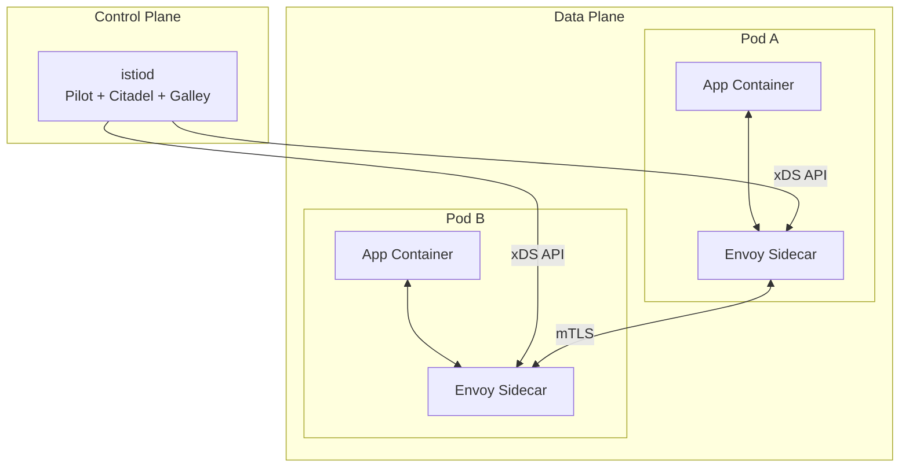
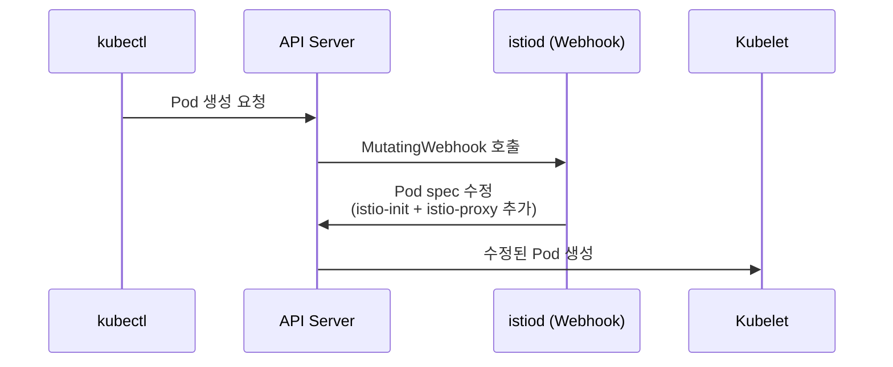
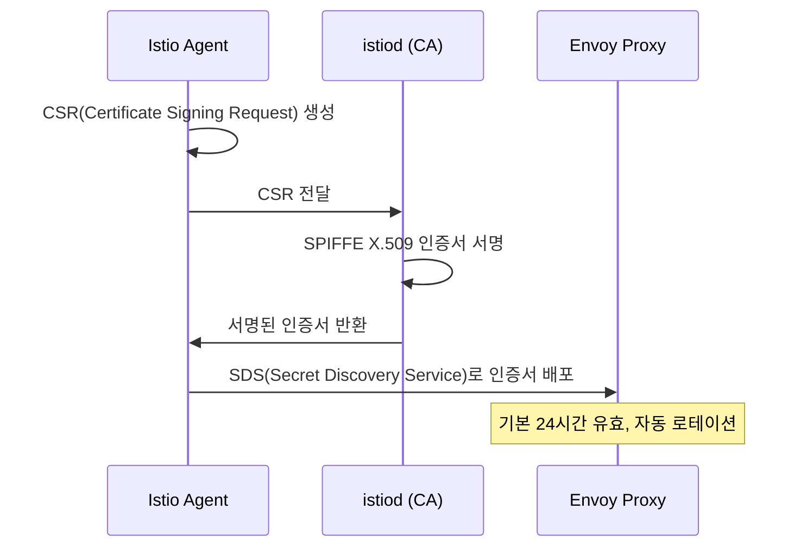
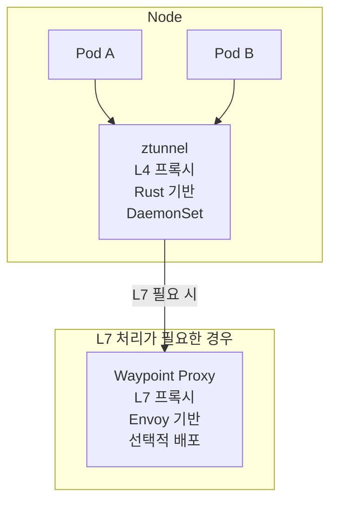

Kubernetes + Istio Service Mesh 기반으로 인프라를 운영하며, DevOps Engineer 채용 시 VirtualService, DestinationRule, mTLS, Circuit Breaker 등 Istio 실무 경험을 필수로 요구한다.

이 글에서는 Istio의 내부 동작 원리부터 트래픽 관리 패턴, 보안 모델, Observability 구성, 그리고 차세대 아키텍처인 Ambient Mesh까지 단계별로 정리한다.

---

## 1. Istio 아키텍처

Istio는 Control Plane(istiod)과 Data Plane(Envoy proxy)으로 구성된다.



### 1.1 Control Plane - istiod

Istio 1.5 이전에는 Pilot, Citadel, Galley가 별도 프로세스로 동작했지만, 1.5부터 **istiod**라는 단일 바이너리로 통합되었다.

| 컴포넌트    | 역할                                                                     |
|---------|------------------------------------------------------------------------|
| Pilot   | 서비스 디스커버리, Envoy 프록시 설정 생성 및 배포 (xDS API)                              |
| Citadel | 워크로드 ID 발급 (SPIFFE X.509 인증서), 인증서 자동 로테이션                             |
| Galley  | Kubernetes API Server로부터 설정(VirtualService, DestinationRule 등) 검증 및 분배 |

istiod는 Kubernetes API Server를 watch하며, Service/Endpoint/VirtualService/DestinationRule 등의 변경을 감지하고 이를 프록시별 설정으로 변환하여 Data Plane으로 push한다.

> 참고: [Istio - Introducing istiod](https://istio.io/latest/blog/2020/istiod/)

### 1.2 Data Plane - Envoy Proxy

Data Plane은 다음 컴포넌트로 구성된다.

- **Sidecar Proxy**: 각 애플리케이션 컨테이너 옆에 배포되는 Envoy 프록시
- **Gateway Proxy**: Ingress/Egress 트래픽을 처리하는 전용 Envoy 프록시
- **Istio Agent (pilot-agent)**: 프록시 라이프사이클 관리 및 인증서 로테이션 담당

### 1.3 Sidecar Injection 메커니즘

Istio는 Kubernetes의 **MutatingAdmissionWebhook**을 활용하여 사이드카를 자동 주입한다.



**주입 제어 방법:**

| 방법           | 적용 범위          | 예시                             |
|--------------|----------------|--------------------------------|
| 네임스페이스 레이블   | 네임스페이스 전체      | `istio-injection=enabled`      |
| Pod 레이블      | 개별 Pod         | `sidecar.istio.io/inject=true` |
| Revision 레이블 | Canary 업그레이드 시 | `istio.io/rev=canary`          |

**istio-init 컨테이너의 역할:**

Init container로 실행되어 iptables 규칙을 설정한다. Pod으로 들어오는/나가는 모든 TCP 트래픽을 Envoy 포트로 리다이렉트한다.

- 인바운드 트래픽 → `0.0.0.0:15006` (Envoy 인바운드 리스너)
- 아웃바운드 트래픽 → `0.0.0.0:15001` (Envoy 아웃바운드 리스너)
- Envoy 프록시의 UID/GID 기반으로 프록시 발신 패킷과 애플리케이션 발신 패킷을 구분하여 무한 루프를 방지한다.

> 참고: [Istio - Sidecar Injection](https://istio.io/latest/docs/setup/additional-setup/sidecar-injection/)

### 1.4 xDS Protocol

istiod는 Envoy의 **xDS (x Discovery Service) API**를 통해 프록시에 설정을 배포한다.

| Discovery Service  | 역할                            | Istio 리소스 매핑         |
|--------------------|-------------------------------|----------------------|
| **LDS** (Listener) | 인바운드/아웃바운드 연결 수신 설정           | Gateway              |
| **RDS** (Route)    | HTTP 라우팅 규칙                   | VirtualService       |
| **CDS** (Cluster)  | 업스트림 서비스(목적지 클러스터) 정의         | DestinationRule      |
| **EDS** (Endpoint) | 업스트림 클러스터의 개별 멤버(Pod IP/Port) | Kubernetes Endpoints |
| **SDS** (Secret)   | mTLS 인증서/키 분배                 | PeerAuthentication   |

**Delta xDS (Incremental):** Istio 1.22부터 기본 활성화. 전체 설정 대신 변경된 부분만 전달하므로, 대규모 클러스터에서 설정 수렴(convergence) 시간이 크게 개선된다. Airbnb는 Istio 업그레이드 후 p90 propagation delay가 1.5초에서 4.5초로 증가하는 문제를 xDS 캐시의 lock contention 이슈로 진단한 바 있다.

> 참고: [Envoy xDS Configuration API](https://www.envoyproxy.io/docs/envoy/latest/intro/arch_overview/operations/dynamic_configuration), [Airbnb - Improving Istio Propagation Delay](https://medium.com/airbnb-engineering/improving-istio-propagation-delay-d4da9b5b9f90)

---

## 2. 트래픽 관리

### 2.1 VirtualService + DestinationRule (Canary 배포)

Kubernetes의 기본 배포 전략은 Pod 인스턴스 수로 트래픽 비율이 결정되지만, Istio는 라우팅과 스케일링을 완전히 분리한다. Pod 수와 무관하게 정밀한 트래픽 비율 제어가 가능하다.

```yaml
# DestinationRule - 서브셋 정의
apiVersion: networking.istio.io/v1
kind: DestinationRule
metadata:
  name: reviews
spec:
  host: reviews
  subsets:
    - name: v1
      labels:
        version: v1
    - name: v2
      labels:
        version: v2
---
# VirtualService - 90:10 Canary 배포
apiVersion: networking.istio.io/v1
kind: VirtualService
metadata:
  name: reviews
spec:
  hosts:
    - reviews
  http:
    - route:
        - destination:
            host: reviews
            subset: v1
          weight: 90
        - destination:
            host: reviews
            subset: v2
          weight: 10
```

이 설정으로 v1에 90%, v2에 10%의 트래픽을 분배한다. ArgoCD Rollouts와 연동하면 메트릭 기반 자동 Canary 프로모션도 구현할 수 있다.

> 참고: [Istio - Traffic Management](https://istio.io/latest/docs/concepts/traffic-management/)

### 2.2 Circuit Breaker

DestinationRule에서 연결 풀(connectionPool)과 이상 감지(outlierDetection) 두 가지 메커니즘을 조합한다.

```yaml
apiVersion: networking.istio.io/v1
kind: DestinationRule
metadata:
  name: reviews
spec:
  host: reviews
  trafficPolicy:
    connectionPool:
      tcp:
        maxConnections: 100
      http:
        http1MaxPendingRequests: 100
        http2MaxRequests: 1000
        maxRequestsPerConnection: 10
    outlierDetection:
      consecutive5xxErrors: 5
      interval: 30s
      baseEjectionTime: 30s
      maxEjectionPercent: 50
```

- **connectionPool**: 동시 연결/요청 수를 제한한다. 초과하면 새 요청을 큐에 넣거나 거부한다.
- **outlierDetection**: 연속 5xx 에러가 임계값을 넘으면 해당 엔드포인트를 로드밸런싱 풀에서 일시 제거한다.

> 참고: [Istio - Circuit Breaking](https://istio.io/latest/docs/tasks/traffic-management/circuit-breaking/)

### 2.3 Retry / Timeout

```yaml
apiVersion: networking.istio.io/v1
kind: VirtualService
metadata:
  name: reviews
spec:
  hosts:
    - reviews
  http:
    - route:
        - destination:
            host: reviews
      timeout: 3s
      retries:
        attempts: 3
        perTryTimeout: 1s
        retryOn: gateway-error,connect-failure,refused-stream
```

**주의할 Anti-pattern:**

- Istio의 기본 정책은 503 에러에 대해 자동으로 재시도한다. 의도치 않은 retry storm이 발생할 수 있으므로, `retryOn` 조건을 명시적으로 선언해야 한다.
- `perTryTimeout`은 개별 시도의 타임아웃이지 전체 타임아웃이 아니다. 전체 요청 타임아웃은 별도의 `timeout` 필드로 설정한다.
- 쓰기(write) 작업에 대한 재시도는 멱등성(idempotency)이 보장되지 않으면 데이터 중복 등 부작용이 발생한다.
- 애플리케이션 레벨 타임아웃과 Istio 타임아웃은 독립적으로 동작하므로, 짧은 쪽이 먼저 발동한다.

> 참고: [Istio Retry Policies 분석](https://karlstoney.com/retry-policies-in-istio/)

### 2.4 Traffic Mirroring (Dark Launch)

프로덕션 트래픽의 복사본을 새 버전 서비스에 전송하여, 실제 사용자에게 영향 없이 새 버전의 동작을 검증하는 기법이다.

```yaml
apiVersion: networking.istio.io/v1
kind: VirtualService
metadata:
  name: httpbin
spec:
  hosts:
    - httpbin
  http:
    - route:
        - destination:
            host: httpbin
            subset: v1
          weight: 100
      mirror:
        host: httpbin
        subset: v2
      mirrorPercentage:
        value: 100.0
```

미러된 요청은 fire-and-forget 방식으로 처리되며 응답은 무시된다. Host 헤더에 `-shadow` 접미사가 추가되어(`httpbin-shadow`) 구분이 가능하다.

> 참고: [Istio - Mirroring](https://istio.io/latest/docs/tasks/traffic-management/mirroring/)

### 2.5 Fault Injection

코드 변경 없이 Envoy 프록시 레벨에서 지연(delay)이나 에러(abort)를 주입하여 서비스의 장애 대응력을 테스트한다.

```yaml
apiVersion: networking.istio.io/v1
kind: VirtualService
metadata:
  name: ratings
spec:
  hosts:
    - ratings
  http:
    - fault:
        delay:
          percentage:
            value: 10
          fixedDelay: 5s
        abort:
          percentage:
            value: 5
          httpStatus: 503
      route:
        - destination:
            host: ratings
```

- **delay**: 요청의 10%에 5초 지연을 추가 (네트워크 레이턴시, 업스트림 과부하 시뮬레이션)
- **abort**: 요청의 5%를 503으로 거부 (서비스 장애 시뮬레이션)

> 참고: [Istio - Fault Injection](https://istio.io/latest/docs/tasks/traffic-management/fault-injection/)

---

## 3. 보안 모델

Istio의 보안은 mTLS(상호 TLS)를 기반으로 Zero Trust 네트워크를 구현한다.

### 3.1 mTLS (Mutual TLS)

일반 TLS는 클라이언트가 서버의 인증서만 검증하지만, mTLS는 서버도 클라이언트의 인증서를 검증한다. Istio에서 mTLS의 동작 흐름은 다음과 같다.



**PeerAuthentication 모드:**

| 모드           | 동작                 | 사용 시점     |
|--------------|--------------------|-----------|
| `PERMISSIVE` | mTLS와 평문 트래픽 모두 허용 | 마이그레이션 단계 |
| `STRICT`     | mTLS만 허용           | 프로덕션 권장   |
| `DISABLE`    | mTLS 비활성화          | 특수한 경우만   |

```yaml
# 네임스페이스 레벨 STRICT mTLS 적용
apiVersion: security.istio.io/v1
kind: PeerAuthentication
metadata:
  name: default
  namespace: my-namespace
spec:
  mtls:
    mode: STRICT
```

### 3.2 SPIFFE Identity

각 워크로드에 SPIFFE(Secure Production Identity Framework For Everyone) 표준의 ID가 부여된다.

```
spiffe://<trust-domain>/ns/<namespace>/sa/<service-account>
```

예: `spiffe://cluster.local/ns/default/sa/bookinfo-reviews`

이 ID가 X.509 인증서의 SAN(Subject Alternative Name)에 포함되어 워크로드 간 상호 인증에 사용된다.

### 3.3 AuthorizationPolicy

SPIFFE identity 기반으로 세밀한 접근 제어를 구현한다.

```yaml
apiVersion: security.istio.io/v1
kind: AuthorizationPolicy
metadata:
  name: allow-reviews
  namespace: default
spec:
  selector:
    matchLabels:
      app: reviews
  action: ALLOW
  rules:
    - from:
        - source:
            principals: [ "cluster.local/ns/default/sa/bookinfo-productpage" ]
      to:
        - operation:
            methods: [ "GET" ]
            paths: [ "/reviews/*" ]
```

**Zero Trust 구현 패턴:**

1. 먼저 DENY-ALL 기본 정책을 설정
2. 필요한 서비스 간 통신만 명시적으로 ALLOW
3. 주기적으로 AuthorizationPolicy를 감사(audit)

```yaml
# 네임스페이스 DENY-ALL 기본 정책
apiVersion: security.istio.io/v1
kind: AuthorizationPolicy
metadata:
  name: deny-all
  namespace: default
spec: { }
```

> 참고: [Istio - Security](https://istio.io/latest/docs/concepts/security/), [AuthorizationPolicy Reference](https://istio.io/latest/docs/reference/config/security/authorization-policy/)

---

## 4. Observability

Istio는 Four Golden Signals(Latency, Traffic, Errors, Saturation)를 기반으로 메트릭을 자동 생성한다.

### 4.1 Prometheus 메트릭

Envoy 프록시가 자동으로 수집하는 주요 메트릭:

| 메트릭                                   | 타입           | 설명              |
|---------------------------------------|--------------|-----------------|
| `istio_requests_total`                | COUNTER      | 프록시가 처리한 총 요청 수 |
| `istio_request_duration_milliseconds` | DISTRIBUTION | 요청 처리 시간        |
| `istio_request_bytes`                 | DISTRIBUTION | 요청 바디 크기        |
| `istio_response_bytes`                | DISTRIBUTION | 응답 바디 크기        |
| `istio_tcp_connections_opened_total`  | COUNTER      | 열린 TCP 연결 수     |

PromQL 활용 예시:

```promql
# 특정 서비스의 초당 200 OK 요청률
rate(istio_requests_total{destination_service=~"reviews.*", response_code="200"}[5m])

# p99 레이턴시
histogram_quantile(0.99,
  sum(rate(istio_request_duration_milliseconds_bucket{
    destination_service="reviews"
  }[5m])) by (le)
)
```

> 참고: [Istio Standard Metrics](https://istio.io/latest/docs/reference/config/metrics/)

### 4.2 Distributed Tracing (Jaeger)

Envoy 프록시가 자동으로 trace span을 생성하지만, **애플리케이션이 trace context 헤더를 전파(propagate)해야** 서비스 간 요청 추적이 연결된다.

전파해야 하는 헤더:

- `x-request-id`
- `x-b3-traceid`, `x-b3-spanid`, `x-b3-parentspanid`, `x-b3-sampled`, `x-b3-flags`
- 또는 W3C Trace Context: `traceparent`, `tracestate`

이 헤더 전파가 빠지면 Jaeger에서 각 서비스의 span이 개별 trace로 분리되어, 요청의 전체 흐름을 파악할 수 없다.

> 참고: [Istio - Distributed Tracing](https://istio.io/latest/docs/tasks/observability/distributed-tracing/)

### 4.3 Kiali 서비스 그래프

Kiali는 Istio 전용 관측성 대시보드로 다음 기능을 제공한다.

- 실시간 서비스 토폴로지 시각화: 마이크로서비스 간 트래픽 흐름을 그래프로 표현
- Istio 설정 검증: VirtualService, DestinationRule 등의 구성 오류 탐지
- Prometheus, Jaeger 통합: 메트릭과 트레이싱 데이터를 한 곳에서 확인

> 참고: [Istio - Kiali Integration](https://istio.io/latest/docs/ops/integrations/kiali/)

### 4.4 Envoy Access Log

```yaml
apiVersion: telemetry.istio.io/v1
kind: Telemetry
metadata:
  name: mesh-default
  namespace: istio-system
spec:
  accessLogging:
    - providers:
        - name: envoy
```

네임스페이스나 워크로드 단위로 세분화하여 활성화할 수 있으며, TEXT/JSON 형식을 선택할 수 있다.

> 참고: [Istio - Envoy Access Logs](https://istio.io/latest/docs/tasks/observability/logs/access-log/)

---

## 5. 성능 오버헤드

Istio sidecar의 성능 영향은 무시할 수 없는 수준이다. 벤치마크 데이터를 보고 트레이드오프를 판단해야 한다.

### 5.1 공식 벤치마크 (Istio 1.24)

| 컴포넌트                       | CPU (1000 RPS, 1KB) | Memory |
|----------------------------|---------------------|--------|
| Sidecar Proxy (2 workers)  | ~0.20 vCPU          | ~60 MB |
| Waypoint Proxy (2 workers) | ~0.25 vCPU          | ~60 MB |
| ztunnel Proxy              | ~0.06 vCPU          | ~12 MB |

### 5.2 독립 벤치마크 (2024 학술 논문)

3,200 RPS 조건에서의 레이턴시 증가율:

| Service Mesh         | 레이턴시 증가 |
|----------------------|---------|
| Istio sidecar + mTLS | 166%    |
| Cilium               | 99%     |
| Linkerd              | 33%     |
| Istio Ambient        | 8%      |

Istio sidecar의 높은 레이턴시는 mTLS 자체가 아니라 HTTP 파싱과 sidecar 구조에서의 패킷 전달 오버헤드에서 주로 발생한다.

> 참고: [Istio Performance and Scalability](https://istio.io/latest/docs/ops/deployment/performance-and-scalability/), [Service Mesh 성능 비교 논문 (arXiv)](https://www.arxiv.org/pdf/2411.02267)

---

## 6. Service Mesh 비교: Istio vs Linkerd vs Cilium

| 항목      | Istio             | Linkerd               | Cilium Service Mesh |
|---------|-------------------|-----------------------|---------------------|
| 프록시     | Envoy (C++)       | linkerd2-proxy (Rust) | eBPF (커널 레벨)        |
| 아키텍처    | Sidecar / Ambient | Sidecar               | Sidecarless         |
| 레이턴시 영향 | 가장 높음 (sidecar)   | 가장 낮음                 | 중간                  |
| 기능      | 가장 풍부             | 핵심 기능 집중              | 네트워킹 + 보안 특화        |
| 학습 곡선   | 가파름               | 완만함                   | 중간                  |
| CNCF 상태 | Graduated (2023)  | Graduated (2021)      | Graduated (2023)    |
| 적합 환경   | 대규모 엔터프라이즈        | 소규모~중규모               | 고성능/보안 중시           |

**Linkerd 라이선스 논란 (2024):** Buoyant가 50명 이상 조직에 stable 릴리즈를 유료화($2,000/클러스터)하면서 CNCF TOC에서 프로젝트 건전성 리뷰가 진행되었다. 모든 핵심 메인테이너가 Buoyant 직원이라는 vendor lock-in 우려가 제기되었다.

> 참고: [Service Meshes Decoded](https://livewyer.io/blog/service-meshes-decoded-istio-vs-linkerd-vs-cilium/)

---

## 7. Kubernetes Gateway API와 Istio의 미래

### 7.1 왜 Gateway API인가

기존 Kubernetes Ingress API의 한계:

- HTTP(S)만 지원, TCP/UDP 미지원
- 구현체마다 다른 어노테이션(nginx.ingress.kubernetes.io/*, traefik.ingress.kubernetes.io/* 등)
- 인프라 관리자와 애플리케이션 개발자의 역할 구분 없음

Gateway API는 이를 해결한다:

- HTTP, HTTPS, TCP, TLS, gRPC 네이티브 지원
- 구현체에 독립적인 표준 API
- 역할 기반 리소스 분리: GatewayClass(인프라) → Gateway(클러스터 운영자) → HTTPRoute(개발자)

### 7.2 Istio의 Gateway API 지원 현황

- Istio 1.22: Gateway API v1.1 지원
- 2024: Gateway API Mesh Support가 Stable로 승격
- Gateway API v1.4.0: 2025년 10월 GA (IPv6, CORS, backendTLSPolicy 추가)

**현실적 접근:** Gateway API 표준만으로는 Istio의 모든 기능(circuit breaking, connection pooling 등)을 커버하지 못한다. Gateway API + Istio CRD(DestinationRule 등) 혼용이 현실적인 패턴이다.

| 시나리오       | 권장                                      |
|------------|-----------------------------------------|
| 신규 배포      | Gateway API 직접 사용                       |
| 기존 안정 운영 중 | 기존 Istio API 유지                         |
| 장기 계획      | 점진적 마이그레이션 (Gateway API + Istio CRD 병행) |

> 참고: [Istio - Gateway API](https://istio.io/latest/docs/tasks/traffic-management/ingress/gateway-api/), [Gateway API Mesh GA](https://istio.io/latest/blog/2024/gateway-mesh-ga/)

---

## 8. Istio Ambient Mesh - Sidecar 없는 Service Mesh

Istio의 차세대 Data Plane으로, sidecar를 제거하여 운영 복잡도와 리소스 오버헤드를 줄인다.

### 8.1 2계층 구조



| 계층 | 컴포넌트           | 역할                    | 리소스 사용량          |
|----|----------------|-----------------------|------------------|
| L4 | ztunnel        | mTLS, L4 인가, L4 텔레메트리 | 0.06 vCPU, 12 MB |
| L7 | Waypoint Proxy | L7 라우팅, 재시도, 요청 레벨 인가 | Envoy 수준         |

### 8.2 Ambient Mesh의 장점

- **사이드카 주입 불필요**: 애플리케이션 Pod과 메시를 완전 분리. Pod 재시작 없이 메시 적용/해제 가능.
- **리소스 절감**: L4만 필요한 워크로드는 ztunnel(12MB)만으로 충분. Sidecar(60MB) 대비 5배 절약.
- **레이턴시 개선**: 벤치마크에서 sidecar 대비 레이턴시 오버헤드가 166% → 8%로 대폭 감소.
- **운영 단순화**: Sidecar 라이프사이클(injection, upgrade, restart) 관리가 필요 없음.

> 참고: [Istio - Ambient Mesh Overview](https://istio.io/latest/docs/ambient/overview/), [Rust-Based Ztunnel](https://istio.io/latest/blog/2023/rust-based-ztunnel/)

---

## 9. 실제 기업 사례

### 9.1 토스 - Active-Active 인프라

SLASH 21에서 토스코어 Server Platform 팀이 발표한 내용에 따르면, 토스는 Active-Active 데이터센터 환경에서 Kubernetes + Istio + Calico CNI 조합을 운영하며, Kafka, Redis, Monitoring Stack과 함께 Istio를 인프라의 핵심 계층으로 활용한다.

토스의 DevOps 채용 공고에서는 Istio 기반 인프라 운영 경험과 네트워크 트러블슈팅 능력을 명시적으로 요구한다.

> 참고: [토스 SLASH 21 - 서비스를 구성하는 서버 기술](https://toss.im/slash-21/sessions/1-3)

### 9.2 eBay - 대규모 메시 운영

수십만 개의 컨테이너가 전 세계에 분산된 환경에서 Istio 메시를 운영하며, 수천 개 프록시에 대한 설정 수렴(convergence) 시간 최적화와 CPU/메모리 사용량 절감이 주요 과제였다.

> 참고: [eBay Istio Case Study](https://istio.io/latest/about/case-studies/ebay/)

### 9.3 Airbnb - AirMesh

2019년부터 Istio 기반 AirMesh를 구축하여 프로덕션 트래픽의 90% 이상을 메시로 마이그레이션했다. External Control Plane 배포 모델을 사용하며, Istio 업그레이드 시 수만 개 프록시에 대한 Canary 업그레이드 전략을 적용한다.

> 참고: [Airbnb Istio Case Study](https://istio.io/latest/about/case-studies/airbnb/), [Airbnb - Seamless Istio Upgrades at Scale](https://medium.com/airbnb-engineering/seamless-istio-upgrades-at-scale-bcb0e49c5cf8)

---

## 10. 정리

| 단계 | 학습 내용                                                                        |
|----|------------------------------------------------------------------------------|
| 기본 | Istio 아키텍처(istiod, Envoy, xDS), sidecar injection 메커니즘                       |
| 응용 | VirtualService/DestinationRule로 Canary 배포, Circuit Breaker, Retry/Timeout 설정 |
| 심화 | mTLS/SPIFFE 보안 모델, AuthorizationPolicy로 Zero Trust 구현, Gateway API 마이그레이션    |
| 실전 | 성능 벤치마크 기반 트레이드오프 판단, Ambient Mesh 도입 시점 결정, 대규모 메시 운영 전략                    |

---

**참고 문서:**

- [Istio 공식 문서](https://istio.io/latest/docs/)
- [Istio - Introducing istiod](https://istio.io/latest/blog/2020/istiod/)
- [Istio - Sidecar Injection](https://istio.io/latest/docs/setup/additional-setup/sidecar-injection/)
- [Istio - Traffic Management](https://istio.io/latest/docs/concepts/traffic-management/)
- [Istio - Security](https://istio.io/latest/docs/concepts/security/)
- [Istio - Observability](https://istio.io/latest/docs/concepts/observability/)
- [Istio - Ambient Mesh](https://istio.io/latest/docs/ambient/overview/)
- [Istio - Gateway API](https://istio.io/latest/docs/tasks/traffic-management/ingress/gateway-api/)
- [Envoy xDS Protocol](https://www.envoyproxy.io/docs/envoy/latest/api-docs/xds_protocol)
- [SPIFFE 공식](https://spiffe.io/)
- [토스 SLASH 21](https://toss.im/slash-21/sessions/1-3)
- [Airbnb Istio Case Study](https://istio.io/latest/about/case-studies/airbnb/)
- [eBay Istio Case Study](https://istio.io/latest/about/case-studies/ebay/)
