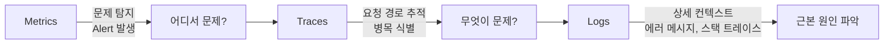
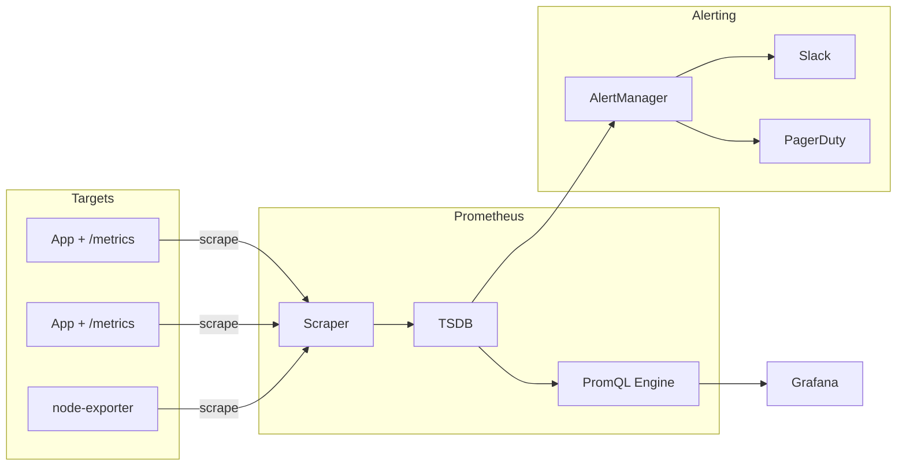
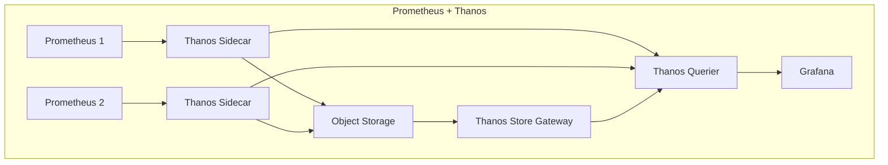
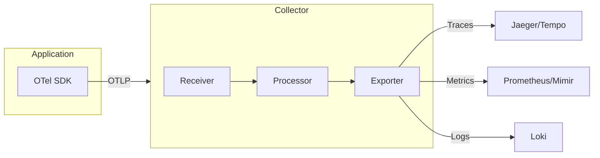
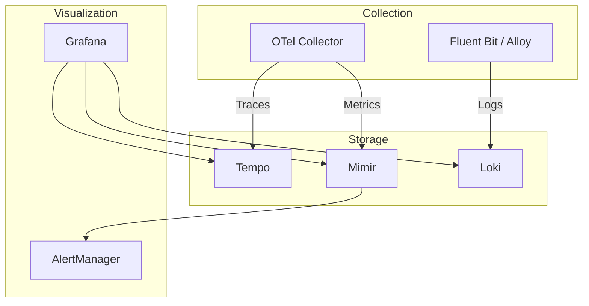

이 글에서는 Observability의 세 기둥(Metrics, Logs, Traces)부터 Prometheus 스택 심화, 로깅 아키텍처, 분산 트레이싱, SRE 프랙티스까지 정리한다.

---

## 1. Observability의 세 기둥

### 1.1 Metrics (메트릭)

시스템의 수치적 측정값이다. CPU 사용률, 응답 시간, 에러율 등 집계된 신호로서 대시보드, 트렌드 분석, SLO 모니터링, 실시간 알림에 적합하다.

### 1.2 Logs (로그)

시스템에서 발생한 이벤트의 이산적 기록이다. 타임스탬프와 함께 기록되며, 특정 요청이나 트랜잭션에서 무엇이 일어났는지 상세한 컨텍스트를 제공한다.

### 1.3 Traces (트레이스)

분산 시스템을 통과하는 요청의 흐름을 추적한다. 하나의 Trace는 여러 Span의 집합이며, 각 Span은 서비스 내 단일 작업을 나타낸다. 병목 지점 식별과 의존성 매핑에 적합하다.

### 1.4 상관관계



- Metrics로 문제를 **탐지**한다
- Traces로 실행 경로를 **추적**한다
- Logs로 **근본 원인**을 파악한다

이 세 가지를 통합하면 MTTD(평균 탐지 시간)와 MTTR(평균 복구 시간)이 감소한다.

---

## 2. Prometheus 스택

### 2.1 아키텍처

Prometheus는 Pull 기반 수집 모델을 사용한다. 설정된 `scrape_interval`마다 타겟의 메트릭 엔드포인트에 HTTP GET 요청을 보내 메트릭을 수집하고, 내장 TSDB(Time Series Database)에 저장한다.



> 참고: [Prometheus 공식](https://prometheus.io/)

### 2.2 Prometheus Operator와 CRD

Prometheus Operator는 Kubernetes 네이티브로 Prometheus를 관리한다.

**인스턴스 관리 CRD:**

| CRD            | 역할                                  |
|----------------|-------------------------------------|
| `Prometheus`   | Prometheus 인스턴스 설정 (StatefulSet 배포) |
| `Alertmanager` | AlertManager 인스턴스 설정                |

**설정 관리 CRD:**

| CRD              | 역할                               |
|------------------|----------------------------------|
| `ServiceMonitor` | Kubernetes Service 기반 스크래핑 타겟 정의 |
| `PodMonitor`     | Pod 직접 스크래핑 (Service 없는 경우)      |
| `PrometheusRule` | 알림/녹화 규칙 정의                      |

```yaml
# ServiceMonitor 예시
apiVersion: monitoring.coreos.com/v1
kind: ServiceMonitor
metadata:
  name: app-monitor
  labels:
    release: prometheus
spec:
  selector:
    matchLabels:
      app: my-app
  endpoints:
    - port: metrics
      interval: 30s
```

```yaml
# PrometheusRule 예시
apiVersion: monitoring.coreos.com/v1
kind: PrometheusRule
metadata:
  name: pod-alerts
spec:
  groups:
    - name: pod-health
      rules:
        - alert: PodCrashLooping
          expr: rate(kube_pod_container_status_restarts_total[15m]) * 60 * 5 > 0
          for: 1h
          labels:
            severity: critical
          annotations:
            summary: "Pod {{ $labels.pod }} crash looping"
```

> 참고: [Prometheus Operator](https://prometheus-operator.dev/docs/getting-started/introduction/)

### 2.3 AlertManager 설정

```yaml
route:
  group_by: [ 'alertname', 'namespace' ]
  group_wait: 30s
  group_interval: 5m
  repeat_interval: 4h
  receiver: 'slack-default'
  routes:
    - match:
        severity: critical
      receiver: 'pagerduty-critical'

inhibit_rules:
  - source_match:
      severity: 'critical'
    target_match:
      severity: 'warning'
    equal: [ 'alertname', 'namespace' ]
```

| 개념         | 설명                                   |
|------------|--------------------------------------|
| Grouping   | 유사 알림을 하나로 묶어 알림 노이즈 감소              |
| Routing    | 심각도별로 다른 채널(Slack, PagerDuty)에 알림 전달 |
| Inhibition | 상위 알림이 활성화되면 하위 알림을 억제               |
| Silencing  | 유지보수 기간 동안 알림 무음 처리                  |

### 2.4 핵심 PromQL 쿼리

**Pod CPU/메모리:**

```promql
# Pod별 CPU 사용률 (cores)
sum by (pod) (rate(container_cpu_usage_seconds_total{namespace="default"}[5m]))

# 메모리 limit 대비 사용률 (%)
sum(container_memory_working_set_bytes{namespace="prod"}) by (pod)
/
sum(kube_pod_container_resource_limits{resource="memory", namespace="prod"}) by (pod)
* 100
```

**RED Method (요청 기반 서비스):**

```promql
# Rate - 초당 요청 수
sum(rate(http_requests_total[5m])) by (service)

# Errors - 에러율 (%)
sum(rate(http_requests_total{status=~"5.."}[5m])) by (service)
/ sum(rate(http_requests_total[5m])) by (service) * 100

# Duration - P99 응답 시간
histogram_quantile(0.99,
  sum(rate(http_request_duration_seconds_bucket[5m])) by (le, service))
```

**노드 Saturation:**

```promql
# 노드별 CPU saturation
1 - avg(rate(node_cpu_seconds_total{mode="idle"}[5m])) by (instance)
```

### 2.5 장기 저장: Thanos vs Mimir vs VictoriaMetrics

Prometheus 단독으로는 장기 저장과 멀티 클러스터 쿼리에 한계가 있다.

| 비교         | Thanos           | Grafana Mimir       | VictoriaMetrics     |
|------------|------------------|---------------------|---------------------|
| 수집 방식      | Pull (Sidecar)   | Push (Remote Write) | Push (Remote Write) |
| 스토리지       | Object Storage   | Object Storage      | Block Storage       |
| 압축률        | 2-4x             | 중간                  | 최대 10x              |
| 운영 복잡도     | 중간               | 높음                  | 낮음                  |
| 마이그레이션 난이도 | 가장 쉬움            | 중간                  | 중간                  |
| 적합 환경      | 기존 Prometheus 확장 | 엔터프라이즈 멀티테넌시        | 성능/단순성 균형           |



토스는 Prometheus + Thanos + Grafana 조합을 사용한다. SLASH 21에서 Prometheus의 Scale-out 한계(재시작 시 모니터링 중단, 메모리 사용량)를 Thanos로 해결한 사례를 공유했다.

> 참고: [토스 SLASH 21 - 서버 인프라 모니터링](https://toss.im/slash-21/sessions/1-2)

---

## 3. 로깅 아키텍처

### 3.1 EFK vs Loki

| 비교      | EFK Stack                   | PLG Stack (Loki)     |
|---------|-----------------------------|----------------------|
| 인덱싱     | 로그 전체 내용 (full-text search) | 메타데이터만 (label-based) |
| 스토리지 비용 | 높음                          | 매우 낮음 (최대 95% 절감 사례) |
| 쿼리      | 전문 검색 가능 (빠름)               | 레이블 기반 (텍스트 검색은 느림)  |
| 운영 복잡도  | 높음 (Elasticsearch 클러스터 관리)  | 낮음                   |

전문 검색이 필수인 환경에서는 EFK(Elasticsearch), 비용과 운영 단순화가 우선인 환경에서는 Loki가 적합하다.

### 3.2 Fluent Bit vs Fluentd

| 비교  | Fluent Bit       | Fluentd               |
|-----|------------------|-----------------------|
| 언어  | C                | Ruby + C              |
| 메모리 | ~60MB/pod        | ~200MB/pod            |
| 역할  | 경량 수집기 (shipper) | 중앙 집계/처리 (aggregator) |

권장 패턴: Fluent Bit(DaemonSet, 노드 레벨 수집) + Fluentd(중앙 집계/처리/라우팅)

참고: Promtail은 2025년 2월부로 deprecated이며, **Grafana Alloy**가 Loki의 새로운 표준 수집기로 대체되었다.

### 3.3 구조화된 로깅

- JSON 포맷 사용 (plain text 대신)
- Trace ID, Request ID, 사용자 ID 등 상관관계 ID를 로그에 포함
- Kubernetes 메타데이터(Pod name, namespace, labels) 자동 추가
- 로그 보존 정책 설정 (디스크 고갈 방지)

---

## 4. 분산 트레이싱

### 4.1 OpenTelemetry (OTel)

OpenTelemetry는 Metrics, Logs, Traces를 통합하는 CNCF 표준 관측성 프레임워크다.



**OTel Collector 파이프라인:**

- **Receiver**: 데이터 수신 (OTLP, Prometheus, Jaeger 포맷)
- **Processor**: 배치 처리, 필터링, 메모리 제한
- **Exporter**: 백엔드로 전송 (Jaeger, Prometheus, Loki 등)

### 4.2 Auto-Instrumentation

OTel Operator를 사용하면 코드 변경 없이 자동 계측이 가능하다.

```yaml
# Instrumentation CR
apiVersion: opentelemetry.io/v1alpha1
kind: Instrumentation
metadata:
  name: auto-instrumentation
spec:
  exporter:
    endpoint: http://otel-collector:4317
  propagators:
    - tracecontext
    - baggage
  java:
    image: ghcr.io/open-telemetry/opentelemetry-operator/autoinstrumentation-java:latest
```

```yaml
# Pod annotation으로 자동 계측 활성화
metadata:
  annotations:
    instrumentation.opentelemetry.io/inject-java: "true"
```

지원 언어: Java, Python, Node.js, .NET, Go

> 참고: [OpenTelemetry Kubernetes Operator](https://opentelemetry.io/docs/platforms/kubernetes/operator/)

### 4.3 Jaeger vs Tempo

| 비교     | Jaeger                  | Grafana Tempo    |
|--------|-------------------------|------------------|
| 스토리지   | Cassandra/Elasticsearch | Object Storage   |
| 인덱싱    | 인덱스 기반 검색               | Trace ID lookup만 |
| 운영 복잡도 | 높음 (DB 관리)              | 낮음               |
| 비용     | 높음                      | 낮음               |
| 생태계    | CNCF Graduated          | Grafana 에코시스템    |

Jaeger 2.0(2024년 11월 출시)은 OpenTelemetry를 핵심으로 재구축되었다.

---

## 5. LGTM 스택

Grafana Labs 에코시스템으로 Metrics, Logs, Traces를 통합하는 구성이다.



| 컴포넌트        | 역할         | 대체하는 기존 도구    |
|-------------|------------|---------------|
| **L**oki    | 로그 저장/쿼리   | Elasticsearch |
| **G**rafana | 시각화/대시보드   | Kibana        |
| **T**empo   | 분산 트레이스 저장 | Jaeger        |
| **M**imir   | 메트릭 장기 저장  | Thanos/Cortex |

핀다는 LGTM 스택을 도입하여 하나의 Grafana 대시보드에서 Metrics, Logs, Traces를 상관관계 분석할 수 있게 되었다.

---

## 6. SRE 프랙티스

### 6.1 SLI / SLO / SLA

| 개념  | 정의                 | 예시                 |
|-----|--------------------|--------------------|
| SLI | 서비스 수준 지표 (실제 측정값) | 지난 달 99.95% 가용성    |
| SLO | 서비스 수준 목표 (내부 목표)  | 99.9% 가용성 목표       |
| SLA | 서비스 수준 계약 (법적 구속력) | 99.9% 미달 시 10% 크레딧 |

### 6.2 Error Budget

Error Budget = 1 - SLO

99.9% SLO 서비스의 에러 예산은 **0.1%**다. 4주간 300만 요청을 처리하는 서비스의 경우, 3,000건의 에러까지 허용된다.

**에러 예산 정책:**

- 에러 예산이 남아있으면: 정상 릴리스 진행
- 에러 예산을 초과하면: P0/보안 수정 외 릴리스 중단, SLO 회복까지 대기

> 참고: [Google SRE Book - Service Level Objectives](https://sre.google/sre-book/service-level-objectives/)

### 6.3 Golden Signals

Google SRE가 정의한 4가지 신호:

| 신호             | PromQL 예시                                                                                |
|----------------|------------------------------------------------------------------------------------------|
| **Latency**    | `histogram_quantile(0.99, sum(rate(http_request_duration_seconds_bucket[5m])) by (le))`  |
| **Traffic**    | `sum(rate(http_requests_total[5m]))`                                                     |
| **Errors**     | `sum(rate(http_requests_total{status=~"5.."}[5m])) / sum(rate(http_requests_total[5m]))` |
| **Saturation** | `1 - avg(rate(node_cpu_seconds_total{mode="idle"}[5m])) by (instance)`                   |

### 6.4 Blameless Post-mortem

장애 복구 후 48-72시간 내에 초안을 작성하고, 7-10일 내에 최종본을 완성한다.

**템플릿 구성:**

1. 사건 요약 (Impact, Duration, Root Cause 한 줄 요약)
2. 타임라인 (탐지 → 대응 → 완전 복구)
3. 근본 원인 분석
4. 영향 범위 (사용자 수, 매출 등)
5. 조치 사항 (담당자 + 기한)
6. 교훈

**원칙:** 개인을 비난하지 않고 시스템/프로세스 개선에 집중한다. 이름 대신 역할로 지칭한다.

> 참고: [Google SRE - Postmortem Culture](https://sre.google/sre-book/postmortem-culture/)

---

## 7. 모니터링 Anti-Pattern

### 7.1 Alert Fatigue

정적 임계값으로 너무 많은 알림을 보내면 팀이 알림을 무시하기 시작한다. 심각도 레벨을 명확히 정의하고, AlertManager의 grouping/inhibition으로 노이즈를 줄여야 한다.

### 7.2 비즈니스 메트릭 누락

기술 메트릭(CPU, 메모리)에만 집중하고, 비즈니스 메트릭(주문 성공률, 결제 전환율)을 모니터링하지 않으면 장애의 실제 영향을 파악하기 어렵다.

### 7.3 카디널리티 폭발

레이블에 고유값(user_id, request_id)을 넣으면 시계열 수가 기하급수적으로 증가하여 Prometheus 성능이 급락한다. 레이블은 낮은 카디널리티 값(namespace, service, status_code 등)만 사용해야 한다.

---

## 8. 정리

| 단계 | 학습 내용                                                           |
|----|-----------------------------------------------------------------|
| 기본 | Prometheus + Grafana 설치, ServiceMonitor, 기본 PromQL              |
| 응용 | AlertManager, PrometheusRule, 로깅(EFK/Loki), 대시보드 구성             |
| 심화 | Thanos/Mimir 장기 저장, OpenTelemetry 분산 트레이싱, LGTM 스택              |
| 실전 | SLI/SLO 정의, Error Budget, Blameless Post-mortem, Golden Signals |

---

**참고 문서:**

- [Prometheus 공식](https://prometheus.io/)
- [Prometheus Operator](https://prometheus-operator.dev/)
- [Grafana Loki](https://grafana.com/docs/loki/latest/)
- [OpenTelemetry](https://opentelemetry.io/)
- [Google SRE Book](https://sre.google/sre-book/table-of-contents/)
- [토스 SLASH 21 - 모니터링](https://toss.im/slash-21/sessions/1-2)
- [핀다 LGTM 스택 도입기](https://medium.com/finda-tech/lgtm-%EC%8A%A4%ED%83%9D-%EB%8F%84%EC%9E%85%EA%B8%B0-aeb1424b8299)
