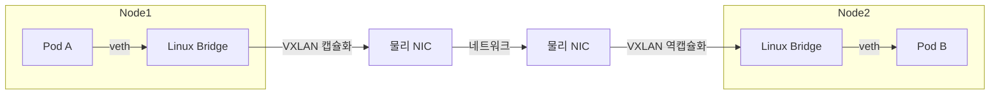
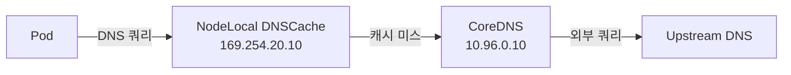
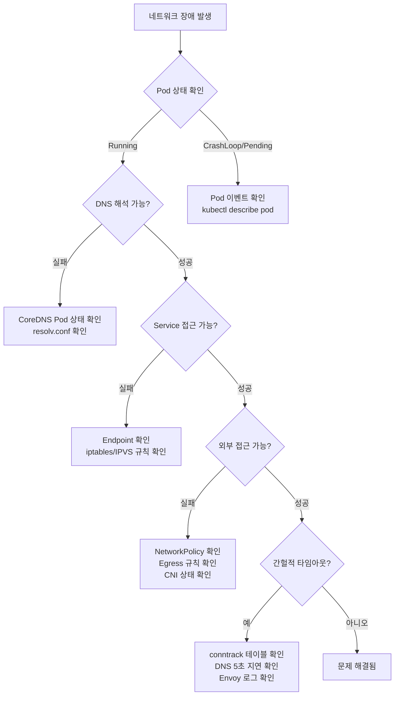

Kubernetes 환경에서 네트워크 문제는 가장 진단하기 어려운 장애 유형이다. 채용 공고에서는 네트워크 트러블슈팅을 DevOps의 가장 어려운 부분이라고 명시하고 있으며, 실제 대규모 서비스를 운영하는 기업들도 네트워크 장애 대응 역량을 핵심 평가 요소로 다루고 있다.

이 글에서는 Kubernetes 네트워크의 기본 구조부터 실전 트러블슈팅 사례, 디버깅 도구 활용법까지 단계별로 정리한다.

---

## 1. Linux 네트워킹 기초 - Kubernetes 네트워크의 뿌리

Kubernetes의 네트워크는 Linux 커널의 네트워킹 스택 위에 구축되어 있다. 트러블슈팅을 하려면 이 기초 계층을 이해해야 한다.

### 1.1 netfilter와 iptables

[netfilter](https://www.netfilter.org/)는 Linux 커널의 패킷 필터링/수정 프레임워크이다. iptables는 이 netfilter의 유저 스페이스 인터페이스로, 패킷이 커널을 통과할 때 5개의 훅 포인트(체인)에서 규칙을 평가한다.

```
패킷 도착
    │
    ▼
PREROUTING ──→ 라우팅 결정 ──→ FORWARD ──→ POSTROUTING ──→ 패킷 전송
                   │                              ▲
                   ▼                              │
                 INPUT ──→ 로컬 프로세스 ──→ OUTPUT ─┘
```

kube-proxy는 이 체인에 DNAT/SNAT 규칙을 삽입하여 Service의 ClusterIP → 실제 Pod IP 변환을 수행한다. kube-proxy가 생성하는 iptables 체인 구조는 다음과 같다.

```
KUBE-SERVICES (진입점 - 목적지 IP:port 매칭)
    └→ KUBE-SVC-* (로드 밸런서 체인 - 엔드포인트 분배)
        └→ KUBE-SEP-* (서비스 엔드포인트 - DNAT: Service VIP → Pod IP:port)
```

iptables 규칙 확인 명령:

```bash
# kube-proxy가 생성한 iptables 규칙 확인
iptables-save | grep KUBE

# 특정 서비스의 엔드포인트 규칙 확인
iptables-save | grep KUBE-SVC | grep <service-clusterip>
```

> 참고: [Kubernetes 공식 블로그 - kube-proxy Subtleties](https://kubernetes.io/blog/2019/03/29/kube-proxy-subtleties-debugging-an-intermittent-connection-reset/)

### 1.2 conntrack (Connection Tracking)

conntrack은 커널이 모든 활성 네트워크 연결을 추적하는 모듈이다. 각 연결은 `NEW`, `ESTABLISHED`, `RELATED`, `INVALID` 상태로 관리되며, 이미 conntrack 테이블에 등록된 연결은 kube-proxy의 iptables 규칙을 매번 다시 거치지 않으므로 성능에 유리하다.

핵심 파라미터:

| 파라미터                                                 | 설명                   | 기본값         |
|------------------------------------------------------|----------------------|-------------|
| `net.netfilter.nf_conntrack_max`                     | 최대 추적 연결 수           | 시스템 메모리 기반  |
| `net.netfilter.nf_conntrack_count`                   | 현재 추적 중인 연결 수        | -           |
| `net.netfilter.nf_conntrack_tcp_timeout_established` | TCP established 타임아웃 | 432000 (5일) |

```bash
# conntrack 테이블 현황 확인
cat /proc/sys/net/netfilter/nf_conntrack_count
cat /proc/sys/net/netfilter/nf_conntrack_max

# conntrack 엔트리 상세 확인
conntrack -L
```

conntrack 테이블이 `nf_conntrack_max`에 도달하면 새 연결 패킷을 거부하여 서비스 장애가 발생한다. 고부하 애플리케이션을 운영한다면 이 값을 반드시 모니터링해야 한다.

> 참고: [conntrack 테이블 고갈 사례](https://medium.com/@betz.mark/exhausting-conntrack-table-space-crippled-our-k8s-cluster-98564f6f34e0)

### 1.3 컨테이너 네트워킹의 구조

#### veth pair

가상 이더넷 인터페이스 쌍이다. 한쪽에 보낸 패킷이 반대쪽에서 수신된다. Pod이 생성되면 CNI 플러그인이 veth pair를 만들어 한쪽은 Pod의 네트워크 네임스페이스에, 다른 쪽은 호스트의 브리지 디바이스에 연결한다.

#### Linux Bridge

호스트 노드에 생성되는 L2 가상 스위치다. 같은 노드의 Pod끼리 통신하면 패킷이 `veth → bridge → veth` 경로로 커널 메모리 내에서 이동하며, 물리 NIC을 거치지 않으므로 빠르다.

#### Overlay Network

다른 노드의 Pod과 통신할 때는 오버레이 네트워크(주로 VXLAN)를 사용한다. 패킷이 `Pod → veth → bridge → VXLAN 캡슐화 → 물리 NIC → 네트워크 → 상대 노드`를 거치므로 캡슐화/역캡슐화 오버헤드와 MTU 감소가 수반된다.



> 참고: [Kubernetes Networking: Pods](https://medium.com/google-cloud/understanding-kubernetes-networking-pods-7117dd28727)

---

## 2. Kubernetes DNS - CoreDNS와 ndots 문제

DNS 문제는 Kubernetes 네트워크 장애 중 가장 빈번하게 발생하는 유형이다.

### 2.1 CoreDNS 동작 원리

CoreDNS는 kube-system 네임스페이스에 Deployment로 배포되며, `kube-dns` Service(기본 ClusterIP: `10.96.0.10`)를 통해 클러스터 내 모든 Pod에 DNS 서비스를 제공한다.

Pod이 생성되면 kubelet이 `/etc/resolv.conf`를 다음과 같이 설정한다.

```
nameserver 10.96.0.10
search default.svc.cluster.local svc.cluster.local cluster.local
options ndots:5
```

> 참고: [Kubernetes DNS for Services and Pods](https://kubernetes.io/docs/concepts/services-networking/dns-pod-service/)

### 2.2 ndots:5 문제

`ndots:5`는 도메인 이름에 점(`.`)이 5개 미만이면 FQDN으로 간주하지 않고 search domain을 먼저 시도한다는 의미다. 예를 들어 `api.example.com`을 쿼리하면:

1. `api.example.com.default.svc.cluster.local` → NXDOMAIN
2. `api.example.com.svc.cluster.local` → NXDOMAIN
3. `api.example.com.cluster.local` → NXDOMAIN
4. `api.example.com` → 성공

외부 도메인 하나를 조회하는데 4~5배의 DNS 쿼리가 발생한다. 외부 API 호출이 많은 워크로드에서는 CoreDNS 부하와 지연이 증가한다.

**해결 방법:**

1. 도메인 끝에 `.`(trailing dot)을 붙여 FQDN으로 직접 쿼리: `api.example.com.`
2. Pod spec에서 `ndots` 값을 줄이기:

```yaml
spec:
  dnsConfig:
    options:
      - name: ndots
        value: "2"
```

> 참고: [ndots:5 이슈 - kubernetes/dns#341](https://github.com/kubernetes/dns/issues/341)

### 2.3 DNS 5초 타임아웃 (conntrack race condition)

Linux 커널의 conntrack 경합 조건으로 인해 발생하는 문제다. glibc가 A 레코드와 AAAA 레코드를 같은 소켓에서 동시에 전송하면, conntrack이 두 패킷에 같은 튜플을 할당하려다 하나를 드롭한다. 드롭된 쿼리는 UDP 재시도 타임아웃(기본 5초)을 기다린 후 재전송된다.

**증상:** 간헐적으로 DNS 응답이 정확히 5초 지연됨.

**해결 방법:**

1. **`single-request-reopen`** 옵션 사용: A/AAAA 요청을 별도 소켓으로 순차 전송

```yaml
spec:
  dnsConfig:
    options:
      - name: single-request-reopen
```

2. **NodeLocal DNSCache** 배포: 각 노드에 DaemonSet으로 DNS 캐싱 에이전트를 배포하고, iptables NOTRACK 규칙을 추가하여 conntrack 자체를 우회한다.



3. 커널 레벨에서 `NF_NAT_RANGE_PROTO_RANDOM_FULLY` 플래그 적용

> 참고: [DNS 5초 지연 이슈 - kubernetes/kubernetes#56903](https://github.com/kubernetes/kubernetes/issues/56903), [NodeLocal DNSCache 공식 문서](https://kubernetes.io/docs/tasks/administer-cluster/nodelocaldns/)

### 2.4 DNS 디버깅 명령어

```bash
# CoreDNS Pod 상태 확인
kubectl get pods -n kube-system -l k8s-app=kube-dns

# DNS 테스트 Pod 생성 및 확인
kubectl run dnsutils --image=gcr.io/kubernetes-e2e-test-images/dnsutils:1.3 -- sleep 3600
kubectl exec -it dnsutils -- nslookup kubernetes.default
kubectl exec -it dnsutils -- cat /etc/resolv.conf

# CoreDNS 로그 확인
kubectl logs -n kube-system -l k8s-app=kube-dns

# dig로 search domain 동작 확인
kubectl exec -it dnsutils -- dig +search example.com
```

> 참고: [Kubernetes Debugging DNS Resolution](https://kubernetes.io/docs/tasks/administer-cluster/dns-debugging-resolution/)

---

## 3. CNI 플러그인 이슈

### 3.1 Calico 알려진 문제

**Pod 시작 시 최대 2분간 네트워크 미연결:**

calico-node가 `WorkloadEndpointUpdate` 알림을 Pod 생성 후 1분 이상 지나서야 수신하는 경우가 있다. 이 사이에 해당 Pod은 네트워크 연결이 없는 상태로 실행된다.

> 참고: [calico-node Pod 연결 지연 - projectcalico/calico#9706](https://github.com/projectcalico/calico/issues/9706)

### 3.2 Cilium + Hubble 디버깅

Cilium은 eBPF 기반 CNI 플러그인으로, Hubble이라는 내장 네트워크 관측 도구를 제공한다.

```bash
# Cilium 상태 확인
cilium-dbg status

# 패킷 드롭 모니터링
cilium-dbg monitor --type drop

# Hubble로 네트워크 트래픽 관찰
hubble observe --namespace default

# 연결성 테스트
cilium connectivity test

# NetworkPolicy에 의한 드롭 확인
hubble observe --verdict DROPPED --namespace <namespace>
```

**NetworkPolicy 적용 시 주의:** Cilium에서 새 NetworkPolicy를 적용하면, 해당 엔드포인트의 모든 트래픽이 즉시 `allow-all`에서 `deny-all`로 전환된다. 규칙에 명시되지 않은 모든 트래픽이 차단되므로, egress 규칙도 함께 정의해야 한다.

> 참고: [Cilium Troubleshooting 공식 문서](https://docs.cilium.io/en/stable/operations/troubleshooting/), [Cilium NetworkPolicy 미스설정 사례 - Datadog](https://www.datadoghq.com/blog/cilium-network-policy-misconfigurations/)

---

## 4. kube-proxy와 iptables/IPVS 이슈

### 4.1 conntrack 테이블 고갈

**증상:** 고부하 애플리케이션에서 간헐적 연결 리셋, 타임아웃 발생.

conntrack 테이블이 `nf_conntrack_max`에 도달하면 새 연결 패킷이 거부된다. 이 문제는 많은 수의 단기 연결(short-lived connection)을 처리하는 워크로드에서 흔히 발생한다.

```bash
# 현재 테이블 사용률 확인
echo "$(cat /proc/sys/net/netfilter/nf_conntrack_count) / $(cat /proc/sys/net/netfilter/nf_conntrack_max)"

# conntrack_max 값 증가
sysctl -w net.netfilter.nf_conntrack_max=262144
```

### 4.2 SNAT Race Condition

다수의 컨테이너가 동일한 외부 주소로 동시에 연결할 때, 두 연결에 같은 소스 포트가 SNAT으로 할당되어 패킷이 드롭되는 현상이다. 해결 방법은 masquerade 규칙에 `NF_NAT_RANGE_PROTO_RANDOM_FULLY` 플래그를 설정하는 것이다.

### 4.3 iptables vs IPVS 확장성

대규모 클러스터(1000개 이상 Service)에서 iptables 모드는 규칙 수정 시 전체 체인을 다시 프로그래밍해야 하므로 수십 초가 소요될 수 있다. IPVS 모드는 해시 테이블 기반으로 O(1) 시간 복잡도를 가지므로 대규모 환경에서 확장성이 더 좋다.

그러나 Kubernetes 1.26부터 IPVS 모드는 공식적으로 유지보수 모드(maintenance mode) 상태이며, nftables 기반의 새로운 kube-proxy 구현이 진행 중이다.

> 참고: [iptables vs IPVS 비교 - Tigera](https://www.tigera.io/blog/comparing-kube-proxy-modes-iptables-or-ipvs/)

---

## 5. Service Mesh (Istio/Envoy) 네트워킹 문제

### 5.1 503 Upstream Connection Termination (UC)

Istio 환경에서 가장 흔한 에러 중 하나다.

**근본 원인:** Envoy sidecar와 애플리케이션 사이의 HTTP keep-alive 타임아웃 불일치. Envoy의 기본 keep-alive 타임아웃은 1시간이지만 대부분의 HTTP 서버는 훨씬 낮은 값을 사용한다. 업스트림 서비스가 연결을 종료(FIN)한 직후에 Envoy가 만료된 연결로 새 요청을 보내면, 업스트림이 RST 패킷으로 거부하여 503 UC 에러가 발생한다.

**해결:** 애플리케이션의 HTTP keep-alive 타임아웃을 60초 이상으로 설정하거나, HTTP/2 프로토콜로 전환한다.

### 5.2 Envoy 프록시 디버깅 명령어

```bash
# 프록시 상태 확인 (Synced 여부)
istioctl proxy-status

# 클러스터/리스너/라우트/엔드포인트 설정 확인
istioctl proxy-config cluster <pod-name>
istioctl proxy-config listener <pod-name>
istioctl proxy-config route <pod-name>
istioctl proxy-config endpoint <pod-name>

# Envoy 로그 레벨을 debug로 변경
istioctl proxy-config log <pod-name> --level=debug

# Envoy access log 확인
kubectl logs <pod-name> -c istio-proxy
```

> 참고: [Istio 공식 - Traffic Management Problems](https://istio.io/latest/docs/ops/common-problems/network-issues/), [Istio Debugging Envoy](https://istio.io/latest/docs/ops/diagnostic-tools/proxy-cmd/)

---

## 6. 실전 트러블슈팅 사례

### 6.1 카카오 - conntrack 버그로 인한 TCP 연결 리셋

카카오는 자체 Kubernetes 플랫폼 DKOS를 운영하면서 Pod에서 외부 서버로 대용량 데이터를 전송할 때 TCP 연결이 갑자기 리셋되는 문제를 겪었다.

**증상:** `connection reset by peer` 에러 간헐적 발생.

**근본 원인:** 서버 응답 패킷의 순서가 뒤바뀌어 도착하면, conntrack이 유효한 패킷을 `INVALID`로 마킹한다. iptables가 INVALID 상태의 패킷에 대해 암시적 DNAT를 수행하지 못해 패킷이 Pod 대신 Node에 도달하고, Node가 RST 패킷으로 응답하여 연결이 종료되었다.

**해결:** 카카오는 [network-node-manager](https://github.com/kakao/network-node-manager)라는 오픈소스를 개발했다. 이 도구는 각 노드에 `INVALID` 패킷을 DROP하는 iptables filter 규칙을 자동으로 설치하여 잘못된 RST 패킷 전송을 방지한다.

```bash
# INVALID 패킷 드롭 규칙 (수동 설정 시)
iptables -A FORWARD -m conntrack --ctstate INVALID -j DROP
```

> 참고: [카카오 기술 블로그 - network-node-manager](https://tech.kakao.com/posts/426)

### 6.2 카카오 - IPVS 모드에서 External-IP 접근 불가

**증상:** `ExternalTrafficPolicy: Local`로 설정된 LoadBalancer Service에서, 클러스터 내부 Pod이 External-IP로 접근할 수 없음. ClusterIP로는 정상 통신.

**근본 원인:** kube-proxy가 해당 Service의 Pod이 없는 노드에서 External-IP 행 패킷을 드롭하는 IPVS 규칙을 생성했다.

**해결:** network-node-manager가 External-IP 목적지를 ClusterIP로 변환하는 DNAT 규칙을 삽입하여 우회했다.

### 6.3 카카오 2022년 판교 데이터센터 장애

2022년 10월 SK C&C 판교 데이터센터 화재로 카카오 전체 서비스가 약 5일간 중단된 사건이다. 직접적인 Kubernetes 네트워크 이슈는 아니지만, 인프라 엔지니어가 반드시 알아야 할 교훈을 제공한다.

**핵심 문제점:**

- 오브젝트 스토리지 메타데이터 시스템과 보안 키 저장소가 단일 데이터센터 내부에서만 이중화
- 장애 대응을 위한 운영 관리 도구 자체가 이중화되어 있지 않아 수동 복구만 가능
- Active-Standby 구성이었지만 자동 전환 시스템도 같은 DC에 위치

**교훈:**

- Multi-DC/Multi-Region 이중화 시 관리 도구(Management Plane)의 이중화가 필수
- DR(Disaster Recovery) 계획에서 네트워크 경로의 물리적 독립성 확보
- etcd 백업/복구 절차의 정기적 훈련

> 참고: [카카오 공식 - 우리가 부족했던 이유](https://www.kakaocorp.com/page/detail/9902)

---

## 7. 디버깅 도구 모음

### 7.1 nicolaka/netshoot

네트워크 디버깅에 필요한 도구(tcpdump, curl, dig, mtr, iperf3, nmap, conntrack-tools, ipvsadm 등)가 모두 포함된 컨테이너 이미지다.

```bash
# 임시 디버깅 Pod 생성
kubectl run tmp-shell --rm -it --image=nicolaka/netshoot -- /bin/bash

# 기존 Pod에 Ephemeral Container로 디버깅 (distroless 이미지에서도 사용 가능)
kubectl debug -it <pod-name> --image=nicolaka/netshoot --target=<container-name>

# 노드 네트워크 네임스페이스에서 디버깅
kubectl debug node/<node-name> -it --image=nicolaka/netshoot
```

> 참고: [nicolaka/netshoot GitHub](https://github.com/nicolaka/netshoot)

### 7.2 Pod 내부 네트워크 디버깅

```bash
# DNS 확인
nslookup kubernetes.default.svc.cluster.local
dig +short kubernetes.default.svc.cluster.local

# 연결성 테스트
curl -v http://<service-name>.<namespace>.svc.cluster.local:<port>

# TCP 연결 상태
ss -tulpn

# 패킷 캡처
tcpdump -i eth0 -nn port 53                  # DNS 트래픽
tcpdump -i eth0 -nn host <target-ip>          # 특정 호스트
tcpdump -i eth0 -w /tmp/capture.pcap          # Wireshark용 저장

# 라우팅 확인
ip route
traceroute <target>
```

### 7.3 kubectl debug + Ephemeral Containers

Kubernetes 1.25부터 Ephemeral Container가 GA(Generally Available)되었다. 프로덕션 Pod에 디버깅 컨테이너를 임시로 붙여서 네트워크 상태를 확인할 수 있다.

```bash
# tcpdump를 Wireshark로 실시간 스트리밍
kubectl debug -it <pod-name> --image=nicolaka/netshoot --target=<container-name> \
  -- tcpdump -i eth0 -w - | wireshark -k -i -
```

---

## 8. L4 vs L7 로드밸런싱

Kubernetes 환경에서 L4와 L7 로드밸런싱의 차이를 정확히 이해하는 것은 서비스 아키텍처 설계와 장애 진단 모두에 중요하다.

### 8.1 L4 로드밸런싱

TCP/UDP 연결 단위로 트래픽을 분배한다. Kubernetes에서 `Service`(kube-proxy)가 iptables/IPVS로 구현하며, 패킷의 애플리케이션 데이터는 검사하지 않는다.

**한계:** HTTP/2나 gRPC처럼 하나의 TCP 연결에 여러 요청을 멀티플렉싱하는 프로토콜에서는, 모든 요청이 같은 Pod으로 전달되어 로드밸런싱이 무의미해진다.

### 8.2 L7 로드밸런싱

HTTP 헤더, URL 경로, 쿠키 등을 기반으로 요청 단위 라우팅을 수행한다. Kubernetes에서 `Ingress`, `Gateway API`, Istio VirtualService 등이 이 역할을 한다.

**Kubernetes Gateway API:**

Ingress API의 후속 표준으로, L4(TCP/UDP)와 L7(HTTP/gRPC) 모두 지원한다. 역할 기반 리소스 분리가 특징이다.

| 리소스          | 관리 주체      | 역할            |
|--------------|------------|---------------|
| GatewayClass | 인프라 제공자    | 로드밸런서 구현체 정의  |
| Gateway      | 클러스터 운영자   | 리스너, TLS 설정   |
| HTTPRoute    | 애플리케이션 개발자 | URL 경로 기반 라우팅 |

> 참고: [Gateway API 공식 문서](https://gateway-api.sigs.k8s.io/)

---

## 9. 트러블슈팅 플로우차트

Kubernetes 네트워크 장애 발생 시 체계적으로 접근하기 위한 플로우차트다.



---

## 10. 정리

| 단계 | 학습 내용                                                                        | 확인 도구                                               |
|----|------------------------------------------------------------------------------|-----------------------------------------------------|
| 기본 | Linux 네트워킹(netfilter, iptables, conntrack), 컨테이너 네트워킹(veth, bridge, overlay) | `iptables-save`, `conntrack -L`, `ip route`         |
| 응용 | CoreDNS/ndots, CNI 플러그인, kube-proxy, NetworkPolicy                           | `dig`, `nslookup`, `cilium-dbg`, `hubble`           |
| 심화 | conntrack race condition, SNAT 충돌, Istio Envoy 디버깅, 대규모 클러스터 확장성             | `istioctl proxy-config`, `tcpdump`, `kubectl debug` |
| 실전 | 카카오 conntrack 버그 대응, 토스 Istio 기반 트래픽 관리, DR 설계                               | 실제 사례 분석 기반                                         |

네트워크 트러블슈팅 역량은 하루아침에 쌓이지 않는다. 위의 기본 개념을 이해한 상태에서 실제 클러스터를 운영하며 장애를 경험하고, 커널 레벨에서 패킷 흐름을 추적하는 연습을 반복해야 한다.

---

**참고 문서:**

- [Kubernetes 공식 - Debugging DNS Resolution](https://kubernetes.io/docs/tasks/administer-cluster/dns-debugging-resolution/)
- [Kubernetes 공식 - NodeLocal DNSCache](https://kubernetes.io/docs/tasks/administer-cluster/nodelocaldns/)
- [Kubernetes 공식 블로그 - kube-proxy Subtleties](https://kubernetes.io/blog/2019/03/29/kube-proxy-subtleties-debugging-an-intermittent-connection-reset/)
- [Istio 공식 - Network Issues](https://istio.io/latest/docs/ops/common-problems/network-issues/)
- [Cilium Troubleshooting](https://docs.cilium.io/en/stable/operations/troubleshooting/)
- [카카오 network-node-manager](https://tech.kakao.com/posts/426)
- [nicolaka/netshoot](https://github.com/nicolaka/netshoot)
- [Gateway API 공식](https://gateway-api.sigs.k8s.io/)
