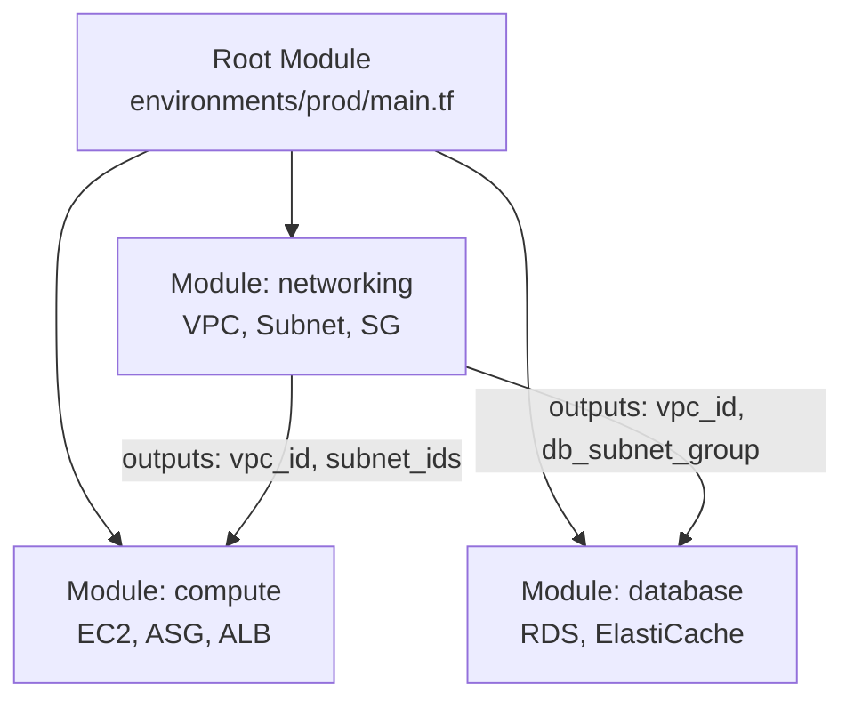
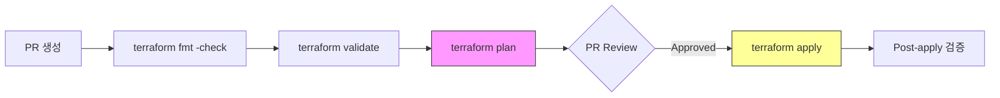

삼성SDS는 CNCF Platinum Member이자 KCSP(Kubernetes Certified Service Provider) 인증을 보유한 엔터프라이즈 클라우드 서비스 프로바이더다. 고객사 클라우드 전환 프로젝트를 수행하며, Terraform 기반 IaC를 핵심 역량으로 요구한다. 실제로 삼성은 Bixby 2.0, Knox, RCS 등 글로벌 서비스를 AWS + GCP 멀티 클라우드에서 Terraform Enterprise로 관리하고 있다.

이 글에서는 Terraform의 모듈 구조 설계, State 관리 전략, 멀티 클라우드 운영, 그리고 엔터프라이즈 환경에서 흔히 발생하는 Anti-pattern과 해결책을 정리한다.

---

## 1. 모듈 구조 설계

### 1.1 표준 모듈 구조

HashiCorp이 권장하는 모듈 구조다.

```
modules/
├── networking/
│   ├── main.tf
│   ├── variables.tf
│   ├── outputs.tf
│   └── README.md
├── compute/
│   ├── main.tf
│   ├── variables.tf
│   └── outputs.tf
└── database/
    ├── main.tf
    ├── variables.tf
    └── outputs.tf
examples/
├── simple/
└── complete/
```

각 모듈은 세 개의 파일(`main.tf`, `variables.tf`, `outputs.tf`)로 구성하며, `README.md`가 있는 모듈은 외부 사용자가 재사용 가능한 모듈이다.

**모듈 설계 원칙:**

- 인프라를 논리적 레이어(네트워크, 컴퓨트, 데이터베이스)로 분리
- 환경별 차이는 input variable로 파라미터화 (AMI ID, 인스턴스 타입 등을 hardcoding하지 않음)
- 시맨틱 버저닝(Semantic Versioning) 적용
- `/examples` 폴더에 사용 예시를 작성하여 재사용성 촉진

> 참고: [HashiCorp - Standard Module Structure](https://developer.hashicorp.com/terraform/language/modules/develop/structure), [AWS Prescriptive Guidance - Terraform Structure](https://docs.aws.amazon.com/prescriptive-guidance/latest/terraform-aws-provider-best-practices/structure.html)

### 1.2 Root Module과 Child Module의 관계



Root Module은 환경별(dev/staging/prod) 진입점이다. Child Module의 output을 다른 Child Module의 input으로 연결하여 리소스 간 의존성을 표현한다.

```hcl
# environments/prod/main.tf
module "networking" {
  source = "../../modules/networking"
  vpc_cidr = "10.0.0.0/16"
  environment = "prod"
}

module "compute" {
  source = "../../modules/compute"
  vpc_id     = module.networking.vpc_id
  subnet_ids = module.networking.private_subnet_ids
  instance_type = "m6g.xlarge"
}
```

---

## 2. State 관리 전략

### 2.1 S3 + DynamoDB 백엔드

AWS 환경에서의 표준 State 관리 패턴이다.

```hcl
terraform {
  backend "s3" {
    bucket         = "my-terraform-state"
    key            = "prod/networking/terraform.tfstate"
    region         = "ap-northeast-2"
    encrypt        = true
    dynamodb_table = "terraform-locks"
    use_lockfile   = true
  }
}
```

| 항목                | 설정           | 이유                                         |
|-------------------|--------------|--------------------------------------------|
| `encrypt`         | `true`       | State에 민감한 정보(DB 비밀번호 등)가 포함될 수 있음         |
| `dynamodb_table`  | locking용 테이블 | 동시 `terraform apply` 방지                    |
| `use_lockfile`    | `true`       | S3 native locking (DynamoDB deprecated 예정) |
| Bucket Versioning | 활성화          | State 파일 손상 시 롤백                           |

**State Locking의 중요성:** Locking 없이 여러 사용자/파이프라인이 동시에 `terraform apply`를 실행하면 State 파일이 충돌하거나 손상될 수 있다. 특히 CI/CD 환경에서는 반드시 locking을 활성화해야 한다.

**보안 원칙:**

- IAM 정책으로 State 버킷 접근을 제한
- prod State는 CI/CD 파이프라인과 break-glass 역할에만 쓰기 권한 부여
- CloudTrail로 State 변경 이력 감사

> 참고: [Backend Type: S3 - HashiCorp](https://developer.hashicorp.com/terraform/language/backend/s3), [AWS Best Practices for Terraform State](https://aws.amazon.com/blogs/devops/best-practices-for-managing-terraform-state-files-in-aws-ci-cd-pipeline/)

### 2.2 State 분리 전략

하나의 거대한 State 파일에 모든 리소스를 관리하면 `terraform plan/apply`가 느려지고, 하나의 변경이 전체 인프라에 위험을 줄 수 있다.

**권장 분리 단위:**

```
states/
├── networking/        # VPC, Subnet, Route Table, NAT
│   └── terraform.tfstate
├── eks-cluster/       # EKS Control Plane, Node Group
│   └── terraform.tfstate
├── database/          # RDS, ElastiCache
│   └── terraform.tfstate
└── monitoring/        # CloudWatch, Prometheus
    └── terraform.tfstate
```

State 간 참조는 `terraform_remote_state` data source로 한다.

```hcl
# eks-cluster에서 networking의 state 참조
data "terraform_remote_state" "networking" {
  backend = "s3"
  config = {
    bucket = "my-terraform-state"
    key    = "prod/networking/terraform.tfstate"
    region = "ap-northeast-2"
  }
}

resource "aws_eks_cluster" "main" {
  vpc_config {
    subnet_ids = data.terraform_remote_state.networking.outputs.private_subnet_ids
  }
}
```

---

## 3. 환경 분리: Workspace vs 디렉토리 구조

### 3.1 Workspace 방식

```bash
terraform workspace new dev
terraform workspace new staging
terraform workspace new prod
terraform workspace select prod
```

같은 코드를 환경별 workspace로 분리한다. 코드 중복이 없지만, 환경 간 구성 차이가 큰 경우 `terraform.workspace` 기반의 조건문이 복잡해진다.

### 3.2 디렉토리 구조 방식

```
environments/
├── dev/
│   ├── main.tf
│   ├── terraform.tfvars
│   └── backend.tf
├── staging/
│   ├── main.tf
│   ├── terraform.tfvars
│   └── backend.tf
└── prod/
    ├── main.tf
    ├── terraform.tfvars
    └── backend.tf
```

각 환경이 독립된 State와 파이프라인을 가진다. dev 환경의 변경이 prod에 영향을 줄 수 없다.

### 3.3 어떤 것을 선택할 것인가

| 구분          | Workspace       | 디렉토리 구조              |
|-------------|-----------------|----------------------|
| 코드 중복       | 없음              | 있음 (modules로 최소화 가능) |
| 격리 수준       | 약함 (같은 backend) | 강함 (완전 독립)           |
| CI/CD 파이프라인 | 복잡              | 환경별 독립 파이프라인 가능      |
| 추천          | 소규모, 학습용        | 엔터프라이즈 환경            |

HashiCorp 공식 문서에서는 환경 관리 목적으로 workspace 사용을 권장하지 않는다고 명시하고 있다.

> 참고: [HashiCorp - Manage Workspaces](https://developer.hashicorp.com/terraform/cli/workspaces)

---

## 4. 멀티 클라우드 구성

### 4.1 Multi-Provider 설정

```hcl
terraform {
  required_providers {
    aws = {
      source  = "hashicorp/aws"
      version = "~> 5.0"
    }
    azurerm = {
      source  = "hashicorp/azurerm"
      version = "~> 3.0"
    }
    google = {
      source  = "hashicorp/google"
      version = "~> 5.0"
    }
  }
}

provider "aws" {
  region = "ap-northeast-2"
}

provider "azurerm" {
  features {}
  subscription_id = var.azure_subscription_id
}

provider "google" {
  project = var.gcp_project_id
  region  = "asia-northeast3"
}
```

각 Provider의 인증 체계가 다르다.

| Provider | 인증 방식                                  |
|----------|----------------------------------------|
| AWS      | IAM Role, Access Key, Instance Profile |
| Azure    | Service Principal + Subscription ID    |
| GCP      | Service Account Key, Workload Identity |

**삼성 사례:** Samsung은 RCS(6천만+ 사용자, 10개+ 환경)를 AWS + GCP 멀티 클라우드에서 Terraform Enterprise로 관리하며, 전 세계(한국, 미국, 중국, 유럽, 인도) DevOps 팀의 워크플로우를 표준화했다.

> 참고: [HashiConf - What Samsung Learned From Using Terraform](https://www.hashicorp.com/en/resources/what-samsung-learned-from-using-terraform-to-build-bixby-2-0-knox-and-rcs)

### 4.2 삼성SDS의 IaC 접근

삼성SDS는 자체 클라우드 플랫폼 Samsung Cloud Platform(SCP)을 운영하며, SCP 전용 Terraform Provider도 개발/공개했다.

```hcl
terraform {
  required_providers {
    samsungcloudplatform = {
      source = "SamsungSDSCloud/samsungcloudplatform"
    }
  }
}
```

삼성SDS의 클라우드 전환 방법론은 10년 이상의 경험과 국내 4개 + 해외 13개 클라우드 센터 운영을 기반으로 한다.

> 참고: [Samsung SDS Terraform Provider - GitHub](https://github.com/SamsungSDSCloud/terraform-provider-samsungcloudplatform), [Samsung SDS 클라우드 구축/전환](https://www.samsungsds.com/kr/cloud-implementaion-migration/cloud-implementaion-migration.html)

---

## 5. Anti-Pattern과 해결

### 5.1 Monolithic State

**문제:** 하나의 State 파일에 네트워킹부터 애플리케이션까지 모든 리소스를 관리하면 `terraform plan`이 느려지고, 한 리소스의 변경이 전체 인프라에 blast radius를 준다.

**해결:** 인프라를 논리적 단위로 분리하여 각각 독립된 State 파일로 관리한다. `terraform_remote_state`로 상태 간 참조를 연결한다.

### 5.2 Hardcoded Values

**문제:**

```hcl
# Anti-pattern
resource "aws_instance" "web" {
  ami           = "ami-0abcdef1234567890"  # 환경마다 다름
  instance_type = "t3.large"               # dev에서는 과도
  subnet_id     = "subnet-abc123"          # 다른 VPC에서 동작 안 함
}
```

**해결:**

```hcl
# 변수로 추출
resource "aws_instance" "web" {
  ami           = var.ami_id
  instance_type = var.instance_type
  subnet_id     = var.subnet_id
}
```

모든 환경별 값을 variable로 추출하고, `terraform.tfvars`나 환경변수로 주입한다. data source를 활용하면 AMI ID 같은 값을 동적으로 조회할 수 있다.

```hcl
data "aws_ami" "amazon_linux" {
  most_recent = true
  owners      = ["amazon"]
  filter {
    name   = "name"
    values = ["al2023-ami-*-x86_64"]
  }
}
```

### 5.3 Missing State Locking

**문제:** CI/CD 파이프라인의 병렬 실행이나 여러 엔지니어의 동시 작업으로 State 파일이 손상되거나 충돌한다.

**해결:** 원격 Backend에 반드시 locking을 활성화한다. S3 backend의 경우 DynamoDB 또는 S3 native locking(`use_lockfile = true`)을 사용한다.

### 5.4 Circular Dependencies

**문제:** 리소스 A가 B를 참조하고, B가 A를 참조하면 Terraform이 의존성 그래프를 해결하지 못한다.

**해결:**

- 모듈 분리로 의존성 그래프를 단순화
- 중간 리소스(intermediary)를 도입하여 순환 참조를 끊기
- Backend 인프라(S3, DynamoDB)는 Terraform 설정 전에 미리 프로비저닝하여 부트스트랩 순환 방지

> 참고: [HashiCorp - Opinionated Terraform Best Practices](https://www.hashicorp.com/en/resources/opinionated-terraform-best-practices-and-anti-patterns)

---

## 6. 고급 기능

### 6.1 Dynamic Blocks와 for_each

반복적인 nested block을 동적으로 생성한다.

```hcl
variable "ingress_rules" {
  type = map(object({
    from_port   = number
    to_port     = number
    protocol    = string
    cidr_blocks = list(string)
  }))
}

resource "aws_security_group" "example" {
  name = "dynamic-sg"

  dynamic "ingress" {
    for_each = var.ingress_rules
    content {
      from_port   = ingress.value.from_port
      to_port     = ingress.value.to_port
      protocol    = ingress.value.protocol
      cidr_blocks = ingress.value.cidr_blocks
    }
  }
}
```

**`count` vs `for_each`:** `count`는 인덱스 기반이라 중간 요소를 삭제하면 뒤의 리소스가 전부 재생성된다. `for_each`는 키 기반이라 개별 리소스를 독립적으로 관리할 수 있으므로 대부분의 경우 `for_each`가 적합하다.

### 6.2 Terragrunt

Terraform 코드의 반복을 줄이기 위한 래퍼 도구다.

```
infrastructure-live/
├── terragrunt.hcl              # root config (backend, provider)
├── prod/
│   ├── terragrunt.hcl          # prod 환경 변수
│   ├── vpc/
│   │   └── terragrunt.hcl      # module 참조
│   └── eks/
│       └── terragrunt.hcl
└── staging/
    ├── terragrunt.hcl
    └── vpc/
        └── terragrunt.hcl
```

```hcl
# prod/vpc/terragrunt.hcl
terraform {
  source = "git::git@github.com:org/modules.git//vpc?ref=v1.2.0"
}

include "root" {
  path = find_in_parent_folders()
}

inputs = {
  vpc_cidr    = "10.0.0.0/16"
  environment = "prod"
}
```

Terragrunt의 핵심 가치:

- **Backend 구성 중앙화**: root `terragrunt.hcl`에서 한 번만 정의
- **Module 소스 관리**: Git 태그 기반 버전 관리
- **계층적 변수 상속**: `find_in_parent_folders()`로 부모 설정을 동적 로드

> 참고: [Terragrunt - Keep Your Terraform Code DRY](https://terragrunt.gruntwork.io/docs/features/keep-your-terraform-code-dry/)

### 6.3 Policy as Code: OPA vs Sentinel

`terraform plan` 결과물에 대해 정책을 자동으로 검증하는 도구다. 예를 들어 "prod에서 public S3 bucket 생성 금지", "인스턴스 태그에 cost-center 필수" 같은 규칙을 코드로 정의한다.

| 구분    | Sentinel                          | OPA (Open Policy Agent)  |
|-------|-----------------------------------|--------------------------|
| 라이선스  | 상용 (Terraform Cloud/Enterprise)   | 오픈소스 (CNCF Graduated)    |
| 언어    | HSL (HashiCorp Sentinel Language) | Rego                     |
| 적용 시점 | plan과 apply 사이에 자동 적용             | CI/CD 파이프라인에 통합          |
| 생태계   | Terraform 전용                      | 범용 (Kubernetes, Envoy 등) |

OPA는 CNCF Graduated 프로젝트로, Terraform뿐만 아니라 Kubernetes(Gatekeeper), Envoy, CI/CD 파이프라인 등 다양한 영역에서 정책을 통합 관리할 수 있다는 장점이 있다. HashiCorp도 Terraform Cloud에서 OPA를 지원한다.

> 참고: [OPA for Terraform](https://www.openpolicyagent.org/docs/terraform), [Sentinel Policy Examples - GitHub](https://github.com/hashicorp/terraform-sentinel-policies)

---

## 7. CI/CD 파이프라인 통합

### 7.1 기본 파이프라인 구조



`terraform plan` 결과를 PR에 코멘트로 첨부하면, 코드 리뷰어가 인프라 변경 사항을 미리 확인할 수 있다.

### 7.2 보안 고려사항

- State 파일과 Provider 인증 정보를 CI/CD 시크릿으로 관리
- `terraform plan` 출력에 민감 정보가 포함될 수 있으므로 로그 공개 범위 제한
- `terraform apply`는 main 브랜치 머지 후에만 실행
- 자동화된 Policy as Code(OPA/Sentinel)로 보안 정책 강제

---

## 8. 정리

| 단계 | 학습 내용                                                              |
|----|--------------------------------------------------------------------|
| 기본 | HCL 문법, Provider/Resource/Data Source, State 개념                    |
| 응용 | 모듈 구조 설계, S3+DynamoDB State 관리, 환경 분리, for_each/dynamic block      |
| 심화 | 멀티 클라우드 Provider, Terragrunt DRY 패턴, Policy as Code(OPA), CI/CD 통합 |
| 실전 | Anti-pattern 식별 및 해결, 엔터프라이즈 모듈 레지스트리 운영, 삼성 사례 분석                 |

---

**참고 문서:**

- [Terraform 공식 문서](https://developer.hashicorp.com/terraform/docs)
- [Standard Module Structure](https://developer.hashicorp.com/terraform/language/modules/develop/structure)
- [Backend Type: S3](https://developer.hashicorp.com/terraform/language/backend/s3)
- [AWS - Terraform State Best Practices](https://aws.amazon.com/blogs/devops/best-practices-for-managing-terraform-state-files-in-aws-ci-cd-pipeline/)
- [Terragrunt DRY](https://terragrunt.gruntwork.io/docs/features/keep-your-terraform-code-dry/)
- [OPA for Terraform](https://www.openpolicyagent.org/docs/terraform)
- [Samsung Terraform at HashiConf](https://www.hashicorp.com/en/resources/what-samsung-learned-from-using-terraform-to-build-bixby-2-0-knox-and-rcs)
- [Samsung SDS Terraform Provider](https://github.com/SamsungSDSCloud/terraform-provider-samsungcloudplatform)
- [삼성SDS GitOps 인사이트](https://www.samsungsds.com/kr/insights/gitops.html)
