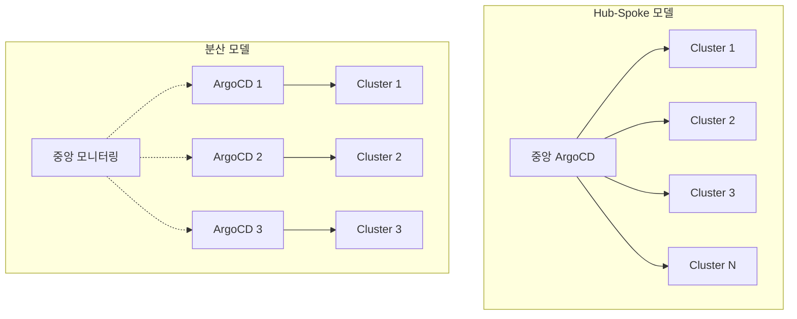

GitOps는 Git을 Single Source of Truth로 삼아 인프라와 애플리케이션의 원하는 상태를 선언적으로 관리하는 운영 모델이다. ArgoCD는 이 원칙을 Kubernetes 환경에서 구현하는 대표적인 도구로, CNCF Graduated 프로젝트로 채택될 만큼 광범위하게 사용되고 있다. 이 글에서는 실제 엔지니어들이 프로덕션 환경에서 겪은 GitOps/ArgoCD 운영 경험 5가지를 정리한다. 각 사례는 기업의 공식 엔지니어링 블로그 및 KubeCon 발표에서 공개된 내용을 기반으로 한다.

---

## 1. Intuit - 수천 개 마이크로서비스를 ArgoCD로 관리한 경험

> **원문 ([Argo Project Blog](https://blog.argoproj.io/argo-cd-applying-gitops-principles-to-manage-a-production-environment-in-kubernetes-da4d5e0a7714)):**
> Argo CD - Applying GitOps Principles To Manage A Production Environment In Kubernetes

**저자/출처:** Argo Project Blog (Intuit 엔지니어링팀)

### 1.1 배경

Intuit는 TurboTax, QuickBooks 등 북미 시장 점유율 상위권의 재무/세무 SaaS를 운영하는 기업이다. 수천 개의 마이크로서비스를 다수의 Kubernetes 클러스터에서 관리해야 하는 규모를 가지고 있으며, 기존에는 Jenkins 기반의 CI/CD 파이프라인으로 배포를 수행하고 있었다. 그런데 서비스 수가 증가하면서 배포 파이프라인의 복잡성이 기하급수적으로 늘어났고, 클러스터 상태와 Git 리포지토리 간의 불일치(Configuration Drift)가 빈번하게 발생하는 상황이었다. 개발팀마다 배포 방식이 달라 조직 차원의 표준화도 어려웠다.

### 1.2 문제점

핵심 문제는 크게 네 가지였다.

첫째, 수천 개 서비스의 배포 상태를 중앙에서 파악하기 어려웠다. 각 팀이 자체적으로 Jenkins 파이프라인을 구성하고 있었기 때문에, 전체 배포 현황을 한눈에 볼 수 있는 대시보드가 없었다.

둘째, 수동 `kubectl apply`나 CI 파이프라인 기반 Push 배포 모델에서 drift가 발생하면 감지 및 복구가 느렸다. 누군가가 긴급 대응 차원에서 클러스터에 직접 수정을 가해도 이를 추적할 수단이 마땅치 않았다.

셋째, 롤백 시 어떤 커밋으로 돌아가야 하는지 추적이 어려웠다. Jenkins 파이프라인의 빌드 번호와 Git 커밋의 매핑이 일관적이지 않았기 때문에, 장애 복구 시간(MTTR)이 길어지는 원인이 되었다.

넷째, 여러 클러스터에 걸친 멀티 테넌트 환경에서 RBAC과 배포 권한 관리가 복잡했다. Jenkins의 credential 관리와 Kubernetes RBAC이 분리되어 있어 보안 정책을 일관되게 적용하기 어려웠다.

### 1.3 해결 방법

Intuit는 ArgoCD를 도입하여 Pull 기반 GitOps 모델로 전면 전환했다. Git 리포지토리를 Single Source of Truth로 설정하고, ArgoCD가 지속적으로 클러스터 상태를 동기화하도록 구성했다.

**ApplicationSet을 활용한 대규모 Application 자동 생성**이 핵심 전략이었다. 수천 개의 Application을 수동으로 생성하는 것은 비현실적이므로, ApplicationSet Controller의 Git Generator와 List Generator를 조합하여 클러스터/네임스페이스별 배포를 템플릿화했다.

```yaml
apiVersion: argoproj.io/v1alpha1
kind: ApplicationSet
metadata:
  name: microservices
spec:
  generators:
    - git:
        repoURL: https://github.com/intuit/k8s-deploy-config.git
        revision: HEAD
        directories:
          - path: services/*
  template:
    metadata:
      name: '{{path.basename}}'
    spec:
      project: default
      source:
        repoURL: https://github.com/intuit/k8s-deploy-config.git
        targetRevision: HEAD
        path: '{{path}}'
      destination:
        server: https://kubernetes.default.svc
        namespace: '{{path.basename}}'
      syncPolicy:
        automated:
          selfHeal: true
          prune: true
```

ArgoCD의 RBAC 기능과 SSO(Dex/OIDC) 연동으로 팀별 배포 권한을 세분화했다. 자동 sync 정책과 self-heal 기능을 활용해 drift 발생 시 자동으로 원하는 상태로 복구되도록 구성했다.

### 1.4 핵심 교훈

- 대규모 조직에서 GitOps를 도입할 때는 ApplicationSet 같은 자동화 도구가 필수다. 수동으로 Application을 하나씩 만드는 방식은 수십 개 수준에서만 유효하고, 수백 개 이상에서는 확장성에 한계가 있다.
- Self-heal과 auto-sync를 적절히 조합하면 drift 문제를 근본적으로 해결할 수 있다. 다만 운영 초기에는 수동 sync로 시작해 안정성을 검증한 뒤 자동화 수준을 높이는 것이 안전하다.
- Git을 기반으로 한 배포 이력 추적은 롤백과 감사(audit)에 매우 효과적이다. `git log`와 `git revert`만으로 롤백이 가능하므로 MTTR을 크게 단축할 수 있다.

> **공식 문서:** [ArgoCD ApplicationSet - Generators](https://argo-cd.readthedocs.io/en/stable/operator-manual/applicationset/Generators/)

---

## 2. Codefresh - GitOps 1.0의 운영 고통과 해결 전략

> **원문 ([Codefresh Blog](https://codefresh.io/blog/pains-gitops-1-0/)):**
> The pains of GitOps 1.0

**저자/출처:** Codefresh 엔지니어링팀

### 2.1 배경

Codefresh는 GitOps 도구를 개발하고 자체 인프라에도 GitOps를 적용하는 회사다. 초기 GitOps(1.0) 모델을 프로덕션에 적용하면서 여러 운영상의 문제를 경험했고, 많은 조직이 GitOps를 도입할 때 이론적으로는 완벽해 보이지만 실제 운영에서는 다양한 엣지 케이스가 발생한다는 점을 공유했다. GitOps를 "도입한 후"에 겪게 되는 현실적인 문제들을 가감 없이 정리한 사례라는 점에서 가치가 있다.

### 2.2 문제점

**Configuration Drift 문제.** Git 리포지토리와 실제 클러스터 상태 간의 drift가 예상보다 자주 발생했다. 가장 큰 원인은 운영자가 긴급 상황에서 `kubectl edit`이나 `kubectl patch`로 직접 수정하는 경우였다. 새벽 장애 대응 시 PR을 올리고 리뷰받고 머지하는 절차를 밟을 여유가 없기 때문이다.

**Secret 관리의 한계.** 민감한 정보를 Git에 그대로 저장할 수 없어 별도의 워크플로우가 필요했다. GitOps의 "모든 것을 Git에서 관리한다"는 원칙과 보안 요구사항이 충돌하는 지점이다.

**환경 간 Promotion 복잡성.** 여러 환경(dev/staging/prod)에 걸친 promotion 워크플로우가 복잡했으며, 환경 간 설정 차이를 관리하기 어려웠다. 이미지 태그만 바꾸면 되는 단순한 경우도 있지만, 환경별로 리소스 사양, 환경 변수, 인그레스 설정 등이 모두 다를 수 있다.

**OutOfSync 상태의 모호성.** ArgoCD의 sync 상태가 `OutOfSync`로 표시되더라도, 그것이 의도적인 차이인지 비정상적인 drift인지 구분하기 어려웠다. HPA가 replica를 조정한 것도, 누군가가 `kubectl`로 직접 수정한 것도 동일하게 `OutOfSync`로 표시된다.

### 2.3 해결 방법

Codefresh는 다음과 같은 조합으로 문제를 해결했다.

**직접 수정 차단 정책 수립.** `kubectl` 직접 사용을 금지하는 정책을 수립하고, OPA/Gatekeeper로 직접 수정을 차단하는 Admission Webhook을 구성했다. 단, 긴급 대응을 위한 break-glass 절차는 별도로 마련했다. 긴급 수정 시에도 반드시 사후에 Git에 반영하도록 프로세스를 정의했다.

```yaml
apiVersion: constraints.gatekeeper.sh/v1beta1
kind: K8sBlockKubectlEdit
metadata:
  name: block-direct-modification
spec:
  match:
    kinds:
      - apiGroups: ["apps"]
        kinds: ["Deployment", "StatefulSet"]
    namespaces: ["production"]
  parameters:
    allowedUsers:
      - "system:serviceaccount:argocd:argocd-application-controller"
```

**Secret 관리 통합.** Sealed Secrets, External Secrets Operator 등을 활용해 Secret을 GitOps 파이프라인에 통합했다. External Secrets Operator는 AWS Secrets Manager, HashiCorp Vault 등 외부 Secret Store와 연동하여 Git에는 참조(ExternalSecret CR)만 저장하고, 실제 Secret은 클러스터 내에서 동적으로 생성하는 방식이다.

```yaml
apiVersion: external-secrets.io/v1beta1
kind: ExternalSecret
metadata:
  name: db-credentials
spec:
  refreshInterval: 1h
  secretStoreRef:
    name: aws-secret-store
    kind: ClusterSecretStore
  target:
    name: db-credentials
  data:
    - secretKey: password
      remoteRef:
        key: production/db-password
```

**환경별 설정 관리.** Kustomize overlays를 활용해 환경별 설정 차이를 체계적으로 관리하고, 환경 간 promotion은 PR 기반으로 자동화했다.

**Drift 알림 고도화.** ArgoCD notification과 커스텀 health check을 구성해 비정상적인 drift를 즉시 알림으로 받을 수 있도록 했다.

### 2.4 핵심 교훈

- GitOps 도입은 도구 설치로 끝나지 않는다. 조직 문화와 운영 프로세스까지 함께 변경해야 한다. 특히 긴급 상황에서 `kubectl`로 직접 수정하는 습관을 없애는 것이 가장 어려운 부분이다.
- Secret 관리는 GitOps 도입 시 초기부터 전략을 수립해야 한다. External Secrets Operator가 현재 가장 널리 채택되는 방식이며, CNCF 프로젝트로도 채택되었다.
- Drift detection은 단순히 "OutOfSync" 여부만 보는 것이 아니라, 어떤 리소스에서 어떤 필드가 변경되었는지까지 파악해야 실질적인 운영이 가능하다.

> **공식 문서:** [External Secrets Operator](https://external-secrets.io/latest/)

---

## 3. Argo Rollouts를 활용한 Canary 배포 프로덕션 적용

> **원문 ([Argo Project Blog](https://blog.argoproj.io/argo-rollouts-primitives-progressive-delivery-at-intuit-a26251a1c6e8)):**
> Progressive Delivery with Argo Rollouts

**저자/출처:** Argo Project / Intuit 엔지니어링팀

### 3.1 배경

대규모 SaaS 플랫폼을 운영하는 팀에서 기존 Kubernetes의 Rolling Update 전략만으로는 배포 안전성을 확보하기 어려웠다. Rolling Update는 새 파드가 readiness probe를 통과하면 순차적으로 기존 파드를 교체하는 방식인데, 이 과정에서 새 버전에 성능 저하나 에러율 증가가 발생해도 전체 파드가 교체된 후에야 발견되는 경우가 있었다. 특히 트래픽이 많은 서비스에서 이 문제는 매출에 직접적인 영향을 미쳤다.

### 3.2 문제점

기본 Rolling Update는 readiness probe만 통과하면 트래픽을 전달하므로, 실제 비즈니스 메트릭(에러율, p99/p95 지연 시간, 전환율 등)이 악화되어도 배포가 계속 진행되었다. readiness probe는 "HTTP 200을 반환하는가" 수준의 단순 확인에 불과하기 때문에, 성능 회귀(Performance Regression)를 감지할 수 없다.

수동 Canary 배포 역시 한계가 있었다. 운영자가 대시보드를 보며 판단하는 방식은 일관성이 없고, 야간이나 주말 배포 시 대응이 느렸다. 결과적으로 롤백 결정까지의 시간이 길어져 장애 영향 범위가 넓어지는 문제가 반복되었다.

### 3.3 해결 방법

Argo Rollouts를 도입하여 Progressive Delivery를 자동화했다. 핵심은 AnalysisTemplate을 통해 Prometheus 메트릭 기반으로 자동 승인/롤백을 구현하는 것이다.

**단계별 트래픽 가중치 설정.** 배포 시 트래픽을 5% -> 20% -> 50% -> 100%로 점진적으로 늘리고, 각 단계마다 AnalysisRun을 실행하여 메트릭을 검증했다.

```yaml
apiVersion: argoproj.io/v1alpha1
kind: Rollout
metadata:
  name: my-service
spec:
  strategy:
    canary:
      canaryService: my-service-canary
      stableService: my-service-stable
      trafficRouting:
        istio:
          virtualService:
            name: my-service-vsvc
            routes:
              - primary
      steps:
        - setWeight: 5
        - pause: { duration: 5m }
        - analysis:
            templates:
              - templateName: success-rate
            args:
              - name: service-name
                value: my-service-canary
        - setWeight: 20
        - pause: { duration: 5m }
        - analysis:
            templates:
              - templateName: success-rate
        - setWeight: 50
        - pause: { duration: 10m }
        - analysis:
            templates:
              - templateName: success-rate
        - setWeight: 100
```

**AnalysisTemplate으로 메트릭 기반 자동 판단.** Prometheus에서 에러율과 p99 지연 시간을 쿼리하여, 임계값을 초과하면 자동으로 롤백하도록 구성했다.

```yaml
apiVersion: argoproj.io/v1alpha1
kind: AnalysisTemplate
metadata:
  name: success-rate
spec:
  args:
    - name: service-name
  metrics:
    - name: success-rate
      interval: 60s
      successCondition: result[0] >= 0.99
      failureLimit: 3
      provider:
        prometheus:
          address: http://prometheus.monitoring:9090
          query: |
            sum(rate(http_requests_total{
              service="{{args.service-name}}",
              status=~"2.."
            }[5m]))
            /
            sum(rate(http_requests_total{
              service="{{args.service-name}}"
            }[5m]))
    - name: p99-latency
      interval: 60s
      successCondition: result[0] <= 500
      failureLimit: 3
      provider:
        prometheus:
          address: http://prometheus.monitoring:9090
          query: |
            histogram_quantile(0.99,
              sum(rate(http_request_duration_seconds_bucket{
                service="{{args.service-name}}"
              }[5m])) by (le)
            ) * 1000
```

Istio의 VirtualService와 연동하여 세밀한 트래픽 분배를 구현했고, 실패 시 자동 롤백과 함께 Slack 알림을 전송하도록 구성했다.

### 3.4 핵심 교훈

- Canary 배포의 핵심은 "자동화된 판단"이다. 사람이 대시보드를 보고 결정하는 것이 아니라, AnalysisTemplate에 정의한 메트릭 기준으로 자동 승인/롤백이 이루어져야 진정한 Progressive Delivery가 된다.
- AnalysisTemplate 작성 시 메트릭 임계값을 너무 엄격하게 잡으면 정상 배포도 실패하고, 너무 느슨하면 문제를 감지하지 못한다. 프로덕션 환경의 베이스라인 데이터를 기반으로 기준값을 튜닝하는 과정이 반드시 필요하다.
- Istio 없이도 Nginx Ingress Controller나 AWS ALB를 활용한 트래픽 분배가 가능하지만, 세밀한 가중치 기반 트래픽 제어가 필요하면 서비스 메시 연동이 유리하다.

> **공식 문서:** [Argo Rollouts - Canary Strategy](https://argoproj.github.io/argo-rollouts/features/canary/)

---

## 4. Multi-Cluster 환경에서의 ArgoCD 아키텍처 설계

> **원문 ([Akuity Blog](https://akuity.io/blog/argo-cd-architectures-explained)):**
> How to Manage Multiple Kubernetes Clusters with Argo CD

**저자/출처:** Akuity (ArgoCD 주요 메인테이너 팀)

### 4.1 배경

멀티 클러스터 환경을 운영하는 조직에서 ArgoCD 아키텍처를 결정해야 했다. 두 가지 접근법이 있다. 각 클러스터마다 별도의 ArgoCD 인스턴스를 운영하는 분산형(Standalone) 모델과, 하나의 중앙 ArgoCD로 모든 클러스터를 관리하는 Hub-Spoke 모델이다. 초기에는 Hub-Spoke 모델로 시작했으나 규모가 커지면서 여러 문제가 발생했다.



### 4.2 문제점

**Application Controller 리소스 병목.** 하나의 ArgoCD 인스턴스에서 수십 개의 클러스터를 관리하니 Application Controller의 리소스 사용량이 급증했다. 각 클러스터의 리소스 상태를 지속적으로 watch하고 reconcile해야 하므로, 클러스터가 늘어날수록 CPU와 메모리 사용량이 선형 이상으로 증가했다. Reconciliation 주기도 느려져 배포 반영까지 지연이 발생했다.

**SPOF(Single Point of Failure).** 중앙 ArgoCD가 장애를 겪으면 모든 클러스터의 배포가 중단되었다. ArgoCD 자체가 다운되어도 이미 배포된 워크로드는 영향받지 않지만, 새로운 배포나 롤백이 불가능해지는 것은 운영상 큰 리스크다.

**네트워크 불안정성.** 클러스터 간 네트워크 연결이 불안정한 경우(특히 멀티 리전 환경) sync 실패가 반복되어 Application 상태가 `Unknown`으로 표시되었다.

**RBAC 세분화 어려움.** 각 클러스터의 보안 요구사항이 달라(예: 금융 서비스 클러스터 vs 일반 서비스 클러스터) 단일 ArgoCD 인스턴스로 RBAC을 세분화하기 어려웠다.

### 4.3 해결 방법

Hub-Spoke 모델에서 분산형 모델로 전환했다. 각 클러스터(또는 클러스터 그룹)에 ArgoCD를 설치하고, 상위 레벨에서 App of Apps 패턴으로 ArgoCD 인스턴스 자체의 설정을 관리하는 구조다.

**ApplicationSet의 Cluster Generator 활용.** 새 클러스터가 등록되면 자동으로 필요한 Application들이 생성되도록 했다.

```yaml
apiVersion: argoproj.io/v1alpha1
kind: ApplicationSet
metadata:
  name: cluster-addons
spec:
  generators:
    - clusters:
        selector:
          matchLabels:
            env: production
  template:
    metadata:
      name: '{{name}}-addons'
    spec:
      project: cluster-addons
      source:
        repoURL: https://github.com/org/cluster-addons.git
        targetRevision: HEAD
        path: 'addons/{{metadata.labels.region}}'
      destination:
        server: '{{server}}'
        namespace: kube-system
```

**중앙 모니터링 집계.** 각 클러스터의 ArgoCD 상태를 중앙 모니터링 시스템(Prometheus + Grafana)으로 집계하여 전체 배포 상태를 한눈에 파악할 수 있도록 했다. `argocd_app_info` 메트릭을 Remote Write로 중앙 Prometheus에 전송하는 방식이다.

**네트워크 안정성 대응.** 네트워크 불안정 구간에 대해서는 retry 정책과 sync window를 설정하여 불필요한 sync 실패를 줄였다.

### 4.4 핵심 교훈

- 멀티 클러스터 ArgoCD 운영 시 "중앙 집중 vs 분산" 결정은 클러스터 수, 보안 요구사항, 네트워크 토폴로지에 따라 달라진다. 대략적으로 10개 이하의 클러스터라면 중앙 집중형이 관리 편의성이 높지만, 그 이상이면 분산형을 고려해야 한다.
- ArgoCD 자체의 고가용성(HA) 구성은 프로덕션 환경에서 필수다. Application Controller, Repo Server, Redis를 각각 HA로 구성해야 한다. 특히 Application Controller는 leader election 기반으로 동작하므로 replica를 늘려도 active-standby 방식이라는 점을 이해해야 한다.
- ApplicationSet의 Cluster Generator는 멀티 클러스터 관리의 핵심 도구다. 클러스터 라벨 기반으로 동적 Application 생성이 가능해 운영 오버헤드를 크게 줄일 수 있다. 새 클러스터를 등록할 때 라벨만 지정하면 필요한 모든 addon과 애플리케이션이 자동으로 배포된다.

> **공식 문서:** [ArgoCD - Cluster Generator](https://argo-cd.readthedocs.io/en/stable/operator-manual/applicationset/Generators-Cluster/)

---

## 5. GitOps 환경에서의 Configuration Drift 장애 대응

> **원문 ([CNCF Blog](https://www.cncf.io/blog/2020/12/17/solving-configuration-drift-using-gitops-with-argo-cd/)):**
> The challenge of managing Kubernetes configuration drift

**저자/출처:** CNCF Blog

### 5.1 배경

여러 DevOps 팀이 GitOps 모델로 프로덕션 Kubernetes 클러스터를 운영하는 환경에서, Configuration Drift로 인한 복합 장애가 발생했다. 특히 HPA(Horizontal Pod Autoscaler)가 replica 수를 변경하면 ArgoCD가 이를 drift로 감지하여 원래 값으로 되돌리는 문제, CRD 업그레이드 시 필드 변경으로 인한 지속적인 OutOfSync 상태 등이 동시에 발생하여 운영에 큰 혼란을 초래했다.

### 5.2 문제점

**HPA vs ArgoCD auto-sync 충돌.** 가장 심각한 문제는 HPA가 트래픽 증가에 따라 replica를 늘렸는데, ArgoCD의 auto-sync가 Git에 정의된 원래 replica 수로 되돌려 서비스 장애가 발생한 것이다. HPA는 메트릭 기반으로 파드를 스케일아웃하지만, ArgoCD 입장에서는 `spec.replicas` 값이 Git과 다르므로 drift로 판단하고 원래 값으로 복구한다. 결과적으로 HPA가 늘리면 ArgoCD가 줄이는 무한 루프가 발생하거나, 스케일아웃이 필요한 순간에 파드가 오히려 줄어드는 장애가 발생했다.

**Helm Chart 업그레이드에 의한 대량 OutOfSync.** Helm chart 업그레이드 시 새로운 기본값이 추가되면서, ArgoCD가 모든 Application을 OutOfSync로 표시했다. 수백 개의 Application이 동시에 OutOfSync가 되니 실제 문제를 식별하기 어려웠고, 노이즈에 묻혀 진짜 drift를 놓치는 상황이 발생했다.

**Mutating Admission Webhook에 의한 지속적 Drift.** Mutating Admission Webhook이 리소스를 생성/수정할 때 annotation이나 label을 자동으로 추가하면서 지속적인 drift가 발생했다. 예를 들어 Istio sidecar injector가 `sidecar.istio.io/status` annotation을 추가하면, ArgoCD는 이를 Git과 다른 상태로 인식한다.

**Server-Side Apply로 인한 노이즈.** ArgoCD의 diff 로직이 서버 사이드에서 추가한 기본값(defaulting)까지 차이로 인식하여, 실제 의미 있는 변경과 노이즈를 구분하기 어려웠다.

### 5.3 해결 방법

**`ignoreDifferences` 설정으로 HPA 관리 필드 제외.** ArgoCD의 `ignoreDifferences` 설정을 활용하여 HPA가 관리하는 `spec.replicas` 필드를 sync 대상에서 제외했다. 더 나아가, Git의 Deployment 매니페스트에서 `spec.replicas` 값 자체를 제거하고 HPA에 완전히 위임하는 패턴으로 전환했다.

```yaml
apiVersion: argoproj.io/v1alpha1
kind: Application
metadata:
  name: my-app
spec:
  ignoreDifferences:
    - group: apps
      kind: Deployment
      jsonPointers:
        - /spec/replicas
    - group: apps
      kind: Deployment
      managedFieldsManagers:
        - kube-controller-manager
```

이 설정은 Application 단위로도, ArgoCD 글로벌 설정(`argocd-cm` ConfigMap의 `resource.customizations.ignoreDifferences`)으로도 적용할 수 있다.

```yaml
# argocd-cm ConfigMap
apiVersion: v1
kind: ConfigMap
metadata:
  name: argocd-cm
data:
  resource.customizations.ignoreDifferences.apps_Deployment: |
    jsonPointers:
      - /spec/replicas
    managedFieldsManagers:
      - kube-controller-manager
```

**Helm Chart 변경 사전 검증.** Helm chart 업그레이드 전에 `argocd app diff` 명령으로 변경 범위를 사전에 확인하는 프로세스를 도입했다. CI 파이프라인에서 diff 결과를 PR 코멘트로 자동 게시하여, 리뷰어가 예상 변경 범위를 미리 파악할 수 있도록 했다.

**Resource Customization 활용.** ArgoCD의 Resource Customization을 활용해 CRD별 health check과 diff 규칙을 커스텀으로 정의했다.

**모니터링 강화.** `argocd_app_info` 메트릭의 sync status를 추적하고, OutOfSync가 일정 시간 이상 지속되면 알림을 발생시켰다. 단순 OutOfSync 카운트가 아니라 지속 시간을 기준으로 알림을 설정해야 노이즈를 줄일 수 있다.

### 5.4 핵심 교훈

- `spec.replicas`와 HPA의 충돌은 GitOps에서 가장 흔한 drift 원인 중 하나다. Git에서 replicas를 선언하지 않고 HPA에 완전히 위임하거나, `ignoreDifferences`로 해당 필드를 제외하는 것이 정석이다.
- ArgoCD의 `ignoreDifferences`와 `managedFieldsManagers`는 프로덕션 운영에서 반드시 알아야 할 설정이다. 이를 모르면 불필요한 OutOfSync 알림에 시달리게 된다.
- Mutating Webhook과 GitOps의 상호작용을 반드시 고려해야 한다. Webhook이 리소스를 변경하면 ArgoCD는 이를 drift로 인식하므로, 사전에 어떤 필드가 변경되는지 파악하고 예외 처리해야 한다.
- "모든 것을 Git에서 관리한다"는 GitOps 원칙은 이상적이지만, 현실에서는 HPA, VPA, Cert-Manager 등 동적으로 상태를 변경하는 컨트롤러와의 공존 전략이 필요하다. 어떤 필드를 Git이 소유하고, 어떤 필드를 컨트롤러가 소유하는지 명확하게 정의하는 것이 핵심이다.

> **공식 문서:** [ArgoCD - Diffing Customization](https://argo-cd.readthedocs.io/en/stable/user-guide/diffing/)

---

## 참고 자료

- [ArgoCD Best Practices](https://argo-cd.readthedocs.io/en/stable/user-guide/best_practices/)
- [Argo Rollouts 공식 문서](https://argoproj.github.io/argo-rollouts/)
- [OpenGitOps](https://opengitops.dev/)
- [CNCF GitOps Principles](https://opengitops.dev/about/)
