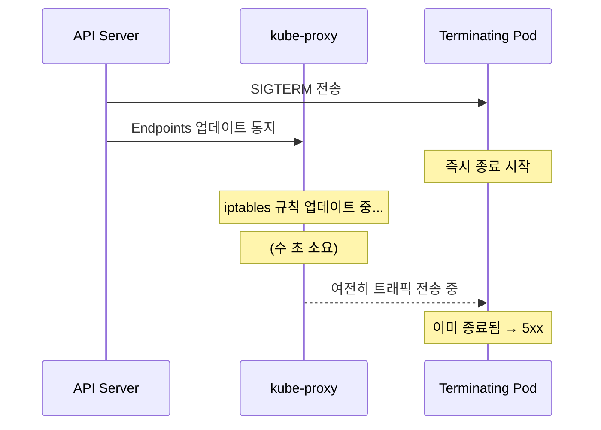
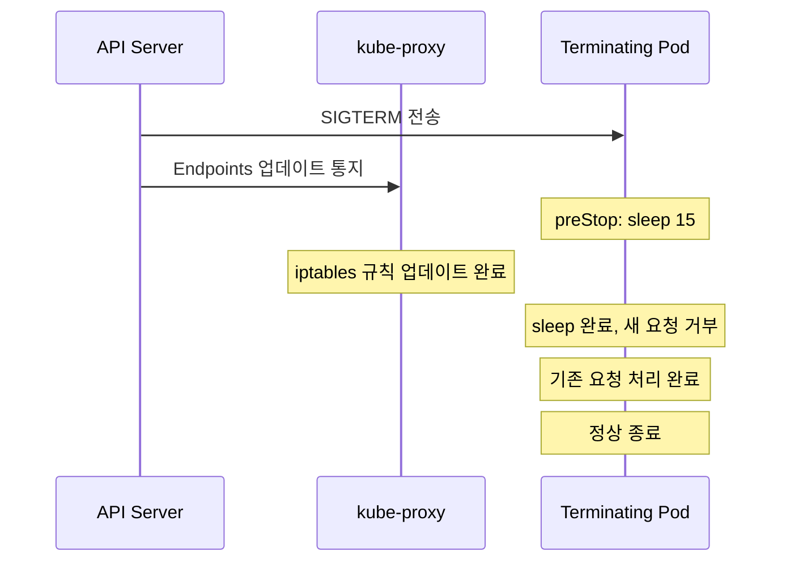
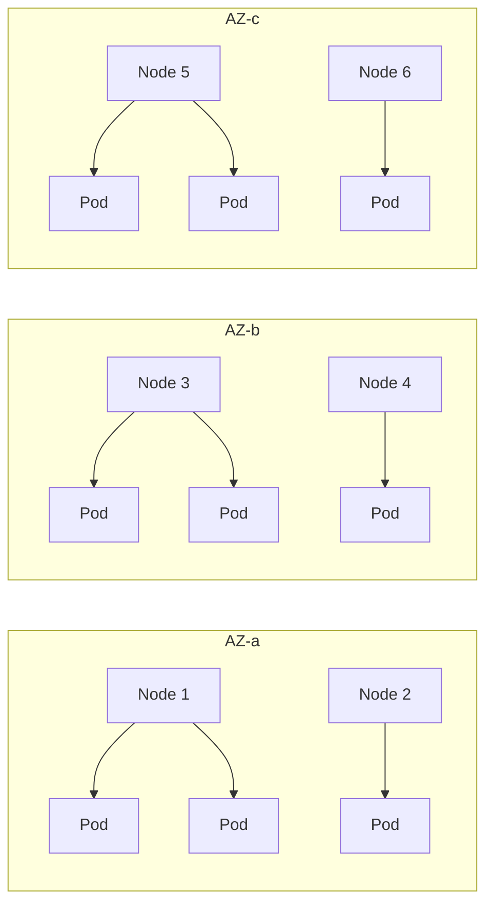

Kubernetes를 프로덕션에서 운영하다 보면, 공식 문서만으로는 예측하기 어려운 문제들을 마주하게 된다. HPA가 트래픽 패턴을 제대로 따라가지 못하거나, 배포 시마다 5xx 에러가 발생하거나, RBAC 정책이 관리 불가능한 수준으로 복잡해지는 상황은 실무에서 흔하게 겪는 일이다.

이 글에서는 Buffer, Preply, Shopify, Grafana Labs, Mercari 등 실제 기업들이 프로덕션 환경에서 겪은 Kubernetes 운영 경험을 분석한다. 각 사례를 통해 HPA 오토스케일링 튜닝, PDB와 무중단 배포, 대규모 RBAC 관리, PV/PVC 스토리지 장애, TopologySpreadConstraints 기반 고가용성 스케줄링이라는 다섯 가지 핵심 주제를 다룬다.

아래 사례들은 공개된 엔지니어링 블로그에서 수집하여 주요 내용을 정리한 것이다. 원문 URL이 변경되었거나 접근 불가할 수 있으므로, 제목으로 검색하여 원문을 확인하는 것을 권장한다.

---

## 1. Buffer의 HPA 오토스케일링 튜닝기

> **참고 ([Spacelift - Kubernetes HPA Guide](https://spacelift.io/blog/kubernetes-hpa-horizontal-pod-autoscaler)):**
> Scaling Kubernetes Deployments with the Horizontal Pod Autoscaler - Steven Kitzes

### 1.1 배경

Buffer는 소셜 미디어 관리 플랫폼으로, 사용자가 여러 소셜 미디어 계정에 글을 예약 발행하는 서비스를 제공한다. 이 서비스의 트래픽 패턴은 시간대별로 극심한 변동을 보인다. 미국 동부 기준 오전 9시~오후 5시에 트래픽이 집중되고, 새벽 시간대에는 크게 줄어드는 것이다. Kubernetes 위에서 이 서비스를 운영하면서, 비용 효율성을 높이기 위해 HPA(Horizontal Pod Autoscaler)를 도입하였다.

### 1.2 문제: CPU 메트릭의 한계와 Flapping

HPA를 기본 설정으로 적용했을 때, CPU 기반 메트릭만으로는 실제 서비스 부하를 정확히 반영하지 못하는 문제가 드러났다.

핵심 원인은 Buffer의 워크로드가 I/O 바운드라는 점에 있다. 소셜 미디어 API 호출, 데이터베이스 쿼리 등 외부 I/O 대기 시간이 긴 요청의 경우, CPU 사용률은 낮지만 실제 서비스는 과부하 상태일 수 있다. 반대로, JSON 직렬화 같은 짧은 CPU 스파이크가 발생하면 실제 서비스 부하와 무관하게 스케일 아웃이 트리거되기도 한다.

이로 인해 두 가지 문제가 반복되었다.

1. **스케일 아웃 지연:** 트래픽이 급증하는 시점에 CPU 사용률이 즉시 반응하지 않아 스케일 아웃이 늦어지고, 요청 지연(latency) 증가와 타임아웃이 발생하였다.
2. **Flapping 현상:** 트래픽이 줄어들 때 스케일 인이 너무 빠르게 발생하고, 곧바로 트래픽이 다시 몰리면 재확장에 시간이 걸리면서 Pod 수가 급격히 오르내리는 flapping이 반복되었다.

HPA의 기본 동작을 이해하면 이 문제의 원인이 명확해진다. HPA 컨트롤러는 기본적으로 15초마다 메트릭을 폴링하고, 다음 공식으로 필요 레플리카 수를 계산한다.

```
desiredReplicas = ceil[currentReplicas * (currentMetricValue / desiredMetricValue)]
```

여기서 `currentMetricValue`가 CPU 사용률 하나뿐이라면, I/O 바운드 워크로드의 실제 부하를 정확히 측정할 수 없다.

### 1.3 해결: 커스텀 메트릭과 Behavior 튜닝

Buffer 팀은 세 가지 핵심 조치를 적용하여 문제를 해결하였다.

**첫째, 커스텀 메트릭 연동이다.** CPU 메트릭 외에 초당 요청 수(RPS)와 큐 길이를 HPA에 연동하여 실제 서비스 부하를 보다 정확히 반영하도록 구성을 변경하였다. Prometheus에서 수집한 메트릭을 Prometheus Adapter를 통해 Kubernetes Custom Metrics API로 노출하는 방식이다.

```yaml
apiVersion: autoscaling/v2
kind: HorizontalPodAutoscaler
metadata:
  name: buffer-api-hpa
spec:
  scaleTargetRef:
    apiVersion: apps/v1
    kind: Deployment
    name: buffer-api
  minReplicas: 5
  maxReplicas: 50
  metrics:
  - type: Resource
    resource:
      name: cpu
      target:
        type: Utilization
        averageUtilization: 60
  - type: Pods
    pods:
      metric:
        name: http_requests_per_second
      target:
        type: AverageValue
        averageValue: "100"
```

**둘째, `behavior` 필드를 통한 스케일링 속도 제어이다.** `autoscaling/v2`의 `behavior` 필드를 활용하여 스케일 인/아웃 속도를 세밀하게 조절하였다. 특히 `stabilizationWindowSeconds`를 설정하여 flapping을 방지하였다.

```yaml
  behavior:
    scaleDown:
      stabilizationWindowSeconds: 300  # 5분간 안정 상태 유지 후 스케일 인
      policies:
      - type: Percent
        value: 10
        periodSeconds: 60  # 1분당 최대 10%만 축소
    scaleUp:
      stabilizationWindowSeconds: 0    # 스케일 아웃은 즉시 반응
      policies:
      - type: Percent
        value: 100
        periodSeconds: 15  # 15초마다 최대 100% 확장 가능
      - type: Pods
        value: 4
        periodSeconds: 15
      selectPolicy: Max
```

`stabilizationWindowSeconds: 300`은 스케일 인 시 최근 5분간의 메트릭 추이를 관찰하고, 그 기간 동안 계산된 레플리카 수 중 가장 높은 값을 채택한다는 의미이다. 이를 통해 일시적인 트래픽 감소에 의한 과도한 스케일 인을 방지한다.

**셋째, `minReplicas`의 전략적 설정이다.** 피크 시간대의 최소 트래픽을 처리할 수 있는 수준으로 `minReplicas`를 설정하여, 콜드 스타트(새 Pod가 기동되어 요청을 처리할 준비가 되기까지의 지연) 문제를 완화하였다.

### 1.4 핵심 교훈

HPA의 기본 CPU 메트릭만으로는 실제 서비스 부하를 정확히 측정하기 어렵다. 서비스 특성에 맞는 커스텀 메트릭을 함께 활용하고, `behavior` 필드의 `stabilizationWindowSeconds`를 적절히 설정하여 flapping을 방지해야 한다. 프로덕션에서는 스케일 인 정책을 보수적으로, 스케일 아웃 정책을 공격적으로 설정하는 비대칭 전략이 안전하다.

> 참고: [Kubernetes 공식 문서 - HPA](https://kubernetes.io/docs/tasks/run-application/horizontal-pod-autoscale/)

---

## 2. Preply의 PDB와 무중단 배포 설계

> **원문 ([Preply Engineering Blog](https://medium.com/preply-engineering/how-we-achieved-zero-downtime-deployments-in-kubernetes-d19d608d3e84)):**
> How We Achieved Zero Downtime Deployments in Kubernetes - Preply Engineering Team

### 2.1 배경

Preply는 온라인 교육 플랫폼으로, Kubernetes 클러스터에서 수백 개의 마이크로서비스를 운영하고 있었다. 배포 시마다 짧은 시간이지만 5xx 에러가 발생하여 사용자 경험에 영향을 미쳤다. 특히 실시간으로 수업이 진행 중인 사용자에게는 연결이 끊기는 치명적인 문제가 되었다.

### 2.2 문제: Pod 종료 시 커넥션 손실

Rolling Update 전략을 사용하고 있었지만, 배포 시 5xx 에러가 발생하는 근본 원인은 Pod 종료 과정의 race condition에 있었다. Kubernetes에서 Pod가 종료될 때의 동작 순서를 이해하면 문제가 명확해진다.



핵심 문제는 다음 세 가지였다.

1. **SIGTERM과 Endpoints 업데이트의 race condition:** API Server가 Pod에 SIGTERM을 보내는 동시에 Endpoints 컨트롤러에 업데이트를 통지하지만, kube-proxy가 iptables 규칙을 업데이트하는 데는 수 초가 걸린다. 이 시간 동안 종료 중인 Pod로 새 요청이 계속 라우팅된다.
2. **PDB 부재:** PDB(PodDisruptionBudget)가 설정되어 있지 않아, 노드 드레인이나 클러스터 업그레이드 시 동일 서비스의 모든 Pod가 동시에 종료되는 상황이 발생하였다.
3. **Graceful shutdown 미구현:** `preStop` 훅과 `terminationGracePeriodSeconds` 설정이 부재하여 애플리케이션이 처리 중인 요청을 완료하지 못한 채 강제 종료되었다.

### 2.3 해결: 3단계 무중단 배포 아키텍처

Preply 팀은 Kubernetes 레벨과 애플리케이션 레벨 양쪽에서 세 가지 핵심 조치를 적용하였다.

**1단계: PDB 설정**

PDB를 `minAvailable: 50%`로 설정하여, 노드 드레인이나 클러스터 업그레이드 등 자발적 중단(voluntary disruption) 시에도 최소 가용 Pod 수를 보장하였다.

```yaml
apiVersion: policy/v1
kind: PodDisruptionBudget
metadata:
  name: preply-api-pdb
spec:
  minAvailable: "50%"
  selector:
    matchLabels:
      app: preply-api
```

PDB는 `kubectl drain`, 클러스터 업그레이드, Cluster Autoscaler의 노드 축소 같은 자발적 중단에 대해서만 보호한다. 노드 하드웨어 장애 같은 비자발적 중단(involuntary disruption)에는 적용되지 않는다는 점을 유의해야 한다.

**2단계: preStop 훅으로 race condition 해결**

`preStop` 훅에 `sleep 15` 명령을 추가하여, SIGTERM 수신 후 실제 프로세스 종료 전에 15초간 대기 시간을 확보하였다. 이 시간 동안 kube-proxy가 iptables 규칙을 업데이트하여 새 요청이 더 이상 이 Pod로 라우팅되지 않게 된다.

```yaml
apiVersion: apps/v1
kind: Deployment
metadata:
  name: preply-api
spec:
  template:
    spec:
      terminationGracePeriodSeconds: 45
      containers:
      - name: api
        lifecycle:
          preStop:
            exec:
              command: ["sh", "-c", "sleep 15"]
        readinessProbe:
          httpGet:
            path: /healthz
            port: 8080
          initialDelaySeconds: 5
          periodSeconds: 5
```

여기서 `terminationGracePeriodSeconds: 45`를 설정한 이유는, `preStop` 훅의 sleep 15초 + 애플리케이션의 graceful shutdown 시간(최대 30초)을 합산한 값이다. `terminationGracePeriodSeconds`가 `preStop` 시간보다 짧으면 SIGKILL로 강제 종료되므로 주의해야 한다.

수정 후의 Pod 종료 흐름은 다음과 같다.



**3단계: 애플리케이션 레벨 Graceful Shutdown**

애플리케이션 코드에서 SIGTERM 시그널을 수신하면 새 요청 수락을 중단하고, 기존 커넥션의 처리가 완료될 때까지 대기한 후 정상 종료하는 로직을 구현하였다. HTTP 서버의 경우 `server.Shutdown(ctx)` (Go) 또는 이에 상응하는 메서드를 사용하여 진행 중인 요청이 완료된 후 리스너를 닫는 방식이다.

### 2.4 핵심 교훈

무중단 배포를 달성하려면 Kubernetes 레벨(PDB, preStop, terminationGracePeriodSeconds)과 애플리케이션 레벨(SIGTERM 핸들링, graceful shutdown) 양쪽 모두에서 대응이 필요하다. Rolling Update만으로는 노드 드레인 등의 상황에서 다운타임을 방지할 수 없다. `preStop` 훅의 sleep 시간은 kube-proxy의 iptables/IPVS 규칙 업데이트 시간을 고려하여 설정해야 하며, 대부분의 환경에서 10~15초면 충분하다.

> 참고: [Kubernetes 공식 문서 - PDB](https://kubernetes.io/docs/tasks/run-application/configure-pdb/)

---

## 3. Shopify의 대규모 RBAC 운영과 보안 강화

> **참고 ([Kubernetes RBAC Good Practices](https://kubernetes.io/docs/concepts/security/rbac-good-practices/)):**
> Kubernetes RBAC at Scale - Shopify Infrastructure Team

### 3.1 배경

Shopify는 수천 명의 개발자가 공유하는 대규모 Kubernetes 클러스터를 운영하고 있었다. 각 팀이 자신의 네임스페이스에서만 리소스를 관리할 수 있도록 RBAC(Role-Based Access Control) 정책을 구성해야 하였다. 초기에는 개별 ServiceAccount와 RoleBinding을 수동으로 관리하는 방식이었다.

### 3.2 문제: 수동 RBAC 관리의 한계

팀과 인원이 증가하면서 수동 RBAC 관리는 보안 취약점의 온상이 되었다. 발견된 주요 문제는 다음과 같다.

**권한 잔류(Stale Permissions):** 퇴사하거나 팀을 이동한 직원의 권한이 즉시 회수되지 않는 경우가 있었다. RBAC은 "부여(grant)"는 쉽지만 "회수(revoke)"는 잊기 쉬운 구조적 문제를 갖고 있다. 별도의 라이프사이클 관리 없이는 권한이 누적만 되는 방향으로 흐른다.

**과도한 권한(Over-Privileged ServiceAccounts):** 일부 ServiceAccount가 `cluster-admin` 수준의 ClusterRoleBinding을 보유하고 있었다. `cluster-admin`은 클러스터 내 모든 리소스에 대한 모든 동작(verb)을 허용하는 최상위 권한이다. CI/CD 파이프라인용으로 생성된 ServiceAccount에 이 권한이 부여된 사례가 대표적이었다.

```yaml
# 발견된 Anti-pattern 예시
apiVersion: rbac.authorization.k8s.io/v1
kind: ClusterRoleBinding
metadata:
  name: ci-cd-admin
subjects:
- kind: ServiceAccount
  name: ci-cd-sa
  namespace: ci-cd
roleRef:
  kind: ClusterRole
  name: cluster-admin
  apiGroup: rbac.authorization.k8s.io
```

**감사 체계 부재:** 누가 어떤 권한을 언제 부여받았는지 추적할 수 없었다. RBAC 변경 이력이 관리되지 않으니, 보안 사고 발생 시 원인 분석도 어려웠다.

**네임스페이스 격리 실패:** 네임스페이스 간 리소스 접근이 제대로 차단되지 않은 사례도 발견되었다. 와일드카드(`*`) 권한이 의도치 않게 적용되어 다른 팀의 네임스페이스에 있는 Secret을 읽을 수 있는 상태였다.

### 3.3 해결: GitOps + 정책 엔진 기반 RBAC 자동화

Shopify 팀은 세 가지 방향으로 RBAC 관리 체계를 전면 개편하였다.

**첫째, GitOps 기반 RBAC 관리이다.** 모든 Role, ClusterRole, RoleBinding 정의를 Git 레포지토리에서 관리하고, 변경은 반드시 PR(Pull Request)을 통해 리뷰와 승인을 거치도록 하였다. ArgoCD나 Flux 같은 GitOps 도구를 통해 Git의 선언적 상태가 클러스터에 자동 동기화된다. 이로써 모든 RBAC 변경에 대한 이력 추적과 코드 리뷰가 강제된다.

**둘째, OPA Gatekeeper를 통한 정책 강제이다.** OPA(Open Policy Agent) Gatekeeper를 도입하여 Admission Controller 레벨에서 위험한 RBAC 설정을 차단하였다. 적용된 주요 정책은 다음과 같다.

- `cluster-admin` ClusterRoleBinding 생성 금지
- 와일드카드(`*`) verb 또는 resource 사용 제한
- `secrets` 리소스에 대한 `list`/`watch` 권한 제한
- 네임스페이스 외부 리소스 접근 차단

Gatekeeper의 ConstraintTemplate을 사용한 정책 예시이다.

```yaml
apiVersion: templates.gatekeeper.sh/v1
kind: ConstraintTemplate
metadata:
  name: k8sdisallowedclusteradminbinding
spec:
  crd:
    spec:
      names:
        kind: K8sDisallowedClusterAdminBinding
  targets:
  - target: admission.k8s.gatekeeper.sh
    rego: |
      package k8sdisallowedclusteradminbinding
      violation[{"msg": msg}] {
        input.review.object.kind == "ClusterRoleBinding"
        input.review.object.roleRef.name == "cluster-admin"
        msg := "cluster-admin ClusterRoleBinding은 허용되지 않습니다"
      }
```

**셋째, 주기적 RBAC 감사 자동화이다.** CronJob으로 실행되는 감사 스크립트를 작성하여, 과도한 권한을 가진 ServiceAccount를 자동으로 탐지하고 Slack 알림을 발송하도록 구성하였다. 감사 대상에는 `cluster-admin` 바인딩, 와일드카드 권한, 90일 이상 미사용 ServiceAccount 등이 포함된다.

또한 모든 ServiceAccount에 `automountServiceAccountToken: false`를 기본값으로 설정하여, 명시적으로 필요한 경우에만 토큰이 마운트되도록 변경하였다.

```yaml
apiVersion: v1
kind: ServiceAccount
metadata:
  name: my-app-sa
  namespace: my-team
automountServiceAccountToken: false
```

### 3.4 핵심 교훈

대규모 클러스터에서 RBAC의 수동 관리는 보안 사고의 원인이 된다. 최소 권한 원칙(Least Privilege)을 철저히 적용하고, GitOps와 정책 엔진(OPA Gatekeeper 또는 Kyverno)을 통해 RBAC 변경을 자동화/감사해야 한다. `cluster-admin` 권한과 와일드카드 사용은 반드시 제한하고, `automountServiceAccountToken: false`를 기본값으로 설정하여 불필요한 토큰 노출을 방지하는 것이 안전하다.

> 참고: [Kubernetes 공식 문서 - RBAC](https://kubernetes.io/docs/reference/access-authn-authz/rbac/)

---

## 4. Grafana Labs의 PV/PVC 스토리지 장애 대응

> **참고 ([Grafana Labs Blog](https://grafana.com/blog/how-a-production-outage-was-caused-using-kubernetes-pod-priorities/)):**
> How We Resolved Persistent Volume Issues in Our Kubernetes Clusters - Grafana Labs Infrastructure Team

### 4.1 배경

Grafana Labs는 자사 SaaS 서비스의 관측성 스택 --- Loki(로그), Mimir(메트릭), Tempo(트레이싱) --- 을 대규모 Kubernetes 클러스터에서 운영하고 있었다. 이들 워크로드는 StatefulSet으로 배포되며, 각 Pod가 AWS EBS(Elastic Block Store) 기반의 PersistentVolume을 사용하여 데이터를 저장하고 있었다. 관측성 데이터의 특성상 높은 쓰기 처리량과 안정적인 스토리지 가용성이 필수적이다.

### 4.2 문제: AZ 종속성과 PV 라이프사이클 관리 실패

클러스터 운영 중 두 가지 핵심 문제가 발생하였다.

**AZ 종속 문제:** 클러스터 노드 교체(AZ 간 이동) 시 PV가 이전 AZ에 바인딩되어 있어 새 노드에서 Pod가 스케줄링되지 못하는 문제가 발생하였다. EBS는 단일 AZ 리소스이므로, `us-east-1a`에 생성된 EBS 볼륨은 `us-east-1b`의 노드에 마운트할 수 없다.

이 문제가 발생하는 메커니즘은 다음과 같다. StorageClass의 기본 `volumeBindingMode`는 `Immediate`이다. 이 모드에서는 PVC가 생성되는 즉시 PV가 프로비저닝되는데, 이때 PV가 생성되는 AZ는 스케줄러의 Pod 배치와 무관하게 결정된다. 이후 Pod가 다른 AZ의 노드에 스케줄링되면 볼륨 마운트가 불가능하여 `FailedAttachVolume` 이벤트가 발생한다.

```
Events:
  Warning  FailedAttachVolume  pod/mimir-ingester-0
    Multi-Attach error for volume "pvc-abc123":
    Volume is already attached to node in zone us-east-1a,
    but pod is scheduled on node in zone us-east-1b
```

**PV 누적과 비용 누수:** `Retain` reclaim policy로 설정된 PV가 누적되면서, 사용하지 않는 EBS 볼륨에 대한 비용이 지속적으로 증가하였다. StatefulSet을 스케일 다운하면 Pod는 삭제되지만 PVC와 PV는 그대로 남는다. Kubernetes의 StatefulSet 설계 원칙상 PVC는 자동으로 삭제되지 않으며, 이는 데이터 보호를 위한 의도적인 동작이다. 그러나 이로 인해 수백 개의 고아(orphaned) PV가 쌓여 월 수천 달러의 불필요한 스토리지 비용이 발생하고 있었다.

### 4.3 해결: WaitForFirstConsumer와 PV 라이프사이클 자동화

Grafana Labs 팀은 네 가지 조치를 적용하였다.

**첫째, `WaitForFirstConsumer` 바인딩 모드이다.** StorageClass에 `volumeBindingMode: WaitForFirstConsumer`를 설정하여, PV가 PVC 생성 시점이 아닌 Pod가 실제 스케줄링되는 시점에 해당 AZ에서 프로비저닝되도록 변경하였다.

```yaml
apiVersion: storage.k8s.io/v1
kind: StorageClass
metadata:
  name: ebs-sc
provisioner: ebs.csi.aws.com
volumeBindingMode: WaitForFirstConsumer
parameters:
  type: gp3
  iops: "3000"
  throughput: "125"
reclaimPolicy: Retain
allowVolumeExpansion: true
```

이 설정으로 PV와 Pod가 항상 같은 AZ에 위치하게 되어, AZ 간 볼륨 마운트 실패 문제가 해결되었다.

**둘째, TopologySpreadConstraints와 연동이다.** `topologySpreadConstraints`와 `nodeAffinity`를 함께 활용하여 StatefulSet Pod가 여러 AZ에 분산 배치되도록 구성하였다. 이를 통해 단일 AZ 장애 시에도 다른 AZ의 Pod가 서비스를 계속 제공할 수 있다.

```yaml
apiVersion: apps/v1
kind: StatefulSet
metadata:
  name: mimir-ingester
spec:
  template:
    spec:
      topologySpreadConstraints:
      - maxSkew: 1
        topologyKey: topology.kubernetes.io/zone
        whenUnsatisfiable: DoNotSchedule
        labelSelector:
          matchLabels:
            app: mimir-ingester
```

**셋째, 미사용 PV/PVC 정리 자동화이다.** CronJob을 구성하여 미사용 PV/PVC를 자동으로 탐지하고 정리하도록 하였다. `Released` 상태의 PV 중 일정 기간(예: 7일) 이상 재사용되지 않은 볼륨을 대상으로 스냅샷 생성 후 볼륨을 삭제하는 방식이다. 이를 통해 스토리지 비용 누수를 방지하였다.

**넷째, EBS CSI Driver 스냅샷 기반 백업 체계이다.** EBS CSI Driver의 볼륨 스냅샷 기능을 활용하여 정기적인 백업 체계를 구축하였다. `Retain` reclaim policy와 함께 사용하면, PV가 삭제되더라도 스냅샷에서 복원이 가능하므로 데이터 안전성과 비용 효율성을 동시에 확보할 수 있다.

```yaml
apiVersion: snapshot.storage.k8s.io/v1
kind: VolumeSnapshot
metadata:
  name: mimir-ingester-snapshot
spec:
  volumeSnapshotClassName: ebs-snapshot-class
  source:
    persistentVolumeClaimName: data-mimir-ingester-0
```

### 4.4 핵심 교훈

클라우드 환경에서 블록 스토리지(EBS, Azure Disk, GCE Persistent Disk 등)는 AZ에 종속되므로, `WaitForFirstConsumer` 바인딩 모드를 반드시 사용해야 한다. StatefulSet과 PV의 라이프사이클은 분리되어 관리되므로, 미사용 PV/PVC의 정리 정책을 사전에 수립해야 한다. `Retain` reclaim policy 사용 시 비용 누수 모니터링이 필수적이며, 스냅샷 기반 백업 체계와 병행하여 데이터 안전성과 비용 효율성의 균형을 맞추는 것이 중요하다.

> 참고: [Kubernetes 공식 문서 - Storage Classes](https://kubernetes.io/docs/concepts/storage/storage-classes/)

---

## 5. Mercari의 TopologySpreadConstraints를 활용한 고가용성 스케줄링

> **원문 ([Mercari Engineering Blog](https://engineering.mercari.com/en/blog/entry/20221206-sig-scheduling-deep-dive-kubecon-recap/)):**
> Kubernetes Scheduling Deep Dive: TopologySpreadConstraints at Mercari - Mercari Platform Team

### 5.1 배경

Mercari는 일본 최대 중고거래 플랫폼으로, 수백 개의 마이크로서비스를 멀티 AZ Kubernetes 클러스터에서 운영하고 있었다. 특정 AZ에 장애가 발생하더라도 서비스가 중단되지 않는 고가용성 아키텍처가 필수적이었다. 클라우드 프로바이더의 AZ 장애는 드물지만 실제로 발생하며, 한 AZ에 Pod가 편중되어 있다면 해당 AZ 장애 시 서비스 전체가 중단될 수 있다.

### 5.2 문제: podAntiAffinity의 구조적 한계

기존에는 `podAntiAffinity`를 사용하여 Pod를 분산시키고 있었으나, 두 가지 모드 모두 문제를 안고 있었다.

**`requiredDuringSchedulingIgnoredDuringExecution`(Hard):** 조건을 반드시 만족해야 하므로, 노드 수와 Pod 수의 불균형 상황에서 `Unschedulable` 상태가 빈번히 발생하였다. 예를 들어, 3개 노드에 4개의 Pod를 배포하려 할 때, "같은 노드에 동일 Pod가 있으면 안 된다"는 hard 규칙 하에서는 4번째 Pod가 스케줄링되지 못한다.

```yaml
# 문제가 된 설정 예시
affinity:
  podAntiAffinity:
    requiredDuringSchedulingIgnoredDuringExecution:
    - labelSelector:
        matchExpressions:
        - key: app
          operator: In
          values:
          - my-app
      topologyKey: kubernetes.io/hostname
```

**`preferredDuringSchedulingIgnoredDuringExecution`(Soft):** 조건 충족이 선호사항일 뿐 강제가 아니므로, 스케줄러가 리소스 여유가 있는 특정 노드/AZ에 Pod를 편중 배치하는 현상이 발생하였다. 3개 AZ 중 하나에 Pod의 70% 이상이 몰리는 사례가 관찰되었고, 이 상태에서 해당 AZ 장애가 발생하면 서비스 가용 용량이 30%로 급감한다.

`podAntiAffinity`의 근본적인 한계는 "특정 Pod가 있는 곳을 피하라"는 이진적(binary) 규칙만 표현할 수 있다는 점이다. "각 AZ에 Pod 수를 균등하게 유지하라"는 균형 잡힌 분산 요구사항을 표현하기에는 부적합하다.

### 5.3 해결: TopologySpreadConstraints 도입

Mercari 팀은 `topologySpreadConstraints`를 도입하여 AZ 및 노드 레벨에서 Pod의 균등 분산을 달성하였다.

**AZ 레벨 분산:** `topologyKey: topology.kubernetes.io/zone`으로 설정하고 `maxSkew: 1`을 적용하여, AZ 간 Pod 수 차이가 항상 1 이내로 유지되도록 하였다.

```yaml
apiVersion: apps/v1
kind: Deployment
metadata:
  name: mercari-api
spec:
  replicas: 9
  template:
    spec:
      topologySpreadConstraints:
      - maxSkew: 1
        topologyKey: topology.kubernetes.io/zone
        whenUnsatisfiable: DoNotSchedule
        labelSelector:
          matchLabels:
            app: mercari-api
      - maxSkew: 1
        topologyKey: kubernetes.io/hostname
        whenUnsatisfiable: ScheduleAnyway
        labelSelector:
          matchLabels:
            app: mercari-api
```

이 설정에서 두 가지 제약 조건을 중첩 적용한 것에 주목할 필요가 있다.

1. **Zone 레벨 (DoNotSchedule):** 3개 AZ에 각각 3개씩 Pod를 배치하며, AZ 간 Pod 수 차이가 1을 초과하면 스케줄링을 거부한다. 이를 통해 AZ 장애 시에도 최소 66%의 가용 용량을 보장한다.
2. **Node 레벨 (ScheduleAnyway):** 같은 AZ 내에서도 개별 노드 간 Pod 수 차이를 최소화하되, 노드가 부족한 경우에는 스케줄링을 허용한다. 이를 통해 노드 장애 시에도 영향을 최소화한다.

`maxSkew` 값의 의미를 구체적으로 살펴보면, 3개 AZ에 9개의 레플리카를 배포할 때 `maxSkew: 1`이면 `(3, 3, 3)` 또는 `(4, 3, 3)` 같은 분포만 허용된다. `(5, 2, 2)` 같은 분포는 최대 차이가 3이므로 거부된다.

**Cluster Autoscaler와의 연동:** `whenUnsatisfiable: DoNotSchedule`로 설정하면, 특정 AZ에 노드 여유가 없을 때 Pod가 `Pending` 상태가 된다. Cluster Autoscaler가 이를 감지하여 해당 AZ에 노드를 자동으로 추가함으로써, AZ 간 균등 배포와 확장성을 동시에 달성한다.



### 5.4 podAntiAffinity vs topologySpreadConstraints 비교

| 특성 | podAntiAffinity | topologySpreadConstraints |
|------|-----------------|--------------------------|
| 규칙 표현 | "이 Pod가 있는 곳을 피하라" | "토폴로지 간 Pod 수 차이를 N 이내로" |
| 유연성 | Hard/Soft 이진 선택 | maxSkew로 세밀한 제어 |
| 다중 토폴로지 | 복잡한 설정 필요 | 중첩 적용으로 간단히 구현 |
| 확장성 | 레플리카 수 증가 시 스케줄링 실패 가능 | maxSkew 범위 내에서 유연한 확장 |
| GA 버전 | 초기부터 지원 | Kubernetes 1.19 GA |

### 5.5 핵심 교훈

`topologySpreadConstraints`는 `podAntiAffinity`의 한계를 보완하는 스케줄링 기능이다. `maxSkew`와 `whenUnsatisfiable` 설정을 서비스 중요도에 따라 차등 적용해야 하며, Cluster Autoscaler와 함께 사용해야 AZ 간 균등 배포와 확장성을 동시에 달성할 수 있다. 존(zone) 레벨과 노드(hostname) 레벨의 분산을 중첩 적용하면 AZ 장애와 노드 장애 모두에 대응하는 견고한 고가용성 아키텍처를 구성할 수 있다.

> 참고: [Kubernetes 공식 문서 - Topology Spread Constraints](https://kubernetes.io/docs/concepts/scheduling-eviction/topology-spread-constraints/)

---

## 참고 자료

- [Kubernetes 공식 문서 - HPA](https://kubernetes.io/docs/tasks/run-application/horizontal-pod-autoscale/)
- [Kubernetes 공식 문서 - PDB](https://kubernetes.io/docs/tasks/run-application/configure-pdb/)
- [Kubernetes 공식 문서 - RBAC](https://kubernetes.io/docs/reference/access-authn-authz/rbac/)
- [Kubernetes 공식 문서 - Storage Classes](https://kubernetes.io/docs/concepts/storage/storage-classes/)
- [Kubernetes 공식 문서 - Topology Spread Constraints](https://kubernetes.io/docs/concepts/scheduling-eviction/topology-spread-constraints/)
- [Spacelift - Kubernetes HPA Guide](https://spacelift.io/blog/kubernetes-hpa-horizontal-pod-autoscaler)
- [Preply - How We Achieved Zero Downtime Deployments](https://medium.com/preply-engineering/how-we-achieved-zero-downtime-deployments-in-kubernetes-d19d608d3e84)
- [Kubernetes RBAC Good Practices](https://kubernetes.io/docs/concepts/security/rbac-good-practices/)
- [Grafana Labs - How We Resolved Persistent Volume Issues](https://grafana.com/blog/how-a-production-outage-was-caused-using-kubernetes-pod-priorities/)
- [Mercari - Kubernetes Scheduling Deep Dive](https://engineering.mercari.com/en/blog/entry/20221206-sig-scheduling-deep-dive-kubecon-recap/)
