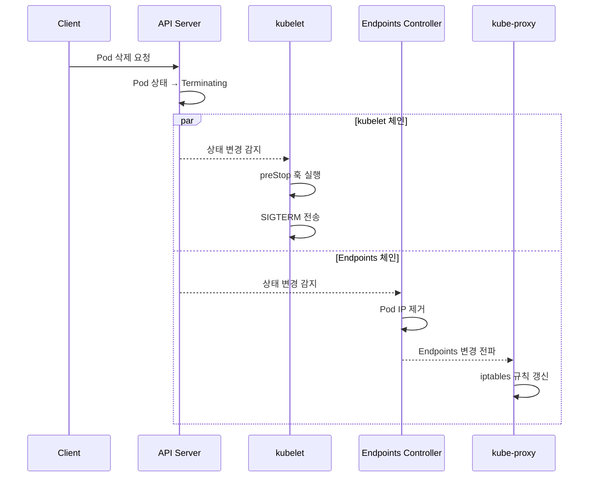
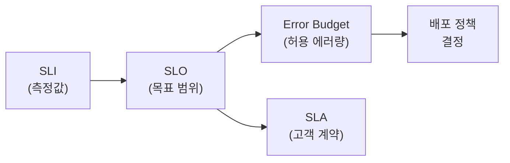
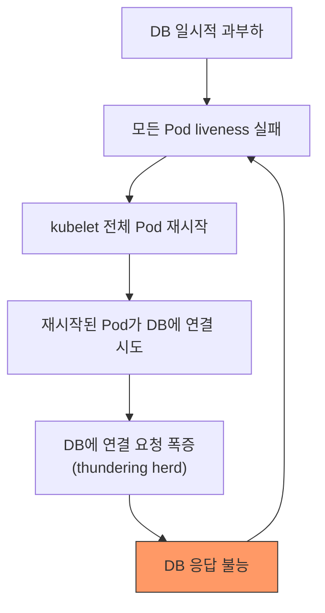

Kubernetes를 프로덕션에 도입하면 개발 환경에서는 마주치지 못했던 다양한 운영 이슈가 발생한다. Graceful Shutdown 미설정으로 배포 시마다 5xx 에러가 터지거나, PDB 없이 노드 업그레이드를 진행했다가 서비스가 통째로 내려가는 일은 실제 현장에서 반복적으로 보고되는 사례다. 이 글에서는 공개된 엔지니어링 블로그에서 수집한 프로덕션 운영 사례 5건을 정리한다. 각 사례는 상황, 문제의 근본 원인, 해결 방법, 그리고 교훈 순으로 구성하였다. 원문 URL이 변경되었거나 접근이 불가할 수 있으므로, 제목으로 검색하여 원문을 확인하는 것을 권장한다.

---

## 1. Graceful Shutdown 미설정으로 인한 배포 시 5xx 에러 발생

- **출처:** [Graceful shutdown in Kubernetes is more complex than you might think](https://learnk8s.io/graceful-shutdown)
- **저자/출처:** Daniele Polencic (learnk8s)

### 1.1 상황

learnk8s의 Daniele Polencic는 Kubernetes에서 Pod가 종료되는 과정에서 발생하는 트래픽 유실 문제를 심층 분석하였다. 다수의 팀이 Rolling Update를 적용했음에도 배포 시 간헐적으로 5xx 에러가 발생하는 원인을 파악하기 위해 Pod 종료 라이프사이클을 상세히 추적하였다. 이 글은 Kubernetes의 Pod 종료 과정이 단순히 SIGTERM을 보내는 것이 아니라, 여러 컴포넌트가 독립적으로 동작하면서 발생하는 분산 시스템 문제라는 점을 드러낸다.

### 1.2 문제

#### Pod 종료 라이프사이클의 병렬 처리 구조

Pod 삭제 요청이 API 서버에 도달하면, 두 가지 독립적인 이벤트 체인이 **동시에** 시작된다. 이 병렬 처리 구조가 문제의 근본 원인이다.

**첫 번째 체인 (kubelet 측):**

1. API 서버가 Pod의 상태를 `Terminating`으로 변경한다.
2. kubelet이 이 상태 변경을 감지한다.
3. kubelet이 `preStop` 훅을 실행한다 (정의되어 있는 경우).
4. `preStop` 훅 완료 후 kubelet이 컨테이너 프로세스에 SIGTERM 신호를 전송한다.
5. `terminationGracePeriodSeconds` 시간이 경과하면 SIGKILL을 전송하여 강제 종료한다.

**두 번째 체인 (Endpoints 컨트롤러 + kube-proxy 측):**

1. API 서버가 Pod의 상태를 `Terminating`으로 변경한다.
2. Endpoints 컨트롤러가 이 변경을 watch하고 있다가 감지한다.
3. Endpoints 컨트롤러가 해당 Pod IP를 Endpoints 목록에서 제거한다.
4. kube-proxy가 Endpoints 변경을 감지한다.
5. kube-proxy가 각 노드의 iptables/ipvs 규칙을 업데이트하여 해당 Pod로의 라우팅을 중단한다.



#### Race Condition의 발생 메커니즘

이 두 체인은 서로를 기다리지 않는다. kubelet이 SIGTERM을 보내 애플리케이션이 즉시 종료를 시작하면, kube-proxy가 아직 iptables 규칙을 갱신하지 못한 상태에서도 트래픽이 이미 종료 중인(또는 종료된) Pod로 계속 라우팅된다. 이 시간차(race condition) 동안 들어온 요청은 커넥션 거부(connection refused) 또는 5xx 에러로 이어진다.

특히 대규모 클러스터에서는 Endpoints 컨트롤러의 변경 전파, kube-proxy의 iptables 규칙 업데이트, Ingress Controller의 upstream 목록 갱신 등이 모두 완료되기까지 수 초에서 수십 초가 소요될 수 있어 문제가 더욱 심각해진다. 클러스터 규모가 클수록, 노드가 많을수록 전파 지연이 길어지는 경향이 있다.

#### Ingress Controller와의 상호작용

kube-proxy 외에 Ingress Controller(NGINX, Traefik 등)도 Endpoints 변경을 독립적으로 감지하고 자체 설정을 업데이트한다. 따라서 iptables 규칙이 업데이트되더라도 Ingress Controller가 아직 반영하지 못한 경우에도 동일한 문제가 발생할 수 있다. 트래픽 경로에 관여하는 모든 컴포넌트의 갱신이 완료될 때까지 Pod는 요청을 수신할 준비가 되어 있어야 한다.

### 1.3 해결

#### preStop 훅을 활용한 종료 지연

`preStop` 훅에 `sleep` 명령을 추가하여 SIGTERM 전송을 지연시킨다. 이 대기 시간 동안 Endpoints 컨트롤러와 kube-proxy가 라우팅 규칙을 갱신하여 해당 Pod로의 새 트래픽 라우팅을 중단하게 된다.

```yaml
apiVersion: apps/v1
kind: Deployment
spec:
  template:
    spec:
      terminationGracePeriodSeconds: 60
      containers:
      - name: app
        lifecycle:
          preStop:
            exec:
              command: ["sh", "-c", "sleep 15"]
```

#### 적정 sleep 시간 산정

sleep 시간은 Endpoints 전파 지연 시간을 고려하여 결정해야 한다. 일반적인 권장값은 다음과 같다.

- **소규모 클러스터 (노드 10개 이하):** 5~10초
- **중규모 클러스터 (노드 10~50개):** 10~15초
- **대규모 클러스터 (노드 50개 이상):** 15~20초 이상

이 값은 클러스터의 네트워크 상태, kube-proxy 모드(iptables vs ipvs), Ingress Controller 종류에 따라 조정이 필요하다.

#### 애플리케이션 레벨 Graceful Shutdown

preStop 훅의 sleep이 끝나고 SIGTERM이 전달된 후, 애플리케이션은 다음을 수행해야 한다.

1. **새 요청 수신 중단:** 리스닝 소켓을 닫거나, health check에서 실패를 반환한다.
2. **기존 요청 처리 완료:** 현재 처리 중인 모든 HTTP 요청, 데이터베이스 트랜잭션 등을 마무리한다.
3. **연결 정리:** 데이터베이스 커넥션 풀, 메시지 큐 연결 등을 정상적으로 종료한다.
4. **프로세스 종료:** 모든 정리 작업이 완료되면 프로세스를 종료한다.

#### terminationGracePeriodSeconds 설정

`terminationGracePeriodSeconds`는 전체 종료 과정(preStop 실행 + SIGTERM 처리)에 허용되는 최대 시간이다. 이 값은 반드시 다음을 충족해야 한다.

```
terminationGracePeriodSeconds > preStop sleep 시간 + 애플리케이션 graceful shutdown 소요 시간
```

예를 들어 preStop sleep이 15초이고 애플리케이션의 graceful shutdown에 최대 30초가 소요된다면, `terminationGracePeriodSeconds`는 최소 50초 이상으로 설정해야 한다. 이 값이 부족하면 kubelet이 SIGKILL을 전송하여 처리 중인 요청이 강제 종료된다.

### 1.4 주요 교훈

Kubernetes의 Pod 종료 과정에서 kubelet과 Endpoints 컨트롤러/kube-proxy의 동작이 비동기적으로 수행된다는 점을 반드시 이해해야 한다. `preStop` 훅 없이 애플리케이션 레벨의 SIGTERM 핸들링만으로는 이 race condition을 해결할 수 없다. 프로덕션에서는 `preStop` sleep + `terminationGracePeriodSeconds` + 애플리케이션 graceful shutdown을 세 가지 모두 조합하여 무중단 배포를 구현해야 한다. 특히 대규모 클러스터나 트래픽이 많은 서비스일수록 이 설정의 중요성이 커진다. Rolling Update의 `maxSurge`와 `maxUnavailable` 설정도 함께 검토하여 배포 중 충분한 수의 Pod가 트래픽을 처리할 수 있도록 보장해야 한다.

---

## 2. PDB 미설정으로 인한 클러스터 업그레이드 중 서비스 장애

- **출처:** [Avoiding Outages in Kubernetes: PodDisruptionBudget Best Practices](https://medium.com/platformer-blog/avoiding-outages-in-kubernetes-poddisruptionbudget-best-practices-8a4c783eef58)
- **저자/출처:** Platformer Engineering Team

### 2.1 상황

Platformer 팀은 관리형 Kubernetes 클러스터(EKS/GKE)를 운영하면서 정기적인 노드 업그레이드를 수행하였다. 클러스터에는 수십 개의 마이크로서비스가 배포되어 있었으며, 대부분의 서비스에 PodDisruptionBudget이 설정되어 있지 않았다. 클라우드 프로바이더의 관리형 Kubernetes 서비스는 보안 패치, 마이너 버전 업그레이드, 노드 OS 업데이트 등을 위해 주기적으로 노드를 교체(drain & replace)해야 하는데, 이 과정에서 PDB가 없으면 서비스 가용성을 보장할 수 없다.

### 2.2 문제

#### Voluntary Disruption과 Involuntary Disruption의 구분

Kubernetes에서 Pod 중단은 두 가지로 구분된다.

- **Voluntary Disruption (자발적 중단):** 관리자가 의도적으로 수행하는 중단으로, `kubectl drain`, Cluster Autoscaler의 scale-down, 관리형 클러스터의 노드 업그레이드 등이 해당한다. PDB는 이 유형의 중단에만 적용된다.
- **Involuntary Disruption (비자발적 중단):** 하드웨어 장애, 커널 패닉, VM 삭제, OOM Kill 등 예기치 않은 중단이다. PDB는 이 유형에는 적용되지 않는다.

#### PDB 부재로 인한 구체적 장애 시나리오

노드 업그레이드 과정에서 `kubectl drain`이 실행되면 해당 노드의 모든 Pod가 동시에 축출(eviction)되었다. 다음과 같은 시나리오에서 서비스 장애가 발생하였다.

1. **동일 노드 집중 배치:** Deployment의 replicas가 3개인 서비스에서, 스케줄러가 2개의 Pod를 동일 노드에 배치하였다. 해당 노드가 drain되면 2개의 Pod가 동시에 축출되어, 순간적으로 가용 Pod가 1개로 감소하였다. 새 Pod가 다른 노드에서 시작되기까지의 지연 시간 동안 나머지 1개의 Pod에 트래픽이 집중되어 과부하가 발생하였다.

2. **소수 replica 서비스의 완전 중단:** Replicas가 2개뿐인 서비스에서 두 Pod가 모두 동일 노드에 있으면, drain 시 가용 Pod가 0개가 되어 완전한 서비스 중단이 발생하였다.

3. **Cluster Autoscaler의 예기치 않은 scale-down:** 트래픽이 감소하여 Cluster Autoscaler가 노드를 축소할 때에도 PDB가 없으면 동일한 문제가 발생하였다. Autoscaler는 PDB를 존중하지만, PDB가 정의되어 있지 않으면 해당 노드의 모든 Pod를 자유롭게 축출할 수 있다.

4. **Spot/Preemptible Instance 회수:** 클라우드 프로바이더가 Spot Instance를 회수할 때에도 (일부 프로바이더에서) drain과 유사한 프로세스가 진행되며, PDB 부재 시 서비스 영향이 발생할 수 있다.

#### PDB 설정 시 흔한 실수

- `minAvailable`을 replicas 수와 동일하게 설정하면 drain이 영구적으로 블로킹되어 노드 업그레이드가 불가능해진다.
- PDB의 label selector가 Deployment의 Pod selector와 불일치하면 PDB가 아무런 보호를 제공하지 않는다.
- 단일 replica 서비스에 `maxUnavailable: 0`을 설정하면 drain이 불가능해진다.

### 2.3 해결

#### 서비스 특성별 PDB 전략

모든 프로덕션 서비스에 PDB를 적용하되, 서비스 특성에 따라 전략을 차별화하였다.

**Stateless 서비스 (일반 API 서버, 웹 서버):**

```yaml
apiVersion: policy/v1
kind: PodDisruptionBudget
metadata:
  name: api-server-pdb
spec:
  maxUnavailable: 1
  selector:
    matchLabels:
      app: api-server
```

한 번에 하나의 Pod만 축출되도록 하여 나머지 Pod가 트래픽을 처리할 수 있도록 보장한다.

**중요 서비스 (결제, 인증 등 SLA가 엄격한 서비스):**

```yaml
apiVersion: policy/v1
kind: PodDisruptionBudget
metadata:
  name: payment-pdb
spec:
  minAvailable: 2
  selector:
    matchLabels:
      app: payment-service
```

항상 최소 2개의 Pod가 가용하도록 보장하여 단일 장애점을 제거한다.

**비율 기반 설정 (replicas 수가 유동적인 서비스):**

```yaml
apiVersion: policy/v1
kind: PodDisruptionBudget
metadata:
  name: worker-pdb
spec:
  maxUnavailable: 25%
  selector:
    matchLabels:
      app: worker
```

HPA로 replicas 수가 변동되는 경우, 비율 기반으로 설정하면 replicas 수에 관계없이 일관된 가용성을 유지할 수 있다.

#### Pod Anti-Affinity와의 조합

PDB만으로는 모든 Pod가 동일 노드에 배치되는 것을 방지할 수 없다. Pod Anti-Affinity 규칙을 함께 적용하여 동일 서비스의 Pod가 서로 다른 노드(또는 가용 영역)에 분산 배치되도록 구성해야 한다.

```yaml
spec:
  template:
    spec:
      affinity:
        podAntiAffinity:
          preferredDuringSchedulingIgnoredDuringExecution:
          - weight: 100
            podAffinityTerm:
              labelSelector:
                matchExpressions:
                - key: app
                  operator: In
                  values:
                  - api-server
              topologyKey: kubernetes.io/hostname
```

`requiredDuringSchedulingIgnoredDuringExecution`을 사용하면 더 강한 보장을 제공하지만, 노드 수가 부족한 경우 스케줄링 자체가 실패할 수 있으므로 `preferred`를 사용하는 것이 일반적으로 안전하다.

#### Topology Spread Constraints 활용

Kubernetes 1.19 이상에서는 `topologySpreadConstraints`를 사용하여 Pod를 특정 토폴로지(노드, 가용 영역, 리전) 기준으로 균등하게 분산시킬 수 있다. Pod Anti-Affinity보다 세밀한 분산 제어가 가능하다.

```yaml
spec:
  template:
    spec:
      topologySpreadConstraints:
      - maxSkew: 1
        topologyKey: topology.kubernetes.io/zone
        whenUnsatisfiable: DoNotSchedule
        labelSelector:
          matchLabels:
            app: api-server
```

### 2.4 주요 교훈

PDB는 프로덕션 워크로드에서 선택이 아닌 필수 설정이다. 노드 업그레이드, Cluster Autoscaler scale-down, spot instance 회수 등 자발적 중단(voluntary disruption) 상황에서 서비스 가용성을 보장하는 주요 메커니즘이다. PDB와 Pod Anti-Affinity(또는 Topology Spread Constraints)를 함께 사용해야 효과적이며, PDB의 `minAvailable`/`maxUnavailable` 값은 서비스의 replicas 수, SLA, HPA 설정을 종합적으로 고려하여 설정해야 한다. 또한 PDB 설정이 drain을 영구적으로 블로킹하지 않도록 반드시 검증해야 한다. `kubectl drain`의 `--timeout` 옵션과 함께 PDB가 적절히 동작하는지 스테이징 환경에서 사전 테스트하는 것을 권장한다.

---

## 3. Resource Limits 과다 설정과 OOMKilled 트러블슈팅

- **출처:** [Stop Using CPU Limits on Kubernetes](https://home.robusta.dev/blog/stop-using-cpu-limits)
- **저자/출처:** Natan Yellin (Robusta)

### 3.1 상황

Robusta의 Natan Yellin은 다수의 Kubernetes 사용자들이 CPU limits과 memory limits을 동일하게 취급하면서 겪는 프로덕션 문제를 분석하였다. 많은 팀이 리소스 관리의 best practice라고 생각하며 CPU limits을 requests와 동일하게 설정(Guaranteed QoS)하거나, 지나치게 낮게 설정하고 있었다. 이 글은 CPU와 memory라는 두 가지 리소스가 근본적으로 다른 성격을 가지며, 동일한 전략을 적용하면 안 된다는 점을 실제 프로덕션 데이터와 함께 설명한다.

### 3.2 문제

#### CPU Throttling의 작동 원리

CPU limits이 설정되면 Linux 커널의 CFS(Completely Fair Scheduler) bandwidth controller가 활성화된다. CFS는 일정 주기(기본 100ms, `cpu.cfs_period_us`로 설정)마다 Pod에 할당된 CPU 시간 할당량(quota)을 리셋한다. Pod가 해당 주기 내에 할당량을 모두 소진하면, 남은 시간 동안 CPU 사용이 차단(throttled)된다.

예를 들어 CPU limits이 `500m`으로 설정된 Pod는 100ms 주기 중 50ms만 CPU를 사용할 수 있다. 나머지 50ms 동안은 노드에 여유 CPU가 있더라도 Pod가 CPU를 사용하지 못한다. 이것이 throttling이다.

#### Throttling이 실제 서비스에 미치는 영향

1. **응답 지연 급증:** API 서버에서 요청 처리 중 throttling이 발생하면, 실제 처리 시간은 1ms인 요청이 100ms 이상의 지연을 보일 수 있다. CFS 주기의 경계에서 할당량이 소진되면 다음 주기가 시작될 때까지 대기해야 하기 때문이다.

2. **GC 기반 런타임의 문제 증폭:** Java(JVM), Node.js(V8), Go(GC) 등 GC를 사용하는 런타임에서는 GC 수행 시 순간적으로 CPU 사용량이 급증한다. 이때 throttling이 걸리면 GC pause가 비정상적으로 길어진다. 정상적이라면 10ms에 완료될 GC가 throttling으로 인해 수백 ms까지 늘어날 수 있으며, 이는 애플리케이션 타임아웃, 연쇄적 장애로 이어진다.

3. **멀티스레드 애플리케이션의 할당량 조기 소진:** 멀티스레드 애플리케이션은 여러 코어에서 동시에 CPU를 사용한다. 예를 들어 4개의 스레드가 동시에 실행되면, 100ms 주기에서 CPU 할당량을 25ms 만에 소진할 수 있다. 이 경우 나머지 75ms 동안 모든 스레드가 블로킹된다. CPU limits이 `1000m`이라 해도 실제로는 25ms 만에 할당량이 소진되는 상황이 발생할 수 있다.

4. **Throttling의 숨겨진 특성:** CPU throttling은 Pod의 CPU 사용률 메트릭에 직접적으로 나타나지 않는다. Pod의 CPU 사용률이 limits의 50%에 불과해도 throttling이 발생할 수 있으며(순간 버스트 시), 이를 감지하려면 `container_cpu_cfs_throttled_seconds_total` 또는 `container_cpu_cfs_throttled_periods_total` 메트릭을 명시적으로 모니터링해야 한다.

#### CPU와 Memory의 근본적 차이

- **CPU는 compressible 리소스이다.** Pod가 CPU를 과도하게 사용하면 throttling되지만, 다른 Pod나 시스템에 직접적인 해를 끼치지 않는다. CPU는 시간 분할(time-slicing)로 공유되며, 한 Pod의 과사용이 다른 Pod의 CPU를 빼앗지 않는다 (requests로 보장된 만큼은 항상 사용 가능).
- **Memory는 incompressible 리소스이다.** Pod가 메모리를 과도하게 사용하면 다른 Pod나 시스템 프로세스에 직접적인 영향을 미친다. 메모리는 시간 분할이 불가능하며, 한 Pod가 메모리를 많이 사용하면 다른 Pod가 사용할 메모리가 줄어든다. 노드 메모리가 부족해지면 OOM Killer가 프로세스를 강제 종료한다.

#### Memory Limits 관련 문제

Memory limits이 너무 높게 설정되면 노드의 메모리 오버커밋이 발생할 수 있다. 여러 Pod의 memory limits 합계가 노드의 물리 메모리를 초과하면, 모든 Pod가 동시에 limits 근처까지 메모리를 사용할 때 OOM Killer가 작동한다. 반대로 memory limits이 너무 낮으면 정상적인 워크로드에서도 OOMKilled가 발생하여 Pod가 반복 재시작된다.

### 3.3 해결

#### CPU: Limits 제거, Requests만 설정

CPU limits을 제거하고 CPU requests만 적절히 설정하여 Burstable QoS 클래스를 활용하도록 변경하였다. 이렇게 하면 노드의 여유 CPU를 유연하게 활용할 수 있어 throttling으로 인한 latency spike가 해소되었다.

```yaml
resources:
  requests:
    cpu: "500m"
    memory: "512Mi"
  limits:
    # cpu: 제거 - throttling 방지
    memory: "512Mi"
```

CPU requests는 스케줄러가 Pod를 배치할 때 사용하는 값이므로, 실제 평균 사용량을 기반으로 적절히 설정해야 한다. Requests가 너무 낮으면 노드에 과도한 Pod가 배치되어 CPU 경합이 발생하고, 너무 높으면 노드 자원이 낭비된다.

#### Memory: Requests와 Limits를 반드시 설정

Memory limits은 반드시 설정하되, requests와 동일하거나 약간 높게 설정하여 OOM 상황을 방지하였다.

```yaml
resources:
  requests:
    memory: "512Mi"
  limits:
    memory: "512Mi"  # requests와 동일하게 설정하는 것이 가장 안전
```

Memory requests와 limits을 동일하게 설정하면, 스케줄러가 실제 사용 가능한 메모리를 정확하게 계산할 수 있어 오버커밋을 방지한다.

#### VPA를 활용한 적정값 산출

VPA(Vertical Pod Autoscaler)의 recommend 모드를 활용하여 실제 사용량 기반으로 적정 requests 값을 산출하였다. VPA는 과거 사용량 데이터를 분석하여 P95 또는 P99 사용량 기반의 추천값을 제공한다.

```yaml
apiVersion: autoscaling.k8s.io/v1
kind: VerticalPodAutoscaler
metadata:
  name: api-server-vpa
spec:
  targetRef:
    apiVersion: apps/v1
    kind: Deployment
    name: api-server
  updatePolicy:
    updateMode: "Off"  # 추천만 제공, 자동 변경하지 않음
```

#### QoS 클래스별 특성 이해

| QoS 클래스 | 조건 | OOM Kill 우선순위 | 적합한 워크로드 |
|-----------|------|-----------------|--------------|
| Guaranteed | requests = limits (CPU, Memory 모두) | 가장 낮음 (마지막에 kill) | 지연에 극히 민감한 워크로드 |
| Burstable | requests < limits 또는 CPU limits 미설정 | 중간 | 대부분의 일반 워크로드 |
| BestEffort | requests, limits 모두 미설정 | 가장 높음 (첫 번째로 kill) | 비중요 배치 작업 |

Guaranteed QoS는 OOM Kill 우선순위가 가장 낮다는 장점이 있지만, CPU throttling의 단점이 크므로 대부분의 워크로드에는 Burstable QoS가 더 적합하다.

#### Throttling 모니터링

CPU throttling을 모니터링하기 위해 다음 Prometheus 메트릭을 대시보드에 추가해야 한다.

```promql
# Throttling 비율 확인
rate(container_cpu_cfs_throttled_periods_total[5m])
/ rate(container_cpu_cfs_periods_total[5m])
```

이 비율이 25%를 넘으면 CPU limits이 너무 낮거나, limits 자체를 제거하는 것을 검토해야 한다.

### 3.4 주요 교훈

CPU와 memory의 리소스 관리 전략은 근본적으로 다르게 접근해야 한다. CPU는 compressible 리소스이므로 limits 대신 requests로 스케줄링만 보장하고 burst를 허용하는 것이 유리하다. Memory는 incompressible 리소스이므로 limits을 반드시 설정하여 OOM을 방지해야 한다. Guaranteed QoS가 항상 최선이 아니며, 워크로드 특성에 따라 Burstable QoS가 더 적합할 수 있다. CPU throttling은 일반적인 메트릭 대시보드에서 보이지 않으므로, `container_cpu_cfs_throttled_periods_total` 메트릭을 명시적으로 모니터링하는 체계를 갖추어야 한다. 팀에서 일률적으로 CPU limits을 강제하는 정책이 있다면, 이 글의 분석을 근거로 정책 재검토를 제안할 수 있다.

---

## 4. SRE Error Budget 기반의 배포 빈도 관리

- **출처:** [SRE fundamentals: SLIs, SLAs and SLOs](https://cloud.google.com/blog/products/devops-sre/sre-fundamentals-slis-slas-and-slos)
- **저자/출처:** Google Cloud SRE Team

### 4.1 상황

Google Cloud SRE 팀은 SRE(Site Reliability Engineering)의 주요 개념인 SLI, SLO, SLA의 관계와 이를 실제로 적용하는 방법론을 체계화하였다. 이 글은 SRE 프랙티스의 기본 원칙을 설명하면서, 특히 Error Budget이라는 개념이 어떻게 개발 속도와 서비스 신뢰성 사이의 균형을 정량적으로 관리할 수 있는지를 다룬다. Google 내부에서 수년간 검증된 이 방법론은 이후 업계 전반에 SRE 프랙티스의 주요 원칙으로 확산되었다.

### 4.2 문제

#### SLI, SLO, SLA의 혼동과 부재

많은 조직이 SLI, SLO, SLA를 혼동하거나 아예 정의하지 않은 채 서비스를 운영하고 있었다. 세 개념의 관계를 명확히 이해하지 못하면 서비스 신뢰성을 체계적으로 관리할 수 없다.

- **SLI (Service Level Indicator):** 서비스 동작의 정량적 측정값이다. 요청 지연 시간, 에러율, 처리량, 가용성 등이 해당한다. SLI는 측정 가능한 메트릭이어야 하며, 사용자 경험을 직접적으로 반영해야 한다. 예를 들어 CPU 사용률은 SLI로 적합하지 않다. 사용자가 직접 체감하는 응답 시간이나 에러율이 적합하다.

- **SLO (Service Level Objective):** SLI에 대한 목표 범위이다. 예를 들어 "전체 HTTP 요청의 99.9%가 200ms 이내에 응답" 또는 "월간 가용성 99.95%"와 같이 정의한다. SLO는 내부 목표이며, 팀이 달성해야 하는 신뢰성 수준을 정의한다.

- **SLA (Service Level Agreement):** SLO를 기반으로 고객과 맺는 계약이다. SLA 위반 시 고객에 대한 보상(크레딧, 환불 등)이 발생한다. SLA는 일반적으로 SLO보다 느슨하게 설정한다. SLO가 99.95%라면 SLA는 99.9%로 설정하여, SLO 위반이 곧바로 계약 위반으로 이어지지 않도록 버퍼를 둔다.



#### 개발 속도 vs 신뢰성의 갈등

전통적인 운영 방식에서는 장애가 발생하면 배포를 중단하고 안정화에 집중하였지만, 이러한 판단이 주관적이어서 개발팀과 운영팀 사이에 갈등이 발생하였다.

- 개발팀의 관점: 새 기능을 빠르게 배포하여 비즈니스 가치를 창출해야 한다. 배포 중단은 비즈니스 기회 손실이다.
- 운영팀의 관점: 안정성이 최우선이다. 최근 장애가 발생했으므로 배포를 중단해야 한다.

이 갈등에서 어느 쪽이 옳은지를 객관적으로 판단할 수 있는 메커니즘이 부재하였다. 결과적으로 의사결정이 정치적 역학 관계나 개인의 영향력에 따라 좌우되었다.

#### 100% 가용성의 함정

많은 조직이 100% 가용성을 목표로 설정하지만, 이는 비현실적이며 오히려 해롭다. 100% 가용성을 목표로 하면 모든 변경이 위험으로 간주되어, 혁신이 멈추고 기술 부채가 누적된다. 또한 100% 가용성은 사용자가 실질적으로 구분할 수 없는 수준(99.99% vs 100%)이므로, 비용 대비 효과가 극히 낮다.

### 4.3 해결

#### Error Budget의 개념과 계산

SLO를 기반으로 Error Budget을 정의하였다. Error Budget은 SLO에서 허용하는 에러(또는 다운타임)의 총량이다.

| SLO | Error Budget (월간) | 허용 다운타임 |
|-----|-------------------|------------|
| 99% | 1% | 7시간 18분 |
| 99.9% | 0.1% | 43.2분 |
| 99.95% | 0.05% | 21.6분 |
| 99.99% | 0.01% | 4.32분 |

Error Budget은 단순히 다운타임뿐만 아니라, SLI 기반으로 더 정밀하게 계산할 수 있다. 예를 들어 가용성 SLO 99.9%인 서비스에서 한 달간 총 100만 건의 요청 중 1,000건 이하의 에러가 Error Budget 범위 내이다.

#### Error Budget 기반 의사결정 프레임워크

Error Budget의 주요 원칙은 다음과 같다.

1. **Error Budget이 충분히 남아 있을 때:** 적극적으로 변경을 수행한다. 새 기능 배포, 인프라 변경, 실험적 시도가 가능하다. 이 시점에서 배포를 지나치게 제한하면 Error Budget이 낭비되는 것이다.

2. **Error Budget이 소진에 근접할 때:** 배포 빈도를 줄이고, 각 배포의 위험도를 더 신중하게 평가한다. Canary 배포 비율을 낮추고 관찰 시간을 늘린다.

3. **Error Budget이 완전히 소진되었을 때:** 신규 기능 배포를 중단한다. 안정화 작업(버그 수정, 모니터링 강화, 자동 복구 메커니즘 구축, 테스트 커버리지 확대)에 집중한다. Error Budget이 회복된 후에 배포를 재개한다.

#### CI/CD 파이프라인 연동

Error Budget 잔여량을 CI/CD 파이프라인에 연동하여 배포 게이트를 자동 제어하도록 구현하였다. Prometheus/Grafana에서 SLI를 수집하고, Error Budget 소진율을 계산하여 배포 파이프라인의 게이트에 활용한다. Error Budget이 임계치 이하로 떨어지면 배포 파이프라인이 자동으로 블로킹되어, 수동 승인 없이는 배포가 진행되지 않도록 한다.

#### 적정 SLO 설정 가이드라인

SLO는 사용자의 기대치와 비즈니스 요구사항을 반영하여 설정해야 한다. 모든 서비스에 99.99%를 적용하는 것은 비용 대비 효과가 낮다.

- **주요 사용자 경로 (결제, 로그인):** 99.95% ~ 99.99%
- **일반 API 서비스:** 99.9% ~ 99.95%
- **내부 도구 / 백오피스:** 99% ~ 99.5%
- **배치 처리 / 비실시간 서비스:** 95% ~ 99%

SLO는 한번 설정한 뒤 고정하는 것이 아니라, 주기적으로 리뷰하여 조정해야 한다. 사용자의 기대치, 비즈니스 환경, 기술 역량의 변화를 반영해야 한다.

### 4.4 주요 교훈

Error Budget은 신뢰성과 개발 속도의 트레이드오프를 정량적으로 관리하는 주요 도구이다. 100% 가용성은 목표가 아니며, 적정 수준의 SLO를 설정하고 Error Budget 범위 내에서 혁신을 추구해야 한다. SLI -> SLO -> Error Budget -> 배포 정책으로 이어지는 체계적인 프레임워크를 구축하면, 개발팀과 운영팀 간의 갈등을 데이터 기반으로 해소할 수 있다. Error Budget이 소진되면 신규 기능 개발 대신 안정화에 투자하라는 객관적 신호로 활용할 수 있어, 의사결정에서 주관적 판단을 제거한다. SLO 설정 시에는 사용자 관점의 SLI를 선택하는 것이 가장 중요하며, 내부 시스템 메트릭(CPU, 메모리)이 아닌 사용자가 직접 체감하는 지표(응답 시간, 에러율)를 기반으로 해야 한다.

---

## 5. Liveness Probe 잘못 설정으로 인한 장애 확산

- **출처:** [Kubernetes Liveness Probes are Dangerous](https://srcco.de/posts/kubernetes-liveness-probes-are-dangerous.html)
- **저자/출처:** Henning Jacobs (Zalando)

### 5.1 상황

Zalando의 시니어 엔지니어(당시 Principal Engineer) Henning Jacobs는 Kubernetes에서 liveness probe가 오히려 장애를 유발하고 확대시키는 사례를 다수 목격하였다. Zalando는 수천 개의 Pod를 운영하는 대규모 Kubernetes 클러스터를 보유하고 있었으며, 다양한 팀이 각자의 서비스에 liveness probe를 설정하고 있었다. 많은 팀이 readiness probe와 liveness probe의 차이를 충분히 이해하지 못한 채, liveness probe를 습관적으로 또는 "모범 사례"라고 생각하며 설정하고 있었다. Jacobs는 이러한 잘못된 설정이 실제로 프로덕션에서 어떤 위험을 초래하는지를 구체적인 사례와 함께 경고하였다.

### 5.2 문제

#### Readiness Probe vs Liveness Probe의 근본적 차이

두 probe의 동작 차이를 명확히 이해하는 것이 이 문제의 출발점이다.

- **Readiness Probe 실패 시:** Pod가 Service의 Endpoints 목록에서 제거되어 트래픽 수신이 중단된다. Pod 자체는 실행 상태를 유지하며, 재시작되지 않는다. readiness probe가 다시 성공하면 Endpoints에 복귀하여 트래픽을 다시 수신한다.

- **Liveness Probe 실패 시:** kubelet이 해당 컨테이너를 강제 종료(kill)하고 재시작한다. 이는 Pod 재시작 카운트를 증가시키며, 반복되면 CrashLoopBackOff 상태에 빠진다.

이 차이가 중요한 이유는, readiness probe 실패는 "일시적으로 요청을 받지 않겠다"는 의미이지만, liveness probe 실패는 "프로세스를 완전히 죽이고 다시 시작해야 한다"는 극단적인 조치이기 때문이다.

#### 장애 시나리오 1: 외부 의존성 체크로 인한 Cascading Failure

가장 흔하고 위험한 패턴이다. Liveness probe 엔드포인트가 데이터베이스 연결을 확인하거나, 외부 API 호출을 포함하는 경우이다.

1. 데이터베이스가 일시적으로 느려진다 (높은 부하, 네트워크 지연 등).
2. 모든 Pod의 liveness probe가 타임아웃되어 실패한다.
3. kubelet이 모든 Pod를 동시에 재시작한다.
4. 재시작된 Pod가 초기화 과정에서 데이터베이스에 새 연결을 생성하려 시도한다.
5. 이미 부하가 높은 데이터베이스에 연결 요청이 폭증하여 부하가 더욱 가중된다 (thundering herd).
6. 데이터베이스가 과부하로 응답 불능 상태가 된다.
7. 연결에 실패한 Pod의 liveness probe가 다시 실패하여 또 재시작된다.
8. 이 악순환이 반복되어 전체 서비스가 장시간 중단된다 (cascading failure).

이 시나리오에서 liveness probe가 없었다면, 데이터베이스가 느려지는 동안 Pod는 그대로 살아 있되 readiness probe 실패로 트래픽만 차단되었을 것이다. 데이터베이스가 회복되면 Pod도 자연스럽게 정상 상태로 돌아올 수 있었다.



#### 장애 시나리오 2: 초기화 시간 미고려로 인한 무한 재시작

`initialDelaySeconds`(또는 Kubernetes 1.18+ 이후 도입된 `startupProbe`)가 적절히 설정되지 않은 경우이다.

1. Java 애플리케이션이 시작 시 클래스 로딩, DI 컨테이너 초기화, 캐시 워밍 등으로 60초 이상 소요된다.
2. liveness probe의 `initialDelaySeconds`가 30초로 설정되어 있다.
3. 애플리케이션이 아직 초기화를 완료하지 못한 상태에서 liveness probe가 실행되어 실패한다.
4. kubelet이 컨테이너를 재시작한다.
5. 재시작된 컨테이너가 다시 초기화를 시작하지만, 다시 liveness probe가 먼저 실패한다.
6. 이 과정이 반복되어 Pod가 CrashLoopBackOff 상태에 빠지고, 영원히 Ready 상태가 되지 못한다.

#### 장애 시나리오 3: 리소스 부족 상황에서의 증폭

노드의 CPU나 메모리가 부족한 상황에서 liveness probe가 문제를 악화시킬 수 있다.

1. 노드의 CPU가 부족하여 모든 Pod의 처리 속도가 느려진다.
2. liveness probe의 응답도 느려져 타임아웃이 발생한다.
3. kubelet이 Pod를 재시작한다.
4. 재시작된 Pod가 초기화 과정에서 추가적인 CPU를 소모한다.
5. 노드의 CPU 부족이 더욱 심화되어 더 많은 Pod의 liveness probe가 실패한다.
6. 연쇄적으로 Pod가 재시작되면서 상황이 걷잡을 수 없이 악화된다.

#### Probe 타이밍 설정 관련 함정

`failureThreshold`와 `periodSeconds`의 조합도 주의가 필요하다. 예를 들어 `failureThreshold: 3`, `periodSeconds: 10`이면 probe가 30초간 연속 실패해야 재시작이 트리거된다. 이 값을 너무 공격적으로 설정하면(예: `failureThreshold: 1`, `periodSeconds: 5`), 일시적인 CPU spike나 GC pause에도 불필요한 재시작이 발생한다.

### 5.3 해결

#### 원칙: Liveness Probe는 최후의 수단

Liveness probe는 프로세스가 재시작으로만 복구할 수 있는 상태(deadlock, 무한루프 등)에 빠졌을 때를 위한 최후의 수단이다. 다음 원칙을 따라야 한다.

1. **기본적으로 liveness probe를 설정하지 않는다.** 확실한 근거가 있을 때만 추가한다. "없는 것이 잘못된 것보다 낫다"는 원칙을 따른다.

2. **외부 의존성은 절대 liveness probe에 포함하지 않는다.** 데이터베이스, 외부 API, 메시지 큐 등의 상태 확인은 readiness probe에서만 수행한다.

3. **Liveness probe 엔드포인트는 가능한 한 단순하게 구현한다.** 프로세스가 살아 있고 요청에 응답할 수 있는지만 확인한다. deadlock 감지 로직을 포함할 수 있지만, 복잡한 비즈니스 로직은 포함하지 않는다.

#### Liveness Probe 엔드포인트 설계 가이드라인

```
[적절한 liveness 체크]
- HTTP 200 반환 (프로세스 생존 확인)
- 메인 스레드 deadlock 감지
- 치명적 내부 상태 이상 감지

[부적절한 liveness 체크 - readiness로 이동해야 함]
- 데이터베이스 연결 확인
- 외부 API 호출 가능 여부
- 캐시 서버 연결 상태
- 메시지 큐 연결 상태
- 디스크 공간 확인
```

#### startupProbe 도입

Kubernetes 1.18에서 GA가 된 `startupProbe`를 도입하여 초기화가 오래 걸리는 애플리케이션의 시작 완료 여부를 별도로 확인하도록 구성하였다. startupProbe가 성공할 때까지 liveness probe와 readiness probe는 실행되지 않는다.

```yaml
startupProbe:
  httpGet:
    path: /healthz
    port: 8080
  failureThreshold: 30    # 최대 300초(5분) 대기
  periodSeconds: 10
livenessProbe:
  httpGet:
    path: /healthz
    port: 8080
  failureThreshold: 3
  periodSeconds: 10
readinessProbe:
  httpGet:
    path: /ready
    port: 8080
  failureThreshold: 3
  periodSeconds: 5
```

이 설정에서 startupProbe는 최대 5분(30 x 10초)까지 애플리케이션 초기화를 기다린다. 초기화가 완료되어 startupProbe가 성공하면, 이후부터는 livenessProbe와 readinessProbe가 정상적으로 동작한다.

#### Probe 타이밍 보수적 설정

`failureThreshold`와 `periodSeconds`를 충분히 여유 있게 설정하여 일시적 장애에 과민 반응하지 않도록 조정하였다.

- **liveness probe:** `failureThreshold: 3` 이상, `periodSeconds: 10` 이상으로 설정하여 최소 30초 이상 연속 실패해야 재시작이 트리거되도록 한다.
- **readiness probe:** liveness보다 더 민감하게 설정할 수 있다 (`failureThreshold: 1~3`, `periodSeconds: 5~10`). readiness 실패는 트래픽 차단만 발생시키므로 부작용이 적다.
- **timeoutSeconds:** 프로브 엔드포인트의 응답 타임아웃도 충분히 여유 있게 설정한다 (최소 3~5초). 노드 부하가 높을 때 프로브 응답이 지연될 수 있다.

### 5.4 주요 교훈

Liveness probe는 프로세스가 복구 불가능한 상태(deadlock 등)에 빠졌을 때만 Pod를 재시작하기 위한 최후의 수단이다. 외부 의존성 체크는 readiness probe에서 수행하고, liveness probe에서는 절대 포함하지 않아야 한다. liveness probe를 잘못 설정하면 장애를 해소하는 것이 아니라 오히려 cascading failure로 확산시킨다. 확실한 근거 없이 liveness probe를 추가하지 않는 것이 더 안전하며, Kubernetes 1.18+ 환경에서는 startupProbe를 활용하여 초기화 시간 문제를 분리해야 한다. 대규모 운영 환경에서는 모든 Deployment의 probe 설정을 정기적으로 리뷰하고, liveness probe에 외부 의존성이 포함되어 있는지 감사(audit)하는 프로세스를 갖추어야 한다.

---

## 종합 정리: 프로덕션 체크리스트

| 영역 | 주요 설정 | Anti-Pattern |
|------|-----------|-------------|
| Graceful Shutdown | `preStop` + `terminationGracePeriodSeconds` + SIGTERM 핸들링 | preStop 없이 SIGTERM만 처리 |
| PDB | 모든 프로덕션 서비스에 PDB 적용 + Pod Anti-Affinity | PDB 미설정, 동일 노드에 모든 replica 배치 |
| Resource 관리 | CPU: requests만, Memory: requests + limits | CPU limits 강제 설정, Guaranteed QoS 맹신 |
| Error Budget | SLO 기반 Error Budget 정의, CI/CD 연동 | 주관적 판단으로 배포 중단/허용 |
| Probe 설계 | liveness: 내부 상태만, readiness: 외부 의존성 포함 | liveness에 DB/API 체크 포함 |
