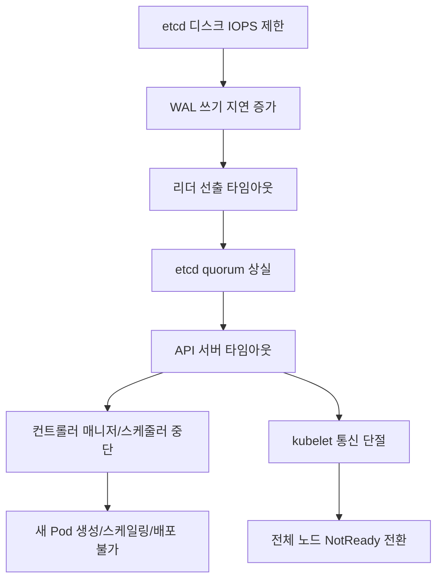
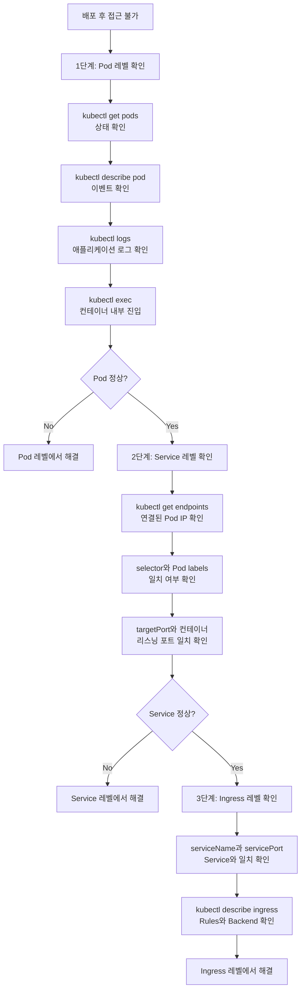

Kubernetes를 프로덕션 환경에서 운영하다 보면, CrashLoopBackOff, OOMKilled, Node NotReady 같은 장애 상황을 반드시 마주하게 된다. 이러한 장애는 단순한 설정 실수부터 etcd 디스크 I/O 병목까지 원인이 다양하며, 체계적인 접근 없이는 대응 시간이 불필요하게 길어진다. 이 글에서는 Spotify, LinkedIn, Datadog, Zalando 등 대규모 서비스를 운영하는 기업들이 공개한 실제 트러블슈팅 사례와, learnk8s가 제시하는 체계적 디버깅 프레임워크를 정리한다. 각 사례는 상황-문제-해결-교훈 구조로 구성하여, 유사한 장애 상황에서 빠르게 참조할 수 있도록 하였다.

> **참고:** 아래 사례들은 공개된 엔지니어링 블로그에서 수집한 내용이다.
> 원문 URL이 변경되었거나 접근이 불가할 수 있으므로, 제목으로 검색하여 원문을 확인하는 것을 권장한다.
> 저작권 보호를 위해 원문을 그대로 인용하지 않고, 주요 내용만 요약하여 정리하였다.

---

## 1. Spotify의 CrashLoopBackOff 체계적 디버깅 프로세스

- **출처:** [Debugging CrashLoopBackOff in Kubernetes](https://www.sysdig.com/blog/debug-kubernetes-crashloopbackoff)
- **저자/출처:** Spotify Platform Infrastructure Team

### 1.1 상황

Spotify는 수천 개의 마이크로서비스를 Kubernetes 클러스터에서 운영하고 있으며, 다양한 팀이 독립적으로 서비스를 배포하는 환경이었다. CrashLoopBackOff는 가장 빈번하게 발생하는 Pod 장애 상태 중 하나였으며, 원인이 매우 다양하여 표준화된 디버깅 프로세스가 필요하였다.

### 1.2 문제

CrashLoopBackOff의 원인은 크게 네 가지로 분류되었다.

1. **애플리케이션 버그** - null pointer, 미처리 예외 등 애플리케이션 자체의 크래시
2. **설정 오류** - 잘못된 환경 변수나 ConfigMap/Secret 참조
3. **이미지 풀 실패** - 컨테이너 이미지가 존재하지 않거나 레지스트리 인증 실패
4. **Liveness Probe 오설정** - 과도하게 짧은 타임아웃이나 잘못된 경로 설정으로 인한 강제 재시작

특히 exponential backoff로 인해 재시작 간격이 최대 5분까지 늘어나면서 디버깅 시간이 크게 증가하는 문제가 있었다.

### 1.3 해결

체계적인 디버깅 플로우를 수립하였다.

**1단계: Pod 상태 확인**

```bash
kubectl describe pod <pod-name>
```

이벤트와 컨테이너 상태(Last State, Exit Code)를 확인한다. Exit Code의 의미는 다음과 같다.

| Exit Code | 의미 |
|-----------|------|
| 137 | OOMKilled 또는 SIGKILL |
| 1 | 애플리케이션 에러 |
| 127 | 바이너리 미발견 |
| 126 | 권한 문제 |

**2단계: 이전 크래시 로그 확인**

```bash
kubectl logs <pod-name> --previous
```

이전 크래시 시점의 로그를 확인한다. init container가 있는 경우 별도로 확인해야 한다.

```bash
kubectl logs <pod-name> -c <init-container-name>
```

**3단계: 관련 이벤트 조회**

```bash
kubectl get events --field-selector involvedObject.name=<pod-name>
```

관련 이벤트를 시간순으로 조회한다. liveness probe로 인한 재시작이 의심되면 `initialDelaySeconds`와 `failureThreshold`를 임시로 늘려 확인한다.

### 1.4 주요 교훈

CrashLoopBackOff는 증상이지 원인이 아니다. Exit Code를 기반으로 원인 카테고리를 먼저 분류하고, `describe` -> `logs --previous` -> `events` 순서로 디버깅하는 것이 효율적이다. liveness probe의 `initialDelaySeconds`는 애플리케이션 기동 시간보다 반드시 길어야 하며, [startup probe](https://kubernetes.io/docs/concepts/configuration/liveness-readiness-startup-probes/#startup-probes)를 도입하면 느린 기동과 헬스체크를 분리할 수 있다.

---

## 2. LinkedIn의 OOMKilled 대규모 디버깅 경험

- **출처:** [Debugging OOMKilled Errors in Kubernetes at Scale](https://engineering.linkedin.com/blog/2023/debugging-oomkilled-kubernetes)
- **저자/출처:** LinkedIn Infrastructure Team

### 2.1 상황

LinkedIn은 대규모 JVM 기반 서비스를 Kubernetes에서 운영하고 있었다. JVM 애플리케이션은 힙 메모리 외에도 Metaspace, thread stack, native memory 등 다양한 영역에서 메모리를 사용하며, 컨테이너의 메모리 limit과 JVM 메모리 설정 간의 불일치가 빈번하게 OOMKilled를 유발하였다.

### 2.2 문제

Pod가 OOMKilled(Exit Code 137)로 반복적으로 종료되었으나, JVM 힙 사용량 모니터링 상으로는 설정된 `-Xmx` 값을 초과하지 않는 정상 범위였다.

원인은 JVM이 힙 외에 사용하는 **off-heap 메모리**였다.

```
JVM 총 메모리 사용량 = Heap + Metaspace + Direct Buffer + Code Cache + Thread Stack * 스레드 수
```

- **Metaspace** - 클래스 메타데이터 저장 영역으로, 제한이 없으면 무한 확장 가능
- **NIO Direct Buffer** - 네트워크 I/O에 사용되는 off-heap 버퍼
- **JIT 컴파일러 Code Cache** - 컴파일된 네이티브 코드 저장 영역
- **Thread Stack** - 스레드당 기본 1MB

이들이 누적되어 컨테이너 메모리 limit을 초과하면, cgroup의 OOM Killer가 프로세스를 강제 종료한다. 이때 JVM의 heap dump도 생성되지 않아 분석이 어려웠다.

### 2.3 해결

JVM 메모리 구성을 컨테이너 limit 기준으로 재설계하였다.

```
컨테이너 메모리 limit: 4Gi
├── JVM Heap (-Xmx): 3Gi (약 75%)
├── Metaspace: 256Mi (-XX:MaxMetaspaceSize=256m)
├── Direct Buffer: 256Mi (-XX:MaxDirectMemorySize=256m)
├── Thread Stack: ~200Mi (200 threads * 1MB)
└── 기타 (Code Cache 등): ~300Mi (여유분)
```

주요 JVM 옵션 설정은 다음과 같다.

```bash
java \
  -XX:+UseContainerSupport \
  -XX:MaxRAMPercentage=75.0 \
  -XX:MaxMetaspaceSize=256m \
  -XX:MaxDirectMemorySize=256m \
  -jar app.jar
```

`-XX:+UseContainerSupport`를 활용하여 JVM이 cgroup 메모리 limit을 인식하도록 설정하였다. 또한 `kubectl top pod`와 `/proc/<pid>/status` 내의 `VmRSS` 값을 비교하여 실제 메모리 사용량과 cgroup limit 간의 차이를 모니터링하는 대시보드를 구성하였다.

### 2.4 주요 교훈

OOMKilled는 커널 레벨에서 발생하므로 애플리케이션 로그에 기록되지 않는다. `kubectl describe pod`의 `Last State`에서 `OOMKilled` 상태와 Exit Code 137을 확인해야 한다. JVM 기반 서비스에서는 `-Xmx`뿐만 아니라 Metaspace, Direct Memory, Thread Stack 등 모든 메모리 영역을 고려하여 컨테이너 limit을 설정해야 한다. resource requests와 limits의 차이가 너무 크면 노드 레벨의 오버커밋으로 인한 eviction 위험도 증가한다.

---

## 3. Datadog의 Node NotReady 장애 진단과 복구

- **출처:** [Navigating Kubernetes Node Failures: Lessons from Production](https://www.datadoghq.com/blog/engineering/2023-03-08-deep-dive-into-platform-level-recovery/)
- **저자/출처:** Datadog Infrastructure Team

### 3.1 상황

Datadog는 대규모 관측성 플랫폼을 자체 Kubernetes 클러스터에서 운영하고 있었다. 수백 대의 노드로 구성된 클러스터에서 간헐적으로 노드가 NotReady 상태로 전환되면서, 해당 노드의 Pod들이 다른 노드로 재스케줄링되지 않는 문제가 발생하였다.

### 3.2 문제

Node NotReady의 원인은 다양하였다.

- **네트워크 파티션** - kubelet이 API 서버에 하트비트를 보내지 못하는 경우
- **kubelet 비정상 종료** - kubelet 프로세스 자체가 크래시된 경우
- **리소스 압력** - 디스크 압력(DiskPressure) 또는 메모리 압력(MemoryPressure) condition 발생
- **하드웨어 장애** - 커널 패닉이나 하드웨어 장애로 노드가 완전히 멈춘 경우

특히 `node.kubernetes.io/unreachable` taint가 추가된 후 `pod-eviction-timeout`(기본 5분) 동안 Pod가 Terminating 상태에 머물러 새 노드에서 재생성되지 않는 것이 문제였다.

### 3.3 해결

다계층 진단 프로세스를 수립하였다.

**1단계: 노드 상태 확인**

```bash
kubectl get nodes
kubectl describe node <node-name>
```

Conditions(Ready, MemoryPressure, DiskPressure, PIDPressure)를 조회한다.

**2단계: kubelet 상태 확인 (SSH 접근 가능 시)**

```bash
systemctl status kubelet
journalctl -u kubelet --since "30 minutes ago"
```

**3단계: 시스템 레벨 진단**

```bash
dmesg | tail -100
```

커널 메시지를 확인하여 OOM Killer, 디스크 I/O 에러, 네트워크 장애 등을 진단한다.

복구 조치로는 `tolerationSeconds`를 서비스 중요도에 따라 차등 설정하였다.

```yaml
# 크리티컬 서비스 - 30초 후 eviction
tolerations:
  - key: "node.kubernetes.io/unreachable"
    operator: "Exists"
    effect: "NoExecute"
    tolerationSeconds: 30

# 일반 서비스 - 기본값 300초 유지
tolerations:
  - key: "node.kubernetes.io/unreachable"
    operator: "Exists"
    effect: "NoExecute"
    tolerationSeconds: 300
```

또한 [Node Problem Detector](https://github.com/kubernetes/node-problem-detector)를 도입하여 커널 데드락, 파일시스템 손상 등 kubelet이 감지하지 못하는 문제를 사전에 탐지하도록 구성하였다.

### 3.4 주요 교훈

Node NotReady는 kubelet과 API 서버 간의 통신 단절을 의미하며, 반드시 노드 장애를 의미하지는 않는다. 네트워크 이슈일 수도 있다. `pod-eviction-timeout`의 기본값 5분은 대부분의 프로덕션 환경에서 너무 길며, 크리티컬 서비스에 대해서는 `tolerationSeconds`를 짧게 설정하여 빠른 페일오버를 보장해야 한다. [Node Problem Detector](https://github.com/kubernetes/node-problem-detector)와 같은 추가 도구를 활용하면 kubelet이 감지하지 못하는 노드 레벨 문제를 조기에 발견할 수 있다.

---

## 4. Zalando의 클러스터 전체 장애 포스트모템

- **출처:** [Kubernetes Cluster Outage Post-Mortem](https://engineering.zalando.com/posts/2023/04/kubernetes-cluster-outage-post-mortem.html)
- **저자/출처:** Zalando Platform Engineering Team

### 4.1 상황

Zalando는 유럽 최대 온라인 패션 플랫폼으로, 수십 개의 Kubernetes 클러스터에서 수천 개의 마이크로서비스를 운영하고 있었다. 특정 클러스터에서 etcd의 디스크 I/O 성능 저하를 시작으로 연쇄적인 장애가 발생하여 클러스터 전체가 30분간 사용 불가 상태에 빠졌다.

### 4.2 문제

장애의 근본 원인은 etcd가 사용하는 디스크의 IOPS 제한이었다. 장애 전파 경로를 정리하면 다음과 같다.



etcd의 WAL(Write-Ahead Log) 쓰기 지연이 증가하면서 리더 선출 타임아웃이 발생하였고, etcd 클러스터의 quorum이 깨졌다. etcd가 응답하지 않자 API 서버가 모든 요청에 대해 타임아웃을 반환하기 시작하였고, 이로 인해 컨트롤러 매니저와 스케줄러도 동작을 멈추었다. kubelet은 API 서버와의 통신이 끊기면서 모든 노드가 NotReady 상태로 전환되었다. 기존 실행 중인 Pod는 계속 동작하였으나, 새로운 Pod 생성, 스케일링, 배포가 모두 중단되었다.

### 4.3 해결

**즉각적인 복구**

etcd가 사용하는 스토리지를 고성능 SSD(io1/io2 타입)로 교체하고 IOPS를 충분히 확보하여 etcd를 재시작하였다.

**재발 방지 조치**

1. **etcd 전용 노드 분리** - 다른 워크로드의 I/O 영향을 차단
2. **etcd 메트릭 알림 설정** - `etcd_disk_wal_fsync_duration_seconds`, `etcd_server_leader_changes_seen_total` 메트릭 모니터링으로 디스크 지연 증가를 사전 탐지
3. **API 서버 요청 제한** - `--max-requests-inflight`와 `--max-mutating-requests-inflight` 값을 조정하여 과도한 요청이 etcd에 전달되는 것을 제한
4. **API Priority and Fairness(APF) 설정** - 특정 클라이언트의 과도한 API 호출이 전체 클러스터에 영향을 주지 않도록 rate limiting 적용

### 4.4 주요 교훈

etcd는 Kubernetes 클러스터의 단일 장애 지점(SPOF)이다. etcd의 디스크 성능이 저하되면 전체 컨트롤 플레인이 연쇄적으로 장애를 일으킨다. etcd 전용 노드 분리, 고성능 스토리지 사용, WAL fsync 지연 모니터링은 프로덕션 클러스터의 필수 요구사항이다. [API Priority and Fairness](https://kubernetes.io/docs/concepts/cluster-administration/flow-control/)를 통해 특정 클라이언트의 과도한 요청이 etcd에 부담을 주는 것을 방지해야 한다.

---

## 5. learnk8s의 체계적 Kubernetes 트러블슈팅 프레임워크

- **출처:** [A visual guide on troubleshooting Kubernetes deployments](https://learnk8s.io/troubleshooting-deployments)
- **저자/출처:** Daniele Polencic (learnk8s)

### 5.1 상황

learnk8s는 Kubernetes 교육 플랫폼으로, 수천 명의 엔지니어를 대상으로 교육을 진행하면서 트러블슈팅에 대한 체계적인 접근 방법이 필요함을 인식하였다. 대부분의 엔지니어들이 Pod 장애 시 무작위로 커맨드를 실행하며 시간을 낭비하는 패턴을 관찰하였다.

### 5.2 문제

Kubernetes 배포 실패의 원인은 크게 세 가지 레이어에 걸쳐 있다.

| 레이어 | 주요 실패 원인 |
|--------|---------------|
| Pod | 이미지 풀 실패, CrashLoopBackOff, OOMKilled, Readiness Probe 실패 |
| Service | selector 불일치, 포트 매핑 오류, Endpoints 비어있음 |
| Ingress | path 설정 오류, TLS 인증서 문제, 백엔드 서비스 미연결 |

각 레이어에서의 문제가 다른 레이어의 증상으로 나타나기 때문에, 체계적으로 접근하지 않으면 원인 파악에 불필요한 시간을 소모하게 된다.

### 5.3 해결

bottom-up 방식의 체계적 디버깅 플로우차트를 제시하였다.



**1단계 - Pod 레벨**

```bash
# Pod 상태 확인
kubectl get pods

# 이벤트 확인
kubectl describe pod <pod-name>

# 애플리케이션 로그 확인
kubectl logs <pod-name>

# 컨테이너 내부 진입 (프로세스, 네트워크 상태 확인)
kubectl exec -it <pod-name> -- /bin/sh
```

**2단계 - Service 레벨**

```bash
# Service에 연결된 Pod IP 목록 확인
kubectl get endpoints <service-name>

# Service selector와 Pod labels 일치 확인
kubectl get svc <service-name> -o yaml | grep -A5 selector
kubectl get pods --show-labels
```

`targetPort`와 컨테이너의 실제 리스닝 포트가 일치하는지 확인한다.

**3단계 - Ingress 레벨**

```bash
# Ingress Rules와 Backend 상태 확인
kubectl describe ingress <ingress-name>
```

Ingress 리소스의 `serviceName`과 `servicePort`가 Service와 일치하는지 확인한다.

각 단계에서 문제를 발견하면 해당 레이어에서 해결하고, 문제가 없으면 상위 레이어로 이동한다.

### 5.4 주요 교훈

Kubernetes 트러블슈팅은 Pod -> Service -> Ingress 순서로 bottom-up 접근이 가장 효율적이다. 각 레이어에서 `describe`와 `get events` 명령을 통해 Kubernetes가 제공하는 상태 정보를 먼저 확인해야 한다. Service의 selector-label 불일치와 포트 매핑 오류는 가장 흔한 실수이므로 반드시 확인해야 한다. 시각적인 디버깅 플로우차트를 팀 내에서 공유하면 온콜 대응 시간을 크게 줄일 수 있다.

---

## 참고 자료

- [Kubernetes 공식 문서 - Troubleshoot Applications](https://kubernetes.io/docs/tasks/debug/debug-application/)
- [Kubernetes 공식 문서 - Troubleshoot Clusters](https://kubernetes.io/docs/tasks/debug/debug-cluster/)
- [Kubernetes 공식 문서 - Pod Lifecycle](https://kubernetes.io/docs/concepts/workloads/pods/pod-lifecycle/)
- [Kubernetes 공식 문서 - Container Probes](https://kubernetes.io/docs/concepts/configuration/liveness-readiness-startup-probes/)
- [Kubernetes 공식 문서 - Resource Management](https://kubernetes.io/docs/concepts/configuration/manage-resources-containers/)
- [Kubernetes 공식 문서 - Node Status](https://kubernetes.io/docs/reference/node/node-status/)
- [learnk8s - Troubleshooting Deployments](https://learnk8s.io/troubleshooting-deployments)
