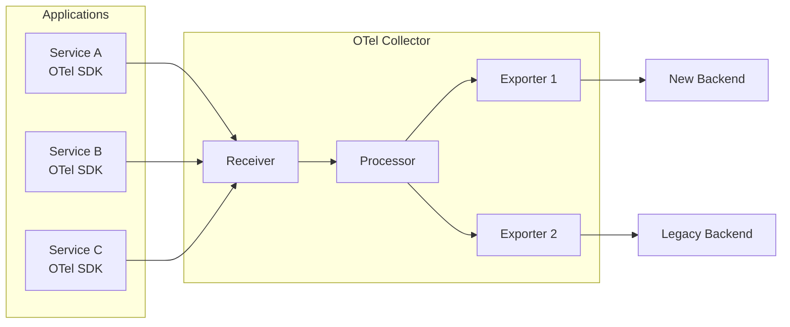
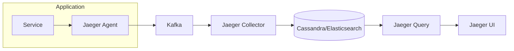
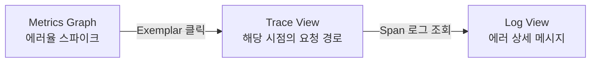

이 글에서는 GitLab, Shopify, LinkedIn, Uber, Grafana Labs 등 대규모 프로덕션 환경에서 실제로 발생한 Observability 관련 사례를 정리한다. Prometheus Cardinality 폭발, OpenTelemetry 마이그레이션, Alert Fatigue 해결, 분산 트레이싱 도입, Three Pillars 통합까지 총 5개의 사례를 다루며, 각 사례에서 무엇이 문제였고 어떻게 해결했는지를 중심으로 서술한다. 단순한 도구 소개가 아닌 실무에서 부딪히는 의사결정 과정과 트레이드오프를 이해하는 데 초점을 맞췄다.

> **주의:** 각 사례는 원문을 읽고 주요 내용을 정리한 것이다. 정확한 세부 내용은 반드시 원문 링크를 통해 확인하라.

---

## 1. GitLab - Prometheus Cardinality 폭발로 인한 장애 대응

> **참고 ([Grafana Labs - Managing High Cardinality Metrics](https://grafana.com/blog/2022/10/20/how-to-manage-high-cardinality-metrics-in-prometheus-and-kubernetes/)):**
> GitLab Infrastructure Team

### 1.1 상황

GitLab은 대규모 SaaS 플랫폼을 운영하며 Prometheus를 주요 모니터링 시스템으로 사용하고 있었다. 수백 개의 마이크로서비스와 수천 대의 노드에서 메트릭을 수집하는 환경이었다. Prometheus는 Pull 기반으로 각 타겟의 `/metrics` 엔드포인트에서 time series 데이터를 수집하는데, 수집 대상이 많아질수록 label 조합에 따른 time series 수가 기하급수적으로 늘어날 수 있다. 이를 cardinality라 하며, Prometheus의 메모리 사용량과 쿼리 성능에 직접적인 영향을 미치는 핵심 지표이다.

### 1.2 문제

특정 메트릭의 label 조합이 기하급수적으로 증가하면서 cardinality explosion이 발생했다. Prometheus의 메모리 사용량이 급격히 치솟았고, PromQL 쿼리 응답 시간이 수십 초로 늘어나면서 대시보드와 알림 시스템이 사실상 마비되었다.

주요 원인은 user ID, request path 등 **unbounded label**을 메트릭에 포함시킨 것이었다. unbounded label이란 값의 범위가 사실상 무한한 label을 말한다. 예를 들어 HTTP 요청 메트릭에 `user_id`를 label로 추가하면 사용자 수만큼 time series가 생성된다. 사용자가 100만 명이면 해당 메트릭 하나에서만 100만 개의 time series가 만들어지는 셈이다. 여기에 다른 label(method, status_code 등)과의 조합까지 더해지면 수천만 개로 폭발할 수 있다.

### 1.3 해결

GitLab 팀은 다음과 같은 단계별 접근으로 문제를 해결했다.

**1단계: 수집 단계에서 high-cardinality label 제거**

`metric_relabel_configs`를 활용하여 high-cardinality label을 수집 시점에 drop했다. 이 설정은 Prometheus가 메트릭을 스크랩한 후, TSDB에 저장하기 전에 label을 변환하거나 제거하는 기능이다.

```yaml
metric_relabel_configs:
  - source_labels: [__name__]
    regex: 'http_request_duration_seconds'
    action: labeldrop
    regex: 'user_id|request_path'
```

**2단계: Recording Rule 도입**

자주 사용하는 쿼리를 recording rule로 사전 집계했다. 이를 통해 쿼리 시점의 연산 부하를 대폭 줄였다. Recording rule은 PromQL 표현식의 결과를 새로운 time series로 미리 저장해 두는 방식이다.

```yaml
groups:
  - name: http_aggregations
    rules:
      - record: job:http_requests_total:rate5m
        expr: sum(rate(http_requests_total[5m])) by (job, status_code)
```

**3단계: CI 기반 cardinality 검증**

메트릭을 등록할 때 cardinality 상한을 검증하는 내부 가이드라인과 CI 검사를 도입했다. `promtool`의 `tsdb analyze` 명령을 통해 정기적으로 cardinality를 점검하는 프로세스도 수립했다.

```bash
promtool tsdb analyze /prometheus/data
```

**4단계: Mimir 마이그레이션**

장기적으로는 Grafana Mimir로 마이그레이션하여 수평 확장 가능한 장기 저장소를 확보했다. Mimir는 Prometheus 호환 TSDB를 분산 아키텍처로 운영할 수 있게 해주므로, 단일 Prometheus 인스턴스의 메모리 한계를 넘어설 수 있다.

### 1.4 주요 교훈

- Label 설계는 메트릭 설계의 핵심이다. unbounded value(사용자 ID, URL path 등)를 label로 사용하면 안 된다. label 값은 반드시 유한하고 예측 가능한 범위여야 한다.
- Cardinality 관리는 사후 대응이 아닌 CI/CD 파이프라인에 통합된 **사전 예방**이 필요하다. 메트릭 변경 사항을 코드 리뷰 단계에서 검증하는 것이 이상적이다.
- `promtool tsdb analyze` 명령으로 정기적으로 cardinality를 점검해야 하며, 갑자기 증가하는 time series가 없는지 모니터링해야 한다.

> 참고: [Prometheus - Metric and Label Naming](https://prometheus.io/docs/practices/naming/)

---

## 2. Shopify - OpenTelemetry 기반 Observability 마이그레이션

> **참고 ([Shopify Engineering Blog](https://shopify.engineering/how-shopify-governs-containers-at-scale-with-grafeas-and-kritis)):**
> Shopify Engineering

### 2.1 상황

Shopify는 수천 개의 마이크로서비스를 Ruby on Rails, Go 등 다양한 언어 스택으로 운영하고 있었다. 기존에는 Datadog, StatsD, 자체 계측 라이브러리 등 벤더별 SDK가 혼재된 상태였다. 각 팀이 서로 다른 모니터링 도구를 선호하면서 계측 코드가 특정 벤더에 종속되어 있었다.

### 2.2 문제

벤더 종속적인 계측 코드가 서비스 전반에 퍼져 있어 관측성 백엔드를 교체하거나 추가하는 것이 사실상 불가능했다. 이를 vendor lock-in이라 하며, 특정 벤더의 SDK를 사용하면 해당 벤더의 데이터 포맷과 API에 맞춰 코드가 작성되므로 다른 백엔드로 전환하려면 모든 서비스의 계측 코드를 수정해야 한다.

구체적으로 다음과 같은 문제가 있었다.

- 각 팀이 서로 다른 계측 방식을 사용하면서 **trace 간 correlation이 끊겼다**. 서비스 A에서 서비스 B로 요청이 넘어갈 때 trace context가 전파되지 않아 end-to-end 요청 추적이 불가능했다.
- 계측 라이브러리 업데이트 시 **전체 서비스에 대한 변경이 필요**했다. 벤더 SDK 버전이 올라가면 각 서비스에서 개별적으로 업데이트해야 했고, 호환성 문제가 빈번하게 발생했다.
- 벤더 비용이 증가하더라도 대안을 검토하기 어려운 구조였다.

### 2.3 해결

Shopify는 OpenTelemetry(OTel)를 표준 계측 레이어로 채택하면서 다음과 같은 전략을 사용했다.

**Dual-Write 전략으로 점진적 전환**

기존 벤더 SDK를 한 번에 교체하지 않았다. OTel Collector를 중앙 수집기로 배치하고, exporter 설정을 통해 기존 백엔드(Datadog)와 새 백엔드에 동시에 데이터를 전송하는 dual-write 전략을 사용했다. 이렇게 하면 새 백엔드에서 데이터 정합성을 검증한 후 기존 백엔드를 제거할 수 있다.

```yaml
# OTel Collector 설정 예시
exporters:
  otlp:
    endpoint: "new-backend:4317"
  datadog:
    api:
      key: ${DD_API_KEY}

service:
  pipelines:
    traces:
      receivers: [otlp]
      processors: [batch]
      exporters: [otlp, datadog]  # dual-write
```

이 방식은 strangler fig pattern과 유사하다. 기존 시스템을 감싸는 새로운 레이어를 먼저 구축하고, 점진적으로 기존 시스템의 역할을 줄여 나가는 패턴이다.

**자동 계측 우선 적용**

auto-instrumentation을 먼저 적용하여 코드 변경 없이 기본적인 span(HTTP 요청, DB 쿼리, gRPC 호출 등)을 확보했다. 자동 계측만으로 약 80%의 가시성을 확보할 수 있었고, 나머지 20%의 비즈니스 크리티컬 경로에 대해서만 수동 계측을 추가했다.

**내부 SDK Wrapper**

OTel API를 직접 호출하지 않고 내부 SDK wrapper를 만들어 추상화했다. 이를 통해 OTel 버전 업그레이드 시 wrapper만 수정하면 되므로 전체 서비스에 미치는 영향을 최소화할 수 있었다.

### 2.4 주요 교훈

- OTel 마이그레이션에서 가장 중요한 전략은 big-bang이 아닌 **점진적 전환**(strangler fig pattern)이다. 한 번에 전환하려 하면 리스크가 너무 크다.
- OTel Collector를 중간에 배치하면 백엔드 교체가 애플리케이션 코드 변경 없이 가능해진다. 이것이 OTel의 핵심 가치이다.
- 자동 계측으로 80%의 가시성을 확보하고, 나머지 20%의 비즈니스 크리티컬 경로에 수동 계측을 집중하는 것이 현실적인 접근이다.



> 참고: [OpenTelemetry Documentation](https://opentelemetry.io/docs/)

---

## 3. LinkedIn - Alert Fatigue 해결을 위한 알림 체계 재설계

> **원문 ([LinkedIn Engineering Blog](https://engineering.linkedin.com/blog/2023/taming-observability-alert-fatigue)):**
> LinkedIn Engineering

### 3.1 상황

LinkedIn은 수만 개의 마이크로서비스를 운영하며, 각 서비스 팀이 독립적으로 알림 규칙을 설정하고 있었다. Grafana Alerting과 자체 알림 시스템을 병행 사용하는 환경이었다. 서비스 수가 늘어남에 따라 알림 규칙도 비례해서 증가했고, 이를 체계적으로 관리하는 주체가 없었다.

### 3.2 문제

하루에 수천 건의 알림이 발생하면서 엔지니어들이 알림에 둔감해지는 **alert fatigue** 현상이 심각했다. 실제 장애 알림이 노이즈 알림에 묻혀 MTTD(Mean Time To Detect, 평균 탐지 시간)가 길어졌다.

alert fatigue의 주요 원인은 다음과 같았다.

- **Symptom이 아닌 cause 기반 알림**: CPU 사용률이 80%를 넘으면 알림을 보내는 식의 원인 기반 알림이 대부분이었다. 그러나 CPU가 80%라고 해서 반드시 사용자에게 영향을 미치는 것은 아니다.
- **임계값의 부적절한 설정**: 보수적으로 설정된 임계값이 정상적인 트래픽 변동에도 알림을 발생시켰다.
- **알림 간 중복**: 같은 현상에 대해 여러 알림이 동시에 발생했다. 예를 들어 DB가 느려지면 DB 알림, 애플리케이션 타임아웃 알림, 프론트엔드 에러율 알림이 모두 발생하는 식이었다.
- **알림의 주인(owner)이 불분명**: 누가 이 알림에 대응해야 하는지 명확하지 않은 알림이 많았다.

### 3.3 해결

LinkedIn 팀은 알림 체계를 근본적으로 재설계했다.

**1단계: Symptom-Based 알림으로 전환**

알림 철학을 cause-based에서 symptom-based로 전환했다. CPU 사용률이나 메모리 사용량 같은 원인 지표 대신, **에러율과 지연시간** 같은 사용자 영향 지표를 알림 기준으로 삼았다. 원인 지표는 대시보드에서 확인하도록 변경했다.

**2단계: 알림 등급 분류**

알림을 Critical, Warning, Info 3단계로 분류했다.

| 등급 | 기준 | 통보 방식 |
|------|------|-----------|
| Critical | 사용자 영향 있음, 즉시 대응 필요 | PagerDuty 즉시 통보 |
| Warning | 잠재적 문제, 업무 시간 내 확인 | Slack 채널 알림 |
| Info | 참고 정보 | 대시보드에만 표시 |

**3단계: Runbook과 담당 팀 정보 필수화**

모든 알림에 반드시 runbook 링크와 담당 팀 정보를 포함하도록 강제했다. runbook은 해당 알림이 발생했을 때 어떤 순서로 대응해야 하는지 기술한 문서이다. 담당 팀이 없는 알림은 존재할 수 없도록 정책을 수립했다.

**4단계: 알림 정리의 날 운영**

주기적으로 알림 정리의 날을 운영하여 30일 이상 아무런 action이 없었던 알림을 리뷰하고 삭제했다. 아무도 대응하지 않는 알림은 존재 자체가 alert fatigue를 가중시키기 때문이다.

**5단계: SLO 기반 Burn Rate Alert 도입**

SLO(Service Level Objective) 기반 알림을 도입했다. error budget 소진 속도(burn rate)에 따라 알림을 발생시키는 방식이다. 예를 들어 월간 SLO가 99.9%이고 현재 에러율이 이 SLO를 1시간 내에 소진할 속도라면 Critical 알림을 발생시킨다.

```yaml
# Burn rate alert 예시
- alert: HighErrorBudgetBurnRate
  expr: |
    (
      sum(rate(http_requests_total{status=~"5.."}[1h]))
      /
      sum(rate(http_requests_total[1h]))
    ) > (14.4 * 0.001)
  for: 5m
  labels:
    severity: critical
  annotations:
    summary: "Error budget burn rate가 14.4x를 초과"
    runbook_url: "https://wiki.internal/runbooks/high-burn-rate"
```

위 예시에서 `14.4`는 1시간 window에서 월간 error budget을 소진할 속도를 의미한다. Google SRE Book에서 제안하는 multiwindow, multi-burn-rate 알림 전략을 따른 것이다.

### 3.4 주요 교훈

- 좋은 알림의 기준은 "이 알림을 받았을 때 **즉시 행동해야 하는가**?"이다. 행동이 필요 없는 알림은 대시보드 확인으로 전환해야 한다.
- SLO 기반 burn rate 알림은 노이즈를 크게 줄이면서도 실제 사용자 영향이 있는 문제를 정확히 감지한다.
- 알림 시스템은 만들고 끝나는 것이 아니라 **지속적으로 정리**(pruning)해야 한다. 30일간 action이 없는 알림은 삭제 후보이다.

> 참고: [Google SRE Book - Chapter 6: Monitoring Distributed Systems](https://sre.google/sre-book/monitoring-distributed-systems/)

---

## 4. Uber - 대규모 분산 트레이싱 시스템 Jaeger의 프로덕션 적용

> **원문 ([Uber Engineering Blog](https://www.uber.com/blog/distributed-tracing/)):**
> Yuri Shkuro (Uber Engineering)

### 4.1 상황

Uber는 수천 개의 마이크로서비스가 초당 수백만 건의 요청을 처리하는 환경을 운영하고 있었다. 하나의 사용자 요청(예: 차량 호출)이 수십 개의 서비스를 거치면서 장애 원인을 파악하기가 매우 어려웠다.

분산 시스템에서 요청은 단일 서비스에서 끝나지 않는다. 사용자가 차량을 호출하면 API Gateway, 매칭 서비스, 가격 계산 서비스, 지도 서비스, 결제 서비스 등을 순차적 또는 병렬적으로 거친다. 이 중 하나라도 느려지거나 실패하면 전체 요청이 영향을 받는다.

### 4.2 문제

기존 로그 기반 디버깅으로는 서비스 간 요청 흐름을 추적할 수 없었다. 각 서비스의 로그는 해당 서비스 내부의 정보만 담고 있으므로, 특정 요청이 어떤 서비스를 거쳤는지, 어느 서비스에서 얼마나 시간이 걸렸는지 파악하려면 여러 서비스의 로그를 수동으로 correlation해야 했다.

특정 요청이 느려지거나 실패할 때 어느 서비스에서 문제가 발생했는지 파악하는 데 **수 시간이 소요**되는 경우도 있었다. 또한 모든 요청을 트레이싱하면 데이터 저장 비용과 네트워크 오버헤드가 감당할 수 없는 수준이었다. Uber의 트래픽 규모에서 100% 샘플링은 물리적으로 불가능했다.

### 4.3 해결

Uber는 OpenTracing(현재 OpenTelemetry에 통합) 기반의 **Jaeger**를 자체 개발하여 오픈소스로 공개했다.

**Adaptive Sampling**

서비스별로 트래픽 패턴에 맞는 최적의 sampling rate를 자동 조정하는 adaptive sampling을 구현했다. 핵심 전략은 다음과 같다.

- **에러가 발생한 요청은 100% 수집**한다. 디버깅에 가장 필요한 데이터이기 때문이다.
- **정상 요청은 낮은 비율로 샘플링**한다. 정상 요청의 패턴을 파악하기 위한 통계적 유의미성만 확보하면 된다.
- 서비스별 트래픽 볼륨에 따라 sampling rate를 동적으로 조정한다. 트래픽이 많은 서비스는 낮은 비율로, 적은 서비스는 높은 비율로 샘플링한다.

여기서 head-based sampling과 tail-based sampling의 트레이드오프를 이해해야 한다.

| 방식 | 결정 시점 | 장점 | 단점 |
|------|-----------|------|------|
| Head-based | 요청 시작 시 | 오버헤드 낮음, 구현 간단 | 에러 요청을 놓칠 수 있음 |
| Tail-based | 요청 완료 후 | 에러/지연 요청을 확실히 수집 | 일시적으로 전체 데이터 보관 필요 |

**Kafka 기반 비동기 수집**

Trace 데이터를 Kafka를 통해 비동기로 수집하여 애플리케이션 성능에 미치는 영향을 최소화했다. 애플리케이션은 span 데이터를 Kafka로 전송만 하고, 실제 저장과 인덱싱은 별도의 consumer가 처리한다.



**Context Propagation 표준화**

모든 서비스가 동일한 trace header를 전파하도록 context propagation을 표준화했다. HTTP 요청의 경우 `uber-trace-id` 헤더를 통해 trace ID, span ID, parent span ID, sampling flag를 전달한다. 이 전파가 한 곳이라도 끊기면 trace 전체가 분리되어 추적이 불가능해지므로, 공통 라이브러리를 통해 자동으로 전파되도록 구현했다.

### 4.4 주요 교훈

- 분산 트레이싱의 핵심 과제는 수집할 데이터의 양을 관리하는 **sampling 전략**이다. 모든 것을 수집하는 것은 비용적으로 불가능하며, 중요한 것은 디버깅에 필요한 데이터를 놓치지 않는 것이다.
- Context propagation이 깨지면 trace 전체가 무용지물이 되므로, 공통 라이브러리 또는 서비스 메시를 통한 자동 전파가 중요하다.
- 트레이싱 데이터는 디버깅뿐만 아니라 **서비스 의존성 분석**, **성능 병목 식별**, **용량 계획** 등 다양한 용도로 활용할 수 있다.

> 참고: [Jaeger Documentation](https://www.jaegertracing.io/docs/)

---

## 5. Grafana Labs - Observability Three Pillars의 실전 통합

> **참고 ([Grafana Labs Blog](https://grafana.com/blog/2019/10/21/whats-next-for-observability/)):**
> Grafana Labs

### 5.1 상황

많은 조직이 로그, 메트릭, 트레이스를 각각 독립된 도구로 관리하고 있었다. Grafana Labs는 자체 LGTM 스택(Loki, Grafana, Tempo, Mimir)을 프로덕션에 운영하면서 이 세 가지 신호를 통합하는 방법론을 정립했다.

LGTM 스택의 각 구성요소는 다음과 같다.

| 구성요소 | 역할 | 대응 신호 |
|----------|------|-----------|
| Loki | 로그 집계 시스템 | Logs |
| Grafana | 시각화 및 대시보드 | 통합 UI |
| Tempo | 분산 트레이싱 백엔드 | Traces |
| Mimir | 장기 메트릭 저장소 | Metrics |

### 5.2 문제

세 가지 관측성 신호가 서로 연결되지 않으면 장애 대응 시 여러 도구를 번갈아 확인해야 하며, MTTR(Mean Time To Recovery, 평균 복구 시간)이 크게 늘어난다.

구체적인 워크플로우를 살펴보면 문제가 명확해진다. 메트릭에서 에러율 증가를 감지했다고 하자. 이제 어떤 요청이 실패했는지(트레이스), 구체적인 에러 내용은 무엇인지(로그) 확인해야 한다. 그런데 각 도구가 분리되어 있으면 Grafana에서 Jaeger UI로 이동하고, 다시 Kibana로 이동하면서 시간대와 서비스명을 수동으로 매칭해야 한다. 이 과정에서 컨텍스트 전환 비용이 발생하고, 실수로 잘못된 시간대를 조회할 가능성도 있다.

### 5.3 해결

Grafana Labs는 세 가지 신호를 유기적으로 연결하는 방법을 단계별로 구현했다.

**Exemplar를 통한 메트릭-트레이스 연결**

Exemplar는 메트릭 데이터 포인트에 trace ID를 연결하는 메커니즘이다. Prometheus가 메트릭을 수집할 때 해당 시점의 대표적인 trace ID를 함께 저장한다. Grafana에서 메트릭 그래프의 특정 지점을 클릭하면 해당 trace로 바로 이동할 수 있다.



**Derived Field를 통한 트레이스-로그 연결**

Trace의 span에 대한 로그를 Loki에서 자동으로 조회하도록 derived field를 설정했다. Trace UI에서 특정 span을 클릭하면 해당 시간대, 해당 서비스의 로그가 자동으로 표시된다.

**Structured Logging 도입**

구조화된 로그(structured logging)를 도입하여 trace ID, span ID를 모든 로그 라인에 포함시켰다. JSON 형식의 로그를 사용하면 Loki에서 trace ID로 검색하여 특정 요청의 모든 로그를 즉시 조회할 수 있다.

```json
{
  "timestamp": "2024-01-15T10:30:00Z",
  "level": "ERROR",
  "service": "payment-service",
  "trace_id": "abc123def456",
  "span_id": "789ghi",
  "message": "Payment processing failed",
  "error": "insufficient_funds"
}
```

**Grafana Explore에서의 원클릭 이동**

Grafana의 Explore 화면에서 메트릭 -> 트레이스 -> 로그 간 원클릭 이동이 가능하도록 데이터소스 간 correlation을 설정했다. 이를 통해 장애 대응 시 단일 UI에서 모든 관측성 신호를 탐색할 수 있다.

### 5.4 주요 교훈

- Three pillars는 각각 독립적으로 존재하면 가치가 반감된다. 핵심은 세 가지 신호 간의 **correlation**(상관관계 연결)이다.
- **Trace ID를 공통 식별자로 사용**하여 메트릭, 로그, 트레이스를 연결하는 것이 실전 통합의 출발점이다.
- Exemplar는 Prometheus 메트릭과 트레이스를 연결하는 가장 효과적인 방법이며, Grafana에서 즉시 활용 가능하다.
- 관측성 성숙도는 단계적으로 높여야 한다: 개별 도구 도입 -> correlation 설정 -> SLO 기반 운영 순서가 현실적이다.

> 참고: [Grafana Documentation - Exemplars](https://grafana.com/docs/grafana/latest/fundamentals/exemplars/)

---

## 6. 사례별 핵심 정리

### Prometheus

| 주제 | 핵심 내용 |
|------|-----------|
| Cardinality explosion | unbounded label로 인한 time series 폭발 |
| 예방 방법 | `metric_relabel_configs`, CI 검증, `promtool tsdb analyze` |
| Recording rule | 자주 사용하는 쿼리의 사전 집계로 쿼리 성능 확보 |

### OpenTelemetry

| 주제 | 핵심 내용 |
|------|-----------|
| 벤더 락인 해결 | OTel Collector 중간 배치로 백엔드 추상화 |
| 마이그레이션 전략 | Dual-write + 점진적 전환(strangler fig pattern) |
| 계측 전략 | 자동 계측 80% 커버리지 + 주요 경로 수동 계측 |

### Alerting

| 주제 | 핵심 내용 |
|------|-----------|
| Alert fatigue 해결 | Symptom-based 알림, SLO burn rate, 주기적 pruning |
| 좋은 알림의 기준 | 즉시 행동이 필요한 알림만 notification, 나머지는 대시보드 |
| SLO 기반 알림 | Error budget 소진 속도(burn rate) 기반 알림 |

### Distributed Tracing

| 주제 | 핵심 내용 |
|------|-----------|
| Sampling 전략 | Adaptive sampling, 에러 100% + 정상 저비율 |
| Context propagation | Trace header를 서비스 간 전파하여 분산 요청 추적 |
| Head vs Tail-based | Head: 요청 시작 시 결정(빠름), Tail: 완료 후 결정(정확) |

### Three Pillars 통합

| 주제 | 핵심 내용 |
|------|-----------|
| 신호 간 연결 | Exemplar, derived field, structured logging |
| Exemplar | 메트릭 데이터 포인트에 trace ID를 연결하는 메커니즘 |
| 성숙도 향상 순서 | 개별 도구 도입 -> correlation 설정 -> SLO 기반 운영 |

---

## 참고 자료

- [Prometheus Documentation - Metric and Label Naming](https://prometheus.io/docs/practices/naming/)
- [OpenTelemetry Documentation](https://opentelemetry.io/docs/)
- [Grafana Documentation - Exemplars](https://grafana.com/docs/grafana/latest/fundamentals/exemplars/)
- [Google SRE Book - Chapter 6: Monitoring Distributed Systems](https://sre.google/sre-book/monitoring-distributed-systems/)
- [Jaeger Documentation](https://www.jaegertracing.io/docs/)
