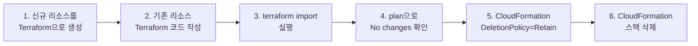

Terraform은 이제 인프라 관리의 사실상 표준이 되었지만, 프로덕션 환경에서의 운영은 코드를 작성하는 것과는 전혀 다른 차원의 문제다. State 파일 하나가 날아가면 수백 개의 리소스를 수동으로 복구해야 하고, drift가 누적되면 `terraform apply` 한 번에 프로덕션이 중단될 수 있다. 이 글에서는 실제 엔지니어들이 프로덕션 환경에서 겪은 Terraform/IaC 운영 사고와 교훈을 정리한다. State 관리 실패, 대규모 인프라 분할, Drift Detection, 모듈 설계, 그리고 CloudFormation에서 Terraform으로의 마이그레이션까지 - 각 사례는 모두 실제 프로덕션에서 발생한 것이며, 원문 출처를 함께 제공한다.

---

## 1. Terraform으로 프로덕션 인프라를 삭제한 사고

> **원문 ([How We Accidentally Deleted Our Production Terraform State](https://medium.com/@harshjv/how-we-accidentally-deleted-our-production-terraform-state-7c3c3a4b0e0e)):**
> Harsh Vakharia, Medium

### 1.1 상황

팀에서 Terraform을 사용하여 AWS 인프라를 관리하고 있었으며, 여러 환경(dev, staging, production)을 단일 state 파일 구조로 관리하고 있었다. S3 backend를 사용하고 있었지만, state 파일에 대한 버전 관리나 잠금(locking) 메커니즘이 제대로 설정되어 있지 않았다.

이것은 많은 조직에서 초기에 범하는 실수다. Terraform을 도입할 때 `terraform.tfstate` 파일이 인프라의 "진실의 원천(single source of truth)"이라는 사실을 과소평가하는 경우가 많다. State 파일은 단순한 메타데이터가 아니라, Terraform이 실제 클라우드 리소스와 코드 사이의 매핑을 유지하는 핵심 데이터베이스다. 이 파일이 없으면 Terraform은 어떤 리소스가 자신이 관리하는 것인지 전혀 알 수 없게 된다.

### 1.2 문제

엔지니어가 개발 환경에서 `terraform destroy`를 실행하려 했으나, workspace 전환을 하지 않은 상태에서 명령을 실행하여 프로덕션 환경의 state 파일이 영향을 받았다. State 파일의 버전 관리가 없었기 때문에 이전 상태로의 복구가 즉시 불가능했고, 프로덕션 리소스 일부가 삭제되는 결과를 초래했다.

이 사고의 핵심은 Terraform workspace의 한계에 있다. Workspace는 동일한 구성(configuration)을 여러 환경에 적용하기 위한 가벼운 메커니즘이지만, 환경 간 완전한 격리를 보장하지 않는다. 동일한 디렉토리에서 단순히 `terraform workspace select`를 잊는 것만으로도 프로덕션 인프라가 삭제될 수 있다는 것은, workspace만으로는 환경 분리가 충분하지 않다는 것을 의미한다.

### 1.3 해결

AWS CloudTrail 로그와 리소스 태그를 기반으로 삭제된 리소스를 수동으로 식별하고 복구했다. 이후 다음과 같은 방어 체계를 도입했다.

```hcl
# S3 Backend 설정 - versioning + locking 필수
terraform {
  backend "s3" {
    bucket         = "my-terraform-state"
    key            = "prod/terraform.tfstate"
    region         = "ap-northeast-2"
    encrypt        = true
    dynamodb_table = "terraform-state-lock"
  }
}
```

- S3 버킷의 버전 관리(versioning)를 활성화하여 state 파일의 이전 버전을 언제든 복구할 수 있도록 했다.
- DynamoDB를 통한 state locking을 도입하여 동시 실행으로 인한 state 충돌을 방지했다.
- 환경별 state 파일을 완전히 분리(별도 S3 key 경로, 가능하면 별도 AWS 계정)했다.
- CI/CD 파이프라인에서만 `terraform apply`를 실행할 수 있도록 정책을 변경하고, 로컬 실행은 `terraform plan`만 허용했다.

### 1.4 주요 교훈

- **State 파일 보호는 Terraform 운영의 최우선 과제다.** S3 versioning + DynamoDB locking은 선택이 아니라 필수다.
- 환경별 state 파일은 반드시 분리해야 한다. Workspace만으로는 충분한 격리가 되지 않으며, 디렉토리 구조 또는 별도 AWS 계정을 통한 물리적 분리가 권장된다.
- `terraform destroy`는 프로덕션에서 직접 실행하면 안 되며, CI/CD 파이프라인을 통해서만 실행해야 한다.
- State 파일에 대한 백업 전략(S3 versioning, 정기 스냅샷)이 반드시 존재해야 한다.

---

## 2. Terraform State 분할을 통한 대규모 인프라 관리

> **원문 ([Lessons Learned From Writing Over 300,000 Lines of Infrastructure Code](https://gruntwork.io/blog/5-lessons-learned-from-writing-over-300-000-lines-of-infrastructure-code)):**
> Yevgeniy Brikman (Gruntwork 공동 창업자), Gruntwork Blog

### 2.1 상황

Gruntwork 팀은 수백 개의 고객사를 대상으로 300,000줄 이상의 Terraform 코드를 작성하고 관리해 왔다. 초기에는 모든 인프라를 하나의 거대한 Terraform 프로젝트로 관리했지만, 규모가 커지면서 `terraform plan` 실행 시간이 수십 분으로 늘어나고, 하나의 변경이 전체 인프라에 영향을 미치는 "blast radius" 문제가 심각해졌다.

Blast radius란 하나의 실수나 장애가 영향을 미칠 수 있는 범위를 의미한다. 단일 state 파일에 VPC, RDS, ECS, CloudFront, Route53 등 모든 리소스가 포함되어 있으면, 네트워킹 변경 하나가 데이터베이스 리소스를 재생성하는 plan을 만들어낼 수 있다. 이는 단순히 실행 시간 문제가 아니라, 위험도의 문제다.

### 2.2 문제

단일 state 파일에 수천 개의 리소스가 포함되면서 다음과 같은 문제가 발생했다.

- `terraform plan/apply` 실행 시간이 급격히 증가 (수십 분 이상)
- 한 팀의 네트워킹 변경이 다른 팀의 데이터베이스에 영향을 줄 수 있는 구조
- State 파일 잠금으로 인해 여러 팀이 동시에 작업할 수 없는 병목 발생
- State 파일이 손상되면 전체 인프라가 관리 불가 상태에 빠질 위험

대규모 조직에서 이 문제는 특히 심각하다. 10개 팀이 동시에 인프라 변경을 해야 하는데 state lock 때문에 한 번에 한 팀만 작업할 수 있다면, 배포 속도가 심각하게 저하된다.

### 2.3 해결

인프라를 논리적 단위로 분리하여 각각 독립적인 Terraform 프로젝트와 state 파일로 관리하는 구조로 전환했다.

```
infrastructure/
├── networking/          # VPC, Subnet, NAT Gateway
│   ├── main.tf
│   ├── outputs.tf       # vpc_id, subnet_ids 등을 출력
│   └── backend.tf       # 독립 state
├── database/            # RDS, ElastiCache
│   ├── main.tf
│   ├── data.tf          # networking의 remote state 참조
│   └── backend.tf       # 독립 state
├── compute/             # ECS, EC2, ASG
│   ├── main.tf
│   └── backend.tf       # 독립 state
└── monitoring/          # CloudWatch, Datadog
    ├── main.tf
    └── backend.tf       # 독립 state
```

프로젝트 간 데이터 참조는 `terraform_remote_state` data source를 사용했다.

```hcl
# database/data.tf
data "terraform_remote_state" "networking" {
  backend = "s3"
  config = {
    bucket = "my-terraform-state"
    key    = "networking/terraform.tfstate"
    region = "ap-northeast-2"
  }
}

resource "aws_db_subnet_group" "main" {
  subnet_ids = data.terraform_remote_state.networking.outputs.private_subnet_ids
}
```

Terragrunt를 도입하여 DRY(Don't Repeat Yourself) 원칙을 지키면서도 환경별 구성을 효율적으로 관리할 수 있게 했다. Terragrunt는 `terragrunt.hcl` 파일을 통해 backend 설정, provider 설정, 공통 변수 등을 상위 디렉토리에서 상속받을 수 있게 하여, 환경별로 중복되는 boilerplate 코드를 제거한다.

### 2.4 주요 교훈

- **인프라 코드는 "적절한 크기"로 분리해야 한다.** Blast radius를 최소화하면서도 과도한 분리로 인한 복잡성 증가를 피해야 한다.
- 일반적인 분리 기준: 환경(dev/staging/prod), 계층(네트워킹/데이터/컴퓨팅), 팀 소유권.
- `terraform_remote_state`를 사용한 프로젝트 간 데이터 참조는 느슨한 결합(loose coupling)을 유지하는 핵심 패턴이다.
- Terragrunt 같은 래퍼 도구는 대규모 Terraform 관리에서 반복 코드를 줄이고 일관성을 유지하는 데 효과적이다.

> 참고: [Terragrunt GitHub](https://github.com/gruntwork-io/terragrunt)

---

## 3. Terraform Drift Detection: 수동 변경이 프로덕션을 망가뜨린 사례

> **원문 ([Infrastructure Drift: Why It Matters and How to Detect It](https://www.hashicorp.com/blog/detecting-and-managing-drift-with-terraform)):**
> HashiCorp 기술 블로그

### 3.1 상황

한 조직에서 Terraform으로 AWS 인프라를 관리하고 있었지만, 운영 팀 일부가 긴급 상황에서 AWS 콘솔을 통해 직접 리소스를 변경하는 관행이 있었다. 보안 그룹 규칙 변경, 인스턴스 타입 수동 조정, IAM 정책 수동 추가 등이 Terraform state와 동기화 없이 이루어졌다.

Drift(드리프트)란 IaC 도구가 알고 있는 인프라의 상태(state)와 실제 클라우드 환경의 상태가 다른 것을 의미한다. Terraform은 `plan` 실행 시 state 파일과 실제 인프라를 비교하여 차이를 감지하지만, `plan`을 실행하지 않으면 drift가 누적되어도 알 수 없다.

### 3.2 문제

Terraform state와 실제 인프라 상태 사이의 불일치(drift)가 누적되면서, 이후 `terraform plan`을 실행했을 때 예상하지 못한 대량의 변경 사항이 나타났다. 구체적으로 다음과 같은 장애가 발생했다.

- 수동으로 추가한 보안 그룹 규칙이 `terraform apply` 시 제거되면서 프로덕션 서비스의 네트워크 접근이 차단되었다.
- 수동으로 변경한 인스턴스 타입이 원래 값으로 되돌아가면서 성능 저하가 발생했다.
- 수동 변경 내역에 대한 추적이 없어 어떤 변경이 의도된 것이고 어떤 것이 실수인지 구분할 수 없었다.

이 문제의 본질은 Terraform이 "선언적(declarative)" 도구라는 점에 있다. Terraform은 코드에 정의된 상태를 "원하는 상태(desired state)"로 간주하고, 실제 인프라를 그 상태로 수렴시킨다. 수동으로 추가한 보안 그룹 규칙이 코드에 없으면, Terraform은 그것을 "원하지 않는 상태"로 판단하고 삭제한다.

### 3.3 해결

다음과 같은 다층적 drift 관리 체계를 구축했다.

```yaml
# CI/CD Pipeline - 정기적 drift detection
# GitHub Actions 예시
name: Terraform Drift Detection
on:
  schedule:
    - cron: '0 9 * * *'  # 매일 오전 9시 실행
jobs:
  drift-check:
    runs-on: ubuntu-latest
    steps:
      - uses: actions/checkout@v4
      - name: Terraform Plan
        run: terraform plan -detailed-exitcode
        # exit code 2 = drift detected
      - name: Notify on Drift
        if: steps.plan.outcome == 'failure'
        run: |
          curl -X POST $SLACK_WEBHOOK \
            -d '{"text":"Drift detected in production infrastructure"}'
```

- 정기적인 `terraform plan` 실행을 CI/CD에 통합하여 drift를 자동으로 감지하는 체계를 구축했다.
- AWS Config Rules와 연동하여 Terraform 관리 리소스의 수동 변경을 실시간으로 감지하고 알림을 발송하도록 설정했다.
- `terraform import`를 활용하여 수동 생성된 리소스를 state에 반영하는 프로세스를 수립했다.
- 콘솔 접근에 대한 IAM 정책을 강화하여 읽기 전용 접근만 허용하고, 모든 변경은 코드를 통해서만 가능하도록 정책을 수립했다.

### 3.4 주요 교훈

- **Drift는 IaC의 가장 큰 적이다.** 수동 변경이 허용되면 IaC의 "single source of truth" 원칙이 무너진다.
- 정기적인 drift detection은 선택이 아닌 필수다. 최소 일 1회 `terraform plan`을 자동 실행하여 drift를 감지해야 한다.
- 긴급 수동 변경이 불가피한 경우, 반드시 사후에 `terraform import`를 통해 state에 반영하는 프로세스가 있어야 한다.
- AWS Config, Spacelift, env0 같은 도구를 통해 drift detection을 자동화할 수 있다.

> 참고: [Spacelift](https://spacelift.io), [env0](https://www.env0.com)

---

## 4. Terraform 모듈 설계: 재사용 가능한 인프라 컴포넌트 구축

> **원문 ([How to create reusable infrastructure with Terraform modules](https://blog.gruntwork.io/how-to-create-reusable-infrastructure-with-terraform-modules-25526d65f73d)):**
> Yevgeniy Brikman (Gruntwork 공동 창업자), Gruntwork Blog

### 4.1 상황

다수의 마이크로서비스를 운영하는 조직에서 각 서비스팀이 독립적으로 Terraform 코드를 작성하고 있었다. 그 결과 비슷한 인프라(ECS 서비스, ALB, RDS 등)를 생성하는 코드가 팀마다 미세하게 다른 형태로 중복 작성되었고, 보안 설정이나 태깅 규칙이 팀마다 달라 거버넌스 문제가 발생했다.

이 문제는 "인프라의 스프롤(sprawl)" 현상이다. 서비스가 50개, 100개로 늘어나면, 동일한 패턴의 인프라 코드가 수십 군데에 복사-붙여넣기로 퍼져 나간다. 한 곳에서 보안 취약점이 발견되면, 나머지 수십 군데를 모두 찾아서 수정해야 하는 유지보수 지옥에 빠진다.

### 4.2 문제

- 중복 코드로 인해 보안 패치나 규정 변경을 적용할 때 모든 팀의 코드를 개별적으로 수정해야 했다.
- 일부 팀은 보안 그룹에서 `0.0.0.0/0` 인바운드를 허용하는 등 보안 모범 사례를 따르지 않았다.
- 신규 서비스 인프라 구축에 수 주가 소요되었으며, 인프라 코드의 품질 편차가 컸다.
- 태깅, 암호화, 로깅 등 조직 표준이 일관되게 적용되지 않았다.

### 4.3 해결

플랫폼 팀이 검증된 Terraform 모듈 라이브러리를 구축하여 내부 모듈 레지스트리를 통해 배포했다. 모듈 설계의 핵심 원칙은 "의견이 있되 유연한(opinionated but flexible)" 구조다.

```hcl
# 모듈 사용 예시 - 버전 고정 필수
module "ecs_service" {
  source  = "git::https://github.com/my-org/terraform-modules.git//ecs-service?ref=v2.1.0"

  # 필수 변수 (최소한으로 유지)
  service_name    = "payment-api"
  container_image = "123456789.dkr.ecr.ap-northeast-2.amazonaws.com/payment:v1.2.3"
  container_port  = 8080

  # 선택 변수 (합리적 기본값 제공)
  cpu             = 256    # default: 256
  memory          = 512    # default: 512
  desired_count   = 2      # default: 2
  health_check_path = "/health"

  # 보안 설정은 모듈 내부에서 강제
  # - HTTPS만 허용
  # - 암호화 활성화
  # - 최소 권한 IAM Role 자동 생성
}
```

핵심 설계 원칙은 다음과 같다.

- **Secure Defaults**: 보안, 태깅, 암호화 등 필수 사항은 모듈 내부에서 강제한다. 사용자가 비활성화할 수 없는 보안 기본값을 제공한다.
- **최소 필수 변수**: 모듈 사용을 시작하기 위해 필요한 변수를 최소화한다. 나머지는 합리적인 기본값을 제공한다.
- **버전 관리**: 시맨틱 버저닝을 적용하여 하위 호환성을 보장한다. `?ref=v2.1.0` 형태로 버전을 고정해야 예기치 않은 변경을 방지할 수 있다.
- **자동화된 테스트**: Terratest를 활용하여 모듈 변경 시 회귀 테스트를 수행한다.

```go
// Terratest 예시
func TestEcsModule(t *testing.T) {
    terraformOptions := &terraform.Options{
        TerraformDir: "../examples/ecs-service",
        Vars: map[string]interface{}{
            "service_name": "test-service",
        },
    }
    defer terraform.Destroy(t, terraformOptions)
    terraform.InitAndApply(t, terraformOptions)

    // 검증
    serviceArn := terraform.Output(t, terraformOptions, "service_arn")
    assert.Contains(t, serviceArn, "test-service")
}
```

### 4.4 주요 교훈

- **좋은 Terraform 모듈은 "의견이 있되 유연한(opinionated but flexible)" 설계를 따른다.** 보안, 태깅 등 필수 사항은 강제하되, 비즈니스 로직에 따른 커스터마이징은 허용해야 한다.
- 모듈 인터페이스(variables/outputs)는 API 설계와 동일한 수준의 신중함이 필요하다. 한번 공개된 인터페이스를 변경하면 하위 호환성이 깨진다.
- 모듈 버전 관리는 필수다. `source = "git::https://...?ref=v2.1.0"` 형태로 버전을 고정해야 예기치 않은 변경을 방지할 수 있다.
- Terratest 등을 활용한 인프라 코드 자동 테스트는 대규모 조직에서 모듈 품질을 보장하는 핵심 수단이다.

> 참고: [Terratest GitHub](https://github.com/gruntwork-io/terratest), [Terraform Module Registry](https://registry.terraform.io)

---

## 5. CloudFormation에서 Terraform으로의 대규모 마이그레이션

> **원문 ([Migrating from CloudFormation to Terraform](https://medium.com/version-1/migrating-from-cloudformation-to-terraform-lessons-learned-b4e0f5780d34)):**
> Version 1 엔지니어링 팀, Medium

### 5.1 상황

대규모 AWS 인프라를 CloudFormation으로 관리하던 조직에서 멀티 클라우드 전략 도입과 함께 Terraform으로의 마이그레이션을 결정했다. 수백 개의 CloudFormation 스택에 걸쳐 VPC, ECS 클러스터, RDS, ElastiCache 등 수천 개의 리소스가 관리되고 있었으며, 프로덕션 서비스 중단 없이 마이그레이션을 완료해야 했다.

CloudFormation에서 Terraform으로의 마이그레이션은 단순한 코드 변환 작업이 아니다. 두 도구는 state 관리 방식, 리소스 식별 체계, 의존성 해석 방식이 근본적으로 다르다. CloudFormation은 AWS 내부에서 스택 단위로 state를 관리하는 반면, Terraform은 외부 backend(S3 등)에서 state 파일을 관리한다. 리소스 ID 체계도 다르기 때문에, 기존 리소스를 "그대로 유지하면서" 관리 도구만 교체하는 것은 상당한 엔지니어링 노력이 필요하다.

### 5.2 문제

- CloudFormation과 Terraform은 리소스 식별 방식과 state 관리 방식이 근본적으로 다르기 때문에, 단순히 코드를 변환하는 것만으로는 충분하지 않았다.
- 기존 리소스를 Terraform state에 import하는 과정에서 리소스 속성 불일치로 인한 plan diff가 대량 발생했다.
- 마이그레이션 중간 상태에서 CloudFormation과 Terraform이 동일 리소스를 동시에 관리하면서 충돌이 발생할 위험이 있었다.
- 모든 팀이 동시에 마이그레이션할 수 없으므로, 두 도구가 공존하는 과도기를 관리해야 했다.

### 5.3 해결

점진적 마이그레이션 전략을 채택했다. 전체 프로세스는 다음과 같은 단계로 진행되었다.



**단계별 상세 과정:**

1. **신규 리소스부터 Terraform으로 생성**: 마이그레이션 결정 이후 새로 만드는 리소스는 모두 Terraform으로 작성했다.
2. **기존 리소스의 Terraform 코드 작성**: CloudFormation 템플릿을 참고하여 동일한 리소스를 정의하는 Terraform 코드를 작성했다.
3. **`terraform import` 실행**: 기존 리소스를 Terraform state에 반영했다.

```bash
# import 예시
terraform import aws_vpc.main vpc-0abc123def456
terraform import aws_subnet.private[0] subnet-0abc123def456
terraform import aws_rds_cluster.main my-rds-cluster
```

4. **`terraform plan`으로 "No changes" 확인**: import 후 plan에서 diff가 없는 상태가 될 때까지 Terraform 코드를 조정했다. 이 과정이 가장 시간이 많이 소요되는 부분이다.
5. **CloudFormation DeletionPolicy를 "Retain"으로 변경**: 스택 삭제 시 리소스가 실제로 삭제되지 않도록 보호했다.
6. **CloudFormation 스택 삭제**: 리소스는 유지되면서 CloudFormation 관리에서만 분리된다. 이후 Terraform이 유일한 관리 도구가 된다.

### 5.4 주요 교훈

- **IaC 도구 마이그레이션은 "빅뱅" 방식이 아닌 점진적 접근이 필수다.** 작은 단위부터 시작하여 성공 사례를 축적하고, 프로세스를 개선해 나가야 한다.
- `terraform import` 후 반드시 `terraform plan`으로 "No changes"를 확인해야 한다. diff가 있는 상태에서 apply하면 리소스가 재생성될 수 있다.
- CloudFormation DeletionPolicy를 "Retain"으로 설정한 후 스택을 삭제하면 리소스는 유지되면서 CloudFormation 관리에서만 분리된다. 이것이 이중 관리 문제를 해결하는 핵심 패턴이다.
- 마이그레이션 중 "관리 공백" 기간이 생기지 않도록, 각 리소스의 관리 주체(CloudFormation or Terraform)를 명확히 추적해야 한다.

---

## 공통 교훈 요약

| 주제 | 주요 원칙 | Anti-Pattern |
|------|-----------|--------------|
| State 관리 | S3 versioning + DynamoDB locking 필수 | 로컬 state 파일 사용, locking 미적용 |
| 환경 분리 | 환경별 독립 state 파일, 별도 AWS 계정 권장 | 단일 state로 모든 환경 관리 |
| Blast Radius | 논리적 단위로 state 분리 | 수천 개 리소스를 단일 state로 관리 |
| Drift 관리 | 정기적 plan 실행 + 수동 변경 감지 자동화 | 콘솔 수동 변경 후 state 동기화 안 함 |
| 모듈 설계 | Secure defaults + 버전 관리 + 자동 테스트 | 버전 미고정, 테스트 없는 모듈 공유 |
| 마이그레이션 | 점진적 접근, import 후 plan 검증 | 빅뱅 마이그레이션, 검증 없는 import |

---

## 참고 도구

| 도구 | 용도 | 링크 |
|------|------|------|
| Terragrunt | DRY Terraform 관리, 환경별 구성 | [gruntwork-io/terragrunt](https://github.com/gruntwork-io/terragrunt) |
| Terratest | Terraform 인프라 코드 자동 테스트 | [gruntwork-io/terratest](https://github.com/gruntwork-io/terratest) |
| tflint | Terraform 린터, 모범 사례 검사 | [terraform-linters/tflint](https://github.com/terraform-linters/tflint) |
| Spacelift | Terraform 자동화, drift detection | [spacelift.io](https://spacelift.io) |
| Atlantis | Terraform PR 자동화 | [runatlantis.io](https://www.runatlantis.io) |
| Infracost | Terraform 비용 예측 | [infracost.io](https://www.infracost.io) |
| Checkov | Terraform 보안 정적 분석 | [bridgecrewio/checkov](https://github.com/bridgecrewio/checkov) |
