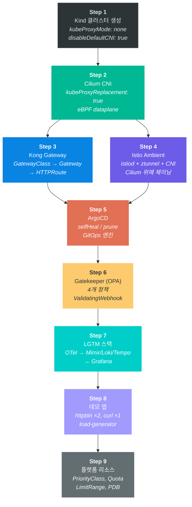
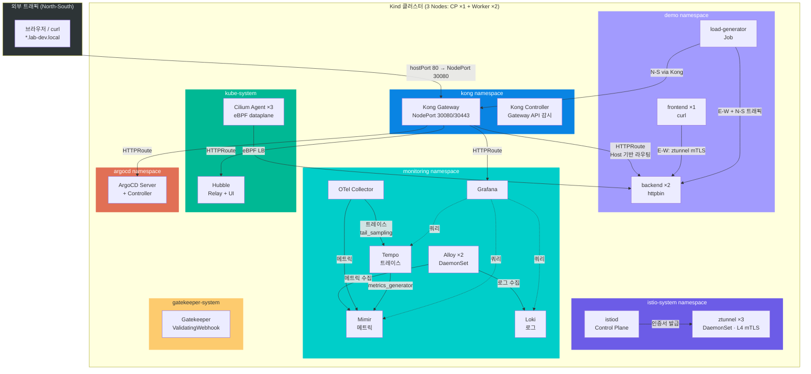

로컬 머신에서 프로덕션과 동일한 DevOps 환경을 구축할 수 있을까? Kind 클러스터 위에 Cilium(eBPF CNI) + Istio Ambient(mTLS) + Kong(Gateway API) + ArgoCD(GitOps) + Gatekeeper(OPA) + LGTM 관측성 스택을 올리고, 실제 운영 환경(DC 39대 서버, Docker Compose 기반)과 동일한 설정을 적용했다. 이 글에서는 각 기술의 동작 원리부터 실습 과제, 장애 주입, 트러블슈팅까지 전체 과정을 다룬다. `--env` 옵션으로 `dev`, `stg`, `prod` 환경을 전환할 수 있으며, 도메인은 `*.lab-{ENV}.local` 형식이다.

> **환경**: `--env` 옵션으로 `dev`, `stg`, `prod` 환경을 전환할 수 있으며, 도메인은 `*.lab-{ENV}.local` 형식.
>
> Last updated: 2026-02-28

---

## 0. 클러스터 현황 요약

### 구성 테이블

| #  | 컴포넌트             | 버전             | Helm Chart              | 네임스페이스            | Pod 수                                                                                                                            |
|----|------------------|----------------|-------------------------|-------------------|----------------------------------------------------------------------------------------------------------------------------------|
| 1  | Kubernetes       | v1.35.0 (Kind) | -                       | kube-system       | 6 (apiserver, controller-manager, scheduler, etcd, coredns×2)                                                                    |
| 2  | Cilium CNI       | v1.19.1        | cilium-1.19.1           | kube-system       | 8 (agent×3, operator×2, envoy×3)                                                                                                 |
| 3  | Hubble           | v1.19.1        | (cilium 포함)             | kube-system       | 2 (relay×1, ui×1)                                                                                                                |
| 4  | Kong Gateway     | 3.9            | ingress-0.22.0          | kong              | 2 (gateway×1, controller×1)                                                                                                      |
| 5  | Istio Ambient    | v1.29          | istiod, ztunnel, cni    | istio-system      | 7 (istiod×1, ztunnel×3, cni×3)                                                                                                   |
| 6  | ArgoCD           | v3.3.2         | argo-cd-9.4.5           | argocd            | 7                                                                                                                                |
| 7  | Gatekeeper (OPA) | v3.21.1        | gatekeeper-3.21.1       | gatekeeper-system | 2                                                                                                                                |
| 8  | OTel Collector   | v0.146.1       | (LGTM 내)                | monitoring        | 1                                                                                                                                |
| 9  | Mimir            | 3.0.1          | mimir-distributed-6.0.5 | monitoring        | 10 (distributor, ingester, compactor, querier, query-frontend, query-scheduler, ruler, store-gateway, gateway, rollout-operator) |
| 10 | Loki             | 3.6.5          | loki-6.53.0             | monitoring        | 3 (loki×1, canary×2)                                                                                                             |
| 11 | Tempo            | 2.9.0          | tempo-1.24.4            | monitoring        | 1                                                                                                                                |
| 12 | Alloy            | v1.13.0        | alloy-1.6.0             | monitoring        | 2 (DaemonSet)                                                                                                                    |
| 13 | Grafana          | 12.3.1         | grafana-10.5.15         | monitoring        | 1                                                                                                                                |
| 14 | AlertManager     | v0.30.1        | - (raw manifest)        | monitoring        | 1                                                                                                                                |

**노드**: control-plane 1 + worker 2 (arm64, containerd 2.2.0)
**총 Pod**: 57개 / **네임스페이스**: 8개 (kube-system 16, monitoring 19, istio-system 7, argocd 7, demo 3, kong 2,
gatekeeper-system 2, local-path-storage 1)

### 설치 / 삭제

```bash
# 전체 설치 (Istio 포함)
bash lab/setup.sh --env dev --light

# 경량 설치 (Istio 생략)
bash lab/setup.sh --env dev --light --skip-istio

# 전체 검증
bash lab/verify-all.sh

# 환경 삭제
bash lab/teardown.sh --env dev
```

### 접속 정보

```bash
# /etc/hosts 추가 (최초 1회)
echo "127.0.0.1 grafana.lab-dev.local argocd.lab-dev.local hubble.lab-dev.local api.lab-dev.local" | sudo tee -a /etc/hosts
```

| 서비스          | URL                          | 인증                                                                                                             |
|--------------|------------------------------|----------------------------------------------------------------------------------------------------------------|
| Demo API     | http://api.lab-dev.local     | 없음                                                                                                             |
| Grafana      | http://grafana.lab-dev.local | admin / `kubectl get secret -n monitoring grafana -o jsonpath="{.data.admin-password}" \| base64 -d`           |
| ArgoCD       | http://argocd.lab-dev.local  | admin / `kubectl -n argocd get secret argocd-initial-admin-secret -o jsonpath="{.data.password}" \| base64 -d` |
| Hubble UI    | http://hubble.lab-dev.local  | 없음                                                                                                             |
| Kong Manager | http://localhost:30329       | 없음 (Admin 전용, HTTPRoute 미노출)                                                                                   |

### UI 도구 용도 가이드

#### Grafana — 관측성 대시보드

메트릭, 로그, 트레이스를 한 화면에서 보는 도구다. 4개 데이터소스(Mimir, Loki, Tempo, AlertManager)를 연결해서 사용한다.

| 데이터소스             | 보이는 것                                                    |
|-------------------|----------------------------------------------------------|
| Mimir (메트릭)       | CPU/메모리 사용률, Pod 재시작 횟수, HTTP 요청 수와 에러율, 컨테이너 리소스 추이 그래프 |
| Loki (로그)         | Pod 로그 검색 (kubectl logs의 웹 버전), 라벨 기반 필터링, 로그 패턴 분석      |
| Tempo (트레이스)      | 요청 하나가 어떤 서비스를 거쳐서 얼마나 걸렸는지 (예: Kong → backend 200ms)    |
| AlertManager (알림) | 알림 규칙 목록, 발생 중인 알림, Silence(알림 무시) 관리                    |

Grafana의 핵심 가치는 4개 데이터소스를 **상관관계로 연결**해서 볼 수 있다는 것이다. 에러율 급증 그래프를 발견하면(Mimir) → 클릭해서 해당 시간대 로그로 이동(Loki) → 로그에서 trace
ID를 클릭하면 트레이스로 이동(Tempo) → 어떤 서비스에서 얼마나 느렸는지 확인하는 흐름이다.

프로덕션에서는 "장애 발생 → 원인 파악"까지의 시간(MTTR)을 단축하는 핵심 도구로, 온콜 담당자가 가장 먼저 여는 화면이다.

#### ArgoCD — GitOps 배포 대시보드

Git에 정의한 K8s 리소스가 실제 클러스터와 일치하는지 보여주는 도구다.

| 화면             | 보이는 것                                                                 |
|----------------|-----------------------------------------------------------------------|
| Application 목록 | 배포된 앱들의 Sync 상태 (Synced / OutOfSync / Degraded)                       |
| Application 상세 | 리소스 트리 — Deployment → ReplicaSet → Pod 계층 구조를 그래프로 시각화                |
| Diff 뷰         | Git에 정의된 상태 vs 실제 클러스터 상태의 차이점. kubectl edit 등으로 수동 변경하면 여기에 빨간색으로 표시 |
| History        | 이전 배포 기록과 롤백 버튼                                                       |

개발자가 Git에 `replicas: 3`으로 push하면 ArgoCD가 자동 감지 → UI에서 "OutOfSync" 표시 → 자동 sync(selfHeal) 또는 수동 Sync 버튼으로 클러스터에 반영하는
흐름이다. 누가 언제 뭘 배포했는지 추적하고, 문제 생기면 이전 버전으로 원클릭 롤백할 수 있다.

#### Hubble UI — 네트워크 관측 맵

클러스터 내부 네트워크 트래픽을 실시간으로 보여주는 Cilium 기반 도구다.

| 화면          | 보이는 것                                                             |
|-------------|-------------------------------------------------------------------|
| Service Map | Pod 간 통신을 화살표로 연결한 그래프 (예: frontend → backend, backend → coredns) |
| Flow 목록     | 실시간 패킷 흐름 — 출발지, 목적지, 포트, 프로토콜, 허용/차단 여부                          |
| Policy 뷰    | CiliumNetworkPolicy에 의해 차단된 트래픽을 빨간색으로 표시                         |
| DNS 요청      | 어떤 Pod가 어떤 도메인을 조회했는지                                             |

"backend Pod가 외부 API 호출이 안 된다" 같은 문제가 발생하면, Hubble UI에서 해당 Pod를 선택 → Flow 목록에서 트래픽 확인 → "DROPPED by policy" 발견 →
NetworkPolicy 수정하는 흐름으로 디버깅한다. 보안 감사 시 트래픽 흐름 증빙 자료로도 활용한다.

#### Kong Manager — API Gateway 관리

Kong Gateway의 라우팅 규칙과 플러그인을 확인하는 Admin UI다. NodePort(30329)로 직접 접속하며, 외부에 노출하지 않는 관리자 전용 화면이다.

| 화면       | 보이는 것                                    |
|----------|------------------------------------------|
| Routes   | 등록된 HTTPRoute 목록 (어떤 도메인이 어떤 서비스로 연결되는지) |
| Services | 업스트림 서비스 목록과 상태                          |
| Plugins  | 적용된 플러그인 (rate-limiting, auth, cors 등)   |
| Status   | Gateway 인스턴스 상태, 처리 중인 연결 수              |

"외부에서 접속이 안 된다" 같은 문제가 발생하면 Routes와 Services 상태를 확인해서 라우팅이 올바르게 설정되어 있는지 점검한다.

#### 언제 어떤 UI를 열어야 하나

| 상황                 | 먼저 열어야 할 UI                                     |
|--------------------|-------------------------------------------------|
| 에러율이 올라갔다, 응답이 느리다 | **Grafana** → 메트릭 확인 → 로그 → 트레이스 순서로 원인 추적      |
| 배포 후 Pod가 안 뜬다     | **ArgoCD** → Sync 상태와 이벤트 확인, 리소스 트리에서 실패 원인 확인 |
| 서비스 간 통신이 안 된다     | **Hubble UI** → 트래픽 차단 여부, DNS 문제 확인            |
| 외부에서 URL 접속이 안 된다  | **Kong Manager** → 라우팅 규칙, 업스트림 서비스 상태 확인       |

현재 Docker Compose 환경에서는 이런 UI가 없기 때문에 장애 시 `ssh` → `docker logs` → `grep` 순서로 서버를 돌아다녀야 한다. K8s + 이 4개 UI가 있으면 브라우저 하나에서
전부 확인 가능하다.

### 해결된 호환성 이슈

| # | 이슈                       | 원인                              | 해결                                     |
|---|--------------------------|---------------------------------|----------------------------------------|
| 1 | Cilium + Istio CNI 충돌    | CNI exclusive mode              | `cni.exclusive: false` 설정              |
| 2 | ztunnel 트래픽 우회           | socketLB가 ztunnel 이전에 NAT       | `socketLB.hostNamespaceOnly: true`     |
| 3 | Mimir Kafka ingest 실패    | Kafka 미설치 환경                    | Classic write path 사용                  |
| 4 | Tempo idle timeout       | tail_sampling 30s 대기            | `trace_idle_period: 60s`               |
| 5 | OTel high-cardinality 폭발 | process.pid 등 고유 속성             | resource 속성 삭제 프로세서                    |
| 6 | Kong NodePort 충돌         | Kind extraPortMappings          | hostPort 80/443 → NodePort 30080/30443 |
| 7 | Kong → Backend 502       | AuthorizationPolicy가 Kong SA 차단 | `kong-gateway` SA를 ALLOW 목록에 추가        |
| 8 | 외부→Kong 접속 불가            | STRICT mTLS가 NodePort 트래픽 차단    | Kong proxy 포트 portLevelMtls PERMISSIVE |

---

## 1. 아키텍처 개요

### 설치 흐름도 (9 Steps)



### 클러스터 아키텍처 (트래픽 흐름)



### 네임스페이스 맵

| 네임스페이스               | Pod 수 | 주요 컴포넌트                                                                                                              |
|----------------------|-------|----------------------------------------------------------------------------------------------------------------------|
| `kube-system`        | 16    | Cilium Agent ×3, Operator ×2, Envoy ×3, Hubble Relay/UI, CoreDNS ×2, etcd, API Server, controller-manager, scheduler |
| `monitoring`         | 19    | Mimir (10), Loki (3), Tempo (1), Grafana (1), Alloy (2), OTel Collector (1), AlertManager (1)                        |
| `istio-system`       | 7     | istiod ×1, ztunnel ×3, istio-cni ×3                                                                                  |
| `argocd`             | 7     | Server, Controller, Repo Server, Redis, Dex, ApplicationSet, Notifications                                           |
| `demo`               | 3     | backend ×2, frontend ×1 (+ load-generator Job)                                                                       |
| `kong`               | 2     | Gateway ×1, Controller ×1                                                                                            |
| `gatekeeper-system`  | 2     | Controller ×1, Audit ×1                                                                                              |
| `local-path-storage` | 1     | local-path-provisioner (Kind 기본 StorageClass)                                                                        |

---

## 2. Cilium CNI (v1.19.1)

### 이 기술이 없다면?

Kubernetes 클러스터를 처음 만들면 Pod끼리 통신할 수 있는 네트워크가 필요하다. 이 역할을 하는 것이 CNI(Container Network Interface) 플러그인인데, Cilium 같은 CNI를
별도로 설치하지 않으면 Kubernetes 기본 제공 컴포넌트인 kube-proxy가 iptables 규칙으로 트래픽을 라우팅한다.

문제는 iptables가 규칙을 위에서 아래로 하나씩 순회하는 방식이라는 점이다. Service가 10개일 때는 체감이 안 되지만, 서비스가 수백~수천 개로 늘어나면 규칙 수가 기하급수적으로 증가하고, 패킷 하나를
라우팅할 때마다 수천 개의 규칙을 순회해야 한다. 규칙 갱신도 느려져서, 새 Service를 배포한 뒤 실제로 트래픽이 도달하기까지 수 초가 걸리기도 한다.

또한 기본 CNI만으로는 "Pod A는 Pod B에만 접근 가능하고, Pod C에는 접근 불가"와 같은 네트워크 격리(NetworkPolicy)를 적용할 수 없다. 모든 Pod가 클러스터 내 다른 모든 Pod에
자유롭게 접근할 수 있기 때문에, 하나의 Pod가 침해되면 공격자가 클러스터의 다른 서비스로 횡이동(lateral movement)할 수 있다.

마지막으로, 네트워크 수준의 관측성이 전혀 없다. 특정 요청이 어디서 지연되고 있는지, 어떤 DNS 쿼리가 실패하고 있는지, 패킷이 어느 지점에서 drop 되는지를 확인할 방법이 없어서, 네트워크 관련 장애가
발생하면 원인 파악에 시간이 오래 걸린다.

### 동작 원리

#### eBPF란 무엇인가

Linux 커널에는 네트워크 패킷이 들어오고 나갈 때 거치는 여러 단계(hook point)가 있다. 예를 들어 패킷이 네트워크 카드(NIC)에 도착하면 tc(traffic control), Netfilter,
routing table 등을 차례로 거쳐 최종적으로 애플리케이션의 socket에 도달한다.

eBPF(extended Berkeley Packet Filter)는 이 hook point에 사용자가 작성한 작은 프로그램을 삽입할 수 있는 Linux 커널 기술이다. 이 프로그램은 커널 내부에서 직접 실행되기
때문에, 패킷이 userspace 애플리케이션까지 올라갔다 내려올 필요 없이 커널 수준에서 바로 판단하고 처리할 수 있다.

Cilium은 이 eBPF를 활용해서 Kubernetes의 네트워크 데이터플레인을 구현한다. 기존 iptables 방식과 비교하면 이렇게 다르다:

```
기존 kube-proxy (iptables 방식):
  패킷 도착 → PREROUTING chain → KUBE-SERVICES chain → 규칙을 위에서 아래로 순회
  → 매칭되는 Service 찾기 → DNAT → POSTROUTING → 전달
  규칙이 많을수록 느려짐 (선형 탐색, Service × endpoint 수만큼 규칙 증가)

Cilium (eBPF 방식):
  패킷 도착 → tc ingress hook에서 eBPF 프로그램 실행
  → BPF map(해시 테이블)에서 목적지 조회 → 직접 전달
  Service가 아무리 많아도 조회 시간이 일정 (해시 테이블 O(1) 조회)
```

#### kubeProxyReplacement

Kubernetes에서 Service를 만들면 ClusterIP라는 가상 IP가 할당된다. 기본적으로 kube-proxy가 이 가상 IP로 들어오는 트래픽을 실제 Pod로 라우팅하는 역할을 한다. Cilium의
`kubeProxyReplacement: true` 설정은 이 kube-proxy의 역할을 전부 eBPF로 대체한다. ClusterIP, NodePort, LoadBalancer 타입의 Service 라우팅이 모두
eBPF map 기반의 해시 조회로 처리된다.

이 Lab에서는 Kind 클러스터 생성 시 `kubeProxyMode: none`으로 kube-proxy 자체를 아예 배포하지 않았다. kube-proxy가 없으므로 iptables 규칙이 생성되지 않고, 모든
Service 라우팅이 Cilium의 eBPF를 통해 동작한다.

#### Hubble — 네트워크 관측성

Cilium의 eBPF 프로그램은 클러스터의 모든 패킷을 처리하기 때문에, 부수적으로 모든 네트워크 흐름 데이터를 관측할 수 있다. Hubble은 이 데이터를 수집하고 시각화하는 Cilium의 관측성 도구다. 별도의
네트워크 미러링 장비나 패킷 캡처 도구 없이도, Hubble UI에서 서비스 간 트래픽 흐름, DNS 쿼리 결과, HTTP 요청/응답 상태, 패킷 drop 사유 등을 실시간으로 확인할 수 있다.

#### WireGuard 암호화

Cilium은 노드 간 통신을 WireGuard로 암호화하는 기능을 내장하고 있다. WireGuard는 Linux 커널에 포함된 VPN 프로토콜로, 기존 IPsec보다 코드가 간결하고(약 4,000줄 vs 수만 줄)
성능 오버헤드가 낮다. 이 Lab에서는 `encryption.type: wireguard`로 활성화하여, 서로 다른 노드에 있는 Pod 간의 트래픽이 자동으로 암호화된다.

#### Lab 설정 요약 (프로덕션 동일)

- `kubeProxyReplacement: true` — kube-proxy 완전 대체
- `routingMode: tunnel`, `tunnelProtocol: vxlan` — 노드 간 VXLAN 터널로 패킷 캡슐화
- `encryption.type: wireguard` — 노드 간 트래픽 WireGuard 암호화
- `cni.exclusive: false` — Istio CNI가 Cilium 위에 체이닝될 수 있도록 허용 (4장에서 설명)
- `socketLB.hostNamespaceOnly: true` — Istio ztunnel 트래픽이 우회되지 않도록 설정 (4장에서 설명)
- Hubble 메트릭: dns, drop, tcp, flow, icmp, http (6개 활성화)

### 클러스터 상태 확인

```bash
# Cilium Agent 상태 (모든 노드에서 Running, 3개)
kubectl get pods -n kube-system -l k8s-app=cilium -o wide
# → cilium-xxxxx   1/1   Running   (노드당 1개 = CP 1 + Worker 2 = 3개)

# Cilium Operator (HA: 2개)
kubectl get pods -n kube-system -l name=cilium-operator
# → cilium-operator-xxxxx   1/1   Running   (2개)

# Cilium Envoy (DaemonSet, L7 정책용)
kubectl get pods -n kube-system -l k8s-app=cilium-envoy -o wide

# kubeProxyReplacement 상태 확인
kubectl exec -n kube-system ds/cilium -- cilium-dbg status | grep KubeProxyReplacement
# → KubeProxyReplacement: True [...]

# CiliumEndpoint 목록 (Pod별 eBPF endpoint)
kubectl get ciliumendpoints --all-namespaces --no-headers | wc -l
# → ~45개

# WireGuard 암호화 상태
kubectl exec -n kube-system ds/cilium -- cilium-dbg encrypt status
# → Encryption: Wireguard
# →   Interface: cilium_wg0
# →   Public key: ...
# →   Number of peers: 2

# Hubble UI 접속
# http://hubble.lab-dev.local (Kong 경유)

# Hubble Relay 상태
kubectl get pods -n kube-system -l k8s-app=hubble-relay
```

### 실습 과제

#### 실습 2-1: CiliumNetworkPolicy로 Pod 접근 제한

```bash
# ── 1. 변경 전: CiliumNetworkPolicy 없이 접근 가능한 상태 확인 ──

# frontend에서 backend 호출 (성공)
kubectl exec -n demo deploy/frontend -- curl -sf http://backend.demo.svc/status/200
# → 200 OK

# demo 네임스페이스 내 테스트 Pod에서 backend 호출
# (serviceAccountName=frontend → AuthorizationPolicy 통과, app=test-cnp → CNP 테스트용)
kubectl apply -n demo -f - <<EOF
apiVersion: v1
kind: Pod
metadata:
  name: test-cnp
  labels:
    app: test-cnp
    env: dev
    team: platform
spec:
  serviceAccountName: frontend
  securityContext:
    runAsNonRoot: true
    runAsUser: 1000
  containers:
  - name: curl
    image: curlimages/curl:8.5.0
    command: ["sleep", "120"]
    resources:
      limits:
        cpu: 100m
        memory: 64Mi
EOF
kubectl wait --for=condition=ready pod/test-cnp -n demo --timeout=60s

kubectl exec -n demo test-cnp -- curl -sf --max-time 5 http://backend.demo.svc/status/200
# → 200 OK (CiliumNetworkPolicy 없음 — app 라벨과 무관하게 접근 가능)

# ── 2. CiliumNetworkPolicy 적용: frontend + Kong만 허용 ──

kubectl apply -f - <<EOF
apiVersion: cilium.io/v2
kind: CiliumNetworkPolicy
metadata:
  name: backend-allow-frontend-only
  namespace: demo
spec:
  endpointSelector:
    matchLabels:
      app: backend
  ingress:
    - fromEndpoints:
        - matchLabels:
            app: frontend
        - matchLabels:
            k8s:io.kubernetes.pod.namespace: kong
EOF

# ── 3. 변경 후: 허용된 Pod는 통과, 허용되지 않은 Pod는 차단 확인 ──

# frontend → backend (app=frontend 라벨이 허용 목록에 있으므로 성공)
kubectl exec -n demo deploy/frontend -- curl -sf http://backend.demo.svc/status/200
# → 200 OK

# test-cnp → backend (app=test-cnp 라벨이 허용 목록에 없으므로 차단)
kubectl exec -n demo test-cnp -- curl -sf --max-time 5 http://backend.demo.svc/status/200
# → 타임아웃 (CiliumNetworkPolicy가 app=test-cnp 라벨을 차단)
# → 포인트: 같은 ServiceAccount(frontend)여도 Pod 라벨 기반의 L3/L4 정책으로 차단됨

# ── 4. 정리 ──
kubectl delete cnp -n demo backend-allow-frontend-only
kubectl delete pod test-cnp -n demo
```

#### UI에서 확인: Hubble Service Map

1. **Hubble UI 접속**: `http://hubble.lab-dev.local` (Kong 경유) 또는 `kubectl port-forward -n kube-system svc/hubble-ui 12000:80`
2. **네임스페이스 선택**: 상단 드롭다운에서 `demo` 네임스페이스 선택
3. **Service Map 해석**:
   - **노드(원)** = Pod 또는 Service (이름이 라벨로 표시됨)
   - **화살표** = 트래픽 방향 (출발지 → 목적지)
   - **초록색 화살표** = 허용된(FORWARDED) 트래픽
   - **빨간색 화살표** = 차단된(DROPPED) 트래픽
   - 화살표 위에 마우스를 올리면 프로토콜, 포트, verdict 등 상세 정보 표시
4. **CiliumNetworkPolicy 적용 전후 비교**:
   - 정책 적용 전: `test-cnp` → `backend` 화살표가 초록색 (허용됨)
   - 정책 적용 후: `test-cnp` → `backend` 화살표가 빨간색 (차단됨), `frontend` → `backend`는 여전히 초록색
5. **플로우 목록 확인**: 하단 플로우 테이블에서 개별 네트워크 이벤트 확인
   - Source / Destination / Verdict / Type 칼럼으로 트래픽 분석
   - `hubble observe` CLI 출력과 동일한 데이터가 UI에 표시됨을 확인

**CLI ↔ UI 대조**:

```bash
# 터미널에서 hubble observe 실행
hubble observe -n demo --last 10
# 출력된 플로우(Source → Destination, Verdict)가
# Hubble UI 하단 플로우 목록과 동일한 데이터임을 확인
```

#### 실습 2-2: 장애 주입 — Cilium Agent Pod 삭제

```bash
# ── 1. 변경 전: Cilium Agent가 정상 동작하는 상태에서 네트워크 확인 ──
kubectl get pods -n kube-system -l k8s-app=cilium
# → 각 노드마다 1개씩 Running (3개)

kubectl exec -n demo deploy/frontend -- curl -sf http://backend.demo.svc/status/200
# → 200 OK (정상 통신 확인 — 이것이 기준선)

# ── 2. 장애 주입: Cilium Agent Pod 1개 삭제 ──
CILIUM_POD=$(kubectl get pods -n kube-system -l k8s-app=cilium -o name | head -1)
kubectl delete -n kube-system ${CILIUM_POD}

# ── 3. 변경 후: Agent가 재시작되는 동안 네트워크 영향 관찰 ──
# 재생성 과정 관찰 (DaemonSet이므로 자동 재생성)
kubectl get pods -n kube-system -l k8s-app=cilium -w
# → 기존 eBPF 프로그램은 커널에 남아있으므로 새 Pod 시작 전에도 트래픽 유지

# Agent 재시작 중에 통신 테스트 (아까와 동일한 명령어)
kubectl exec -n demo deploy/frontend -- curl -sf http://backend.demo.svc/status/200
# → 200 OK (Agent가 재시작 중이어도 커널의 eBPF 프로그램이 유지되므로 통신 정상)
# → 이것이 eBPF 방식의 장점: 프로그램이 userspace가 아닌 커널에 로드되어 있어
#   Agent 프로세스 재시작과 무관하게 데이터 경로가 유지된다

# ── 4. 복구 확인 ──
kubectl wait --for=condition=ready pod -l k8s-app=cilium -n kube-system --timeout=60s
kubectl get pods -n kube-system -l k8s-app=cilium
# → 새 Pod가 Ready — eBPF map 동기화 완료
```

#### 실습 2-3: L7 HTTP 정책 — Cilium Envoy 활용

> L3/L4 정책(실습 2-1)은 IP/포트 수준에서만 제어한다. L7 정책은 HTTP 메서드, 경로, 헤더까지 제어할 수 있다.
> 이 정책이 적용되면 Cilium Envoy DaemonSet이 트래픽 경로에 개입하여 HTTP 파싱을 수행한다.

```bash
# ── 1. 변경 전: 모든 HTTP 메서드/경로 허용 ──

# GET 요청 (정상)
kubectl exec -n demo deploy/frontend -- curl -sf http://backend.demo.svc/get
# → 200 OK

# POST 요청 (정상)
kubectl exec -n demo deploy/frontend -- curl -sf -X POST http://backend.demo.svc/post
# → 200 OK

# DELETE 요청 (정상)
kubectl exec -n demo deploy/frontend -- curl -sf -X DELETE http://backend.demo.svc/delete
# → 200 OK

# ── 2. L7 CiliumNetworkPolicy 적용: frontend는 GET만 허용, 특정 경로만 ──

kubectl apply -f lab/01-cilium/policies/backend-l7-policy.yaml

# ── 3. 변경 후: L7 수준에서 제어됨을 확인 ──

# frontend → GET /status/200 (허용된 경로 패턴 → 통과)
kubectl exec -n demo deploy/frontend -- curl -sf http://backend.demo.svc/status/200
# → 200 OK

# frontend → GET /get (허용 → 통과)
kubectl exec -n demo deploy/frontend -- curl -sf http://backend.demo.svc/get
# → 200 OK

# frontend → POST /post (GET만 허용 → 차단)
kubectl exec -n demo deploy/frontend -- curl -sf -X POST http://backend.demo.svc/post
# → Access denied (403) — L7 정책이 HTTP 메서드를 검사하여 차단

# frontend → GET /delay/1 (허용된 경로 패턴에 없음 → 차단)
kubectl exec -n demo deploy/frontend -- curl -sf http://backend.demo.svc/delay/1
# → Access denied (403) — /delay/.* 패턴이 rules.http에 없으므로 차단

# ── 4. Hubble로 L7 필터링 관찰 ──
hubble observe --namespace demo --type l7 --protocol http --last 20
# → DROPPED 이벤트에서 HTTP method=POST, path=/post 확인 가능
# → L7 정책은 Cilium Envoy가 처리하므로 Hubble에 HTTP 수준 로그 노출

# ── 5. 정리 ──
kubectl delete cnp -n demo backend-l7-http-policy
```

#### UI에서 확인: L7 DROPPED 트래픽 관찰

1. **Hubble UI**에서 `demo` 네임스페이스 선택
2. L7 정책 적용 후 `POST /post` 요청을 보내면:
   - Service Map에서 `frontend` → `backend` 화살표가 **빨간색**으로 변경됨
   - 빨간색 화살표 클릭 → verdict: `DROPPED`, L7 reason 확인 가능
3. `GET /get` 요청은 여전히 **초록색** 화살표 (허용됨)
4. 플로우 목록에서 `Type: l7`, `Verdict: DROPPED` 필터로 차단된 HTTP 요청만 모아 볼 수 있음

**L7 정책의 동작 원리**:

```
L3/L4 정책 (실습 2-1):
  Pod A → eBPF (커널) → 허용/차단 → Pod B
  검사: 출발지 IP, 목적지 IP, 포트 번호만

L7 정책 (실습 2-3):
  Pod A → eBPF → Cilium Envoy (userspace) → eBPF → Pod B
                  ↑
                  HTTP 파싱: method=POST → 차단
                  HTTP 파싱: path=/delay/1 → 차단
                  HTTP 파싱: method=GET, path=/get → 허용

Envoy 개입 조건: CiliumNetworkPolicy에 rules.http 필드가 있을 때만
  → L7 정책이 없으면 Envoy Pod는 idle (리소스 소모만, 트래픽 처리 안 함)
```

**L7 NetworkPolicy 포인트**:

```
Q: Kubernetes 기본 NetworkPolicy와 CiliumNetworkPolicy의 L7 지원 차이는?

A: Kubernetes 기본 NetworkPolicy는 L3/L4(IP, 포트)만 지원한다.
   HTTP 경로나 메서드 기반 제어가 불가능하다.

   CiliumNetworkPolicy는 rules.http 필드로 L7 정책을 지원한다.
   이 정책이 적용되면 Cilium Envoy DaemonSet이 트래픽 경로에 개입하여
   HTTP 메서드, 경로, 헤더를 파싱한다.

   Production 활용 예시:
   ├── 관리자 API (/admin/*)는 특정 ServiceAccount만 접근 허용
   ├── 헬스체크 (/healthz)는 모든 소스에서 허용
   ├── 쓰기 API (POST/PUT/DELETE)는 인증된 서비스만 허용
   └── 읽기 API (GET)는 폭넓게 허용

   주의: L7 정책은 Envoy를 경유하므로 L3/L4 대비 레이턴시가 증가한다.
   따라서 모든 서비스에 L7 정책을 적용하는 것이 아니라,
   보안이 중요한 서비스에만 선택적으로 적용하는 것이 Best Practice이다.
```

### Q&A

**Q: eBPF와 iptables는 구체적으로 뭐가 다른가?**

iptables는 Linux에서 오랫동안 사용되어 온 패킷 필터링/라우팅 도구다. 규칙(rule)을 체인(chain)이라는 목록에 순서대로 나열하고, 패킷이 들어올 때마다 위에서 아래로 하나씩 비교한다.
Service가 10개일 때는 문제가 없지만, 1,000개가 넘어가면 규칙 수가 수만 개가 되고 패킷마다 이 규칙을 전부 순회해야 한다. 규칙을 업데이트할 때도 전체 체인을 다시 쓰기 때문에, 새 Service 배포
후 실제 트래픽이 도달하기까지 지연이 발생한다.

eBPF는 접근 방식이 근본적으로 다르다. 규칙을 순회하는 대신 해시 테이블(BPF map)에 Service IP와 실제 Pod IP의 매핑을 저장해두고, 패킷이 도착하면 해시 조회 한 번으로 목적지를 결정한다.
Service가 10개든 10,000개든 조회 시간이 동일하다. 또한 eBPF 프로그램은 커널 내부에서 실행되므로 userspace와 kernel 사이를 왔다갔다하는 오버헤드도 없다.

이 Lab에서는 `kubeProxyReplacement: true`로 kube-proxy를 완전히 걷어내고 Cilium의 eBPF가 모든 Service 라우팅을 처리하도록 구성했다. Hubble로
DNS/HTTP/TCP 수준의 네트워크 흐름을 실시간 관측하고, WireGuard로 노드 간 통신을 암호화한다.

**Q: Cilium과 Calico는 뭐가 다른가? 왜 Cilium을 선택했는가?**

Calico도 eBPF 모드를 지원하지만, Calico는 원래 iptables 기반으로 만들어진 뒤 eBPF를 나중에 추가한 구조다. Cilium은 처음부터 eBPF를 중심으로 설계되어서, 네트워크 관측성(
Hubble), L7 수준의 NetworkPolicy, WireGuard 투명 암호화 같은 기능이 하나의 도구 안에 통합되어 있다. Calico에서 같은 수준의 관측성을 얻으려면 별도 도구를 조합해야 한다.

또한 Cilium은 Kubernetes sig-network에서 공식 CNI로 인정받았고, GKE(Google)와 EKS(AWS)의 기본 CNI가 Cilium 기반이다. 이 Lab에서는 Istio Ambient와
함께 사용해야 했는데, Cilium의 `cni.exclusive: false`(CNI 체이닝 허용)와 `socketLB.hostNamespaceOnly: true`(ztunnel 우회 방지) 설정으로 두 기술의 공존
문제를 해결할 수 있었다.

---

## 3. Kong Gateway (v3.9)

### 이 기술이 없다면?

Kubernetes 클러스터 안에서 실행되는 서비스를 외부에서 접근하려면 어떻게 해야 할까? 가장 단순한 방법은 각 서비스마다 NodePort를 열어서 `노드IP:포트번호`로 접근하는 것이다. 하지만 서비스가
10개, 20개로 늘어나면 어떤 포트가 어떤 서비스인지 관리하기가 점점 어려워지고, 30000~32767 범위의 포트 번호를 하나하나 기억하거나 문서화해야 한다.

더 큰 문제는 SSL 인증서 처리, 인증/인가, 요청 제한(rate-limit) 같은 공통 기능이다. Gateway가 없으면 이런 기능을 각 애플리케이션이 직접 구현해야 한다. Spring Boot 서비스 A,
React 앱 B, Python API C가 각각 별도로 SSL 처리 코드를 가지고 있으면 설정이 일관되지 않고, 인증서 갱신 시 모든 서비스를 하나씩 업데이트해야 한다.

Gateway는 클러스터의 단일 진입점(single entry point) 역할을 한다. 모든 외부 트래픽이 Gateway를 거치면서, SSL 종료, 인증, 라우팅 같은 공통 처리를 한 곳에서 수행한다. 개별
서비스는 비즈니스 로직에만 집중하면 된다.

### 동작 원리

#### Kubernetes에서 외부 트래픽을 받는 방법의 변천

Kubernetes에서 외부 트래픽을 클러스터 내부 서비스로 전달하는 방식은 세 단계로 발전해왔다:

1. **NodePort / LoadBalancer**: 가장 기본적인 방식. 서비스마다 포트를 열거나 클라우드 로드밸런서를 할당한다. 단순하지만 서비스 수가 늘어나면 관리가 어려워진다.

2. **Ingress**: Kubernetes v1.1부터 도입된 L7 라우팅 리소스. 하나의 진입점에서 Host 헤더나 URL 경로에 따라 여러 서비스로 분배할 수 있다. 하지만 Ingress 리소스 하나에
   인프라 설정(어떤 컨트롤러를 쓸지)과 라우팅 규칙(어떤 경로를 어디로 보낼지)이 섞여 있어서, 인프라 관리자와 개발자의 권한 분리가 어렵다.

3. **Gateway API**: Kubernetes의 차세대 표준. 역할에 따라 리소스를 분리한다:

- `GatewayClass` — "어떤 구현체를 사용할 것인가" (인프라 관리자가 설정)
- `Gateway` — "어떤 포트에서 트래픽을 수신할 것인가" (클러스터 관리자가 설정)
- `HTTPRoute` — "어떤 Host/경로를 어떤 서비스로 보낼 것인가" (개발자가 설정)

이 3계층 분리 덕분에, 개발자는 자기 서비스의 HTTPRoute만 작성하면 되고 Gateway 인프라를 건드릴 필요가 없다. RBAC으로 권한을 분리하기에도 적합하다.

#### Gateway API와 Kong의 관계

Gateway API는 **표준 스펙**(인터페이스)이고, Kong은 그 스펙을 **실제로 구현하는 소프트웨어**(구현체)다. GatewayClass의
`controllerName: konghq.com/kic-gateway-controller`가 이 연결 지점이다. HTTPRoute를 만들면 Kong Controller가 이를 감지하여 Kong Gateway(프록시
서버)의 라우팅 테이블을 자동으로 갱신한다.

Kong 외에 Istio, Envoy Gateway, Traefik, Nginx Gateway Fabric 등도 Gateway API를 구현한다. HTTPRoute yaml은 동일하게 쓰면서 GatewayClass만
바꾸면 구현체를 교체할 수 있다.

#### Kong DB-less Mode

Kong은 두 가지 모드로 운영할 수 있다. DB-backed 모드는 PostgreSQL에 설정을 저장하고 Admin API로 관리한다. DB-less 모드는 데이터베이스 없이 Kubernetes CRD(
Gateway API의 HTTPRoute 등)를 직접 설정 소스로 사용한다. 이 Lab에서는 DB-less 모드를 사용하여, HTTPRoute를 Git에서 관리하고 kubectl로 적용하는 GitOps 친화적인
구성을 채택했다.

#### Lab 설정 요약

- GatewayClass: `kong` (controllerName: `konghq.com/kic-gateway-controller`)
- Gateway: `kong/kong-gateway` (HTTP 80, HTTPS 443 리스너)
- `allowedRoutes.namespaces.from: All` — 어떤 네임스페이스에서든 HTTPRoute를 만들 수 있음
- 프로덕션: Kong Gateway 2대 HA 구성 (L4 스위치 VIP: 10.125.241.37)
- Lab: Kind extraPortMappings로 localhost:80 → NodePort 30080 매핑

### 클러스터 상태 확인

```bash
# GatewayClass (Kong controller 연결 확인)
kubectl get gatewayclass
# → kong   konghq.com/kic-gateway-controller   Accepted=True

# Gateway 상태 (Programmed=True 확인)
kubectl get gateway -n kong
kubectl describe gateway -n kong kong-gateway

# HTTPRoute 전체 목록
kubectl get httproutes --all-namespaces
# → demo-api, grafana, argocd, hubble-ui

# Kong Pod 로그 (프록시 요청 로그)
kubectl logs -n kong deploy/kong-gateway --tail=20

# Kong 서비스 포트 매핑
kubectl get svc -n kong kong-gateway-proxy
# → 80:30080/TCP, 443:30443/TCP
```

### 실습 과제

#### 실습 3-1: HTTPRoute CRUD — 새 route 생성/테스트/삭제

```bash
# 새 HTTPRoute 생성
kubectl apply -f - <<EOF
apiVersion: gateway.networking.k8s.io/v1
kind: HTTPRoute
metadata:
  name: test-route
  namespace: demo
spec:
  parentRefs:
    - name: kong-gateway
      namespace: kong
  hostnames:
    - "test.lab-dev.local"
  rules:
    - matches:
        - path:
            type: PathPrefix
            value: /
      backendRefs:
        - name: backend
          port: 80
EOF

# /etc/hosts에 추가 후 테스트
echo "127.0.0.1 test.lab-dev.local" | sudo tee -a /etc/hosts
curl http://test.lab-dev.local/get
# → httpbin JSON 응답

# route 삭제
kubectl delete httproute -n demo test-route
```

#### 실습 3-2: Kong 경유 각 서비스 접속 테스트

```bash
# Demo API
curl -s http://api.lab-dev.local/get | head -10
curl -s http://api.lab-dev.local/headers
curl -s http://api.lab-dev.local/status/200 -w "\nHTTP %{http_code}\n"

# Grafana 로그인 페이지
curl -s http://grafana.lab-dev.local/login | head -5

# ArgoCD UI
curl -s http://argocd.lab-dev.local/ | head -5
```

### Q&A

**Q: Gateway API와 기존 Ingress는 구체적으로 뭐가 다른가?**

Ingress는 하나의 리소스 안에 "어떤 컨트롤러를 쓸지", "어떤 호스트/경로를 어디로 보낼지", "TLS 설정은 어떻게 할지"가 전부 들어간다. 클러스터 관리자와 개발자가 같은 리소스를 수정해야 하므로 권한
분리가 어렵고, 컨트롤러마다 annotation으로 확장하는 방식이라 이식성이 낮다.

Gateway API는 이것을 세 개의 리소스로 나눈다. GatewayClass는 인프라팀이 "우리 클러스터는 Kong을 사용한다"고 선언하고, Gateway는 클러스터 관리자가 "80번과 443번 포트에서 트래픽을
받는다"고 설정하며, HTTPRoute는 개발자가 "api.example.com/users 요청은 user-service로 보내달라"고 정의한다. 또한 Gateway API는 HTTP 외에 TCP, gRPC, TLS
라우팅도 표준화하고 있고, 하나의 HTTPRoute가 여러 Gateway를 참조(`parentRefs`)할 수 있어 멀티 게이트웨이 구성도 가능하다.

이 Lab에서 Kong + Gateway API로 구성했고, 프로덕션에서도 Kong 2대 HA + L4 스위치(VIP) 구성으로 운영하고 있다. K8s 전환 시 Kong upstream만 DC IP에서 K8s
NodePort로 변경하면 되므로 무중단 전환이 가능한 구조다.

**Q: Kong DB-less 모드와 DB-backed 모드는 언제 어떤 걸 쓰는가?**

DB-less 모드는 Kubernetes CRD(Gateway API의 HTTPRoute 등)를 설정 소스로 사용한다. 설정이 Git에서 관리되고 kubectl apply로 적용되므로 GitOps와 궁합이 좋다.
별도 데이터베이스를 운영할 필요도 없다.

DB-backed 모드는 PostgreSQL에 설정을 저장하고, Kong Admin API를 통해 런타임에 동적으로 라우팅을 변경할 수 있다. 개발팀이 배포 없이 즉시 라우팅을 바꿔야 하는 환경에 적합하지만,
PostgreSQL의 HA 구성과 백업 관리가 추가된다.

이 Lab은 DB-less(Gateway API 기반), 프로덕션은 현재 DB-backed(PostgreSQL + Admin API)로 운영 중이다. K8s 전환을 진행하면서 DB-less로 일원화할 계획이다.

---

## 4. Istio Ambient (v1.29)

### 이 기술이 없다면?

Kubernetes 클러스터 내부에서 Pod끼리 통신할 때, 기본적으로 그 트래픽은 암호화되지 않은 평문(plaintext)으로 전송된다. 같은 네트워크 안에 있는 누군가가 패킷을 캡처하면 요청 본문, API 키,
사용자 정보 등을 그대로 볼 수 있다는 뜻이다.

이 문제를 해결하려면 서비스 간 통신에 mTLS(mutual TLS)를 적용해야 하는데, Istio 같은 서비스 메시 없이 이를 구현하려면 각 애플리케이션이 직접 TLS 인증서를 관리하고, 상대 서비스의 인증서를
검증하는 코드를 가지고 있어야 한다. 인증서에는 유효기간이 있으므로 주기적으로 갱신해야 하고, 서비스가 수십 개로 늘어나면 이 인증서 관리만으로도 상당한 운영 부담이 된다.

Istio는 이 문제를 애플리케이션 코드 변경 없이 인프라 수준에서 해결한다. 앱은 평소처럼 HTTP로 요청을 보내면, Istio가 자동으로 mTLS 암호화를 수행하고 인증서 발급/갱신까지 처리한다.

### 동작 원리

#### Service Mesh란

Service Mesh는 마이크로서비스 간의 네트워크 통신을 관리하는 인프라 계층이다. 애플리케이션 코드를 수정하지 않고도 서비스 간 통신에 mTLS 암호화, 트래픽 제어, 관측성 등의 기능을 투명하게 삽입할 수
있다.

#### Sidecar Mode vs Ambient Mode

기존 Istio는 "Sidecar" 방식을 사용했다. 모든 Pod에 Envoy 프록시 컨테이너를 자동으로 주입하여, 앱 컨테이너의 모든 네트워크 트래픽이 이 프록시를 거치도록 만드는 구조다. 잘 동작하지만 단점이
있다. Pod마다 Envoy가 하나씩 들어가므로 메모리 오버헤드가 상당하고(Pod당 약 128MB), 앱을 롤링 업데이트할 때 Envoy도 같이 재시작되어야 한다.

Ambient Mode는 이 구조를 근본적으로 바꿨다:

```
Sidecar Mode (기존):
  [App Container] ←→ [Envoy Sidecar] ←→ 네트워크
  · Pod마다 Envoy 1개 (메모리 오버헤드)
  · 앱 배포 시 Envoy도 같이 재시작
  · L4, L7 트래픽 모두 Envoy 경유

Ambient Mode (신규):
  [App Container] ←→ [ztunnel (노드 레벨)] ←→ 네트워크
                        └→ [waypoint proxy (필요 시에만)]
  · 노드당 ztunnel 1개 (Pod마다 주입하지 않음)
  · 앱 배포와 ztunnel 수명이 독립적
  · L4(mTLS)는 ztunnel이 처리, L7 정책이 필요한 서비스만 waypoint 추가
```

#### ztunnel

ztunnel은 각 노드에 DaemonSet으로 배포되는 경량 L4 프록시다. Rust로 작성되어 C++ 기반의 Envoy보다 메모리 효율이 높고, L4(TCP 수준) 처리만 담당하기 때문에 HTTP 파싱 같은
오버헤드가 없다. ztunnel은 HBONE(HTTP-based overlay network)이라는 프로토콜로 Pod 간 mTLS 터널을 형성한다.

인증서 관리는 istiod(Istio 컨트롤 플레인)가 자동으로 수행한다. istiod가 SPIFFE 표준의 인증서를 ztunnel에 발급하고, 만료 전에 자동으로 갱신한다. 애플리케이션은 이 과정을 전혀 알 필요가
없다.

#### Cilium과 Istio는 왜 같이 쓰는가

두 기술은 담당하는 영역이 다르다. Cilium은 L3/L4 네트워킹(패킷 라우팅, Service 로드밸런싱, NetworkPolicy)을 담당하고, Istio Ambient는 mTLS 암호화와 서비스
identity 기반 접근 제어를 담당한다. 함께 사용하기 위해 해결해야 했던 두 가지 호환성 이슈가 있다:

1. `cni.exclusive: false` — 기본적으로 Cilium은 CNI 설정 파일을 독점하여 다른 CNI 플러그인을 차단한다. 이 옵션을 끄면 Istio CNI가 Cilium 위에 체이닝될 수 있다.
2. `socketLB.hostNamespaceOnly: true` — Cilium의 socket-level 로드밸런싱이 Pod namespace에서 동작하면, 트래픽이 ztunnel을 우회하여 mTLS가 적용되지
   않는다. host namespace에서만 동작하도록 제한하여 이 문제를 해결했다.

#### Lab 설정 요약

- PeerAuthentication: `STRICT` (mesh 전체에서 평문 통신 거부, mTLS만 허용)
- demo 네임스페이스 라벨: `istio.io/dataplane-mode: ambient` (Ambient 모드 활성화)
- ztunnel: DaemonSet (노드당 1개), Rust 기반 경량 L4 프록시

### 클러스터 상태 확인

```bash
# istiod (컨트롤 플레인)
kubectl get pods -n istio-system -l app=istiod
# → istiod-xxxxx   1/1   Running

# ztunnel (노드당 1개 DaemonSet = 3개)
kubectl get pods -n istio-system -l app=ztunnel -o wide
# → ztunnel-xxxxx   1/1   Running   (CP + Worker×2 = 3개)

# Istio CNI (DaemonSet = 3개)
kubectl get pods -n istio-system -l k8s-app=istio-cni-node

# PeerAuthentication 정책 확인
kubectl get peerauthentication -n istio-system
# → default   STRICT

# Ambient 라벨 확인 (demo 네임스페이스)
kubectl get ns demo --show-labels | grep istio
# → istio.io/dataplane-mode=ambient

# mTLS 연결 확인 (ztunnel 로그에서 HBONE 터널 확인)
kubectl logs -n istio-system ds/ztunnel --tail=10 | grep -i "connection"
```

### 실습 과제

#### 실습 4-1: Ambient 모드 적용/해제 관찰

```bash
# ── 1. 변경 전: Ambient 모드가 적용된 상태에서 mTLS 동작 확인 ──
# 라벨 확인 — ambient가 적용되어 있어야 함
kubectl get ns demo --show-labels | grep dataplane-mode
# → istio.io/dataplane-mode=ambient

# 서비스 간 통신 확인 (mTLS로 암호화된 상태)
kubectl exec -n demo deploy/frontend -- curl -sf http://backend.demo.svc/status/200
# → 200 OK (ztunnel이 양쪽에서 mTLS 터널을 형성하여 통신 정상)

# ── 2. 변경: Ambient 라벨 제거 ──
kubectl label ns demo istio.io/dataplane-mode-
# → 라벨이 제거되면 ztunnel이 이 네임스페이스의 트래픽을 더 이상 가로채지 않음

# ── 3. 변경 후: mTLS 없이 통신 시도 ──
# PeerAuthentication이 STRICT이면, 상대방(backend)은 mTLS만 수신하는데
# 이 네임스페이스의 Pod는 이제 평문으로 요청을 보내므로 실패할 수 있음
kubectl exec -n demo deploy/frontend -- curl -sf --max-time 5 http://backend.demo.svc/status/200
# → 타임아웃 또는 connection reset 가능
#   (STRICT mTLS 환경에서 ztunnel 없이 평문 요청을 보내면 거부됨)
# → 아까는 정상이었지만, Ambient 라벨을 제거하니 통신이 안 되는 것을 확인

# ── 4. 복구 ──
kubectl label ns demo istio.io/dataplane-mode=ambient

# 복구 후 통신 재확인
sleep 5  # ztunnel이 트래픽 가로채기 재개될 때까지 잠시 대기
kubectl exec -n demo deploy/frontend -- curl -sf http://backend.demo.svc/status/200
# → 200 OK (Ambient 모드 복구 후 mTLS 통신 정상)
```

> **참고**: PeerAuthentication이 PERMISSIVE로 설정된 경우에는 Ambient 라벨을 제거해도 통신이 유지된다 (평문도 수락하므로). STRICT일 때만 위의 차단 동작이 발생한다. 이
> Lab에서는 STRICT을 사용하므로 차이를 명확하게 관찰할 수 있다.

#### 실습 4-2: ztunnel Pod 삭제 후 복구 관찰

```bash
# ── 1. 변경 전: ztunnel이 정상 동작하는 상태에서 통신 확인 ──
kubectl get pods -n istio-system -l app=ztunnel
# → 각 노드마다 1개씩 Running (DaemonSet)

kubectl exec -n demo deploy/frontend -- curl -sf http://backend.demo.svc/status/200
# → 200 OK (ztunnel 경유 mTLS 통신 정상 — 이것이 기준선)

# ── 2. 장애 주입: ztunnel Pod 1개 삭제 ──
ZTUNNEL_POD=$(kubectl get pods -n istio-system -l app=ztunnel -o name | head -1)
kubectl delete -n istio-system ${ZTUNNEL_POD}

# ── 3. 변경 후: ztunnel 재시작 중 통신 영향 관찰 ──
# 재생성 과정 관찰 (DaemonSet이므로 자동 재생성)
kubectl get pods -n istio-system -l app=ztunnel -w

# ztunnel 재시작 중 통신 테스트
kubectl exec -n demo deploy/frontend -- curl -sf --max-time 5 http://backend.demo.svc/status/200
# → ztunnel이 해당 노드에서 재시작되는 동안 일시적으로 연결이 끊길 수 있음
#   (Cilium Agent와 달리, ztunnel은 userspace 프록시이므로 프로세스가 없으면 mTLS 터널도 끊김)
# → frontend와 backend가 서로 다른 노드에 있고, 삭제한 ztunnel이 그 노드 것이 아니면 영향 없음

# ── 4. 복구 확인 ──
kubectl wait --for=condition=ready pod -l app=ztunnel -n istio-system --timeout=60s
kubectl exec -n demo deploy/frontend -- curl -sf http://backend.demo.svc/status/200
# → 200 OK (ztunnel 재생성 완료 후 mTLS 터널 복구, 통신 정상)
```

### Q&A

**Q: Ambient Mode가 Sidecar보다 나은 점은 무엇이고, 언제 Ambient를 선택하는가?**

Sidecar 방식은 모든 Pod에 Envoy 프록시를 주입하는 구조다. Pod 하나당 약 128MB의 메모리 오버헤드가 발생하고, 앱을 롤링 업데이트할 때 Envoy도 함께 재시작되어야 한다. 1,000개의
Pod가 있는 클러스터라면 Envoy만으로 128GB의 메모리가 사용된다.

Ambient Mode는 Envoy를 Pod에 주입하는 대신, 각 노드에 ztunnel이라는 경량 프록시 하나만 DaemonSet으로 배포한다. mTLS 암호화는 ztunnel이 처리하고, HTTP 수준의 라우팅
정책이 필요한 서비스에만 waypoint proxy를 선택적으로 추가한다. 앱 배포와 ztunnel의 수명이 독립적이라 서로 영향을 주지 않는다.

Ambient Mode는 특히 mTLS 암호화가 주 목적이고, L7 정책(HTTP 헤더 기반 라우팅 등)은 일부 서비스에만 필요한 환경에 적합하다. 이 Lab에서는 STRICT mTLS로 모든 서비스 간 통신을
암호화하고, Cilium과의 CNI 체이닝 호환성도 검증했다.

**Q: 이미 Cilium을 쓰고 있는데, 왜 Istio까지 필요한가?**

Cilium과 Istio는 담당하는 영역이 다르다. Cilium의 CiliumNetworkPolicy는 IP 주소와 포트 번호를 기준으로 트래픽을 제어한다. 반면 Istio의 AuthorizationPolicy는
서비스의 identity(SPIFFE 인증서)를 기준으로 접근을 제어한다. IP는 Pod가 재시작되면 바뀔 수 있지만, SPIFFE identity는 서비스에 바인딩되어 있어 더 안정적이다.

또한 mTLS 인증서의 자동 발급과 갱신은 Istio(istiod)가 담당한다. 프로덕션 환경에서 보안 감사 시 "서비스 간 통신이 암호화되어 있는가?"라는 질문에 Istio mTLS STRICT 설정으로 대응할 수
있다.

---

## 5. ArgoCD (v3.3.2)

### 이 기술이 없다면?

ArgoCD 같은 GitOps 도구 없이 Kubernetes에 애플리케이션을 배포하면 어떻게 될까? 개발자나 운영자가 직접 `kubectl apply`를 실행해서 매니페스트를 적용해야 한다. 이 방식의 문제는, 누가
언제 무엇을 변경했는지 기록이 남지 않는다는 점이다. 장애가 발생했을 때 "어제 누가 뭘 바꿨지?"를 추적하기가 어렵다.

또한 누군가 `kubectl edit`으로 클러스터의 리소스를 수동 수정하면, Git에 저장된 매니페스트와 실제 클러스터 상태 사이에 차이(drift)가 발생한다. 이 drift를 감지할 수단이 없으면, 시간이
지날수록 "Git에 있는 것"과 "실제로 돌아가고 있는 것"이 점점 달라지게 된다. 장애 시 롤백을 하려 해도, "이전에 정상이었던 상태"가 정확히 어떤 것이었는지 모를 수 있다.

### 동작 원리

#### GitOps란

GitOps는 Git 저장소를 클러스터 상태의 유일한 기준점(Single Source of Truth)으로 삼는 운영 방식이다. 클러스터에 무언가를 변경하고 싶으면 Git에 커밋하고, ArgoCD 같은 에이전트가
Git의 내용과 클러스터의 현재 상태를 주기적으로 비교하여, 차이가 있으면 자동으로 클러스터를 Git의 상태로 맞춘다.

이 방식의 장점은 모든 변경 이력이 Git 커밋으로 남는다는 것이다. 장애 시 이전 커밋으로 `git revert` 하면 곧바로 롤백이 이루어지고, 누가 언제 어떤 변경을 했는지 `git log`로 확인할 수 있다.

#### ArgoCD의 Sync 전략

ArgoCD는 세 가지 정책을 조합하여 동기화 방식을 결정한다:

- **automated sync**: Git에 새 커밋이 push되면 자동으로 클러스터에 반영한다. 수동으로 `kubectl apply`를 실행할 필요가 없다.
- **selfHeal**: 누군가 `kubectl edit`이나 `kubectl scale`로 클러스터 리소스를 수동 변경하면, ArgoCD가 이를 감지하고 Git에 정의된 상태로 자동 복구한다.
- **prune**: Git에서 매니페스트 파일을 삭제하면, 클러스터에서도 해당 리소스가 자동으로 제거된다.

#### Lab 설정 요약

- `server.insecure: true` — Lab 환경에서 HTTP 접근 허용 (프로덕션에서는 TLS 필수)
- 레플리카: server 1, controller 1, repoServer 1 (프로덕션은 각 2로 HA 구성)
- ClusterIP 서비스 → Kong Gateway 경유 접근

### 클러스터 상태 확인

```bash
# ArgoCD 전체 Pod
kubectl get pods -n argocd
# → argocd-server, argocd-repo-server, argocd-application-controller,
#   argocd-applicationset-controller, argocd-dex-server, argocd-redis, argocd-notifications-controller

# 브라우저 접속
# http://argocd.lab-dev.local
# Username: admin
# Password:
kubectl -n argocd get secret argocd-initial-admin-secret -o jsonpath="{.data.password}" | base64 -d; echo

# Application 목록
kubectl get applications -n argocd
```

### 실습 과제

#### 실습 5-1: Application 생성 및 sync

```bash
# ArgoCD Application 생성 (guestbook 예제)
kubectl apply -f - <<EOF
apiVersion: argoproj.io/v1alpha1
kind: Application
metadata:
  name: test-guestbook
  namespace: argocd
spec:
  project: default
  source:
    repoURL: https://github.com/argoproj/argocd-example-apps
    targetRevision: HEAD
    path: guestbook
  destination:
    server: https://kubernetes.default.svc
    namespace: test
  syncPolicy:
    syncOptions:
      - CreateNamespace=true
    automated:
      selfHeal: true
      prune: true
EOF

# sync 상태 확인
kubectl get applications -n argocd test-guestbook
# → Synced, Healthy

# 삭제
kubectl delete application -n argocd test-guestbook
```

#### UI에서 확인: Application 상태 및 SYNC

1. **ArgoCD UI 접속**: `http://argocd.lab-dev.local` (Kong 경유) 또는 `kubectl port-forward svc/argocd-server -n argocd 8080:443` → `https://localhost:8080`
2. **Application 카드 확인**: 메인 화면에서 `test-guestbook` 카드를 찾는다
   - **Sync Status**: `OutOfSync` (노란색) → Sync 후 `Synced` (초록색)
   - **Health Status**: `Healthy` (하트 아이콘) / `Progressing` / `Degraded`
3. **APP DETAILS 네비게이션**: `test-guestbook` 카드를 클릭하여 상세 화면으로 진입
   - **리소스 트리**: Application → Deployment → ReplicaSet → Pod 계층 구조가 시각화됨
   - 각 노드의 아이콘 색상으로 Health 상태 확인 가능
4. **UI에서 SYNC 실행**:
   - 상단 **SYNC** 버튼 클릭 → 옵션 패널이 열림
   - **PRUNE**: Git에서 삭제된 리소스를 클러스터에서도 제거
   - **DRY RUN**: 실제 적용 없이 변경 사항만 미리 확인
   - **FORCE**: 리소스를 삭제 후 재생성 (주의: 다운타임 발생)
   - SYNCHRONIZE 클릭 후 리소스 트리에서 각 노드가 실시간으로 `Progressing` → `Healthy`로 전환되는 것을 관찰

#### 실습 5-2: selfHeal 동작 확인 — 수동 변경 후 자동 복구

```bash
# ── 1. 변경 전: Git에 정의된 원래 replicas 수 확인 ──
kubectl get deploy -n test guestbook-ui
# → READY 1/1 (Git에 정의된 replicas=1 상태)

# ArgoCD에서도 Synced 상태인지 확인
kubectl get app -n argocd test-guestbook -o jsonpath='{.status.sync.status}'
# → Synced

# ── 2. 변경: kubectl로 직접 replicas 수정 (Git을 거치지 않는 수동 변경) ──
kubectl scale deploy -n test guestbook-ui --replicas=5
kubectl get deploy -n test guestbook-ui
# → READY 5/5 (수동으로 5개로 늘린 상태)

# ── 3. 변경 후: ArgoCD가 drift를 감지하고 자동 복구하는 과정 관찰 ──
# ArgoCD가 OutOfSync를 감지 (기본 polling 주기: 3분, selfHeal이면 자동 sync)
kubectl get app -n argocd test-guestbook -o jsonpath='{.status.sync.status}'
# → OutOfSync (Git=1, 클러스터=5이므로 drift 발생)

# replicas가 원래 값으로 돌아가는 과정을 실시간 관찰
kubectl get deploy -n test guestbook-ui -w
# → 잠시 후 replicas가 5 → 1로 자동 복구됨
# → selfHeal: true 설정 덕분에 수동 변경이 자동으로 되돌려진다

# 복구 후 상태 확인
kubectl get app -n argocd test-guestbook -o jsonpath='{.status.sync.status}'
# → Synced (Git과 클러스터 상태가 다시 일치)
```

#### UI에서 확인: selfHeal 실시간 관찰

1. **selfHeal 관찰**: `kubectl scale` 실행 후 ArgoCD UI에서 `test-guestbook` 상세 화면을 열어둔다
   - Sync Status가 `Synced` → `OutOfSync` (노란색)로 변경됨
   - selfHeal이 작동하여 수 초 내에 자동으로 `Synced` (초록색)으로 복원됨
   - 리소스 트리에서 Pod 수가 5개로 증가했다가 다시 1개로 줄어드는 과정이 실시간으로 보임

2. **HISTORY AND ROLLBACK 탭 확인**:
   - 상세 화면 → 상단 **HISTORY AND ROLLBACK** 탭 클릭
   - 최근 Sync 기록에서 `Initiated by: automated` 라벨이 붙은 항목을 확인
   - 수동 Sync와 자동 Sync의 이력이 구분되어 기록됨

3. **APP DIFF 버튼으로 drift 확인** (selfHeal 복구 전 빠르게 확인해야 함):
   - 상단 **APP DIFF** 버튼 클릭
   - Git에 정의된 상태(Desired)와 클러스터 실제 상태(Live)의 차이가 diff 형식으로 표시됨
   - replicas 값이 `1` → `5`로 변경된 것이 빨간색/초록색으로 시각화됨
   - 리소스 트리에서 `OutOfSync` 상태인 Deployment 노드 클릭 → **DIFF** 탭에서 해당 리소스의 변경 사항 확인

### Q&A

**Q: GitOps의 4가지 원칙은 무엇이고, Push 모델과 Pull 모델은 어떻게 다른가?**

GitOps의 4가지 원칙은: (1) 시스템 상태를 선언적으로 기술한다, (2) Git을 유일한 기준점(SSOT)으로 삼는다, (3) 승인된 변경은 자동으로 적용된다, (4) 소프트웨어 에이전트가 drift를
감지하고 복구한다.

배포 방식에는 Push 모델과 Pull 모델이 있다. Push 모델은 CI 파이프라인이 빌드 후 `kubectl apply`로 직접 클러스터에 배포하는 방식이다. 이 경우 CI 서버가 클러스터의 kubeconfig(
credential)를 가지고 있어야 한다. Pull 모델은 ArgoCD 같은 에이전트가 클러스터 내부에서 Git 저장소를 주기적으로 확인하고, 변경이 있으면 클러스터를 업데이트하는 방식이다. credential이
클러스터 밖으로 나갈 필요가 없으므로 보안 범위가 좁다.

이 Lab에서는 selfHeal과 prune을 활성화하여, 수동 변경이 자동 복구되는 것을 확인했다. 프로덕션에서는 `automated.selfHeal: true`로 drift를 방지하되, 긴급 대응 시
`argocd app sync --force`를 허용하고 있다.

**Q: ArgoCD와 Flux 중 어떤 기준으로 선택하는가?**

ArgoCD는 Web UI가 강력하여 배포 상태를 시각적으로 한눈에 확인할 수 있고, ApplicationSet으로 수백 개의 앱을 템플릿화하여 관리할 수 있다. SSO 연동도 내장되어 있어 팀 단위 접근 제어가
편하다.

Flux는 ArgoCD보다 경량이고, Helm Controller와 Kustomize Controller가 독립적인 컴포넌트로 분리되어 있어 필요한 것만 조합해서 쓸 수 있다. HelmRelease CRD로 Helm
차트를 선언적으로 관리하는 기능은 Flux가 더 성숙하다.

이 Lab에서는 팀 규모와 기존 CI/CD 파이프라인을 고려하여 ArgoCD를 선택했다. Web UI에서 배포 상태와 drift를 시각적으로 확인할 수 있어, 장애 발생 시 빠르게 상황 파악이 가능하다는 점이
결정적이었다.

---

## 6. OPA Gatekeeper (v3.21.1)

### 이 기술이 없다면?

Kubernetes에서는 기본적으로 누구든 `kubectl apply`로 어떤 Pod든 만들 수 있다. `privileged: true`로 설정된 컨테이너는 호스트 커널에 직접 접근할 수 있는데, 이것은 컨테이너
격리를 무력화하여 호스트 전체를 장악할 수 있는 보안 위험이다. 하지만 이를 막는 기본 장치가 Kubernetes에는 없다.

리소스 제한(resources.limits)도 마찬가지다. limits를 명시하지 않은 Pod는 노드의 메모리를 제한 없이 사용할 수 있고, 메모리 누수가 발생하면 같은 노드의 다른 Pod들까지 OOMKill(Out
of Memory Kill)로 종료될 수 있다.

라벨(app, env, team)도 강제할 방법이 없다. 라벨이 없는 리소스는 모니터링 대시보드에서 필터링할 수 없고, 비용 분배나 리소스 추적이 어려워진다.

Gatekeeper는 이런 문제를 해결하기 위해, Pod나 Deployment를 생성하기 전에 정해진 정책을 만족하는지 자동으로 검사하고, 위반하면 생성 자체를 거부하는 역할을 한다.

### 동작 원리

#### Kubernetes의 Admission 단계

`kubectl apply`로 리소스를 만들면 Kubernetes API Server 내부에서 여러 단계를 거친다. 이 단계를 이해해야 Gatekeeper가 어디서 동작하는지 파악할 수 있다:

```
kubectl apply → API Server 수신
  → Authentication (이 요청을 보낸 사용자가 누구인지 확인)
  → Authorization (이 사용자가 이 작업을 할 권한이 있는지 RBAC 확인)
  → Mutating Admission (리소스를 수정하는 단계: LimitRanger가 기본 리소스 값을 주입)
  → Object Validation (YAML 스키마가 올바른지 검증)
  → Validating Admission (리소스를 검증하는 단계: Gatekeeper가 여기서 정책 평가)
  → etcd 저장 (모든 단계를 통과하면 저장)
```

Gatekeeper는 Validating Admission 단계에서 동작한다. 즉, 리소스가 etcd에 저장되기 직전에 정책을 검사하고, 위반하면 저장 자체를 거부한다.

> **실습 시 주의할 점**: Mutating(수정) 단계가 Validating(검증) 단계보다 먼저 실행된다. 예를 들어 LimitRange가 설정된 네임스페이스에서 리소스 limits를 생략하면,
> LimitRange가 먼저 기본값을 주입하고 나서 Gatekeeper가 검사한다. 그래서 Gatekeeper의 "resource-limits 필수" 정책이 있어도, LimitRange가 있는 네임스페이스에서는
> limits 없이 Pod를 만들어도 통과될 수 있다 (실습 6-1의 정책 4번에서 이 동작을 직접 확인한다).

#### ConstraintTemplate과 Constraint

Gatekeeper는 정책을 두 단계로 나누어 정의한다:

- **ConstraintTemplate**: "무엇을 검사할지"를 정의한다. Rego라는 정책 언어로 작성된 검사 로직이 들어간다. 예를 들어 "컨테이너에 privileged: true가 있으면 거부한다"는 로직.
- **Constraint**: "어디에 적용할지"를 정의한다. 예를 들어 "demo 네임스페이스의 Pod에만 이 정책을 적용한다"는 범위.

이렇게 분리하면 같은 검사 로직(ConstraintTemplate)을 여러 범위(Constraint)에 재사용할 수 있다. Rego는 Datalog에 기반한 선언적 정책 언어로, `violation` 규칙이
true를 반환하면 해당 요청이 거부된다.

**Lab에 적용된 4개 정책**:

| # | 정책                        | ConstraintTemplate       | 적용 범위                                               | enforcementAction |
|---|---------------------------|--------------------------|-----------------------------------------------------|-------------------|
| 1 | Privileged 컨테이너 차단        | K8sDenyPrivileged        | demo 네임스페이스 Pod                                     | deny              |
| 2 | 필수 라벨 강제 (app, env, team) | K8sRequireLabels         | demo 네임스페이스 Pod, Deployment, StatefulSet, DaemonSet | deny              |
| 3 | Non-root 실행 강제            | K8sRequireNonRoot        | demo 네임스페이스 Pod                                     | deny              |
| 4 | Resource Limits 필수        | K8sRequireResourceLimits | demo 네임스페이스 Pod                                     | deny              |

### 클러스터 상태 확인

```bash
# Gatekeeper Pod 상태
kubectl get pods -n gatekeeper-system
# → gatekeeper-controller-manager (audit + webhook)

# ConstraintTemplate 목록
kubectl get constrainttemplates
# → k8sdenyprivileged, k8srequirelabels, k8srequirenonroot, k8srequireresourcelimits

# Constraint 목록 (실제 적용 인스턴스)
kubectl get constraints
# → deny-privileged-container, require-labels, require-non-root, require-resource-limits

# Audit 결과 확인 (기존 위반 리소스)
kubectl describe K8sDenyPrivileged deny-privileged-container | grep -A5 "Total Violations"
```

### 실습 과제

#### 실습 6-1: 4개 정책별 위반 Pod 생성 시도

```bash
# ── 1. 기준선: 모든 정책을 만족하는 Pod가 정상 생성되는 것을 먼저 확인 ──
kubectl apply -f - <<EOF
apiVersion: v1
kind: Pod
metadata:
  name: test-compliant
  namespace: demo
  labels: { app: test, env: dev, team: platform }
spec:
  securityContext: { runAsNonRoot: true, runAsUser: 1000 }
  containers:
    - name: test
      image: busybox
      command: ["sleep", "3600"]
      resources:
        limits: { cpu: "100m", memory: "64Mi" }
        requests: { cpu: "50m", memory: "32Mi" }
EOF
# → pod/test-compliant created (정상 생성됨 — 이것이 기준선)

kubectl delete pod -n demo test-compliant

# ── 2. 정책 1: Privileged 컨테이너 차단 ──
# 위 Pod에서 securityContext.privileged: true 하나만 추가
kubectl apply -f - <<EOF
apiVersion: v1
kind: Pod
metadata:
  name: test-privileged
  namespace: demo
  labels: { app: test, env: dev, team: platform }
spec:
  securityContext: { runAsNonRoot: true, runAsUser: 1000 }
  containers:
    - name: test
      image: busybox
      command: ["sleep", "3600"]
      securityContext: { privileged: true }
      resources: { limits: { cpu: "100m", memory: "64Mi" } }
EOF
# → Error: 컨테이너 'test'가 privileged 모드로 실행됩니다.
# → 아까 정상 Pod는 됐지만, privileged: true 하나 추가했더니 거부됨

# ── 3. 정책 2: 필수 라벨 누락 ──
# 기준선 Pod에서 labels만 제거
kubectl apply -f - <<EOF
apiVersion: v1
kind: Pod
metadata:
  name: test-no-labels
  namespace: demo
spec:
  securityContext: { runAsNonRoot: true, runAsUser: 1000 }
  containers:
    - name: test
      image: busybox
      command: ["sleep", "3600"]
      resources: { limits: { cpu: "100m", memory: "64Mi" } }
EOF
# → Error: 필수 라벨 'app'이(가) 없습니다. / 'env'이(가) 없습니다. / 'team'이(가) 없습니다.

# ── 4. 정책 3: Non-root 미설정 ──
# 기준선 Pod에서 securityContext.runAsNonRoot만 제거
kubectl apply -f - <<EOF
apiVersion: v1
kind: Pod
metadata:
  name: test-root
  namespace: demo
  labels: { app: test, env: dev, team: platform }
spec:
  containers:
    - name: test
      image: busybox
      command: ["sleep", "3600"]
      resources: { limits: { cpu: "100m", memory: "64Mi" } }
EOF
# → Error: Pod securityContext에 runAsNonRoot: true가 설정되지 않았습니다.

# ── 5. 정책 4: Resource Limits 미설정 ──
# 주의: demo 네임스페이스에는 LimitRange가 있어 기본 limits가 자동 주입됨.
# LimitRange(Mutating)가 Gatekeeper(Validating)보다 먼저 실행되므로,
# limits를 생략해도 LimitRange가 채워줘서 Gatekeeper에 잡히지 않음.
# → 정책 동작을 확인하려면 LimitRange가 없는 네임스페이스에서 테스트:
kubectl create namespace gatekeeper-test --dry-run=client -o yaml | kubectl apply -f -

# Constraint를 gatekeeper-test에도 적용 (임시)
kubectl apply -f - <<EOF
apiVersion: constraints.gatekeeper.sh/v1beta1
kind: K8sRequireResourceLimits
metadata:
  name: require-resource-limits-test
spec:
  enforcementAction: deny
  match:
    kinds:
      - apiGroups: [""]
        kinds: ["Pod"]
    namespaces: ["gatekeeper-test"]
EOF

kubectl apply -f - <<EOF
apiVersion: v1
kind: Pod
metadata:
  name: test-no-limits
  namespace: gatekeeper-test
spec:
  securityContext: { runAsNonRoot: true, runAsUser: 1000 }
  containers:
    - name: test
      image: busybox
      command: ["sleep", "3600"]
EOF
# → Error: 컨테이너 'test'에 memory/cpu limits가 설정되지 않았습니다.
# (gatekeeper-test에는 LimitRange가 없으므로 Gatekeeper가 정상 차단)

# ── 6. 정리 ──
kubectl delete K8sRequireResourceLimits require-resource-limits-test
kubectl delete namespace gatekeeper-test
```

#### 실습 6-2: enforcementAction 변경 — deny vs warn vs dryrun

```bash
# ── 1. 변경 전: deny 상태에서 privileged Pod가 차단되는 것 확인 ──
kubectl get K8sDenyPrivileged deny-privileged-container -o jsonpath='{.spec.enforcementAction}'
# → deny

kubectl apply -f - <<EOF
apiVersion: v1
kind: Pod
metadata:
  name: test-privileged-deny
  namespace: demo
  labels: { app: test, env: dev, team: platform }
spec:
  securityContext: { runAsNonRoot: true, runAsUser: 1000 }
  containers:
    - name: test
      image: busybox
      command: ["sleep", "3600"]
      securityContext: { privileged: true }
      resources: { limits: { cpu: "100m", memory: "64Mi" } }
EOF
# → Error: admission webhook "validation.gatekeeper.sh" denied the request
# → 생성 거부됨 (deny 모드)

# ── 2. 변경: enforcementAction을 warn으로 전환 ──
kubectl patch K8sDenyPrivileged deny-privileged-container \
  --type=merge -p '{"spec":{"enforcementAction":"warn"}}'

# ── 3. 변경 후: 동일한 privileged Pod를 다시 시도 ──
kubectl apply -f - <<EOF
apiVersion: v1
kind: Pod
metadata:
  name: test-privileged-warn
  namespace: demo
  labels: { app: test, env: dev, team: platform }
spec:
  securityContext: { runAsNonRoot: true, runAsUser: 1000 }
  containers:
    - name: test
      image: busybox
      command: ["sleep", "3600"]
      securityContext: { privileged: true }
      resources: { limits: { cpu: "100m", memory: "64Mi" } }
EOF
# → Warning: ... 경고 메시지가 출력되지만 Pod는 생성됨
# → 아까(deny)는 거부됐지만, warn으로 바꾸니 경고만 남기고 통과된다

kubectl get pod -n demo test-privileged-warn
# → Running (실제로 생성되어 있음)

# ── 4. 복구 ──
kubectl patch K8sDenyPrivileged deny-privileged-container \
  --type=merge -p '{"spec":{"enforcementAction":"deny"}}'
kubectl delete pod -n demo test-privileged-warn 2>/dev/null || true
```

### Q&A

**Q: OPA Gatekeeper와 Kyverno는 뭐가 다른가?**

Gatekeeper는 정책 로직을 Rego라는 전용 언어로 작성한다. Rego는 표현력이 높아서 복잡한 조건(예: "이 Pod의 이미지가 특정 registry에서 왔고, 라벨에 team이 있으며, 해당 팀이 허용
목록에 포함된 경우에만 허용")을 작성할 수 있다. 또한 Rego는 Kubernetes 외에 Terraform, CI/CD 파이프라인에서도 재사용할 수 있는 범용 정책 언어다. 단점은 학습 곡선이 가파르다는 것이다.

Kyverno는 정책을 YAML로 작성한다. Kubernetes 매니페스트에 익숙한 사람이라면 별도 언어를 배울 필요 없이 바로 정책을 작성할 수 있다. Kyverno는 mutate(리소스 자동 수정),
generate(리소스 자동 생성) 기능도 기본 제공하여, "라벨이 없으면 자동으로 추가한다" 같은 처리가 간편하다.

이 Lab에서는 Gatekeeper를 선택하여 4개 정책(privileged 차단, 라벨 필수, non-root 강제, resource limits 필수)을 구현했다. 프로덕션에서는 추가로 image registry
제한(Harbor에서 pull한 이미지만 허용), namespace 간 NetworkPolicy 강제 정책을 추가할 예정이다.

**Q: Gatekeeper가 장애를 일으키면 클러스터에 어떤 영향이 있는가?**

Gatekeeper는 ValidatingAdmissionWebhook으로 등록되어 있어서, 모든 Pod 생성 요청이 Gatekeeper를 거친다. 만약 Gatekeeper Pod가 죽으면 어떻게 될까?

이때 `failurePolicy` 설정이 결정적인 역할을 한다. `Ignore`(Gatekeeper 기본값)로 설정되어 있으면, Webhook 호출이 실패할 때 요청을 그냥 통과시킨다. 즉 Gatekeeper가
죽어도 Pod 생성은 정상적으로 이루어진다 (정책 검사만 빠진다). 반대로 `Fail`로 설정하면, Gatekeeper가 죽었을 때 모든 리소스 생성이 거부되어 클러스터 운영이 중단될 수 있다.

프로덕션에서는 `failurePolicy: Ignore`를 유지하면서, Gatekeeper replicas를 3개 이상으로 설정하여 가용성을 확보하는 것이 일반적이다.

---

## 7. LGTM 관측성 스택

### 이 기술이 없다면?

관측성(Observability) 스택이 없으면, 시스템의 상태를 파악하기 위해 수동적인 방법에 의존해야 한다.

**메트릭이 없는 경우**: 서비스의 응답 시간이 느려지고 있다는 것을 알려면, 누군가 직접 체감하거나 사용자 불만이 들어와야 한다. CPU/메모리 사용률, 요청 수, 에러율 같은 수치를 실시간으로 볼 수 없으면
SLA(Service Level Agreement)를 측정할 수도 없고, "지금 시스템이 정상인가?"라는 질문에 숫자로 답할 수 없다.

**중앙 로그 수집이 없는 경우**: 장애가 발생하면 39대 서버에 하나씩 SSH로 접속해서 로그 파일을 `grep`해야 한다. 어느 서버에서 에러가 발생했는지 모르기 때문에 모든 서버를 돌아봐야 하고, 서버가
많을수록 시간이 오래 걸린다.

**분산 트레이싱이 없는 경우**: 마이크로서비스 환경에서 하나의 사용자 요청이 여러 서비스를 거쳐 처리된다. 트레이싱이 없으면 "이 요청이 어디서 느려졌는지", "어느 서비스에서 에러가 발생했는지"를 추적할 방법이
없다.

**상관관계 연동이 없는 경우**: 설령 메트릭, 로그, 트레이스를 각각 수집하더라도, 이것들이 서로 연결되지 않으면 "이 에러 로그가 어떤 트레이스에서 발생한 것인지", "이 지연 스파이크가 어떤 로그와 관련
있는지"를 수동으로 대조해야 한다.

### 관측성 파이프라인 전체 구조

```
[앱/인프라]
  │ OTLP (gRPC 4317)           ← traces, metrics, logs
  ▼
[OTel Collector Gateway]       ← tail_sampling, 속성 정리, 라우팅
  ├── metrics → [Mimir]        ← Prometheus 호환 TSDB
  ├── traces  → [Tempo]        ← 트레이스 저장소
  └── logs    → [Loki]         ← 로그 인덱싱

[Alloy DaemonSet]              ← 노드 메트릭, 컨테이너 로그 수집
  ├── metrics → [Mimir]
  └── logs    → [Loki]

[Grafana]                      ← 통합 시각화 + 상관관계 탐색
  ├── Mimir 데이터소스 (메트릭)
  ├── Loki 데이터소스 (로그)
  ├── Tempo 데이터소스 (트레이스)
  └── AlertManager 데이터소스 (알림)
```

### 7-1. OTel Collector (v0.118.0)

**역할**: 텔레메트리 데이터(메트릭/트레이스/로그)를 수신, 처리, 라우팅하는 **중앙 게이트웨이**. 앱이 직접 Mimir/Loki/Tempo에 보내지 않고 OTel Collector를 경유함으로써:

1. **프로토콜 변환**: OTLP → Prometheus remote_write (Mimir), OTLP → Loki push API
2. **데이터 정제**: high-cardinality 속성 삭제, 리소스 라벨 정규화
3. **비용 절감**: tail_sampling으로 불필요한 트레이스 drop → 스토리지 70~90% 절감
4. **백엔드 독립성**: 앱 코드 변경 없이 백엔드(Jaeger→Tempo, Prometheus→Mimir)를 교체 가능

```
OTel Collector 파이프라인 구조:
  Receivers (OTLP gRPC:4317, HTTP:4318)
    → Processors (memory_limiter → resource → transform → batch → tail_sampling)
    → Exporters (otlphttp/mimir, otlp/tempo, otlphttp/loki)
```

**tail_sampling 정책** (3가지):

| # | 정책명           | 조건                                      | 샘플링률 | 이유          |
|---|---------------|-----------------------------------------|------|-------------|
| 1 | error-traces  | status_code=ERROR + SERVER/CONSUMER 진입점 | 100% | 에러는 무조건 보관  |
| 2 | slow-traces   | latency ≥ 2초 + SERVER/CONSUMER 진입점      | 100% | 느린 요청 원인 분석 |
| 3 | normal-traces | SERVER 스팬 + 헬스체크 제외                     | 10%  | 스토리지 비용 절감  |

> **head vs tail sampling**: head sampling은 수집 시점에 결정하므로 에러가 발생해도 이미 drop된 트레이스는 복구 불가. tail sampling은 전체 트레이스를 메모리에 보관(
> 30초)한 후 결정하므로 에러/지연 트레이스를 100% 포착할 수 있다. 단, 메모리 사용량이 높다.

**주요 프로세서**:

- `memory_limiter`: 384MB (컨테이너 512MB × 75%)
- `batch`: 2048 크기, 1초 timeout
- `resource` 속성 삭제: process.pid, service_instance_id 등 high-cardinality 제거
- `transform`: OTel 점 표기법(service.name) → Prometheus 언더스코어(service_name)

```bash
# OTel Collector Pod 상태
kubectl get pods -n monitoring -l app.kubernetes.io/name=otel-collector
# → otel-collector-xxxxx   1/1   Running

# OTel Collector 로그 (수신/처리 통계)
kubectl logs -n monitoring deploy/otel-collector --tail=20
```

### 7-2. Mimir (v3.0.1)

**역할**: Prometheus 호환 장기 메트릭 저장소. Prometheus의 remote_write로 메트릭을 수신한다.

**Lab 설정**: Classic write path (Kafka ingest 비활성화), 7일 보관, ingestion rate 50,000 samples/s, series limit 800k.

```bash
# Mimir 컴포넌트 확인 (distributor, ingester, compactor, querier, query-frontend, query-scheduler, ruler, store-gateway, gateway)
kubectl get pods -n monitoring -l app.kubernetes.io/name=mimir
# → 9개 Pod (rollout-operator는 별도 라벨: app.kubernetes.io/name=rollout-operator)

# Mimir Ruler 상태 (알림 규칙 평가)
kubectl get pods -n monitoring -l app.kubernetes.io/component=ruler

# Mimir 메트릭 확인 (Grafana에서)
# → Explore → Mimir 데이터소스 → up 쿼리
```

### 7-3. Loki (v3.6.5)

**역할**: 로그 인덱싱/저장소. 라벨 기반 인덱싱으로 전문(full-text) 인덱싱 대비 스토리지 10배 절감.

**Lab 설정**: TSDB v13 (OTLP 네이티브), ingestion rate 25MB/s, stream limit 5,000개, 7일 보관.

```bash
# Loki Pod 상태
kubectl get pods -n monitoring -l app.kubernetes.io/name=loki
# → loki-0 (SingleBinary) + loki-canary×2 (카나리 테스트용)

# Loki 로그 쿼리 (Grafana에서)
# → Explore → Loki 데이터소스 → {namespace="demo"} 쿼리
```

### 7-4. Tempo (v2.9.1)

**역할**: 분산 트레이싱 저장소. trace_id로 트레이스를 저장하고, Grafana에서 시각화한다.

**Lab 설정**: 로컬 filesystem 저장, service-graphs + span-metrics → Mimir remote write, trace_idle_period 60초,
max_bytes_per_trace 10MB.

> **trace_idle_period: 60초**인 이유: OTel Collector의 tail_sampling이 30초 동안 트레이스를 보관한 후 결정하므로, Tempo가 트레이스를 "완료"로 판단하기까지 충분한
> 대기 시간이 필요하다 (30s sampling + batch + network).

```bash
# Tempo Pod 상태 (SingleBinary 1개)
kubectl get pods -n monitoring -l app.kubernetes.io/name=tempo
# → tempo-0   1/1   Running

# Tempo 트레이스 쿼리 (Grafana에서)
# → Explore → Tempo 데이터소스 → Service Name 선택 → Run Query
```

### 7-5. Alloy (DaemonSet)

**역할**: 각 노드에서 메트릭/로그를 수집하여 Mimir/Loki로 push하는 경량 에이전트.

```bash
# Alloy Pod 상태 (DaemonSet, Worker 노드당 1개 = 2개)
kubectl get pods -n monitoring -l app.kubernetes.io/name=alloy -o wide
# → alloy-xxxxx   2/2   Running   (Worker 2개에 각 1개)
```

### 7-6. Grafana (v12.3.1)

**역할**: 통합 시각화 대시보드. 4개 데이터소스(Mimir, Loki, Tempo, AlertManager)를 연결하여 메트릭-로그-트레이스 상관관계를 추적한다.

**상관관계 연동 설정**:

- `traceToLogs`: trace_id로 Loki 로그 자동 연결
- `traceToMetrics`: trace에서 관련 메트릭으로 이동
- `servicemap`: Tempo span-metrics로 서비스 의존성 맵 시각화
- `derivedFields`: 로그에서 trace_id 정규식 추출 (`\[([a-f0-9]{32}),`)

```bash
# Grafana 접속
# http://grafana.lab-dev.local
GRAFANA_PASS=$(kubectl get secret -n monitoring grafana -o jsonpath="{.data.admin-password}" | base64 -d)
echo "Password: ${GRAFANA_PASS}"

# API로 데이터소스 확인
curl -s -u "admin:${GRAFANA_PASS}" http://grafana.lab-dev.local/api/datasources | python3 -m json.tool
```

### 7-7. AlertManager

**역할**: Mimir Ruler가 평가한 알림 규칙의 알림을 라우팅/그루핑/발송.

```bash
# AlertManager 접근 (Grafana 데이터소스로 연결됨)
# Grafana → Alerting → Alert Rules 에서 확인
```

### 실습 과제

#### 실습 7-1: 트래픽 생성 → Grafana에서 trace → log → metric 상관관계 추적

```bash
# 1. 트래픽 생성
kubectl delete job -n demo load-generator 2>/dev/null || true
kubectl apply -f lab/06-demo-app/load-generator/job.yaml

# 2. Job 로그 확인
kubectl logs -n demo -l app=load-generator --follow

# 3. Grafana에서 확인
# → Explore → Tempo → "backend" 서비스 선택 → Run Query
# → 트레이스 하나 클릭 → "Logs for this span" 클릭 → Loki 로그 확인
# → 트레이스에서 "Related metrics" 클릭 → Mimir 메트릭 확인
```

#### UI에서 확인: Grafana 상관관계 추적

1. **Grafana 접속**: `http://grafana.lab-dev.local` (Kong 경유) 또는 `kubectl port-forward svc/grafana -n monitoring 3000:80`
   - Password: `kubectl -n monitoring get secret grafana -o jsonpath="{.data.admin-password}" | base64 -d`

2. **Data Sources 연결 테스트**: ⚙️ → **Data sources** → 각 데이터소스 클릭 → **Save & test**
   - Mimir, Loki, Tempo, AlertManager 4개 모두 `Data source is working` 확인

3. **Tempo에서 트레이스 검색**: Explore → **Tempo** 선택
   - **Service Name**: `backend` 선택 → **Find Traces** 클릭
   - 트레이스 하나 클릭 → Span 트리에서 각 서비스 구간의 소요 시간 확인
   - Span의 가로 길이 = 소요 시간 (긴 Span이 병목)
   - 각 Span 클릭 → 태그(HTTP status, method)와 로그 확인

4. **메트릭 → 로그 → 트레이스 상관관계 점프**:
   - Explore → **Mimir** 선택 → `rate(hubble_http_requests_total{namespace="demo"}[5m])` 실행
   - 그래프에서 시간대를 드래그하여 범위 선택
   - 데이터소스를 **Loki**로 전환 → 시간 범위 유지 상태에서 `{namespace="demo"}` 실행
   - 로그 라인 펼침 → `traceID` 필드 클릭 → 자동으로 **Tempo**에서 해당 트레이스 열림
   - **핵심**: 데이터소스를 전환해도 **시간 범위가 유지**되므로 교차 확인 가능

#### 실습 7-2: 에러/지연 트래픽으로 tail_sampling 동작 확인

```bash
# 의도적 5xx 에러 발생
for i in $(seq 1 5); do
  curl -s http://api.lab-dev.local/status/500 -o /dev/null -w "Error: HTTP %{http_code}\n"
  curl -s http://api.lab-dev.local/status/503 -o /dev/null -w "Error: HTTP %{http_code}\n"
done

# 느린 요청 (2초 이상 → tail_sampling에 의해 100% 보관)
curl -s http://api.lab-dev.local/delay/3 -o /dev/null -w "Slow: HTTP %{http_code} (%{time_total}s)\n"

# 정상 요청 (10%만 샘플링)
for i in $(seq 1 20); do
  curl -s http://api.lab-dev.local/status/200 -o /dev/null -w "Normal #$i: HTTP %{http_code}\n"
done

# Grafana → Tempo에서 확인:
# → 에러/지연 트레이스는 모두 존재 (100%)
# → 정상 트레이스는 ~2개만 존재 (20개 중 10%)
```

#### UI에서 확인: tail_sampling 결과 비교

1. **Grafana → Explore → Tempo** 선택
2. **에러 트레이스 확인**: Service Name 선택 → **Status** 필터에서 `Error` 선택 → Find Traces
   - 위에서 보낸 5xx 에러 요청 트레이스가 **모두** 존재함을 확인 (100% 보관)
3. **느린 트레이스 확인**: **Min Duration**에 `2s` 입력 → Find Traces
   - `/delay/3` 요청 트레이스가 존재함을 확인 (100% 보관)
4. **정상 트레이스 확인**: Status 필터 제거, Duration 필터 제거 → Find Traces
   - 정상 200 요청은 20개 중 약 2개만 존재 (10% 샘플링)
5. **Loki에서 Builder/Code 모드 실습**:
   - Explore → **Loki** 선택 → **Builder** 모드에서 `namespace` = `demo` 선택
   - 라벨 값 옆 🔍 돋보기 아이콘 클릭으로 사용 가능한 값 자동 완성
   - **Code** 모드 전환 → `{namespace="demo"} |= "error"` 입력 후 Run query
   - 우측 상단 **Live** 버튼 → 실시간 로그 스트리밍 확인 → **Stop**으로 중지
6. **Mimir에서 PromQL 실습**:
   - Explore → **Mimir** 선택 → **Code** 모드
   - `container_memory_working_set_bytes{namespace="demo"}` 입력 → Run query
   - **Graph** / **Table** 토글로 시각화 모드 전환
   - 시간 범위 피커에서 `Last 15 minutes` → `Last 1 hour` 등으로 조절

### Q&A

**Q: Pull 모델(Prometheus)과 Push 모델(OTel Collector)은 뭐가 다르고, 언제 어떤 것을 쓰는가?**

Pull 모델은 모니터링 서버(예: Prometheus)가 주기적으로 각 타겟에 HTTP 요청을 보내서 메트릭을 가져오는 방식이다. 장점은 타겟이 응답하지 않으면 곧바로 "이 서비스가 죽었구나"를 감지할 수 있다는
것이다(Prometheus의 `up` metric). 단점은 모니터링 서버가 모든 타겟의 주소를 알고 있어야 하고, Pod가 금방 사라지는 Kubernetes 환경에서는 타겟 목록 관리가 복잡하다.

Push 모델은 각 에이전트(OTel Collector, Alloy)가 능동적으로 데이터를 중앙 서버로 전송하는 방식이다. Pod가 종료되기 직전에 마지막 메트릭을 밀어넣을 수 있으므로, 짧은 수명의 Job이나
Batch Pod에서도 데이터를 유실하지 않는다. 단점은 에이전트 장애 시 "데이터가 안 오는 것"인지 "타겟이 정상인데 전송에 문제가 있는 것"인지 구분하기 어렵다는 것이다.

이 Lab에서는 Alloy(Push) + OTel Collector(Push)를 사용하고, Mimir가 Prometheus 호환 remote_write를 수신한다. 프로덕션에서도 K8s 환경은 Push, Docker
Compose 환경은 Prometheus Pull을 병행하고 있다.

**Q: tail sampling과 head sampling은 어떻게 다르고, 왜 tail을 선택했는가?**

head sampling은 트레이스의 첫 번째 스팬(요청의 시작점)이 도착했을 때 바로 "이 트레이스를 보관할지 말지" 결정한다. 빠르고 메모리를 적게 쓰지만, 문제가 있다. 예를 들어 서비스 A → B → C
순서로 요청이 흘러가는데 C에서 에러가 발생했다면, A의 첫 스팬 시점에서는 아직 에러가 발생하지 않았으므로 이 트레이스를 drop할 수 있다. 결과적으로 에러 트레이스를 놓친다.

tail sampling은 전체 트레이스가 완성될 때까지(이 Lab에서는 30초) 메모리에 보관한 뒤, 모든 스팬을 확인하고 나서 보관 여부를 결정한다. "어딘가에 에러가 있으면 무조건 보관"이 가능하다. 단점은
결정 대기 시간 동안 모든 트레이스를 메모리에 들고 있어야 하므로, OTel Collector의 memory_limiter 설정이 중요하다.

이 Lab에서는 error-traces(100%), slow-traces(2초 이상, 100%), normal-traces(10%) 3가지 정책을 적용했다. 에러와 지연 요청은 무조건 보관하고, 정상 트래픽은
10%만 샘플링하여 스토리지 비용을 절감한다.

**Q: Prometheus vs Mimir, ELK vs LGTM은 어떻게 다른가?**

**Prometheus vs Mimir**: Prometheus는 단일 서버에서 동작하는 시계열 데이터베이스(TSDB)다. 소규모 환경에서는 충분하지만, 메트릭 양이 많아지면 단일 서버의 디스크/메모리 한계에
부딪힌다. Mimir는 Grafana Labs가 만든 분산 TSDB로, Prometheus와 100% 호환되면서(PromQL, remote_write 지원) 수평 확장, 장기 보관(S3/GCS),
multi-tenancy, 고가용성을 추가로 제공한다.

**ELK vs LGTM**: ELK(Elasticsearch + Logstash + Kibana)는 로그를 full-text 인덱싱하여 강력한 텍스트 검색이 가능하지만, 인덱싱 비용 때문에 스토리지 사용량이 크다.
Loki는 로그 본문을 인덱싱하지 않고 라벨(namespace, pod, container 등)만 인덱싱하여 스토리지를 약 10배 절감한다. 복잡한 텍스트 검색은 어렵지만 `grep` 수준의 필터링은 가능하다.
Tempo는 트레이스 전용 저장소로, Jaeger처럼 인덱스를 만들지 않고 trace_id로만 접근하여 스토리지 효율이 높다.

프로덕션에서 ELK 4대(Elasticsearch 3 + Kibana 1)와 LGTM 스택을 병행 운영 중이다. 점진적으로 LGTM으로 일원화하여 스토리지 비용을 줄일 계획이다.

---

## 8. 플랫폼 리소스 (PriorityClass, ResourceQuota, LimitRange, PDB)

### 이 기술이 없다면?

Kubernetes의 기본 스케줄러는 리소스가 허용하는 한 Pod를 생성해준다. 하지만 여러 팀이 같은 클러스터를 공유하는 환경에서, 별도의 가드레일 없이 운영하면 몇 가지 문제가 발생한다.

**리소스 독점**: 한 팀의 서비스가 노드의 CPU와 메모리를 과도하게 사용하면, 같은 노드에 있는 다른 팀의 Pod가 스케줄링되지 못하거나 자원 부족으로 느려질 수 있다. ResourceQuota가 없으면
네임스페이스별 사용량 제한이 없으므로 이를 통제할 방법이 없다.

**OOMKill**: 컨테이너에 메모리 limits를 설정하지 않으면, 메모리 누수가 있는 Pod가 노드의 가용 메모리를 전부 소진할 수 있다. Linux 커널은 메모리가 부족해지면 OOM Killer를 작동시켜서
메모리를 많이 쓰는 프로세스를 강제 종료하는데, 이때 문제가 없는 다른 Pod까지 함께 종료될 수 있다.

**노드 드레인 시 서비스 중단**: Kubernetes 노드를 업그레이드하려면 `kubectl drain`으로 해당 노드의 Pod를 다른 노드로 옮겨야 한다. PDB(PodDisruptionBudget)가 없으면
노드의 모든 Pod가 동시에 종료되므로, 해당 서비스가 잠시 완전히 중단될 수 있다.

**우선순위 충돌**: 리소스가 부족한 상황에서 중요한 API 서비스와 일회성 배치 Job이 같은 우선순위를 가지면, 스케줄러가 어떤 것을 먼저 스케줄링할지 보장할 수 없다. PriorityClass를 설정하면
중요한 서비스가 우선적으로 스케줄링되고, 필요시 낮은 우선순위의 Pod를 선점(preemption)할 수 있다.

### 리소스 정의

| 리소스           | 역할                | Lab 설정                                                     | 프로덕션 설정                                               |
|---------------|-------------------|------------------------------------------------------------|-------------------------------------------------------|
| PriorityClass | Pod 스케줄링 우선순위     | lab-critical(1M), lab-high(100K), lab-normal(10K, default) | 동일                                                    |
| ResourceQuota | 네임스페이스별 리소스 총량 제한 | CPU req=4/lim=8, Mem req=8Gi/lim=16Gi, pods=20             | CPU req=64/lim=128, Mem req=256Gi/lim=512Gi, pods=100 |
| LimitRange    | 컨테이너 기본 리소스 값     | default limits: 2CPU/4Gi, default requests: 250m/512Mi     | 동일                                                    |
| PDB           | 동시 중단 Pod 수 제한    | backend: minAvailable=1                                    | 서비스별 minAvailable 설정                                  |

### 클러스터 상태 확인

```bash
# PriorityClass 목록
kubectl get priorityclasses
# → lab-critical (1000000), lab-high (100000), lab-normal (10000, globalDefault=true)

# ResourceQuota 상태 (현재 사용량/한도)
kubectl describe resourcequota -n demo
# → pods: 3/20, requests.cpu: 250m/4, requests.memory: 288Mi/8Gi

# LimitRange 확인
kubectl describe limitrange -n demo
# → Container default limits: cpu=2, memory=4Gi
# → Container default requests: cpu=250m, memory=512Mi

# PDB 상태
kubectl get pdb -n demo
kubectl describe pdb -n demo backend-pdb
# → minAvailable=1, allowedDisruptions=1
```

### 실습 과제

#### 실습 8-1: ResourceQuota 소진 테스트

```bash
# ── 1. 변경 전: 현재 quota 사용량 확인 ──
kubectl describe resourcequota -n demo
# → Used / Hard 비교 — 기존 Pod(backend×2 + frontend×1)가 사용 중인 리소스 확인
# → 예: CPU requests: 250m / 4, pods: 3 / 20

# Pod 1개를 먼저 만들어서 quota 내에서 정상 생성되는 것을 확인
kubectl apply -f - <<EOF
apiVersion: v1
kind: Pod
metadata:
  name: quota-test-0
  namespace: demo
  labels: { app: quota-test, env: dev, team: platform }
spec:
  securityContext: { runAsNonRoot: true, runAsUser: 1000 }
  containers:
    - name: test
      image: busybox
      command: ["sleep", "3600"]
      resources:
        limits: { cpu: "500m", memory: "512Mi" }
        requests: { cpu: "500m", memory: "256Mi" }
EOF
# → pod/quota-test-0 created (quota 안에서 정상 생성)

# ── 2. 변경: 대량 Pod 생성으로 quota 한도 초과 시도 ──
for i in $(seq 1 10); do
  kubectl apply -f - <<EOF
apiVersion: v1
kind: Pod
metadata:
  name: quota-test-${i}
  namespace: demo
  labels: { app: quota-test, env: dev, team: platform }
spec:
  securityContext: { runAsNonRoot: true, runAsUser: 1000 }
  containers:
    - name: test
      image: busybox
      command: ["sleep", "3600"]
      resources:
        limits: { cpu: "500m", memory: "512Mi" }
        requests: { cpu: "500m", memory: "256Mi" }
EOF
done
# → 초반 Pod들은 생성되지만, CPU requests 합계가 4를 초과하는 시점부터:
# → Error: pods "quota-test-X" is forbidden: exceeded quota
# → 아까는 1개가 정상 생성됐지만, 누적 사용량이 한도를 넘으면 거부된다

# ── 3. 변경 후: quota 사용량이 한도에 도달한 상태 확인 ──
kubectl describe resourcequota -n demo
# → Used ≈ Hard (한도에 근접하거나 도달)

# ── 4. 정리 ──
kubectl delete pods -n demo -l app=quota-test
kubectl describe resourcequota -n demo
# → Used가 원래 수준으로 감소 (Pod 삭제 시 quota가 해제됨)
```

#### 실습 8-2: PDB drain 테스트

```bash
# ── 1. 변경 전: PDB와 backend Pod 상태 확인 ──
kubectl get deploy -n demo backend
# → READY 2/2 (replicas 2개 정상 동작)

kubectl get pdb -n demo backend-pdb
# → minAvailable=1, ALLOWED DISRUPTIONS=1
# → 2개 중 1개는 항상 유지해야 하므로, 동시에 제거할 수 있는 Pod는 최대 1개

kubectl get pods -n demo -l app=backend -o wide
# → 2개 Pod의 이름과 노드 배치 확인 (기준선)

# ── 2. 변경: Pod 1개에 대해 eviction 시도 ──
# Eviction API를 사용하여 drain과 동일한 방식으로 Pod 제거 요청
BACKEND_POD=$(kubectl get pods -n demo -l app=backend -o name | head -1)
kubectl delete ${BACKEND_POD} -n demo
# → Pod가 제거되고 Deployment가 새 Pod를 생성

# ── 3. 변경 후: PDB에 의해 최소 1개가 유지되는지 확인 ──
kubectl get pods -n demo -l app=backend
# → 1개는 Running 유지 + 새로 생성된 Pod가 ContainerCreating 또는 Running
# → 서비스 중단 없이 Pod가 교체됨

kubectl get pdb -n demo backend-pdb
# → ALLOWED DISRUPTIONS가 0 또는 1로 변동 (현재 Running Pod 수에 따라)

# ── 4. 복구 확인 ──
kubectl wait --for=condition=ready pod -l app=backend -n demo --timeout=60s
kubectl get deploy -n demo backend
# → READY 2/2 (원래 replicas로 복구 완료)

kubectl get pdb -n demo backend-pdb
# → ALLOWED DISRUPTIONS=1 (다시 여유 생김)
```

### Q&A

**Q: ResourceQuota와 LimitRange는 어떻게 다른가?**

ResourceQuota는 네임스페이스 전체의 리소스 사용량에 상한선을 건다. 예를 들어 "이 네임스페이스에서 사용할 수 있는 CPU requests 합계는 4코어까지"라고 설정하면, 새 Pod를 생성할 때 기존
Pod들의 requests 합계가 4코어를 초과하면 생성이 거부된다.

LimitRange는 개별 컨테이너에 대한 기본값과 최대값을 설정한다. 예를 들어 "이 네임스페이스에서 컨테이너를 만들 때 requests를 명시하지 않으면 자동으로 CPU 250m, Memory 512Mi를
기본값으로 넣어준다"는 식이다.

이 두 리소스는 함께 사용될 때 시너지가 있다. ResourceQuota가 설정된 네임스페이스에서는 모든 Pod가 requests/limits를 반드시 명시해야 한다(그래야 quota 사용량을 계산할 수 있으므로).
LimitRange의 default 값이 이를 자동으로 채워주기 때문에, 개발자가 리소스를 명시하지 않아도 기본값이 적용되어 quota 위반 없이 Pod가 생성된다.

이 Lab에서는 demo 네임스페이스에 quota(pods=20, CPU req=4) + LimitRange(default: 250m/512Mi)를 설정했다. 프로덕션에서는 팀별 네임스페이스에 quota를 할당하여
리소스 격리와 비용 분배를 수행한다.

**Q: PDB(PodDisruptionBudget)는 언제, 왜 필요한가?**

Kubernetes 노드를 업그레이드하거나 축소할 때 `kubectl drain`을 실행하면, 해당 노드의 Pod들이 다른 노드로 옮겨진다. PDB가 없으면 노드의 모든 Pod가 동시에 종료될 수 있는데, 만약 그
서비스의 replicas가 전부 같은 노드에 있었다면 서비스가 잠시 완전히 중단된다.

PDB를 설정하면 "동시에 종료할 수 있는 Pod 수"에 제한을 걸 수 있다. `minAvailable=1`은 "최소 1개의 Pod는 항상 Running 상태여야 한다"는 뜻이다. drain 과정에서 이 조건을
만족하지 못하면 Kubernetes가 drain을 일시 중지하고 기다린다.

주의할 점은, PDB는 자발적 중단(drain, 업그레이드)에만 적용되고 비자발적 중단(노드 하드웨어 장애, OOMKill)에는 적용되지 않는다는 것이다. `minAvailable`과 `maxUnavailable`
중 하나를 설정하는데, HPA로 replicas가 변하는 서비스라면 `maxUnavailable`이 더 유연하다(replicas 수에 비례하여 자동 조정되므로).

프로덕션에서는 TLM API(6 replicas)에 minAvailable=4, Observer API(2 replicas)에 minAvailable=1을 설정하여, 노드 업그레이드 중에도 서비스 연속성을 보장하고
있다.

---

## 9. 데모 앱 & 트래픽 생성

### 데모 앱 구조

```
demo 네임스페이스:
├── backend (Deployment, 2 replicas)
│   ├── image: kennethreitz/httpbin:latest
│   ├── port: 80
│   ├── resources: CPU 100-200m, Memory 128-256Mi
│   ├── probes: readiness(/status/200, initialDelay=5s), liveness(/status/200, initialDelay=10s)
│   └── labels: app=backend, env=dev, team=platform
├── frontend (Deployment, 1 replica)
│   ├── image: curlimages/curl:latest
│   ├── command: sleep infinity (E-W 테스트용 클라이언트)
│   └── labels: app=frontend, env=dev, team=platform
├── backend Service (ClusterIP, port 80)
└── load-generator (Job, 1 completion)
    ├── E-W 50건: frontend → backend.demo.svc 직접 호출
    └── N-S 50건: Kong Gateway 경유 호출 (Host: api.lab-dev.local)
```

### 트래픽 생성

```bash
# Load Generator Job 실행
kubectl delete job -n demo load-generator 2>/dev/null || true
kubectl apply -f lab/06-demo-app/load-generator/job.yaml

# Job 로그 확인
kubectl logs -n demo -l app=load-generator --follow

# 수동 N-S 트래픽
for i in $(seq 1 10); do
  curl -s http://api.lab-dev.local/get -o /dev/null -w "N-S #$i: HTTP %{http_code} (%{time_total}s)\n"
done

# 수동 E-W 트래픽
kubectl exec -n demo deploy/frontend -- sh -c '
  for i in $(seq 1 10); do
    curl -s http://backend.demo.svc/get -o /dev/null -w "E-W #$i: HTTP %{http_code} (%{time_total}s)\n"
  done
'

# 에러 트래픽 (5xx)
for i in $(seq 1 5); do
  curl -s http://api.lab-dev.local/status/500 -o /dev/null -w "5xx #$i: HTTP %{http_code}\n"
  curl -s http://api.lab-dev.local/status/503 -o /dev/null -w "5xx #$i: HTTP %{http_code}\n"
done

# 지연 트래픽 (latency > 2s → tail_sampling 100% 보관)
curl -s http://api.lab-dev.local/delay/3 -o /dev/null -w "Slow: HTTP %{http_code} (%{time_total}s)\n"
```

---

## 10. 프로덕션 인프라 매핑

> 이 Lab은 단순 학습용이 아닌, 실제 운영 환경(DC 39대 서버, Docker Compose 기반)에서 K8s 전환을 검증하기 위한 PoC(Proof of Concept)다.
> Lab에서 검증한 설정을 그대로 프로덕션에 적용하여 전환 리스크를 최소화한다.

### 10-1. Lab ↔ Production 대응표

| #  | 영역           | Lab (Kind)                        | Production (DC)                              | 비고                          |
|----|--------------|-----------------------------------|----------------------------------------------|-----------------------------|
| 1  | 노드           | CP 1 + Worker 2 (arm64)           | Master 3 + Worker 10 (8C/32G x86_64)         | kubeadm으로 구축                |
| 2  | CNI          | Cilium v1.19.1 (eBPF + WireGuard) | Cilium (동일 values.yaml 사용)                   | kubeProxyReplacement, VXLAN |
| 3  | Service Mesh | Istio Ambient (ztunnel mTLS)      | Istio Ambient (동일 설정)                        | STRICT mTLS                 |
| 4  | Gateway      | Kong 3.9 (NodePort 30080)         | Kong HA 2대 (L4 스위치 VIP)                      | Gateway API, DB-less        |
| 5  | GitOps       | ArgoCD (replicas: 1)              | ArgoCD (replicas: 2, SSO 연동)                 | selfHeal + prune            |
| 6  | Policy       | Gatekeeper 4개 정책                  | Gatekeeper + Harbor registry 제한              | deny enforcement            |
| 7  | 메트릭          | Mimir (filesystem, 7d)            | Mimir (Docker Compose, 장기 보관)                | Classic write path          |
| 8  | 로그           | Loki (TSDB, 7d)                   | Loki (Docker Compose) + ELK 4대               | 라벨 기반 인덱싱                   |
| 9  | 트레이스         | Tempo (filesystem)                | Tempo (Docker Compose)                       | tail_sampling 동일            |
| 10 | 수집           | Alloy DaemonSet + OTel Collector  | Alloy + OTel Agent (앱서버) + OTel Gateway (중앙) | Push 모델                     |
| 11 | 스토리지         | local-path-provisioner            | NFS CSI Driver (PV/PVC)                      | RWX for 공유 데이터              |

### 10-2. DEV / STG / LIVE 환경 비교

| 항목        | DEV          | STG          | LIVE                  |
|-----------|--------------|--------------|-----------------------|
| 서버 수      | 3대 (M1 + W2) | 6대 (M3 + W3) | 14대 (M3 + W10 + NAS1) |
| Master 스펙 | 4C/8G        | 4C/8G        | 4C/16G                |
| Worker 스펙 | 8C/16G       | 8C/16G       | 8C/32G                |
| HA        | Master 단일    | Master 3 HA  | Master 3 HA           |
| Pod 레플리카  | 1 (최소)       | Live 동일      | 서비스별 2~6              |
| 네트워크      | 10.125.111.x | 10.125.111.x | 10.125.11.x           |
| 레지스트리     | Harbor (공용)  | Harbor (공용)  | Harbor (전용)           |
| 배포 순서     | 최초 적용        | Live 사전 검증   | 최종 적용                 |

### 10-3. K8s 전환 전략 요약

**현재 상태 (AS-IS)**: 39대 DC 서버 (Docker Compose 기반)

- Application 13대 + Frontend 6대 + Gateway 2대 + Cache 3대 + Messaging 5대 + CI/CD 2대 + Proxy 2대 + Management 1대 + ELK 4대 +
  Batch 1대

**전환 전략**: Strangler Fig 패턴

1. K8s 전용 서버 신규 발급 (Master 3 + Worker 10 = 13대)
2. 전체 서비스를 K8s에 배포 (트래픽 없음, Kong upstream은 DC 유지)
3. 임시 도메인으로 내부 검증 (3~5일)
4. **Kong upstream을 DC → K8s NodePort로 전환** (서비스별 순차)

- 롤백: upstream을 DC IP로 되돌리면 즉시 복구

5. 안정화 확인 후 DC 서버 반납

**마이그레이션 순서** (위험도 낮은 순):

```
Frontend(상태 없음) → Common → CheckIn → GEA → Observer → EAM(인증) → TLM(고부하) → Kong(2단계)
```

**Docker Compose 유지** (Stateful/외부 인프라):

| 컴포넌트          | 서버 수 | 유지 이유                         |
|---------------|------|-------------------------------|
| Kafka         | 3대   | StatefulSet 운영 복잡, 안정 운영 중    |
| Kafka Connect | 2대   | Kafka와 동일 네트워크 유지             |
| Redis         | 3대   | 메모리 전용, Pod 재시작 시 데이터 유실 위험   |
| Elasticsearch | 3대   | 스토리지 바운드, 운영 복잡               |
| LGTM Stack    | 1대   | **K8s 장애 시에도 모니터링 유지 필수**     |
| Jenkins       | 1대   | CI 서버는 K8s 밖이 안전              |
| Harbor        | 1대   | K8s가 Harbor에서 pull → 순환 의존 방지 |
| Nginx Proxy   | 2대   | 외부 DMZ, K8s 네트워크와 분리          |

**롤백 기준** (자동 트리거):

- Error rate > 1% (5분 이상 지속)
- P99 latency > 기존 대비 200%
- Pod CrashLoopBackOff 발생
- DB connection pool exhaustion

**최종 결과**: 39대 → 31대 (신규 K8s 13대 + DC 유지 18대, 순 절감 8대/21%)
**타임라인**: 12~16주 (약 3~4개월)

### 10-4. 실전 활용 포인트

이 Lab의 모든 설정은 실제 프로덕션 전환에 직접 활용 가능하다.

#### K8s 전환 프로젝트

- **전략**: 39대 DC 서버 기반 Docker Compose → Kubernetes 전환에 Strangler Fig 패턴 적용
- **방법**: Kong Gateway의 upstream을 DC→K8s NodePort로 서비스별 순차 전환. 롤백은 upstream을 DC IP로 되돌리면 즉시 복구
- **이 Lab의 역할**: Cilium + Istio + Kong 조합의 호환성을 사전 검증하고, values.yaml을 프로덕션에 그대로 적용

#### 리소스 산정 & 노드 설계

- Worker 10대(8C/32G)의 리소스 산정 공식: 워크로드 합계(150G/45CPU) + HPA 20% 여유 - 노드당 시스템 오버헤드(~0.75C/1.5G)
- 8C 제약 하에서 고CPU Pod(4C/Pod, 3C/Pod)의 배치 제약을 Pod Anti-Affinity + TopologySpreadConstraints로 해결
- **이 Lab의 역할**: PriorityClass, ResourceQuota, LimitRange, PDB 설정을 프로덕션과 동일하게 적용하여 동작 검증

#### 관측성 파이프라인 통합

- Docker Compose(DC)와 Kubernetes 양쪽에 LGTM 스택을 구축하여 통합 모니터링
- OTel Collector의 tail_sampling으로 에러/지연 100% 보관 + 정상 10% 샘플링 → 스토리지 비용 절감
- Grafana에서 trace→log→metric 상관관계 탐색으로 장애 RCA(Root Cause Analysis) 시간 단축
- **이 Lab의 역할**: tail_sampling 정책, Grafana 데이터소스 상관관계 설정, AlertManager 연동을 사전 검증

### 10-5. Docker Compose → K8s 실전 적용 가이드

프로덕션의 Docker Compose 기반 서비스(Spring Boot, React, Kong)를 K8s로 이관할 때, 이 Lab에서 검증한 설정을 직접 적용하는 방법:

**Spring Boot API 서비스 (EAM, TLM, GEA 등)**:

```yaml
# Docker Compose → K8s Deployment 변환 포인트
# 1. JVM 메모리: -Xmx를 container limits의 75%로 설정
# 2. Health check: actuator/health → readiness/liveness probe
# 3. Graceful shutdown: preStop hook + terminationGracePeriodSeconds
# 4. OTel Agent: JAVA_TOOL_OPTIONS에 javaagent 주입

# Lab에서 검증된 Gatekeeper 정책이 자동으로 적용됨:
# - runAsNonRoot: true (require-non-root)
# - labels: app, env, team (require-labels)
# - resources.limits 필수 (require-resource-limits)
```

**React Frontend 서비스 (BO, FO)**:

```yaml
# Nginx 기반 정적 파일 서빙
# - 경량 Pod (256M/0.1C), Anti-Affinity preferred
# - Kong HTTPRoute로 도메인 라우팅
# - Lab의 demo-api HTTPRoute 패턴을 그대로 활용
```

**Kong Gateway 전환 (2단계)**:

```
1단계 (Lab에서 검증 완료):
  - Kong은 Docker Compose에 유지
  - upstream target만 DC IP → K8s NodePort로 변경
  - 롤백: upstream을 DC IP로 되돌리면 즉시 복구

2단계 (안정화 후):
  - Kong 자체를 K8s Gateway API로 이관
  - Lab의 GatewayClass → Gateway → HTTPRoute 구조를 그대로 적용
  - ingress-0.22.0 chart + DB-less 모드
```

**관측성 에이전트 배포**:

```
각 K8s Worker 노드에 DaemonSet으로 배포 (Lab과 동일):
├── Alloy         → 로그 수집 → Loki
├── node-exporter → 호스트 메트릭 → Prometheus Agent → Mimir
└── OTel Collector Agent → OTLP → OTel Collector Gateway → Tempo/Mimir/Loki

DC의 Docker Compose 서버에도 동일 에이전트 배포:
├── Alloy         → 앱 로그 (INFO/ERROR 파일 로그, Docker 로그)
├── node-exporter → 호스트 메트릭 (9100)
└── OTel Agent    → OTLP (4317) → 중앙 Gateway
```

---

## 11. Helm 차트 실습

> 인프라 컴포넌트(Cilium, Kong, Istio, ArgoCD, Gatekeeper, LGTM 스택)는 모두 Helm으로 설치했지만, 유일하게 demo 앱만 raw `kubectl apply`로 배포하고 있다. Production에서는 10개 이상의 subchart를 가진 Umbrella Chart로 환경별 values를 관리한다. 이 섹션에서 demo 앱을 Helm chart화하여 Lab ↔ Production 갭을 줄인다.

### 이 기술이 없다면?

```
문제: raw kubectl로 10+개 YAML 관리
├── 값 하드코딩 → env:dev가 5개 파일(namespace, backend, frontend, SA, job)에 각각 하드코딩
├── 환경별 파일 복사 → dev/stg/prod마다 파일 복사 후 수동 수정 → 수정 누락 사고
├── 롤백 불가 → kubectl apply는 히스토리 없음, 이전 상태 복원 수동
└── 현재 06-demo-app이 바로 이 상태

해결: Helm chart로 템플릿화
├── values.yaml 하나로 환경별 값 주입
├── _helpers.tpl로 Gatekeeper 필수 라벨(app, env, team) 강제
├── helm rollback으로 즉시 이전 버전 복원
└── ArgoCD + Helm으로 GitOps 자동 배포
```

### 동작 원리

**Chart 구조**:

```
lab/03-argocd/apps/demo-app/
├── Chart.yaml                    # 차트 메타데이터 (이름, 버전)
├── values.yaml                   # 기본값 (dev 환경)
├── values-stg.yaml               # stg 환경 오버라이드
├── values-prod.yaml              # prod 환경 오버라이드
└── templates/
    ├── _helpers.tpl              # 공통 헬퍼 (라벨, securityContext)
    ├── namespace.yaml            # Namespace (조건부 생성)
    ├── backend-deployment.yaml   # Backend Deployment
    ├── backend-service.yaml      # Backend Service
    ├── frontend-deployment.yaml  # Frontend Deployment
    ├── frontend-sa.yaml          # Frontend ServiceAccount
    └── load-generator-job.yaml   # Load Generator Job (조건부)
```

**Go template 렌더링 원리**:

```
values.yaml (입력)          templates/*.yaml (템플릿)         최종 manifest (출력)
─────────────────     +     ─────────────────────────     =   ──────────────────
global:                     metadata:                         metadata:
  env: dev                    labels:                           labels:
  team: platform                env: {{ .Values.global.env }}     env: dev
backend:                    spec:                             spec:
  replicas: 2                 replicas: {{ .Values...replicas }}  replicas: 2

helm template = 렌더링만 (클러스터 변경 없음, CI에서 검증용)
helm install  = 렌더링 + kubectl apply + release 히스토리 저장
```

**Lab Helm 활용 현황**:

| # | 컴포넌트         | 배포 방식                                        | Helm Release                     |
|---|--------------|----------------------------------------------|----------------------------------|
| 1 | Cilium       | Helm install                                 | `cilium` (kube-system)           |
| 2 | Kong         | Helm install                                 | `kong` (kong)                    |
| 3 | Istio        | Helm install (base + istiod + cni + ztunnel) | `istio-*` (istio-system)         |
| 4 | ArgoCD       | Helm install                                 | `argocd` (argocd)                |
| 5 | Gatekeeper   | Helm install                                 | `gatekeeper` (gatekeeper-system) |
| 6 | Mimir        | Helm install                                 | `mimir` (monitoring)             |
| 7 | Loki         | Helm install                                 | `loki` (monitoring)              |
| 8 | Grafana      | Helm install                                 | `grafana` (monitoring)           |
| 9 | **demo-app** | **raw kubectl apply**                        | **없음** ← 이 갭을 해결                 |

### 클러스터 상태 확인

```bash
# 전체 Helm release 확인 — demo 네임스페이스에는 release가 없음
helm list -A
helm list -n demo    # 빈 결과 확인
```

### 실습 11-1. Chart 구조 분석 및 helm template 렌더링

```bash
# 1. 차트 파일 구조 확인
tree lab/03-argocd/apps/demo-app/

# 2. _helpers.tpl 확인 — Gatekeeper 필수 라벨이 헬퍼에 정의됨
cat lab/03-argocd/apps/demo-app/templates/_helpers.tpl

# 3. helm template으로 렌더링 (클러스터 변경 없음, 로컬에서 검증)
helm template demo-app lab/03-argocd/apps/demo-app/

# 4. Gatekeeper 필수 라벨 확인 — 모든 리소스에 app, env, team 라벨 존재
helm template demo-app lab/03-argocd/apps/demo-app/ | grep -E "app:|env:|team:"

# 5. helm lint — 문법 오류 검증
helm lint lab/03-argocd/apps/demo-app/
# ==> Linting lab/03-argocd/apps/demo-app/
# [INFO] Chart.yaml: icon is recommended
# 1 chart(s) linted, 0 chart(s) failed
```

### 실습 11-2. helm install / upgrade / rollback

```bash
# 1. 기존 raw 리소스 정리 (이미 있다면)
kubectl delete -f lab/06-demo-app/namespace.yaml --ignore-not-found

# 2. helm install — chart에서 Namespace, Deployment, Service, SA 모두 생성
helm install demo-app lab/03-argocd/apps/demo-app/ -n demo --create-namespace

# 3. 배포 확인
kubectl get all -n demo
helm list -n demo
# NAME       NAMESPACE  REVISION  STATUS    CHART           APP VERSION
# demo-app   demo       1         deployed  demo-app-0.1.0  1.0.0

# 4. helm upgrade — replicas 변경
helm upgrade demo-app lab/03-argocd/apps/demo-app/ -n demo \
  --set backend.replicas=3

# 5. 히스토리 확인
helm history demo-app -n demo
# REVISION  STATUS      DESCRIPTION
# 1         superseded  Install complete
# 2         deployed    Upgrade complete

# 6. rollback — 이전 버전으로 즉시 복원
helm rollback demo-app 1 -n demo
kubectl get pods -n demo -l app=backend
# → 다시 2개로 복원
```

### 실습 11-3. 환경별 values 전략

```bash
# 1. stg 환경 렌더링 — 리소스 2배
helm template demo-app lab/03-argocd/apps/demo-app/ \
  -f lab/03-argocd/apps/demo-app/values-stg.yaml | grep -A3 "resources:"

# 2. prod 환경 렌더링 — replicas 4, 이미지 태그 고정, 리소스 4배
helm template demo-app lab/03-argocd/apps/demo-app/ \
  -f lab/03-argocd/apps/demo-app/values-prod.yaml | grep -E "replicas:|image:"

# 3. loadGenerator 조건부 활성화
helm template demo-app lab/03-argocd/apps/demo-app/ \
  --set loadGenerator.enabled=true | grep "kind: Job"
# kind: Job    ← enabled=true일 때만 렌더링됨
```

**Lab vs Production 환경 전략 비교**:

| 구분        | Lab                             | Production                                      |
|-----------|---------------------------------|-------------------------------------------------|
| values 관리 | values.yaml + values-{env}.yaml | Umbrella Chart의 global values + subchart values |
| 환경 분기     | `-f values-stg.yaml` 플래그        | ArgoCD ApplicationSet + values 파일 자동 매핑         |
| 이미지 태그    | latest (개발 편의)                  | 고정 버전 (예: 0.9.2) — Harbor 미러링                   |
| 시크릿       | 미사용                             | External Secrets Operator + Vault               |
| 조건부 배포    | `.enabled` 플래그                  | subchart `condition` 필드                         |

### 실습 11-4. ArgoCD + Helm 통합 배포

```bash
# 1. ArgoCD Application 생성 (Helm source type)
kubectl apply -f - <<'EOF'
apiVersion: argoproj.io/v1alpha1
kind: Application
metadata:
  name: demo-app-helm
  namespace: argocd
spec:
  project: default
  source:
    repoURL: https://github.com/<your-repo>/interview-prep.git
    targetRevision: main
    path: lab/03-argocd/apps/demo-app
    helm:
      valueFiles:
        - values.yaml
  destination:
    server: https://kubernetes.default.svc
    namespace: demo
  syncPolicy:
    automated:
      selfHeal: true    # 누군가 수동 변경 → 자동 복구
      prune: true        # Git에서 삭제 → 클러스터에서도 삭제
EOF

# 2. ArgoCD에서 동기화 상태 확인
argocd app get demo-app-helm

# 3. selfHeal 테스트 — 수동 변경 시 자동 복구
kubectl scale deploy -n demo backend --replicas=5
# → 몇 초 후 ArgoCD가 감지하여 values.yaml의 replicas: 2로 복원

# 4. 중요: helm list에 안 나오는 이유
helm list -n demo
# → ArgoCD 배포 시 빈 결과
# ArgoCD는 내부적으로 helm template만 사용하여 manifest를 생성한 뒤
# kubectl apply로 배포한다. helm install/upgrade를 사용하지 않으므로
# Helm release 히스토리가 생성되지 않는다.
# 이는 의도된 동작이며, ArgoCD가 자체적으로 배포 히스토리를 관리한다.
```

### Helm 포인트

**Q1. Helm vs Kustomize 선택 기준은?**

```
Helm: 패키지 매니저 관점 — 차트 버전 관리, 릴리즈 히스토리, 조건부 렌더링, 외부 차트 의존성
├── 적합: 복잡한 앱 (10+ 마이크로서비스), 환경별 값 차이가 큰 경우, 오픈소스 차트 활용
├── 장점: helm rollback, dependency 관리, 커뮤니티 차트 에코시스템
└── 단점: Go template 복잡성, 디버깅 어려움 (helm template으로 검증 필수)

Kustomize: 오버레이 관점 — base + overlay 패턴, 순수 YAML, kubectl 내장
├── 적합: 단순한 환경별 차이 (replicas, 리소스만), YAML 직접 관리 선호
├── 장점: 학습 곡선 낮음, kubectl 내장, 원본 YAML 유지
└── 단점: 조건부 렌더링 없음, 버전/롤백 관리 부재

Production 현황: Helm Umbrella Chart (Kustomize는 일부 ConfigMap overlay에만 사용)
```

**Q2. Umbrella Chart 패턴과 장단점은?**

```
구조:
umbrella-chart/
├── Chart.yaml (dependencies: subchart 10개 나열)
├── values.yaml (global + 각 subchart 오버라이드)
└── charts/
    ├── backend/
    ├── frontend/
    ├── redis/
    └── ... (10개)

장점:
├── 단일 helm install로 전체 스택 배포
├── global values로 공통 값 (이미지 레지스트리, env) 일괄 주입
└── condition 필드로 subchart 선택적 활성화/비활성화

단점:
├── 차트 크기 증가 → CI 빌드 시간 증가
├── 하나의 subchart 변경 → 전체 umbrella 배포 트리거
└── 버전 충돌 관리 복잡 (subchart 간 CRD 의존성)

대안: ArgoCD App of Apps 패턴 (각 subchart를 독립 Application으로 분리)
```

**Q3. helm template vs helm install의 차이 (ArgoCD 내부 동작)?**

```
helm template: Go template 렌더링만 수행 → YAML 출력 → 클러스터 변경 없음
helm install:  렌더링 + kubectl apply + Secret에 release 히스토리 저장

ArgoCD의 Helm 처리:
1. helm template으로 manifest 생성
2. 생성된 manifest를 kubectl apply (ArgoCD의 sync 엔진)
3. helm install을 사용하지 않음 → helm list에 표시되지 않음
4. 배포 히스토리는 ArgoCD가 자체 관리 (Application 리소스 + Git 커밋)

이유: ArgoCD는 "렌더링"과 "배포"를 분리하여 GitOps 원칙(Git = Single Source of Truth) 유지
```

**Q4. Helm Hook과 ArgoCD Sync Wave의 관계는?**

```
Helm Hook: pre-install, post-install 등 lifecycle hook
├── DB 마이그레이션 (pre-upgrade), 스모크 테스트 (post-install)
└── helm.sh/hook annotation으로 지정

ArgoCD Sync Wave: 리소스 배포 순서 제어
├── argocd.argoproj.io/sync-wave: "0" (낮을수록 먼저)
└── Namespace(-1) → ConfigMap(0) → Deployment(1) → Job(2)

관계:
├── ArgoCD는 Helm Hook을 인식하여 Sync Wave로 변환
├── pre-install → sync-wave: -1 (먼저 실행)
├── post-install → sync-wave: 1 (나중에 실행)
└── hook-delete-policy도 ArgoCD가 처리

Production 패턴: Sync Wave로 통일 (Helm Hook 대신)
├── Helm Hook은 helm install 시에만 동작 → ArgoCD에서는 불완전
└── Sync Wave + Sync Phase(PreSync/Sync/PostSync)로 완전한 순서 제어
```

---

## 12. 방화벽 오픈 및 Harbor 미러링 가이드

> 사내 DC 환경에서는 외부 인터넷 접근이 제한되어 있다. K8s 컴포넌트를 설치하려면 보안팀에 방화벽 오픈을 요청하거나, Jump Host에서 이미지를 미리 다운로드하여 Harbor에 올려두어야 한다.

### 12-1. 컨테이너 이미지 레지스트리 (Harbor 미러링 대상)

보안팀에 방화벽 오픈 요청할 레지스트리 도메인 목록:

| # | 도메인                    | 포트  | 용도             | 사용 컴포넌트                                                                  |
|---|------------------------|-----|----------------|--------------------------------------------------------------------------|
| 1 | `registry-1.docker.io` | 443 | Docker Hub 이미지 | Kong, Istio, Gatekeeper, Mimir, Loki, Tempo, Grafana, OTel, AlertManager |
| 2 | `quay.io`              | 443 | Red Hat 레지스트리  | Cilium, ArgoCD, Grafana sidecar, Alloy config-reloader                   |
| 3 | `ghcr.io`              | 443 | GitHub 레지스트리   | ArgoCD (Dex, Redis Exporter)                                             |
| 4 | `public.ecr.aws`       | 443 | AWS 퍼블릭 레지스트리  | ArgoCD (Redis)                                                           |
| 5 | `registry.k8s.io`      | 443 | K8s 공식 이미지     | Kind 노드 이미지에 번들링 (CoreDNS, etcd 등)                                       |
| 6 | `docker.io`            | 443 | Docker Hub 인증  | `auth.docker.io`, `production.cloudflare.docker.com` 포함                  |

### 12-2. 컴포넌트별 이미지 목록

**Cilium v1.19.1**

| 이미지                | 전체 경로                                                                                     |
|--------------------|-------------------------------------------------------------------------------------------|
| Agent              | `quay.io/cilium/cilium:v1.19.1`                                                           |
| Operator           | `quay.io/cilium/operator-generic:v1.19.1`                                                 |
| Hubble Relay       | `quay.io/cilium/hubble-relay:v1.19.1`                                                     |
| Hubble UI Backend  | `quay.io/cilium/hubble-ui-backend:v0.13.3`                                                |
| Hubble UI Frontend | `quay.io/cilium/hubble-ui:v0.13.3`                                                        |
| Certgen            | `quay.io/cilium/certgen:v0.3.2`                                                           |
| Envoy              | `quay.io/cilium/cilium-envoy:v1.31.5-1742306043-95dcc258b0448b2ef1445466e60a0e7dcdc6b85f` |

**Kong Gateway 3.9 (chart ingress-0.22.0)**

| 이미지                | 전체 경로                                              |
|--------------------|----------------------------------------------------|
| Gateway            | `docker.io/kong:3.9`                               |
| Ingress Controller | `docker.io/kong/kubernetes-ingress-controller:3.5` |

**Istio v1.29.0**

| 이미지            | 전체 경로                                |
|----------------|--------------------------------------|
| istiod (Pilot) | `docker.io/istio/pilot:1.29.0`       |
| ztunnel        | `docker.io/istio/ztunnel:1.29.0`     |
| CNI            | `docker.io/istio/install-cni:1.29.0` |

**ArgoCD v3.3.2 (chart argo-cd-9.4.5)**

| 이미지    | 전체 경로                                              |
|--------|----------------------------------------------------|
| ArgoCD | `quay.io/argoproj/argocd:v3.3.2`                   |
| Dex    | `ghcr.io/dexidp/dex:v2.44.0`                       |
| Redis  | `public.ecr.aws/docker/library/redis:8.2.3-alpine` |

**Gatekeeper v3.21.1**

| 이미지        | 전체 경로                                               |
|------------|-----------------------------------------------------|
| Gatekeeper | `docker.io/openpolicyagent/gatekeeper:v3.21.1`      |
| CRDs       | `docker.io/openpolicyagent/gatekeeper-crds:v3.21.1` |

**LGTM 관측성 스택**

| 이미지                      | 전체 경로                                                            |
|--------------------------|------------------------------------------------------------------|
| Mimir 3.0.1              | `docker.io/grafana/mimir:3.0.1`                                  |
| Mimir Gateway (nginx)    | `docker.io/nginxinc/nginx-unprivileged:1.29-alpine`              |
| Loki 3.6.5               | `docker.io/grafana/loki:3.6.5`                                   |
| Tempo 2.9.0              | `docker.io/grafana/tempo:2.9.0`                                  |
| Grafana 12.3.1           | `docker.io/grafana/grafana:12.3.1`                               |
| Alloy v1.13.0            | `docker.io/grafana/alloy:v1.13.0`                                |
| OTel Collector           | `docker.io/otel/opentelemetry-collector-contrib:0.146.1`         |
| AlertManager             | `docker.io/prom/alertmanager:v0.30.1`                            |
| Loki Canary              | `docker.io/grafana/loki-canary:3.6.5`                            |
| k8s-sidecar (Grafana)    | `docker.io/kiwigrid/k8s-sidecar:1.30.9`                          |
| Config Reloader (Alloy)  | `quay.io/prometheus-operator/prometheus-config-reloader:v0.81.0` |
| Rollout Operator (Mimir) | `docker.io/grafana/rollout-operator:v0.32.0`                     |

**데모 앱**

| 이미지               | 전체 경로                                   |
|-------------------|-----------------------------------------|
| Backend (httpbin) | `docker.io/kennethreitz/httpbin:latest` |
| Frontend (curl)   | `docker.io/curlimages/curl:latest`      |

### 12-3. Helm Chart 레포지토리

| # | 컴포넌트       | Helm Repo URL                                           | 다운로드 명령                                                                                        |
|---|------------|---------------------------------------------------------|------------------------------------------------------------------------------------------------|
| 1 | Cilium     | `https://helm.cilium.io/`                               | `helm pull cilium/cilium --version 1.19.1`                                                     |
| 2 | Kong       | `https://charts.konghq.com/`                            | `helm pull kong/ingress --version 0.22.0`                                                      |
| 3 | Istio      | `https://istio-release.storage.googleapis.com/charts`   | `helm pull istio/base istio/istiod istio/cni istio/ztunnel --version 1.29.0`                   |
| 4 | ArgoCD     | `https://argoproj.github.io/argo-helm`                  | `helm pull argo/argo-cd --version 9.4.5`                                                       |
| 5 | Gatekeeper | `https://open-policy-agent.github.io/gatekeeper/charts` | `helm pull gatekeeper/gatekeeper --version 3.21.1`                                             |
| 6 | Grafana 계열 | `https://grafana.github.io/helm-charts`                 | `helm pull grafana/mimir-distributed grafana/loki grafana/tempo grafana/grafana grafana/alloy` |

### 12-4. 추가 외부 리소스 (사전 다운로드 필요)

| 리소스                     | URL                                                                                             | 용도                              |
|-------------------------|-------------------------------------------------------------------------------------------------|---------------------------------|
| Gateway API CRDs        | `https://github.com/kubernetes-sigs/gateway-api/releases/download/v1.5.0/standard-install.yaml` | Kong install.sh에서 kubectl apply |
| Grafana Dashboard 15520 | `https://grafana.com/api/dashboards/15520/revisions/2/download`                                 | Kubernetes Overview 대시보드        |
| Grafana Dashboard 1860  | `https://grafana.com/api/dashboards/1860/revisions/37/download`                                 | Node Exporter 대시보드              |

에어갭 환경에서는 대시보드 JSON을 사전 다운로드하여 ConfigMap으로 주입하는 방식으로 변경해야 한다.

### 12-5. 런타임 외부 접근 (설치 후)

설치가 끝나면 대부분의 컴포넌트는 외부 접근이 필요 없다. 예외 항목만 정리:

| 컴포넌트         | 외부 접근 필요 여부 | 상세                                                                                 |
|--------------|-------------|------------------------------------------------------------------------------------|
| ArgoCD       | 필요          | Git 레포지토리 접근 (사내 GitLab 사용 시 내부 통신으로 해결)                                           |
| Grafana      | 조건부         | `gnetId` 기반 대시보드를 런타임에 grafana.com에서 다운로드 시도. 에어갭에서는 ConfigMap 방식으로 대체             |
| AlertManager | 조건부         | Slack/PagerDuty webhook 사용 시 해당 엔드포인트 접근 필요                                        |
| 나머지 전체       | 불필요         | Cilium, Kong, Istio, Gatekeeper, Mimir, Loki, Tempo, OTel, Alloy 모두 클러스터 내부 통신만 사용 |

### 12-6. Harbor 미러링 스크립트 예시

```bash
#!/bin/bash
# Jump Host (외부 네트워크 접근 가능)에서 실행
HARBOR="registry.example.com"

# Cilium 이미지 미러링
for img in \
  "quay.io/cilium/cilium:v1.19.1" \
  "quay.io/cilium/operator-generic:v1.19.1" \
  "quay.io/cilium/hubble-relay:v1.19.1" \
  "quay.io/cilium/hubble-ui-backend:v0.13.3" \
  "quay.io/cilium/hubble-ui:v0.13.3"; do
  docker pull "$img"
  NEW_TAG="${HARBOR}/cilium/${img##*/}"
  docker tag "$img" "$NEW_TAG"
  docker push "$NEW_TAG"
done

# Istio 이미지 미러링
for img in \
  "docker.io/istio/pilot:1.29.0" \
  "docker.io/istio/ztunnel:1.29.0" \
  "docker.io/istio/install-cni:1.29.0"; do
  docker pull "$img"
  NEW_TAG="${HARBOR}/istio/${img##*/}"
  docker tag "$img" "$NEW_TAG"
  docker push "$NEW_TAG"
done

# Helm chart도 Harbor Chart Repository에 push
helm pull cilium/cilium --version 1.19.1
helm push cilium-1.19.1.tgz oci://${HARBOR}/helm-charts/
```

Harbor에 이미지를 올린 후에는 각 Helm chart의 values.yaml에서 이미지 경로를 오버라이드한다:

```yaml
# 예: Cilium values.yaml에 추가
image:
  repository: registry.example.com/cilium/cilium
  useDigest: false
```

---

## 13. 일상 운영 명령어 모음

### 디버깅

```bash
# Pod 로그 확인
kubectl logs -n <namespace> <pod-name> --tail=50 --follow

# Pod 내부 접속
kubectl exec -it -n demo deploy/frontend -- sh

# Pod describe (이벤트, 조건 확인)
kubectl describe pod -n demo <pod-name>

# 이벤트 최신순
kubectl get events --all-namespaces --sort-by='.lastTimestamp' | tail -20
```

### 리소스 모니터링

```bash
# Pod 리소스 사용량
kubectl top pods --all-namespaces --sort-by=memory | head -20

# 노드 리소스 사용량
kubectl top nodes

# 네임스페이스별 Pod 수
kubectl get pods --all-namespaces --no-headers | awk '{print $1}' | sort | uniq -c | sort -rn
```

### 스케일링

```bash
# Deployment 스케일
kubectl scale deploy -n demo backend --replicas=3
kubectl get pods -n demo -l app=backend -w

# 원복
kubectl scale deploy -n demo backend --replicas=2
```

### 롤링 업데이트

```bash
# 현재 이미지 확인
kubectl get deploy -n demo -o wide

# 롤아웃 상태
kubectl rollout status deploy/backend -n demo

# 롤백
kubectl rollout undo deploy/backend -n demo

# 히스토리
kubectl rollout history deploy/backend -n demo
```

### Helm 관리

```bash
# 전체 Helm release
helm list -A
# cilium       kube-system        cilium-1.19.1           v1.19.1
# kong         kong               ingress-0.22.0          3.9
# argocd       argocd             argo-cd-9.4.5           v3.3.2
# gatekeeper   gatekeeper-system  gatekeeper-3.21.1       v3.21.1
# grafana      monitoring         grafana-10.5.15         12.3.1
# mimir        monitoring         mimir-distributed-6.0.5 3.0.1
# loki         monitoring         loki-6.53.0             3.6.5

# 특정 release 값 확인
helm get values -n monitoring grafana
```

---

## 14. 트러블슈팅 레퍼런스

### Pod이 Pending 상태

```bash
# 원인 확인
kubectl describe pod -n <namespace> <pod-name>
# Events에서 FailedScheduling 확인

# 일반적 원인:
# 1. 리소스 부족 → kubectl top nodes + kubectl describe resourcequota
# 2. 노드 taint → kubectl get nodes -o jsonpath='{range .items[*]}{.metadata.name}{"\t"}{.spec.taints}{"\n"}{end}'
# 3. PV 바인딩 실패 → kubectl get pvc -n <namespace>
# 4. Anti-affinity → Pod Anti-Affinity 조건이 충족되지 않음
```

### Pod이 CrashLoopBackOff

```bash
# 이전 컨테이너 로그 확인
kubectl logs -n <namespace> <pod-name> --previous

# Exit code 확인
kubectl get pod -n <namespace> <pod-name> -o jsonpath='{.status.containerStatuses[0].lastState.terminated}'
# Exit 137: OOMKilled → memory limits 증가
# Exit 1: 앱 에러 → 로그 확인
```

### 네트워크 연결 실패

```bash
# DNS 확인
kubectl exec -n demo deploy/frontend -- nslookup backend.demo.svc

# Cilium endpoint 확인
kubectl get ciliumendpoints -n demo

# Cilium 정책 확인
kubectl get cnp -n demo

# ztunnel 로그 확인 (mTLS 관련)
kubectl logs -n istio-system ds/ztunnel --tail=20 | grep -i error
```

### Gatekeeper 정책 위반

```bash
# 위반 내용 확인
kubectl describe constraints | grep -A5 "Total Violations"

# 특정 constraint 상세
kubectl describe K8sDenyPrivileged deny-privileged-container

# audit 로그
kubectl logs -n gatekeeper-system deploy/gatekeeper-controller-manager --tail=50 | grep -i audit
```

### Kong Gateway 라우팅 실패

```bash
# Gateway 상태 확인
kubectl describe gateway -n kong kong-gateway
# → Programmed=True 확인

# HTTPRoute 상태 확인
kubectl describe httproute -n demo demo-api
# → parentRef status: Accepted=True

# Kong 라우팅 테스트 (frontend Pod에서 Kong 서비스로 호출)
kubectl exec -n demo deploy/frontend -- \
  curl -sf -H 'Host: api.lab-dev.local' http://kong-gateway-proxy.kong.svc/status/200

# Kong health 확인 (Kong 컨테이너 내부)
kubectl exec -n kong deploy/kong-gateway -c proxy -- kong health

# Kong 로그
kubectl logs -n kong deploy/kong-gateway --tail=50
```

### 관측성 스택 데이터 미수신

```bash
# OTel Collector 로그 (수신/처리 에러)
kubectl logs -n monitoring deploy/otel-collector --tail=50

# Mimir 수신 확인
kubectl logs -n monitoring -l app.kubernetes.io/component=distributor --tail=20

# Loki 수신 확인
kubectl logs -n monitoring -l app.kubernetes.io/name=loki --tail=20

# Tempo 수신 확인
kubectl logs -n monitoring -l app.kubernetes.io/name=tempo --tail=20

# Grafana 데이터소스 연결 테스트
GRAFANA_PASS=$(kubectl get secret -n monitoring grafana -o jsonpath="{.data.admin-password}" | base64 -d)
curl -s -u "admin:${GRAFANA_PASS}" http://grafana.lab-dev.local/api/datasources | python3 -m json.tool
```
