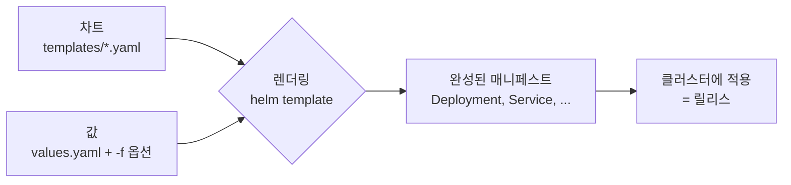

---

title: "Helm 템플릿 문법과 차트 설계, 그리고 실제로 걸렸던 함정들"
date: 2026-03-02
categories: [Kubernetes, Helm]
tags: [Kubernetes, Helm, Chart, Template, LibraryChart, ValuesSchema, GitOps]
layout: post
toc: true
math: true
mermaid: true

---

## 참고자료

- [Helm - Charts](https://helm.sh/docs/topics/charts/)
- [Helm - Chart Template Guide](https://helm.sh/docs/chart_template_guide/getting_started/)
- [Helm - Named Templates](https://helm.sh/docs/chart_template_guide/named_templates/)
- [Helm - Library Charts](https://helm.sh/docs/topics/library_charts/)
- [Helm - Subcharts and Global Values](https://helm.sh/docs/chart_template_guide/subcharts_and_globals/)
- [Helm - Schema Files](https://helm.sh/docs/topics/charts/#schema-files)
- [Helm - Built-in Objects](https://helm.sh/docs/chart_template_guide/builtin_objects/)
- [Go text/template 패키지](https://pkg.go.dev/text/template)
- [Sprig 함수 라이브러리](https://masterminds.github.io/sprig/)

---

## 배경

Helm을 처음 쓸 때는 `helm install`만 하면 되니까 편했다. 문제는 차트를 직접 만들기 시작하면서였다.

- `{{ }}` 안에 들어가는 `.Values`, `.Release`, `.Chart`는 어디서 오는 것인가?
- `nindent`와 `indent`는 왜 둘 다 있는가? 왜 자꾸 들여쓰기가 깨지는가?
- `with`를 쓰면 왜 갑자기 `.Values`를 못 찾는가?
- `_helpers.tpl` 파일 앞에 왜 `_`가 붙는가?
- 차트가 여러 개인데 공통 라벨 정의를 어떻게 한 곳에서 관리하는가?
- values 파일에 오타를 냈는데 왜 에러가 안 나고 그냥 무시되는가?

문법부터 하나씩 정리하고, 실제 차트를 만들면서 걸렸던 것들을 뒤에 붙였다. 회사 클러스터에서 쓰는 구성을 예로 들되 내부 이름은 일반화했다.

---

## 1. Helm이 실제로 하는 일

### 1.1 용어부터

Helm 문서를 읽으면 나오는 네 단어를 먼저 나눈다.

**차트(Chart).** 쿠버네티스 매니페스트를 만들어내는 템플릿 묶음이다. 디렉터리 하나가 차트 하나다.

**값(Values).** 그 템플릿에 넣을 변수들이다. `values.yaml`에 기본값을 두고, 설치할 때 덮어쓴다.

**렌더링(Rendering).** 템플릿과 값을 합쳐 실제 YAML을 만드는 과정이다.

**릴리스(Release).** 렌더링된 결과를 클러스터에 설치한 것이다. 같은 차트로 이름만 다르게 여러 번 설치할 수 있고, 그 각각이 릴리스다.



**여기서 중요한 사실이 하나 있다.** Helm은 클러스터에 대해 아무것도 모른 채로 렌더링한다. 텍스트를 만들어낼 뿐이다. 그래서 렌더링 결과가 유효한 쿠버네티스 매니페스트인지는 별도로 검증해야 한다. 이 얘기는 6장에서 다시 나온다.

### 1.2 차트 디렉터리 구조

```
my-chart/
├── Chart.yaml          # 차트 메타데이터 (이름, 버전, 타입)
├── values.yaml         # 기본값
├── values.schema.json  # 값의 형태를 검증하는 스키마 (선택)
├── templates/
│   ├── deployment.yaml
│   ├── service.yaml
│   ├── _helpers.tpl    # 재사용할 템플릿 조각
│   └── NOTES.txt       # 설치 후 출력될 안내문
└── charts/             # 의존하는 하위 차트
```

`templates/` 안의 파일은 전부 렌더링되어 클러스터에 적용된다. **단, 이름이 `_`로 시작하는 파일은 예외다.** 그래서 `_helpers.tpl`은 렌더링 결과에 포함되지 않는다. 여기에는 다른 템플릿에서 불러다 쓸 조각만 정의한다.

`NOTES.txt`도 예외인데, 이건 `_`가 붙지 않았지만 Helm이 특별하게 취급해서 설치 후 화면에 출력만 한다.

`Chart.yaml`의 `type` 필드가 뒤에 나올 라이브러리 차트를 가른다.

```yaml
apiVersion: v2
name: backend-api
description: 백엔드 API 서비스
type: application     # 또는 library
version: 1.0.17       # 차트 자체의 버전
appVersion: "1.0.3"   # 안에 담긴 애플리케이션 버전
```

`version`과 `appVersion`을 헷갈리기 쉽다. `version`은 **차트 파일이 바뀔 때** 올리고, `appVersion`은 **애플리케이션이 바뀔 때** 올린다. 템플릿만 고쳤으면 `version`만 올린다.

---

## 2. 템플릿 문법

Helm 템플릿은 Go의 `text/template` 문법에 Sprig라는 함수 라이브러리를 얹은 것이다. 그래서 문법 질문의 상당수는 Go 템플릿 문서에서 답이 나온다.

### 2.1 값을 꺼내는 자리, 내장 객체

`{{ }}` 안에서 쓸 수 있는 최상위 객체가 정해져 있다.

| 객체 | 무엇이 들어 있는가 | 예시 |
|---|---|---|
| `.Values` | values.yaml과 `-f`로 준 값들이 합쳐진 것 | `.Values.replicaCount` |
| `.Release` | 이번 설치에 관한 정보 | `.Release.Name`, `.Release.Namespace` |
| `.Chart` | `Chart.yaml`의 내용 | `.Chart.Name`, `.Chart.Version` |
| `.Capabilities` | 대상 클러스터의 버전과 지원 API | `.Capabilities.KubeVersion` |
| `.Files` | 차트 안의 템플릿이 아닌 파일 | `.Files.Get "config.txt"` |
| `.Template` | 지금 렌더링 중인 템플릿의 이름 | `.Template.Name` |

맨 앞의 `.` 하나가 **현재 스코프**를 뜻한다. 기본 스코프가 최상위이므로 `.Values`는 "최상위의 Values"라는 뜻이다. 이 점이 뒤의 `with`에서 문제가 된다.

```yaml
apiVersion: apps/v1
kind: Deployment
metadata:
  name: {{ .Release.Name }}-api
  namespace: {{ .Release.Namespace }}
spec:
  replicas: {{ .Values.replicaCount }}
```

### 2.2 파이프

`|`로 값을 함수에 넘긴다. 셸의 파이프와 같은 발상이다.

```yaml
name: {{ .Values.name | lower | trunc 63 | trimSuffix "-" }}
```

왼쪽 결과가 오른쪽 함수의 **마지막 인자**로 들어간다. `trunc 63`은 `trunc 63 <값>`이 된다.

자주 쓰는 함수들이다.

| 함수 | 하는 일 | 예시 |
|---|---|---|
| `default` | 값이 비어 있으면 기본값 | `{{ .Values.tag \| default "latest" }}` |
| `quote` | 따옴표로 감싼다 | `{{ .Values.port \| quote }}` |
| `toYaml` | 객체를 YAML 문자열로 | `{{ toYaml .Values.resources }}` |
| `nindent` | 줄바꿈 후 들여쓰기 | `{{ toYaml .Values.resources \| nindent 12 }}` |
| `trunc` | 길이 자르기 | `{{ .Values.name \| trunc 63 }}` |
| `required` | 값이 없으면 렌더링 실패 | `{{ required "tag는 필수" .Values.tag }}` |

`quote`가 필요한 이유를 짚고 넘어간다. YAML에서 `port: 8080`은 숫자이고 `port: "8080"`은 문자열이다. 환경 변수 값처럼 문자열이어야 하는 자리에 숫자가 들어가면 API 서버가 거부한다.

```yaml
env:
  - name: SERVER_PORT
    value: {{ .Values.service.port | quote }}   # quote 없으면 타입 에러
```

### 2.3 indent와 nindent의 차이

들여쓰기가 계속 깨지는 원인이 대부분 여기 있다.

`indent N`은 **모든 줄 앞에** 공백 N개를 붙인다. `nindent N`은 그 앞에 **줄바꿈을 먼저 넣고** 같은 일을 한다.

```yaml
# 잘못된 예
resources:
  {{ toYaml .Values.resources | indent 2 }}
```

이렇게 쓰면 첫 줄에 이미 `  `(템플릿 자리의 들여쓰기)가 있는데 `indent`가 2칸을 또 붙여서 첫 줄만 4칸이 된다.

```yaml
# 올바른 예
resources:
  {{- toYaml .Values.resources | nindent 4 }}
```

`nindent`가 줄바꿈부터 시작하므로 모든 줄이 똑같이 4칸이 된다. 그리고 앞의 `{{-`가 이 줄 앞의 공백과 줄바꿈을 지운다.

**`{{-`와 `-}}`** 를 설명하고 넘어간다. `{{-`는 왼쪽의 공백을, `-}}`는 오른쪽의 공백을 제거한다. 템플릿 문법 자체는 결과에 안 나오지만 그 자리의 줄바꿈과 들여쓰기는 남기 때문에, 이것들을 지우지 않으면 빈 줄이 잔뜩 생긴다.

규칙 하나로 외우면 편하다. **블록을 통째로 끼워 넣을 때는 `{{- ... | nindent N }}`을 쓰고, N은 그 필드보다 2 크게 잡는다.**

### 2.4 조건문

```yaml
{{- if .Values.autoscaling.enabled }}
# HPA를 쓸 때는 replicas를 쓰지 않는다
{{- else }}
replicas: {{ .Values.replicaCount }}
{{- end }}
```

`if`가 거짓으로 보는 값이 정해져 있다. `false`, `0`, 빈 문자열, 빈 리스트, 빈 맵, `nil`이다.

여기서 함정이 하나 있다. **`0`이 거짓이다.** `replicaCount: 0`으로 설정하고 `{{- if .Values.replicaCount }}`로 검사하면 그 블록이 통째로 빠진다. 값의 존재 여부를 확인하려면 다른 방법을 쓴다.

```yaml
{{- if hasKey .Values "replicaCount" }}
replicas: {{ .Values.replicaCount }}
{{- end }}
```

### 2.5 with, 스코프를 바꾸는 것

`with`는 조건문이면서 동시에 **`.`이 가리키는 대상을 바꾼다.** 이 두 번째 성질 때문에 헷갈린다.

```yaml
{{- with .Values.nodeSelector }}
nodeSelector:
  {{- toYaml . | nindent 2 }}
{{- end }}
```

블록 안에서 `.`은 이제 `.Values.nodeSelector`를 가리킨다. 그래서 `toYaml .`이 그 객체를 출력한다.

**문제는 블록 안에서 다른 값을 못 쓴다는 것이다.**

```yaml
{{- with .Values.nodeSelector }}
nodeSelector:
  {{- toYaml . | nindent 2 }}
# 여기서 .Values.replicaCount를 쓰면 실패한다
# .Values가 nodeSelector 안에 없기 때문
{{- end }}
```

해결책이 두 가지다. `$`를 쓰거나, `with`를 안 쓰는 것이다.

**`$`는 항상 최상위 스코프를 가리킨다.** 스코프가 아무리 깊어져도 `$`로 돌아올 수 있다.

```yaml
{{- with .Values.nodeSelector }}
nodeSelector:
  {{- toYaml . | nindent 2 }}
replicas: {{ $.Values.replicaCount }}   # $로 최상위 접근
{{- end }}
```

### 2.6 range, 반복

```yaml
env:
  {{- range $key, $value := .Values.env }}
  - name: {{ $key }}
    value: {{ $value | quote }}
  {{- end }}
```

맵을 돌 때는 `$key, $value`, 리스트를 돌 때는 값 하나만 받는다.

```yaml
{{- range .Values.ports }}
- containerPort: {{ . }}
{{- end }}
```

`range` 안에서도 `.`이 바뀐다. `with`와 같은 이유로 바깥 값이 필요하면 `$`를 쓴다.

리스트를 돌면서 다른 값을 참조하는 실제 예다.

```yaml
{{- $root := . -}}
{{- range $app := .Values.workloadApplications }}
---
apiVersion: argoproj.io/v1alpha1
kind: Application
metadata:
  name: {{ printf "%s-%s" $app.name $root.Values.environment }}
spec:
  source:
    path: {{ $app.chartPath }}
{{- end }}
```

맨 위에서 `$root := .`으로 최상위를 변수에 담아두는 패턴이다. `$`를 써도 되지만, 변수 이름을 붙이면 읽기가 낫다.

### 2.7 define과 include, 재사용

같은 조각을 여러 파일에서 쓰려면 이름을 붙여 정의한다. 이것을 **명명된 템플릿(named template)** 이라고 부르고, 보통 `_helpers.tpl`에 모아둔다.

```yaml
{{- define "my-chart.labels" -}}
app.kubernetes.io/name: {{ .Chart.Name }}
app.kubernetes.io/instance: {{ .Release.Name }}
app.kubernetes.io/managed-by: {{ .Release.Service }}
{{- end }}
```

쓸 때는 `include`를 쓴다.

```yaml
metadata:
  labels:
    {{- include "my-chart.labels" . | nindent 4 }}
```

**`template`이라는 키워드도 있는데 `include`를 써야 한다.** 이유는 하나다. `template`은 결과를 그 자리에 바로 출력하고 끝나서 **파이프에 넘길 수 없다.** `include`는 결과를 문자열로 돌려주므로 `nindent`를 이어 붙일 수 있다.

```yaml
{{ template "my-chart.labels" . | nindent 4 }}   # 동작하지 않는다
{{ include "my-chart.labels" . | nindent 4 }}    # 이렇게 쓴다
```

`include` 뒤의 `.`을 빠뜨리면 안 된다. 그 템플릿 안에서 쓸 스코프를 넘겨주는 것이다. 안 넘기면 `.Chart`나 `.Release`를 찾지 못한다.

**정의 이름은 전역이다.** 차트 A와 차트 B가 같은 이름으로 `define`하면 나중에 로드된 것이 이긴다. 그래서 이름 앞에 차트 이름을 붙이는 관례가 있다. `my-chart.labels`처럼.

---

## 3. 차트가 여러 개일 때: 라이브러리 차트

### 3.1 문제

서비스마다 차트를 따로 만들었다고 하자. 백엔드 여섯 개, 프론트엔드 두 개, 배치 하나면 차트가 아홉 개다.

공통 라벨 정의를 아홉 번 복사하면 어떻게 되는가. **하나를 고칠 때 아홉 개를 다 고쳐야 하고, 한 개를 빠뜨리면 그 서비스만 라벨이 달라진다.** 라벨이 다르면 Service selector, NetworkPolicy, 모니터링 쿼리가 전부 어긋난다.

### 3.2 라이브러리 차트가 무엇인가

**렌더링되는 리소스를 갖지 않고 명명된 템플릿만 제공하는 차트**다. `Chart.yaml`의 `type`을 `library`로 둔다.

```yaml
apiVersion: v2
name: platform-helpers
description: 공유 Helm helpers (라벨, 이름, CORS 스펙)
type: library
version: 1.0.0
```

일반 차트와 다른 점이 둘이다. **직접 설치할 수 없고**, **`templates/` 안에 `define`만 들어간다.**

쓸 차트에서는 의존성으로 선언한다.

```yaml
# Chart.yaml
dependencies:
  - name: platform-helpers
    version: 1.0.0
    repository: file://../platform-helpers
```

그러면 그 차트의 템플릿에서 `include "platform-helpers.labels"`를 부를 수 있다.

### 3.3 실제로 쓰는 라이브러리 차트

운영 중인 라이브러리 차트에는 네 가지가 들어 있다.

```
{{- /* 차트 이름 (nameOverride > Chart.Name) */ -}}
{{- define "platform.name" -}}
{{- default .Chart.Name .Values.nameOverride | trunc 63 | trimSuffix "-" }}
{{- end }}

{{- /* 전체 이름 (fullnameOverride > Release.Name) */ -}}
{{- define "platform.fullname" -}}
{{- if .Values.fullnameOverride }}
{{- .Values.fullnameOverride | trunc 63 | trimSuffix "-" }}
{{- else }}
{{- .Release.Name | trunc 63 | trimSuffix "-" }}
{{- end }}
{{- end }}

{{- /* 공통 라벨 */ -}}
{{- define "platform.labels" -}}
helm.sh/chart: {{ include "platform.chart" . }}
app.kubernetes.io/name: {{ include "platform.name" . }}
app.kubernetes.io/instance: {{ .Release.Name }}
app.kubernetes.io/managed-by: {{ .Release.Service }}
app: {{ include "platform.name" . }}
env: {{ .Values.global.env | default "dev" }}
team: {{ .Values.global.team | default "mis" }}
{{- with .Values.global.commonLabels }}
{{ toYaml . }}
{{- end }}
{{- end }}
```

`trunc 63`이 반복해서 나오는 이유가 있다. **쿠버네티스 라벨 값과 대부분의 이름 필드가 63자 제한이다.** 릴리스 이름이 길면 잘려야 하고, 자른 뒤 끝에 `-`가 남으면 유효하지 않은 이름이 되므로 `trimSuffix "-"`가 뒤따른다.

네 번째는 게이트웨이 정책에 쓰는 CORS 설정 블록이다. 이건 4장에서 다룬다.

### 3.4 라이브러리 차트를 쓸 때 걸린 것

**의존성 차트는 `charts/` 디렉터리에 복사본으로 들어간다.** `file://`로 참조해도 `helm dependency update`를 하면 원본이 복사된다.

문제는 원본을 고치고 복사본을 갱신하지 않으면 **원본과 실제 렌더링에 쓰이는 것이 달라진다**는 점이다. 그리고 그 차이가 조용히 남는다.

그래서 두 가지를 붙였다. 복사를 자동화하는 make 타깃과, 동기화되지 않은 상태로는 커밋이 안 되게 막는 pre-commit 훅이다.

```makefile
HELPERS_SRC := charts/platform-helpers
HELPERS_DST := charts/shared/charts/platform-helpers \
               charts/routes/charts/platform-helpers

sync-helpers:
	@for dst in $(HELPERS_DST); do \
	  rm -rf $$dst && mkdir -p $$dst && cp -r $(HELPERS_SRC)/. $$dst/; \
	done

helpers-sync-check:
	@for dst in $(HELPERS_DST); do \
	  diff -r $(HELPERS_SRC) $$dst >/dev/null || \
	    { echo "helpers 미동기화: $$dst. 'make sync-helpers' 실행 필요"; exit 1; }; \
	done
```

```yaml
# .pre-commit-config.yaml
- id: helpers-sync-check
  name: helpers chart sync check (truth ↔ chart copies)
  entry: make helpers-sync-check
  language: system
  pass_filenames: false
  files: '^(charts/platform-helpers|charts/(shared|routes)/charts/platform-helpers)/'
```

여기서 배운 것은 **"단일 출처"라고 정해놓는 것만으로는 부족하다**는 점이다. 그 규칙을 어겼을 때 자동으로 막히지 않으면 결국 어긋난다.

---

## 4. global, 여러 차트에 같은 값을 넘기기

### 4.1 global이 무엇인가

Helm에는 `global`이라는 예약된 키가 있다. **부모 차트의 `.Values.global`은 모든 하위 차트에서도 `.Values.global`로 보인다.**

```yaml
# 부모 values.yaml
global:
  imageRegistry: registry.internal.example
  imagePullSecrets:
    - name: registry-secret
```

하위 차트에서 그대로 쓴다.

```yaml
image: "{{ .Values.global.imageRegistry }}/{{ .Values.image.repository }}:{{ .Values.image.tag }}"
```

레지스트리 주소처럼 **모든 차트가 같은 값을 써야 하는 것**을 여기에 둔다. 차트마다 따로 적으면 하나만 다른 값이 되기 쉽다.

### 4.2 standalone 차트에도 global stub을 둔다

차트를 각각 독립된 ArgoCD Application으로 배포하면 부모 차트가 없다. 그러면 `.Values.global`이 존재하지 않아서 `helm lint` 단계에서 nil 참조로 실패한다.

그래서 각 차트의 `values.yaml`에 **비어 있는 global 블록**을 둔다.

```yaml
# standalone 차트용 global stub. 실제 값은 부모가 주입한다.
global:
  imageRegistry: ""
  imagePullSecrets: []
  podSecurityContext:
    runAsNonRoot: true
    seccompProfile:
      type: RuntimeDefault
  securityContext:
    allowPrivilegeEscalation: false
    readOnlyRootFilesystem: true
    capabilities:
      drop:
        - ALL
  commonLabels: {}
  otel:
    enabled: false
    endpoint: ""
```

여기에 보안 기본값을 함께 넣어둔 이유가 있다. **부모가 주입을 빠뜨려도 안전한 쪽으로 렌더링된다.** 관측성 설정은 반대로 `enabled: false`와 빈 endpoint를 기본으로 둔다. 새 환경에서 override를 빠뜨렸을 때 `localhost`로 데이터를 보내 조용히 유실되는 것을 막기 위해서다.

기본값을 정할 때의 기준을 하나로 정리하면 이렇다. **빠뜨렸을 때 조용히 잘못되는 쪽이 아니라, 눈에 띄게 안 되는 쪽을 기본값으로 둔다.**

---

## 5. values.schema.json, 오타를 렌더링 전에 잡기

### 5.1 문제

values 파일에 오타를 내면 어떻게 되는가.

```yaml
replicaCount: 3
resouces:          # resources 오타
  limits:
    memory: 2Gi
```

**아무 일도 일어나지 않는다.** Helm은 `.Values.resources`를 찾다가 없으니 빈 값으로 렌더링하고, 결과 Deployment에 `resources` 블록이 없다. 에러도 경고도 없다.

배포는 성공하고, 리소스 제한만 사라진다. 이런 종류의 실수는 나중에 노드가 메모리 부족으로 죽고 나서야 발견된다.

### 5.2 스키마로 막기

차트 루트에 `values.schema.json`을 두면 Helm이 렌더링 전에 값을 검증한다. JSON Schema 형식이다.

```json
{
  "$schema": "https://json-schema.org/draft-07/schema#",
  "title": "workload parent values",
  "type": "object",
  "additionalProperties": false,
  "properties": {
    "project": { "type": "string" },
    "environment": { "type": "string", "enum": ["dev", "stg", "live"] },
    "autoSync": {
      "type": "object",
      "additionalProperties": false,
      "properties": {
        "enabled": { "type": "boolean" },
        "prune": { "type": "boolean" },
        "selfHeal": { "type": "boolean" }
      }
    },
    "workloadApplications": {
      "type": "array",
      "items": {
        "type": "object",
        "additionalProperties": false,
        "required": ["name", "chartPath", "syncWave"],
        "properties": {
          "name": { "type": "string" },
          "chartPath": { "type": "string" },
          "syncWave": { "type": "string" }
        }
      }
    }
  }
}
```

**`"additionalProperties": false`가 핵심이다.** 스키마에 없는 키가 들어오면 거부한다. 오타는 정의되지 않은 키이므로 여기서 걸린다.

```
Error: values don't meet the specifications of the schema(s) in the following chart(s):
workload-parent:
- (root): Additional property resouces is not allowed
```

`"enum"`도 유용하다. `environment`에 `prod`라고 쓰면(실제 값은 `live`인데) 렌더링 전에 막힌다.

`"required"`는 반대 방향이다. 빠뜨리면 안 되는 키를 지정한다.

### 5.3 스키마를 어디까지 쓸 것인가

전부 정의하려고 하면 values가 바뀔 때마다 스키마도 고쳐야 해서 부담이 된다. 그래서 기준을 이렇게 잡았다.

**최상위 키는 전부 정의하고 `additionalProperties: false`를 건다.** 오타는 거의 최상위나 두 번째 깊이에서 난다.

**값의 형태가 중요한 곳만 깊이 정의한다.** 위 예에서 `workloadApplications` 배열은 항목마다 `name`, `chartPath`, `syncWave`가 반드시 있어야 하므로 `required`를 걸었다. 반면 `globalOverrides`는 `{ "type": "object" }`로만 두었다. 안에 뭐가 들어갈지가 자주 바뀌기 때문이다.

---

## 6. 렌더링 결과를 검증하기

1.1절에서 말한 것으로 돌아간다. **Helm은 클러스터를 모르고 텍스트만 만든다.** 그래서 렌더링이 성공했다는 것과 그 결과가 클러스터에 적용된다는 것은 다른 사실이다.

검증을 네 단계로 나눠 붙였다.

### 6.1 helm lint

차트 구조와 템플릿 문법을 본다. 렌더링이 되는지, `Chart.yaml`에 필수 필드가 있는지를 확인한다.

```bash
for chart in $(cat scripts/chart-dirs.txt); do
  for env in dev stg live; do
    helm lint $chart -f $chart/values-$env.yaml || exit 1
  done
done
```

**환경별 values를 각각 넣어 돌리는 것**이 요점이다. `values.yaml`만으로는 통과하는데 `values-live.yaml`에서 깨지는 경우가 있다.

### 6.2 kubeconform, 스키마 검증

`helm lint`는 결과가 유효한 쿠버네티스 리소스인지 보지 않는다. `apiVersion`을 잘못 쓰거나 없는 필드를 넣어도 통과한다.

kubeconform은 렌더링 결과를 쿠버네티스 API 스키마와 대조한다.

```bash
helm template "$chart" -f "$chart/values-$env.yaml" \
  | kubeconform -strict -summary \
      -schema-location default \
      -schema-location 'https://raw.githubusercontent.com/datreeio/CRDs-catalog/main/{{.Group}}/{{.ResourceKind}}_{{.ResourceAPIVersion}}.json'
```

`-schema-location`을 두 개 준 이유가 있다. 첫 번째는 쿠버네티스 기본 리소스용이고, 두 번째는 **CRD로 추가된 리소스용**이다. Gateway API의 `HTTPRoute`나 ArgoCD의 `Application`은 쿠버네티스 기본 스키마에 없으므로 별도 저장소에서 가져와야 한다.

`-strict`는 스키마에 없는 필드를 에러로 만든다. 이게 없으면 필드명 오타가 그냥 통과한다.

### 6.3 정책 엔진으로 미리 재현하기

여기까지 통과해도 클러스터의 admission 정책에서 막힐 수 있다. 그러면 배포가 중간에 멈춘다.

그래서 렌더링 결과를 **정책 엔진으로 로컬에서 먼저 검사**한다.

```bash
# 렌더된 워크로드의 pod template을 Pod로 합성해 정책 검사
helm template "$chart" -f "$chart/values-dev.yaml" > /tmp/rendered.yaml
kyverno apply clusters/dev/kyverno-policies/ --resource /tmp/rendered.yaml
```

admission에서 막히는 상황을 커밋 단계로 당겨오는 것이다. 배포 도중에 발견하면 이미 기존 Pod가 종료된 뒤일 수 있다.

### 6.4 차트 사이의 참조 정합성

차트를 서비스별로 쪼개면 새 문제가 생긴다. **A 차트가 만드는 Service를 B 차트의 HTTPRoute가 참조하는데, 그 이름이 어긋나도 각 차트는 따로 렌더링해서 통과한다.**

```bash
# HTTPRoute의 backendRefs가 실제 Service 이름과 맞는지
helm template charts/routes -f charts/routes/values-dev.yaml \
  | yq '.. | select(has("backendRefs")) | .backendRefs[].name' | sort -u > /tmp/refs.txt

for c in charts/backend-*; do
  helm template "$c" -f "$c/values-dev.yaml" \
    | yq 'select(.kind == "Service") | .metadata.name'
done | sort -u > /tmp/services.txt

comm -23 /tmp/refs.txt /tmp/services.txt   # 참조는 있는데 서비스가 없는 것
```

이 검사를 넣기 전에는 라우트가 존재하지 않는 서비스를 가리키는 상태로 머지된 적이 있었다. 렌더링도 되고 적용도 되는데 요청만 503이 났다.

### 6.5 이미지가 실제로 있는지

폐쇄망 환경에서 자주 겪는 문제다. 매니페스트에 적힌 이미지 태그가 그 환경의 레지스트리에 아직 미러링되지 않았으면 배포 시점에 `ImagePullBackOff`가 난다.

```bash
# 렌더링 결과에서 이미지 참조를 뽑아 레지스트리에 존재하는지 확인
helm template "$chart" -f "$chart/values-$env.yaml" \
  | yq '.. | select(has("image")) | .image' | sort -u \
  | while read -r img; do
      repo="${img%:*}"; tag="${img##*:}"
      curl -sf -u "$REG_USER:$REG_PASS" \
        "https://$REGISTRY/api/v2.0/projects/.../artifacts/$tag" >/dev/null \
        || echo "MISSING: $img"
    done
```

이것도 pre-commit 훅으로 걸어두었다. 자격증명이 없는 환경에서는 건너뛰도록 만들어서 로컬 개발을 막지 않게 했다.

### 6.6 전체를 pre-commit으로 묶기

지금까지의 검사를 커밋 시점에 자동 실행한다.

```yaml
repos:
  - repo: https://github.com/pre-commit/pre-commit-hooks
    rev: v4.6.0
    hooks:
      - id: trailing-whitespace
        exclude: '^charts/.+/templates/.+\.yaml$'   # 템플릿 출력은 그대로 둔다
      - id: check-yaml
        args: [--allow-multiple-documents]
        exclude: '^charts/.+/templates/.+\.yaml$'   # {{ }}는 YAML 파서가 못 읽는다
      - id: detect-private-key

  - repo: local
    hooks:
      - id: kubeconform
        name: kubeconform (helm template + K8s/CRD schema)
        entry: scripts/kubeconform.sh
        language: script
        pass_filenames: false
      - id: helpers-sync-check
        entry: make helpers-sync-check
        language: system
        pass_filenames: false
      - id: policy-sweep
        entry: scripts/policy-sweep.sh
        language: script
        pass_filenames: false
```

`templates/` 아래 파일을 `check-yaml`에서 제외한 것이 중요하다. **Helm 템플릿은 유효한 YAML이 아니다.** `{{ }}`가 들어 있으므로 YAML 파서가 읽지 못한다. 이걸 제외하지 않으면 모든 커밋이 실패한다.

---

## 7. 실제로 걸렸던 함정들

### 7.1 빈 map이 만드는 영구 diff

렌더링 결과에 이런 것이 있으면 문제가 된다.

```yaml
metadata:
  annotations: {}
```

**API 서버는 빈 map을 저장하지 않는다.** 그래서 적용한 뒤 다시 읽으면 `annotations` 필드 자체가 없다. GitOps 도구는 "git에는 있는데 클러스터에는 없다"고 판단하고 계속 동기화를 시도한다.

증상은 이렇다. 동기화가 끝났다고 나왔다가 잠시 뒤 다시 `OutOfSync`가 된다. 무한 반복한다.

원인은 대체로 이런 템플릿이다.

```yaml
annotations:
  {{- toYaml .Values.annotations | nindent 2 }}
```

`.Values.annotations`가 비어 있으면 `{}`가 렌더링된다. `with`로 감싸면 해결된다.

```yaml
{{- with .Values.annotations }}
annotations:
  {{- toYaml . | nindent 2 }}
{{- end }}
```

값이 없으면 `annotations` 키 자체가 나오지 않는다.

**상용 차트를 도입하거나 버전을 올릴 때 이걸 확인해야 한다.** 남이 만든 차트에도 같은 패턴이 있을 수 있다.

```bash
# 빈 map이 렌더링되는지 검사
helm template "$chart" -f "$chart/values-dev.yaml" | grep -nE ':\s*\{\}\s*$'
```

### 7.2 YAML이 정수를 실수로 직렬화한다

Gateway API의 `SecurityPolicy`에 CORS `maxAge`를 설정할 때 겪은 일이다.

```yaml
cors:
  maxAge: 3600
```

이걸 Helm이 렌더링하면서 `3600`이 `3.6e+03`으로 나가는 경우가 있었다. Go 템플릿이 값을 부동소수점으로 다루고 그것을 다시 문자열로 만들 때 지수 표기가 나온 것이다. CRD 검증에서 거부됐다.

해결은 문자열로 명시하는 것이다.

```yaml
maxAge: {{ .Values.cors.maxAge | default "1h" | quote }}
```

숫자로 보이지만 문자열이어야 하는 필드가 이것 말고도 있다. `Duration` 타입 필드가 대체로 그렇다.

### 7.3 하위 정책이 상위 정책을 통째로 덮어쓴다

Gateway API에서 게이트웨이 수준에 CORS 정책을 걸어두고, 특정 라우트에만 인증 정책을 추가로 걸었더니 그 라우트의 CORS가 통째로 사라졌다.

**라우트 수준 정책이 게이트웨이 수준 정책을 필드 단위로 병합하지 않고 전체를 대체하기 때문이다.**

이 사실을 알고 나서 해결한 방법은, CORS 정의를 라이브러리 차트에 넣고 **모든 라우트 정책에 반드시 포함시키도록** 만든 것이다.

```yaml
{{- /*
  SecurityPolicy.spec에 인라인할 CORS 블록.
  라우트 수준 정책이 게이트웨이 수준 정책을 통째로 대체하므로
  모든 라우트 정책에 이 블록이 들어가야 한다.
*/ -}}
{{- define "platform.corsSpec" -}}
{{- $cors := .Values.security.cors -}}
cors:
  allowOrigins:
    {{- range $cors.origins }}
    - {{ . | quote }}
    {{- end }}
  allowMethods:
    {{- range $cors.methods }}
    - {{ . }}
    {{- end }}
  allowCredentials: {{ $cors.allowCredentials | default true }}
  maxAge: {{ $cors.maxAge | default "1h" }}
{{- end }}
```

템플릿 위의 주석이 "왜 이렇게 해야 하는지"를 적고 있다는 점이 중요하다. 이유를 안 적어두면 다음 사람이 중복이라고 생각해서 지운다.

### 7.4 서브차트로 쪼개면 이름이 바뀐다

여러 서비스를 하나의 우산 차트로 묶어 배포하다가, 서비스별 차트로 쪼개서 각각 배포하도록 바꾼 적이 있다.

여기서 문제가 생겼다. 리소스 이름이 보통 `{릴리스명}-{차트명}` 형태로 만들어지는데, **릴리스가 쪼개지면서 릴리스명이 바뀌었다.** Service 이름이 바뀌니 그것을 참조하던 HTTPRoute가 전부 끊겼다.

해결은 쪼갠 뒤에도 **릴리스 이름을 원래 우산 차트의 것으로 고정**하는 것이었다.

```yaml
helm:
  {{- if $app.shareUmbrellaRelease }}
  releaseName: {{ printf "platform-%s" $root.Values.environment }}
  {{- end }}
```

여기서 얻은 교훈은 **리소스 이름이 릴리스 이름에 의존하면 릴리스 구조를 바꿀 때 이름이 따라 바뀐다**는 것이다. 외부에서 참조되는 이름은 릴리스와 무관하게 고정하는 편이 안전하다.

### 7.5 helm template과 실제 적용 결과는 다를 수 있다

`helm template`은 클러스터에 접속하지 않는다. 그래서 `.Capabilities.APIVersions`가 실제 클러스터와 다를 수 있다.

```yaml
{{- if .Capabilities.APIVersions.Has "gateway.networking.k8s.io/v1" }}
# Gateway API 리소스
{{- end }}
```

이 조건은 `helm template`에서 항상 거짓이 된다. 실제 클러스터를 조회하려면 `helm template --validate`나 `helm install --dry-run`을 써야 한다.

CI에서는 클러스터 접속 없이 검증하는 것이 보통이므로, **이런 조건부 렌더링을 쓰면 CI가 검증하지 못하는 분기가 생긴다.** 되도록 값으로 켜고 끄는 편이 낫다.

```yaml
{{- if .Values.gatewayApi.enabled }}
```

---

## 8. 차트를 설계할 때의 기준

지금까지의 내용을 차트를 새로 만들 때의 판단 기준으로 정리하면 이렇다.

### 차트를 하나로 묶을 것인가 쪼갤 것인가

**함께 배포되어야 하면 하나로, 따로 배포되어도 되면 쪼갠다.**

서비스마다 배포 주기가 다르면 쪼개는 것이 맞다. 하나를 배포할 때 나머지 여덟 개까지 동기화 대상이 되면 영향 범위가 불필요하게 커진다.

대신 쪼개면 7.4처럼 이름과 참조 문제가 생기고, 차트 사이의 정합성을 별도로 검사해야 한다.

### 무엇을 values로 뺄 것인가

**환경마다 달라지는 것만** 뺀다. 모든 것을 values로 빼면 values 파일이 템플릿보다 길어지고, 무엇이 실제로 바뀌는 값인지 알 수 없게 된다.

환경마다 달라지는 것: 이미지 태그, 복제본 수, 리소스 크기, 외부 엔드포인트, 도메인.

달라지지 않는 것: 포트 이름, 볼륨 마운트 경로, probe 경로. 이건 템플릿에 두는 편이 낫다.

다만 예외가 있다. probe 설정을 템플릿에 하드코딩했다가 환경별로 타임아웃을 다르게 잡아야 하는 상황이 생겨서 결국 values로 뺐다. **"이 값은 절대 안 바뀐다"는 판단이 틀릴 수 있는 항목은 처음부터 values에 두는 편이 비용이 적다.**

### 기본값을 어느 쪽으로 둘 것인가

4.2절에서 정리한 그대로다. **빠뜨렸을 때 조용히 잘못되는 쪽이 아니라, 눈에 띄게 안 되는 쪽**을 기본값으로 둔다.

보안 설정은 잠긴 쪽이 기본값이고, 관측성 엔드포인트는 빈 값이 기본값이다. 전자는 override를 빠뜨리면 권한이 없어서 실패하고, 후자는 override를 빠뜨리면 데이터가 안 나와서 바로 눈에 띈다.

### 주석에 무엇을 쓸 것인가

**무엇을 하는지가 아니라 왜 그렇게 했는지를 쓴다.** 무엇을 하는지는 코드가 이미 말하고 있다.

```yaml
# 나쁜 주석
# maxSurge를 0으로 설정
maxSurge: 0

# 좋은 주석
# maxSurge:0. 복제본이 1개라 surge pod 없이 롤아웃한다.
# quota 데드락을 피하기 위한 것이고, 대가로 배포 중 짧은 다운타임이 있다.
# 무중단이 필요하면 복제본을 늘리고 maxSurge:1로 바꾼다.
maxSurge: 0
```

7.3에서 본 것처럼, 이유가 없는 설정은 다음 사람이 정리 대상으로 판단해서 지운다.

---

## 정리하며

처음 던진 질문들에 대한 답이다.

**`.Values`, `.Release`, `.Chart`는 어디서 오는가.** Helm이 렌더링할 때 넘겨주는 내장 객체다. `.Values`는 values 파일들이 합쳐진 것, `.Release`는 이번 설치 정보, `.Chart`는 `Chart.yaml`의 내용이다.

**`indent`와 `nindent`는 왜 둘 다 있는가.** `nindent`는 줄바꿈을 먼저 넣고 들여쓴다. 블록을 통째로 끼워 넣을 때는 거의 항상 `nindent`가 맞다.

**`with`를 쓰면 왜 `.Values`를 못 찾는가.** `with`가 `.`이 가리키는 대상을 바꾸기 때문이다. 최상위로 돌아가려면 `$`를 쓴다.

**`_helpers.tpl` 앞의 `_`는 무엇인가.** `templates/` 안에서 `_`로 시작하는 파일은 렌더링 결과에 포함되지 않는다. 그래서 재사용할 조각만 정의하는 자리로 쓴다.

**공통 정의를 어떻게 한 곳에서 관리하는가.** `type: library` 차트를 만들어 `define`만 넣고, 쓰는 차트들이 의존성으로 참조한다. 다만 의존성은 복사본으로 들어가므로 동기화 검사를 pre-commit으로 강제해야 실제로 단일 출처가 유지된다.

**values 오타는 왜 에러가 안 나는가.** Helm은 없는 키를 빈 값으로 처리한다. `values.schema.json`에 `additionalProperties: false`를 걸면 렌더링 전에 막힌다.

정리하고 나서 남은 것은 문법이 아니라 **"렌더링이 성공했다"와 "클러스터에서 동작한다" 사이에 몇 겹의 검증이 필요한가**였다. `helm lint`는 문법만 보고, kubeconform은 스키마만 보고, 정책 엔진은 admission만 보고, 차트 간 참조는 아무도 안 본다. 그 각각을 따로 붙여야 배포 시점이 아니라 커밋 시점에 걸린다.
