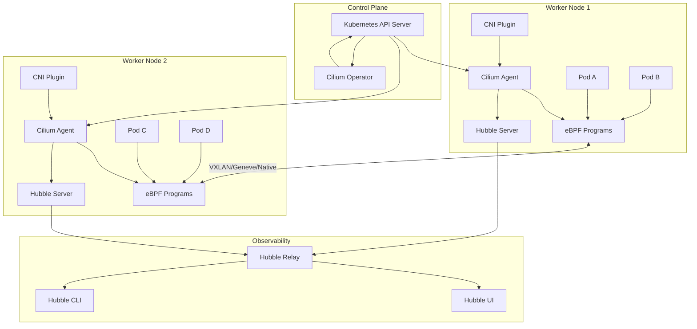
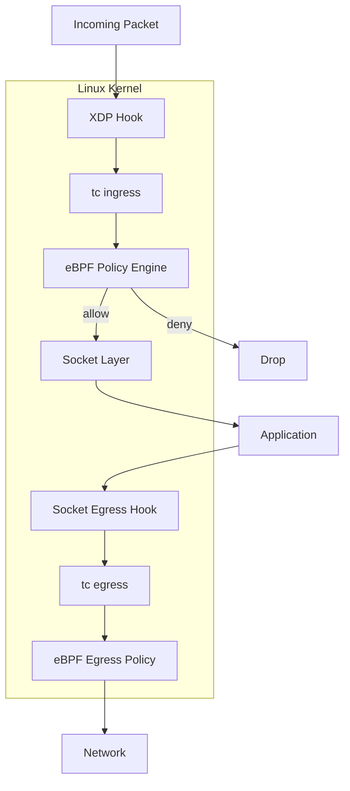
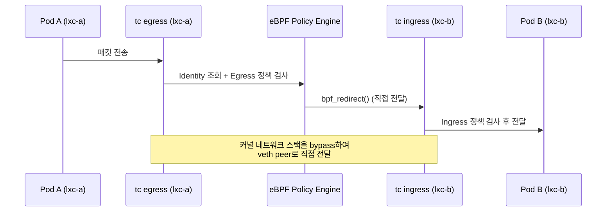
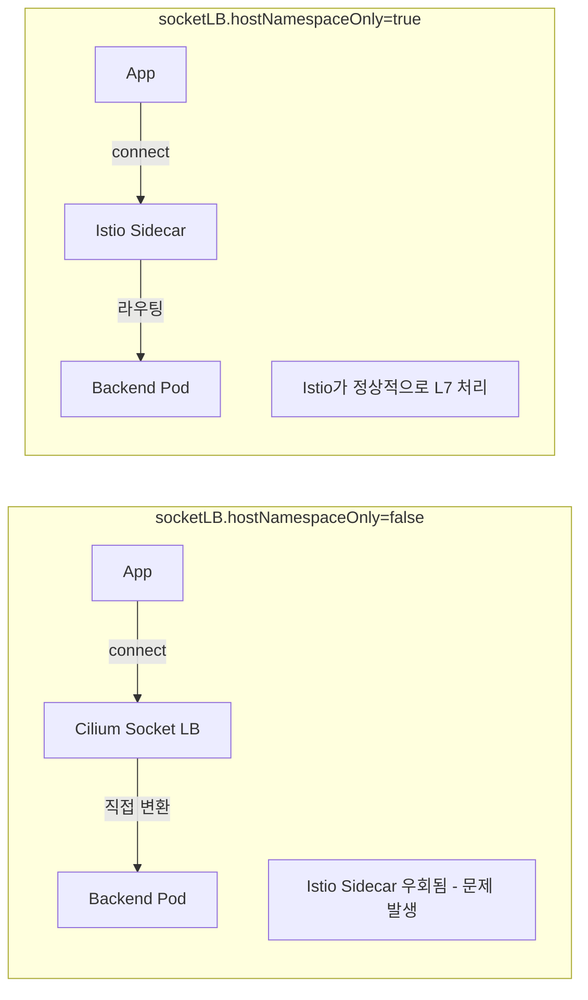
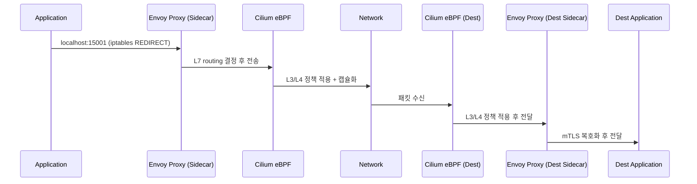
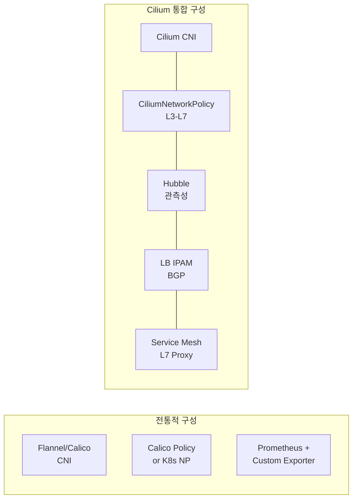
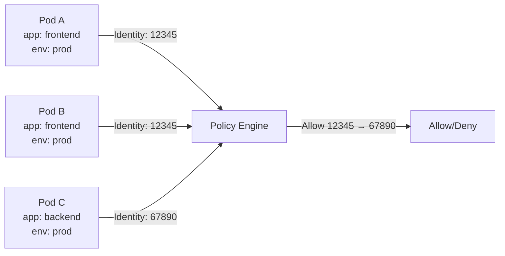
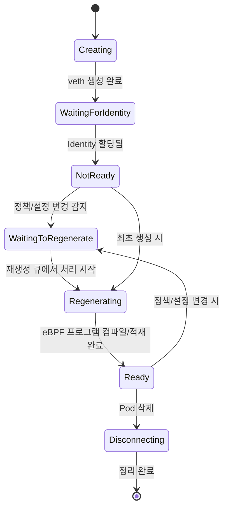
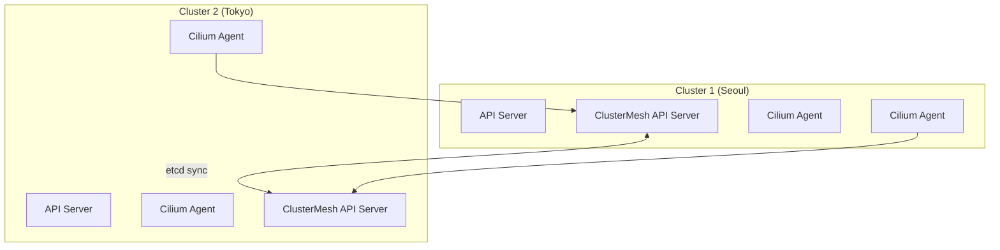

## 1. Cilium 소개

### 1.1 Cilium이란 무엇인가

> **원문 ([Cilium Docs - Introduction](https://docs.cilium.io/en/stable/overview/intro/)):**
> "Cilium is open source software for transparently securing the network connectivity between application services deployed using Linux container management platforms like Docker and Kubernetes. At the heart of Cilium is a new Linux kernel technology called eBPF, which enables the dynamic insertion of powerful security visibility and control logic within Linux itself."

**번역:** Cilium은 Docker, Kubernetes 같은 Linux 컨테이너 관리 플랫폼에서 배포된 애플리케이션 서비스 간 네트워크 연결을 투명하게 보호하는 오픈소스 소프트웨어다. Cilium의 핵심에는 eBPF라는 새로운 Linux 커널 기술이 있으며, 이를 통해 Linux 자체 내부에 강력한 보안 가시성과 제어 로직을 동적으로 삽입할 수 있다.

Cilium은 단순한 CNI 플러그인이 아니다. 네트워킹, 보안, 관측성을 하나의 데이터플레인에서 통합 처리하는 **eBPF 기반 Kubernetes 네트워킹 플랫폼**이다. 전통적인 iptables 기반 네트워크 스택을 우회하여 커널 레벨에서 패킷을 처리하므로, 규칙 수에 관계없이 일정한 성능을 보장한다.

### 1.2 왜 eBPF인가

> **원문 ([Cilium Docs - Introduction](https://docs.cilium.io/en/stable/overview/intro/)):**
> "The development of modern datacenter applications has shifted to a service-oriented architecture often referred to as microservices, wherein a large application is split into small functional services that communicate with each other via APIs using lightweight protocols like HTTP."

**번역:** 현대 데이터센터 애플리케이션의 개발은 마이크로서비스라 불리는 서비스 지향 아키텍처로 이동했다. 하나의 대규모 애플리케이션이 작은 기능적 서비스로 분할되며, 이들은 HTTP 같은 경량 프로토콜을 사용하는 API를 통해 서로 통신한다.

마이크로서비스 환경에서 전통적인 Linux 네트워킹의 한계는 명확하다.

**iptables의 한계:**
- 규칙 수가 O(n)으로 증가하여 수천 개의 서비스가 있는 클러스터에서 성능이 선형적으로 저하된다
- 규칙 업데이트 시 전체 테이블을 재작성해야 하므로 latency spike가 발생한다
- L3/L4(IP, Port)까지만 판별 가능하여 HTTP path, gRPC method 같은 L7 수준의 정책을 적용할 수 없다
- 규칙이 IP 기반이므로 Pod의 동적 생성/삭제에 대응하기 어렵다

**eBPF의 장점:**
- 커널 내부에서 직접 실행되므로 컨텍스트 스위칭 오버헤드가 없다
- O(1) 해시맵 조회로 규칙 수에 무관한 일정한 성능을 보장한다
- L3부터 L7까지 모든 계층의 패킷을 검사/조작할 수 있다
- IP가 아닌 Identity(라벨 기반)로 정책을 매칭하므로 동적 환경에 적합하다
- JIT(Just-In-Time) 컴파일을 통해 네이티브 코드 수준의 실행 속도를 달성한다

---

## 2. 핵심 컴포넌트 (Component Overview)

Cilium은 여러 컴포넌트가 유기적으로 연동되어 동작한다. 각 컴포넌트의 역할과 상호작용을 정확히 이해하는 것이 운영의 기본이다.

### 2.1 전체 아키텍처



### 2.2 Cilium Agent

> **원문 ([Cilium Docs - Component Overview](https://docs.cilium.io/en/stable/overview/component-overview/)):**
> "The Cilium agent (cilium-agent) runs on each node in the cluster."
> "The agent accepts configuration via Kubernetes or APIs that describes networking, service load-balancing, network policies, and visibility & monitoring requirements."
> "The Cilium agent listens for events from orchestration systems such as Kubernetes to learn when containers or workloads are started and stopped."
> "It manages the eBPF programs which the Linux kernel uses to control all network access in / out of those containers."

**번역:** Cilium Agent(cilium-agent)는 클러스터의 각 노드에서 실행된다. Agent는 Kubernetes 또는 API를 통해 네트워킹, 서비스 로드 밸런싱, 네트워크 정책, 가시성 및 모니터링 요구사항을 기술하는 설정을 수신한다. Cilium Agent는 Kubernetes 같은 오케스트레이션 시스템의 이벤트를 수신하여 컨테이너나 워크로드가 시작되거나 중지되는 시점을 학습한다. Agent는 Linux 커널이 해당 컨테이너의 모든 네트워크 접근을 제어하는 데 사용하는 eBPF 프로그램을 관리한다.

Cilium Agent는 각 노드에서 DaemonSet으로 실행되는 핵심 데몬이다.

**주요 역할:**
- Kubernetes API Server로부터 Pod, Service, NetworkPolicy, CiliumNetworkPolicy 등의 이벤트를 Watch하여 수신한다
- 수신된 정책과 서비스 정보를 기반으로 eBPF 프로그램을 컴파일하고 커널에 적재(attach)한다
- 클러스터 내 모든 Endpoint에 대한 **Identity**를 관리한다. Identity는 Pod의 라벨 집합을 기반으로 부여되며, 동일한 라벨 조합을 가진 모든 Pod는 동일한 Identity를 공유한다
- eBPF Map을 통해 정책, Identity, 서비스 엔드포인트 등의 상태를 커널 공간에서 관리한다
- IPAM(IP Address Management)을 통해 Pod에 IP를 할당한다

Agent는 노드 레벨에서 동작하므로, Agent가 다운되면 해당 노드의 모든 네트워크 정책과 서비스 라우팅이 영향을 받는다. 단, 이미 적재된 eBPF 프로그램은 커널에 남아 있으므로 기존 연결은 유지된다.

### 2.3 Cilium Operator

> **원문 ([Cilium Docs - Component Overview](https://docs.cilium.io/en/stable/overview/component-overview/)):**
> "The Cilium Operator is responsible for managing duties in the cluster which should logically be handled once for the entire cluster."
> "The Cilium operator is not in the critical path for any forwarding or network policy decision."
> "A cluster will generally continue to function if the operator is temporarily unavailable."

**번역:** Cilium Operator는 클러스터 전체에서 논리적으로 한 번만 처리되어야 하는 작업을 관리하는 역할을 담당한다. Cilium Operator는 포워딩이나 네트워크 정책 결정의 크리티컬 패스에 있지 않다. Operator가 일시적으로 사용할 수 없더라도 클러스터는 일반적으로 계속 동작한다.

Cilium Operator는 클러스터 범위의 작업을 담당하는 컴포넌트다. 모든 노드에서 동일한 작업을 중복 수행하는 것을 방지하기 위해 존재한다.

**주요 역할:**
- **IPAM 관리**: 클러스터 전체의 IP 주소 풀을 관리하고, 노드별 CIDR을 할당한다
- **Identity Garbage Collection**: 더 이상 사용되지 않는 Identity를 주기적으로 정리한다
- **CRD 관리**: CiliumNetworkPolicy, CiliumEndpoint 등의 CRD 상태를 관리한다
- **노드 검색(Node Discovery)**: 새로운 노드 합류 시 초기 설정을 수행한다
- **Heartbeat**: 클러스터 상태를 주기적으로 확인한다

Operator는 Deployment로 배포되며, 고가용성을 위해 Leader Election을 통한 Active/Standby 구성이 가능하다.

### 2.4 CNI Plugin

> **원문 ([Cilium Docs - Component Overview](https://docs.cilium.io/en/stable/overview/component-overview/)):**
> "The CNI plugin (cilium-cni) is invoked by Kubernetes when a pod is scheduled or terminated on a node."
> "It interacts with the Cilium API of the node to trigger the necessary datapath configuration."

**번역:** CNI 플러그인(cilium-cni)은 Pod가 노드에 스케줄링되거나 종료될 때 Kubernetes에 의해 호출된다. 해당 노드의 Cilium API와 상호작용하여 필요한 데이터패스 설정을 트리거한다.

CNI(Container Network Interface) Plugin은 컨테이너 런타임(containerd, CRI-O)과 Cilium을 연동하는 바이너리다.

- Pod 생성 시: CRI가 CNI Plugin을 호출하면, Plugin은 Cilium Agent에게 veth 쌍 생성과 IP 할당을 요청한다
- Pod 삭제 시: 해당 Endpoint의 네트워크 인터페이스를 정리하고 IP를 반환한다
- 바이너리 경로는 일반적으로 `/opt/cni/bin/cilium-cni`이며, 설정 파일은 `/etc/cni/net.d/`에 위치한다

### 2.5 Hubble

> **원문 ([Cilium Docs - Component Overview](https://docs.cilium.io/en/stable/overview/component-overview/)):**
> "The Hubble server runs on each node and retrieves the eBPF-based visibility from Cilium."
> "It is embedded into the Cilium agent in order to achieve high performance and low-overhead."
> "It offers a gRPC service to retrieve flows and Prometheus metrics."

**번역:** Hubble 서버는 각 노드에서 실행되며 Cilium으로부터 eBPF 기반 가시성 데이터를 가져온다. 고성능과 낮은 오버헤드를 달성하기 위해 Cilium Agent에 내장되어 있다. flow 조회와 Prometheus 메트릭을 위한 gRPC 서비스를 제공한다.

> **원문 ([Cilium Docs - Component Overview](https://docs.cilium.io/en/stable/overview/component-overview/)):**
> "Relay (hubble-relay) is a standalone component which is aware of all running Hubble servers."
> "It offers cluster-wide visibility by connecting to their respective gRPC APIs and providing an API that represents all servers."

**번역:** Relay(hubble-relay)는 실행 중인 모든 Hubble 서버를 인지하는 독립형 컴포넌트다. 각 서버의 gRPC API에 연결하여 모든 서버를 대표하는 API를 제공함으로써 클러스터 전체 가시성을 제공한다.

> **원문 ([Cilium Docs - Component Overview](https://docs.cilium.io/en/stable/overview/component-overview/)):**
> "The graphical user interface (hubble-ui) utilizes relay-based visibility to provide a graphical service dependency and connectivity map."

**번역:** 그래픽 사용자 인터페이스(hubble-ui)는 Relay 기반 가시성을 활용하여 그래픽 서비스 의존성 및 연결 맵을 제공한다.

Hubble은 Cilium 위에 구축된 네트워크 관측성 플랫폼이다.

| 컴포넌트 | 위치 | 역할 |
|---|---|---|
| Hubble Server | 각 노드(Cilium Agent 내장) | 해당 노드의 eBPF 이벤트를 수집하여 flow 로그로 변환 |
| Hubble Relay | Deployment (보통 1~2개) | 모든 노드의 Hubble Server를 집계하여 클러스터 전체 API 노출 |
| Hubble CLI | 클라이언트 바이너리 | `hubble observe` 명령을 통한 flow 조회 |
| Hubble UI | Deployment + Service | 웹 기반 서비스 맵 시각화 및 flow 조회 |

Hubble Server는 별도의 프로세스가 아니라 Cilium Agent 내부에 내장된 gRPC 서버다. 따라서 Hubble을 활성화해도 추가 DaemonSet이 생성되지 않으며, Agent의 메모리 사용량만 약간 증가한다.

### 2.6 Data Store

> **원문 ([Cilium Docs - Component Overview](https://docs.cilium.io/en/stable/overview/component-overview/)):**
> "eBPF is a Linux kernel bytecode interpreter originally introduced to filter network packets."
> "It has been extended with additional data structures such as hashtable and arrays."
> "An in-kernel verifier ensures that eBPF programs are safe to run."

**번역:** eBPF는 원래 네트워크 패킷 필터링을 위해 도입된 Linux 커널 바이트코드 인터프리터다. 해시테이블, 배열 등의 추가 자료구조로 확장되었다. 커널 내 Verifier가 eBPF 프로그램의 안전한 실행을 보장한다.

> **원문 ([Cilium Docs - Component Overview](https://docs.cilium.io/en/stable/overview/component-overview/)):**
> Default: "Kubernetes custom resource definitions (CRDs)"
> Optional: "Key-value store can optionally be used as an optimization to improve the scalability of a cluster."

**번역:** 기본 데이터 저장소는 Kubernetes CRD(Custom Resource Definition)를 사용한다. 선택적으로 키-값 저장소를 클러스터 확장성 개선을 위한 최적화 수단으로 사용할 수 있다.

Cilium은 상태 저장을 위해 두 가지 백엔드를 지원한다.

- **Kubernetes CRD (기본)**: CiliumIdentity, CiliumEndpoint, CiliumNode 등의 CRD를 통해 상태를 Kubernetes API Server(etcd)에 저장한다. 별도의 etcd 클러스터 운영이 필요 없으므로 운영 복잡도가 낮다.
- **외부 etcd**: 대규모 클러스터(1000+ 노드)에서 Kubernetes API Server의 부하를 줄이기 위해 Cilium 전용 etcd 클러스터를 운영할 수 있다. Kubernetes API Server와의 의존성을 분리하므로 Cilium의 가용성이 향상된다.

대부분의 운영 환경에서는 Kubernetes CRD 백엔드가 권장된다. 외부 etcd는 수천 노드 규모에서만 고려하면 된다.

---

## 3. eBPF Datapath 내부 기작

### 3.1 eBPF 기본 개념

> **원문 ([Cilium Docs - BPF Architecture](https://docs.cilium.io/en/stable/reference-guides/bpf/architecture/)):**
> "BPF is a highly flexible and efficient virtual machine-like construct in the Linux kernel allowing to execute bytecode at various hook points in a safe manner."
> "BPF is a general purpose RISC instruction set and was originally designed for the purpose of writing programs in a subset of C which can be compiled into BPF instructions through a compiler back end (e.g. LLVM)."

**번역:** BPF는 Linux 커널에서 다양한 hook 지점에서 바이트코드를 안전하게 실행할 수 있는 매우 유연하고 효율적인 가상 머신 유사 구조다. BPF는 범용 RISC 명령어 세트이며, 원래 C의 부분 집합으로 프로그램을 작성하면 컴파일러 백엔드(예: LLVM)를 통해 BPF 명령어로 컴파일할 수 있도록 설계되었다.

eBPF(extended Berkeley Packet Filter)는 Linux 커널 내에서 샌드박스된 프로그램을 실행할 수 있게 하는 기술이다. 커널 소스 코드를 수정하거나 커널 모듈을 로드하지 않고도 커널의 동작을 확장할 수 있다.

> **원문 ([Cilium Docs - BPF Architecture](https://docs.cilium.io/en/stable/reference-guides/bpf/architecture/)):**
> "BPF consists of eleven 64 bit registers with 32 bit subregisters, a program counter and a 512 byte large BPF stack space."
> "The maximum instruction limit per program is restricted to 4096 BPF instructions."

**번역:** BPF는 32비트 서브레지스터를 가진 11개의 64비트 레지스터, 프로그램 카운터, 그리고 512바이트 크기의 BPF 스택 공간으로 구성된다. 프로그램당 최대 명령어 제한은 4096개의 BPF 명령어로 제한된다.

**BPF Instruction Set:**
- 11개의 64비트 레지스터(R0-R10)를 사용한다
- R0: 함수 반환값, R1-R5: 함수 인자, R6-R9: callee-saved 레지스터, R10: 읽기 전용 스택 프레임 포인터
- 512바이트 스택 크기 제한
- 명령어 세트는 x86_64와 유사하여 JIT 컴파일 시 효율적이다

> **원문 ([Cilium Docs - BPF Architecture](https://docs.cilium.io/en/stable/reference-guides/bpf/architecture/)):**
> "Helper functions are a concept which enables BPF programs to consult a core kernel defined set of function calls."
> "All BPF helper functions are part of the core kernel and cannot be extended or added through kernel modules."

**번역:** Helper 함수는 BPF 프로그램이 커널이 정의한 함수 호출 세트를 참조할 수 있게 하는 개념이다. 모든 BPF helper 함수는 코어 커널의 일부이며 커널 모듈을 통해 확장하거나 추가할 수 없다.

**Helper Functions:**
- eBPF 프로그램에서 커널 기능을 호출하기 위한 안정적인 API다
- `bpf_map_lookup_elem()`: Map에서 값 조회
- `bpf_map_update_elem()`: Map에 값 삽입/갱신
- `bpf_redirect()`: 패킷을 다른 인터페이스로 리다이렉트
- `bpf_get_current_pid_tgid()`: 현재 프로세스 ID 조회
- `bpf_skb_load_bytes()`: 패킷 데이터 읽기

> **원문 ([Cilium Docs - BPF Architecture](https://docs.cilium.io/en/stable/reference-guides/bpf/architecture/)):**
> "Maps are efficient key / value stores that reside in kernel space."
> "A single BPF program can currently access up to 64 different maps directly."

**번역:** Map은 커널 공간에 상주하는 효율적인 키/값 저장소다. 단일 BPF 프로그램은 현재 최대 64개의 서로 다른 Map에 직접 접근할 수 있다.

**Maps:**
- eBPF 프로그램과 유저스페이스 간에 데이터를 공유하는 핵심 자료구조다
- 주요 Map 타입:
  - **Hash Map**: O(1) 키-값 조회. 정책 룩업, Identity 매핑에 사용
  - **Array Map**: 인덱스 기반 조회. 설정값, 통계 카운터에 사용
  - **LRU Hash Map**: 크기 제한이 있으며 LRU 정책으로 자동 eviction
  - **Per-CPU Hash/Array**: CPU별 독립 인스턴스로 락 경합 없음
  - **Map-in-Map**: Map의 값으로 다른 Map의 fd를 저장. 런타임 Map 교체에 사용

> **원문 ([Cilium Docs - BPF Architecture](https://docs.cilium.io/en/stable/reference-guides/bpf/architecture/)):**
> "Tail calls can be seen as a mechanism that allows one BPF program to call another, without returning back to the old program."
> "Such a call has minimal overhead as unlike function calls, it is implemented as a long jump, reusing the same stack frame."

**번역:** Tail call은 하나의 BPF 프로그램이 이전 프로그램으로 돌아가지 않고 다른 BPF 프로그램을 호출할 수 있게 하는 메커니즘으로 볼 수 있다. 이러한 호출은 함수 호출과 달리 동일한 스택 프레임을 재사용하는 long jump로 구현되므로 최소한의 오버헤드를 가진다.

**Tail Calls:**
- 하나의 eBPF 프로그램에서 다른 eBPF 프로그램을 호출하는 메커니즘이다
- 현재 스택 프레임을 재사용하므로 함수 호출과 달리 스택 오버플로우가 발생하지 않는다
- Cilium은 패킷 처리 파이프라인을 여러 tail call로 분할하여 복잡한 로직을 구현한다
- 최대 33회까지 연쇄 호출이 가능하다

> **원문 ([Cilium Docs - BPF Architecture](https://docs.cilium.io/en/stable/reference-guides/bpf/architecture/)):**
> "JIT compilers speed up execution of the BPF program significantly."
> "BPF locks the entire BPF interpreter image as well as the JIT compiled image in the kernel as read-only during the program's lifetime."

**번역:** JIT 컴파일러는 BPF 프로그램의 실행 속도를 크게 향상시킨다. BPF는 프로그램의 수명 동안 BPF 인터프리터 이미지와 JIT 컴파일된 이미지 전체를 커널에서 읽기 전용으로 잠근다.

**JIT Compilation:**
- eBPF 바이트코드를 네이티브 CPU 명령어로 변환한다
- x86_64, arm64, s390x 등의 아키텍처에서 지원된다
- JIT 활성화 시 인터프리터 대비 4~5배 성능 향상을 보인다
- 커널 설정: `net.core.bpf_jit_enable=1`

**보안 - Verifier:**
- 모든 eBPF 프로그램은 커널 적재 전에 Verifier에 의해 정적 분석된다
- DAG(Directed Acyclic Graph) 분석을 통해 루프가 없는지 확인한다(bounded loops는 5.3+에서 허용)
- 메모리 접근이 범위 내에 있는지, NULL 포인터 역참조가 없는지 검증한다
- 프로그램이 반드시 종료됨을 증명하여 커널 hang을 방지한다

**보안 - Hardening:**
- `net.core.bpf_jit_harden=1`: JIT 상수 블라인딩(constant blinding)으로 JIT spray 공격 방지
- `kernel.unprivileged_bpf_disabled=1`: 비특권 사용자의 bpf() syscall 차단

### 3.2 Cilium의 eBPF Hook Points

Cilium은 패킷 처리 경로의 여러 지점에 eBPF 프로그램을 삽입한다.



**XDP (eXpress Data Path):**
- 네트워크 드라이버에서 패킷을 수신한 직후, sk_buff 할당 전에 실행된다
- 가장 이른 시점에서 패킷을 처리하므로 최고의 성능을 제공한다
- XDP_DROP: 패킷 즉시 폐기 (DDoS 방어에 사용)
- XDP_TX: 동일 인터페이스로 패킷 반환
- XDP_REDIRECT: 다른 인터페이스로 리다이렉트
- XDP_PASS: 정상적인 네트워크 스택으로 전달
- Cilium에서는 NodePort 서비스의 DSR(Direct Server Return)과 DDoS 완화에 활용된다

**tc (Traffic Control) Hook:**
- sk_buff가 할당된 후 실행되는 hook으로, XDP보다 풍부한 패킷 메타데이터에 접근할 수 있다
- ingress와 egress 양방향에 각각 eBPF 프로그램을 부착할 수 있다
- Cilium의 **주요 데이터플레인 hook**이다. 정책 집행, DNAT/SNAT, 터널 캡슐화 등 대부분의 처리가 tc hook에서 이루어진다
- `cilium_host`, `cilium_net`, `lxc*`(Pod veth) 등의 인터페이스에 부착된다

**Socket-level Hooks:**
- `connect()`, `bind()`, `sendmsg()`, `recvmsg()` 등의 소켓 시스템 콜에 부착된다
- `kube-proxy` 대체(kubeProxyReplacement) 시 Service ClusterIP → Backend Pod IP 변환을 소켓 레벨에서 수행한다
- 이로 인해 패킷이 netfilter/iptables를 거치지 않고 직접 목적지 Pod로 전달된다
- East-West 트래픽의 latency를 크게 줄일 수 있다

**cgroup Hooks:**
- cgroup v2의 BPF 프로그램을 통해 Pod 그룹 단위의 네트워크 제어가 가능하다
- Host Firewall, Socket-level LB에서 활용된다

### 3.3 패킷 처리 흐름 (Pod-to-Pod, 동일 노드)



동일 노드 내의 Pod-to-Pod 통신에서 Cilium은 패킷을 커널 네트워크 스택(routing, netfilter)을 우회하여 `bpf_redirect()`로 직접 목적지 veth에 전달한다. 이를 통해 불필요한 처리 단계를 제거하고 latency를 최소화한다.

---

## 4. Network Policy (정책 언어)

Cilium의 네트워크 정책은 Kubernetes 기본 NetworkPolicy를 완전히 호환하면서도, L7 정책, DNS 기반 FQDN 정책 등 훨씬 풍부한 정책 모델을 제공한다.

### 4.1 정책 리소스 타입

> **원문 ([Cilium Docs - Kubernetes Network Policy](https://docs.cilium.io/en/stable/network/kubernetes/policy/)):**
> "The CiliumNetworkPolicy is very similar to the standard NetworkPolicy. The purpose is to provide the functionality which is not yet supported in NetworkPolicy."
> "Ideally all of the functionality will be merged into the standard resource format and this CRD will no longer be required."

**번역:** CiliumNetworkPolicy는 표준 NetworkPolicy와 매우 유사하다. 그 목적은 NetworkPolicy에서 아직 지원하지 않는 기능을 제공하는 것이다. 이상적으로는 모든 기능이 표준 리소스 형식에 병합되어 이 CRD가 더 이상 필요하지 않게 될 것이다.

**CiliumNetworkPolicy (CNP):**
- Namespace-scoped 리소스다
- 해당 Namespace 내의 Endpoint(Pod)에만 적용된다
- Kubernetes NetworkPolicy의 상위 호환이다

> **원문 ([Cilium Docs - Kubernetes Network Policy](https://docs.cilium.io/en/stable/network/kubernetes/policy/)):**
> "CiliumClusterwideNetworkPolicy is similar to CiliumNetworkPolicy, except (1) policies defined by CiliumClusterwideNetworkPolicy are non-namespaced and are cluster-scoped, and (2) it enables the use of Node Selector."

**번역:** CiliumClusterwideNetworkPolicy는 CiliumNetworkPolicy와 유사하지만, (1) CiliumClusterwideNetworkPolicy로 정의된 정책은 네임스페이스에 속하지 않고 클러스터 범위이며, (2) Node Selector의 사용을 가능하게 한다는 점이 다르다.

**CiliumClusterwideNetworkPolicy (CCNP):**
- Cluster-scoped 리소스다
- 특정 Namespace에 제한되지 않는 클러스터 전역 정책을 정의한다
- 노드 정책(Host Policy)을 정의할 때도 사용한다

> **원문 ([Cilium Docs - Kubernetes Network Policy](https://docs.cilium.io/en/stable/network/kubernetes/policy/)):**
> "The standard NetworkPolicy resource which supports L3 and L4 policies at ingress or egress of the Pod."

**번역:** Pod의 ingress 또는 egress에서 L3 및 L4 정책을 지원하는 표준 NetworkPolicy 리소스다.

**Kubernetes NetworkPolicy:**
- 표준 Kubernetes NetworkPolicy를 그대로 지원한다
- Cilium Agent가 이를 내부적으로 CiliumNetworkPolicy로 변환하여 처리한다

### 4.2 L3 Selectors (6가지)

#### 4.2.1 Endpoints Based (Label Selector)

> **원문 ([Cilium Docs - Policy Language](https://docs.cilium.io/en/stable/security/policy/language/)):**
> "Endpoints-based L3 policy is used to establish rules between endpoints inside the cluster managed by Cilium."

**번역:** Endpoints 기반 L3 정책은 Cilium이 관리하는 클러스터 내부의 엔드포인트 간 규칙을 수립하는 데 사용된다.

동일 클러스터 내의 Pod를 라벨로 선택한다. 가장 기본적이고 자주 사용되는 셀렉터다.

```yaml
apiVersion: cilium.io/v2
kind: CiliumNetworkPolicy
metadata:
  name: l3-endpoint-based
  namespace: default
spec:
  endpointSelector:
    matchLabels:
      app: backend
  ingress:
    - fromEndpoints:
        - matchLabels:
            app: frontend
      toPorts:
        - ports:
            - port: "8080"
              protocol: TCP
```

이 정책은 `app: frontend` 라벨이 있는 Pod에서 `app: backend` 라벨이 있는 Pod의 TCP 8080 포트로의 ingress 트래픽만 허용한다.

#### 4.2.2 Services Based

> **원문 ([Cilium Docs - Policy Language](https://docs.cilium.io/en/stable/security/policy/language/)):**
> "Services without selectors are handled differently. The IPs in the service's EndpointSlices are converted to CIDR selectors."

**번역:** Selector가 없는 Service는 다르게 처리된다. Service의 EndpointSlice에 있는 IP가 CIDR 셀렉터로 변환된다.

Kubernetes Service를 직접 참조하여 정책을 정의한다.

```yaml
apiVersion: cilium.io/v2
kind: CiliumNetworkPolicy
metadata:
  name: l3-service-based
  namespace: default
spec:
  endpointSelector:
    matchLabels:
      app: client
  egress:
    - toServices:
        - k8sService:
            serviceName: api-server
            namespace: backend
```

#### 4.2.3 Entities Based

> **원문 ([Cilium Docs - Policy Language](https://docs.cilium.io/en/stable/security/policy/language/)):**
> - host: "includes the local host. This also includes all containers running in host networking mode on the local host."
> - remote-node: "Any node in any of the connected clusters other than the local host."
> - kube-apiserver: "represents the kube-apiserver in a Kubernetes cluster."
> - world: "corresponds to all endpoints outside of the cluster."

**번역:**
- host: 로컬 호스트를 포함한다. 로컬 호스트에서 호스트 네트워킹 모드로 실행 중인 모든 컨테이너도 포함된다.
- remote-node: 로컬 호스트를 제외한 연결된 모든 클러스터의 모든 노드다.
- kube-apiserver: Kubernetes 클러스터의 kube-apiserver를 나타낸다.
- world: 클러스터 외부의 모든 엔드포인트에 해당한다.

Cilium이 미리 정의한 논리적 엔티티를 사용한다.

| Entity | 설명 |
|---|---|
| `host` | 로컬 노드의 호스트 네트워크 |
| `remote-node` | 클러스터 내 다른 노드 |
| `world` | 클러스터 외부의 모든 트래픽 |
| `all` | 모든 소스 |
| `kube-apiserver` | Kubernetes API Server |
| `health` | Cilium health endpoint |
| `ingress` | Cilium Ingress |
| `unmanaged` | Cilium이 관리하지 않는 endpoint |

```yaml
apiVersion: cilium.io/v2
kind: CiliumNetworkPolicy
metadata:
  name: l3-entity-based
  namespace: default
spec:
  endpointSelector:
    matchLabels:
      app: web
  ingress:
    - fromEntities:
        - world
      toPorts:
        - ports:
            - port: "443"
              protocol: TCP
  egress:
    - toEntities:
        - kube-apiserver
      toPorts:
        - ports:
            - port: "6443"
              protocol: TCP
```

#### 4.2.4 Node Selector

특정 노드에서 오는 트래픽을 필터링한다. Host Policy와 함께 사용하면 노드 레벨의 접근 제어가 가능하다.

```yaml
apiVersion: cilium.io/v2
kind: CiliumClusterwideNetworkPolicy
metadata:
  name: l3-node-selector
spec:
  endpointSelector:
    matchLabels:
      app: sensitive-db
  ingress:
    - fromNodes:
        - matchLabels:
            node-role.kubernetes.io/worker: "true"
            zone: "secure"
```

#### 4.2.5 CIDR Based

> **원문 ([Cilium Docs - Policy Language](https://docs.cilium.io/en/stable/security/policy/language/)):**
> "CIDR policies are used to define policies to and from endpoints which are not managed by Cilium."

**번역:** CIDR 정책은 Cilium이 관리하지 않는 엔드포인트로의/로부터의 정책을 정의하는 데 사용된다.

IP 대역을 직접 지정하여 클러스터 외부와의 통신을 제어한다.

```yaml
apiVersion: cilium.io/v2
kind: CiliumNetworkPolicy
metadata:
  name: l3-cidr-based
  namespace: default
spec:
  endpointSelector:
    matchLabels:
      app: backend
  egress:
    - toCIDR:
        - 10.0.0.0/8
    - toCIDRSet:
        - cidr: 192.168.0.0/16
          except:
            - 192.168.1.0/24
  ingress:
    - fromCIDR:
        - 172.16.0.0/12
```

`toCIDRSet`은 특정 대역을 허용하면서 일부 서브넷을 제외할 수 있다. 위 예시에서는 192.168.0.0/16 전체를 허용하되 192.168.1.0/24만 제외한다.

#### 4.2.6 DNS Based (toFQDNs)

> **원문 ([Cilium Docs - Policy Language](https://docs.cilium.io/en/stable/security/policy/language/)):**
> "DNS policies are used to define Layer 3 policies to endpoints that are not managed by Cilium, but have DNS queryable domain names."

**번역:** DNS 정책은 Cilium이 관리하지 않지만 DNS로 조회 가능한 도메인 이름을 가진 엔드포인트에 대한 L3 정책을 정의하는 데 사용된다.

DNS 이름으로 외부 서비스에 대한 egress를 제어한다. Cilium은 DNS 응답을 모니터링하여 FQDN에 해당하는 IP를 동적으로 학습하고 정책에 반영한다.

```yaml
apiVersion: cilium.io/v2
kind: CiliumNetworkPolicy
metadata:
  name: l3-dns-based
  namespace: default
spec:
  endpointSelector:
    matchLabels:
      app: crawler
  egress:
    - toFQDNs:
        - matchName: "api.github.com"
        - matchPattern: "*.amazonaws.com"
      toPorts:
        - ports:
            - port: "443"
              protocol: TCP
    - toEndpoints:
        - matchLabels:
            k8s:io.kubernetes.pod.namespace: kube-system
            k8s:k8s-app: kube-dns
      toPorts:
        - ports:
            - port: "53"
              protocol: UDP
```

**중요:** `toFQDNs` 정책을 사용할 때는 반드시 DNS 서버(kube-dns)로의 egress도 함께 허용해야 한다. DNS 쿼리가 차단되면 FQDN을 IP로 변환할 수 없어 정책이 동작하지 않는다.

### 4.3 L4 Policy (Port-based)

> **원문 ([Cilium Docs - Policy Language](https://docs.cilium.io/en/stable/security/policy/language/)):**
> "Layer 4 policy can be specified in addition to layer 3 policies or independently. It restricts the ability of an endpoint to emit and/or receive packets on a particular port using a particular protocol."
> "If any layer 4 policy is specified, then ICMP will be blocked unless it's related to a connection that is otherwise allowed by the policy."

**번역:** L4 정책은 L3 정책에 추가하거나 독립적으로 지정할 수 있다. 특정 프로토콜을 사용하는 특정 포트에서 엔드포인트가 패킷을 송수신하는 능력을 제한한다. L4 정책이 하나라도 지정되면, 정책에 의해 허용된 연결과 관련된 경우를 제외하고 ICMP가 차단된다.

L3 셀렉터와 결합하여 특정 포트/프로토콜에 대한 접근을 제어한다.

```yaml
apiVersion: cilium.io/v2
kind: CiliumNetworkPolicy
metadata:
  name: l4-port-policy
  namespace: default
spec:
  endpointSelector:
    matchLabels:
      app: api-gateway
  ingress:
    - fromEndpoints:
        - matchLabels:
            app: frontend
      toPorts:
        - ports:
            - port: "8080"
              protocol: TCP
            - port: "8443"
              protocol: TCP
            - port: "9090"
              protocol: TCP
  egress:
    - toPorts:
        - ports:
            - port: "53"
              protocol: UDP
            - port: "443"
              protocol: TCP
```

### 4.4 L7 Policy

> **원문 ([Cilium Docs - Policy Language](https://docs.cilium.io/en/stable/security/policy/language/)):**
> "Layer 7 policy rules are embedded into Layer 4 rules and can be specified for ingress and egress."
> "Unlike layer 3 and layer 4 policies, violation of layer 7 rules does not result in packet drops. Instead, if possible, an application protocol specific access denied message is crafted and returned."
> "Path is an extended POSIX regex matched against the path of a request."

**번역:** L7 정책 규칙은 L4 규칙에 내장되며 ingress와 egress에 대해 지정할 수 있다. L3/L4 정책과 달리, L7 규칙 위반은 패킷 드롭이 아니라 가능한 경우 애플리케이션 프로토콜에 맞는 접근 거부 메시지를 생성하여 반환한다. Path는 요청의 경로와 매칭되는 확장 POSIX 정규식이다.

Cilium의 차별화된 기능 중 하나다. 애플리케이션 프로토콜 수준에서 세밀한 정책을 적용할 수 있다.

#### 4.4.1 HTTP

```yaml
apiVersion: cilium.io/v2
kind: CiliumNetworkPolicy
metadata:
  name: l7-http-policy
  namespace: default
spec:
  endpointSelector:
    matchLabels:
      app: api-server
  ingress:
    - fromEndpoints:
        - matchLabels:
            app: frontend
      toPorts:
        - ports:
            - port: "8080"
              protocol: TCP
          rules:
            http:
              - method: "GET"
                path: "/api/v1/users"
              - method: "GET"
                path: "/api/v1/products"
              - method: "POST"
                path: "/api/v1/orders"
                headers:
                  - 'Content-Type: application/json'
```

이 정책은 frontend Pod에서 api-server Pod로의 HTTP 요청 중 특정 method/path 조합만 허용한다. `GET /api/v1/users`는 허용되지만 `DELETE /api/v1/users`는 차단된다.

**L7 정책 동작 원리:** Cilium은 L7 정책이 적용된 트래픽을 userspace Envoy proxy로 리다이렉트한다. Envoy가 HTTP 요청을 파싱하고 정책을 적용한 후 허용된 요청만 백엔드로 전달한다. 따라서 L7 정책은 L3/L4 정책 대비 약간의 latency 오버헤드가 발생한다.

#### 4.4.2 Kafka

```yaml
apiVersion: cilium.io/v2
kind: CiliumNetworkPolicy
metadata:
  name: l7-kafka-policy
  namespace: default
spec:
  endpointSelector:
    matchLabels:
      app: kafka-broker
  ingress:
    - fromEndpoints:
        - matchLabels:
            app: order-service
      toPorts:
        - ports:
            - port: "9092"
              protocol: TCP
          rules:
            kafka:
              - role: "produce"
                topic: "orders"
              - role: "consume"
                topic: "order-events"
                clientID: "order-consumer-group"
    - fromEndpoints:
        - matchLabels:
            app: analytics-service
      toPorts:
        - ports:
            - port: "9092"
              protocol: TCP
          rules:
            kafka:
              - role: "consume"
                topic: "orders"
```

이 정책은 order-service에게 `orders` 토픽에 대한 produce 권한과 `order-events` 토픽에 대한 consume 권한만 부여한다. analytics-service는 `orders` 토픽의 consume만 가능하다.

#### 4.4.3 DNS

```yaml
apiVersion: cilium.io/v2
kind: CiliumNetworkPolicy
metadata:
  name: l7-dns-policy
  namespace: default
spec:
  endpointSelector:
    matchLabels:
      app: resolver
  egress:
    - toEndpoints:
        - matchLabels:
            k8s:io.kubernetes.pod.namespace: kube-system
            k8s:k8s-app: kube-dns
      toPorts:
        - ports:
            - port: "53"
              protocol: UDP
          rules:
            dns:
              - matchName: "internal.example.com"
              - matchPattern: "*.svc.cluster.local"
```

L7 DNS 정책은 허용된 DNS 쿼리만 통과시킨다. 위 예시에서 `internal.example.com`과 `*.svc.cluster.local` 패턴에 맞는 DNS 쿼리만 허용되고, `malicious.example.com` 같은 쿼리는 차단된다.

### 4.5 Policy Enforcement Modes

> **원문 ([Cilium Docs - Policy Language](https://docs.cilium.io/en/stable/security/policy/language/)):**
> Default: "In this mode, endpoints have unrestricted network access until selected by policy. Upon being selected by a policy, the endpoint permits only allowed traffic."
> Always: "With always mode, policy enforcement is enabled on all endpoints even if no rules select specific endpoints."
> Never: "With never mode, policy enforcement is disabled on all endpoints, even if rules do select specific endpoints."

**번역:** Default 모드에서는 정책에 의해 선택될 때까지 엔드포인트가 제한 없는 네트워크 접근 권한을 가진다. 정책에 의해 선택되면 해당 엔드포인트는 허용된 트래픽만 허가한다. Always 모드에서는 특정 엔드포인트를 선택하는 규칙이 없더라도 모든 엔드포인트에 대해 정책 집행이 활성화된다. Never 모드에서는 규칙이 특정 엔드포인트를 선택하더라도 모든 엔드포인트에 대해 정책 집행이 비활성화된다.

> **원문 ([Cilium Docs - Policy Language](https://docs.cilium.io/en/stable/security/policy/language/)):**
> "By default, all egress and ingress traffic is allowed for all endpoints."
> "When an endpoint is selected by a network policy, it transitions to a default-deny state."

**번역:** 기본적으로 모든 엔드포인트에 대해 모든 egress 및 ingress 트래픽이 허용된다. 엔드포인트가 네트워크 정책에 의해 선택되면 기본 거부(default-deny) 상태로 전환된다.

Cilium은 세 가지 정책 집행 모드를 지원한다.

```yaml
# Helm values.yaml
policyEnforcementMode: "default"  # default | always | never
```

| 모드 | 동작 | 사용 사례 |
|---|---|---|
| `default` | 정책이 할당된 Endpoint에만 정책을 집행한다. 정책이 없는 Endpoint는 모든 트래픽을 허용한다 | 점진적 정책 도입 시 |
| `always` | 모든 Endpoint에 대해 기본 deny를 적용한다. 명시적으로 허용된 트래픽만 통과한다 | Zero Trust 환경, 프로덕션 권장 |
| `never` | 정책 집행을 완전히 비활성화한다 | 디버깅, 테스트 용도 |

**프로덕션에서는 `always` 모드가 권장된다.** `default` 모드는 정책이 누락된 Endpoint에서 모든 트래픽이 허용되므로 보안 취약점이 될 수 있다.

### 4.6 Deny Policy

> **원문 ([Cilium Docs - Policy Language](https://docs.cilium.io/en/stable/security/policy/language/)):**
> "Deny policies, available and enabled by default since Cilium 1.9, allows to explicitly restrict certain traffic to and from a Pod."
> "Deny policies take precedence over allow policies, regardless of whether they are a Cilium Network Policy, a Clusterwide Cilium Network Policy or even a Kubernetes Network Policy."
> "Deny policies do not support: policy enforcement at L7, i.e., specifically denying an URL and toFQDNs, i.e., specifically denying traffic to a specific domain name."

**번역:** Deny 정책은 Cilium 1.9부터 기본으로 사용 가능하며, Pod으로의/로부터의 특정 트래픽을 명시적으로 제한할 수 있다. Deny 정책은 Cilium Network Policy, Clusterwide Cilium Network Policy, Kubernetes Network Policy 여부에 관계없이 모든 allow 정책보다 우선한다. 단, Deny 정책은 L7 수준의 정책 집행(특정 URL deny)과 toFQDNs(특정 도메인 deny)를 지원하지 않는다.

Cilium 1.9부터 명시적 deny 규칙을 지원한다. Deny 규칙은 모든 allow 규칙보다 우선한다.

```yaml
apiVersion: cilium.io/v2
kind: CiliumNetworkPolicy
metadata:
  name: deny-external-access
  namespace: default
spec:
  endpointSelector:
    matchLabels:
      app: internal-db
  ingressDeny:
    - fromEntities:
        - world
  egressDeny:
    - toEntities:
        - world
```

**사용 사례:**
- 특정 서비스에 대한 외부 접근을 긴급 차단해야 할 때
- 다른 팀이 설정한 allow 규칙에 관계없이 반드시 차단해야 하는 트래픽이 있을 때
- 컴플라이언스 요구사항으로 특정 대역과의 통신을 금지해야 할 때

### 4.7 Host Policy

> **원문 ([Cilium Docs - Policy Language](https://docs.cilium.io/en/stable/security/policy/language/)):**
> "take the form of a CiliumClusterwideNetworkPolicy with a Node Selector instead of an Endpoint Selector."
> "Supported rule types include layer 3 and layer 4 rules on both ingress and egress. They can also have layer 7 DNS rules, but no other kinds of layer 7 rules."
> "Installation of Host Policies requires the addition of the following helm flags when installing Cilium: --set devices='{interface}' and --set hostFirewall.enabled=true."

**번역:** Host Policy는 Endpoint Selector 대신 Node Selector를 사용하는 CiliumClusterwideNetworkPolicy 형태다. 지원되는 규칙 타입은 ingress/egress 모두에서 L3/L4 규칙이며, L7 DNS 규칙도 가능하지만 다른 종류의 L7 규칙은 지원하지 않는다. Host Policy를 사용하려면 Cilium 설치 시 `--set devices='{interface}'`와 `--set hostFirewall.enabled=true` Helm 플래그가 필요하다.

Host Policy는 노드 자체의 트래픽을 제어한다. CiliumClusterwideNetworkPolicy에서 `nodeSelector`를 사용한다.

```yaml
apiVersion: cilium.io/v2
kind: CiliumClusterwideNetworkPolicy
metadata:
  name: host-policy-worker
spec:
  nodeSelector:
    matchLabels:
      node-role.kubernetes.io/worker: "true"
  ingress:
    - fromEntities:
        - remote-node
      toPorts:
        - ports:
            - port: "10250"
              protocol: TCP
    - fromEntities:
        - health
  egress:
    - toEntities:
        - kube-apiserver
      toPorts:
        - ports:
            - port: "6443"
              protocol: TCP
```

Host Policy를 사용하려면 Cilium 설치 시 `--set hostFirewall.enabled=true`가 필요하다.

---

## 5. Hubble 관측성

> **원문 ([Cilium Docs - Hubble](https://docs.cilium.io/en/stable/observability/hubble/)):**
> "Observability is provided by Hubble which enables deep visibility into the communication and behavior of services as well as the networking infrastructure in a completely transparent manner."
> "Hubble is able to provide visibility at the node level, cluster level or even across clusters in a Multi-Cluster scenario."

**번역:** 관측성은 Hubble에 의해 제공되며, 서비스의 통신과 동작 및 네트워킹 인프라에 대한 깊은 가시성을 완전히 투명한 방식으로 제공한다. Hubble은 노드 수준, 클러스터 수준, 또는 Multi-Cluster 시나리오에서 클러스터 간 가시성까지 제공할 수 있다.

### 5.1 Hubble 활성화

Helm을 사용한 Cilium 설치 시 Hubble을 활성화하는 방법이다.

```bash
helm upgrade --install cilium cilium/cilium \
  --namespace kube-system \
  --set hubble.enabled=true \
  --set hubble.relay.enabled=true \
  --set hubble.ui.enabled=true \
  --set hubble.metrics.enableOpenMetrics=true \
  --set hubble.metrics.enabled="{dns,drop,tcp,flow,port-distribution,icmp,httpV2:exemplars=true;labelsContext=source_ip\,source_namespace\,source_workload\,destination_ip\,destination_namespace\,destination_workload\,traffic_direction}"
```

### 5.2 Hubble CLI 설치

> **원문 ([Cilium Docs - Hubble](https://docs.cilium.io/en/stable/observability/hubble/)):**
> "By default, Hubble API operates within the scope of the individual node on which the Cilium agent runs."
> "The Hubble CLI binary is installed by default on Cilium agent pods."

**번역:** 기본적으로 Hubble API는 Cilium Agent가 실행되는 개별 노드 범위 내에서 동작한다. Hubble CLI 바이너리는 기본적으로 Cilium Agent Pod에 설치되어 있다.

**Linux:**

```bash
HUBBLE_VERSION=$(curl -s https://raw.githubusercontent.com/cilium/hubble/master/stable.txt)
HUBBLE_ARCH=amd64
curl -L --fail --remote-name-all \
  "https://github.com/cilium/hubble/releases/download/${HUBBLE_VERSION}/hubble-linux-${HUBBLE_ARCH}.tar.gz{,.sha256sum}"
sha256sum --check hubble-linux-${HUBBLE_ARCH}.tar.gz.sha256sum
sudo tar xzvfC hubble-linux-${HUBBLE_ARCH}.tar.gz /usr/local/bin
rm hubble-linux-${HUBBLE_ARCH}.tar.gz{,.sha256sum}
```

**macOS:**

```bash
HUBBLE_VERSION=$(curl -s https://raw.githubusercontent.com/cilium/hubble/master/stable.txt)
HUBBLE_ARCH=amd64  # arm64 for Apple Silicon
curl -L --fail --remote-name-all \
  "https://github.com/cilium/hubble/releases/download/${HUBBLE_VERSION}/hubble-darwin-${HUBBLE_ARCH}.tar.gz{,.sha256sum}"
shasum -a 256 -c hubble-darwin-${HUBBLE_ARCH}.tar.gz.sha256sum
sudo tar xzvfC hubble-darwin-${HUBBLE_ARCH}.tar.gz /usr/local/bin
rm hubble-darwin-${HUBBLE_ARCH}.tar.gz{,.sha256sum}
```

**Windows (WSL2):**

```bash
HUBBLE_VERSION=$(curl -s https://raw.githubusercontent.com/cilium/hubble/master/stable.txt)
curl -L --fail --remote-name-all \
  "https://github.com/cilium/hubble/releases/download/${HUBBLE_VERSION}/hubble-windows-amd64.tar.gz{,.sha256sum}"
sha256sum --check hubble-windows-amd64.tar.gz.sha256sum
tar xzvf hubble-windows-amd64.tar.gz
```

### 5.3 hubble observe 명령어

`hubble observe`는 Cilium이 처리하는 모든 네트워크 flow를 실시간으로 조회하는 명령어다.

```bash
# 모든 flow 조회 (기본)
hubble observe

# 특정 namespace의 flow만 조회
hubble observe --namespace default

# 특정 Pod에서 나가는 트래픽
hubble observe --from-pod default/frontend-abc123

# 특정 Pod로 들어오는 트래픽
hubble observe --to-pod default/backend-xyz789

# DROP된 트래픽만 조회 (정책 디버깅)
hubble observe --verdict DROPPED

# L7 HTTP flow만 조회
hubble observe --protocol http

# DNS flow만 조회
hubble observe --protocol dns

# 특정 포트로의 트래픽
hubble observe --to-port 8080

# JSON 출력 (파이프라인 연동)
hubble observe -o json

# 실시간 follow 모드
hubble observe -f

# 최근 100개 flow
hubble observe --last 100
```

### 5.4 API 접근 검증

Hubble Relay에 포트포워딩을 설정하여 API 접근을 검증한다.

```bash
# Hubble Relay 포트포워딩
cilium hubble port-forward &

# Hubble 상태 확인
hubble status

# 예상 출력:
# Healthcheck (via localhost:4245): Ok
# Current/Max Flows: 8190/8190 (100.00%)
# Flows/s: 14.78
# Connected Nodes: 3/3
```

`Current/Max Flows`가 100%에 가까우면 ring buffer가 가득 찬 것이므로, 오래된 flow가 새 flow에 의해 덮어쓰기된다. 이 경우 `hubble.eventBufferCapacity`를 늘려야 한다.

### 5.5 Hubble Relay

> **원문 ([Cilium Docs - Hubble](https://docs.cilium.io/en/stable/observability/hubble/)):**
> "Upon deploying Hubble Relay, network visibility is provided for the entire cluster or even multiple clusters."

**번역:** Hubble Relay를 배포하면 전체 클러스터 또는 여러 클러스터에 대한 네트워크 가시성이 제공된다.

Hubble Relay는 모든 노드의 Hubble Server를 집계하여 클러스터 전체의 flow를 단일 API로 노출한다. Relay가 없으면 각 노드에 개별적으로 접근해야 하므로, 프로덕션에서는 Relay 활성화가 필수다.

```yaml
# Helm values for Hubble Relay
hubble:
  relay:
    enabled: true
    replicas: 2
    resources:
      requests:
        cpu: 100m
        memory: 128Mi
      limits:
        cpu: 500m
        memory: 512Mi
```

### 5.6 Hubble UI

> **원문 ([Cilium Docs - Hubble](https://docs.cilium.io/en/stable/observability/hubble/)):**
> "Hubble UI is a web interface which enables automatic discovery of the services dependency graph at the L3/L4 and even L7 layer."

**번역:** Hubble UI는 L3/L4 및 L7 계층에서 서비스 의존성 그래프의 자동 탐색을 가능하게 하는 웹 인터페이스다.

Hubble UI는 서비스 간 통신을 시각화하는 웹 대시보드다.

```bash
# Hubble UI 포트포워딩
cilium hubble ui &
# 브라우저에서 http://localhost:12000 접속
```

Hubble UI에서는 다음을 확인할 수 있다.
- 서비스 간 의존성 그래프 (Service Map)
- 각 flow의 상세 정보 (source, destination, verdict, L7 info)
- 정책에 의해 DROP된 트래픽 시각화
- HTTP 상태 코드 분포

### 5.7 트러블슈팅 가이드

**Hubble이 flow를 표시하지 않을 때:**

```bash
# 1. Cilium Agent 상태 확인
cilium status

# 2. Hubble이 활성화되어 있는지 확인
cilium config | grep hubble

# 3. Hubble Relay Pod 로그 확인
kubectl logs -n kube-system -l app.kubernetes.io/name=hubble-relay

# 4. Hubble Server가 각 노드에서 동작하는지 확인
kubectl exec -n kube-system ds/cilium -- hubble observe --last 10

# 5. flow ring buffer 상태 확인
hubble status
```

**일반적인 원인:**
- `hubble.enabled=false`로 설정되어 있는 경우
- Hubble Relay가 Cilium Agent의 gRPC 포트(4244)에 접근할 수 없는 경우
- 네트워크 정책이 Hubble Relay → Cilium Agent 통신을 차단하는 경우

---

## 6. LB IPAM (LoadBalancer IP Address Management)

### 6.1 개요

> **원문 ([Cilium Docs - LB IPAM](https://docs.cilium.io/en/stable/network/lb-ipam/)):**
> "LB IPAM is a feature that allows Cilium to assign IP addresses to Services of type LoadBalancer."

**번역:** LB IPAM은 Cilium이 LoadBalancer 타입의 Service에 IP 주소를 할당할 수 있게 해주는 기능이다.

> **원문 ([Cilium Docs - LB IPAM](https://docs.cilium.io/en/stable/network/lb-ipam/)):**
> "LB IPAM works in conjunction with features such as Cilium BGP Control Plane and L2 Announcements."

**번역:** LB IPAM은 Cilium BGP Control Plane, L2 Announcements 등의 기능과 연동하여 동작한다.

> **원문 ([Cilium Docs - LB IPAM](https://docs.cilium.io/en/stable/network/lb-ipam/)):**
> "LB IPAM is always enabled but dormant."

**번역:** LB IPAM은 항상 활성화되어 있지만, IP Pool이 정의되기 전까지는 휴면 상태다.

Kubernetes에서 `type: LoadBalancer` Service를 생성하면, 클라우드 환경에서는 클라우드 제공자의 LB 컨트롤러가 외부 IP를 할당한다. 하지만 **Bare-Metal 환경**에서는 외부 IP를 할당해줄 컨트롤러가 없어 Service가 `<pending>` 상태에 머문다.

Cilium의 LB IPAM은 이 문제를 해결한다. IP Pool을 정의하면 Cilium이 자동으로 LoadBalancer Service에 IP를 할당한다.

### 6.2 IP Pool 정의 (CiliumLoadBalancerIPPool CRD)

> **원문 ([Cilium Docs - LB IPAM](https://docs.cilium.io/en/stable/network/lb-ipam/)):**
> "LB IPAM has the notion of IP Pools which the administrator can create to tell Cilium which IP ranges can be used."

**번역:** LB IPAM에는 관리자가 Cilium에게 사용할 수 있는 IP 범위를 알려주기 위해 생성하는 IP Pool 개념이 있다.

> **원문 ([Cilium Docs - LB IPAM](https://docs.cilium.io/en/stable/network/lb-ipam/)):**
> "A block can be specified with CIDR notation or a range notation with a start and stop IP."

**번역:** 블록은 CIDR 표기법 또는 시작/종료 IP를 지정하는 범위 표기법으로 정의할 수 있다.

```yaml
apiVersion: cilium.io/v2alpha1
kind: CiliumLoadBalancerIPPool
metadata:
  name: main-pool
spec:
  blocks:
    - cidr: "192.168.100.0/24"
    - start: "10.0.10.100"
      stop: "10.0.10.200"
```

`blocks`에는 CIDR 블록 또는 start-stop 범위를 혼합하여 정의할 수 있다.

### 6.3 Service Selector

> **원문 ([Cilium Docs - LB IPAM](https://docs.cilium.io/en/stable/network/lb-ipam/)):**
> "IP Pools have an optional .spec.serviceSelector field which allows administrators to limit which services can get IPs."

**번역:** IP Pool에는 관리자가 어떤 Service에 IP를 할당할지 제한할 수 있는 선택적 `.spec.serviceSelector` 필드가 있다.

> **원문 ([Cilium Docs - LB IPAM](https://docs.cilium.io/en/stable/network/lb-ipam/)):**
> "The pool will allocate to any service if no service selector is specified."

**번역:** Service Selector가 지정되지 않으면 풀은 모든 Service에 IP를 할당한다.

특정 조건에 맞는 Service에만 IP를 할당하도록 제한할 수 있다.

```yaml
apiVersion: cilium.io/v2alpha1
kind: CiliumLoadBalancerIPPool
metadata:
  name: production-pool
spec:
  blocks:
    - cidr: "192.168.200.0/28"
  serviceSelector:
    matchLabels:
      env: production
---
apiVersion: cilium.io/v2alpha1
kind: CiliumLoadBalancerIPPool
metadata:
  name: staging-pool
spec:
  blocks:
    - cidr: "192.168.201.0/28"
  serviceSelector:
    matchLabels:
      env: staging
```

이 설정은 `env: production` 라벨이 있는 Service에는 192.168.200.0/28 풀에서, `env: staging` 라벨이 있는 Service에는 192.168.201.0/28 풀에서 IP를 할당한다.

### 6.4 Conflict Detection

> **원문 ([Cilium Docs - LB IPAM](https://docs.cilium.io/en/stable/network/lb-ipam/)):**
> "IP Pools are not allowed to have overlapping CIDRs. When an administrator does create pools which overlap, a soft error is caused."

**번역:** IP Pool은 겹치는 CIDR을 가질 수 없다. 관리자가 겹치는 풀을 생성하면 소프트 에러가 발생한다.

> **원문 ([Cilium Docs - LB IPAM](https://docs.cilium.io/en/stable/network/lb-ipam/)):**
> "The last added pool will be marked as Conflicting and no further allocation will happen."

**번역:** 마지막으로 추가된 풀은 Conflicting으로 표시되며 더 이상 할당이 이루어지지 않는다.

동일한 IP가 여러 풀에 중복 정의되면 Cilium은 해당 IP를 할당에서 제외하고 경고 이벤트를 발생시킨다. 이를 통해 IP 충돌로 인한 네트워크 장애를 사전에 방지한다.

```bash
# 충돌 확인
kubectl get events --field-selector reason=IPConflict -n kube-system
```

### 6.5 DualStack 지원

> **원문 ([Cilium Docs - LB IPAM](https://docs.cilium.io/en/stable/network/lb-ipam/)):**
> "Services can request specific IPs. The legacy way of doing so is via .spec.loadBalancerIP."

**번역:** Service는 특정 IP를 요청할 수 있다. 레거시 방식은 `.spec.loadBalancerIP`를 통해 요청하는 것이다.

> **원문 ([Cilium Docs - LB IPAM](https://docs.cilium.io/en/stable/network/lb-ipam/)):**
> "The new way is to use annotations, lbipam.cilium.io/ips in the case of Cilium LB IPAM."

**번역:** 새로운 방식은 어노테이션을 사용하는 것이며, Cilium LB IPAM의 경우 `lbipam.cilium.io/ips`를 사용한다.

IPv4와 IPv6를 동시에 사용하는 DualStack 환경에서도 LB IPAM이 동작한다.

```yaml
apiVersion: cilium.io/v2alpha1
kind: CiliumLoadBalancerIPPool
metadata:
  name: dualstack-pool
spec:
  blocks:
    - cidr: "192.168.100.0/24"
    - cidr: "fd00:100::/120"
```

DualStack Service는 각 주소 패밀리에서 하나씩, 총 2개의 IP를 할당받는다.

### 6.6 IP Sharing

> **원문 ([Cilium Docs - LB IPAM](https://docs.cilium.io/en/stable/network/lb-ipam/)):**
> "Services can share the same IP or set of IPs with other services using lbipam.cilium.io/sharing-key."

**번역:** Service는 `lbipam.cilium.io/sharing-key`를 사용하여 다른 Service와 동일한 IP 또는 IP 세트를 공유할 수 있다.

> **원문 ([Cilium Docs - LB IPAM](https://docs.cilium.io/en/stable/network/lb-ipam/)):**
> "By default, sharing IPs across namespaces is not allowed."

**번역:** 기본적으로 네임스페이스 간 IP 공유는 허용되지 않는다.

기본적으로 각 Service는 고유한 IP를 할당받는다. 하지만 IP가 부족한 환경에서는 여러 Service가 동일한 IP를 공유할 수 있다.

IP Sharing이 허용되는 조건:
- 서로 다른 포트를 사용하는 Service
- Service에 `lbipam.cilium.io/sharing-key` 어노테이션이 동일하게 설정된 경우

```yaml
apiVersion: v1
kind: Service
metadata:
  name: http-service
  annotations:
    lbipam.cilium.io/sharing-key: "shared-web"
spec:
  type: LoadBalancer
  ports:
    - port: 80
      protocol: TCP
---
apiVersion: v1
kind: Service
metadata:
  name: https-service
  annotations:
    lbipam.cilium.io/sharing-key: "shared-web"
spec:
  type: LoadBalancer
  ports:
    - port: 443
      protocol: TCP
```

### 6.7 MetalLB와의 비교

참고: 아래 내용은 공식문서의 개념을 기반으로 정리한 것이다.

| 항목 | Cilium LB IPAM | MetalLB |
|---|---|---|
| 별도 설치 | 불필요 (Cilium 내장) | 별도 설치 필요 |
| L2 Mode (ARP) | BGP CP를 통해 지원 | 지원 |
| BGP | Cilium BGP CP 통합 | 지원 |
| Service Selector | 지원 | Community 제한적 |
| DualStack | 지원 | 지원 |
| IP Sharing | 지원 | 지원 |
| 운영 복잡도 | 낮음 (통합) | 중간 (별도 컴포넌트) |

이미 Cilium을 CNI로 사용하고 있다면 MetalLB를 별도로 설치하는 것보다 Cilium LB IPAM을 사용하는 것이 운영 복잡도 측면에서 유리하다. 반면 Calico나 Flannel 같은 다른 CNI를 사용 중이라면 MetalLB가 유일한 선택지다.

---

## 7. Istio 연동

> **원문 ([Cilium Docs - Istio Configuration](https://docs.cilium.io/en/stable/network/servicemesh/istio/)):**
> "This page helps you get started using Istio with a Cilium-enabled Kubernetes cluster."

**번역:** 이 페이지는 Cilium이 활성화된 Kubernetes 클러스터에서 Istio를 사용하는 방법을 안내한다.

> **원문 ([Cilium Docs - Istio Configuration](https://docs.cilium.io/en/stable/network/servicemesh/istio/)):**
> "The main goal of Cilium configuration is to ensure that traffic redirected to Istio's sidecar proxies or node proxy is not disrupted."

**번역:** Cilium 설정의 주요 목표는 Istio의 사이드카 프록시 또는 노드 프록시로 리다이렉트되는 트래픽이 방해받지 않도록 보장하는 것이다.

Cilium과 Istio는 서로 다른 계층에서 네트워킹을 처리하므로 함께 사용할 수 있다. Cilium은 L3/L4 네트워킹과 정책을, Istio는 L7 서비스 메시 기능(mTLS, traffic management, L7 routing)을 담당한다.

### 7.1 kube-proxy 존재 시 설정

kube-proxy가 설치된 환경에서는 최소한의 설정만으로 연동이 가능하다.

```bash
helm upgrade --install cilium cilium/cilium \
  --namespace kube-system \
  --set cni.exclusive=false
```

> **원문 ([Cilium Docs - Istio Configuration](https://docs.cilium.io/en/stable/network/servicemesh/istio/)):**
> "To ensure that Cilium does not interfere with other CNI plugins on the node, it is important to set the cni-exclusive parameter in the Cilium ConfigMap to false."

**번역:** Cilium이 노드의 다른 CNI 플러그인과 간섭하지 않도록 하려면, Cilium ConfigMap에서 `cni-exclusive` 파라미터를 `false`로 설정하는 것이 중요하다.

`cni.exclusive=false`는 Cilium이 다른 CNI 설정 파일을 삭제하지 않도록 한다. Istio CNI 플러그인이 함께 설치될 수 있는 환경에서 필수다.

### 7.2 kube-proxy 미사용 시 설정 (kubeProxyReplacement)

kube-proxy를 Cilium으로 완전히 대체하는 환경에서는 추가 설정이 필요하다.

```bash
helm upgrade --install cilium cilium/cilium \
  --namespace kube-system \
  --set kubeProxyReplacement=true \
  --set socketLB.hostNamespaceOnly=true \
  --set cni.exclusive=false
```

**`socketLB.hostNamespaceOnly=true`의 의미:**

> **원문 ([Cilium Docs - Istio Configuration](https://docs.cilium.io/en/stable/network/servicemesh/istio/)):**
> "To ensure that Cilium does not interfere with Istio, it is important to set the bpf-lb-sock-hostns-only parameter in the Cilium ConfigMap to true."

**번역:** Cilium이 Istio와 간섭하지 않도록 하려면, Cilium ConfigMap에서 `bpf-lb-sock-hostns-only` 파라미터를 `true`로 설정하는 것이 중요하다.

Cilium의 Socket-level LB는 `connect()` 시스템 콜을 가로채서 Service ClusterIP를 Backend Pod IP로 변환한다. 그런데 Istio Sidecar(Envoy)는 자체적으로 Service 라우팅을 수행하므로, Pod 내부에서 Cilium의 Socket LB가 먼저 IP를 변환하면 Istio의 라우팅 로직이 깨진다.

`socketLB.hostNamespaceOnly=true`를 설정하면 Socket LB가 **호스트 네트워크 네임스페이스에서만** 동작하고, Pod 네트워크 네임스페이스에서는 비활성화된다. 이를 통해 Istio Sidecar가 정상적으로 트래픽을 가로챌 수 있다.



### 7.3 cni.exclusive 옵션

```yaml
cni:
  exclusive: false  # 기본값: true
```

> **원문 ([Cilium Docs - Istio Configuration](https://docs.cilium.io/en/stable/network/servicemesh/istio/)):**
> "To ensure that Cilium does not interfere with other CNI plugins on the node, it is important to set the cni-exclusive parameter in the Cilium ConfigMap to false."

**번역:** Cilium이 노드의 다른 CNI 플러그인과 간섭하지 않도록 하려면, Cilium ConfigMap에서 `cni-exclusive` 파라미터를 `false`로 설정하는 것이 중요하다.

`cni.exclusive=true`(기본값)이면 Cilium은 `/etc/cni/net.d/` 디렉토리에서 자신의 설정 파일 외에 다른 CNI 설정 파일을 모두 이름을 변경(rename)하여 비활성화한다. Istio CNI 플러그인이 이 디렉토리에 설정 파일을 배치하므로, `false`로 설정하여 공존을 허용해야 한다.

### 7.4 Sidecar 모드 연동

```bash
# 1. Cilium 설치
helm upgrade --install cilium cilium/cilium \
  --namespace kube-system \
  --set kubeProxyReplacement=true \
  --set socketLB.hostNamespaceOnly=true \
  --set cni.exclusive=false

# 2. Istio 설치 (istioctl)
istioctl install --set profile=default \
  --set values.pilot.env.PILOT_ENABLE_IP_AUTOALLOCATE=true

# 3. Namespace에 sidecar injection 활성화
kubectl label namespace default istio-injection=enabled

# 4. 애플리케이션 배포
kubectl apply -f bookinfo.yaml

# 5. 연동 확인
kubectl exec -n default deploy/productpage -- curl -s http://reviews:9080/reviews/1
```

Sidecar 모드에서의 트래픽 흐름:



### 7.5 Ambient 모드 연동

Istio Ambient Mode는 sidecar를 제거하고 ztunnel(L4)과 waypoint proxy(L7)로 서비스 메시를 구현한다.

```bash
# 1. Cilium 설치 (동일)
helm upgrade --install cilium cilium/cilium \
  --namespace kube-system \
  --set kubeProxyReplacement=true \
  --set socketLB.hostNamespaceOnly=true \
  --set cni.exclusive=false

# 2. Istio Ambient 모드 설치
istioctl install --set profile=ambient

# 3. Namespace에 Ambient 모드 활성화
kubectl label namespace default istio.io/dataplane-mode=ambient

# 4. L7 처리가 필요한 경우 waypoint proxy 배포
istioctl waypoint apply -n default --name default-waypoint

# 5. 연동 확인
kubectl exec -n default deploy/sleep -- curl -s http://httpbin.default:8000/get
```

> **원문 ([Cilium Docs - Istio Configuration](https://docs.cilium.io/en/stable/network/servicemesh/istio/)):**
> "Traffic between Istio-managed workloads will be encrypted and tunneled, limiting Cilium's visibility to L4 traffic only."

**번역:** Istio가 관리하는 워크로드 간 트래픽은 암호화되고 터널링되므로, Cilium의 가시성은 L4 트래픽으로만 제한된다.

Ambient 모드에서는 sidecar가 없으므로 `socketLB.hostNamespaceOnly`의 중요성이 Sidecar 모드보다 낮다. 하지만 ztunnel이 Pod 네트워크 네임스페이스에 영향을 미치므로 여전히 `true`로 설정하는 것이 권장된다.

---

## 8. 왜 Cilium을 사용하는가

### 8.1 고성능 네트워크 정책 집행

> **원문 ([Cilium Docs - Introduction](https://docs.cilium.io/en/stable/overview/intro/)):**
> "By leveraging Linux eBPF, Cilium retains the ability to transparently insert security visibility + enforcement, but does so in a way that is based on service / pod / container identity (in contrast to IP address identification in traditional systems) and can filter on application-layer (e.g. HTTP)."

**번역:** Linux eBPF를 활용함으로써 Cilium은 보안 가시성과 정책 적용을 투명하게 삽입하는 능력을 유지하면서도, 전통적인 시스템의 IP 주소 식별 방식과 달리 서비스/Pod/컨테이너 Identity 기반으로 동작하며 애플리케이션 계층(예: HTTP) 필터링이 가능하다.

> **원문 ([Cilium Docs - Introduction](https://docs.cilium.io/en/stable/overview/intro/)):**
> "The use of eBPF enables Cilium to achieve all of this in a way that is highly scalable even for large-scale environments."

**번역:** eBPF의 사용으로 Cilium은 대규모 환경에서도 높은 확장성을 갖추며 이 모든 것을 달성할 수 있다.

Cilium은 eBPF를 사용하여 커널 레벨에서 직접 패킷을 처리한다. iptables는 규칙 수가 증가할수록 O(n)으로 성능이 저하되지만, Cilium의 eBPF Map은 O(1) 해시 조회를 사용하므로 정책 규칙이 수천 개여도 성능이 일정하다.

실제 벤치마크에서 iptables 기반 kube-proxy는 10,000개의 서비스에서 연결 설정 latency가 수십 ms까지 증가하는 반면, Cilium의 eBPF 기반 서비스 라우팅은 동일 조건에서 1ms 이내를 유지한다.

### 8.2 L3/L4를 넘어 L7 기반 정책과 가시성

> **원문 ([Cilium Docs - Introduction](https://docs.cilium.io/en/stable/overview/intro/)):**
> "Cilium Network Policy provides identity-aware enforcement across L3-L7."

**번역:** Cilium 네트워크 정책은 L3부터 L7까지 Identity 인식 기반의 정책 적용을 제공한다.

> **원문 ([Cilium Docs - Introduction](https://docs.cilium.io/en/stable/overview/intro/)):**
> "Identity-based security removes reliance on brittle IP addresses."

**번역:** Identity 기반 보안은 불안정한 IP 주소에 대한 의존성을 제거한다.

전통적인 CNI는 IP와 포트 수준의 정책만 지원한다. Cilium은 HTTP method/path, Kafka topic/role, gRPC method 등 애플리케이션 프로토콜 수준의 세밀한 정책을 지원한다.

예를 들어 "frontend Pod는 backend Pod의 `GET /api/v1/users`만 호출할 수 있고, `DELETE /api/v1/users`는 차단한다"는 정책을 네트워크 레벨에서 강제할 수 있다.

### 8.3 kube-proxy 대체로 네트워크 최적화

> **원문 ([Cilium Docs - Introduction](https://docs.cilium.io/en/stable/overview/intro/)):**
> "Cilium implements distributed load balancing for traffic between application containers and to/from external services. The load balancing is implemented in eBPF using efficient hashtables enabling high service density and low latency at scale."

**번역:** Cilium은 애플리케이션 컨테이너 간, 그리고 외부 서비스와의 트래픽에 대해 분산 로드 밸런싱을 구현한다. 로드 밸런싱은 효율적인 해시테이블을 사용하는 eBPF로 구현되어 대규모 환경에서도 높은 서비스 밀도와 낮은 지연시간을 가능하게 한다.

> **원문 ([Cilium Docs - Introduction](https://docs.cilium.io/en/stable/overview/intro/)):**
> "East-west load balancing rewrites service connections at the socket level (connect()), avoiding the overhead of per-packet NAT and fully replacing kube-proxy."

**번역:** East-west 로드 밸런싱은 소켓 레벨(`connect()`)에서 서비스 연결을 재작성하여 패킷별 NAT 오버헤드를 피하고 kube-proxy를 완전히 대체한다.

Cilium의 `kubeProxyReplacement=true` 설정으로 kube-proxy를 완전히 대체할 수 있다.

- **Socket-level LB**: `connect()` 시스템 콜에서 직접 Service IP를 Pod IP로 변환하므로 netfilter/iptables를 완전히 우회한다
- **Maglev 해싱**: 일관성 해싱을 통해 Backend Pod 변경 시에도 기존 연결의 대부분이 동일한 Backend로 라우팅된다
- **DSR (Direct Server Return)**: 응답 패킷이 Source 노드를 경유하지 않고 직접 클라이언트로 전달되어 hop을 줄인다

### 8.4 네트워킹 + 보안 + 관측성 통합 운영 모델

> **원문 ([Cilium Docs - Introduction](https://docs.cilium.io/en/stable/overview/intro/)):**
> "Cilium as a CNI plugin provides a fast, scalable, and secure networking layer for Kubernetes clusters."

**번역:** Cilium은 CNI 플러그인으로서 Kubernetes 클러스터에 빠르고, 확장 가능하며, 안전한 네트워킹 계층을 제공한다.

> **원문 ([Cilium Docs - Introduction](https://docs.cilium.io/en/stable/overview/intro/)):**
> "With Cilium Service Mesh, operators gain the benefits of fine-grained traffic control, encryption, observability, access control, without the cost and complexity of traditional proxy-based designs."

**번역:** Cilium Service Mesh를 통해 운영자는 전통적인 프록시 기반 설계의 비용과 복잡성 없이, 세밀한 트래픽 제어, 암호화, 관측성, 접근 제어의 이점을 얻을 수 있다.

기존에는 CNI(Flannel/Calico) + 네트워크 정책(Calico Policy) + 관측성(별도 도구 조합)을 각각 설치하고 관리해야 했다. Cilium은 이 세 가지를 하나의 데이터플레인에서 통합 처리한다.



단일 데이터플레인을 사용함으로써:
- 컴포넌트 간 버전 호환성 문제가 없다
- 하나의 eBPF 프로그램에서 정책 집행과 flow 로깅을 동시에 수행하므로 성능 오버헤드가 최소화된다
- 운영팀이 학습하고 관리해야 하는 도구의 수가 줄어든다

---

## 9. 사용하지 않으면 어떻게 되는가

> **원문 ([Cilium Docs - Introduction](https://docs.cilium.io/en/stable/overview/intro/)):**
> "Traditional Linux network security approaches (e.g., iptables) filter on IP address and TCP/UDP ports, but IP addresses frequently churn in dynamic microservices environments."

**번역:** 전통적인 Linux 네트워크 보안 방식(예: iptables)은 IP 주소와 TCP/UDP 포트로 필터링하지만, 동적 마이크로서비스 환경에서는 IP 주소가 빈번하게 변경된다.

> **원문 ([Cilium Docs - Introduction](https://docs.cilium.io/en/stable/overview/intro/)):**
> "The highly volatile life cycle of containers causes these approaches to struggle to scale side by side with the application as load balancing tables and access control lists carrying hundreds of thousands of rules that need to be updated with a continuously growing frequency."

**번역:** 컨테이너의 극도로 휘발적인 생명주기는 이러한 방식이 애플리케이션과 함께 확장되기 어렵게 만든다. 수십만 개의 규칙을 담은 로드 밸런싱 테이블과 접근 제어 목록을 지속적으로 증가하는 빈도로 업데이트해야 하기 때문이다.

### 9.1 CNI 기본 기능만으로는 L7 정책/관측성이 부족하다

Flannel이나 기본 Kubernetes NetworkPolicy만 사용하면 IP/Port 수준의 정책만 적용할 수 있다. "특정 Pod가 특정 HTTP path만 호출할 수 있다"는 정책은 불가능하다. L7 정책이 필요하면 별도의 Service Mesh(Istio, Linkerd)를 도입해야 한다.

### 9.2 IP/포트 수준 보안만 가능하다

마이크로서비스 환경에서 Pod의 IP는 동적으로 변한다. iptables 기반 정책은 IP에 의존하므로 Pod 재시작 시 정책이 깨질 수 있다. Cilium의 Identity 기반 정책은 라벨로 매칭하므로 IP 변경에 영향받지 않는다.

### 9.3 트래픽 디버깅 시 원인 파악 시간이 증가한다

네트워크 정책에 의해 트래픽이 차단되었을 때, Hubble 없이는 `tcpdump`로 패킷을 캡처하고 수동으로 분석해야 한다. Hubble은 어떤 정책에 의해 어떤 트래픽이 DROP되었는지를 즉시 보여준다.

```bash
# Hubble이 있을 때
hubble observe --verdict DROPPED --from-pod default/frontend
# 결과: "DROPPED by policy cilium-policy-xyz at L4"

# Hubble이 없을 때
kubectl exec -it debug-pod -- tcpdump -i eth0 -nn
# 결과: 패킷이 사라진 위치를 수동으로 추적해야 함
```

### 9.4 kube-proxy의 iptables 기반 서비스 라우팅 성능 한계

kube-proxy의 iptables 모드는 서비스 수에 비례하여 성능이 저하된다. 10,000개 이상의 서비스를 가진 대규모 클러스터에서는 iptables 규칙 업데이트에 수초가 소요되며, 이 동안 패킷 처리가 지연될 수 있다.

IPVS 모드로 전환하면 개선되지만, Cilium의 eBPF 기반 서비스 라우팅은 IPVS보다도 낮은 latency와 높은 throughput을 제공한다.

---

## 10. 대체 기술 비교

참고: 아래 내용은 공식문서의 개념을 기반으로 정리한 것이다.

| 항목 | Cilium | Calico | Flannel | Weave Net |
|---|---|---|---|---|
| 데이터플레인 | eBPF | iptables / eBPF | VXLAN / host-gw | mesh overlay |
| 정책 계층 | L3 ~ L7 | L3 / L4 | 제한적 | L3 / L4 |
| 관측성 | Hubble 내장 | 별도 조합 필요 | 없음 | 제한적 |
| kube-proxy 대체 | 지원 | 지원 | 미지원 | 미지원 |
| Service Mesh | 자체 L7 / Istio 연동 | 미지원 | 미지원 | 미지원 |
| Identity 기반 정책 | 지원 (라벨 기반) | 부분 지원 | 미지원 | 미지원 |
| Encryption | WireGuard / IPsec | WireGuard / IPsec | 미지원 | IPsec (sleeve mode) |
| Cluster Mesh | 지원 | Federation | 미지원 | 제한적 |
| BGP | 내장 | 내장 | 미지원 | 미지원 |
| Gateway API | 지원 | 미지원 | 미지원 | 미지원 |
| 운영 난이도 | 중 ~ 상 | 중 | 하 | 중 |
| 커뮤니티 활성도 | 매우 활발 | 활발 | 안정적 | 감소 추세 |

**Cilium vs Calico:**
- Calico도 eBPF 데이터플레인을 지원하지만, L7 정책과 Hubble 수준의 관측성은 제공하지 않는다
- Calico는 iptables 모드에서 더 오랜 기간 검증되었으므로 레거시 환경에서 안정성이 높다
- Cilium은 CNCF Graduated 프로젝트로서 Kubernetes 표준 네트워킹 솔루션으로 자리잡고 있다

**Cilium vs Flannel:**
- Flannel은 가장 단순한 CNI로, 네트워크 정책이 거의 필요 없는 소규모 클러스터에 적합하다
- Flannel에서 NetworkPolicy를 사용하려면 Calico를 추가로 설치해야 한다 (Canal)
- 프로덕션 환경에서는 Flannel 단독 사용은 권장되지 않는다

---

## 11. 활용 시 주의점

### 11.1 Istio 연동 시 필수 설정

참고: 아래 내용은 공식문서의 개념을 기반으로 정리한 것이다.

```yaml
# Cilium Helm values (Istio 연동 시 필수)
kubeProxyReplacement: true
socketLB:
  hostNamespaceOnly: true
cni:
  exclusive: false
```

이 세 가지 설정 중 하나라도 빠지면 Istio와의 연동에서 문제가 발생한다.
- `kubeProxyReplacement` 없이: kube-proxy와 Cilium이 서비스 라우팅을 이중으로 처리
- `socketLB.hostNamespaceOnly=false`: Cilium Socket LB가 Istio Sidecar를 우회
- `cni.exclusive=true`: Cilium이 Istio CNI 설정 파일을 비활성화

### 11.2 L7 정책 주체를 하나로 통일해야 한다

> **원문 ([Cilium Docs - Istio Configuration](https://docs.cilium.io/en/stable/network/servicemesh/istio/)):**
> "Either Cilium or Istio L7 HTTP policy controls can be used, but it is not recommended to use both at the same time."

**번역:** Cilium 또는 Istio의 L7 HTTP 정책 제어 중 하나를 사용할 수 있지만, 동시에 둘 다 사용하는 것은 권장되지 않는다.

> **원문 ([Cilium Docs - Istio Configuration](https://docs.cilium.io/en/stable/network/servicemesh/istio/)):**
> "In order to use Cilium L7 HTTP policy controls with Istio, you must disable Istio mTLS for those workloads or remove them from ambient mode."

**번역:** Istio와 함께 Cilium L7 HTTP 정책 제어를 사용하려면, 해당 워크로드의 Istio mTLS를 비활성화하거나 Ambient 모드에서 제거해야 한다.

Cilium과 Istio 모두 L7 정책을 적용할 수 있다. 하지만 동일한 트래픽에 양쪽 모두에서 L7 정책을 적용하면 **split-brain** 문제가 발생할 수 있다.

**권장 사항:**
- Cilium: L3/L4 정책 전담 (CiliumNetworkPolicy)
- Istio: L7 정책 전담 (AuthorizationPolicy, VirtualService)
- 또는 Istio 없이 Cilium만으로 L7까지 처리 (소규모 클러스터)

### 11.3 eBPF 커널 버전 요구사항

> **원문 ([Cilium Docs - System Requirements](https://docs.cilium.io/en/stable/operations/system_requirements/)):**
> Cilium의 기능별 최소 커널 버전이 상이하며, 최신 기능을 활용하려면 5.x 이상의 커널이 권장된다.

| 기능 | 최소 커널 버전 |
|---|---|
| 기본 동작 | 4.19.57 |
| kubeProxyReplacement | 5.7 |
| Host Firewall | 5.10 |
| WireGuard | 5.6 |
| Bandwidth Manager | 5.1 |
| BBR 혼잡 제어 | 5.18 |
| BPF LSM | 5.7 |

프로덕션 환경에서는 **Linux 5.10 LTS 이상**을 사용하는 것이 권장된다. 커널 버전이 낮으면 특정 기능이 비활성화되거나 fallback 모드로 동작하여 예상과 다른 결과를 초래할 수 있다.

```bash
# 커널 버전 확인
uname -r

# Cilium이 사용 가능한 기능 확인
cilium status --verbose | grep "KernelVersion"
```

### 11.4 LB IPAM, BGP, Gateway API 도입 시 책임 경계 분리

참고: 아래 내용은 공식문서의 개념을 기반으로 정리한 것이다.

Cilium에 LB IPAM과 BGP를 활성화하면 네트워크 인프라 팀의 책임 영역과 겹칠 수 있다.

**사전 협의 사항:**
- LB IPAM에 사용할 IP 대역을 네트워크 팀과 사전 협의하여 IP 충돌을 방지한다
- BGP Peering 설정은 네트워크 팀과 공동으로 진행한다
- Gateway API를 사용하면 기존 Ingress Controller(Nginx, HAProxy)와의 역할이 중복될 수 있으므로 마이그레이션 계획을 수립한다

---

## 12. 부수 개념

### 12.1 Identity 기반 정책 모델

> **원문 ([Cilium Docs - Introduction](https://docs.cilium.io/en/stable/overview/intro/)):**
> "In order to avoid this situation which limits scale, Cilium assigns a security identity to groups of application containers which share identical security policies. The identity is then associated with all network packets emitted by the application containers, allowing to validate the identity at the receiving node."

**번역:** 확장성을 제한하는 이 상황을 피하기 위해, Cilium은 동일한 보안 정책을 공유하는 애플리케이션 컨테이너 그룹에 보안 Identity를 할당한다. 이 Identity는 애플리케이션 컨테이너가 보내는 모든 네트워크 패킷에 연결되어, 수신 노드에서 Identity를 검증할 수 있게 한다.

Cilium의 정책 모델은 IP가 아닌 **Identity**를 기반으로 한다. Identity는 Pod의 라벨 집합에서 파생되는 숫자 ID다.



동일한 라벨 조합(`app: frontend, env: prod`)을 가진 Pod A와 Pod B는 동일한 Identity 12345를 공유한다. 정책은 IP가 아닌 Identity로 매칭되므로, Pod가 재시작되어 IP가 변경되어도 정책은 그대로 유효하다.

**Identity 할당 과정:**
1. Pod 생성 시 Cilium Agent가 Pod의 관련 라벨을 수집한다
2. 라벨 집합의 SHA256 해시를 계산하여 기존 Identity와 비교한다
3. 동일한 라벨 조합의 Identity가 이미 존재하면 재사용한다
4. 없으면 새로운 Identity를 생성하고 CiliumIdentity CRD에 저장한다
5. Identity를 eBPF Map에 등록하여 커널에서 정책 조회에 사용한다

**Reserved Identity:**

| Identity 범위 | 설명 |
|---|---|
| 1 | host |
| 2 | world |
| 3 | unmanaged |
| 4 | health |
| 5 | init |
| 6 | remote-node |
| 7 | kube-apiserver |
| 16 ~ | 사용자 정의 Identity |

### 12.2 Endpoint Lifecycle

Cilium에서 관리하는 모든 네트워크 엔드포인트(Pod)는 7가지 상태를 거친다.



| 상태 | 설명 |
|---|---|
| Creating | CNI Plugin이 veth 쌍을 생성하는 중 |
| Waiting for Identity | 라벨에 해당하는 Identity 할당을 대기 |
| Not ready | Identity는 할당되었지만 eBPF 프로그램이 아직 미적재 |
| Waiting to regenerate | 정책 변경으로 eBPF 프로그램 재생성이 필요하지만 큐에서 대기 |
| Regenerating | eBPF 프로그램을 컴파일하고 커널에 적재하는 중 |
| Ready | eBPF 프로그램이 적재되어 정상 동작 중 |
| Disconnecting | Pod 삭제로 인해 Endpoint를 정리하는 중 |

```bash
# Endpoint 상태 확인
cilium endpoint list

# 특정 Endpoint 상세 정보
cilium endpoint get <endpoint-id>
```

`Regenerating` 상태가 오래 지속되면 eBPF 컴파일러(LLVM/clang)에 문제가 있거나, 복잡한 정책으로 인해 컴파일 시간이 길어진 것이다.

### 12.3 eBPF Map/Program 수명주기

**Pinned Maps:**
- eBPF Map은 기본적으로 참조하는 프로그램이 종료되면 삭제된다
- Cilium은 Map을 BPF 파일시스템(`/sys/fs/bpf/`)에 pin하여 Agent 재시작 후에도 상태를 유지한다
- 이로 인해 Cilium Agent가 재시작되어도 기존 eBPF 프로그램과 상태가 유지된다

**Map-in-Map:**
- Map의 값으로 다른 Map의 파일 디스크립터를 저장하는 구조다
- 런타임에 내부 Map을 원자적으로 교체할 수 있다
- Cilium은 정책 업데이트 시 Map-in-Map을 사용하여 downtime 없이 정책을 교체한다

```bash
# 현재 적재된 eBPF 프로그램 확인
bpftool prog list

# eBPF Map 목록 확인
bpftool map list

# 특정 Map의 내용 확인
bpftool map dump id <map-id>

# Cilium의 pinned map 확인
ls /sys/fs/bpf/tc/globals/
```

### 12.4 Cluster Mesh

> **원문 ([Cilium Docs - Introduction](https://docs.cilium.io/en/stable/overview/intro/)):**
> "Cilium Cluster Mesh enables secure, seamless connectivity across multiple Kubernetes clusters."

**번역:** Cilium Cluster Mesh는 여러 Kubernetes 클러스터 간에 안전하고 원활한 연결을 가능하게 한다.

Cluster Mesh는 여러 Kubernetes 클러스터를 하나의 논리적 네트워크로 연결하는 기능이다.



**주요 기능:**
- 멀티 클러스터 간 Pod-to-Pod 통신
- 글로벌 서비스 (동일 이름의 Service에 대해 여러 클러스터의 Backend를 통합)
- 클러스터 간 네트워크 정책 적용

```bash
# Cluster Mesh 활성화
cilium clustermesh enable

# 클러스터 연결
cilium clustermesh connect --destination-context cluster2

# 상태 확인
cilium clustermesh status
```

### 12.5 Bandwidth Manager

Cilium의 Bandwidth Manager는 EDT(Earliest Departure Time) 기반의 대역폭 제어를 제공한다. 전통적인 tc qdisc 기반 대역폭 제한보다 정확하고 효율적이다.

```yaml
apiVersion: v1
kind: Pod
metadata:
  name: bandwidth-limited
  annotations:
    kubernetes.io/egress-bandwidth: "10M"
    kubernetes.io/ingress-bandwidth: "10M"
spec:
  containers:
    - name: app
      image: nginx
```

Bandwidth Manager를 사용하려면 Cilium 설치 시 `bandwidthManager.enabled=true`를 설정해야 한다.

```bash
helm upgrade --install cilium cilium/cilium \
  --namespace kube-system \
  --set bandwidthManager.enabled=true \
  --set bandwidthManager.bbr=true  # BBR 혼잡 제어 (커널 5.18+)
```

### 12.6 WireGuard 암호화

Cilium은 WireGuard를 통한 노드 간 투명한 암호화(Transparent Encryption)를 지원한다.

```bash
helm upgrade --install cilium cilium/cilium \
  --namespace kube-system \
  --set encryption.enabled=true \
  --set encryption.type=wireguard
```

**동작 원리:**
- 각 노드에 WireGuard 인터페이스(`cilium_wg0`)가 생성된다
- 노드 간 터널 트래픽이 WireGuard로 자동 암호화된다
- 애플리케이션 코드 수정이 필요 없다 (transparent)
- IPsec보다 설정이 간단하고 성능이 우수하다

**IPsec vs WireGuard:**

| 항목 | WireGuard | IPsec |
|---|---|---|
| 성능 | 높음 (최신 암호화 알고리즘) | 중간 |
| 설정 복잡도 | 낮음 (키 자동 관리) | 높음 (PSK/인증서 관리) |
| 커널 요구사항 | 5.6+ | 4.19+ |
| 키 로테이션 | 내장 | 수동 설정 필요 |

---

## 13. 실무 체크리스트

참고: 아래 내용은 공식문서의 개념을 기반으로 정리한 것이다.

### 13.1 설치 전 체크리스트

- [ ] **커널 버전 확인**: `uname -r` 결과가 5.10+ 인지 확인한다
- [ ] **커널 설정 확인**: `CONFIG_BPF=y`, `CONFIG_BPF_SYSCALL=y`, `CONFIG_BPF_JIT=y` 활성화 여부 확인
- [ ] **JIT 활성화**: `sysctl net.core.bpf_jit_enable=1` 설정
- [ ] **cgroup v2 마운트**: `mount | grep cgroup2` 결과 확인
- [ ] **기존 CNI 제거**: 다른 CNI가 설치되어 있다면 완전히 제거 (kube-proxy도 대체 시 제거)
- [ ] **Pod CIDR 계획**: `--cluster-pool-ipv4-cidr`과 `--cluster-pool-ipv4-mask-size` 결정
- [ ] **Node CIDR 미충돌**: Pod CIDR이 노드 네트워크, Service CIDR과 겹치지 않는지 확인

### 13.2 설치 시 체크리스트

- [ ] **Helm values 파일 버전 관리**: `values.yaml`을 Git으로 관리한다
- [ ] **kubeProxyReplacement 결정**: kube-proxy를 대체할 것인지 결정한다
- [ ] **Hubble 활성화**: `hubble.enabled=true`, `hubble.relay.enabled=true` 설정
- [ ] **Hubble Metrics**: Prometheus 수집을 위한 메트릭 목록 설정
- [ ] **Resource 설정**: Cilium Agent, Operator, Relay에 적절한 requests/limits 설정
- [ ] **Encryption 결정**: WireGuard 또는 IPsec 사용 여부 결정

```yaml
# 프로덕션 권장 Helm values 예시
cilium:
  kubeProxyReplacement: true
  k8sServiceHost: <api-server-ip>
  k8sServicePort: 6443
  ipam:
    mode: cluster-pool
    operator:
      clusterPoolIPv4PodCIDRList: ["10.0.0.0/8"]
      clusterPoolIPv4MaskSize: 24
  hubble:
    enabled: true
    relay:
      enabled: true
      resources:
        requests:
          cpu: 100m
          memory: 128Mi
        limits:
          cpu: 1000m
          memory: 1024Mi
    ui:
      enabled: true
    metrics:
      enableOpenMetrics: true
      enabled:
        - dns
        - drop
        - tcp
        - flow
        - port-distribution
        - httpV2:exemplars=true
  operator:
    replicas: 2
    resources:
      requests:
        cpu: 100m
        memory: 128Mi
      limits:
        cpu: 1000m
        memory: 1024Mi
  resources:
    requests:
      cpu: 200m
      memory: 256Mi
    limits:
      cpu: 2000m
      memory: 2048Mi
  policyEnforcementMode: always
  encryption:
    enabled: true
    type: wireguard
  bandwidthManager:
    enabled: true
```

### 13.3 운영 시 체크리스트

- [ ] **cilium status 정기 확인**: 모든 노드의 Agent가 정상인지 확인

```bash
cilium status
# 예상 출력:
#     /¯¯\
#  /¯¯\__/¯¯\    Cilium:          OK
#  \__/¯¯\__/    Operator:        OK
#  /¯¯\__/¯¯\    Hubble Relay:    OK
#  \__/¯¯\__/    ClusterMesh:     disabled
#     \__/
```

- [ ] **cilium connectivity test 실행**: 정기적으로 연결성 테스트 수행

```bash
cilium connectivity test
```

- [ ] **Endpoint 상태 모니터링**: `Regenerating` 또는 `Not ready` 상태가 장시간 지속되는 Endpoint 확인

```bash
cilium endpoint list | grep -v ready
```

- [ ] **eBPF Map 사용량 모니터링**: Map이 가득 차면 정책 적용에 실패할 수 있다

```bash
cilium bpf policy get --all
```

- [ ] **Identity 수 모니터링**: Identity가 과도하게 많으면 eBPF Map 크기 한계에 도달할 수 있다

```bash
cilium identity list | wc -l
```

- [ ] **Hubble flow ring buffer 모니터링**: buffer 사용률이 100%이면 flow가 유실된다

```bash
hubble status
```

- [ ] **Cilium Agent 메모리 사용량**: 정책이 복잡해지면 Agent의 메모리 사용량이 증가한다
- [ ] **Cilium Operator Leader Election**: Operator가 정상적으로 Leader를 선출했는지 확인

```bash
kubectl -n kube-system get lease cilium-operator-resource-lock
```

### 13.4 업그레이드 시 체크리스트

- [ ] **Release Notes 확인**: 호환성 변경사항, deprecated 기능, migration guide 확인
- [ ] **Rolling Update 전략**: Cilium Agent DaemonSet은 `maxUnavailable: 2` 정도로 설정하여 한 번에 소수의 노드만 업그레이드
- [ ] **Pre-flight Check**: `cilium preflight` 명령으로 업그레이드 전 사전 검증 수행
- [ ] **Backup**: CiliumNetworkPolicy, CiliumClusterwideNetworkPolicy, CiliumLoadBalancerIPPool 등의 CRD를 백업
- [ ] **Canary 노드**: 특정 노드에만 먼저 업그레이드를 적용하여 문제가 없는지 확인한 후 전체 롤아웃
- [ ] **Post-upgrade 검증**: `cilium connectivity test` 실행하여 네트워크 정책과 서비스 라우팅이 정상인지 확인

### 13.5 트러블슈팅 체크리스트

```bash
# 1. Cilium 전체 상태 확인
cilium status --verbose

# 2. 특정 Pod의 Endpoint 정보 확인
cilium endpoint get -l k8s:app=my-app

# 3. 정책이 올바르게 적용되었는지 확인
cilium policy get

# 4. Identity 확인
cilium identity get <identity-id>

# 5. eBPF 프로그램 상태 확인
cilium bpf prog list

# 6. 서비스 라우팅 테이블 확인
cilium service list

# 7. Hubble로 DROP 트래픽 추적
hubble observe --verdict DROPPED -f

# 8. Cilium Agent 로그 확인
kubectl logs -n kube-system -l k8s-app=cilium --tail=100

# 9. Cilium 버그 리포트 생성 (지원 요청 시)
cilium-bugtool
```

---

## 참고 문서

- [Cilium 공식 문서 - Introduction](https://docs.cilium.io/en/stable/overview/intro/)
- [Cilium 공식 문서 - Component Overview](https://docs.cilium.io/en/stable/overview/component-overview/)
- [Cilium 공식 문서 - eBPF Datapath](https://docs.cilium.io/en/stable/concepts/ebpf/intro/)
- [Cilium 공식 문서 - Network Policy](https://docs.cilium.io/en/stable/security/policy/)
- [Cilium 공식 문서 - Hubble](https://docs.cilium.io/en/stable/observability/hubble/)
- [Cilium 공식 문서 - LB IPAM](https://docs.cilium.io/en/stable/network/lb-ipam/)
- [Cilium 공식 문서 - Istio Configuration](https://docs.cilium.io/en/stable/network/istio/)
- [Cilium 공식 문서 - System Requirements](https://docs.cilium.io/en/stable/operations/system_requirements/)
- [Cilium 공식 문서 - Cluster Mesh](https://docs.cilium.io/en/stable/network/clustermesh/)
- [Cilium 공식 문서 - Bandwidth Manager](https://docs.cilium.io/en/stable/network/kubernetes/bandwidth-manager/)
- [Cilium 공식 문서 - WireGuard Encryption](https://docs.cilium.io/en/stable/security/network/encryption-wireguard/)
- [eBPF.io](https://ebpf.io/)
