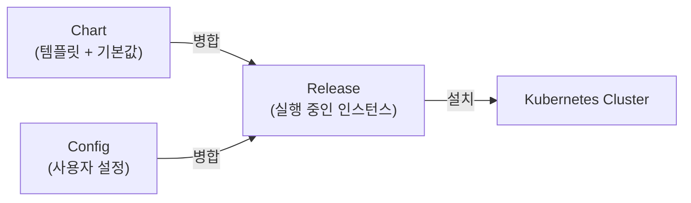
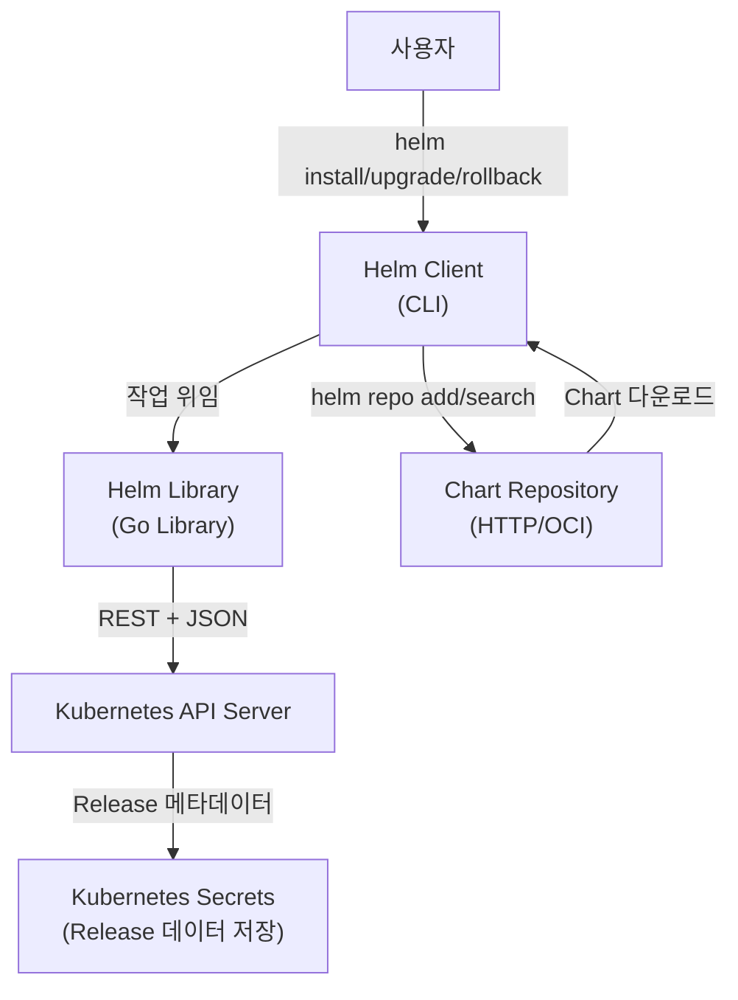
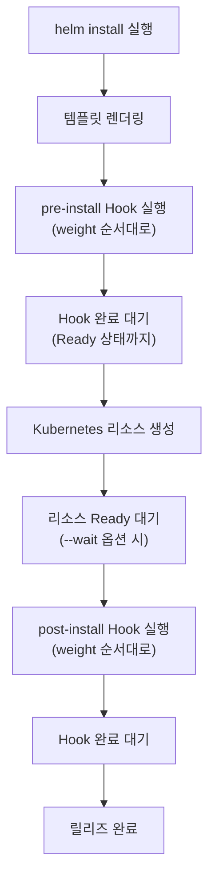
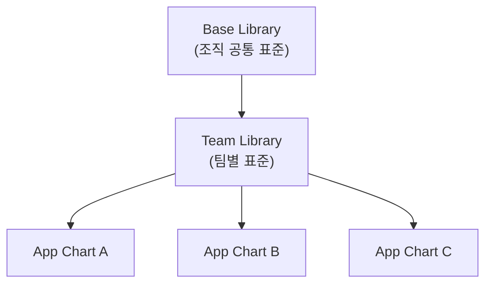
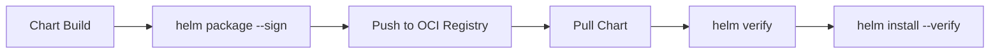
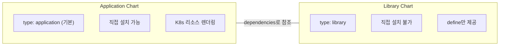

Kubernetes 클러스터에 애플리케이션을 배포할 때, 수십 개의 YAML 매니페스트를 수동으로 관리하는 것은 현실적으로 한계가 있다. 환경별 값 분기, 버전 관리, 롤백, 의존성 처리까지 고려하면 단순 `kubectl apply`만으로는 운영이 어렵다. Helm은 이 문제를 **패키지 관리자** 관점에서 해결하는 도구이다.

이 글에서는 Helm 공식 문서를 기반으로 아키텍처, Chart 구조, Template 엔진, Hooks, Library Chart, OCI Registry, Provenance까지 전체 영역을 다룬다.

---

## 1. Helm 소개

> **원문 ([Helm Architecture](https://helm.sh/docs/topics/architecture/)):**
> "Helm is a tool for managing Kubernetes packages called charts. Helm can do the following:
> - Create new charts from scratch
> - Package charts into chart archive (tgz) files
> - Interact with chart repositories where charts are stored
> - Install and uninstall charts into an existing Kubernetes cluster
> - Manage the release cycle of charts that have been installed with Helm"

**번역:** Helm은 차트(chart)라 불리는 Kubernetes 패키지를 관리하기 위한 도구이다. Helm은 다음을 수행할 수 있다: 새로운 차트 생성, 차트를 아카이브(tgz) 파일로 패키징, 차트가 저장된 리포지터리와 상호작용, 기존 Kubernetes 클러스터에 차트 설치/제거, 설치된 차트의 릴리즈 라이프사이클 관리.

Helm의 핵심 개념은 3가지이다.

> **원문 ([Helm Architecture](https://helm.sh/docs/topics/architecture/)):**
> - Chart: "a bundle of information necessary to create an instance of a Kubernetes application"
> - Config: "configuration information that can be merged into a packaged chart to create a releasable object"
> - Release: "a running instance of a chart, combined with a specific config"

**번역:**
- **Chart**: Kubernetes 애플리케이션 인스턴스를 생성하는 데 필요한 정보 번들이다.
- **Config**: 패키지된 차트와 병합되어 배포 가능한 오브젝트를 생성하는 설정 정보이다.
- **Release**: 특정 Config와 결합된 Chart의 실행 중인 인스턴스이다.

| 개념 | 설명 |
|------|------|
| **Chart** | 템플릿, 기본값, 메타데이터, 의존성을 포함하는 정보 번들이다. |
| **Config** | Chart와 병합되어 배포 가능한 Kubernetes 오브젝트를 생성하는 설정 값이다. |
| **Release** | Chart + Config가 결합되어 클러스터에 설치된 실행 중인 인스턴스이다. 동일한 Chart로 여러 Release를 만들 수 있다. |



같은 Chart로 여러 Release를 만들 수 있다는 점이 중요하다. 예를 들어 같은 MySQL Chart로 `mysql-dev`와 `mysql-prod`를 각각 설치할 수 있다. 각 Release는 독립적으로 업그레이드, 롤백, 삭제가 가능하다.

---

## 2. 아키텍처

### 2.1 Helm Client (CLI)

> **원문 ([Helm Architecture - Implementation](https://helm.sh/docs/topics/architecture/#implementation)):**
> "The Helm Client is a command-line client for end users. The client is responsible for the following:
> - Local chart development
> - Managing repositories
> - Managing releases
> - Interfacing with the Helm library (Sending charts to be installed, Requesting upgrading or uninstalling of existing releases)"

**번역:** Helm Client는 최종 사용자를 위한 커맨드라인 클라이언트이다. 클라이언트는 로컬 차트 개발, 리포지터리 관리, 릴리즈 관리, Helm 라이브러리와의 인터페이싱(설치할 차트 전송, 기존 릴리즈의 업그레이드/삭제 요청)을 담당한다.

Helm Client는 사용자가 직접 조작하는 CLI 도구이다. 주요 역할은 다음과 같다.

- 로컬 Chart 개발 (`helm create`, `helm lint`, `helm package`)
- Repository 관리 (`helm repo add`, `helm repo update`, `helm search`)
- Release 관리 (`helm install`, `helm upgrade`, `helm rollback`, `helm uninstall`)
- Helm Library에 작업 위임

### 2.2 Helm Library

> **원문 ([Helm Architecture - The Helm Library](https://helm.sh/docs/topics/architecture/#the-helm-library)):**
> "The Helm Library provides the logic for executing all Helm operations. It interfaces with the Kubernetes API server and provides the following capability:
> - Combining a chart and configuration to build a release
> - Installing charts into Kubernetes, and providing the subsequent release object
> - Upgrading and uninstalling charts by interacting with Kubernetes"

**번역:** Helm 라이브러리는 모든 Helm 작업을 실행하는 로직을 제공한다. Kubernetes API 서버와 인터페이스하여 차트와 설정을 결합해 릴리즈를 빌드하고, Kubernetes에 차트를 설치하고, Kubernetes와 상호작용하여 차트를 업그레이드/삭제하는 기능을 제공한다.

Helm Library는 실제 작업을 수행하는 Go 라이브러리이다. Client로부터 요청을 받아 다음을 처리한다.

- Chart + Config 병합 -> Release 생성
- Kubernetes REST API를 통해 리소스 생성/수정/삭제 (REST+JSON 프로토콜 사용)
- Release 메타데이터 관리

### 2.3 데이터 저장 방식

> **원문 ([Helm Architecture - Implementation](https://helm.sh/docs/topics/architecture/#implementation)):**
> "The standalone Helm library encapsulates the Helm logic so that it can be leveraged by a different client. The Helm library uses Kubernetes as a storage backend, and the configuration of this storage is set through the Kubernetes configuration (i.e. kubeconfig)."

**번역:** 독립된 Helm 라이브러리는 Helm 로직을 캡슐화하여 다른 클라이언트에서도 활용할 수 있게 한다. Helm 라이브러리는 Kubernetes를 저장 백엔드로 사용하며, 저장소 설정은 Kubernetes 설정(kubeconfig)을 통해 구성된다.

Helm 3에서는 Release 데이터가 **Kubernetes Secrets**에 저장된다. 외부 데이터베이스가 필요 없으며, Helm이 설치된 네임스페이스의 Secret에 `sh.helm.release.v1.<release-name>.v<revision>` 형식으로 저장된다.

```bash
# Release Secret 확인
kubectl get secrets -l owner=helm -n default
# NAME                           TYPE                 DATA   AGE
# sh.helm.release.v1.myapp.v1   helm.sh/release.v1   1      5m
# sh.helm.release.v1.myapp.v2   helm.sh/release.v1   1      2m
```

Helm 2에서는 Tiller라는 서버 컴포넌트가 클러스터 내부에 존재했지만, Helm 3에서 제거되었다. Tiller 제거로 인해 RBAC이 단순해지고, 보안 표면이 크게 줄었다.

### 2.4 전체 아키텍처 다이어그램



---

## 3. Chart 구조

> **원문 ([Charts](https://helm.sh/docs/topics/charts/)):**
> "Helm uses a packaging format called charts. A chart is a collection of files that describe a related set of Kubernetes resources."

**번역:** Helm은 차트라 불리는 패키징 형식을 사용한다. 차트는 관련된 Kubernetes 리소스 집합을 기술하는 파일들의 모음이다.

> **원문 ([Chart File Structure](https://helm.sh/docs/topics/charts/#the-chart-file-structure)):**
> "A chart is organized as a collection of files inside of a directory. The directory name is the name of the chart (without versioning information)."

**번역:** 차트는 디렉토리 내부의 파일 모음으로 구성된다. 디렉토리 이름이 차트의 이름이다 (버전 정보 제외).

```
mychart/
  Chart.yaml          # [필수] 차트의 메타데이터 (이름, 버전, 설명)
  LICENSE             # [선택] 라이선스 파일
  README.md           # [선택] 사람이 읽을 수 있는 설명
  values.yaml         # [권장] 기본 설정 값
  values.schema.json  # [선택] values.yaml의 JSON Schema 검증 파일
  charts/             # [선택] 의존 차트 (서브차트)
  crds/               # [선택] Custom Resource Definition 파일
  templates/          # [필수] Go 템플릿 파일 + Kubernetes 매니페스트
  templates/NOTES.txt # [선택] 설치 후 표시되는 안내 메시지
  templates/_helpers.tpl # [관례] 재사용 가능한 Named Template 정의
```

> **원문 ([Getting Started](https://helm.sh/docs/chart_template_guide/getting_started/)):**
> "The templates/ directory is for template files. When Helm evaluates a chart, it will send all of the files in the templates/ directory through the template rendering engine."

**번역:** templates/ 디렉토리는 템플릿 파일을 위한 것이다. Helm이 차트를 평가할 때, templates/ 디렉토리의 모든 파일을 템플릿 렌더링 엔진을 통해 처리한다.

각 디렉토리와 파일의 역할을 좀 더 살펴보면 다음과 같다.

| 경로 | 필수 여부 | 설명 |
|------|-----------|------|
| `Chart.yaml` | 필수 | 차트 이름, 버전, 의존성 등 메타데이터 |
| `values.yaml` | 권장 | 템플릿에 주입되는 기본값. `-f`나 `--set`으로 오버라이드 |
| `values.schema.json` | 선택 | `values.yaml`의 구조를 JSON Schema로 검증 |
| `templates/` | 필수 | Go 템플릿 엔진으로 렌더링되는 Kubernetes 매니페스트 |
| `templates/NOTES.txt` | 선택 | `helm install` 후 사용자에게 표시되는 사용 안내 |
| `templates/_helpers.tpl` | 관례 | `define`으로 정의하는 재사용 가능한 템플릿 파셜 |
| `charts/` | 선택 | 의존 차트가 `.tgz` 또는 디렉토리 형태로 위치 |
| `crds/` | 선택 | CRD YAML 파일. 다른 리소스보다 먼저 설치됨 |

### 3.1 Chart 생성

```bash
# 새로운 차트 스캐폴딩
helm create mychart

# 생성된 구조 확인
tree mychart/
```

`helm create`로 생성하면 nginx 기반의 기본 템플릿이 포함된다. 이를 수정하여 자신의 애플리케이션에 맞게 커스터마이징한다.

### 3.2 렌더링 테스트

> **원문 ([Getting Started](https://helm.sh/docs/chart_template_guide/getting_started/)):**
> "When you want to test the template rendering, but not actually install anything, you can use helm install --debug --dry-run"

**번역:** 템플릿 렌더링을 테스트하되 실제로 아무것도 설치하지 않으려면, `helm install --debug --dry-run`을 사용할 수 있다.

```bash
# 렌더링 결과만 확인 (실제 설치 없음)
helm install --debug --dry-run myrelease ./mychart
```

---

## 4. Chart.yaml 상세

> **원문 ([The Chart.yaml File](https://helm.sh/docs/topics/charts/#the-chartyaml-file)):**
> "The Chart.yaml file is required for a chart. It contains the following fields."

**번역:** Chart.yaml 파일은 차트에 필수이다. 다음 필드를 포함한다.

### 4.1 필수 필드

> **원문 ([Charts](https://helm.sh/docs/topics/charts/)):**
> "Every chart must have a version number. A version should follow the SemVer 2 standard."

**번역:** 모든 차트는 반드시 버전 번호를 가져야 한다. 버전은 SemVer 2 표준을 따라야 한다.

```yaml
apiVersion: v2        # Helm 3 차트는 반드시 v2
name: mychart         # 차트 이름
version: 0.1.0        # SemVer 2 형식의 차트 버전
```

Helm은 이 버전을 기준으로 패키지 정렬, 의존성 해결, 업그레이드 판단을 수행한다.

### 4.2 선택 필드

> **원문 ([Charts](https://helm.sh/docs/topics/charts/)):**
> "There are two types: application and library."

**번역:** 차트에는 application과 library 두 가지 타입이 있다.

```yaml
apiVersion: v2
name: mychart
version: 0.1.0

# --- 선택 필드 ---
kubeVersion: ">=1.24.0"        # 호환되는 K8s 버전 범위 (SemVer 범위 표현)
description: "My application chart"
type: application              # application (기본) 또는 library
keywords:
  - web
  - backend
home: "https://example.com"
sources:
  - "https://github.com/example/mychart"
dependencies:                  # 의존 차트 목록 (v2에서 추가)
  - name: redis
    version: "17.x.x"
    repository: "https://charts.bitnami.com/bitnami"
maintainers:
  - name: John Doe
    email: john@example.com
    url: "https://johndoe.dev"
icon: "https://example.com/icon.png"
appVersion: "1.16.0"           # 애플리케이션 자체 버전 (정보 표시용)
deprecated: false               # 더 이상 권장하지 않는 차트인지 여부
annotations:
  example.com/team: "platform"
```

### 4.3 apiVersion: v1 vs v2

| 항목 | v1 (Helm 2) | v2 (Helm 3) |
|------|-------------|-------------|
| dependencies | `requirements.yaml` 별도 파일 | `Chart.yaml` 내 `dependencies` 필드 |
| `type` 필드 | 미지원 | `application` / `library` |
| Helm 3 호환 | 호환 유지 | 네이티브 |

Helm 3에서도 v1 차트를 설치할 수 있지만, 신규 차트는 반드시 v2를 사용해야 한다.

### 4.4 appVersion vs version

혼동하기 쉬운 두 필드이다.

- `version`: **Chart 자체의 버전**이다. Chart 구조나 템플릿이 변경될 때 올린다.
- `appVersion`: **Chart가 배포하는 애플리케이션의 버전**이다. 정보 표시 목적이며, 의존성 해결에 영향을 주지 않는다.

예를 들어, nginx Chart의 version이 `1.2.3`이고 appVersion이 `1.25.0`이면, Chart 패키지 버전은 `1.2.3`이고 실제 nginx 이미지는 `1.25.0`이라는 의미이다.

---

## 5. Dependencies (의존성 관리)

> **원문 ([Chart Dependencies](https://helm.sh/docs/topics/charts/#chart-dependencies)):**
> "In Helm, one chart may depend on any number of other charts. These dependencies can be dynamically linked using the dependencies field in Chart.yaml or brought in to the charts/ directory and managed manually."

**번역:** Helm에서 하나의 차트는 다른 여러 차트에 의존할 수 있다. 이러한 의존성은 Chart.yaml의 dependencies 필드를 사용하여 동적으로 연결하거나, charts/ 디렉토리에 직접 가져와 수동으로 관리할 수 있다.

### 5.1 방법 1: Chart.yaml dependencies (권장)

```yaml
# Chart.yaml
dependencies:
  - name: apache
    version: 1.2.3
    repository: https://example.com/charts
  - name: mysql
    version: 3.2.1
    repository: https://another.example.com/charts
```

```bash
# 의존성 다운로드 (charts/ 디렉토리에 .tgz 파일 생성)
helm dependency update mychart/

# Chart.lock 기반으로 재구성 (lock 파일이 존재할 때)
helm dependency build mychart/
```

`helm dependency update`를 실행하면 `Chart.lock` 파일이 생성된다. 이 파일은 정확한 의존성 버전을 고정하여 재현 가능한 빌드를 보장한다. `npm`의 `package-lock.json`이나 Go의 `go.sum`과 동일한 역할이다.

### 5.2 방법 2: charts/ 디렉토리에 직접 배치

```bash
# 수동으로 .tgz 파일 복사
cp redis-17.0.0.tgz mychart/charts/

# 또는 디렉토리 형태로 배치
cp -r redis/ mychart/charts/redis/
```

이 방법은 프라이빗 환경이나 에어갭(air-gapped) 환경에서 유용하다.

### 5.3 선택 필드: condition, tags, alias, import-values

```yaml
dependencies:
  - name: redis
    version: "17.x.x"
    repository: https://charts.bitnami.com/bitnami
    condition: redis.enabled      # values에서 활성화/비활성화 제어
    tags:
      - backend                   # 태그 기반 그룹 활성화
    alias: cache-redis            # 동일 차트를 다른 이름으로 재사용
    import-values:                # 서브차트의 values를 부모로 가져오기
      - data
```

```yaml
# values.yaml
redis:
  enabled: true  # condition으로 redis 의존성 활성화

tags:
  backend: true  # 태그로 그룹 활성화
```

### 5.4 Tags vs Conditions 우선순위

> **원문 ([Tags and Condition Resolution](https://helm.sh/docs/topics/charts/#tags-and-condition-resolution)):**
> "Conditions (when set in values) always override tags."

**번역:** Conditions는 (values에 설정되었을 때) 항상 Tags를 오버라이드한다.

우선순위를 정리하면 다음과 같다.

1. `condition`이 values에 설정되어 있으면 -> condition이 최우선
2. `condition`이 설정되지 않았으면 -> `tags` 값을 확인
3. `tags`도 설정되지 않았으면 -> 기본적으로 활성화

---

## 6. Template Engine 상세

Helm의 핵심은 Template Engine이다. Go의 `text/template` 패키지를 기반으로 하며, [Sprig 함수 라이브러리](https://masterminds.github.io/sprig/)를 추가로 사용한다.

### 6.1 Built-in Objects

> **원문 ([Built-in Objects](https://helm.sh/docs/chart_template_guide/builtin_objects/)):**
> "Release: This object describes the release itself. It has several objects inside of it."

**번역:** Release 오브젝트는 릴리즈 자체를 기술한다. 내부에 여러 오브젝트를 포함하고 있다.

> **원문 ([Built-in Objects](https://helm.sh/docs/chart_template_guide/builtin_objects/)):**
> "Values passed into the template from the values.yaml file and from user-supplied files."

**번역:** values.yaml 파일과 사용자가 제공한 파일로부터 템플릿에 전달되는 값이다.

> **원문 ([Built-in Objects](https://helm.sh/docs/chart_template_guide/builtin_objects/)):**
> "The contents of the Chart.yaml file. Any data in Chart.yaml will be accessible here."

**번역:** Chart.yaml 파일의 내용이다. Chart.yaml의 모든 데이터에 여기서 접근할 수 있다.

> **원문 ([Built-in Objects](https://helm.sh/docs/chart_template_guide/builtin_objects/)):**
> "Built-in values always begin with a capital letter. This is in keeping with Go's naming convention."

**번역:** 빌트인 값은 항상 대문자로 시작한다. 이는 Go의 네이밍 규칙을 따르는 것이다.

Helm 템플릿에서 사용 가능한 주요 Built-in Object는 다음과 같다.

| Object | 주요 속성 | 설명 |
|--------|-----------|------|
| `Release` | `.Release.Name`, `.Release.Namespace`, `.Release.IsUpgrade`, `.Release.IsInstall`, `.Release.Revision`, `.Release.Service` | 현재 Release 정보 |
| `Values` | `.Values.*` | `values.yaml` + 사용자 제공 값이 병합된 결과 |
| `Chart` | `.Chart.Name`, `.Chart.Version`, `.Chart.AppVersion` | `Chart.yaml`의 내용 |
| `Files` | `.Files.Get`, `.Files.GetBytes`, `.Files.Glob`, `.Files.Lines`, `.Files.AsSecrets`, `.Files.AsConfig` | 차트 내 비특수 파일 접근 |
| `Capabilities` | `.Capabilities.KubeVersion`, `.Capabilities.APIVersions`, `.Capabilities.HelmVersion` | 클러스터 버전/API 버전 정보 |
| `Template` | `.Template.Name`, `.Template.BasePath` | 현재 렌더링 중인 템플릿 정보 |

```yaml
# templates/deployment.yaml
apiVersion: apps/v1
kind: Deployment
metadata:
  name: {{ .Release.Name }}-app
  namespace: {{ .Release.Namespace }}
  labels:
    app.kubernetes.io/name: {{ .Chart.Name }}
    app.kubernetes.io/version: {{ .Chart.AppVersion }}
    app.kubernetes.io/managed-by: {{ .Release.Service }}
    helm.sh/chart: {{ .Chart.Name }}-{{ .Chart.Version }}
spec:
  replicas: {{ .Values.replicaCount }}
  selector:
    matchLabels:
      app: {{ .Release.Name }}-app
  template:
    metadata:
      labels:
        app: {{ .Release.Name }}-app
    spec:
      containers:
        - name: {{ .Chart.Name }}
          image: "{{ .Values.image.repository }}:{{ .Values.image.tag }}"
          ports:
            - containerPort: {{ .Values.service.port }}
```

### 6.2 Values (값 우선순위)

> **원문 ([Values Files](https://helm.sh/docs/chart_template_guide/values_files/)):**
> "The list above is in order of specificity: values.yaml is the default, which can be overridden by a parent chart's values.yaml, which can in turn be overridden by a user-supplied values file, which can in turn be overridden by --set parameters."

**번역:** 위 목록은 우선순위 순서이다: values.yaml이 기본값이며, 부모 차트의 values.yaml에 의해 오버라이드될 수 있고, 이는 다시 사용자 제공 values 파일에 의해 오버라이드될 수 있고, 이는 다시 --set 파라미터에 의해 오버라이드될 수 있다.

```mermaid
flowchart BT
    v1["1. values.yaml<br/>(차트 기본값)"]
    v2["2. 부모 차트의 values.yaml"]
    v3["3. 사용자 제공 파일<br/>(-f / --values)"]
    v4["4. --set 파라미터"]

    v1 --> v2 --> v3 --> v4

    style v4 fill:#2d5016,stroke:#3a6b1e
    style v1 fill:#4a1a1a,stroke:#6b2e2e
```



우선순위가 높을수록 낮은 값을 덮어쓴다. `--set`이 최우선이고, 차트 기본 `values.yaml`이 최하위이다.

```bash
# 기본값으로 설치
helm install myapp ./mychart

# 파일로 오버라이드
helm install myapp ./mychart -f production-values.yaml

# --set으로 오버라이드 (최우선)
helm install myapp ./mychart -f production-values.yaml --set replicaCount=5

# 여러 파일 병합 (뒤의 파일이 앞의 파일을 오버라이드)
helm install myapp ./mychart -f base.yaml -f production.yaml
```

### 6.3 값 삭제 (null override)

> **원문 ([Values Files](https://helm.sh/docs/chart_template_guide/values_files/)):**
> "you may override the value of the key to be null, in which case Helm will remove the key from the overridden values merge."

**번역:** 키의 값을 null로 오버라이드할 수 있으며, 이 경우 Helm은 오버라이드된 값 병합에서 해당 키를 제거한다.

```bash
# 기본 values.yaml에서 특정 키를 제거하고 싶을 때
helm install myapp ./mychart --set nodeSelector=null
```

### 6.4 Global Values

> **원문 ([Global Values](https://helm.sh/docs/chart_template_guide/subcharts_and_globals/#global-chart-values)):**
> "Global values are values that can be accessed from any chart or subchart by exactly the same name."

**번역:** 글로벌 값은 정확히 같은 이름으로 모든 차트 또는 서브차트에서 접근할 수 있는 값이다.

`global:` 섹션에 정의된 값은 부모 차트와 모든 서브차트에서 `.Values.global.*`으로 접근 가능하다.

```yaml
# values.yaml
global:
  environment: production
  imageRegistry: registry.example.com
  storageClass: gp3

redis:
  # redis 서브차트에서도 .Values.global.environment 접근 가능
  replica:
    replicaCount: 3
```

```yaml
# templates/deployment.yaml (부모 차트)
image: {{ .Values.global.imageRegistry }}/myapp:{{ .Values.image.tag }}

# charts/redis/templates/deployment.yaml (서브차트)
# 서브차트에서도 동일하게 접근
image: {{ .Values.global.imageRegistry }}/redis:{{ .Values.image.tag }}
```

### 6.5 Values 설계 팁

> **원문 ([Values Files](https://helm.sh/docs/chart_template_guide/values_files/)):**
> "keep your values trees shallow, favoring flatness."

**번역:** values 트리를 얕게 유지하고, 평탄한 구조를 선호하라.

```yaml
# 권장: 평탄한 구조
serverHost: example.com
serverPort: 8080

# 지양: 과도한 중첩
server:
  config:
    network:
      host: example.com
      port: 8080
```

물론 논리적 그룹이 명확한 경우(예: `image.repository`, `image.tag`)에는 중첩이 자연스럽다. 핵심은 **불필요한 깊이를 피하라**는 것이다.

### 6.6 Functions and Pipelines

> **원문 ([Template Functions and Pipelines](https://helm.sh/docs/chart_template_guide/functions_and_pipelines/)):**
> "Template functions follow the syntax functionName arg1 arg2..."

**번역:** 템플릿 함수는 `functionName arg1 arg2...` 구문을 따른다.

> **원문 ([Template Functions and Pipelines](https://helm.sh/docs/chart_template_guide/functions_and_pipelines/)):**
> "Pipelines are a tool for chaining together a series of template commands to compactly express a series of transformations."

**번역:** 파이프라인은 일련의 템플릿 명령을 연결하여 일련의 변환을 간결하게 표현하는 도구이다.

Helm은 Go template의 기본 함수 + [Sprig 라이브러리](https://masterminds.github.io/sprig/)의 60개 이상 함수를 사용할 수 있다.

**Pipeline 구문:**

```yaml
# 기본 사용
drink: {{ .Values.favorite.drink | quote }}
# 결과: drink: "coffee"

# 파이프라인 체이닝
food: {{ .Values.favorite.food | upper | quote }}
# 결과: food: "PIZZA"
```

> **원문 ([Template Functions and Pipelines](https://helm.sh/docs/chart_template_guide/functions_and_pipelines/)):**
> "This function allows you to specify a default value inside of the template, in case the value is omitted."

**번역:** 이 함수(default)는 값이 생략된 경우를 대비하여 템플릿 내에서 기본값을 지정할 수 있게 해준다.

```yaml
# default 함수: 값이 없을 때 기본값 지정
drink: {{ .Values.favorite.drink | default "tea" | quote }}
# .Values.favorite.drink가 비어있으면: drink: "tea"
```

**주요 함수 카테고리:**

| 카테고리 | 함수 예시 | 설명 |
|----------|-----------|------|
| 문자열 | `quote`, `upper`, `lower`, `trim`, `replace`, `contains` | 문자열 변환 |
| 숫자 | `add`, `sub`, `mul`, `div`, `max`, `min` | 수학 연산 |
| 리스트 | `list`, `first`, `last`, `append`, `uniq`, `sortAlpha` | 리스트 조작 |
| 딕셔너리 | `dict`, `set`, `unset`, `hasKey`, `keys`, `values`, `merge` | 맵 조작 |
| 타입 변환 | `toYaml`, `toJson`, `fromYaml`, `fromJson`, `toString`, `atoi` | 타입 변환 |
| 암호화 | `sha256sum`, `b64enc`, `b64dec`, `htpasswd` | 해시/인코딩 |
| 날짜 | `now`, `date`, `dateModify`, `toDate` | 날짜 처리 |
| 조건 | `default`, `empty`, `coalesce`, `ternary` | 조건부 값 |

**실무에서 자주 쓰는 패턴:**

```yaml
# indent: YAML 들여쓰기 맞추기 (가장 많이 쓰는 함수 중 하나)
metadata:
  annotations:
    {{- toYaml .Values.podAnnotations | nindent 4 }}

# ternary: 삼항 연산자
replicas: {{ ternary 3 1 .Values.highAvailability }}

# include + indent 조합
spec:
  template:
    metadata:
      labels:
        {{- include "mychart.selectorLabels" . | nindent 8 }}

# required: 필수 값 검증
image: {{ required "image.repository is required" .Values.image.repository }}

# coalesce: 첫 번째 비어있지 않은 값
storageClass: {{ coalesce .Values.storageClass .Values.global.storageClass "default" }}
```

### 6.7 lookup 함수

```yaml
# 클러스터의 기존 리소스 조회
{{ $configmap := (lookup "v1" "ConfigMap" "default" "my-config") }}
{{ if $configmap }}
  # ConfigMap이 존재하면 기존 값 사용
  existingData: {{ $configmap.data.myKey }}
{{ end }}

# Namespace 전체 조회
{{ range $ns := (lookup "v1" "Namespace" "" "").items }}
  - {{ $ns.metadata.name }}
{{ end }}
```

참고: 아래 내용은 공식문서의 개념을 기반으로 정리한 것이다. `lookup`은 **실제 클러스터에 질의**하는 함수이다. `helm template`이나 `--dry-run` 실행 시에는 빈 응답을 반환한다. 이를 고려하여 항상 `if` 분기와 함께 사용해야 한다.

### 6.8 연산자

> **원문 ([Template Functions and Pipelines](https://helm.sh/docs/chart_template_guide/functions_and_pipelines/)):**
> "Operators are functions."

**번역:** 연산자는 함수이다. `eq`, `ne`, `lt`, `gt`, `and`, `or` 등의 비교/논리 연산자가 모두 함수 호출 형태로 구현되어 있다.

```yaml
# 비교 연산자
{{ if eq .Values.env "production" }}
  replicas: 3
{{ end }}

{{ if ne .Values.env "development" }}
  resources:
    limits:
      cpu: "1"
      memory: "1Gi"
{{ end }}

# 논리 연산자
{{ if and .Values.ingress.enabled (eq .Values.env "production") }}
  # Ingress 생성
{{ end }}

{{ if or .Values.metrics.enabled .Values.global.monitoring }}
  # 메트릭 활성화
{{ end }}

# 수치 비교
{{ if gt (int .Values.replicaCount) 1 }}
  # PodDisruptionBudget 생성
{{ end }}
```

### 6.9 Flow Control

> **원문 ([Control Structures](https://helm.sh/docs/chart_template_guide/control_structures/)):**
> "Control structures (called 'actions' in template parlance) provide you, the template author, with the ability to control the flow of a template's generation."

**번역:** 제어 구조(템플릿 용어로 'actions'라고 부름)는 템플릿 작성자에게 템플릿 생성의 흐름을 제어할 수 있는 능력을 제공한다.

#### if/else

> **원문 ([If/Else](https://helm.sh/docs/chart_template_guide/control_structures/#ifelse)):**
> "A pipeline is evaluated as false if the value is:
> - a boolean false
> - a numeric zero
> - an empty string
> - a nil (empty or null)
> - an empty collection (map, slice, tuple, dict, array)"

**번역:** 파이프라인은 다음 값일 때 false로 평가된다: boolean false, 숫자 0, 빈 문자열, nil (비어있거나 null), 빈 컬렉션 (map, slice, tuple, dict, array).

```yaml
# if/else 기본
{{- if .Values.ingress.enabled }}
apiVersion: networking.k8s.io/v1
kind: Ingress
metadata:
  name: {{ .Release.Name }}-ingress
spec:
  rules:
    - host: {{ .Values.ingress.host }}
      http:
        paths:
          - path: /
            pathType: Prefix
            backend:
              service:
                name: {{ .Release.Name }}-svc
                port:
                  number: {{ .Values.service.port }}
{{- end }}

# if/else if/else
{{- if eq .Values.env "production" }}
  replicas: 3
{{- else if eq .Values.env "staging" }}
  replicas: 2
{{- else }}
  replicas: 1
{{- end }}
```

#### with (스코프 변경)

> **원문 ([Control Structures](https://helm.sh/docs/chart_template_guide/control_structures/)):**
> "Inside of the restricted scope, you will not be able to access the other objects from the parent scope using ."

**번역:** 제한된 스코프 내부에서는 `.`을 사용하여 부모 스코프의 다른 오브젝트에 접근할 수 없다.

```yaml
# with: 현재 스코프(.)를 변경
{{- with .Values.nodeSelector }}
nodeSelector:
  {{- toYaml . | nindent 2 }}
{{- end }}

# with 내부에서 상위 스코프 접근 시 $ 사용
{{- with .Values.resources }}
resources:
  {{- toYaml . | nindent 2 }}
  # $ = root scope
  # .Release.Name은 접근 불가 (. 이 .Values.resources로 변경됨)
  # $.Release.Name으로 접근
{{- end }}
```

`with` 블록 안에서 `.`는 `with`에 전달된 값으로 변경된다. 상위 스코프의 값에 접근하려면 `$`(root scope)를 사용해야 한다.

#### range (반복)

```yaml
# 리스트 반복
{{- range .Values.ingress.hosts }}
- host: {{ .host | quote }}
  http:
    paths:
      {{- range .paths }}
      - path: {{ .path }}
        pathType: {{ .pathType }}
      {{- end }}
{{- end }}

# 딕셔너리 반복 (key, value)
{{- range $key, $value := .Values.configData }}
{{ $key }}: {{ $value | quote }}
{{- end }}

# 인덱스 포함 리스트 반복
{{- range $index, $host := .Values.hosts }}
host-{{ $index }}: {{ $host }}
{{- end }}

# 고정 리스트 생성
{{- range tuple "config" "secret" "deployment" "service" }}
- {{ . }}
{{- end }}
```

### 6.10 Whitespace Control

> **원문 ([Control Structures](https://helm.sh/docs/chart_template_guide/control_structures/)):**
> "Be careful! Newlines are whitespace!"

**번역:** 주의하라! 줄바꿈도 공백이다!

Go template의 `{{` `}}`는 렌더링 결과에 불필요한 빈 줄을 남기는 경우가 많다. 이를 제어하는 것이 `-` 마커이다.

```yaml
# 왼쪽 공백 제거: {{-
# 오른쪽 공백 제거: -}}

# 문제: if 블록이 빈 줄을 남김
metadata:
  labels:
{{ if .Values.labels }}
    custom: "true"
{{ end }}
    app: myapp

# 해결: {{- 와 -}} 사용
metadata:
  labels:
    {{- if .Values.labels }}
    custom: "true"
    {{- end }}
    app: myapp
```

`{{-`는 왼쪽의 공백(줄바꿈 포함)을 모두 제거하고, `-}}`는 오른쪽의 공백을 모두 제거한다. 과도한 사용은 오히려 결과를 예측하기 어렵게 만드므로, `helm template`으로 렌더링 결과를 확인하면서 조정하는 것이 좋다.

### 6.11 Named Templates (정의와 재사용)

> **원문 ([Named Templates](https://helm.sh/docs/chart_template_guide/named_templates/)):**
> "A named template (sometimes called a partial or a subtemplate) is simply a template defined inside of a file, and given a name. One important detail to keep in mind: template names are global. If you declare two templates with the same name, whichever one is loaded last will be the one that is used."

**번역:** Named Template(때때로 파셜 또는 서브템플릿이라 부름)은 파일 내에 정의되어 이름이 부여된 템플릿이다. 중요한 세부사항: 템플릿 이름은 전역(global)이다. 같은 이름의 템플릿을 두 개 선언하면, 마지막에 로드된 것이 사용된다.

관례적으로 `templates/_helpers.tpl` 파일에 정의한다. 언더스코어(`_`)로 시작하는 파일은 Kubernetes 매니페스트로 렌더링되지 않는다.

```yaml
# templates/_helpers.tpl

# define: 템플릿 정의
{{- define "mychart.fullname" -}}
{{- if .Values.fullnameOverride }}
{{- .Values.fullnameOverride | trunc 63 | trimSuffix "-" }}
{{- else }}
{{- $name := default .Chart.Name .Values.nameOverride }}
{{- printf "%s-%s" .Release.Name $name | trunc 63 | trimSuffix "-" }}
{{- end }}
{{- end }}

# 공통 레이블
{{- define "mychart.labels" -}}
helm.sh/chart: {{ include "mychart.chart" . }}
{{ include "mychart.selectorLabels" . }}
app.kubernetes.io/managed-by: {{ .Release.Service }}
{{- end }}

{{- define "mychart.selectorLabels" -}}
app.kubernetes.io/name: {{ include "mychart.name" . }}
app.kubernetes.io/instance: {{ .Release.Name }}
{{- end }}
```

```yaml
# templates/deployment.yaml

# include (권장): 파이프라인 사용 가능
metadata:
  name: {{ include "mychart.fullname" . }}
  labels:
    {{- include "mychart.labels" . | nindent 4 }}

# template: 파이프라인 사용 불가 (권장하지 않음)
metadata:
  name: {{ template "mychart.fullname" . }}
```

`include`와 `template`의 차이점은 `include`가 파이프라인(`|`)을 지원한다는 것이다. `nindent`로 들여쓰기를 조정하려면 반드시 `include`를 사용해야 한다.

---

## 7. Hooks

> **원문 ([Helm Hooks](https://helm.sh/docs/topics/charts_hooks/)):**
> "Helm provides a hook mechanism to allow chart developers to intervene at certain points in a release's life cycle. For example, you can use hooks to:
> - Load a ConfigMap or Secret during install before any other charts are loaded.
> - Execute a Job to back up a database before installing a new chart, and then execute a second job after the upgrade to restore data.
> - Run a Job before deleting a release to gracefully take a service out of rotation before removing it."

**번역:** Helm은 차트 개발자가 릴리즈 라이프사이클의 특정 지점에 개입할 수 있는 훅 메커니즘을 제공한다. 예를 들어, 훅을 사용하여 설치 중 다른 차트가 로드되기 전에 ConfigMap이나 Secret을 로드하거나, 새 차트 설치 전에 데이터베이스 백업 Job을 실행한 다음 업그레이드 후 데이터 복원 Job을 실행하거나, 릴리즈 삭제 전에 서비스를 로테이션에서 정상적으로 제거하는 Job을 실행할 수 있다.

> **원문 ([Helm Hooks](https://helm.sh/docs/topics/charts_hooks/)):**
> "Hooks work like regular templates, but they have special annotations that cause Helm to utilize them differently."

**번역:** 훅은 일반 템플릿처럼 동작하지만, Helm이 이를 다르게 활용하도록 하는 특별한 어노테이션을 가지고 있다.

### 7.1 9가지 Hook 타입

참고: 아래 내용은 공식문서의 개념을 기반으로 정리한 것이다. 공식 문서에 9가지 훅 타입이 정의되어 있다: pre-install, post-install, pre-delete, post-delete, pre-upgrade, post-upgrade, pre-rollback, post-rollback, test.

| Hook | 실행 시점 |
|------|-----------|
| `pre-install` | 템플릿 렌더링 후, Kubernetes 리소스 생성 전 |
| `post-install` | 모든 리소스가 Kubernetes에 로드된 후 |
| `pre-delete` | 릴리즈 리소스 삭제 요청 전 |
| `post-delete` | 모든 릴리즈 리소스가 삭제된 후 |
| `pre-upgrade` | 템플릿 렌더링 후, Kubernetes 리소스 업데이트 전 |
| `post-upgrade` | 모든 리소스가 업그레이드된 후 |
| `pre-rollback` | 템플릿 렌더링 후, 롤백 전 |
| `post-rollback` | 모든 리소스가 롤백된 후 |
| `test` | `helm test` 명령 실행 시 |

### 7.2 Hook 사용 예시

```yaml
# templates/pre-install-job.yaml
apiVersion: batch/v1
kind: Job
metadata:
  name: {{ .Release.Name }}-db-init
  annotations:
    "helm.sh/hook": pre-install          # Hook 타입 지정
    "helm.sh/hook-weight": "-5"          # 실행 순서 (낮을수록 먼저)
    "helm.sh/hook-delete-policy": hook-succeeded  # 삭제 정책
spec:
  template:
    spec:
      containers:
        - name: db-init
          image: postgres:16
          command: ["psql", "-c", "CREATE DATABASE myapp;"]
          env:
            - name: PGHOST
              value: {{ .Values.database.host }}
      restartPolicy: Never
  backoffLimit: 3
```

```yaml
# templates/post-upgrade-job.yaml
apiVersion: batch/v1
kind: Job
metadata:
  name: {{ .Release.Name }}-migration
  annotations:
    "helm.sh/hook": post-upgrade,post-install  # 여러 Hook에 동시 등록
    "helm.sh/hook-weight": "0"
    "helm.sh/hook-delete-policy": before-hook-creation
spec:
  template:
    spec:
      containers:
        - name: migration
          image: "{{ .Values.image.repository }}:{{ .Values.image.tag }}"
          command: ["./migrate", "up"]
      restartPolicy: Never
  backoffLimit: 1
```

### 7.3 Hook Weight (실행 순서)

> **원문 ([Helm Hooks](https://helm.sh/docs/topics/charts_hooks/)):**
> "The library sorts hooks by weight (assigning a weight of 0 by default), by resource kind and finally by name in ascending order."

**번역:** 라이브러리는 훅을 가중치(weight) 순서로 정렬하며(기본값 0), 그 다음 리소스 종류(kind)순, 마지막으로 이름의 오름차순으로 정렬한다.

> **원문 ([Helm Hooks](https://helm.sh/docs/topics/charts_hooks/)):**
> "It is considered good practice to add a hook weight, and set it to 0 if weight is not important."

**번역:** 훅 가중치를 추가하는 것이 좋은 관행이며, 가중치가 중요하지 않은 경우 0으로 설정한다.

```yaml
# weight: -10 -> 가장 먼저 실행
"helm.sh/hook-weight": "-10"

# weight: 0 -> 기본값
"helm.sh/hook-weight": "0"

# weight: 10 -> 나중에 실행
"helm.sh/hook-weight": "10"
```

### 7.4 Hook 실행 시 대기

> **원문 ([Helm Hooks](https://helm.sh/docs/topics/charts_hooks/)):**
> "If the resource is a Job or Pod kind, Helm will wait until it successfully runs to completion. And if the hook fails, the release will fail."

**번역:** 리소스가 Job 또는 Pod 종류인 경우, Helm은 성공적으로 완료될 때까지 대기한다. 훅이 실패하면 릴리즈도 실패한다.

이것은 Hook이 단순히 "트리거만 하고 끝"이 아니라, 완료까지 블로킹된다는 것을 의미한다. DB 마이그레이션 Job이 실패하면 전체 릴리즈가 실패하게 되므로, `backoffLimit`과 타임아웃 설정이 중요하다.

### 7.5 Hook Deletion Policy

> **원문 ([Helm Hooks](https://helm.sh/docs/topics/charts_hooks/)):**
> Hook deletion policies: "before-hook-creation" (default), "hook-succeeded", "hook-failed".

**번역:** 훅 삭제 정책으로 before-hook-creation(기본값), hook-succeeded, hook-failed가 있다.

| 정책 | 설명 |
|------|------|
| `before-hook-creation` | 새 Hook 실행 전에 이전 Hook 리소스 삭제 (기본값) |
| `hook-succeeded` | Hook이 성공하면 삭제 |
| `hook-failed` | Hook이 실패하면 삭제 |

```yaml
# 여러 정책 조합 가능
"helm.sh/hook-delete-policy": hook-succeeded,hook-failed
```

### 7.6 Hook 주의사항

> **원문 ([Helm Hooks](https://helm.sh/docs/topics/charts_hooks/)):**
> "The resources that a hook creates are currently not tracked or managed as part of the release."

**번역:** 훅이 생성하는 리소스는 현재 릴리즈의 일부로 추적되거나 관리되지 않는다.

이것은 매우 중요한 점이다.

- Hook 리소스는 `helm uninstall` 시 자동으로 삭제되지 않을 수 있다
- Hook 리소스는 `helm list`에서 릴리즈 리소스로 표시되지 않는다
- Hook의 삭제 정책을 명시적으로 설정하지 않으면 리소스가 클러스터에 남아있게 된다
- `before-hook-creation`을 기본값으로 사용하면 재실행 시 이전 리소스가 정리된다

### 7.7 Hook 라이프사이클 시각화 (install 기준)



---

## 8. Library Charts

> **원문 ([Library Charts](https://helm.sh/docs/topics/library_charts/)):**
> "A library chart is a type of Helm chart that defines chart primitives or definitions which can be shared by Helm templates in other charts. This allows users to share snippets of code that can be re-used across charts, avoiding repetition and keeping charts DRY."

**번역:** 라이브러리 차트는 다른 차트의 Helm 템플릿에서 공유할 수 있는 차트 프리미티브나 정의를 정의하는 Helm 차트 유형이다. 이를 통해 사용자는 차트 간에 재사용 가능한 코드 스니펫을 공유하고 반복을 피하며 차트를 DRY하게 유지할 수 있다.

### 8.1 Library Chart vs Application Chart

> **원문 ([Library Charts](https://helm.sh/docs/topics/library_charts/)):**
> "library charts are not installable."

**번역:** 라이브러리 차트는 설치할 수 없다.

| 항목 | Application Chart | Library Chart |
|------|-------------------|---------------|
| `type` | `application` (기본) | `library` |
| 직접 설치 | 가능 | 불가능 |
| 렌더링 리소스 | 있음 | 없음 (define만 제공) |
| 용도 | 실제 배포 | 공유 템플릿 정의 |

### 8.2 Library Chart 만들기

Library chart의 `Chart.yaml`에서 `type: library`로 지정한다. Named templates는 `_*.tpl` 파일에 정의한다.

```yaml
# my-library/Chart.yaml
apiVersion: v2
name: my-library
version: 0.1.0
type: library       # 핵심: type을 library로 지정
description: 공유 템플릿 라이브러리
```

```yaml
# my-library/templates/_helpers.tpl

# 공통 레이블 생성기
{{- define "my-library.labels" -}}
app.kubernetes.io/name: {{ .Chart.Name }}
app.kubernetes.io/instance: {{ .Release.Name }}
app.kubernetes.io/version: {{ .Chart.AppVersion | default "unknown" }}
app.kubernetes.io/managed-by: {{ .Release.Service }}
{{- end }}

# 공통 Deployment 스펙
{{- define "my-library.deployment" -}}
apiVersion: apps/v1
kind: Deployment
metadata:
  name: {{ include "my-library.fullname" . }}
  labels:
    {{- include "my-library.labels" . | nindent 4 }}
spec:
  replicas: {{ .Values.replicaCount | default 1 }}
  selector:
    matchLabels:
      app.kubernetes.io/name: {{ .Chart.Name }}
      app.kubernetes.io/instance: {{ .Release.Name }}
  template:
    metadata:
      labels:
        {{- include "my-library.labels" . | nindent 8 }}
    spec:
      containers:
        - name: {{ .Chart.Name }}
          image: "{{ .Values.image.repository }}:{{ .Values.image.tag }}"
          {{- with .Values.resources }}
          resources:
            {{- toYaml . | nindent 12 }}
          {{- end }}
          {{- with .Values.livenessProbe }}
          livenessProbe:
            {{- toYaml . | nindent 12 }}
          {{- end }}
          {{- with .Values.readinessProbe }}
          readinessProbe:
            {{- toYaml . | nindent 12 }}
          {{- end }}
{{- end }}
```

### 8.3 Library Chart 사용하기

```yaml
# my-app/Chart.yaml
apiVersion: v2
name: my-app
version: 1.0.0
type: application
dependencies:
  - name: my-library
    version: 0.1.0
    repository: "file://../my-library"   # 로컬 참조 또는 OCI/HTTP 리포지터리
```

```yaml
# my-app/templates/deployment.yaml
# Library Chart의 define을 include로 호출
{{- include "my-library.deployment" . }}
```

### 8.4 Library Chart의 컨텍스트

> **원문 ([Library Charts](https://helm.sh/docs/topics/library_charts/)):**
> ".Files object references the file paths on the parent chart."

**번역:** .Files 오브젝트는 부모 차트의 파일 경로를 참조한다.

> **원문 ([Library Charts](https://helm.sh/docs/topics/library_charts/)):**
> ".Values object is the same as the parent chart."

**번역:** .Values 오브젝트는 부모 차트와 동일하다.

Library Chart는 **호출하는 차트(importer)의 컨텍스트**에서 실행된다. 즉, `.Values`, `.Release`, `.Chart`, `.Files` 등은 Library Chart가 아닌 사용하는 차트의 값이 적용된다.

### 8.5 3계층 Library Chart 패턴 (실무)

참고: 아래 내용은 공식문서의 개념을 기반으로 정리한 것이다. 대규모 조직에서는 다음과 같은 3계층 패턴을 사용한다.



- **Base Library**: 조직 전체에서 사용하는 레이블, annotation, SecurityContext 표준
- **Team Library**: 팀별 리소스 기본값, Probe 패턴, Sidecar 설정
- **App Chart**: 실제 애플리케이션별 설정

이 패턴의 장점은 표준을 Library에서 한 번만 변경하면 모든 차트에 전파된다는 것이다.

---

## 9. Chart Tests

> **원문 ([Chart Tests](https://helm.sh/docs/topics/chart_tests/)):**
> "A test in a helm chart lives under the templates/ directory and is a job definition that specifies a container with a given command to run. The container should exit successfully (exit 0) for a test to be considered a success."

**번역:** Helm 차트의 테스트는 templates/ 디렉토리 아래에 위치하며, 실행할 명령이 지정된 컨테이너가 포함된 Job 정의이다. 테스트가 성공으로 간주되려면 컨테이너가 성공적으로 종료(exit 0)해야 한다.

```yaml
# templates/tests/test-connection.yaml
apiVersion: v1
kind: Pod
metadata:
  name: "{{ include "mychart.fullname" . }}-test-connection"
  labels:
    {{- include "mychart.labels" . | nindent 4 }}
  annotations:
    "helm.sh/hook": test        # test Hook으로 지정
spec:
  containers:
    - name: wget
      image: busybox
      command: ['wget']
      args: ['{{ include "mychart.fullname" . }}:{{ .Values.service.port }}']
  restartPolicy: Never
```

```yaml
# templates/tests/test-health.yaml
apiVersion: v1
kind: Pod
metadata:
  name: "{{ include "mychart.fullname" . }}-test-health"
  annotations:
    "helm.sh/hook": test
    "helm.sh/hook-delete-policy": before-hook-creation,hook-succeeded
spec:
  containers:
    - name: health-check
      image: curlimages/curl:latest
      command: ['curl']
      args: ['--fail', 'http://{{ include "mychart.fullname" . }}:{{ .Values.service.port }}/healthz']
  restartPolicy: Never
```

```bash
# 테스트 실행
helm test my-release

# 테스트 로그 확인
helm test my-release --logs

# 특정 타임아웃 설정
helm test my-release --timeout 5m0s
```

테스트는 CI/CD 파이프라인에서 배포 후 검증 단계로 활용할 수 있다. `helm test`가 실패하면 파이프라인을 중단하고 자동 롤백을 트리거하는 것이 일반적인 패턴이다.

---

## 10. OCI Registry

> **원문 ([Registries](https://helm.sh/docs/topics/registries/)):**
> "Helm 3 supports OCI for package distribution. Chart packages are able to be stored and shared across OCI-based registries. It is recommended to use container registries with OCI support to store and share chart packages."

**번역:** Helm 3는 패키지 배포를 위한 OCI를 지원한다. 차트 패키지는 OCI 기반 레지스트리에 저장하고 공유할 수 있다. 차트 패키지를 저장하고 공유하기 위해 OCI를 지원하는 컨테이너 레지스트리를 사용하는 것이 권장된다.

### 10.1 OCI Registry의 장점

참고: 아래 내용은 공식문서의 개념을 기반으로 정리한 것이다. 기존 HTTP Chart Repository와 비교한 OCI Registry의 장점이다.

| 항목 | HTTP Repository | OCI Registry |
|------|-----------------|--------------|
| 인덱스 파일 | `index.yaml` 필요 (수동 관리) | 불필요 (레지스트리가 관리) |
| 인증 | Basic Auth / Token | Docker 표준 인증 (동일 체계) |
| 이미지와 통합 | 별도 관리 | 컨테이너 이미지와 같은 레지스트리 |
| 서명/검증 | 별도 구현 | OCI Artifact 표준 활용 |
| 다이제스트 설치 | 미지원 | `@sha256:...` 으로 불변 설치 |

### 10.2 기본 명령어

> **원문 ([Registries](https://helm.sh/docs/topics/registries/)):**
> `helm push mychart-0.1.0.tgz oci://localhost:5000/helm-charts`

**번역:** `oci://` 프리픽스를 사용하여 OCI 레지스트리에 차트를 Push한다.

> **원문 ([Registries](https://helm.sh/docs/topics/registries/)):**
> "oci:// prefix required."

**번역:** `oci://` 프리픽스가 필수이다.

```bash
# OCI 레지스트리 로그인
helm registry login registry.example.com

# 차트 패키징
helm package mychart/
# mychart-0.1.0.tgz 생성

# OCI 레지스트리에 Push
helm push mychart-0.1.0.tgz oci://registry.example.com/helm-charts

# OCI 레지스트리에서 Pull
helm pull oci://registry.example.com/helm-charts/mychart --version 0.1.0

# OCI에서 직접 설치
helm install myrelease oci://registry.example.com/helm-charts/mychart --version 0.1.0

# OCI에서 직접 템플릿 렌더링
helm template myrelease oci://registry.example.com/helm-charts/mychart --version 0.1.0

# 차트 정보 확인
helm show all oci://registry.example.com/helm-charts/mychart --version 0.1.0
```

### 10.3 Digest 기반 설치 (불변성 보장)

참고: 아래 내용은 공식문서의 개념을 기반으로 정리한 것이다. OCI 레지스트리는 다이제스트 기반 불변(immutable) 설치를 지원한다.

```bash
# 다이제스트로 설치 (특정 빌드 고정, 태그 변조 방지)
helm install myrelease oci://registry.example.com/helm-charts/mychart@sha256:abc123...

# Pull 시에도 다이제스트 사용 가능
helm pull oci://registry.example.com/helm-charts/mychart@sha256:abc123...
```

태그(version)는 덮어쓸 수 있지만, 다이제스트는 불변이다. 보안이 중요한 프로덕션 환경에서는 다이제스트 기반 설치를 권장한다.

### 10.4 Dependencies에서 OCI 사용

> **원문 ([Registries](https://helm.sh/docs/topics/registries/)):**
> Dependencies: `repository: "oci://..."`

**번역:** dependencies에서 `repository` 필드에 `oci://` 프리픽스를 사용하여 OCI 기반 의존성을 지정할 수 있다.

```yaml
# Chart.yaml
dependencies:
  - name: redis
    version: "17.0.0"
    repository: "oci://registry.example.com/helm-charts"
  - name: postgresql
    version: "12.0.0"
    repository: "oci://registry.example.com/helm-charts"
```

OCI 리포지터리를 사용하면 `helm repo add`가 불필요하다. `repository` 필드에 `oci://` 프리픽스를 직접 지정하면 된다.

### 10.5 지원되는 OCI Registry

> **원문 ([Registries](https://helm.sh/docs/topics/registries/)):**
> Supported: ECR, ACR, Docker Hub, GAR, Harbor, etc.

**번역:** ECR, ACR, Docker Hub, GAR, Harbor 등이 지원된다.

주요 호환 레지스트리는 다음과 같다.

- Docker Hub
- Amazon ECR
- Google Artifact Registry (GAR)
- Azure Container Registry (ACR)
- Harbor
- GitHub Container Registry (GHCR)
- GitLab Container Registry

```bash
# Harbor 예시
helm push mychart-0.1.0.tgz oci://harbor.example.com/helm-project

# ECR 예시 (aws cli 인증)
aws ecr get-login-password --region ap-northeast-2 | helm registry login --username AWS --password-stdin 123456789.dkr.ecr.ap-northeast-2.amazonaws.com
helm push mychart-0.1.0.tgz oci://123456789.dkr.ecr.ap-northeast-2.amazonaws.com/helm-charts
```

---

## 11. Provenance and Integrity (서명 및 무결성 검증)

> **원문 ([Provenance and Integrity](https://helm.sh/docs/topics/provenance/)):**
> "Helm has provenance tools which help chart users verify the integrity and origin of a package. Using industry-standard tools based on PKI, GnuPG, and well-respected package managers, Helm can generate and verify signature files."

**번역:** Helm은 차트 사용자가 패키지의 무결성과 출처를 검증할 수 있도록 출처 증명 도구를 제공한다. PKI, GnuPG 및 잘 알려진 패키지 관리자에 기반한 업계 표준 도구를 사용하여 Helm은 서명 파일을 생성하고 검증할 수 있다.

### 11.1 서명 생성

> **원문 ([Provenance and Integrity](https://helm.sh/docs/topics/provenance/)):**
> `helm package --sign --key 'John Smith' --keyring path/to/keyring.secret mychart`

**번역:** `--sign`, `--key`, `--keyring` 옵션을 사용하여 차트 패키징 시 서명을 생성한다.

```bash
# GPG 키 생성 (아직 없는 경우)
gpg --quick-generate-key "DevOps Team <devops@example.com>"

# 차트 패키징 + 서명
helm package --sign \
  --key 'DevOps Team' \
  --keyring ~/.gnupg/secring.gpg \
  mychart/

# 결과물:
# mychart-0.1.0.tgz       (차트 패키지)
# mychart-0.1.0.tgz.prov  (Provenance 파일)
```

> **원문 ([Provenance and Integrity](https://helm.sh/docs/topics/provenance/)):**
> "The fingerprint cannot be used."

**번역:** 핑거프린트는 사용할 수 없다. 반드시 키 이름을 사용해야 한다.

### 11.2 Provenance 파일 형식

> **원문 ([Provenance and Integrity](https://helm.sh/docs/topics/provenance/)):**
> Provenance file format: Chart.yaml + SHA256 hash + PGP signature.

**번역:** Provenance 파일은 Chart.yaml 내용 + SHA256 해시 + PGP 서명으로 구성된다.

`.prov` 파일은 다음 정보를 포함한다.

```
Hash: SHA512

apiVersion: v2
appVersion: "1.0"
description: My application chart
name: mychart
type: application
version: 0.1.0

...
files:
  mychart-0.1.0.tgz: sha256:abc123def456...
-----BEGIN PGP SIGNATURE-----
(PGP 서명 데이터)
-----END PGP SIGNATURE-----
```

구성 요소는 다음과 같다.

| 구성 요소 | 설명 |
|-----------|------|
| Chart.yaml 내용 | 차트 메타데이터 원본 |
| SHA256 해시 | `.tgz` 파일의 무결성 검증 |
| PGP 서명 | 서명자의 신원 확인 |

### 11.3 검증

> **원문 ([Provenance and Integrity](https://helm.sh/docs/topics/provenance/)):**
> `helm install --verify` / `helm verify`

**번역:** `helm install --verify` 또는 `helm verify` 명령으로 서명을 검증할 수 있다.

```bash
# 독립적으로 검증
helm verify mychart-0.1.0.tgz

# 설치 시 검증
helm install --generate-name --verify mychart-0.1.0.tgz

# 공개 키링 지정
helm verify --keyring path/to/public-keyring.gpg mychart-0.1.0.tgz
```

### 11.4 CI/CD 파이프라인에서의 활용



서명 검증은 Supply Chain Security의 핵심이다. CI/CD 파이프라인에서 `--verify` 옵션을 강제하면, 변조된 차트가 배포되는 것을 방지할 수 있다.

---

## 12. CRDs 관리

> **원문 ([Custom Resource Definitions](https://helm.sh/docs/chart_best_practices/custom_resource_definitions/)):**
> "Custom Resource Definitions (CRDs) are a special kind of resource in Kubernetes. They provide a way to define custom resources. Helm has special treatment of CRDs."

**번역:** Custom Resource Definitions(CRDs)은 Kubernetes의 특별한 종류의 리소스이다. 커스텀 리소스를 정의하는 방법을 제공한다. Helm은 CRD를 특별하게 취급한다.

### 12.1 CRD 설치 규칙

> **원문 ([Charts](https://helm.sh/docs/topics/charts/)):**
> "CRD files cannot be templated. They must be plain YAML documents."

**번역:** CRD 파일은 템플릿화할 수 없다. 반드시 일반 YAML 문서여야 한다.

Helm에서 CRD는 `crds/` 디렉토리에 plain YAML로 배치한다.

```
mychart/
  crds/
    myresource-crd.yaml      # CRD 정의 파일
  templates/
    myresource-instance.yaml  # CRD 인스턴스 (CR)
```

```yaml
# crds/myresource-crd.yaml (템플릿 문법 사용 불가)
apiVersion: apiextensions.k8s.io/v1
kind: CustomResourceDefinition
metadata:
  name: myresources.example.com
spec:
  group: example.com
  versions:
    - name: v1
      served: true
      storage: true
      schema:
        openAPIV3Schema:
          type: object
          properties:
            spec:
              type: object
              properties:
                replicas:
                  type: integer
  scope: Namespaced
  names:
    plural: myresources
    singular: myresource
    kind: MyResource
```

### 12.2 CRD의 특별한 동작

> **원문 ([Charts](https://helm.sh/docs/topics/charts/)):**
> - "CRDs are never reinstalled."
> - "CRDs are never installed on upgrade or rollback."
> - "CRDs are never deleted."

**번역:**
- CRD는 절대 재설치되지 않는다.
- CRD는 업그레이드나 롤백 시 설치되지 않는다.
- CRD는 절대 삭제되지 않는다.

| 동작 | 설명 |
|------|------|
| 설치 순서 | `crds/` 디렉토리의 CRD가 **다른 모든 리소스보다 먼저** 설치된다 |
| 중복 설치 | CRD가 이미 존재하면 **재설치하지 않는다** (에러 없이 스킵) |
| 업그레이드 | `helm upgrade` 시 CRD는 **업데이트되지 않는다** |
| 삭제 | `helm uninstall` 시 CRD는 **자동 삭제되지 않는다** |
| 템플릿 | `crds/` 디렉토리 파일에는 **Go 템플릿 문법을 사용할 수 없다** |

### 12.3 CRD 업그레이드 방법

Helm이 CRD를 자동으로 업그레이드하지 않으므로, 별도 방법이 필요하다.

**방법 1: kubectl로 수동 적용**

```bash
kubectl apply -f crds/myresource-crd.yaml
```

**방법 2: 별도의 CRD 전용 차트**

```
my-operator/
  my-operator-crds/     # CRD 전용 차트 (먼저 설치)
    Chart.yaml
    templates/           # templates/에 넣으면 업그레이드 가능
      myresource-crd.yaml
  my-operator/           # 오퍼레이터 차트 (나중에 설치)
    Chart.yaml
    templates/
      deployment.yaml
```

CRD를 `templates/` 디렉토리에 넣으면 Go 템플릿과 `helm upgrade`가 적용되지만, CRD가 삭제될 때 해당 CRD의 모든 인스턴스(CR)도 함께 삭제될 위험이 있다. 이 점을 반드시 고려해야 한다.

---

## 13. Schema Validation (values.schema.json)

> **원문 ([Schema Files](https://helm.sh/docs/topics/charts/#schema-files)):**
> "Sometimes, a chart maintainer might want to define a structure on their values. This can be done by defining a schema in the values.schema.json file. A schema is represented as a JSON Schema. The schema is applied to the values to validate it."

**번역:** 차트 유지 관리자가 values의 구조를 정의하고 싶을 때가 있다. 이는 values.schema.json 파일에 스키마를 정의하여 수행할 수 있다. 스키마는 JSON Schema로 표현된다. 스키마는 값을 검증하기 위해 values에 적용된다.

### 13.1 검증이 실행되는 시점

- `helm install`
- `helm upgrade`
- `helm lint`
- `helm template`

네 가지 명령 모두에서 자동으로 실행된다.

### 13.2 Schema 예시

```json
{
  "$schema": "https://json-schema.org/draft-07/schema#",
  "type": "object",
  "required": ["image", "service"],
  "properties": {
    "replicaCount": {
      "type": "integer",
      "minimum": 1,
      "maximum": 10,
      "default": 1,
      "description": "Number of pod replicas"
    },
    "image": {
      "type": "object",
      "required": ["repository", "tag"],
      "properties": {
        "repository": {
          "type": "string",
          "pattern": "^[a-z0-9./-]+$",
          "description": "Container image repository"
        },
        "tag": {
          "type": "string",
          "minLength": 1,
          "description": "Container image tag"
        },
        "pullPolicy": {
          "type": "string",
          "enum": ["Always", "IfNotPresent", "Never"],
          "default": "IfNotPresent"
        }
      }
    },
    "service": {
      "type": "object",
      "required": ["port"],
      "properties": {
        "type": {
          "type": "string",
          "enum": ["ClusterIP", "NodePort", "LoadBalancer"],
          "default": "ClusterIP"
        },
        "port": {
          "type": "integer",
          "minimum": 1,
          "maximum": 65535
        }
      }
    },
    "resources": {
      "type": "object",
      "properties": {
        "limits": {
          "type": "object",
          "properties": {
            "cpu": { "type": "string" },
            "memory": { "type": "string" }
          }
        },
        "requests": {
          "type": "object",
          "properties": {
            "cpu": { "type": "string" },
            "memory": { "type": "string" }
          }
        }
      }
    }
  }
}
```

### 13.3 검증 실패 시

```bash
$ helm install myapp ./mychart --set replicaCount=0
# Error: values don't meet the specifications of the schema(s) in the following chart(s):
# mychart:
# - replicaCount: Must be greater than or equal to 1

$ helm install myapp ./mychart --set image.pullPolicy=Wrong
# Error: values don't meet the specifications of the schema(s) in the following chart(s):
# mychart:
# - image.pullPolicy: image.pullPolicy must be one of the following: "Always", "IfNotPresent", "Never"
```

Schema 검증은 잘못된 값이 클러스터에 배포되기 전에 조기에 오류를 잡아내는 강력한 안전장치이다. 특히 팀 규모가 커지면 `values.schema.json`으로 인터페이스를 문서화하는 효과도 있다.

---

## 14. 왜 Helm을 사용하는가

### 14.1 패키지/버전/릴리즈 중심 운영

참고: 아래 내용은 공식문서의 개념을 기반으로 정리한 것이다. 개별 YAML 파일 단위로 관리하면, "어떤 파일이 어떤 버전에 속하는지", "이 배포가 성공인지 실패인지"를 추적하기 어렵다. Helm은 Chart라는 패키지 단위로 묶고, 각 설치를 Release로 추적하며, 버전별 이력을 Kubernetes Secrets에 보존한다.

```bash
# 릴리즈 이력 확인
helm history myapp
# REVISION  UPDATED                   STATUS      CHART        APP VERSION  DESCRIPTION
# 1         2026-03-01 10:00:00       superseded  myapp-1.0.0  1.0.0        Install complete
# 2         2026-03-05 14:30:00       superseded  myapp-1.1.0  1.1.0        Upgrade complete
# 3         2026-03-09 09:00:00       deployed    myapp-1.2.0  1.2.0        Upgrade complete

# 롤백
helm rollback myapp 2
```

### 14.2 환경별 값 분리 표준화

> **원문 ([Values Files](https://helm.sh/docs/chart_template_guide/values_files/)):**
> "The list above is in order of specificity: values.yaml is the default, which can be overridden by a parent chart's values.yaml, which can in turn be overridden by a user-supplied values file, which can in turn be overridden by --set parameters."

**번역:** 위 목록은 우선순위 순서이다. values.yaml이 기본값이며, 사용자 제공 파일과 --set 파라미터로 오버라이드할 수 있다.

이 구조 덕분에 환경별 values 파일을 분리하여 관리하는 것이 자연스럽다.

```bash
# 환경별 values 파일로 분리
helm install myapp ./mychart -f values-dev.yaml
helm install myapp ./mychart -f values-staging.yaml
helm install myapp ./mychart -f values-production.yaml
```

```yaml
# values-dev.yaml
replicaCount: 1
resources:
  requests:
    cpu: 100m
    memory: 128Mi

# values-production.yaml
replicaCount: 3
resources:
  requests:
    cpu: 500m
    memory: 512Mi
  limits:
    cpu: "1"
    memory: 1Gi
```

### 14.3 거대한 차트 생태계

참고: 아래 내용은 공식문서의 개념을 기반으로 정리한 것이다. [Artifact Hub](https://artifacthub.io/)에는 수천 개의 공개 차트가 등록되어 있다. Redis, PostgreSQL, Kafka, NGINX 등 대부분의 인프라 컴포넌트를 검증된 차트로 빠르게 배포할 수 있다.

### 14.4 롤백과 의존성 체계화

참고: 아래 내용은 공식문서의 개념을 기반으로 정리한 것이다. Helm은 Release 단위의 원자적 롤백을 지원한다. 또한 Chart 의존성으로 여러 컴포넌트를 하나의 단위로 배포/롤백할 수 있다.

---

## 15. Helm을 사용하지 않으면

### 15.1 매니페스트 재사용성 저하

참고: 아래 내용은 공식문서의 개념을 기반으로 정리한 것이다. 동일한 구조의 Deployment를 10개 서비스에 적용해야 할 때, Helm 없이는 각각의 YAML 파일을 복사하고 수정해야 한다. 변경사항이 생기면 10곳을 모두 수정해야 한다.

### 15.2 환경별 차이 수작업 누적

참고: 아래 내용은 공식문서의 개념을 기반으로 정리한 것이다. Dev, Staging, Production 환경의 차이(replica 수, resource limits, ingress host 등)를 관리하는 표준 방법이 없으면, 환경별 매니페스트 디렉토리가 점점 분기되고 동기화가 어려워진다.

### 15.3 릴리즈 단위 변경 이력/롤백 어려움

참고: 아래 내용은 공식문서의 개념을 기반으로 정리한 것이다. `kubectl apply`로 직접 배포하면, "언제 무엇이 변경되었는지", "이전 상태로 돌아가려면 어떤 파일을 적용해야 하는지"를 Git 이력에서 추적해야 한다. Helm은 이를 Release 단위로 자동 관리한다.

---

## 16. 대체 기술 비교

참고: 아래 내용은 공식문서의 개념을 기반으로 정리한 것이다.

| 항목 | Helm | Kustomize | Jsonnet / Tanka | cdk8s | Timoni |
|------|------|-----------|-----------------|-------|--------|
| **패키징** | Chart (tgz) | 없음 | 사용자 설계 | 없음 | CUE Module |
| **템플릿 방식** | Go template | 오버레이 (patch) | 함수형 언어 | 프로그래밍 (TypeScript/Python/Go) | CUE 언어 |
| **학습 난이도** | 중 | 낮음 | 높음 | 중 | 중 |
| **생태계 규모** | 매우 큼 (Artifact Hub) | 큼 (kubectl 내장) | 작음 | 작음 | 작음 |
| **버전 관리** | SemVer + Release 이력 | Git 기반 | Git 기반 | Git 기반 | CUE 기반 |
| **롤백** | `helm rollback` 네이티브 | 수동 (Git revert + apply) | 수동 | 수동 | 수동 |
| **밸리데이션** | values.schema.json | 없음 (별도 도구) | 타입 시스템 | 프로그래밍 언어 타입 | CUE 타입 시스템 |
| **CI/CD 통합** | ArgoCD, Flux 네이티브 지원 | ArgoCD, Flux 지원 | Tanka CI 필요 | 빌드 후 apply | Timoni CLI |

### 16.1 Helm vs Kustomize

참고: 아래 내용은 공식문서의 개념을 기반으로 정리한 것이다. Kustomize는 "템플릿 없는" 접근 방식이다. Base 매니페스트 위에 Overlay를 적용하여 환경별 차이를 만든다. kubectl에 내장되어 있어 별도 도구 설치가 불필요하다. 하지만 **패키징/릴리즈 관리/롤백**이 없으므로 단독으로 프로덕션 운영 도구로 사용하기에는 한계가 있다.

실무에서는 Helm + Kustomize를 함께 사용하는 패턴도 많다. Helm으로 렌더링한 결과를 Kustomize로 후처리하는 방식이다.

```bash
# Helm 렌더링 결과를 Kustomize로 후처리
helm template myapp ./mychart -f values.yaml | kubectl apply -k ./overlays/production/
```

### 16.2 Helm vs cdk8s / Timoni

참고: 아래 내용은 공식문서의 개념을 기반으로 정리한 것이다. cdk8s와 Timoni는 프로그래밍 언어/CUE 기반으로 Kubernetes 매니페스트를 생성한다. 복잡한 조건부 로직에서 Go template보다 표현력이 뛰어나지만, 생태계 규모와 기존 도구 호환성에서 Helm에 크게 뒤처진다.

---

## 17. 활용 시 주의점

### 17.1 템플릿 과도화 방지

참고: 아래 내용은 공식문서의 개념을 기반으로 정리한 것이다. Go template에 복잡한 비즈니스 로직을 넣으면 가독성과 디버깅이 극도로 어려워진다. 템플릿은 **값 주입과 조건 분기** 수준으로 유지하고, 복잡한 로직은 외부 도구(Helmfile, 스크립트)로 분리하는 것이 좋다.

```yaml
# 나쁜 예: 템플릿에 복잡한 로직
{{- if and (eq .Values.env "production") (gt (int .Values.replicaCount) 2) (not .Values.maintenance) (.Values.canary.enabled) }}
  {{- if or (eq .Values.region "ap-northeast-2") (eq .Values.region "us-east-1") }}
    # 이 수준의 중첩은 values 설계를 재검토해야 한다
  {{- end }}
{{- end }}

# 좋은 예: values에서 의도를 명확하게
# values-production.yaml
canaryDeployment: true
pdbEnabled: true
```

### 17.2 values.schema.json 적극 활용

앞서 설명한 대로, Schema 검증은 잘못된 값이 배포되기 전에 오류를 잡아낸다. 특히 팀 규모가 커질수록 "어떤 값을 넣어야 하는지" 문서화 역할도 한다.

### 17.3 서명 검증을 CI/CD에 포함

```yaml
# ArgoCD Application에서 Helm 차트 검증
# (ArgoCD 자체는 --verify를 직접 지원하지 않으므로,
#  CI 파이프라인에서 helm verify를 선행하는 것이 현실적)

# Jenkins Pipeline 예시
stage('Verify Chart') {
    sh 'helm verify mychart-*.tgz --keyring /path/to/keyring.gpg'
}
stage('Deploy') {
    sh 'helm upgrade --install myapp mychart-*.tgz --verify'
}
```

### 17.4 CRD 업그레이드 별도 관리

12장에서 다룬 대로, Helm은 CRD를 자동으로 업그레이드하지 않는다. CRD 버전 변경이 필요한 경우 별도의 CRD 차트 또는 `kubectl apply`로 관리해야 한다.

### 17.5 Secret 데이터 관리

참고: 아래 내용은 공식문서의 개념을 기반으로 정리한 것이다. Helm Chart의 `values.yaml`에 평문 Secret을 넣으면 Git 리포지터리에 노출된다. 다음 도구 중 하나를 조합하여 사용한다.

| 도구 | 방식 | 설명 |
|------|------|------|
| [helm-secrets](https://github.com/jkroepke/helm-secrets) | sops 기반 암호화 | values 파일을 암호화하여 Git에 저장 |
| [Sealed Secrets](https://github.com/bitnami-labs/sealed-secrets) | 비대칭 키 암호화 | 클러스터 공개키로 암호화한 SealedSecret CR |
| [External Secrets Operator](https://external-secrets.io/) | 외부 저장소 연동 | AWS Secrets Manager, HashiCorp Vault 등에서 동기화 |

### 17.6 Helm 3 vs Helm 4 확인

참고: 아래 내용은 공식문서의 개념을 기반으로 정리한 것이다. Helm 4 개발이 진행 중이다. 공식 문서에서 버전별 차이를 확인하고, 마이그레이션 가이드를 미리 검토하는 것이 좋다.

---

## 18. 부수 개념 정리

### 18.1 Application Chart vs Library Chart



### 18.2 Hooks vs Tests

| 구분 | Hooks | Tests |
|------|-------|-------|
| 실행 시점 | install/upgrade/delete/rollback 라이프사이클 | `helm test` 명령 실행 시 |
| 용도 | DB 마이그레이션, 백업, 초기화 | 배포 후 연결 확인, 헬스체크 |
| 관리 방식 | Release와 독립적 (추적 안 됨) | Release에 연결 |

### 18.3 Starter Packs

> **원문 ([Chart Starter Packs](https://helm.sh/docs/topics/chart_repository/#chart-starter-packs)):**
> "The helm create command takes an optional --starter option that lets you specify a 'starter chart'."

**번역:** helm create 명령은 "스타터 차트"를 지정할 수 있는 선택적 --starter 옵션을 제공한다.

```bash
# 스타터 차트를 사용하여 새 차트 생성
helm create mychart --starter my-starter

# 스타터 디렉토리 위치: $XDG_DATA_HOME/helm/starters/
# macOS 기본: ~/Library/helm/starters/
# Linux 기본: ~/.local/share/helm/starters/
```

조직의 표준 차트 구조를 Starter Pack으로 만들어 두면, 새 프로젝트마다 일관된 구조로 시작할 수 있다.

### 18.4 Global Values와 Subchart 통신

> **원문 ([Global Values](https://helm.sh/docs/chart_template_guide/subcharts_and_globals/#global-chart-values)):**
> "Global values are values that can be accessed from any chart or subchart by exactly the same name."

**번역:** 글로벌 값은 정확히 같은 이름으로 모든 차트 또는 서브차트에서 접근할 수 있는 값이다.

부모 차트와 서브차트 간 값 전달 방식은 3가지이다.

```yaml
# 1. Global values: 모든 차트에서 접근 가능
global:
  imageRegistry: registry.example.com

# 2. 서브차트 이름으로 네임스페이스 지정
redis:
  auth:
    enabled: true
    password: "mypassword"

# 3. import-values: 서브차트의 exports를 부모로 가져오기
dependencies:
  - name: redis
    version: "17.0.0"
    repository: https://charts.bitnami.com/bitnami
    import-values:
      - child: data.config
        parent: redisConfig
```

### 18.5 Files 오브젝트 활용

참고: 아래 내용은 공식문서의 개념을 기반으로 정리한 것이다. Chart 내의 비특수 파일(templates/, Chart.yaml, values.yaml 제외)에 접근할 수 있다.

```yaml
# config/ 디렉토리의 파일을 ConfigMap으로 변환
apiVersion: v1
kind: ConfigMap
metadata:
  name: {{ .Release.Name }}-config
data:
  {{- (.Files.Glob "config/*").AsConfig | nindent 2 }}

# 특정 파일을 Secret으로
apiVersion: v1
kind: Secret
metadata:
  name: {{ .Release.Name }}-certs
type: Opaque
data:
  {{- (.Files.Glob "certs/*").AsSecrets | nindent 2 }}

# 개별 파일 읽기
apiVersion: v1
kind: ConfigMap
metadata:
  name: {{ .Release.Name }}-scripts
data:
  init.sh: |
    {{- .Files.Get "scripts/init.sh" | nindent 4 }}
```

---

## 19. 실무 체크리스트

아래는 Chart 개발 및 운영 시 확인해야 할 항목이다.

### 19.1 Chart 개발

- [ ] `Chart.yaml`의 `apiVersion: v2` 확인
- [ ] `version`과 `appVersion` 분리 관리
- [ ] `values.schema.json` 작성하여 필수 값 검증
- [ ] `_helpers.tpl`에 공통 레이블/이름 Named Template 정의
- [ ] 모든 리소스에 `app.kubernetes.io/*` 표준 레이블 적용
- [ ] `NOTES.txt`에 설치 후 안내 메시지 작성
- [ ] `helm lint`로 문법 검증 통과

### 19.2 Values 설계

- [ ] values 트리 깊이를 최소화 (평탄한 구조 선호)
- [ ] `resources.requests`와 `resources.limits` 기본값 설정
- [ ] 환경별 values 파일 분리 (`values-dev.yaml`, `values-prod.yaml`)
- [ ] `global:` 섹션으로 서브차트 공통 값 전파
- [ ] `required` 함수로 필수 값 누락 시 명확한 에러 메시지

### 19.3 보안

- [ ] 차트 패키지 서명 (`helm package --sign`)
- [ ] CI/CD에서 `helm verify` 또는 `--verify` 적용
- [ ] Secret 값은 helm-secrets, Sealed Secrets, External Secrets 중 하나로 관리
- [ ] `securityContext` 기본값 설정 (runAsNonRoot, readOnlyRootFilesystem)
- [ ] OCI Registry 다이제스트 기반 설치 검토

### 19.4 배포/운영

- [ ] `helm upgrade --install`로 멱등성 확보
- [ ] `--atomic` 옵션으로 실패 시 자동 롤백
- [ ] `--wait` 옵션으로 모든 리소스 Ready 대기
- [ ] Hook 삭제 정책 명시 (`before-hook-creation` 기본 권장)
- [ ] CRD 업그레이드 별도 프로세스 수립
- [ ] `helm history`로 릴리즈 이력 정기 확인

### 19.5 CI/CD

- [ ] `helm template`으로 로컬 렌더링 검증
- [ ] `helm lint --strict`로 경고 포함 검증
- [ ] `helm test`를 배포 후 검증 단계에 포함
- [ ] ArgoCD/Flux에서 Helm Chart 소스 연동 설정
- [ ] OCI Registry Push/Pull 자동화

```bash
# CI 파이프라인 예시 (요약)

# 1. Lint
helm lint ./mychart --strict

# 2. Template 렌더링 검증
helm template myapp ./mychart -f values-production.yaml > /dev/null

# 3. Schema 검증 (helm template 시 자동 실행)

# 4. 패키징 + 서명
helm package --sign --key 'CI Bot' --keyring /path/to/keyring.secret ./mychart

# 5. OCI Push
helm push mychart-*.tgz oci://registry.example.com/helm-charts

# 6. 배포
helm upgrade --install myapp oci://registry.example.com/helm-charts/mychart \
  --version 1.2.0 \
  --verify \
  -f values-production.yaml \
  --atomic \
  --wait \
  --timeout 5m

# 7. 배포 후 테스트
helm test myapp --timeout 3m
```

---

## 참고 자료

- [Helm 공식 문서](https://helm.sh/docs/)
- [Helm Architecture](https://helm.sh/docs/topics/architecture/)
- [Chart File Structure](https://helm.sh/docs/topics/charts/#the-chart-file-structure)
- [Chart Template Guide](https://helm.sh/docs/chart_template_guide/)
- [Built-in Objects](https://helm.sh/docs/chart_template_guide/builtin_objects/)
- [Values Files](https://helm.sh/docs/chart_template_guide/values_files/)
- [Functions and Pipelines](https://helm.sh/docs/chart_template_guide/functions_and_pipelines/)
- [Control Structures](https://helm.sh/docs/chart_template_guide/control_structures/)
- [Chart Hooks](https://helm.sh/docs/topics/charts_hooks/)
- [Library Charts](https://helm.sh/docs/topics/library_charts/)
- [Chart Tests](https://helm.sh/docs/topics/chart_tests/)
- [OCI Registries](https://helm.sh/docs/topics/registries/)
- [Provenance and Integrity](https://helm.sh/docs/topics/provenance/)
- [Chart Best Practices](https://helm.sh/docs/chart_best_practices/)
- [Sprig Function Documentation](https://masterminds.github.io/sprig/)
- [Artifact Hub](https://artifacthub.io/)
