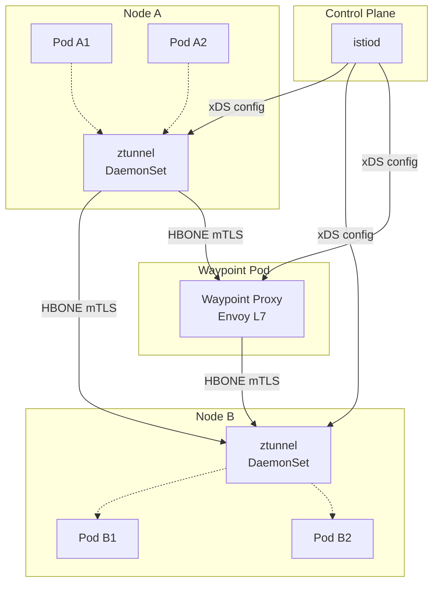
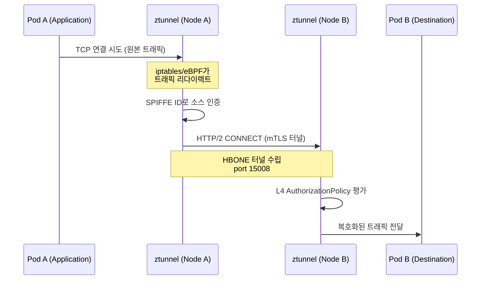
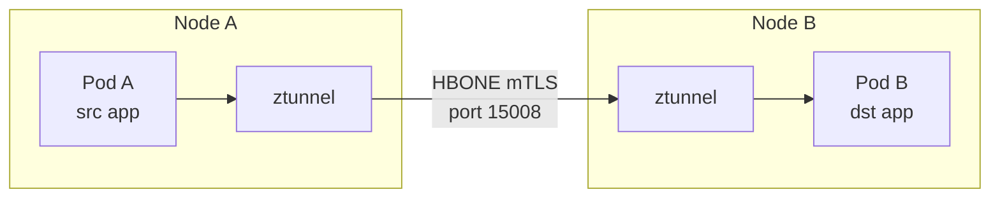
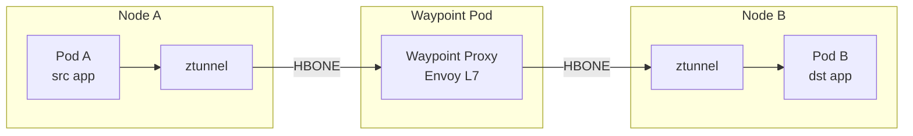
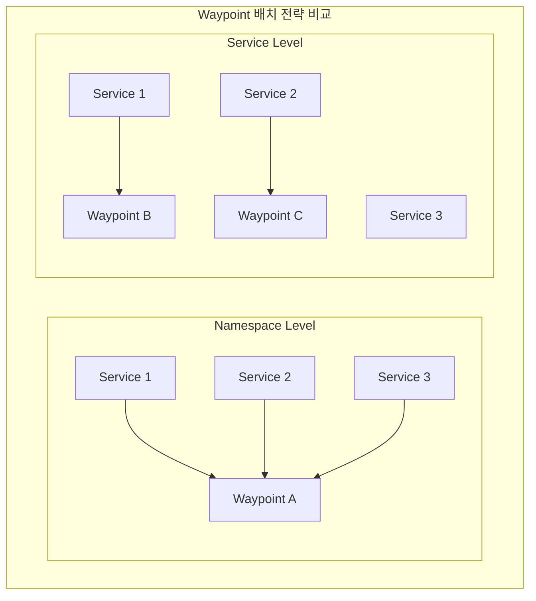
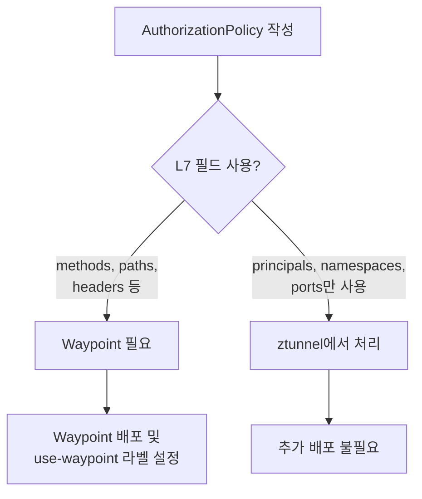
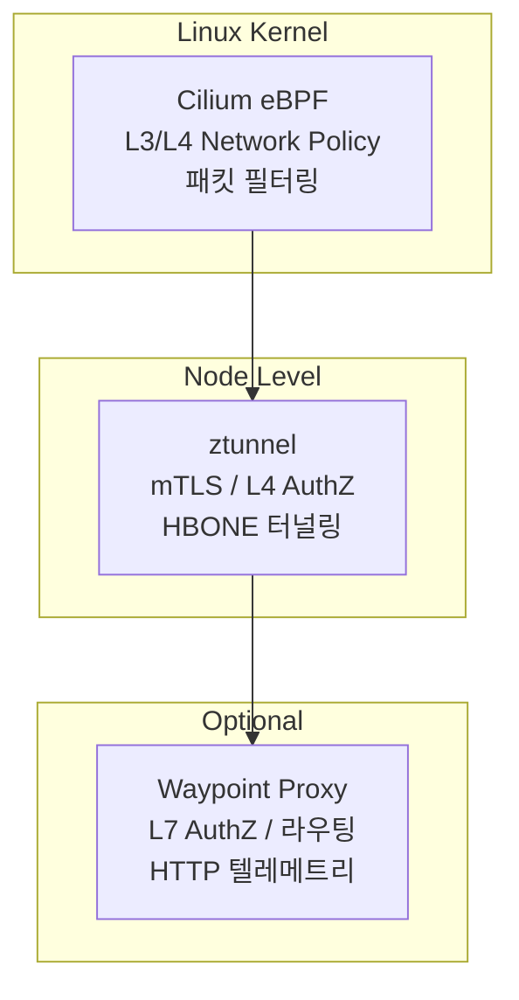

> **원문 ([Ambient Overview](https://istio.io/latest/docs/ambient/overview/)):**
> "In ambient mode, Istio implements its features using a per-node Layer 4 (L4) proxy, and optionally a per-namespace Layer 7 (L7) proxy."

**번역:** Ambient 모드에서 Istio는 노드당 L4 프록시와, 선택적으로 네임스페이스당 L7 프록시를 사용하여 기능을 구현한다.

Istio의 Sidecar 모드는 강력하지만, Pod마다 Envoy 프록시를 주입하는 구조는 리소스 오버헤드, 수명주기 관리 부담, 업그레이드 시 Pod 재시작 문제를 안고 있다. Ambient Mesh는 이 문제를 근본적으로 해결하기 위해 등장한 Sidecar-less 데이터 플레인 모드다. 이 글에서는 Istio 공식문서를 기반으로 Ambient Mesh의 아키텍처, ztunnel, HBONE, Waypoint Proxy의 동작 원리를 심화 정리한다.

---

## 1. Ambient 개요

### 1.1 Ambient Mesh란 무엇인가

> **원문 ([Ambient Overview](https://istio.io/latest/docs/ambient/overview/)):**
> "In ambient mode, Istio implements its features using a per-node Layer 4 (L4) proxy, and optionally a per-namespace Layer 7 (L7) proxy."

**번역:** Ambient 모드에서 Istio는 노드당 L4 프록시와, 선택적으로 네임스페이스당 L7 프록시를 사용하여 기능을 구현한다.

이 구조는 흔히 "sidecar-less mesh"로 불린다. Sidecar 모드에서는 모든 Pod에 Envoy 프록시가 주입된다. 이는 트래픽 제어의 세밀함을 보장하지만, 운영 관점에서 다음과 같은 부담을 만든다.

- Pod마다 별도의 Envoy 컨테이너가 CPU/Memory를 소비한다
- Istio 버전 업그레이드 시 모든 Pod를 재시작해야 새 사이드카가 적용된다
- 애플리케이션 시작 전에 사이드카가 준비되어야 하는 시작 순서 문제가 발생한다
- Init Container가 iptables 규칙을 수정하므로 `NET_ADMIN` 권한이 필요하다

> **원문 ([Ambient Overview](https://istio.io/latest/docs/ambient/overview/)):**
> "Ambient mode splits Istio's functionality into two distinct layers."

**번역:** Ambient 모드는 Istio의 기능을 두 개의 명확한 계층으로 분리한다.

첫 번째는 ztunnel 기반의 보안 오버레이 계층(L4)이고, 두 번째는 Waypoint Proxy 기반의 고급 기능 계층(L7)이다. 이 분리가 Ambient Mesh의 핵심 설계 원리다.

### 1.2 점진적 도입 모델

> **원문 ([Ambient Overview](https://istio.io/latest/docs/ambient/overview/)):**
> "This layered approach allows you to adopt Istio in a more incremental fashion, smoothly transitioning from no mesh, to a secure L4 overlay, to full L7 processing."

**번역:** 이 계층적 접근 방식을 통해 Istio를 더 점진적으로 도입할 수 있으며, 메시 미참여 상태에서 보안 L4 오버레이, 그리고 전체 L7 처리로 원활하게 전환할 수 있다.

세 단계로 나뉜다.

| 단계 | 구성 | 제공 기능 |
|---|---|---|
| 메시 미참여 | 라벨 없음 | 기존 Kubernetes 네트워크 그대로 |
| L4 (ztunnel) | `istio.io/dataplane-mode=ambient` | mTLS, L4 인가, TCP 텔레메트리 |
| L7 (waypoint) | ztunnel + Waypoint Proxy 배포 | HTTP 라우팅, 재시도, L7 인가, HTTP 텔레메트리 |

이 구조 덕분에 단순히 mTLS와 L4 보안만 필요한 워크로드는 ztunnel만으로 충분하고, HTTP 기반의 세밀한 트래픽 제어가 필요한 워크로드에만 Waypoint Proxy를 추가하면 된다. 모든 워크로드에 전체 Envoy를 강제하는 Sidecar 모드와 대비된다.

### 1.3 Sidecar 모드와의 공존

> **원문 ([Ambient Overview](https://istio.io/latest/docs/ambient/overview/)):**
> "Pods and workloads using sidecar mode can co-exist within the same mesh as pods using ambient mode."

**번역:** 사이드카 모드를 사용하는 Pod 및 워크로드는 Ambient 모드를 사용하는 Pod과 동일한 메시 내에서 공존할 수 있다.

같은 클러스터 내에서 일부 네임스페이스는 Sidecar 모드, 다른 네임스페이스는 Ambient 모드로 운영할 수 있다. ztunnel은 사이드카가 이미 주입된 Pod의 트래픽은 가로채지 않는다. 이 설계 덕분에 기존 Sidecar 기반 서비스 메시를 운영하는 환경에서 Ambient로의 마이그레이션을 무중단으로 진행할 수 있다.

---

## 2. Ambient 아키텍처

### 2.1 전체 구조

> **원문 ([Ambient Overview](https://istio.io/latest/docs/ambient/overview/)):**
> "Ambient mode splits Istio's functionality into two distinct layers."

**번역:** Ambient 모드는 Istio의 기능을 두 개의 명확한 계층으로 분리한다.

기본 계층은 ztunnel이 제공하는 보안 오버레이로, 라우팅과 제로 트러스트 보안을 담당한다. 선택적 계층은 Waypoint Proxy가 제공하는 L7 고급 기능이다.



이 다이어그램에서 핵심은 세 가지다.

1. **istiod(Control Plane)**가 ztunnel과 Waypoint 모두에게 xDS 설정을 전달한다
2. **ztunnel**은 DaemonSet으로 각 노드에 하나씩 배포되어, 해당 노드의 모든 Ambient 참여 Pod 트래픽을 처리한다
3. **Waypoint Proxy**는 별도의 Pod으로 배포되며, L7 정책이 필요한 경우에만 트래픽 경로에 삽입된다

### 2.2 ztunnel (Zero-Trust Tunnel)

> **원문 ([Ambient Overview](https://istio.io/latest/docs/ambient/overview/)):**
> "The ztunnel (Zero Trust tunnel) component is a purpose-built, per-node proxy."

**번역:** ztunnel(Zero Trust Tunnel) 컴포넌트는 특별히 구축된 노드별 프록시다.

> **원문 ([Ambient Overview](https://istio.io/latest/docs/ambient/overview/)):**
> "Ztunnel is responsible for securely connecting and authenticating workloads."

**번역:** ztunnel은 워크로드를 안전하게 연결하고 인증하는 역할을 담당한다.

ztunnel의 핵심 특성을 정리하면 다음과 같다.

| 항목 | 내용 |
|---|---|
| 배포 방식 | DaemonSet (노드당 1개) |
| 구현 언어 | Rust |
| 담당 계층 | L4 (TCP) |
| 주요 기능 | mTLS 종료/시작, L4 AuthorizationPolicy, TCP 텔레메트리 |
| 프로토콜 | HBONE (HTTP/2 CONNECT 기반 터널링) |
| 리소스 영향 | 경량 - Pod별 사이드카 대비 메모리/CPU 절감 |

ztunnel이 Rust로 구현되어 L3/L4 기능만 처리하는 이유는 성능과 안전성 때문이다. Go 기반의 Envoy 대신 Rust를 선택함으로써 메모리 안전성을 보장하면서도 C/C++ 수준의 성능을 달성했다. 노드당 하나의 프록시가 해당 노드의 모든 Pod 트래픽을 처리해야 하므로, 리소스 효율성이 핵심 설계 목표였다.

> **원문 ([Ambient Overview](https://istio.io/latest/docs/ambient/overview/)):**
> "Does not terminate workload HTTP traffic or parse workload HTTP headers."

**번역:** 워크로드의 HTTP 트래픽을 종료하거나 워크로드의 HTTP 헤더를 파싱하지 않는다.

ztunnel은 의도적으로 L4 기능만 처리하도록 설계되었다. HTTP 파싱, 헤더 조작, 재시도 같은 L7 기능은 포함하지 않는다. 이 제한이 보안 측면에서도 장점이 된다. 노드 레벨에서 실행되는 공유 프록시가 L7 트래픽을 해석할 수 있다면 보안 경계(blast radius)가 넓어지기 때문이다.

### 2.3 HBONE (HTTP-Based Overlay Network Encapsulation)

> **원문 ([Ambient Overview](https://istio.io/latest/docs/ambient/overview/)):**
> ztunnel은 "HBONE (HTTP CONNECT-based tunneling protocol)"을 통해 트래픽을 라우팅한다.

**번역:** ztunnel은 HBONE(HTTP CONNECT 기반 터널링 프로토콜)을 통해 트래픽을 라우팅한다.

> **원문 ([Ambient Data Plane](https://istio.io/latest/docs/ambient/architecture/data-plane/)):**
> "All inbound and outbound L4 TCP traffic between workloads in the ambient mesh is secured by the data plane, using mTLS via HBONE, ztunnel, and x509 certificates."

**번역:** Ambient 메시 내 워크로드 간의 모든 인바운드 및 아웃바운드 L4 TCP 트래픽은 HBONE, ztunnel, x509 인증서를 통한 mTLS를 사용하여 데이터 플레인에 의해 보호된다.

HBONE의 동작 과정을 단계별로 정리한다.



HBONE이 기존 TCP 직접 통신 대신 HTTP/2 CONNECT를 사용하는 이유가 있다.

1. **mTLS 자동 적용**: 터널 자체가 TLS로 암호화되므로, 애플리케이션이 TLS를 구현하지 않아도 전송 구간이 보호된다
2. **메타데이터 전달**: HTTP/2 헤더를 통해 소스 ID, 대상 서비스 정보 등의 메타데이터를 터널 레벨에서 전달할 수 있다
3. **멀티플렉싱**: HTTP/2의 스트림 멀티플렉싱으로 하나의 TCP 연결에서 여러 논리적 연결을 처리한다
4. **표준 프로토콜**: HTTP/2 CONNECT는 RFC 7540에 정의된 표준이므로, 로드밸런서나 방화벽과의 호환성이 높다

HBONE 터널의 기본 포트는 **15008**이다. 이 포트가 노드 간 방화벽에서 허용되어야 Ambient 메시가 정상 동작한다.

### 2.4 Waypoint Proxy

> **원문 ([Ambient Overview](https://istio.io/latest/docs/ambient/overview/)):**
> "The waypoint proxy is a deployment of the Envoy proxy; the same engine that Istio uses for sidecar mode."

**번역:** Waypoint 프록시는 Envoy 프록시의 배포이며, Istio가 사이드카 모드에서 사용하는 것과 동일한 엔진이다.

> **원문 ([Waypoint Usage](https://istio.io/latest/docs/ambient/usage/waypoint/)):**
> "A waypoint proxy is an optional deployment of the Envoy-based proxy to add Layer 7 (L7) processing to a defined set of workloads."

**번역:** Waypoint 프록시는 정의된 워크로드 집합에 L7 처리를 추가하기 위한 Envoy 기반 프록시의 선택적 배포다.

Waypoint는 애플리케이션 Pod 외부에서 실행되며, 독립적으로 설치된다. Waypoint Proxy의 핵심 역할은 다음과 같다.

- HTTP 라우팅 (VirtualService)
- 재시도, 타임아웃, Circuit Breaker (DestinationRule)
- L7 AuthorizationPolicy (methods, paths, headers 기반 인가)
- HTTP 텔레메트리 (요청 수, 지연 시간, 응답 코드 분포)
- 헤더 조작, 폴트 인젝션

> **원문 ([Ambient Data Plane](https://istio.io/latest/docs/ambient/architecture/data-plane/)):**
> Waypoint 프록시는 "L7 policies: AuthorizationPolicy, RequestAuthentication, WasmPlugin, Telemetry"를 적용한다.

**번역:** Waypoint 프록시는 AuthorizationPolicy, RequestAuthentication, WasmPlugin, Telemetry 등의 L7 정책을 적용한다.

Waypoint는 일반적인 Envoy 프록시이므로 Istio의 기존 L7 기능을 그대로 사용할 수 있다. 차이점은 Pod 내부가 아닌 별도의 Pod으로 배포된다는 점이다. 이 구조 덕분에 Waypoint의 스케일링, 업그레이드, 리소스 관리가 애플리케이션과 독립적으로 이루어진다.

---

## 3. Traffic Flow 상세

### 3.1 L4-only 트래픽 흐름 (ztunnel만 사용)

> **원문 ([Ambient Data Plane](https://istio.io/latest/docs/ambient/architecture/data-plane/)):**
> "When a pod in an ambient mesh makes an outbound request, it will be transparently redirected to the node-local ztunnel."

**번역:** Ambient 메시 내의 Pod이 아웃바운드 요청을 보내면, 해당 요청은 투명하게 노드 로컬 ztunnel로 리다이렉트된다.

> **원문 ([Ambient Data Plane](https://istio.io/latest/docs/ambient/architecture/data-plane/)):**
> "When a pod in an ambient mesh receives an inbound request, it will be transparently redirected to the node-local ztunnel."

**번역:** Ambient 메시 내의 Pod이 인바운드 요청을 수신하면, 해당 요청은 투명하게 노드 로컬 ztunnel로 리다이렉트된다.

Waypoint Proxy 없이 ztunnel만으로 트래픽이 전달되는 경로를 상세히 정리한다.



**단계별 동작:**

1. **Pod A가 Pod B로 TCP 연결을 시도한다.** 애플리케이션은 대상 Service의 ClusterIP나 DNS 이름으로 일반적인 TCP 연결을 맺는다. 애플리케이션 코드에는 어떤 변경도 필요 없다.

2. **트래픽 리다이렉션이 발생한다.** 위의 공식문서 원문처럼 아웃바운드 요청은 투명하게 노드 로컬 ztunnel로 리다이렉트된다. 이 리다이렉션은 커널 레벨에서 투명하게 수행되므로 애플리케이션은 인지하지 못한다.

3. **소스 ztunnel이 HBONE 터널을 수립한다.** ztunnel은 대상 Pod가 위치한 노드의 ztunnel과 HTTP/2 CONNECT를 통해 HBONE 터널을 생성한다. 이 과정에서 mTLS가 자동으로 적용되며, 소스와 대상 모두 SPIFFE ID 기반으로 인증된다.

4. **대상 ztunnel이 L4 정책을 평가한다.** 수신 측 ztunnel은 트래픽이 도착하면 해당 목적지에 적용된 L4 AuthorizationPolicy를 평가한다. 정책에 의해 거부되면 연결이 차단된다.

> **원문 ([Ambient Data Plane](https://istio.io/latest/docs/ambient/architecture/data-plane/)):**
> ztunnel은 "Authorization Policies"를 적용한 후 트래픽을 전달한다.

**번역:** ztunnel은 인가 정책을 적용한 후 트래픽을 전달한다.

5. **대상 ztunnel이 Pod B로 트래픽을 전달한다.** 정책 평가를 통과하면 ztunnel이 HBONE 터널을 복호화하고, 원본 TCP 트래픽을 Pod B로 전달한다.

### 3.2 L7 트래픽 흐름 (ztunnel + Waypoint)

> **원문 ([Ambient Data Plane](https://istio.io/latest/docs/ambient/architecture/data-plane/)):**
> Waypoint 프록시는 "exclusively receive HBONE traffic"하며, L7 로드밸런싱과 엔드포인트 간 라우팅을 수행한다.

**번역:** Waypoint 프록시는 HBONE 트래픽만 수신하며, L7 로드밸런싱과 엔드포인트 간 라우팅을 수행한다.

L7 정책이 필요한 경우 트래픽 경로에 Waypoint Proxy가 추가된다.



**단계별 동작:**

1. **Pod A가 Pod B로 TCP 연결을 시도한다.** L4-only 경로와 동일하다.

2. **트래픽 리다이렉션이 발생한다.** 로컬 ztunnel로 리다이렉트된다.

3. **소스 ztunnel이 Waypoint 존재를 감지한다.** ztunnel은 istiod로부터 받은 xDS 설정을 확인하여, 대상 서비스(또는 네임스페이스)에 Waypoint Proxy가 연결되어 있는지 판단한다. Waypoint가 존재하면 트래픽을 대상 노드의 ztunnel이 아닌 Waypoint Proxy로 먼저 보낸다.

4. **소스 ztunnel이 Waypoint로 HBONE 터널을 수립한다.** Waypoint Proxy와 mTLS 기반 HBONE 연결을 맺고 트래픽을 전달한다. Waypoint는 HBONE 트래픽만 수신하도록 설계되어 있다.

5. **Waypoint Proxy가 L7 정책을 적용한다.** Waypoint는 전체 Envoy 프록시이므로 HTTP 요청을 파싱하고, VirtualService(라우팅), DestinationRule(재시도/타임아웃), L7 AuthorizationPolicy(메서드/경로 기반 인가)를 적용한다.

6. **Waypoint가 대상 ztunnel로 HBONE 터널을 수립한다.** L7 정책 평가를 통과한 트래픽을 대상 노드의 ztunnel로 전달한다.

7. **대상 ztunnel이 Pod B로 트래픽을 전달한다.** 최종적으로 복호화된 트래픽이 Pod B에 도달한다.

### 3.3 워크로드 카테고리

> **원문 ([Ambient Data Plane](https://istio.io/latest/docs/ambient/architecture/data-plane/)):**
> 워크로드는 "Out of Mesh, In Mesh (L4), In Mesh with Waypoint (L7)"의 세 가지 카테고리로 나뉜다.

**번역:** 워크로드는 메시 외부, 메시 내부(L4), Waypoint 포함 메시 내부(L7)의 세 가지 카테고리로 분류된다.

| 카테고리 | 설명 | 적용 기능 |
|---|---|---|
| Out of Mesh | Ambient 라벨 없음 | 없음 (일반 K8s 네트워크) |
| In Mesh (L4) | `istio.io/dataplane-mode=ambient` | mTLS, L4 AuthZ, TCP 텔레메트리 |
| In Mesh with Waypoint (L7) | L4 + `istio.io/use-waypoint` | 위 L4 전체 + HTTP 라우팅, L7 AuthZ, HTTP 텔레메트리 |

### 3.4 트래픽 리다이렉션: iptables vs eBPF

참고: 아래 내용은 공식문서의 개념을 기반으로 정리한 것이다.

트래픽을 ztunnel로 리다이렉트하는 메커니즘은 두 가지가 있다.

| 방식 | 동작 원리 | 장점 | 단점 |
|---|---|---|---|
| iptables | netfilter 규칙으로 REDIRECT/TPROXY 설정 | 범용성 높음, 모든 커널 지원 | 규칙 수 증가 시 성능 저하, 선형 탐색 |
| eBPF | 커널 내 BPF 프로그램으로 패킷 경로 직접 조작 | 높은 성능, 규칙 수 무관한 O(1) 탐색 | 최소 커널 버전 요구 (5.x+) |

Cilium CNI를 사용하는 환경에서는 eBPF 기반 리다이렉션이 자연스럽게 적용된다. Istio의 CNI node agent는 Cilium과의 통합을 공식 지원한다.

---

## 4. 보안: mTLS와 인증서 관리

### 4.1 mTLS 자동 적용

> **원문 ([Ambient Data Plane](https://istio.io/latest/docs/ambient/architecture/data-plane/)):**
> "All inbound and outbound L4 TCP traffic between workloads in the ambient mesh is secured by the data plane, using mTLS via HBONE, ztunnel, and x509 certificates."

**번역:** Ambient 메시 내 워크로드 간의 모든 인바운드 및 아웃바운드 L4 TCP 트래픽은 HBONE, ztunnel, x509 인증서를 통한 mTLS를 사용하여 데이터 플레인에 의해 보호된다.

Ambient 메시에 참여하는 워크로드 간의 모든 TCP 통신은 자동으로 mTLS가 적용된다. 애플리케이션 코드에 TLS 관련 설정이 전혀 필요 없다.

### 4.2 인증서 보안 격리

> **원문 ([Ambient Data Plane](https://istio.io/latest/docs/ambient/architecture/data-plane/)):**
> ztunnel은 "can only request certificates for identities running on its specific node" (CA 적용).

**번역:** ztunnel은 자신이 위치한 특정 노드에서 실행 중인 ID에 대한 인증서만 요청할 수 있다.

이 제한은 보안 격리를 강화하기 위한 설계다. 노드 A의 ztunnel이 노드 B에서 실행 중인 워크로드의 인증서를 요청할 수 없으므로, 하나의 노드가 침해되더라도 다른 노드 워크로드의 ID를 도용할 수 없다.

### 4.3 SPIFFE와 mTLS

참고: 아래 내용은 공식문서의 개념을 기반으로 정리한 것이다.

Istio의 mTLS는 SPIFFE(Secure Production Identity Framework for Everyone) 표준을 기반으로 한다. 각 워크로드에 `spiffe://cluster.local/ns/{namespace}/sa/{serviceaccount}` 형식의 ID가 부여되며, 이 ID로 상호 인증이 이루어진다.

```
spiffe://cluster.local/ns/default/sa/httpbin
```

ztunnel은 이 SPIFFE ID를 기반으로 L4 AuthorizationPolicy의 `principals` 필드를 평가한다. 인증서 발급과 갱신은 istiod가 담당한다.

---

## 5. 텔레메트리

### 5.1 ztunnel TCP 메트릭

> **원문 ([Ambient Data Plane](https://istio.io/latest/docs/ambient/architecture/data-plane/)):**
> "Ztunnel emits the full set of Istio Standard TCP Metrics."

**번역:** ztunnel은 Istio 표준 TCP 메트릭의 전체 집합을 방출한다.

ztunnel의 텔레메트리는 L4 수준이므로 TCP 바이트, 연결 수, 연결 시간 등을 수집한다.

### 5.2 Waypoint HTTP 메트릭

> **원문 ([Waypoint Usage](https://istio.io/latest/docs/ambient/usage/waypoint/)):**
> Waypoint가 필요한 기능에는 "HTTP metrics, access logging, tracing"이 포함된다.

**번역:** Waypoint가 필요한 기능에는 HTTP 메트릭, 접근 로깅, 트레이싱이 포함된다.

HTTP 레벨의 메트릭(요청 수, 응답 코드, 지연 시간)이 필요하면 Waypoint를 배포해야 한다. Prometheus 메트릭 수집 대상에 ztunnel과 Waypoint를 모두 포함해야 전체 그림이 보인다.

---

## 6. Ambient 메시 참여 방법

### 6.1 네임스페이스 레벨 참여

참고: 아래 내용은 공식문서의 개념을 기반으로 정리한 것이다.

네임스페이스에 라벨 하나만 추가하면 해당 네임스페이스의 모든 Pod가 Ambient 메시에 참여한다.

```bash
kubectl label namespace default istio.io/dataplane-mode=ambient
```

이 라벨이 적용되면 다음이 자동으로 이루어진다.

- Istio CNI node agent가 해당 네임스페이스의 Pod 트래픽을 ztunnel로 리다이렉트하도록 규칙을 설정한다
- Pod 간 통신에 mTLS가 자동 적용된다
- L4 AuthorizationPolicy가 적용 가능해진다
- TCP 텔레메트리(바이트 수, 연결 수, 연결 시간)가 수집된다

중요한 점은 **Pod 재시작이 필요 없다**는 것이다. Sidecar 모드에서는 사이드카 주입을 위해 Pod을 재시작해야 하지만, Ambient에서는 라벨 적용 즉시 ztunnel이 트래픽을 가로채기 시작한다.

### 6.2 메시 해제

```bash
kubectl label namespace default istio.io/dataplane-mode-
```

라벨을 제거하면 ztunnel이 해당 네임스페이스의 트래픽 리다이렉션을 중단한다. 역시 Pod 재시작 없이 즉시 적용된다.

---

## 7. Waypoint Proxy 구성

### 7.1 Waypoint 배포

> **원문 ([Waypoint Usage](https://istio.io/latest/docs/ambient/usage/waypoint/)):**
> "A waypoint proxy is an optional deployment of the Envoy-based proxy to add Layer 7 (L7) processing to a defined set of workloads."

**번역:** Waypoint 프록시는 정의된 워크로드 집합에 L7 처리를 추가하기 위한 Envoy 기반 프록시의 선택적 배포다.

> **원문 ([Waypoint Usage](https://istio.io/latest/docs/ambient/usage/waypoint/)):**
> "Most of the features of ambient mode are provided by the ztunnel node proxy" (L4 only).

**번역:** Ambient 모드의 대부분의 기능은 ztunnel 노드 프록시가 제공한다(L4만 해당).

istioctl을 사용한 배포 방법이다.

> **원문 ([Waypoint Usage](https://istio.io/latest/docs/ambient/usage/waypoint/)):**
> 배포 명령: `istioctl waypoint apply -n [namespace]`

```bash
# 네임스페이스에 waypoint 배포
istioctl waypoint apply --namespace default

# 특정 서비스 어카운트에 waypoint 배포
istioctl waypoint apply --namespace default --name reviews-waypoint --for service
```

> **원문 ([Waypoint Usage](https://istio.io/latest/docs/ambient/usage/waypoint/)):**
> Waypoint는 "Kubernetes Gateway resources with `gatewayClassName: istio-waypoint`"를 사용하여 배포된다.

**번역:** Waypoint는 `gatewayClassName: istio-waypoint`를 사용하는 Kubernetes Gateway 리소스를 통해 배포된다.

Kubernetes Gateway API를 사용한 선언적 배포도 가능하다.

```yaml
apiVersion: gateway.networking.k8s.io/v1
kind: Gateway
metadata:
  name: waypoint
  namespace: default
  labels:
    istio.io/waypoint-for: service
spec:
  gatewayClassName: istio-waypoint
  listeners:
  - name: mesh
    port: 15008
    protocol: HBONE
```

```bash
kubectl apply -f waypoint-gateway.yaml
```

`gatewayClassName: istio-waypoint`가 핵심이다. 이 값이 Istio에게 이 Gateway가 Waypoint Proxy로 사용될 것임을 알려준다. `listeners`의 포트 15008은 HBONE 트래픽을 수신하기 위한 포트다.

### 7.2 Waypoint 트래픽 유형

> **원문 ([Waypoint Usage](https://istio.io/latest/docs/ambient/usage/waypoint/)):**
> `istio.io/waypoint-for` 라벨의 트래픽 유형은 "service (default), workload, all, none"이다.

**번역:** `istio.io/waypoint-for` 라벨의 트래픽 유형은 service(기본값), workload, all, none이다.

| 값 | 설명 |
|---|---|
| `service` (기본값) | 서비스 주소로 향하는 트래픽만 Waypoint 경유 |
| `workload` | 워크로드(Pod IP)로 직접 향하는 트래픽만 Waypoint 경유 |
| `all` | 서비스 + 워크로드 트래픽 모두 Waypoint 경유 |
| `none` | Waypoint를 사용하지 않음 |

### 7.3 Waypoint 연결 (Enrollment)

> **원문 ([Waypoint Usage](https://istio.io/latest/docs/ambient/usage/waypoint/)):**
> `istio.io/use-waypoint` 라벨로 enrollment을 설정하며, 적용 범위는 "namespace, service, or individual pod"이다.

**번역:** `istio.io/use-waypoint` 라벨로 등록을 설정하며, 네임스페이스, 서비스, 또는 개별 Pod에 적용할 수 있다.

#### 네임스페이스 레벨

```bash
kubectl label namespace default istio.io/use-waypoint=waypoint
```

해당 네임스페이스의 모든 서비스로 향하는 트래픽이 Waypoint를 경유한다.

#### 서비스 레벨

```bash
kubectl label service httpbin istio.io/use-waypoint=waypoint
```

특정 서비스로 향하는 트래픽만 Waypoint를 경유한다. 다른 서비스의 트래픽은 ztunnel에서 직접 처리된다.

#### Pod 레벨

```bash
kubectl label pod httpbin-abc123 istio.io/use-waypoint=waypoint
```

특정 Pod로 향하는 트래픽만 Waypoint를 경유한다.

### 7.4 Waypoint 우선순위

> **원문 ([Waypoint Usage](https://istio.io/latest/docs/ambient/usage/waypoint/)):**
> 우선순위는 "Pod label > Service label > Namespace label" 순이다.

**번역:** 우선순위는 Pod 라벨 > Service 라벨 > Namespace 라벨 순서다.

Pod에 직접 `use-waypoint` 라벨이 있으면 해당 라벨이 Service나 Namespace의 라벨보다 우선한다. 이를 통해 특정 Pod만 다른 Waypoint를 사용하거나 Waypoint를 비활성화할 수 있다.

### 7.5 Cross-Namespace Waypoint

> **원문 ([Waypoint Usage](https://istio.io/latest/docs/ambient/usage/waypoint/)):**
> 크로스 네임스페이스의 경우 "`istio.io/use-waypoint` and `istio.io/use-waypoint-namespace`" 라벨을 함께 사용한다.

**번역:** 크로스 네임스페이스 Waypoint 사용 시 `istio.io/use-waypoint`와 `istio.io/use-waypoint-namespace` 라벨을 함께 사용한다.

다른 네임스페이스에 배포된 Waypoint를 사용해야 할 때, 두 라벨을 조합하여 대상 Waypoint의 이름과 네임스페이스를 모두 지정한다.

### 7.6 Waypoint가 필요한 기능 목록

> **원문 ([Waypoint Usage](https://istio.io/latest/docs/ambient/usage/waypoint/)):**
> Waypoint가 필요한 기능: "HTTP routing & load balancing, circuit breaking, rate limiting, fault injection, retries, timeouts, rich authorization policies based on L7 primitives."

**번역:** Waypoint가 필요한 기능: HTTP 라우팅 및 로드밸런싱, 서킷 브레이킹, 속도 제한, 장애 주입, 재시도, 타임아웃, L7 프리미티브 기반의 고급 인가 정책.

이 기능들은 모두 HTTP 요청의 내용을 파싱해야 하므로 L4만 처리하는 ztunnel로는 불가능하다. Waypoint를 배포하지 않으면 위 기능을 사용할 수 없다.

### 7.7 Waypoint 배치 전략



| 전략 | 장점 | 단점 | 적합한 경우 |
|---|---|---|---|
| Namespace Level | 설정 단순, 일괄 관리 | 불필요한 서비스도 Waypoint 경유 | L7 정책이 네임스페이스 전체에 필요할 때 |
| Service Level | 세밀한 제어, 리소스 효율 | Waypoint 수 증가, 관리 복잡도 증가 | 특정 서비스만 L7 필요할 때 |
| Pod Level | 가장 세밀한 제어 | 관리 부담 최대, Pod 재생성 시 라벨 재적용 필요 | 테스트/디버깅 용도 |

실무에서는 **Service Level** 배치가 가장 많이 사용된다. 네임스페이스 내에서 L7 정책이 필요한 서비스만 Waypoint를 연결하고, 나머지는 ztunnel의 L4 처리만으로 운영하는 것이 리소스 효율적이다.

### 7.8 Waypoint 리소스 설정

참고: 아래 내용은 공식문서의 개념을 기반으로 정리한 것이다.

Waypoint Proxy는 일반적인 Kubernetes Deployment이므로 리소스 설정과 HPA를 적용할 수 있다.

```yaml
apiVersion: gateway.networking.k8s.io/v1
kind: Gateway
metadata:
  name: waypoint
  namespace: default
  annotations:
    proxy.istio.io/config: |
      resources:
        requests:
          cpu: "200m"
          memory: "128Mi"
        limits:
          cpu: "1000m"
          memory: "512Mi"
spec:
  gatewayClassName: istio-waypoint
  listeners:
  - name: mesh
    port: 15008
    protocol: HBONE
```

트래픽 규모에 따라 Waypoint의 replicas를 조정해야 한다. 단일 Waypoint가 병목이 되면 해당 서비스 전체의 지연 시간이 증가할 수 있다.

---

## 8. AuthorizationPolicy: L4 vs L7

### 8.1 L4 Authorization (ztunnel에서 처리)

> **원문 ([Ambient Data Plane](https://istio.io/latest/docs/ambient/architecture/data-plane/)):**
> ztunnel은 "Authorization Policies"를 트래픽 전달 전에 적용한다.

**번역:** ztunnel은 트래픽 전달 전에 인가 정책을 적용한다.

L4 AuthorizationPolicy는 ztunnel이 직접 처리한다. Waypoint Proxy가 없어도 동작한다.

```yaml
apiVersion: security.istio.io/v1
kind: AuthorizationPolicy
metadata:
  name: allow-sleep-to-httpbin
  namespace: default
spec:
  targetRefs:
  - kind: Service
    group: ""
    name: httpbin
  action: ALLOW
  rules:
  - from:
    - source:
        principals:
        - cluster.local/ns/default/sa/sleep
```

이 정책은 `sleep` ServiceAccount의 워크로드만 `httpbin` 서비스에 접근할 수 있도록 허용한다. L4 레벨이므로 소스의 SPIFFE ID(ServiceAccount 기반)와 대상 포트만으로 판단한다.

L4에서 사용 가능한 필드는 다음과 같다.

| 필드 | 설명 |
|---|---|
| `source.principals` | 소스의 SPIFFE ID (ServiceAccount 기반) |
| `source.namespaces` | 소스 네임스페이스 |
| `source.ipBlocks` | 소스 IP 범위 |
| `to.operation.ports` | 대상 포트 |

### 8.2 L7 Authorization (Waypoint에서 처리)

> **원문 ([Ambient Data Plane](https://istio.io/latest/docs/ambient/architecture/data-plane/)):**
> Waypoint는 "L7 policies: AuthorizationPolicy, RequestAuthentication, WasmPlugin, Telemetry"를 적용한다.

**번역:** Waypoint는 AuthorizationPolicy, RequestAuthentication, WasmPlugin, Telemetry 등의 L7 정책을 적용한다.

HTTP 메서드, 경로, 헤더 등 L7 필드를 사용하는 AuthorizationPolicy는 Waypoint Proxy가 반드시 필요하다.

```yaml
apiVersion: security.istio.io/v1
kind: AuthorizationPolicy
metadata:
  name: allow-sleep-get-info
  namespace: default
spec:
  targetRefs:
  - kind: Service
    group: ""
    name: httpbin
  action: ALLOW
  rules:
  - from:
    - source:
        principals:
        - cluster.local/ns/default/sa/sleep
    to:
    - operation:
        methods: ["GET"]
        paths: ["/info*"]
```

이 정책은 `sleep` 워크로드가 `httpbin`의 `/info*` 경로에 `GET` 메서드로만 접근할 수 있도록 제한한다. `methods`와 `paths`는 L7 필드이므로 ztunnel은 이 정책을 평가할 수 없다. Waypoint가 없는 상태에서 이 정책을 적용하면 정책이 무시되거나 오류가 발생한다.

L7에서 추가로 사용 가능한 필드는 다음과 같다.

| 필드 | 설명 |
|---|---|
| `to.operation.methods` | HTTP 메서드 (GET, POST, PUT, DELETE 등) |
| `to.operation.paths` | HTTP 경로 패턴 |
| `to.operation.hosts` | HTTP Host 헤더 |
| `when.key` | HTTP 헤더, JWT claim 등 조건부 매칭 |

### 8.3 L4/L7 정책 구분 판단 기준



실무에서의 판단 규칙은 간단하다. **HTTP 요청의 내용을 봐야 하면 L7(Waypoint 필요), TCP 연결 정보만으로 충분하면 L4(ztunnel 처리)**이다.

---

## 9. VirtualService와 DestinationRule

> **원문 ([Ambient Data Plane](https://istio.io/latest/docs/ambient/architecture/data-plane/)):**
> Waypoint는 "L7 load balancing and routing across endpoints"를 수행한다.

**번역:** Waypoint는 엔드포인트 간 L7 로드밸런싱과 라우팅을 수행한다.

Ambient 모드에서 VirtualService와 DestinationRule은 Waypoint Proxy가 있을 때만 적용된다. ztunnel은 L4만 처리하므로 HTTP 기반의 트래픽 관리 정책을 해석할 수 없다.

### 9.1 HTTP 라우팅 (VirtualService)

참고: 아래 내용은 공식문서의 개념을 기반으로 정리한 것이다.

```yaml
apiVersion: networking.istio.io/v1
kind: VirtualService
metadata:
  name: reviews-route
  namespace: default
spec:
  hosts:
  - reviews
  http:
  - match:
    - headers:
        end-user:
          exact: jason
    route:
    - destination:
        host: reviews
        subset: v2
  - route:
    - destination:
        host: reviews
        subset: v1
```

이 VirtualService는 `end-user: jason` 헤더가 포함된 요청을 `reviews v2`로 라우팅하고, 나머지 요청은 `reviews v1`으로 보낸다. 이러한 헤더 기반 라우팅은 Waypoint Proxy에서만 처리 가능하다.

### 9.2 재시도/타임아웃 (DestinationRule)

참고: 아래 내용은 공식문서의 개념을 기반으로 정리한 것이다.

```yaml
apiVersion: networking.istio.io/v1
kind: DestinationRule
metadata:
  name: reviews-destination
  namespace: default
spec:
  host: reviews
  trafficPolicy:
    connectionPool:
      tcp:
        maxConnections: 100
      http:
        h2UpgradePolicy: DEFAULT
        maxRequestsPerConnection: 10
    outlierDetection:
      consecutive5xxErrors: 5
      interval: 30s
      baseEjectionTime: 30s
  subsets:
  - name: v1
    labels:
      version: v1
  - name: v2
    labels:
      version: v2
```

`outlierDetection`(이상치 감지)은 연속 5xx 오류가 5회 발생하면 해당 엔드포인트를 30초간 제외하는 Circuit Breaker 역할을 한다. 이 역시 HTTP 응답 코드를 파싱해야 하므로 Waypoint에서만 동작한다.

---

## 10. 왜 Ambient Mesh를 사용하는가

### 10.1 Sidecar 모드의 운영 부담 제거

> **원문 ([Ambient Overview](https://istio.io/latest/docs/ambient/overview/)):**
> "In ambient mode, Istio implements its features using a per-node Layer 4 (L4) proxy, and optionally a per-namespace Layer 7 (L7) proxy."

**번역:** Ambient 모드에서 Istio는 노드당 L4 프록시와, 선택적으로 네임스페이스당 L7 프록시를 사용하여 기능을 구현한다.

이 아키텍처 변경으로 다음과 같은 운영 부담이 제거된다.

| 문제 | Sidecar 모드 | Ambient 모드 |
|---|---|---|
| 리소스 오버헤드 | Pod마다 Envoy (50~100MB 메모리) | 노드당 ztunnel 1개 (공유) |
| 업그레이드 | 모든 Pod 재시작 필요 | ztunnel DaemonSet만 업데이트 |
| 시작 순서 | holdApplicationUntilProxyStarts 필요 | 문제 없음 (Pod 외부) |
| 권한 | init container에 NET_ADMIN 필요 | CNI agent가 노드 레벨에서 처리 |
| 디버깅 | istio-proxy 컨테이너 로그 별도 확인 | 중앙 ztunnel 로그 확인 |

### 10.2 과잉 기능 방지

> **원문 ([Waypoint Usage](https://istio.io/latest/docs/ambient/usage/waypoint/)):**
> "Most of the features of ambient mode are provided by the ztunnel node proxy" (L4 only).

**번역:** Ambient 모드의 대부분의 기능은 ztunnel 노드 프록시가 제공한다(L4만 해당).

대부분의 서비스 간 통신은 mTLS와 기본적인 접근 제어만 필요하다. 전체 Envoy 사이드카의 L7 기능(HTTP 라우팅, 재시도, 헤더 조작 등)을 사용하는 서비스는 전체의 일부에 불과한 경우가 많다. Ambient의 L4/L7 분리 구조는 이 현실을 반영한다.

### 10.3 애플리케이션 투명성

> **원문 ([Ambient Overview](https://istio.io/latest/docs/ambient/overview/)):**
> "This layered approach allows you to adopt Istio in a more incremental fashion, smoothly transitioning from no mesh, to a secure L4 overlay, to full L7 processing."

**번역:** 이 계층적 접근 방식을 통해 Istio를 더 점진적으로 도입할 수 있으며, 메시 미참여 상태에서 보안 L4 오버레이, 그리고 전체 L7 처리로 원활하게 전환할 수 있다.

Ambient 메시 참여와 해제가 Pod 재시작 없이 이루어진다. 라벨 하나로 메시에 참여하고, 라벨 제거로 빠져나올 수 있다. 이는 다음 시나리오에서 유용하다.

- 기존 워크로드에 서비스 메시를 점진적으로 도입할 때
- 메시 문제 발생 시 특정 네임스페이스를 빠르게 메시에서 제외하여 장애 격리할 때
- 비메시 환경에서 운영하던 서비스를 무중단으로 메시에 편입할 때

---

## 11. 사용하지 않으면 어떻게 되는가

참고: 아래 내용은 공식문서의 개념을 기반으로 정리한 것이다.

Ambient 대신 전통적인 Sidecar 모드만 운영하는 경우의 부담을 정리한다.

1. **앱별 프록시 수명주기 관리**: 서비스 수백 개 규모에서 각 Pod의 Envoy 사이드카 버전을 일관성 있게 유지하는 것은 상당한 운영 부담이다. Revision-based 카나리 업그레이드를 사용하더라도, 최종적으로 모든 Pod의 Rolling Restart가 필요하다.

2. **리소스 낭비**: 단순 mTLS/L4 보안만 필요한 워크로드(예: 내부 배치 작업, 단순 TCP 프록시)에도 전체 Envoy 사이드카가 주입되어 메모리와 CPU를 소비한다.

3. **사이드카 시작 순서 문제**: `holdApplicationUntilProxyStarts`를 설정해도, 종료 시에는 `EXIT_ON_ZERO_ACTIVE_CONNECTIONS` 같은 추가 설정이 필요하다. 사이드카의 수명주기가 애플리케이션과 결합되어 있기 때문이다.

4. **보안 권한 확대**: Sidecar 주입을 위한 init container가 `NET_ADMIN` capability를 요구하며, 이는 PodSecurityPolicy/PodSecurityStandard에서 제한 대상이 될 수 있다.

---

## 12. 대체 기술 비교

참고: 아래 내용은 공식문서의 개념을 기반으로 정리한 것이다.

| 항목 | Istio Ambient | Istio Sidecar | Linkerd | Cilium Service Mesh |
|---|---|---|---|---|
| **프록시 위치** | 노드(ztunnel) + 선택(waypoint) | Pod 내 sidecar | Pod 내 micro-proxy | eBPF (커널) + 선택(Envoy) |
| **L4/L7 분리** | 명확 분리 | 통합 (Envoy가 모두 처리) | 통합 (linkerd2-proxy) | L4는 eBPF, L7은 Envoy |
| **프록시 구현체** | ztunnel(Rust) + Envoy(C++) | Envoy(C++) | linkerd2-proxy(Rust) | eBPF + Envoy(C++) |
| **리소스 효율** | 높음 | 낮음 (Pod당 프록시) | 중간 (경량 프록시) | 높음 (커널 내장) |
| **점진 도입** | 매우 용이 (라벨 1개) | 가능 (네임스페이스 라벨) | 가능 (inject annotation) | 가능 (CiliumNetworkPolicy) |
| **기능 폭** | Istio 전체 L7 기능 | Istio 전체 L7 기능 | 핵심 기능 집중 | 제한적 L7 |
| **mTLS** | 자동 (HBONE) | 자동 (PeerAuthentication) | 자동 (identity) | 자동 (Wireguard/IPSec) |
| **CNCF 상태** | Graduated (Istio) | Graduated (Istio) | Graduated | Graduated |

### 12.1 Cilium과의 조합

참고: 아래 내용은 공식문서의 개념을 기반으로 정리한 것이다.

Cilium CNI와 Istio Ambient는 경쟁이 아닌 보완 관계로 사용할 수 있다. Cilium이 CNI와 L3/L4 네트워크 정책을 담당하고, Istio Ambient의 ztunnel이 mTLS와 서비스 레벨 L4 인가를 담당하며, Waypoint가 L7 정책을 처리하는 구조다.



주의할 점은 L7 정책의 주체를 하나로 통일해야 한다는 것이다. Cilium의 `CiliumNetworkPolicy`에서도 L7 정책(HTTP aware)을 설정할 수 있고, Istio Waypoint에서도 L7 AuthorizationPolicy를 설정할 수 있다. 두 곳에서 동시에 L7 정책을 적용하면 디버깅이 매우 어려워진다. 실무에서는 L3/L4는 Cilium, L7은 Istio Waypoint로 역할을 명확히 분리하는 것이 권장된다.

---

## 13. 활용 시 주의점

### 13.1 ztunnel-only vs Waypoint 경계 명확화

> **원문 ([Ambient Overview](https://istio.io/latest/docs/ambient/overview/)):**
> "Ambient mode splits Istio's functionality into two distinct layers."

**번역:** Ambient 모드는 Istio의 기능을 두 개의 명확한 계층으로 분리한다.

네임스페이스 설계 시 L4만 필요한 워크로드와 L7이 필요한 워크로드를 명확히 구분해야 한다. 혼재되어 있으면 Waypoint 배치 전략이 복잡해진다.

```yaml
# L4-only 네임스페이스 (Waypoint 불필요)
apiVersion: v1
kind: Namespace
metadata:
  name: batch-jobs
  labels:
    istio.io/dataplane-mode: ambient
    # istio.io/use-waypoint 라벨 없음 → L4만 적용

---
# L7 필요 네임스페이스 (Waypoint 연결)
apiVersion: v1
kind: Namespace
metadata:
  name: api-gateway
  labels:
    istio.io/dataplane-mode: ambient
    istio.io/use-waypoint: api-waypoint
```

### 13.2 Waypoint 가용성

참고: 아래 내용은 공식문서의 개념을 기반으로 정리한 것이다.

Waypoint Proxy는 트래픽 경로 상의 필수 구성 요소다. Waypoint가 다운되면 해당 Waypoint를 사용하는 모든 L7 트래픽이 차단된다. 따라서 다음을 반드시 설정해야 한다.

```yaml
apiVersion: autoscaling/v2
kind: HorizontalPodAutoscaler
metadata:
  name: waypoint-hpa
  namespace: default
spec:
  scaleTargetRef:
    apiVersion: apps/v1
    kind: Deployment
    name: waypoint
  minReplicas: 2
  maxReplicas: 10
  metrics:
  - type: Resource
    resource:
      name: cpu
      target:
        type: Utilization
        averageUtilization: 70
```

최소 replicas를 2 이상으로 설정하여 단일 장애점(SPOF)을 방지해야 한다. PodDisruptionBudget(PDB)도 함께 설정하여 노드 유지보수 시에도 최소 인스턴스가 유지되도록 한다.

```yaml
apiVersion: policy/v1
kind: PodDisruptionBudget
metadata:
  name: waypoint-pdb
  namespace: default
spec:
  minAvailable: 1
  selector:
    matchLabels:
      gateway.networking.k8s.io/gateway-name: waypoint
```

### 13.3 버전별 기능 지원 확인

참고: 아래 내용은 공식문서의 개념을 기반으로 정리한 것이다.

Ambient 모드는 Istio 1.22에서 Beta로 승격되었으며, 이전 버전에서는 Alpha 상태였다. 프로덕션 적용 전에 사용 중인 Istio 버전에서 지원하는 Ambient 기능 범위를 반드시 확인해야 한다. 특히 다음 항목은 버전에 따라 지원 여부가 달라질 수 있다.

- Multi-cluster Ambient
- DNS 프록시
- Locality-aware load balancing
- 특정 CNI와의 호환성

### 13.4 관측성 설정

> **원문 ([Ambient Data Plane](https://istio.io/latest/docs/ambient/architecture/data-plane/)):**
> "Ztunnel emits the full set of Istio Standard TCP Metrics."

**번역:** ztunnel은 Istio 표준 TCP 메트릭의 전체 집합을 방출한다.

ztunnel의 텔레메트리는 L4 수준이므로 TCP 바이트, 연결 수, 연결 시간만 수집된다. HTTP 레벨의 메트릭(요청 수, 응답 코드, 지연 시간)이 필요하면 Waypoint를 배포해야 한다. Prometheus 메트릭 수집 대상에 ztunnel과 Waypoint를 모두 포함해야 전체 그림이 보인다.

### 13.5 보안 경계 인식

> **원문 ([Ambient Overview](https://istio.io/latest/docs/ambient/overview/)):**
> "Does not terminate workload HTTP traffic or parse workload HTTP headers."

**번역:** 워크로드의 HTTP 트래픽을 종료하거나 워크로드의 HTTP 헤더를 파싱하지 않는다.

ztunnel은 노드 레벨에서 실행되므로, 노드가 침해되면 해당 노드의 모든 Pod 트래픽에 대한 가시성이 노출될 수 있다. 다만 ztunnel이 L4만 처리하도록 제한한 설계 결정이 이 위험을 완화한다. L7 데이터(HTTP 본문, 헤더)에 접근하려면 Waypoint를 경유해야 하므로, 공격 표면이 Sidecar 모드(모든 Pod에서 L7 접근 가능)보다 제한적이다.

---

## 14. 부수 개념 정리

### 14.1 Istio CNI Node Agent

참고: 아래 내용은 공식문서의 개념을 기반으로 정리한 것이다.

Ambient 모드에서 트래픽 리다이렉션은 Istio CNI node agent가 담당한다. 이 에이전트는 DaemonSet으로 배포되며, 다음 역할을 수행한다.

- Ambient 라벨이 있는 네임스페이스의 Pod 감지
- 해당 Pod의 트래픽을 ztunnel로 리다이렉트하는 네트워크 규칙 설정
- Pod 추가/삭제 시 규칙 동적 업데이트

Sidecar 모드의 `istio-init` init container가 Pod 레벨에서 iptables를 수정하는 것과 달리, CNI node agent는 노드 레벨에서 중앙 관리한다. 이 차이가 Pod에 `NET_ADMIN` 권한이 불필요한 이유다.

### 14.2 xDS 프로토콜

참고: 아래 내용은 공식문서의 개념을 기반으로 정리한 것이다.

istiod가 ztunnel과 Waypoint에게 설정을 전달하는 프로토콜이 xDS(x Discovery Service)다. Envoy 프로젝트에서 정의한 표준 API로, 다음과 같은 하위 프로토콜로 구성된다.

| 프로토콜 | 역할 |
|---|---|
| LDS (Listener Discovery Service) | 리스너 설정 전달 |
| RDS (Route Discovery Service) | 라우팅 규칙 전달 |
| CDS (Cluster Discovery Service) | 업스트림 클러스터 설정 전달 |
| EDS (Endpoint Discovery Service) | 엔드포인트(Pod IP) 목록 전달 |
| SDS (Secret Discovery Service) | TLS 인증서/키 전달 |

ztunnel은 이 중 L4 관련 설정만 수신하고, Waypoint는 전체 xDS 설정을 수신한다.

---

## 15. 실무 체크리스트

참고: 아래 내용은 공식문서의 개념을 기반으로 정리한 것이다.

Ambient Mesh를 프로덕션에 도입할 때 확인해야 할 항목을 정리한다.

### 15.1 사전 준비

- [ ] Istio 버전이 Ambient Beta 이상(1.22+)인지 확인
- [ ] CNI 플러그인 호환성 확인 (Cilium, Calico, Flannel 등)
- [ ] 노드 간 포트 15008 (HBONE) 방화벽 허용 확인
- [ ] Kubernetes 버전 호환성 확인 (Gateway API CRD 설치 필요)

### 15.2 배포

- [ ] `istio-cni` DaemonSet 정상 동작 확인
- [ ] ztunnel DaemonSet 모든 노드에 배포 확인
- [ ] 테스트 네임스페이스에서 `istio.io/dataplane-mode=ambient` 라벨 적용
- [ ] Pod 간 mTLS 통신 확인 (`istioctl proxy-config` 또는 ztunnel 로그)

### 15.3 L4 기능 검증

- [ ] L4 AuthorizationPolicy 적용 및 동작 확인
- [ ] TCP 텔레메트리 수집 확인 (Prometheus metrics)
- [ ] mTLS 자동 적용 확인 (평문 트래픽 차단 테스트)

### 15.4 L7 기능 검증 (Waypoint 사용 시)

- [ ] Waypoint Proxy 배포 및 `use-waypoint` 라벨 연결
- [ ] L7 AuthorizationPolicy (methods, paths) 동작 확인
- [ ] VirtualService 라우팅 동작 확인
- [ ] DestinationRule (재시도, 타임아웃, Circuit Breaker) 동작 확인
- [ ] HTTP 텔레메트리 수집 확인

### 15.5 운영

- [ ] Waypoint HPA 및 PDB 설정
- [ ] ztunnel 리소스 모니터링 대시보드 구성
- [ ] Waypoint 리소스 모니터링 대시보드 구성
- [ ] Ambient <-> Sidecar 공존 시 트래픽 경로 문서화
- [ ] 장애 시 메시 해제 절차(라벨 제거) 런북 작성
- [ ] Istio 업그레이드 시 ztunnel/Waypoint 호환성 매트릭스 확인

---

## 16. 면접 대비 핵심 질문

### Q1. Istio Ambient Mesh에서 ztunnel과 Waypoint Proxy의 역할을 구분하여 설명하라.

> **원문 ([Ambient Overview](https://istio.io/latest/docs/ambient/overview/)):**
> "The ztunnel (Zero Trust tunnel) component is a purpose-built, per-node proxy."
> "Ztunnel is responsible for securely connecting and authenticating workloads."

> **원문 ([Ambient Overview](https://istio.io/latest/docs/ambient/overview/)):**
> "The waypoint proxy is a deployment of the Envoy proxy; the same engine that Istio uses for sidecar mode."

**답변 방향:** ztunnel은 DaemonSet으로 각 노드에 배포되는 L4 프록시로, mTLS 수립/종료, L4 AuthorizationPolicy 평가, TCP 텔레메트리 수집을 담당한다. Rust로 구현되어 경량이며, 의도적으로 L7 기능을 배제하여 보안 경계를 최소화했다. Waypoint Proxy는 Envoy 기반 L7 프록시로, HTTP 라우팅, 재시도, L7 인가 등 고급 기능이 필요한 경우에만 선택적으로 배포한다. 이 분리 구조로 대부분의 워크로드는 ztunnel의 L4 보호만으로 운영하고, L7이 필요한 소수의 워크로드에만 Waypoint를 추가하여 리소스 효율을 극대화한다.

**꼬리질문 1:** ztunnel이 L7을 처리하지 않는 보안적 이유는?

> **원문 ([Ambient Overview](https://istio.io/latest/docs/ambient/overview/)):**
> "Does not terminate workload HTTP traffic or parse workload HTTP headers."

ztunnel은 노드 레벨에서 실행되므로 해당 노드의 모든 Pod 트래픽을 처리한다. 공식문서에서 명시한 것처럼 워크로드의 HTTP 트래픽을 종료하거나 HTTP 헤더를 파싱하지 않도록 의도적으로 설계되었다. 이 프록시가 L7 데이터(HTTP 본문, 헤더)를 해석할 수 있다면, 노드 침해 시 공격자가 모든 Pod의 HTTP 레벨 데이터에 접근 가능해진다. L4만 처리하도록 제한함으로써 blast radius를 최소화한 것이다.

**꼬리질문 2:** Waypoint가 다운되면 트래픽에 어떤 영향이 있는가?

Waypoint를 `use-waypoint` 라벨로 연결한 서비스의 L7 트래픽이 전부 차단된다. 이것이 Waypoint의 replicas를 2 이상, PDB를 설정해야 하는 이유다. 장애 발생 시 `use-waypoint` 라벨을 제거하면 트래픽이 ztunnel의 L4 경로로 폴백된다.

### Q2. HBONE 프로토콜이 무엇이며, 왜 일반 TCP 대신 사용하는가?

> **원문 ([Ambient Data Plane](https://istio.io/latest/docs/ambient/architecture/data-plane/)):**
> "All inbound and outbound L4 TCP traffic between workloads in the ambient mesh is secured by the data plane, using mTLS via HBONE, ztunnel, and x509 certificates."

**답변 방향:** HBONE(HTTP-Based Overlay Network Encapsulation)은 HTTP/2 CONNECT를 사용하여 ztunnel 간에 mTLS 터널을 수립하는 프로토콜이다. 공식문서에서 명시한 것처럼 Ambient 메시의 모든 L4 TCP 트래픽은 HBONE, ztunnel, x509 인증서를 통한 mTLS로 보호된다. 기존 TCP 대신 사용하는 이유는 세 가지다. 첫째, HTTP/2 프레이밍을 통해 터널 레벨에서 메타데이터(소스 ID, 대상 정보)를 전달할 수 있다. 둘째, HTTP/2의 스트림 멀티플렉싱으로 하나의 TCP 연결에서 여러 논리적 연결을 처리하여 연결 오버헤드를 줄인다. 셋째, HTTP/2 CONNECT는 RFC 7540 표준이므로 중간 장비(LB, 방화벽)와의 호환성이 높다.

### Q3. Ambient 모드에서 기존 Sidecar 모드 워크로드와 어떻게 공존하는가?

> **원문 ([Ambient Overview](https://istio.io/latest/docs/ambient/overview/)):**
> "Pods and workloads using sidecar mode can co-exist within the same mesh as pods using ambient mode."

**답변 방향:** 공식문서에서 명시한 것처럼 사이드카 모드를 사용하는 Pod과 Ambient 모드를 사용하는 Pod은 동일한 메시 내에서 공존할 수 있다. 동일 클러스터 내에서 네임스페이스 단위로 Ambient와 Sidecar를 혼합 운영할 수 있다. ztunnel은 이미 사이드카가 주입된 Pod의 트래픽은 가로채지 않는다. Sidecar Pod과 Ambient Pod 간의 통신은 각각의 프록시(Envoy sidecar <-> ztunnel)가 mTLS를 수립하여 처리한다. 이 설계로 기존 Sidecar 기반 서비스 메시에서 Ambient로 점진적 마이그레이션이 가능하며, 네임스페이스 단위로 전환하면서 문제가 발생하면 라벨 제거로 즉시 롤백할 수 있다.

---

## 17. 공식문서 전수학습 체크리스트

아래 공식문서를 모두 읽으면 Ambient Mesh의 전체 범위를 커버할 수 있다.

### Ambient Core

- [ ] [Ambient Overview](https://istio.io/latest/docs/ambient/overview/)
- [ ] [Ambient Data Plane](https://istio.io/latest/docs/ambient/architecture/data-plane/)
- [ ] [Ambient Control Plane](https://istio.io/latest/docs/ambient/architecture/control-plane/)
- [ ] [ztunnel](https://istio.io/latest/docs/ambient/architecture/data-plane/#ztunnel)
- [ ] [HBONE](https://istio.io/latest/docs/ambient/architecture/data-plane/#hbone)

### Ambient Usage

- [ ] [Getting Started with Ambient](https://istio.io/latest/docs/ambient/getting-started/)
- [ ] [Configure Waypoint Proxies](https://istio.io/latest/docs/ambient/usage/waypoint/)
- [ ] [L4 Authorization Policy](https://istio.io/latest/docs/ambient/usage/l4-policy/)
- [ ] [L7 Authorization Policy](https://istio.io/latest/docs/ambient/usage/l7-policy/)
- [ ] [Troubleshooting](https://istio.io/latest/docs/ambient/usage/troubleshoot-ztunnel/)

### Ambient Upgrade

- [ ] [Upgrade Ambient](https://istio.io/latest/docs/ambient/upgrade/)

### 관련 개념

- [ ] [Istio Security (mTLS, AuthorizationPolicy)](https://istio.io/latest/docs/concepts/security/)
- [ ] [Kubernetes Gateway API](https://gateway-api.sigs.k8s.io/)
- [ ] [SPIFFE](https://spiffe.io/docs/latest/spiffe-about/overview/)
