> **원문 ([Istio - Ingress Gateways](https://istio.io/latest/docs/tasks/traffic-management/ingress/ingress-control/)):**
> "Along with support for Kubernetes Ingress resources, Istio also allows you to configure ingress traffic using either an Istio Gateway or Kubernetes Gateway resource."

**번역:** Kubernetes Ingress 리소스 지원과 함께, Istio는 Istio Gateway 또는 Kubernetes Gateway 리소스를 사용하여 인그레스 트래픽을 구성할 수 있다.

Kubernetes 클러스터에서 외부 트래픽이 내부 서비스에 도달하려면 반드시 **경계(edge)** 를 통과해야 한다. Istio는 이 경계를 **Gateway**라는 추상화로 표준화하며, 단순한 L4/L7 라우팅을 넘어 mTLS termination, 호스트 기반 라우팅, 정책 중앙화까지 제공한다.

이 글에서는 Istio의 Ingress Gateway와 Egress Gateway를 공식 문서 기반으로 심층 분석하고, Istio 고유 API(Gateway + VirtualService)와 Kubernetes Gateway API(Gateway + HTTPRoute) 두 가지 접근 방식을 비교한다. 각 리소스의 동작 원리, TLS 구성 패턴, 실무 설계 주의점까지 다룬다.

---

## 1. Gateway 개념 - North-South 트래픽의 진입점

### 1.1 North-South vs East-West

> **원문 ([Istio - Traffic Management](https://istio.io/latest/docs/concepts/traffic-management/)):**
> "Gateway manages inbound and outbound mesh traffic using standalone Envoy proxies that run at the edge of the mesh."

**번역:** Gateway는 메시의 경계에서 실행되는 독립형 Envoy 프록시를 사용하여 메시의 인바운드 및 아웃바운드 트래픽을 관리한다.

서비스 메시에서 트래픽은 크게 두 방향으로 분류된다.

| 방향 | 설명 | Istio 컴포넌트 |
|---|---|---|
| **North-South** | 클러스터 외부 ↔ 내부 서비스 | Ingress Gateway, Egress Gateway |
| **East-West** | 클러스터 내부 서비스 ↔ 서비스 | Sidecar Proxy (Envoy) |

North-South 트래픽을 제어하지 않으면, 서비스별 개별 LoadBalancer나 Ingress가 난립하게 된다. 인증서 관리, 도메인 라우팅, 접근 제어가 팀별로 분산되어 보안 사고의 표면적이 넓어진다. Istio가 메시 경계에 독립형 Envoy 프록시를 배치하는 이유가 바로 이 중앙 집중 관리에 있다.

### 1.2 Istio Gateway의 역할

> **원문 ([Istio - Ingress Gateways](https://istio.io/latest/docs/tasks/traffic-management/ingress/ingress-control/)):**
> "A Gateway provides more extensive customization and flexibility than Ingress, and allows Istio features such as monitoring and route rules to be applied to traffic entering the cluster."

**번역:** Gateway는 Ingress보다 더 광범위한 커스터마이징과 유연성을 제공하며, 모니터링 및 라우팅 규칙 같은 Istio 기능을 클러스터에 진입하는 트래픽에 적용할 수 있게 한다.

핵심은 **경계에서 동작하는 전용 Envoy 프록시**라는 점이다. 일반적인 Kubernetes Ingress Controller(NGINX Ingress 등)와 달리, Istio Gateway는 메시 내부의 mTLS, 트래픽 관리, Observability를 그대로 활용할 수 있다.

> **원문 ([Istio - Traffic Management](https://istio.io/latest/docs/concepts/traffic-management/)):**
> "Gateway is configured for layer 4-6 load balancing properties; paired with VirtualService for application-layer routing."

**번역:** Gateway는 L4-L6 로드밸런싱 속성을 구성하며, 애플리케이션 계층 라우팅을 위해 VirtualService와 쌍으로 사용된다.

즉, Gateway 자체는 포트, 프로토콜, TLS 같은 하위 계층 설정만 담당하고, 실제 경로 기반 라우팅은 VirtualService(또는 HTTPRoute)에 위임하는 구조이다.

### 1.3 전체 아키텍처

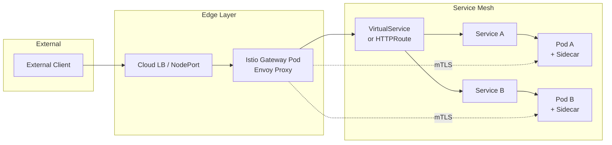

> **원문 ([Istio - Ingress Gateways](https://istio.io/latest/docs/tasks/traffic-management/ingress/ingress-control/)):**
> "Gateway describes a load balancer operating at the edge of the mesh that receives incoming HTTP/TCP connections."

**번역:** Gateway는 메시의 경계에서 동작하며 수신되는 HTTP/TCP 연결을 받는 로드밸런서를 기술한다.

> **원문 ([Istio - Ingress Gateways](https://istio.io/latest/docs/tasks/traffic-management/ingress/ingress-control/)):**
> "Configures exposed ports, protocols, but does not include traffic routing configuration."

**번역:** 노출할 포트와 프로토콜을 구성하지만, 트래픽 라우팅 구성은 포함하지 않는다.

Gateway Pod는 전용 Envoy 프록시로 다음을 수행한다:

- **TLS termination**: 외부 HTTPS 요청의 TLS를 종료하고 평문으로 내부 전달 (또는 mTLS로 재암호화)
- **Host-based routing**: 호스트 헤더 기반으로 트래픽을 분배
- **Path-based routing**: URI 경로 기반 라우팅
- **Header manipulation**: 요청/응답 헤더 추가, 제거, 수정
- **Rate limiting**: 요청 속도 제한 적용

---

## 2. 두 가지 API: Istio API vs Kubernetes Gateway API

Istio에서 Gateway를 구성하는 방법은 두 가지다. 이 차이를 이해하지 못하면 문서를 읽다가 혼란에 빠진다.

### 2.1 API 비교 개요

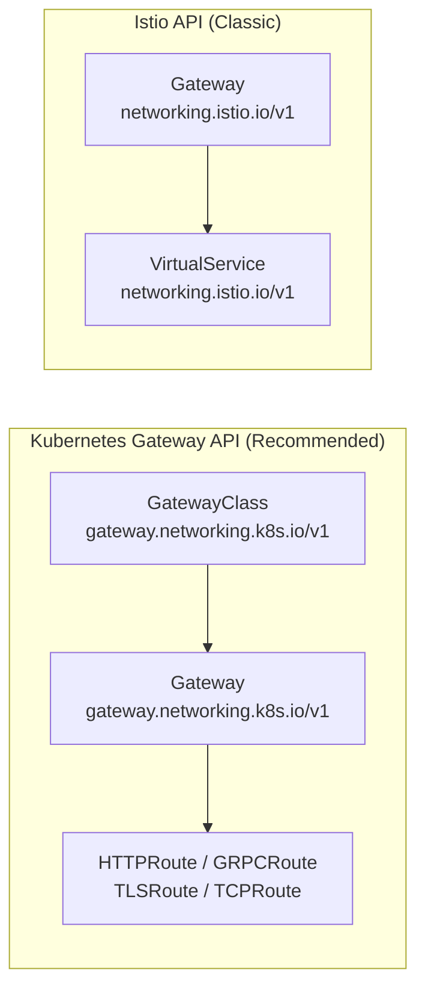

> **원문 ([Istio - Gateway API](https://istio.io/latest/docs/tasks/traffic-management/ingress/gateway-api/)):**
> "In addition to its own traffic management API, Istio supports the Kubernetes Gateway API and intends to make it the default API for traffic management in the future."

**번역:** Istio는 자체 트래픽 관리 API와 함께 Kubernetes Gateway API를 지원하며, 향후 이를 기본 트래픽 관리 API로 만들 계획이다.

Istio 공식 입장은 **Gateway API를 미래 표준으로 채택**하는 것이다. 신규 프로젝트라면 Gateway API를 권장하고, 기존 Istio API를 사용 중이라면 점진적 마이그레이션을 계획하는 것이 합리적이다.

두 API의 핵심 차이를 비교하면 다음과 같다.

> **원문 ([Istio - Gateway API](https://istio.io/latest/docs/tasks/traffic-management/ingress/gateway-api/)):**
> "In the Istio VirtualService, all protocols are configured within a single resource."

**번역:** Istio VirtualService에서는 모든 프로토콜이 단일 리소스 내에서 구성된다.

> **원문 ([Istio - Gateway API](https://istio.io/latest/docs/tasks/traffic-management/ingress/gateway-api/)):**
> "In the Gateway APIs, each protocol type has its own resource, such as HTTPRoute and TCPRoute."

**번역:** Gateway API에서는 각 프로토콜 유형이 HTTPRoute, TCPRoute 등 자체 리소스를 가진다.

| 구분 | Istio API | Kubernetes Gateway API |
|---|---|---|
| API Group | `networking.istio.io/v1` | `gateway.networking.k8s.io/v1` |
| Gateway 리소스 | `Gateway` + `VirtualService` | `GatewayClass` + `Gateway` + `*Route` |
| 이식성 | Istio 종속 | 벤더 중립 (Istio, Envoy Gateway, Cilium 등) |
| 역할 분리 | 약함 (단일 리소스에 혼재) | 강함 (인프라/애플리케이션 분리) |
| 라우팅 유형 | `http`, `tcp`, `tls` (VirtualService 내) | `HTTPRoute`, `GRPCRoute`, `TLSRoute`, `TCPRoute` |
| 자동 배포 | 수동 (Gateway Deployment 직접 관리) | 자동 (Gateway 생성 시 Deployment + Service 자동 생성) |
| 성숙도 | GA, 전체 기능 지원 | GA (v1.0+), 일부 Istio 고급 기능 미지원 |

이 중 자동 배포 차이는 운영 관점에서 매우 중요하다.

> **원문 ([Istio - Gateway API](https://istio.io/latest/docs/tasks/traffic-management/ingress/gateway-api/)):**
> Istio API: "a Gateway configures an existing gateway Deployment/Service that has been deployed."

**번역:** Istio API에서 Gateway는 이미 배포된 기존 gateway Deployment/Service를 구성한다.

> **원문 ([Istio - Gateway API](https://istio.io/latest/docs/tasks/traffic-management/ingress/gateway-api/)):**
> Kubernetes Gateway API: "the Gateway resource both configures and deploys a gateway."

**번역:** Kubernetes Gateway API에서는 Gateway 리소스가 gateway를 구성하고 배포까지 모두 수행한다.

### 2.2 역할 기반 분리 (RBAC 관점)

참고: 아래 내용은 공식문서의 개념을 기반으로 정리한 것이다.

Kubernetes Gateway API의 핵심 설계 원칙은 **역할 분리(role-oriented design)** 이다.

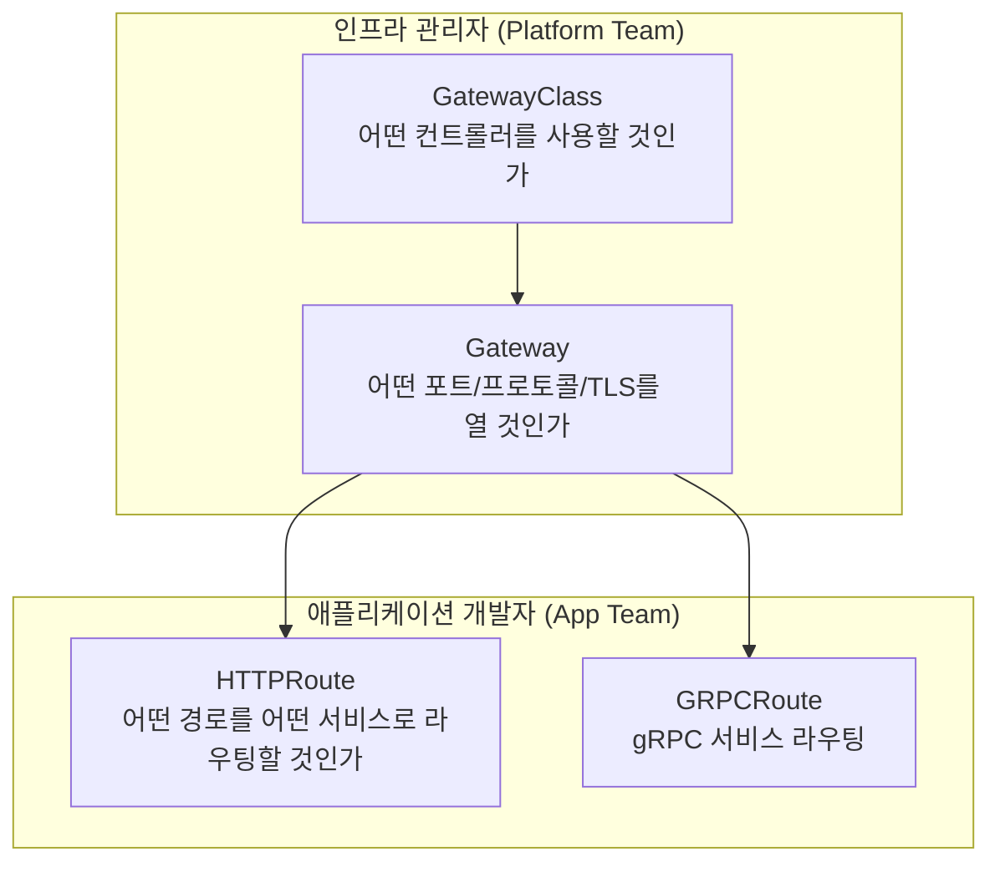

| 역할 | 관리 리소스 | 책임 |
|---|---|---|
| **인프라 관리자** | GatewayClass, Gateway | 포트, TLS 인증서, IP, 프로토콜 |
| **애플리케이션 개발자** | HTTPRoute, GRPCRoute 등 | 경로, 헤더 매칭, 백엔드 서비스 |

Istio API에서는 Gateway와 VirtualService가 동일한 팀이 관리하는 경우가 많아, 인프라와 애플리케이션의 책임 경계가 모호했다. Gateway API는 이 문제를 리소스 계층으로 해결한다.

---

## 3. Istio Ingress Gateway (Istio API)

Istio 고유 API를 사용하는 전통적인 방식이다. 기존 Istio 환경에서 가장 널리 사용되고 있으며, 참고할 수 있는 자료도 풍부하다.

### 3.1 Gateway 리소스

> **원문 ([Istio - Ingress Gateways](https://istio.io/latest/docs/tasks/traffic-management/ingress/ingress-control/)):**
> "Gateway describes a load balancer operating at the edge of the mesh that receives incoming HTTP/TCP connections. Configures exposed ports, protocols, but does not include traffic routing configuration."

**번역:** Gateway는 메시의 경계에서 동작하며 수신되는 HTTP/TCP 연결을 받는 로드밸런서를 기술한다. 노출할 포트와 프로토콜을 구성하지만, 트래픽 라우팅 구성은 포함하지 않는다.

```yaml
apiVersion: networking.istio.io/v1
kind: Gateway
metadata:
  name: httpbin-gateway
  namespace: istio-system
spec:
  selector:
    istio: ingressgateway   # Gateway Pod를 선택하는 라벨
  servers:
  - port:
      number: 80
      name: http
      protocol: HTTP
    hosts:
    - "httpbin.example.com"  # 이 호스트로 들어오는 요청만 수락
```

**핵심 필드 설명:**

| 필드 | 설명 |
|---|---|
| `spec.selector` | 이 Gateway 설정을 적용할 Envoy 프록시 Pod의 라벨 셀렉터. `istio: ingressgateway`는 기본 Ingress Gateway Pod를 가리킨다 |
| `spec.servers[].port` | 리스닝할 포트 번호, 이름, 프로토콜 |
| `spec.servers[].hosts` | 수락할 호스트명. 와일드카드(`*.example.com`) 지원 |
| `spec.servers[].tls` | TLS 모드 및 인증서 설정 (아래 3.3절 참조) |

> **원문 ([Istio - Traffic Management](https://istio.io/latest/docs/concepts/traffic-management/)):**
> "Preconfigured: `istio-ingressgateway` and `istio-egressgateway`."

**번역:** 사전 구성된 게이트웨이: `istio-ingressgateway`와 `istio-egressgateway`가 제공된다.

`selector` 필드가 중요하다. 이 셀렉터로 지정된 Pod(일반적으로 `istio-system` 네임스페이스의 Ingress Gateway Deployment)가 이 Gateway 설정을 Envoy xDS로 수신하여 적용한다. Istio 설치 시 사전 구성되는 `istio-ingressgateway` Deployment가 기본 대상이다.

### 3.2 VirtualService 연결

Gateway 리소스는 **어떤 포트/호스트로 트래픽을 수신할지**만 정의한다. 수신된 트래픽을 **어디로 라우팅할지**는 VirtualService가 담당한다.

> **원문 ([Istio - Ingress Gateways](https://istio.io/latest/docs/tasks/traffic-management/ingress/ingress-control/)):**
> "Traffic routing for ingress traffic is instead configured using routing rules, exactly in the same way as for internal service requests."

**번역:** 인그레스 트래픽의 라우팅은 내부 서비스 요청과 정확히 동일한 방식으로 라우팅 규칙을 사용하여 구성된다.

이것이 Istio의 핵심 설계 철학이다. 외부에서 들어오는 트래픽이든 내부 서비스 간 트래픽이든, 동일한 VirtualService 라우팅 규칙 체계를 사용한다.

> **원문 ([Istio - Traffic Management](https://istio.io/latest/docs/concepts/traffic-management/)):**
> "A virtual service lets you configure how requests are routed to a service within an Istio service mesh."

**번역:** VirtualService는 Istio 서비스 메시 내에서 요청이 서비스로 라우팅되는 방법을 구성할 수 있게 한다.

```yaml
apiVersion: networking.istio.io/v1
kind: VirtualService
metadata:
  name: httpbin
  namespace: default
spec:
  hosts:
  - "httpbin.example.com"
  gateways:
  - istio-system/httpbin-gateway   # 위에서 정의한 Gateway 참조
  http:
  - match:
    - uri:
        prefix: /status
    - uri:
        prefix: /delay
    route:
    - destination:
        port:
          number: 8000
        host: httpbin               # Kubernetes Service 이름
  - match:
    - uri:
        prefix: /headers
    route:
    - destination:
        port:
          number: 8000
        host: httpbin
      headers:
        response:
          add:
            x-custom-header: "added-by-istio"
```

**Gateway와 VirtualService의 연결 구조:**

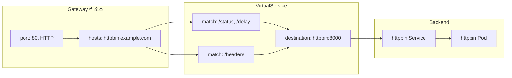

> **원문 ([Istio - Ingress Gateways](https://istio.io/latest/docs/tasks/traffic-management/ingress/ingress-control/)):**
> "VirtualService includes a `gateways` list specifying which Gateway resources can route traffic."

**번역:** VirtualService에는 어떤 Gateway 리소스가 트래픽을 라우팅할 수 있는지 지정하는 `gateways` 목록이 포함된다.

**연결 규칙:**
- VirtualService의 `gateways` 필드에 Gateway 이름을 지정한다 (cross-namespace 시 `namespace/name` 형식)
- VirtualService의 `hosts`와 Gateway의 `hosts`가 교집합이 있어야 한다
- `gateways` 필드를 생략하면 `mesh`가 기본값으로 설정되어, 메시 내부 sidecar에만 적용된다

> **원문 ([Istio - Ingress Gateways](https://istio.io/latest/docs/tasks/traffic-management/ingress/ingress-control/)):**
> "Internal requests from other services in the mesh are not subject to these rules but instead will default to round-robin routing."

**번역:** 메시 내 다른 서비스에서 오는 내부 요청은 이 규칙의 적용 대상이 아니며, 기본적으로 라운드 로빈 라우팅이 적용된다.

이 점을 주의해야 한다. Gateway에 바인딩된 VirtualService의 라우팅 규칙은 해당 Gateway를 통해 들어오는 외부 트래픽에만 적용된다. 메시 내부 서비스 간 트래픽에는 별도의 VirtualService(gateways: mesh)를 정의해야 한다.

### 3.3 TLS/HTTPS 구성

프로덕션 환경에서 Gateway는 반드시 TLS를 구성해야 한다. Istio Gateway는 네 가지 TLS 모드를 지원한다.

#### TLS 모드 비교

참고: 아래 내용은 공식문서의 개념을 기반으로 정리한 것이다.

| TLS 모드 | 동작 | 사용 시나리오 |
|---|---|---|
| `SIMPLE` | 단방향 TLS. Gateway가 TLS 종료 | 일반적인 HTTPS 서비스 |
| `MUTUAL` | 양방향 TLS. 클라이언트 인증서 검증 필요 | B2B API, 높은 보안 요구 |
| `PASSTHROUGH` | TLS 종료 없이 그대로 백엔드로 전달 | 백엔드가 직접 TLS 처리 |
| `ISTIO_MUTUAL` | Istio mTLS 사용 | 메시 내부 Gateway 간 통신 |

#### SIMPLE TLS (단방향)

```yaml
apiVersion: networking.istio.io/v1
kind: Gateway
metadata:
  name: httpbin-gateway
  namespace: istio-system
spec:
  selector:
    istio: ingressgateway
  servers:
  - port:
      number: 443
      name: https
      protocol: HTTPS
    tls:
      mode: SIMPLE
      credentialName: httpbin-credential   # Kubernetes Secret 이름
    hosts:
    - "httpbin.example.com"
```

> **원문 ([Istio - Secure Gateways](https://istio.io/latest/docs/tasks/traffic-management/ingress/secure-ingress/)):**
> "The TLS secret must contain keys named tls.key and tls.crt. For mutual TLS, a ca.crt key is also required."

**번역:** TLS Secret에는 반드시 `tls.key`와 `tls.crt`라는 키가 포함되어야 한다. Mutual TLS의 경우 `ca.crt` 키도 필요하다.

Secret 생성 예시:

```bash
# TLS 인증서와 키로 Kubernetes Secret 생성
kubectl create -n istio-system secret tls httpbin-credential \
  --key=httpbin.example.com.key \
  --cert=httpbin.example.com.crt
```

**주의:** `credentialName`으로 참조하는 Secret은 Gateway Pod가 위치한 네임스페이스(일반적으로 `istio-system`)에 존재해야 한다. SDS(Secret Discovery Service)를 통해 Envoy에 동적으로 로드되므로, Secret 변경 시 Gateway Pod를 재시작할 필요가 없다.

#### MUTUAL TLS (양방향)

```yaml
apiVersion: networking.istio.io/v1
kind: Gateway
metadata:
  name: httpbin-gateway
  namespace: istio-system
spec:
  selector:
    istio: ingressgateway
  servers:
  - port:
      number: 443
      name: https
      protocol: HTTPS
    tls:
      mode: MUTUAL
      credentialName: httpbin-credential   # tls.key, tls.crt, ca.crt 포함
    hosts:
    - "httpbin.example.com"
```

MUTUAL 모드에서는 클라이언트가 반드시 유효한 인증서를 제시해야 한다. 앞서 인용한 공식 문서대로, Secret에 `ca.crt`(CA 인증서)를 추가하여 클라이언트 인증서를 검증한다.

```bash
# Mutual TLS용 Secret 생성 (ca.crt 포함)
kubectl create -n istio-system secret generic httpbin-credential \
  --from-file=tls.key=httpbin.example.com.key \
  --from-file=tls.crt=httpbin.example.com.crt \
  --from-file=ca.crt=example.com.ca.crt
```

#### PASSTHROUGH

```yaml
apiVersion: networking.istio.io/v1
kind: Gateway
metadata:
  name: passthrough-gateway
  namespace: istio-system
spec:
  selector:
    istio: ingressgateway
  servers:
  - port:
      number: 443
      name: tls
      protocol: TLS         # HTTPS가 아닌 TLS
    tls:
      mode: PASSTHROUGH
    hosts:
    - "secure-app.example.com"
```

참고: 아래 내용은 공식문서의 개념을 기반으로 정리한 것이다.

PASSTHROUGH 모드에서는 Gateway가 TLS를 종료하지 않고, 암호화된 상태 그대로 백엔드 서비스에 전달한다. 이 경우 Gateway는 **SNI(Server Name Indication)** 헤더만 읽어서 라우팅을 결정한다. 프로토콜 필드가 `HTTPS`가 아닌 `TLS`로 설정되어야 하며, VirtualService에서도 `tls` 섹션으로 라우팅을 정의한다.

```yaml
apiVersion: networking.istio.io/v1
kind: VirtualService
metadata:
  name: secure-app
spec:
  hosts:
  - "secure-app.example.com"
  gateways:
  - istio-system/passthrough-gateway
  tls:                          # http가 아닌 tls 섹션
  - match:
    - port: 443
      sniHosts:
      - "secure-app.example.com"
    route:
    - destination:
        host: secure-app
        port:
          number: 443
```

### 3.4 다중 호스트 구성

참고: 아래 내용은 공식문서의 개념을 기반으로 정리한 것이다.

하나의 Gateway에서 여러 호스트를 처리하는 것은 실무에서 흔한 패턴이다.

```yaml
apiVersion: networking.istio.io/v1
kind: Gateway
metadata:
  name: multi-host-gateway
  namespace: istio-system
spec:
  selector:
    istio: ingressgateway
  servers:
  - port:
      number: 443
      name: https-api
      protocol: HTTPS
    tls:
      mode: SIMPLE
      credentialName: api-credential
    hosts:
    - "api.example.com"
  - port:
      number: 443
      name: https-web
      protocol: HTTPS
    tls:
      mode: SIMPLE
      credentialName: web-credential
    hosts:
    - "web.example.com"
  - port:
      number: 80
      name: http
      protocol: HTTP
    hosts:
    - "*.example.com"
    tls:
      httpsRedirect: true       # HTTP -> HTTPS 리다이렉트
```

이 구성에서 Envoy는 **SNI 기반으로** 적절한 인증서를 선택한다. 동일 포트(443)에서 서로 다른 호스트에 서로 다른 인증서를 적용하는 것이 가능하다.

### 3.5 HTTP -> HTTPS 리다이렉트

참고: 아래 내용은 공식문서의 개념을 기반으로 정리한 것이다.

프로덕션에서 HTTP 요청을 HTTPS로 강제 리다이렉트하는 것은 필수 보안 설정이다.

```yaml
apiVersion: networking.istio.io/v1
kind: Gateway
metadata:
  name: redirect-gateway
  namespace: istio-system
spec:
  selector:
    istio: ingressgateway
  servers:
  - port:
      number: 80
      name: http
      protocol: HTTP
    hosts:
    - "app.example.com"
    tls:
      httpsRedirect: true
  - port:
      number: 443
      name: https
      protocol: HTTPS
    tls:
      mode: SIMPLE
      credentialName: app-credential
    hosts:
    - "app.example.com"
```

---

## 4. Kubernetes Gateway API

Kubernetes SIG-Network이 주도하는 차세대 Gateway 표준이다. Istio, Envoy Gateway, Cilium, Kong 등 다양한 구현체가 지원하며, 벤더 중립적 인터페이스를 제공한다.

### 4.1 Gateway API 3계층 구조

> **원문 ([Istio - Gateway API](https://istio.io/latest/docs/tasks/traffic-management/ingress/gateway-api/)):**
> "In addition to its own traffic management API, Istio supports the Kubernetes Gateway API and intends to make it the default API for traffic management in the future."

**번역:** Istio는 자체 트래픽 관리 API와 함께 Kubernetes Gateway API를 지원하며, 향후 이를 기본 트래픽 관리 API로 만들 계획이다.

> **원문 ([Istio - Gateway API](https://istio.io/latest/docs/tasks/traffic-management/ingress/gateway-api/)):**
> "While the Gateway APIs offer a lot of rich routing functionality, it does not yet cover 100% of Istio's feature set."

**번역:** Gateway API는 풍부한 라우팅 기능을 제공하지만, 아직 Istio의 기능 세트를 100% 커버하지는 못한다.

이 점은 도입 전에 반드시 인지해야 한다. Fault injection, traffic mirroring 등 일부 Istio 고급 기능은 Gateway API에 직접 대응이 없을 수 있다.

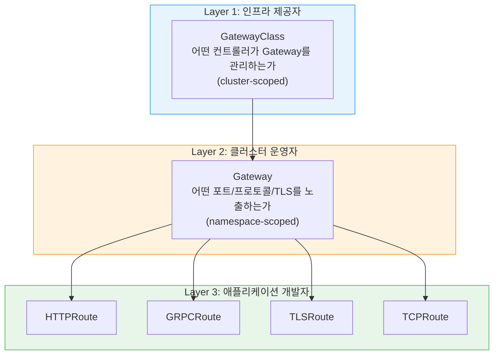

| 계층 | 리소스 | 관리 역할 | 스코프 |
|---|---|---|---|
| Layer 1 | `GatewayClass` | 인프라 제공자 (클라우드 벤더, 플랫폼 팀) | Cluster |
| Layer 2 | `Gateway` | 클러스터 운영자 (Platform Engineer) | Namespace |
| Layer 3 | `HTTPRoute` 등 | 애플리케이션 개발자 (App Team) | Namespace |

### 4.2 GatewayClass

참고: 아래 내용은 공식문서의 개념을 기반으로 정리한 것이다.

GatewayClass는 어떤 컨트롤러가 Gateway를 구현하는지 정의하는 cluster-scoped 리소스이다. Kubernetes의 StorageClass와 유사한 개념이다.

```yaml
apiVersion: gateway.networking.k8s.io/v1
kind: GatewayClass
metadata:
  name: istio
spec:
  controllerName: istio.io/gateway-controller
```

Istio를 설치하면 이 GatewayClass가 자동 생성된다. 사용자가 직접 만들 필요는 거의 없다.

### 4.3 Gateway 리소스

```yaml
apiVersion: gateway.networking.k8s.io/v1
kind: Gateway
metadata:
  name: gateway
  namespace: istio-ingress
spec:
  gatewayClassName: istio           # 위에서 정의한 GatewayClass 참조
  listeners:
  - name: http
    hostname: "*.example.com"
    port: 80
    protocol: HTTP
    allowedRoutes:
      namespaces:
        from: All                   # 모든 네임스페이스의 Route 허용
  - name: https
    hostname: "*.example.com"
    port: 443
    protocol: HTTPS
    tls:
      mode: Terminate
      certificateRefs:
      - name: example-cert
        kind: Secret
    allowedRoutes:
      namespaces:
        from: All
```

**Istio API Gateway와의 주요 차이:**

> **원문 ([Istio - Gateway API](https://istio.io/latest/docs/tasks/traffic-management/ingress/gateway-api/)):**
> Istio API: "a Gateway configures an existing gateway Deployment/Service that has been deployed."

**번역:** Istio API에서 Gateway는 이미 배포된 기존 gateway Deployment/Service를 구성한다.

> **원문 ([Istio - Gateway API](https://istio.io/latest/docs/tasks/traffic-management/ingress/gateway-api/)):**
> Kubernetes Gateway API: "the Gateway resource both configures and deploys a gateway."

**번역:** Kubernetes Gateway API에서는 Gateway 리소스가 gateway를 구성하고 배포까지 모두 수행한다.

| 항목 | Istio API Gateway | K8s Gateway API Gateway |
|---|---|---|
| Pod 선택 | `selector` (라벨 매칭) | `gatewayClassName` (GatewayClass 참조) |
| Pod 관리 | 수동 (Deployment 직접 배포) | **자동** (Gateway 리소스 생성 시 Deployment + Service 자동 생성) |
| 네임스페이스 접근 제어 | 없음 | `allowedRoutes.namespaces` |
| TLS 인증서 참조 | `credentialName` (Secret 이름) | `certificateRefs` (구조화된 참조) |

#### Automated Deployment (자동 배포)

> **원문 ([Istio - Gateway API](https://istio.io/latest/docs/tasks/traffic-management/ingress/gateway-api/)):**
> "By default, each Gateway will automatically provision a Service and Deployment."

**번역:** 기본적으로 각 Gateway는 자동으로 Service와 Deployment를 프로비저닝한다.

이것은 Kubernetes Gateway API 사용 시의 핵심 장점이다. Istio API에서는 Ingress Gateway Deployment를 Helm values나 IstioOperator로 별도 관리해야 했지만, Gateway API에서는 Gateway 리소스 하나만 생성하면 된다.

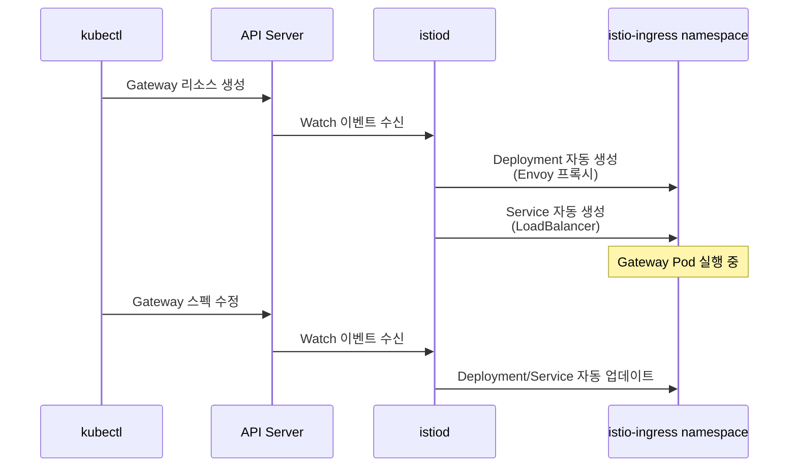

### 4.4 HTTPRoute

> **원문 ([Istio - Gateway API](https://istio.io/latest/docs/tasks/traffic-management/ingress/gateway-api/)):**
> "In the Gateway APIs, each protocol type has its own resource, such as HTTPRoute and TCPRoute."

**번역:** Gateway API에서는 각 프로토콜 유형이 HTTPRoute, TCPRoute 등 자체 리소스를 가진다.

HTTPRoute는 HTTP 트래픽의 라우팅 규칙을 정의한다. Istio API의 VirtualService 역할을 대체한다.

```yaml
apiVersion: gateway.networking.k8s.io/v1
kind: HTTPRoute
metadata:
  name: httpbin-route
  namespace: default
spec:
  parentRefs:
  - name: gateway
    namespace: istio-ingress
  hostnames:
  - "httpbin.example.com"
  rules:
  - matches:
    - path:
        type: PathPrefix
        value: /status
    backendRefs:
    - name: httpbin
      port: 8000
  - matches:
    - path:
        type: PathPrefix
        value: /delay
    backendRefs:
    - name: httpbin
      port: 8000
      weight: 80
    - name: httpbin-canary
      port: 8000
      weight: 20
```

**VirtualService vs HTTPRoute 매핑:**

> **원문 ([Istio - Gateway API](https://istio.io/latest/docs/tasks/traffic-management/ingress/gateway-api/)):**
> "In the Istio VirtualService, all protocols are configured within a single resource."

**번역:** Istio VirtualService에서는 모든 프로토콜이 단일 리소스 내에서 구성된다.

이 차이가 두 API의 근본적인 설계 차이를 보여준다. VirtualService는 HTTP, TCP, TLS를 하나의 리소스에 모두 담지만, Gateway API는 프로토콜별로 리소스를 분리한다.

| VirtualService 기능 | HTTPRoute 대응 |
|---|---|
| `match.uri` | `rules[].matches[].path` |
| `match.headers` | `rules[].matches[].headers` |
| `match.queryParams` | `rules[].matches[].queryParams` |
| `route[].destination` | `rules[].backendRefs` |
| `route[].weight` | `backendRefs[].weight` |
| `route[].timeout` | `rules[].timeouts` |
| `fault.delay/abort` | 미지원 (Istio 확장 필요) |
| `retries` | `rules[].retry` (experimental) |

### 4.5 고급 라우팅 패턴

참고: 아래 내용은 공식문서의 개념을 기반으로 정리한 것이다.

#### 헤더 기반 매칭

```yaml
apiVersion: gateway.networking.k8s.io/v1
kind: HTTPRoute
metadata:
  name: header-based-routing
  namespace: default
spec:
  parentRefs:
  - name: gateway
    namespace: istio-ingress
  hostnames:
  - "api.example.com"
  rules:
  - matches:
    - headers:
      - name: x-api-version
        value: "v2"
    backendRefs:
    - name: api-v2
      port: 8080
  - backendRefs:                    # 기본 라우팅 (매칭 조건 없음)
    - name: api-v1
      port: 8080
```

#### 요청 리다이렉트 및 URL 재작성

```yaml
apiVersion: gateway.networking.k8s.io/v1
kind: HTTPRoute
metadata:
  name: redirect-route
  namespace: default
spec:
  parentRefs:
  - name: gateway
    namespace: istio-ingress
  hostnames:
  - "old.example.com"
  rules:
  - filters:
    - type: RequestRedirect
      requestRedirect:
        hostname: "new.example.com"
        statusCode: 301
```

```yaml
apiVersion: gateway.networking.k8s.io/v1
kind: HTTPRoute
metadata:
  name: rewrite-route
  namespace: default
spec:
  parentRefs:
  - name: gateway
    namespace: istio-ingress
  hostnames:
  - "api.example.com"
  rules:
  - matches:
    - path:
        type: PathPrefix
        value: /v1/users
    filters:
    - type: URLRewrite
      urlRewrite:
        path:
          type: ReplacePrefixMatch
          replacePrefixMatch: /users
    backendRefs:
    - name: user-service
      port: 8080
```

### 4.6 GRPCRoute

참고: 아래 내용은 공식문서의 개념을 기반으로 정리한 것이다.

gRPC 서비스를 위한 전용 라우팅 리소스이다. Gateway API에서 프로토콜별로 리소스를 분리하는 설계 원칙에 따라, gRPC 트래픽은 GRPCRoute로 별도 관리한다.

```yaml
apiVersion: gateway.networking.k8s.io/v1
kind: GRPCRoute
metadata:
  name: grpc-route
  namespace: default
spec:
  parentRefs:
  - name: gateway
    namespace: istio-ingress
  hostnames:
  - "grpc.example.com"
  rules:
  - matches:
    - method:
        service: "myapp.UserService"
        method: "GetUser"
    backendRefs:
    - name: user-grpc-service
      port: 50051
```

### 4.7 TLS 구성 (Gateway API)

```yaml
apiVersion: gateway.networking.k8s.io/v1
kind: Gateway
metadata:
  name: tls-gateway
  namespace: istio-ingress
spec:
  gatewayClassName: istio
  listeners:
  - name: https
    port: 443
    protocol: HTTPS
    hostname: "secure.example.com"
    tls:
      mode: Terminate                   # TLS 종료
      certificateRefs:
      - name: secure-example-cert       # Secret 참조
        kind: Secret
        group: ""
    allowedRoutes:
      namespaces:
        from: Selector
        selector:
          matchLabels:
            shared-gateway: "true"      # 라벨이 있는 네임스페이스만 허용
```

참고: 아래 내용은 공식문서의 개념을 기반으로 정리한 것이다.

TLS 모드 매핑:

| Istio API | Gateway API | 설명 |
|---|---|---|
| `SIMPLE` | `Terminate` | Gateway에서 TLS 종료 |
| `MUTUAL` | `Terminate` + `options` | 클라이언트 인증서 검증 추가 |
| `PASSTHROUGH` | `Passthrough` | TLS 종료 없이 전달 |

### 4.8 Cross-Namespace Route 연결

참고: 아래 내용은 공식문서의 개념을 기반으로 정리한 것이다.

Gateway API의 강력한 기능 중 하나는 **네임스페이스 간 Route 연결**이다.

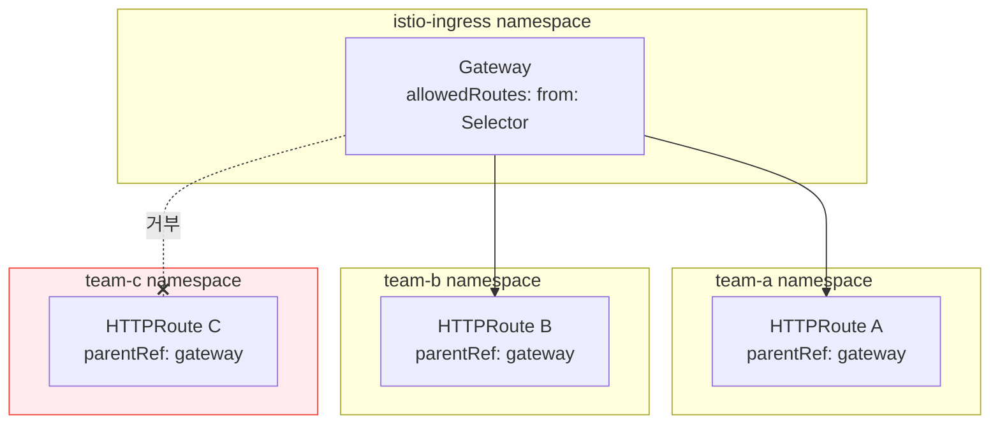

`allowedRoutes.namespaces` 설정으로 어떤 네임스페이스의 Route가 이 Gateway에 연결될 수 있는지 제어한다:

| `from` 값 | 설명 |
|---|---|
| `All` | 모든 네임스페이스 허용 |
| `Same` | Gateway와 같은 네임스페이스만 허용 |
| `Selector` | 라벨 셀렉터로 특정 네임스페이스만 허용 |

### 4.9 메시 트래픽에도 Gateway API 적용

> **원문 ([Istio - Gateway API](https://istio.io/latest/docs/tasks/traffic-management/ingress/gateway-api/)):**
> "The Gateway API can also be used to configure mesh traffic" by configuring parentRef to reference in-cluster services.

**번역:** Gateway API는 parentRef를 클러스터 내부 서비스로 참조하도록 구성하여 메시 트래픽을 구성하는 데에도 사용할 수 있다.

이 기능은 Gateway API의 활용 범위가 North-South 트래픽에만 한정되지 않음을 보여준다. East-West(서비스 간) 트래픽 라우팅에도 HTTPRoute를 사용할 수 있으며, 이 경우 parentRef에 Gateway 대신 Service를 지정한다.

---

## 5. Egress Gateway

### 5.1 Egress Gateway의 필요성

> **원문 ([Istio - Traffic Management](https://istio.io/latest/docs/concepts/traffic-management/)):**
> "Gateway manages inbound and outbound mesh traffic using standalone Envoy proxies that run at the edge of the mesh."

**번역:** Gateway는 메시의 경계에서 실행되는 독립형 Envoy 프록시를 사용하여 메시의 인바운드 및 아웃바운드 트래픽을 관리한다.

Gateway의 정의 자체에 "아웃바운드" 트래픽이 포함되어 있다. 메시 내부의 서비스가 외부로 나가는 트래픽(아웃바운드)도 통제가 필요하며, Egress Gateway는 이 아웃바운드 트래픽의 출구를 중앙화한다.

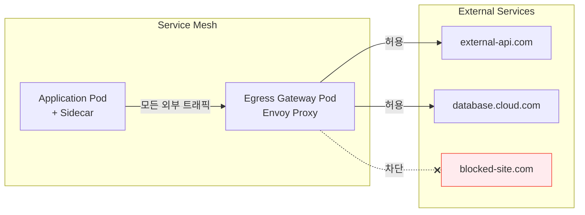

**Egress Gateway를 사용하는 이유:**

| 목적 | 설명 |
|---|---|
| **보안 감사** | 어떤 내부 서비스가 어떤 외부 서비스에 접근하는지 중앙에서 로깅 |
| **정책 적용** | 허용된 외부 서비스만 접근 가능하도록 화이트리스트 운영 |
| **mTLS origination** | 외부 서비스와의 통신을 Egress Gateway에서 TLS로 시작 |
| **네트워크 격리** | 외부 접근이 가능한 노드를 Egress Gateway Pod가 실행되는 노드로 한정 |
| **규제 준수** | 금융, 의료 등 아웃바운드 트래픽 감사가 필수인 환경 |

### 5.2 ServiceEntry

외부 서비스를 메시에 등록하려면 ServiceEntry를 사용한다.

> **원문 ([Istio - Traffic Management](https://istio.io/latest/docs/concepts/traffic-management/)):**
> "ServiceEntry: Add an entry to the service registry that Istio maintains internally."

**번역:** ServiceEntry는 Istio가 내부적으로 유지하는 서비스 레지스트리에 항목을 추가한다.

> **원문 ([Istio - Traffic Management](https://istio.io/latest/docs/concepts/traffic-management/)):**
> "Enables: external service traffic management, retry/timeout/fault injection for external destinations, VM integration."

**번역:** ServiceEntry를 통해 외부 서비스 트래픽 관리, 외부 대상에 대한 재시도/타임아웃/장애 주입, VM 통합이 가능해진다.

```yaml
apiVersion: networking.istio.io/v1
kind: ServiceEntry
metadata:
  name: external-api
  namespace: istio-system
spec:
  hosts:
  - external-api.example.com
  ports:
  - number: 443
    name: https
    protocol: HTTPS
  resolution: DNS
  location: MESH_EXTERNAL
```

**주요 필드:**

| 필드 | 설명 |
|---|---|
| `hosts` | 외부 서비스의 호스트명 |
| `ports` | 외부 서비스의 포트/프로토콜 |
| `resolution` | 주소 해석 방식 (`DNS`, `STATIC`, `NONE`) |
| `location` | `MESH_EXTERNAL` (메시 외부), `MESH_INTERNAL` (메시 내부이지만 수동 등록) |

### 5.3 Egress Gateway를 통한 외부 트래픽 라우팅

참고: 아래 내용은 공식문서의 개념을 기반으로 정리한 것이다.

```yaml
# 1. ServiceEntry: 외부 서비스 등록
apiVersion: networking.istio.io/v1
kind: ServiceEntry
metadata:
  name: external-httpbin
spec:
  hosts:
  - httpbin.org
  ports:
  - number: 80
    name: http
    protocol: HTTP
  - number: 443
    name: https
    protocol: HTTPS
  resolution: DNS
  location: MESH_EXTERNAL
---
# 2. Gateway: Egress Gateway 정의
apiVersion: networking.istio.io/v1
kind: Gateway
metadata:
  name: egress-gateway
  namespace: istio-system
spec:
  selector:
    istio: egressgateway
  servers:
  - port:
      number: 80
      name: http
      protocol: HTTP
    hosts:
    - httpbin.org
---
# 3. VirtualService: Sidecar -> Egress Gateway -> 외부 서비스
apiVersion: networking.istio.io/v1
kind: VirtualService
metadata:
  name: direct-httpbin-through-egress
spec:
  hosts:
  - httpbin.org
  gateways:
  - istio-system/egress-gateway
  - mesh                            # mesh: 사이드카에서의 라우팅
  http:
  - match:
    - gateways:
      - mesh                        # 사이드카에서 나가는 트래픽
      port: 80
    route:
    - destination:
        host: istio-egressgateway.istio-system.svc.cluster.local
        port:
          number: 80
  - match:
    - gateways:
      - istio-system/egress-gateway  # Egress Gateway에서 나가는 트래픽
      port: 80
    route:
    - destination:
        host: httpbin.org
        port:
          number: 80
```

**트래픽 흐름:**

```mermaid
sequenceDiagram
    participant App as Application Pod
    participant Sidecar as Sidecar Proxy
    participant Egress as Egress Gateway
    participant Ext as httpbin.org

    App->>Sidecar: HTTP GET httpbin.org
    Note over Sidecar: VirtualService(mesh):<br/>destination -> egress gateway
    Sidecar->>Egress: mTLS 통신
    Note over Egress: VirtualService(egress-gateway):<br/>destination -> httpbin.org
    Egress->>Ext: HTTP 요청
    Ext-->>Egress: HTTP 응답
    Egress-->>Sidecar: mTLS 통신
    Sidecar-->>App: HTTP 응답
```

핵심은 VirtualService에서 `gateways` 필드를 두 번 사용하는 것이다:
- `mesh` 게이트웨이: 사이드카 -> Egress Gateway로 라우팅
- `egress-gateway` 게이트웨이: Egress Gateway -> 외부 서비스로 라우팅

### 5.4 Egress Gateway에서 TLS Origination

> **원문 ([Istio - Traffic Management](https://istio.io/latest/docs/concepts/traffic-management/)):**
> "DestinationRule: applied after VirtualService routing."

**번역:** DestinationRule은 VirtualService 라우팅 이후에 적용된다.

내부에서는 HTTP로 통신하지만, Egress Gateway에서 외부로 나갈 때 HTTPS로 업그레이드하는 패턴이다. DestinationRule이 VirtualService 라우팅 이후에 적용된다는 점을 활용한다.

```yaml
apiVersion: networking.istio.io/v1
kind: DestinationRule
metadata:
  name: originate-tls
spec:
  host: httpbin.org
  trafficPolicy:
    portLevelSettings:
    - port:
        number: 443
      tls:
        mode: SIMPLE               # Egress Gateway에서 TLS 시작
        sni: httpbin.org
```

이 패턴의 장점은 애플리케이션 코드가 TLS를 처리할 필요 없이 HTTP로 요청하면, Egress Gateway가 자동으로 HTTPS로 변환하여 외부에 전달한다는 것이다.

---

## 6. Istio API에서 Gateway API로의 마이그레이션

### 6.1 리소스 매핑

> **원문 ([Istio - Gateway API](https://istio.io/latest/docs/tasks/traffic-management/ingress/gateway-api/)):**
> "In the Istio VirtualService, all protocols are configured within a single resource."

**번역:** Istio VirtualService에서는 모든 프로토콜이 단일 리소스 내에서 구성된다.

> **원문 ([Istio - Gateway API](https://istio.io/latest/docs/tasks/traffic-management/ingress/gateway-api/)):**
> "In the Gateway APIs, each protocol type has its own resource, such as HTTPRoute and TCPRoute."

**번역:** Gateway API에서는 각 프로토콜 유형이 HTTPRoute, TCPRoute 등 자체 리소스를 가진다.

기존 Istio API를 Gateway API로 전환할 때, 하나의 VirtualService가 여러 프로토콜별 Route 리소스로 분리된다는 점이 가장 큰 변화이다.

| Istio API | Gateway API | 비고 |
|---|---|---|
| `Gateway` (networking.istio.io) | `Gateway` (gateway.networking.k8s.io) | gatewayClassName 추가 필요 |
| `VirtualService` | `HTTPRoute` | 기능 차이 존재 |
| `VirtualService` (gRPC) | `GRPCRoute` | 프로토콜별 분리 |
| `VirtualService` (TLS) | `TLSRoute` | SNI 기반 라우팅 |
| `VirtualService` (TCP) | `TCPRoute` | L4 라우팅 |
| `DestinationRule` | 해당 없음 | Gateway API에 직접 대응 없음, Istio CRD 병행 |
| `ServiceEntry` | 해당 없음 | Istio CRD 계속 사용 |

### 6.2 마이그레이션 예시

**Before (Istio API):**

```yaml
apiVersion: networking.istio.io/v1
kind: Gateway
metadata:
  name: bookinfo-gateway
spec:
  selector:
    istio: ingressgateway
  servers:
  - port:
      number: 80
      name: http
      protocol: HTTP
    hosts:
    - "bookinfo.example.com"
---
apiVersion: networking.istio.io/v1
kind: VirtualService
metadata:
  name: bookinfo
spec:
  hosts:
  - "bookinfo.example.com"
  gateways:
  - bookinfo-gateway
  http:
  - match:
    - uri:
        exact: /productpage
    route:
    - destination:
        host: productpage
        port:
          number: 9080
```

**After (Gateway API):**

> **원문 ([Istio - Gateway API](https://istio.io/latest/docs/tasks/traffic-management/ingress/gateway-api/)):**
> Kubernetes Gateway API: "the Gateway resource both configures and deploys a gateway."

**번역:** Kubernetes Gateway API에서는 Gateway 리소스가 gateway를 구성하고 배포까지 모두 수행한다.

전환 후에는 별도의 Ingress Gateway Deployment 관리가 불필요해진다.

```yaml
apiVersion: gateway.networking.k8s.io/v1
kind: Gateway
metadata:
  name: bookinfo-gateway
  namespace: istio-ingress
spec:
  gatewayClassName: istio
  listeners:
  - name: http
    port: 80
    protocol: HTTP
    hostname: "bookinfo.example.com"
    allowedRoutes:
      namespaces:
        from: All
---
apiVersion: gateway.networking.k8s.io/v1
kind: HTTPRoute
metadata:
  name: bookinfo
  namespace: default
spec:
  parentRefs:
  - name: bookinfo-gateway
    namespace: istio-ingress
  hostnames:
  - "bookinfo.example.com"
  rules:
  - matches:
    - path:
        type: Exact
        value: /productpage
    backendRefs:
    - name: productpage
      port: 9080
```

### 6.3 양 API 공존 전략

> **원문 ([Istio - Gateway API](https://istio.io/latest/docs/tasks/traffic-management/ingress/gateway-api/)):**
> "While the Gateway APIs offer a lot of rich routing functionality, it does not yet cover 100% of Istio's feature set."

**번역:** Gateway API는 풍부한 라우팅 기능을 제공하지만, 아직 Istio의 기능 세트를 100% 커버하지는 못한다.

마이그레이션 기간 동안 두 API를 동시에 사용하는 것은 가능하다. 단, 다음 원칙을 준수해야 한다:

- **동일 호스트/경로에 대해 두 API를 중복 정의하지 않는다** (충돌 발생)
- 서비스 단위로 순차적 마이그레이션: 새 서비스는 Gateway API, 기존 서비스는 점진 전환
- Gateway API로 전환 후에도 `DestinationRule`, `ServiceEntry`, `PeerAuthentication` 등 Istio 전용 CRD는 계속 필요하다

---

## 7. 대체 기술 비교

> **원문 ([Istio - Ingress Gateways](https://istio.io/latest/docs/tasks/traffic-management/ingress/ingress-control/)):**
> "A Gateway provides more extensive customization and flexibility than Ingress, and allows Istio features such as monitoring and route rules to be applied to traffic entering the cluster."

**번역:** Gateway는 Ingress보다 더 광범위한 커스터마이징과 유연성을 제공하며, 모니터링 및 라우팅 규칙 같은 Istio 기능을 클러스터에 진입하는 트래픽에 적용할 수 있게 한다.

Istio Gateway 외에도 North-South 트래픽을 처리할 수 있는 기술은 다양하다. 선택 시 팀의 기술 스택과 요구사항을 고려해야 한다.

| 항목 | Istio Gateway | NGINX Ingress | Kong Ingress | Envoy Gateway | Gateway API (표준) |
|---|---|---|---|---|---|
| **메시 통합** | 강함 (네이티브) | 약함 | 중간 | 중간 | 컨트롤러별 상이 |
| **mTLS** | 자동 (Citadel) | 수동 구성 | 수동 구성 | 가능 | 컨트롤러별 상이 |
| **L7 정책** | Istio 리소스 | NGINX 설정/어노테이션 | Kong 플러그인 | xDS 기반 | 표준 API |
| **이식성** | Istio 종속 | NGINX 종속 | Kong 종속 | Envoy 기반 | 높음 (벤더 중립) |
| **학습 곡선** | 높음 | 낮음 | 중간 | 중간 | 중간 |
| **Gateway API 지원** | GA | 지원 | 지원 | 네이티브 | 표준 |
| **프로덕션 실적** | 매우 높음 | 매우 높음 | 높음 | 성장 중 | 성장 중 |

**선택 가이드:**

- **이미 Istio 메시를 운영 중**: Istio Gateway (또는 Istio + Gateway API)
- **메시 없이 간단한 Ingress만 필요**: NGINX Ingress
- **API Gateway 기능(인증, Rate Limiting, 플러그인)이 핵심**: Kong
- **Envoy 기반으로 가볍게 시작**: Envoy Gateway
- **벤더 중립, 미래 표준 지향**: Kubernetes Gateway API

---

## 8. 실무 설계 주의점

### 8.1 리소스 및 스케일링

참고: 아래 내용은 공식문서의 개념을 기반으로 정리한 것이다.

Gateway Pod는 모든 외부 트래픽이 통과하는 병목점이다. 반드시 적절한 리소스와 HPA를 설정해야 한다.

```yaml
# Gateway API 방식에서 Deployment 커스터마이징
apiVersion: gateway.networking.k8s.io/v1
kind: Gateway
metadata:
  name: gateway
  namespace: istio-ingress
  annotations:
    # Istio에서 자동 생성되는 Deployment의 리소스 설정
    proxy.istio.io/config: |
      concurrency: 2
spec:
  gatewayClassName: istio
  infrastructure:
    annotations:
      autoscaling.knative.dev/minScale: "2"
  listeners:
  - name: http
    port: 80
    protocol: HTTP
    allowedRoutes:
      namespaces:
        from: All
```

Istio API 방식에서는 Helm values로 직접 설정한다:

```yaml
# Istio Helm values (istio-ingressgateway)
gateways:
  istio-ingressgateway:
    autoscaleEnabled: true
    autoscaleMin: 2
    autoscaleMax: 10
    resources:
      requests:
        cpu: 500m
        memory: 256Mi
      limits:
        cpu: 2000m
        memory: 1Gi
    podDisruptionBudget:
      minAvailable: 1
```

### 8.2 인증서 관리 (cert-manager 연동)

참고: 아래 내용은 공식문서의 개념을 기반으로 정리한 것이다.

수동으로 TLS 인증서를 관리하는 것은 운영 부담이 크다. cert-manager를 사용하면 인증서 발급과 갱신을 자동화할 수 있다.

```yaml
# cert-manager Certificate 리소스
apiVersion: cert-manager.io/v1
kind: Certificate
metadata:
  name: example-cert
  namespace: istio-system            # Gateway Pod가 위치한 네임스페이스
spec:
  secretName: example-credential
  issuerRef:
    name: letsencrypt-prod
    kind: ClusterIssuer
  dnsNames:
  - "app.example.com"
  - "api.example.com"
```

Gateway API에서는 Gateway 리소스에 어노테이션을 추가하여 cert-manager가 자동으로 인증서를 발급하도록 할 수 있다:

```yaml
apiVersion: gateway.networking.k8s.io/v1
kind: Gateway
metadata:
  name: gateway
  namespace: istio-ingress
  annotations:
    cert-manager.io/cluster-issuer: letsencrypt-prod
spec:
  gatewayClassName: istio
  listeners:
  - name: https
    port: 443
    protocol: HTTPS
    hostname: "app.example.com"
    tls:
      mode: Terminate
      certificateRefs:
      - name: app-example-cert
        kind: Secret
```

### 8.3 DNS 자동화 (external-dns 연동)

참고: 아래 내용은 공식문서의 개념을 기반으로 정리한 것이다.

external-dns를 사용하면 Gateway의 호스트 설정에 따라 DNS 레코드를 자동 생성할 수 있다.

```yaml
# external-dns가 Gateway API의 Gateway/HTTPRoute를 감시하여
# DNS 레코드를 자동 생성/삭제한다.
# external-dns 배포 시 --source=gateway-httproute 또는 --source=gateway-grpcroute 추가
```

### 8.4 Multi-tenant Gateway 전략

참고: 아래 내용은 공식문서의 개념을 기반으로 정리한 것이다.

대규모 조직에서는 여러 팀이 하나의 클러스터를 공유한다. Gateway 분리 전략은 크게 세 가지이다.

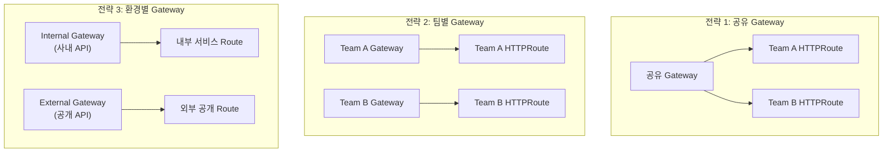

| 전략 | 장점 | 단점 | 권장 시나리오 |
|---|---|---|---|
| **공유 Gateway** | 리소스 절약, 관리 단순 | 장애 영향 범위 넓음, 설정 충돌 가능 | 소규모, 단일 팀 |
| **팀별 Gateway** | 장애 격리, 독립 관리 | 리소스 소비 증가, IP/LB 비용 | 멀티 팀, 높은 격리 요구 |
| **환경별 Gateway** | 보안 경계 명확 | 설정 중복 | 내부/외부 API 분리 |

### 8.5 Istio API와 Gateway API 혼용 시 주의

> **원문 ([Istio - Gateway API](https://istio.io/latest/docs/tasks/traffic-management/ingress/gateway-api/)):**
> "While the Gateway APIs offer a lot of rich routing functionality, it does not yet cover 100% of Istio's feature set."

**번역:** Gateway API는 풍부한 라우팅 기능을 제공하지만, 아직 Istio의 기능 세트를 100% 커버하지는 못한다.

- **동일 호스트에 두 API를 동시 적용하지 않는다.** 예측 불가능한 라우팅이 발생할 수 있다.
- Gateway API는 Istio 기능 100%를 커버하지 않는다. 버전별로 지원 범위가 다르므로 [Istio Gateway API 지원 상태](https://istio.io/latest/docs/tasks/traffic-management/ingress/gateway-api/)를 확인해야 한다.
- VirtualService의 fault injection, retries 등 일부 기능은 Gateway API에 직접 대응이 없어 Istio의 Policy CRD를 병행해야 한다.

### 8.6 보안 체크리스트

참고: 아래 내용은 공식문서의 개념을 기반으로 정리한 것이다.

| 항목 | 설명 | 확인 |
|---|---|---|
| TLS 필수화 | HTTP -> HTTPS 리다이렉트 설정 |  |
| 최소 TLS 버전 | TLS 1.2 이상 강제 |  |
| 인증서 자동 갱신 | cert-manager 연동 |  |
| Gateway RBAC | Gateway/Route 생성 권한 제한 |  |
| Rate Limiting | EnvoyFilter 또는 Istio Telemetry 활용 |  |
| WAF 연동 | ModSecurity, AWS WAF 등 앞단 배치 |  |
| Egress 화이트리스트 | 허용된 외부 서비스만 접근 가능 |  |
| 접근 로그 활성화 | Gateway Pod의 접근 로그 수집 |  |

---

## 9. 부수 개념 정리

### 9.1 SNI (Server Name Indication)

참고: 아래 내용은 공식문서의 개념을 기반으로 정리한 것이다.

TLS 핸드셰이크 초기 단계에서 클라이언트가 접속하려는 호스트명을 서버에 전달하는 확장이다. 하나의 IP 주소에서 여러 TLS 인증서를 서빙하려면 SNI가 필수이다. Istio Gateway의 PASSTHROUGH 모드에서는 암호화된 페이로드를 복호화하지 않으므로, SNI 헤더만으로 라우팅을 결정한다.

### 9.2 CORS (Cross-Origin Resource Sharing)

참고: 아래 내용은 공식문서의 개념을 기반으로 정리한 것이다.

Istio API에서는 VirtualService의 `corsPolicy` 필드로 설정한다:

```yaml
apiVersion: networking.istio.io/v1
kind: VirtualService
metadata:
  name: cors-example
spec:
  hosts:
  - "api.example.com"
  gateways:
  - api-gateway
  http:
  - route:
    - destination:
        host: api-service
        port:
          number: 8080
    corsPolicy:
      allowOrigins:
      - exact: "https://web.example.com"
      allowMethods:
      - GET
      - POST
      - PUT
      allowHeaders:
      - authorization
      - content-type
      maxAge: "24h"
```

### 9.3 North-South 트래픽 흐름 전체 그림

> **원문 ([Istio - Ingress Gateways](https://istio.io/latest/docs/tasks/traffic-management/ingress/ingress-control/)):**
> "Gateway describes a load balancer operating at the edge of the mesh that receives incoming HTTP/TCP connections."

**번역:** Gateway는 메시의 경계에서 동작하며 수신되는 HTTP/TCP 연결을 받는 로드밸런서를 기술한다.

> **원문 ([Istio - Ingress Gateways](https://istio.io/latest/docs/tasks/traffic-management/ingress/ingress-control/)):**
> "Traffic routing for ingress traffic is instead configured using routing rules, exactly in the same way as for internal service requests."

**번역:** 인그레스 트래픽의 라우팅은 내부 서비스 요청과 정확히 동일한 방식으로 라우팅 규칙을 사용하여 구성된다.

외부 클라이언트의 요청이 Pod에 도달하기까지의 전체 경로를 정리한다.

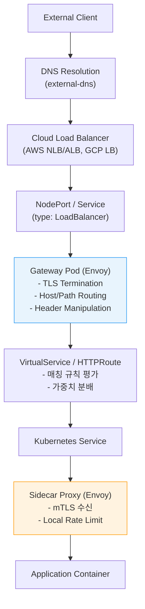

---

## 10. 실무 체크리스트

### 10.1 Gateway 도입 전

- [ ] North-South 트래픽 볼륨 및 패턴 분석
- [ ] TLS 인증서 관리 방안 결정 (수동 vs cert-manager)
- [ ] DNS 관리 방안 결정 (수동 vs external-dns)
- [ ] Istio API vs Gateway API 선택 (신규: Gateway API 권장)
- [ ] Multi-tenant 여부에 따른 Gateway 분리 전략 수립
- [ ] WAF/DDoS 보호 계층 설계

### 10.2 Gateway 운영 중

- [ ] Gateway Pod의 CPU/Memory 사용량 모니터링
- [ ] HPA 설정 및 스케일링 테스트 완료
- [ ] PodDisruptionBudget 설정
- [ ] 인증서 만료 알림 설정 (cert-manager 미사용 시)
- [ ] 접근 로그 수집 및 분석 파이프라인 구축
- [ ] 장애 시 트래픽 우회 절차 문서화

### 10.3 Gateway API 마이그레이션 시

- [ ] 현재 Istio API 리소스 전수 조사
- [ ] Gateway API 미지원 기능 식별 (fault injection, mirror 등)
- [ ] 서비스 단위 순차 마이그레이션 계획 수립
- [ ] 양 API 공존 기간 동안의 모니터링 강화
- [ ] DestinationRule, ServiceEntry 등 Istio CRD 유지 계획

---

## 참고 자료

- [Istio - Ingress Gateways](https://istio.io/latest/docs/tasks/traffic-management/ingress/ingress-control/)
- [Istio - Secure Gateways](https://istio.io/latest/docs/tasks/traffic-management/ingress/secure-ingress/)
- [Istio - Gateway API](https://istio.io/latest/docs/tasks/traffic-management/ingress/gateway-api/)
- [Istio - Egress Gateways](https://istio.io/latest/docs/tasks/traffic-management/egress/egress-gateway/)
- [Istio - Traffic Management Concepts](https://istio.io/latest/docs/concepts/traffic-management/)
- [Istio - Gateway Reference](https://istio.io/latest/docs/reference/config/networking/gateway/)
- [Istio - VirtualService Reference](https://istio.io/latest/docs/reference/config/networking/virtual-service/)
- [Istio - ServiceEntry Reference](https://istio.io/latest/docs/reference/config/networking/service-entry/)
- [Kubernetes Gateway API](https://gateway-api.sigs.k8s.io/)
- [Kubernetes Gateway API - HTTPRoute](https://gateway-api.sigs.k8s.io/api-types/httproute/)
- [cert-manager - Gateway API Integration](https://cert-manager.io/docs/usage/gateway/)
