Istio Sidecar 모드는 프로덕션 환경에서 가장 오래 검증된 Service Mesh 배포 방식이다. 이 글에서는 공식 문서를 기반으로 Istio의 아키텍처, Sidecar Injection 메커니즘, xDS 프로토콜, 트래픽 관리, 보안, Observability를 단계별로 깊이 있게 정리한다.

---

## 1. Istio 소개

> **원문 ([Istio - What is Istio?](https://istio.io/latest/about/service-mesh/)):**
> "A service mesh is an infrastructure layer that gives applications capabilities like zero-trust security, observability, and advanced traffic management, without code changes. Istio is the most popular, powerful, and trusted service mesh. Founded by Google, IBM and Lyft in 2016, Istio is a graduated project in the Cloud Native Computing Foundation alongside projects like Kubernetes and Prometheus."

**번역:** Service Mesh는 애플리케이션에 코드 변경 없이 제로 트러스트 보안, 관측성, 고급 트래픽 관리 기능을 제공하는 인프라 계층이다. Istio는 가장 인기 있고, 강력하며, 신뢰받는 Service Mesh이다. 2016년 Google, IBM, Lyft가 공동 창립했으며, Kubernetes, Prometheus와 함께 CNCF Graduated 프로젝트이다.

Istio는 마이크로서비스 간 네트워크 통신의 복잡성을 애플리케이션 코드에서 분리하여 인프라 계층에서 해결한다. 각 서비스가 개별적으로 재시도, 타임아웃, 암호화, 접근 제어를 구현하는 대신, 사이드카 프록시가 이 모든 것을 투명하게 처리한다.

### 1.1 핵심 기능

Istio 공식 문서에서 명시하는 핵심 기능은 다음과 같다.

| 기능 | 설명 |
|------|------|
| **Secure by default** | 워크로드 간 mTLS 자동 적용, 인증서 자동 로테이션 |
| **Powerful traffic management** | VirtualService, DestinationRule을 통한 세밀한 트래픽 제어 |
| **Observable** | 코드 변경 없이 메트릭, 로그, 분산 추적 자동 수집 |
| **Extensible** | WebAssembly 플러그인, Envoy 필터 체인을 통한 확장 |

---

## 2. Architecture (공식문서 기반)

> **원문 ([Istio Architecture](https://istio.io/latest/docs/ops/deployment/architecture/)):**
> "An Istio service mesh is logically split into a data plane and a control plane. The data plane is composed of a set of intelligent proxies (Envoy) deployed as sidecars. These proxies mediate and control all network communication between microservices. They also collect and report telemetry on all mesh traffic. The control plane manages and configures the proxies to route traffic."

**번역:** Istio Service Mesh는 논리적으로 데이터 플레인과 컨트롤 플레인으로 나뉜다. 데이터 플레인은 사이드카로 배포되는 지능형 프록시(Envoy) 집합으로 구성된다. 이 프록시들은 마이크로서비스 간 모든 네트워크 통신을 중재하고 제어한다. 또한 모든 메시 트래픽에 대한 텔레메트리를 수집하고 보고한다. 컨트롤 플레인은 프록시를 관리하고 설정하여 트래픽을 라우팅한다.

이 아키텍처의 핵심은 **관심사의 분리(Separation of Concerns)**이다. 컨트롤 플레인은 "무엇을 할 것인가"를 결정하고, 데이터 플레인은 "어떻게 실행할 것인가"를 담당한다.

### 2.1 전체 아키텍처 다이어그램

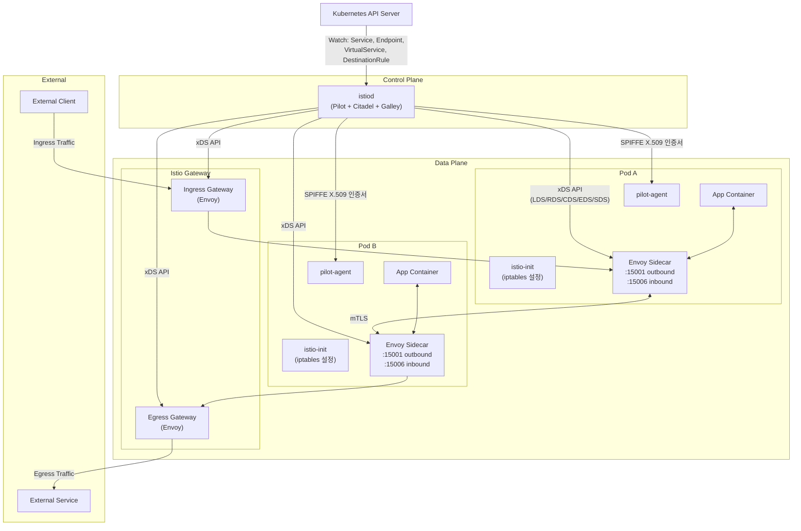

### 2.2 Control Plane - istiod

Istio 1.5 이전에는 Pilot, Citadel, Galley가 별도 프로세스로 동작했지만, 1.5부터 **istiod**라는 단일 바이너리로 통합되었다. 이로 인해 운영 복잡도가 크게 감소했고, 컴포넌트 간 통신 오버헤드도 제거되었다.

> **원문 ([Istio - Introducing istiod](https://istio.io/latest/blog/2020/istiod/)):**
> "istiod unifies functionality that Pilot, Citadel, Galley and the sidecar injector previously performed, into a single binary."

**번역:** istiod는 이전에 Pilot, Citadel, Galley, 사이드카 인젝터가 수행하던 기능을 하나의 바이너리로 통합한다.

각 컴포넌트의 역할은 다음과 같다.

| 컴포넌트 | 역할 | 상세 |
|---------|------|------|
| **Pilot** | 서비스 디스커버리, Envoy 프록시 설정 | Kubernetes API Server를 watch하여 Service, Endpoint 변경을 감지하고 xDS API로 프록시에 push |
| **Citadel** | 워크로드 ID 발급, 인증서 관리 | SPIFFE X.509 인증서 발급, 자동 로테이션 (기본 24시간), Root CA 관리 |
| **Galley** | 설정 검증 및 분배 | VirtualService, DestinationRule 등 Istio CRD의 스키마 검증, 유효성 확인 후 Pilot에 전달 |

istiod는 다음과 같은 포트를 사용한다.

| 포트 | 프로토콜 | 용도 |
|------|---------|------|
| 15010 | gRPC (plaintext) | xDS API (디버깅용) |
| 15012 | gRPC (mTLS) | xDS API (프로덕션) |
| 15014 | HTTP | 컨트롤 플레인 모니터링 |
| 15017 | HTTPS | Webhook (Sidecar Injection, Config Validation) |
| 443 | HTTPS | Webhook (15017로 리다이렉트) |

### 2.3 Data Plane - Envoy Proxy

> **원문 ([Envoy - What is Envoy](https://www.envoyproxy.io/docs/envoy/latest/intro/what_is_envoy)):**
> "Envoy is an L7 proxy and communication bus designed for large modern service oriented architectures."

**번역:** Envoy는 대규모 현대 서비스 지향 아키텍처를 위해 설계된 L7 프록시이자 통신 버스이다.

Istio의 데이터 플레인에서 Envoy는 다음 기능을 수행한다.

- **Dynamic service discovery**: istiod로부터 xDS를 통해 서비스 목록을 동적으로 수신
- **Load balancing**: 다양한 알고리즘 지원 (ROUND_ROBIN, LEAST_REQUEST, RANDOM, RING_HASH)
- **TLS termination**: 인바운드/아웃바운드 mTLS 자동 처리
- **HTTP/2 and gRPC proxies**: 프로토콜 레벨 인식 및 최적화
- **Circuit breakers**: 연결 풀, 요청 수 기반 회로 차단
- **Health checks**: 능동적/수동적 헬스 체크
- **Staged rollouts with %-based traffic split**: 가중치 기반 트래픽 분할
- **Fault injection**: 지연, 중단 주입으로 카오스 테스팅
- **Rich metrics**: L4/L7 메트릭 자동 수집 및 보고

---

## 3. Sidecar Injection 메커니즘

Istio의 사이드카 주입은 Kubernetes의 **MutatingAdmissionWebhook**을 활용한다. Pod 생성 요청이 API Server에 도달하면, istiod의 웹훅이 Pod spec을 수정하여 `istio-init` init container와 `istio-proxy` sidecar container를 추가한다.

> **원문 ([Istio - Installing the Sidecar](https://istio.io/latest/docs/setup/additional-setup/sidecar-injection/)):**
> "In order to take advantage of all of Istio's features, pods in the mesh must be running an Istio sidecar proxy. Sidecars can be injected automatically with a mutating webhook admission controller, or manually using istioctl."

**번역:** Istio의 모든 기능을 활용하려면 메시 내 Pod에 Istio 사이드카 프록시가 실행되어야 한다. 사이드카는 Mutating Webhook Admission Controller를 통해 자동으로 주입하거나, istioctl을 사용하여 수동으로 주입할 수 있다.

### 3.1 주입 제어 방법

| 방법 | 적용 범위 | 예시 |
|------|----------|------|
| Namespace label | 네임스페이스 전체 | `kubectl label namespace default istio-injection=enabled` |
| Pod annotation | 개별 Pod | `sidecar.istio.io/inject: "true"` |
| Revision label | 특정 istiod revision | `istio.io/rev=canary` (카나리 업그레이드용) |

```yaml
# Namespace 레벨 자동 주입 활성화
apiVersion: v1
kind: Namespace
metadata:
  name: production
  labels:
    istio-injection: enabled
```

```yaml
# Pod 레벨 주입 제어
apiVersion: v1
kind: Pod
metadata:
  name: my-app
  annotations:
    sidecar.istio.io/inject: "true"          # 주입 활성화
    sidecar.istio.io/proxyCPU: "100m"        # 사이드카 CPU 요청
    sidecar.istio.io/proxyMemory: "128Mi"    # 사이드카 메모리 요청
spec:
  containers:
    - name: my-app
      image: my-app:v1
```

### 3.2 Sidecar Injection 시퀀스

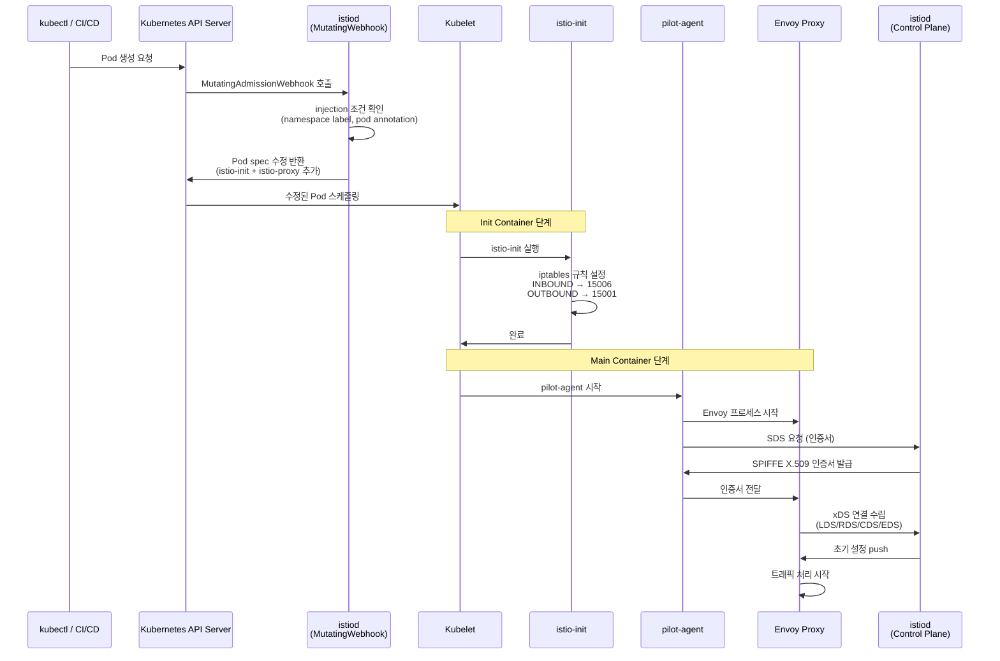

### 3.3 istio-init Container (iptables 설정)

istio-init은 init container로 실행되어 Pod의 네트워크 네임스페이스에 iptables 규칙을 설정한다. 이 규칙에 의해 모든 인바운드/아웃바운드 트래픽이 Envoy 프록시를 경유하게 된다.

> **원문 ([Istio - Debugging Envoy and Istiod](https://istio.io/latest/docs/ops/diagnostic-tools/proxy-cmd/)):**
> "Envoy intercepts all inbound and outbound traffic for the pod."

**번역:** Envoy는 Pod의 모든 인바운드 및 아웃바운드 트래픽을 가로챈다.

핵심 iptables 규칙의 동작 원리는 다음과 같다.

```bash
# istio-init이 설정하는 iptables 규칙 (간소화 버전)

# 인바운드 트래픽: 모든 TCP → 0.0.0.0:15006 (Envoy inbound listener)
iptables -t nat -A PREROUTING -p tcp -j REDIRECT --to-ports 15006

# 아웃바운드 트래픽: 모든 TCP → 0.0.0.0:15001 (Envoy outbound listener)
iptables -t nat -A OUTPUT -p tcp -j ISTIO_OUTPUT
iptables -t nat -A ISTIO_OUTPUT -m owner --uid-owner 1337 -j RETURN  # Envoy 자체 트래픽 제외
iptables -t nat -A ISTIO_OUTPUT -m owner --gid-owner 1337 -j RETURN  # Envoy 자체 트래픽 제외
iptables -t nat -A ISTIO_OUTPUT -j REDIRECT --to-ports 15001
```

| 포트 | 방향 | 용도 |
|------|------|------|
| 15006 | Inbound | Envoy 인바운드 리스너 (외부 → Pod) |
| 15001 | Outbound | Envoy 아웃바운드 리스너 (Pod → 외부) |
| 15020 | - | 헬스 체크 (merged Prometheus telemetry) |
| 15090 | - | Envoy Prometheus telemetry |

**Infinite loop 방지**: UID/GID 1337(istio-proxy 사용자)에서 발생하는 트래픽은 iptables 규칙에서 제외된다. 이를 통해 Envoy가 자신이 생성한 트래픽을 다시 가로채는 무한 루프를 방지한다.

### 3.4 pilot-agent 역할

pilot-agent는 Envoy 프록시의 라이프사이클을 관리하는 프로세스이다. 사이드카 컨테이너의 ENTRYPOINT로 실행되며, 다음 역할을 수행한다.

- **Envoy 프로세스 관리**: 시작, 재시작, 그레이스풀 셧다운
- **인증서 로테이션**: istiod로부터 SDS를 통해 인증서를 수신하고 Envoy에 전달
- **헬스 체크 프록시**: 애플리케이션의 헬스 체크를 Envoy를 통해 노출
- **Bootstrap 설정 생성**: Envoy 초기 설정 파일 생성
- **DNS 프록시**: `.svc.cluster.local` 도메인 해석 (Istio DNS Proxy 기능)

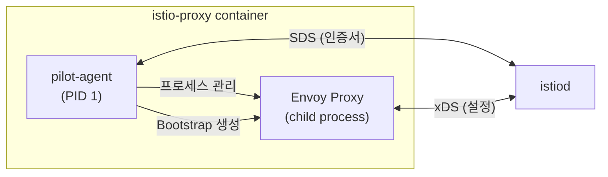

---

## 4. xDS Protocol (상세)

xDS(x Discovery Service)는 Envoy와 컨트롤 플레인 간의 통신 프로토콜이다. istiod는 Kubernetes API Server의 리소스 변경을 감지하면 이를 Envoy 설정으로 변환하여 xDS를 통해 push한다.

> **원문 ([Envoy - xDS configuration API overview](https://www.envoyproxy.io/docs/envoy/latest/intro/arch_overview/operations/dynamic_configuration)):**
> "Envoy discovers its various dynamic resources via the filesystem or by querying one or more management servers. Collectively, these discovery services and their corresponding APIs are referred to as xDS."

**번역:** Envoy는 파일시스템을 통해서 또는 하나 이상의 관리 서버에 쿼리하여 다양한 동적 리소스를 발견한다. 이러한 디스커버리 서비스와 해당 API를 통칭하여 xDS라고 한다.

### 4.1 xDS 프로토콜 종류

| 프로토콜 | Full Name | 역할 | Istio 리소스 매핑 |
|---------|-----------|------|------------------|
| **LDS** | Listener Discovery Service | 리스너 설정 (포트, 프로토콜, 필터 체인) | Gateway, Sidecar |
| **RDS** | Route Discovery Service | 라우팅 규칙 (호스트, 경로, 가중치) | VirtualService |
| **CDS** | Cluster Discovery Service | 업스트림 클러스터 (로드밸런싱, 연결 풀) | DestinationRule |
| **EDS** | Endpoint Discovery Service | 엔드포인트 (Pod IP, 포트, 상태) | Kubernetes Endpoints |
| **SDS** | Secret Discovery Service | TLS 인증서 (mTLS, 서버 인증서) | PeerAuthentication |

### 4.2 xDS Push 흐름

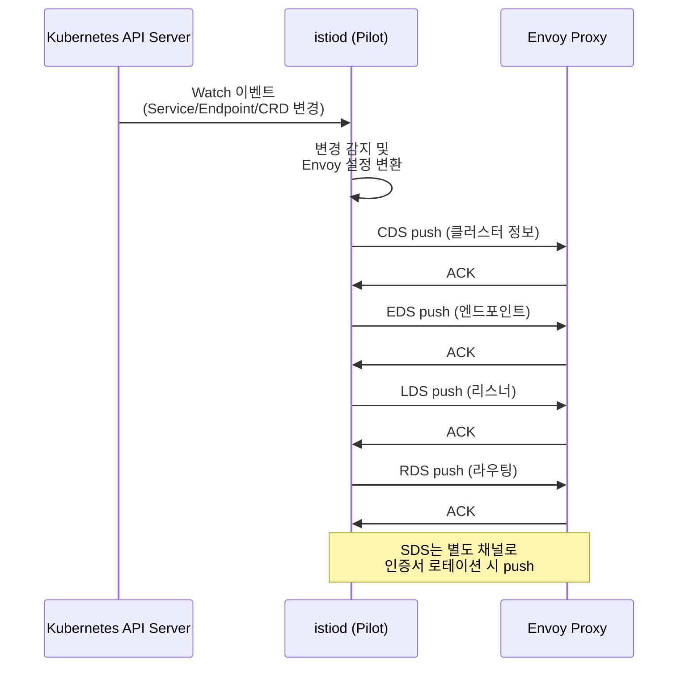

### 4.3 xDS 디버깅

실제 운영 시 Envoy가 수신한 xDS 설정을 확인하는 것은 트러블슈팅의 핵심이다.

```bash
# 특정 Pod의 Envoy 설정 전체 확인
istioctl proxy-config all <pod-name> -n <namespace>

# 리스너 확인 (LDS)
istioctl proxy-config listeners <pod-name> -n <namespace>

# 라우트 확인 (RDS)
istioctl proxy-config routes <pod-name> -n <namespace>

# 클러스터 확인 (CDS)
istioctl proxy-config clusters <pod-name> -n <namespace>

# 엔드포인트 확인 (EDS)
istioctl proxy-config endpoints <pod-name> -n <namespace>

# 시크릿 확인 (SDS)
istioctl proxy-config secret <pod-name> -n <namespace>

# istiod-Envoy 동기화 상태 확인
istioctl proxy-status
```

---

## 5. Traffic Management (공식문서 상세)

> **원문 ([Traffic Management](https://istio.io/latest/docs/concepts/traffic-management/)):**
> "Istio's traffic routing rules let you easily control the flow of traffic and API calls between services. Istio simplifies configuration of service-level properties like circuit breakers, timeouts, and retries, and makes it easy to set up important tasks like A/B testing, canary rollouts, and staged rollouts with percentage-based traffic splits."

**번역:** Istio의 트래픽 라우팅 규칙을 사용하면 서비스 간 트래픽 흐름과 API 호출을 쉽게 제어할 수 있다. Istio는 서킷 브레이커, 타임아웃, 재시도와 같은 서비스 레벨 속성 설정을 단순화하고, A/B 테스트, 카나리 롤아웃, 퍼센트 기반 트래픽 분할과 같은 중요한 작업을 쉽게 설정할 수 있게 한다.

Istio의 트래픽 관리는 다음 CRD(Custom Resource Definition)를 통해 이루어진다.

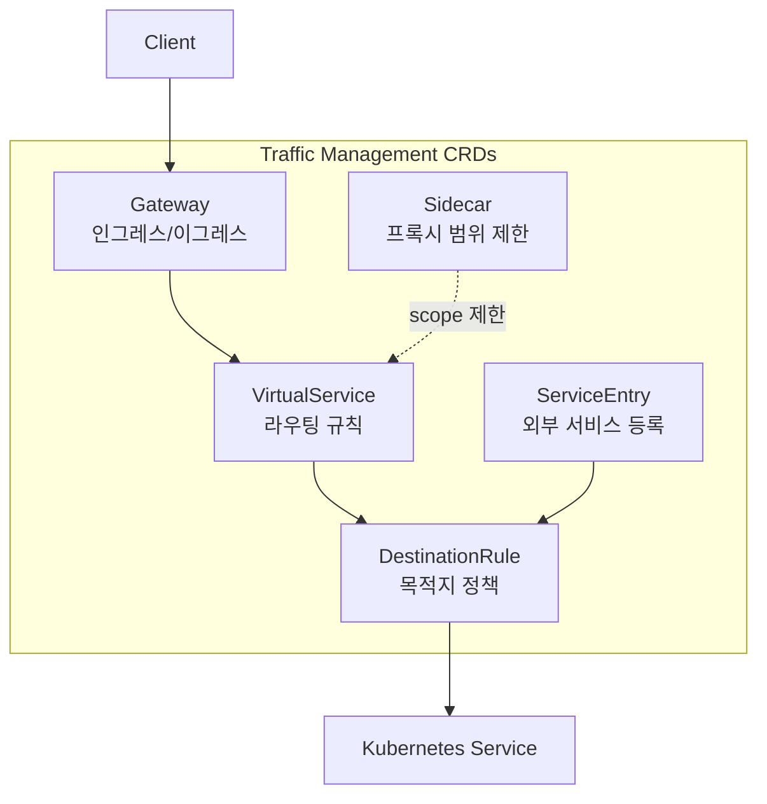

### 5.1 Virtual Services

VirtualService는 Istio 트래픽 라우팅의 핵심 리소스이다. Kubernetes Service로 향하는 트래픽을 어떻게 라우팅할지 정의한다.

> **원문 ([Virtual Service](https://istio.io/latest/docs/reference/config/networking/virtual-service/)):**
> "A VirtualService defines a set of traffic routing rules to apply when a host is addressed."

**번역:** VirtualService는 호스트에 접근할 때 적용할 트래픽 라우팅 규칙 집합을 정의한다.

#### 5.1.1 기본 트래픽 분할 (카나리 배포)

```yaml
apiVersion: networking.istio.io/v1
kind: VirtualService
metadata:
  name: reviews-route
  namespace: bookinfo
spec:
  hosts:
    - reviews                    # 대상 서비스 호스트명
  http:
    - route:
        - destination:
            host: reviews
            subset: v1           # DestinationRule에서 정의한 subset
          weight: 90             # 90% 트래픽 → v1
        - destination:
            host: reviews
            subset: v2
          weight: 10             # 10% 트래픽 → v2 (카나리)
```

#### 5.1.2 헤더 기반 라우팅

```yaml
apiVersion: networking.istio.io/v1
kind: VirtualService
metadata:
  name: reviews-header-route
  namespace: bookinfo
spec:
  hosts:
    - reviews
  http:
    - match:                      # 매칭 조건
        - headers:
            end-user:
              exact: jason        # end-user 헤더가 "jason"이면
      route:
        - destination:
            host: reviews
            subset: v3            # v3로 라우팅 (특정 사용자 테스트)
    - route:                      # 기본 라우팅 (매칭 안 되면)
        - destination:
            host: reviews
            subset: v1
```

#### 5.1.3 URI 기반 라우팅 + 타임아웃 + 재시도 + 장애 주입

> **원문 ([Traffic Management](https://istio.io/latest/docs/concepts/traffic-management/)):**
> "Amount of time that an Envoy proxy should wait for replies from a given service."

**번역:** Envoy 프록시가 지정된 서비스의 응답을 기다리는 시간이다.

> **원문 ([Traffic Management](https://istio.io/latest/docs/concepts/traffic-management/)):**
> "Maximum number of times an Envoy proxy attempts to connect if initial call fails."

**번역:** 초기 호출이 실패했을 때 Envoy 프록시가 연결을 시도하는 최대 횟수이다.

```yaml
apiVersion: networking.istio.io/v1
kind: VirtualService
metadata:
  name: ratings-route
  namespace: bookinfo
spec:
  hosts:
    - ratings
  http:
    # 1) /api/v2 경로 → v2 subset (타임아웃 + 재시도)
    - match:
        - uri:
            prefix: /api/v2
          method:
            exact: GET
      route:
        - destination:
            host: ratings
            subset: v2
      timeout: 3s                 # 3초 타임아웃
      retries:
        attempts: 3               # 최대 3회 재시도
        perTryTimeout: 1s         # 재시도당 1초 타임아웃
        retryOn: "5xx,reset,connect-failure,retriable-4xx"

    # 2) 장애 주입 (카오스 테스팅)
    - match:
        - headers:
            x-chaos-test:
              exact: "true"
      fault:
        delay:
          percentage:
            value: 50.0           # 50% 요청에 2초 지연 주입
          fixedDelay: 2s
        abort:
          percentage:
            value: 10.0           # 10% 요청에 500 에러 반환
          httpStatus: 500
      route:
        - destination:
            host: ratings
            subset: v1

    # 3) 기본 라우팅
    - route:
        - destination:
            host: ratings
            subset: v1
```

#### 5.1.4 Match 조건 전체 목록

| 필드 | 설명 | 예시 |
|------|------|------|
| `uri` | URI 경로 | `exact: /api`, `prefix: /api/v1`, `regex: /api/v[0-9]+` |
| `headers` | HTTP 헤더 | `exact`, `prefix`, `regex` |
| `method` | HTTP 메서드 | `exact: GET` |
| `port` | 포트 번호 | `80` |
| `queryParams` | 쿼리 파라미터 | `exact: debug` |
| `sourceLabels` | 소스 Pod 라벨 | `app: frontend` |
| `sourceNamespace` | 소스 네임스페이스 | `default` |

### 5.2 Destination Rules

DestinationRule은 VirtualService가 라우팅한 트래픽이 목적지에 도달한 후 적용되는 정책을 정의한다.

> **원문 ([Destination Rule](https://istio.io/latest/docs/reference/config/networking/destination-rule/)):**
> "DestinationRule defines policies that apply to traffic intended for a service after routing has occurred."

**번역:** DestinationRule은 라우팅이 발생한 후 서비스를 향하는 트래픽에 적용되는 정책을 정의한다.

#### 5.2.1 Subset 정의 + 로드밸런싱

```yaml
apiVersion: networking.istio.io/v1
kind: DestinationRule
metadata:
  name: reviews-destination
  namespace: bookinfo
spec:
  host: reviews                    # 대상 서비스
  trafficPolicy:                   # 기본 트래픽 정책
    loadBalancer:
      simple: LEAST_REQUEST        # 최소 요청 수 기반 로드밸런싱
  subsets:
    - name: v1
      labels:
        version: v1                # version=v1 라벨을 가진 Pod
      trafficPolicy:
        loadBalancer:
          simple: ROUND_ROBIN      # v1 subset은 라운드 로빈
    - name: v2
      labels:
        version: v2
    - name: v3
      labels:
        version: v3
```

#### 5.2.2 로드밸런싱 알고리즘

| 알고리즘 | 설명 | 적합한 상황 |
|---------|------|-----------|
| `ROUND_ROBIN` | 순차적 분배 (기본값) | 일반적인 무상태 서비스 |
| `LEAST_REQUEST` | 가장 적은 활성 요청을 가진 인스턴스 | 요청 처리 시간이 불균일한 서비스 |
| `RANDOM` | 무작위 분배 | 간단한 분산이 필요한 경우 |
| `PASSTHROUGH` | 프록시가 로드밸런싱하지 않음 | 클라이언트가 직접 제어 |
| `LEAST_CONN` | 최소 연결 수 기반 | 장시간 연결 유지 서비스 |

#### 5.2.3 연결 풀 + 서킷 브레이커 (Outlier Detection)

```yaml
apiVersion: networking.istio.io/v1
kind: DestinationRule
metadata:
  name: reviews-circuit-breaker
  namespace: bookinfo
spec:
  host: reviews
  trafficPolicy:
    connectionPool:
      tcp:
        maxConnections: 100        # 최대 TCP 연결 수
        connectTimeout: 5s         # TCP 연결 타임아웃
      http:
        h2UpgradePolicy: DEFAULT
        http1MaxPendingRequests: 100  # 최대 대기 요청 수
        http2MaxRequests: 1000        # HTTP/2 최대 동시 요청
        maxRequestsPerConnection: 10  # 연결당 최대 요청 수
        maxRetries: 3                 # 최대 재시도 수
    outlierDetection:              # 이상치 감지 (서킷 브레이커)
      consecutive5xxErrors: 5      # 연속 5xx 에러 5회 발생 시
      interval: 10s                # 검사 주기
      baseEjectionTime: 30s        # 최소 제외 시간
      maxEjectionPercent: 50       # 최대 제외 비율 (50%)
      minHealthPercent: 30         # 최소 건강 비율
```

서킷 브레이커 동작 흐름은 다음과 같다.

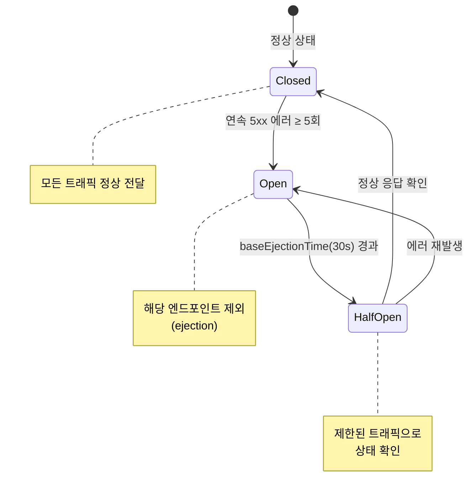

#### 5.2.4 TLS 설정 (클라이언트 측)

```yaml
apiVersion: networking.istio.io/v1
kind: DestinationRule
metadata:
  name: external-tls
spec:
  host: external-api.example.com
  trafficPolicy:
    tls:
      mode: MUTUAL                 # 클라이언트 mTLS
      clientCertificate: /etc/certs/client.pem
      privateKey: /etc/certs/key.pem
      caCertificates: /etc/certs/ca.pem
```

| TLS 모드 | 설명 |
|---------|------|
| `DISABLE` | TLS 비활성화 |
| `SIMPLE` | 단방향 TLS (서버 인증만) |
| `MUTUAL` | 양방향 mTLS (서버 + 클라이언트 인증) |
| `ISTIO_MUTUAL` | Istio가 자동 관리하는 mTLS |

### 5.3 Gateways

Gateway는 메시 경계에서 인바운드/아웃바운드 트래픽을 관리한다.

> **원문 ([Gateways](https://istio.io/latest/docs/concepts/traffic-management/#gateways)):**
> "Gateways are primarily used to manage ingress traffic, but you can also configure egress gateways."

**번역:** Gateway는 주로 인그레스 트래픽을 관리하는 데 사용되지만, 이그레스 게이트웨이도 설정할 수 있다.

#### 5.3.1 Ingress Gateway (North-South 트래픽)

```yaml
apiVersion: networking.istio.io/v1
kind: Gateway
metadata:
  name: bookinfo-gateway
  namespace: bookinfo
spec:
  selector:
    istio: ingressgateway           # Istio Ingress Gateway Pod 선택
  servers:
    - port:
        number: 443
        name: https
        protocol: HTTPS
      tls:
        mode: SIMPLE                # 단방향 TLS
        credentialName: bookinfo-tls  # Kubernetes Secret 참조
      hosts:
        - "bookinfo.example.com"
    - port:
        number: 80
        name: http
        protocol: HTTP
      hosts:
        - "bookinfo.example.com"
      tls:
        httpsRedirect: true         # HTTP → HTTPS 리다이렉트
---
# Gateway와 연결되는 VirtualService
apiVersion: networking.istio.io/v1
kind: VirtualService
metadata:
  name: bookinfo-vs
  namespace: bookinfo
spec:
  hosts:
    - "bookinfo.example.com"
  gateways:
    - bookinfo-gateway              # Gateway 참조
  http:
    - match:
        - uri:
            prefix: /productpage
      route:
        - destination:
            host: productpage
            port:
              number: 9080
```

#### 5.3.2 Egress Gateway (아웃바운드 제어)

```yaml
apiVersion: networking.istio.io/v1
kind: Gateway
metadata:
  name: external-egress
  namespace: istio-system
spec:
  selector:
    istio: egressgateway
  servers:
    - port:
        number: 443
        name: tls
        protocol: TLS
      tls:
        mode: PASSTHROUGH
      hosts:
        - "external-api.example.com"
---
apiVersion: networking.istio.io/v1
kind: VirtualService
metadata:
  name: external-egress-vs
spec:
  hosts:
    - "external-api.example.com"
  gateways:
    - mesh                          # 메시 내부 트래픽
    - external-egress               # 이그레스 게이트웨이
  tls:
    - match:
        - gateways:
            - mesh
          sniHosts:
            - "external-api.example.com"
      route:
        - destination:
            host: istio-egressgateway.istio-system.svc.cluster.local
            port:
              number: 443
    - match:
        - gateways:
            - external-egress
          sniHosts:
            - "external-api.example.com"
      route:
        - destination:
            host: "external-api.example.com"
            port:
              number: 443
```

### 5.4 Service Entries

ServiceEntry는 Istio의 내부 서비스 레지스트리에 외부 서비스를 등록한다. 이를 통해 외부 서비스에도 Istio의 트래픽 관리 기능(재시도, 타임아웃, 장애 주입 등)을 적용할 수 있다.

> **원문 ([Service Entry](https://istio.io/latest/docs/reference/config/networking/service-entry/)):**
> "ServiceEntry enables adding additional entries into Istio's internal service registry, so that auto-discovered services in the mesh can access/route to these manually specified services."

**번역:** ServiceEntry는 Istio의 내부 서비스 레지스트리에 추가 항목을 등록하여, 메시에서 자동 발견된 서비스가 수동으로 지정된 서비스에 접근/라우팅할 수 있게 한다.

```yaml
apiVersion: networking.istio.io/v1
kind: ServiceEntry
metadata:
  name: external-api
spec:
  hosts:
    - "api.external-service.com"
  location: MESH_EXTERNAL           # 메시 외부 서비스
  ports:
    - number: 443
      name: https
      protocol: TLS
  resolution: DNS                   # DNS 기반 해석
---
# 외부 서비스에 DestinationRule 적용
apiVersion: networking.istio.io/v1
kind: DestinationRule
metadata:
  name: external-api-dr
spec:
  host: "api.external-service.com"
  trafficPolicy:
    tls:
      mode: SIMPLE                  # TLS 활성화
    connectionPool:
      tcp:
        maxConnections: 50
    outlierDetection:
      consecutive5xxErrors: 3
      interval: 30s
      baseEjectionTime: 60s
```

| resolution | 설명 |
|-----------|------|
| `NONE` | 해석 없음 (IP 직접 사용) |
| `STATIC` | endpoints 필드에 지정된 고정 IP 사용 |
| `DNS` | DNS 조회로 IP 해석 |
| `DNS_ROUND_ROBIN` | DNS 결과를 라운드 로빈으로 사용 |

### 5.5 Sidecar (프록시 범위 제한)

Sidecar 리소스는 Envoy 프록시가 수신하는 xDS 설정의 범위를 제한한다. 기본적으로 모든 Envoy 프록시는 메시 내 모든 서비스의 설정을 수신하는데, 대규모 클러스터에서는 이것이 메모리와 CPU 오버헤드를 크게 증가시킨다.

> **원문 ([Sidecar](https://istio.io/latest/docs/reference/config/networking/sidecar/)):**
> "By default, Istio will program all sidecar proxies in the mesh with the necessary configuration required to reach every workload instance in the mesh, as well as accept traffic on all the ports associated with the workload."

**번역:** 기본적으로 Istio는 메시 내 모든 사이드카 프록시에 메시의 모든 워크로드 인스턴스에 도달하는 데 필요한 설정과, 워크로드와 연관된 모든 포트에서 트래픽을 수신하는 설정을 프로그래밍한다.

```yaml
apiVersion: networking.istio.io/v1
kind: Sidecar
metadata:
  name: default
  namespace: bookinfo
spec:
  workloadSelector:                # 적용 대상 (없으면 네임스페이스 전체)
    labels:
      app: reviews
  ingress:
    - port:
        number: 9080
        protocol: HTTP
        name: http
      defaultEndpoint: 127.0.0.1:9080  # 앱 컨테이너 포트
  egress:
    - hosts:
        - "./*"                    # 같은 네임스페이스의 모든 서비스
        - "istio-system/*"         # istio-system의 모든 서비스
      port:
        number: 443
        protocol: HTTPS
```

대규모 클러스터(서비스 1000개 이상)에서는 Sidecar 리소스를 반드시 사용해야 한다. 각 Envoy가 전체 메시의 설정을 보유하면, 서비스 하나 변경 시 수천 개의 프록시에 xDS push가 발생하여 컨트롤 플레인에 부하를 가중시킨다.

### 5.6 Network Resilience

#### 5.6.1 Timeouts

```yaml
apiVersion: networking.istio.io/v1
kind: VirtualService
metadata:
  name: ratings-timeout
spec:
  hosts:
    - ratings
  http:
    - route:
        - destination:
            host: ratings
      timeout: 3s                   # 3초 타임아웃
```

#### 5.6.2 Retries

```yaml
apiVersion: networking.istio.io/v1
kind: VirtualService
metadata:
  name: ratings-retry
spec:
  hosts:
    - ratings
  http:
    - route:
        - destination:
            host: ratings
      retries:
        attempts: 3                 # 최대 3회 재시도
        perTryTimeout: 2s           # 재시도당 2초 타임아웃
        retryOn: "5xx,reset,connect-failure,retriable-4xx"
        retryRemoteLocalities: true # 다른 locality의 엔드포인트로 재시도
```

| retryOn 값 | 설명 |
|-----------|------|
| `5xx` | 5xx 응답 시 재시도 |
| `gateway-error` | 502, 503, 504 응답 시 재시도 |
| `reset` | 연결 리셋 시 재시도 |
| `connect-failure` | 연결 실패 시 재시도 |
| `retriable-4xx` | 재시도 가능한 4xx (409 등) |
| `refused-stream` | REFUSED_STREAM 에러 시 재시도 |

#### 5.6.3 Circuit Breakers

서킷 브레이커는 DestinationRule의 `connectionPool`과 `outlierDetection`으로 구성된다. (5.2.3 섹션의 예시 참조)

동작 원리:
1. `connectionPool`: 동시 연결 수, 대기 요청 수를 제한하여 과부하 방지
2. `outlierDetection`: 비정상 엔드포인트를 감지하여 로드밸런싱 풀에서 일시 제거

#### 5.6.4 Fault Injection

```yaml
apiVersion: networking.istio.io/v1
kind: VirtualService
metadata:
  name: ratings-fault
spec:
  hosts:
    - ratings
  http:
    - fault:
        delay:
          percentage:
            value: 10.0             # 10% 요청에 지연 주입
          fixedDelay: 5s            # 5초 지연
        abort:
          percentage:
            value: 5.0              # 5% 요청에 에러 주입
          httpStatus: 503           # 503 응답 반환
      route:
        - destination:
            host: ratings
            subset: v1
```

장애 주입은 애플리케이션의 회복력(resilience)을 테스트하는 카오스 엔지니어링의 핵심 도구이다. 코드 변경 없이 인프라 레벨에서 장애를 시뮬레이션할 수 있다.

---

## 6. Security (공식문서 상세)

> **원문 ([Security](https://istio.io/latest/docs/concepts/security/)):**
> "Istio provides every workload with a strong identity--based on the workload's service account--that is used to establish and verify mutual TLS connections between workloads."

**번역:** Istio는 모든 워크로드에 워크로드의 서비스 계정을 기반으로 하는 강력한 ID를 제공하며, 이 ID는 워크로드 간 상호 TLS 연결을 수립하고 검증하는 데 사용된다.

Istio의 보안 모델은 세 가지 축으로 구성된다.

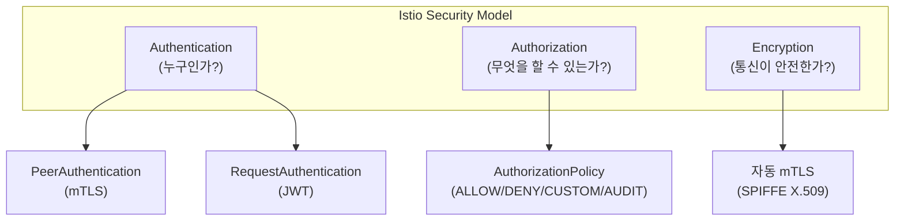

### 6.1 Authentication (인증)

> **원문 ([Security - Authentication](https://istio.io/latest/docs/concepts/security/)):**
> "Istio provides two types of authentication"
> Peer authentication: "used for service-to-service authentication to verify the client making the connection."
> Request authentication: "Used for end-user authentication to verify the credential attached to the request"

**번역:** Istio는 두 가지 유형의 인증을 제공한다. Peer 인증은 연결을 생성하는 클라이언트를 검증하는 서비스 간 인증에 사용된다. Request 인증은 요청에 첨부된 자격 증명을 검증하는 최종 사용자 인증에 사용된다.

#### 6.1.1 PeerAuthentication (mTLS 모드)

PeerAuthentication은 워크로드 간 mTLS 통신 정책을 정의한다. Mesh 전체, 네임스페이스, 개별 워크로드 수준으로 설정 가능하다.

> **원문 ([Peer Authentication](https://istio.io/latest/docs/reference/config/security/peer_authentication/)):**
> "PeerAuthentication defines how traffic will be tunneled (or not) to the sidecar."

**번역:** PeerAuthentication은 트래픽이 사이드카로 터널링되는 방식(또는 터널링 여부)을 정의한다.

> **원문 ([Security - Mutual TLS](https://istio.io/latest/docs/concepts/security/)):**
> "Mesh-wide peer authentication policies with an unset mode use the PERMISSIVE mode by default."
> "There can be only one mesh-wide peer authentication policy, and only one namespace-wide peer authentication policy per namespace."

**번역:** 모드가 설정되지 않은 메시 전체 피어 인증 정책은 기본적으로 PERMISSIVE 모드를 사용한다. 메시 전체 피어 인증 정책은 하나만 존재할 수 있고, 네임스페이스별 피어 인증 정책도 네임스페이스당 하나만 존재할 수 있다.

| mTLS 모드 | 설명 | 사용 시점 |
|-----------|------|----------|
| `STRICT` | mTLS만 허용 (평문 거부) | 프로덕션 환경 (완전 전환 후) |
| `PERMISSIVE` | mTLS + 평문 모두 허용 | 마이그레이션 과정 (기본값) |
| `DISABLE` | mTLS 비활성화 | 특수한 경우 (레거시 연동) |
| `UNSET` | 상위 정책 상속 | 명시적 설정 불필요 시 |

```yaml
# 1) Mesh 전체 STRICT mTLS
apiVersion: security.istio.io/v1
kind: PeerAuthentication
metadata:
  name: default
  namespace: istio-system            # istio-system에 설정하면 mesh-wide
spec:
  mtls:
    mode: STRICT
```

```yaml
# 2) 네임스페이스 레벨 PERMISSIVE (마이그레이션 중)
apiVersion: security.istio.io/v1
kind: PeerAuthentication
metadata:
  name: default
  namespace: legacy-namespace
spec:
  mtls:
    mode: PERMISSIVE
```

```yaml
# 3) 특정 워크로드에만 적용 (포트별 제어)
apiVersion: security.istio.io/v1
kind: PeerAuthentication
metadata:
  name: finance-app-strict
  namespace: finance
spec:
  selector:
    matchLabels:
      app: finance-api
  mtls:
    mode: STRICT
  portLevelMtls:
    8080:
      mode: PERMISSIVE              # 8080 포트만 PERMISSIVE
```

**정책 우선순위**: workload-specific > namespace-wide > mesh-wide. 더 구체적인 정책이 우선 적용된다.

#### 6.1.2 RequestAuthentication (JWT 검증)

RequestAuthentication은 외부에서 들어오는 요청의 JWT 토큰을 검증한다.

> **원문 ([Request Authentication](https://istio.io/latest/docs/reference/config/security/request_authentication/)):**
> "RequestAuthentication defines what request authentication methods are supported by a workload."

**번역:** RequestAuthentication은 워크로드가 지원하는 요청 인증 방법을 정의한다.

```yaml
apiVersion: security.istio.io/v1
kind: RequestAuthentication
metadata:
  name: jwt-auth
  namespace: bookinfo
spec:
  selector:
    matchLabels:
      app: productpage
  jwtRules:
    - issuer: "https://accounts.google.com"
      jwksUri: "https://www.googleapis.com/oauth2/v3/certs"
      fromHeaders:
        - name: Authorization
          prefix: "Bearer "
      fromParams:
        - "access_token"            # 쿼리 파라미터에서도 토큰 추출
      forwardOriginalToken: true    # 원본 토큰을 upstream에 전달
      outputPayloadToHeader: "x-jwt-payload"  # 디코딩된 페이로드를 헤더로 전달
```

> **원문 ([Security - Request Authentication](https://istio.io/latest/docs/concepts/security/)):**
> "Request authentication policies specify the values needed to validate a JSON Web Token (JWT)."
> "When requests carry no token, they are accepted by default."

**번역:** Request 인증 정책은 JSON Web Token(JWT)을 검증하는 데 필요한 값을 지정한다. 요청에 토큰이 없으면 기본적으로 수락된다.

주의: RequestAuthentication은 JWT가 존재할 때만 검증하고, JWT가 없는 요청은 통과시킨다. JWT 없는 요청을 차단하려면 AuthorizationPolicy를 함께 사용해야 한다.

### 6.2 Authorization (인가)

#### 6.2.1 AuthorizationPolicy

AuthorizationPolicy는 워크로드에 대한 접근 제어를 정의한다.

> **원문 ([Authorization Policy](https://istio.io/latest/docs/reference/config/security/authorization-policy/)):**
> "Istio Authorization Policy enables access control on workloads in the mesh."

**번역:** Istio Authorization Policy는 메시 내 워크로드에 대한 접근 제어를 활성화한다.

> **원문 ([Security - Authorization](https://istio.io/latest/docs/concepts/security/)):**
> "Istio's authorization features provide mesh-, namespace-, and workload-wide access control for your workloads in the mesh."
> "Each Envoy proxy runs an authorization engine that authorizes requests at runtime."
> "You don't need to explicitly enable Istio's authorization features; they are available after installation."
> "For workloads without authorization policies applied, Istio allows all requests."

**번역:** Istio의 인가 기능은 메시 내 워크로드에 대해 메시, 네임스페이스, 워크로드 수준의 접근 제어를 제공한다. 각 Envoy 프록시는 런타임에 요청을 인가하는 인가 엔진을 실행한다. Istio의 인가 기능을 명시적으로 활성화할 필요가 없으며, 설치 후 바로 사용 가능하다. 인가 정책이 적용되지 않은 워크로드에 대해 Istio는 모든 요청을 허용한다.

| Action | 설명 |
|--------|------|
| `ALLOW` | 조건에 맞으면 허용 |
| `DENY` | 조건에 맞으면 거부 (ALLOW보다 우선) |
| `CUSTOM` | 외부 인가 서비스에 위임 |
| `AUDIT` | 감사 로그만 기록 (트래픽 영향 없음) |

> **원문 ([Security - Authorization](https://istio.io/latest/docs/concepts/security/)):**
> Evaluation order: "CUSTOM, DENY, and then ALLOW."
> "The deny policy takes precedence over the allow policy."

**번역:** 평가 순서는 CUSTOM, DENY, 그다음 ALLOW이다. deny 정책이 allow 정책보다 우선한다.

**정책 평가 순서**: CUSTOM > DENY > ALLOW > 암묵적 허용(정책 미설정 시)

```yaml
# 1) DENY: 특정 소스 차단
apiVersion: security.istio.io/v1
kind: AuthorizationPolicy
metadata:
  name: deny-untrusted
  namespace: bookinfo
spec:
  selector:
    matchLabels:
      app: productpage
  action: DENY
  rules:
    - from:
        - source:
            notNamespaces: ["bookinfo", "istio-system"]  # 허용 네임스페이스 외 차단
```

```yaml
# 2) ALLOW: 세밀한 접근 제어
apiVersion: security.istio.io/v1
kind: AuthorizationPolicy
metadata:
  name: allow-read
  namespace: bookinfo
spec:
  selector:
    matchLabels:
      app: reviews
  action: ALLOW
  rules:
    - from:
        - source:
            principals:
              - "cluster.local/ns/bookinfo/sa/productpage"  # 특정 서비스 어카운트만
            namespaces:
              - "bookinfo"
      to:
        - operation:
            methods: ["GET"]         # GET만 허용
            paths: ["/api/v1/*"]     # 특정 경로만
            ports: ["9080"]
      when:
        - key: request.headers[x-api-version]
          values: ["v1", "v2"]       # 특정 헤더 값 조건
```

```yaml
# 3) JWT 기반 인가 (RequestAuthentication과 조합)
apiVersion: security.istio.io/v1
kind: AuthorizationPolicy
metadata:
  name: require-jwt
  namespace: bookinfo
spec:
  selector:
    matchLabels:
      app: productpage
  action: ALLOW
  rules:
    - from:
        - source:
            requestPrincipals: ["https://accounts.google.com/*"]
      when:
        - key: request.auth.claims[groups]
          values: ["admin", "editor"]  # JWT claims의 groups 필드 검증
```

```yaml
# 4) 전체 네임스페이스 기본 거부 (deny-all)
apiVersion: security.istio.io/v1
kind: AuthorizationPolicy
metadata:
  name: deny-all
  namespace: bookinfo
spec:
  {}                                # 빈 spec = 모든 트래픽 거부
```

#### 6.2.2 Source 필드 상세

| 필드 | 설명 | 예시 |
|------|------|------|
| `principals` | SPIFFE ID | `cluster.local/ns/default/sa/my-sa` |
| `notPrincipals` | SPIFFE ID 제외 | (위와 동일 형식) |
| `namespaces` | 소스 네임스페이스 | `["bookinfo"]` |
| `notNamespaces` | 네임스페이스 제외 | `["untrusted"]` |
| `ipBlocks` | 소스 IP 대역 | `["10.0.0.0/8"]` |
| `notIpBlocks` | IP 대역 제외 | `["10.0.1.0/24"]` |
| `requestPrincipals` | JWT subject | `["issuer/subject"]` |
| `remoteIpBlocks` | 원본 클라이언트 IP | X-Forwarded-For 기반 |

### 6.3 mTLS 내부 동작

#### 6.3.1 SPIFFE Identity

> **원문 ([Security - Identity](https://istio.io/latest/docs/concepts/security/)):**
> "Identity is a fundamental concept of any security infrastructure."

**번역:** ID는 모든 보안 인프라의 근본적인 개념이다.

Istio는 SPIFFE(Secure Production Identity Framework For Everyone) 표준을 따르는 ID를 모든 워크로드에 부여한다.

> **원문 ([SPIFFE](https://spiffe.io/docs/latest/spiffe-about/overview/)):**
> "SPIFFE, the Secure Production Identity Framework for Everyone, is a set of open-source standards for securely identifying software systems in dynamic and heterogeneous environments."

**번역:** SPIFFE는 동적이고 이기종 환경에서 소프트웨어 시스템을 안전하게 식별하기 위한 오픈 소스 표준 집합이다.

SPIFFE ID 형식:

```
spiffe://cluster.local/ns/{namespace}/sa/{service-account}
```

예시:
- `spiffe://cluster.local/ns/bookinfo/sa/productpage` - bookinfo 네임스페이스의 productpage 서비스 어카운트
- `spiffe://cluster.local/ns/istio-system/sa/istiod` - istiod 자체의 ID

#### 6.3.2 인증서 발급 및 로테이션 흐름

> **원문 ([Security - Certificate Management](https://istio.io/latest/docs/concepts/security/)):**
> "istiod offers a gRPC service to take certificate signing requests (CSRs)"
> "When a workload is started, Envoy requests the certificate and key from the Istio agent in the same container via the Envoy secret discovery service (SDS) API"

**번역:** istiod는 인증서 서명 요청(CSR)을 받기 위한 gRPC 서비스를 제공한다. 워크로드가 시작되면, Envoy는 같은 컨테이너에 있는 Istio 에이전트에게 Envoy SDS(Secret Discovery Service) API를 통해 인증서와 키를 요청한다.

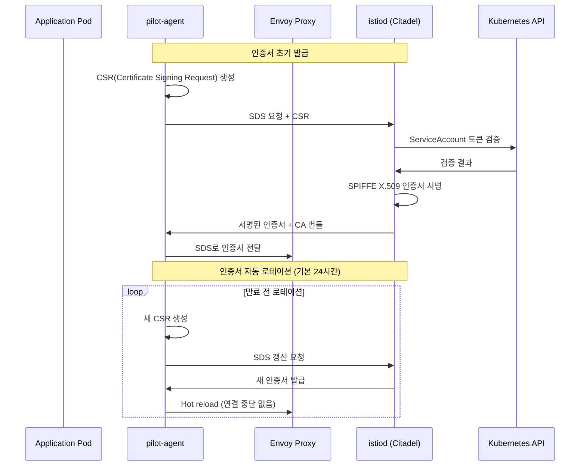

핵심 포인트:
- 인증서 기본 수명: 24시간 (환경 변수로 조정 가능)
- 로테이션은 만료 전에 자동 수행되므로 서비스 중단이 없다
- SDS를 통해 인증서를 메모리에서 직접 전달하므로, 디스크에 인증서를 저장하지 않는다 (보안 강화)

#### 6.3.3 mTLS Handshake 과정

> **원문 ([Security - Mutual TLS](https://istio.io/latest/docs/concepts/security/)):**
> "Istio tunnels service-to-service communication through the client- and server-side PEPs, which are implemented as Envoy proxies."
> "secure naming check to verify that the service account presented in the server certificate is authorized to run the target service."
> "Istio configures TLSv1_2 as the minimum TLS version."
> "Istio mutual TLS has a permissive mode, which allows a service to accept both plaintext traffic and mutual TLS traffic at the same time."

**번역:** Istio는 Envoy 프록시로 구현된 클라이언트 및 서버 측 PEP를 통해 서비스 간 통신을 터널링한다. 보안 명명 검사를 통해 서버 인증서에 제시된 서비스 어카운트가 대상 서비스를 실행할 권한이 있는지 검증한다. Istio는 TLSv1_2를 최소 TLS 버전으로 설정한다. Istio mTLS에는 permissive 모드가 있어 서비스가 평문 트래픽과 mTLS 트래픽을 동시에 수신할 수 있다.

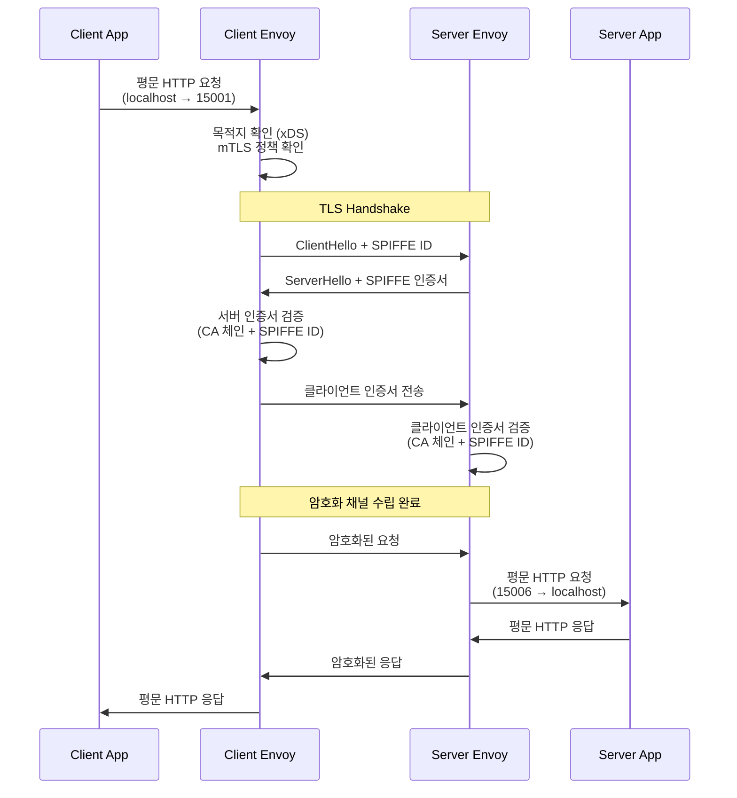

---

## 7. Observability (공식문서 상세)

> **원문 ([Observability](https://istio.io/latest/docs/concepts/observability/)):**
> "Istio generates detailed telemetry for all communications within a service mesh. This telemetry provides observability of service mesh behavior, empowering operators to troubleshoot, maintain, and optimize their applications."

**번역:** Istio는 Service Mesh 내 모든 통신에 대한 상세한 텔레메트리를 생성한다. 이 텔레메트리는 Service Mesh 동작에 대한 관측성을 제공하여, 운영자가 애플리케이션을 트러블슈팅하고 유지 관리하고 최적화할 수 있게 한다.

Istio의 관측성은 코드 변경 없이 프록시 레벨에서 자동으로 수집된다. 이것이 Service Mesh의 가장 큰 장점 중 하나이다.

### 7.1 Metrics

> **원문 ([Observability - Metrics](https://istio.io/latest/docs/concepts/observability/)):**
> "Metrics provide a way of monitoring and understanding behavior in aggregate."

**번역:** 메트릭은 동작을 집계 수준에서 모니터링하고 이해하는 방법을 제공한다.

> **원문 ([Istio Standard Metrics](https://istio.io/latest/docs/reference/config/metrics/)):**
> "Istio generates metrics based on the four 'golden signals' of monitoring -- latency, traffic, errors, and saturation."

**번역:** Istio는 모니터링의 4가지 "골든 시그널" -- 지연 시간, 트래픽, 에러, 포화도 -- 에 기반한 메트릭을 생성한다.

#### 7.1.1 Proxy-level Metrics (Envoy Stats)

Envoy는 자체적으로 수백 개의 메트릭을 노출한다. 주요 메트릭은 다음과 같다.

| 메트릭 | 설명 |
|--------|------|
| `envoy_cluster_upstream_cx_active` | 활성 업스트림 연결 수 |
| `envoy_cluster_upstream_cx_total` | 총 업스트림 연결 수 |
| `envoy_cluster_upstream_rq_total` | 총 업스트림 요청 수 |
| `envoy_cluster_upstream_rq_timeout` | 타임아웃 요청 수 |
| `envoy_cluster_upstream_rq_retry` | 재시도 횟수 |
| `envoy_server_memory_allocated` | Envoy 메모리 사용량 |

#### 7.1.2 Service-level Metrics (Istio 표준)

Istio가 생성하는 표준 메트릭은 모든 서비스 통신에 대해 자동으로 수집된다.

| 메트릭 | 설명 | 라벨 |
|--------|------|------|
| `istio_requests_total` | 총 요청 수 | source, destination, response_code |
| `istio_request_duration_milliseconds` | 요청 지연 시간 | source, destination (histogram) |
| `istio_request_bytes` | 요청 바이트 수 | source, destination (histogram) |
| `istio_response_bytes` | 응답 바이트 수 | source, destination (histogram) |
| `istio_tcp_connections_opened_total` | TCP 연결 수립 | source, destination |
| `istio_tcp_connections_closed_total` | TCP 연결 종료 | source, destination |

```yaml
# Istio Telemetry API로 메트릭 커스터마이징
apiVersion: telemetry.istio.io/v1
kind: Telemetry
metadata:
  name: custom-metrics
  namespace: bookinfo
spec:
  metrics:
    - providers:
        - name: prometheus
      overrides:
        - match:
            metric: REQUEST_COUNT
            mode: CLIENT_AND_SERVER
          tagOverrides:
            request_host:
              operation: UPSERT
              value: "request.host"
```

#### 7.1.3 Control Plane Metrics

istiod 자체도 다음 메트릭을 노출한다.

| 메트릭 | 설명 |
|--------|------|
| `pilot_xds_pushes` | xDS push 횟수 (type별) |
| `pilot_proxy_convergence_time` | 프록시 설정 수렴 시간 |
| `pilot_conflict_inbound_listener` | 인바운드 리스너 충돌 |
| `pilot_conflict_outbound_listener_tcp_over_current_tcp` | 아웃바운드 리스너 충돌 |
| `citadel_server_csr_count` | CSR 처리 횟수 |
| `galley_validation_failed` | 설정 검증 실패 |

### 7.2 Distributed Tracing

> **원문 ([Observability - Distributed Tracing](https://istio.io/latest/docs/concepts/observability/)):**
> "Distributed tracing provides a way to monitor and understand behavior by monitoring individual requests as they flow through a mesh."

**번역:** 분산 추적은 개별 요청이 메시를 통과할 때 이를 모니터링하여 동작을 모니터링하고 이해하는 방법을 제공한다.

> **원문 ([Distributed Tracing](https://istio.io/latest/docs/concepts/observability/#distributed-traces)):**
> "Distributed tracing enables users to track a request through mesh that is distributed across multiple services."

**번역:** 분산 추적은 사용자가 여러 서비스에 분산된 메시를 통과하는 요청을 추적할 수 있게 한다.

Istio는 Envoy 프록시에서 자동으로 스팬(span)을 생성한다. 그러나 분산 추적이 정상적으로 동작하려면 **애플리케이션이 트레이스 컨텍스트 헤더를 전파(propagation)해야 한다**. 이는 Istio가 해결할 수 없는 애플리케이션 책임이다.

#### 7.2.1 전파해야 하는 헤더

| 헤더 | 설명 | 형식 |
|------|------|------|
| `x-request-id` | Envoy 생성 요청 ID | UUID |
| `x-b3-traceid` | Zipkin B3 트레이스 ID | 64/128-bit hex |
| `x-b3-spanid` | Zipkin B3 스팬 ID | 64-bit hex |
| `x-b3-parentspanid` | 부모 스팬 ID | 64-bit hex |
| `x-b3-sampled` | 샘플링 여부 | 0 or 1 |
| `x-b3-flags` | 디버그 플래그 | 0 or 1 |
| `b3` | B3 단일 헤더 형식 | `{traceid}-{spanid}-{sampled}-{parentspanid}` |
| `traceparent` | W3C Trace Context | `{version}-{trace-id}-{parent-id}-{trace-flags}` |
| `tracestate` | W3C Trace State | 벤더별 추가 정보 |

```python
# Python Flask 예시: 트레이스 헤더 전파
from flask import Flask, request
import requests

app = Flask(__name__)

# 전파해야 하는 헤더 목록
TRACE_HEADERS = [
    'x-request-id',
    'x-b3-traceid',
    'x-b3-spanid',
    'x-b3-parentspanid',
    'x-b3-sampled',
    'x-b3-flags',
    'b3',
    'traceparent',
    'tracestate',
]

@app.route('/api/v1/products')
def get_products():
    # 인바운드 요청에서 트레이스 헤더 추출
    headers = {}
    for header in TRACE_HEADERS:
        value = request.headers.get(header)
        if value:
            headers[header] = value

    # 다운스트림 서비스 호출 시 헤더 전파
    reviews = requests.get(
        'http://reviews:9080/api/v1/reviews',
        headers=headers  # 트레이스 헤더 포함
    )
    return reviews.json()
```

#### 7.2.2 트레이싱 설정

```yaml
# Telemetry API로 트레이싱 설정
apiVersion: telemetry.istio.io/v1
kind: Telemetry
metadata:
  name: tracing-config
  namespace: istio-system
spec:
  tracing:
    - providers:
        - name: zipkin              # 또는 jaeger, opentelemetry
      randomSamplingPercentage: 1.0 # 1% 샘플링 (프로덕션 권장)
      customTags:
        environment:
          literal:
            value: "production"
```

### 7.3 Access Logs

> **원문 ([Observability - Access Logs](https://istio.io/latest/docs/concepts/observability/)):**
> "Access logs provide a way to monitor and understand behavior from the perspective of an individual workload instance."

**번역:** 액세스 로그는 개별 워크로드 인스턴스의 관점에서 동작을 모니터링하고 이해하는 방법을 제공한다.

Envoy 액세스 로그는 모든 요청/응답의 상세 정보를 기록한다.

> **원문 ([Envoy Access Logging](https://istio.io/latest/docs/tasks/observability/logs/access-log/)):**
> "Envoy proxies can be configured to provide access logs containing information about requests."

**번역:** Envoy 프록시는 요청 정보를 포함하는 액세스 로그를 제공하도록 설정할 수 있다.

```yaml
# Telemetry API로 액세스 로그 설정
apiVersion: telemetry.istio.io/v1
kind: Telemetry
metadata:
  name: access-log
  namespace: istio-system
spec:
  accessLogging:
    - providers:
        - name: envoy
      filter:
        expression: "response.code >= 400"  # 4xx, 5xx만 로깅
```

```yaml
# MeshConfig로 글로벌 액세스 로그 설정 (IstioOperator)
apiVersion: install.istio.io/v1alpha1
kind: IstioOperator
spec:
  meshConfig:
    accessLogFile: /dev/stdout
    accessLogEncoding: JSON
    accessLogFormat: |
      {
        "protocol": "%PROTOCOL%",
        "upstream_service_time": "%REQ(x-envoy-upstream-service-time)%",
        "upstream_cluster": "%UPSTREAM_CLUSTER%",
        "downstream_remote_address": "%DOWNSTREAM_REMOTE_ADDRESS%",
        "requested_server_name": "%REQUESTED_SERVER_NAME%",
        "route_name": "%ROUTE_NAME%",
        "response_code": "%RESPONSE_CODE%",
        "response_flags": "%RESPONSE_FLAGS%",
        "bytes_sent": "%BYTES_SENT%",
        "duration": "%DURATION%",
        "authority": "%REQ(:AUTHORITY)%",
        "path": "%REQ(X-ENVOY-ORIGINAL-PATH?:PATH)%",
        "method": "%REQ(:METHOD)%",
        "user_agent": "%REQ(USER-AGENT)%"
      }
```

주요 `RESPONSE_FLAGS` 값:

| Flag | 설명 |
|------|------|
| `UH` | Upstream Healthy 없음 (no healthy upstream) |
| `UF` | Upstream 연결 실패 |
| `UO` | Upstream Overflow (서킷 브레이커) |
| `NR` | No Route (라우팅 규칙 없음) |
| `URX` | Upstream 재시도 한도 초과 |
| `DC` | Downstream 연결 종료 |
| `LH` | Local Health Check 실패 |
| `UT` | Upstream 타임아웃 |
| `RL` | Rate Limited |
| `UAEX` | Unauthorized External (인가 실패) |

### 7.4 Observability 스택 통합 아키텍처

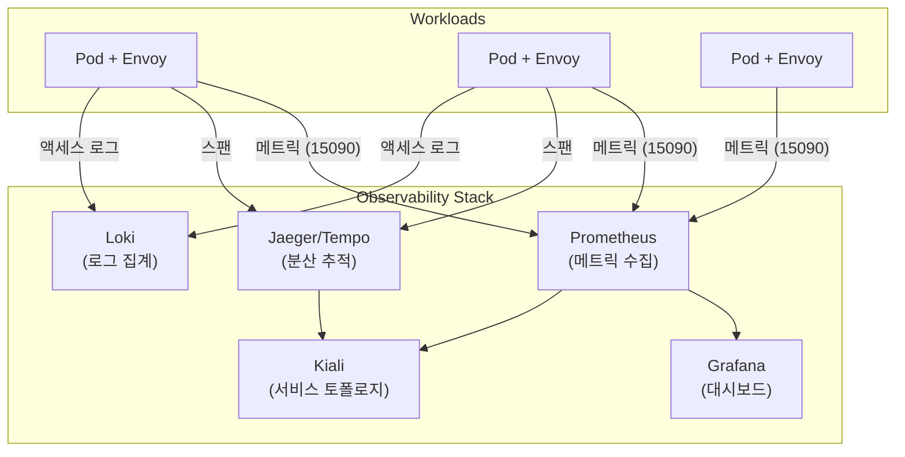

---

## 8. 왜 사용하는가

Istio Sidecar 모드를 도입하는 핵심 이유를 정리한다.

**1) 애플리케이션 코드 수정 없이 트래픽/보안 정책 중앙 관리**

각 서비스가 재시도, 타임아웃, 서킷 브레이커, TLS 등을 개별 구현하면 코드 중복과 불일치가 발생한다. Istio는 이를 인프라 레벨로 추출하여 CRD 기반으로 선언적 관리가 가능하게 한다.

**2) 카나리/블루그린/트래픽 분할 배포 전략**

VirtualService의 weight 기반 라우팅으로 코드 변경 없이 카나리 배포를 구현할 수 있다. 배포 파이프라인에서 weight 값만 조정하면 된다.

**3) 서비스 간 통신 가시성과 제어력 확보**

마이크로서비스 아키텍처에서 서비스 간 호출 관계는 빠르게 복잡해진다. Istio는 모든 트래픽을 프록시가 중재하므로, 코드 계측(instrumentation) 없이도 트래픽 흐름, 지연 시간, 에러율을 자동으로 수집한다.

**4) Zero-trust security 구현**

기존의 경계 기반 보안(perimeter security)은 내부 네트워크를 신뢰하는 모델이다. Istio의 mTLS와 AuthorizationPolicy를 사용하면, 서비스 간 통신도 인증/인가/암호화가 적용되는 제로 트러스트 모델을 구현할 수 있다.

**5) Observability 표준화**

서비스별로 다른 모니터링 라이브러리와 설정을 사용하는 대신, Envoy 프록시가 일관된 형식의 메트릭, 로그, 트레이스를 자동 생성한다.

---

## 9. 사용하지 않으면 어떻게 되는가

Service Mesh 없이 마이크로서비스를 운영하면 다음과 같은 문제가 발생한다.

**1) 각 서비스가 재시도/타임아웃/회로차단/암호화를 중복 구현**

서비스 A는 Go의 `go-retryablehttp`, 서비스 B는 Java의 Resilience4j, 서비스 C는 Python의 `tenacity`를 사용하는 식이다. 동일한 정책이 언어별로 다르게 구현되고, 설정 변경 시 모든 서비스를 개별 배포해야 한다.

**2) 보안/접근 정책이 팀별 파편화, 거버넌스 난이도 상승**

팀 A는 mTLS를 적용했지만, 팀 B는 평문 통신이고, 팀 C는 자체 인증 방식을 사용한다. 조직 전체에 일관된 보안 정책을 적용하기 어렵고, 감사(audit)도 서비스별로 별도 수행해야 한다.

**3) 장애 분석 시 서비스 간 트래픽 흐름 추적 어려움**

서비스 A → B → C → D 체인에서 장애가 발생하면, 각 서비스의 로그를 수동으로 상관관계(correlation)시켜야 한다. 분산 추적이 없으면 근본 원인(root cause) 분석에 시간이 기하급수적으로 증가한다.

**4) mTLS 개별 구현 부담**

인증서 발급, 갱신, 배포, 서비스 간 인증서 검증을 서비스별로 구현하면 운영 복잡도가 크게 증가한다. 인증서 만료로 인한 장애도 빈번해진다.

---

## 10. 대체 기술 비교

| 항목 | Istio Sidecar | Linkerd | Consul Connect | Kuma |
|------|-------------|---------|----------------|------|
| **프록시** | Envoy (C++) | linkerd2-proxy (Rust) | Envoy / built-in | Envoy |
| **기능 폭** | 매우 넓음 | 핵심 기능 중심 | 멀티런타임 (K8s + VM) | 중간 |
| **운영 복잡도** | 중~상 | 낮음 | 중 | 중 |
| **트래픽 정책** | 매우 풍부 (VirtualService, DestinationRule, Gateway) | 핵심 (TrafficSplit, HTTPRoute) | 풍부 (Intentions, Service Router) | 중간 |
| **보안** | mTLS + AuthorizationPolicy + JWT | mTLS + Server Authorization | mTLS + Intentions | mTLS + TrafficPermission |
| **학습 곡선** | 가파름 | 완만 | 중간 | 중간 |
| **리소스 오버헤드** | 높음 (~50-100m CPU, ~100-200Mi memory per sidecar) | 낮음 (~10m CPU, ~20Mi memory) | 중간 | 중간 |
| **CNCF** | Graduated | Graduated | - (HashiCorp) | Sandbox (→ Graduated 준비 중) |
| **멀티클러스터** | 지원 (Federation, Multi-primary) | 지원 (Multi-cluster) | 지원 (WAN Federation) | 지원 (Multi-zone) |
| **VM 지원** | 지원 (WorkloadEntry) | 미지원 | 지원 (네이티브) | 지원 (Universal mode) |

**선택 기준 요약:**
- **Istio**: 기능이 가장 풍부하고 세밀한 제어가 필요한 대규모 프로덕션. 학습 비용을 감수할 수 있는 팀
- **Linkerd**: 빠른 도입, 낮은 리소스 오버헤드, 핵심 기능만 필요한 경우. CNCF Graduated로 커뮤니티 안정적
- **Consul Connect**: Kubernetes + VM 하이브리드 환경. HashiCorp 에코시스템(Vault, Nomad) 사용 시
- **Kuma**: Envoy 기반이지만 Istio보다 간단한 설정을 원하는 경우. 멀티존 아키텍처

---

## 11. 활용 시 주의점

### 11.1 사이드카 리소스 오버헤드

모든 Pod에 Envoy 프록시가 추가되므로 클러스터 전체의 리소스 사용량이 증가한다.

| 항목 | 기본값 | 프로덕션 권장 |
|------|-------|------------|
| CPU Request | 100m | 서비스 트래픽에 따라 조정 |
| CPU Limit | 2000m | 500m ~ 1000m |
| Memory Request | 128Mi | 서비스 엔드포인트 수에 따라 조정 |
| Memory Limit | 1Gi | 256Mi ~ 512Mi |

```yaml
# 사이드카 리소스 제한 (annotation)
apiVersion: v1
kind: Pod
metadata:
  annotations:
    sidecar.istio.io/proxyCPU: "100m"
    sidecar.istio.io/proxyCPULimit: "500m"
    sidecar.istio.io/proxyMemory: "128Mi"
    sidecar.istio.io/proxyMemoryLimit: "256Mi"
spec:
  containers:
    - name: app
      image: app:v1
```

### 11.2 정책 기본값 설계

프로덕션 환경에서는 "기본 거부(deny by default)" 원칙을 적용한다.

```yaml
# Step 1: Mesh-wide STRICT mTLS
apiVersion: security.istio.io/v1
kind: PeerAuthentication
metadata:
  name: default
  namespace: istio-system
spec:
  mtls:
    mode: STRICT
---
# Step 2: Namespace deny-all
apiVersion: security.istio.io/v1
kind: AuthorizationPolicy
metadata:
  name: deny-all
  namespace: production
spec:
  {}
---
# Step 3: 필요한 통신만 ALLOW
apiVersion: security.istio.io/v1
kind: AuthorizationPolicy
metadata:
  name: allow-frontend-to-backend
  namespace: production
spec:
  selector:
    matchLabels:
      app: backend
  action: ALLOW
  rules:
    - from:
        - source:
            principals: ["cluster.local/ns/production/sa/frontend"]
      to:
        - operation:
            methods: ["GET", "POST"]
            paths: ["/api/*"]
```

### 11.3 앱 장애 vs 메시 장애 분리 관찰

트래픽이 프록시를 경유하므로, 장애 발생 시 원인이 애플리케이션인지 Envoy/istiod인지 구분이 필요하다.

```bash
# 1) 프록시 상태 확인
istioctl proxy-status

# 2) 특정 Pod의 Envoy 설정 동기화 상태
istioctl analyze -n <namespace>

# 3) Envoy 내부 통계 직접 확인
kubectl exec <pod> -c istio-proxy -- pilot-agent request GET /stats

# 4) istiod 로그 확인 (push 실패 등)
kubectl logs -n istio-system -l app=istiod --tail=100

# 5) 프록시 로그 레벨 변경 (디버깅)
istioctl proxy-config log <pod> --level debug
```

### 11.4 Envoy 버전 호환성 확인

Istio 버전과 Envoy 버전의 호환성을 반드시 확인해야 한다. Istio는 특정 Envoy 버전과 함께 빌드/테스트되므로, 임의로 Envoy 버전을 변경하면 예기치 않은 동작이 발생할 수 있다.

```bash
# 현재 사용 중인 Envoy 버전 확인
istioctl version

# Pod별 Envoy 버전 확인
kubectl exec <pod> -c istio-proxy -- envoy --version
```

### 11.5 Large-scale 환경에서 xDS Push 최적화

서비스 수가 많은 클러스터에서는 Sidecar 리소스로 각 프록시의 xDS 범위를 제한해야 한다.

```yaml
# 네임스페이스 기본 Sidecar (모든 Pod에 적용)
apiVersion: networking.istio.io/v1
kind: Sidecar
metadata:
  name: default
  namespace: bookinfo
spec:
  egress:
    - hosts:
        - "./*"                     # 같은 네임스페이스
        - "istio-system/*"          # istio-system
        - "monitoring/*"            # 모니터링
      # 전체 메시 대신 필요한 네임스페이스만 포함
```

xDS push 최적화 효과:
- **메모리**: 전체 메시 설정 대신 관련 서비스 설정만 보유 (수십 배 절감 가능)
- **CPU**: 설정 변경 시 영향받는 프록시만 push
- **네트워크**: xDS 트래픽 감소

### 11.6 업그레이드 전략 (Canary Revision)

Istio 업그레이드는 canary revision을 사용하여 점진적으로 수행한다.

```bash
# 1) 새 revision 설치
istioctl install --set revision=1-22-0

# 2) 네임스페이스에 새 revision label 적용
kubectl label namespace bookinfo istio.io/rev=1-22-0 --overwrite
# 기존 istio-injection=enabled label 제거
kubectl label namespace bookinfo istio-injection-

# 3) 워크로드 재시작 (새 사이드카 주입)
kubectl rollout restart deployment -n bookinfo

# 4) 검증 후 이전 revision 제거
istioctl uninstall --revision 1-21-0
```

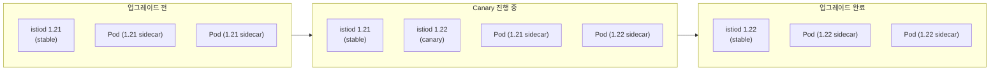

---

## 12. 부수 개념

### 12.1 xDS (x Discovery Service)

> **원문 ([Envoy - xDS Protocol](https://www.envoyproxy.io/docs/envoy/latest/api-docs/xds_protocol)):**
> "The xDS API provides a way for Envoy to dynamically discover configuration."

**번역:** xDS API는 Envoy가 설정을 동적으로 발견하는 방법을 제공한다.

xDS는 Envoy의 동적 설정 프로토콜의 총칭이다. 'x'는 L(Listener), R(Route), C(Cluster), E(Endpoint), S(Secret) 등 다양한 디스커버리 서비스를 의미한다. gRPC 양방향 스트림 기반으로 동작하며, Envoy와 컨트롤 플레인 간 실시간 설정 동기화를 담당한다.

### 12.2 SPIFFE / SPIRE

> **원문 ([SPIFFE Concepts](https://spiffe.io/docs/latest/spiffe-about/spiffe-concepts/)):**
> "SPIFFE provides a secure identity, in the form of a specially crafted X.509 certificate, to every workload in a modern, dynamic infrastructure."

**번역:** SPIFFE는 현대적이고 동적인 인프라의 모든 워크로드에 특별히 제작된 X.509 인증서 형태의 보안 ID를 제공한다.

- **SPIFFE**: ID 표준 (spiffe://trust-domain/path 형식)
- **SPIRE**: SPIFFE 구현체 (identity attestation, certificate issuance)
- Istio는 자체 Citadel에서 SPIFFE 호환 인증서를 발급하며, SPIRE와도 통합 가능하다

### 12.3 Envoy Filter

EnvoyFilter는 istiod가 생성하는 Envoy 설정을 직접 패치하는 고급 CRD이다. VirtualService나 DestinationRule로 표현할 수 없는 Envoy 네이티브 설정을 적용할 때 사용한다.

```yaml
apiVersion: networking.istio.io/v1alpha3
kind: EnvoyFilter
metadata:
  name: custom-lua-filter
  namespace: bookinfo
spec:
  workloadSelector:
    labels:
      app: productpage
  configPatches:
    - applyTo: HTTP_FILTER
      match:
        context: SIDECAR_INBOUND
        listener:
          filterChain:
            filter:
              name: "envoy.filters.network.http_connection_manager"
              subFilter:
                name: "envoy.filters.http.router"
      patch:
        operation: INSERT_BEFORE
        value:
          name: envoy.lua
          typed_config:
            "@type": "type.googleapis.com/envoy.extensions.filters.http.lua.v3.Lua"
            inlineCode: |
              function envoy_on_request(handle)
                handle:headers():add("x-custom-header", "added-by-envoy")
              end
```

주의: EnvoyFilter는 Istio 버전 업그레이드 시 호환성이 깨질 수 있으므로, 가능하면 VirtualService/DestinationRule 등 상위 API를 우선 사용해야 한다.

### 12.4 WebAssembly Plugin

> **원문 ([Wasm Plugin](https://istio.io/latest/docs/reference/config/proxy_extensions/wasm-plugin/)):**
> "WasmPlugins provides a mechanism to extend the functionality provided by the Istio proxy through WebAssembly filters."

**번역:** WasmPlugin은 WebAssembly 필터를 통해 Istio 프록시의 기능을 확장하는 메커니즘을 제공한다.

```yaml
apiVersion: extensions.istio.io/v1alpha1
kind: WasmPlugin
metadata:
  name: custom-auth
  namespace: bookinfo
spec:
  selector:
    matchLabels:
      app: productpage
  url: oci://ghcr.io/my-org/custom-auth-wasm:v1.0
  phase: AUTHN                      # 인증 단계에서 실행
  pluginConfig:
    api_key_header: "x-api-key"
```

WebAssembly 플러그인의 장점:
- EnvoyFilter보다 안전한 확장 방식 (샌드박스 실행)
- 다양한 언어로 작성 가능 (Rust, Go, C++ 등 → Wasm 컴파일)
- OCI 레지스트리에서 배포 가능
- Hot reload 지원

### 12.5 Istio CNI

> **원문 ([Install Istio with the Istio CNI plugin](https://istio.io/latest/docs/setup/additional-setup/cni/)):**
> "The Istio CNI plugin removes the requirement for the istio-init containers."

**번역:** Istio CNI 플러그인은 istio-init 컨테이너의 필요성을 제거한다.

istio-init container는 iptables 규칙을 설정하기 위해 `NET_ADMIN`과 `NET_RAW` capability가 필요하다. 보안 정책이 엄격한 환경(PodSecurityPolicy, PSA restricted)에서는 이것이 문제가 된다. Istio CNI 플러그인은 노드 레벨에서 네트워크 규칙을 설정하므로 init container가 불필요해진다.

### 12.6 Multi-cluster Mesh

> **원문 ([Multicluster Installation](https://istio.io/latest/docs/setup/install/multicluster/)):**
> "Istio can be configured to span multiple clusters."

**번역:** Istio는 여러 클러스터에 걸쳐 설정할 수 있다.

| 모델 | 설명 | 적합한 상황 |
|------|------|-----------|
| **Multi-primary** | 각 클러스터에 istiod, 상호 설정 공유 | HA, 지역 분산 |
| **Primary-remote** | 한 클러스터에만 istiod, 나머지는 remote | 중앙 관리, 허브-스포크 |
| **External Control Plane** | 외부에 istiod, 모든 클러스터가 remote | 관리형 서비스, SaaS |

---

## 13. 실무 체크리스트

Istio Sidecar 모드를 프로덕션에 도입할 때 점검해야 할 항목을 정리한다.

### 설치 및 초기 설정

- [ ] Istio 프로파일 선택 (demo, default, minimal, ambient)
- [ ] istiod 리소스 설정 (CPU/Memory request/limit)
- [ ] Ingress Gateway 배포 및 LoadBalancer/NodePort 설정
- [ ] Istio CNI 사용 여부 결정 (보안 요구사항에 따라)
- [ ] 네임스페이스 라벨링 전략 수립 (`istio-injection=enabled` 또는 revision label)

### 트래픽 관리

- [ ] VirtualService/DestinationRule 기본 템플릿 작성
- [ ] 타임아웃 기본값 설정 (서비스별 SLA 기반)
- [ ] 재시도 정책 설정 (idempotent 요청만 재시도)
- [ ] 서킷 브레이커 임계값 설정 (connectionPool, outlierDetection)
- [ ] Sidecar 리소스로 xDS scope 제한 (서비스 50개 이상일 때)
- [ ] ServiceEntry로 외부 서비스 명시적 등록

### 보안

- [ ] PeerAuthentication mesh-wide STRICT 적용
- [ ] AuthorizationPolicy deny-all 기본 정책 적용
- [ ] 필요한 통신 경로만 ALLOW 정책 추가
- [ ] RequestAuthentication 설정 (외부 API 엔드포인트)
- [ ] 인증서 로테이션 주기 확인 (기본 24시간)

### Observability

- [ ] Prometheus 메트릭 수집 설정
- [ ] Grafana Istio 대시보드 배포
- [ ] 분산 추적 백엔드 설정 (Jaeger, Tempo, Zipkin)
- [ ] 애플리케이션 트레이스 헤더 전파 구현
- [ ] 액세스 로그 설정 (에러만 로깅 또는 전체)
- [ ] Kiali 서비스 토폴로지 대시보드 배포

### 리소스 및 성능

- [ ] 사이드카 리소스 제한 설정 (annotation 또는 global)
- [ ] 사이드카 제외 대상 설정 (DaemonSet, batch Job 등)
- [ ] HPA 설정 시 사이드카 리소스 고려
- [ ] 프록시 동시성(concurrency) 설정 (기본 2 worker threads)

### 운영

- [ ] Canary revision 기반 업그레이드 절차 수립
- [ ] istioctl analyze 기반 설정 검증 자동화
- [ ] istioctl proxy-status 모니터링 (SYNCED 상태 확인)
- [ ] istiod HA 구성 (replicas >= 2)
- [ ] Envoy 드레인 타임아웃 설정 (graceful shutdown)
- [ ] 장애 시 사이드카 바이패스 절차 문서화

---

## 참고 문서

- [Istio Documentation](https://istio.io/latest/docs/)
- [Istio Architecture](https://istio.io/latest/docs/ops/deployment/architecture/)
- [Traffic Management](https://istio.io/latest/docs/concepts/traffic-management/)
- [Security](https://istio.io/latest/docs/concepts/security/)
- [Observability](https://istio.io/latest/docs/concepts/observability/)
- [Envoy Proxy Documentation](https://www.envoyproxy.io/docs/envoy/latest/)
- [SPIFFE - Secure Production Identity Framework](https://spiffe.io/)
- [Istio - Sidecar Injection](https://istio.io/latest/docs/setup/additional-setup/sidecar-injection/)
- [Istio - Wasm Plugin](https://istio.io/latest/docs/reference/config/proxy_extensions/wasm-plugin/)
- [Istio - Multicluster Installation](https://istio.io/latest/docs/setup/install/multicluster/)
