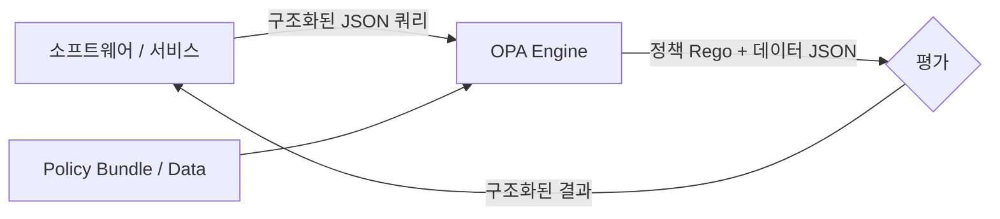
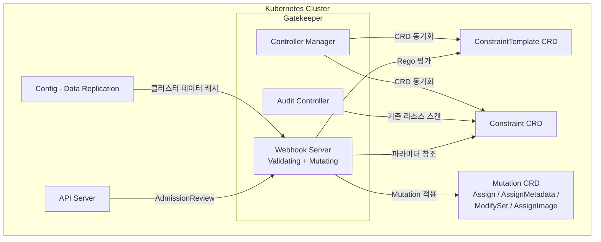
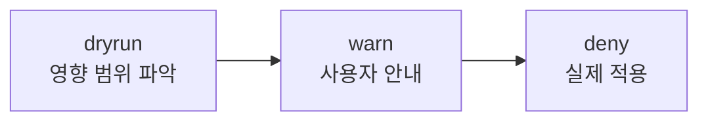
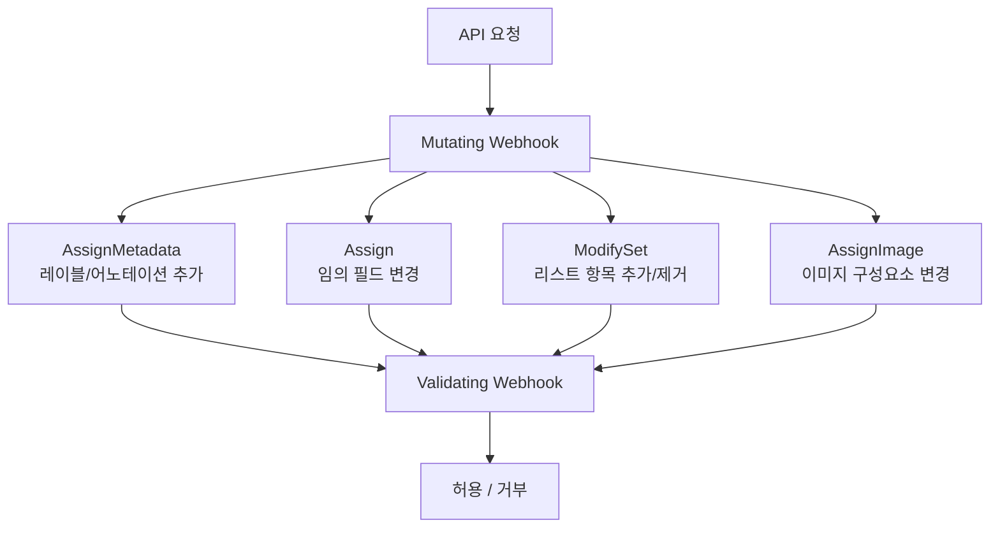
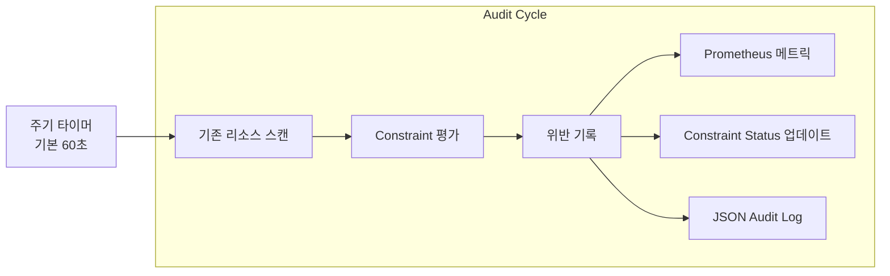
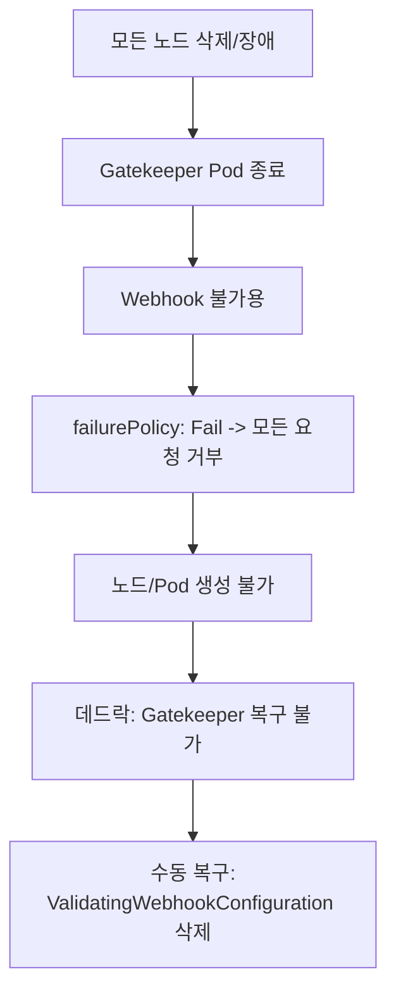
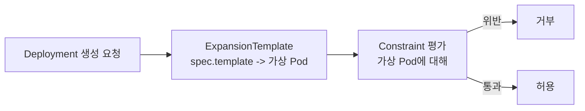
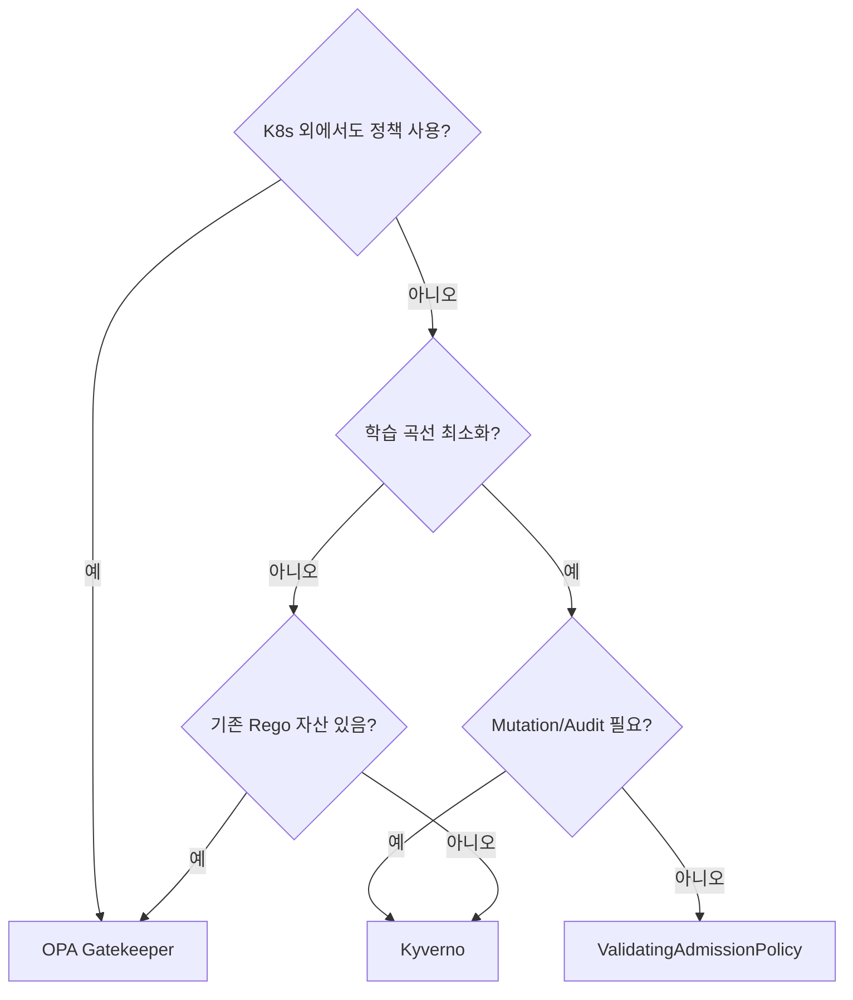

> **원문 ([Gatekeeper Introduction](https://open-policy-agent.github.io/gatekeeper/website/docs/)):**
> "Every organization has policies. Some are essential to meet governance and legal requirements. Others help ensure adherence to best practices and institutional conventions."

**번역:** 모든 조직에는 정책이 있다. 일부는 거버넌스와 법적 요구사항을 충족하기 위해 필수적이고, 일부는 모범 사례와 조직 관례 준수를 보장하기 위한 것이다.

OPA Gatekeeper는 Kubernetes 클러스터에 정책을 코드로 적용하는 사실상의 표준이다. 이 글은 OPA 공식문서와 Gatekeeper 공식문서를 기반으로 Rego 언어부터 ConstraintTemplate, Mutation, Audit, External Data, Expansion까지 전체 기능을 빠짐없이 다룬다. 각 섹션마다 공식문서 원문 인용과 번역, 동작 원리(why) 중심 해설, 실무 YAML/Rego 예시를 함께 제공한다.

---

## 1. OPA(Open Policy Agent) 소개

### 1.1 OPA란 무엇인가

> **원문 ([OPA Introduction](https://www.openpolicyagent.org/docs/latest/)):**
> "The Open Policy Agent (OPA, pronounced 'oh-pa') is an open source, general-purpose policy engine that unifies policy enforcement across the stack."

**번역:** OPA(오-파)는 오픈소스 범용 정책 엔진으로, 스택 전반에 걸쳐 정책 적용을 통합한다.

> **원문 ([OPA Introduction](https://www.openpolicyagent.org/docs/latest/)):**
> "OPA provides a high-level declarative language that lets you specify policy as code and simple APIs to offload policy decision-making from your software."

**번역:** OPA는 정책을 코드로 명세할 수 있는 고수준 선언형 언어와, 소프트웨어에서 정책 결정을 분리할 수 있는 간단한 API를 제공한다.

OPA는 CNCF Graduated 프로젝트다. Kubernetes뿐 아니라 Terraform, Envoy, CI/CD 파이프라인, 마이크로서비스 인가 등 다양한 계층에서 동일한 정책 엔진을 사용할 수 있다는 점이 핵심 가치다.

### 1.2 OPA 동작 구조

OPA의 평가 흐름은 다음과 같다.



참고: 아래 내용은 공식문서의 개념을 기반으로 정리한 것이다.

핵심 포인트는 OPA의 출력이 단순 allow/deny가 아니라 **임의의 구조화된 데이터**라는 것이다. 예를 들어 "이 사용자가 접근할 수 있는 리소스 목록", "적용해야 할 네트워크 규칙 집합" 등 복잡한 결과를 반환할 수 있다.

### 1.3 OPA CLI 도구

> **원문 ([OPA Introduction](https://www.openpolicyagent.org/docs/latest/)):**
> "opa eval" is the "swiss-army knife" for Rego evaluation. "opa run" provides interactive/server mode.

**번역:** `opa eval`은 Rego 평가를 위한 "만능 도구"이다. `opa run`은 대화형/서버 모드를 제공한다.

`opa eval`은 파일이나 stdin에서 Rego 정책을 직접 평가할 수 있어 개발/디버깅 시 가장 많이 사용하는 명령이다. `opa run`은 OPA를 REST API 서버로 구동하거나, REPL 모드로 대화형 실습을 할 때 사용한다.

---

## 2. Rego 정책 언어 상세

### 2.1 Rego 개요

> **원문 ([Rego Policy Language](https://www.openpolicyagent.org/docs/latest/policy-language/)):**
> "OPA is purpose built for policy evaluation and uses its declarative language Rego."

**번역:** OPA는 정책 평가를 위해 목적 설계되었으며, 선언형 언어 Rego를 사용한다.

> **원문 ([Rego Policy Language](https://www.openpolicyagent.org/docs/latest/policy-language/)):**
> Rego specifies "what queries should return rather than how queries should be executed."

**번역:** Rego는 "쿼리가 어떻게 실행되어야 하는지"가 아니라 "쿼리가 무엇을 반환해야 하는지"를 명세한다.

Rego는 범용 프로그래밍 언어가 아니다. 구조화된 데이터를 순회하고, 조건을 검증하고, 결과를 조합하는 데 최적화되어 있다. 명령형이 아닌 **선언형**이므로 "무엇을 허용/거부할지"를 기술하고, "어떻게 평가할지"는 OPA 엔진이 결정한다.

> **원문 ([Rego Policy Language](https://www.openpolicyagent.org/docs/latest/policy-language/)):**
> Rego is "inspired by Datalog, extended for JSON-like documents."

**번역:** Rego는 Datalog에서 영감을 받았으며, JSON과 유사한 문서를 처리하도록 확장되었다.

### 2.2 스칼라 값(Scalar Values)

> **원문 ([Rego Policy Language](https://www.openpolicyagent.org/docs/latest/policy-language/)):**
> Scalar values include: "Strings, numbers, booleans, null."

**번역:** 스칼라 값에는 문자열, 숫자, 불리언, null이 포함된다.

Rego가 지원하는 기본 타입은 다음과 같다.

| 타입 | 예시 | 비고 |
|------|------|------|
| String | `"hello"`, `` `raw string` `` | 백틱은 이스케이프 불필요 |
| Number | `42`, `3.14` | IEEE 754 부동소수점 |
| Boolean | `true`, `false` | |
| Null | `null` | |

### 2.3 복합 값(Composite Values)

> **원문 ([Rego Policy Language](https://www.openpolicyagent.org/docs/latest/policy-language/)):**
> Composite values include: "Arrays (ordered), Objects (key-value), Sets (unordered unique)."

**번역:** 복합 값에는 배열(순서 있음), 객체(키-값), 집합(순서 없는 고유값)이 포함된다.

```rego
# Array - 순서 있는 컬렉션
arr := [1, 2, "three", true]

# Object - key-value 쌍
obj := {"name": "gatekeeper", "version": 3}

# Set - 순서 없는 고유값 컬렉션
s := {1, 2, 3}
```

**Set**은 다른 언어에서 흔하지 않은 일급 타입이다. 정책에서 "필수 레이블 집합과 실제 레이블 집합의 차집합"을 계산하는 것처럼, 집합 연산이 정책 평가의 핵심 패턴이기 때문에 Rego에서 네이티브로 지원한다.

### 2.4 변수와 할당

> **원문 ([Rego Policy Language](https://www.openpolicyagent.org/docs/latest/policy-language/)):**
> "Variables can serve as input/output simultaneously." Operators include: `:=` (local assignment), `=` (unification), `==` (comparison).

**번역:** 변수는 입력/출력으로 동시에 작동할 수 있다. 연산자에는 `:=`(로컬 할당), `=`(통합), `==`(비교)가 있다.

Rego에서 변수는 세 가지 연산자를 사용한다.

| 연산자 | 의미 | 용도 |
|--------|------|------|
| `:=` | 불변 변수 할당 (Local Assignment) | 한 번 할당, 재할당 불가 |
| `=` | 통합 (Unification) | 할당 + 비교를 동시 수행 |
| `==` | 비교 (Comparison) | 두 값이 같은지만 검사 |

`:=`와 `=`의 차이가 Rego 입문 시 가장 혼동되는 부분이다. 간단한 규칙: **로컬 변수를 만들 때는 `:=`**, **패턴 매칭이나 규칙 정의에서는 `=`**을 사용한다.

```rego
# := 로컬 할당
x := 10

# = 통합 (x가 이미 10이면 true, 아니면 false)
x = 10

# == 순수 비교
x == 10
```

### 2.5 참조(References)

> **원문 ([Rego Policy Language](https://www.openpolicyagent.org/docs/latest/policy-language/)):**
> References support "dot notation, bracket notation for non-standard keys."

**번역:** 참조는 점 표기법과, 비표준 키를 위한 괄호 표기법을 지원한다.

구조화된 데이터를 탐색할 때 dot notation과 bracket notation을 사용한다.

```rego
# Dot notation
input.review.object.metadata.labels.app

# Bracket notation (특수 문자가 포함된 키)
input.review.object.metadata.labels["app.kubernetes.io/name"]

# 배열 인덱스
input.review.object.spec.containers[0].image
```

### 2.6 Comprehension(축약 표현)

> **원문 ([Rego Policy Language](https://www.openpolicyagent.org/docs/latest/policy-language/)):**
> Comprehensions: `[x | x := input.items[_]; x > 5]`

**번역:** 축약 표현은 컬렉션을 변환/필터링하여 새 컬렉션을 생성하는 문법이다.

```rego
# Array comprehension - 5보다 큰 항목만 필터
filtered := [x | x := input.items[_]; x > 5]

# Set comprehension - 고유한 포트 번호 추출
unique_ports := {port | port := input.containers[_].ports[_].containerPort}

# Object comprehension - 레이블을 key-value 매핑
label_map := {k: v | some k, v in input.review.object.metadata.labels}
```

`_`(와일드카드)는 "이 값에 관심 없다"를 뜻하며, 반복 변수를 명시적으로 선언하지 않고도 컬렉션을 순회할 수 있게 한다.

### 2.7 규칙 유형(Rule Types)

> **원문 ([Rego Policy Language](https://www.openpolicyagent.org/docs/latest/policy-language/)):**
> Rule types include: "Complete rules (single value), Partial rules (set/object), Functions."

**번역:** 규칙 유형에는 완전 규칙(단일 값), 부분 규칙(집합/객체), 함수가 있다.

#### Complete Rules (완전 규칙)

단일 값을 생성한다. 조건이 참이면 해당 값이 할당된다.

```rego
default allow := false

allow if {
    input.user == "admin"
}
```

#### Partial Rules (부분 규칙)

Set 또는 Object를 점진적으로 구성한다. `contains` 키워드를 사용한다.

```rego
# Partial Set - 위반 메시지를 모아서 Set으로
deny contains msg if {
    not input.review.object.metadata.labels.app
    msg := "모든 리소스에는 app 레이블이 필요하다"
}

deny contains msg if {
    not input.review.object.metadata.labels.env
    msg := "모든 리소스에는 env 레이블이 필요하다"
}
```

> **원문 ([Rego Policy Language](https://www.openpolicyagent.org/docs/latest/policy-language/)):**
> "Incremental definitions: same name multiple rules = union (OR)."

**번역:** 증분 정의: 같은 이름의 여러 규칙은 합집합(OR)으로 결합된다.

위 두 규칙은 같은 이름(`deny`)을 공유하므로 결과가 **합집합(OR)**으로 합쳐진다. `app` 레이블이 없으면 첫 번째 메시지가, `env` 레이블이 없으면 두 번째 메시지가 `deny` Set에 추가된다.

#### Functions (함수)

재사용 가능한 로직을 캡슐화한다.

```rego
is_privileged(container) if {
    container.securityContext.privileged == true
}

deny contains msg if {
    some container in input.review.object.spec.containers
    is_privileged(container)
    msg := sprintf("컨테이너 %v는 privileged 모드를 사용할 수 없다", [container.name])
}
```

#### Incremental Definitions (증분 정의)

같은 이름의 여러 규칙이 union(합집합)으로 동작한다. 위의 Partial Rules 예시가 바로 이 패턴이다.

### 2.8 제어 흐름 키워드

> **원문 ([Rego Policy Language](https://www.openpolicyagent.org/docs/latest/policy-language/)):**
> Control flow keywords: "if, contains, some, every, not, with, default, else."

**번역:** 제어 흐름 키워드: if, contains, some, every, not, with, default, else.

| 키워드 | 설명 | 예시 |
|--------|------|------|
| `if` | 조건부 규칙 본문 | `allow if { ... }` |
| `contains` | partial set/object 규칙 | `deny contains msg if { ... }` |
| `some` | 존재 양화사 (Existential Quantifier) | `some x in collection` |
| `every` | 보편 양화사 (Universal Quantifier) | `every x in collection { ... }` |
| `not` | 부정 | `not allow` |
| `with` | input/data 오버라이드 (테스트 시 유용) | `allow with input as {...}` |
| `default` | 규칙이 undefined일 때 기본값 | `default allow := false` |
| `else` | 규칙 실패 시 순차 평가 | `allow if {...} else := false` |

각 키워드의 동작 원리를 이해하는 것이 중요하다.

**`some` vs `every`의 차이:**

```rego
# some: 하나라도 조건을 만족하면 true
has_privileged if {
    some container in input.review.object.spec.containers
    container.securityContext.privileged == true
}

# every: 모든 항목이 조건을 만족해야 true
all_have_limits if {
    every container in input.review.object.spec.containers {
        container.resources.limits.memory
    }
}
```

**`not`의 동작 원리:**

참고: 아래 내용은 공식문서의 개념을 기반으로 정리한 것이다.

Rego에서 `not`은 "이 표현식이 undefined이면 true"를 뜻한다. 이것은 Closed World Assumption에 기반한다. 즉, 증명할 수 없는 것은 거짓으로 간주한다.

**`with`의 활용:**

```rego
# 테스트에서 input을 오버라이드
test_allow_admin {
    allow with input as {"user": "admin", "action": "delete"}
}
```

### 2.9 연산자

> **원문 ([Rego Policy Language](https://www.openpolicyagent.org/docs/latest/policy-language/)):**
> Operators: "in, :=, =, ==, !=, <, <=, >, >=."

**번역:** 연산자: in, :=, =, ==, !=, <, <=, >, >=.

```rego
# 멤버십 테스트
"admin" in input.roles

# 비교
input.replicas != 0
input.cpu < 1000
input.memory >= 512

# 산술
total := input.requests + input.limits
```

### 2.10 모듈과 패키지

> **원문 ([Rego Policy Language](https://www.openpolicyagent.org/docs/latest/policy-language/)):**
> "Modules: package + imports + rules."

**번역:** 모듈은 패키지, 임포트, 규칙으로 구성된다.

```rego
package kubernetes.admission

import rego.v1
```

`package`는 규칙의 네임스페이스를 정의하고, `import rego.v1`은 Rego v1 문법을 활성화한다. Gatekeeper에서는 ConstraintTemplate 내부에 패키지를 정의하며, 패키지 이름은 ConstraintTemplate 이름과 일치해야 한다.

### 2.11 메타데이터와 어노테이션

> **원문 ([Rego Policy Language](https://www.openpolicyagent.org/docs/latest/policy-language/)):**
> "Metadata annotations (YAML in comments)."

**번역:** 메타데이터 어노테이션은 주석 내에 YAML 형식으로 작성한다.

```rego
# METADATA
# title: Required Labels Policy
# description: 모든 리소스에 필수 레이블이 있는지 검증한다
# authors:
# - name: DevOps Team
# related_resources:
# - ref: https://open-policy-agent.github.io/gatekeeper/website/docs/
#   description: Gatekeeper Documentation
# custom:
#   severity: high
package k8srequiredlabels
```

메타데이터는 YAML 형식의 주석으로 정책의 목적, 작성자, 관련 리소스 등을 문서화한다. `opa inspect` 명령으로 정책 번들의 메타데이터를 일괄 조회할 수 있다.

---

## 3. Gatekeeper 소개

### 3.1 Gatekeeper란 무엇인가

> **원문 ([Gatekeeper Introduction](https://open-policy-agent.github.io/gatekeeper/website/docs/)):**
> "Gatekeeper is a validating and mutating webhook that enforces CRD-based policies executed by Open Policy Agent."

**번역:** Gatekeeper는 OPA로 실행되는 CRD 기반 정책을 적용하는 validating 및 mutating webhook이다.

Gatekeeper는 OPA를 Kubernetes에 네이티브하게 통합하는 프로젝트다. 단순히 OPA를 사이드카로 배포하는 것과 비교하면 다음과 같은 차이가 있다.

### 3.2 Gatekeeper vs OPA Sidecar

> **원문 ([Gatekeeper Introduction](https://open-policy-agent.github.io/gatekeeper/website/docs/)):**
> Improvements over OPA sidecar: "extensible parameterized policy library, Native K8s CRDs for constraints/constraint templates/mutation, Audit, External data."

**번역:** OPA 사이드카 대비 개선 사항: 확장 가능한 파라미터화 정책 라이브러리, constraint/constraint template/mutation을 위한 네이티브 K8s CRD, Audit, External Data.

| 항목 | Gatekeeper | OPA Sidecar/kube-mgmt |
|------|-----------|----------------------|
| 정책 정의 | Kubernetes CRD (ConstraintTemplate, Constraint) | ConfigMap에 Rego 파일 |
| 파라미터화 | CRD schema로 재사용 가능한 템플릿 | 정책마다 하드코딩 |
| Mutation | 4가지 CRD로 네이티브 지원 | 미지원 |
| Audit | 기존 리소스 주기적 검사 | 별도 구현 필요 |
| External Data | Provider CRD로 외부 데이터 연동 | 별도 구현 필요 |
| Expansion | Deployment -> Pod 가상 확장 검증 | 미지원 |

### 3.3 Gatekeeper 아키텍처

참고: 아래 내용은 공식문서의 개념을 기반으로 정리한 것이다.



동작 흐름을 정리하면 다음과 같다.

1. 사용자가 `kubectl apply`로 리소스를 생성/수정 요청한다
2. API Server가 AdmissionReview 요청을 Gatekeeper webhook으로 전달한다
3. Gatekeeper가 등록된 ConstraintTemplate의 Rego를 실행한다
4. Constraint에 정의된 파라미터와 match 조건을 참조한다
5. violation이 발생하면 거부(deny), 경고(warn), 또는 기록(dryrun)한다
6. Mutation CRD가 있으면 리소스를 변환하여 반환한다
7. Audit Controller가 주기적으로 기존 리소스를 검사하고 위반을 기록한다

---

## 4. Gatekeeper 사용법 (How to Use)

### 4.1 ConstraintTemplate 작성

참고: 아래 내용은 공식문서의 개념을 기반으로 정리한 것이다.

ConstraintTemplate은 "정책 템플릿"이다. 한 번 정의하면 여러 Constraint 인스턴스에서 서로 다른 파라미터로 재사용할 수 있다. 아래 YAML은 공식문서의 `k8srequiredlabels` 예시를 기반으로 한다.

> **원문 ([How to use Gatekeeper](https://open-policy-agent.github.io/gatekeeper/website/docs/howto/)):**
> ConstraintTemplate YAML (k8srequiredlabels) - the template defines the schema and Rego logic, creating a new CRD which can then be instantiated as a constraint.

**번역:** ConstraintTemplate YAML(k8srequiredlabels) - 이 템플릿은 스키마와 Rego 로직을 정의하며, constraint로 인스턴스화할 수 있는 새 CRD를 생성한다.

```yaml
apiVersion: templates.gatekeeper.sh/v1
kind: ConstraintTemplate
metadata:
  name: k8srequiredlabels
spec:
  crd:
    spec:
      names:
        kind: K8sRequiredLabels
      validation:
        openAPIV3Schema:
          type: object
          properties:
            labels:
              type: array
              items:
                type: string
  targets:
    - target: admission.k8s.gatekeeper.sh
      rego: |
        package k8srequiredlabels

        violation[{"msg": msg, "details": {"missing_labels": missing}}] {
          provided := {label | input.review.object.metadata.labels[label]}
          required := {label | label := input.parameters.labels[_]}
          missing := required - provided
          count(missing) > 0
          msg := sprintf("you must provide labels: %v", [missing])
        }
```

이 ConstraintTemplate이 하는 일을 분해하면 다음과 같다.

1. **`spec.crd`**: `K8sRequiredLabels`라는 새 CRD를 정의한다. `labels`라는 string 배열 파라미터를 갖는다.
2. **`spec.targets[].rego`**: 실제 평가 로직이다. `violation` 규칙이 하나라도 결과를 생성하면 요청이 거부된다.
3. **`provided`**: 대상 리소스에 실제로 있는 레이블 집합을 Set으로 추출한다.
4. **`required`**: Constraint 파라미터에서 필수 레이블 집합을 Set으로 추출한다.
5. **`missing`**: 차집합 연산(`-`)으로 빠진 레이블을 찾는다.

### 4.2 Constraint 작성

> **원문 ([How to use Gatekeeper](https://open-policy-agent.github.io/gatekeeper/website/docs/howto/)):**
> Constraint YAML (ns-must-have-gk) - the constraint instantiates the template with specific parameters and match criteria.

**번역:** Constraint YAML(ns-must-have-gk) - 이 constraint는 특정 파라미터와 match 기준으로 템플릿을 인스턴스화한다.

```yaml
apiVersion: constraints.gatekeeper.sh/v1beta1
kind: K8sRequiredLabels
metadata:
  name: ns-must-have-gk
spec:
  match:
    kinds:
      - apiGroups: [""]
        kinds: ["Namespace"]
  parameters:
    labels: ["gatekeeper"]
```

이 Constraint는 "모든 Namespace에 `gatekeeper` 레이블이 있어야 한다"는 정책을 적용한다. `K8sRequiredLabels`는 위의 ConstraintTemplate이 생성한 CRD 종류(kind)이다.

### 4.3 Match 필드 상세

> **원문 ([How to use Gatekeeper](https://open-policy-agent.github.io/gatekeeper/website/docs/howto/)):**
> Match field options: "kinds, scope (*, Cluster, Namespaced), namespaces (glob), excludedNamespaces (glob), labelSelector, namespaceSelector, name (glob)."

**번역:** match 필드 옵션: kinds, scope(*, Cluster, Namespaced), namespaces(glob), excludedNamespaces(glob), labelSelector, namespaceSelector, name(glob).

| 필드 | 설명 | 예시 |
|------|------|------|
| `kinds` | apiGroups + kinds 조합 | `apiGroups: ["apps"], kinds: ["Deployment"]` |
| `scope` | 리소스 범위 | `*` (전체), `Cluster`, `Namespaced` |
| `namespaces` | 포함할 네임스페이스 (glob 지원) | `["production", "staging-*"]` |
| `excludedNamespaces` | 제외할 네임스페이스 (glob 지원) | `["kube-system", "kube-*"]` |
| `labelSelector` | 레이블 기반 필터 | `matchLabels`, `matchExpressions` |
| `namespaceSelector` | 네임스페이스의 레이블 기반 필터 | `matchLabels`, `matchExpressions` |
| `name` | 리소스 이름 (glob 지원) | `"pod-*"` |

> **원문 ([How to use Gatekeeper](https://open-policy-agent.github.io/gatekeeper/website/docs/howto/)):**
> "Multiple matchers: AND logic. Empty match: matches everything."

**번역:** 여러 matcher: AND 로직. 빈 match: 모든 것에 매칭.

**중요 규칙:**
- 여러 matcher를 지정하면 **AND 로직**으로 동작한다. 모든 조건을 동시에 만족해야 한다.
- match 필드를 비워두면 **모든 리소스에 매칭**된다. 이것은 위험할 수 있으므로 주의해야 한다.

복합 match 예시:

```yaml
spec:
  match:
    kinds:
      - apiGroups: ["apps"]
        kinds: ["Deployment"]
      - apiGroups: [""]
        kinds: ["Pod"]
    scope: "Namespaced"
    namespaces: ["production", "staging-*"]
    excludedNamespaces: ["staging-test"]
    labelSelector:
      matchExpressions:
        - key: "skip-policy"
          operator: DoesNotExist
    namespaceSelector:
      matchLabels:
        environment: "production"
    name: "app-*"
```

### 4.4 enforcementAction

> **원문 ([How to use Gatekeeper](https://open-policy-agent.github.io/gatekeeper/website/docs/howto/)):**
> enforcementAction options: "deny (default), dryrun, warn."

**번역:** enforcementAction 옵션: deny(기본값), dryrun, warn.

| 액션 | 동작 | 용도 |
|------|------|------|
| `deny` | 요청 거부 (기본값) | 프로덕션 정책 적용 |
| `dryrun` | 거부하지 않고 audit에만 기록 | 정책 도입 전 영향 범위 파악 |
| `warn` | 거부하지 않고 경고 메시지 반환 | kubectl 사용자에게 안내 |

**정책 롤아웃 권장 순서:**



새 정책을 도입할 때는 반드시 `dryrun` -> `warn` -> `deny` 순서로 단계적으로 적용해야 한다. 갑자기 `deny`를 적용하면 기존 배포 파이프라인이 깨질 수 있다.

```yaml
spec:
  enforcementAction: dryrun
  match:
    kinds:
      - apiGroups: ["apps"]
        kinds: ["Deployment"]
```

### 4.5 Built-in 변수

> **원문 ([ConstraintTemplates](https://open-policy-agent.github.io/gatekeeper/website/docs/constrainttemplates/)):**
> Built-in variables: "input.review, input.parameters, data.lib, data.inventory."

**번역:** 내장 변수: input.review, input.parameters, data.lib, data.inventory.

ConstraintTemplate의 Rego 코드에서 사용할 수 있는 내장 변수는 다음과 같다.

> **원문 ([How to use Gatekeeper](https://open-policy-agent.github.io/gatekeeper/website/docs/howto/)):**
> "input.review, input.parameters access in Rego."

**번역:** Rego에서 input.review, input.parameters에 접근할 수 있다.

| 변수 | 설명 | 예시 |
|------|------|------|
| `input.review` | 현재 검토 중인 AdmissionReview 요청 | `input.review.object`, `input.review.oldObject` |
| `input.review.object` | 생성/수정되는 리소스 | `input.review.object.metadata.labels` |
| `input.review.oldObject` | 수정 전 리소스 (UPDATE 시) | `input.review.oldObject.spec.replicas` |
| `input.review.operation` | 요청 종류 | `"CREATE"`, `"UPDATE"`, `"DELETE"` |
| `input.review.userInfo` | 요청자 정보 | `input.review.userInfo.username` |
| `input.parameters` | Constraint에서 전달된 파라미터 | `input.parameters.labels` |
| `data.inventory` | Config로 동기화된 클러스터 리소스 | `data.inventory.namespace[ns][apiVersion][kind][name]` |

`data.inventory`는 클러스터의 기존 리소스를 정책 평가 시 참조할 수 있게 해준다. 예를 들어 "같은 이름의 Ingress가 이미 존재하는가?"를 검사할 수 있다. 이를 사용하려면 Config 리소스로 동기화할 리소스 종류를 먼저 지정해야 한다.

```yaml
apiVersion: config.gatekeeper.sh/v1alpha1
kind: Config
metadata:
  name: config
  namespace: gatekeeper-system
spec:
  sync:
    syncOnly:
      - group: ""
        version: "v1"
        kind: "Namespace"
      - group: "networking.k8s.io"
        version: "v1"
        kind: "Ingress"
```

---

## 5. ConstraintTemplate 상세

### 5.1 v1 스키마 요구사항

> **원문 ([ConstraintTemplates](https://open-policy-agent.github.io/gatekeeper/website/docs/constrainttemplates/)):**
> "v1 ConstraintTemplate requires structural schema (type field at every level)."

**번역:** v1 ConstraintTemplate은 구조적 스키마를 요구한다(모든 레벨에 type 필드 필요).

v1beta1에서는 스키마 없이도 동작했지만, v1에서는 `openAPIV3Schema`를 반드시 정의해야 한다. 이는 파라미터 검증을 강제하여 잘못된 Constraint 생성을 사전에 차단하기 위함이다.

```yaml
spec:
  crd:
    spec:
      names:
        kind: K8sAllowedRepos
      validation:
        openAPIV3Schema:
          type: object
          properties:
            repos:
              type: array
              items:
                type: string
              description: "허용된 컨테이너 이미지 레지스트리 목록"
            exemptImages:
              type: array
              items:
                type: string
              description: "정책에서 제외할 이미지 패턴"
```

### 5.2 Rego v1 문법 (Gatekeeper 3.19+)

> **원문 ([ConstraintTemplates](https://open-policy-agent.github.io/gatekeeper/website/docs/constrainttemplates/)):**
> "Rego v1 syntax support (3.19+)."

**번역:** Rego v1 문법 지원(Gatekeeper 3.19 이상).

> **원문 ([ConstraintTemplates](https://open-policy-agent.github.io/gatekeeper/website/docs/constrainttemplates/)):**
> "Legacy `spec.targets[].rego` takes precedence over `code` array."

**번역:** 레거시 `spec.targets[].rego`가 `code` 배열보다 우선한다.

Gatekeeper 3.19부터 Rego v1 문법을 지원한다. `code` 필드를 사용하여 명시적으로 버전을 지정할 수 있다.

```yaml
targets:
  - target: admission.k8s.gatekeeper.sh
    code:
      - engine: Rego
        source:
          version: "v1"
          rego: |
            package k8srequiredlabels

            import rego.v1

            violation contains {"msg": msg} if {
              provided := {label | some label, _ in input.review.object.metadata.labels}
              required := {label | some label in input.parameters.labels}
              missing := required - provided
              count(missing) > 0
              msg := sprintf("you must provide labels: %v", [missing])
            }
```

Rego v1에서 달라진 주요 문법:

| 항목 | Rego v0 | Rego v1 |
|------|---------|---------|
| 규칙 본문 | `violation[{"msg": msg}] { ... }` | `violation contains {"msg": msg} if { ... }` |
| 반복 변수 | 암시적 `_` | 명시적 `some` 권장 |
| import | 필요 없음 | `import rego.v1` |

### 5.3 CEL 엔진 지원

> **원문 ([ConstraintTemplates](https://open-policy-agent.github.io/gatekeeper/website/docs/constrainttemplates/)):**
> "CEL engine support (K8sNativeValidation)."

**번역:** CEL 엔진 지원(K8sNativeValidation).

Gatekeeper는 Rego 외에도 K8s 네이티브 CEL(Common Expression Language)을 ConstraintTemplate의 엔진으로 사용할 수 있다. 이를 통해 간단한 정책은 Rego 없이도 작성할 수 있다.

### 5.4 실전 ConstraintTemplate 예시 - 허용된 레지스트리만 사용

참고: 아래 내용은 공식문서의 개념을 기반으로 정리한 것이다.

```yaml
apiVersion: templates.gatekeeper.sh/v1
kind: ConstraintTemplate
metadata:
  name: k8sallowedrepos
spec:
  crd:
    spec:
      names:
        kind: K8sAllowedRepos
      validation:
        openAPIV3Schema:
          type: object
          properties:
            repos:
              type: array
              items:
                type: string
  targets:
    - target: admission.k8s.gatekeeper.sh
      rego: |
        package k8sallowedrepos

        violation[{"msg": msg}] {
          container := input.review.object.spec.containers[_]
          not startswith_any(container.image, input.parameters.repos)
          msg := sprintf("컨테이너 '%v'의 이미지 '%v'는 허용된 레지스트리에 없다. 허용: %v",
            [container.name, container.image, input.parameters.repos])
        }

        violation[{"msg": msg}] {
          container := input.review.object.spec.initContainers[_]
          not startswith_any(container.image, input.parameters.repos)
          msg := sprintf("initContainer '%v'의 이미지 '%v'는 허용된 레지스트리에 없다. 허용: %v",
            [container.name, container.image, input.parameters.repos])
        }

        startswith_any(image, repos) {
          repo := repos[_]
          startswith(image, repo)
        }
```

대응하는 Constraint:

```yaml
apiVersion: constraints.gatekeeper.sh/v1beta1
kind: K8sAllowedRepos
metadata:
  name: prod-allowed-repos
spec:
  enforcementAction: deny
  match:
    kinds:
      - apiGroups: [""]
        kinds: ["Pod"]
    namespaces: ["production"]
  parameters:
    repos:
      - "harbor.company.com/"
      - "gcr.io/my-project/"
```

---

## 6. Mutation 상세

> **원문 ([Mutation](https://open-policy-agent.github.io/gatekeeper/website/docs/mutation/)):**
> "Stable in v3.10+."

**번역:** Mutation은 v3.10 이상에서 안정화(Stable) 상태이다.

> **원문 ([Mutation](https://open-policy-agent.github.io/gatekeeper/website/docs/mutation/)):**
> "4 CRDs: AssignMetadata (labels/annotations only, add-only), Assign (outside metadata), ModifySet (list set operations), AssignImage (image domain/path/tag)."

**번역:** 4가지 CRD: AssignMetadata(레이블/어노테이션 전용, 추가만 가능), Assign(metadata 외부), ModifySet(리스트 집합 연산), AssignImage(이미지 도메인/경로/태그).

Mutation은 리소스를 거부하는 대신 **자동으로 수정**하는 기능이다. 예를 들어 모든 Pod에 특정 레이블을 추가하거나, imagePullPolicy를 강제하는 등의 작업을 수행한다.



Mutation은 Validating Webhook보다 먼저 실행된다. 따라서 Mutation으로 수정된 결과가 Validation 정책에 의해 검증된다.

### 6.1 AssignMetadata

> **원문 ([Mutation](https://open-policy-agent.github.io/gatekeeper/website/docs/mutation/)):**
> "AssignMetadata (labels/annotations only, add-only)."

**번역:** AssignMetadata는 레이블/어노테이션 전용이며, 기존 값을 수정할 수 없고 추가만 가능하다.

```yaml
apiVersion: mutations.gatekeeper.sh/v1
kind: AssignMetadata
metadata:
  name: add-team-label
spec:
  match:
    scope: Namespaced
    kinds:
      - apiGroups: ["*"]
        kinds: ["Pod"]
    excludedNamespaces: ["kube-system", "gatekeeper-system"]
  location: "metadata.labels.managed-by"
  parameters:
    assign:
      value: "gatekeeper"
```

이 리소스가 적용되면, `kube-system`과 `gatekeeper-system`을 제외한 모든 네임스페이스의 Pod에 `managed-by: gatekeeper` 레이블이 자동으로 추가된다. 이미 해당 레이블이 있는 경우에는 덮어쓰지 않는다.

### 6.2 Assign

> **원문 ([Mutation](https://open-policy-agent.github.io/gatekeeper/website/docs/mutation/)):**
> "Assign (outside metadata). applyTo required for all except AssignMetadata."

**번역:** Assign은 metadata 외부의 필드를 변경한다. AssignMetadata를 제외한 모든 mutation CRD에는 applyTo가 필수이다.

```yaml
apiVersion: mutations.gatekeeper.sh/v1
kind: Assign
metadata:
  name: force-always-pull
spec:
  applyTo:
    - groups: [""]
      kinds: ["Pod"]
      versions: ["v1"]
  match:
    scope: Namespaced
    kinds:
      - apiGroups: ["*"]
        kinds: ["Pod"]
    namespaces: ["production"]
  location: "spec.containers[name:*].imagePullPolicy"
  parameters:
    assign:
      value: "Always"
```

이 Assign은 production 네임스페이스의 모든 Pod에서 모든 컨테이너의 `imagePullPolicy`를 `Always`로 강제한다.

#### location 문법

> **원문 ([Mutation](https://open-policy-agent.github.io/gatekeeper/website/docs/mutation/)):**
> Location parsing: `spec.containers[name:foo].imagePullPolicy`. Wildcards: `spec.containers[name:*].imagePullPolicy`.

**번역:** location 경로 파싱: `spec.containers[name:foo].imagePullPolicy`. 와일드카드: `spec.containers[name:*].imagePullPolicy`.

location은 JSON Path와 유사하지만 Gatekeeper 고유 문법을 사용한다.

```text
# 특정 이름의 컨테이너
spec.containers[name:nginx].imagePullPolicy

# 모든 컨테이너 (와일드카드)
spec.containers[name:*].imagePullPolicy

# 일반 배열 인덱스 (이름 키 없는 경우)
spec.volumes[0].emptyDir.medium
```

#### pathTests

> **원문 ([Mutation](https://open-policy-agent.github.io/gatekeeper/website/docs/mutation/)):**
> "pathTests: MustExist, MustNotExist conditions."

**번역:** pathTests: MustExist(존재해야 함), MustNotExist(존재하지 않아야 함) 조건.

pathTests는 mutation 적용 전에 경로의 존재 여부를 검사하는 조건이다.

```yaml
apiVersion: mutations.gatekeeper.sh/v1
kind: Assign
metadata:
  name: set-default-resources
spec:
  applyTo:
    - groups: [""]
      kinds: ["Pod"]
      versions: ["v1"]
  match:
    scope: Namespaced
    kinds:
      - apiGroups: ["*"]
        kinds: ["Pod"]
  location: "spec.containers[name:*].resources.limits.memory"
  parameters:
    pathTests:
      - subPath: "spec.containers[name:*].resources.limits.memory"
        condition: MustNotExist
    assign:
      value: "512Mi"
```

`MustNotExist` 조건은 "해당 경로에 값이 없을 때만 mutation을 적용한다"는 의미다. 즉, 이미 memory limit이 설정된 컨테이너는 건드리지 않고, 설정되지 않은 컨테이너에만 기본값 `512Mi`를 부여한다.

| 조건 | 의미 |
|------|------|
| `MustExist` | 해당 경로에 값이 있을 때만 적용 |
| `MustNotExist` | 해당 경로에 값이 없을 때만 적용 |

#### fromMetadata

> **원문 ([Mutation](https://open-policy-agent.github.io/gatekeeper/website/docs/mutation/)):**
> "fromMetadata: namespace or name."

**번역:** fromMetadata: namespace 또는 name 필드를 참조할 수 있다.

리소스의 metadata에서 값을 참조하여 동적으로 할당할 수 있다.

```yaml
apiVersion: mutations.gatekeeper.sh/v1
kind: Assign
metadata:
  name: inject-namespace-env
spec:
  applyTo:
    - groups: [""]
      kinds: ["Pod"]
      versions: ["v1"]
  match:
    scope: Namespaced
    kinds:
      - apiGroups: ["*"]
        kinds: ["Pod"]
  location: "spec.containers[name:*].env[name:NAMESPACE].value"
  parameters:
    assign:
      fromMetadata:
        field: namespace
```

### 6.3 ModifySet

> **원문 ([Mutation](https://open-policy-agent.github.io/gatekeeper/website/docs/mutation/)):**
> "ModifySet (list set operations)." Operations: "merge (default, insert if not present), prune (remove)."

**번역:** ModifySet은 리스트 집합 연산을 수행한다. 연산: merge(기본값, 없으면 삽입), prune(제거).

```yaml
apiVersion: mutations.gatekeeper.sh/v1
kind: ModifySet
metadata:
  name: add-imagepullsecrets
spec:
  applyTo:
    - groups: [""]
      kinds: ["Pod"]
      versions: ["v1"]
  match:
    scope: Namespaced
    kinds:
      - apiGroups: ["*"]
        kinds: ["Pod"]
    namespaces: ["production"]
  location: "spec.imagePullSecrets"
  parameters:
    operation: merge
    values:
      fromList:
        - name: harbor-registry-secret
```

리스트에서 항목을 제거하는 예시:

```yaml
apiVersion: mutations.gatekeeper.sh/v1
kind: ModifySet
metadata:
  name: remove-default-sa-token
spec:
  applyTo:
    - groups: [""]
      kinds: ["Pod"]
      versions: ["v1"]
  match:
    scope: Namespaced
    kinds:
      - apiGroups: ["*"]
        kinds: ["Pod"]
  location: "spec.volumes"
  parameters:
    operation: prune
    values:
      fromList:
        - name: default-token
```

### 6.4 AssignImage

> **원문 ([Mutation](https://open-policy-agent.github.io/gatekeeper/website/docs/mutation/)):**
> "AssignImage (image domain/path/tag)."

**번역:** AssignImage는 이미지의 도메인/경로/태그를 개별적으로 변경한다.

```yaml
apiVersion: mutations.gatekeeper.sh/v1alpha1
kind: AssignImage
metadata:
  name: redirect-to-private-registry
spec:
  applyTo:
    - groups: [""]
      kinds: ["Pod"]
      versions: ["v1"]
  match:
    scope: Namespaced
    kinds:
      - apiGroups: ["*"]
        kinds: ["Pod"]
  location: "spec.containers[name:*].image"
  parameters:
    assignDomain: "harbor.company.com"
    assignPath: "mirror/library"
```

이미지 `nginx:1.25`가 `harbor.company.com/mirror/library/nginx:1.25`로 변환된다. tag는 지정하지 않았으므로 원래 값이 유지된다.

| 파라미터 | 설명 | 예시 |
|----------|------|------|
| `assignDomain` | 레지스트리 도메인 변경 | `harbor.company.com` |
| `assignPath` | 이미지 경로 변경 | `mirror/library` |
| `assignTag` | 태그/다이제스트 변경 | `v1.25.0` 또는 `sha256:abc...` |

### 6.5 Match 기준

> **원문 ([Mutation](https://open-policy-agent.github.io/gatekeeper/website/docs/mutation/)):**
> Match criteria: "scope, kinds, labelSelector, namespaces, namespaceSelector, excludedNamespaces, name."

**번역:** match 기준: scope, kinds, labelSelector, namespaces, namespaceSelector, excludedNamespaces, name.

Mutation CRD의 match 필드는 Constraint의 match와 동일한 구조를 사용한다. 이를 통해 mutation 대상 리소스를 세밀하게 제어할 수 있다.

---

## 7. Audit 상세

### 7.1 Audit 개요

> **원문 ([Audit](https://open-policy-agent.github.io/gatekeeper/website/docs/audit/)):**
> "Periodically evaluates existing resources against constraints."

**번역:** 기존 리소스를 constraint에 대해 주기적으로 평가한다.

Admission webhook은 리소스 생성/수정 시점에만 작동한다. 이미 클러스터에 존재하는 리소스에 대해서는 **Audit**이 검증을 수행한다. 이는 다음 상황에서 필수적이다.

- 새로운 정책을 `dryrun`으로 도입한 후 기존 위반 리소스를 파악할 때
- 정책이 일시적으로 비활성화된 동안 생성된 리소스를 사후 검증할 때
- 규정 준수 보고서를 생성할 때

> **원문 ([Audit](https://open-policy-agent.github.io/gatekeeper/website/docs/audit/)):**
> "only violations from the most recent audit run are reported."

**번역:** 가장 최근 audit 실행의 위반만 보고된다.

이전 실행의 위반 결과는 최신 실행으로 대체된다. 따라서 위반 리소스를 수정하면 다음 audit 주기에서 자동으로 사라진다.



### 7.2 Audit 결과 확인

참고: 아래 내용은 공식문서의 개념을 기반으로 정리한 것이다.

Audit 결과는 Constraint 리소스의 status 필드에 기록된다.

```bash
kubectl get k8srequiredlabels ns-must-have-gk -o yaml
```

```yaml
status:
  auditTimestamp: "2026-03-09T10:30:00Z"
  totalViolations: 3
  violations:
    - enforcementAction: deny
      group: ""
      kind: Namespace
      name: default
      version: v1
      message: 'you must provide labels: {"gatekeeper"}'
    - enforcementAction: deny
      group: ""
      kind: Namespace
      name: kube-public
      version: v1
      message: 'you must provide labels: {"gatekeeper"}'
    - enforcementAction: deny
      group: ""
      kind: Namespace
      name: kube-node-lease
      version: v1
      message: 'you must provide labels: {"gatekeeper"}'
```

### 7.3 Audit 설정 옵션

> **원문 ([Audit](https://open-policy-agent.github.io/gatekeeper/website/docs/audit/)):**
> "--constraint-violations-limit (default: 20)." "--audit-interval (default: 60s, 0=disable)." "--audit-from-cache=true (use informer cache)." "--audit-match-kind-only=true."

**번역:** --constraint-violations-limit(기본값: 20). --audit-interval(기본값: 60초, 0=비활성화). --audit-from-cache=true(informer 캐시 사용). --audit-match-kind-only=true.

| 플래그 | 기본값 | 설명 |
|--------|--------|------|
| `--audit-interval` | 60(초) | audit 실행 주기 |
| `--constraint-violations-limit` | 20 | Constraint status에 기록할 최대 위반 수 |
| `--audit-chunk-size` | 500 | API Server에서 리소스를 가져올 때 페이지 크기 |
| `--audit-from-cache` | false | true면 캐시에서만 리소스를 읽음 (API Server 부하 감소) |
| `--emit-audit-events` | false | 위반을 Kubernetes Event로 발행 |

**대규모 클러스터 운영 시 주의점:**

- `--constraint-violations-limit`의 기본값은 20이지만, 프로덕션에서는 **최대 500까지 설정 가능**하다. 이 값은 etcd의 1.5MB 오브젝트 크기 제한에 직결된다. 위반 수가 많으면 Constraint 리소스 자체가 etcd 제한에 걸릴 수 있다.
- `--audit-from-cache`를 true로 설정하면 API Server 부하를 크게 줄일 수 있지만, Config 리소스에서 sync를 설정한 리소스만 검사 대상이 된다.
- `--audit-chunk-size`를 줄이면 메모리 사용량이 감소하지만 API 호출 횟수가 늘어난다.

### 7.4 Prometheus 메트릭

> **원문 ([Audit](https://open-policy-agent.github.io/gatekeeper/website/docs/audit/)):**
> Prometheus metrics: "gatekeeper_audit_last_run_time, gatekeeper_audit_last_run_end_time, gatekeeper_violations."

**번역:** Prometheus 메트릭: gatekeeper_audit_last_run_time, gatekeeper_audit_last_run_end_time, gatekeeper_violations.

| 메트릭 | 설명 |
|--------|------|
| `gatekeeper_audit_last_run_time` | 마지막 audit 실행 시각 |
| `gatekeeper_audit_last_run_end_time` | 마지막 audit 종료 시각 |
| `gatekeeper_violations` | constraint별 위반 수 (enforcement_action 레이블 포함) |

Grafana 대시보드에서 이 메트릭들을 모니터링하면 정책 준수 현황을 실시간으로 파악할 수 있다.

### 7.5 Audit 시 주의사항

> **원문 ([Audit](https://open-policy-agent.github.io/gatekeeper/website/docs/audit/)):**
> UserInfo limitation: "userInfo is empty during audit."

**번역:** UserInfo 제약: audit 중에는 userInfo가 비어있다.

Admission webhook은 실제 요청자 정보를 받지만, audit은 Gatekeeper 자체가 리소스를 읽어서 평가하므로 요청자 정보가 없다. 따라서 userInfo를 기반으로 하는 정책은 audit에서 예상과 다르게 동작할 수 있다.

```rego
# 주의: audit 시 userInfo가 비어있으므로 이 규칙은 모든 리소스를 위반으로 판정한다
violation[{"msg": msg}] {
    not input.review.userInfo.username == "admin"
    msg := "admin만 이 리소스를 생성할 수 있다"
}

# 개선: audit 시에는 건너뛰기
violation[{"msg": msg}] {
    input.review.userInfo.username  # userInfo가 존재하는 경우만 평가
    not input.review.userInfo.username == "admin"
    msg := "admin만 이 리소스를 생성할 수 있다"
}
```

---

## 8. Failing Closed

### 8.1 기본 동작: Fail-Open

> **원문 ([Failing Closed](https://open-policy-agent.github.io/gatekeeper/website/docs/failing-closed/)):**
> Default: "`failurePolicy: Ignore` (webhook errors -> constraints not enforced)."

**번역:** 기본값: `failurePolicy: Ignore`(webhook 에러 시 constraint가 적용되지 않는다).

이것은 **fail-open** 전략이다. 안전하지만, Gatekeeper 장애 시 정책이 우회된다.

### 8.2 Fail-Closed 설정

> **원문 ([Failing Closed](https://open-policy-agent.github.io/gatekeeper/website/docs/failing-closed/)):**
> Fail-closed: "`failurePolicy: Fail`."

**번역:** Fail-closed: `failurePolicy: Fail`.

`failurePolicy: Fail`로 변경하면 Gatekeeper가 응답하지 않을 때 요청이 거부된다. 보안 요구사항이 높은 환경에서 사용한다.

그러나 fail-closed는 **Admission Deadlock** 위험이 있다.

> **원문 ([Failing Closed](https://open-policy-agent.github.io/gatekeeper/website/docs/failing-closed/)):**
> "a circular dependency that has the potential to interfere with the self-healing Kubernetes usually provides."

**번역:** Kubernetes가 일반적으로 제공하는 자가 복구를 방해할 수 있는 순환 종속성이 발생한다.



### 8.3 Admission Deadlock 시나리오

> **원문 ([Failing Closed](https://open-policy-agent.github.io/gatekeeper/website/docs/failing-closed/)):**
> **Admission Deadlock scenario**: "all nodes deleted -> Gatekeeper dies -> new nodes can't be created -> can't recover."

**번역:** Admission Deadlock 시나리오: 모든 노드 삭제 -> Gatekeeper 종료 -> 새 노드 생성 불가 -> 복구 불가.

1. 클러스터의 모든 노드(또는 Gatekeeper가 배포된 노드)에 장애가 발생한다
2. Gatekeeper Pod가 종료된다
3. `failurePolicy: Fail`이므로 webhook이 응답하지 않으면 모든 API 요청이 거부된다
4. 새 노드를 추가하려 해도 노드 관련 리소스 생성이 거부된다
5. Gatekeeper를 재배포하려 해도 Pod 생성이 거부된다
6. **완전한 데드락** 상태에 빠진다

### 8.4 복구 방법

> **원문 ([Failing Closed](https://open-policy-agent.github.io/gatekeeper/website/docs/failing-closed/)):**
> Recovery: "delete ValidatingWebhookConfiguration."

**번역:** 복구: ValidatingWebhookConfiguration을 삭제한다.

```bash
# ValidatingWebhookConfiguration을 수동으로 삭제하여 webhook을 비활성화
kubectl delete validatingwebhookconfiguration gatekeeper-validating-webhook-configuration

# MutatingWebhookConfiguration도 삭제 (Mutation 사용 시)
kubectl delete mutatingwebhookconfiguration gatekeeper-mutating-webhook-configuration
```

### 8.5 데드락 완화 전략

> **원문 ([Failing Closed](https://open-policy-agent.github.io/gatekeeper/website/docs/failing-closed/)):**
> "All REST servers require enough high-availability infrastructure to satisfy their SLOs." Mitigation: "namespace exemption, multi-pod across failure domains, QPS capacity."

**번역:** 모든 REST 서버는 SLO를 충족하기에 충분한 고가용성 인프라를 필요로 한다. 완화 방법: 네임스페이스 면제, 여러 장애 도메인에 걸친 다중 Pod, QPS 용량 확보.

| 전략 | 설명 |
|------|------|
| 비핵심 네임스페이스로 제한 | `namespaceSelector`로 kube-system 등 시스템 네임스페이스 제외 |
| 다중 failure domain 배포 | Gatekeeper를 여러 가용 영역에 분산 배포 |
| PodDisruptionBudget | Gatekeeper에 PDB 설정으로 최소 가용 Pod 보장 |
| 모니터링 | webhook 응답 시간/실패율 알람 설정 |
| break-glass 절차 | 긴급 시 webhook 비활성화 runbook 준비 |

**실무 권장:** 대부분의 환경에서는 `failurePolicy: Ignore`(fail-open)를 유지하면서 audit으로 위반을 탐지하는 전략이 안전하다. 금융/의료 등 규정 준수가 필수인 환경에서만 fail-closed를 고려하되, 반드시 데드락 완화 전략을 함께 구성해야 한다.

---

## 9. External Data

### 9.1 External Data 개요

> **원문 ([External Data](https://open-policy-agent.github.io/gatekeeper/website/docs/externaldata/)):**
> "External data allows Gatekeeper to interface with external data sources during policy evaluation."

**번역:** External Data는 정책 평가 중 Gatekeeper가 외부 데이터 소스와 연동할 수 있게 한다.

클러스터 내부 데이터만으로는 충분하지 않은 경우가 있다. 예를 들어 이미지 취약점 스캔 결과, 외부 CMDB의 서버 정보, CVE 데이터베이스 등을 정책 평가 시 참조해야 할 수 있다.

### 9.2 Provider 리소스

참고: 아래 내용은 공식문서의 개념을 기반으로 정리한 것이다.

```yaml
apiVersion: externaldata.gatekeeper.sh/v1beta1
kind: Provider
metadata:
  name: image-vulnerability-checker
spec:
  url: https://vulnerability-checker.gatekeeper-system:8443/validate
  timeout: 3
  caBundle: <base64-encoded-CA-certificate>
```

| 필드 | 설명 |
|------|------|
| `url` | 외부 데이터 제공자의 HTTPS 엔드포인트 |
| `timeout` | 응답 대기 시간 (초) |
| `caBundle` | TLS 인증서 검증을 위한 CA 번들 (base64 인코딩) |

### 9.3 Rego에서 External Data 호출

참고: 아래 내용은 공식문서의 개념을 기반으로 정리한 것이다.

```rego
package k8sexternaldata

violation[{"msg": msg}] {
  images := [img | img := input.review.object.spec.containers[_].image]

  response := external_data({"provider": "image-vulnerability-checker", "keys": images})

  # 응답에서 에러 확인
  response_with_error(response)

  msg := sprintf("이미지 취약점 검사 실패: %v", [response])
}

response_with_error(response) {
  some i
  response.errors[i].error != ""
}

violation[{"msg": msg}] {
  images := [img | img := input.review.object.spec.containers[_].image]

  response := external_data({"provider": "image-vulnerability-checker", "keys": images})

  some i
  severity := response.items[i].value.severity
  severity == "CRITICAL"

  msg := sprintf("이미지 '%v'에 CRITICAL 취약점이 발견되었다: %v",
    [response.items[i].key, response.items[i].value.cves])
}
```

### 9.4 Provider 서버 구현

참고: 아래 내용은 공식문서의 개념을 기반으로 정리한 것이다.

Provider 서버는 다음 형식의 요청을 받고 응답해야 한다.

요청:

```json
{
  "apiVersion": "externaldata.gatekeeper.sh/v1beta1",
  "kind": "ProviderRequest",
  "request": {
    "keys": ["nginx:1.25", "redis:7.0"]
  }
}
```

응답:

```json
{
  "apiVersion": "externaldata.gatekeeper.sh/v1beta1",
  "kind": "ProviderResponse",
  "response": {
    "idempotent": true,
    "items": [
      {"key": "nginx:1.25", "value": {"severity": "LOW", "cves": []}},
      {"key": "redis:7.0", "value": {"severity": "CRITICAL", "cves": ["CVE-2024-1234"]}}
    ]
  }
}
```

### 9.5 TLS/mTLS 요구사항

> **원문 ([External Data - TLS](https://open-policy-agent.github.io/gatekeeper/website/docs/externaldata/)):**
> "Starting from Gatekeeper v3.11, only HTTPS connections are supported for external data providers."

**번역:** Gatekeeper v3.11부터 외부 데이터 제공자에 대해 HTTPS 연결만 지원된다.

보안상 Provider 서버는 반드시 TLS를 사용해야 한다. mTLS를 구성하려면 Gatekeeper의 클라이언트 인증서도 함께 설정해야 한다.

### 9.6 응답 캐싱 (v3.13+)

참고: 아래 내용은 공식문서의 개념을 기반으로 정리한 것이다.

Gatekeeper v3.13부터 외부 데이터 응답을 캐싱할 수 있다. Provider 응답에 `idempotent: true`가 설정되어 있으면, 동일한 키에 대한 반복 호출을 캐시에서 응답한다. 이는 webhook 지연 시간을 크게 줄일 수 있다.

---

## 10. Expansion (워크로드 리소스 확장)

### 10.1 Expansion 개요

> **원문 ([Expansion](https://open-policy-agent.github.io/gatekeeper/website/docs/expansion/)):**
> "Expansion allows Gatekeeper to evaluate constraints on resources that would be generated by a workload resource."

**번역:** Expansion은 워크로드 리소스가 생성할 리소스에 대해 constraint를 평가할 수 있게 한다.

Deployment를 생성하면 실제로는 ReplicaSet을 거쳐 Pod가 생성된다. 하지만 admission webhook은 Deployment 생성 시점에만 호출되고, Pod 생성 시점에는 ReplicaSet 컨트롤러가 생성하므로 webhook이 다르게 동작할 수 있다. Expansion은 Deployment의 `spec.template`을 기반으로 "생성될 Pod"를 가상으로 만들어 미리 검증한다.



### 10.2 ExpansionTemplate

참고: 아래 내용은 공식문서의 개념을 기반으로 정리한 것이다.

```yaml
apiVersion: expansion.gatekeeper.sh/v1alpha1
kind: ExpansionTemplate
metadata:
  name: expand-deployments
spec:
  applyTo:
    - groups: ["apps"]
      kinds: ["Deployment", "DaemonSet", "ReplicaSet", "StatefulSet"]
      versions: ["v1"]
  templateSource: "spec.template"
  generatedGVK:
    kind: "Pod"
    group: ""
    version: "v1"
```

| 필드 | 설명 |
|------|------|
| `applyTo` | 확장 대상 워크로드 리소스 종류 |
| `templateSource` | Pod 템플릿이 위치한 경로 |
| `generatedGVK` | 생성될 리소스의 GVK (Group, Version, Kind) |

### 10.3 Match Source

참고: 아래 내용은 공식문서의 개념을 기반으로 정리한 것이다.

Constraint의 match에서 `source` 필드로 어떤 리소스를 대상으로 할지 지정한다.

| 값 | 설명 |
|----|------|
| `Generated` | 확장으로 생성된 가상 리소스만 검사 |
| `Original` | 원본 리소스만 검사 |
| `All` | 둘 다 검사 (기본값) |

```yaml
spec:
  match:
    kinds:
      - apiGroups: [""]
        kinds: ["Pod"]
    source: Generated  # Expansion으로 생성된 가상 Pod만 검사
```

이를 활용하면 "Deployment를 apply하는 시점에 이미 Pod 수준의 정책 위반을 탐지"할 수 있어, 배포 파이프라인에서 더 빠른 피드백을 받을 수 있다.

---

## 11. 왜 OPA Gatekeeper를 사용하는가

### 11.1 Policy as Code (정책 코드화)

> **원문 ([Gatekeeper Introduction](https://open-policy-agent.github.io/gatekeeper/website/docs/)):**
> "Every organization has policies. Some are essential to meet governance and legal requirements. Others help ensure adherence to best practices and institutional conventions."

**번역:** 모든 조직에는 정책이 있다. 일부는 거버넌스와 법적 요구사항을 충족하기 위해 필수적이고, 일부는 모범 사례와 조직 관례 준수를 보장하기 위한 것이다.

정책을 사람이 문서로 관리하면 버전 관리, 리뷰, 테스트가 불가능하다. Gatekeeper는 정책을 Kubernetes CRD로 관리하므로 Git으로 버전 관리하고, PR 리뷰를 거치고, CI에서 자동 테스트할 수 있다.

### 11.2 사전 차단 (Shift Left)

> **원문 ([Gatekeeper Introduction](https://open-policy-agent.github.io/gatekeeper/website/docs/)):**
> "Gatekeeper is a validating and mutating webhook that enforces CRD-based policies executed by Open Policy Agent."

**번역:** Gatekeeper는 OPA로 실행되는 CRD 기반 정책을 적용하는 validating 및 mutating webhook이다.

잘못된 설정이 클러스터에 적용된 후 탐지하는 것보다, 적용 시점에 차단하는 것이 비용이 훨씬 적다. Admission webhook은 리소스가 etcd에 저장되기 전에 검증한다.

### 11.3 멀티팀/멀티클러스터 정책 표준화

> **원문 ([Gatekeeper Introduction](https://open-policy-agent.github.io/gatekeeper/website/docs/)):**
> Improvements include: "extensible parameterized policy library."

**번역:** 개선 사항에는 확장 가능한 파라미터화 정책 라이브러리가 포함된다.

여러 팀이 하나의 클러스터를 공유하거나, 여러 클러스터를 운영할 때 일관된 보안/운영 기준을 강제할 수 있다. ConstraintTemplate을 공유하고 클러스터별로 Constraint 파라미터만 다르게 적용하는 패턴이다.

### 11.4 감사 추적 강화

참고: 아래 내용은 공식문서의 개념을 기반으로 정리한 것이다.

Audit 기능으로 "현재 클러스터에 정책을 위반하는 리소스가 몇 개인가"를 항상 파악할 수 있다. 이는 보안 감사, SOC 2, ISO 27001 등 규정 준수 증적으로 활용된다.

---

## 12. 사용하지 않으면 어떻게 되는가

### 12.1 수동 리뷰 의존

참고: 아래 내용은 공식문서의 개념을 기반으로 정리한 것이다.

정책이 코드화되지 않으면, YAML 리뷰를 사람에게 전적으로 의존하게 된다. 리뷰어가 놓치는 순간 정책 위반 리소스가 프로덕션에 배포된다.

### 12.2 클러스터 간 보안 기준 Drift

참고: 아래 내용은 공식문서의 개념을 기반으로 정리한 것이다.

팀 A의 클러스터에서는 privileged 컨테이너를 허용하고, 팀 B의 클러스터에서는 금지하는 식으로 기준이 분산된다. 시간이 지나면 어떤 클러스터가 어떤 기준을 따르는지 아무도 모르게 된다.

### 12.3 규정 준수 증적 확보 어려움

참고: 아래 내용은 공식문서의 개념을 기반으로 정리한 것이다.

감사 시 "클러스터 내 모든 리소스가 정책을 준수하고 있다"는 증적을 수동으로 생성해야 한다. 리소스 수가 수천 개인 대규모 클러스터에서는 현실적으로 불가능하다.

### 12.4 사후 대응 비용 증가

참고: 아래 내용은 공식문서의 개념을 기반으로 정리한 것이다.

보안 사고가 발생한 후에야 정책 미적용 사실을 인지하게 되며, 대응 비용(인력, 시간, 비즈니스 영향)이 사전 차단 대비 수십 배에 달할 수 있다.

---

## 13. 대체 기술 비교

참고: 아래 내용은 공식문서의 개념을 기반으로 정리한 것이다.

| 항목 | OPA Gatekeeper | Kyverno | ValidatingAdmissionPolicy (CEL) | Kubewarden |
|------|---------------|---------|--------------------------------|------------|
| 정책 언어 | Rego | YAML/CEL | CEL | WebAssembly (다양한 언어) |
| CNCF 상태 | Graduated (OPA) | Incubating | K8s 내장 (1.30 GA) | Sandbox |
| K8s 친화성 | 중간 (별도 CRD) | 높음 (K8s 네이티브 YAML) | 매우 높음 (빌트인) | 중간 |
| 학습 곡선 | 높음 (Rego 학습 필요) | 낮음 (YAML 기반) | 중간 (CEL 학습) | 중간 (Wasm 빌드) |
| Mutation | 지원 (4가지 CRD) | 지원 (mutate 규칙) | 미지원 (MutatingAdmissionPolicy 별도) | 지원 |
| Audit | 지원 (주기적 스캔) | 지원 (Background Scan) | 미지원 | 지원 |
| 외부 데이터 | Provider CRD | API Call | 미지원 | 미지원 |
| Generate 기능 | 미지원 | 지원 (리소스 자동 생성) | 미지원 | 미지원 |
| 범용성 | 높음 (K8s 외에도 사용) | K8s 전용 | K8s 전용 | K8s 전용 |
| 운영 복잡도 | 중~상 | 중 | 낮음 (외부 컴포넌트 없음) | 중 |

### 13.1 선택 기준



> **원문 ([OPA Introduction](https://www.openpolicyagent.org/docs/latest/)):**
> "The Open Policy Agent (OPA, pronounced 'oh-pa') is an open source, general-purpose policy engine that unifies policy enforcement across the stack."

**번역:** OPA(오-파)는 오픈소스 범용 정책 엔진으로, 스택 전반에 걸쳐 정책 적용을 통합한다.

**Gatekeeper를 선택해야 하는 경우:**
- Terraform, Envoy 등 K8s 외에서도 OPA/Rego를 사용 중이거나 사용할 계획인 경우 (OPA의 범용 정책 엔진 특성)
- 기존 Rego 정책 자산이 있는 경우
- External Data Provider 연동이 필요한 경우
- CNCF Graduated 프로젝트의 성숙도가 필요한 경우

**Kyverno를 선택해야 하는 경우:**
- Rego 학습 비용을 줄이고 싶은 경우
- 리소스 자동 생성(Generate) 기능이 필요한 경우
- YAML 중심 워크플로우를 선호하는 경우

**ValidatingAdmissionPolicy를 선택해야 하는 경우:**
- 외부 컴포넌트 설치 없이 K8s 내장 기능만 사용하고 싶은 경우
- 단순한 검증 정책만 필요한 경우
- Mutation이나 Audit이 불필요한 경우

---

## 14. 활용 시 주의점

### 14.1 Fail-Open vs Fail-Closed 전략

> **원문 ([Failing Closed](https://open-policy-agent.github.io/gatekeeper/website/docs/failing-closed/)):**
> Default: "`failurePolicy: Ignore` (webhook errors -> constraints not enforced)."

**번역:** 기본값: `failurePolicy: Ignore`(webhook 에러 시 constraint가 적용되지 않는다).

8장에서 다뤘듯이, 기본 fail-open 전략을 유지하면서 audit과 모니터링으로 보완하는 것이 대부분의 환경에서 안전하다. Fail-closed는 admission deadlock 위험이 있으므로 충분한 HA와 복구 절차를 갖춘 후에만 적용한다.

### 14.2 Audit vs Admission 결과 분리

참고: 아래 내용은 공식문서의 개념을 기반으로 정리한 것이다.

Audit 위반 수와 Admission 거부 수를 별도 메트릭으로 관리해야 한다.

- **Audit 위반이 높음 -> Admission 거부가 낮음:** 기존 리소스에 위반이 많지만, 새로 생성되는 리소스는 정책을 준수하고 있다. 기존 위반 리소스를 점진적으로 수정해야 한다.
- **Admission 거부가 높음:** 개발팀이 정책을 인지하지 못하고 있다. 정책 문서화와 교육이 필요하다.
- **둘 다 높음:** 정책이 현실과 맞지 않을 수 있다. 정책 자체를 재검토해야 한다.

### 14.3 대규모 클러스터 운영

> **원문 ([Failing Closed](https://open-policy-agent.github.io/gatekeeper/website/docs/failing-closed/)):**
> "All REST servers require enough high-availability infrastructure to satisfy their SLOs."

**번역:** 모든 REST 서버는 SLO를 충족하기에 충분한 고가용성 인프라를 필요로 한다.

| 우려 사항 | 완화 방법 |
|-----------|-----------|
| Webhook 지연 | Gatekeeper 레플리카 증가, resource limit 조정 |
| Webhook 가용성 | PodDisruptionBudget, 다중 AZ 배포 |
| Audit 부하 | `--audit-from-cache`, `--audit-chunk-size` 조정 |
| etcd 크기 제한 | `--constraint-violations-limit` 제한 (500 이하) |
| 정책 수 증가 | ConstraintTemplate 재사용, 파라미터화 극대화 |

### 14.4 Rego 학습 곡선

> **원문 ([Rego Policy Language](https://www.openpolicyagent.org/docs/latest/policy-language/)):**
> "OPA is purpose built for policy evaluation and uses its declarative language Rego."

**번역:** OPA는 정책 평가를 위해 목적 설계되었으며, 선언형 언어 Rego를 사용한다.

Rego는 Datalog 기반의 선언형 언어이므로 명령형 프로그래밍에 익숙한 엔지니어에게는 진입 장벽이 있다. 특히 다음 개념이 혼동을 일으킨다.

- **변수 통합(Unification)**: `=`가 할당이자 비교인 점
- **Partial evaluation**: 규칙 본문의 모든 표현식이 AND로 결합되는 점
- **Undefined vs false**: 규칙이 실패하면 false가 아니라 undefined인 점
- **Set semantics**: 같은 이름의 규칙이 OR로 합쳐지는 점

OPA Playground(https://play.openpolicyagent.org/)에서 실습하는 것을 권장한다.

### 14.5 etcd 1.5MB 제한

> **원문 ([Audit](https://open-policy-agent.github.io/gatekeeper/website/docs/audit/)):**
> "--constraint-violations-limit (default: 20)."

**번역:** --constraint-violations-limit(기본값: 20).

Kubernetes의 모든 리소스는 etcd에 저장되며, 단일 오브젝트의 최대 크기는 1.5MB이다. Constraint 리소스의 status에 violations가 너무 많이 기록되면 이 제한에 도달할 수 있다. `--constraint-violations-limit`를 적절히 설정해야 한다.

---

## 15. 부수 개념

### 15.1 Rego 테스트 (opa test)

참고: 아래 내용은 공식문서의 개념을 기반으로 정리한 것이다.

Rego 정책은 단위 테스트를 작성할 수 있다. `_test.rego` 접미사 파일에 `test_` 접두사 함수를 정의한다.

```rego
# policy_test.rego
package k8srequiredlabels

test_violation_missing_label {
  results := violation with input as {
    "review": {
      "object": {
        "metadata": {
          "labels": {"app": "nginx"}
        }
      }
    },
    "parameters": {
      "labels": ["app", "env"]
    }
  }
  count(results) == 1
}

test_no_violation_all_labels {
  results := violation with input as {
    "review": {
      "object": {
        "metadata": {
          "labels": {"app": "nginx", "env": "prod"}
        }
      }
    },
    "parameters": {
      "labels": ["app", "env"]
    }
  }
  count(results) == 0
}
```

```bash
# 테스트 실행
opa test . -v

# 커버리지 포함
opa test . -v --coverage
```

### 15.2 gator CLI (로컬 정책 검증)

> **원문 ([gator CLI](https://open-policy-agent.github.io/gatekeeper/website/docs/gator/)):**
> "gator is a tool for evaluating Gatekeeper ConstraintTemplates and Constraints in a local environment."

**번역:** gator는 Gatekeeper ConstraintTemplate과 Constraint를 로컬 환경에서 평가하는 도구이다.

gator를 사용하면 클러스터 없이도 정책을 검증할 수 있다. CI/CD 파이프라인에 통합하여 PR 시점에 정책 위반을 탐지하는 것이 best practice이다.

```bash
# 설치
go install github.com/open-policy-agent/gatekeeper/cmd/gator@latest

# 정책 검증
gator verify suite.yaml

# 테스트 스위트 예시
cat <<EOF > suite.yaml
apiVersion: test.gatekeeper.sh/v1alpha1
kind: Suite
metadata:
  name: required-labels-test
tests:
  - name: "레이블 없는 Namespace는 거부"
    template: template.yaml
    constraint: constraint.yaml
    cases:
      - name: "위반 케이스"
        object: bad-namespace.yaml
        assertions:
          - violations: yes
      - name: "통과 케이스"
        object: good-namespace.yaml
        assertions:
          - violations: no
EOF
```

### 15.3 ValidatingAdmissionPolicy 병행 전략

> **원문 ([ConstraintTemplates](https://open-policy-agent.github.io/gatekeeper/website/docs/constrainttemplates/)):**
> "CEL engine support (K8sNativeValidation)."

**번역:** CEL 엔진 지원(K8sNativeValidation).

Kubernetes 1.30에서 ValidatingAdmissionPolicy(VAP)가 GA되었다. 단순한 정책은 VAP(CEL)로, 복잡한 정책은 Gatekeeper(Rego)로 분리하는 전략이 가능하다.

```yaml
# 단순 정책: VAP (CEL)로 처리 - 외부 컴포넌트 불필요
apiVersion: admissionregistration.k8s.io/v1
kind: ValidatingAdmissionPolicy
metadata:
  name: require-runasnonroot
spec:
  matchConstraints:
    resourceRules:
      - apiGroups: [""]
        apiVersions: ["v1"]
        operations: ["CREATE", "UPDATE"]
        resources: ["pods"]
  validations:
    - expression: "object.spec.securityContext.runAsNonRoot == true"
      message: "Pod must run as non-root"
```

```yaml
# 복잡한 정책: Gatekeeper (Rego)로 처리 - 외부 데이터, 복잡한 로직
# (앞의 ConstraintTemplate 예시 참조)
```

### 15.4 Config 리소스 (데이터 복제)

> **원문 ([ConstraintTemplates](https://open-policy-agent.github.io/gatekeeper/website/docs/constrainttemplates/)):**
> Built-in variables include: "data.inventory."

**번역:** 내장 변수에는 data.inventory가 포함된다.

Gatekeeper가 클러스터의 기존 리소스를 정책 평가에 참조하려면, Config 리소스로 동기화 대상을 지정해야 한다.

```yaml
apiVersion: config.gatekeeper.sh/v1alpha1
kind: Config
metadata:
  name: config
  namespace: gatekeeper-system
spec:
  sync:
    syncOnly:
      - group: ""
        version: "v1"
        kind: "Namespace"
      - group: ""
        version: "v1"
        kind: "Service"
      - group: "networking.k8s.io"
        version: "v1"
        kind: "Ingress"
  match:
    - excludedNamespaces: ["kube-system", "gatekeeper-system"]
      processes: ["*"]
    - excludedNamespaces: []
      processes: ["audit"]
```

동기화된 리소스는 Rego에서 `data.inventory`로 접근한다.

```rego
# 같은 이름의 Ingress가 다른 네임스페이스에 존재하는지 검사
violation[{"msg": msg}] {
  input.review.kind.kind == "Ingress"
  new_name := input.review.object.metadata.name
  new_ns := input.review.object.metadata.namespace

  some ns, name
  data.inventory.namespace[ns]["networking.k8s.io/v1"]["Ingress"][name]
  ns != new_ns
  name == new_name

  msg := sprintf("Ingress '%v'가 이미 네임스페이스 '%v'에 존재한다", [new_name, ns])
}
```

### 15.5 Constraint Framework

> **원문 ([Gatekeeper Introduction](https://open-policy-agent.github.io/gatekeeper/website/docs/)):**
> "extensible parameterized policy library, Native K8s CRDs for constraints/constraint templates/mutation."

**번역:** 확장 가능한 파라미터화 정책 라이브러리, constraint/constraint template/mutation을 위한 네이티브 K8s CRD.

Gatekeeper는 OPA Constraint Framework 위에 구축되어 있다. Constraint Framework의 핵심 개념은 **Template-Constraint 분리 패턴**이다.

- **Template**: "어떤 검증 로직을 수행할 것인가" (Rego)
- **Constraint**: "어떤 리소스에, 어떤 파라미터로 적용할 것인가" (YAML)

이 분리 덕분에 플랫폼 팀이 Template을 작성하고, 개별 팀이 자신의 네임스페이스에 맞는 Constraint를 생성하는 **셀프 서비스 모델**이 가능하다.

---

## 16. 실무 체크리스트

### 16.1 설치 및 초기 설정

- [ ] Gatekeeper Helm Chart 설치 (`helm install gatekeeper/gatekeeper`)
- [ ] 네임스페이스 제외 설정 (`kube-system`, `gatekeeper-system` 등)
- [ ] `failurePolicy` 결정 (기본 Ignore 권장)
- [ ] replicas 수 설정 (프로덕션: 최소 3)
- [ ] resource requests/limits 설정
- [ ] PodDisruptionBudget 설정

### 16.2 정책 개발

- [ ] ConstraintTemplate 작성 (openAPIV3Schema 필수)
- [ ] Rego 단위 테스트 작성 (`opa test`)
- [ ] gator CLI로 로컬 검증
- [ ] Constraint 작성 (match 범위 명확히 지정)
- [ ] `dryrun` -> `warn` -> `deny` 단계적 롤아웃

### 16.3 Mutation 설정

- [ ] AssignMetadata: 공통 레이블/어노테이션 자동 추가
- [ ] Assign: imagePullPolicy, securityContext 기본값 강제
- [ ] ModifySet: imagePullSecrets 자동 주입
- [ ] AssignImage: 내부 레지스트리로 리다이렉트 (필요 시)

### 16.4 모니터링

- [ ] Prometheus 메트릭 수집 (`gatekeeper_violations`, `gatekeeper_audit_*`)
- [ ] Grafana 대시보드 구성
- [ ] Webhook 응답 시간 알람 설정
- [ ] Audit 위반 수 추이 모니터링

### 16.5 운영

- [ ] `--constraint-violations-limit` 조정 (기본 20, 최대 500)
- [ ] `--audit-interval` 조정 (기본 60s)
- [ ] `--audit-from-cache` 검토 (대규모 클러스터)
- [ ] Config 리소스로 필요한 리소스만 동기화
- [ ] break-glass 절차 문서화 (webhook 수동 삭제 runbook)

### 16.6 CI/CD 통합

- [ ] gator CLI를 CI 파이프라인에 통합
- [ ] PR 시점에 정책 위반 탐지
- [ ] ConstraintTemplate 변경 시 자동 테스트
- [ ] ArgoCD/Flux로 정책 GitOps 관리

### 16.7 정책 라이브러리

- [ ] [Gatekeeper Library](https://github.com/open-policy-agent/gatekeeper-library) 참조
- [ ] 조직 공통 정책 템플릿 저장소 구성
- [ ] 정책 카탈로그 문서화

---

## 17. 공식 출처 모음

- OPA
  - [OPA Introduction](https://www.openpolicyagent.org/docs/latest/)
  - [Rego Policy Language](https://www.openpolicyagent.org/docs/latest/policy-language/)
  - [OPA Playground](https://play.openpolicyagent.org/)
- Gatekeeper
  - [Gatekeeper Introduction](https://open-policy-agent.github.io/gatekeeper/website/docs/)
  - [How to use Gatekeeper](https://open-policy-agent.github.io/gatekeeper/website/docs/howto/)
  - [ConstraintTemplates](https://open-policy-agent.github.io/gatekeeper/website/docs/constrainttemplates/)
  - [Mutation](https://open-policy-agent.github.io/gatekeeper/website/docs/mutation/)
  - [Audit](https://open-policy-agent.github.io/gatekeeper/website/docs/audit/)
  - [Failing Closed](https://open-policy-agent.github.io/gatekeeper/website/docs/failing-closed/)
  - [External Data](https://open-policy-agent.github.io/gatekeeper/website/docs/externaldata/)
  - [Expansion](https://open-policy-agent.github.io/gatekeeper/website/docs/expansion/)
  - [gator CLI](https://open-policy-agent.github.io/gatekeeper/website/docs/gator/)
  - [Gatekeeper Library](https://github.com/open-policy-agent/gatekeeper-library)
- 대체 기술
  - [Kyverno](https://kyverno.io/docs/introduction/)
  - [ValidatingAdmissionPolicy](https://kubernetes.io/docs/reference/access-authn-authz/validating-admission-policy/)
  - [Kubewarden](https://www.kubewarden.io/)
