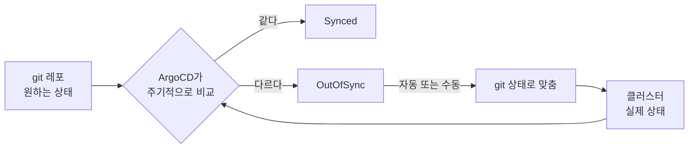
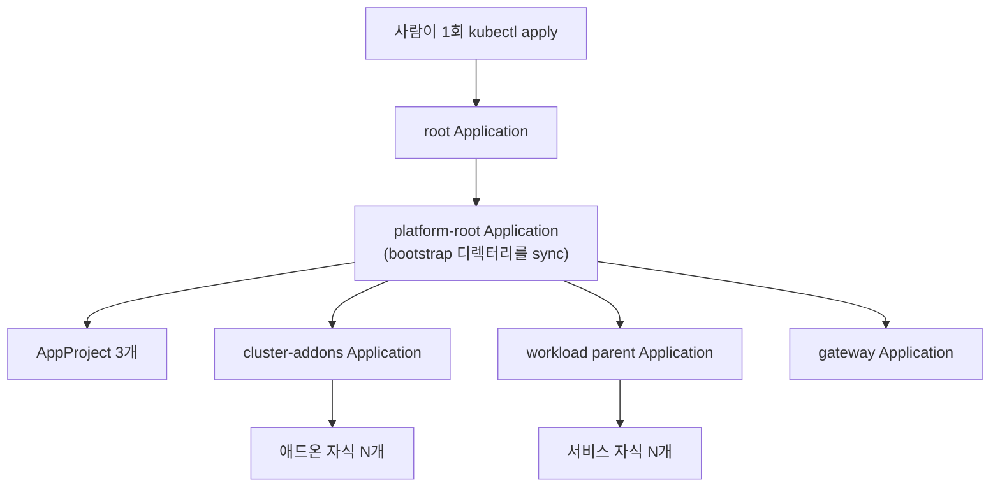
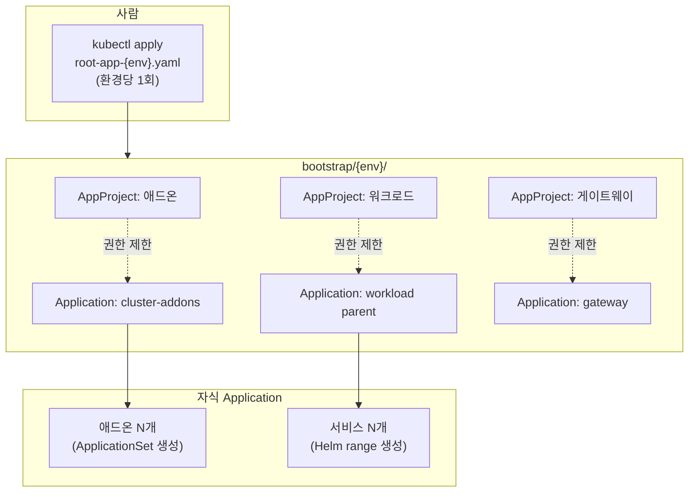

---

title: "ArgoCD로 GitOps를 세울 때 고른 패턴과 그 이유"
date: 2026-03-16
categories: [Kubernetes, GitOps]
tags: [Kubernetes, ArgoCD, GitOps, AppOfApps, AppProject, ApplicationSet, SyncWave, ServerSideApply]
layout: post
toc: true
math: true
mermaid: true

---

## 참고자료

- [Argo CD - Declarative Setup](https://argo-cd.readthedocs.io/en/stable/operator-manual/declarative-setup/)
- [Argo CD - Cluster Bootstrapping (App of Apps)](https://argo-cd.readthedocs.io/en/stable/operator-manual/cluster-bootstrapping/)
- [Argo CD - Projects](https://argo-cd.readthedocs.io/en/stable/operator-manual/project-specification/)
- [Argo CD - Sync Waves and Hooks](https://argo-cd.readthedocs.io/en/stable/user-guide/sync-waves/)
- [Argo CD - Diffing Customization](https://argo-cd.readthedocs.io/en/stable/user-guide/diffing/)
- [Argo CD - Sync Options](https://argo-cd.readthedocs.io/en/stable/user-guide/sync-options/)
- [Argo CD - ApplicationSet](https://argo-cd.readthedocs.io/en/stable/operator-manual/applicationset/)
- [Kubernetes - Server-Side Apply](https://kubernetes.io/docs/reference/using-api/server-side-apply/)

---

## 배경

Docker Compose로 서버마다 배포하던 것을 쿠버네티스로 옮기면서 GitOps를 도입했다. 도구는 ArgoCD로 정했는데, 그 다음이 문제였다.

- Application을 서비스마다 하나씩 만들면 되는가? 그러면 새 서비스가 생길 때마다 사람이 `kubectl apply`를 해야 하는가?
- 애드온과 애플리케이션을 같은 Application에 넣어도 되는가?
- 순서가 필요한 리소스는 어떻게 하는가? NetworkPolicy가 없는 상태로 Pod가 뜨면 통신이 막힌다.
- `kubectl scale`로 복제본을 늘렸는데 몇 분 뒤 되돌아갔다. 왜인가?
- 머지했는데 클러스터에 반영이 안 된다. git에는 없는 내용을 참조하는 에러가 난다.

문서를 읽고 고른 패턴과, 실제로 부딪히고 나서야 알게 된 것들을 정리했다. 회사 클러스터 구성을 예로 들되 내부 이름과 주소는 일반화했다.

---

## 1. GitOps가 무엇인가

### 1.1 용어부터

**GitOps**는 시스템의 원하는 상태를 git에 선언해두고, 그 선언과 실제 상태가 어긋나면 자동으로 맞추는 운영 방식이다.

쿠버네티스의 컨트롤러가 하는 일과 발상이 같다. 컨트롤러는 오브젝트의 `spec`과 `status`를 비교하고, GitOps 도구는 **git의 매니페스트와 클러스터의 실제 리소스**를 비교한다.



**푸시 방식과 풀 방식**을 구분해야 한다.

기존 CI/CD는 푸시 방식이다. 파이프라인이 클러스터에 접속해서 `kubectl apply`를 한다. 이러려면 CI 서버가 클러스터 자격증명을 갖고 있어야 하고, CI가 뚫리면 클러스터도 뚫린다.

GitOps는 풀 방식이다. 클러스터 안의 에이전트가 git을 읽어와서 스스로 적용한다. 클러스터 자격증명이 밖으로 나가지 않는다.

### 1.2 ArgoCD의 Application

ArgoCD가 CRD로 추가하는 오브젝트다. **"이 git 경로의 내용을 이 클러스터의 이 네임스페이스에 맞춰라"** 는 선언이다.

```yaml
apiVersion: argoproj.io/v1alpha1
kind: Application
metadata:
  name: backend-api-dev
  namespace: argocd
spec:
  project: default
  source:
    repoURL: https://git.example.com/org/gitops-repo
    targetRevision: main
    path: charts/backend-api
  destination:
    server: https://kubernetes.default.svc
    namespace: app-dev
  syncPolicy:
    automated:
      prune: true
      selfHeal: true
```

`syncPolicy.automated`의 두 옵션을 짚고 넘어간다.

**`prune: true`.** git에서 리소스를 지우면 클러스터에서도 지운다. 이게 없으면 git에서 삭제해도 클러스터에 남는다.

**`selfHeal: true`.** 누가 클러스터를 직접 고치면 git 상태로 되돌린다. 4장의 질문 하나가 여기서 풀린다.

---

## 2. Application을 서비스마다 손으로 만들 것인가

### 2.1 문제

서비스가 아홉 개면 Application도 아홉 개다. 애드온까지 합치면 스무 개가 넘는다.

이것들을 사람이 `kubectl apply`로 만들면 두 가지가 문제다. **무엇이 클러스터에 있는지가 git에 기록되지 않고**, **새 환경을 만들 때 그 스무 번을 다시 해야 한다.**

### 2.2 App of Apps

해결은 **Application을 만드는 Application**을 두는 것이다. 사람은 진입점 하나만 적용하고, 나머지는 그것이 만든다.



사람이 손대는 지점이 `kubectl apply -f bootstrap/root-app-dev.yaml` 하나로 줄어든다.

```yaml
# bootstrap/root-app-dev.yaml, 사람이 유일하게 손으로 적용하는 파일
apiVersion: argoproj.io/v1alpha1
kind: Application
metadata:
  name: platform-root-dev
  namespace: argocd
spec:
  project: default
  source:
    repoURL: https://git.example.com/org/gitops-repo
    targetRevision: main
    path: bootstrap/dev        # 이 디렉터리의 모든 매니페스트를 sync
  destination:
    server: https://kubernetes.default.svc
    namespace: argocd
  syncPolicy:
    automated:
      prune: true
      selfHeal: true
```

`bootstrap/dev/` 안에 AppProject와 자식 Application들이 들어 있다. 이 디렉터리에 파일을 추가하면 그것도 자동으로 만들어진다.

### 2.3 자식 Application을 손으로 나열할 것인가

`bootstrap/dev/`에 Application YAML을 서비스 수만큼 두는 방법도 있다. 하지만 서비스가 아홉 개면 거의 같은 파일이 아홉 개가 된다.

Helm의 `range`로 목록에서 생성하도록 만들었다.

```yaml
{{- $root := . -}}
{{- $disabled := default (list) .Values.disabledServices -}}
{{- range $app := .Values.workloadApplications }}
{{- if has $app.name $disabled }}
{{- /* 비활성 목록에 있으면 Application 자체를 만들지 않는다 */ -}}
{{- else }}
---
apiVersion: argoproj.io/v1alpha1
kind: Application
metadata:
  name: {{ printf "%s-%s" $app.name $root.Values.environment }}
  namespace: argocd
  annotations:
    argocd.argoproj.io/sync-wave: {{ $app.syncWave | quote }}
  finalizers:
    - resources-finalizer.argocd.argoproj.io
spec:
  project: {{ $root.Values.project }}
  source:
    repoURL: {{ $root.Values.gitRepoURL }}
    targetRevision: {{ $root.Values.targetRevision | quote }}
    path: {{ $app.chartPath }}
    helm:
      valueFiles:
        - values.yaml
        - {{ printf "values-%s.yaml" $root.Values.environment }}
      values: |
        {{- toYaml (dict "global" $root.Values.globalOverrides) | nindent 8 }}
  destination:
    server: {{ $root.Values.clusterServer }}
    namespace: {{ printf "app-%s" $root.Values.environment }}
{{- end }}
{{- end }}
```

values 파일이 자식 목록의 유일한 출처가 된다.

```yaml
workloadApplications:
  - name: platform-shared
    chartPath: charts/platform-shared
    syncWave: "0"
  - name: backend-api
    chartPath: charts/backend-api
    syncWave: "1"
  - name: backend-worker
    chartPath: charts/backend-worker
    syncWave: "1"
  # ...

# 환경별로 특정 서비스만 끄고 싶을 때
disabledServices:
  - backend-worker
```

**여기 없는 서비스는 ArgoCD에 앱으로 생기지 않는다.** 이 한 문장이 유지되면 "무엇이 배포되어 있는가"를 이 파일 하나로 답할 수 있다.

`finalizers`에 붙은 항목도 짚고 넘어간다. `resources-finalizer.argocd.argoproj.io`가 있으면 Application을 지울 때 **그 Application이 만든 리소스도 함께 지운다.** 없으면 Application만 사라지고 리소스는 클러스터에 고아로 남는다.

반대로 리소스를 남기면서 Application만 지우고 싶을 때가 있다. 그때는 finalizer를 먼저 제거한다.

```bash
kubectl patch app <name> -n argocd -p '{"metadata":{"finalizers":null}}' --type merge
kubectl delete app <name> -n argocd --cascade=orphan
```

### 2.4 ApplicationSet, 목록에서 생성하는 또 다른 방법

Helm `range` 말고 ArgoCD 자체 기능으로도 같은 일을 할 수 있다. `ApplicationSet`이 그것이다.


```yaml
apiVersion: argoproj.io/v1alpha1
kind: ApplicationSet
metadata:
  name: cluster-addons-dev
  namespace: argocd
spec:
  generators:
    - list:
        elements:
          - name: metrics-server
            chart: metrics-server
            version: "3.12.1"
            repo: https://kubernetes-sigs.github.io/metrics-server/
            namespace: kube-system
          - name: reloader
            chart: reloader
            version: "1.0.121"
            repo: https://stakater.github.io/stakater-charts
            namespace: reloader
  template:
    metadata:
      name: '{{name}}-dev'
    spec:
      project: cluster-addons
      source:
        repoURL: '{{repo}}'
        chart: '{{chart}}'
        targetRevision: '{{version}}'
        helm:
          valueFiles:
            - $values/infra/{{name}}/values-dev.yaml
      destination:
        namespace: '{{namespace}}'
```


**Helm range와 ApplicationSet 중 무엇을 쓸 것인가.** 기준을 이렇게 잡았다.

| | Helm range | ApplicationSet |
|---|---|---|
| 만드는 주체 | Helm 렌더링 | ArgoCD 컨트롤러 |
| 생성 시점 | 부모 Application이 sync될 때 | 생성기가 목록을 평가할 때 |
| 생성기 종류 | 없음 (values 리스트만) | list, git, cluster, matrix 등 |
| 디버깅 | `helm template`으로 결과를 미리 본다 | 컨트롤러 로그를 봐야 한다 |

**상용 차트를 그대로 가져다 쓰는 애드온에는 ApplicationSet**을 썼다. 차트 이름과 버전, values 경로만 나열하면 되므로 목록 형태가 잘 맞는다.

**자체 차트로 만든 워크로드에는 Helm range**를 썼다. `helm template`으로 렌더링 결과를 커밋 전에 확인할 수 있다는 점이 컸다. 애플리케이션은 배포 실패의 영향이 크므로 미리 볼 수 있는 쪽을 골랐다.

---

## 3. 애드온과 애플리케이션을 섞을 것인가

### 3.1 AppProject가 무엇인가

ArgoCD의 `AppProject`는 **Application이 무엇을 할 수 있는지를 제한하는 경계**다. 기본으로 `default` 프로젝트가 있고 여기에는 제한이 없다.

제한할 수 있는 항목이 넷이다.

| 항목 | 무엇을 제한하는가 |
|---|---|
| `sourceRepos` | 어느 git 레포에서 가져올 수 있는가 |
| `destinations` | 어느 클러스터의 어느 네임스페이스에 배포할 수 있는가 |
| `clusterResourceWhitelist` | 어떤 클러스터 범위 리소스를 다룰 수 있는가 |
| `namespaceResourceWhitelist` | 어떤 네임스페이스 범위 리소스를 다룰 수 있는가 |

### 3.2 왜 세 개로 나눴는가

전부 `default`에 넣으면 모든 Application이 클러스터의 모든 것을 건드릴 수 있다. 애플리케이션 배포가 실수로 `ClusterRole`을 바꾸는 상황을 막을 수단이 없다.

그래서 카테고리를 셋으로 나누고 각각 프로젝트를 뒀다.

| 카테고리 | 무엇이 들어가는가 | 권한 범위 |
|---|---|---|
| 애드온 | CNI, 정책 엔진, 관측성, 인증서 관리 | 클러스터 범위 리소스 허용 |
| 워크로드 | 백엔드, 프론트엔드, 배치 | 애플리케이션 네임스페이스만 |
| 게이트웨이 | 라우팅과 보안 정책 | 게이트웨이 관련 리소스만 |

```yaml
apiVersion: argoproj.io/v1alpha1
kind: AppProject
metadata:
  name: workload
  namespace: argocd
spec:
  sourceRepos:
    - https://git.example.com/org/gitops-repo
  destinations:
    - server: https://kubernetes.default.svc
      namespace: app-dev          # 이 네임스페이스만
  clusterResourceWhitelist: []     # 클러스터 범위 리소스는 전부 금지
  namespaceResourceWhitelist:
    - group: '*'
      kind: '*'
```

**얻는 것이 둘이다.**

**한 영역의 사고가 다른 영역으로 번지지 않는다.** 워크로드 Application의 동기화가 실패해도 애드온과 게이트웨이는 그대로 돈다.

**권한 경계가 선언으로 남는다.** 워크로드 프로젝트에서 `ClusterRole`을 만들려고 하면 동기화가 실패한다. 코드 리뷰에서 놓쳐도 클러스터에 반영되지 않는다.

### 3.3 여기서 실제로 겪은 함정

`clusterResourceWhitelist`가 화이트리스트라는 점이 문제를 만든다. **새 CRD 종류를 쓰기 시작하면 그것을 목록에 추가해야 한다.**

정책 엔진을 도입하면서 `ClusterPolicy`라는 새 kind를 쓰게 됐는데, 애드온 프로젝트의 화이트리스트에 넣는 것을 빠뜨렸다.

증상이 이랬다.

```
resource ClusterPolicy is not permitted in project cluster-addons
```

그리고 이 실패가 그 Application 하나로 끝나지 않았다. 동기화가 멈추면서 **같은 Application에 묶인 다른 리소스들도 함께 밀렸다.**

그래서 체크리스트에 항목을 하나 추가했다. **새 CRD kind를 쓰는 PR은 머지 전에 프로젝트 화이트리스트를 확인한다.**

```bash
# 렌더링 결과에서 클러스터 범위 리소스 kind를 뽑아
helm template <chart> -f <values> | yq 'select(.metadata.namespace == null) | .kind' | sort -u

# 프로젝트 화이트리스트와 대조
yq '.spec.clusterResourceWhitelist[].kind' bootstrap/dev/00-project-cluster-addons.yaml | sort -u
```

---

## 4. 순서가 필요한 리소스는 어떻게 하는가

### 4.1 문제

NetworkPolicy를 기본 차단으로 걸어두었다. 그런데 애플리케이션 Pod가 NetworkPolicy보다 먼저 뜨면, 잠깐 동안 통신이 되다가 막히거나 그 반대가 된다.

반대로 CRD를 등록하기 전에 그 CRD를 쓰는 리소스를 적용하면 그냥 실패한다.

### 4.2 sync-wave

ArgoCD는 어노테이션으로 적용 순서를 정할 수 있다.

```yaml
metadata:
  annotations:
    argocd.argoproj.io/sync-wave: "0"
```

**숫자가 작은 것부터 적용한다.** 기본값은 0이고 음수도 쓸 수 있다.

중요한 점은 ArgoCD가 **한 wave의 리소스가 정상(Healthy) 상태가 될 때까지 기다린 다음** 다음 wave로 넘어간다는 것이다. 단순히 순서대로 던지고 마는 것이 아니다.

실제로 쓰는 배치다.

| wave | 무엇 | 왜 먼저인가 |
|---|---|---|
| `-1` | CRD, 네임스페이스 | 이것이 없으면 뒤의 리소스가 적용 실패한다 |
| `0` | NetworkPolicy, ResourceQuota, 공유 볼륨 | 워크로드가 뜨기 전에 정책과 자원 경계가 있어야 한다 |
| `1` | 백엔드, 프론트엔드, 배치 | |
| `2` | 라우트, 게이트웨이 정책 | 대상 Service가 존재한 뒤에 라우트를 건다 |

부모 Application에서 자식마다 wave를 지정하면 자식 Application 자체의 생성 순서도 제어된다.

### 4.3 sync-wave로 안 되는 것

wave는 **하나의 Application 안에서** 동작한다. 서로 다른 Application 사이의 순서는 그 Application들을 만드는 부모 쪽에서 wave를 줘야 한다.

그리고 wave는 **Healthy 판정에 의존한다.** 어떤 리소스는 ArgoCD가 Healthy를 판정할 방법이 없어서 적용하자마자 다음 wave로 넘어간다. Job처럼 완료 여부가 중요한 리소스는 별도의 훅(`PreSync`, `PostSync`)을 쓰는 편이 맞다.

---

## 5. `kubectl scale`이 되돌아간 이유

### 5.1 selfHeal

1.2절에서 본 `selfHeal: true`가 원인이다. ArgoCD가 주기적으로 git과 클러스터를 비교하다가 차이를 발견하면 git 쪽으로 되돌린다. `kubectl scale`로 바꾼 복제본 수는 git에 없으므로 되돌려진다.

**이건 버그가 아니라 GitOps의 정의 그대로다.** 클러스터의 상태는 git이 정하고, 수동 변경은 드리프트로 취급된다.

### 5.2 그런데 예외를 두고 싶을 때

HPA(Horizontal Pod Autoscaler)를 쓰면 복제본 수가 자동으로 바뀐다. 이건 정상 동작인데 ArgoCD 입장에서는 드리프트로 보인다.

이럴 때 `ignoreDifferences`로 특정 필드를 비교 대상에서 뺀다.

```yaml
spec:
  ignoreDifferences:
    - group: apps
      kind: Deployment
      jsonPointers:
        - /spec/replicas
```

### 5.3 그런데 이걸 걷어냈다

처음에는 위 설정을 넣어두었다. 그러다 걷어냈고, 그 이유가 이 글에서 제일 중요한 판단이었다.

**`ignoreDifferences`로 `replicas`를 빼두면 복제본 수가 git에 기록되지 않는다.** 누가 언제 몇 개로 바꿨는지 추적할 수 없고, 클러스터를 재구축하면 그 값이 사라진다. 실제로 어떤 서비스가 몇 개로 도는지 물었을 때 답할 근거가 없었다.

그리고 HPA를 쓰는 경우는 **차트가 애초에 `replicas` 필드를 렌더링하지 않도록** 만들면 된다.


```yaml
spec:
  {{- if not .Values.autoscaling.enabled }}
  replicas: {{ .Values.replicaCount }}
  {{- end }}
```


HPA를 켜면 `replicas` 필드 자체가 매니페스트에 없으므로 비교할 것이 없다. `ignoreDifferences`가 필요 없어진다.

그래서 정리는 이렇게 됐다.

- HPA를 안 쓰는 서비스: `replicas`를 git이 전면 관리한다. `kubectl scale`은 되돌려진다.
- HPA를 쓰는 서비스: 차트가 `replicas`를 렌더링하지 않는다. HPA가 관리한다.

의도적으로 복제본을 바꾸려면 values 파일을 고쳐 PR을 올린다. 급할 때 번거롭지만, **급해서 손으로 바꾼 것이 다음 동기화에 되돌아가는 것보다는 낫다.**

`ignoreDifferences`를 아예 안 쓰는 것은 아니다. HPA의 `targetAverageUtilization`처럼 컨트롤러가 정규화해서 되쓰는 필드는 남겨두었다.

```yaml
ignoreDifferences:
  - group: autoscaling
    kind: HorizontalPodAutoscaler
    jqPathExpressions:
      - .spec.metrics[].resource.target.averageUtilization
      - .status
```

`ignoreDifferences`를 실제로 적용하려면 동기화 옵션도 함께 켜야 한다.

```yaml
syncPolicy:
  syncOptions:
    - RespectIgnoreDifferences=true
```

이걸 빠뜨리면 비교(diff) 화면에서만 무시하고 실제 동기화 때는 덮어쓴다. 처음에 이 옵션을 몰라서 "무시 설정을 했는데 왜 계속 덮어쓰는가"로 한참 헤맸다.

---

## 6. 머지했는데 반영이 안 될 때

### 6.1 Server-Side Apply가 리스트를 병합한다

**Server-Side Apply(SSA)** 를 먼저 설명한다. 기존 `kubectl apply`는 클라이언트가 이전 상태와 새 상태를 비교해서 패치를 만들었다. SSA는 그 계산을 API 서버가 한다. 필드마다 "누가 이 필드를 관리하는가"를 기록해두고, 여러 주체가 같은 리소스를 다룰 때 충돌을 감지한다.

ArgoCD에서 켜는 방법이다.

```yaml
syncPolicy:
  syncOptions:
    - ServerSideApply=true
```

장점이 있다. 큰 CRD에서 어노테이션 크기 제한에 걸리는 문제가 사라지고, 다른 컨트롤러가 관리하는 필드를 존중한다.

**그런데 리스트를 다룰 때 문제가 생긴다.**

정책 리소스의 `spec.rules` 배열에서 규칙 하나를 지우고 머지했는데, 클러스터에는 그 규칙이 남아 있었다. SSA가 리스트를 병합하면서 제거된 항목을 그대로 둔 것이다.

증상이 특이해서 오래 걸렸다. **git에 없는 내용을 참조하는 에러가 났다.** 이미 지운 규칙의 이름이 에러 메시지에 나왔다.

해결은 전체를 통째로 다시 쓰게 만드는 것이다.

```yaml
syncPolicy:
  syncOptions:
    - Replace=true
```

다만 `Replace=true`는 리소스를 삭제하고 다시 만드는 동작이므로 상시로 켜두면 안 된다. 이 문제가 났을 때만 일시적으로 쓰고 되돌린다.

**여기서 얻은 진단 신호 하나가 있다. 에러 메시지가 git에 없는 것을 가리키면 병합이나 캐시 문제다.** 코드를 다시 보는 대신 클러스터 실제 상태를 먼저 본다.

```bash
# 클러스터의 실제 매니페스트에 그 항목이 남아 있는지
kubectl get clusterpolicy <name> -o yaml | yq '.spec.rules[].name'

# 필드를 누가 관리하고 있는지
kubectl get deploy <name> -o yaml --show-managed-fields | yq '.metadata.managedFields'
```

### 6.2 캐시가 오래된 매니페스트를 들고 있다

ArgoCD는 git 레포를 클론해서 캐시한다. 이 캐시가 갱신되지 않으면 옛 매니페스트로 계속 동기화한다.

강제하는 순서를 이렇게 정리해두었다. 위에서부터 시도하고 안 되면 다음으로 간다.

1. **하드 리프레시.** UI 버튼 또는 `argocd app get <name> --hard-refresh`
2. **repo-server 재기동.** 매니페스트 생성을 담당하는 컴포넌트다.
3. **Redis 재기동.** ArgoCD는 렌더링 결과를 Redis에 캐시한다.
4. **Application 재생성.** finalizer를 제거하고 `--cascade=orphan`으로 지운 뒤 다시 만든다. 리소스는 보존된다.

```bash
kubectl patch app <name> -n argocd -p '{"metadata":{"finalizers":null}}' --type merge
kubectl delete app <name> -n argocd --cascade=orphan
# bootstrap 디렉터리의 부모가 다시 만들어준다
```

### 6.3 Synced가 떴다고 끝난 것이 아니다

동기화 직후에 `Synced`로 보이지만 잠시 뒤 다시 `OutOfSync`가 되는 경우가 있다.

원인이 두 가지다. **하나는 아직 수렴 중인 것**이고, **다른 하나는 영구 드리프트**다.

영구 드리프트의 대표적인 원인이 빈 map이다. 렌더링 결과에 `annotations: {}` 같은 것이 있으면, API 서버가 빈 map을 저장하지 않으므로 git과 클러스터가 영원히 달라 보인다.

```bash
# 렌더링 결과에 빈 map이 있는지
helm template <chart> -f <values> | grep -nE ':\s*\{\}\s*$'
```

그래서 검증 절차에 항목을 하나 넣었다. **머지 후 새로고침 두 주기를 기다린 뒤 `OutOfSync`가 0인지 다시 확인한다.** 상용 차트를 새로 도입하거나 버전을 올릴 때 특히 확인한다.

```bash
# 전체 Application 상태 한눈에
kubectl get applications -n argocd \
  -o custom-columns='NAME:.metadata.name,SYNC:.status.sync.status,HEALTH:.status.health.status'
```

---

## 7. 환경을 어떻게 나눌 것인가

### 7.1 두 가지 방식

**하나의 ArgoCD가 여러 클러스터를 관리하는 방식**과 **환경마다 ArgoCD를 두는 방식**이 있다.

| | 중앙 집중 | 환경별 분리 |
|---|---|---|
| ArgoCD 인스턴스 | 1개 | 환경 수만큼 |
| 클러스터 자격증명 | 중앙 ArgoCD가 전 환경 것을 보유 | 각자 자기 클러스터만 |
| 장애 영향 | ArgoCD가 죽으면 전 환경 배포 중단 | 그 환경만 |
| 운영 부담 | 낮음 | 인스턴스 수만큼 |

**환경별 분리를 골랐다.** 이유는 자격증명 쪽이 컸다. 중앙 집중이면 그 ArgoCD 하나가 운영 클러스터의 자격증명까지 들고 있게 된다. 그 인스턴스가 뚫리면 전 환경이 열린다.

그리고 개발 환경의 ArgoCD를 재기동하거나 실험할 때 운영 배포에 영향이 없다는 점도 실무에서 편했다.

### 7.2 디렉터리 구조

환경별로 인스턴스를 두면 디렉터리도 환경별로 나뉜다.

```
bootstrap/
  root-app-dev.yaml           # 환경별 진입점, 사람이 1회 적용
  root-app-stg.yaml
  root-app-live.yaml
  dev/                        # 환경별 AppProject와 Application
    00-project-cluster-addons.yaml
    01-project-workload.yaml
    02-project-gateway.yaml
    10-cluster-addons.yaml
    20-workload.yaml
    21-gateway.yaml
  stg/
  live/

apps/
  cluster-addons/
    dev/                      # 환경별 ApplicationSet
    stg/
    live/
  workload/                   # 공통 부모 차트
    values.yaml
    values-dev.yaml
    values-stg.yaml
    values-live.yaml

charts/                       # 자체 차트 (환경 공통)
infra/                        # 상용 차트 values (환경별 파일)
clusters/
  dev/                        # 환경별 raw 매니페스트
  stg/
  live/
```

파일 이름 앞의 번호는 sync-wave가 아니라 **읽는 순서**다. 프로젝트가 먼저 있어야 Application이 그 프로젝트를 참조할 수 있으므로 번호가 그 의존을 반영한다.

### 7.3 환경별로 다른 것과 같은 것

**차트는 공통, values는 환경별**이 원칙이다. 차트를 환경별로 복사하면 하나를 고칠 때 세 번 고쳐야 하고, 결국 어긋난다.

다만 예외가 두 군데 있다.

**`clusters/<env>/`의 raw 매니페스트.** 네임스페이스, 리소스 쿼터, 정책 같은 것들이다. Helm 차트로 만들 이유가 없는 것을 억지로 차트화하지 않았다.

**동기화 정책.** 개발 환경은 자동 동기화를 켜고, 운영은 끈다. 운영은 사람이 확인하고 동기화 버튼을 누른다.

```yaml
# values-dev.yaml
autoSync:
  enabled: true
  prune: true
  selfHeal: true

# values-live.yaml
autoSync:
  enabled: false
```

**부모와 자식의 동기화 정책을 일치시키는 것**이 중요하다. 부모가 자동인데 자식이 수동이면, 부모가 자식 Application을 계속 원래대로 되돌리면서 예상과 다르게 동작한다.

---

## 8. 지금까지의 패턴을 한 장으로



정리하면 네 가지 결정이었다.

**진입점을 하나로 줄인다.** 사람이 손대는 지점이 많을수록 환경 간 차이가 생긴다.

**목록에서 Application을 생성한다.** 무엇이 배포되어 있는지를 파일 하나로 답할 수 있어야 한다.

**카테고리마다 권한 경계를 둔다.** 한 영역의 사고가 다른 영역으로 번지지 않게 하고, 권한 범위를 선언으로 남긴다.

**드리프트를 예외 처리하는 대신 없앤다.** `ignoreDifferences`로 필드를 빼는 것보다, 그 필드가 애초에 렌더링되지 않게 만드는 편이 추적 가능성을 지킨다.

---

## 9. 운영하면서 정리한 체크리스트

### PR을 올리기 전에

```bash
# 렌더링 결과 확인
helm template <chart> -f <chart>/values-dev.yaml

# 빈 map 검사 (영구 드리프트 원인)
helm template <chart> -f <chart>/values-dev.yaml | grep -nE ':\s*\{\}\s*$'

# 새 CRD kind를 쓰면 프로젝트 화이트리스트 확인
helm template <chart> -f <chart>/values-dev.yaml \
  | yq 'select(.metadata.namespace == null) | .kind' | sort -u
```

### 머지한 뒤에

```bash
# 새로고침 두 주기(약 6분) 뒤에 확인한다.
# 직후의 Synced는 수렴 중일 수 있다.
kubectl get applications -n argocd \
  -o custom-columns='NAME:.metadata.name,SYNC:.status.sync.status,HEALTH:.status.health.status'
```

### 반영이 안 될 때

1. 에러 메시지가 git에 없는 내용을 가리키는가 → SSA 병합 또는 캐시 문제
2. 하드 리프레시
3. repo-server 재기동
4. Redis 재기동
5. Application 재생성 (`--cascade=orphan`으로 리소스 보존)

### 동기화가 실패할 때

```bash
# 실패 이유
kubectl get app <name> -n argocd -o jsonpath='{.status.conditions}' | jq

# "not permitted in project" → AppProject 화이트리스트
# "the server could not find the requested resource" → CRD 미등록
# admission 관련 → 정책 엔진에서 막힌 것, 로컬 재현 필요
```

---

## 정리하며

처음 던진 질문들에 대한 답이다.

**Application을 서비스마다 손으로 만들어야 하는가.** 아니다. Application을 만드는 Application을 두면 사람이 손대는 지점이 환경당 하나로 줄어든다. 자식 목록은 values 파일 하나가 유일한 출처가 된다.

**애드온과 애플리케이션을 같은 곳에 넣어도 되는가.** 넣을 수는 있지만 권한 경계가 사라진다. AppProject로 카테고리를 나누면 한 영역의 실패가 다른 영역으로 번지지 않고, 워크로드가 클러스터 범위 리소스를 건드리는 것도 선언으로 막힌다.

**순서가 필요한 리소스는 어떻게 하는가.** `sync-wave` 어노테이션으로 지정한다. ArgoCD는 앞 wave가 정상 상태가 될 때까지 기다린 뒤 다음으로 넘어간다. 다만 wave는 한 Application 안에서만 동작하므로, Application 사이의 순서는 부모 쪽에서 준다.

**`kubectl scale`이 왜 되돌아가는가.** `selfHeal`이 git 상태로 되돌린 것이다. 이건 GitOps의 정의 그대로다. `ignoreDifferences`로 예외를 두는 대신, HPA를 쓸 때 차트가 `replicas` 필드를 렌더링하지 않도록 만드는 편이 추적 가능성을 지킨다.

**머지했는데 반영이 안 되는 이유.** Server-Side Apply가 리스트를 병합하면서 제거한 항목을 남겼거나, 캐시가 오래된 매니페스트를 들고 있는 것이다. 에러 메시지가 git에 없는 내용을 가리키면 이쪽을 의심한다.

돌아보면 GitOps를 도입하면서 얻은 것은 자동 배포가 아니었다. **"지금 클러스터에 무엇이 왜 올라가 있는가"에 답할 수 있게 된 것**이 컸다. 그 답이 git 히스토리에 남아 있고, 손으로 바꾼 것은 되돌아간다. 급할 때 번거롭지만 그 번거로움이 추적 가능성의 대가다.
