# 01. 클러스터 아키텍처

Kubernetes 클러스터 아키텍처는 모든 운영과 트러블슈팅의 기반이다. Control Plane 컴포넌트가 어떤 역할을 하는지, 요청이 어떤 경로로 처리되는지, etcd가 왜 중요한지를 이해해야 장애 상황에서 올바른 판단을 내릴 수 있다. 이 글에서는 클러스터 아키텍처의 주요 개념 10가지를 기초부터 심화까지 정리한다.

---

## Control Plane 주요 컴포넌트 4가지

Kubernetes의 모든 동작은 4개의 Control Plane 컴포넌트를 중심으로 이루어진다.

### kube-apiserver

클러스터의 유일한 API 게이트웨이로, 모든 컴포넌트(kubectl, kubelet, kube-scheduler, kube-controller-manager, cloud-controller-manager, kube-proxy, API Aggregation Layer)의 요청을 인증/인가/Admission Control 후 etcd에 반영하는 중앙 통신 허브다.

### etcd

클러스터의 모든 상태(desired state, current state)를 key-value 형태로 저장하는 분산 합의(consensus) 저장소이며, Raft 알고리즘으로 일관성을 보장한다.

### kube-scheduler

새로 생성되어 노드가 할당되지 않은(unscheduled) Pod를 감시(watch)하고, resources.requests, nodeSelector, nodeAffinity, podAffinity, podAntiAffinity, taints/tolerations, PriorityClass, TopologySpreadConstraints, PersistentVolume node affinity의 조건을 평가하여 최적의 노드에 바인딩한다.

### kube-controller-manager

Deployment Controller, ReplicaSet Controller, Node Controller 등 약 30여 개의 컨트롤러를 하나의 바이너리로 실행하며, 각 컨트롤러는 현재 상태(current state)를 원하는 상태(desired state)로 수렴시키는 **Reconciliation Loop**를 수행한다.

### 주요 원리

Kubernetes는 **선언적(declarative) 모델**이다. 사용자가 desired state를 apiserver에 전달하면, etcd에 저장되고, 각 컨트롤러가 current state를 desired state로 맞추는 구조다. 모든 컴포넌트는 apiserver를 통해서만 통신하며, 직접 통신하지 않는다.

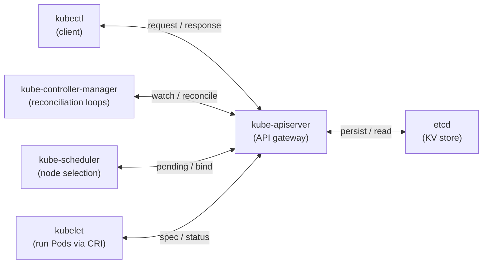

> 기억해야할 점: "모든 컴포넌트 간 통신은 반드시 kube-apiserver를 경유한다"는 점과, "선언적 모델 + Reconciliation Loop"라는 주요 설계 원리를 반드시 알아둬야 한다.

**관련 키워드:** Reconciliation Loop, 선언적 모델, Raft 합의 알고리즘, Admission Control, Watch 메커니즘

[공식 문서 - Kubernetes Components](https://kubernetes.io/docs/concepts/overview/components/)

---

## kubectl apply 처리 흐름

`kubectl apply -f deployment.yaml`을 실행하면 클러스터 내부에서 7단계를 거쳐 컨테이너가 실행된다.

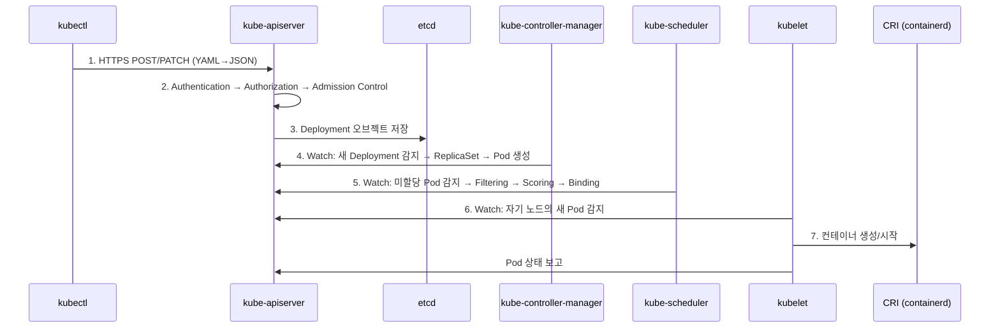

### 2단계: 인증/인가/Admission Control 상세

apiserver는 3단계 검증을 수행한다.

- **Authentication**: 클라이언트 인증서(X.509), Bearer Token(Static Token, ServiceAccount Token), OIDC(OpenID Connect), Webhook Token Authentication, Authentication Proxy, Bootstrap Token으로 "누구인가" 확인
- **Authorization**: RBAC 정책으로 "이 작업을 할 권한이 있는가" 확인
- **Admission Control**: Mutating Webhook(리소스 변경) → Validating Webhook(유효성 검증) 순서로 실행

```text
Request
  -> Authentication
  -> Authorization
  -> Mutating Admission   (바꿀 수 있음)
  -> Validating Admission (검사만 함)
  -> etcd 저장
```

**Mutating vs Validating** 순서가 중요하다. Mutating Admission은 요청 객체를 수정할 수 있는 단계로, 기본값 주입, 라벨/어노테이션 추가, 사이드카 자동 주입(Istio/Linkerd), 보안 컨텍스트 보정 같은 작업을 수행한다. Validating Admission은 수정 없이 허용/거부만 판단한다. 먼저 객체를 최종 형태로 보정한 뒤 그 최종 결과가 정책에 맞는지 검증해야 하기 때문에 Mutating이 먼저 실행된다. 둘 중 하나라도 실패하면 해당 요청은 거부되며, etcd에 저장되지 않는다.

### 3단계: etcd 저장

검증을 통과하면 apiserver가 Deployment 오브젝트를 etcd에 저장한다. 이 시점에서 Deployment만 생성되고, ReplicaSet이나 Pod는 아직 없다.

### 4단계: kube-controller-manager

Deployment Controller가 apiserver의 watch를 통해 새 Deployment를 감지하고, 해당 spec에 맞는 ReplicaSet을 생성한다. ReplicaSet Controller가 이를 다시 감지하여 Pod 오브젝트를 생성한다. 이 시점의 Pod는 `nodeName`이 비어있다.

### 5단계: kube-scheduler

`nodeName`이 비어있는 새 Pod를 watch로 감지하고, **Filtering**(노드 자격 판단) → **Scoring**(점수 매김) → **Binding**(노드 할당) 과정을 거쳐 최적 노드를 결정한다.

### 6~7단계: kubelet과 CRI

해당 노드의 kubelet이 자신에게 할당된 새 Pod를 watch로 감지하고, containerd/CRI-O 등 컨테이너 런타임이 이미지를 pull하고 컨테이너를 생성/시작한다. kubelet은 Pod 상태를 apiserver에 보고하고, etcd에 최종 상태가 저장된다.

**관련 키워드:** Watch 메커니즘, Admission Webhook (Mutating → Validating), Filtering → Scoring → Binding, CRI

[공식 문서 - Kubernetes API](https://kubernetes.io/docs/concepts/overview/kubernetes-api/)

---

## etcd 저장 형태와 장애 시 영향

### 저장 형태

etcd는 key-value 저장소이며, 모든 Kubernetes 리소스는 `/registry/<리소스종류>/<네임스페이스>/<이름>` 형태의 key로 저장된다.

- 예: `/registry/deployments/default/my-app`, `/registry/pods/kube-system/coredns-xxxxx`
- value는 **Protobuf** 직렬화된 바이너리 형태로 저장된다 (JSON이 아님). 네트워크 전송 시에는 JSON/Protobuf 둘 다 지원하지만 etcd 저장은 Protobuf다.
- etcd 3.x 기준, B+Tree 기반의 **bbolt(BoltDB)** 스토리지 엔진을 사용한다.

```bash
# etcd에 저장된 key 확인 (디버깅용)
ETCDCTL_API=3 etcdctl get /registry/deployments/default/my-app \
  --endpoints=https://127.0.0.1:2379 \
  --cacert=/etc/kubernetes/pki/etcd/ca.crt \
  --cert=/etc/kubernetes/pki/etcd/server.crt \
  --key=/etc/kubernetes/pki/etcd/server.key
```

### etcd 장애 시

- kube-apiserver가 읽기/쓰기 불가가 된다. 새로운 리소스 생성, 수정, 삭제가 모두 실패한다.
- `kubectl` 명령어가 전부 실패한다 (`connection refused` 또는 `etcd cluster is unavailable`).
- kube-scheduler가 새 Pod를 스케줄링할 수 없다.
- kube-controller-manager가 Reconciliation Loop를 수행할 수 없다.

### 기존 실행 중인 Pod

**즉시 죽지 않는다.** 이미 실행 중인 Pod는 각 노드의 kubelet이 직접 관리하고 있으므로 계속 동작한다. 다만 etcd가 불능이면 Node 상태 전환, Pod eviction, 재스케줄링, 자동 복구 같은 Control Plane의 상태 변경은 정상적으로 진행되지 않는다.

> 기억해야할 점: "Data Plane(워커 노드)은 Control Plane과 어느 정도 독립적으로 동작한다. 하지만 자동 복구(self-healing), 스케일링, 배포 같은 관리 기능은 중단된다"가 중요한 포인트다. Node가 NotReady/Unknown으로 바뀌고 약 5분 뒤 eviction이 일어나는 시나리오는 etcd 장애보다는 apiserver와 etcd는 정상인데 노드 heartbeat가 끊긴 경우에 해당한다.

**관련 키워드:** Protobuf 직렬화, /registry/ key 구조, Data Plane과 Control Plane 분리, bbolt(BoltDB), Raft 합의

[공식 문서 - etcd 운영](https://kubernetes.io/docs/tasks/administer-cluster/configure-upgrade-etcd/)

---

## --control-plane-endpoint 설정 이유

`--control-plane-endpoint`는 모든 Control Plane 노드를 대표하는 단일 진입점(DNS 또는 LB IP)을 지정하는 플래그다.

### 필요한 이유

1. **HA 클러스터 확장 대비**: 이 플래그 없이 `kubeadm init`을 실행하면, kubeconfig 파일과 클러스터 내부 설정에 첫 번째 Control Plane 노드의 IP가 하드코딩된다. 이후 HA를 위해 Control Plane을 추가하려 해도, 모든 워커 노드와 컴포넌트가 첫 번째 노드 IP만 바라보고 있어 사실상 HA 전환이 불가능해진다.
2. **단일 장애 지점 제거**: 첫 번째 Control Plane 노드가 죽으면, 워커 노드의 kubelet이 apiserver에 연결할 수 없다. `--control-plane-endpoint`로 Load Balancer VIP를 지정하면, LB가 살아있는 Control Plane으로 트래픽을 라우팅한다.
3. **kubeconfig 일관성**: `admin.conf`, `kubelet.conf`, `controller-manager.conf` 등 모든 kubeconfig의 `server` 필드가 이 endpoint를 가리키게 된다. Control Plane 노드를 교체하더라도 kubeconfig 수정이 불필요하다.

```bash
# 올바른 초기화 예시
kubeadm init \
  --control-plane-endpoint "k8s-api.example.com:6443" \
  --upload-certs \
  --pod-network-cidr=10.244.0.0/16

# k8s-api.example.com은 L4 Load Balancer(HAProxy, AWS NLB, Nginx Stream, Keepalived+LVS, Envoy, MetalLB)의 DNS/VIP
```

> 기억해야할 점: 설정하지 않으면 `kubeadm join --control-plane` 명령이 실패하거나 추가 Control Plane이 정상 작동하지 않는다. kubeadm에서 이 값의 사후 변경을 지원하지 않으므로 클러스터를 처음부터 다시 구축해야 한다.

**관련 키워드:** HA 클러스터 전제 조건, Load Balancer VIP, kubeconfig server 필드 하드코딩, 사후 변경 불가

[공식 문서 - HA 클러스터 구성](https://kubernetes.io/docs/setup/production-environment/tools/kubeadm/high-availability/)

---

## 인증서 만료 확인과 증상

### 인증서 확인 명령어

```bash
# kubeadm 기본 명령 (가장 간편)
kubeadm certs check-expiration

# 출력 예시:
# CERTIFICATE                EXPIRES                  RESIDUAL TIME
# admin.conf                 Mar 29, 2027 00:00 UTC   364d
# apiserver                  Mar 29, 2027 00:00 UTC   364d
# apiserver-etcd-client      Mar 29, 2027 00:00 UTC   364d
# apiserver-kubelet-client   Mar 29, 2027 00:00 UTC   364d

# openssl로 개별 인증서 직접 확인
openssl x509 -in /etc/kubernetes/pki/apiserver.crt -noout -text | grep -A2 "Validity"

# 특정 인증서의 만료일만 확인
openssl x509 -in /etc/kubernetes/pki/apiserver.crt -noout -enddate
```

### 인증서 종류와 기본 유효기간

- kubeadm이 생성하는 인증서는 기본 **1년** 유효 (CA 인증서는 **10년**)
- `kubeadm upgrade`를 실행하면 자동으로 인증서가 갱신된다
- 수동 갱신: `kubeadm certs renew all`

### 만료 시 증상

1. **apiserver 인증서 만료**: `kubectl` 명령 시 `x509: certificate has expired or is not yet valid` 에러. 모든 API 호출이 실패한다.
2. **kubelet 클라이언트 인증서 만료**: 워커 노드가 `NotReady` 상태로 전환된다. kubelet이 apiserver와 통신할 수 없기 때문이다.
3. **etcd 인증서 만료**: etcd 클러스터 간 통신이 실패하여 apiserver가 etcd를 읽을 수 없다. `etcdserver: request timed out` 에러가 발생한다.
4. **controller-manager/scheduler 인증서 만료**: 새 Pod 스케줄링, 자동 복구(self-healing)가 중단된다.
5. **기존 Pod는 계속 동작**하지만, 새로운 배포/스케일링/장애 복구가 모두 불가능해진다.

### 실무 대응

```bash
# 인증서 갱신 (전체)
kubeadm certs renew all

# 갱신 후 Control Plane 컴포넌트 재시작 필수
# (Static Pod이므로 manifest 파일을 touch하면 kubelet이 재시작)
crictl pods --name kube-apiserver -q | xargs crictl stopp
# 또는 간단하게:
systemctl restart kubelet
```

**관련 키워드:** kubeadm certs check-expiration, 기본 1년/CA 10년, x509 certificate expired, kubeadm certs renew all, upgrade 시 자동 갱신

[공식 문서 - kubeadm 인증서 관리](https://kubernetes.io/docs/tasks/administer-cluster/kubeadm/kubeadm-certs/)

---

## etcd 백업과 복원

### 전체 백업 명령어

```bash
ETCDCTL_API=3 etcdctl snapshot save /backup/etcd-snapshot-$(date +%Y%m%d).db \
  --endpoints=https://127.0.0.1:2379 \
  --cacert=/etc/kubernetes/pki/etcd/ca.crt \
  --cert=/etc/kubernetes/pki/etcd/server.crt \
  --key=/etc/kubernetes/pki/etcd/server.key
```

### 인증서 파일 3개와 역할

| 파일 경로                                 | 플래그        | 역할                                                                                      |
|---------------------------------------|------------|-----------------------------------------------------------------------------------------|
| `/etc/kubernetes/pki/etcd/ca.crt`     | `--cacert` | **CA 인증서**. etcd 서버의 인증서를 검증한다. "이 서버가 신뢰할 수 있는 CA가 서명한 것인가?"를 확인한다.                    |
| `/etc/kubernetes/pki/etcd/server.crt` | `--cert`   | **클라이언트 인증서**. etcdctl이 etcd 서버에 자신의 신원을 증명하기 위해 제출한다. mTLS(상호 TLS)에서 클라이언트 측 인증에 사용된다. |
| `/etc/kubernetes/pki/etcd/server.key` | `--key`    | **클라이언트 개인키**. 클라이언트 인증서와 쌍을 이루는 개인키로, TLS 핸드셰이크에서 클라이언트가 인증서의 소유자임을 증명한다.              |

> apiserver가 etcd에 접근할 때는 `/etc/kubernetes/pki/apiserver-etcd-client.crt`와 `apiserver-etcd-client.key`를 사용한다. CKA 시험 환경에서는 etcd Pod의 manifest(`/etc/kubernetes/manifests/etcd.yaml`)에서 실제 경로를 확인해야 한다.

### 백업 검증과 복원

```bash
# 스냅샷 상태 확인
ETCDCTL_API=3 etcdctl snapshot status /backup/etcd-snapshot-$(date +%Y%m%d).db --write-out=table

# 복원 (새 data-dir에 복원 후 etcd가 해당 디렉토리를 사용하도록 설정)
ETCDCTL_API=3 etcdctl snapshot restore /backup/etcd-snapshot-20260329.db \
  --data-dir=/var/lib/etcd-restored

# 이후 /etc/kubernetes/manifests/etcd.yaml의 --data-dir을 /var/lib/etcd-restored로 변경
# kubelet이 자동으로 etcd Pod를 재시작한다
```

### 실무 팁

- 프로덕션에서는 CronJob 또는 외부 스크립트로 주기적 백업을 수행한다 (최소 매시간).
- 백업 파일은 etcd가 있는 노드가 아닌 외부 스토리지(AWS S3, GCS, Azure Blob Storage, NFS, MinIO, SFTP)에 저장해야 한다.
- etcd 데이터 크기는 기본 2GB 제한 (`--quota-backend-bytes`), 대규모 클러스터에서는 8GB까지 확장 가능하다.

**관련 키워드:** ETCDCTL_API=3, snapshot save/restore, mTLS(상호 TLS), ca.crt/server.crt/server.key, --data-dir

[공식 문서 - etcd 백업](https://kubernetes.io/docs/tasks/administer-cluster/configure-upgrade-etcd/#backing-up-an-etcd-cluster)

---

## Static Pod vs 일반 Pod

### 차이 비교

| 구분            | Static Pod                                 | 일반 Pod                   |
|---------------|--------------------------------------------|--------------------------|
| 생성 주체         | kubelet이 직접 생성                             | kube-apiserver를 통해 생성    |
| 매니페스트 위치      | 노드 로컬 파일시스템 (`/etc/kubernetes/manifests/`) | etcd에 저장                 |
| 스케줄링          | 스케줄러 관여 없음, 해당 노드에서만 실행                    | kube-scheduler가 노드 배치 결정 |
| 삭제 방법         | 매니페스트 파일 삭제/이동                             | `kubectl delete pod`     |
| apiserver 의존성 | apiserver 없이도 실행 가능                        | apiserver 필수             |
| Mirror Pod    | apiserver에 읽기 전용 Mirror Pod 생성             | 해당 없음                    |

### kubelet의 Static Pod 관리 방식

1. kubelet은 시작 시 `--pod-manifest-path` (기본값: `/etc/kubernetes/manifests/`)를 주기적으로 감시(polling)한다.
2. 해당 디렉토리에 YAML/JSON 파일이 있으면, kubelet이 직접 CRI를 통해 컨테이너를 생성한다.
3. 파일이 수정되면 kubelet이 Pod를 재생성하고, 파일이 삭제되면 Pod를 제거한다.
4. Static Pod가 crash하면 kubelet이 자동으로 재시작한다 (restartPolicy 적용).
5. apiserver가 실행 중이면, kubelet은 **Mirror Pod**라는 읽기 전용 복제본을 apiserver에 등록한다. `kubectl get pods`로 조회가 가능하지만, `kubectl delete`로는 삭제할 수 없다.

```bash
# Static Pod 매니페스트 위치 확인
cat /var/lib/kubelet/config.yaml | grep staticPodPath
# staticPodPath: /etc/kubernetes/manifests

# 해당 디렉토리 내용
ls /etc/kubernetes/manifests/
# etcd.yaml  kube-apiserver.yaml  kube-controller-manager.yaml  kube-scheduler.yaml
```

### Control Plane이 Static Pod인 이유

1. **부트스트랩 문제 해결 (Chicken-and-Egg Problem)**: apiserver, etcd, scheduler는 클러스터가 동작하기 위한 전제 조건이다. 이것들을 "일반 Pod"로 배포하려면 이미 동작하는 apiserver와 etcd가 필요한데, 바로 그것을 배포하려는 것이므로 순환 의존성이 발생한다. Static Pod는 kubelet만 있으면 실행 가능하므로 이 문제를 해결한다.
2. **자동 복구**: kubelet이 직접 관리하므로, Control Plane 컴포넌트가 crash해도 kubelet이 즉시 재시작한다.
3. **설정 변경의 용이성**: 매니페스트 파일을 직접 수정하면 kubelet이 자동으로 Pod를 재생성한다. `kubeadm upgrade`도 이 메커니즘을 이용한다.

**관련 키워드:** /etc/kubernetes/manifests/, Mirror Pod, 부트스트랩(Chicken-and-Egg) 문제, kubelet 직접 관리, apiserver 없이 실행 가능

[공식 문서 - Static Pod](https://kubernetes.io/docs/tasks/configure-pod-container/static-pod/)

---

## etcd stacked vs external 토폴로지

HA 클러스터에서 etcd를 어디에 배치할 것인지는 안정성과 비용 사이의 트레이드오프다.

### 구조적 차이

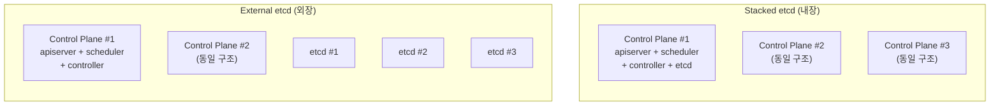

### Stacked etcd (내장)

| 장점                              | 단점                                                |
|---------------------------------|---------------------------------------------------|
| 구성이 단순하다. `kubeadm`이 기본으로 지원한다. | Control Plane 노드 장애 = etcd 멤버도 함께 손실된다.           |
| 관리할 노드 수가 적다 (별도 etcd 노드 불필요).  | etcd와 apiserver/scheduler가 CPU/메모리/디스크 I/O를 경쟁한다. |
| 비용이 절감된다 (최소 3노드).              | etcd의 디스크 성능이 다른 컴포넌트에 영향을 받는다.                   |

### External etcd (외장)

| 장점                                                             | 단점                                               |
|----------------------------------------------------------------|--------------------------------------------------|
| **장애 격리**: Control Plane 노드가 죽어도 etcd는 무사하다.                   | 관리할 노드가 증가한다 (Control Plane 3 + etcd 3 = 최소 6대). |
| **성능 최적화**: etcd 전용 SSD 디스크를 할당할 수 있다. etcd는 디스크 I/O에 매우 민감하다. | 구성이 복잡하다. 인증서 관리, 네트워크 설정이 추가된다.                 |
| **독립적 스케일링**: etcd와 Control Plane을 독립적으로 확장/교체할 수 있다.          | 비용이 증가한다.                                        |

### 프로덕션 선택 근거

- **소규모 클러스터 (노드 50대 이하, 개발/스테이징)**: Stacked etcd 추천. 관리 복잡도 대비 HA 이점이 충분하다.
- **대규모 프로덕션 클러스터 (노드 50대 이상, 미션크리티컬)**: External etcd 추천. etcd는 fsync 성능에 극도로 민감하여, 쓰기 지연이 100ms를 초과하면 리더 선출이 빈번해지고 클러스터가 불안정해진다. 전용 SSD가 필수다.
- **클라우드 매니지드 K8s (EKS, GKE, AKS)**: Control Plane 자체가 매니지드이므로 이 선택을 할 필요가 없다.

> etcd 클러스터는 Raft 합의를 위해 반드시 홀수(3, 5, 7)로 구성한다. 과반수(quorum)가 살아있어야 쓰기가 가능하므로, 3대 중 1대, 5대 중 2대까지 장애를 허용한다.

**관련 키워드:** 장애 도메인 분리, fsync 디스크 성능, Raft quorum(과반수), 독립적 스케일링, 인프라 비용 vs 안정성 트레이드오프

[공식 문서 - HA 토폴로지 옵션](https://kubernetes.io/docs/setup/production-environment/tools/kubeadm/ha-topology/)

---

## kubelet 역할과 systemd 실행 이유

### kubelet이 하는 일

1. **Pod 라이프사이클 관리**: apiserver로부터 PodSpec을 받아 CRI를 통해 컨테이너를 생성/시작/중지/삭제한다.
2. **노드 상태 보고**: 노드의 상태(CPU, 메모리, 디스크 압력, PID 압력, 네트워크 가용성, kubelet Ready 상태)를 주기적으로 apiserver에 보고한다 (기본 10초).
3. **헬스 체크 실행**: livenessProbe, readinessProbe, startupProbe를 실행하고, 결과에 따라 컨테이너를 재시작하거나 Service 엔드포인트에서 제거한다.
4. **Static Pod 관리**: `/etc/kubernetes/manifests/` 디렉토리를 감시하여 Static Pod를 직접 관리한다.
5. **볼륨 마운트**: CSI를 통해 PVC에 정의된 볼륨을 Pod에 마운트한다.
6. **리소스 관리**: cgroup을 통해 Pod의 CPU/메모리 제한을 적용하고, 리소스 초과 시 OOM Kill이나 eviction을 수행한다.
7. **이미지 관리**: CRI를 통해 컨테이너 이미지를 pull하고, 가비지 컬렉션(미사용 이미지 정리)을 수행한다.
8. **인증서 로테이션**: 자체 클라이언트 인증서를 자동으로 갱신한다 (`--rotate-certificates`).

### systemd로 실행되는 이유

kubelet은 컨테이너(Pod)로 실행할 수 없다.

1. **부트스트랩 문제 (Chicken-and-Egg)**: kubelet이 Pod를 실행하는 주체다. kubelet 자체가 Pod라면, "kubelet Pod를 실행할 kubelet"이 필요한 순환 의존이 발생한다.
2. **컨테이너 런타임 직접 접근**: kubelet은 CRI(containerd/CRI-O)를 직접 호출하여 컨테이너를 관리한다. 컨테이너 안에서 컨테이너 런타임을 제어하면 보안/격리/권한 문제가 심각해진다(DinD 문제).
3. **호스트 리소스 전체 접근**: kubelet은 호스트의 cgroup, 네트워크 네임스페이스, 디바이스, 마운트 포인트 등에 직접 접근해야 한다.
4. **장애 복구의 독립성**: 컨테이너 런타임이 crash해도 kubelet이 이를 감지하고 복구할 수 있어야 한다.
5. **systemd의 프로세스 관리**: systemd가 kubelet 프로세스를 감시하고, crash 시 자동 재시작(`Restart=always`)을 보장한다.

```bash
# kubelet systemd 서비스 상태 확인
systemctl status kubelet

# kubelet 설정 파일
cat /var/lib/kubelet/config.yaml

# kubelet 서비스 파일 위치
cat /etc/systemd/system/kubelet.service.d/10-kubeadm.conf
```

**관련 키워드:** CRI(Container Runtime Interface), 부트스트랩(Chicken-and-Egg), cgroup 관리, 호스트 리소스 접근, systemd Restart=always

[공식 문서 - kubelet](https://kubernetes.io/docs/reference/command-line-tools-reference/kubelet/)

---

## 클러스터 업그레이드 절차

### 업그레이드 원칙

- **한 번에 하나의 마이너 버전만** 업그레이드한다 (예: 1.29 -> 1.30, 1.29 -> 1.31 불가).
- **Control Plane을 먼저**, 그 다음 Worker 노드를 업그레이드한다.
- kubelet/kubectl은 apiserver보다 **최대 2 마이너 버전 낮은 것**까지 허용된다 (Version Skew Policy).

### Phase 1 - 첫 번째 Control Plane 노드

```bash
# 1. 업그레이드 가능 버전 확인
apt update
apt-cache madison kubeadm

# 2. kubeadm 업그레이드
apt-mark unhold kubeadm
apt-get install -y kubeadm=1.30.0-1.1
apt-mark hold kubeadm

# 3. 업그레이드 계획 확인 (dry-run)
kubeadm upgrade plan

# 4. 업그레이드 적용 (첫 번째 CP만 apply)
kubeadm upgrade apply v1.30.0

# 5. 노드 drain
kubectl drain <cp-node> --ignore-daemonsets --delete-emptydir-data

# 6. kubelet, kubectl 업그레이드
apt-mark unhold kubelet kubectl
apt-get install -y kubelet=1.30.0-1.1 kubectl=1.30.0-1.1
apt-mark hold kubelet kubectl

# 7. kubelet 재시작
sudo systemctl daemon-reload
sudo systemctl restart kubelet

# 8. 노드 uncordon
kubectl uncordon <cp-node>
```

### Phase 2 - 나머지 Control Plane 노드

```bash
# 다른 CP 노드에서는 apply 대신 node 사용
kubeadm upgrade node

# 이후 동일하게 drain -> kubelet/kubectl 업그레이드 -> restart -> uncordon
```

### Phase 3 - Worker 노드

```bash
# 1. kubeadm 업그레이드
apt-mark unhold kubeadm
apt-get install -y kubeadm=1.30.0-1.1
apt-mark hold kubeadm

# 2. 노드 설정 업그레이드
kubeadm upgrade node

# 3. 워커 노드 drain (Control Plane에서 실행)
kubectl drain <worker-node> --ignore-daemonsets --delete-emptydir-data

# 4. kubelet 업그레이드
apt-mark unhold kubelet kubectl
apt-get install -y kubelet=1.30.0-1.1 kubectl=1.30.0-1.1
apt-mark hold kubelet kubectl

# 5. kubelet 재시작
sudo systemctl daemon-reload
sudo systemctl restart kubelet

# 6. uncordon
kubectl uncordon <worker-node>
```

### 서비스 중단 최소화 방법

1. **PodDisruptionBudget(PDB) 설정**: drain 시 PDB를 준수하므로, 최소 가용 Pod 수를 보장한다.

```yaml
apiVersion: policy/v1
kind: PodDisruptionBudget
metadata:
  name: my-app-pdb
spec:
  minAvailable: 2
  selector:
    matchLabels:
      app: my-app
```

2. **Pod Anti-Affinity**: 동일 Deployment의 Pod가 같은 노드에 몰리지 않도록 분산 배치한다.
3. **Rolling 방식으로 Worker 노드를 하나씩 업그레이드**: 동시에 여러 노드를 drain하면 서비스 중단 위험이 커진다.
4. **Graceful Shutdown 설정**: `terminationGracePeriodSeconds`를 충분히 설정하여 진행 중인 요청이 완료될 시간을 확보한다.
5. **충분한 replicas 확보**: 최소 2개 이상의 replicas를 운영한다.
6. **업그레이드 전 etcd 백업**: 문제 발생 시 롤백을 위한 안전장치다.

**관련 키워드:** Version Skew Policy, kubeadm upgrade apply vs node, drain/uncordon, PodDisruptionBudget, 마이너 버전 단위 업그레이드

[공식 문서 - 클러스터 업그레이드](https://kubernetes.io/docs/tasks/administer-cluster/kubeadm/kubeadm-upgrade/)

---

## 마무리 정리

| 주제                       | 주요 키워드                                                          |
|--------------------------|-----------------------------------------------------------------|
| Control Plane 컴포넌트       | Reconciliation Loop, 선언적 모델, Raft 합의, Watch                     |
| kubectl apply 흐름         | 7단계, Mutating -> Validating, Filtering -> Scoring -> Binding    |
| etcd 저장/장애               | Protobuf, /registry/ key, Data Plane 독립 동작, Control Plane 기능 중단 |
| --control-plane-endpoint | HA 전제 조건, LB VIP, 사후 변경 불가                                      |
| 인증서 만료                   | 기본 1년/CA 10년, x509 expired, kubeadm certs renew all             |
| etcd 백업                  | ETCDCTL_API=3, snapshot save/restore, mTLS, 3개 인증서              |
| Static Pod               | /etc/kubernetes/manifests/, Mirror Pod, Chicken-and-Egg 문제      |
| etcd stacked vs external | 장애 도메인 분리, fsync 민감, Raft quorum 홀수                             |
| kubelet                  | CRI, systemd, 부트스트랩 문제, 8가지 역할                                  |
| 클러스터 업그레이드               | Version Skew Policy, apply vs node, drain/uncordon, PDB         |

---

# 02. Pod와 Workload

Pod는 Kubernetes에서 배포 가능한 가장 작은 단위이며, 모든 워크로드의 기반이다. Pod 내부의 리소스 공유 구조, Deployment/StatefulSet/DaemonSet의 차이, 롤링 업데이트 전략, Probe 설정, Graceful Shutdown, QoS 분류까지 이해해야 프로덕션 환경에서 안정적인 워크로드를 운영할 수 있다.

---

## Pod 내 컨테이너 공유 리소스

Pod 안에 컨테이너가 2개 있을 때, 공유하는 것과 공유하지 않는 것을 정확히 구분해야 한다.

### 공유하는 것

1. **네트워크 네임스페이스 (Network Namespace)**: 같은 Pod 내 모든 컨테이너는 동일한 IP 주소와 포트 공간을 공유한다. 컨테이너 A에서 컨테이너 B로 통신할 때 `localhost:PORT`를 사용한다. 이것이 가능한 이유는 Pod 생성 시 `pause` 컨테이너(인프라 컨테이너)가 먼저 생성되어 네트워크 네임스페이스를 소유하고, 다른 컨테이너들이 이 네임스페이스에 합류(join)하는 구조이기 때문이다.

2. **스토리지 볼륨 (Volumes)**: Pod spec에 정의된 볼륨을 여러 컨테이너가 각각 마운트하여 파일을 공유할 수 있다. `emptyDir`을 사용하면 사이드카 패턴에서 로그 수집, 설정 파일 공유, 캐시 공유, 임시 데이터 전달, 소켓 파일 공유가 가능하다.

추가로 공유되는 것: IPC 네임스페이스(POSIX 메시지 큐, 공유 메모리(shm), 세마포어), UTS 네임스페이스(hostname), 그리고 `shareProcessNamespace: true` 설정 시 PID 네임스페이스도 공유된다.

### 공유하지 않는 것

1. **파일시스템 (루트 파일시스템)**: 각 컨테이너는 독립된 컨테이너 이미지로부터 자신만의 루트 파일시스템을 가진다. 볼륨으로 명시적으로 마운트하지 않는 한, 컨테이너 A의 파일을 컨테이너 B에서 접근할 수 없다.

그 외: PID 네임스페이스(기본값, `shareProcessNamespace: true`로 변경 가능), CPU/메모리 리소스 제한(컨테이너별로 독립 설정)도 공유하지 않는다.

```yaml
# 볼륨 공유 예시 - 사이드카 로그 수집 패턴
apiVersion: v1
kind: Pod
metadata:
  name: shared-volume-example
spec:
  containers:
    - name: app
      image: my-app:latest
      volumeMounts:
        - name: shared-logs
          mountPath: /var/log/app
    - name: log-collector
      image: fluentbit:latest
      volumeMounts:
        - name: shared-logs
          mountPath: /var/log/app
          readOnly: true
  volumes:
    - name: shared-logs
      emptyDir: { }
```

**관련 키워드:** Network Namespace, pause 컨테이너(인프라 컨테이너), localhost 통신, emptyDir 볼륨 공유, 독립 파일시스템

[공식 문서 - Pod에서 여러 컨테이너 관리](https://kubernetes.io/docs/concepts/workloads/pods/#how-pods-manage-multiple-containers)

---

## Deployment vs StatefulSet

### 주요 차이

| 구분           | Deployment                       | StatefulSet                                                                         |
|--------------|----------------------------------|-------------------------------------------------------------------------------------|
| **Pod 이름**   | 랜덤 해시 (예: `web-5d8c6f9b7-abc12`) | 순서 기반 고정 (예: `kafka-0`, `kafka-1`, `kafka-2`)                                       |
| **생성/삭제 순서** | 병렬 (동시 생성/삭제)                    | 순차적 (0->1->2 생성, 2->1->0 삭제)                                                        |
| **스토리지**     | Pod 재생성 시 PVC 재연결 보장 안됨          | `volumeClaimTemplates`로 Pod마다 고유 PVC가 생성되고, Pod 재생성 시 동일 PVC에 재연결                   |
| **네트워크 ID**  | 매번 새 IP 할당                       | Headless Service와 조합하여 고정 DNS 제공 (예: `kafka-0.kafka-headless.ns.svc.cluster.local`) |
| **롤링 업데이트**  | 새 ReplicaSet 생성 후 전환             | 역순(N->0)으로 하나씩 업데이트                                                                 |

### Kafka/Redis에 StatefulSet을 쓰는 이유

1. **안정적 네트워크 식별자**: Kafka 브로커는 서로를 `broker.id`와 호스트네임으로 식별한다. Pod가 재시작되어도 `kafka-0`, `kafka-1` 같은 고정 호스트네임이 유지되어야 클러스터 멤버십이 깨지지 않는다. Deployment로 배포하면 Pod 재생성 시 새 이름과 IP를 받아 브로커 간 통신이 끊어진다.

2. **영속 스토리지 바인딩**: Kafka의 로그 세그먼트, Redis의 RDB/AOF 파일은 특정 Pod에 귀속된 데이터다. `volumeClaimTemplates`로 `kafka-0`은 항상 `data-kafka-0` PVC를, `kafka-1`은 `data-kafka-1` PVC를 사용하므로, Pod가 재생성되어도 기존 데이터에 접근할 수 있다.

3. **순서 보장**: Kafka 클러스터 초기 구성 시 브로커 0이 먼저 시작되어 컨트롤러 역할을 수행해야 한다. StatefulSet의 순차 생성이 이를 보장한다.

```yaml
apiVersion: apps/v1
kind: StatefulSet
metadata:
  name: kafka
spec:
  serviceName: kafka-headless  # Headless Service 연결 필수
  replicas: 3
  selector:
    matchLabels:
      app: kafka
  template:
    metadata:
      labels:
        app: kafka
    spec:
      containers:
        - name: kafka
          image: confluentinc/cp-kafka:7.6.1
          volumeMounts:
            - name: data
              mountPath: /var/lib/kafka/data
  volumeClaimTemplates: # Pod마다 고유 PVC 자동 생성
    - metadata:
        name: data
      spec:
        accessModes: [ "ReadWriteOnce" ]
        resources:
          requests:
            storage: 100Gi
---
apiVersion: v1
kind: Service
metadata:
  name: kafka-headless
spec:
  clusterIP: None          # Headless Service
  selector:
    app: kafka
  ports:
    - port: 9092
```

**관련 키워드:** 순서 기반 고정 이름, volumeClaimTemplates, Headless Service, 안정적 네트워크 식별자, 순차 생성/삭제

[공식 문서 - StatefulSet](https://kubernetes.io/docs/concepts/workloads/controllers/statefulset/)

---

## RollingUpdate 최대/최소 Pod 수

replicas=3, maxSurge=1, maxUnavailable=1일 때의 계산이다.

### 계산 공식

- **최대 Pod 수** = replicas + maxSurge = 3 + 1 = **4개**
- **최소 가용 Pod 수** = replicas - maxUnavailable = 3 - 1 = **2개**

### 용어 정의

- `maxSurge`: desired 수 대비 추가로 생성할 수 있는 Pod의 최대 수. 새 버전 Pod를 미리 띄워놓아 전환 속도를 높인다.
- `maxUnavailable`: desired 수 대비 사용 불가능할 수 있는 Pod의 최대 수. 이 수만큼 기존 Pod를 먼저 종료하여 리소스를 확보한다.

### 롤링 업데이트 진행 과정

```text
시점 1 (업데이트 시작 직전):
  Old: [Running] [Running] [Running]  (3개 Running)
  New: (없음)
  총: 3개

시점 2 (업데이트 시작):
  - maxSurge=1이므로 새 Pod 1개 추가 생성 가능
  - maxUnavailable=1이므로 기존 Pod 1개 종료 가능
  Old: [Running] [Running] [Terminating]  (2개 Running, 1개 Terminating)
  New: [Creating]                          (1개 생성 중)
  총: 최대 4개

시점 3 (진행 중):
  Old: [Running] [Terminating]
  New: [Running] [Creating]
  가용: 2개 이상 유지

시점 4 (완료):
  Old: (없음)
  New: [Running] [Running] [Running]  (3개 Running)
  총: 3개
```

### 실무 가이드

| 전략            | maxSurge | maxUnavailable | 특성                             |
|---------------|----------|----------------|--------------------------------|
| 안정 우선         | 1        | 0              | 항상 3개 이상 가용. 리소스 여유 필요. 속도 느림. |
| 속도 우선         | 25%      | 25%            | 빠른 전환. 일시적 가용성 저하 가능.          |
| 균형            | 1        | 1              | 속도와 안정성 절충. 가장 흔한 설정.          |
| Blue-Green 유사 | 100%     | 0              | 새 Pod 전부 준비 후 전환. 리소스 2배 필요.   |

> 기억해야할 점: `maxUnavailable=0`이면 새 Pod가 Ready 상태가 될 때까지 기존 Pod를 절대 종료하지 않으므로 **무중단 배포**가 보장된다. 단, 일시적으로 replicas + maxSurge만큼의 리소스가 필요하다.

**관련 키워드:** maxSurge(추가 생성 허용), maxUnavailable(동시 제거 허용), 최대=replicas+maxSurge, 최소가용=replicas-maxUnavailable

[공식 문서 - Rolling Update Deployment](https://kubernetes.io/docs/concepts/workloads/controllers/deployment/#rolling-update-deployment)

---

## CrashLoopBackOff 원인 파악

### CrashLoopBackOff의 의미

컨테이너가 시작 후 비정상 종료(crash)를 반복하고 있으며, kubelet이 **지수 백오프(Exponential Backoff)**를 적용하여 재시작 간격을 점점 늘리고 있는 상태다. 재시작 간격은 10초 -> 20초 -> 40초 -> ... -> **최대 5분**까지 증가한다.

### 원인 파악 명령어 (순서대로)

```bash
# 1. Pod 상태 및 이벤트 확인 (가장 먼저 실행)
kubectl describe pod <pod-name> -n <namespace>
# -> Events 섹션에서 OOMKilled, FailedScheduling, ImagePullBackOff 등 확인
# -> Last State에서 Exit Code 확인 (0: 정상종료, 1: 앱에러, 137: OOMKilled/SIGKILL, 139: SIGSEGV)

# 2. 현재 컨테이너 로그 확인
kubectl logs <pod-name> -n <namespace> -c <container-name>
# -> 애플리케이션 레벨 에러 메시지 확인

# 3. 이전(crash한) 컨테이너 로그 확인
kubectl logs <pod-name> -n <namespace> -c <container-name> --previous
# -> 현재 로그가 비어있을 때, 직전 crash한 컨테이너의 로그를 볼 수 있다

# 4. Pod YAML 확인 (설정 오류 점검)
kubectl get pod <pod-name> -n <namespace> -o yaml
# -> command/args 오타, env 누락, 리소스 제한, 볼륨 마운트 경로 등 확인

# 5. 이벤트 전체 확인 (네임스페이스 레벨)
kubectl get events -n <namespace> --sort-by='.lastTimestamp'
# -> Pod 외부 요인(PVC 바인딩 실패, ConfigMap 누락, Secret 누락 등) 확인

# 6. 디버깅용 임시 컨테이너 (K8s 1.25+)
kubectl debug <pod-name> -it --image=busybox --target=<container-name>
# -> 실행 중인 컨테이너에 접근하여 파일시스템, 네트워크 등 직접 점검
```

### 주요 원인 분류

| Exit Code | 원인                                                | 확인 방법                                    |
|-----------|---------------------------------------------------|------------------------------------------|
| 1         | 애플리케이션 에러 (설정 파일 없음, DB 연결 실패, 포트 충돌, 환경 변수 누락 등) | `kubectl logs --previous`                |
| 137       | OOMKilled (메모리 초과) 또는 외부 SIGKILL                  | `describe pod` -> Last State: OOMKilled  |
| 139       | Segmentation Fault                                | `kubectl logs --previous`                |
| 126       | Command 실행 권한 없음                                  | Dockerfile ENTRYPOINT/CMD 확인             |
| 127       | Command not found                                 | 이미지 내 바이너리 존재 여부 확인                      |
| 0         | 정상 종료 후 반복 재시작                                    | 서버가 아닌 one-shot 프로세스를 Deployment로 실행한 경우 |

**관련 키워드:** Exponential Backoff(10s->5분), Exit Code(137=OOMKilled), `--previous` 플래그, describe Events 섹션

[공식 문서 - Pod 디버깅](https://kubernetes.io/docs/tasks/debug/debug-application/debug-pods/)

---

## Pod Pending 원인 5가지

Pod가 Pending인 것은 스케줄러가 Pod를 어떤 노드에도 배치하지 못했거나, 배치 전 준비 단계에서 막혀있다는 의미다.

### 1. 리소스 부족 (Insufficient CPU/Memory)

```bash
kubectl describe pod <pod-name>
# Events: "0/3 nodes are available: 3 Insufficient cpu"

kubectl top nodes
kubectl describe node <node-name> | grep -A5 "Allocated resources"
```

### 2. Node Selector / Node Affinity / Taints 불일치

```bash
kubectl get pod <pod-name> -o yaml | grep -A10 nodeSelector
kubectl get pod <pod-name> -o yaml | grep -A20 affinity

kubectl get nodes --show-labels
kubectl describe node <node-name> | grep -A5 Taints
# Events: "0/3 nodes are available: 3 node(s) had taint {key: NoSchedule}"
```

### 3. PVC 바인딩 실패 (PersistentVolumeClaim Pending)

```bash
kubectl get pvc -n <namespace>
# STATUS가 Pending이면 PV가 없거나 StorageClass가 잘못된 것

kubectl describe pvc <pvc-name>
# Events: "no persistent volumes available for this claim"

kubectl get sc
```

### 4. 이미지 Pull 실패 (ImagePullBackOff)

```bash
kubectl describe pod <pod-name>
# Events: "Failed to pull image ... : rpc error: code = NotFound"
# 또는 "unauthorized: authentication required" (Private Registry 인증 실패)

kubectl get pod <pod-name> -o yaml | grep -A5 imagePullSecrets
```

> ImagePullBackOff 시 Pod 상태는 보통 Pending이 아니라 `ErrImagePull` -> `ImagePullBackOff`로 표시되지만, 초기 이미지 pull 단계에서는 Pending으로 보일 수 있다.

### 5. ResourceQuota/LimitRange 초과

```bash
kubectl get resourcequota -n <namespace>
kubectl describe resourcequota -n <namespace>
# Used vs Hard 비교

kubectl get limitrange -n <namespace>
kubectl describe limitrange -n <namespace>
# Events: "exceeded quota: ... requested: cpu=500m, used: cpu=1900m, limited: cpu=2"
```

### 추가 원인

- **스케줄러 미동작**: kube-scheduler Pod가 crash한 경우
- **Pod Priority / Preemption**: 우선순위가 낮은 Pod가 높은 Pod에게 자리를 양보하여 Pending 상태로 대기
- **Pod Topology Spread Constraints**: 분산 조건을 만족하는 노드가 없는 경우

**관련 키워드:** Insufficient resources, Taint/Toleration 불일치, PVC Pending, ImagePullBackOff, ResourceQuota 초과

[공식 문서 - Pod가 Pending 상태인 경우](https://kubernetes.io/docs/tasks/debug/debug-application/debug-pods/#my-pod-stays-pending)

---

## initContainer

### 정의

initContainer는 Pod의 메인 컨테이너(app container)가 시작되기 **전에** 실행되는 특수 컨테이너다. 초기화 작업(의존 서비스 대기, 설정 파일 생성, DB 스키마 마이그레이션, 인증서/시크릿 주입, 볼륨 권한 변경, 외부 API 헬스체크)을 수행하며, 모든 initContainer가 성공적으로 완료(Exit 0)되어야 메인 컨테이너가 시작된다.

### 실행 순서 차이

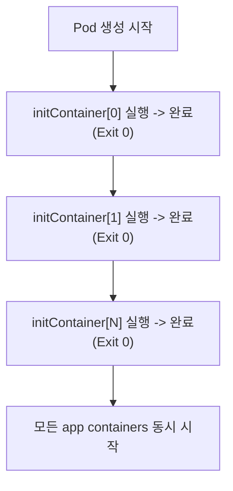

| 구분    | initContainer                                                   | 일반 container            |
|-------|-----------------------------------------------------------------|-------------------------|
| 실행 시점 | 메인 컨테이너 **이전**                                                  | initContainer 완료 **이후** |
| 실행 방식 | **순차적** (하나씩, 이전 것이 완료되어야 다음 실행)                                | **동시** (병렬 시작)          |
| 완료 조건 | 반드시 **종료(Exit 0)**되어야 함                                         | 계속 실행 (long-running)    |
| 실패 시  | Pod 전체가 재시작됨 (restartPolicy에 따라)                                | 해당 컨테이너만 재시작            |
| Probe | livenessProbe/readinessProbe 미지원 (K8s 1.28+에서 startupProbe만 지원) | 모든 Probe 지원             |

### 사용 사례 1 - 의존 서비스 대기

```yaml
apiVersion: v1
kind: Pod
metadata:
  name: my-app
spec:
  initContainers:
    - name: wait-for-db
      image: busybox:1.36
      command:
        - sh
        - -c
        - |
          until nc -z postgres-svc.default.svc.cluster.local 5432; do
            echo "Waiting for PostgreSQL..."
            sleep 2
          done
          echo "PostgreSQL is ready!"
  containers:
    - name: app
      image: my-app:latest
```

> DB가 준비되기 전에 앱이 시작되면 연결 에러로 CrashLoopBackOff에 빠진다. initContainer로 DB 가용성을 먼저 확인하면 이를 방지할 수 있다.

### 사용 사례 2 - 설정 파일/데이터 사전 준비

```yaml
apiVersion: v1
kind: Pod
metadata:
  name: nginx-with-config
spec:
  initContainers:
    - name: fetch-config
      image: curlimages/curl:latest
      command:
        - sh
        - -c
        - |
          curl -o /config/nginx.conf https://config-server.internal/nginx.conf
          curl -o /config/certs.pem https://vault.internal/v1/pki/issue/web
      volumeMounts:
        - name: config-volume
          mountPath: /config
  containers:
    - name: nginx
      image: nginx:1.25
      volumeMounts:
        - name: config-volume
          mountPath: /etc/nginx
          readOnly: true
  volumes:
    - name: config-volume
      emptyDir: { }
```

> 외부 설정 서버나 Vault에서 설정/인증서를 다운로드한 후, emptyDir 볼륨을 통해 메인 컨테이너에 전달한다. 메인 컨테이너 이미지에 curl 같은 도구를 포함할 필요가 없다 (이미지 경량화).

**기타 사용 사례:** DB 스키마 마이그레이션 (flyway/liquibase 실행), 파일 권한 변경 (SecurityContext 제약 우회), Git clone으로 소스 코드 준비

**관련 키워드:** 순차 실행 -> 완료 필수 -> 메인 컨테이너 시작, 의존 서비스 대기, 설정 사전 준비, emptyDir 공유

[공식 문서 - Init Containers](https://kubernetes.io/docs/concepts/workloads/pods/init-containers/)

---

## Running인데 Endpoints가 none

### 근본 원인

Service의 `spec.selector`와 Pod의 `metadata.labels`가 **일치하지 않는다.** Kubernetes의 Endpoints Controller는 Service의 selector와 일치하는 label을 가진 Pod를 찾아 Endpoints 오브젝트에 등록한다. 매칭되는 Pod가 없으면 Endpoints는 비어있다.

### 원인 파악 및 해결 절차

```bash
# 1단계: Service의 selector 확인
kubectl get svc <svc-name> -o yaml | grep -A5 selector
# 예: selector:
#       app: my-app
#       version: v2

# 2단계: Pod의 label 확인
kubectl get pods --show-labels
# 예: my-pod   Running   app=my-app,version=v1  <- v2가 아니라 v1!

# 3단계: selector로 직접 Pod 검색 (매칭 테스트)
kubectl get pods -l app=my-app,version=v2
# No resources found -> 매칭되는 Pod가 없음을 확인
```

### 가능한 원인 상세

| 원인                    | 확인 방법                                       | 해결                                                      |
|-----------------------|---------------------------------------------|---------------------------------------------------------|
| **Label 불일치 (가장 흔함)** | Service selector와 Pod labels 비교             | Pod label 수정 또는 Service selector 수정                     |
| **Pod가 Ready가 아님**    | `kubectl get pods` -> READY 컬럼 확인 (0/1)     | readinessProbe 실패 원인 해결. Ready가 아닌 Pod는 Endpoints에서 제외됨 |
| **네임스페이스 불일치**        | Service와 Pod가 같은 네임스페이스인지 확인                | 같은 네임스페이스에 배치하거나 ExternalName Service 사용                |
| **targetPort 불일치**    | Service의 targetPort와 컨테이너의 containerPort 비교 | 포트 번호 일치시킴                                              |

```bash
# 전체 디버깅 플로우
kubectl get endpoints <svc-name>
kubectl describe svc <svc-name>
kubectl get svc <svc-name> -o jsonpath='{.spec.selector}'
kubectl get pods -l <selector-key>=<selector-value>
kubectl get pods -o wide
kubectl describe pod <pod-name> | grep -A10 "Conditions"
kubectl get svc <svc-name> -o jsonpath='{.spec.ports[*].targetPort}'
kubectl get pod <pod-name> -o jsonpath='{.spec.containers[*].ports[*].containerPort}'
```

> 기억해야할 점: Deployment를 통해 Pod를 관리하는 경우, Pod의 label을 직접 수정하면 Deployment와의 연결이 끊어질 수 있다. Deployment의 template labels와 Service selector를 동시에 확인하는 것이 올바른 접근이다.

**관련 키워드:** Label Selector 불일치, Endpoints Controller, readinessProbe 실패 시 Endpoints 제외, targetPort vs containerPort

[공식 문서 - Service 디버깅](https://kubernetes.io/docs/tasks/debug/debug-application/debug-service/)

---

## livenessProbe vs readinessProbe vs startupProbe

### 3가지 Probe 비교

| Probe              | 목적                         | 실패 시 행동                                                   | 검사 시작 시점          |
|--------------------|----------------------------|-----------------------------------------------------------|-------------------|
| **startupProbe**   | 컨테이너가 **시작 완료**되었는지 확인     | `failureThreshold` 횟수 초과 시 **컨테이너 Kill + 재시작**            | 컨테이너 시작 직후        |
| **livenessProbe**  | 컨테이너가 **살아있는지** (교착상태 감지)  | 실패 시 **컨테이너 Kill + 재시작** (restartPolicy 적용)               | startupProbe 성공 후 |
| **readinessProbe** | 컨테이너가 **트래픽을 받을 준비**가 되었는지 | 실패 시 **Service의 Endpoints에서 제거** (트래픽 차단). 컨테이너는 재시작하지 않음 | startupProbe 성공 후 |

### livenessProbe

"이 컨테이너가 정상 동작하고 있는가?"를 판단한다. 애플리케이션이 데드락에 빠지거나 무한루프에 걸려 응답할 수 없는 상태를 감지한다. 실패 시 kubelet이 컨테이너를 kill하고 재시작한다.

**주의:** livenessProbe를 너무 민감하게 설정하면 정상 컨테이너가 불필요하게 재시작된다.

### readinessProbe

"이 컨테이너가 요청을 처리할 수 있는 상태인가?"를 판단한다. 실패 시 Service의 Endpoints에서 해당 Pod의 IP를 제거하여 트래픽이 가지 않도록 한다. 컨테이너는 재시작하지 않는다. 일시적 부하(DB 연결 풀 소진, 캐시 워밍업 중, 외부 의존 서비스 일시 장애)로 요청을 처리할 수 없을 때, 트래픽만 차단하고 복구를 기다린다.

### startupProbe가 필요한 이유

기동 시간이 긴 애플리케이션(Java/Spring Boot, .NET, Elasticsearch, Kafka Connect, Keycloak)에서 livenessProbe의 `initialDelaySeconds`를 너무 크게 설정하면, 정상 실행 중에도 장애 감지가 늦어진다. startupProbe가 성공할 때까지 livenessProbe와 readinessProbe가 비활성화된다. 이를 통해 기동 시간에는 충분한 여유를 주면서도, 기동 완료 후에는 빠르게 장애를 감지할 수 있다.

```yaml
apiVersion: v1
kind: Pod
metadata:
  name: my-app
spec:
  containers:
    - name: app
      image: my-app:latest
      ports:
        - containerPort: 8080
      startupProbe: # 기동 완료 확인 (최대 300초 = 10 * 30)
        httpGet:
          path: /healthz
          port: 8080
        failureThreshold: 30
        periodSeconds: 10
      livenessProbe: # 기동 후 생존 확인
        httpGet:
          path: /healthz
          port: 8080
        periodSeconds: 10
        failureThreshold: 3
      readinessProbe: # 트래픽 수신 가능 여부
        httpGet:
          path: /ready
          port: 8080
        periodSeconds: 5
        failureThreshold: 3
```

### Probe 방식 3가지

| 방식          | 설명                           | 사용 예                  |
|-------------|------------------------------|-----------------------|
| `httpGet`   | HTTP GET 요청, 200~399 응답이면 성공 | 웹 서버 `/healthz` 엔드포인트 |
| `tcpSocket` | TCP 연결 시도, 연결되면 성공           | Redis, DB 등 포트 오픈 확인  |
| `exec`      | 컨테이너 내 명령 실행, Exit 0이면 성공    | 커스텀 헬스체크 스크립트         |

**관련 키워드:** liveness 실패->재시작, readiness 실패->Endpoints 제거(트래픽 차단), startupProbe->기동 중 liveness/readiness 비활성화

[공식 문서 - Probe 설정](https://kubernetes.io/docs/tasks/configure-pod-container/configure-liveness-readiness-startup-probes/)

---

## Graceful Shutdown 설정

### Pod 종료 과정 전체 흐름

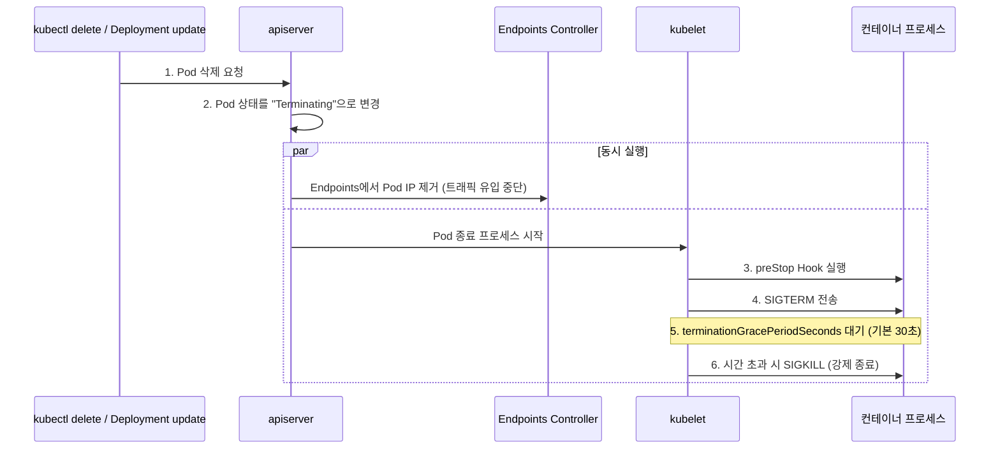

### 주요 설정

```yaml
apiVersion: v1
kind: Pod
metadata:
  name: graceful-app
spec:
  terminationGracePeriodSeconds: 60  # SIGTERM 후 최대 대기 시간 (기본값: 30초)
  containers:
    - name: app
      image: my-app:latest
      lifecycle:
        preStop: # SIGTERM 전에 실행되는 Hook
          exec:
            command:
              - sh
              - -c
              - |
                # 진행 중인 요청 완료 대기
                sleep 5
                # 또는 앱에 graceful shutdown 시그널 전송
                curl -X POST http://localhost:8080/shutdown
```

### SIGTERM 후 미종료 시

kubelet이 **SIGKILL**을 전송한다. SIGKILL은 프로세스가 catch할 수 없는 시그널이므로 즉시 강제 종료된다. 진행 중이던 요청은 중단되고, 트랜잭션이 진행 중이었다면 롤백되지 않고 중단될 수 있다 (데이터 정합성 위험).

### 실무에서 제대로 동작하지 않는 이유와 해결

**문제 1: Endpoints 제거와 SIGTERM의 Race Condition**

Endpoints 제거와 SIGTERM 전송이 비동기로 동시에 진행되므로, SIGTERM을 받은 후에도 잠시 동안 새 요청이 들어올 수 있다.

**해결: preStop hook에 sleep 추가**

```yaml
lifecycle:
  preStop:
    exec:
      command: [ "sleep", "5" ]  # Endpoints 제거가 전파될 시간 확보
```

**문제 2: 앱이 SIGTERM을 처리하지 않음**

컨테이너의 PID 1 프로세스가 쉘 스크립트(`/bin/sh -c`)인 경우, SIGTERM이 자식 프로세스(실제 앱)에 전달되지 않는다.

**해결: exec form 사용 또는 tini 사용**

```dockerfile
# BAD: shell form - SIGTERM이 앱에 전달 안됨
CMD node server.js

# GOOD: exec form - 앱이 PID 1으로 직접 실행
CMD ["node", "server.js"]

# GOOD: tini를 init process로 사용
ENTRYPOINT ["/tini", "--"]
CMD ["node", "server.js"]
```

**관련 키워드:** terminationGracePeriodSeconds, SIGTERM -> SIGKILL 순서, preStop Hook, Endpoints 제거 Race Condition, PID 1 시그널 전달

[공식 문서 - Pod 종료](https://kubernetes.io/docs/concepts/workloads/pods/pod-lifecycle/#pod-termination)

---

## QoS Class 3가지와 Eviction 순서

### QoS Class 결정 조건

| QoS Class      | 결정 조건                                                                            | 설명                                          |
|----------------|----------------------------------------------------------------------------------|---------------------------------------------|
| **Guaranteed** | Pod 내 모든 컨테이너에 requests와 limits가 설정되어 있고, 각각의 CPU/Memory에서 **requests = limits** | 가장 높은 우선순위. 리소스가 보장된다.                      |
| **Burstable**  | Guaranteed 조건을 충족하지 않지만, 최소 하나의 컨테이너에 requests 또는 limits가 설정되어 있음                | 중간 우선순위. requests까지는 보장, limits까지 burst 가능. |
| **BestEffort** | Pod 내 어떤 컨테이너에도 requests/limits가 설정되어 있지 않음                                      | 가장 낮은 우선순위. 가장 먼저 evict된다.                  |

```yaml
# Guaranteed 예시
containers:
  - name: app
    resources:
      requests:
        cpu: "500m"
        memory: "256Mi"
      limits:
        cpu: "500m"       # requests == limits
        memory: "256Mi"   # requests == limits

# Burstable 예시
containers:
  - name: app
    resources:
      requests:
        cpu: "250m"
        memory: "128Mi"
      limits:
        cpu: "500m"       # requests != limits
        memory: "512Mi"

# BestEffort 예시
containers:
  - name: app
    image: nginx          # resources 섹션 없음
```

### 메모리 압박 시 Eviction 순서

kubelet은 노드 리소스가 eviction threshold(기본: `memory.available < 100Mi`)에 도달하면 Pod를 축출한다.

```text
Eviction 우선순위 (먼저 축출되는 순서):

1위: BestEffort
  - requests가 없으므로 가장 먼저 제거
  - 같은 BestEffort 내에서는 메모리 사용량이 많은 Pod 먼저

2위: Burstable
  - requests 대비 실제 사용량의 비율이 높은 Pod 먼저
  - 예: requests=256Mi인데 512Mi 사용 중 -> 200% 초과 -> 우선 축출

3위: Guaranteed
  - 마지막에 축출됨
  - limits = requests이므로 초과 사용 자체가 불가능
  - 다른 QoS Pod가 모두 축출된 후에야 대상이 됨
```

### Eviction 상세 메커니즘

```text
[노드 메모리 상태]
  memory.available > eviction-hard threshold -> 정상
  memory.available < eviction-soft threshold -> grace period 동안 대기 후 eviction 시작
  memory.available < eviction-hard threshold (기본: 100Mi) -> 즉시 eviction 시작
```

```bash
# 노드의 eviction threshold 확인
kubectl describe node <node-name> | grep -A10 "Conditions"
# MemoryPressure: True/False

# kubelet 설정에서 eviction threshold 확인
cat /var/lib/kubelet/config.yaml | grep -A5 eviction
# evictionHard:
#   memory.available: "100Mi"
#   nodefs.available: "10%"
#   imagefs.available: "15%"
```

### 실무 권장

- 프로덕션 워크로드는 반드시 Guaranteed 또는 Burstable(requests 필수)로 설정한다.
- BestEffort는 개발/테스트 환경에서만 사용한다.
- `requests`는 실제 평균 사용량 기반, `limits`는 피크 사용량 기반으로 설정한다.
- LimitRange를 네임스페이스에 설정하여 requests/limits 누락을 방지한다.

**관련 키워드:** requests=limits -> Guaranteed, 하나라도 설정 -> Burstable, 미설정 -> BestEffort, eviction 순서 BestEffort->Burstable->Guaranteed, OOM Score

[공식 문서 - QoS Class](https://kubernetes.io/docs/tasks/configure-pod-container/quality-service-pod/)

---

## PodDisruptionBudget (PDB)

### 정의

PodDisruptionBudget(PDB)은 **자발적 중단(Voluntary Disruption)** 시 동시에 중단될 수 있는 Pod의 수를 제한하는 정책 오브젝트다. `kubectl drain`, 클러스터 업그레이드, 오토스케일러의 노드 축소 등에서 PDB를 준수하여 최소 가용성을 보장한다.

### 자발적 중단 vs 비자발적 중단

| 자발적 중단 (PDB 적용됨)                                     | 비자발적 중단 (PDB 적용 안됨) |
|------------------------------------------------------|---------------------|
| `kubectl drain`                                      | 하드웨어 장애             |
| 노드 업그레이드                                             | OOM Kill            |
| Cluster Autoscaler 노드 축소                             | 커널 패닉               |
| Deployment 롤링 업데이트는 PDB 대상 아님 (자체 maxUnavailable 사용) | 네트워크 장애             |

### minAvailable vs maxUnavailable 차이

replicas=3인 Deployment를 예시로 보면:

| 설정                    | 의미                   | replicas=3일 때                 | replicas=5일 때                  |
|-----------------------|----------------------|-------------------------------|--------------------------------|
| `minAvailable: 1`     | 항상 최소 1개 Pod는 가용해야 함 | 동시에 2개까지 중단 가능                | 동시에 4개까지 중단 가능                 |
| `maxUnavailable: 1`   | 동시에 최대 1개 Pod만 중단 가능 | 동시에 1개만 중단 가능                 | 동시에 1개만 중단 가능                  |
| `minAvailable: 2`     | 항상 최소 2개 Pod는 가용해야 함 | 동시에 1개만 중단 가능                 | 동시에 3개까지 중단 가능                 |
| `minAvailable: "50%"` | 전체의 50% 이상 가용        | 동시에 1개만 중단 가능(ceil(1.5)=2 유지) | 동시에 2개까지 중단 가능(ceil(2.5)=3 유지) |

`minAvailable`은 절대적 하한선을 정한다. `maxUnavailable`은 중단 허용 수를 고정한다. 일반적으로 `maxUnavailable`이 더 직관적이고 안전하다.

```yaml
apiVersion: policy/v1
kind: PodDisruptionBudget
metadata:
  name: my-app-pdb
spec:
  minAvailable: 2        # 또는 maxUnavailable: 1
  selector:
    matchLabels:
      app: my-app
```

```bash
# PDB 상태 확인
kubectl get pdb
# NAME          MIN AVAILABLE   MAX UNAVAILABLE   ALLOWED DISRUPTIONS   AGE
# my-app-pdb    2               N/A               1                     1h

# ALLOWED DISRUPTIONS = 0이면 현재 drain이 불가능한 상태
```

> 기억해야할 점: `minAvailable`을 replicas 수와 동일하게 설정하면(예: replicas=3, minAvailable=3), drain이 영원히 진행되지 않는다. 반드시 여유를 두어야 한다.

**관련 키워드:** 자발적 중단(Voluntary Disruption), drain 시 가용성 보장, minAvailable(절대 하한), maxUnavailable(중단 허용 수 고정), ALLOWED DISRUPTIONS

[공식 문서 - PDB 설정](https://kubernetes.io/docs/tasks/run-application/configure-pdb/)

---

## DaemonSet 용도와 노드 선택

### 정의

DaemonSet은 클러스터의 모든 노드(또는 특정 노드)에 정확히 하나의 Pod를 실행하도록 보장하는 워크로드 리소스다. 새 노드가 클러스터에 추가되면 자동으로 Pod가 배치되고, 노드가 제거되면 Pod도 함께 정리된다.

### 사용 사례

1. **로그 수집 에이전트**: Fluentd, Fluent Bit, Filebeat, Vector, Promtail, Grafana Alloy를 모든 노드에 배포하여 노드의 컨테이너 로그(`/var/log/containers/`)를 수집하고 중앙 로그 시스템(Loki, Elasticsearch)으로 전송한다.
2. **노드 모니터링 에이전트**: Prometheus Node Exporter, Datadog Agent, Dynatrace OneAgent 등을 모든 노드에 배포하여 호스트 레벨 메트릭을 수집한다. hostNetwork, hostPID, privileged, hostPath 볼륨 마운트 권한으로 호스트 시스템에 직접 접근한다.
3. **CNI 플러그인 / 네트워크 에이전트**: Cilium Agent, Calico Node, kube-proxy 등 네트워크 플러그인이 모든 노드에서 실행되어야 한다. eBPF 프로그램 로딩, iptables 규칙 관리, 네트워크 정책 적용 등을 담당한다.
4. **스토리지 에이전트**: CSI Node Driver(AWS EBS CSI, Ceph CSI, NFS CSI 등)가 모든 노드에서 실행되어 볼륨 마운트/언마운트를 처리한다.
5. **보안 에이전트**: Falco, Trivy 등 런타임 보안 모니터링 에이전트를 모든 노드에 배포한다.

### 특정 노드에만 배치하는 방법

**방법 1: nodeSelector (가장 간단)**

```yaml
apiVersion: apps/v1
kind: DaemonSet
metadata:
  name: monitoring-agent
spec:
  selector:
    matchLabels:
      app: monitoring-agent
  template:
    metadata:
      labels:
        app: monitoring-agent
    spec:
      nodeSelector:
        node-role: worker       # 이 label이 있는 노드에만 배치
      containers:
        - name: agent
          image: prom/node-exporter:latest
```

```bash
# 노드에 label 부여
kubectl label node worker-1 node-role=worker
kubectl label node worker-2 node-role=worker
```

**방법 2: Node Affinity (더 유연한 조건)**

```yaml
spec:
  template:
    spec:
      affinity:
        nodeAffinity:
          requiredDuringSchedulingIgnoredDuringExecution:
            nodeSelectorTerms:
              - matchExpressions:
                  - key: kubernetes.io/os
                    operator: In
                    values:
                      - linux
                  - key: node-type
                    operator: NotIn
                    values:
                      - gpu          # GPU 노드에는 배치하지 않음
```

**방법 3: Tolerations (Taint된 노드에도 배치)**

```yaml
spec:
  template:
    spec:
      tolerations:
        - key: "node-role.kubernetes.io/control-plane"
          operator: "Exists"
          effect: "NoSchedule"
      # Control Plane 노드에도 DaemonSet Pod를 배치
      # (기본적으로 Control Plane에는 NoSchedule taint가 있어 일반 Pod 배치 불가)
```

> `nodeSelector`는 "이 label이 있는 노드에만 배치"하는 포함 조건이고, `tolerations`는 "이 taint가 있는 노드에서도 실행 가능"하게 만드는 허용 조건이다. 둘을 조합하여 정밀하게 제어한다.

```bash
# DaemonSet Pod 분포 확인
kubectl get pods -l app=monitoring-agent -o wide
# 어떤 노드에 Pod가 배치되었는지 NODE 컬럼으로 확인

# DaemonSet 상태 확인
kubectl get daemonset
# DESIRED  CURRENT  READY  UP-TO-DATE  AVAILABLE  NODE SELECTOR
# 3        3        3      3           3          node-role=worker
```

**관련 키워드:** 모든 노드에 1개씩, 로그 수집/모니터링/CNI, nodeSelector, Node Affinity, Tolerations(Control Plane 포함 배치)

[공식 문서 - DaemonSet](https://kubernetes.io/docs/concepts/workloads/controllers/daemonset/)

---

## 마무리 정리

| 주제                        | 주요 키워드                                                               |
|---------------------------|----------------------------------------------------------------------|
| Pod 내 공유 리소스              | Network Namespace, pause 컨테이너, emptyDir 볼륨, 독립 파일시스템                 |
| Deployment vs StatefulSet | 고정 이름, volumeClaimTemplates, Headless Service, 순차 생성                 |
| RollingUpdate             | maxSurge, maxUnavailable, 최대=replicas+surge, 최소=replicas-unavailable |
| CrashLoopBackOff          | Exponential Backoff, Exit Code 137=OOMKilled, --previous 플래그         |
| Pod Pending               | Insufficient resources, Taint 불일치, PVC Pending, ResourceQuota        |
| initContainer             | 순차 실행, Exit 0 필수, 의존 서비스 대기, 설정 사전 준비                                |
| Endpoints none            | Label Selector 불일치, readinessProbe 실패, targetPort 불일치                |
| Probe 3종                  | liveness=재시작, readiness=Endpoints 제거, startup=기동 보호                  |
| Graceful Shutdown         | SIGTERM -> SIGKILL, preStop Hook, Race Condition, PID 1              |
| QoS Class                 | Guaranteed(requests=limits), Burstable, BestEffort(먼저 evict)         |
| PDB                       | 자발적 중단, minAvailable vs maxUnavailable, ALLOWED DISRUPTIONS          |
| DaemonSet                 | 모든 노드 1개씩, nodeSelector, Tolerations, 로그/모니터링/CNI                    |

---

# 03. Networking

Kubernetes 네트워킹은 Service, DNS, kube-proxy, Ingress/Gateway API, CNI 등 여러 계층이 유기적으로 맞물려 동작하는 영역이다. 트래픽이 클러스터 외부에서 Pod까지 어떤 경로로 흐르는지, DNS 해석이 어떻게 이루어지는지, kube-proxy를 Cilium이 왜 대체할 수 있는지를 이해해야 네트워크 장애를 빠르게 진단할 수 있다.

---

## Service 타입: ClusterIP, NodePort, LoadBalancer

### ClusterIP (기본값)

클러스터 내부에서만 접근 가능한 가상 IP를 할당한다. kube-proxy가 iptables/IPVS 규칙을 생성하여, ClusterIP로 들어온 트래픽을 backend Pod들로 분산한다. 마이크로서비스 간 내부 통신(예: frontend -> backend API)에 사용한다.

```yaml
apiVersion: v1
kind: Service
metadata:
  name: my-api
spec:
  type: ClusterIP  # 기본값, 생략 가능
  selector:
    app: my-api
  ports:
    - port: 80
      targetPort: 8080
```

### NodePort

ClusterIP를 자동 생성하고, 추가로 모든 노드의 특정 포트(30000-32767)를 열어 외부에서 접근 가능하게 한다. `NodeIP:NodePort -> ClusterIP:Port -> Pod:TargetPort` 순서로 트래픽이 흐른다. 개발/테스트 환경에서 빠르게 외부 노출이 필요할 때, 별도 LB가 없는 온프레미스 환경에서 사용한다.

### LoadBalancer

NodePort를 자동 생성하고, 추가로 클라우드 프로바이더의 외부 로드밸런서를 프로비저닝한다. AWS에서는 ELB/NLB, GCP에서는 Google Cloud Load Balancer가 생성된다. 온프레미스에서는 MetalLB 같은 구현체가 필요하다. 프로덕션 환경에서 외부 트래픽을 안정적으로 수신할 때 사용한다.

### 포함 관계

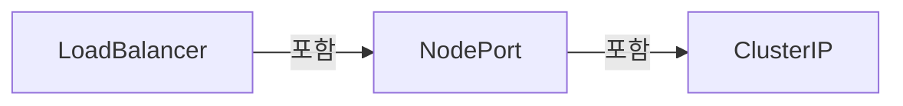

상위 타입은 하위 타입의 기능을 모두 포함한다.

### 프로덕션 관점

- ClusterIP가 90% 이상의 Service에 해당한다. 외부 노출은 Ingress/Gateway API를 통해 하나의 LB로 통합하는 것이 비용과 관리 측면에서 유리하다.
- NodePort는 보안상 모든 노드에 포트가 열리므로 프로덕션에서는 지양한다.

**관련 키워드:** ClusterIP(내부), NodePort(30000-32767), LoadBalancer(클라우드 LB 프로비저닝), 포함 관계

[공식 문서 - Service 타입](https://kubernetes.io/docs/concepts/services-networking/service/#publishing-services-service-types)

---

## Pod 내부 DNS 해석 과정

Pod 내부에서 `curl http://my-svc.my-namespace.svc.cluster.local`을 실행하면 다음 과정을 거친다.

### 전체 흐름

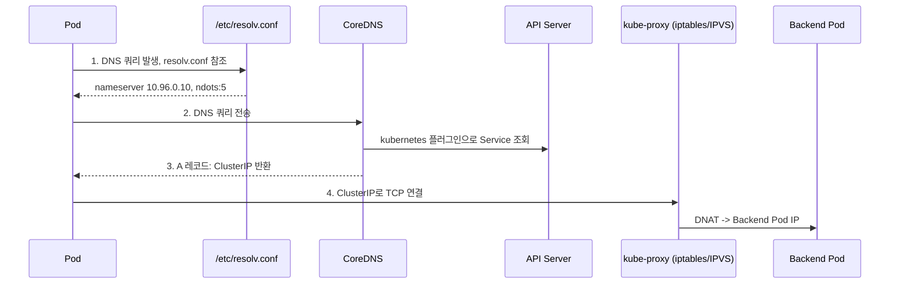

### 1. Pod 내 /etc/resolv.conf 참조

kubelet이 Pod 생성 시 `/etc/resolv.conf`를 주입한다.

- `nameserver 10.96.0.10` (CoreDNS Service ClusterIP)
- `search my-namespace.svc.cluster.local svc.cluster.local cluster.local`
- `ndots:5` (점이 5개 미만이면 search 도메인을 먼저 붙여서 시도)

### 2. DNS 쿼리 발생

`curl http://my-svc.my-namespace.svc.cluster.local` -> FQDN(점 4개)이므로 ndots:5 기준 미만이다. search 목록을 순서대로 붙여 시도한다. 단, FQDN 끝에 `.`을 명시하면 search를 건너뛰고 바로 절대 쿼리를 보낸다.

### 3. CoreDNS 처리

Pod의 DNS 쿼리가 CoreDNS Pod(보통 2개 replica)에 도달한다. CoreDNS는 `kubernetes` 플러그인을 통해 API Server의 Service/Endpoints 정보를 watch하고 있다. `my-svc.my-namespace.svc.cluster.local` -> A 레코드로 ClusterIP를 응답한다.

### 4. 응답 후 연결

Pod이 ClusterIP로 TCP 연결을 시도한다. kube-proxy가 설정한 iptables/IPVS 규칙에 의해 실제 backend Pod IP로 DNAT된다.

### CoreDNS Corefile 주요 설정

```text
.:53 {
    kubernetes cluster.local in-addr.arpa ip6.arpa {
        pods insecure
        fallthrough in-addr.arpa ip6.arpa
    }
    forward . /etc/resolv.conf
    cache 30
    loop
    reload
    loadbalance
}
```

- `kubernetes` 플러그인: cluster.local 도메인 처리
- `forward`: 클러스터 외부 도메인은 업스트림 DNS로 포워딩
- `cache 30`: 30초 캐시 (TTL)

### 트러블슈팅 명령어

```bash
# Pod 내 DNS 확인
kubectl exec -it <pod> -- cat /etc/resolv.conf
kubectl exec -it <pod> -- nslookup my-svc.my-namespace.svc.cluster.local

# CoreDNS 로그 확인
kubectl logs -n kube-system -l k8s-app=kube-dns

# CoreDNS 설정 확인
kubectl get configmap coredns -n kube-system -o yaml
```

**관련 키워드:** /etc/resolv.conf, ndots:5, search 도메인, CoreDNS kubernetes 플러그인, A 레코드 -> ClusterIP

[공식 문서 - DNS for Services and Pods](https://kubernetes.io/docs/concepts/services-networking/dns-pod-service/)

---

## Headless Service (clusterIP: None)

### 정의

`spec.clusterIP: None`으로 설정한 Service이다. 클러스터 가상 IP를 할당하지 않으며, kube-proxy가 프록시 규칙을 생성하지 않는다. DNS 쿼리 시 개별 Pod IP들을 직접 반환한다.

### DNS 응답 차이

| 구분        | ClusterIP Service          | Headless Service               |
|-----------|----------------------------|--------------------------------|
| DNS A 레코드 | ClusterIP 1개 반환            | Pod IP 여러 개 반환                 |
| 로드밸런싱     | kube-proxy (iptables/IPVS) | 클라이언트가 직접 선택 (DNS round-robin) |
| 프록시 규칙    | 생성됨                        | 생성 안 됨                         |

```yaml
apiVersion: v1
kind: Service
metadata:
  name: mysql-headless
spec:
  clusterIP: None
  selector:
    app: mysql
  ports:
    - port: 3306
```

```bash
# 일반 ClusterIP Service
$ nslookup my-svc
Name: my-svc.default.svc.cluster.local
Address: 10.96.100.50  # ClusterIP 1개

# Headless Service
$ nslookup mysql-headless
Name: mysql-headless.default.svc.cluster.local
Address: 10.244.1.10  # Pod IP
Address: 10.244.2.11  # Pod IP
Address: 10.244.3.12  # Pod IP
```

### StatefulSet과 함께 쓰는 이유

1. **개별 Pod DNS 레코드 생성**: StatefulSet의 각 Pod에 `<pod-name>.<headless-svc>.<namespace>.svc.cluster.local` 형태의 고유 DNS가 부여된다. 예: `mysql-0.mysql-headless.default.svc.cluster.local`
2. **안정적 네트워크 ID**: Pod이 재시작되어도 이름(mysql-0, mysql-1)이 유지되므로, 동일한 DNS 이름으로 항상 같은 역할의 Pod에 접근 가능하다.
3. **클라이언트 직접 선택**: 데이터베이스 클러스터에서 "primary는 mysql-0, replica는 mysql-1,2"처럼 특정 Pod을 지정하여 연결해야 하는 경우가 많다. ClusterIP의 랜덤 로드밸런싱은 이를 지원하지 못한다.

### 실무 사용 사례

- MySQL/PostgreSQL 복제 클러스터 (primary/replica 구분)
- Kafka 브로커 (각 브로커에 직접 연결 필요)
- Redis Sentinel/Cluster (노드 디스커버리)
- Elasticsearch (노드 간 peer discovery)

**관련 키워드:** clusterIP: None, Pod IP 직접 반환, 개별 Pod DNS, StatefulSet 안정적 네트워크 ID, 클라이언트 직접 선택

[공식 문서 - Headless Services](https://kubernetes.io/docs/concepts/services-networking/service/#headless-services)

---

## Ingress vs Gateway API

### Ingress

Kubernetes 초기부터 존재한 L7 HTTP 라우팅 리소스이다. 단일 리소스(Ingress)로 호스트/경로 기반 라우팅을 정의한다. 컨트롤러마다 annotation으로 기능을 확장하여 포터블하지 않다.

### Gateway API

Ingress의 후속 프로젝트로, SIG-Network에서 설계한 차세대 라우팅 API이다. GatewayClass -> Gateway -> HTTPRoute/TCPRoute/GRPCRoute 3계층 구조이다. 역할 기반 분리를 지원한다: 인프라 관리자(GatewayClass), 클러스터 운영자(Gateway), 개발자(Route).

### 주요 차이

| 구분        | Ingress             | Gateway API                       |
|-----------|---------------------|-----------------------------------|
| 프로토콜      | HTTP/HTTPS만         | HTTP, TCP, UDP, gRPC, TLS         |
| 리소스 구조    | 단일 리소스              | 3계층 (GatewayClass/Gateway/Route)  |
| 역할 분리     | 없음 (하나의 YAML에 모두)   | 인프라팀/플랫폼팀/개발팀 분리                  |
| 기능 확장     | annotation (비표준)    | 표준 CRD 필드 + Policy Attachment     |
| 트래픽 분할    | 미지원 (annotation 의존) | HTTPRoute weight 기반 네이티브 지원       |
| 헤더 기반 라우팅 | 미지원                 | HTTPRoute matches.headers 네이티브 지원 |

### Gateway API가 대체하게 된 이유 3가지

1. **Annotation 지옥 탈출**: Ingress는 표준 스펙이 빈약하여, 컨트롤러별 annotation이 난립한다. Gateway API는 트래픽 분할(HTTPRoute weight), 헤더 매칭(HTTPRoute matches.headers), URL 리다이렉트, URL 리라이트, 요청/응답 헤더 수정, 요청 미러링, 타임아웃, 세션 퍼시스턴스를 표준 필드로 제공하여 포터블하다.

2. **역할 기반 접근 제어(RBAC) 자연스러운 분리**: GatewayClass(인프라팀), Gateway(플랫폼팀), HTTPRoute(개발팀)로 리소스가 분리되어, RBAC 바운더리가 명확하다. Ingress는 하나의 리소스에 모든 설정이 들어가 권한 분리가 어렵다.

3. **멀티 프로토콜 지원**: Ingress는 HTTP/HTTPS만 지원한다. Gateway API는 TCPRoute, UDPRoute, GRPCRoute, TLSRoute를 통해 L4/L7 멀티 프로토콜을 하나의 API 체계로 통합한다.

```yaml
# Gateway API 예시
apiVersion: gateway.networking.k8s.io/v1
kind: HTTPRoute
metadata:
  name: my-app-route
spec:
  parentRefs:
    - name: my-gateway
  hostnames:
    - "app.example.com"
  rules:
    - matches:
        - path:
            type: PathPrefix
            value: /api
      backendRefs:
        - name: api-svc-v1
          port: 80
          weight: 90
        - name: api-svc-v2
          port: 80
          weight: 10  # 카나리 10%
```

**관련 키워드:** 3계층 구조(GatewayClass/Gateway/Route), 역할 분리(RBAC), annotation 지옥 탈출, 멀티 프로토콜, 표준 필드

[공식 문서 - Gateway API](https://gateway-api.sigs.k8s.io/)

---

## kube-proxy 역할, iptables vs IPVS, Cilium 대체

### kube-proxy 역할

모든 노드에서 DaemonSet으로 실행된다. API Server를 watch하여 Service/Endpoints 변경을 감지한다. 노드의 네트워크 규칙(iptables 또는 IPVS)을 업데이트하여, Service ClusterIP/NodePort로 들어온 트래픽을 backend Pod IP로 DNAT(목적지 NAT)한다. 주요은 kube-proxy 자체가 트래픽을 프록시하는 것이 아니라, 커널 레벨 규칙을 설정하는 "규칙 관리자"라는 점이다.

### iptables 모드

- Service마다 여러 개의 iptables 규칙 체인을 생성한다.
- 패킷이 KUBE-SERVICES -> KUBE-SVC-xxx -> KUBE-SEP-xxx 체인을 순회하며 랜덤 확률로 DNAT된다.
- **O(n) 선형 탐색**: 규칙이 많아질수록 성능이 저하된다.
- Service 1,000개 x Endpoint 10개 = iptables 규칙 ~20,000개 이상

```bash
# iptables 규칙 확인
iptables -t nat -L KUBE-SERVICES -n | wc -l
```

### IPVS 모드

- Linux 커널의 IPVS(IP Virtual Server) 모듈을 사용한다.
- 해시 테이블 기반 **O(1) 룩업**으로 대규모 Service에서도 성능이 일정하다.
- rr(Round Robin), lc(Least Connection), sh(Source Hashing) 등 다양한 알고리즘을 지원한다.
- ipset을 사용하여 규칙 수를 줄인다.

```bash
# IPVS 규칙 확인
ipvsadm -Ln
```

### iptables vs IPVS 비교

| 구분     | iptables             | IPVS               |
|--------|----------------------|--------------------|
| 성능     | O(n), 규칙 많으면 느림      | O(1), 해시 테이블       |
| 알고리즘   | 랜덤 확률                | rr, lc, sh 등 선택 가능 |
| 규칙 수   | Service 수에 비례하여 폭증   | ipset으로 최소화        |
| 커넥션 추적 | conntrack            | conntrack          |
| 디버깅    | iptables -L (읽기 어려움) | ipvsadm -Ln (직관적)  |

### Cilium이 kube-proxy를 대체할 수 있는 이유

1. **eBPF 기반 데이터 플레인**: Cilium은 eBPF 프로그램을 커널에 직접 로드하여, iptables/IPVS 없이 패킷을 처리한다. iptables 체인을 순회하지 않으므로 hop이 줄어들고 지연이 감소한다.

2. **Socket-Level 로드밸런싱**: `connect()` 시스템콜 시점에 eBPF가 가로채서 바로 backend Pod IP로 연결한다. NAT 자체가 발생하지 않아 conntrack 부하가 없다. 이를 "socket-level LB" 또는 "host-reachable service"라 한다.

3. **단일 컴포넌트 통합**: CNI(네트워크) + kube-proxy(서비스 프록시) + NetworkPolicy(보안)를 하나의 에이전트로 통합한다. 관리 포인트가 줄고, 컴포넌트 간 불일치가 없다.

```bash
# Cilium으로 kube-proxy 대체 시 kubeadm 설정
kubeadm init --skip-phases=addon/kube-proxy

# Cilium Helm 설치 시
helm install cilium cilium/cilium \
  --set kubeProxyReplacement=true \
  --set k8sServiceHost=<API_SERVER_IP> \
  --set k8sServicePort=6443
```

**관련 키워드:** kube-proxy는 규칙 관리자(프록시 아님), iptables O(n) vs IPVS O(1), eBPF socket-level LB, NAT 제거, conntrack 부하 감소

[공식 문서 - Virtual IPs and Service Proxies](https://kubernetes.io/docs/reference/networking/virtual-ips/)

[Cilium 문서 - kube-proxy 대체](https://docs.cilium.io/en/stable/network/kubernetes/kubeproxy-free/)

---

## 네트워크 트러블슈팅: DNS 성공, ClusterIP 타임아웃, PodIP 성공

이 증상의 주요은 "DNS는 정상, Pod 자체도 정상, 하지만 ClusterIP를 통한 접근만 실패"라는 것이다. ClusterIP -> Pod 변환을 담당하는 계층, 즉 **kube-proxy 또는 iptables/IPVS 규칙에 문제**가 있다.

### 1. kube-proxy 장애 또는 미실행

```bash
# kube-proxy Pod 상태 확인
kubectl get pods -n kube-system -l k8s-app=kube-proxy

# kube-proxy 로그 확인
kubectl logs -n kube-system -l k8s-app=kube-proxy --tail=50

# 해당 노드에서 iptables 규칙 존재 여부 확인
iptables -t nat -L KUBE-SERVICES -n | grep <ClusterIP>
```

kube-proxy가 CrashLoopBackOff이거나, 해당 Service의 iptables 규칙이 누락되어 있으면 ClusterIP 트래픽이 블랙홀에 빠진다.

### 2. Endpoints 미연결 (selector 불일치)

```bash
# Endpoints 확인 - 비어있으면 selector가 Pod label과 불일치
kubectl get endpoints my-svc

# Service selector와 Pod label 비교
kubectl get svc my-svc -o jsonpath='{.spec.selector}'
kubectl get pods --show-labels
```

Endpoints가 비어있으면 iptables 규칙에 backend가 없으므로 패킷이 드롭된다. PodIP 직접 접근은 성공하므로, selector 오타(예: `app: my-svc` vs `app: mysvc`)가 원인일 수 있다.

### 3. NetworkPolicy가 ClusterIP 경유 트래픽을 차단

```bash
kubectl get networkpolicy -n <namespace>
kubectl describe networkpolicy <name>
```

NetworkPolicy의 ingress 규칙이 source Pod/namespace 기준으로 허용하지만, kube-proxy의 SNAT/DNAT 과정에서 source IP가 변경되어 정책에 매치되지 않을 수 있다. 특히 `externalTrafficPolicy: Cluster`일 때 SNAT가 발생한다.

### 4. targetPort 불일치

```bash
kubectl get svc my-svc -o yaml
# spec.ports[].targetPort이 Pod의 실제 리스닝 포트와 일치하는지 확인
kubectl exec -it <pod> -- ss -tlnp
```

Service의 `port: 80`, `targetPort: 8080`인데 Pod이 8080이 아닌 다른 포트에서 리스닝하는 경우. PodIP로 직접 올바른 포트에 curl하면 성공하지만, Service를 통하면 잘못된 targetPort로 연결되어 타임아웃이 발생한다.

### 진단 순서 정리

1. `kubectl get endpoints my-svc` -> Endpoints 존재 확인
2. `kubectl get svc my-svc -o yaml` -> selector, targetPort 확인
3. 해당 노드에서 `iptables -t nat -L -n | grep <ClusterIP>` -> 규칙 존재 확인
4. `kubectl get pods -n kube-system -l k8s-app=kube-proxy` -> kube-proxy 상태
5. `kubectl get networkpolicy` -> 차단 정책 확인

**관련 키워드:** kube-proxy 장애, Endpoints 비어있음, selector 불일치, targetPort 불일치, NetworkPolicy SNAT 간섭

[공식 문서 - Service 디버깅](https://kubernetes.io/docs/tasks/debug/debug-application/debug-service/)

---

## MetalLB L2 vs BGP

MetalLB는 베어메탈/온프레미스 환경에서 `type: LoadBalancer` Service에 External IP를 할당하는 구현체이다.

### L2 모드 (Layer 2 / ARP)

MetalLB speaker Pod 중 하나가 리더로 선출되어, 할당된 External IP에 대한 ARP 응답(Gratuitous ARP)을 보낸다. 같은 L2 네트워크(서브넷) 내의 클라이언트가 ARP 요청을 보내면, 리더 노드가 자신의 MAC 주소로 응답한다. 모든 트래픽이 리더 노드 한 대로 집중된 후, kube-proxy가 backend Pod로 분산한다.

```yaml
apiVersion: metallb.io/v1beta1
kind: L2Advertisement
metadata:
  name: l2-adv
  namespace: metallb-system
```

### BGP 모드

각 노드의 MetalLB speaker가 BGP 피어(네트워크 라우터)와 BGP 세션을 맺는다. External IP에 대한 경로를 여러 노드에서 동시에 광고(announce)한다. 라우터가 ECMP(Equal-Cost Multi-Path)로 여러 노드에 트래픽을 분산한다.

```yaml
apiVersion: metallb.io/v1beta2
kind: BGPPeer
metadata:
  name: router-peer
  namespace: metallb-system
spec:
  myASN: 64500
  peerASN: 64501
  peerAddress: 10.0.0.1
---
apiVersion: metallb.io/v1beta1
kind: BGPAdvertisement
metadata:
  name: bgp-adv
  namespace: metallb-system
```

### L2 vs BGP 비교

| 구분        | L2 모드                      | BGP 모드                                    |
|-----------|----------------------------|-------------------------------------------|
| 트래픽 분산    | 리더 노드 1대에 집중               | ECMP로 여러 노드 분산                            |
| Failover  | 리더 장애 시 10-30초 (ARP 캐시 갱신) | 라우터 BGP holdtime 기반 (기본 90초, BFD 적용 시 수초) |
| 네트워크 요구사항 | 같은 L2 서브넷                  | BGP 지원 라우터 필요                             |
| 설정 복잡도    | 낮음 (IP 풀만 설정)              | 높음 (ASN, 피어, 라우터 설정)                      |
| 확장성       | 단일 노드 병목                   | 노드 추가 시 선형 확장                             |

### L2 모드의 한계

1. **단일 노드 병목**: 모든 트래픽이 리더 노드 한 대를 경유하므로, 해당 노드의 NIC 대역폭이 병목이 된다.
2. **Failover 지연**: 리더 장애 시 새 리더가 Gratuitous ARP를 보내지만, 클라이언트/스위치의 ARP 캐시 갱신까지 10-30초 서비스 중단이 발생한다.
3. **L2 서브넷 제약**: 클라이언트와 노드가 같은 L2 네트워크에 있어야 한다. VLAN이 분리된 환경에서는 사용 불가하다.

### 프로덕션 선택 기준

- **소규모/개발**: L2 모드. 설정이 단순하고, 네트워크팀 협조 없이 바로 사용 가능하다.
- **프로덕션 대규모**: BGP 모드. ECMP 분산으로 가용성과 성능이 보장된다. 네트워크팀과 협의하여 BGP 피어링을 설정한다.
- **온프레미스 환경**: 네트워크팀이 BGP를 지원하면 BGP, 그렇지 않으면 L2 + `externalTrafficPolicy: Local`로 타협한다.

**관련 키워드:** L2(ARP, 리더 노드 1대 집중), BGP(ECMP 다중 노드 분산), L2 한계(단일 병목, failover 지연, 서브넷 제약)

[공식 문서 - MetalLB Concepts](https://metallb.io/concepts/)

---

## sessionAffinity: ClientIP

### 동작 원리

`sessionAffinity: ClientIP`를 설정하면, 동일한 클라이언트 IP에서 오는 요청을 같은 backend Pod로 라우팅한다. kube-proxy가 iptables의 `recent` 모듈 또는 IPVS의 `persistent connection`을 사용하여 source IP -> backend Pod 매핑을 유지한다. 기본 타임아웃은 10800초(3시간)이며, `sessionAffinityConfig`로 조절 가능하다.

```yaml
apiVersion: v1
kind: Service
metadata:
  name: my-web
spec:
  sessionAffinity: ClientIP
  sessionAffinityConfig:
    clientIP:
      timeoutSeconds: 3600  # 1시간
  selector:
    app: my-web
  ports:
    - port: 80
      targetPort: 8080
```

### 사용 상황

- 로컬 캐시를 가진 애플리케이션: 사용자 세션 데이터를 메모리에 저장하고, 같은 Pod에 계속 연결되어야 캐시 히트율이 높아지는 경우
- WebSocket 연결: 초기 핸드셰이크 후 같은 Pod 유지가 필요한 경우
- 파일 업로드: 청크 업로드 시 같은 Pod에서 조립해야 하는 경우

### sessionAffinity vs Sticky Session

| 구분     | sessionAffinity: ClientIP    | Sticky Session (Ingress/LB)              |
|--------|------------------------------|------------------------------------------|
| 동작 레이어 | L3/L4 (Source IP 기준)         | L7 (Cookie 기반)                           |
| 식별 기준  | 클라이언트 IP                     | HTTP Cookie (예: JSESSIONID)              |
| NAT 환경 | 같은 NAT 뒤의 모든 사용자가 같은 Pod으로 감 | 개별 사용자 구분 가능                             |
| 설정 위치  | Service spec                 | Ingress annotation 또는 Gateway API Policy |
| 정밀도    | 낮음 (IP 단위)                   | 높음 (사용자 단위)                              |

```yaml
# Ingress 레벨 Cookie 기반 Sticky Session (nginx 예시)
apiVersion: networking.k8s.io/v1
kind: Ingress
metadata:
  annotations:
    nginx.ingress.kubernetes.io/affinity: "cookie"
    nginx.ingress.kubernetes.io/session-cookie-name: "route"
    nginx.ingress.kubernetes.io/session-cookie-max-age: "3600"
```

### 주의사항

- NAT/프록시 뒤에 있는 다수 사용자가 같은 IP로 보이면, 모두 같은 Pod에 몰려 부하가 편중된다.
- Kubernetes에서 권장하는 방식은 가능한 한 **stateless 설계 + 외부 세션 스토어(Redis)**이다. sessionAffinity는 레거시 애플리케이션의 임시 해결책으로 사용한다.

**관련 키워드:** Source IP 기반 L4 어피니티, Cookie 기반 L7 sticky session과 구분, NAT 환경 주의, stateless + Redis가 Best Practice

[공식 문서 - Session Affinity](https://kubernetes.io/docs/reference/networking/virtual-ips/#session-affinity)

---

## ExternalName Service

### 정의

`type: ExternalName`은 ClusterIP를 할당하지 않고, DNS CNAME 레코드를 반환하는 Service이다. kube-proxy가 프록시 규칙을 생성하지 않으며, 순수하게 DNS 수준에서만 동작한다. selector가 없고, 외부 DNS 이름을 값으로 지정한다.

```yaml
apiVersion: v1
kind: Service
metadata:
  name: my-database
  namespace: production
spec:
  type: ExternalName
  externalName: mydb.rds.amazonaws.com
```

Pod에서 `my-database.production.svc.cluster.local`을 DNS 쿼리하면, CoreDNS가 CNAME `mydb.rds.amazonaws.com`을 반환한다.

### 사용 상황

1. **클러스터 외부 서비스 추상화**: RDS, Cloud SQL 등 외부 DB를 Service 이름으로 추상화하여, 애플리케이션 코드에서 `my-database:5432`로 접근한다.
2. **크로스 네임스페이스 참조**: 다른 네임스페이스의 Service를 현재 네임스페이스에서 짧은 이름으로 접근한다.
3. **점진적 마이그레이션**: 가장 주요적인 사용 사례이다.

### DB 마이그레이션 사례

```text
Phase 1: 외부 DB 사용 중
my-database -> ExternalName: old-db.on-premise.company.com

Phase 2: 신규 DB(K8s 내부 또는 RDS)로 전환
my-database -> ExternalName: new-db.rds.amazonaws.com
(또는 type: ClusterIP로 변경하여 K8s 내부 DB Pod로 연결)

Phase 3: 완전 전환 후 ClusterIP로 변경
my-database -> ClusterIP -> K8s 내 DB Pod
```

이 과정에서 애플리케이션의 연결 문자열(`my-database:5432`)은 한 번도 변경되지 않는다. Service 매니페스트만 수정하면 DNS 해석 결과가 바뀐다.

### 제한사항

- CNAME만 반환하므로, 포트 매핑이 불가하다. 외부 서비스의 포트를 그대로 사용해야 한다.
- IP 주소는 externalName에 직접 지정할 수 없다(DNS 이름만 가능). IP를 사용하려면 Endpoints를 수동 생성해야 한다.
- HTTPS 연결 시 SNI/인증서의 호스트명이 CNAME 대상과 일치해야 한다.

```yaml
# IP 기반 외부 서비스 연결 (ExternalName 대신)
apiVersion: v1
kind: Service
metadata:
  name: external-db
spec:
  ports:
    - port: 5432
---
apiVersion: v1
kind: Endpoints
metadata:
  name: external-db  # Service와 이름 일치 필수
subsets:
  - addresses:
      - ip: 10.0.0.100
    ports:
      - port: 5432
```

**관련 키워드:** DNS CNAME 반환, selector 없음, 외부 서비스 추상화, 연결 문자열 무변경 마이그레이션, 포트 매핑 불가

[공식 문서 - ExternalName Service](https://kubernetes.io/docs/concepts/services-networking/service/#externalname)

---

## Kong KIC + Gateway API HTTPRoute 트래픽 전체 흐름

### 아키텍처 구성

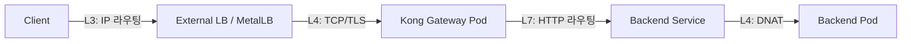

### 리소스 관계

```yaml
# 1. GatewayClass - 인프라팀이 관리
apiVersion: gateway.networking.k8s.io/v1
kind: GatewayClass
metadata:
  name: kong
spec:
  controllerName: konghq.com/gateway-operator
---
# 2. Gateway - 플랫폼팀이 관리
apiVersion: gateway.networking.k8s.io/v1
kind: Gateway
metadata:
  name: kong-gateway
  namespace: kong
spec:
  gatewayClassName: kong
  listeners:
    - name: http
      protocol: HTTP
      port: 80
    - name: https
      protocol: HTTPS
      port: 443
      tls:
        mode: Terminate
        certificateRefs:
          - name: tls-secret
---
# 3. HTTPRoute - 개발팀이 관리
apiVersion: gateway.networking.k8s.io/v1
kind: HTTPRoute
metadata:
  name: api-route
  namespace: apps
spec:
  parentRefs:
    - name: kong-gateway
      namespace: kong
  hostnames:
    - "api.example.com"
  rules:
    - matches:
        - path:
            type: PathPrefix
            value: /v1/users
        - headers:
            - name: X-Canary
              value: "true"
      backendRefs:
        - name: users-svc-v2
          port: 80
          weight: 100
    - matches:
        - path:
            type: PathPrefix
            value: /v1/users
      backendRefs:
        - name: users-svc-v1
          port: 80
          weight: 90
        - name: users-svc-v2
          port: 80
          weight: 10
```

### 전체 흐름 (L3 -> L4 -> L7)

**Step 1. L3 - IP 라우팅 (클라이언트 -> 노드)**

클라이언트가 `api.example.com`을 DNS 쿼리하여 External IP(MetalLB 할당 또는 Cloud LB IP)를 받는다. IP 패킷이 라우터를 거쳐 External IP가 할당된 노드에 도달한다. MetalLB L2에서는 ARP로 리더 노드에, BGP에서는 ECMP로 다중 노드에 도달한다.

**Step 2. L4 - TCP/TLS 연결 (노드 -> Kong Pod)**

`type: LoadBalancer`인 Kong Gateway Service를 통해 트래픽이 수신된다. kube-proxy(또는 Cilium)가 External IP:443 -> Kong Pod IP:8443으로 DNAT한다. TCP 3-way handshake 완료, TLS handshake는 Kong Pod에서 terminate한다 (Gateway listener의 `tls.mode: Terminate`).

**Step 3. L7 - HTTP 라우팅 (Kong Pod 내부)**

Kong Ingress Controller(KIC)는 Kubernetes API를 watch하여 HTTPRoute를 Kong의 내부 라우팅 설정으로 변환해둔 상태이다. Kong은 복호화된 HTTP 요청을 분석한다:

1. **Host 매칭**: `Host: api.example.com` -> HTTPRoute의 hostnames와 매칭
2. **Path 매칭**: `/v1/users/123` -> `PathPrefix: /v1/users` 매칭
3. **Header 매칭**: `X-Canary: true` 헤더 존재 여부에 따라 다른 rule 적용
4. **Plugin 실행**: Rate Limiting, Authentication, Request Transformer 등 Kong 플러그인 체인 실행
5. **Weight 기반 분배**: backendRefs의 weight에 따라 v1(90%) / v2(10%) 트래픽 분할

**Step 4. L4 - Backend 연결 (Kong Pod -> Backend Pod)**

Kong이 선택된 backend Service로 새 HTTP 요청을 보낸다. kube-proxy의 iptables/IPVS 규칙에 의해 ClusterIP -> backend Pod IP로 DNAT된다. 또는 Kong이 Endpoints를 직접 watch하여 Pod IP로 바로 보내는 모드(upstream)도 가능하다.

**Step 5. 응답 반환**

Backend Pod -> Kong Pod -> (TLS 암호화) -> kube-proxy -> 클라이언트

### KIC 내부 동작 (컨트롤 플레인)

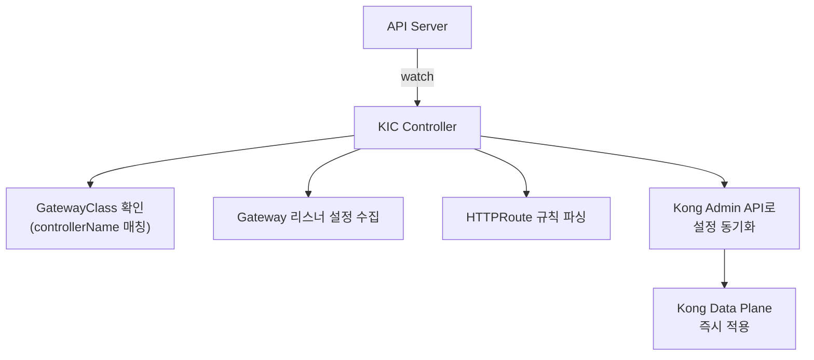

### 프로덕션 고려사항

- Kong은 DB-less 모드(declarative)와 DB 모드(PostgreSQL)가 있다. K8s 환경에서는 DB-less가 권장된다.
- Gateway API의 `parentRefs`로 Cross-namespace 라우팅을 제어할 수 있어, 멀티테넌트 환경에 유리하다.
- KongPlugin CRD로 Rate Limiting, JWT Auth, Prometheus, OpenTelemetry 등 다양한 플러그인을 HTTPRoute에 연결한다.

**관련 키워드:** GatewayClass->Gateway->HTTPRoute 3계층, L3(IP 라우팅), L4(DNAT+TLS Terminate), L7(Host/Path/Header 매칭+Plugin), KIC watch->Kong Admin API 동기화

[Kong 공식 문서 - Gateway API](https://docs.konghq.com/kubernetes-ingress-controller/latest/concepts/gateway-api/)

[Gateway API 공식 문서 - HTTP Routing](https://gateway-api.sigs.k8s.io/guides/http-routing/)

---

## 마무리 정리

| 주제                     | 주요 키워드                                                    |
|------------------------|-----------------------------------------------------------|
| Service 타입             | ClusterIP(내부), NodePort(30000-32767), LoadBalancer(포함 관계) |
| DNS 해석                 | /etc/resolv.conf, ndots:5, CoreDNS kubernetes 플러그인, A 레코드 |
| Headless Service       | clusterIP: None, Pod IP 직접 반환, 개별 Pod DNS, StatefulSet    |
| Ingress vs Gateway API | 3계층 구조, 역할 분리, annotation 지옥 탈출, 멀티 프로토콜                  |
| kube-proxy / Cilium    | 규칙 관리자, iptables O(n) vs IPVS O(1), eBPF socket-level LB  |
| 네트워크 트러블슈팅             | kube-proxy 장애, Endpoints 비어있음, selector/targetPort 불일치    |
| MetalLB                | L2(ARP, 단일 노드), BGP(ECMP, 다중 노드), L2 한계 3가지               |
| sessionAffinity        | Source IP 기반 L4, Cookie 기반 L7과 구분, stateless + Redis 권장   |
| ExternalName           | DNS CNAME, 연결 문자열 무변경 마이그레이션, 포트 매핑 불가                    |
| Kong + Gateway API     | L3->L4->L7 흐름, KIC watch, TLS Terminate, weight 기반 카나리    |

---

# 04. Storage

Kubernetes에서 Storage는 상태를 갖는(stateful) 워크로드를 안정적으로 운영하기 위한 주요 영역이다. 데이터베이스, 메시지 큐, 파일 공유 등 거의 모든 프로덕션 워크로드가 영구 스토리지를 필요로 하며, 이를 올바르게 설계하지 않으면 데이터 유실이나 장애로 이어진다.

## PV, PVC, StorageClass의 관계와 역할

Kubernetes의 스토리지 추상화는 "사용자(개발자)가 인프라 세부사항을 몰라도 스토리지를 요청할 수 있게 하는 것"이 목적이다.

### PersistentVolume (PV)

클러스터 관리자가 프로비저닝한 실제 스토리지 리소스이다. 클러스터 레벨 리소스(namespace 없음)이며, NFS 서버, AWS EBS, 로컬 디스크 등 구체적인 스토리지 백엔드 정보를 담는다. Pod의 라이프사이클과 독립적이다.

```yaml
apiVersion: v1
kind: PersistentVolume
metadata:
  name: pv-nfs-01
spec:
  capacity:
    storage: 10Gi
  accessModes:
    - ReadWriteMany
  persistentVolumeReclaimPolicy: Retain
  nfs:
    server: 10.0.0.100
    path: /exports/data
```

### PersistentVolumeClaim (PVC)

사용자(개발자)가 스토리지를 요청하는 리소스이다. namespace 레벨 리소스이며, 용량, AccessMode, StorageClass만 명시한다. 실제 백엔드가 NFS인지 EBS인지 알 필요가 없다. PVC가 생성되면 조건에 맞는 PV와 바인딩(Binding)된다.

```yaml
apiVersion: v1
kind: PersistentVolumeClaim
metadata:
  name: my-data
  namespace: production
spec:
  accessModes:
    - ReadWriteMany
  resources:
    requests:
      storage: 5Gi
  storageClassName: nfs-storage
```

### StorageClass

스토리지 "유형"을 정의하는 템플릿이다. Dynamic Provisioning의 주요으로, PVC가 StorageClass를 참조하면 provisioner가 자동으로 PV를 생성한다. 프로비저너, 파라미터, Reclaim Policy를 정의한다.

```yaml
apiVersion: storage.k8s.io/v1
kind: StorageClass
metadata:
  name: fast-ssd
provisioner: ebs.csi.aws.com
parameters:
  type: gp3
  iops: "3000"
reclaimPolicy: Delete
volumeBindingMode: WaitForFirstConsumer
```

### 관계도

```mermaid
flowchart TB
    SC[StorageClass - 템플릿]
    PVC[PVC - 요청<br/>namespace 레벨]
    PV[PV - 실제 스토리지<br/>클러스터 레벨]
    Pod[Pod]
    Backend["스토리지 백엔드<br/>(NFS/EBS/Local)"]

    SC -->|Dynamic: provisioner가<br/>PV 자동 생성| PV
    PVC -->|storageClassName 참조| SC
    PVC -->|1:1 바인딩| PV
    Pod -->|volumes[].persistentVolumeClaim| PVC
    PV -->|접근| Backend
```

바인딩 조건은 PVC의 요청 용량이 PV 용량 이하이고, AccessMode가 호환되며, StorageClass가 일치하는 경우다. 바인딩은 항상 1:1이다.

> 기억해야할 점: PV는 클러스터 레벨, PVC는 namespace 레벨이라는 스코프 차이를 명확히 설명할 수 있어야 한다. 또한 "PVC가 PV를 직접 선택하는 것이 아니라, 조건 매칭으로 바인딩된다"는 메커니즘을 이해해야 한다.

공식 문서: [Persistent Volumes](https://kubernetes.io/docs/concepts/storage/persistent-volumes/)

---

## Static vs Dynamic Provisioning

### Static Provisioning

1. 클러스터 관리자가 PV를 수동으로 생성한다.
2. 사용자가 PVC를 생성한다.
3. PV Controller가 조건(용량, AccessMode, StorageClass)에 맞는 PV를 찾아 바인딩한다.
4. 매칭되는 PV가 없으면 PVC는 Pending 상태로 남는다.

```bash
# 관리자: PV 생성
kubectl apply -f pv-nfs-01.yaml

# 사용자: PVC 생성 -> 자동 바인딩
kubectl apply -f my-pvc.yaml

# 확인
kubectl get pv,pvc
```

문제점은 PV 수요를 사전에 예측하여 만들어놔야 한다는 것이다. Pod 100개가 각각 PVC를 요청하면, PV 100개를 미리 생성해야 한다. 운영 부담이 크다.

### Dynamic Provisioning

1. 관리자가 StorageClass를 정의한다 (1회).
2. 사용자가 PVC에 `storageClassName`을 지정하여 생성한다.
3. StorageClass의 provisioner가 자동으로 PV를 생성하고 바인딩한다.
4. PVC 삭제 시 reclaimPolicy에 따라 PV도 자동 정리된다.

### Dynamic Provisioning에 필요한 구성요소

1. **CSI Driver (Provisioner)**: 실제 스토리지를 생성/삭제하는 드라이버다. AWS EBS는 `ebs.csi.aws.com`, NFS는 `nfs.csi.k8s.io`, 로컬은 `rancher.io/local-path` 등이 있다.
2. **StorageClass**: provisioner와 파라미터를 정의하는 리소스다.
3. **RBAC 권한**: CSI Driver가 PV를 생성/삭제할 수 있는 ClusterRole/Binding이 필요하다.
4. **스토리지 백엔드 접근**: CSI Driver가 실제 스토리지(AWS EBS API, NFS 서버, Ceph 등)에 접근할 수 있어야 한다.

```yaml
# StorageClass 정의 (Dynamic)
apiVersion: storage.k8s.io/v1
kind: StorageClass
metadata:
  name: nfs-dynamic
provisioner: nfs.csi.k8s.io
parameters:
  server: 10.0.0.100
  share: /exports/dynamic
reclaimPolicy: Delete
volumeBindingMode: Immediate
```

```yaml
# PVC만 생성하면 PV가 자동 생성됨
apiVersion: v1
kind: PersistentVolumeClaim
metadata:
  name: auto-data
spec:
  accessModes:
    - ReadWriteOnce
  storageClassName: nfs-dynamic
  resources:
    requests:
      storage: 5Gi
```

### volumeBindingMode

- `Immediate`: PVC 생성 즉시 PV를 프로비저닝한다.
- `WaitForFirstConsumer`: Pod가 스케줄링될 때까지 PV 생성을 지연한다. 토폴로지(AZ/노드) 인식이 필요한 로컬 디스크나 EBS에서 필수이다.

> 기억해야할 점: `WaitForFirstConsumer`가 왜 필요한지를 토폴로지 관점에서 설명할 수 있어야 한다. EBS 볼륨은 특정 AZ에 생성되므로, Pod가 어느 AZ에 스케줄링될지 모르는 상태에서 PV를 미리 만들면 AZ 불일치로 마운트에 실패할 수 있다.

공식 문서: [Dynamic Provisioning](https://kubernetes.io/docs/concepts/storage/dynamic-provisioning/)

---

## AccessMode: RWO, ROX, RWX

| 약어  | 전체 이름         | 의미                |
|-----|---------------|-------------------|
| RWO | ReadWriteOnce | 단일 노드에서 읽기/쓰기 마운트 |
| ROX | ReadOnlyMany  | 여러 노드에서 읽기 전용 마운트 |
| RWX | ReadWriteMany | 여러 노드에서 읽기/쓰기 마운트 |

주의해야 할 점은 "Once"가 "한 번"이 아니라 "하나의 노드"를 의미한다는 것이다. 같은 노드의 여러 Pod은 RWO 볼륨을 동시에 마운트할 수 있다. Kubernetes 1.22+에서는 이를 명확히 하기 위해 `ReadWriteOncePod(RWOP)`가 추가되었다. RWOP는 정확히 하나의 Pod만 마운트할 수 있다.

### 스토리지 유형별 지원

| 스토리지                     | RWO | ROX | RWX |
|--------------------------|-----|-----|-----|
| 로컬 디스크 (hostPath, local) | O   | X   | X   |
| AWS EBS                  | O   | X   | X   |
| GCP Persistent Disk      | O   | O   | X   |
| NFS                      | O   | O   | O   |
| AWS EFS                  | O   | O   | O   |
| CephFS                   | O   | O   | O   |

**NFS**는 네트워크 파일 시스템이므로 여러 노드에서 동시에 마운트가 가능하고, RWX가 필요한 경우 가장 보편적인 선택지이다.

**로컬 디스크**는 물리적으로 특정 노드에 부착되어 있으므로 다른 노드에서 접근이 불가하고, RWO만 지원한다. `volumeBindingMode: WaitForFirstConsumer`와 함께 사용하여 Pod이 해당 노드에 스케줄링되도록 해야 한다.

### 실무에서의 선택 기준

| 워크로드 유형                       | 추천 AccessMode | 추천 스토리지     |
|-------------------------------|---------------|-------------|
| 단일 Pod 워크로드                   | RWO           | EBS, 로컬 디스크 |
| 정적 콘텐츠 공유 (설정파일, ML 모델)       | ROX           | NFS, EFS    |
| 다중 Pod 공유 쓰기 (CMS 업로드, 공유 로그) | RWX           | NFS, EFS    |
| 데이터베이스                        | RWO 또는 RWOP   | 로컬 SSD, EBS |

```yaml
apiVersion: v1
kind: PersistentVolumeClaim
metadata:
  name: shared-uploads
spec:
  accessModes:
    - ReadWriteMany  # 여러 노드의 Pod에서 동시 쓰기
  storageClassName: nfs-storage
  resources:
    requests:
      storage: 50Gi
```

공식 문서: [Access Modes](https://kubernetes.io/docs/concepts/storage/persistent-volumes/#access-modes)

---

## Reclaim Policy와 PV 재사용

### Reclaim Policy 종류

| 정책      | 동작                                      | 용도                                  |
|---------|-----------------------------------------|-------------------------------------|
| Delete  | PVC 삭제 시 PV와 실제 스토리지 모두 삭제              | Dynamic Provisioning 기본값, 개발/테스트 환경 |
| Retain  | PVC 삭제 시 PV가 Released 상태로 남고, 실제 데이터 보존 | 프로덕션 환경 권장                          |
| Recycle | `rm -rf /volume/*` 실행 후 재사용             | deprecated, 사용하지 않음                 |

### Retain일 때 PVC 삭제 후 상태 변화

```
PVC: Bound -> 삭제됨
PV:  Bound -> Released (데이터 보존, 새 PVC 바인딩 불가)
```

`Released` 상태의 PV는 이전 PVC의 `claimRef`를 여전히 가지고 있어 새로운 PVC가 바인딩할 수 없다. 이는 데이터 보호를 위한 의도적 설계이다.

### PV 재사용 방법

```bash
# 1. 현재 상태 확인
kubectl get pv pv-nfs-01
# STATUS: Released

# 2. claimRef 제거 (PV를 Available로 되돌림)
kubectl patch pv pv-nfs-01 --type json \
  -p '[{"op": "remove", "path": "/spec/claimRef"}]'

# 3. 상태 확인
kubectl get pv pv-nfs-01
# STATUS: Available

# 4. 새 PVC 생성 -> 바인딩 가능
```

`claimRef`를 제거하면 PV가 `Available`이 되어 조건에 맞는 아무 PVC와 바인딩될 수 있다. 특정 PVC에만 바인딩하고 싶으면, PV의 `claimRef`를 수동으로 새 PVC를 가리키도록 설정한다.

```yaml
# 특정 PVC에 예약 바인딩
apiVersion: v1
kind: PersistentVolume
metadata:
  name: pv-nfs-01
spec:
  claimRef:
    name: new-my-data
    namespace: production
  # ... 나머지 설정
```

> 기억해야할 점: 프로덕션에서는 반드시 Retain 정책을 사용하고, 데이터 백업 확인 후 수동으로 PV를 정리하는 것이 Best Practice이다. Delete 정책은 개발/테스트 환경에서만 사용해야 한다.

공식 문서: [Reclaiming](https://kubernetes.io/docs/concepts/storage/persistent-volumes/#reclaiming)

---

## StatefulSet의 안정적 스토리지

### volumeClaimTemplates 동작

StatefulSet은 Pod과 PVC의 안정적 1:1 매핑을 보장한다. 이것이 상태를 갖는 워크로드에서 StatefulSet을 선택하는 주요 이유다.

```yaml
apiVersion: apps/v1
kind: StatefulSet
metadata:
  name: mysql
spec:
  serviceName: mysql-headless
  replicas: 3
  template:
    spec:
      containers:
        - name: mysql
          volumeMounts:
            - name: data
              mountPath: /var/lib/mysql
  volumeClaimTemplates:
    - metadata:
        name: data
      spec:
        accessModes: ["ReadWriteOnce"]
        storageClassName: fast-ssd
        resources:
          requests:
            storage: 50Gi
```

### 생성 과정

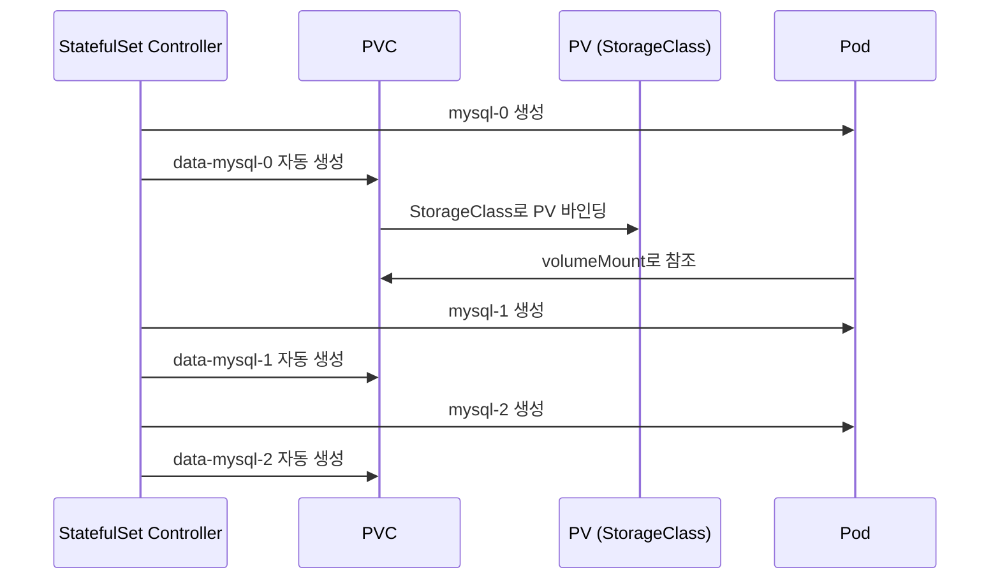

PVC 이름 규칙은 `<volumeClaimTemplate.name>-<statefulset.name>-<ordinal>`이다.

### Pod 삭제 후 데이터 유지 원리

```bash
# Pod 삭제
kubectl delete pod mysql-1

# StatefulSet Controller가 동일한 이름으로 재생성
# mysql-1 -> PVC data-mysql-1을 다시 마운트 (PVC는 삭제되지 않았으므로)
```

1. Pod `mysql-1`이 삭제되어도 PVC `data-mysql-1`은 삭제되지 않는다.
2. StatefulSet Controller가 `mysql-1`을 재생성한다 (동일한 ordinal).
3. 새 `mysql-1` Pod은 기존 PVC `data-mysql-1`을 volumeMount로 참조한다.
4. PVC `data-mysql-1`은 이미 PV와 바인딩되어 있으므로 동일한 스토리지에 접근한다.
5. 결과적으로 이전 Pod의 데이터(`/var/lib/mysql`)가 그대로 유지된다.

### Deployment와의 차이

- **Deployment**: Pod 이름이 랜덤(예: `mysql-abc123`), PVC를 공유하거나 매번 새로 생성한다.
- **StatefulSet**: Pod 이름이 고정(ordinal), PVC도 고정 이름으로 1:1 매핑된다.

### PVC 삭제 시점

StatefulSet을 삭제(`kubectl delete sts mysql`)해도 PVC는 자동 삭제되지 않는다. 이는 데이터 보호를 위한 의도적 설계이다.

Kubernetes 1.27+에서 `persistentVolumeClaimRetentionPolicy`로 동작을 제어할 수 있다.

```yaml
spec:
  persistentVolumeClaimRetentionPolicy:
    whenDeleted: Delete    # StatefulSet 삭제 시 PVC도 삭제
    whenScaled: Retain     # Scale down 시 PVC 유지
```

스케일 다운 시에도 PVC는 유지된다. `replicas: 3 -> 2`로 줄이면 `mysql-2` Pod은 삭제되지만 PVC `data-mysql-2`는 유지된다. 다시 `replicas: 3`으로 늘리면 새 `mysql-2`가 기존 PVC에 재연결된다.

> 기억해야할 점: "StatefulSet을 삭제해도 PVC가 남는다"는 사실과, 이것이 의도적 설계인 이유(데이터 보호)를 설명할 수 있어야 한다.

공식 문서: [StatefulSet Stable Storage](https://kubernetes.io/docs/concepts/workloads/controllers/statefulset/#stable-storage)

---

## PVC Pending 트러블슈팅

PVC가 Pending 상태로 남으며 "waiting for a volume to be created" 메시지가 나오는 경우의 원인과 해결 방법이다.

```bash
kubectl describe pvc my-data
# Events:
#   waiting for a volume to be created, either by external provisioner "nfs.csi.k8s.io"
#   or manually created by system administrator
```

### 원인 1: CSI Driver / Provisioner 미설치 또는 장애

StorageClass의 provisioner가 클러스터에 설치되어 있지 않거나, Pod이 비정상인 경우이다.

```bash
# 확인
kubectl get storageclass
kubectl get pods -n kube-system | grep csi
kubectl get pods -n kube-system | grep provisioner

# CSI Driver 로그 확인
kubectl logs -n kube-system <csi-driver-pod>
```

### 원인 2: StorageClass 미존재 또는 이름 불일치

PVC에서 참조하는 `storageClassName`이 존재하지 않는 경우이다.

```bash
# 확인
kubectl get pvc my-data -o jsonpath='{.spec.storageClassName}'
kubectl get storageclass

# storageClassName이 ""(빈 문자열)이면 Dynamic Provisioning 비활성
# storageClassName이 생략되면 default StorageClass 사용
```

해결하려면 StorageClass 이름을 정확히 맞추거나, default StorageClass를 설정한다.

```bash
# default StorageClass 설정
kubectl patch storageclass nfs-storage \
  -p '{"metadata": {"annotations": {"storageclass.kubernetes.io/is-default-class": "true"}}}'
```

### 원인 3: WaitForFirstConsumer + Pod 미스케줄링

`volumeBindingMode: WaitForFirstConsumer`인 StorageClass를 사용하는 PVC는 해당 PVC를 사용하는 Pod이 스케줄링될 때까지 바인딩을 지연한다.

```bash
# 확인
kubectl get storageclass <name> -o jsonpath='{.volumeBindingMode}'
# WaitForFirstConsumer

# Pod이 Pending인지 확인
kubectl get pods
kubectl describe pod <pod-name>
```

### 추가 원인

- 스토리지 백엔드 용량 부족 (NFS 서버 디스크 풀, AWS EBS 한도 초과)
- 권한 문제 (CSI Driver의 ServiceAccount에 PV 생성 RBAC 권한 없음)
- 네트워크 문제 (CSI Driver가 스토리지 백엔드에 접근 불가)

### 진단 순서

```bash
# 1. PVC 이벤트 확인
kubectl describe pvc my-data

# 2. StorageClass 존재 및 provisioner 확인
kubectl get sc

# 3. CSI Driver Pod 상태 확인
kubectl get pods -A | grep -i csi

# 4. CSI Driver 로그 확인
kubectl logs -n kube-system <csi-pod> --tail=50

# 5. volumeBindingMode 확인 -> WaitForFirstConsumer이면 Pod 상태 확인
kubectl get sc <name> -o yaml
```

공식 문서: [Volume and Claim Lifecycle](https://kubernetes.io/docs/concepts/storage/persistent-volumes/#lifecycle-of-a-volume-and-claim)

---

## 프로덕션 NFS: 장단점과 장애 대응

### NFS 장점

1. **RWX 지원**: 여러 노드의 Pod이 동시에 읽기/쓰기 가능하다. 블록 스토리지(EBS, 로컬 디스크)는 RWO만 지원한다.
2. **간단한 구축**: Ceph, GlusterFS 같은 분산 스토리지 대비 설정이 단순하다.
3. **기존 인프라 활용**: 대부분의 조직에 이미 NFS 인프라가 존재한다.
4. **Dynamic Provisioning 지원**: NFS CSI Driver로 자동 PV 생성이 가능하다.

### NFS 단점

1. **단일 장애점(SPOF)**: NFS 서버가 다운되면 모든 마운트된 Pod이 영향을 받는다.
2. **성능**: 네트워크 I/O에 의존하므로 로컬 SSD 대비 latency가 높다. DB 같은 IOPS 민감 워크로드에는 부적합하다.
3. **파일 잠금(locking) 문제**: NFS v3의 NLM이나 v4의 delegation은 완벽하지 않다. 동시 쓰기 시 데이터 정합성 이슈가 발생할 수 있다.
4. **stale file handle**: NFS 서버 측 export가 변경되면 클라이언트에서 stale NFS file handle 에러가 발생한다.

### NFS 불통 시 Pod 영향

NFS 서버가 다운되거나 네트워크가 끊어지면, NFS 마운트에 접근하는 프로세스가 **hang(멈춤)** 상태에 빠진다.

1. **기본 마운트(hard mount)**: NFS 요청이 무한 재시도된다. 프로세스가 D(uninterruptible sleep) 상태로 멈춘다.
2. **컨테이너 영향**: 컨테이너 내 프로세스가 hang되어 liveness/readiness probe가 실패한다.
3. **Pod 삭제 불가**: `kubectl delete pod`를 해도 Terminating 상태에서 멈춘다. umount가 완료되지 않기 때문이다.
4. **노드 영향**: kubelet이 해당 Pod의 상태를 보고하지 못해 노드 자체가 NotReady로 전환될 수 있다.

```bash
# hang된 프로세스 확인 (노드에서)
ps aux | grep D+  # D state 프로세스

# 강제 Pod 삭제
kubectl delete pod <name> --grace-period=0 --force

# NFS 마운트 상태 확인
mount | grep nfs
showmount -e <nfs-server>
```

### 완화 방법

**1. soft mount + timeo 설정**

```yaml
apiVersion: v1
kind: PersistentVolume
spec:
  mountOptions:
    - soft        # 타임아웃 시 에러 반환 (hang 대신)
    - timeo=30    # 3초 (단위: 0.1초)
    - retrans=3   # 재시도 3회
    - nfsvers=4.1
```

soft mount는 NFS 불통 시 EIO 에러를 반환하여 프로세스가 hang되지 않는다. 다만 데이터 정합성 위험이 있으므로 쓰기가 중요한 워크로드에서는 주의해야 한다.

**2. NFS 서버 고가용성**

- DRBD + Pacemaker/Corosync로 active-standby HA 구성
- NAS 어플라이언스(NetApp, Synology HA) 사용
- 클라우드: AWS EFS, GCP Filestore (관리형 NFS)

**3. Probe 설정 조정**

```yaml
livenessProbe:
  exec:
    command: ["cat", "/healthcheck"]  # NFS가 아닌 경로 사용
  timeoutSeconds: 5
  failureThreshold: 3
```

liveness probe가 NFS 마운트 경로를 참조하지 않도록 설계한다.

**4. 중요 데이터 분리**: DB 데이터는 로컬 SSD(RWO), 공유 파일만 NFS(RWX)로 분리한다.

> 기억해야할 점: NFS 장애 시 hard mount 환경에서 프로세스가 D state로 hang되는 현상과, 이것이 Pod 삭제 불가 -> 노드 NotReady까지 이어지는 연쇄 장애 시나리오를 설명할 수 있어야 한다.

공식 문서: [NFS Volumes](https://kubernetes.io/docs/concepts/storage/volumes/#nfs)

---

## CSI(Container Storage Interface)와 in-tree 전환

### CSI 정의

Container Storage Interface(CSI)는 컨테이너 오케스트레이터(Kubernetes, Mesos, Docker Swarm, Nomad 등)와 스토리지 시스템 간의 표준 인터페이스 사양이다. 스토리지 벤더가 CSI 드라이버를 한 번 구현하면, CSI를 지원하는 모든 오케스트레이터에서 사용할 수 있다.

### in-tree에서 CSI로 전환한 이유

1. **릴리스 사이클 분리**: in-tree 플러그인은 Kubernetes 릴리스에 포함되므로, 스토리지 드라이버 버그 수정이나 기능 추가를 위해 Kubernetes 전체 릴리스를 기다려야 했다. CSI 드라이버는 독립적으로 버전을 관리하고 배포할 수 있다.

2. **바이너리 크기 및 의존성 감소**: 모든 스토리지 벤더의 코드가 kubelet, kube-controller-manager 바이너리에 포함되어 비대해졌다. 사용하지 않는 스토리지 드라이버의 의존성(AWS SDK, GCP SDK 등)까지 빌드에 포함되었다.

3. **벤더 중립적 확장**: in-tree에 새 스토리지를 추가하려면 Kubernetes upstream에 PR을 올려 리뷰를 받아야 했다. CSI는 표준 gRPC 인터페이스만 구현하면 되므로 독립적으로 개발/배포할 수 있다.

4. **보안 격리**: in-tree 플러그인은 kubelet 프로세스 내에서 실행되므로 스토리지 드라이버 버그가 kubelet 전체에 영향을 미칠 수 있었다. CSI 드라이버는 별도의 Pod(DaemonSet)으로 실행되어 장애가 격리된다.

5. **크로스 플랫폼 호환**: CSI 사양은 Kubernetes뿐 아니라 여러 오케스트레이터에서 사용할 수 있다.

### CSI 아키텍처

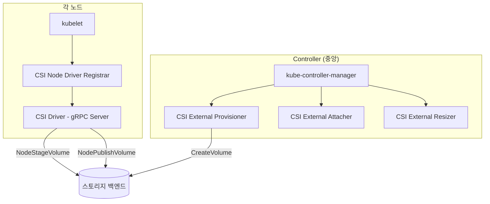

CSI 드라이버는 3가지 gRPC 서비스를 제공한다.

- **Identity**: 드라이버 정보 제공 (이름, 버전, 기능)
- **Controller**: 볼륨 생성/삭제/확장, 스냅샷 (Controller Pod에서 실행)
- **Node**: 볼륨 마운트/언마운트 (각 노드의 DaemonSet에서 실행)

### 마이그레이션 현황

Kubernetes 1.17+에서 CSIMigration 기능으로 in-tree 플러그인 호출을 자동으로 CSI 드라이버로 라우팅한다. Kubernetes 1.25~1.28에 걸쳐 주요 in-tree 플러그인들의 CSIMigration이 GA가 되었으며, 궁극적으로 모든 in-tree 플러그인이 제거될 예정이다.

```bash
# 클러스터에 설치된 CSI 드라이버 확인
kubectl get csidrivers

# CSI Driver Pod 확인
kubectl get pods -n kube-system -l app=ebs-csi-controller
```

공식 문서: [CSI Volumes](https://kubernetes.io/docs/concepts/storage/volumes/#csi), [Kubernetes CSI Developer Documentation](https://kubernetes-csi.github.io/docs/)

---

## 주요 키워드 정리

| 주제             | 주요 키워드                                                                  |
|----------------|-------------------------------------------------------------------------|
| PV/PVC/SC      | PV(클러스터 레벨), PVC(namespace 레벨), StorageClass(템플릿+자동 프로비저닝), 1:1 바인딩     |
| Provisioning   | Static(수동 PV), Dynamic(StorageClass+CSI), WaitForFirstConsumer(토폴로지 인식) |
| AccessMode     | RWO(단일 노드), ROX(다중 노드 읽기), RWX(다중 노드 읽기쓰기), RWOP(단일 Pod)                |
| Reclaim Policy | Retain(Released, claimRef 제거로 재사용), Delete(자동 삭제), 프로덕션은 Retain         |
| StatefulSet    | volumeClaimTemplates, 고정 이름 매핑, Pod 삭제 시 PVC 유지                         |
| PVC Pending    | Provisioner 미설치, StorageClass 이름 불일치, WaitForFirstConsumer              |
| NFS            | SPOF, hard mount D state, soft mount+timeo, NFS HA                      |
| CSI            | gRPC 인터페이스, 릴리스 사이클 분리, 보안 격리, CSIMigration                             |

---

# 05. Scheduling

Kubernetes 스케줄링은 "어떤 Pod를 어느 노드에 배치할 것인가"를 결정하는 메커니즘이다. 단순히 빈 노드를 찾는 것이 아니라, 가용성, 성능, 비용, 보안 등을 종합적으로 고려하여 최적의 배치를 결정해야 하므로 프로덕션 운영에서 필수적으로 이해해야 하는 영역이다.

## nodeSelector, nodeAffinity, podAffinity, podAntiAffinity

4가지 스케줄링 제약은 각각 다른 대상과 목적을 가진다.

### nodeSelector

가장 단순한 노드 선택 방법이다. 노드의 label과 정확히 일치하는 노드에만 Pod을 스케줄링한다. AND 조건만 지원하며, OR, NOT, In, Exists 같은 연산자를 사용할 수 없다.

```yaml
spec:
  nodeSelector:
    disktype: ssd
    zone: ap-northeast-2a
```

사용 사례: GPU 노드에만 ML 워크로드 배치 (`gpu: "true"`)

### nodeAffinity

nodeSelector의 상위 호환이다. 표현력이 풍부한 연산자(In, NotIn, Exists, DoesNotExist, Gt, Lt)를 지원한다.

- `requiredDuringSchedulingIgnoredDuringExecution`: 반드시 만족해야 하는 hard 조건이다.
- `preferredDuringSchedulingIgnoredDuringExecution`: 가능하면 만족하는 soft 조건이며, weight 기반으로 우선순위를 정한다.

```yaml
spec:
  affinity:
    nodeAffinity:
      requiredDuringSchedulingIgnoredDuringExecution:
        nodeSelectorTerms:
          - matchExpressions:
              - key: kubernetes.io/arch
                operator: In
                values: ["amd64", "arm64"]
      preferredDuringSchedulingIgnoredDuringExecution:
        - weight: 80
          preference:
            matchExpressions:
              - key: zone
                operator: In
                values: ["ap-northeast-2a"]
```

사용 사례: "반드시 amd64 또는 arm64 노드, 가능하면 2a 존에 배치"

### podAffinity

특정 label을 가진 Pod이 이미 실행 중인 노드/존에 함께 배치한다. `topologyKey`로 공동 배치 범위를 결정한다.

- `kubernetes.io/hostname`: 같은 노드
- `topology.kubernetes.io/zone`: 같은 존
- `topology.kubernetes.io/region`: 같은 리전

```yaml
spec:
  affinity:
    podAffinity:
      requiredDuringSchedulingIgnoredDuringExecution:
        - labelSelector:
            matchExpressions:
              - key: app
                operator: In
                values: ["redis"]
          topologyKey: kubernetes.io/hostname
```

사용 사례: 캐시(Redis) Pod과 같은 노드에 API Pod을 배치하여 네트워크 latency를 최소화한다.

### podAntiAffinity

podAffinity의 반대이다. 특정 label을 가진 Pod이 있는 노드/존을 피한다.

```yaml
spec:
  affinity:
    podAntiAffinity:
      requiredDuringSchedulingIgnoredDuringExecution:
        - labelSelector:
            matchExpressions:
              - key: app
                operator: In
                values: ["nginx"]
          topologyKey: kubernetes.io/hostname
```

사용 사례: 같은 Deployment의 replica들을 서로 다른 노드에 분산하여 고가용성을 확보한다.

### 비교 요약

| 구분              | 대상        | 동작    | 표현력                    |
|-----------------|-----------|-------|------------------------|
| nodeSelector    | 노드 label  | 일치 필수 | 낮음 (AND only)          |
| nodeAffinity    | 노드 label  | 필수/선호 | 높음 (In, NotIn, Gt, Lt) |
| podAffinity     | Pod label | 함께 배치 | 높음 + topologyKey       |
| podAntiAffinity | Pod label | 분산 배치 | 높음 + topologyKey       |

> 기억해야할 점: nodeSelector는 nodeAffinity의 단순화 버전이며, 둘 다 "노드"를 대상으로 한다. 반면 podAffinity/podAntiAffinity는 "다른 Pod"을 기준으로 배치를 결정하며 topologyKey가 필수이다. 이 구분을 명확히 해야 한다.

공식 문서: [Assigning Pods to Nodes](https://kubernetes.io/docs/concepts/scheduling-eviction/assign-pod-node/)

---

## Taint와 Toleration

### Taint (노드에 적용)

노드에 "오염"을 표시하여 해당 taint를 용인(tolerate)하지 않는 Pod의 스케줄링을 거부한다. Affinity가 "이 노드에 와라"라면, Taint는 "이 노드에 오지 마라"이다.

```bash
# Taint 추가
kubectl taint nodes node1 gpu=true:NoSchedule

# Taint 확인
kubectl describe node node1 | grep Taints

# Taint 제거
kubectl taint nodes node1 gpu=true:NoSchedule-
```

### Taint Effect 종류

| Effect             | 동작                                                          |
|--------------------|-------------------------------------------------------------|
| `NoSchedule`       | 새 Pod 스케줄링 거부. 기존 Pod은 유지                                   |
| `PreferNoSchedule` | 가능하면 스케줄링 안 함. 다른 노드가 없으면 허용 (soft)                         |
| `NoExecute`        | 새 Pod 스케줄링 거부 + 기존 Pod도 퇴거(evict). tolerationSeconds로 유예 가능 |

### Toleration (Pod에 적용)

Pod이 특정 taint를 "용인"하겠다고 선언한다. 중요한 점은 Toleration이 있다고 해서 해당 노드에 반드시 가는 것은 아니라는 것이다. 단지 "갈 수 있다"는 의미이다. 특정 노드에 반드시 배치하려면 nodeSelector/nodeAffinity를 함께 사용해야 한다.

```yaml
spec:
  tolerations:
    - key: "gpu"
      operator: "Equal"
      value: "true"
      effect: "NoSchedule"
```

### Control Plane에 일반 Pod이 스케줄링되지 않는 이유

kubeadm으로 클러스터를 구성하면, Control Plane 노드에 다음 taint가 자동으로 추가된다.

```
node-role.kubernetes.io/control-plane:NoSchedule
```

일반 Pod에는 이 taint에 대한 toleration이 없으므로, scheduler가 Control Plane 노드를 후보에서 제외한다.

```bash
# 확인
kubectl describe node <control-plane-node> | grep Taints
# Taints: node-role.kubernetes.io/control-plane:NoSchedule
```

시스템 Pod(CoreDNS, kube-proxy, CNI Agent 등)은 spec에 해당 taint에 대한 toleration이 포함되어 있어 Control Plane에서도 실행된다.

```yaml
# CoreDNS의 toleration (기본 설정)
tolerations:
  - key: "CriticalAddonsOnly"
    operator: "Exists"
  - key: "node-role.kubernetes.io/control-plane"
    effect: "NoSchedule"
```

### Control Plane에 일반 Pod을 스케줄링하려면

```bash
# 방법 1: Taint 제거 (싱글 노드 클러스터)
kubectl taint nodes <cp-node> node-role.kubernetes.io/control-plane:NoSchedule-

# 방법 2: Pod에 toleration 추가
```

```yaml
spec:
  tolerations:
    - key: "node-role.kubernetes.io/control-plane"
      operator: "Exists"
      effect: "NoSchedule"
```

### Taint + Toleration 실무 패턴

- **전용 노드**: GPU 노드에 `gpu=true:NoSchedule` -> GPU 워크로드만 toleration으로 배치
- **유지보수**: `kubectl taint nodes node1 maintenance=true:NoExecute` -> 기존 Pod 퇴거 후 작업
- **장애 노드 자동 taint**: Node Controller가 `node.kubernetes.io/not-ready:NoExecute`를 자동 추가

> 기억해야할 점: "Toleration이 있으면 해당 노드에 반드시 배치되는가?"라는 질문에 "아니다. Toleration은 갈 수 있다는 허가일 뿐이다. 반드시 배치하려면 nodeAffinity를 함께 사용해야 한다"라고 명확히 답해야 한다.

공식 문서: [Taints and Tolerations](https://kubernetes.io/docs/concepts/scheduling-eviction/taint-and-toleration/)

---

## requests vs limits: 리소스 관리

### requests

Pod이 **보장받는** 최소 리소스 양이다. 스케줄러가 사용하는 값이며, 노드의 allocatable 리소스에서 기존 Pod들의 requests 합을 빼고 새 Pod의 requests가 들어갈 여유가 있는 노드에 스케줄링한다. 실제 사용량이 아닌 "예약" 개념이다.

### limits

Pod이 사용할 수 있는 **최대** 리소스 양이다. 스케줄러가 사용하지 않는다. 런타임(kubelet, cgroup)에서 강제한다.

```yaml
resources:
  requests:
    cpu: "250m"      # 0.25 코어 보장
    memory: "256Mi"  # 256MiB 보장
  limits:
    cpu: "500m"      # 최대 0.5 코어
    memory: "512Mi"  # 최대 512MiB
```

### 스케줄링 영향

```
노드 allocatable: 4 CPU, 8Gi Memory
기존 Pod requests 합: 3 CPU, 6Gi Memory
남은 여유: 1 CPU, 2Gi Memory

새 Pod requests: 500m CPU, 1Gi Memory -> 스케줄링 가능
새 Pod requests: 2 CPU, 3Gi Memory -> 이 노드 불가 (Insufficient cpu/memory)
```

limits는 스케줄링에 영향을 주지 않는다. requests 500m / limits 4 CPU인 Pod이 4 CPU 노드에 스케줄링될 수 있다.

### limits 초과 시 CPU vs Memory

| 리소스    | 특성                    | 초과 시 동작                                               |
|--------|-----------------------|-------------------------------------------------------|
| CPU    | 압축 가능(compressible)   | 쓰로틀링(throttling). CFS가 CPU 시간을 제한. 프로세스가 느려지지만 죽지 않는다 |
| Memory | 압축 불가(incompressible) | OOMKill. 커널의 OOM Killer가 프로세스를 강제 종료. Exit Code 137   |

### CPU 쓰로틀링 상세

Linux CFS bandwidth control을 사용한다. `cpu.cfs_period_us`(기본 100ms) 주기 동안 `cpu.cfs_quota_us`만큼만 CPU를 사용할 수 있다. limits: 500m이면 100ms 중 50ms만 사용 가능하고, 나머지 50ms는 대기한다.

```bash
# 쓰로틀링 확인
cat /sys/fs/cgroup/cpu/cpu.stat
# nr_throttled: 쓰로틀링 발생 횟수
# throttled_time: 쓰로틀링된 총 시간(나노초)
```

쓰로틀링은 latency를 증가시킨다. API 서버의 경우 응답 시간이 급격히 나빠질 수 있다.

### Memory OOMKill 상세

컨테이너의 RSS(Resident Set Size)가 limits를 초과하면 cgroup OOM이 발동한다. kubelet이 `OOMKilled` exit code 137 (128+9, SIGKILL)을 보고한다.

```bash
# OOMKill 확인
kubectl describe pod <name>
# Last State: Terminated
#   Reason: OOMKilled
#   Exit Code: 137
```

### QoS Class

| QoS Class  | 조건                                  | 우선순위                           |
|------------|-------------------------------------|--------------------------------|
| Guaranteed | requests == limits (CPU, Memory 모두) | 가장 높음                          |
| Burstable  | requests < limits                   | 중간                             |
| BestEffort | requests/limits 미설정                 | 가장 낮음. 노드 메모리 부족 시 가장 먼저 evict |

### 프로덕션 Best Practice

- requests는 반드시 설정한다 (스케줄링 정확도).
- CPU limits는 설정하지 않거나 넉넉하게 설정한다 (쓰로틀링이 latency를 악화시킴).
- Memory limits는 반드시 설정한다 (OOM으로 노드 전체가 영향받는 것을 방지).

> 기억해야할 점: "CPU limits를 설정하지 않는 것이 나을 수도 있다"라는 관점을 근거와 함께 설명할 수 있어야 한다. 쓰로틀링에 의한 tail latency 증가가 Service SLO에 미치는 영향을 논할 수 있으면 좋다.

공식 문서: [Resource Management for Pods and Containers](https://kubernetes.io/docs/concepts/configuration/manage-resources-containers/)

---

## LimitRange vs ResourceQuota

### LimitRange

**개별 Pod/Container 수준**의 리소스 제한이다. 네임스페이스 내 각 컨테이너의 기본값(default), 최솟값(min), 최댓값(max)을 설정한다. requests/limits를 명시하지 않은 컨테이너에 자동으로 기본값을 주입한다.

```yaml
apiVersion: v1
kind: LimitRange
metadata:
  name: default-limits
  namespace: production
spec:
  limits:
    - type: Container
      default:          # limits 기본값
        cpu: "500m"
        memory: "256Mi"
      defaultRequest:   # requests 기본값
        cpu: "100m"
        memory: "128Mi"
      min:
        cpu: "50m"
        memory: "64Mi"
      max:
        cpu: "2"
        memory: "2Gi"
```

### ResourceQuota

**네임스페이스 전체**의 리소스 총량 제한이다. 네임스페이스 내 모든 Pod의 requests/limits 합계, Pod 수, PVC 수, Service 수 등을 제한한다.

```yaml
apiVersion: v1
kind: ResourceQuota
metadata:
  name: team-quota
  namespace: production
spec:
  hard:
    requests.cpu: "10"
    requests.memory: "20Gi"
    limits.cpu: "20"
    limits.memory: "40Gi"
    persistentvolumeclaims: "10"
    pods: "50"
```

### 비교

| 구분     | LimitRange                  | ResourceQuota        |
|--------|-----------------------------|----------------------|
| 범위     | 개별 컨테이너/Pod                 | 네임스페이스 전체            |
| 목적     | 단일 Pod의 과도한 리소스 사용 방지       | 팀/프로젝트의 총 리소스 사용 제한  |
| 기본값 주입 | O (default, defaultRequest) | X                    |
| 검증 시점  | Pod 생성 시 (Admission)        | Pod 생성 시 (Admission) |

### Quota가 있을 때 requests 미명시 Pod

ResourceQuota에 `requests.cpu`나 `requests.memory`가 설정된 네임스페이스에서, Pod에 requests를 명시하지 않으면 **Pod 생성이 거부**된다.

```bash
kubectl apply -f pod-no-requests.yaml
# Error from server (Forbidden): pods "my-pod" is forbidden:
# failed quota: team-quota: must specify requests.cpu, requests.memory
```

이유는 ResourceQuota가 모든 Pod의 requests 합을 추적하기 때문이다. requests가 없는 Pod이 생성되면 합계를 계산할 수 없으므로 반드시 명시를 요구한다.

### 해결 방법

1. Pod에 requests/limits를 명시한다.
2. LimitRange로 기본값을 설정한다. LimitRange의 `defaultRequest`가 자동 주입되므로 ResourceQuota의 요구사항을 만족한다.

### 프로덕션 권장 조합

```
LimitRange (기본값 주입) + ResourceQuota (총량 제한) = 완전한 리소스 거버넌스
```

1. LimitRange로 개발자가 requests/limits를 빠뜨려도 안전한 기본값이 적용되게 한다.
2. ResourceQuota로 특정 팀/프로젝트가 클러스터 리소스를 독점하지 못하게 한다.

```bash
# 현재 Quota 사용량 확인
kubectl describe resourcequota team-quota -n production
```

> 기억해야할 점: "ResourceQuota가 있는데 LimitRange가 없으면 어떻게 되는가?"에 대해 requests를 명시하지 않은 Pod이 거부된다는 점과, LimitRange의 defaultRequest로 이를 해결할 수 있다는 점을 함께 설명해야 한다.

공식 문서: [Limit Ranges](https://kubernetes.io/docs/concepts/policy/limit-range/), [Resource Quotas](https://kubernetes.io/docs/concepts/policy/resource-quotas/)

---

## TopologySpreadConstraints

### 정의

Pod을 지정된 토폴로지(노드, 존, 리전 등)에 걸쳐 **균등하게** 분산하는 스케줄링 제약이다. `maxSkew`로 토폴로지 간 Pod 수의 최대 편차를 지정한다.

```yaml
spec:
  topologySpreadConstraints:
    - maxSkew: 1
      topologyKey: topology.kubernetes.io/zone
      whenUnsatisfiable: DoNotSchedule
      labelSelector:
        matchLabels:
          app: web
    - maxSkew: 1
      topologyKey: kubernetes.io/hostname
      whenUnsatisfiable: ScheduleAnyway
      labelSelector:
        matchLabels:
          app: web
```

### 파라미터 설명

| 파라미터                | 설명                                                  |
|---------------------|-----------------------------------------------------|
| `maxSkew`           | 토폴로지 간 Pod 수 최대 차이. 1이면 각 토폴로지의 Pod 수 차이가 1 이하여야 한다 |
| `topologyKey`       | 분산 기준 (zone, hostname, region 등)                    |
| `whenUnsatisfiable` | `DoNotSchedule`(hard) 또는 `ScheduleAnyway`(soft)     |
| `labelSelector`     | 분산 대상 Pod 선택                                        |

### podAntiAffinity와의 차이

| 구분               | podAntiAffinity     | TopologySpreadConstraints   |
|------------------|---------------------|-----------------------------|
| 목적               | "같은 토폴로지에 배치하지 마라"  | "모든 토폴로지에 균등하게 분산하라"        |
| 분산 방식            | 이진(binary): 있거나 없거나 | 수치(numeric): maxSkew로 편차 제어 |
| replica > 토폴로지 수 | 스케줄링 불가 (hard)      | maxSkew 허용 범위 내에서 배치 가능     |
| 유연성              | 낮음                  | 높음                          |

### 주요 차이 예시

3개 zone, 5개 replica인 경우를 비교하면 다음과 같다.

**podAntiAffinity** (hard, topologyKey: zone):

- zone-a: 1, zone-b: 1, zone-c: 1 -> 3개만 스케줄링 가능. 나머지 2개는 Pending.

**TopologySpreadConstraints** (maxSkew: 1, topologyKey: zone):

- zone-a: 2, zone-b: 2, zone-c: 1 -> 5개 모두 스케줄링 성공. 편차가 1 이하.

### 프로덕션 중요성

1. **AZ 장애 대응**: zone 레벨 TopologySpreadConstraints로 Pod을 AZ에 균등 분산하면, 하나의 AZ가 전체 다운되어도 다른 AZ의 Pod이 서비스를 유지한다.
2. **노드 장애 시 영향 최소화**: hostname 레벨 분산으로 특정 노드에 Pod이 몰리는 것을 방지한다.
3. **리소스 활용 균등화**: Pod이 특정 노드에 편중되면 해당 노드만 리소스 부족이 발생한다.

### 다중 제약 조합 (프로덕션 권장)

```yaml
topologySpreadConstraints:
  # 1차: AZ 간 균등 분산 (hard)
  - maxSkew: 1
    topologyKey: topology.kubernetes.io/zone
    whenUnsatisfiable: DoNotSchedule
    labelSelector:
      matchLabels:
        app: web
  # 2차: 노드 간 균등 분산 (soft)
  - maxSkew: 1
    topologyKey: kubernetes.io/hostname
    whenUnsatisfiable: ScheduleAnyway
    labelSelector:
      matchLabels:
        app: web
```

> 기억해야할 점: podAntiAffinity 대비 TopologySpreadConstraints의 장점은 "replica 수가 토폴로지 수보다 많을 때도 동작한다"는 점이다. 실무에서는 대부분 TopologySpreadConstraints가 더 적합하다.

공식 문서: [Topology Spread Constraints](https://kubernetes.io/docs/concepts/scheduling-eviction/topology-spread-constraints/)

---

## Pending Pod 트러블슈팅: Taint + Insufficient Memory

### 상황 분석

```bash
kubectl describe pod my-app-xxx
# Events:
#   0/5 nodes are available:
#   2 node(s) had taint {gpu=true: NoSchedule}, that the pod didn't tolerate,
#   3 node(s) had insufficient memory.
```

전체 5개 노드 중 2개는 GPU 전용(taint), 3개는 일반 노드이지만 메모리 부족이다. 스케줄러가 5개 노드 모두를 후보에서 제외하여 Pending이 발생한다.

### 조치 방법

**1. 일반 노드의 메모리 확보 (가장 우선)**

```bash
# 노드별 리소스 사용 현황 확인
kubectl top nodes
kubectl describe node <node-name> | grep -A 5 "Allocated resources"

# 특정 네임스페이스의 리소스 과다 사용 확인
kubectl top pods -n <namespace> --sort-by=memory
```

메모리를 많이 사용하는 불필요한 Pod을 삭제하거나, requests가 과도하게 설정된 Pod의 requests를 줄인다.

**2. Pod의 memory requests 축소**

```yaml
# Before
resources:
  requests:
    memory: "4Gi"  # 과도한 요청

# After
resources:
  requests:
    memory: "1Gi"  # 실제 사용량 기반으로 조정
```

```bash
# 실제 메모리 사용량 확인
kubectl top pod <pod-name>
# 사용량이 500Mi인데 requests가 4Gi면 과도한 것이다
```

**3. 노드 추가 (스케일 아웃)**

```bash
# 온프레미스: 새 노드 조인
kubeadm join <control-plane>:6443 --token <token> --discovery-token-ca-cert-hash <hash>
```

Cluster Autoscaler가 설정되어 있다면, Pending Pod이 트리거가 되어 자동으로 노드가 추가된다.

**4. GPU 노드에 toleration 추가 (상황에 따라)**

GPU를 사용하지 않더라도 GPU 노드에 여유가 있고 긴급하다면 toleration을 추가할 수 있다. 다만 GPU 노드의 비용이 비싸므로 일시적 조치로만 사용해야 한다.

```yaml
spec:
  tolerations:
    - key: "gpu"
      operator: "Equal"
      value: "true"
      effect: "NoSchedule"
```

**5. PriorityClass를 활용한 preemption**

새 Pod에 높은 우선순위를 부여하여, 낮은 우선순위 Pod을 퇴거시키고 리소스를 확보한다.

```yaml
apiVersion: scheduling.k8s.io/v1
kind: PriorityClass
metadata:
  name: high-priority
value: 1000
globalDefault: false
---
spec:
  priorityClassName: high-priority
```

**6. eviction 임계값 조정 (노드 레벨)**

kubelet의 eviction threshold가 너무 보수적이면 실제 여유가 있어도 insufficient로 판단할 수 있다.

```bash
cat /var/lib/kubelet/config.yaml | grep eviction
# evictionHard:
#   memory.available: "100Mi"
```

### 진단 순서

1. `kubectl describe pod` -> Events 확인
2. `kubectl top nodes` -> 노드별 실제 사용률
3. `kubectl describe node` -> Allocated resources (requests 합계)
4. requests 과다 여부 판단 -> requests 조정 또는 노드 추가

공식 문서: [Pod Scheduling Readiness](https://kubernetes.io/docs/concepts/scheduling-eviction/pod-scheduling-readiness/)

---

## PriorityClass와 Preemption

### PriorityClass

Pod에 우선순위를 부여하는 클러스터 레벨 리소스이다. `value`가 높을수록 우선순위가 높다 (정수, 음수 가능).

```yaml
apiVersion: scheduling.k8s.io/v1
kind: PriorityClass
metadata:
  name: critical-apps
value: 1000000
globalDefault: false
preemptionPolicy: PreemptLowerPriority
description: "프로덕션 주요 서비스용"
```

### 기본 제공 PriorityClass

| 이름                        | value      | 용도                            |
|---------------------------|------------|-------------------------------|
| `system-cluster-critical` | 2000000000 | 클러스터 주요 (CoreDNS, kube-proxy) |
| `system-node-critical`    | 2000001000 | 노드 주요 (kubelet 관련)            |

사용자 정의 PriorityClass의 value는 이 값보다 낮아야 한다 (10억 미만 권장).

### Preemption 동작

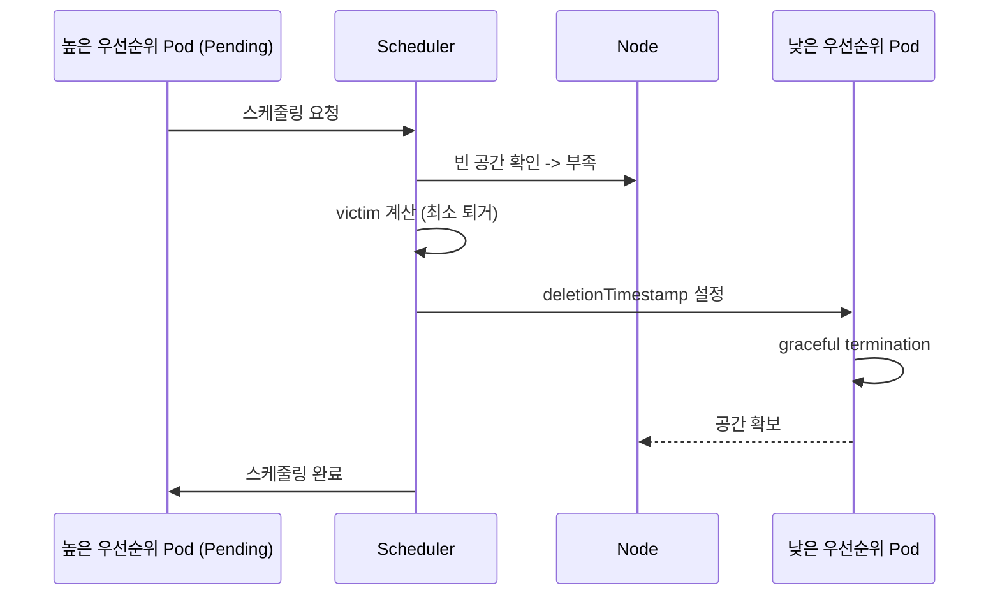

1. 높은 우선순위 Pod이 스케줄링될 노드가 없다 (Pending).
2. 스케줄러가 각 노드에서 낮은 우선순위 Pod을 퇴거시키면 공간이 생기는지 계산한다.
3. 퇴거 대상(victim)을 최소화하면서 공간을 확보할 수 있는 노드를 선택한다.
4. 대상 Pod에 `deletionTimestamp`를 설정하고, graceful termination을 진행한다.
5. 공간이 확보되면 높은 우선순위 Pod을 스케줄링한다.

### preemptionPolicy

- `PreemptLowerPriority` (기본값): 낮은 우선순위 Pod을 퇴거할 수 있다.
- `Never`: preemption하지 않는다. 대기열에서 우선 처리되지만, 다른 Pod을 퇴거하지 않는다.

### 시스템 Pod 보장 설계: 우선순위 계층

```
system-node-critical     (2000001000) <- kubelet 필수 컴포넌트
system-cluster-critical  (2000000000) <- CoreDNS, kube-proxy
production-critical      (1000000)    <- API Gateway, DB
default-workload         (0)          <- 일반 서비스 (globalDefault)
batch-low                (-100)       <- CI/CD, 배치 작업
```

리소스 부족 시 batch-low -> default-workload -> production-critical 순으로 퇴거된다. system-* Pod은 사실상 퇴거되지 않는다.

### 주의사항

- PriorityClass를 남용하면 "priority inversion" 문제가 발생한다. 계층을 3-5개로 제한하는 것이 좋다.
- `globalDefault: true`는 클러스터에 하나만 존재해야 한다.
- preemption은 graceful termination을 존중하므로, `terminationGracePeriodSeconds`가 길면 공간 확보가 느려진다.

공식 문서: [Pod Priority and Preemption](https://kubernetes.io/docs/concepts/scheduling-eviction/pod-priority-preemption/)

---

## HPA 알고리즘과 계산

### HPA(Horizontal Pod Autoscaler) 알고리즘

HPA Controller는 주기적(기본 15초)으로 메트릭을 수집하여 다음 공식으로 목표 replica 수를 계산한다.

```
desiredReplicas = ceil(currentReplicas * (currentMetricValue / desiredMetricValue))
```

- `ceil`: 올림 함수
- `currentReplicas`: 현재 replica 수
- `currentMetricValue`: 현재 메트릭 값 (전체 Pod의 평균)
- `desiredMetricValue`: 목표 메트릭 값

### 계산 예시

현재 CPU 사용률 80%, 목표 50%, 현재 replica 2개인 경우:

```
desiredReplicas = ceil(2 * (80 / 50))
               = ceil(2 * 1.6)
               = ceil(3.2)
               = 4
```

**답: 4개로 스케일 아웃된다.**

검증: 4개 Pod이 동일한 총 부하를 처리하면, Pod당 평균 CPU = 80% x 2 / 4 = 40%. 목표 50% 이하이므로 안정 상태가 된다.

### HPA YAML

```yaml
apiVersion: autoscaling/v2
kind: HorizontalPodAutoscaler
metadata:
  name: my-app-hpa
spec:
  scaleTargetRef:
    apiVersion: apps/v1
    kind: Deployment
    name: my-app
  minReplicas: 2
  maxReplicas: 10
  metrics:
    - type: Resource
      resource:
        name: cpu
        target:
          type: Utilization
          averageUtilization: 50
  behavior:
    scaleUp:
      stabilizationWindowSeconds: 60
      policies:
        - type: Pods
          value: 4
          periodSeconds: 60
    scaleDown:
      stabilizationWindowSeconds: 300
      policies:
        - type: Percent
          value: 10
          periodSeconds: 60
```

### 세부 동작

1. **메트릭 수집**: Metrics Server에서 각 Pod의 CPU 사용률을 가져온다. `requests` 대비 실제 사용량의 비율이다.
2. **공식 적용**: ceil(2 x 80/50) = 4
3. **tolerance 확인**: 계산 결과와 현재 replica의 비율 차이가 0.1(10%) 이내이면 스케일링하지 않는다. |1 - 80/50| = 0.6 > 0.1이므로 스케일링 실행한다.
4. **behavior 적용**:
  - `scaleUp.stabilizationWindowSeconds: 60`: 최근 60초 동안 계산된 값 중 최솟값으로 스케일 업 (급격한 증가 방지)
  - `scaleDown.stabilizationWindowSeconds: 300`: 최근 300초 동안 계산된 값 중 최댓값으로 스케일 다운 (flapping 방지)
5. **maxReplicas 확인**: 4 <= 10이므로 4로 스케일 아웃한다.

### Cooldown/Stabilization

스케일 업 후 바로 스케일 다운하는 flapping을 방지하기 위해 stabilization window가 있다. 기본값은 스케일 업 0초(즉시), 스케일 다운 300초(5분 대기)이다.

### 복수 메트릭

여러 메트릭(CPU, Memory, Custom)을 동시에 지정하면, 각 메트릭으로 계산한 desiredReplicas 중 **최댓값**을 사용한다.

```bash
# HPA 상태 확인
kubectl get hpa my-app-hpa
# NAME         REFERENCE        TARGETS   MINPODS   MAXPODS   REPLICAS
# my-app-hpa   Deployment/...   80%/50%   2         10        4

# 상세 이벤트
kubectl describe hpa my-app-hpa
```

### 프로덕션 주의사항

- HPA가 정상 동작하려면 `resources.requests`가 반드시 설정되어야 한다. requests가 없으면 CPU 사용률(%)을 계산할 수 없다.
- Metrics Server가 클러스터에 설치되어 있어야 한다.
- `averageUtilization: 50` 대신 `averageValue: "500m"`처럼 절대값도 사용 가능하다.

> 기억해야할 점: HPA 공식 `ceil(current * currentMetric/targetMetric)`을 외우고, 구체적인 숫자로 계산 과정을 보여줄 수 있어야 한다. tolerance 10%와 stabilization window도 함께 설명하면 좋다.

공식 문서: [HPA Algorithm Details](https://kubernetes.io/docs/tasks/run-application/horizontal-pod-autoscale/#algorithm-details)

---

## 주요 키워드 정리

| 주제               | 주요 키워드                                                                                                         |
|------------------|----------------------------------------------------------------------------------------------------------------|
| Affinity         | nodeSelector(단순 매칭), nodeAffinity(required/preferred), podAffinity(공동 배치), podAntiAffinity(분산 배치), topologyKey |
| Taint/Toleration | Taint(노드 거부), Toleration(Pod 용인), NoSchedule/NoExecute, toleration이 있어도 반드시 배치되는 것은 아님                         |
| requests/limits  | requests(스케줄링 기준), limits(런타임 상한), CPU 쓰로틀링, Memory OOMKill, QoS Class                                         |
| LimitRange/Quota | LimitRange(개별 기본값/min/max), ResourceQuota(네임스페이스 총량), Quota + requests 미명시 = 거부                                |
| TopologySpread   | maxSkew(편차 제어), podAntiAffinity(이진) vs TopologySpread(수치), AZ 장애 대응                                            |
| PriorityClass    | value(높을수록 우선), preemption(낮은 우선순위 퇴거), system-cluster-critical, 3-5계층 설계                                      |
| HPA              | ceil(current * current/target), tolerance 10%, stabilization window, requests 필수                               |

---

# 06. Cilium / CNI

CNI(Container Network Interface)는 Kubernetes의 모든 네트워크 통신을 책임지는 근간이다. 그 중에서도 Cilium은 eBPF 기반의 차세대 CNI로, 기존 iptables 기반 CNI의 한계를 근본적으로 극복한다. 대규모 클러스터를 운영하거나, L7 수준의 네트워크 정책이 필요한 환경에서 Cilium은 사실상 표준으로 자리 잡고 있다.

## CNI란 무엇인가

### 정의와 역할

**CNI는 컨테이너 런타임과 네트워크 플러그인 사이의 표준 인터페이스 스펙이다.** CNCF 프로젝트로 관리되며, JSON 형식의 설정 파일과 실행 바이너리로 구성된다.

Kubernetes에서 CNI의 역할은 세 가지로 나뉜다.

1. **Pod 네트워크 인터페이스 생성**: Pod가 생성될 때 kubelet이 CRI를 통해 컨테이너를 만들고, CNI 플러그인을 호출하여 veth pair를 생성하고 IP를 할당한다.
2. **Pod 간 통신 보장**: Kubernetes 네트워크 모델의 주요 요구사항인 "모든 Pod가 NAT 없이 다른 모든 Pod와 통신 가능"을 구현한다.
3. **IPAM(IP Address Management)**: Pod에 고유한 IP를 할당하고 관리한다. 클러스터 CIDR 범위 내에서 노드별 서브넷을 나눠 관리한다.

### CNI 플러그인 호출 흐름

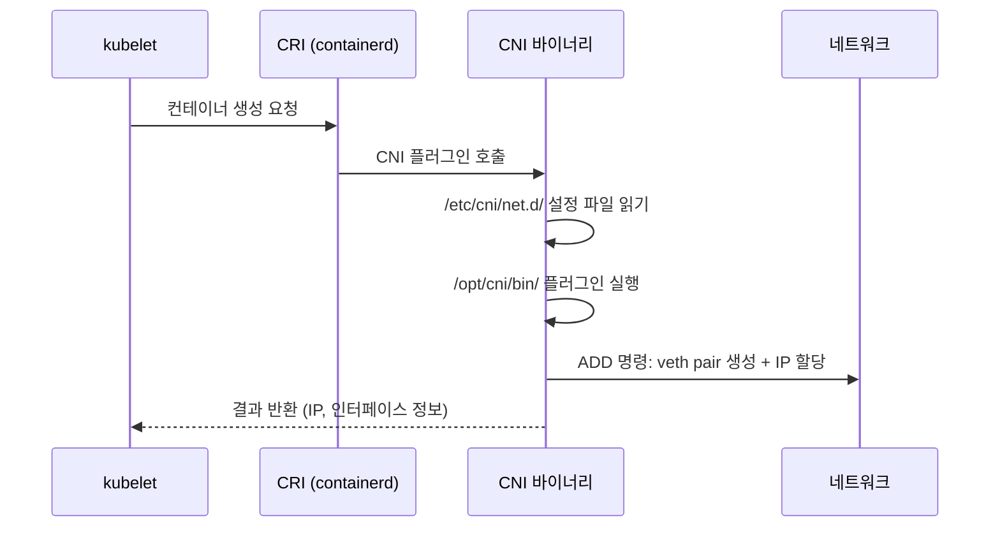

### CNI가 없으면 발생하는 현상

```bash
# CNI 미설치 시 노드 상태
kubectl get nodes
# NAME     STATUS     ROLES           AGE   VERSION
# node-1   NotReady   control-plane   5m    v1.30.0

# Pod 상태 확인
kubectl get pods -n kube-system
# coredns-xxxx   0/1   Pending   0   5m
```

- 노드가 `NotReady` 상태로 유지된다. kubelet이 CNI 바이너리를 찾지 못하기 때문이다.
- kube-system의 CoreDNS Pod가 `Pending` 상태에 머문다. 스케줄러가 NotReady 노드에 Pod를 배치하지 않기 때문이다.
- 컨트롤 플레인 컴포넌트(apiserver, etcd, scheduler, controller-manager)는 hostNetwork를 사용하므로 CNI 없이도 동작한다.

> 기억해야할 점: "CNI 없이 컨트롤 플레인이 동작하는 이유"는 hostNetwork 사용 때문이다. 이 구분을 명확히 설명할 수 있어야 한다.

공식 문서: [CNI Spec](https://www.cni.dev/docs/spec/), [Network Plugins](https://kubernetes.io/docs/concepts/extend-kubernetes/compute-storage-net/network-plugins/)

---

## Cilium의 eBPF와 iptables 비교

### eBPF란

**eBPF(extended Berkeley Packet Filter)는 리눅스 커널 내부에서 샌드박스된 프로그램을 실행할 수 있는 기술이다.** Cilium은 이 eBPF를 활용하여 커널 레벨에서 패킷을 처리하므로, userspace와 kernel 사이의 컨텍스트 스위칭 없이 네트워킹을 수행한다.

### iptables의 구조적 한계

| 항목      | iptables            | eBPF (Cilium)           |
|---------|---------------------|-------------------------|
| 규칙 평가   | 선형 탐색 O(n)          | 해시맵 O(1)                |
| 규칙 업데이트 | 전체 체인 재작성           | 개별 맵 엔트리 업데이트           |
| 가시성     | 없음 (별도 로깅 필요)       | Hubble로 실시간 관측          |
| L7 정책   | 불가                  | HTTP/gRPC/Kafka 프로토콜 인식 |
| 처리 위치   | netfilter 훅 (여러 단계) | TC/XDP 훅 (최소 경로)        |

```bash
# Service 1000개 환경에서 iptables 규칙 수
iptables -t nat -L | wc -l
# 약 20,000줄 이상 -> 패킷마다 선형 탐색

# Cilium은 BPF 맵으로 O(1) 조회
cilium bpf lb list
# 해시맵 기반이므로 Service 수와 무관하게 일정한 성능
```

### Cilium이 eBPF를 선택한 이유

1. **성능**: XDP(eXpress Data Path) 훅을 사용하면 드라이버 레벨에서 패킷을 처리하여 커널 네트워크 스택 전체를 바이패스할 수 있다. 로드밸런싱 지연시간이 iptables 대비 최대 10배 감소한다.
2. **확장성**: Service와 Endpoint가 수천 개로 늘어나도 BPF 맵의 해시 조회 시간은 일정하다. iptables는 규칙 수에 비례해 지연이 증가한다.
3. **관측성**: eBPF 프로그램이 패킷 흐름을 커널에서 직접 이벤트로 내보내므로, Hubble이 패킷 레벨 가시성을 제공할 수 있다.
4. **L7 인식**: eBPF에서 직접 HTTP 헤더, gRPC 메서드를 파싱하여 L7 네트워크 정책을 적용할 수 있다.

> 기억해야할 점: iptables의 O(n) 선형 탐색 vs eBPF의 O(1) 해시맵 조회 차이를 Service 수 증가 시나리오와 함께 설명할 수 있어야 한다.

공식 문서: [Cilium Introduction](https://docs.cilium.io/en/stable/overview/intro/), [What is eBPF?](https://ebpf.io/what-is-ebpf/), [Performance Tuning](https://docs.cilium.io/en/stable/operations/performance/tuning/)

---

## Cilium Identity 기반 보안 정책

### IP 기반 정책의 근본적 문제

```bash
# 전통적 방화벽/iptables 방식
iptables -A FORWARD -s 10.0.1.5 -d 10.0.2.3 -j ACCEPT

# Pod가 재시작되면 IP가 바뀐다
# 10.0.1.5 -> 10.0.1.12 (새 IP)
# -> 기존 규칙이 무효화됨
# -> 규칙 갱신까지 통신 불가 또는 의도치 않은 허용
```

### Identity 동작 방식

**Cilium은 Pod의 IP가 아닌 Security Identity라는 숫자 ID를 기반으로 네트워크 정책을 적용한다.** Identity는 Pod의 라벨 조합에서 파생되며, 같은 라벨 셋을 가진 모든 Pod는 동일한 Identity를 공유한다.

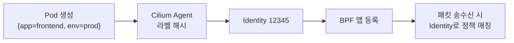

```bash
# Identity 확인
cilium identity list
# ID       LABELS
# 12345    k8s:app=frontend, k8s:env=prod
# 12346    k8s:app=backend, k8s:env=prod

# 특정 Endpoint의 Identity 확인
cilium endpoint list
# ENDPOINT   POLICY    IDENTITY   LABELS
# 1234       Enabled   12345      k8s:app=frontend
```

### Pod IP가 변경되어도 정책이 유지되는 이유

1. 정책은 Identity 번호에 바인딩되어 있다. IP에 바인딩되지 않는다.
2. Pod가 재시작되어 새 IP를 받더라도, 라벨이 동일하면 같은 Identity가 할당된다.
3. BPF 맵에서 `새 IP -> 기존 Identity` 매핑만 업데이트되고, 정책 룰 자체는 변경 없이 그대로 동작한다.

### 왜 중요한가

Kubernetes에서 Pod IP는 ephemeral(일시적)이다. Deployment 롤링 업데이트, HPA 스케일링, 노드 장애 복구 등에서 Pod IP는 수시로 변경된다. IP 기반 정책은 이런 동적 환경에서 정책 동기화 지연(race condition) 문제를 일으킨다. Identity 기반은 라벨만 유지되면 정책이 즉시 적용되므로, 정책 적용의 일관성과 속도가 보장된다.

공식 문서: [Identity](https://docs.cilium.io/en/stable/gettingstarted/identity/), [Policy Language](https://docs.cilium.io/en/stable/security/policy/language/)

---

## kube-proxy 대체: kubeProxyReplacement

### 대체되는 기능 목록

`kubeProxyReplacement=true`는 kube-proxy의 모든 기능을 Cilium의 eBPF 구현으로 대체한다는 선언이다. 이 설정이 활성화되면 kube-proxy DaemonSet을 완전히 제거할 수 있다.

| kube-proxy 기능         | Cilium eBPF 대체           | 설명                          |
|-----------------------|--------------------------|-----------------------------|
| ClusterIP             | eBPF Service Map         | Service VIP -> Pod IP 로드밸런싱 |
| NodePort              | eBPF NodePort            | 외부 트래픽을 노드 포트로 수신           |
| ExternalIP            | eBPF ExternalIP          | 외부 IP 바인딩                   |
| LoadBalancer          | eBPF + ExternalIP        | 클라우드/MetalLB 연동             |
| SessionAffinity       | BPF Session Affinity Map | ClientIP 기반 고정 라우팅          |
| externalTrafficPolicy | eBPF DSR/SNAT            | Local/Cluster 정책 지원         |
| HostPort              | eBPF HostPort            | Pod의 호스트 포트 바인딩             |

### Helm 설치 시 설정

```yaml
# values.yaml
kubeProxyReplacement: true

# 추가 최적화 옵션
k8sServiceHost: "API_SERVER_IP"  # kube-proxy 없이 apiserver 접근용
k8sServicePort: "6443"

# DSR(Direct Server Return) 활성화
loadBalancer:
  mode: dsr  # 응답 패킷이 원래 노드를 거치지 않음

# Maglev 해시로 일관된 로드밸런싱
loadBalancer:
  algorithm: maglev
```

### 성능 개선 포인트

1. **Service 조회**: iptables 선형 탐색 -> BPF 해시맵 O(1) 조회
2. **연결 추적**: conntrack 모듈 -> BPF CT(Connection Tracking) 맵
3. **DSR(Direct Server Return)**: 응답 패킷이 원래 수신 노드를 우회하여 직접 클라이언트에 전달. SNAT 오버헤드 제거.
4. **Maglev 해시**: 백엔드 변경 시에도 기존 연결의 목적지가 최대한 유지되는 consistent hashing.

```bash
# 대체 상태 확인
cilium status
# KubeProxyReplacement:   True
#   - ClusterIP:          Enabled
#   - NodePort:           Enabled (Range: 30000-32767)
#   - ExternalIP:         Enabled
#   - LoadBalancer:       Enabled
#   - HostPort:           Enabled
#   - SessionAffinity:    Enabled

# BPF Service 맵 확인
cilium bpf lb list
```

공식 문서: [Kubernetes without kube-proxy](https://docs.cilium.io/en/stable/network/kubernetes/kubeproxy-free/), [Maglev](https://docs.cilium.io/en/stable/network/loadbalancer/maglev/)

---

## 터널 모드 vs Native Routing

두 모드의 주요 차이는 노드 간 Pod 트래픽을 오버레이로 캡슐화하느냐, 직접 라우팅하느냐이다.

### 터널 모드 (VXLAN/Geneve)

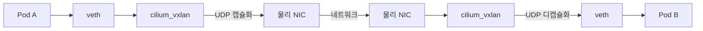

원본 패킷을 UDP로 감싸서 노드 간 전송한다. 외부 헤더는 노드 IP, 내부 헤더는 Pod IP이다.

- **VXLAN**: 사실상 표준이며 대부분의 NIC가 오프로딩을 지원한다. 포트 8472.
- **Geneve**: VXLAN의 후속 프로토콜로, 가변 길이 메타데이터(TLV) 지원. 포트 6081.
- **오버헤드**: 50바이트(VXLAN) ~ 가변(Geneve)의 헤더가 추가된다. MTU가 1500 -> 1450으로 조정 필요하다.

### Native Routing

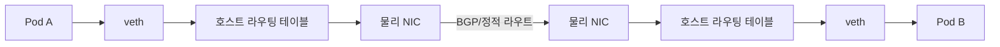

캡슐화 없이 Pod IP를 직접 라우팅한다. 네트워크 인프라가 Pod CIDR를 알아야 하며, BGP로 광고하거나 클라우드 VPC 라우팅 테이블에 등록한다. 오버헤드가 없으므로 원본 패킷 그대로 전송된다.

### 설정 비교

```yaml
# 터널 모드 (기본값)
tunnel: vxlan  # 또는 geneve
# routingMode: tunnel  (Cilium 1.14+)

# Native Routing
tunnel: disabled
# routingMode: native  (Cilium 1.14+)
ipam:
  mode: kubernetes
autoDirectNodeRoutes: true  # 같은 L2 서브넷 내 노드 간
# 다른 서브넷이면 BGP 필요
```

### 사용 시기 판단 기준

| 기준        | 터널 모드                  | Native Routing        |
|-----------|------------------------|-----------------------|
| 네트워크 제어권  | 없음 (클라우드, 제한된 환경)      | 있음 (BGP/라우터 설정 가능)    |
| 설치 난이도    | 낮음 (기본값, 추가 설정 불필요)    | 높음 (BGP/라우팅 설정 필요)    |
| 성능        | 캡슐화 오버헤드 있음            | 최적 (오버헤드 없음)          |
| MTU       | 50바이트 감소               | 변경 없음                 |
| 디버깅       | tcpdump 시 내부 패킷 확인 어려움 | Pod IP가 직접 보여 디버깅 용이  |
| 온프레미스 폐쇄망 | 네트워크팀 협조 불필요           | BGP 피어링 등 네트워크팀 협조 필요 |

성능 차이는 벤치마크상 Native Routing이 터널 모드 대비 약 5~10%의 처리량(throughput) 향상을 보인다. 대역폭보다 지연시간(latency)에 민감한 워크로드에서 차이가 더 크다. 다만 최신 NIC의 VXLAN 하드웨어 오프로딩이 지원되면 격차가 줄어든다.

> 기억해야할 점: 터널 모드의 MTU 오버헤드(50바이트)와 이로 인한 패킷 분할 문제, 그리고 Native Routing 시 BGP 설정이 필요한 이유를 함께 설명할 수 있어야 한다.

공식 문서: [Routing](https://docs.cilium.io/en/stable/network/concepts/routing/), [BGP Control Plane](https://docs.cilium.io/en/stable/network/bgp/bgp-control-plane/)

---

## Hubble: 네트워크 관측성

### 정의

**Hubble은 Cilium 위에 구축된 네트워크 관측성(Observability) 플랫폼이다.** eBPF 데이터 경로에서 직접 이벤트를 수집하므로, 별도 sidecar나 패킷 미러링 없이도 L3/L4/L7 수준의 네트워크 흐름을 실시간으로 관측할 수 있다.

### 아키텍처

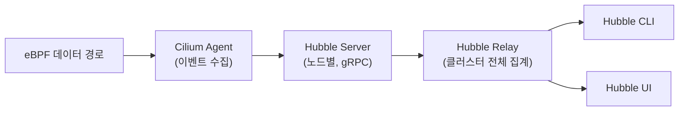

### hubble observe로 확인 가능한 것

**1. 트래픽 흐름(Flow) - 누가 누구에게 통신하는가**

```bash
hubble observe -n production
# TIMESTAMP    SOURCE             DESTINATION        TYPE     VERDICT
# 12:00:01     prod/frontend      prod/backend       L4/TCP   FORWARDED
# 12:00:01     prod/backend       prod/database      L4/TCP   FORWARDED
# 12:00:02     prod/frontend      kube-system/coredns L4/UDP  FORWARDED
```

출발지/목적지 Pod, 프로토콜, 포트, 판정(FORWARDED/DROPPED/ERROR)을 실시간으로 확인할 수 있다.

**2. 정책 적용 결과(Policy Verdict) - 왜 트래픽이 차단/허용되었는가**

```bash
# DROPPED된 트래픽만 필터링
hubble observe --verdict DROPPED
# 12:00:03  dev/debug-pod  prod/database  L4/TCP  DROPPED (policy denied)

# 특정 Pod의 정책 판정 결과
hubble observe --to-pod prod/database --verdict DROPPED
```

NetworkPolicy나 CiliumNetworkPolicy에 의해 차단된 트래픽을 정확히 식별할 수 있다. iptables에서는 이런 가시성이 존재하지 않는다.

**3. DNS 질의 내역 - 어떤 도메인을 조회하는가**

```bash
hubble observe --protocol dns
# 12:00:04  prod/frontend  kube-system/coredns  DNS Query "api.example.com" A
# 12:00:04  kube-system/coredns  prod/frontend  DNS Response "api.example.com" A 10.0.1.5

# L7 HTTP 요청 관측 (L7 정책 활성화 시)
hubble observe -n production --protocol http
# 12:00:05  prod/frontend  prod/backend  HTTP GET /api/users 200 15ms
```

DNS 질의와 응답을 Pod 단위로 추적할 수 있다. 어떤 Pod가 외부 도메인에 접근하는지 감사(audit)할 때 유용하다.

**Hubble UI**는 웹 기반 서비스 의존성 맵을 제공하며, Pod 간 통신 관계를 그래프로 시각화한다.

공식 문서: [Hubble Setup](https://docs.cilium.io/en/stable/gettingstarted/hubble_setup/), [Hubble Observability](https://docs.cilium.io/en/stable/observability/hubble/)

---

## K8s NetworkPolicy vs CiliumNetworkPolicy

**Kubernetes NetworkPolicy는 L3/L4 수준의 기본 네트워크 정책이고, CiliumNetworkPolicy는 Cilium CRD로 L3~L7까지 확장된 정책이다.**

### 기능 비교

| 기능                | K8s NetworkPolicy | CiliumNetworkPolicy                     |
|-------------------|-------------------|-----------------------------------------|
| L3/L4 정책          | 지원                | 지원                                      |
| L7 정책 (HTTP/gRPC) | 미지원               | 지원                                      |
| DNS 기반 정책 (FQDN)  | 미지원               | 지원                                      |
| 클러스터 범위 정책        | 미지원               | CiliumClusterwideNetworkPolicy          |
| 노드 정책             | 미지원               | 지원 (toNodes/fromNodes)                  |
| 정책 적용 방향          | Ingress/Egress    | Ingress/Egress + IngressDeny/EgressDeny |
| Identity 기반       | 미지원               | 지원                                      |

### Cilium 고유 기능 1: L7 HTTP/gRPC 정책

```yaml
apiVersion: cilium.io/v2
kind: CiliumNetworkPolicy
metadata:
  name: l7-rule
  namespace: production
spec:
  endpointSelector:
    matchLabels:
      app: backend
  ingress:
    - fromEndpoints:
        - matchLabels:
            app: frontend
      toPorts:
        - ports:
            - port: "8080"
              protocol: TCP
          rules:
            http:
              - method: GET
                path: "/api/v1/users"
              - method: POST
                path: "/api/v1/orders"
```

HTTP 메서드, 경로, 헤더 단위로 정책을 적용할 수 있다. K8s NetworkPolicy는 포트까지만 제어 가능하므로 "8080 포트는 허용하되 특정 API 경로만 허용"이 불가능하다.

### Cilium 고유 기능 2: FQDN 기반 Egress 정책

```yaml
apiVersion: cilium.io/v2
kind: CiliumNetworkPolicy
metadata:
  name: fqdn-rule
  namespace: production
spec:
  endpointSelector:
    matchLabels:
      app: backend
  egress:
    - toFQDNs:
        - matchName: "api.payment-gateway.com"
        - matchPattern: "*.amazonaws.com"
      toPorts:
        - ports:
            - port: "443"
              protocol: TCP
    - toEndpoints:
        - matchLabels:
            io.kubernetes.pod.namespace: kube-system
            k8s-app: kube-dns
      toPorts:
        - ports:
            - port: "53"
              protocol: UDP
          rules:
            dns:
              - matchPattern: "*"
```

외부 서비스를 IP가 아닌 도메인으로 제어할 수 있다. CDN이나 SaaS처럼 IP가 수시로 바뀌는 외부 서비스에 필수적이다. DNS 프록시를 통해 FQDN을 실시간으로 IP에 매핑한다.

### Cilium 고유 기능 3: Deny 정책 (명시적 차단)

```yaml
apiVersion: cilium.io/v2
kind: CiliumNetworkPolicy
metadata:
  name: deny-metadata
spec:
  endpointSelector: {}
  egressDeny:
    - toCIDR:
        - "169.254.169.254/32"  # 클라우드 메타데이터 서비스 차단
```

K8s NetworkPolicy는 "허용할 트래픽"만 정의하고 나머지를 암묵적으로 차단하는 구조다. CiliumNetworkPolicy는 `ingressDeny`/`egressDeny`로 명시적 차단 규칙을 정의할 수 있어, 허용 정책과 차단 정책을 별도로 관리할 수 있다.

> 기억해야할 점: "K8s NetworkPolicy로 할 수 없는 것"을 물을 때, L7 정책과 FQDN 기반 정책 두 가지를 구체적 YAML 예시와 함께 설명하면 강한 인상을 줄 수 있다.

공식 문서: [Security Policy](https://docs.cilium.io/en/stable/security/policy/), [DNS-based Policy](https://docs.cilium.io/en/stable/security/policy/language/#dns-based)

---

## WireGuard vs IPSec: 투명 암호화

### WireGuard 활성화 시 변화

**WireGuard를 활성화하면 노드 간 모든 Pod 트래픽이 자동으로 암호화(transparent encryption)된다.** 애플리케이션 변경 없이 Pod가 다른 노드의 Pod와 통신할 때 WireGuard 터널을 통해 암호화된 채로 전송된다.

```yaml
# Cilium Helm values
encryption:
  enabled: true
  type: wireguard
```

```bash
# 활성화 후 확인
cilium status --verbose
# Encryption: Wireguard

# WireGuard 인터페이스 확인
ip link show cilium_wg0
# cilium_wg0: <POINTOPOINT,NOARP,UP> mtu 1420 ...

# 피어 정보 확인
wg show cilium_wg0
```

각 노드에 `cilium_wg0` 인터페이스가 생성되고, Cilium Agent가 자동으로 키 교환을 수행한다. MTU가 60바이트 감소한다 (WireGuard 헤더).

### WireGuard vs IPSec 비교

| 항목            | WireGuard             | IPSec                         |
|---------------|-----------------------|-------------------------------|
| 코드 규모         | ~4,000줄               | ~400,000줄                     |
| 암호화 알고리즘      | ChaCha20-Poly1305 고정  | 협상 가능 (AES-GCM 등)             |
| 키 관리          | Cilium Agent 자동 관리    | Cilium Agent 자동 관리 (SPI 로테이션) |
| 성능            | 높음 (커널 모듈, 간결한 구현)    | 중간 (협상 오버헤드)                  |
| 커널 요구사항       | Linux 5.6+ (커널 모듈 내장) | 모든 커널 지원                      |
| FIPS 140-2 인증 | 미인증                   | AES-GCM 인증 가능                 |
| 노드 재시작 시      | 즉시 재연결 (stateless)    | SA 재협상 필요                     |
| 디버깅           | 간단 (wg show)          | 복잡 (ip xfrm state/policy)     |

### 폐쇄망 환경에서의 선택

두 가지 기준으로 판단한다.

1. **규제/컴플라이언스 요구사항이 있는가?** 금융/공공 분야에서 FIPS 140-2 또는 KCMVP(국내 암호모듈 검증) 인증이 필요하면 **IPSec(AES-GCM)**을 선택해야 한다. WireGuard의 ChaCha20은 FIPS 인증 대상이 아니다.

2. **규제 요구사항이 없다면?** **WireGuard를 권장한다.** 설정이 간단하고 성능이 우수하며, 커널 5.6 이상이면 별도 모듈 설치 없이 바로 사용 가능하다. 폐쇄망은 외부 패키지 설치가 제한적이므로, 커널 내장 모듈인 WireGuard가 의존성 관리 측면에서 유리하다.

```bash
# 커널 버전 확인
uname -r
# 5.15.0-xxx -> WireGuard 내장

# WireGuard 모듈 확인
lsmod | grep wireguard
```

공식 문서: [WireGuard Encryption](https://docs.cilium.io/en/stable/security/network/encryption-wireguard/), [IPSec Encryption](https://docs.cilium.io/en/stable/security/network/encryption-ipsec/)

---

## connectivity test 실패 진단

### unable to reach pod on other node

이 에러는 노드 간 Pod 통신이 실패한다는 의미이며, 같은 노드 내 Pod 통신은 정상이라는 전제이다. 체계적으로 아래에서 위로(물리 -> 오버레이 -> Cilium -> 정책) 진단한다.

### Step 1. Cilium Agent 상태 확인

```bash
# 모든 노드의 Cilium Agent 상태
cilium status

# Cilium Pod 로그 확인
kubectl -n kube-system logs -l k8s-app=cilium --tail=100 | grep -i error

# 양쪽 노드 모두 확인
kubectl -n kube-system exec -it cilium-xxxxx -- cilium status --verbose
```

Cilium Agent가 비정상이면 이후 진단이 무의미하다. BPF 맵 로드 실패, Identity 동기화 실패, IPAM 할당 실패 등을 먼저 확인한다.

### Step 2. 노드 간 기본 연결 확인 (underlay)

```bash
# 노드 A에서 노드 B로 ping
ping <노드B_IP>

# 터널 모드인 경우 VXLAN 포트(8472) 확인
nc -zvu <노드B_IP> 8472

# 방화벽/보안그룹 확인
iptables -L -n | grep 8472
```

노드 간 기본 통신이 안 되면 CNI 문제가 아니라 인프라 네트워크 문제이다. VXLAN 포트(UDP 8472)나 Geneve 포트(UDP 6081)가 방화벽에 의해 차단되는 경우가 빈번하다.

### Step 3. 터널/라우팅 상태 확인

```bash
# 터널 모드: 터널 엔드포인트 확인
cilium bpf tunnel list

# Native Routing: 라우팅 테이블 확인
ip route | grep 10.244

# BPF 노드 맵 확인
cilium bpf nodeid list
```

터널 엔드포인트에 상대 노드가 없으면 Cilium Agent 간 통신에 문제가 있는 것이다.

### Step 4. Pod의 Endpoint 상태 확인

```bash
cilium endpoint list
# ENDPOINT   POLICY    IDENTITY   IPv4           STATUS
# 1234       Enabled   56789      10.244.1.5     ready

# 특정 Endpoint의 상세 정보
cilium endpoint get 1234
```

Endpoint 상태가 `not-ready`이거나 `regenerating`에 머물러 있으면 BPF 프로그램 컴파일/로드에 실패한 것이다.

### Step 5. 정책에 의한 차단 여부 확인

```bash
# Hubble로 DROPPED 트래픽 확인
hubble observe --from-pod <source-pod> --to-pod <dest-pod> --verdict DROPPED

# 정책 트레이싱
cilium policy trace --src-identity <src-id> --dst-identity <dst-id> --dport 80
```

모든 인프라가 정상인데 통신이 안 되면 CiliumNetworkPolicy에 의한 차단일 가능성이 높다.

### Step 6. MTU 불일치 확인

```bash
ip link show | grep mtu
# eth0: mtu 1500
# cilium_vxlan: mtu 1450
# lxc-xxx: mtu 1450

# MTU가 안 맞으면 큰 패킷이 드롭된다
# ping은 되는데 HTTP 트래픽이 안 되는 경우 -> MTU 문제 의심
ping -M do -s 1400 <목적지Pod_IP>
```

> 기억해야할 점: "ping은 되는데 HTTP가 안 된다"는 증상은 MTU 문제를 강하게 시사한다. 이 진단 포인트를 알고 있으면 트러블슈팅 역량을 보여줄 수 있다.

공식 문서: [Troubleshooting](https://docs.cilium.io/en/stable/operations/troubleshooting/), [CLI Reference](https://docs.cilium.io/en/stable/operations/cmd/)

---

## kube-proxy 제거 절차

### 주요 원칙

**Cilium이 kube-proxy의 모든 기능을 완전히 인수한 것을 확인한 후에만 kube-proxy를 제거해야 한다.** 순서가 뒤바뀌면 전체 클러스터의 Service 통신이 중단된다.

### Phase 1. Cilium 설치 (kubeProxyReplacement 활성화)

```bash
helm install cilium cilium/cilium \
  --namespace kube-system \
  --set kubeProxyReplacement=true \
  --set k8sServiceHost="API_SERVER_IP" \
  --set k8sServicePort="6443"
```

`k8sServiceHost`/`k8sServicePort`를 반드시 설정해야 한다. kube-proxy 제거 후에도 Cilium이 apiserver에 접근할 수 있어야 하기 때문이다.

### Phase 2. Cilium 정상 동작 확인

```bash
# 1) Cilium Agent 상태 확인
cilium status
# KubeProxyReplacement: True

# 2) BPF Service 맵에 기존 Service가 모두 등록되었는지 확인
cilium bpf lb list | wc -l
kubectl get svc --all-namespaces | wc -l

# 3) connectivity test 실행
cilium connectivity test

# 4) 실제 Service 통신 테스트
kubectl run test --image=busybox --rm -it -- wget -qO- http://kubernetes.default.svc
```

### Phase 3. kube-proxy의 iptables 규칙 정리

```bash
kubectl -n kube-system exec -it cilium-xxxxx -- \
  cilium-dbg cleanup-kube-proxy-rules
# 또는 수동으로
iptables-save | grep -v KUBE | iptables-restore
```

### Phase 4. kube-proxy 제거

```bash
# kube-proxy DaemonSet 삭제
kubectl -n kube-system delete ds kube-proxy

# kube-proxy ConfigMap 삭제 (선택)
kubectl -n kube-system delete cm kube-proxy

# kube-proxy ServiceAccount 삭제 (선택)
kubectl -n kube-system delete sa kube-proxy
```

### Phase 5. 제거 후 최종 검증

```bash
# kube-proxy Pod가 없는지 확인
kubectl -n kube-system get pods | grep kube-proxy

# iptables에 KUBE 체인이 없는지 확인
iptables -t nat -L | grep KUBE

# Service 통신 재확인
cilium connectivity test
```

### 잘못된 순서 시 발생하는 문제

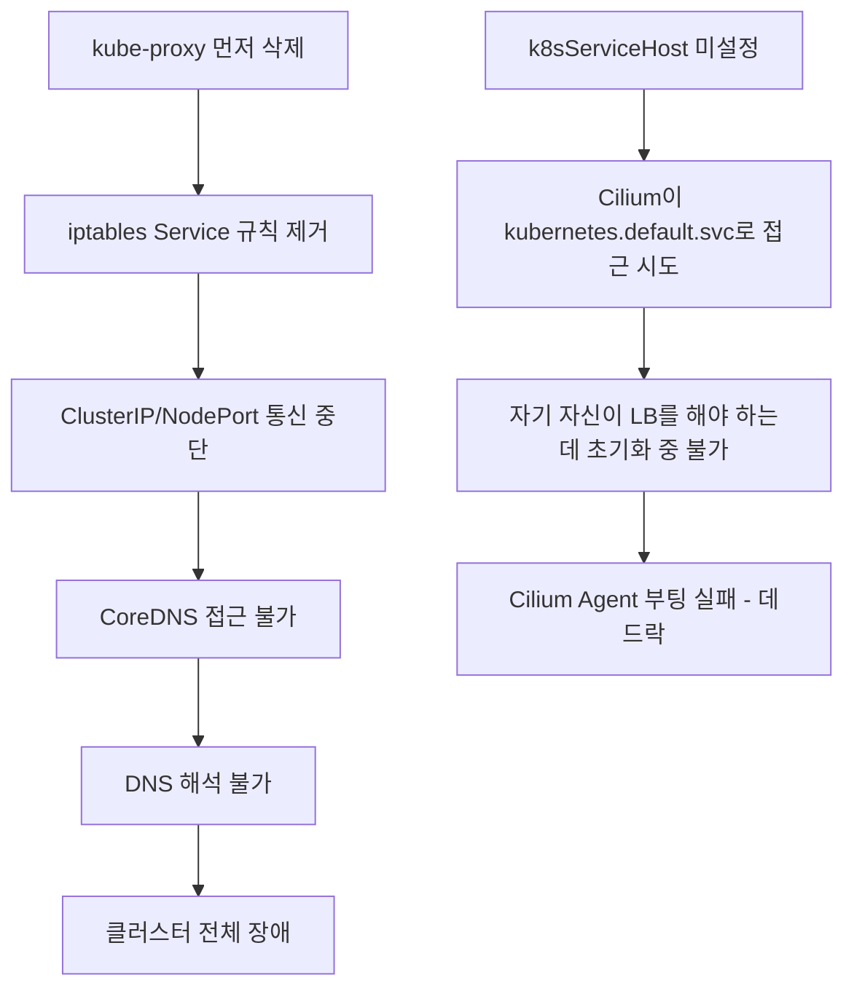

**시나리오 1: kube-proxy를 먼저 삭제하고 Cilium을 설치하는 경우** - 모든 Service 통신 중단, CoreDNS도 중단, 클러스터 전체 장애가 발생한다.

**시나리오 2: k8sServiceHost/Port 미설정 상태에서 kube-proxy 삭제** - Cilium Agent가 apiserver에 접근하지 못해 부팅 실패하고, kube-proxy도 없는 데드락 상태에 빠진다.

> 기억해야할 점: "순서를 바꾸면 어떻게 되는가?"라는 질문에 구체적인 장애 시나리오(Service 통신 중단 -> CoreDNS 중단 -> 클러스터 전체 장애)를 설명할 수 있어야 한다.

공식 문서: [Kubernetes without kube-proxy](https://docs.cilium.io/en/stable/network/kubernetes/kubeproxy-free/), [Helm Installation](https://docs.cilium.io/en/stable/installation/k8s-install-helm/)

---

## 주요 키워드 정리

| 주제                   | 주요 키워드                                                           |
|----------------------|------------------------------------------------------------------|
| CNI                  | CNI 스펙(ADD/DEL/CHECK), IPAM, veth pair, NotReady, hostNetwork    |
| eBPF                 | XDP, TC 훅, BPF 맵(해시맵), O(1) vs O(n), kube-proxy 대체               |
| Identity             | Security Identity, 라벨 기반 해시, ephemeral IP, 정책 일관성                |
| kubeProxyReplacement | BPF Service Map, DSR, Maglev, conntrack                          |
| 터널/라우팅               | VXLAN(UDP 8472), Geneve(UDP 6081), Native Routing, BGP, MTU 오버헤드 |
| Hubble               | Flow, Policy Verdict, DNS 관측, Hubble Relay                       |
| CiliumNetworkPolicy  | L7 정책, FQDN toFQDNs, DNS 프록시, IngressDeny/EgressDeny             |
| 암호화                  | WireGuard(ChaCha20), IPSec(AES-GCM), FIPS 140-2, cilium_wg0      |
| 트러블슈팅                | underlay 확인, VXLAN 포트, endpoint status, policy trace, MTU 불일치    |
| kube-proxy 제거        | 순서 중요, k8sServiceHost, iptables 정리, 데드락 방지                       |

---

# 07. 보안

Kubernetes 보안은 인증(Authentication), 인가(Authorization), Admission Control, 런타임 보안까지 다층으로 구성된다. 클러스터를 운영하는 DevOps/SRE라면 각 계층의 동작 원리를 이해하고 최소 권한 원칙을 구현할 수 있어야 한다.

---

## RBAC 4대 리소스

RBAC(Role-Based Access Control)은 "누가(Subject), 무엇을(Resource), 어떤 행위를(Verb)" 할 수 있는지를 정의하는 인가 메커니즘이다. 4개 리소스는 역할(Role)과 바인딩(Binding) 두 축, 네임스페이스/클러스터 두 범위로 나뉜다.

| 리소스                | 범위      | 역할                              |
|--------------------|---------|---------------------------------|
| Role               | 네임스페이스  | 특정 네임스페이스 내 권한 정의               |
| ClusterRole        | 클러스터 전체 | 클러스터 범위 권한 정의                   |
| RoleBinding        | 네임스페이스  | Subject에 Role 또는 ClusterRole 부여 |
| ClusterRoleBinding | 클러스터 전체 | Subject에 ClusterRole 부여         |

### Role (네임스페이스 범위)

```yaml
apiVersion: rbac.authorization.k8s.io/v1
kind: Role
metadata:
  namespace: production
  name: pod-reader
rules:
  - apiGroups: [ "" ]          # core API group
    resources: [ "pods" ]
    verbs: [ "get", "watch", "list" ]
  - apiGroups: [ "" ]
    resources: [ "pods/log" ]  # 서브리소스
    verbs: [ "get" ]
```

production 네임스페이스에서만 Pod 읽기가 가능하다. 다른 네임스페이스에는 효력이 없다.

### ClusterRole (클러스터 범위)

```yaml
apiVersion: rbac.authorization.k8s.io/v1
kind: ClusterRole
metadata:
  name: node-reader  # namespace 필드 없음
rules:
  - apiGroups: [ "" ]
    resources: [ "nodes" ]     # 클러스터 범위 리소스
    verbs: [ "get", "list" ]
  - apiGroups: [ "" ]
    resources: [ "pods" ]      # 네임스페이스 리소스도 정의 가능
    verbs: [ "get", "list" ]
```

ClusterRole은 두 가지 용도가 있다.

1. Node, PersistentVolume 같은 클러스터 범위 리소스에 대한 권한
2. 여러 네임스페이스에서 재사용할 공통 권한 템플릿 (RoleBinding으로 특정 네임스페이스에 바인딩)

### RoleBinding (네임스페이스 내 바인딩)

```yaml
apiVersion: rbac.authorization.k8s.io/v1
kind: RoleBinding
metadata:
  name: read-pods
  namespace: production
subjects:
  - kind: User
    name: jane
    apiGroup: rbac.authorization.k8s.io
  - kind: ServiceAccount
    name: monitoring-sa
    namespace: monitoring    # 다른 네임스페이스의 SA도 가능
roleRef:
  kind: ClusterRole          # ClusterRole을 RoleBinding으로 묶으면
  name: pod-reader           # production 네임스페이스에서만 적용됨
  apiGroup: rbac.authorization.k8s.io
```

ClusterRole + RoleBinding = 네임스페이스 범위로 축소된다. 이 패턴으로 "공통 ClusterRole 하나 정의 후 각 네임스페이스에 RoleBinding으로 재사용"이 가능하다.

### ClusterRoleBinding (클러스터 전체 바인딩)

```yaml
apiVersion: rbac.authorization.k8s.io/v1
kind: ClusterRoleBinding
metadata:
  name: admin-binding
subjects:
  - kind: Group
    name: platform-team
    apiGroup: rbac.authorization.k8s.io
roleRef:
  kind: ClusterRole
  name: cluster-admin
  apiGroup: rbac.authorization.k8s.io
```

ClusterRoleBinding은 모든 네임스페이스에 걸쳐 권한을 부여하므로, `cluster-admin` 같은 강력한 ClusterRole을 바인딩하면 전체 클러스터를 제어할 수 있다. 최소 권한 원칙에 따라 신중하게 사용해야 한다.

### 실무 조합 패턴

| 조합                               | 결과                        |
|----------------------------------|---------------------------|
| Role + RoleBinding               | 특정 NS에서만 권한 (가장 안전)       |
| ClusterRole + RoleBinding        | 공통 템플릿을 특정 NS에 적용 (권장 패턴) |
| ClusterRole + ClusterRoleBinding | 전체 클러스터 권한 (최소화 필요)       |
| Role + ClusterRoleBinding        | **불가능** (API 에러)          |

> 기억해야할 점: "ClusterRole + RoleBinding 조합의 효과"를 묻는 경우가 많다. ClusterRole이 클러스터 범위이더라도 RoleBinding으로 바인딩하면 해당 네임스페이스로 범위가 축소된다는 점을 명확히 설명할 수 있어야 한다.
> {: .prompt-tip }

**공식 문서:** <https://kubernetes.io/docs/reference/access-authn-authz/rbac/>

---

## ServiceAccount와 Pod에서 API 인증

ServiceAccount는 Pod(워크로드)가 Kubernetes API에 접근할 때 사용하는 인증 주체(identity)이다. 사람이 kubectl로 접근할 때 User Account를 사용하듯, Pod는 ServiceAccount를 사용한다.

### 인증 흐름

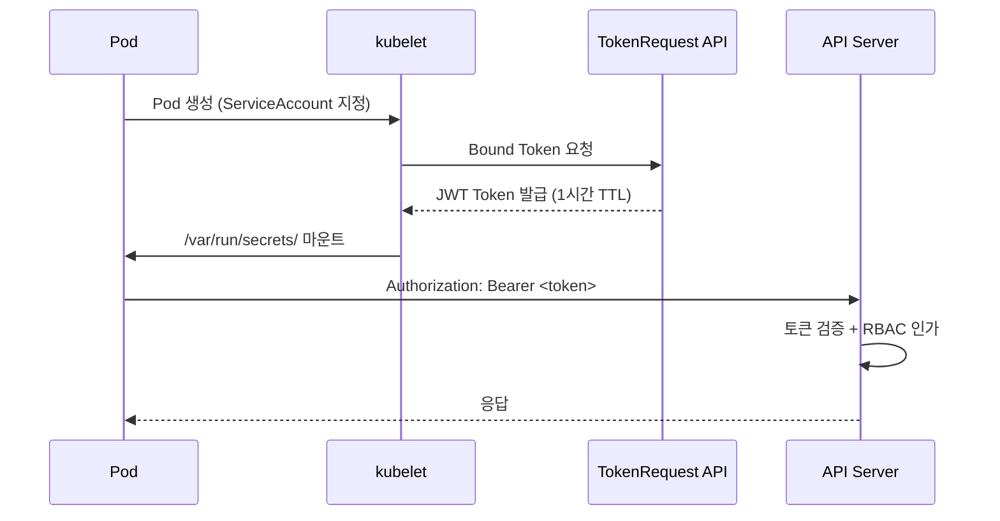

```bash
# Pod 내부에서 토큰 확인
kubectl exec -it my-pod -- ls /var/run/secrets/kubernetes.io/serviceaccount/
# ca.crt     namespace  token

# 토큰으로 API 호출 (Pod 내부에서)
TOKEN=$(cat /var/run/secrets/kubernetes.io/serviceaccount/token)
curl -s --cacert /var/run/secrets/kubernetes.io/serviceaccount/ca.crt \
  -H "Authorization: Bearer $TOKEN" \
  https://kubernetes.default.svc/api/v1/namespaces/default/pods
```

### Bound Service Account Token (K8s 1.22+)

기존의 Secret 기반 토큰은 만료 없이 영구적이었다. 보안 위험이 크므로 Kubernetes 1.22부터 Bound Token이 기본값이 되었다.

- 시간 제한: 기본 1시간 (kubelet이 자동 갱신)
- 대상 제한: 특정 audience에만 유효
- Pod 삭제 시 즉시 무효화

### automountServiceAccountToken: false

```yaml
apiVersion: v1
kind: Pod
metadata:
  name: nginx
spec:
  automountServiceAccountToken: false  # 토큰 마운트 비활성화
  containers:
    - name: nginx
      image: nginx:1.27
```

설정하는 이유는 다음과 같다.

1. **최소 권한 원칙**: 대부분의 애플리케이션은 Kubernetes API를 호출할 필요가 없다. 토큰이 마운트되면 공격자가 Pod를 침투했을 때 API 접근 경로를 제공하게 된다.
2. **SSRF 공격 방어**: 토큰이 존재하면 SSRF 공격으로 Pod 내부에서 API Server에 요청을 보낼 수 있다.
3. **CKS 시험 필수 항목**: CKS에서 보안 강화 문제로 자주 출제된다.

```yaml
# ServiceAccount 레벨에서 일괄 비활성화 (권장)
apiVersion: v1
kind: ServiceAccount
metadata:
  name: no-api-access
  namespace: production
automountServiceAccountToken: false
---
# API 접근이 필요한 Pod만 명시적으로 활성화
apiVersion: v1
kind: Pod
metadata:
  name: controller
spec:
  serviceAccountName: my-controller-sa
  automountServiceAccountToken: true  # 명시적 허용
```

**실무 권장 패턴:**

- 네임스페이스의 default ServiceAccount에 `automountServiceAccountToken: false` 설정
- API 접근이 필요한 워크로드만 전용 ServiceAccount 생성 + RBAC 바인딩
- default ServiceAccount에는 절대 권한을 부여하지 않는다

**공식 문서:**

- <https://kubernetes.io/docs/concepts/security/service-accounts/>
- <https://kubernetes.io/docs/tasks/configure-pod-container/configure-service-account/>

---

## Pod Security Standards 3단계

Pod Security Standards(PSS)는 PodSecurityPolicy(PSP)를 대체하는 K8s 내장 보안 정책이다. K8s 1.25에서 PSP가 제거되고 Pod Security Admission(PSA)이 GA되었다. PSS는 정책의 "내용"이고, PSA는 "적용 메커니즘"이다.

### 3단계 정책

| 레벨             | 대상         | 제약 수준            |
|----------------|------------|------------------|
| **Privileged** | 시스템 컴포넌트   | 제한 없음 (모든 것 허용)  |
| **Baseline**   | 일반 워크로드    | 알려진 위험한 설정 차단    |
| **Restricted** | 보안 중요 워크로드 | 최대한 제한, 최소 권한 강제 |

**Baseline이 차단하는 것:**

- `hostNetwork: true`, `hostPID: true`, `hostIPC: true`
- `privileged: true` 컨테이너
- 위험한 capabilities: `NET_RAW`, `SYS_ADMIN` 등
- hostPath 볼륨 (일부)
- `/proc` 마운트 변경

**Restricted가 추가로 강제하는 것:**

- `runAsNonRoot: true` 필수
- `allowPrivilegeEscalation: false` 필수
- `readOnlyRootFilesystem: true` 권장
- `seccompProfile: RuntimeDefault` 또는 `Localhost` 필수
- capabilities는 `drop: ["ALL"]` 후 필요한 것만 `add`
- 볼륨 타입을 configMap, emptyDir, secret, downwardAPI, persistentVolumeClaim, projected, csi, ephemeral로 제한

### 네임스페이스 적용 방법 (Label 기반)

```yaml
apiVersion: v1
kind: Namespace
metadata:
  name: production
  labels:
    # enforce: 위반 Pod 생성 자체를 거부
    pod-security.kubernetes.io/enforce: restricted
    pod-security.kubernetes.io/enforce-version: v1.30

    # warn: 위반 시 경고 메시지 출력하지만 생성은 허용
    pod-security.kubernetes.io/warn: restricted
    pod-security.kubernetes.io/warn-version: v1.30

    # audit: 위반 시 감사 로그에 기록, 생성은 허용
    pod-security.kubernetes.io/audit: restricted
    pod-security.kubernetes.io/audit-version: v1.30
```

```bash
# 기존 네임스페이스에 라벨 추가
kubectl label namespace production \
  pod-security.kubernetes.io/enforce=baseline \
  pod-security.kubernetes.io/warn=restricted

# 적용 확인
kubectl describe namespace production
```

### 단계적 적용 전략 (권장)

```yaml
# Phase 1: audit만 켜서 위반 현황 파악
pod-security.kubernetes.io/audit: restricted

# Phase 2: warn 추가로 개발자에게 경고
pod-security.kubernetes.io/warn: restricted

# Phase 3: enforce로 실제 차단
pod-security.kubernetes.io/enforce: restricted
```

Restricted 위반 시 에러 메시지 예시:

```bash
kubectl apply -f privileged-pod.yaml
# Error from server (Forbidden): error when creating "pod.yaml":
# pods "test" is forbidden: violates PodSecurity "restricted:v1.30":
# allowPrivilegeEscalation != false (container "app" must set
# securityContext.allowPrivilegeEscalation=false),
# runAsNonRoot != true (pod or container "app" must set
# securityContext.runAsNonRoot=true)
```

> 기억해야할 점: kube-system 네임스페이스는 반드시 Privileged로 유지해야 한다. kube-proxy, CNI 플러그인, CSI 드라이버, CoreDNS, metrics-server 등 시스템 컴포넌트는 호스트 접근이 필요하기 때문이다.
> {: .prompt-tip }

**공식 문서:**

- <https://kubernetes.io/docs/concepts/security/pod-security-standards/>
- <https://kubernetes.io/docs/concepts/security/pod-security-admission/>

---

## OPA Gatekeeper: ConstraintTemplate과 Constraint

ConstraintTemplate은 정책의 "틀(Template)"이고, Constraint는 그 틀을 기반으로 만든 "실제 정책 인스턴스"이다. 프로그래밍에 비유하면 ConstraintTemplate은 클래스(Class)이고, Constraint는 인스턴스(Object)이다.

### 관계 구조

```mermaid
flowchart TD
    CT["ConstraintTemplate<br/>(정책 로직 + 파라미터 스키마)"]
    CT --> C1["Constraint 1<br/>production NS, 파라미터 A"]
    CT --> C2["Constraint 2<br/>staging NS, 파라미터 B"]
    CT --> C3["Constraint 3<br/>전체 적용, 파라미터 C"]
```

### ConstraintTemplate 정의

```yaml
apiVersion: templates.gatekeeper.sh/v1
kind: ConstraintTemplate
metadata:
  name: k8srequiredlabels
spec:
  crd:
    spec:
      names:
        kind: K8sRequiredLabels  # 이 이름으로 Constraint CRD가 자동 생성됨
      validation:
        openAPIV3Schema:
          type: object
          properties:
            labels:
              type: array
              items:
                type: string
  targets:
    - target: admission.k8s.gatekeeper.sh
      rego: |
        package k8srequiredlabels

        violation[{"msg": msg}] {
          provided := {label | input.review.object.metadata.labels[label]}
          required := {label | label := input.parameters.labels[_]}
          missing := required - provided
          count(missing) > 0
          msg := sprintf("필수 라벨 누락: %v", [missing])
        }
```

ConstraintTemplate이 정의하는 것:

1. **Rego 정책 코드**: 위반 조건의 로직
2. **파라미터 스키마**: Constraint에서 주입할 값의 형태
3. **CRD 이름**: Constraint를 만들 때 사용할 Kind 이름

### Constraint 정의

```yaml
apiVersion: constraints.gatekeeper.sh/v1beta1
kind: K8sRequiredLabels           # ConstraintTemplate이 생성한 CRD
metadata:
  name: require-team-label
spec:
  enforcementAction: deny          # deny, dryrun, warn
  match:
    kinds:
      - apiGroups: [ "" ]
        kinds: [ "Namespace" ]
    excludedNamespaces:
      - kube-system
      - gatekeeper-system
  parameters:
    labels:
      - "team"
      - "environment"
```

Constraint가 정의하는 것:

1. **적용 대상**: 어떤 리소스, 어떤 네임스페이스에 적용할지
2. **파라미터 값**: ConstraintTemplate 스키마에 맞는 구체적 값
3. **적용 모드**: deny(차단), dryrun(감사만), warn(경고)

### 역할 분리의 장점

보안팀이 ConstraintTemplate(정책 로직)을 관리하고, 플랫폼팀이 Constraint(적용 범위/파라미터)를 관리하는 역할 분리가 가능하다. 하나의 ConstraintTemplate으로 여러 Constraint를 만들 수 있다.

**공식 문서:**

- <https://open-policy-agent.github.io/gatekeeper/website/docs/howto>
- <https://open-policy-agent.github.io/gatekeeper/website/docs/constrainttemplates>

---

## Rego 정책 코드 분석

아래 Rego 코드는 "리소스에 필수 라벨이 있는지 검사"하는 정책이다.

```rego
violation[{"msg": msg}] {
  provided := {label | input.review.object.metadata.labels[label]}
  required := {label | label := input.parameters.labels[_]}
  missing := required - provided
  count(missing) > 0
  msg := sprintf("Missing labels: %v", [missing])
}
```

### 각 변수 분석

**`provided` - 리소스에 실제 존재하는 라벨의 집합:**

```rego
provided := {label | input.review.object.metadata.labels[label]}
```

- `input.review.object`는 Gatekeeper가 Admission Webhook을 통해 전달받은 리소스 오브젝트이다.
- `{label | ...}`는 Set Comprehension(집합 생성식)으로, labels 맵의 키를 순회하며 키 이름들의 집합을 만든다.
- 결과 예시: `{"team"}` (라벨 값은 무시하고 키만 수집)

**`required` - Constraint에서 요구하는 라벨의 집합:**

```rego
required := {label | label := input.parameters.labels[_]}
```

- `input.parameters`는 Constraint에서 정의한 파라미터이다.
- `[_]`는 배열의 모든 인덱스를 순회하는 와일드카드이다.
- 결과 예시: `{"team", "environment"}`

**`missing` - 누락된 라벨의 집합:**

```rego
missing := required - provided
```

- Rego의 집합 연산이다. `required`에서 `provided`를 빼면 "요구되지만 존재하지 않는 라벨"이 남는다.
- 결과 예시: `{"team", "environment"} - {"team"} = {"environment"}`

### 전체 실행 흐름 예시

```
# Constraint: labels = ["team", "environment", "cost-center"]
# 생성 시도: Namespace with labels = {team: "backend", environment: "prod"}

provided = {"team", "environment"}
required = {"team", "environment", "cost-center"}
missing  = {"cost-center"}
count({"cost-center"}) = 1 > 0 → true
msg = "Missing labels: {\"cost-center\"}"
→ 위반! 생성 거부
```

### Rego 문법 주요 포인트

- `:=`는 즉시 할당(local variable)이다. `=`는 유니피케이션(unification)이다.
- `{x | 조건}`은 Set Comprehension이다. 조건을 만족하는 x의 집합을 반환한다.
- `[_]`는 배열의 모든 요소를 순회하는 와일드카드이다.
- violation 룰의 본문은 모든 라인이 AND로 연결된다. 하나라도 false이면 위반이 발생하지 않는다.

**공식 문서:**

- <https://www.openpolicyagent.org/docs/latest/policy-language/>
- <https://open-policy-agent.github.io/gatekeeper/website/docs/howto>

---

## dryrun에서 deny 전환 시 사고 방지

dryrun에서 deny로 전환하면 "관측만 하던 정책이 실제로 차단을 시작하는 순간"이므로, 기존 워크로드가 정책에 위반되면 배포/업데이트가 모두 차단된다.

### 사고 시나리오

```
# 잘못된 전환: 위반 리소스 23개 존재 상태에서 deny 전환
→ HPA가 Pod를 스케일아웃하려 하는데, 라벨 누락으로 생성 거부
→ Deployment 롤링 업데이트 시 새 ReplicaSet 생성 거부
→ CronJob 스케줄 시 Job 생성 거부
→ 결과: 프로덕션 배포 및 오토스케일링 전면 중단
```

### 사고 방지 절차

**Step 1. dryrun 상태에서 위반 현황 파악**

```bash
# Constraint 상태에서 위반 목록 확인
kubectl get k8srequiredlabels require-team-label -o yaml
# status:
#   totalViolations: 23
#   violations:
#     - enforcementAction: dryrun
#       kind: Namespace
#       name: legacy-service
#       message: "Missing labels: {\"team\"}"

# 전체 Constraint 위반 현황 일괄 확인
kubectl get constraints -o json | jq '.items[] | {
  name: .metadata.name,
  enforcement: .spec.enforcementAction,
  violations: .status.totalViolations
}'
```

totalViolations가 0이 아니면 deny 전환 시 해당 리소스의 업데이트가 차단된다. 반드시 0으로 만든 후 전환해야 한다.

**Step 2. 위반 리소스 수정**

```bash
kubectl label namespace legacy-service team=legacy environment=prod
kubectl get k8srequiredlabels require-team-label -o jsonpath='{.status.totalViolations}'
# 0
```

**Step 3. warn 모드를 거쳐서 전환**

```yaml
spec:
  enforcementAction: warn  # 중간 단계
```

warn 모드에서는 kubectl 사용자에게 경고 메시지를 표시하지만 생성은 허용한다.

**Step 4. CI/CD 파이프라인에서 사전 검증**

```bash
# Gatekeeper의 gator CLI로 배포 전 정책 위반 검사
gator verify manifests/ --constraint-paths constraints/

# 또는 conftest로 Rego 정책 직접 테스트
conftest test deployment.yaml --policy policies/
```

**Step 5. 점진적 전환 (네임스페이스별)**

```yaml
# 단계 1: 신규 네임스페이스만 deny
spec:
  enforcementAction: deny
  match:
    namespaceSelector:
      matchExpressions:
        - key: policy-phase
          operator: In
          values: [ "enforced" ]

# 단계 2: 전체 네임스페이스로 확대
spec:
  enforcementAction: deny
  match:
    excludedNamespaces:
      - kube-system
      - gatekeeper-system
```

**Step 6. deny 전환 후 모니터링**

```bash
kubectl -n gatekeeper-system logs -l control-plane=audit-controller -f
kubectl get events --field-selector reason=FailedCreate -A
```

> 기억해야할 점: "dryrun 상태에서 totalViolations를 0으로 만든 후 전환"하는 절차를 구체적으로 설명할 수 있어야 한다. 단순히 "dryrun 먼저 적용 후 deny로 바꾼다"는 답변은 불충분하다.
> {: .prompt-tip }

**공식 문서:**

- <https://open-policy-agent.github.io/gatekeeper/website/docs/violations>
- <https://open-policy-agent.github.io/gatekeeper/website/docs/gator>

---

## Trivy: 취약점 스캐너

Trivy는 Aqua Security에서 개발한 오픈소스 취약점 스캐너이다. 컨테이너 이미지, 파일시스템, IaC 설정 파일을 스캔하여 CVE 기반 취약점을 탐지한다.

### 심각도 분류 기준 (CVSS v3)

| 심각도      | CVSS 점수    | 의미                         |
|----------|------------|----------------------------|
| CRITICAL | 9.0 ~ 10.0 | 원격 코드 실행, 인증 우회 등 즉각 대응 필요 |
| HIGH     | 7.0 ~ 8.9  | 권한 상승, 데이터 유출 가능성          |
| MEDIUM   | 4.0 ~ 6.9  | 제한된 조건에서 악용 가능             |
| LOW      | 0.1 ~ 3.9  | 정보 노출 등 영향 제한적             |
| UNKNOWN  | N/A        | CVSS 점수 미할당 (NVD 미등록)      |

```bash
# 이미지 스캔
trivy image nginx:1.27

# 심각도 필터링
trivy image --severity CRITICAL,HIGH nginx:1.27

# JSON 출력 (CI/CD 파이프라인 연동)
trivy image --format json --output results.json nginx:1.27
```

### CRITICAL 취약점 대응 방법

**1. 즉각 분석:**

```bash
trivy image --severity CRITICAL nginx:1.27
# ┌──────────────┬────────────────┬──────────┬───────────┬──────────────┐
# │   Library    │ Vulnerability  │ Severity │ Installed │    Fixed     │
# ├──────────────┼────────────────┼──────────┼───────────┼──────────────┤
# │ libcurl4     │ CVE-2024-XXXXX │ CRITICAL │ 7.88.1-10 │ 7.88.1-10+1 │
# └──────────────┴────────────────┴──────────┴───────────┴──────────────┘
```

**2. 베이스 이미지 업데이트 (Fix 있는 경우):**

```dockerfile
# 변경 전
FROM nginx:1.27

# 변경 후: 패치된 버전으로 업데이트
FROM nginx:1.27.3
# 또는 distroless/minimal 이미지로 교체
FROM nginx:1.27-alpine
```

**3. CI/CD 게이트 설정:**

```bash
# CI 파이프라인에서 CRITICAL 발견 시 빌드 실패
trivy image --exit-code 1 --severity CRITICAL my-app:latest
# exit code 1 → 파이프라인 실패 → 배포 차단
```

**4. 예외 처리 (False Positive 또는 즉시 패치 불가 시):**

```yaml
# .trivyignore 파일
# CVE-2024-XXXXX: libcurl 취약점, 해당 코드 경로 미사용, 2024-04-01까지 예외
CVE-2024-XXXXX
```

예외 처리 시 반드시 사유와 만료일을 기록한다. 무기한 예외는 기술 부채가 된다.

**5. 런타임 완화 조치 (패치 불가 시):**

```yaml
securityContext:
  readOnlyRootFilesystem: true
  runAsNonRoot: true
  capabilities:
    drop: [ "ALL" ]
```

**공식 문서:**

- <https://aquasecurity.github.io/trivy/latest/>
- <https://aquasecurity.github.io/trivy/latest/docs/scanner/vulnerability/>

---

## Trivy Operator vs CLI

Trivy CLI는 명령 한 번에 스캔을 수행하는 일회성 도구이고, Trivy Operator는 Kubernetes 클러스터 내에서 지속적으로 자동 스캔하는 컨트롤러이다.

### 차이 비교

| 항목       | Trivy CLI      | Trivy Operator                       |
|----------|----------------|--------------------------------------|
| 실행 방식    | 수동/CI 파이프라인    | 클러스터 내 자동 (Controller)               |
| 스캔 시점    | 빌드/배포 시        | 배포 후 + 주기적(새 CVE 발표 시)               |
| 결과 저장    | stdout/JSON 파일 | Kubernetes CRD (VulnerabilityReport) |
| 범위       | 단일 이미지/파일      | 클러스터 전체 워크로드                         |
| 새 CVE 대응 | 수동 재스캔 필요      | 자동 재스캔 (DB 업데이트 시)                   |

### Trivy Operator 설치 및 VulnerabilityReport CRD

```bash
helm install trivy-operator aqua/trivy-operator \
  --namespace trivy-system --create-namespace \
  --set trivy.ignoreUnfixed=true
```

```bash
# 클러스터 전체 취약점 리포트 조회
kubectl get vulnerabilityreports -A
# NAMESPACE    NAME                        REPOSITORY    TAG     CRITICAL  HIGH  MEDIUM  LOW
# production   replicaset-nginx-abc-nginx  nginx         1.27    3         12    40      85
```

```yaml
apiVersion: aquasecurity.github.io/v1alpha1
kind: VulnerabilityReport
metadata:
  name: replicaset-nginx-abc-nginx
  namespace: production
  labels:
    trivy-operator.resource.kind: ReplicaSet
    trivy-operator.resource.name: nginx-abc
report:
  summary:
    criticalCount: 3
    highCount: 12
    mediumCount: 40
    lowCount: 85
  vulnerabilities:
    - vulnerabilityID: CVE-2024-XXXXX
      resource: libcurl4
      installedVersion: "7.88.1-10"
      fixedVersion: "7.88.1-10+1"
      severity: CRITICAL
```

### 권장 패턴: CLI + Operator 병행

- **CLI**: CI 파이프라인에서 빌드 시 스캔 → CRITICAL 발견 시 빌드 차단
- **Operator**: 클러스터 내 운영 중 지속 스캔 → 새 CVE 발표 시 자동 탐지 → 알림

**공식 문서:**

- <https://aquasecurity.github.io/trivy-operator/latest/>
- <https://aquasecurity.github.io/trivy-operator/latest/docs/vulnerability-scanning/>

---

## securityContext 각 항목 상세

securityContext는 Pod 또는 Container 수준에서 보안 설정을 정의하는 필드이다. Container 레벨이 Pod 레벨보다 우선한다.

### 전체 예시

```yaml
apiVersion: v1
kind: Pod
metadata:
  name: secure-pod
spec:
  securityContext:            # Pod 레벨
    runAsUser: 1000
    runAsGroup: 3000
    fsGroup: 2000
    seccompProfile:
      type: RuntimeDefault
  containers:
    - name: app
      image: my-app:v1
      securityContext:        # Container 레벨 (우선)
        runAsNonRoot: true
        readOnlyRootFilesystem: true
        allowPrivilegeEscalation: false
        capabilities:
          drop: [ "ALL" ]
          add: [ "NET_BIND_SERVICE" ]
```

### 각 항목 설명

**runAsNonRoot: true**

- 컨테이너가 root(UID 0)로 실행되는 것을 방지한다.
- 컨테이너 런타임 취약점(container escape)이 있을 때, root 권한이면 호스트까지 장악 가능하다. non-root이면 공격 범위가 제한된다.

**readOnlyRootFilesystem: true**

- 컨테이너의 루트 파일시스템을 읽기 전용으로 마운트한다.
- 공격자가 침투해도 악성 바이너리를 디스크에 쓸 수 없다. 웹쉘 업로드, 크립토마이너 설치, 백도어 드롭 등을 방지한다.
- 임시 파일이 필요하면 emptyDir 볼륨을 `/tmp`에 마운트한다.

**allowPrivilegeEscalation: false**

- 프로세스가 부모 프로세스보다 높은 권한을 얻는 것을 방지한다.
- 리눅스의 `no_new_privs` 비트를 설정한다. setuid/setgid 바이너리 실행, capabilities 상속을 차단한다.

**capabilities**

```yaml
capabilities:
  drop: [ "ALL" ]                  # 모든 Linux capabilities 제거
  add: [ "NET_BIND_SERVICE" ]      # 1024 미만 포트 바인딩만 허용
```

- Linux capabilities는 root 권한을 세분화한 것이다. `drop: ["ALL"]`로 전부 제거 후, 필요한 것만 `add`하는 것이 모범 사례이다.
- 위험한 capabilities: `SYS_ADMIN`(거의 root와 동일), `NET_RAW`(패킷 스니핑), `SYS_PTRACE`(다른 프로세스 디버깅)

**seccompProfile**

- seccomp(Secure Computing Mode)은 컨테이너가 호출할 수 있는 시스템콜을 제한한다.
- `RuntimeDefault`: containerd/CRI-O의 기본 프로필 사용. 약 300개의 시스템콜 중 위험한 것을 차단한다.
- `Localhost`: 커스텀 프로필 적용 (노드의 `/var/lib/kubelet/seccomp/` 경로).

**runAsUser / runAsGroup / fsGroup**

```yaml
securityContext:
  runAsUser: 1000      # 컨테이너 프로세스의 UID
  runAsGroup: 3000     # 컨테이너 프로세스의 기본 GID
  fsGroup: 2000        # 볼륨 마운트 시 파일의 소유 그룹 GID
```

`fsGroup`은 PVC에 마운트된 볼륨의 파일 소유권을 자동으로 변경한다. non-root 사용자가 볼륨에 쓰기 위해 필요하다.

**공식 문서:**

- <https://kubernetes.io/docs/tasks/configure-pod-container/security-context/>
- <https://kubernetes.io/docs/concepts/security/linux-kernel-security-constraints/>

---

## Zero Trust를 Kubernetes에 적용하기

Zero Trust는 "네트워크 내부라도 신뢰하지 않는다"는 보안 모델이다. Kubernetes에서는 Pod 간 통신이 기본적으로 all-allow이므로, 명시적으로 Zero Trust를 구현해야 한다.

### 레이어별 기술 선택과 위협 방어

```mermaid
flowchart TB
    subgraph L7["L7: 애플리케이션 레벨"]
        direction LR
        L7T["Istio AuthorizationPolicy<br/>CiliumNetworkPolicy L7"]
        L7D["방어: API 레벨 공격, 인가 우회"]
    end
    subgraph L4["L4: 전송 레벨"]
        direction LR
        L4T["CiliumNetworkPolicy<br/>K8s NetworkPolicy"]
        L4D["방어: 비인가 포트 접근, 횡적 이동"]
    end
    subgraph L3["L3: 네트워크 레벨"]
        direction LR
        L3T["Cilium Identity<br/>WireGuard 암호화"]
        L3D["방어: IP 스푸핑, 패킷 스니핑, MITM"]
    end
    L7 --> L4 --> L3
```

### L3 - 네트워크 레벨 (Identity + 암호화)

```yaml
# Cilium WireGuard 암호화
encryption:
  enabled: true
  type: wireguard
```

- **방어하는 위협**: 패킷 스니핑, Man-in-the-Middle, IP 스푸핑
- Pod 간 통신이 암호화되므로, 같은 노드에 악성 Pod가 있어도 트래픽을 도청할 수 없다.

### L4 - 전송 레벨 (포트/프로토콜 제어)

```yaml
# Default Deny - Zero Trust의 기본
apiVersion: cilium.io/v2
kind: CiliumNetworkPolicy
metadata:
  name: default-deny-all
  namespace: production
spec:
  endpointSelector: { }    # 모든 Pod에 적용
  ingress: [ ]             # 모든 ingress 차단
  egress: [ ]              # 모든 egress 차단
---
# 필요한 통신만 명시적 허용
apiVersion: cilium.io/v2
kind: CiliumNetworkPolicy
metadata:
  name: frontend-to-backend
  namespace: production
spec:
  endpointSelector:
    matchLabels:
      app: backend
  ingress:
    - fromEndpoints:
        - matchLabels:
            app: frontend
      toPorts:
        - ports:
            - port: "8080"
              protocol: TCP
```

- **방어하는 위협**: 횡적 이동(lateral movement), 비인가 서비스 접근
- 공격자가 frontend Pod를 장악해도, backend 8080 포트만 접근 가능하다. DB 직접 접근이나 다른 네임스페이스 접근은 불가능하다.

### L7 - 애플리케이션 레벨 (요청 내용 제어)

```yaml
# Istio AuthorizationPolicy - L7 인가
apiVersion: security.istio.io/v1
kind: AuthorizationPolicy
metadata:
  name: backend-authz
  namespace: production
spec:
  selector:
    matchLabels:
      app: backend
  rules:
    - from:
        - source:
            principals: [ "cluster.local/ns/production/sa/frontend-sa" ]
      to:
        - operation:
            methods: [ "GET" ]
            paths: [ "/api/v1/products/*" ]
    - from:
        - source:
            principals: [ "cluster.local/ns/production/sa/order-sa" ]
      to:
        - operation:
            methods: [ "POST" ]
            paths: [ "/api/v1/orders" ]
```

- **방어하는 위협**: API 레벨 공격, 인가 우회, 데이터 유출
- mTLS로 서비스 간 상호 인증을 수행하고, HTTP 메서드/경로 단위로 인가한다.

### Zero Trust 구현 체크리스트

| 원칙     | K8s 구현                                  |
|--------|-----------------------------------------|
| 기본 거부  | Default Deny NetworkPolicy              |
| 명시적 허용 | 최소 필요 통신만 허용                            |
| 상호 인증  | mTLS (Istio) 또는 Cilium Identity         |
| 통신 암호화 | WireGuard / IPSec / mTLS                |
| 최소 권한  | RBAC + PSS Restricted + securityContext |
| 지속 검증  | Trivy Operator + OPA Gatekeeper         |
| 관측     | Hubble + LGTM 스택                        |

**공식 문서:**

- <https://kubernetes.io/docs/concepts/security/overview/>
- <https://docs.cilium.io/en/stable/security/policy/>
- <https://istio.io/latest/docs/reference/config/security/authorization-policy/>

---

## 주요 키워드 한눈에 보기

| 영역              | 주요 키워드                                                                      |
|-----------------|-----------------------------------------------------------------------------|
| RBAC            | Role, ClusterRole, RoleBinding, ClusterRoleBinding, Subject, 최소 권한 원칙       |
| ServiceAccount  | Bound Token, TokenRequest API, automountServiceAccountToken, SSRF           |
| PSS/PSA         | Privileged/Baseline/Restricted, enforce/warn/audit, 네임스페이스 라벨               |
| OPA Gatekeeper  | ConstraintTemplate, Constraint, Rego, enforcementAction, dryrun→deny        |
| Trivy           | CVSS v3, CVE, --exit-code, VulnerabilityReport CRD, CLI+Operator            |
| securityContext | runAsNonRoot, readOnlyRootFilesystem, capabilities drop ALL, seccompProfile |
| Zero Trust      | Default Deny, L3/L4/L7, mTLS, WireGuard, 횡적 이동 방지                           |

---

# 08. Helm

Helm은 Kubernetes의 패키지 매니저로, 복잡한 애플리케이션 배포를 템플릿화하고 Release 생명주기를 관리한다. 프로덕션 환경에서의 CI/CD 통합, 롤백 전략, 차트 설계 패턴을 이해하는 것이 중요하다.

---

## install / upgrade / rollback

세 명령어는 Helm Release의 생명주기를 관리하는 주요 명령이다.

### helm install - Release 최초 생성

```bash
# chart를 기반으로 새 Release 생성
helm install my-nginx bitnami/nginx \
  -n production \
  -f values-prod.yaml

# Release가 이미 존재하면 에러
# Error: cannot re-use a name that is still in use
```

- 클러스터에 Kubernetes 리소스를 최초로 생성한다.
- Release 이름은 네임스페이스 내에서 고유해야 한다.
- Revision 1이 생성된다.

### helm upgrade - 기존 Release 업데이트

```bash
# values 변경 또는 chart 버전 업그레이드
helm upgrade my-nginx bitnami/nginx \
  -n production \
  -f values-prod-v2.yaml

# chart 버전 업그레이드
helm upgrade my-nginx bitnami/nginx \
  -n production \
  --version 18.2.0
```

- 기존 Release의 설정이나 chart 버전을 변경한다.
- Revision이 1씩 증가한다 (Revision 1 -> 2 -> 3...).
- **주의**: `--reuse-values`를 지정하지 않으면 이전 values가 초기화된다. 명시적으로 `-f values.yaml`을 전달하거나 `--reuse-values` 플래그를 사용해야 한다.

### helm rollback - 이전 Revision으로 되돌리기

```bash
# 이전 Revision으로 롤백
helm rollback my-nginx 2 -n production
# Revision 2의 상태로 되돌림 → 새 Revision 4가 생성됨

# Revision 히스토리 확인
helm history my-nginx -n production
# REVISION  STATUS      CHART          DESCRIPTION
# 1         superseded  nginx-18.1.0   Install complete
# 2         superseded  nginx-18.1.0   Upgrade complete
# 3         superseded  nginx-18.2.0   Upgrade complete
# 4         deployed    nginx-18.1.0   Rollback to 2
```

- 지정한 Revision의 values와 chart로 되돌린다.
- 롤백 자체도 새 Revision으로 기록된다. 히스토리가 유지되므로 "롤백의 롤백"도 가능하다.
- `--max-history`로 보관할 Revision 수를 제한할 수 있다 (기본 10).

### helm upgrade --install (CI/CD 필수 패턴)

```bash
# Release가 없으면 install, 있으면 upgrade
helm upgrade --install my-nginx bitnami/nginx \
  -n production \
  -f values-prod.yaml \
  --create-namespace
```

- CI/CD 파이프라인에서 "설치 여부를 확인하고 분기"하는 로직이 불필요해진다.
- 멱등성(idempotent)을 보장하므로, 파이프라인을 여러 번 실행해도 안전하다.
- `--create-namespace`와 함께 사용하면 네임스페이스도 자동 생성된다.
- **프로덕션 CI/CD에서는 `helm upgrade --install`이 사실상 표준이다.**

```mermaid
flowchart LR
    CI["CI/CD Pipeline"] --> |helm upgrade --install| CHECK{Release 존재?}
    CHECK -->|No| INSTALL["install (Revision 1)"]
    CHECK -->|Yes| UPGRADE["upgrade (Revision N+1)"]
    INSTALL --> DONE["배포 완료"]
    UPGRADE --> DONE
```

> 기억해야할 점: `helm upgrade --install`의 멱등성과 CI/CD에서의 활용을 설명할 수 있어야 한다. 또한 `--reuse-values` 없이 upgrade하면 이전 values가 초기화된다는 주의사항도 반드시 알아둬야 한다.
> {: .prompt-tip }

**공식 문서:**

- <https://helm.sh/docs/helm/helm_install/>
- <https://helm.sh/docs/helm/helm_upgrade/>
- <https://helm.sh/docs/helm/helm_rollback/>

---

## Release 정보 저장 위치와 확인 방법

Helm 3에서 Release 정보는 Kubernetes Secret으로 저장된다. Helm 2에서는 Tiller의 ConfigMap에 저장했지만, Helm 3에서 Tiller가 제거되면서 Secret 기반으로 변경되었다.

### 저장 위치

```bash
# Release가 배포된 네임스페이스의 Secret에 저장
kubectl get secrets -n production -l owner=helm
# NAME                            TYPE                 DATA   AGE
# sh.helm.release.v1.my-nginx.v1  helm.sh/release.v1   1      5d
# sh.helm.release.v1.my-nginx.v2  helm.sh/release.v1   1      3d
# sh.helm.release.v1.my-nginx.v3  helm.sh/release.v1   1      1d
```

- Secret 이름 형식: `sh.helm.release.v1.<release-name>.v<revision>`
- 라벨: `owner=helm`, `name=<release-name>`, `version=<revision>`
- 데이터: base64 + gzip으로 인코딩된 Release 메타데이터 (chart, values, manifest 포함)

### Secret 내용 디코딩

```bash
kubectl get secret sh.helm.release.v1.my-nginx.v1 -n production \
  -o jsonpath='{.data.release}' | base64 -d | base64 -d | gzip -d | jq .
# {
#   "name": "my-nginx",
#   "version": 1,
#   "namespace": "production",
#   "chart": { ... },
#   "config": { ... },     ← 적용된 values
#   "manifest": "..."      ← 렌더링된 YAML
# }
```

### helm ls로 확인

```bash
# 현재 네임스페이스의 Release 목록
helm ls -n production
# NAME       NAMESPACE   REVISION  STATUS    CHART          APP VERSION
# my-nginx   production  3         deployed  nginx-18.2.0   1.27.0

# 모든 네임스페이스
helm ls -A

# 삭제된 Release 포함
helm ls -a -n production

# 상세 정보
helm get values my-nginx -n production      # 적용된 values
helm get manifest my-nginx -n production    # 렌더링된 K8s 매니페스트
helm get all my-nginx -n production         # 모든 정보
```

### kubectl로 확인

```bash
# Helm이 생성한 리소스 확인 (라벨 기반)
kubectl get all -n production -l app.kubernetes.io/managed-by=Helm

# 특정 Release의 리소스
kubectl get all -n production -l app.kubernetes.io/instance=my-nginx

# Helm Release Secret 조회
kubectl get secrets -n production -l owner=helm -l name=my-nginx
```

### 왜 Secret인가?

- Helm 2의 ConfigMap은 클러스터 전체에서 조회 가능했지만, Secret은 RBAC으로 네임스페이스별 접근 제어가 가능하다.
- Release에 민감한 values(DB 비밀번호, API 키, TLS 인증서, OAuth 클라이언트 시크릿 등)가 포함될 수 있으므로 Secret이 적절하다.
- 드라이버를 변경하여 ConfigMap이나 SQL DB에 저장하는 것도 가능하다 (`HELM_DRIVER` 환경변수).

**공식 문서:**

- <https://helm.sh/docs/topics/advanced/#storage-backends>
- <https://helm.sh/docs/helm/helm_list/>

---

## --set vs -f 차이와 프로덕션 권장

`--set`은 명령줄에서 개별 값을 지정하고, `-f`는 YAML 파일로 값을 일괄 지정한다.

### 사용 방법

```bash
# --set: 명령줄 개별 지정
helm install my-app ./my-chart \
  --set image.tag=v2.1.0 \
  --set replicaCount=3 \
  --set ingress.enabled=true

# -f (--values): YAML 파일로 일괄 지정
helm install my-app ./my-chart \
  -f values-prod.yaml

# 혼합 사용 가능
helm install my-app ./my-chart \
  -f values-prod.yaml \
  --set image.tag=v2.1.0
```

### 우선순위 (뒤에 나올수록 높음)

```
chart의 values.yaml (기본값, 가장 낮음)
  → -f values-base.yaml
    → -f values-prod.yaml
      → --set image.tag=v2.1.0 (가장 높음)
```

```bash
# 여러 -f 파일 사용 시 뒤의 파일이 앞의 파일을 덮어씀
helm install my-app ./my-chart \
  -f values-base.yaml \      # 공통 설정
  -f values-prod.yaml \      # 프로덕션 오버라이드
  --set image.tag=hotfix-1   # 긴급 오버라이드 (최우선)
```

### --set의 한계

```bash
# 복잡한 구조는 --set으로 표현이 어렵다
--set tolerations[0].key=node-role,tolerations[0].operator=Exists

# 특수문자 이스케이프가 필요하다
--set nodeSelector."kubernetes\.io/os"=linux
```

### 프로덕션 권장 방식

**1. values 파일을 Git에서 관리 (GitOps):**

```
my-chart/
  values.yaml             # 기본값 (chart에 포함)
  values-dev.yaml         # 개발 환경
  values-stg.yaml         # 스테이징 환경
  values-prod.yaml        # 프로덕션 환경
```

```bash
helm upgrade --install my-app ./my-chart \
  -f values-prod.yaml \
  -n production
```

**2. --set은 CI/CD에서 동적 값에만 사용:**

```bash
# CI/CD 파이프라인 예시
helm upgrade --install my-app ./my-chart \
  -f values-prod.yaml \                    # 정적 설정은 파일로
  --set image.tag=${GIT_SHA} \             # 빌드마다 변하는 이미지 태그만 --set
  --set image.repository=${REGISTRY}/app
```

### -f와 --set 비교

| 항목    | -f (values 파일)  | --set           |
|-------|-----------------|-----------------|
| 버전 관리 | Git에 커밋 가능      | 명령 히스토리에만 존재    |
| 리뷰    | PR에서 diff 확인 가능 | 코드 리뷰 어려움       |
| 재현성   | 파일이 있으면 동일 결과   | 명령줄을 정확히 재현해야 함 |
| 가독성   | YAML 구조         | 한 줄에 평탄화        |
| 감사    | Git 히스토리로 추적    | 추적 어려움          |

> Anti-pattern: `--set`으로 10개 이상의 값을 지정하는 것은 설정을 추적/재현할 수 없게 만든다. 반드시 values 파일로 관리해야 한다.
> {: .prompt-warning }

**공식 문서:**

- <https://helm.sh/docs/chart_template_guide/values_files/>
- <https://helm.sh/docs/helm/helm_install/#options>

---

## _helpers.tpl과 include vs template

`_helpers.tpl`은 재사용 가능한 템플릿 함수(named template)를 정의하는 파일이다. 파일명 앞의 `_`(언더스코어)는 Helm에게 "이 파일은 Kubernetes 매니페스트로 렌더링하지 말라"는 규약이다.

### 코드 동작 분석

```yaml
{{- define "mychart.fullname" -}}
{{- if .Values.fullnameOverride }}
{{- .Values.fullnameOverride | trunc 63 | trimSuffix "-" }}
{{- else }}
{{- printf "%s-%s" .Release.Name .Chart.Name | trunc 63 | trimSuffix "-" }}
{{- end }}
{{- end }}
```

각 라인의 의미:

- `define "mychart.fullname"`: 이름이 `mychart.fullname`인 템플릿을 정의한다.
- `{{-`의 `-`: 앞쪽 공백/줄바꿈을 제거하는 트리밍 지시자이다.
- `fullnameOverride`가 있으면 그 값을 사용한다.
- `trunc 63`: Kubernetes 오브젝트 이름은 최대 63자 제한(DNS label 규격)이므로 잘라낸다.
- `trimSuffix "-"`: 잘린 결과가 하이픈으로 끝나면 제거한다.
- `fullnameOverride`가 없으면 `<Release이름>-<Chart이름>` 형태로 생성한다.
- 예: Release=`prod`, Chart=`nginx` -> `prod-nginx`

### include vs template 차이

| 항목      | `template` | `include`        |
|---------|------------|------------------|
| 파이프라인   | 불가         | 가능               |
| 반환 타입   | 직접 출력      | 문자열 반환           |
| 들여쓰기 제어 | 어려움        | `nindent`로 제어 가능 |

```yaml
# template: 파이프라인 사용 불가 (직접 출력만)
labels:
{{ template "mychart.labels" . }}
# 들여쓰기가 안 맞을 수 있다

# include: 파이프라인 사용 가능 (문자열 반환)
labels:
{{ include "mychart.labels" . | nindent 4 }}
# nindent 4로 정확히 4칸 들여쓰기 적용
```

실제 문제 상황:

```yaml
# template 사용 시 들여쓰기 깨짐
metadata:
  labels:
    {{ template "mychart.labels" . }}
# 결과:
# metadata:
#   labels:
#     app: nginx
# name: prod-nginx    ← 두 번째 라벨이 들여쓰기 깨짐!

# include + nindent 사용 시 정상
metadata:
  labels:
    {{- include "mychart.labels" . | nindent 4 }}
# 결과:
# metadata:
#   labels:
#     app: nginx
#     name: prod-nginx  ← 정상
```

`include`를 사용하는 것이 Helm 공식 권장 사항이다. `template`은 출력 제어가 불가능해서 YAML 들여쓰기 문제를 일으킨다.

### _helpers.tpl의 일반적인 정의

```yaml
# chart 이름
{{- define "mychart.name" -}} ... {{- end }}
# fullname (release-chart)
{{- define "mychart.fullname" -}} ... {{- end }}
# 공통 라벨
{{- define "mychart.labels" -}} ... {{- end }}
# 셀렉터 라벨
{{- define "mychart.selectorLabels" -}} ... {{- end }}
# ServiceAccount 이름
{{- define "mychart.serviceAccountName" -}} ... {{- end }}
```

> 기억해야할 점: `include`와 `template`의 차이를 묻고, 왜 `include`가 권장되는지 설명하도록 하는 경우가 많다. "파이프라인 지원 여부"와 "nindent로 들여쓰기 제어 가능"이 중요하다.
> {: .prompt-tip }

**공식 문서:**

- <https://helm.sh/docs/chart_template_guide/named_templates/>
- <https://helm.sh/docs/chart_template_guide/function_list/>

---

## Helm Hook

Helm Hook은 Release 생명주기의 특정 시점에 자동으로 실행되는 Kubernetes 리소스이다. 일반 매니페스트와 달리, 지정된 이벤트에서만 생성/실행되며, Release의 리소스 관리와는 별도로 동작한다.

### Hook 종류

| 어노테이션 값         | 실행 시점          |
|-----------------|----------------|
| `pre-install`   | install 전      |
| `post-install`  | install 후      |
| `pre-upgrade`   | upgrade 전      |
| `post-upgrade`  | upgrade 후      |
| `pre-delete`    | delete 전       |
| `post-delete`   | delete 후       |
| `pre-rollback`  | rollback 전     |
| `post-rollback` | rollback 후     |
| `test`          | helm test 실행 시 |

### Hook 정의 방법

```yaml
apiVersion: batch/v1
kind: Job
metadata:
  name: {{ include "mychart.fullname" . }}-db-migrate
  annotations:
    "helm.sh/hook": pre-upgrade          # 실행 시점
    "helm.sh/hook-weight": "0"           # 여러 Hook의 실행 순서 (-5 → 0 → 5)
    "helm.sh/hook-delete-policy": hook-succeeded  # 성공 시 Job 자동 삭제
spec:
  template:
    spec:
      restartPolicy: Never
      containers:
        - name: migrate
          image: my-app:v2
          command: ["./migrate", "--target", "latest"]
```

### 사용 사례 1: 데이터베이스 마이그레이션 (pre-upgrade)

```yaml
apiVersion: batch/v1
kind: Job
metadata:
  name: {{ include "mychart.fullname" . }}-db-migrate
  annotations:
    "helm.sh/hook": pre-upgrade
    "helm.sh/hook-weight": "-5"            # 가장 먼저 실행
    "helm.sh/hook-delete-policy": hook-succeeded,before-hook-creation
spec:
  backoffLimit: 3
  template:
    spec:
      restartPolicy: Never
      containers:
        - name: migrate
          image: {{ .Values.image.repository }}:{{ .Values.image.tag }}
          command: ["python", "manage.py", "migrate", "--noinput"]
          env:
            - name: DATABASE_URL
              valueFrom:
                secretKeyRef:
                  name: db-credentials
                  key: url
```

- DB 스키마가 새 코드보다 먼저 업데이트되어야 한다. 새 코드가 이전 스키마에서 실행되면 에러가 발생한다.
- `hook-delete-policy`: `hook-succeeded`는 성공 시 Job을 자동 삭제한다. `before-hook-creation`은 다음 실행 전에 이전 Job을 삭제하여 이름 충돌을 방지한다.
- Job이 실패하면 Helm upgrade가 중단된다. 앱 롤아웃이 진행되지 않으므로 안전하다.

### 사용 사례 2: 배포 후 스모크 테스트 (post-upgrade)

```yaml
apiVersion: batch/v1
kind: Job
metadata:
  name: {{ include "mychart.fullname" . }}-smoke-test
  annotations:
    "helm.sh/hook": post-upgrade
    "helm.sh/hook-weight": "10"
    "helm.sh/hook-delete-policy": hook-succeeded
spec:
  backoffLimit: 1
  template:
    spec:
      restartPolicy: Never
      containers:
        - name: smoke-test
          image: curlimages/curl:8.5.0
          command:
            - /bin/sh
            - -c
            - |
              curl -sf http://{{ include "mychart.fullname" . }}:8080/health || exit 1
              curl -sf http://{{ include "mychart.fullname" . }}:8080/api/v1/status | grep -q "ok" || exit 1
              echo "Smoke test passed"
```

배포 완료 후 자동으로 서비스 정상 여부를 확인한다. CI/CD 파이프라인에서 배포 성공 여부를 판단하는 기준이 된다.

### Hook 동작 흐름 (upgrade 시)

```mermaid
sequenceDiagram
    participant H as Helm
    participant PRE as pre-upgrade Hook
    participant R as Resources
    participant POST as post-upgrade Hook

    H->>PRE: DB 마이그레이션 실행
    PRE-->>H: 성공 확인
    H->>R: Deployment, Service 등 업데이트
    R-->>H: 배포 완료
    H->>POST: 스모크 테스트 실행
    POST-->>H: 성공 → upgrade 성공
    Note over POST,H: 실패 시 upgrade 실패 (롤백은 수동)
```

### 주의사항

- Hook 리소스는 Release의 일부가 아니다. `helm uninstall`로 삭제되지 않으므로, `hook-delete-policy`를 반드시 설정해야 한다.
- Hook이 실패하면 Release는 `failed` 상태가 된다. 자동 롤백은 되지 않으므로 수동 대응이 필요하다.

**공식 문서:** <https://helm.sh/docs/topics/charts_hooks/>

---

## Umbrella Chart 패턴

Umbrella Chart(또는 Parent Chart)는 여러 개의 Sub-chart(Child Chart)를 하나의 상위 chart로 묶어서 관리하는 패턴이다. 마이크로서비스 아키텍처에서 관련 서비스들을 한 번에 배포할 때 사용한다.

### 디렉토리 구조

```
platform-chart/                  # Umbrella Chart
  Chart.yaml
  values.yaml                    # 전체 기본값 + 각 sub-chart 오버라이드
  charts/                        # Sub-charts
    frontend/
      Chart.yaml
      templates/
      values.yaml
    backend/
      Chart.yaml
      templates/
      values.yaml
    redis/
      Chart.yaml
      templates/
      values.yaml
```

### Chart.yaml에서 의존성 선언

```yaml
apiVersion: v2
name: platform
version: 1.0.0
type: application
dependencies:
  - name: frontend
    version: "2.1.0"
    repository: "file://charts/frontend"    # 로컬 sub-chart
    condition: frontend.enabled              # 조건부 배포
  - name: backend
    version: "3.0.0"
    repository: "file://charts/backend"
    condition: backend.enabled
  - name: redis
    version: "18.x.x"
    repository: "https://charts.bitnami.com/bitnami"  # 외부 저장소
    condition: redis.enabled
```

### condition으로 특정 서비스만 배포

```yaml
# platform-chart/values.yaml
frontend:
  enabled: true
  replicaCount: 3
  image:
    tag: v2.1.0

backend:
  enabled: true
  replicaCount: 5
  image:
    tag: v3.0.0

redis:
  enabled: false             # Redis는 배포하지 않음 (외부 Redis 사용)
```

```bash
# 전체 배포
helm upgrade --install platform ./platform-chart -f values-prod.yaml

# 특정 서비스만 활성화 (values 파일 오버라이드)
helm upgrade --install platform ./platform-chart \
  -f values-prod.yaml \
  --set redis.enabled=true     # Redis 추가 활성화

# dependency 업데이트 (Chart.lock 생성/갱신)
helm dependency update ./platform-chart
helm dependency build ./platform-chart
```

### 환경별 분리

```yaml
# values-dev.yaml
frontend:
  enabled: true
  replicaCount: 1      # 개발 환경은 1개
backend:
  enabled: true
  replicaCount: 1
redis:
  enabled: true         # 개발 환경은 내장 Redis

# values-prod.yaml
frontend:
  enabled: true
  replicaCount: 5      # 프로덕션은 5개
backend:
  enabled: true
  replicaCount: 10
redis:
  enabled: false        # 프로덕션은 외부 ElastiCache 사용
```

### 장단점

**장점:**

1. **단일 배포 단위**: 관련 서비스를 한 번의 `helm upgrade`로 일괄 배포/롤백할 수 있다.
2. **값 일원화**: 하나의 `values.yaml`에서 전체 서비스의 설정을 관리한다.
3. **조건부 배포**: `condition`과 `tags`로 환경별로 필요한 서비스만 선택적으로 배포할 수 있다.
4. **의존성 버전 관리**: `Chart.lock`으로 sub-chart 버전을 고정하여 재현 가능한 배포를 보장한다.

**단점:**

1. **배포 단위 결합**: 하나의 sub-chart만 업데이트해도 전체 Umbrella Chart를 배포해야 한다. 마이크로서비스의 독립 배포 원칙에 위배될 수 있다.
2. **Release 크기 증가**: 모든 sub-chart의 매니페스트가 하나의 Release Secret에 저장된다. 서비스가 많으면 Secret 크기 제한(1MB)에 도달할 수 있다.
3. **롤백 범위**: 특정 서비스만 롤백할 수 없다. 전체 Umbrella가 이전 Revision으로 돌아간다.
4. **values 복잡도**: 서비스가 10개 이상이면 values.yaml이 수천 줄이 되어 관리가 어렵다.

### 실무 권장

- 강하게 결합된 서비스(frontend + backend + DB)는 Umbrella Chart로 묶는다.
- 독립적인 서비스(모니터링, 로깅, 인그레스 컨트롤러, cert-manager 등)는 별도 Release로 분리한다.
- ArgoCD를 사용하면 App of Apps 패턴으로 Umbrella Chart의 단점을 보완할 수 있다. 각 sub-chart를 별도 ArgoCD Application으로 관리하면서도 상위 Application으로 일괄 관리가 가능하다.

> Anti-pattern: 독립적인 서비스 10개 이상을 하나의 Umbrella Chart로 묶으면 배포 결합, Secret 크기 제한, 롤백 범위 문제가 발생한다. 결합도가 높은 서비스만 묶고, 나머지는 별도 Release로 분리하는 것이 올바르다.
> {: .prompt-warning }

**공식 문서:**

- <https://helm.sh/docs/chart_template_guide/subcharts_and_globals/>
- <https://helm.sh/docs/topics/charts/#chart-dependencies>

---

## 주요 키워드 한눈에 보기

| 영역             | 주요 키워드                                                                                 |
|----------------|----------------------------------------------------------------------------------------|
| Release 생명주기   | install(Revision 1), upgrade(Revision 증가), rollback(새 Revision), upgrade --install(멱등) |
| Release 저장     | Secret (sh.helm.release.v1), owner=helm, HELM_DRIVER                                   |
| Values 관리      | --set(최우선), -f(GitOps 권장), 우선순위(chart < -f < --set)                                    |
| _helpers.tpl   | named template, define, include vs template, trunc 63, nindent                         |
| Hook           | helm.sh/hook, hook-weight, hook-delete-policy, pre-upgrade, post-upgrade               |
| Umbrella Chart | Sub-chart, dependency, condition, Chart.lock, App of Apps                              |

---

# 09. 관측성 (LGTM / OTel)

관측성(Observability)은 시스템 내부 상태를 외부에서 추론하기 위한 능력이다. Kubernetes 환경에서는 Metrics, Logs, Traces 세 가지 신호를 수집하고 연결(Correlation)하는 것이 주요이며, LGTM 스택과 OpenTelemetry가 사실상 표준으로 자리잡고 있다.

---

## Observability 3대 축

Observability 3대 축은 시스템 내부 상태를 외부에서 추론하기 위한 세 가지 신호(Signal)이다.

| 축           | 데이터 형태                              | 답하는 질문                           | 예시                                          |
|-------------|-------------------------------------|----------------------------------|---------------------------------------------|
| **Metrics** | 숫자 시계열 (timestamp + value + labels) | "지금 시스템이 정상인가?" "추세가 어떤가?"       | CPU 사용률 80%, 요청 지연 p99 = 500ms              |
| **Logs**    | 타임스탬프가 붙은 텍스트/구조화 이벤트               | "무슨 일이 일어났는가?" "왜 에러가 발생했는가?"    | `ERROR: connection refused to db-host:5432` |
| **Traces**  | Span의 트리 구조 (TraceID로 연결)           | "요청이 어디서 느려졌는가?" "어떤 서비스를 거쳤는가?" | A->B->C 호출에서 B->C 구간 latency 3초             |

### 세 신호의 상호 보완 관계

```mermaid
flowchart LR
    M["Metrics<br/>이상 감지"] -->|"에러율 5% 초과"| L["Logs<br/>원인 특정"]
    L -->|"DB connection pool exhausted"| T["Traces<br/>병목 구간 식별"]
    T -->|"payment→db 3초 대기"| FIX["문제 해결"]
```

1. **Metrics**로 이상 감지 (Alert) -> "에러율이 5% 초과"
2. **Logs**로 원인 특정 -> "DB connection pool exhausted"
3. **Traces**로 병목 구간 식별 -> "payment-service -> db 호출에서 3초 대기"

각 신호가 서로 다른 질문에 답한다는 것이 중요하다. Metrics만으로는 "왜"를 알 수 없고, Logs만으로는 "어디서"를 특정하기 어렵다. 따라서 세 축을 연결(Correlation)하는 것이 관측성의 주요 가치이다.

**공식 문서:** <https://opentelemetry.io/docs/concepts/signals/>

---

## Prometheus Pull vs OpenTelemetry Push

### Pull 모델 (Prometheus)

Prometheus 서버가 주기적으로(기본 15초) 타겟의 `/metrics` 엔드포인트를 HTTP GET으로 scrape한다. 타겟은 메트릭을 메모리에 들고 있다가 요청이 오면 현재 값을 응답한다.

```yaml
# Prometheus scrape config
scrape_configs:
  - job_name: 'my-app'
    scrape_interval: 15s
    static_configs:
      - targets: ['app:8080']
```

### Push 모델 (OpenTelemetry)

애플리케이션(또는 OTel SDK)이 Collector에게 데이터를 능동적으로 전송한다. OTLP(OpenTelemetry Protocol)를 사용하며 gRPC/HTTP 프로토콜을 지원한다.

```yaml
# OTel Collector receiver
receivers:
  otlp:
    protocols:
      grpc:
        endpoint: 0.0.0.0:4317
      http:
        endpoint: 0.0.0.0:4318
```

### 비교

| 비교             | Pull (Prometheus)               | Push (OTel)                 |
|----------------|---------------------------------|-----------------------------|
| **서비스 디스커버리**  | 필수 (kubernetes_sd, consul_sd 등) | 불필요 (앱이 Collector 주소만 알면 됨) |
| **방화벽 친화성**    | Prometheus->타겟 방향 열어야 함         | 앱->Collector 아웃바운드만 필요      |
| **단기 실행 Job**  | 놓칠 수 있음 (Pushgateway 필요)        | 문제없음 (종료 전 flush)           |
| **타겟 헬스체크**    | scrape 실패 = up 메트릭 0 (무료)       | 별도 헬스체크 필요                  |
| **네트워크 부하 제어** | 서버가 주기 제어                       | 클라이언트가 제어 (서버 과부하 위험)       |
| **디버깅**        | `curl /metrics`로 즉시 확인          | 파이프라인 중간 확인이 어려움            |

실무에서는 두 모델을 혼용한다. 인프라 메트릭은 Prometheus Pull로 수집하고, 애플리케이션 트레이스/로그는 OTel Push로 수집하는 것이 일반적이다. OTel Collector는 Prometheus Receiver를 통해 Pull 방식 scrape도 지원하므로, Collector를 통합 게이트웨이로 사용하는 패턴이 프로덕션에서 권장된다.

> 기억해야할 점: "왜 두 모델을 혼용하는가"를 묻는 경우가 많다. Pull은 인프라 메트릭에, Push는 애플리케이션 텔레메트리에 적합하며, OTel Collector가 두 모델을 모두 지원하는 통합 게이트웨이라는 점을 설명할 수 있어야 한다.
> {: .prompt-tip }

**공식 문서:**

- <https://prometheus.io/docs/introduction/overview/#architecture>
- <https://opentelemetry.io/docs/specs/otlp/>

---

## LGTM 스택의 각 컴포넌트

LGTM은 Grafana Labs가 제공하는 오픈소스 관측성 스택의 약어이다.

| 컴포넌트            | 역할                | 데이터 타입             | 수신 프로토콜                       |
|-----------------|-------------------|--------------------|-------------------------------|
| **L - Loki**    | 로그 집계/저장/쿼리 엔진    | Logs (텍스트/구조화 이벤트) | Loki API, OTLP                |
| **G - Grafana** | 시각화/대시보드/알림 통합 UI | 모든 데이터 소스의 시각화 계층  | 데이터 소스 플러그인                   |
| **T - Tempo**   | 분산 트레이싱 백엔드       | Traces (Span 트리)   | OTLP, Jaeger, Zipkin          |
| **M - Mimir**   | 메트릭 장기 저장/쿼리 엔진   | Metrics (시계열 데이터)  | Prometheus Remote Write, OTLP |

### 데이터 흐름

```mermaid
flowchart LR
    APP["App/Infra"] --> OTEL["OTel Collector"]
    OTEL --> LOKI["Loki (Logs)"]
    OTEL --> TEMPO["Tempo (Traces)"]
    OTEL --> MIMIR["Mimir (Metrics)"]
    LOKI --> GRAFANA["Grafana (통합 시각화)"]
    TEMPO --> GRAFANA
    MIMIR --> GRAFANA
```

### 각 컴포넌트의 주요 특징

- **Loki**: 로그 본문을 인덱싱하지 않고 라벨만 인덱싱한다. Elasticsearch 대비 스토리지 비용이 크게 낮다.
- **Grafana**: 데이터를 저장하지 않는 순수 시각화 계층이다. Loki, Tempo, Mimir, Prometheus, Elasticsearch, CloudWatch 등 다양한 데이터 소스를 플러그인으로 연결한다.
- **Tempo**: 트레이스 데이터를 오브젝트 스토리지(S3, GCS, MinIO)에 저장한다. TraceID 기반 조회에 최적화되어 인덱스가 거의 없다.
- **Mimir**: Prometheus의 장기 저장소 역할이다. Prometheus Remote Write API로 수신하고, PromQL을 그대로 사용할 수 있다. 멀티테넌시를 네이티브로 지원한다.

LGTM 스택의 공통 설계 철학은 "오브젝트 스토리지 기반, 인덱스 최소화"이다. 이 덕분에 운영 비용이 낮고 수평 확장이 용이하다.

**공식 문서:**

- <https://grafana.com/docs/loki/latest/>
- <https://grafana.com/docs/tempo/latest/>
- <https://grafana.com/docs/mimir/latest/>

---

## OTel Collector 아키텍처

OTel Collector는 텔레메트리 데이터를 수집, 처리, 전송하는 벤더 중립적 파이프라인이다. 네 가지 주요 구성요소로 이루어진다.

### 구성요소

| 구성요소          | 역할                                                | 예시                                                                |
|---------------|---------------------------------------------------|-------------------------------------------------------------------|
| **Receiver**  | 외부로부터 데이터를 수신하는 입구                                | `otlp`(gRPC/HTTP), `prometheus`(scrape), `filelog`(파일 로그)         |
| **Processor** | 수신한 데이터를 변환, 필터링, 보강. 체인으로 연결 가능                  | `batch`(묶어서 전송), `memory_limiter`(OOM 방지), `attributes`(라벨 추가/삭제) |
| **Exporter**  | 처리된 데이터를 외부 백엔드로 전송하는 출구                          | `otlp`(다른 Collector로), `loki`, `prometheusremotewrite`, `debug`   |
| **Pipeline**  | Receiver -> Processor 체인 -> Exporter를 연결하는 논리적 경로 | 신호 타입(traces/metrics/logs)별로 정의                                   |

### 아키텍처 다이어그램

```mermaid
flowchart LR
    subgraph Collector["OTel Collector"]
        R["Receiver<br/>(수신)"] --> P1["Processor 1<br/>(memory_limiter)"]
        P1 --> P2["Processor 2<br/>(batch)"]
        P2 --> E["Exporter<br/>(전송)"]
    end
    SRC["App / Infra"] --> R
    E --> BE["Backend<br/>(Loki/Tempo/Mimir)"]
```

### 실제 설정 예시

```yaml
receivers:
  otlp:
    protocols:
      grpc:
        endpoint: 0.0.0.0:4317

processors:
  memory_limiter:
    check_interval: 1s
    limit_mib: 512
    spike_limit_mib: 128
  batch:
    send_batch_size: 1024
    timeout: 5s

exporters:
  otlp/tempo:
    endpoint: tempo:4317
    tls:
      insecure: true
  prometheusremotewrite:
    endpoint: http://mimir:9009/api/v1/push
  loki:
    endpoint: http://loki:3100/loki/api/v1/push

service:
  pipelines:
    traces:
      receivers: [otlp]
      processors: [memory_limiter, batch]
      exporters: [otlp/tempo]
    metrics:
      receivers: [otlp]
      processors: [memory_limiter, batch]
      exporters: [prometheusremotewrite]
    logs:
      receivers: [otlp]
      processors: [memory_limiter, batch]
      exporters: [loki]
```

Processor 순서가 중요하다. `memory_limiter`는 반드시 첫 번째에 위치해야 한다. OOM이 발생하면 이후 Processor가 실행되지 않으므로, 메모리 제한을 가장 먼저 적용해야 데이터를 안전하게 드롭할 수 있다.

**공식 문서:** <https://opentelemetry.io/docs/collector/configuration/>

---

## memory_limiter 프로세서가 필수인 이유

OTel Collector는 수신 데이터를 메모리에 버퍼링한 뒤 처리/전송한다. 트래픽 급증이나 백엔드 장애로 Exporter가 느려지면, 메모리에 데이터가 계속 쌓인다. `memory_limiter`가 없으면 Collector 프로세스가 OOM으로 kill된다.

### 미설정 시 발생하는 문제

1. **OOM Kill**: 컨테이너 메모리 limit 초과 -> OOMKilled -> 재시작 -> 버퍼 데이터 전량 유실
2. **연쇄 장애**: Collector가 DaemonSet으로 전 노드에 배포된 경우, OOM으로 재시작이 반복되면 데이터 유실 구간이 계속 발생한다.
3. **노드 영향**: limit이 없는 경우 호스트 메모리를 잠식하여 같은 노드의 다른 Pod에 영향을 준다.

### 동작 원리

```yaml
processors:
  memory_limiter:
    check_interval: 1s        # 메모리 체크 주기
    limit_mib: 512             # 하드 리밋: 이 값 초과 시 데이터 드롭
    spike_limit_mib: 128       # 소프트 리밋: limit - spike = 384MiB 초과 시 GC 강제 실행
```

동작 순서:

1. 현재 메모리가 `limit_mib - spike_limit_mib` (384MiB) 초과 -> **소프트 제한**: GC 강제 실행 + 수신 데이터 거부(backpressure)
2. 현재 메모리가 `limit_mib` (512MiB) 초과 -> **하드 제한**: 수신 데이터를 즉시 드롭
3. 메모리가 소프트 제한 이하로 내려가면 -> 다시 수신 재개

### 설정 가이드라인

- `limit_mib`는 컨테이너 메모리 limit의 약 80%로 설정한다. 예: 컨테이너 limit 640Mi -> `limit_mib: 512`
- `spike_limit_mib`는 `limit_mib`의 약 25%로 설정한다.
- Pipeline에서 **반드시 첫 번째 Processor**로 배치해야 한다.
- OTel 공식 문서에서도 "strongly recommended for every collector"로 명시하고 있다.

주요은 "데이터 일부 유실 vs Collector 전체 죽음" 사이의 트레이드오프이다. memory_limiter는 전자를 선택하여 시스템 안정성을 보장한다.

> 기억해야할 점: memory_limiter의 소프트/하드 제한 동작 방식과 "왜 첫 번째 Processor여야 하는지"를 설명할 수 있어야 한다.
> {: .prompt-tip }

**공식 문서:** <https://opentelemetry.io/docs/collector/configuration/#memory-limiter-processor>

---

## Trace, Span, SpanContext와 Context Propagation

### 개념 정의

| 개념              | 설명                                                                       |
|-----------------|--------------------------------------------------------------------------|
| **Trace**       | 하나의 사용자 요청이 분산 시스템을 거치는 전체 여정. 고유한 TraceID로 식별된다.                        |
| **Span**        | Trace 내에서 하나의 작업 단위. 시작/종료 시간, 상태, 속성을 가진다. parent-child 관계로 트리를 형성한다.   |
| **SpanContext** | Span의 식별 정보를 담는 불변 객체. TraceID + SpanID + TraceFlags + TraceState로 구성된다. |

### 관계 구조

```mermaid
flowchart TB
    A["Span A (Root)<br/>SpanID: 001<br/>Service A"] --> B["Span B<br/>SpanID: 002, parent: 001<br/>Service B"]
    B --> C["Span C<br/>SpanID: 003, parent: 002<br/>Service C"]
    style A fill:#e1f5fe
    style B fill:#fff3e0
    style C fill:#e8f5e9
```

전체가 하나의 Trace (TraceID: abc123)이다.

### A에서 B, C로의 Context Propagation

```mermaid
sequenceDiagram
    participant A as Service A
    participant B as Service B
    participant C as Service C

    A->>A: Root Span 생성 (TraceID=abc123, SpanID=001)
    A->>B: HTTP 요청 + traceparent: 00-abc123-001-01
    B->>B: SpanContext 추출, Child Span 생성 (SpanID=002)
    B->>C: HTTP 요청 + traceparent: 00-abc123-002-01
    C->>C: SpanContext 추출, Child Span 생성 (SpanID=003)
```

1. **Service A**: 요청 수신 -> Root Span 생성 (TraceID=abc123, SpanID=001)
2. **A->B 호출 시**: OTel SDK가 HTTP 헤더에 SpanContext를 주입(Inject)한다.
   ```
   traceparent: 00-abc123-001-01
   ```
   이 헤더 형식은 W3C Trace Context 표준이다.
3. **Service B**: 요청 수신 -> HTTP 헤더에서 SpanContext를 추출(Extract) -> Child Span 생성
4. **B->C 호출 시**: 동일하게 헤더 주입
5. **Service C**: 추출 -> Child Span 생성

### Propagation의 주요 구성요소

- **Propagator**: 컨텍스트를 직렬화/역직렬화하는 구현체. W3C TraceContext가 기본이며, B3(Zipkin), Jaeger 형식도 지원한다.
- **Inject**: 아웃바운드 요청(HTTP 헤더, gRPC metadata)에 SpanContext를 삽입한다.
- **Extract**: 인바운드 요청에서 SpanContext를 꺼낸다.

Istio/Envoy 환경에서는 sidecar가 자동으로 Span을 생성하지만, 애플리케이션이 `traceparent` 헤더를 다음 요청으로 전달(forward)해야 Trace가 끊기지 않는다. 이것이 "header propagation"이며, 애플리케이션 코드 수정이 필요한 부분이다.

**공식 문서:** <https://opentelemetry.io/docs/concepts/context-propagation/>

---

## Loki 저장 방식: Elasticsearch 대비 인덱싱 차이

### Loki의 인덱싱 전략

Loki는 로그 본문(content)을 인덱싱하지 않는다. 오직 라벨(label) 메타데이터만 인덱싱한다. 로그 본문은 압축된 청크(chunk)로 오브젝트 스토리지에 저장하고, 쿼리 시 해당 청크를 읽어 grep과 유사하게 검색한다.

```
인덱스: {namespace="prod", app="api-server"} → [chunk1, chunk2, chunk3]
청크:   chunk1 = [gzip 압축된 로그 라인들]
```

### Elasticsearch의 인덱싱 전략

Elasticsearch는 로그 본문의 모든 단어를 역인덱스(Inverted Index)로 저장한다. "connection refused"를 검색하면 해당 단어가 포함된 문서 목록을 인덱스에서 즉시 찾는다.

```
역인덱스: "connection" → [doc1, doc5, doc9]
          "refused"    → [doc5, doc9]
```

### 비교

| 항목                | Loki                            | Elasticsearch            |
|-------------------|---------------------------------|--------------------------|
| **인덱스 대상**        | 라벨만 (namespace, pod, app)       | 로그 본문 전체 (Full-Text)     |
| **스토리지 비용**       | 매우 낮음 (인덱스 크기가 데이터의 약 1%)       | 높음 (인덱스 크기가 원본의 50~100%) |
| **검색 속도 (키워드)**   | 느림 (청크를 순차 스캔)                  | 빠름 (역인덱스 O(1) 조회)        |
| **검색 속도 (라벨 필터)** | 빠름 (인덱스로 청크 범위 좁힘)              | 빠름                       |
| **운영 복잡도**        | 낮음 (오브젝트 스토리지 + 단순 구조)          | 높음 (JVM 튜닝, 샤드 관리, 롤오버)  |
| **수평 확장**         | 용이 (Stateless 컴포넌트 + 오브젝트 스토리지) | 복잡 (샤드 리밸런싱, 클러스터 관리)    |
| **쿼리 언어**         | LogQL (PromQL과 유사)              | KQL / Lucene             |

### 선택 기준

- 스토리지 비용이 Elasticsearch 대비 약 1/10 수준이다 (Grafana Labs 공식 벤치마크 기준).
- Kubernetes 라벨과 자연스럽게 통합된다 (namespace, pod 라벨 자동 수집).
- 단, Full-Text 검색이 느리다. 시간 범위가 넓고 라벨 필터가 느슨한 경우 대량 청크를 스캔해야 한다.
- 라벨 설계가 중요하다. 라벨이 부실하면 쿼리 성능이 급격히 떨어진다.

실무에서의 판단: 로그를 "자주 검색"하는가, "이상 시에만 검색"하는가. DevOps/SRE 용도(알림 기반, 문제 시 조회)에는 Loki가 적합하고, 보안/감사(상시 검색/분석)에는 Elasticsearch가 적합하다.

**공식 문서:** <https://grafana.com/docs/loki/latest/get-started/overview/>

---

## Cardinality 폭발: 정의와 방지

**Cardinality(카디널리티)** = 특정 라벨 조합이 만들어내는 고유한 시계열(time series)의 수이다.

예를 들어 `http_requests_total{method, status, path}` 메트릭에서:

- method: 5종 (GET, POST, PUT, DELETE, PATCH)
- status: 10종 (200, 201, 301, 400, 401, 403, 404, 500, 502, 503)
- path: 만약 1,000종이면 -> 5 x 10 x 1,000 = **50,000개 시계열**

**Cardinality 폭발** = 라벨의 고유 값이 무한대로 증가하여 시계열 수가 감당 불가능한 수준으로 폭증하는 현상이다.

### 폭발을 유발하는 Anti-pattern

| Anti-pattern             | 이유                                   |
|--------------------------|--------------------------------------|
| `user_id`                | 사용자 수만큼 시계열 증가 (100만 유저 -> 100만 시계열) |
| `request_id`, `trace_id` | 요청마다 고유값 -> 무한 증가                    |
| `ip_address`             | 클라이언트 IP는 사실상 무한                     |
| `path` (정규화 안 된 URL)     | `/users/123`, `/users/456` -> 무한     |
| `timestamp`를 라벨로         | 매 초 새 시계열                            |
| `error_message` (원문)     | 스택 트레이스마다 다른 값                       |

### 폭발 시 발생하는 문제

1. **Prometheus/Mimir 메모리 폭증**: 각 시계열은 메모리에 인덱스를 유지한다. 100만 시계열 -> 수 GB 메모리.
2. **쿼리 성능 저하**: 라벨 매칭 시 스캔해야 할 시계열 수가 증가한다.
3. **스토리지 비용 폭증**: 시계열 수에 비례하여 저장 공간과 IOPS가 증가한다.
4. **Loki에서는**: 스트림(stream) 수 폭발 -> 인덱스 크기 증가 + ingester 메모리 부족.

### 방지 방법

**1. 라벨 값 바운드 확인**

라벨의 고유 값이 100개 이하인지 확인한다. 초과 시 라벨로 사용하지 않는다.

```promql
# Prometheus에서 카디널리티 확인
count by (__name__)({__name__=~".+"})
# 특정 라벨의 고유 값 수
count(count by (path) (http_requests_total))
```

**2. URL 정규화**

`/users/123` -> `/users/:id`로 변환한 뒤 라벨로 사용한다.

**3. OTel Collector에서 필터링**

```yaml
processors:
  attributes:
    actions:
      - key: http.target
        action: delete  # 원본 URL 라벨 제거
```

**4. Relabeling**

```yaml
metric_relabel_configs:
  - source_labels: [__name__]
    regex: "high_cardinality_metric.*"
    action: drop
```

**5. Recording Rules**

고카디널리티 메트릭을 집계된 저카디널리티 메트릭으로 변환한다.

> Anti-pattern 규칙: "라벨은 집계에 사용하는 차원이지, 식별자가 아니다." user_id, request_id 같은 식별자는 로그나 트레이스에 넣어야 한다.
> {: .prompt-warning }

**공식 문서:**

- <https://prometheus.io/docs/practices/naming/#labels>
- <https://grafana.com/blog/2022/02/15/what-are-cardinality-spikes-and-why-do-they-matter/>

---

## Grafana에서 Loki->Tempo Exemplar 연결

Loki 로그에서 TraceID를 추출하여 Tempo로 점프하는 "Logs to Traces" 연결이다. 엄밀히 말하면 Exemplar는 Prometheus 메트릭->트레이스 연결 기능이고, Loki->Tempo는 "Derived Fields"를 통해 구현한다.

### 1. Loki Derived Fields 설정 (Loki -> Tempo)

Grafana에서 Loki 데이터 소스 설정에 Derived Fields를 추가한다.

```
Grafana UI → Configuration → Data Sources → Loki → Derived Fields

Name: TraceID
Regex: "traceID":"([a-f0-9]+)"    # 로그에서 TraceID 추출할 정규식
Query: ${__value.raw}              # 추출된 값을 쿼리로 전달
Internal Link → Tempo              # 링크 대상 데이터 소스
```

또는 Grafana provisioning YAML:

```yaml
apiVersion: 1
datasources:
  - name: Loki
    type: loki
    url: http://loki:3100
    jsonData:
      derivedFields:
        - name: TraceID
          datasourceUid: tempo-uid    # Tempo 데이터 소스 UID
          matcherRegex: '"traceID":"([a-f0-9]+)"'
          url: '$${__value.raw}'
          matcherType: regex
```

### 2. 전제 조건: 로그에 TraceID가 포함되어야 한다

애플리케이션이 로그에 TraceID를 출력해야 한다. OTel SDK를 사용하면 자동으로 주입된다.

```json
{"timestamp":"2026-03-29T10:00:00Z","level":"ERROR","message":"DB timeout","traceID":"abc123def456","spanID":"789ghi"}
```

### 3. Prometheus Exemplar (Metrics -> Tempo)

Prometheus/Mimir 메트릭에서 트레이스로 연결하는 진짜 Exemplar 기능이다.

```yaml
apiVersion: 1
datasources:
  - name: Mimir
    type: prometheus
    url: http://mimir:9009/prometheus
    jsonData:
      exemplarTraceIdDestinations:
        - name: traceID
          datasourceUid: tempo-uid
```

Exemplar는 메트릭 시계열에 부착된 샘플 TraceID이다. 예를 들어 `http_request_duration_seconds` 히스토그램 버킷에 해당 시간대의 대표 TraceID가 첨부된다. Grafana에서 메트릭 그래프 위에 점(exemplar dot)으로 표시되며, 클릭하면 Tempo 트레이스로 이동한다.

### 4. 전체 연결 흐름

```mermaid
flowchart LR
    METRICS["Metrics (Mimir)"] -->|Exemplar TraceID| TRACES["Traces (Tempo)"]
    LOGS["Logs (Loki)"] -->|Derived Field TraceID| TRACES
```

이 세 가지 신호를 TraceID로 연결하는 것이 LGTM 스택의 주요 가치이다.

**공식 문서:**

- <https://grafana.com/docs/grafana/latest/datasources/loki/configure-loki-data-source/#derived-fields>
- <https://grafana.com/docs/grafana/latest/fundamentals/exemplars/>

---

## OTel Collector: Gateway vs Agent 모드

OTel Collector는 배포 방식에 따라 두 가지 모드로 운영된다.

### Agent 모드 (DaemonSet)

```yaml
apiVersion: apps/v1
kind: DaemonSet
metadata:
  name: otel-collector-agent
spec:
  template:
    spec:
      containers:
        - name: otel-collector
          resources:
            requests:
              cpu: 100m
              memory: 256Mi
            limits:
              memory: 512Mi
```

- 각 노드에 하나씩 배포된다 (DaemonSet).
- 해당 노드의 Pod들로부터 텔레메트리를 수집한다.
- 로컬 수집이므로 네트워크 홉이 최소화된다.
- 경량 설정: 최소한의 Processing만 수행하고, Gateway로 전달한다.
- 노드 메트릭(hostmetrics), 컨테이너 로그(filelog) 수집에 적합하다.

### Gateway 모드 (Deployment)

```yaml
apiVersion: apps/v1
kind: Deployment
metadata:
  name: otel-collector-gateway
spec:
  replicas: 3  # HA 구성
  template:
    spec:
      containers:
        - name: otel-collector
          resources:
            requests:
              cpu: 500m
              memory: 1Gi
            limits:
              memory: 2Gi
```

- 중앙 집중형으로 배포된다 (Deployment + HPA 또는 고정 replica).
- 여러 Agent로부터 데이터를 수신하여 집중 처리한다.
- 무거운 Processing 수행: 필터링, 라벨 보강, 샘플링, 라우팅 등.
- 최종 백엔드(Loki, Tempo, Mimir)로 전송하는 단일 출구 역할.
- Service 앞에 LoadBalancer를 두어 HA를 구성한다.

### 비교

| 항목           | Agent (DaemonSet) | Gateway (Deployment) |
|--------------|-------------------|----------------------|
| **배포 단위**    | 노드당 1개            | 클러스터당 N개 (보통 2~3)    |
| **역할**       | 로컬 수집 + 경량 전처리    | 집중 처리 + 라우팅 + 최종 전송  |
| **리소스**      | 경량 (256~512Mi)    | 중량 (1~2Gi)           |
| **장애 영향 범위** | 해당 노드만            | 전체 데이터 흐름            |
| **스케일링**     | 노드 수에 비례 (자동)     | HPA 또는 수동            |
| **설정 변경**    | 전 노드 롤링 업데이트      | Gateway만 업데이트        |

### 프로덕션 추천: 2-tier (Agent + Gateway)

```mermaid
flowchart TB
    POD["Pod (OTel SDK)"] --> AGENT["Agent (DaemonSet)<br/>노드별 수집, 경량 배치"]
    AGENT --> GW["Gateway (Deployment x3)<br/>집중 처리, 필터링, 샘플링"]
    GW --> LOKI["Loki"]
    GW --> TEMPO["Tempo"]
    GW --> MIMIR["Mimir"]
```

2-tier를 권장하는 이유:

1. **관심사 분리**: Agent는 수집에만 집중, Gateway는 처리에만 집중한다.
2. **설정 관리 용이**: 라벨 정책, 샘플링 비율 변경 시 Gateway만 업데이트하면 된다.
3. **백엔드 보호**: Gateway가 rate limiting과 backpressure 역할을 하여 백엔드를 트래픽 급증으로부터 보호한다.
4. **장애 격리**: Agent가 죽어도 해당 노드만 영향. Gateway가 죽어도 Agent가 retry 큐에 버퍼링한다.

소규모 클러스터(노드 5개 이하)에서는 Agent만으로 운영 가능하지만, 프로덕션 규모에서는 반드시 2-tier를 권장한다.

**공식 문서:** <https://opentelemetry.io/docs/collector/deployment/>

---

## 주요 키워드 한눈에 보기

| 영역                  | 주요 키워드                                                                      |
|---------------------|-----------------------------------------------------------------------------|
| 3대 축                | Metrics(집계/추세), Logs(이벤트/원인), Traces(분산 추적/병목), Correlation                 |
| Pull vs Push        | Pull(scrape, /metrics, SD 필수), Push(OTLP, gRPC/HTTP, 방화벽 친화), 혼용 패턴         |
| LGTM                | Loki(로그, 라벨 인덱싱), Grafana(시각화 계층), Tempo(트레이스, TraceID), Mimir(메트릭, PromQL) |
| OTel Collector      | Receiver, Processor, Exporter, Pipeline, memory_limiter 최우선                 |
| Context Propagation | TraceID, SpanID, SpanContext, W3C Trace Context, Inject/Extract             |
| Loki vs ES          | 라벨 인덱싱 vs Full-Text 역인덱스, 스토리지 비용 1/10, LogQL                               |
| Cardinality         | 시계열 수, 고유 값 무한 -> 폭발, 라벨 값 바운드 100개 이하                                      |
| Exemplar            | Derived Fields(Loki->Tempo), Exemplar(Metrics->Tempo), TraceID가 연결 키        |
| Agent vs Gateway    | DaemonSet(로컬 수집), Deployment(집중 처리), 2-tier 아키텍처                            |

---

# 10. 백업과 DR

Kubernetes 클러스터에서 백업과 재해 복구(DR)는 운영 안정성의 최후 보루다. etcd 스냅샷과 Velero를 어떻게 조합하여 사용하는지, PV 데이터는 어떻게 보호하는지, 클러스터 전체가 소실되었을 때 어떤 절차로 복구하는지를 다룬다.

---

## Velero 백업과 etcd 백업의 차이

Kubernetes 백업에는 두 가지 계층이 존재한다. API 리소스 단위로 선택적 백업이 가능한 Velero와, 클러스터 전체 상태를 바이너리 스냅샷으로 저장하는 etcd 백업이다.

### Velero 백업 대상

Velero는 Kubernetes API 리소스(Deployment, StatefulSet, Service, ConfigMap, Secret, PVC, PV, CRD, Custom Resource 등)를 JSON/YAML 형태로 백업한다. 선택적으로 PV(Persistent Volume) 데이터를 스냅샷으로 백업할 수 있으며, 네임스페이스, 라벨 셀렉터, 리소스 타입 단위로 선택적 백업이 가능하다.

```bash
# 특정 네임스페이스만 백업
velero backup create my-backup --include-namespaces=production

# 특정 라벨의 리소스만 백업
velero backup create my-backup --selector app=api-server

# 전체 클러스터 백업
velero backup create full-backup
```

### etcd 백업 대상

etcd에 저장된 모든 클러스터 상태를 바이너리 스냅샷으로 백업한다. 모든 API 리소스와 더불어 내부 상태(Lease, RBAC 정책, ServiceAccount 토큰, Event, Endpoint, CSR, Priority Class, 컨트롤러 리더 선출 정보 등)가 포함된다.

```bash
# etcd 스냅샷 생성
ETCDCTL_API=3 etcdctl snapshot save /backup/etcd-snapshot.db \
  --endpoints=https://127.0.0.1:2379 \
  --cacert=/etc/kubernetes/pki/etcd/ca.crt \
  --cert=/etc/kubernetes/pki/etcd/server.crt \
  --key=/etc/kubernetes/pki/etcd/server.key

# 스냅샷 상태 확인
ETCDCTL_API=3 etcdctl snapshot status /backup/etcd-snapshot.db --write-table
```

### 비교 테이블

| 항목     | Velero                    | etcd 스냅샷                      |
|--------|---------------------------|-------------------------------|
| 백업 단위  | 리소스/네임스페이스 단위 선택 가능       | 전체 클러스터 (올-오어-낫싱)             |
| 백업 형태  | JSON/YAML + PV 스냅샷        | 바이너리 스냅샷 (.db 파일)             |
| 복원 유연성 | 다른 클러스터로 복원, 네임스페이스 매핑 가능 | 같은 etcd 클러스터에 복원 (또는 새 etcd)  |
| PV 데이터 | 스냅샷으로 별도 백업 가능            | 포함 안 됨 (메타데이터만)               |
| 접근 권한  | kubectl 권한 (RBAC)         | etcd 직접 접근 필요 (Control Plane) |
| 스케줄링   | `velero schedule` 네이티브 지원 | cron job 직접 구성 필요             |

### 사용 시기

| 시나리오                | 권장 도구              |
|---------------------|--------------------|
| 애플리케이션 단위 백업/복원     | Velero             |
| 네임스페이스 마이그레이션       | Velero (네임스페이스 매핑) |
| 다른 클러스터로 복제         | Velero             |
| Control Plane 장애 복구 | etcd 스냅샷           |
| 클러스터 업그레이드 전 안전장치   | etcd 스냅샷           |
| kubeadm 클러스터 재구성    | etcd 스냅샷           |

실무에서는 두 가지를 모두 운영한다. etcd 스냅샷은 클러스터 레벨 재해 복구의 최후 보루이고, Velero는 애플리케이션 레벨 운영 백업이다. CKA 시험에서는 etcd 스냅샷 저장/복원이 출제되고, 실무에서는 Velero를 더 자주 사용한다.

> 기억해야할 점: "Velero만으로 충분하지 않은가?"라는 질문에는 Control Plane 장애(etcd corruption, 인증서 만료 등)에서는 Velero가 동작할 수 없으므로 etcd 스냅샷이 반드시 필요하다고 이해해야 한다.

- [Velero 공식 문서 - How Velero Works](https://velero.io/docs/main/how-velero-works/)
- [Kubernetes 공식 문서 - etcd 백업](https://kubernetes.io/docs/tasks/administer-cluster/configure-upgrade-etcd/#backing-up-an-etcd-cluster)

---

## Velero PV 데이터 백업 방법

### 기본적으로 PV 데이터가 백업되지 않는 이유

Velero는 기본적으로 Kubernetes API 리소스(PV, PVC 오브젝트의 메타데이터)만 백업하며, PV 안의 실제 데이터(애플리케이션 파일, DB 데이터, 미디어 파일 등)는 백업하지 않는다. 이유는 세 가지다.

1. **데이터 크기**: PV 데이터는 수 GB~TB 단위일 수 있어 백업 시간과 스토리지 비용이 크다.
2. **데이터 일관성**: 실행 중인 DB의 파일을 그냥 복사하면 corruption이 발생할 수 있다.
3. **스토리지 다양성**: PV 백엔드가 AWS EBS, NFS, Ceph, local 등 다양하여 단일 방식으로 처리할 수 없다.

### 방법 1: Volume Snapshots (CSI 스냅샷)

CSI 드라이버가 스냅샷을 지원하는 경우(AWS EBS, GCE PD, Azure Disk, Ceph RBD, Longhorn 등) Velero가 VolumeSnapshot API를 호출하여 블록 레벨 스냅샷을 생성한다.

```bash
# CSI 스냅샷 활성화 백업
velero backup create my-backup \
  --include-namespaces=production \
  --snapshot-move-data=true
```

VolumeSnapshotClass가 미리 정의되어 있어야 한다.

```yaml
apiVersion: snapshot.storage.k8s.io/v1
kind: VolumeSnapshotClass
metadata:
  name: csi-snapclass
  labels:
    velero.io/csi-volumesnapshot-class: "true"
driver: ebs.csi.aws.com
deletionPolicy: Retain
```

### 방법 2: Restic/Kopia (File-Level 백업)

CSI 스냅샷을 지원하지 않는 스토리지(NFS, hostPath, local PV 등)에 사용한다. Pod에 임시 컨테이너를 붙여서 PV의 파일을 하나씩 백업한다.

```bash
# Restic/Kopia 활성화 (Velero 설치 시)
velero install \
  --use-node-agent \
  --default-volumes-to-fs-backup

# 또는 Pod annotation으로 개별 지정
kubectl annotate pod my-pod \
  backup.velero.io/backup-volumes=data-volume
```

```yaml
# Pod에 annotation 추가
apiVersion: v1
kind: Pod
metadata:
  annotations:
    backup.velero.io/backup-volumes: data-volume
spec:
  containers:
    - name: app
      volumeMounts:
        - name: data-volume
          mountPath: /data
```

### 방법 3: opt-in / opt-out 정책

```bash
# 전체 볼륨 기본 백업 (opt-out 방식)
velero backup create my-backup --default-volumes-to-fs-backup=true

# 특정 볼륨만 제외
kubectl annotate pod my-pod \
  backup.velero.io/backup-volumes-excludes=cache-volume
```

### 백업 방법 비교

| 방법           | 속도         | 일관성             | 스토리지 요구   | 제약             |
|--------------|------------|-----------------|-----------|----------------|
| CSI Snapshot | 빠름 (블록 레벨) | 높음 (CoW)        | CSI 지원 필수 | 드라이버 의존        |
| Restic/Kopia | 느림 (파일 레벨) | 중간 (quiesce 없음) | 범용        | 대용량 시 시간 오래 걸림 |

> 주의사항: DB는 Velero로 PV를 백업하는 것보다 애플리케이션 레벨 덤프(pg_dump, mysqldump)가 더 안전하다. Velero PV 백업은 파일 시스템 레벨이므로 DB의 write-ahead log 일관성을 보장하지 못한다.

- [Velero 공식 문서 - File System Backup](https://velero.io/docs/main/file-system-backup/)

---

## MinIO와 S3 호환 API

### S3 호환 API 정의

AWS S3가 제공하는 REST API 인터페이스와 동일한 API를 구현한 스토리지 서비스를 의미한다. `PutObject`, `GetObject`, `DeleteObject`, `ListBuckets` 등의 API 엔드포인트가 AWS S3와 동일하게 동작한다. S3 API가 사실상 오브젝트 스토리지의 표준(de facto standard)이 되었기 때문에, AWS SDK나 S3 클라이언트로 작성된 코드를 엔드포인트 URL만 바꾸면 그대로 사용할 수 있다.

```bash
# AWS S3 접근
aws s3 ls --endpoint-url=https://s3.amazonaws.com

# MinIO 접근 (동일한 명령, endpoint만 변경)
aws s3 ls --endpoint-url=https://minio.internal:9000
```

### MinIO 사용 이유

| 이유        | 설명                                               |
|-----------|--------------------------------------------------|
| 온프레미스/폐쇄망 | AWS S3에 접근할 수 없는 환경에서 S3 호환 오브젝트 스토리지를 자체 구축한다   |
| 비용        | 클라우드 S3 전송 비용(egress fee) 없이 로컬 스토리지를 활용한다       |
| 데이터 주권    | 데이터가 외부 클라우드로 나가지 않아야 하는 규제 환경에 적합하다             |
| Velero 호환 | Velero는 BackupStorageLocation으로 S3 호환 스토리지를 지원한다 |
| 경량        | 단일 바이너리로 실행 가능하며, 테스트 환경에서도 쉽게 구축한다              |

### Velero + MinIO 설정

```bash
# BackupStorageLocation 설정
velero install \
  --provider aws \
  --bucket velero-backups \
  --secret-file ./credentials-velero \
  --backup-location-config \
    region=minio,s3ForcePathStyle="true",s3Url=http://minio.velero.svc:9000
```

```yaml
# BackupStorageLocation 리소스
apiVersion: velero.io/v1
kind: BackupStorageLocation
metadata:
  name: default
  namespace: velero
spec:
  provider: aws
  objectStorage:
    bucket: velero-backups
  config:
    region: minio
    s3ForcePathStyle: "true"
    s3Url: http://minio.velero.svc:9000
```

> 주의사항: `s3ForcePathStyle: "true"` 설정이 중요하다. AWS S3는 `bucket.s3.amazonaws.com` (virtual-hosted style)을 사용하지만, MinIO는 `minio:9000/bucket` (path style)을 사용한다.

프로덕션에서는 MinIO를 분산 모드(Distributed Mode)로 구성하여 데이터 이중화와 고가용성을 확보해야 한다.

- [Velero 공식 문서 - MinIO](https://velero.io/docs/main/contributions/minio/)
- [MinIO 공식 문서](https://min.io/docs/minio/linux/reference/minio-mc-admin.html)

---

## DR 시나리오: 전체 클러스터 소실 후 Velero 복구 절차

전체 클러스터가 소실된 상황에서 Velero를 사용한 DR 복구 전체 절차다. 전제 조건은 Velero 백업이 외부 오브젝트 스토리지(MinIO/S3)에 저장되어 있고, 해당 스토리지는 살아있는 상태이다.

```mermaid
flowchart TD
  A[클러스터 소실 감지] --> B[Phase 1: 새 클러스터 프로비저닝]
  B --> C[Phase 2: Velero 설치]
  C --> D[Phase 3: 백업 확인]
  D --> E[Phase 4: 복원 실행]
  E --> F[Phase 5: 복원 검증]
  F --> G[Phase 6: 후속 조치]
  G --> H[DNS 업데이트 / 인증서 확인 / 외부 연동 / 모니터링 복구]
```

### Phase 1: 새 클러스터 프로비저닝

```bash
# kubeadm으로 새 클러스터 구축 (또는 EKS/GKE 생성)
kubeadm init --control-plane-endpoint=lb.example.com:6443 \
  --pod-network-cidr=10.244.0.0/16

# CNI 설치
kubectl apply -f cilium-install.yaml

# Worker 노드 조인
kubeadm join lb.example.com:6443 --token <token> --discovery-token-ca-cert-hash <hash>
```

### Phase 2: Velero 설치 (새 클러스터에)

```bash
velero install \
  --provider aws \
  --bucket velero-backups \
  --secret-file ./credentials-velero \
  --backup-location-config \
    region=minio,s3ForcePathStyle="true",s3Url=http://minio.external:9000 \
  --use-node-agent
```

### Phase 3: 백업 확인

```bash
# 외부 스토리지의 백업 목록 확인 (자동으로 기존 백업을 인식)
velero backup get
```

Velero는 BackupStorageLocation에 저장된 백업 메타데이터를 자동으로 스캔하여 인식한다. 새 클러스터에서도 기존 백업 목록이 바로 보인다.

### Phase 4: 복원 실행

```bash
# 전체 복원 (모든 네임스페이스, 모든 리소스)
velero restore create full-restore --from-backup daily-20260328

# 복원 상태 확인
velero restore describe full-restore --details

# 복원 로그 확인
velero restore logs full-restore
```

### Phase 5: 복원 검증

```bash
# Pod 상태 확인
kubectl get pods --all-namespaces

# PVC 바인딩 확인
kubectl get pvc --all-namespaces

# Service/Ingress 확인
kubectl get svc,ingress --all-namespaces

# 애플리케이션 헬스체크
curl -s https://api.example.com/health
```

### Phase 6: 후속 조치

1. **DNS 업데이트**: 새 클러스터의 LoadBalancer/Ingress IP로 DNS 레코드를 변경한다.
2. **인증서 확인**: TLS 인증서가 Secret으로 복원되었는지 확인한다.
3. **외부 연동 확인**: DB 커넥션, 외부 API 키, Kafka 연결, Redis 세션 스토어, OAuth 콜백 URL 등이 정상 동작하는지 확인한다.
4. **모니터링 복구**: Grafana 대시보드, 알림 규칙이 복원되었는지 확인한다.

### 주의사항

| 주의              | 설명                                                     |
|-----------------|--------------------------------------------------------|
| StorageClass 매칭 | 새 클러스터에 같은 이름의 StorageClass가 존재해야 PVC가 바인딩된다           |
| Node 수 차이       | 원본보다 노드가 적으면 리소스 부족으로 Pod가 Pending 될 수 있다              |
| CRD 순서          | CRD가 먼저 복원되어야 CR이 복원된다. Velero는 CRD를 우선 복원하지만 확인이 필요하다 |
| Namespace 충돌    | 이미 존재하는 리소스는 기본적으로 스킵한다                                |

```bash
# StorageClass 매핑 (원본과 다른 SC를 사용하는 경우)
velero restore create full-restore \
  --from-backup daily-20260328 \
  --storage-class-mapping old-sc:new-sc

# 기존 리소스 덮어쓰기
velero restore create full-restore \
  --from-backup daily-20260328 \
  --existing-resource-policy=update
```

> 기억해야할 점: DR 성공의 주요은 정기적인 복원 테스트다. 백업만 하고 복원을 테스트하지 않으면 실제 장애 시 복원이 실패할 수 있다. 최소 분기 1회 복원 drill을 수행해야 한다.

- [Velero 공식 문서 - Disaster Case](https://velero.io/docs/main/disaster-case/)

---

## Velero Schedule, TTL, 자동 정리

### 스케줄 백업 명령어

```bash
velero schedule create daily-backup \
  --schedule="0 2 * * *" \
  --ttl 720h \
  --include-namespaces=production,staging \
  --default-volumes-to-fs-backup=true
```

| 옵션                               | 값                    | 설명                                      |
|----------------------------------|----------------------|-----------------------------------------|
| `--schedule`                     | `"0 2 * * *"`        | cron 형식. 매일 02:00 UTC 실행                |
| `--ttl`                          | `720h`               | Time To Live. 720시간 = 30일. 이 시간 후 자동 삭제 |
| `--include-namespaces`           | `production,staging` | 백업 대상 네임스페이스                            |
| `--default-volumes-to-fs-backup` | `true`               | 모든 PV를 파일 레벨 백업 포함                      |

### 생성된 Schedule 리소스

```yaml
apiVersion: velero.io/v1
kind: Schedule
metadata:
  name: daily-backup
  namespace: velero
spec:
  schedule: "0 2 * * *"
  template:
    ttl: 720h0m0s
    includedNamespaces:
      - production
      - staging
    defaultVolumesToFsBackup: true
```

### 자동 정리(Garbage Collection) 방식

1. Schedule에 의해 매일 02:00에 백업이 생성된다. 백업 이름은 `daily-backup-20260329020000` 형식으로 자동 생성된다.
2. 각 백업 오브젝트에 `status.expiration` 필드가 설정된다.
3. Velero 컨트롤러가 주기적으로(기본 1시간) 만료된 백업을 확인한다.
4. 만료된 백업 발견 시 오브젝트 스토리지에서 백업 데이터를 삭제하고, VolumeSnapshot과 Restic/Kopia 데이터를 함께 정리하며, Backup CR 오브젝트를 삭제한다.

```bash
# 스케줄 확인
velero schedule get

# 스케줄에 의해 생성된 백업 목록
velero backup get

# 수동으로 만료 전 백업 삭제
velero backup delete daily-backup-20260301020000

# 스케줄 일시 중지
velero schedule pause daily-backup

# 스케줄 재개
velero schedule unpause daily-backup
```

### TTL 주의사항

- TTL은 백업 생성 시점부터 계산된다. schedule 생성 시점이 아니다.
- TTL 미지정 시 기본값은 `720h` (30일)이다. `--default-backup-ttl` 서버 옵션으로 변경 가능하다.
- 중요 백업을 영구 보관하려면 TTL을 0으로 설정하거나, 생성 후 `velero backup update --ttl 0`을 사용한다.
- 타임존 주의: cron은 UTC 기준이다. KST(+9) 환경에서 한국 시간 02:00에 실행하려면 `"0 17 * * *"` (전날 UTC 17:00 = KST 02:00)으로 설정해야 한다.

```bash
# KST 02:00 실행 (UTC 17:00)
velero schedule create daily-backup-kst \
  --schedule="0 17 * * *" \
  --ttl 720h
```

- [Velero 공식 문서 - Backup Reference](https://velero.io/docs/main/backup-reference/)

---

## 마무리 정리

| 주요 키워드                | 설명                                       |
|-----------------------|------------------------------------------|
| Velero                | API 리소스 단위 선택적 백업, 크로스 클러스터 복원 가능        |
| etcd 스냅샷              | 전체 클러스터 상태 바이너리 백업, Control Plane 장애 복구용 |
| CSI Snapshot          | 블록 레벨 PV 스냅샷, 빠르고 일관성 높음                 |
| Restic/Kopia          | 파일 레벨 PV 백업, NFS 등 스냅샷 미지원 스토리지용         |
| MinIO                 | 온프레미스/폐쇄망에서 S3 호환 오브젝트 스토리지              |
| s3ForcePathStyle      | MinIO에서 path-style URL 사용을 위한 필수 설정      |
| BackupStorageLocation | Velero 백업 저장소 위치를 정의하는 CRD               |
| velero schedule       | cron 기반 자동 백업 스케줄링                       |
| TTL                   | 백업 자동 만료/삭제 (기본 30일)                     |
| namespace-mappings    | 복원 시 네임스페이스를 다른 이름으로 매핑                  |
| DR 복원 테스트             | 최소 분기 1회 복원 drill 수행 권장                  |

---

# 11. 운영 시나리오

Kubernetes 운영 현장에서 발생하는 실제 시나리오를 다룬다. HPA 스케일 아웃이 동작했는데도 응답시간이 개선되지 않는 경우, OPA Gatekeeper로 이미지 태그 정책을 강제하는 방법, Docker Compose에서 K8s로 전환할 때의 스토리지 설계, 네트워크 정책 적용 후 DNS 장애, Node NotReady 시 Pod 재스케줄링까지의 시간과 단축 방법, Velero를 활용한 네임스페이스 복원, LGTM 스택의 Signal Correlation, 그리고 K8s 도입 후 경영진 보고 지표까지 정리한다.

---

## HPA 스케일 아웃 후에도 응답시간이 개선되지 않는 경우

HPA가 Pod를 늘렸지만 응답시간이 개선되지 않는다는 것은, 병목이 "Pod 수 부족"이 아니라 다른 곳에 있다는 뜻이다.

### 원인 파악 순서

```mermaid
flowchart TD
    A["1단계: Pod 자체 상태 확인"] --> B["kubectl top pods / describe pod<br/>CPU/Memory throttling 여부"]
    B --> C["2단계: 의존 서비스 확인"]
    C --> D["DB, Redis, 외부 API 응답시간<br/>트레이스에서 가장 느린 Span 식별"]
    D --> E["3단계: 네트워크/인프라 확인"]
    E --> F["Service endpoint 확인<br/>Node 리소스 확인"]
    F --> G["4단계: 애플리케이션 프로파일링"]
    G --> H["스레드 덤프, 커넥션 풀,<br/>GC 로그"]
```

### 원인 1: 다운스트림 의존 서비스 병목 (DB, Redis, 외부 API)

가장 흔한 원인이다. 애플리케이션 Pod를 아무리 늘려도, 요청이 결국 같은 DB로 몰린다. DB 커넥션 풀이 포화되거나 슬로우 쿼리가 발생하면 Pod 수와 무관하게 응답시간이 느리다.

```bash
# 트레이스에서 병목 확인 (Tempo/Jaeger)
# B->DB Span이 전체 latency의 90% 차지하는 패턴

# DB 커넥션 풀 메트릭 확인
kubectl exec -it api-pod -- curl localhost:8080/actuator/metrics/hikaricp.connections.active
```

### 원인 2: CPU Throttling (requests/limits 설정 문제)

Pod에 `resources.limits.cpu`가 너무 낮게 설정되어 있으면, 실제 CPU를 더 쓸 수 있는 상황에서도 CFS(Completely Fair Scheduler)에 의해 throttle된다. Pod가 늘어나도 각 Pod가 throttle되므로 개선이 안 된다.

```bash
# CPU throttling 확인
kubectl top pods -n production
# CPU가 limits에 근접해 있으면 throttling 의심
```

```promql
# Prometheus에서 throttling 비율 확인
rate(container_cpu_cfs_throttled_periods_total[5m])
/ rate(container_cpu_cfs_periods_total[5m]) > 0.25
# 25% 이상이면 심각한 throttling
```

### 원인 3: 새 Pod가 Ready가 아닌 상태

HPA가 Pod를 생성했지만, readinessProbe를 통과하지 못하면 Service의 Endpoint에 추가되지 않는다. 트래픽을 받지 못하는 것이다. JVM 기반 앱의 경우 Warm-up(클래스 로딩, JIT 컴파일)이 완료되기 전에는 응답이 느리다.

```bash
# Endpoint 확인 (Ready Pod만 포함됨)
kubectl get endpoints my-service -o yaml

# Pod 이벤트 확인
kubectl describe pod my-pod-new

# HPA 상태 확인
kubectl get hpa my-hpa -o yaml
```

### 디버깅 명령어 요약

```bash
# 1. HPA 상태
kubectl get hpa -n production

# 2. Pod 리소스 사용량
kubectl top pods -n production --sort-by=cpu

# 3. Pod 상태 및 Readiness
kubectl get pods -n production -o wide

# 4. Service Endpoints
kubectl get endpoints my-service

# 5. 최근 이벤트
kubectl get events -n production --sort-by='.lastTimestamp' | tail -20
```

> 기억해야할 점: "HPA가 동작했는데 개선이 안 된다"는 병목이 수평 확장으로 해결되지 않는 곳(DB, 외부 서비스, 리소스 제한)에 있다는 강력한 단서다.

- [Kubernetes 공식 문서 - HPA 알고리즘](https://kubernetes.io/docs/tasks/run-application/horizontal-pod-autoscale/#algorithm-details)

---

## OPA Gatekeeper로 latest 태그 이미지 거부

### Gatekeeper 정책 구성

**ConstraintTemplate (정책 로직):**

```yaml
apiVersion: templates.gatekeeper.sh/v1
kind: ConstraintTemplate
metadata:
  name: k8sdisallowedtags
spec:
  crd:
    spec:
      names:
        kind: K8sDisallowedTags
      validation:
        openAPIV3Schema:
          type: object
          properties:
            tags:
              type: array
              items:
                type: string
  targets:
    - target: admission.k8s.gatekeeper.sh
      rego: |
        package k8sdisallowedtags
        violation[{"msg": msg}] {
          container := input.review.object.spec.containers[_]
          tag := split(container.image, ":")[1]
          tag == input.parameters.tags[_]
          msg := sprintf("container <%v> uses disallowed tag <%v>", [container.name, tag])
        }
        violation[{"msg": msg}] {
          container := input.review.object.spec.containers[_]
          not contains(container.image, ":")
          msg := sprintf("container <%v> has no tag (defaults to latest)", [container.name])
        }
```

**Constraint (정책 적용):**

```yaml
apiVersion: constraints.gatekeeper.sh/v1beta1
kind: K8sDisallowedTags
metadata:
  name: no-latest-tag
spec:
  enforcementAction: deny
  match:
    kinds:
      - apiGroups: [ "" ]
        kinds: [ "Pod" ]
      - apiGroups: [ "apps" ]
        kinds: [ "Deployment", "StatefulSet", "DaemonSet" ]
    namespaces:
      - production
      - staging
  parameters:
    tags: [ "latest" ]
```

### latest 태그를 거부하는 이유

latest 태그는 mutable하다. 동일한 `latest` 태그로 다른 이미지가 push될 수 있어서 다음과 같은 문제가 발생한다.

- 배포 재현성이 없다 (같은 매니페스트로 다른 결과).
- 롤백이 불가능하다 (`latest`로 롤백하면 새 이미지가 pull된다).
- 보안 감사가 불가능하다 (어떤 버전이 실행 중인지 특정 불가).
- `imagePullPolicy: Always`가 강제되어 레지스트리 장애 시 Pod 시작 실패.

### 올바른 이미지 태그 사용법

```yaml
# Bad
image: myapp:latest
image: myapp          # 태그 생략 = latest

# Good
image: myapp:v1.2.3                    # SemVer 태그
image: myapp:20260329-abc1234          # 날짜-커밋해시 태그
image: myapp@sha256:abc123def456...    # Digest (가장 안전)
```

### CI/CD 파이프라인에서 태그 자동 생성

```bash
# Jenkins/GitHub Actions에서 이미지 태그 생성 예시
IMAGE_TAG="${BUILD_DATE}-${GIT_SHORT_SHA}"
# 20260329-abc1234

docker build -t registry.example.com/myapp:${IMAGE_TAG} .
docker push registry.example.com/myapp:${IMAGE_TAG}

# Helm values.yaml 또는 kustomize에 태그 반영
helm upgrade myapp ./chart --set image.tag=${IMAGE_TAG}
```

### 단계적 적용 (enforcementAction)

```yaml
# Phase 1: warn (경고만, 거부 안 함) - 2주
enforcementAction: warn

# Phase 2: dryrun (감사 로그만) - 1주
enforcementAction: dryrun

# Phase 3: deny (실제 거부)
enforcementAction: deny
```

```bash
# 현재 위반 사항 확인 (dryrun/warn 모드에서)
kubectl get k8sdisallowedtags no-latest-tag -o yaml
# status.violations 에 위반 리소스 목록
```

### 예외 처리

dev 네임스페이스는 허용하거나, 시스템 네임스페이스는 예외 처리한다.

```yaml
spec:
  match:
    excludedNamespaces:
      - dev
      - kube-system
```

- [OPA Gatekeeper 공식 문서](https://open-policy-agent.github.io/gatekeeper/website/docs/howto)
- [Kubernetes 공식 문서 - Image Pull Policy](https://kubernetes.io/docs/concepts/containers/images/#image-pull-policy)

---

## Docker Compose NFS 공유에서 K8s 스토리지 전환 설계

### 현재 상태 (Docker Compose + NFS)

```yaml
# docker-compose.yml
services:
  app:
    volumes:
      - nfs-data:/data
volumes:
  nfs-data:
    driver: local
    driver_opts:
      type: nfs
      o: addr=nfs-server,rw
      device: ":/exports/app-data"
```

여러 컨테이너가 동일한 NFS 마운트를 공유하며 읽기/쓰기를 수행하는 구조다.

### K8s 스토리지 설계 방법

**방법 1: PV + PVC + NFS (기존 NFS 서버 유지)**

```yaml
apiVersion: v1
kind: PersistentVolume
metadata:
  name: nfs-pv
spec:
  capacity:
    storage: 100Gi
  accessModes:
    - ReadWriteMany
  nfs:
    server: nfs-server.internal
    path: /exports/app-data
  persistentVolumeReclaimPolicy: Retain
---
apiVersion: v1
kind: PersistentVolumeClaim
metadata:
  name: nfs-pvc
  namespace: production
spec:
  accessModes:
    - ReadWriteMany
  resources:
    requests:
      storage: 100Gi
  volumeName: nfs-pv
```

**방법 2: NFS CSI 드라이버 + StorageClass (동적 프로비저닝)**

```yaml
apiVersion: storage.k8s.io/v1
kind: StorageClass
metadata:
  name: nfs-csi
provisioner: nfs.csi.k8s.io
parameters:
  server: nfs-server.internal
  share: /exports
reclaimPolicy: Retain
volumeBindingMode: Immediate
mountOptions:
  - nfsvers=4.1
```

**방법 3: 공유 스토리지 필요 없는 구조로 리팩토링**

NFS 공유가 "여러 Pod가 같은 파일에 접근"하기 위한 것이라면, 오브젝트 스토리지(MinIO/S3)나 DB로 전환하는 것이 K8s 네이티브하다. NFS는 SPOF이며 성능 병목이 될 수 있다.

### Deployment vs StatefulSet 선택 기준

| 기준      | Deployment           | StatefulSet                         |
|---------|----------------------|-------------------------------------|
| Pod 정체성 | 없음 (교체 가능)           | 있음 (고정 이름, 순서)                      |
| 스토리지    | 모든 Pod가 같은 PVC 공유 가능 | Pod마다 개별 PVC (volumeClaimTemplates) |
| 네트워크    | 랜덤 Pod 이름            | 고정 hostname (pod-0, pod-1, ...)     |
| 스케일링    | 순서 무관                | 순서대로 생성/역순 삭제                       |
| 적합 워크로드 | Stateless 앱, 공유 NFS  | DB, Kafka, Redis (각 인스턴스가 자기 데이터)   |

### 판단 흐름

```mermaid
flowchart TD
    Q1["각 Pod가 자기만의 전용 스토리지가 필요한가?"]
    Q1 -->|Yes| SS["StatefulSet + volumeClaimTemplates"]
    Q1 -->|No| Q2["여러 Pod가 같은 데이터를 공유하는가?"]
    Q2 -->|Yes| DRWX["Deployment + ReadWriteMany PVC"]
    Q2 -->|No| DEmpty["Deployment + emptyDir 또는 스토리지 불필요"]
```

### Docker Compose NFS를 K8s로 전환하는 실무 매핑

| 유형        | Docker Compose | K8s 전환                       |
|-----------|----------------|------------------------------|
| 공유 설정 파일  | NFS 마운트        | ConfigMap / Secret           |
| 공유 업로드 파일 | NFS 마운트        | PVC (RWX) + NFS 또는 MinIO     |
| 로그 파일 공유  | NFS 마운트        | stdout/stderr로 Loki (로그 중앙화) |
| DB 데이터    | NFS 마운트        | StatefulSet + PVC (RWO)      |
| 세션 공유     | NFS 파일 세션      | Redis (외부 세션 스토어)            |

> 주의사항: Docker Compose에서 NFS로 공유하던 것을 그대로 K8s NFS PVC로 옮기는 것은 "리프트 앤 시프트"다. 가능하지만, K8s 네이티브 방식(ConfigMap, Secret, 오브젝트 스토리지, 외부 DB)으로 점진적으로 전환하는 것이 장기적으로 올바르다.

- [Kubernetes 공식 문서 - Access Modes](https://kubernetes.io/docs/concepts/storage/persistent-volumes/#access-modes)
- [Kubernetes 공식 문서 - StatefulSet](https://kubernetes.io/docs/concepts/workloads/controllers/statefulset/)

---

## CiliumNetworkPolicy default deny 후 DNS 실패

### 원인

Default deny 정책은 명시적으로 허용하지 않은 모든 트래픽을 차단한다. DNS 조회는 Pod가 kube-dns(CoreDNS) Service에 UDP 53 포트로 요청을 보내는 네트워크 통신이므로, default deny가 이 트래픽도 차단하여 DNS가 실패한다.

### 올바른 default deny 작성법

`[]` (빈 배열)과 `[{}]` (빈 규칙 하나)의 차이에 주의해야 한다.

- `[]` = 규칙이 없다 = 모두 차단
- `[{}]` = "조건 없는 규칙"이 하나 있다 = 모두 허용

```yaml
# 올바른 Default deny (ingress + egress 모두 차단)
apiVersion: cilium.io/v2
kind: CiliumNetworkPolicy
metadata:
  name: default-deny
  namespace: production
spec:
  endpointSelector: { }
  ingress: [ ]    # 빈 배열 = deny all ingress
  egress: [ ]     # 빈 배열 = deny all egress
```

### 해결: DNS egress 허용 정책 추가

```yaml
apiVersion: cilium.io/v2
kind: CiliumNetworkPolicy
metadata:
  name: allow-dns
  namespace: production
spec:
  endpointSelector: { }
  egress:
    - toEndpoints:
        - matchLabels:
            k8s:io.kubernetes.pod.namespace: kube-system
            k8s-app: kube-dns
      toPorts:
        - ports:
            - port: "53"
              protocol: UDP
            - port: "53"
              protocol: TCP
```

Cilium의 DNS-aware 정책을 사용하면 더 세밀한 제어가 가능하다.

```yaml
apiVersion: cilium.io/v2
kind: CiliumNetworkPolicy
metadata:
  name: allow-dns-fqdn
  namespace: production
spec:
  endpointSelector:
    matchLabels:
      app: api-server
  egress:
    - toEndpoints:
        - matchLabels:
            k8s:io.kubernetes.pod.namespace: kube-system
            k8s-app: kube-dns
      toPorts:
        - ports:
            - port: "53"
              protocol: ANY
          rules:
            dns:
              - matchPattern: "*.internal.svc.cluster.local"
              - matchPattern: "*.amazonaws.com"
```

### 디버깅 명령어

```bash
# DNS 실패 확인
kubectl exec -it my-pod -- nslookup kubernetes.default.svc.cluster.local

# Cilium 정책 상태 확인
kubectl -n kube-system exec -it cilium-xxxx -- cilium endpoint list
kubectl -n kube-system exec -it cilium-xxxx -- cilium policy get

# 트래픽 드롭 로그 확인
kubectl -n kube-system exec -it cilium-xxxx -- cilium monitor --type drop
```

### Default deny 적용 순서 (Best Practice)

1. 먼저 DNS 허용 정책을 적용한다.
2. 필요한 서비스 간 통신 허용 정책을 적용한다.
3. 마지막에 default deny를 적용한다.

> 주의사항: 이 순서를 지키지 않으면 default deny 적용 순간 DNS를 포함한 모든 통신이 끊긴다.

- [Cilium 공식 문서 - DNS Based Policy](https://docs.cilium.io/en/stable/security/policy/language/#dns-based)
- [Cilium 공식 문서 - Default Deny](https://docs.cilium.io/en/stable/security/policy/language/#default-deny)

---

## Node NotReady 시 Pod 재스케줄링 시간과 단축 방법

### 기본 타임라인

```mermaid
sequenceDiagram
    participant N as Node
    participant CM as Controller Manager
    participant S as Scheduler

    Note over N: T+0s: kubelet heartbeat 중단
    N->>CM: heartbeat 미전송
    Note over CM: T+40s: Node를 NotReady로 마킹<br/>(node-monitor-grace-period=40s)
    CM->>N: NoExecute taint 추가
    Note over N: T+5m40s: Pod 축출 시작<br/>(tolerationSeconds=300s)
    N->>S: 축출된 Pod 재스케줄링 요청
    S->>S: 다른 노드에 스케줄링
```

**총 소요시간: 약 5분 40초 (기본 설정)**

이 시간이 긴 이유는 일시적 네트워크 단절을 장애로 오판하는 것을 방지하기 위해서다.

### 각 단계 상세

**1단계: kubelet heartbeat 감지 (40초)**

kubelet은 기본 10초 간격으로 heartbeat를 전송한다. `node-monitor-grace-period` 동안 heartbeat가 없으면 NotReady로 전환된다.

```yaml
# kube-controller-manager 옵션
--node-monitor-period=5s           # heartbeat 체크 주기
--node-monitor-grace-period=40s    # 이 시간 동안 heartbeat 없으면 NotReady
```

**2단계: Taint 기반 축출 (300초)**

Node가 NotReady가 되면 `node.kubernetes.io/not-ready:NoExecute` taint가 자동 추가된다. Pod의 tolerationSeconds 설정에 따라 대기 후 축출된다.

```yaml
# Pod의 기본 toleration (자동 추가됨)
tolerations:
  - key: "node.kubernetes.io/not-ready"
    operator: "Exists"
    effect: "NoExecute"
    tolerationSeconds: 300
  - key: "node.kubernetes.io/unreachable"
    operator: "Exists"
    effect: "NoExecute"
    tolerationSeconds: 300
```

### 단축 설정 방법

**방법 1: tolerationSeconds 줄이기 (Pod 레벨)**

```yaml
apiVersion: apps/v1
kind: Deployment
metadata:
  name: critical-app
spec:
  template:
    spec:
      tolerations:
        - key: "node.kubernetes.io/not-ready"
          operator: "Exists"
          effect: "NoExecute"
          tolerationSeconds: 30
        - key: "node.kubernetes.io/unreachable"
          operator: "Exists"
          effect: "NoExecute"
          tolerationSeconds: 30
```

**방법 2: node-monitor-grace-period 줄이기 (클러스터 레벨)**

```yaml
# kube-controller-manager 옵션 수정
spec:
  containers:
    - command:
        - kube-controller-manager
        - --node-monitor-grace-period=20s
```

> 주의사항: 이 값을 너무 줄이면 일시적 네트워크 지연에도 NotReady가 발생하여 불필요한 Pod 재시작이 증가한다.

**방법 3: PDB(Pod Disruption Budget) 고려**

```yaml
apiVersion: policy/v1
kind: PodDisruptionBudget
metadata:
  name: critical-app-pdb
spec:
  minAvailable: 2
  selector:
    matchLabels:
      app: critical-app
```

PDB는 축출 시 최소 가용 Pod 수를 보장한다. 다만 Node NotReady로 인한 축출은 비자발적(involuntary) 축출이므로 PDB를 무시할 수 있다는 점에 주의해야 한다.

### 프로덕션 권장 설정

| 설정                        | 기본값    | 공격적  | 권장      |
|---------------------------|--------|------|---------|
| node-monitor-grace-period | 40s    | 15s  | 30s     |
| tolerationSeconds         | 300s   | 10s  | 30~60s  |
| 총 재스케줄링 시간                | ~5m40s | ~25s | ~60~90s |

"공격적" 설정은 네트워크가 안정적인 환경에서만 사용해야 한다. 불안정한 네트워크에서는 false positive가 증가하여 오히려 가용성이 떨어진다.

- [Kubernetes 공식 문서 - Taint Based Evictions](https://kubernetes.io/docs/concepts/scheduling-eviction/taint-and-toleration/#taint-based-evictions)
- [kube-controller-manager 레퍼런스](https://kubernetes.io/docs/reference/command-line-tools-reference/kube-controller-manager/)

---

## Velero dev 네임스페이스를 dev-copy로 복원

Velero의 `--namespace-mappings` 옵션으로 백업된 네임스페이스를 다른 이름의 네임스페이스로 복원할 수 있다.

### 전체 절차

```bash
# 1. dev 네임스페이스 백업
velero backup create dev-backup --include-namespaces=dev

# 2. 백업 완료 확인
velero backup describe dev-backup

# 3. dev-copy 네임스페이스로 복원
velero restore create dev-copy-restore \
  --from-backup dev-backup \
  --namespace-mappings dev:dev-copy

# 4. 복원 상태 확인
velero restore describe dev-copy-restore --details

# 5. 결과 확인
kubectl get all -n dev-copy
```

### 동작 원리

`--namespace-mappings dev:dev-copy`는 백업 데이터에서 `namespace: dev`로 되어 있는 모든 리소스의 네임스페이스 필드를 `dev-copy`로 변경하여 복원한다. dev-copy 네임스페이스가 없으면 자동 생성된다.

### 주의사항

1. **네임스페이스 참조 수정**: ConfigMap이나 환경변수에 하드코딩된 네임스페이스 이름(예: `dev.svc.cluster.local`)은 자동 변경되지 않으므로 수동 수정이 필요하다.
2. **Service/Ingress 충돌**: 복원된 Service의 NodePort나 Ingress의 호스트명이 기존과 겹칠 수 있다.
3. **PVC 복원**: PVC도 함께 복원되지만, StorageClass에 따라 새 PV가 프로비저닝된다. 원본 데이터가 복제되려면 PV 데이터 백업이 포함되어 있어야 한다.

```bash
# 복수 네임스페이스 매핑
velero restore create multi-restore \
  --from-backup full-backup \
  --namespace-mappings dev:dev-copy,staging:staging-copy

# 특정 앱만 선택적으로 복원
velero restore create partial-restore \
  --from-backup dev-backup \
  --namespace-mappings dev:dev-copy \
  --selector app=api-server
```

- [Velero 공식 문서 - Restoring into a Different Namespace](https://velero.io/docs/main/restore-reference/#restoring-into-a-different-namespace)

---

## LGTM 스택에서 Metrics-Logs-Traces 연결 흐름

LGTM 스택에서 "에러율 증가 감지에서 관련 로그 확인, TraceID 추출, 트레이스 상세 분석"까지 이어지는 흐름은 Observability의 주요인 Signal Correlation이다.

### 전체 흐름

```mermaid
flowchart LR
    A["Grafana Alert<br/>에러율 5% 초과"] --> B["Mimir/Prometheus<br/>메트릭 그래프에서 급증 시점 확인"]
    B --> C["Loki<br/>해당 시간대 에러 로그 조회"]
    C --> D["TraceID 추출<br/>로그에서 TraceID 클릭"]
    D --> E["Tempo<br/>트레이스에서 병목 Span 식별"]
    E --> F["근본 원인 파악"]
```

### Step 1: 메트릭 알림 설정

```yaml
# Grafana Alert Rule
groups:
  - name: api-alerts
    rules:
      - alert: HighErrorRate
        expr: |
          sum(rate(http_requests_total{status=~"5.."}[5m]))
          / sum(rate(http_requests_total[5m])) > 0.05
        for: 2m
        labels:
          severity: critical
        annotations:
          summary: "에러율 5% 초과"
```

### Step 2: 애플리케이션 로그에 TraceID 포함

OTel SDK가 로그에 TraceID/SpanID를 자동 주입하도록 설정한다.

```json
{
  "timestamp": "2026-03-29T10:00:00Z",
  "level": "ERROR",
  "message": "DB connection timeout",
  "service": "api-server",
  "traceID": "abc123def456789",
  "spanID": "span001",
  "attributes": {
    "db.system": "postgresql",
    "db.statement": "SELECT * FROM users WHERE id = ?"
  }
}
```

### Step 3: Grafana Loki Derived Fields 설정

```yaml
datasources:
  - name: Loki
    type: loki
    url: http://loki:3100
    jsonData:
      derivedFields:
        - name: TraceID
          datasourceUid: <tempo-datasource-uid>
          matcherRegex: '"traceID":"([a-f0-9]+)"'
          url: '$${__value.raw}'
          matcherType: regex
```

이 설정으로 Loki 로그에서 TraceID가 자동으로 하이퍼링크가 된다. 클릭하면 Tempo에서 해당 트레이스를 조회한다.

### Step 4: Grafana 대시보드 구성

하나의 대시보드에 세 패널을 배치한다.

| 패널           | 데이터 소스 | 쿼리                                             |
|--------------|--------|------------------------------------------------|
| Error Rate   | Mimir  | `rate(http_requests_total{status=~"5.."}[5m])` |
| Error Logs   | Loki   | `{app="api-server"} \|= "ERROR"`               |
| Trace Detail | Tempo  | `{ status = error }`                           |

### Step 5: Exemplar로 Metrics에서 Traces 직접 연결

```yaml
datasources:
  - name: Mimir
    type: prometheus
    url: http://mimir:9009/prometheus
    jsonData:
      exemplarTraceIdDestinations:
        - name: traceID
          datasourceUid: <tempo-datasource-uid>
```

메트릭 그래프 위에 Exemplar 점이 표시된다. 에러율이 급증한 시점의 점을 클릭하면 바로 해당 트레이스로 이동한다.

### 실제 디버깅 시나리오

```
1. Slack 알림: "HighErrorRate fired - 에러율 8%"
2. Grafana 대시보드 열기 -> 에러율 그래프에서 급증 시점 확인
3. 같은 시간대 Loki 로그 패널에서 에러 로그 확인:
   "DB connection timeout" (traceID: abc123)
4. traceID 클릭 -> Tempo 트레이스 뷰:
   api-server (10ms) -> user-service (15ms) -> PostgreSQL (3000ms -- 병목)
5. 근본 원인: PostgreSQL 슬로우 쿼리로 인한 커넥션 풀 고갈
```

> 기억해야할 점: TraceID가 세 신호를 연결하는 "열쇠"다. 애플리케이션이 로그에 TraceID를 포함하지 않으면 이 흐름이 끊긴다. 구조화 로그(Structured Logging)는 선택이 아니라 필수다.

- [Grafana 공식 문서 - Derived Fields](https://grafana.com/docs/grafana/latest/datasources/loki/configure-loki-data-source/#derived-fields)
- [Grafana 공식 문서 - Exemplars](https://grafana.com/docs/grafana/latest/fundamentals/exemplars/)

---

## Kubernetes 도입 6개월 보고서: 정량적/정성적 지표

### 정량적 지표 5가지

**1. 배포 빈도 (Deployment Frequency)**

DORA 4대 메트릭 중 하나다.

```
Before: 주 1회 배포 (수동, 점검 시간 필요)
After:  일 5~10회 배포 (자동, 무중단)
개선율: 500~1000% 증가
```

**2. 배포 리드타임 (Lead Time for Changes)**

```
Before: 3~5일 (수동 빌드 -> 테스트 -> 수동 배포)
After:  30분~2시간 (CI/CD 자동화)
개선율: ~90% 단축
```

**3. 서비스 가용성 (Availability / Uptime)**

```
Before: 99.5% (월 ~3.6시간 다운타임, 배포 시 중단)
After:  99.95% (월 ~22분 다운타임, 무중단 배포)
개선율: 다운타임 90% 감소
```

**4. 인프라 비용 효율 (Resource Utilization)**

```
Before: 서버 CPU 평균 사용률 15% (VM 1:1 배포, 오버프로비저닝)
After:  서버 CPU 평균 사용률 45~60% (Bin Packing, HPA)
개선율: 리소스 효율 3~4배 향상, 서버 수 37대 -> 22대 (40% 절감)
```

**5. MTTR (Mean Time to Recovery)**

```
Before: 평균 2시간 (수동 롤백, 서버 접속, 로그 확인)
After:  평균 15분 (kubectl rollout undo 즉시 롤백, 중앙 로그/메트릭)
개선율: ~87% 단축
```

### 정성적 지표 3가지

**1. 개발자 경험 (Developer Experience, DX)**

- Git push만 하면 자동 배포 (GitOps 셀프서비스)
- 배포 대기 시간 제거, "금요일엔 배포 안 한다" 문화 해소

**2. 운영 표준화 및 재현성**

- Dev/Stg/Live 환경 차이 최소화 (Helm values 분리)
- 모든 설정이 Git에 이력으로 남아 장애 원인 분석 용이

**3. 보안/컴플라이언스 강화**

- RBAC 기반 접근 제어, OPA Gatekeeper 정책 강제
- 개발자가 프로덕션 서버에 SSH 접속할 필요 없음
- 모든 배포가 Git 커밋으로 추적 가능 (감사 추적성)

> 기억해야할 점: 경영진은 "비용 절감"과 "장애 감소"에 관심이 크고, 기술 리더는 "개발 생산성"과 "표준화"에 관심이 크다. 보고 대상에 따라 강조점을 달리해야 한다.

- [DORA Metrics - Four Keys](https://dora.dev/guides/dora-metrics-four-keys/)
- [Kubernetes Case Studies](https://kubernetes.io/case-studies/)

---

## 마무리 정리

| 주요 키워드                    | 설명                                                         |
|---------------------------|------------------------------------------------------------|
| HPA 미개선 원인                | 다운스트림 병목(DB/Redis), CPU Throttling, readinessProbe 미통과     |
| OPA Gatekeeper            | ConstraintTemplate + Constraint로 정책 강제, warn에서 deny 단계적 적용 |
| latest 태그 위험              | mutable, 재현성 없음, 롤백 불가, SemVer/Digest 사용 권장                |
| NFS에서 K8s 전환              | RWX PVC, NFS CSI 드라이버, 또는 오브젝트 스토리지로 리팩토링                  |
| Deployment vs StatefulSet | 공유 스토리지=Deployment, 개별 스토리지=StatefulSet                    |
| Cilium default deny       | `[]`=차단, `[{}]`=허용, DNS 허용 먼저 적용                           |
| Node NotReady 재스케줄링       | 기본 5분 40초, tolerationSeconds 단축으로 60~90초 가능                |
| namespace-mappings        | Velero로 네임스페이스 복원 시 이름 매핑                                  |
| Signal Correlation        | Metrics-Logs-Traces를 TraceID로 연결                           |
| DORA 4대 메트릭               | 배포 빈도, 리드타임, MTTR, 변경 실패율                                  |

---

# 12. ArgoCD와 GitOps

GitOps는 Git을 단일 진실 원천(Single Source of Truth)으로 삼아 인프라와 애플리케이션을 선언적으로 관리하는 운영 프레임워크다. ArgoCD는 Kubernetes 환경에서 GitOps를 구현하는 사실상의 표준 도구이며, 이 글에서는 ArgoCD의 아키텍처, Application CRD, ApplicationSet, Sync Wave, Image Updater, 환경별 Helm Values 관리, 그리고 RBAC/SSO 구성까지 전체를 다룬다.

---

## GitOps의 정의와 전통적 CI/CD와의 차이

GitOps는 Git 저장소를 단일 진실 원천으로 삼아 인프라와 애플리케이션의 선언적 상태를 관리하는 운영 프레임워크다. Weaveworks의 Alexis Richardson이 2017년에 처음 제안했으며, CNCF에서 OpenGitOps 프로젝트로 표준화했다.

### Push 기반 vs Pull 기반 비교

| 구분    | Push 기반 (전통 CI/CD)                              | Pull 기반 (GitOps)                        |
|-------|-------------------------------------------------|-----------------------------------------|
| 배포 주체 | CI 서버가 클러스터에 직접 명령                              | 클러스터 내 에이전트가 Git을 감시하여 자체 동기화           |
| 인증 흐름 | CI 서버가 kubeconfig를 보유하고 외부에서 `kubectl apply` 실행 | ArgoCD가 클러스터 내부에서 동작하므로 외부에 자격증명 노출 불필요 |
| 상태 추적 | CI 파이프라인 로그에만 기록, 실제 상태와 Git 상태 불일치 가능          | Git commit = 배포 이력, Drift를 지속적으로 감지     |
| 롤백    | CI 파이프라인 재실행 또는 `kubectl rollout undo` 수동 실행    | `git revert` 후 push하면 자동 롤백             |
| 보안    | CI 서버 해킹 시 클러스터 제어권 탈취 가능                       | CI 서버는 Git push 권한만 보유, 클러스터 접근 권한 분리   |

```mermaid
flowchart LR
    subgraph Push["Push 기반 (전통)"]
        A1[Developer] --> B1[Git Push]
        B1 --> C1[Jenkins Build]
        C1 --> D1["kubectl apply"]
        D1 --> E1[Cluster]
    end

    subgraph Pull["Pull 기반 (GitOps)"]
        A2[Developer] --> B2[Git Push]
        B2 --> C2[ArgoCD 감지]
        C2 --> D2[내부 Reconcile]
        D2 --> E2[Cluster]
    end
```

### GitOps 4가지 원칙 (OpenGitOps v1.0.0)

**1. Declarative (선언적)**: 시스템의 원하는 상태를 선언적으로 기술한다. `kubectl scale --replicas=3` 같은 명령형은 GitOps 원칙에 위배된다. "nginx replicas: 3이라는 상태가 유지되어야 한다"로 정의한다.

**2. Versioned and Immutable (버전 관리 및 불변성)**: 모든 변경은 Git commit으로 기록되므로 누가, 언제, 무엇을, 왜 변경했는지 추적할 수 있다. 이전 상태로의 복원은 `git revert`로 수행하며, 이 자체도 새로운 commit으로 기록된다.

**3. Pulled Automatically (자동 Pull)**: 승인된 변경은 자동으로 시스템에 적용되어야 한다. ArgoCD의 `syncPolicy.automated` 설정이 이 원칙을 구현한다. 기본 3분 간격으로 Git 상태를 pull하여 비교한다.

**4. Continuously Reconciled (지속적 조정)**: 실제 상태와 원하는 상태를 지속적으로 비교하고, Drift가 발생하면 자동으로 원하는 상태로 수렴시킨다. `kubectl edit`으로 직접 변경해도 ArgoCD가 Git에 정의된 상태로 되돌린다(`selfHeal: true` 설정 시).

- [OpenGitOps 공식 사이트](https://opengitops.dev/)
- [ArgoCD 공식 문서](https://argo-cd.readthedocs.io/en/stable/)

---

## ArgoCD 아키텍처와 컴포넌트

ArgoCD는 5개의 주요 컴포넌트가 역할을 분담하여 동작한다.

```mermaid
flowchart TB
    User["User / CI<br/>(Web UI, CLI, gRPC)"] --> Server["argocd-server<br/>(API + UI)"]
    Server --> Repo["argocd-repo-server<br/>(Git clone, manifest 렌더링)"]
    Server --> Controller["argocd-application-controller<br/>(Reconciliation Loop)"]
    Repo --> Controller
    Controller --> NS1["Namespace dev"]
    Controller --> NS2["Namespace stg"]
    Controller --> NS3["Namespace live"]
    Server --> Dex["argocd-dex-server<br/>(SSO/OIDC)"]
    Controller --> Redis["Redis<br/>(Cache)"]
    Repo --> Redis
```

### argocd-server (API Server + Web UI)

ArgoCD의 프론트엔드이자 API 게이트웨이다. Web UI(React SPA)를 제공하여 Application 상태 시각화, Sync 트리거, 로그 확인이 가능하다. REST API와 gRPC API를 노출하여 CLI, CI 파이프라인, 외부 시스템과 통신한다. 사용자 인증(로컬 계정, SSO, Dex 연동)과 RBAC 정책을 처리한다. Stateless하게 설계되어 수평 확장(HPA)이 가능하다.

### argocd-repo-server (Repository Server)

Git 저장소를 clone하고 manifest를 렌더링하는 전용 서비스다. Plain YAML, Helm chart(`helm template`), Kustomize(`kustomize build`), Jsonnet, CMP를 지원한다. 보안상 중요한 점은 repo-server는 클러스터 접근 권한이 없다는 것이다. Git에서 manifest를 생성하는 역할만 수행하며, 실제 클러스터 적용은 application-controller가 담당한다. CPU/메모리 사용량이 가장 높은 컴포넌트로, 대규모 환경에서는 replicas와 resource limits를 충분히 설정해야 한다.

### argocd-application-controller (Application Controller)

ArgoCD의 주요 엔진으로 Reconciliation Loop를 실행한다. 동작 순서는 다음과 같다.

1. Application CRD에 정의된 Git 저장소/경로/revision을 확인한다.
2. repo-server에 렌더링된 manifest를 요청한다.
3. Kubernetes API를 통해 클러스터의 실제 상태(Live State)를 조회한다.
4. Desired State와 Live State를 비교(diff)한다.
5. 차이가 있으면 `OutOfSync`로 표시한다.
6. `syncPolicy.automated`가 설정되어 있으면 자동 Sync를 수행한다.

기본 3분(180초) 간격으로 Git 폴링을 수행하며, Webhook을 설정하면 push 이벤트에 즉시 반응할 수 있다. `selfHeal: true` 설정 시 기본 5초 이내에 수동 변경을 감지하여 Git 상태로 복원한다. StatefulSet으로 배포되는 이유는 Application을 shard 단위로 분배하여 처리하며 리더 선출로 HA를 지원하기 때문이다.

### argocd-dex-server (SSO Connector)

Dex는 CNCF 프로젝트인 경량 OIDC Identity Provider다. ArgoCD 자체는 사용자 DB를 갖지 않으므로 외부 IdP(LDAP, SAML, GitHub, GitLab, Google, Okta, Keycloak)와 연동할 때 브릿지로 사용한다. ArgoCD 2.0+에서는 Dex 없이 직접 OIDC Provider에 연결하는 것도 가능하지만, 다수의 IdP를 동시에 지원해야 할 때는 Dex가 유리하다.

### Redis (캐시 계층)

ArgoCD 컴포넌트 간 데이터 캐싱과 임시 상태 저장을 담당한다. Git 저장소 상태, 렌더링된 manifest, Application 상태, Cluster 정보를 캐시한다. 영속 데이터를 저장하지 않으며, 모든 영속 상태는 Kubernetes etcd에 CRD로 저장되므로 Redis가 재시작되어도 데이터 손실이 없다. HA 구성 시 Redis Sentinel 또는 Redis HA를 사용할 수 있다.

### Sync 수행 시 컴포넌트 간 통신 흐름

1. 사용자가 argocd-server에서 Sync를 트리거한다.
2. argocd-server가 Application CRD를 업데이트한다.
3. application-controller가 CRD 변경을 감지한다.
4. application-controller가 repo-server에 manifest 렌더링을 요청한다.
5. repo-server가 Git clone, Helm template/Kustomize build를 실행하여 manifest를 반환한다.
6. application-controller가 렌더링된 manifest를 Kubernetes API Server에 적용한다.
7. application-controller가 Application CRD의 status를 업데이트한다 (Synced/Healthy).

- [ArgoCD 아키텍처 문서](https://argo-cd.readthedocs.io/en/stable/operator-manual/architecture/)
- [ArgoCD HA 문서](https://argo-cd.readthedocs.io/en/stable/operator-manual/high_availability/)

---

## Application CRD 주요 필드

Application CRD는 ArgoCD의 가장 기본적인 단위로, "어떤 Git 저장소의 어떤 경로에 있는 manifest를, 어떤 클러스터의 어떤 네임스페이스에, 어떤 정책으로 배포할 것인가"를 정의한다.

### 전체 Application CRD 예시

```yaml
apiVersion: argoproj.io/v1alpha1
kind: Application
metadata:
  name: backend-api
  namespace: argocd
  finalizers:
    - resources-finalizer.argocd.argoproj.io
spec:
  project: backend-team

  source:
    repoURL: https://github.com/smilegate/k8s-manifests.git
    path: apps/backend-api/overlays/live
    targetRevision: main

  destination:
    server: https://kubernetes.default.svc
    namespace: backend

  syncPolicy:
    automated:
      prune: true
      selfHeal: true
      allowEmpty: false
    syncOptions:
      - CreateNamespace=true
      - PrunePropagationPolicy=foreground
      - PruneLast=true
      - ApplyOutOfSyncOnly=true
      - ServerSideApply=true
    retry:
      limit: 5
      backoff:
        duration: 5s
        factor: 2
        maxDuration: 3m

  ignoreDifferences:
    - group: apps
      kind: Deployment
      jsonPointers:
        - /spec/replicas
```

### spec.source - 무엇을 배포할 것인가

| 필드               | 역할                          | 설명                                   |
|------------------|-----------------------------|--------------------------------------|
| `repoURL`        | Git 저장소 주소                  | HTTPS, SSH, OCI Registry URL을 지원한다   |
| `path`           | 저장소 내 manifest 경로           | Kustomize overlay 구조에서는 환경별 경로를 지정한다 |
| `targetRevision` | Git branch, tag, commit SHA | `main`, `v1.2.3`, `abc1234` 형식을 사용한다 |

**Helm chart를 source로 사용하는 경우:**

```yaml
source:
  repoURL: https://harbor.smilegate.com/chartrepo/platform
  chart: backend-api
  targetRevision: 2.1.0
  helm:
    releaseName: backend-api
    valueFiles:
      - values-live.yaml
    values: |
      replicaCount: 3
      image:
        tag: v1.5.2
    parameters:
      - name: service.type
        value: ClusterIP
```

**Multi-source Application (ArgoCD 2.6+):**

Helm chart와 values 파일을 서로 다른 Git 저장소에서 가져올 수 있다.

```yaml
spec:
  sources:
    - repoURL: https://harbor.smilegate.com/chartrepo/platform
      chart: backend-api
      targetRevision: 2.1.0
      helm:
        valueFiles:
          - $values/apps/backend-api/values-live.yaml
    - repoURL: https://github.com/smilegate/k8s-config.git
      targetRevision: main
      ref: values
```

### spec.destination - 어디에 배포할 것인가

| 필드          | 역할                           | 설명                                                 |
|-------------|------------------------------|----------------------------------------------------|
| `server`    | 대상 Kubernetes API Server URL | `https://kubernetes.default.svc`는 in-cluster를 의미한다 |
| `name`      | 클러스터 이름                      | `server` 대신 사용할 수 있다                               |
| `namespace` | 대상 네임스페이스                    | namespace가 명시되지 않은 리소스에 적용된다                       |

### spec.syncPolicy - 어떻게 배포할 것인가

**automated - 자동 동기화:**

- `prune: true`: Git에서 삭제된 리소스를 클러스터에서도 자동 삭제한다. `false`(기본값)이면 OutOfSync만 표시한다.
- `selfHeal: true`: `kubectl scale`으로 직접 변경해도 Git 상태로 5초 이내에 되돌린다. 운영 환경에서 구성 드리프트를 방지하는 주요 설정이다.
- `allowEmpty: false`: 실수로 Git 경로의 모든 manifest가 삭제된 경우 클러스터 리소스 전체 삭제를 방지한다. 프로덕션에서 반드시 `false`로 유지해야 한다.

**syncOptions 주요 옵션:**

| 옵션                                  | 설명                                          |
|-------------------------------------|---------------------------------------------|
| `CreateNamespace=true`              | 대상 네임스페이스가 없으면 자동 생성                        |
| `PrunePropagationPolicy=foreground` | 종속 리소스가 먼저 삭제된 후 상위 리소스 삭제                  |
| `PruneLast=true`                    | 생성/업데이트 완료 후 마지막에 prune 수행                  |
| `ApplyOutOfSyncOnly=true`           | 변경된 리소스만 apply하여 API Server 부하 감소           |
| `ServerSideApply=true`              | server-side apply 사용. 대규모 CRD 필드 충돌 해결에 효과적 |

**ignoreDifferences - Diff 제외 설정:**

```yaml
ignoreDifferences:
  - group: apps
    kind: Deployment
    jsonPointers:
      - /spec/replicas
  - group: admissionregistration.k8s.io
    kind: MutatingWebhookConfiguration
    jqPathExpressions:
      - .webhooks[]?.clientConfig.caBundle
```

HPA가 replicas를 관리하는 환경에서 Git의 replicas와 HPA가 조정한 replicas가 달라 지속적으로 OutOfSync가 발생하는 문제를 해결한다. cert-manager, Istio sidecar injector가 자동 주입하는 필드도 여기서 제외해야 한다.

- [Application Specification 문서](https://argo-cd.readthedocs.io/en/stable/user-guide/application-specification/)
- [Sync Options 문서](https://argo-cd.readthedocs.io/en/stable/user-guide/sync-options/)
- [Multiple Sources 문서](https://argo-cd.readthedocs.io/en/stable/user-guide/multiple_sources/)

---

## ApplicationSet과 Generator 패턴

ApplicationSet은 하나의 템플릿으로 다수의 Application을 자동 생성하는 ArgoCD의 CRD다. Application이 "하나의 앱을 하나의 대상에 배포"하는 단위라면, ApplicationSet은 "하나의 정의로 N개의 Application을 동적으로 생성하고 관리"하는 메타 컨트롤러다.

### Application vs ApplicationSet

| 구분    | Application             | ApplicationSet                                  |
|-------|-------------------------|-------------------------------------------------|
| 생성 단위 | 1 Application = 1 배포 대상 | 1 ApplicationSet = N개 Application 자동 생성         |
| 관리 방식 | 각 Application을 개별 생성/관리 | Generator가 조건에 맞는 Application을 동적 생성/삭제         |
| 확장성   | 앱 수만큼 YAML 파일 필요        | 하나의 YAML로 수십~수백 개 관리                            |
| 삭제 정책 | 수동 삭제                   | `preserveResourcesOnDeletion`으로 하위 리소스 보존 여부 제어 |

### 1. Git Directory Generator

Git 저장소의 디렉토리 구조를 스캔하여 각 디렉토리마다 Application을 자동 생성한다.

```yaml
apiVersion: argoproj.io/v1alpha1
kind: ApplicationSet
metadata:
  name: all-apps
  namespace: argocd
spec:
  goTemplate: true
  goTemplateOptions: [ "missingkey=error" ]
  generators:
    - git:
        repoURL: https://github.com/smilegate/k8s-manifests.git
        revision: main
        directories:
          - path: apps/*
          - path: apps/deprecated-*
            exclude: true
  template:
    metadata:
      name: '{{.path.basename}}'
    spec:
      project: default
      source:
        repoURL: https://github.com/smilegate/k8s-manifests.git
        targetRevision: main
        path: '{{.path.path}}'
      destination:
        server: https://kubernetes.default.svc
        namespace: '{{.path.basename}}'
      syncPolicy:
        automated:
          prune: true
          selfHeal: true
        syncOptions:
          - CreateNamespace=true
```

새 서비스를 추가할 때 `apps/` 하위에 디렉토리만 생성하면 자동으로 Application이 만들어진다.

### 2. List Generator

명시적으로 나열한 항목에 따라 Application을 생성한다. 환경별(dev/stg/live), 리전, 테넌트별로 각 항목에 고유한 파라미터를 지정해야 할 때 적합하다.

```yaml
apiVersion: argoproj.io/v1alpha1
kind: ApplicationSet
metadata:
  name: multi-env-backend
  namespace: argocd
spec:
  goTemplate: true
  goTemplateOptions: [ "missingkey=error" ]
  generators:
    - list:
        elements:
          - env: dev
            cluster: https://kubernetes.default.svc
            namespace: backend-dev
            values_file: values-dev.yaml
            replicas: "1"
          - env: stg
            cluster: https://kubernetes.default.svc
            namespace: backend-stg
            values_file: values-stg.yaml
            replicas: "2"
          - env: live
            cluster: https://kubernetes.default.svc
            namespace: backend-live
            values_file: values-live.yaml
            replicas: "3"
  template:
    metadata:
      name: 'backend-api-{{.env}}'
    spec:
      project: '{{.env}}'
      source:
        repoURL: https://github.com/smilegate/k8s-manifests.git
        targetRevision: main
        path: apps/backend-api
        helm:
          valueFiles:
            - '{{.values_file}}'
          parameters:
            - name: replicaCount
              value: '{{.replicas}}'
      destination:
        server: '{{.cluster}}'
        namespace: '{{.namespace}}'
```

### 3. Cluster Generator

ArgoCD에 등록된 클러스터 목록을 스캔하여 각 클러스터마다 Application을 자동 생성한다. 멀티 클러스터 환경에서 공통 애드온(Prometheus, Fluentbit, OPA Gatekeeper 등)을 일괄 배포할 때 적합하다.

```yaml
generators:
  - clusters:
      selector:
        matchLabels:
          env: live
```

### 4. Matrix Generator (조합)

두 개의 Generator를 조합하여 모든 경우의 수에 대해 Application을 생성한다. `apps/` 하위에 5개 서비스가 있고 환경이 3개이면, 5 x 3 = 15개의 Application이 자동 생성된다.

### 5. Merge Generator (병합)

여러 Generator의 결과를 특정 키를 기준으로 병합한다. live 환경만 수동 sync로 설정하는 등 환경별 차별화가 가능하다.

- [ApplicationSet 문서](https://argo-cd.readthedocs.io/en/stable/operator-manual/applicationset/)
- [Generators 문서](https://argo-cd.readthedocs.io/en/stable/operator-manual/applicationset/Generators/)
- [GoTemplate 문서](https://argo-cd.readthedocs.io/en/stable/operator-manual/applicationset/GoTemplate/)

---

## Sync Wave와 Sync Phase

Sync Phase와 Sync Wave는 ArgoCD가 리소스를 배포하는 순서를 제어하는 메커니즘이다. Phase는 "언제" 실행할지, Wave는 "어떤 순서로" 실행할지를 결정한다.

### Sync Phase (Resource Hook)

```mermaid
flowchart LR
    A[PreSync] --> B[Sync]
    B --> C[PostSync]
    B -->|실패 시| D[SyncFail]
    C -->|실패 시| D
```

| Phase      | 실행 시점                    | 용도                | 예시                  |
|------------|--------------------------|-------------------|---------------------|
| `PreSync`  | manifest 적용 전            | 사전 조건, 데이터 마이그레이션 | DB 마이그레이션 Job       |
| `Sync`     | 기본 manifest 적용           | 실제 앱 배포           | Deployment, Service |
| `PostSync` | 모든 Sync 리소스가 Healthy 된 후 | 배포 후 검증, 알림       | Smoke Test Job      |
| `SyncFail` | Sync 또는 PostSync 실패 시    | 장애 알림, 롤백 트리거     | Slack 알림 Job        |
| `Skip`     | Sync에서 완전히 제외            | 외부 시스템 관리 리소스     | -                   |

**Hook 지정 방법:**

```yaml
metadata:
  annotations:
    argocd.argoproj.io/hook: PreSync
    argocd.argoproj.io/hook-delete-policy: HookSucceeded
```

**Hook 삭제 정책:**

| 정책                   | 동작                                          |
|----------------------|---------------------------------------------|
| `HookSucceeded`      | 성공하면 삭제한다. 깔끔하다                             |
| `HookFailed`         | 실패하면 삭제한다. 성공한 리소스는 남겨둔다                    |
| `BeforeHookCreation` | 다음 Sync 시 이전 Hook을 먼저 삭제한다. 기본값이며 디버깅에 유용하다 |

### Sync Wave

동일 Phase 내에서 리소스의 적용 순서를 숫자로 제어한다. 낮은 숫자가 먼저 실행되며, 같은 Wave의 모든 리소스가 Healthy/Ready 된 후 다음 Wave가 시작된다.

```
Phase: PreSync
  Wave -1: Namespace, ResourceQuota 생성
  Wave  0: DB Schema Migration Job
  Wave  1: DB Data Migration Job

Phase: Sync
  Wave -1: ConfigMap, Secret
  Wave  0: PVC, Service
  Wave  1: Deployment, StatefulSet
  Wave  2: Ingress, VirtualService

Phase: PostSync
  Wave  0: Smoke Test Job
  Wave  1: Slack 알림 Job
```

### DB 마이그레이션을 PreSync Hook으로 실행하는 사례

시나리오: backend-api v2.0이 새 DB 컬럼(`users.phone_number`)을 필요로 한다. 앱 배포 전에 DB 스키마가 변경되어야 한다.

**migration-job.yaml (PreSync Hook):**

```yaml
apiVersion: batch/v1
kind: Job
metadata:
  name: backend-api-migration-v2-0
  namespace: backend
  annotations:
    argocd.argoproj.io/hook: PreSync
    argocd.argoproj.io/hook-delete-policy: BeforeHookCreation
    argocd.argoproj.io/sync-wave: "0"
spec:
  backoffLimit: 3
  activeDeadlineSeconds: 300
  ttlSecondsAfterFinished: 86400
  template:
    spec:
      restartPolicy: Never
      serviceAccountName: migration-runner
      containers:
        - name: migrate
          image: harbor.smilegate.com/platform/backend-api:v2.0-migrate
          command:
            - /bin/sh
            - -c
            - |
              echo "Starting DB migration to v2.0..."
              flyway -url=jdbc:postgresql://${DB_HOST}:5432/${DB_NAME} \
                     -user=${DB_USER} \
                     -password=${DB_PASSWORD} \
                     -locations=filesystem:/migrations \
                     migrate
              echo "Migration completed successfully"
          env:
            - name: DB_HOST
              valueFrom:
                secretKeyRef:
                  name: backend-db-secret
                  key: host
            - name: DB_PASSWORD
              valueFrom:
                secretKeyRef:
                  name: backend-db-secret
                  key: password
          resources:
            requests:
              cpu: 100m
              memory: 256Mi
            limits:
              cpu: 500m
              memory: 512Mi
```

**smoke-test-job.yaml (PostSync Hook):**

```yaml
apiVersion: batch/v1
kind: Job
metadata:
  name: backend-api-smoke-test
  namespace: backend
  annotations:
    argocd.argoproj.io/hook: PostSync
    argocd.argoproj.io/hook-delete-policy: HookSucceeded
    argocd.argoproj.io/sync-wave: "0"
spec:
  backoffLimit: 1
  activeDeadlineSeconds: 120
  template:
    spec:
      restartPolicy: Never
      containers:
        - name: smoke-test
          image: harbor.smilegate.com/platform/curl:latest
          command:
            - /bin/sh
            - -c
            - |
              HTTP_STATUS=$(curl -s -o /dev/null -w "%{http_code}" \
                http://backend-api.backend.svc.cluster.local:8080/health)
              if [ "$HTTP_STATUS" != "200" ]; then
                echo "Health check failed: HTTP $HTTP_STATUS"
                exit 1
              fi
              echo "Smoke test passed"
```

**notify-fail-job.yaml (SyncFail Hook):**

```yaml
apiVersion: batch/v1
kind: Job
metadata:
  name: backend-api-sync-fail-notify
  namespace: backend
  annotations:
    argocd.argoproj.io/hook: SyncFail
    argocd.argoproj.io/hook-delete-policy: HookSucceeded
spec:
  template:
    spec:
      restartPolicy: Never
      containers:
        - name: notify
          image: harbor.smilegate.com/platform/curl:latest
          command:
            - /bin/sh
            - -c
            - |
              curl -X POST "$SLACK_WEBHOOK_URL" \
                -H 'Content-Type: application/json' \
                -d '{"text": "[LIVE] backend-api Sync 실패! ArgoCD 확인 필요."}'
          env:
            - name: SLACK_WEBHOOK_URL
              valueFrom:
                secretKeyRef:
                  name: slack-webhook-secret
                  key: url
```

- [Resource Hooks 문서](https://argo-cd.readthedocs.io/en/stable/user-guide/resource_hooks/)
- [Sync Waves 문서](https://argo-cd.readthedocs.io/en/stable/user-guide/sync-waves/)

---

## ArgoCD Image Updater

ArgoCD Image Updater는 컨테이너 레지스트리를 모니터링하여 새 이미지 태그를 감지하고, Application의 이미지 태그를 자동으로 업데이트하는 별도의 컨트롤러다.

### 왜 필요한가

기본 GitOps 흐름에서 이미지 태그를 업데이트하려면 CI 파이프라인이 Git 저장소를 직접 수정해야 한다. 이 방식은 CI 서버에 Git write 권한이 필요하고, 자동 commit이 히스토리를 오염시키며, 여러 환경에 서로 다른 이미지 태그 정책을 적용하기 어렵다. Image Updater는 CI가 이미지 빌드/푸시만 담당하고, 태그 업데이트를 자동으로 처리한다.

```mermaid
flowchart LR
    J["Jenkins Pipeline<br/>docker build & push"] --> H["Harbor Registry"]
    H --> IU["Image Updater<br/>(2분 간격 폴링)"]
    IU -->|"방법 A: Git write-back"| Git["Git 저장소<br/>.argocd-source 커밋"]
    IU -->|"방법 B: ArgoCD API"| Argo["ArgoCD<br/>image override"]
    Git --> Sync["ArgoCD Sync"]
    Argo --> Sync
    Sync --> Deploy["Rolling Update"]
```

### 이미지 태그 업데이트 전략

| 전략       | 동작                        | 사용 사례                                |
|----------|---------------------------|--------------------------------------|
| `semver` | SemVer 규칙에 따라 가장 높은 버전 선택 | 프로덕션: `>=1.0.0 <2.0.0`으로 major 변경 방지 |
| `latest` | 가장 최근에 push된 이미지 선택       | 개발 환경: 최신 빌드를 항상 배포                  |
| `name`   | 태그 이름 알파벳 순 마지막 태그 선택     | 날짜 기반 태그 사용 시                        |
| `digest` | 특정 태그의 digest 변경 감지       | mutable tag의 변경 감지                   |

### Application에 Image Updater annotation 설정

```yaml
apiVersion: argoproj.io/v1alpha1
kind: Application
metadata:
  name: backend-api-live
  namespace: argocd
  annotations:
    argocd-image-updater.argoproj.io/image-list: >-
      backend=harbor.smilegate.com/platform/backend-api
    argocd-image-updater.argoproj.io/backend.update-strategy: semver
    argocd-image-updater.argoproj.io/backend.allow-tags: "regexp:^\\d+\\.\\d+\\.\\d+$"
    argocd-image-updater.argoproj.io/backend.semver-constraint: ">=1.0.0"
    argocd-image-updater.argoproj.io/write-back-method: git
    argocd-image-updater.argoproj.io/write-back-target: kustomization
    argocd-image-updater.argoproj.io/git-branch: main
```

### Write-back 방법

| 방법             | 동작                                                   | 장단점                                                                    |
|----------------|------------------------------------------------------|------------------------------------------------------------------------|
| `argocd` (기본값) | ArgoCD API를 통해 image override를 직접 변경                 | Git에 commit이 없어 깔끔하지만, Application 재생성 시 override가 사라진다. GitOps 원칙에 위배 |
| `git`          | Git 저장소에 `.argocd-source-<app>.yaml` 파일을 commit/push | GitOps 원칙 준수. 자동 commit이 히스토리에 추가되는 단점                                 |

### 환경별 차별화 전략

```yaml
# dev: latest 전략 - 모든 빌드를 즉시 배포
argocd-image-updater.argoproj.io/backend.update-strategy: latest

# stg: semver 전략 - RC 태그만 배포
argocd-image-updater.argoproj.io/backend.update-strategy: semver
argocd-image-updater.argoproj.io/backend.allow-tags: "regexp:^\\d+\\.\\d+\\.\\d+-rc\\.\\d+$"

# live: semver 전략 - 정식 릴리스만, major 변경 차단
argocd-image-updater.argoproj.io/backend.update-strategy: semver
argocd-image-updater.argoproj.io/backend.allow-tags: "regexp:^\\d+\\.\\d+\\.\\d+$"
argocd-image-updater.argoproj.io/backend.semver-constraint: ">=1.0.0 <2.0.0"
```

- [ArgoCD Image Updater 공식 문서](https://argocd-image-updater.readthedocs.io/en/stable/)
- [Update Strategies](https://argocd-image-updater.readthedocs.io/en/stable/basics/update-strategies/)

---

## Helm 환경별 Values 관리와 App of Apps vs ApplicationSet

### 환경별 Values 파일 관리 전략

**방법 A: 단일 저장소, 디렉토리 기반 분리**

```
charts/backend-api/
├── Chart.yaml
├── templates/
├── values.yaml              # 기본값 (공통)
├── values-dev.yaml          # dev override
├── values-stg.yaml          # stg override
└── values-live.yaml         # live override
```

```yaml
# values.yaml (공통 기본값)
replicaCount: 1
resources:
  requests:
    cpu: 100m
    memory: 128Mi
  limits:
    cpu: 500m
    memory: 512Mi
ingress:
  enabled: false
hpa:
  enabled: false
```

```yaml
# values-live.yaml (live override)
replicaCount: 3
resources:
  requests:
    cpu: 500m
    memory: 512Mi
  limits:
    cpu: "1"
    memory: 1Gi
hpa:
  enabled: true
  minReplicas: 3
  maxReplicas: 10
  targetCPUUtilization: 70
podDisruptionBudget:
  enabled: true
  minAvailable: 2
```

ArgoCD Application에서 환경별 values 파일을 지정한다. 뒤에 오는 파일이 우선 적용된다.

```yaml
spec:
  source:
    path: charts/backend-api
    helm:
      valueFiles:
        - values.yaml
        - values-live.yaml
```

**방법 B: Multi-source로 chart와 values를 별도 저장소에서 관리**

chart 버전은 고정하면서 설정만 변경하거나, 설정은 유지하면서 chart만 업그레이드하는 것이 독립적으로 가능하다.

**방법 C: Kustomize + Helm 하이브리드**

base와 overlays 구조로 환경별 패치를 적용한다.

### App of Apps 패턴

"부모 Application"이 "자식 Application manifest들"을 포함하는 Git 디렉토리를 가리키는 구조다.

```yaml
# root-app.yaml (부모 Application)
apiVersion: argoproj.io/v1alpha1
kind: Application
metadata:
  name: root-app
  namespace: argocd
spec:
  project: default
  source:
    repoURL: https://github.com/smilegate/argocd-apps.git
    targetRevision: main
    path: apps
  destination:
    server: https://kubernetes.default.svc
    namespace: argocd
  syncPolicy:
    automated:
      prune: true
      selfHeal: true
```

### App of Apps vs ApplicationSet 비교

| 비교 항목   | App of Apps                         | ApplicationSet                           |
|---------|-------------------------------------|------------------------------------------|
| 동적 생성   | Git에 자식 YAML을 수동 추가                 | Generator가 자동 생성/삭제                      |
| 유연성     | 각 Application별로 완전히 다른 설정 가능        | 모든 생성 Application이 동일 구조 공유              |
| 계층 구조   | 부모-자식 중첩 가능                         | 단일 계층만 지원                                |
| 삭제 동작   | 자식별 삭제 정책 개별 제어 가능                  | ApplicationSet 단위로만 설정                   |
| Git 이력  | 모든 변경이 commit으로 추적, PR 리뷰 적용 가능     | Generator 조건 변경 시 자동 추가/삭제되어 PR에서 확인 어려움 |
| 멀티 클러스터 | 각 자식에 다른 destination 명시             | Cluster Generator로 자동화                   |
| 권장 사례   | Application별 설정 차이가 큰 경우, 10~30개 규모 | 동일 패턴 대량 관리, 30개 이상                      |

### 실무 권장: 하이브리드 구성

```
root-app (App of Apps)
+-- platform-appset (ApplicationSet)
|   +-- Generator: Git Directory -> cluster-addons/
+-- backend-api-live.yaml (Application) -- live는 개별 세밀 제어
+-- microservices-appset (ApplicationSet)
    +-- Generator: Matrix(Git Directory x List)
        +-- dev: 자동 배포
        +-- stg: 자동 배포
```

- 플랫폼 애드온은 ApplicationSet으로 일괄 관리한다.
- dev/stg 환경의 마이크로서비스는 ApplicationSet으로 자동화한다.
- live 환경의 주요 서비스는 개별 Application으로 세밀한 syncPolicy, ignoreDifferences, 수동 Sync를 적용한다.

- [Cluster Bootstrapping 문서](https://argo-cd.readthedocs.io/en/stable/operator-manual/cluster-bootstrapping/)
- [Helm 가이드](https://argo-cd.readthedocs.io/en/stable/user-guide/helm/)

---

## ArgoCD RBAC, SSO(OIDC), AppProject 설정

ArgoCD의 접근 제어는 3개의 계층으로 구성된다: Authentication(인증), RBAC(권한 부여), AppProject(리소스 경계). 이 3계층을 조합하여 "누가 어떤 Application을 어떤 수준으로 제어할 수 있는지"를 정의한다.

### 1단계: SSO(OIDC) 연동 - Authentication

사내 IdP(Keycloak, Okta, Azure AD)를 연동하여 사원들이 사내 계정으로 로그인하도록 설정한다.

**Keycloak 연동 (argocd-cm ConfigMap):**

```yaml
apiVersion: v1
kind: ConfigMap
metadata:
  name: argocd-cm
  namespace: argocd
data:
  url: https://argocd.smilegate.com
  dex.config: |
    connectors:
      - type: oidc
        id: keycloak
        name: Smilegate SSO
        config:
          issuer: https://sso.smilegate.com/realms/mis
          clientID: argocd
          clientSecret: $dex.keycloak.clientSecret
          insecureEnableGroups: true
          scopes:
            - openid
            - profile
            - email
            - groups
```

### 2단계: AppProject - 리소스 경계 설정

AppProject는 Application의 논리적 그룹이자 보안 경계다. 각 팀/환경별로 접근 가능한 Git 저장소, 배포 대상 클러스터/네임스페이스, 배포 가능한 리소스 종류를 제한한다.

```yaml
apiVersion: argoproj.io/v1alpha1
kind: AppProject
metadata:
  name: backend-dev
  namespace: argocd
spec:
  description: "Backend팀 DEV 환경"
  sourceRepos:
    - https://github.com/smilegate/k8s-manifests.git
  destinations:
    - server: https://kubernetes.default.svc
      namespace: backend-dev
  namespaceResourceWhitelist:
    - group: ""
      kind: ConfigMap
    - group: ""
      kind: Secret
    - group: ""
      kind: Service
    - group: apps
      kind: Deployment
    - group: apps
      kind: StatefulSet
    - group: networking.k8s.io
      kind: Ingress
    - group: autoscaling
      kind: HorizontalPodAutoscaler
  namespaceResourceBlacklist:
    - group: ""
      kind: ResourceQuota
    - group: ""
      kind: LimitRange
  roles:
    - name: backend-dev-deployer
      policies:
        - p, proj:backend-dev:backend-dev-deployer, applications, get, backend-dev/*, allow
        - p, proj:backend-dev:backend-dev-deployer, applications, sync, backend-dev/*, allow
      groups:
        - backend-team
```

live 환경의 AppProject는 가장 엄격하게 설정한다. ClusterRole 생성을 금지하고, Platform팀만 배포 권한을 갖도록 제한한다.

### 3단계: 전역 RBAC 정책

ArgoCD의 RBAC은 Casbin 기반이며, `argocd-rbac-cm` ConfigMap에서 전역 정책을 정의한다.

**RBAC 정책 문법:**

```
p, <subject>, <resource>, <action>, <object>, <effect>
g, <user/group>, <role>
```

```yaml
apiVersion: v1
kind: ConfigMap
metadata:
  name: argocd-rbac-cm
  namespace: argocd
data:
  policy.default: role:none
  scopes: '[groups, email]'
  policy.csv: |
    # Platform팀: 전체 admin
    p, role:platform-admin, applications, *, */*, allow
    p, role:platform-admin, clusters, *, *, allow
    p, role:platform-admin, repositories, *, *, allow
    p, role:platform-admin, projects, *, *, allow

    # Backend팀: dev/stg 배포 가능, live 읽기만
    p, role:backend-deployer, applications, get, backend-dev/*, allow
    p, role:backend-deployer, applications, sync, backend-dev/*, allow
    p, role:backend-deployer, applications, get, backend-stg/*, allow
    p, role:backend-deployer, applications, sync, backend-stg/*, allow
    p, role:backend-deployer, applications, get, backend-live/*, allow

    # QA팀: 전체 읽기 전용
    p, role:qa-viewer, applications, get, */*, allow
    p, role:qa-viewer, logs, get, */*, allow

    # 그룹-역할 매핑
    g, platform-team, role:platform-admin
    g, backend-team, role:backend-deployer
    g, qa-team, role:qa-viewer
```

### RBAC 검증

```bash
argocd admin settings rbac can role:backend-deployer get applications 'backend-dev/*' \
  --policy-file policy.csv
# Yes

argocd admin settings rbac can role:backend-deployer sync applications 'backend-live/*' \
  --policy-file policy.csv
# No
```

### 접근 제어 매트릭스

| 팀/역할     | dev      | stg      | live     | 클러스터 설정 |
|----------|----------|----------|----------|---------|
| Platform | 읽기+배포+관리 | 읽기+배포+관리 | 읽기+배포+관리 | 전체 권한   |
| Backend팀 | 읽기+배포    | 읽기+배포    | 읽기만      | 접근불가    |
| QA팀      | 읽기만      | 읽기만      | 읽기만      | 접근불가    |

### 운영 시 주의사항

- `policy.default: role:none`을 반드시 설정한다. 기본값은 `role:readonly`이므로 변경하지 않으면 모든 인증된 사용자가 전체 Application을 볼 수 있다.
- `exec` 리소스 권한은 Pod 쉘 접속을 허용하므로 프로덕션에서는 Platform팀에만 부여한다.
- RBAC 정책 변경은 ConfigMap 변경 후 자동 반영된다 (최대 30초 소요, Pod 재시작 불필요).
- 로컬 admin 계정은 비상시에만 사용하고, 평상시에는 `admin.enabled: "false"`로 비활성화한다.

- [ArgoCD RBAC 문서](https://argo-cd.readthedocs.io/en/stable/operator-manual/rbac/)
- [User Management 문서](https://argo-cd.readthedocs.io/en/stable/operator-manual/user-management/)
- [Projects 문서](https://argo-cd.readthedocs.io/en/stable/user-guide/projects/)
- [SSO 문서](https://argo-cd.readthedocs.io/en/stable/operator-manual/sso/)

---

## 마무리 정리

| 주요 키워드                 | 설명                                                                    |
|------------------------|-----------------------------------------------------------------------|
| GitOps 4원칙             | Declarative, Versioned, Pulled Automatically, Continuously Reconciled |
| Single Source of Truth | Git이 모든 배포 상태의 유일한 진실 원천                                              |
| Reconciliation Loop    | application-controller가 Desired State와 Live State를 비교하여 동기화           |
| Application CRD        | source(무엇을) + destination(어디에) + syncPolicy(어떻게)                      |
| selfHeal               | kubectl 직접 변경을 Git 상태로 자동 복원                                          |
| ignoreDifferences      | HPA replicas 등 외부 관리 필드를 diff에서 제외                                    |
| ApplicationSet         | Generator로 N개 Application을 동적 생성                                      |
| Sync Wave              | 동일 Phase 내 리소스 적용 순서 제어                                               |
| PreSync Hook           | DB 마이그레이션 등 배포 전 사전 작업                                                |
| Image Updater          | 레지스트리 폴링으로 이미지 태그 자동 업데이트                                             |
| App of Apps            | 부모-자식 계층 구조, PR 기반 변경 관리에 적합                                          |
| AppProject             | 팀/환경별 리소스 경계 및 보안 정책                                                  |
| RBAC                   | Casbin 기반 접근 제어, policy.default: role:none 필수                         |
| SSO/OIDC               | Keycloak/Dex 연동으로 사내 계정 로그인                                           |

---

# 13. 일일 운영과 디버깅

Kubernetes 클러스터를 운영하면서 매일 마주치는 디버깅, 노드 관리, 긴급 롤백 등의 실무 운영 기술을 다룬다. 60명 조직의 유일한 K8s 관리자 관점에서, 장애 대응부터 문서 체계까지 빠짐없이 정리한다.

---

## kubectl 디버깅 명령어 체인

Pod 장애가 발생하면 "넓은 범위에서 좁은 범위로" 좁혀가는 것이 원칙이다. 8개 명령어를 순서대로 실행하며 각 단계에서 다른 레벨의 정보를 얻는다.

```mermaid
flowchart LR
    A["1. get<br/>전체 파악"] --> B["2. describe<br/>이벤트/상태"]
    B --> C["3. logs<br/>앱 로그"]
    C --> D["4. logs --previous<br/>크래시 로그"]
    D --> E["5. exec<br/>내부 조사"]
    E --> F["6. port-forward<br/>직접 접근"]
    F --> G["7. debug<br/>고급 도구"]
    G --> H["8. top<br/>리소스"]
```

### 1단계: kubectl get -- 전체 상태 파악

```bash
# Pod 목록과 현재 상태 확인
kubectl get pods -n production -o wide
# NAME            READY   STATUS             RESTARTS   AGE   IP            NODE
# api-server-1    1/1     Running            0          2d    10.244.1.5    node-01
# api-server-2    0/1     CrashLoopBackOff   5          2d    10.244.2.3    node-02

# 모든 리소스 한번에 확인
kubectl get all -n production

# 특정 Pod의 상세 상태 (JSON 경로로 조건 확인)
kubectl get pod api-server-2 -n production -o jsonpath='{.status.containerStatuses[*].state}'
```

이 단계에서 Pod 이름, 상태(Running, CrashLoopBackOff, Pending, ImagePullBackOff, Error, OOMKilled), Ready 여부, 재시작 횟수, 배치된 노드, Pod IP를 확인한다. 장애 인지 직후 가장 먼저 실행하여 어떤 Pod가 문제인지 1차 판별한다.

### 2단계: kubectl describe -- 이벤트와 상세 정보 확인

```bash
kubectl describe pod api-server-2 -n production
```

출력에서 확인할 주요 섹션은 다음과 같다.

```
Events:
  Type     Reason     Age                From               Message
  ----     ------     ----               ----               -------
  Normal   Scheduled  10m                default-scheduler  Successfully assigned production/api-server-2 to node-02
  Warning  BackOff    2m (x5 over 8m)   kubelet            Back-off restarting failed container

Conditions:
  Type              Status
  Ready             False
  ContainersReady   False

Last State:
  Terminated:
    Exit Code: 137    # OOMKilled (128+9=137, SIGKILL)
    Reason: OOMKilled
```

Exit Code로 원인의 방향을 잡는다. 137은 OOMKilled, 1은 앱 에러, 143은 SIGTERM 정상 종료를 의미한다.

### 3단계: kubectl logs -- 현재 컨테이너 로그 확인

```bash
# 현재 실행 중인 컨테이너의 로그
kubectl logs api-server-2 -n production

# 특정 컨테이너 지정 (멀티 컨테이너 Pod)
kubectl logs api-server-2 -n production -c api

# 실시간 로그 스트리밍
kubectl logs -f api-server-2 -n production

# 최근 N줄만 확인
kubectl logs api-server-2 -n production --tail=100

# 최근 N분간의 로그만 확인
kubectl logs api-server-2 -n production --since=30m

# 라벨 셀렉터로 여러 Pod 로그 동시 확인
kubectl logs -l app=api-server -n production --all-containers=true
```

`describe`에서 컨테이너가 실행은 되었으나 CrashLoopBackOff이거나 에러를 반환할 때 사용하여 앱 레벨의 문제를 확인한다.

### 4단계: kubectl logs --previous -- 이전 크래시 컨테이너 로그

```bash
# 직전에 크래시한 컨테이너의 로그
kubectl logs api-server-2 -n production --previous

# 특정 컨테이너의 이전 로그
kubectl logs api-server-2 -n production -c api --previous
```

CrashLoopBackOff 상태에서 현재 컨테이너가 아직 시작되지 않았거나 즉시 종료된 경우, 직전 실행의 로그를 확인할 수 있다. `kubectl logs`가 빈 출력을 반환하거나 "waiting to start" 상태일 때 `--previous`가 필수다.

### 5단계: kubectl exec -- Pod 내부 직접 접속

```bash
# Pod 내부 셸 접속
kubectl exec -it api-server-1 -n production -- /bin/sh

# DNS 확인
kubectl exec api-server-1 -n production -- nslookup redis-master.production.svc.cluster.local

# 네트워크 연결 확인
kubectl exec api-server-1 -n production -- curl -s http://redis-master:6379

# 환경 변수 확인
kubectl exec api-server-1 -n production -- env | grep DB

# 파일시스템 확인 (디스크 풀 여부)
kubectl exec api-server-1 -n production -- df -h
```

로그만으로 원인을 파악할 수 없을 때, 설정 파일이 올바른지, 환경 변수가 주입되었는지, 다른 서비스로의 네트워크 연결이 되는지 직접 확인한다.

### 6단계: kubectl port-forward -- 로컬에서 서비스 접근

```bash
# Pod로 직접 포트 포워딩
kubectl port-forward pod/api-server-1 8080:8080 -n production

# Service를 통한 포트 포워딩
kubectl port-forward svc/api-server 8080:80 -n production
```

Ingress/Service를 거치지 않고 Pod에 직접 접근하여 API 응답, 헬스체크 엔드포인트, 메트릭 엔드포인트(/metrics)를 확인할 수 있다. Ingress 문제와 Pod 문제를 분리하는 용도이다.

### 7단계: kubectl debug -- 에페머럴 컨테이너로 디버깅

```bash
# 실행 중인 Pod에 디버그 컨테이너 추가
kubectl debug -it api-server-1 -n production --image=nicolaka/netshoot --target=api

# 노드 디버깅 (hostPID, hostNetwork 활성화된 컨테이너)
kubectl debug node/node-02 -it --image=ubuntu

# 실패한 Pod를 복제하여 디버깅 (명령어를 셸로 교체)
kubectl debug api-server-2 -n production -it --copy-to=debug-pod --container=api -- /bin/sh
```

distroless 이미지처럼 셸이나 디버깅 도구가 없는 컨테이너에서도 네트워크 도구(tcpdump, nslookup, curl), 프로세스 도구(strace, lsof)를 사용할 수 있다. `--target` 옵션으로 대상 컨테이너의 프로세스 네임스페이스를 공유한다.

### 8단계: kubectl top -- 리소스 사용량 확인

```bash
# Pod별 CPU/메모리 사용량
kubectl top pods -n production --sort-by=cpu

# 특정 Pod의 컨테이너별 사용량
kubectl top pod api-server-1 -n production --containers

# Node별 리소스 사용량
kubectl top nodes
```

실시간 CPU(밀리코어), 메모리(Mi) 사용량을 확인한다. requests/limits 대비 실제 사용량을 비교하여 throttling 여부, OOM 위험을 판단한다. Metrics Server가 설치되어 있어야 동작한다.

> 기억해야할 점: "Pod 장애 시 어떤 순서로 디버깅하는가?"에 대해 위 8단계 체인을 순서대로 설명할 수 있어야 한다. 특히 CrashLoopBackOff에서 `logs --previous`를 사용하는 이유, Exit Code 137/1/143의 의미가 자주 출제된다.

공식 문서: [Debug Pods](https://kubernetes.io/docs/tasks/debug/debug-application/debug-pods/)

---

## distroless 이미지에서의 디버깅

Google의 distroless 이미지(`gcr.io/distroless/java`, `gcr.io/distroless/static`)는 보안을 위해 셸(/bin/sh)과 패키지 매니저를 포함하지 않는다. 따라서 `kubectl exec`이 불가능하다.

```bash
# distroless 이미지에 exec 시도 -> 실패
kubectl exec -it api-pod -n production -- /bin/sh
# OCI runtime exec failed: exec failed: unable to start container process:
# exec: "/bin/sh": stat /bin/sh: no such file or directory
```

### 해결 방법 1: 에페머럴 컨테이너 (권장)

Kubernetes 1.25부터 에페머럴 컨테이너가 GA 상태이다.

```bash
# 에페머럴 컨테이너 추가
kubectl debug -it api-pod -n production \
  --image=nicolaka/netshoot \
  --target=api \
  -- /bin/bash
```

에페머럴 컨테이너 내부에서 사용 가능한 주요 도구는 다음과 같다.

```bash
# DNS 확인
dig redis-master.production.svc.cluster.local

# TCP 덤프 (패킷 캡처)
tcpdump -i eth0 -nn port 6379

# 소켓 상태 확인
ss -tlnp

# HTTP 요청 상세 확인
curl -v --connect-timeout 5 http://auth-service:8080/health

# 포트 스캔
nmap -sT -p 6379,5432,8080 redis-master.production.svc.cluster.local
```

에페머럴 컨테이너의 주요 특성:

- Pod를 재시작하지 않고 추가된다 (프로덕션 서비스에 영향 없음)
- Pod가 종료되면 함께 사라진다 (잔여물 없음)
- resources, ports, livenessProbe, readinessProbe를 설정할 수 없다
- 한번 추가하면 제거할 수 없다 (Pod 재시작 시에만 제거됨)

### 해결 방법 2: Pod 복제를 통한 디버깅

```bash
kubectl debug api-pod -n production \
  -it \
  --copy-to=debug-api-pod \
  --container=api \
  --image=nicolaka/netshoot \
  -- /bin/bash

# 복제된 Pod에서 디버깅 후 삭제
kubectl delete pod debug-api-pod -n production
```

### 해결 방법 3: 임시 디버그 Pod 배포

에페머럴 컨테이너가 지원되지 않는 구버전 클러스터(1.25 미만)에서 사용한다.

```bash
kubectl run debug-pod --rm -it \
  --image=nicolaka/netshoot \
  -n production \
  --restart=Never \
  -- /bin/bash
```

### 디버깅 이미지 선택 가이드

| 이미지                 | 크기     | 용도        | 포함 도구                                |
|---------------------|--------|-----------|--------------------------------------|
| `nicolaka/netshoot` | ~364MB | 네트워크 디버깅  | curl, dig, tcpdump, ss, nmap, strace |
| `busybox`           | ~1.2MB | 경량 디버깅    | wget, nslookup, ping, nc, vi, df     |
| `alpine`            | ~7MB   | 패키지 설치 가능 | apk add로 필요한 도구 설치                   |
| `ubuntu`            | ~78MB  | 풀 환경      | apt install로 모든 도구 설치 가능             |

공식 문서: [Ephemeral Container](https://kubernetes.io/docs/tasks/debug/debug-application/debug-running-pod/#ephemeral-container)

---

## Node NotReady 상태 진단

Node가 NotReady 상태가 되는 근본 원인은 "kubelet이 API Server에 정상 하트비트를 보내지 못하는 것"이다. kubelet은 기본 10초 간격으로 NodeStatus를 갱신하며, API Server가 40초(node-monitor-grace-period) 동안 하트비트를 받지 못하면 Node를 NotReady로 전환한다.

```mermaid
flowchart TB
    A["1단계: kubectl로 원격 확인"] --> B["2단계: SSH 접속 후 kubelet 상태"]
    B --> C["3단계: 리소스 압력 확인"]
    C --> D["4단계: 컨테이너 런타임 확인"]
    D --> E["5단계: 네트워크 확인"]
    E --> F["6단계: 시스템 레벨 확인"]
```

### 1단계: kubectl로 원격 확인

```bash
# Node 상태 확인
kubectl get nodes -o wide

# Node의 Conditions 확인
kubectl describe node node-02 | grep -A 20 "Conditions:"

# 해당 Node에 있던 Pod 상태 확인
kubectl get pods --all-namespaces --field-selector spec.nodeName=node-02 -o wide
```

### 2단계: SSH 접속 후 kubelet 상태 확인

```bash
ssh admin@10.0.1.11

# kubelet 서비스 상태 확인
sudo systemctl status kubelet

# kubelet 로그 확인
sudo journalctl -u kubelet --no-pager -n 100

# 실시간 스트리밍
sudo journalctl -u kubelet -f
```

kubelet 로그에서 확인할 주요 에러 패턴:

| 에러 메시지                                                      | 의미                               |
|-------------------------------------------------------------|----------------------------------|
| `certificate has expired or is not yet valid`               | 인증서 만료                           |
| `container runtime is not running`                          | 컨테이너 런타임 연결 실패                   |
| `PLEG is not healthy`                                       | Pod Lifecycle Event Generator 문제 |
| `eviction manager: attempting to reclaim ephemeral-storage` | 디스크 압력                           |
| `network plugin is not ready: cni config uninitialized`     | CNI 플러그인 문제                      |

### 3단계: 리소스 압력(Pressure) 확인

```bash
# 디스크 사용량 확인
df -h /                        # 루트 파일시스템 (nodefs)
df -h /var/lib/containerd      # 컨테이너 이미지/레이어 저장소 (imagefs)

# inode 사용량 확인
df -i /

# 메모리 확인
free -h

# PID 압력
ls /proc | grep -c '^[0-9]'
```

kubelet의 eviction 임계값 (기본값):

| 조건                | Hard 임계값 | 영향                             |
|-------------------|----------|--------------------------------|
| memory.available  | 100Mi    | MemoryPressure -> Pod eviction |
| nodefs.available  | 15%      | DiskPressure -> Pod eviction   |
| imagefs.available | 15%      | DiskPressure -> 이미지 GC         |
| nodefs.inodesFree | 5%       | DiskPressure -> inode 고갈       |

### 4단계: 컨테이너 런타임(containerd) 확인

```bash
sudo systemctl status containerd
sudo journalctl -u containerd --no-pager -n 50
sudo crictl info
sudo crictl ps
sudo crictl ps -a | grep -v Running
sudo crictl rmi --prune   # 사용하지 않는 이미지 정리
```

### 5단계: 네트워크 확인

```bash
curl -k https://10.0.1.10:6443/healthz   # API Server 연결 확인
ip link show                              # 네트워크 인터페이스 상태
ip route show                             # 라우팅 테이블
```

### 6단계: 시스템 레벨 확인

```bash
timedatectl        # NTP 동기화 확인
sudo dmesg | tail -50   # 커널 로그 (OOM Killer, 하드웨어 에러)
swapon --show      # swap 상태 (K8s는 swap 비활성화 필요)
```

### 복구 절차

```bash
sudo systemctl restart kubelet
sudo systemctl restart containerd
sudo find /var/log/containers -name "*.log" -mtime +7 -delete
sudo crictl rmi --prune
kubectl get node node-02 -w   # NotReady -> Ready 전환 확인
```

공식 문서: [Debug Cluster](https://kubernetes.io/docs/tasks/debug/debug-cluster/)

---

## kubectl drain과 cordon의 차이

`cordon`은 Node에 새로운 Pod가 스케줄링되지 않도록 차단만 하고 기존 Pod는 그대로 유지한다. `drain`은 cordon을 수행한 후 기존 Pod를 모두 안전하게 퇴거(evict)시킨다.

```bash
# cordon: 스케줄링만 차단 (기존 Pod 유지)
kubectl cordon node-02

# uncordon: 스케줄링 재개
kubectl uncordon node-02

# drain: cordon + 기존 Pod 퇴거
kubectl drain node-02 --ignore-daemonsets --delete-emptydir-data
```

| 동작                                          | cordon | drain |
|---------------------------------------------|--------|-------|
| `node.kubernetes.io/unschedulable` taint 추가 | O      | O     |
| `spec.unschedulable: true` 설정               | O      | O     |
| 기존 Pod를 Eviction API로 퇴거                    | X      | O     |
| PDB 준수                                      | N/A    | O     |

### drain 플래그 상세

**--ignore-daemonsets**: DaemonSet이 관리하는 Pod(cilium, fluentd, node-exporter)을 drain 대상에서 제외한다. 이 플래그 없이 drain하면 DaemonSet Pod가 있다는 에러와 함께 drain이 거부된다.

**--delete-emptydir-data**: emptyDir 볼륨을 사용하는 Pod를 강제로 퇴거하면서 emptyDir 데이터를 삭제한다. 캐시, 임시 파일 용도의 emptyDir은 데이터 손실이 허용되므로 이 플래그를 사용한다.

**--force**: 컨트롤러에 의해 관리되지 않는 "독립 Pod"(bare Pod)를 강제로 삭제한다. 컨트롤러가 없는 Pod는 삭제되면 다시 생성되지 않으므로 데이터 손실 위험이 있다.

**--grace-period**: Pod에게 Graceful Shutdown을 위해 주어지는 시간(초)을 지정한다. `--grace-period=0`은 즉시 SIGKILL을 보내므로 프로덕션에서는 사용하지 않는다.

### 프로덕션 표준 drain 명령어

```bash
kubectl drain node-02 \
  --ignore-daemonsets \
  --delete-emptydir-data \
  --grace-period=60 \
  --timeout=300s
```

### PDB와 drain 실패

PDB(PodDisruptionBudget)는 자발적 중단 시 최소 가용 Pod 수를 보장한다. drain은 Eviction API를 사용하므로 PDB를 준수한다.

```yaml
apiVersion: policy/v1
kind: PodDisruptionBudget
metadata:
  name: api-server-pdb
  namespace: production
spec:
  minAvailable: 2
  selector:
    matchLabels:
      app: api-server
```

drain이 PDB 위반으로 실패하는 경우 해결 방법:

```bash
# 1. 다른 Pod를 먼저 정상화하여 Ready Pod 수를 늘린다
kubectl rollout restart deployment/api-server -n production

# 2. PDB를 일시적으로 수정 (비상 상황에서만)
kubectl patch pdb api-server-pdb -n production -p '{"spec":{"minAvailable":1}}'

# 3. --disable-eviction 플래그 사용 (K8s 1.31+, 최후의 수단)
kubectl drain node-02 --ignore-daemonsets --delete-emptydir-data --disable-eviction
```

공식 문서: [Safely Drain a Node](https://kubernetes.io/docs/tasks/administer-cluster/safely-drain-node/)

---

## kubeconfig 파일 구조와 멀티 클러스터 관리

kubeconfig는 kubectl이 어떤 클러스터에 어떤 사용자로 접근할지를 정의하는 설정 파일이다. 기본 경로는 `~/.kube/config`이며, `KUBECONFIG` 환경 변수로 변경할 수 있다.

### 3가지 섹션의 역할

| 섹션       | 역할                         | 포함 정보                             |
|----------|----------------------------|-----------------------------------|
| clusters | "어디에" 접속할지                 | API Server URL, CA 인증서, TLS 설정    |
| users    | "누구로" 접속할지                 | 클라이언트 인증서, 토큰, OIDC 설정, exec 플러그인 |
| contexts | "어디에 + 누구로 + 어떤 네임스페이스" 조합 | cluster + user + namespace 매핑     |

```yaml
apiVersion: v1
kind: Config
clusters:
- name: dev-cluster
  cluster:
    server: https://10.0.1.10:6443
    certificate-authority-data: LS0t...
- name: live-cluster
  cluster:
    server: https://10.0.3.10:6443
    certificate-authority-data: LS0t...
users:
- name: dev-admin
  user:
    client-certificate-data: LS0t...
    client-key-data: LS0t...
- name: live-admin
  user:
    token: eyJhbGciOiJSUzI1NiIs...
contexts:
- name: dev
  context:
    cluster: dev-cluster
    user: dev-admin
    namespace: default
- name: live
  context:
    cluster: live-cluster
    user: live-admin
    namespace: production
current-context: dev
```

### KUBECONFIG 환경 변수로 여러 파일 병합

```bash
# 클러스터별 별도 파일을 콜론(:)으로 구분하여 병합
export KUBECONFIG=~/.kube/config-dev:~/.kube/config-stg:~/.kube/config-live

# 하나의 파일로 병합하여 저장
KUBECONFIG=~/.kube/config-dev:~/.kube/config-stg:~/.kube/config-live \
  kubectl config view --flatten > ~/.kube/config
```

### kubectx, kubens 도구 활용

```bash
brew install kubectx

# kubectx: 컨텍스트 전환
kubectx dev           # dev 컨텍스트로 전환
kubectx -             # 이전 컨텍스트로 토글

# kubens: 네임스페이스 전환
kubens monitoring     # monitoring 네임스페이스로 전환
kubens -              # 이전 네임스페이스로 토글
```

### 프로덕션 실수 방지 팁

```bash
# 셸 프롬프트에 현재 컨텍스트/네임스페이스 표시 (kube-ps1)
brew install kube-ps1
source "/opt/homebrew/opt/kube-ps1/share/kube-ps1.sh"
PS1='$(kube_ps1) '$PS1

# 환경별 alias 설정
alias kprod='kubectl --context=live'
alias kdev='kubectl --context=dev'
```

공식 문서: [Organize Cluster Access](https://kubernetes.io/docs/concepts/configuration/organize-cluster-access-kubeconfig/)

---

## etcd 성능 저하 진단

etcd는 Kubernetes의 모든 클러스터 상태를 저장하는 분산 키-값 저장소이다. etcd 성능이 저하되면 API Server의 모든 요청이 느려지며, 심각한 경우 클러스터 전체가 응답 불능에 빠진다.

### 주요 메트릭 3가지

**etcd_disk_wal_fsync_duration_seconds**: WAL(Write-Ahead Log)을 디스크에 fsync하는 데 걸리는 시간이다. 정상 범위는 p99 < 10ms이다.

```promql
# WAL fsync 99th percentile이 10ms를 초과하면 경고
histogram_quantile(0.99, rate(etcd_disk_wal_fsync_duration_seconds_bucket[5m])) > 0.01
```

10ms를 초과하면 디스크 I/O 병목이다. 원인은 HDD 사용(SSD 필수), IOPS 부족, 다른 프로세스와 디스크 공유 등이다.

```bash
# 디스크 성능 벤치마크
fio --rw=write --ioengine=sync --fdatasync=1 --directory=/var/lib/etcd \
  --size=22m --bs=2300 --name=etcd-bench
```

**etcd_server_slow_apply_total**: Raft 합의 이후 상태 머신에 적용하는 데 100ms 이상 걸린 요청의 누적 횟수이다. 0에 가까워야 정상이다.

```promql
rate(etcd_server_slow_apply_total[5m]) > 1/60
```

**etcd_mvcc_db_total_size_in_bytes**: BoltDB 파일 크기이다. 기본 제한은 2GB이며, 초과 시 ALARM NOSPACE가 발생하고 모든 쓰기를 거부한다.

```promql
# 쿼터 대비 사용률 (80% 초과 시 경고)
etcd_mvcc_db_total_size_in_bytes / etcd_server_quota_backend_bytes * 100 > 80
```

### etcd compaction

compaction은 지정된 revision 이전의 모든 키 히스토리를 삭제하는 작업이다.

```bash
# 수동 compaction
ETCDCTL_API=3 etcdctl compact 15000000 \
  --endpoints=https://127.0.0.1:2379 \
  --cacert=/etc/kubernetes/pki/etcd/ca.crt \
  --cert=/etc/kubernetes/pki/etcd/server.crt \
  --key=/etc/kubernetes/pki/etcd/server.key
```

자동 compaction 설정 (권장):

```yaml
# /etc/kubernetes/manifests/etcd.yaml
spec:
  containers:
  - command:
    - etcd
    - --auto-compaction-mode=periodic
    - --auto-compaction-retention=1h
    - --quota-backend-bytes=8589934592    # 8GB
```

### etcd defragmentation

compaction은 논리적으로 키 히스토리를 삭제하지만 BoltDB 파일의 물리적 크기는 줄어들지 않는다. defragmentation은 BoltDB 파일을 재작성하여 물리적 크기를 줄인다.

```bash
# 3노드 클러스터에서 순차적으로 실행 (리더를 마지막에)
ETCDCTL_API=3 etcdctl defrag --endpoints=https://10.0.1.10:2379 ...  # follower
ETCDCTL_API=3 etcdctl defrag --endpoints=https://10.0.1.11:2379 ...  # follower
ETCDCTL_API=3 etcdctl defrag --endpoints=https://10.0.1.12:2379 ...  # leader (마지막)
```

주의사항: 실행 중 해당 멤버가 잠시 응답하지 않으며, 동시에 여러 멤버를 defrag하면 쿼럼 손실 위험이 있다. 트래픽이 적은 시간대(심야)에 수행한다.

```promql
# defragmentation 필요 여부 판단
(etcd_mvcc_db_total_size_in_bytes - etcd_mvcc_db_total_size_in_use_in_bytes)
/ etcd_mvcc_db_total_size_in_bytes * 100 > 50
```

### NOSPACE ALARM 복구

```bash
ETCDCTL_API=3 etcdctl alarm list ...
# 1. compaction 실행
# 2. defragmentation 실행
# 3. ALARM 해제
ETCDCTL_API=3 etcdctl alarm disarm ...
```

공식 문서: [etcd Maintenance](https://etcd.io/docs/v3.5/op-guide/maintenance/)

---

## Kubernetes Event 리소스 활용

Kubernetes Event는 클러스터 내에서 발생하는 모든 상태 변화를 기록하는 리소스이다. 장애 분석의 1차 소스로 활용한다.

### Event 조회 명령어

```bash
# 최근 시간순 정렬
kubectl get events --sort-by='.lastTimestamp'

# Warning 이벤트만 필터링
kubectl get events --field-selector type=Warning --sort-by='.lastTimestamp'

# 특정 오브젝트의 이벤트만
kubectl get events --field-selector involvedObject.name=api-server-2

# 실시간 이벤트 모니터링
kubectl get events -w --sort-by='.lastTimestamp'
```

### 주요 Event Reason과 대응

| Reason           | Type    | 발생 원인                | 대응                             |
|------------------|---------|----------------------|--------------------------------|
| FailedScheduling | Warning | 리소스 부족, Affinity 불일치 | Node 추가, requests 조정           |
| Failed           | Warning | 이미지 Pull 실패          | 이미지명/태그 확인, imagePullSecret 확인 |
| Unhealthy        | Warning | Probe 실패             | Probe 설정, 앱 헬스 확인              |
| BackOff          | Warning | CrashLoopBackOff     | 로그 확인, 설정 확인                   |
| FailedMount      | Warning | 볼륨 마운트 실패            | PV/PVC 상태 확인                   |
| OOMKilling       | Warning | 메모리 limits 초과        | limits 증가 또는 메모리 누수 수정         |
| Evicted          | Warning | 리소스 압력으로 Pod 퇴거      | Node 리소스 확인                    |

### 이벤트 보관 기간

기본값은 1시간(`--event-ttl=1h0m0s`)이다. etcd 부하를 줄이기 위한 것이며, `--event-ttl` 연장은 etcd 크기 증가로 권장하지 않는다.

### 이벤트를 외부로 내보내는 방법 (권장)

**kubernetes-event-exporter**를 사용하여 Loki, Elasticsearch 등으로 내보내는 것이 권장된다.

```yaml
# event-exporter 설정 예시
receivers:
  - name: "loki"
    loki:
      url: http://loki-gateway.monitoring.svc.cluster.local:3100/loki/api/v1/push
      streamLabels:
        source: kubernetes-events
```

**Fluent Bit**의 kubernetes_events input 플러그인이나 **kube-state-metrics**의 이벤트 메트릭을 통해서도 수집할 수 있다.

```promql
# Warning 이벤트 발생률 모니터링
sum(rate(kube_event_count{type="Warning"}[5m])) by (reason, namespace)
```

공식 문서: [kubectl get](https://kubernetes.io/docs/reference/kubectl/generated/kubectl_get/), [Event v1](https://kubernetes.io/docs/reference/kubernetes-api/cluster-resources/event-v1/)

---

## kubectl port-forward와 kubectl proxy의 차이

| 기능    | port-forward                      | proxy                           |
|-------|-----------------------------------|---------------------------------|
| 대상    | 특정 Pod/Service의 특정 포트             | API Server 전체 REST API          |
| 프로토콜  | TCP (HTTP, gRPC, Redis, DB 모두 가능) | HTTP/HTTPS만                     |
| 사용 사례 | Grafana UI, DB 접속, gRPC 디버깅       | API 탐색, Kubernetes Dashboard 접근 |
| 보안 위험 | 특정 포트만 노출                         | API Server 전체를 로컬에 노출           |

### port-forward 동작 방식

kubectl이 API Server에 WebSocket 연결을 생성하고, API Server가 kubelet에 요청을 전달하며, kubelet이 컨테이너의 포트에 TCP 연결을 생성한다.

```bash
kubectl port-forward svc/grafana 3000:80 -n monitoring
# 브라우저에서 http://localhost:3000 접근
```

### proxy 동작 방식

kubectl이 로컬에 HTTP 프록시 서버를 시작하고, kubeconfig의 인증 정보를 추가하여 API Server에 전달한다.

```bash
kubectl proxy --port=8080
curl http://localhost:8001/api/v1/namespaces/monitoring/services/grafana:80/proxy/
```

### 프로덕션 환경에서의 안전한 접근

**Ingress + TLS + 인증**이 프로덕션에서 권장되는 방법이다. port-forward는 임시 접근용이며, 연결이 불안정하고 단일 사용자용이다.

```yaml
apiVersion: networking.k8s.io/v1
kind: Ingress
metadata:
  name: grafana-ingress
  namespace: monitoring
  annotations:
    cert-manager.io/cluster-issuer: letsencrypt-prod
    nginx.ingress.kubernetes.io/auth-type: basic
    nginx.ingress.kubernetes.io/auth-secret: grafana-basic-auth
spec:
  ingressClassName: nginx
  tls:
    - hosts:
        - grafana.internal.example.com
      secretName: grafana-tls
  rules:
    - host: grafana.internal.example.com
      http:
        paths:
          - path: /
            pathType: Prefix
            backend:
              service:
                name: grafana
                port:
                  number: 80
```

> 보안 주의사항: `--address=0.0.0.0`은 같은 네트워크의 누구나 접근 가능하므로 프로덕션에서 사용하지 않는다. kubectl proxy는 `--accept-hosts`와 `--reject-paths`로 접근을 제한해야 한다.

공식 문서: [Port Forward](https://kubernetes.io/docs/tasks/access-application-cluster/port-forward-access-application-cluster/), [HTTP Proxy](https://kubernetes.io/docs/tasks/extend-kubernetes/http-proxy-access-api/)

---

## 프로덕션 긴급 롤백

롤백은 "새 배포 후 문제가 발생했을 때 이전 정상 상태로 되돌리는 것"이다. 3가지 도구는 각각 다른 레벨에서 롤백을 수행한다.

### kubectl rollout undo

Deployment의 이전 ReplicaSet revision으로 되돌린다.

```bash
# 롤아웃 히스토리 확인
kubectl rollout history deployment/api-server -n production

# 직전 revision으로 롤백
kubectl rollout undo deployment/api-server -n production

# 특정 revision으로 롤백
kubectl rollout undo deployment/api-server -n production --to-revision=1
```

제약사항: Deployment의 Pod Template(이미지, 환경 변수, 볼륨)만 롤백하며, ConfigMap, Secret, Service, Ingress의 변경은 롤백되지 않는다.

### helm rollback

Helm이 관리하는 전체 Release를 이전 revision으로 되돌린다.

```bash
helm history api-server -n production
helm rollback api-server 2 -n production
helm rollback api-server 2 -n production --dry-run   # 변경사항 미리 확인
helm rollback api-server 2 -n production --wait --timeout=300s
```

kubectl rollout undo와의 차이는 ConfigMap, Secret, Service 등 Release에 포함된 모든 리소스를 함께 롤백한다는 점이다.

### ArgoCD에서의 롤백

**방법 A: Git Revert (권장, GitOps 원칙에 충실)**

```bash
git revert a1b2c3d
git push origin main
# ArgoCD가 자동 감지하여 Sync
```

**방법 B: ArgoCD CLI 롤백 (긴급 상황)**

```bash
argocd app history api-server
argocd app rollback api-server 1
```

ArgoCD CLI/UI 롤백은 Git을 변경하지 않으므로 다음 Sync 시 문제 버전이 다시 적용된다. 자동 Sync가 활성화되어 있으면 롤백이 즉시 덮어씌워진다.

```bash
# 자동 Sync 비활성화 (롤백 보호)
argocd app set api-server --sync-policy none

# 롤백 실행
argocd app rollback api-server 1

# 문제 해결 후 Git Revert를 수행하고 자동 Sync 재활성화
argocd app set api-server --sync-policy automated --auto-prune --self-heal
```

### 3가지 도구 비교

| 항목                  | kubectl rollout undo | helm rollback | ArgoCD 롤백               |
|---------------------|----------------------|---------------|-------------------------|
| 롤백 범위               | Pod Template만        | Release 전체    | Application 전체 (Git 기준) |
| ConfigMap/Secret 롤백 | 불가                   | 가능            | 가능 (Git 기준)             |
| GitOps 호환           | X                    | X             | Git Revert 시 O          |
| 적합한 상황              | 순수 K8s 환경            | Helm 관리 환경    | GitOps 환경 (권장)          |

### 실무 롤백 의사결정

```mermaid
flowchart TB
    A["긴급도 판단"] --> B["P1: 서비스 완전 장애"]
    A --> C["P2: 성능 저하"]
    A --> D["P3: 기능 버그"]
    B --> E["ArgoCD CLI 롤백 + 자동 Sync 비활성화<br/>이후 Git Revert"]
    C --> F["Git Revert -> ArgoCD Sync"]
    D --> G["Git Revert -> ArgoCD Sync"]
```

공식 문서: [Rolling Back a Deployment](https://kubernetes.io/docs/concepts/workloads/controllers/deployment/#rolling-back-a-deployment), [helm rollback](https://helm.sh/docs/helm/helm_rollback/), [ArgoCD Rollback](https://argo-cd.readthedocs.io/en/stable/user-guide/commands/argocd_app_rollback/)

---

## 1인 K8s 관리자의 운영 문서 체계

Bus Factor(나 한 명이 빠지면 조직이 마비되는 위험)를 줄이기 위해 4가지 주요 문서를 작성한다.

### 1. Runbook (장애 대응 매뉴얼)

특정 장애 상황에서 "누구나" 따라할 수 있는 단계별 복구 절차이다.

작성 원칙:

- 명령어는 복사-붙여넣기 가능한 형태로 작성한다
- 분기(if-else) 구조로 상황별 대응 경로를 명확히 한다
- 반복 실행되는 Runbook은 자동화 스크립트로 전환한다

필수 Runbook 목록:

| Runbook              | 대응 알림                   | 우선순위 |
|----------------------|-------------------------|------|
| Pod CrashLoopBackOff | PodCrashLooping         | P2   |
| Node NotReady        | NodeNotReady            | P1   |
| etcd 성능 저하           | EtcdHighFsyncDuration   | P1   |
| 인증서 만료               | CertificateExpiringSoon | P1   |
| DNS 해석 실패            | CoreDNSErrorsHigh       | P1   |
| API Server 응답 지연     | APIServerLatencyHigh    | P1   |

### 2. ADR (Architecture Decision Record)

"왜 이런 기술적 결정을 내렸는가"를 기록하는 문서이다. 대안과 그것을 선택하지 않은 이유를 반드시 포함한다.

```
# ADR-001: CNI 플러그인으로 Cilium 선택
## 상태: 채택됨
## 근거: eBPF 기반 kube-proxy 대체, L7 NetworkPolicy, Hubble 관측성
## 대안 검토: Calico(L7 미지원), Flannel(NetworkPolicy 미지원)
```

### 3. 변경 관리 프로세스

| 유형    | 정의           | 승인        | 예시             |
|-------|--------------|-----------|----------------|
| 표준 변경 | 사전 승인된 반복 작업 | 사전 승인     | Helm values 변경 |
| 일반 변경 | 계획된 인프라 변경   | 변경 요청서 작성 | K8s 버전 업그레이드   |
| 긴급 변경 | 장애 대응        | 사후 승인     | 핫픽스 배포         |

### 4. 일일 온콜 체크리스트 (15~20분)

```bash
#!/bin/bash
# daily-check.sh
echo "=== [1] Node 상태 ==="
kubectl get nodes

echo "=== [2] 비정상 Pod ==="
kubectl get pods --all-namespaces | grep -vE "Running|Completed" | grep -v "NAME"

echo "=== [3] Warning 이벤트 ==="
kubectl get events --all-namespaces --field-selector type=Warning --sort-by='.lastTimestamp' | tail -10

echo "=== [4] Node 리소스 ==="
kubectl top nodes

echo "=== [5] 인증서 만료 ==="
sudo kubeadm certs check-expiration 2>/dev/null || echo "kubeadm 없음"
```

### 문서 저장소 구조

```
docs/
  runbooks/          # 장애 대응 매뉴얼
  adr/               # 기술 결정 기록
  processes/         # 변경 관리, 사고 대응
  checklists/        # 일일/주간/월간 점검
  scripts/           # 자동화 스크립트
```

공식 문서: [Debug Tasks](https://kubernetes.io/docs/tasks/debug/), [SRE Book - Monitoring](https://sre.google/sre-book/monitoring-distributed-systems/), [ADR](https://cognitect.com/blog/2011/11/15/documenting-architecture-decisions)

---

## 주요 키워드 한눈에 보기

| 주제                    | 주요 키워드                                                                             |
|-----------------------|------------------------------------------------------------------------------------|
| 디버깅 체인                | get -> describe -> logs -> logs --previous -> exec -> port-forward -> debug -> top |
| distroless 디버깅        | 에페머럴 컨테이너 (1.25 GA), kubectl debug --target, nicolaka/netshoot                     |
| Node NotReady         | kubelet 하트비트 실패, node-monitor-grace-period(40초), PLEG, eviction 임계값                |
| drain/cordon          | cordon(스케줄링 차단), drain(cordon + 퇴거), PDB, Eviction API                             |
| kubeconfig            | clusters + users + contexts, KUBECONFIG 병합, kubectx/kubens                         |
| etcd 성능               | WAL fsync(p99 < 10ms), slow apply, compaction/defragmentation, NOSPACE ALARM       |
| Event                 | --sort-by, --field-selector, 기본 1시간 TTL, Event Exporter                            |
| port-forward vs proxy | TCP 터널링 vs API 프록시, Ingress+TLS 권장                                                 |
| 롤백                    | rollout undo(Pod Template), helm rollback(Release 전체), ArgoCD Git Revert(GitOps)   |
| 운영 문서                 | Runbook, ADR, 변경 관리, 온콜 체크리스트                                                      |

---

# 14. 멀티테넌시와 개발팀 지원

멀티테넌시는 하나의 Kubernetes 클러스터에서 여러 팀이 안전하게 격리된 환경을 사용하도록 하는 주요 설계이다. 네임스페이스 설계부터 RBAC, ResourceQuota, NetworkPolicy, 그리고 개발자 Self-service 플랫폼 구축까지 실무 관점에서 다룬다.

---

## 네임스페이스 설계 전략

네임스페이스는 Kubernetes에서 멀티테넌시를 구현하는 가장 기본적인 단위이다. RBAC, ResourceQuota, NetworkPolicy, LimitRange의 적용 범위가 모두 네임스페이스이므로, 설계를 잘못하면 권한 관리와 리소스 격리가 복잡해진다.

### 전략 1: 팀별 분리 (Team-based)

```
team-backend/
team-frontend/
team-data/
team-platform/
```

| 항목    | 설명                                                               |
|-------|------------------------------------------------------------------|
| 장점    | RBAC 설정이 단순하다. 팀별 ResourceQuota로 리소스 격리가 명확하다. 팀 단위 비용 추적이 가능하다. |
| 단점    | 한 팀이 여러 서비스를 운영하면 내부가 복잡해진다. 서비스 간 격리가 불가능하다.                    |
| 적합 환경 | 팀별 독립적인 서비스를 운영하고, 팀 구조가 안정적인 조직                                 |

### 전략 2: 서비스별 분리 (Service-based)

```
svc-user-api/
svc-order-api/
svc-payment/
```

| 항목    | 설명                                                         |
|-------|------------------------------------------------------------|
| 장점    | 서비스 단위 격리가 완벽하다. 마이크로서비스 아키텍처에 자연스럽게 매핑된다.                 |
| 단점    | 네임스페이스 수가 급격히 증가한다. 공통 ConfigMap/Secret을 서비스마다 중복 생성해야 한다. |
| 적합 환경 | 서비스 수가 적고(10개 이하), 서비스 간 리소스 격리가 중요한 환경                    |

### 전략 3: 환경별 분리 (Environment-based)

```
dev/
staging/
production/
```

단순하지만 같은 네임스페이스 안에서 팀 간, 서비스 간 격리가 불가능하다. 소규모 팀(5명 이하)에서만 적합하다.

### 권장: 팀별 + 환경별 조합 (Hybrid)

60명 조직에서 가장 현실적인 전략은 `{환경}-{팀}` 조합이다.

```
dev-backend/     stg-backend/     live-backend/
dev-frontend/    stg-frontend/    live-frontend/
dev-data/        stg-data/        live-data/
```

이 구조의 이점:

1. **RBAC**: 백엔드 팀은 `*-backend` 네임스페이스에만 접근 권한을 부여한다
2. **ResourceQuota**: `live-backend`에는 CPU 40코어/메모리 80Gi, `dev-backend`에는 CPU 8코어/메모리 16Gi로 차등 할당한다
3. **NetworkPolicy**: `live-*` 네임스페이스 간에는 명시적 허용만, `dev-*`는 자유롭게 열어둔다
4. **PSS**: `live-*`는 Restricted, `dev-*`는 Baseline으로 차등 적용한다

### 네이밍 컨벤션

```yaml
# 규칙:
#   - 소문자만 사용 (RFC 1123 DNS label 규격)
#   - 하이픈(-)으로 단어 구분, 언더스코어(_) 금지
#   - 최대 63자 제한 (DNS label 제한)
#   - 환경 접두사를 반드시 붙여 kubectl 사용 시 구분 용이

# 팀 네임스페이스
dev-backend          # 개발 - 백엔드 팀
stg-backend          # 스테이징 - 백엔드 팀
live-backend         # 운영 - 백엔드 팀

# 시스템 네임스페이스
system-monitoring    # 모니터링 스택
system-ingress       # Ingress Controller
system-cicd          # ArgoCD, Jenkins Agent
system-security      # OPA Gatekeeper, Falco
```

```yaml
apiVersion: v1
kind: Namespace
metadata:
  name: live-backend
  labels:
    env: live
    team: backend
    cost-center: backend-team
    pod-security.kubernetes.io/enforce: restricted
    pod-security.kubernetes.io/warn: restricted
```

60명 조직에서 예상되는 네임스페이스 수는 팀x환경 12개 + 시스템 4개 + 기본 3개 = 약 19개이다. 1인 DevOps가 관리하기에 충분히 현실적인 규모이다.

공식 문서: [Namespaces](https://kubernetes.io/docs/concepts/overview/working-with-objects/namespaces/), [Multi-tenancy](https://kubernetes.io/docs/concepts/security/multi-tenancy/)

---

## 개발자 K8s 접근 권한 부여 전체 절차

개발자 접근 권한 부여는 "인증(Authentication) -> 인가(Authorization) -> 배포(Distribution)" 3단계로 나뉜다.

```mermaid
flowchart LR
    A["Step 1<br/>Namespace 생성"] --> B["Step 2<br/>ServiceAccount 생성"]
    B --> C["Step 3<br/>RBAC Role 생성"]
    C --> D["Step 4<br/>RoleBinding 생성"]
    D --> E["Step 5<br/>토큰 발급 + kubeconfig"]
    E --> F["Step 6<br/>권한 검증"]
```

### 인증 방식 비교

| 방식                   | 적합 규모        | 장점                   | 단점                      |
|----------------------|--------------|----------------------|-------------------------|
| X.509 인증서            | 소규모 (10명 이하) | 추가 인프라 불필요           | 인증서 폐기 불가, 만료 관리 필요     |
| ServiceAccount Token | 중소규모 (60명)   | 설정 단순, 네임스페이스 바인딩    | Long-lived token은 보안 위험 |
| OIDC (Keycloak, Dex) | 대규모 (100명+)  | SSO 통합, 그룹 매핑, 토큰 폐기 | 별도 IdP 인프라 필요           |

60명 조직에서 별도 IdP 없이 가장 현실적인 방법은 **ServiceAccount + 시간 제한 토큰**이다.

### Step 1~2: Namespace + ServiceAccount

```yaml
apiVersion: v1
kind: Namespace
metadata:
  name: dev-backend
  labels:
    env: dev
    team: backend
    pod-security.kubernetes.io/enforce: baseline
---
apiVersion: v1
kind: ServiceAccount
metadata:
  name: dev-backend-developer
  namespace: dev-backend
automountServiceAccountToken: false  # Pod에 자동 마운트 방지
```

### Step 3: RBAC Role

```yaml
apiVersion: rbac.authorization.k8s.io/v1
kind: Role
metadata:
  name: developer-role
  namespace: dev-backend
rules:
  - apiGroups: [""]
    resources: ["pods", "services", "configmaps", "secrets", "persistentvolumeclaims"]
    verbs: ["get", "list", "watch", "create", "delete", "update", "patch"]
  - apiGroups: [""]
    resources: ["pods/log"]
    verbs: ["get", "list"]
  - apiGroups: [""]
    resources: ["pods/exec"]
    verbs: ["create"]
  - apiGroups: ["apps"]
    resources: ["deployments", "replicasets", "statefulsets"]
    verbs: ["get", "list", "watch", "create", "delete", "update", "patch"]
  - apiGroups: ["batch"]
    resources: ["jobs", "cronjobs"]
    verbs: ["get", "list", "watch", "create", "delete"]
  - apiGroups: ["networking.k8s.io"]
    resources: ["ingresses"]
    verbs: ["get", "list", "watch"]
  - apiGroups: [""]
    resources: ["events"]
    verbs: ["get", "list", "watch"]
  - apiGroups: ["autoscaling"]
    resources: ["horizontalpodautoscalers"]
    verbs: ["get", "list", "watch"]
```

### 의도적으로 제외한 권한

| 제외 리소스                                | 이유                              |
|---------------------------------------|---------------------------------|
| `nodes`                               | 클러스터 범위 리소스, 개발자에게 노드 정보 노출 불필요 |
| `namespaces`                          | 다른 네임스페이스 목록 조회 방지              |
| `clusterroles`, `clusterrolebindings` | 권한 상승(Privilege Escalation) 방지  |
| `networkpolicies`                     | 네트워크 정책은 DevOps만 관리             |
| `resourcequotas`, `limitranges`       | 리소스 제한은 DevOps만 관리              |
| `serviceaccounts`                     | SA 생성/수정 시 RBAC 우회 가능           |

### Step 4: RoleBinding

```yaml
apiVersion: rbac.authorization.k8s.io/v1
kind: RoleBinding
metadata:
  name: developer-binding
  namespace: dev-backend
subjects:
  - kind: ServiceAccount
    name: dev-backend-developer
    namespace: dev-backend
roleRef:
  kind: Role
  name: developer-role
  apiGroup: rbac.authorization.k8s.io
```

### Step 5: 시간 제한 토큰 발급 및 kubeconfig 생성

```bash
#!/bin/bash
# generate-kubeconfig.sh
NAMESPACE=${1:-"dev-backend"}
SA_NAME=${2:-"dev-backend-developer"}
EXPIRY=${3:-"8760h"}  # 기본 1년

# 시간 제한 토큰 발급 (TokenRequest API)
TOKEN=$(kubectl create token "$SA_NAME" \
  --namespace="$NAMESPACE" \
  --duration="$EXPIRY")

CA_CERT=$(kubectl config view --raw -o jsonpath='{.clusters[0].cluster.certificate-authority-data}')

cat > kubeconfig-${SA_NAME}.yaml <<EOF
apiVersion: v1
kind: Config
clusters:
  - cluster:
      certificate-authority-data: ${CA_CERT}
      server: https://k8s-api.example.com:6443
    name: my-cluster
contexts:
  - context:
      cluster: my-cluster
      namespace: ${NAMESPACE}
      user: ${SA_NAME}
    name: ${SA_NAME}@my-cluster
current-context: ${SA_NAME}@my-cluster
users:
  - name: ${SA_NAME}
    user:
      token: ${TOKEN}
EOF
```

### Step 6: 권한 검증

```bash
# 허용된 동작 확인
kubectl auth can-i get pods \
  --namespace=dev-backend \
  --as=system:serviceaccount:dev-backend:dev-backend-developer
# yes

# 다른 네임스페이스 접근 차단 확인
kubectl auth can-i get pods \
  --namespace=live-backend \
  --as=system:serviceaccount:dev-backend:dev-backend-developer
# no

# 전체 권한 목록 확인
kubectl auth can-i --list \
  --namespace=dev-backend \
  --as=system:serviceaccount:dev-backend:dev-backend-developer
```

### ClusterRole + RoleBinding 재사용 패턴 (권장)

여러 팀에 동일한 권한을 부여해야 한다면, ClusterRole 하나를 정의하고 각 네임스페이스에 RoleBinding으로 연결하는 것이 효율적이다.

```yaml
apiVersion: rbac.authorization.k8s.io/v1
kind: ClusterRole
metadata:
  name: developer-common
rules:
  # (위와 동일한 rules)
---
apiVersion: rbac.authorization.k8s.io/v1
kind: RoleBinding
metadata:
  name: backend-developer-binding
  namespace: dev-backend
subjects:
  - kind: ServiceAccount
    name: dev-backend-developer
    namespace: dev-backend
roleRef:
  kind: ClusterRole        # ClusterRole을 참조하지만
  name: developer-common    # RoleBinding이므로 dev-backend에서만 유효
  apiGroup: rbac.authorization.k8s.io
```

주요은 **ClusterRole + RoleBinding = 네임스페이스 범위로 축소**된다는 점이다. 팀이 추가되어도 ClusterRole은 그대로 두고 RoleBinding만 추가하면 된다.

> 기억해야할 점: "ClusterRole과 Role의 차이"보다 "ClusterRole을 RoleBinding으로 연결하면 어떻게 되는가?"가 더 자주 출제된다. ClusterRole을 ClusterRoleBinding으로 연결하면 클러스터 전체에 권한이 적용되지만, RoleBinding으로 연결하면 해당 네임스페이스로 제한된다.

공식 문서: [RBAC](https://kubernetes.io/docs/reference/access-authn-authz/rbac/), [Authentication](https://kubernetes.io/docs/reference/access-authn-authz/authentication/), [Service Accounts](https://kubernetes.io/docs/tasks/configure-pod-container/configure-service-account/)

---

## ResourceQuota와 LimitRange 조합

ResourceQuota는 네임스페이스 전체의 리소스 총량을 제한하고, LimitRange는 개별 Pod/Container의 리소스 범위를 제한한다. 이 두 가지를 반드시 함께 사용해야 한다.

**ResourceQuota만 설정한 경우**: 개발자가 `limits.cpu: 20`으로 설정하면 한 Pod가 팀 전체 쿼터를 독점할 수 있다.

**LimitRange만 설정한 경우**: 개별 Pod는 제한되지만, Pod를 100개 생성하면 총량은 무제한으로 증가한다.

### ResourceQuota 설정

```yaml
apiVersion: v1
kind: ResourceQuota
metadata:
  name: team-a-quota
  namespace: dev-backend
spec:
  hard:
    requests.cpu: "16"
    requests.memory: "32Gi"
    limits.cpu: "20"
    limits.memory: "40Gi"
    pods: "50"
    services: "20"
    persistentvolumeclaims: "10"
    secrets: "30"
    configmaps: "30"
    replicationcontrollers: "0"    # RC 사용 금지 (Deployment 강제)
    requests.storage: "100Gi"
    services.nodeports: "0"        # NodePort 사용 금지
    services.loadbalancers: "3"
```

requests < limits로 설정하는 이유는 오버커밋(overcommit)을 허용하여 리소스 효율을 높이기 위함이다. 모든 Pod가 동시에 limits까지 사용하는 경우는 드물기 때문이다.

### LimitRange 설정

```yaml
apiVersion: v1
kind: LimitRange
metadata:
  name: team-a-limits
  namespace: dev-backend
spec:
  limits:
    - type: Container
      default:            # limits 기본값 (미지정 시 자동 적용)
        cpu: "500m"
        memory: "512Mi"
      defaultRequest:     # requests 기본값 (미지정 시 자동 적용)
        cpu: "100m"
        memory: "128Mi"
      max:                # 단일 컨테이너 최대값
        cpu: "4"
        memory: "8Gi"
      min:                # 단일 컨테이너 최소값
        cpu: "50m"
        memory: "64Mi"
      maxLimitRequestRatio:  # limits/requests 비율 제한
        cpu: "10"
        memory: "4"
    - type: Pod
      max:
        cpu: "8"
        memory: "16Gi"
    - type: PersistentVolumeClaim
      max:
        storage: "20Gi"
      min:
        storage: "1Gi"
```

### LimitRange 동작 흐름

```
개발자가 리소스를 지정하지 않았을 때:
  -> default(limits), defaultRequest(requests) 값이 자동 주입

개발자가 리소스를 지정했을 때:
  -> min <= 지정값 <= max 범위를 벗어나면 Pod 생성 거부
  -> limits/requests 비율이 maxLimitRequestRatio를 초과하면 거부
```

maxLimitRequestRatio의 목적은 requests: 100m, limits: 10 (100배 차이) 같은 비현실적 설정을 방지하여 OOM Kill과 CPU Throttling을 예방하는 것이다.

### 환경별 차등 설정

| 환경   | requests.cpu | limits.cpu | requests.memory | limits.memory | pods |
|------|--------------|------------|-----------------|---------------|------|
| dev  | 8            | 10         | 16Gi            | 20Gi          | 30   |
| stg  | 12           | 16         | 24Gi            | 32Gi          | 40   |
| live | 16           | 20         | 32Gi            | 40Gi          | 50   |

공식 문서: [Resource Quotas](https://kubernetes.io/docs/concepts/policy/resource-quotas/), [Limit Range](https://kubernetes.io/docs/concepts/policy/limit-range/)

---

## 개발자 K8s 배포 최소 지식

개발자가 K8s에 직접 kubectl을 사용하여 배포하는 것은 Anti-pattern이다. GitOps 기반으로 "코드 변경 -> Git push -> 자동 배포"의 흐름을 만들어야 한다.

### 개발자가 알아야 하는 것 vs 알 필요 없는 것

| 알아야 하는 것                | 알 필요 없는 것                    |
|-------------------------|------------------------------|
| Dockerfile 작성           | Node 관리, kubelet 설정          |
| Helm values.yaml 수정     | Helm chart 템플릿 작성            |
| Git branching 전략        | ArgoCD Application CRD       |
| kubectl logs / describe | NetworkPolicy, ResourceQuota |
| 헬스체크 엔드포인트 구현           | CNI, Service Mesh 설정         |

### Phase 1: Dockerfile 작성

```dockerfile
# 1. 멀티스테이지 빌드 (이미지 크기 최소화)
FROM node:20-alpine AS builder
WORKDIR /app
COPY package*.json ./
RUN npm ci --only=production
COPY . .
RUN npm run build

# 2. 프로덕션 이미지 (non-root 실행 필수)
FROM node:20-alpine
WORKDIR /app
RUN addgroup -g 1000 appgroup && \
    adduser -u 1000 -G appgroup -D appuser

COPY --from=builder /app/dist ./dist
COPY --from=builder /app/node_modules ./node_modules
USER 1000:1000
EXPOSE 3000
CMD ["node", "dist/main.js"]
```

개발자에게 강조하는 규칙:

- 베이스 이미지에 반드시 태그를 명시한다 (latest 금지)
- Alpine 기반 이미지 권장
- USER 지시문으로 non-root 실행 강제 (PSS Restricted에서 root 거부)
- /health 엔드포인트 구현 필수

### Phase 2: Harbor 이미지 Push (CI 자동화)

```bash
IMAGE_TAG=$(git rev-parse --short HEAD)
docker build -t harbor.example.com/backend/user-api:${IMAGE_TAG} .
docker push harbor.example.com/backend/user-api:${IMAGE_TAG}
```

이미지 태그 규칙: Git SHA(abc1234) 또는 Semantic Version(v1.2.3)을 사용한다. latest, dev, test 태그는 추적이 불가능하므로 금지한다.

### Phase 3: Helm values.yaml (개발자가 수정하는 유일한 파일)

```yaml
# [개발자 수정 가능]
image:
  repository: harbor.example.com/backend/user-api
  tag: "abc1234"
resources:
  requests: { cpu: "200m", memory: "256Mi" }
  limits: { cpu: "1", memory: "1Gi" }
replicaCount: 2
env:
  - name: NODE_ENV
    value: "production"
probes:
  liveness: { path: /health, port: 3000 }
  readiness: { path: /ready, port: 3000 }

# [DevOps 관리 영역 - 개발자 수정 금지]
# ingress, networkPolicy, serviceAccount, podSecurityContext
```

### Phase 4: ArgoCD 자동 배포 (GitOps 흐름)

```mermaid
sequenceDiagram
    participant Dev as 개발자
    participant CI as CI/CD
    participant Git as Git Repo
    participant Argo as ArgoCD
    participant K8s as K8s Cluster

    Dev->>CI: git push
    CI->>CI: build + test
    CI->>CI: docker build + push (Harbor)
    CI->>Git: update values.yaml (image.tag)
    Git->>Argo: 변경 감지
    Argo->>K8s: Helm template 렌더링 + Sync
    K8s->>Dev: Slack 알림
```

### 개발자에게 제공하는 kubectl 치트시트

```bash
# 상태 확인
kubectl get pods -n dev-backend
kubectl describe pod <pod-name> -n dev-backend

# 로그 확인
kubectl logs <pod-name> -n dev-backend -f
kubectl logs <pod-name> -n dev-backend --previous

# 디버깅
kubectl exec -it <pod-name> -n dev-backend -- /bin/sh
kubectl port-forward <pod-name> 8080:3000 -n dev-backend

# 배포 상태
kubectl rollout status deployment/<name> -n dev-backend
kubectl rollout history deployment/<name> -n dev-backend
```

공식 문서: [ArgoCD Best Practices](https://argo-cd.readthedocs.io/en/stable/user-guide/best_practices/), [Helm Values](https://helm.sh/docs/chart_best_practices/values/), [Dockerfile Best Practices](https://docs.docker.com/develop/develop-images/dockerfile_best-practices/)

---

## 개발자 실수 Top 5와 사전 방지

개발자 실수를 "교육"으로만 방지하는 것은 한계가 있다. OPA Gatekeeper로 정책을 코드로 정의하고 Admission Controller가 자동으로 거부하는 "Policy as Code" 접근이 필수이다.

### 실수 1: resources 미설정

문제: resources.requests/limits를 설정하지 않은 Pod. 스케줄러가 리소스를 고려하지 않아 노드에 과도하게 배치되고, QoS Class가 BestEffort가 되어 리소스 경쟁 시 가장 먼저 제거된다.

```yaml
apiVersion: templates.gatekeeper.sh/v1
kind: ConstraintTemplate
metadata:
  name: k8srequiredresources
spec:
  crd:
    spec:
      names:
        kind: K8sRequiredResources
  targets:
    - target: admission.k8s.gatekeeper.sh
      rego: |
        package k8srequiredresources
        violation[{"msg": msg}] {
          container := input.review.object.spec.containers[_]
          not container.resources.requests
          msg := sprintf("컨테이너 '%v'에 resources.requests가 설정되지 않았습니다.", [container.name])
        }
        violation[{"msg": msg}] {
          container := input.review.object.spec.containers[_]
          not container.resources.limits
          msg := sprintf("컨테이너 '%v'에 resources.limits가 설정되지 않았습니다.", [container.name])
        }
```

### 실수 2: latest 태그 사용

문제: `image: nginx` 또는 `image: nginx:latest`. 동일 태그로 다른 이미지가 풀리며, 롤백 시 어떤 버전으로 돌아가야 하는지 추적 불가하다.

```yaml
apiVersion: templates.gatekeeper.sh/v1
kind: ConstraintTemplate
metadata:
  name: k8sdisallowedtags
spec:
  targets:
    - target: admission.k8s.gatekeeper.sh
      rego: |
        package k8sdisallowedtags
        violation[{"msg": msg}] {
          container := input.review.object.spec.containers[_]
          not contains(container.image, ":")
          msg := sprintf("컨테이너 '%v'의 이미지에 태그가 지정되지 않았습니다.", [container.name])
        }
        violation[{"msg": msg}] {
          container := input.review.object.spec.containers[_]
          tag := split(container.image, ":")[1]
          disallowed := input.parameters.tags[_]
          tag == disallowed
          msg := sprintf("태그 '%v'는 금지되어 있습니다.", [tag])
        }
```

Constraint에서 금지할 태그를 지정한다: `latest`, `dev`, `test`, `staging`.

### 실수 3: 헬스체크(Probe) 미설정

문제: liveness 없으면 행(hang) 상태여도 재시작되지 않고, readiness 없으면 초기화 중인 Pod에 트래픽이 라우팅되어 5xx 에러가 발생한다.

```yaml
apiVersion: templates.gatekeeper.sh/v1
kind: ConstraintTemplate
metadata:
  name: k8srequiredprobes
spec:
  targets:
    - target: admission.k8s.gatekeeper.sh
      rego: |
        package k8srequiredprobes
        violation[{"msg": msg}] {
          container := input.review.object.spec.containers[_]
          probe := input.parameters.probes[_]
          not has_probe(container, probe)
          msg := sprintf("컨테이너 '%v'에 %v probe가 설정되지 않았습니다.", [container.name, probe])
        }
        has_probe(container, "readinessProbe") { container.readinessProbe }
        has_probe(container, "livenessProbe") { container.livenessProbe }
```

### 실수 4: Secret을 ConfigMap에 넣기

문제: DB 비밀번호, API 키를 ConfigMap에 저장. ConfigMap은 etcd에 평문으로 저장되며, RBAC에서 느슨하게 관리되는 경향이 있다.

Gatekeeper로 ConfigMap의 키 이름에서 `password`, `secret`, `token`, `api_key` 등의 패턴을 감지하여 경고한다. 오탐 가능성 때문에 `enforcementAction: warn`으로 설정하는 것이 권장된다.

### 실수 5: 로그를 파일로만 출력

문제: `kubectl logs` 명령으로 로그를 볼 수 없고, Loki/Fluentd 수집이 불가하다.

방지 방법:

- 애플리케이션 레벨에서 stdout 출력 강제 (개발자 가이드에 명시)
- `readOnlyRootFilesystem: true`로 파일 쓰기 차단
- 레거시 앱은 sidecar 패턴으로 파일 로그를 stdout으로 전달

```yaml
# sidecar 패턴으로 파일 로그를 stdout으로 전달
containers:
  - name: app
    image: legacy-app:v1.0
    volumeMounts:
      - name: log-volume
        mountPath: /var/log/app
  - name: log-streamer
    image: busybox:1.36
    command: ["sh", "-c", "tail -F /var/log/app/app.log"]
    volumeMounts:
      - name: log-volume
        mountPath: /var/log/app
volumes:
  - name: log-volume
    emptyDir: {}
```

### 전체 정책 요약

| 실수                  | 정책                     | enforcementAction  |
|---------------------|------------------------|--------------------|
| resources 미설정       | K8sRequiredResources   | deny               |
| latest 태그           | K8sDisallowedTags      | deny               |
| probe 미설정           | K8sRequiredProbes      | deny               |
| Secret in ConfigMap | K8sNoSecretInConfigMap | warn               |
| 로그 파일 출력            | K8sReadOnlyRootFs      | warn -> deny (단계적) |

공식 문서: [OPA Gatekeeper](https://open-policy-agent.github.io/gatekeeper/website/docs/), [Admission Controllers](https://kubernetes.io/docs/reference/access-authn-authz/admission-controllers/)

---

## Self-service 플랫폼 구축

Self-service 플랫폼의 주요 원칙은 "DevOps가 플랫폼을 구축하고, 개발자가 플랫폼을 사용한다"이다. 60명 조직에서 1인 DevOps라면 Self-service 없이는 운영이 불가능하다.

```mermaid
flowchart TB
    A["개발자: service-catalog/에<br/>service.yaml PR 제출"] --> B["GitOps Repository"]
    B --> C["CI Pipeline 트리거"]
    C --> D["Git 저장소 생성<br/>(템플릿 기반)"]
    C --> E["ArgoCD Application 생성"]
    C --> F["Namespace + RBAC<br/>+ Quota 프로비저닝"]
    D --> G["ArgoCD GitOps Sync"]
    E --> G
    F --> G
    G --> H["서비스 배포 완료"]
    H --> I["Slack 알림"]
```

### 서비스 카탈로그 정의

개발자는 GitOps 저장소에 서비스 정의 파일을 PR로 제출한다.

```yaml
# gitops-config/service-catalog/user-api.yaml
apiVersion: platform.example.com/v1
kind: ServiceRequest
metadata:
  name: user-api
spec:
  team: backend
  owner: kim.developer@example.com
  environments: [dev, stg, live]
  resourceTier: M           # S/M/L/XL 중 선택
  port: 3000
  domains:
    dev: "user-api.dev.example.com"
    live: "user-api.example.com"
```

### 리소스 티어 표준화

개발자는 구체적인 CPU/메모리 수치를 몰라도 S/M/L/XL 중 선택하면 된다.

```yaml
tiers:
  S:
    requests: { cpu: "100m", memory: "256Mi" }
    limits: { cpu: "500m", memory: "1Gi" }
    hpa: { min: 2, max: 4 }
  M:
    requests: { cpu: "250m", memory: "512Mi" }
    limits: { cpu: "1", memory: "2Gi" }
    hpa: { min: 3, max: 8 }
  L:
    requests: { cpu: "500m", memory: "1Gi" }
    limits: { cpu: "2", memory: "4Gi" }
    hpa: { min: 4, max: 16 }
  XL:
    requests: { cpu: "1", memory: "2Gi" }
    limits: { cpu: "4", memory: "8Gi" }
    hpa: { min: 6, max: 32 }
```

### ArgoCD App of Apps + AppProject

```yaml
apiVersion: argoproj.io/v1alpha1
kind: AppProject
metadata:
  name: backend-team
  namespace: argocd
spec:
  sourceRepos:
    - "https://github.com/org/user-api.git"
  destinations:
    - namespace: "dev-backend-*"
      server: https://kubernetes.default.svc
    - namespace: "live-backend-*"
      server: https://kubernetes.default.svc
  clusterResourceWhitelist: []
  namespaceResourceBlacklist:
    - group: ""
      kind: ResourceQuota      # 리소스 쿼터 변경 금지
    - group: ""
      kind: LimitRange          # 리밋 레인지 변경 금지
    - group: networking.k8s.io
      kind: NetworkPolicy        # 네트워크 정책 변경 금지
```

### 전체 흐름

```
Day 0 (DevOps 1회 구축):
  - service-template 저장소 생성
  - resource-tiers 정의
  - CI/CD 자동 프로비저닝 파이프라인 구축

Day 1+ (개발자 Self-service):
  1. 개발자: service-catalog/my-service.yaml PR 생성
  2. DevOps: PR 리뷰 + 승인
  3. CI: 자동 프로비저닝 (Git 저장소 + NS + RBAC + Quota + ArgoCD App)
  4. 개발자: 코드 작성 -> Git push -> 자동 배포
```

공식 문서: [ArgoCD Cluster Bootstrapping](https://argo-cd.readthedocs.io/en/stable/operator-manual/cluster-bootstrapping/), [ArgoCD Projects](https://argo-cd.readthedocs.io/en/stable/user-guide/projects/)

---

## 개발자 모니터링 대시보드

개발자에게 모니터링을 제공하는 목적은 "DevOps에게 묻기 전에 개발자가 스스로 문제를 진단할 수 있게 하는 것"이다.

### RED Metrics

| 메트릭          | 의미            | PromQL                                                                               |
|--------------|---------------|--------------------------------------------------------------------------------------|
| **R**ate     | 초당 요청 수 (QPS) | `rate(http_requests_total[5m])`                                                      |
| **E**rror    | 에러율 (%)       | `rate(http_requests_total{status=~"5.."}[5m]) / rate(http_requests_total[5m]) * 100` |
| **D**uration | 응답 지연시간       | `histogram_quantile(0.95, rate(http_request_duration_seconds_bucket[5m]))`           |

모든 서비스에 이 3가지만 보면 대부분의 이상 징후를 감지할 수 있다.

### Pod 리소스 현황 패널

- CPU 사용률 vs Request vs Limit (오버/언더 프로비저닝 확인)
- 메모리 사용량 vs Limit (OOM Kill 위험 사전 감지)
- Pod Restart Count (CrashLoopBackOff 감지)
- HPA 현황 (오토스케일링 동작 확인)

### 로그 검색 (Grafana + Loki LogQL)

```
# 네임스페이스 + 서비스로 필터링
{namespace="dev-backend", app="user-api"}

# 특정 로그 레벨
{namespace="dev-backend", app="user-api"} |= "ERROR"

# 정규식으로 검색
{namespace="dev-backend", app="user-api"} |~ "(?i)exception|error|fatal"

# JSON 로그 파싱 후 필드 필터링
{namespace="dev-backend", app="user-api"} | json | status >= 500

# 로그 발생 빈도 (Metric from Log)
sum(rate({namespace="dev-backend", app="user-api"} |= "ERROR" [5m]))
```

### 알림 등급 체계

| 등급       | 기준                  | 대응       | 채널                        |
|----------|---------------------|----------|---------------------------|
| Critical | 에러율 > 10%, P95 > 5초 | 즉시 대응    | #alerts-critical + 전화/SMS |
| Warning  | 에러율 > 5%, P95 > 1초  | 30분 내 확인 | #team-alerts (Slack)      |
| Info     | 배포 완료, HPA 이벤트      | 인지만      | #team-deploy (Slack)      |

공식 문서: [Grafana Alerting](https://grafana.com/docs/grafana/latest/alerting/), [LogQL](https://grafana.com/docs/loki/latest/query/), [RED Method](https://grafana.com/blog/2018/08/02/the-red-method-how-to-instrument-your-services/)

---

## 네임스페이스 간 통신 제어

Kubernetes는 기본적으로 모든 Pod 간 통신이 허용(Allow All)된다. 공격자가 하나의 Pod를 침투하면 다른 모든 서비스로 횡적 이동(Lateral Movement)이 가능하다. Zero Trust 원칙에 따라 Default Deny -> Explicit Allow를 적용해야 한다.

### Step 1: Default Deny 적용

```yaml
apiVersion: networking.k8s.io/v1
kind: NetworkPolicy
metadata:
  name: default-deny-all
  namespace: live-frontend    # 각 네임스페이스마다 생성
spec:
  podSelector: {}             # 모든 Pod에 적용
  policyTypes:
    - Ingress
    - Egress
```

주의: Default Deny를 적용하면 DNS 조회도 차단된다. DNS 허용 정책을 반드시 함께 적용해야 한다.

```yaml
apiVersion: networking.k8s.io/v1
kind: NetworkPolicy
metadata:
  name: allow-dns
  namespace: live-frontend
spec:
  podSelector: {}
  policyTypes:
    - Egress
  egress:
    - to:
        - namespaceSelector: {}
          podSelector:
            matchLabels:
              k8s-app: kube-dns
      ports:
        - protocol: UDP
          port: 53
        - protocol: TCP
          port: 53
```

### Step 2: frontend -> backend 통신만 허용

backend 네임스페이스에서 frontend의 Ingress를 허용한다.

```yaml
apiVersion: networking.k8s.io/v1
kind: NetworkPolicy
metadata:
  name: allow-from-frontend
  namespace: live-backend
spec:
  podSelector: {}
  policyTypes:
    - Ingress
  ingress:
    - from:
        - namespaceSelector:
            matchLabels:
              app.kubernetes.io/part-of: frontend
      ports:
        - protocol: TCP
          port: 8080
```

frontend 네임스페이스에서 backend로의 Egress를 허용한다.

```yaml
apiVersion: networking.k8s.io/v1
kind: NetworkPolicy
metadata:
  name: allow-to-backend
  namespace: live-frontend
spec:
  podSelector: {}
  policyTypes:
    - Egress
  egress:
    - to:
        - namespaceSelector:
            matchLabels:
              app.kubernetes.io/part-of: backend
      ports:
        - protocol: TCP
          port: 8080
```

양쪽(Ingress + Egress) 모두 허용되어야 통신이 가능하다.

### AND vs OR 조건 주의사항

```yaml
# 패턴 1: AND 조건 (같은 from 항목에 두 selector)
ingress:
  - from:
      - namespaceSelector:
          matchLabels:
            app.kubernetes.io/part-of: frontend
        podSelector:           # 들여쓰기 같은 레벨 = AND
          matchLabels:
            app: web

# 패턴 2: OR 조건 (별도의 from 항목)
ingress:
  - from:
      - namespaceSelector:
          matchLabels:
            app.kubernetes.io/part-of: frontend
      - podSelector:           # 하이픈(-)이 있으면 OR
          matchLabels:
            app: web
```

YAML 들여쓰기 한 칸 차이로 의미가 완전히 달라진다. 패턴 1은 AND(교집합), 패턴 2는 OR(합집합)이다. 이 차이를 모르면 의도치 않게 모든 네임스페이스를 허용하는 보안 사고가 발생할 수 있다.

> 기억해야할 점: NetworkPolicy의 AND/OR 조건 차이, "NetworkPolicy가 하나도 없으면 어떻게 되는가?"(모든 트래픽 허용), "여러 NetworkPolicy가 있으면 어떻게 적용되는가?"(OR/합집합으로 동작)가 빈출이다.

### CiliumNetworkPolicy (L7 제어)

Kubernetes 기본 NetworkPolicy는 L3/L4(IP, Port)만 제어할 수 있다. Cilium의 CiliumNetworkPolicy를 사용하면 L7(HTTP 메서드, 경로)까지 제어할 수 있다.

```yaml
apiVersion: cilium.io/v2
kind: CiliumNetworkPolicy
metadata:
  name: l7-allow-from-frontend
  namespace: live-backend
spec:
  endpointSelector: {}
  ingress:
    - fromEndpoints:
        - matchLabels:
            k8s:io.kubernetes.pod.namespace: live-frontend
      toPorts:
        - ports:
            - port: "8080"
              protocol: TCP
          rules:
            http:
              - method: "GET"
                path: "/api/v1/.*"
              - method: "POST"
                path: "/api/v1/orders"
```

frontend가 backend의 `/api/v1/` 경로에 GET/POST만 할 수 있고, DELETE나 `/admin/` 경로 접근은 차단된다.

### 통신 매트릭스

| From \ To  | frontend | backend | data  | ingress | monitoring | kube-dns |
|------------|----------|---------|-------|---------|------------|----------|
| frontend   | 같은 NS    | API 호출  | X     | X       | X          | DNS      |
| backend    | X        | 같은 NS   | DB 접근 | X       | X          | DNS      |
| ingress    | 라우팅      | 라우팅     | X     | 내부      | X          | DNS      |
| monitoring | 스크래핑     | 스크래핑    | 스크래핑  | 스크래핑    | 내부         | DNS      |

이 매트릭스를 기준으로 각 네임스페이스에 필요한 NetworkPolicy를 생성한다.

공식 문서: [Network Policies](https://kubernetes.io/docs/concepts/services-networking/network-policies/), [Cilium Policy](https://docs.cilium.io/en/stable/security/policy/)

---

## 주요 키워드 한눈에 보기

| 주제            | 주요 키워드                                                                           |
|---------------|----------------------------------------------------------------------------------|
| 네임스페이스 설계     | Hybrid(환경+팀), RFC 1123, 라벨 기반 관리, 19개 수준                                         |
| RBAC          | ServiceAccount, TokenRequest API, ClusterRole+RoleBinding 패턴, kubectl auth can-i |
| 리소스 격리        | ResourceQuota(총량), LimitRange(개별), 오버커밋, maxLimitRequestRatio                    |
| 개발자 배포        | GitOps, Dockerfile 멀티스테이지, Helm values.yaml, ArgoCD auto-sync                    |
| 실수 방지         | OPA Gatekeeper, ConstraintTemplate, Policy as Code, enforcementAction            |
| Self-service  | 서비스 카탈로그, 리소스 티어, App of Apps, AppProject                                        |
| 모니터링          | RED Metrics, LogQL, 알림 등급 체계, Grafana 팀별 폴더                                      |
| NetworkPolicy | Default Deny, AND vs OR, L7 CiliumNetworkPolicy, 통신 매트릭스                         |

---

# 15. Secret과 ConfigMap

Secret과 ConfigMap은 Kubernetes 워크로드에 설정 데이터와 민감 정보를 주입하는 주요 메커니즘이다. base64 인코딩의 한계부터 etcd 암호화, 외부 비밀 관리 시스템 연동, GitOps 환경에서의 Secret 관리 전략까지 다룬다.

---

## ConfigMap과 Secret의 차이

ConfigMap은 비밀이 아닌 설정 데이터를 키-값 쌍으로 저장하는 리소스이고, Secret은 민감한 데이터(패스워드, 토큰, 인증서)를 저장하는 리소스이다.

| 구분        | ConfigMap      | Secret                                  |
|-----------|----------------|-----------------------------------------|
| 용도        | 비밀이 아닌 설정 데이터  | 민감한 데이터 (패스워드, 토큰, TLS 인증서)             |
| 데이터 인코딩   | 평문(Plain text) | base64 인코딩                              |
| 크기 제한     | 1MB            | 1MB                                     |
| etcd 저장   | 평문             | 기본 평문, EncryptionConfiguration으로 암호화 가능 |
| RBAC 분리   | 일반적으로 넓은 접근 허용 | 별도 RBAC으로 접근 제한 가능                      |
| tmpfs 마운트 | 아니다 (디스크 기반)   | 볼륨 마운트 시 tmpfs(메모리) 사용                  |

### Secret의 base64 인코딩은 암호화가 아니다

Secret의 base64 인코딩은 보안 목적이 아니다. YAML/JSON에 바이너리 데이터(TLS 인증서, SSH 키)를 포함할 수 있도록 하기 위한 직렬화 방식이다. 누구든 `base64 -d` 명령으로 즉시 디코딩할 수 있다.

```bash
echo -n "my-password" | base64
# bXktcGFzc3dvcmQ=

echo "bXktcGFzc3dvcmQ=" | base64 -d
# my-password
```

### etcd에서 Secret을 암호화하는 방법 (EncryptionConfiguration)

기본적으로 etcd에는 Secret이 평문으로 저장된다. 이를 암호화하려면 API Server에 EncryptionConfiguration을 설정해야 한다.

```yaml
# /etc/kubernetes/enc/encryption-config.yaml
apiVersion: apiserver.config.k8s.io/v1
kind: EncryptionConfiguration
resources:
  - resources:
      - secrets
    providers:
      - aescbc:                    # AES-CBC 암호화 (권장)
          keys:
            - name: key1
              secret: <base64-encoded-32-byte-key>
      - identity: {}               # fallback: 암호화 안 함 (기존 데이터 읽기용)
```

```yaml
# kube-apiserver 매니페스트에 추가
spec:
  containers:
    - command:
        - kube-apiserver
        - --encryption-provider-config=/etc/kubernetes/enc/encryption-config.yaml
      volumeMounts:
        - name: enc
          mountPath: /etc/kubernetes/enc
          readOnly: true
  volumes:
    - name: enc
      hostPath:
        path: /etc/kubernetes/enc
        type: DirectoryOrCreate
```

### 암호화 프로바이더 종류

| 프로바이더       | 특성                                       |
|-------------|------------------------------------------|
| `identity`  | 암호화 없음 (기본값)                             |
| `aescbc`    | AES-CBC 대칭키 암호화, 가장 보편적                  |
| `aesgcm`    | AES-GCM, aescbc보다 빠르지만 키 로테이션 시 주의       |
| `kms` v2    | 외부 KMS(AWS KMS, Vault)에 키 관리 위임, 가장 안전   |
| `secretbox` | NaCl SecretBox, K8s 1.27+ 권장 (aescbc 대체) |

providers 순서가 중요하다. 첫 번째 프로바이더가 쓰기(암호화)에 사용되고, 읽기 시에는 모든 프로바이더를 순서대로 시도한다. 마지막에 `identity: {}`를 두면 암호화 적용 전에 저장된 기존 Secret도 읽을 수 있다.

```bash
# 기존 Secret을 새 암호화 설정으로 재암호화
kubectl get secrets --all-namespaces -o json | kubectl replace -f -

# etcd에서 Secret이 암호화되었는지 확인
ETCDCTL_API=3 etcdctl get /registry/secrets/default/my-secret \
  --cacert=/etc/kubernetes/pki/etcd/ca.crt \
  --cert=/etc/kubernetes/pki/etcd/server.crt \
  --key=/etc/kubernetes/pki/etcd/server.key | hexdump -C
# 암호화 적용 시: k8s:enc:aescbc:v1:key1 프리픽스가 보인다
```

> 기억해야할 점: "Secret은 암호화되어 있는가?"라는 질문에 "base64는 인코딩이지 암호화가 아니며, etcd에도 기본적으로 평문으로 저장된다. EncryptionConfiguration을 설정해야 비로소 암호화된다"고 답해야 한다.

공식 문서: [ConfigMap](https://kubernetes.io/docs/concepts/configuration/configmap/), [Secret](https://kubernetes.io/docs/concepts/configuration/secret/), [Encrypt Data](https://kubernetes.io/docs/tasks/administer-cluster/encrypt-data/)

---

## ConfigMap/Secret을 Pod에 주입하는 3가지 방법

### 방법 1: 환경 변수 (envFrom / valueFrom)

```yaml
apiVersion: v1
kind: ConfigMap
metadata:
  name: app-config
data:
  DATABASE_HOST: "postgres.db.svc"
  DATABASE_PORT: "5432"
  LOG_LEVEL: "info"
---
apiVersion: v1
kind: Secret
metadata:
  name: app-secret
type: Opaque
data:
  DATABASE_PASSWORD: cGFzc3dvcmQxMjM=   # password123
---
apiVersion: v1
kind: Pod
metadata:
  name: app
spec:
  containers:
    - name: app
      image: my-app:1.0.0
      # 전체 키를 환경 변수로 일괄 주입
      envFrom:
        - configMapRef:
            name: app-config
        - secretRef:
            name: app-secret
      # 개별 키를 선택적으로 주입
      env:
        - name: DB_HOST
          valueFrom:
            configMapKeyRef:
              name: app-config
              key: DATABASE_HOST
        - name: DB_PASS
          valueFrom:
            secretKeyRef:
              name: app-secret
              key: DATABASE_PASSWORD
```

| 항목    | 설명                                                                                   |
|-------|--------------------------------------------------------------------------------------|
| 장점    | `os.Getenv()`로 즉시 사용 가능. 12-Factor App 원칙에 부합.                                       |
| 단점    | ConfigMap/Secret 변경 시 환경 변수가 자동 갱신되지 않는다. Pod 재시작 필요. `/proc/PID/environ`에 노출될 수 있다. |
| 사용 시기 | 변경 빈도가 낮은 설정 (DB 접속 정보, 포트, 로그 레벨 초기값)                                               |

### 방법 2: 볼륨 마운트

```yaml
apiVersion: v1
kind: Pod
metadata:
  name: nginx
spec:
  containers:
    - name: nginx
      image: nginx:1.27
      volumeMounts:
        - name: config-volume
          mountPath: /etc/nginx/conf.d
          readOnly: true
        - name: secret-volume
          mountPath: /etc/ssl/certs/app
          readOnly: true
  volumes:
    - name: config-volume
      configMap:
        name: nginx-config
        items:
          - key: nginx.conf
            path: default.conf    # 마운트될 파일명 변경
    - name: secret-volume
      secret:
        secretName: tls-secret
        defaultMode: 0400         # 파일 권한 설정 (소유자만 읽기)
```

| 항목    | 설명                                                                                   |
|-------|--------------------------------------------------------------------------------------|
| 장점    | ConfigMap 변경 시 자동으로 파일이 갱신된다 (kubelet sync period, 기본 60초). 설정 파일 형태를 그대로 마운트할 수 있다. |
| 단점    | 애플리케이션이 파일 변경을 감지하고 reload하는 로직이 필요하다. `subPath`로 마운트하면 자동 갱신이 동작하지 않는다.             |
| 사용 시기 | 설정 파일 형태의 데이터 (nginx.conf, prometheus.yml). 런타임에 변경이 필요한 설정.                         |

### 방법 3: 커맨드라인 인자

```yaml
apiVersion: v1
kind: Pod
metadata:
  name: app
spec:
  containers:
    - name: app
      image: my-app:1.0.0
      command: ["./app"]
      args:
        - "--db-host=$(DATABASE_HOST)"
        - "--log-level=$(LOG_LEVEL)"
      env:
        - name: DATABASE_HOST
          valueFrom:
            configMapKeyRef:
              name: app-config
              key: DATABASE_HOST
        - name: LOG_LEVEL
          valueFrom:
            configMapKeyRef:
              name: app-config
              key: LOG_LEVEL
```

Secret을 인자로 전달하면 프로세스 목록(`ps aux`)에 평문으로 노출되므로 주의해야 한다.

### 3가지 방법 비교

| 기준       | 환경 변수           | 볼륨 마운트            | 커맨드라인 인자        |
|----------|-----------------|-------------------|-----------------|
| 자동 갱신    | 불가 (Pod 재시작 필요) | 가능 (kubelet sync) | 불가 (Pod 재시작 필요) |
| 설정 파일 지원 | 불가              | 가능                | 불가              |
| 바이너리 데이터 | 불가              | 가능                | 불가              |
| 보안       | /proc에 노출 가능    | 파일 권한 설정 가능       | ps 목록에 노출       |
| 구현 복잡도   | 낮음              | 중간                | 중간              |

공식 문서: [Configure Pod ConfigMap](https://kubernetes.io/docs/tasks/configure-pod-container/configure-pod-configmap/), [Distribute Credentials](https://kubernetes.io/docs/tasks/inject-data-application/distribute-credentials-secure/)

---

## ConfigMap 변경 시 자동 반영

### 볼륨 마운트의 자동 갱신 동작 원리

ConfigMap을 볼륨으로 마운트하면, kubelet이 주기적으로 ConfigMap이 최신인지 확인하고 자동으로 갱신한다.

```mermaid
flowchart LR
    A["ConfigMap 업데이트<br/>(kubectl apply)"] --> B["API Server -> etcd"]
    B --> C["kubelet sync loop<br/>(기본 1분 + 캐시 TTL)"]
    C --> D["심볼릭 링크 교체<br/>(atomic update)"]
    D --> E["앱이 reload"]
```

### 심볼릭 링크 교체 메커니즘

```bash
# ConfigMap 볼륨 마운트 내부 구조
kubectl exec my-pod -- ls -la /etc/config/
# lrwxrwxrwx  ..data -> ..2026_03_29_03_00_00.123456789
# lrwxrwxrwx  app.conf -> ..data/app.conf

# ConfigMap 업데이트 후:
# lrwxrwxrwx  ..data -> ..2026_03_29_04_00_00.987654321  # 새 디렉토리로 교체
```

kubelet은 새 ConfigMap 데이터를 타임스탬프가 포함된 새 디렉토리에 쓴 후, `..data` 심볼릭 링크를 새 디렉토리로 atomic하게 교체한다. 파일을 읽는 중간에 불완전한 데이터를 읽는 문제를 방지한다.

### 자동 갱신이 안 되는 2가지 경우

**1. 환경 변수로 주입한 경우**: 환경 변수는 프로세스 시작 시점에 커널 레벨에서 설정되는 값이다. 컨테이너의 PID 1 프로세스가 시작될 때 `/proc/PID/environ`에 고정되며, 외부에서 런타임에 변경할 수 있는 메커니즘이 없다. 이는 Kubernetes의 제한이 아니라 Linux 프로세스 모델의 근본적인 특성이다.

**2. subPath로 마운트한 경우**: `subPath`는 볼륨의 특정 파일을 개별 파일로 마운트하는 기능이다. 심볼릭 링크 기반의 atomic update가 아닌 직접 바인드 마운트(bind mount)를 사용하므로, ConfigMap이 변경되어도 파일이 갱신되지 않는다.

```yaml
# subPath 사용 - 자동 갱신 안 됨
volumeMounts:
  - name: config
    mountPath: /etc/app/app.conf
    subPath: app.conf               # subPath 지정 -> 갱신 불가

# subPath 미사용 - 자동 갱신 됨 (대신 디렉토리 전체를 덮어씀)
volumeMounts:
  - name: config
    mountPath: /etc/app/            # 디렉토리 -> 갱신 가능
```

### Reloader (stakater/Reloader)

Reloader는 ConfigMap/Secret 변경을 감시하여 관련 Deployment/StatefulSet/DaemonSet을 자동으로 롤링 재시작해주는 오픈소스 컨트롤러이다.

```bash
helm repo add stakater https://stakater.github.io/stakater-charts
helm install reloader stakater/reloader -n kube-system
```

```yaml
apiVersion: apps/v1
kind: Deployment
metadata:
  name: my-app
  annotations:
    reloader.stakater.com/auto: "true"
    # 또는 특정 ConfigMap/Secret만 지정
    # configmap.reloader.stakater.com/reload: "app-config"
    # secret.reloader.stakater.com/reload: "app-secret"
```

Reloader의 동작 원리:

1. ConfigMap/Secret 변경을 Watch
2. 해당 워크로드의 Pod template에 annotation 추가/변경
3. Pod template이 변경되었으므로 Kubernetes가 롤링 업데이트 수행
4. 새 Pod가 최신 ConfigMap/Secret 값으로 시작

### 자동 갱신 방법 비교

| 방법                      | 환경 변수 지원 | 볼륨 마운트 지원       | 재시작 필요               | 추가 도구          |
|-------------------------|----------|-----------------|----------------------|----------------|
| kubelet 자동 갱신           | 불가       | 가능 (subPath 제외) | 불필요 (앱이 reload 지원 시) | 없음             |
| Reloader                | 가능       | 가능              | 자동 롤링 재시작            | Reloader 설치 필요 |
| kubectl rollout restart | 가능       | 가능              | 수동 재시작               | 없음             |

```bash
# Reloader 없이 수동으로 재시작
kubectl rollout restart deployment/my-app
```

공식 문서: [Mounted ConfigMaps Auto Update](https://kubernetes.io/docs/concepts/configuration/configmap/#mounted-configmaps-are-updated-automatically), [Reloader](https://github.com/stakater/Reloader)

---

## External Secrets Operator

External Secrets Operator(ESO)는 외부 비밀 관리 시스템(AWS Secrets Manager, HashiCorp Vault, Azure Key Vault, GCP Secret Manager)에 저장된 비밀을 Kubernetes Secret으로 자동 동기화하는 오퍼레이터이다.

Kubernetes Secret을 직접 YAML로 관리하면 Git에 민감한 데이터가 평문(base64)으로 노출된다. ESO는 "비밀은 외부 저장소에서 관리하고, K8s에서는 참조만 한다"는 원칙을 구현한다.

### 전체 아키텍처

```mermaid
flowchart TB
    subgraph External["외부 비밀 저장소"]
        AWS["AWS Secrets Manager"]
        Vault["HashiCorp Vault"]
        Azure["Azure Key Vault"]
    end

    subgraph K8s["Kubernetes Cluster"]
        ESO["External Secrets Operator"]
        SS["SecretStore /<br/>ClusterSecretStore<br/>(인증 정보)"]
        ES["ExternalSecret<br/>(참조 정의)"]
        Secret["K8s Secret<br/>(자동 생성)"]
    end

    AWS --> ESO
    Vault --> ESO
    Azure --> ESO
    SS --> ESO
    ES --> ESO
    ESO --> Secret
```

### SecretStore / ClusterSecretStore

SecretStore는 네임스페이스 범위, ClusterSecretStore는 클러스터 전체에서 사용 가능하다.

```yaml
# AWS Secrets Manager 연결
apiVersion: external-secrets.io/v1beta1
kind: SecretStore
metadata:
  name: aws-secretsmanager
  namespace: production
spec:
  provider:
    aws:
      service: SecretsManager
      region: ap-northeast-2
      auth:
        secretRef:
          accessKeyIDSecretRef:
            name: aws-credentials
            key: access-key-id
          secretAccessKeySecretRef:
            name: aws-credentials
            key: secret-access-key
---
# HashiCorp Vault 연결
apiVersion: external-secrets.io/v1beta1
kind: SecretStore
metadata:
  name: vault-backend
  namespace: production
spec:
  provider:
    vault:
      server: "https://vault.internal.example.com:8200"
      path: "secret"
      version: "v2"
      auth:
        kubernetes:
          mountPath: "kubernetes"
          role: "production-role"
          serviceAccountRef:
            name: vault-auth-sa
```

### ExternalSecret

```yaml
apiVersion: external-secrets.io/v1beta1
kind: ExternalSecret
metadata:
  name: app-database-secret
  namespace: production
spec:
  refreshInterval: 1h               # 동기화 주기
  secretStoreRef:
    name: aws-secretsmanager
    kind: SecretStore
  target:
    name: database-credentials       # 생성될 K8s Secret 이름
    creationPolicy: Owner            # ExternalSecret 삭제 시 Secret도 삭제
    template:
      type: Opaque
      data:
        DATABASE_URL: "postgresql://{{ .username }}:{{ .password }}@{{ .host }}:5432/{{ .dbname }}"
  data:
    - secretKey: username
      remoteRef:
        key: production/database
        property: username
    - secretKey: password
      remoteRef:
        key: production/database
        property: password
```

### 동기화 전체 흐름

1. 관리자가 AWS Secrets Manager에 비밀 저장
2. K8s에 SecretStore 생성 (외부 저장소 인증 정보)
3. K8s에 ExternalSecret 생성 (어떤 비밀을 동기화할지 정의)
4. ESO 컨트롤러가 ExternalSecret을 감지하여 외부 저장소에서 데이터를 가져옴
5. ESO가 K8s Secret 자동 생성
6. refreshInterval마다 반복하여 외부 저장소 변경 시 K8s Secret 자동 업데이트

```bash
# ExternalSecret 상태 확인
kubectl get externalsecret -n production
# NAME                  STORE               REFRESH   STATUS
# app-database-secret   aws-secretsmanager  1h        SecretSynced
```

| Status            | 의미                              |
|-------------------|---------------------------------|
| SecretSynced      | 정상 동기화 완료                       |
| SecretSyncedError | 동기화 실패 (인증 오류, 권한 부족, 비밀 경로 없음) |

공식 문서: [External Secrets](https://external-secrets.io/latest/), [AWS Provider](https://external-secrets.io/latest/provider/aws-secrets-manager/), [Vault Provider](https://external-secrets.io/latest/provider/hashicorp-vault/)

---

## Sealed Secrets와 GitOps

Sealed Secrets는 Bitnami에서 개발한 Kubernetes 컨트롤러로, Secret을 비대칭 암호화(공개키/개인키)하여 Git 리포지토리에 안전하게 커밋할 수 있게 하는 도구이다.

### GitOps에서 Secret 관리의 근본 문제

GitOps 원칙은 "모든 인프라 설정을 Git에 저장"하는 것이다. 하지만 Kubernetes Secret은 base64 인코딩일 뿐 암호화가 아니므로, Git에 커밋하면 누구나 디코딩하여 민감 데이터를 확인할 수 있다. Sealed Secrets는 "암호화된 Secret만 Git에 저장"하는 방식으로 해결한다.

### 동작 원리

```mermaid
flowchart LR
    subgraph Local["개발자 로컬"]
        A["Secret (평문)"] --> B["kubeseal CLI<br/>(공개키로 암호화)"]
        B --> C["SealedSecret<br/>(암호화)"]
    end

    C -->|"git push<br/>(암호화된 데이터만)"| D["Git Repository"]

    D -->|"ArgoCD/Flux 동기화"| E["Kubernetes Cluster"]

    subgraph Cluster["Kubernetes Cluster"]
        F["SealedSecret (CRD)"] --> G["Sealed Secrets Controller<br/>(개인키로 복호화)"]
        G --> H["Secret (평문)"]
    end

    E --> F
```

### 전체 흐름

**1단계: Controller 설치**

```bash
helm repo add sealed-secrets https://bitnami-labs.github.io/sealed-secrets
helm install sealed-secrets sealed-secrets/sealed-secrets \
  -n kube-system \
  --set fullnameOverride=sealed-secrets-controller
```

설치 시 컨트롤러가 RSA 4096비트 키 쌍을 자동 생성한다.

**2단계: 공개키 가져오기 + Secret 암호화**

```bash
# kubeseal CLI 설치
brew install kubeseal

# 클러스터에서 공개키 가져오기
kubeseal --fetch-cert \
  --controller-name=sealed-secrets-controller \
  --controller-namespace=kube-system \
  > pub-sealed-secrets.pem

# 일반 Secret YAML 작성 (로컬에서만 사용, Git에 절대 커밋 금지)
cat <<EOF > secret.yaml
apiVersion: v1
kind: Secret
metadata:
  name: database-credentials
  namespace: production
type: Opaque
stringData:
  username: admin
  password: "s3cure-p@ssw0rd!"
EOF

# kubeseal로 암호화
kubeseal --format yaml \
  --cert pub-sealed-secrets.pem \
  < secret.yaml \
  > sealed-secret.yaml

# 원본 Secret 파일 즉시 삭제
rm secret.yaml
```

**3단계: 생성된 SealedSecret**

```yaml
# sealed-secret.yaml (Git에 안전하게 커밋 가능)
apiVersion: bitnami.com/v1alpha1
kind: SealedSecret
metadata:
  name: database-credentials
  namespace: production
spec:
  encryptedData:
    username: AgBy3i4OJSWK+PiTySYZZA9rO43cGDEq...
    password: AgCtr85RFLR+Q5ZAGmLnVoTEvWZK8A6e...
  template:
    metadata:
      name: database-credentials
      namespace: production
    type: Opaque
```

**4단계: Git 커밋 + GitOps 동기화**

```bash
git add sealed-secret.yaml
git commit -m "feat: add database credentials for production"
git push
# ArgoCD/Flux가 SealedSecret을 적용 -> Controller가 복호화 -> K8s Secret 생성
```

### Scope (암호화 범위) 옵션

```bash
# strict (기본값) - name + namespace에 바인딩
kubeseal --scope strict

# namespace-wide - 같은 namespace 내에서 이름 변경 가능
kubeseal --scope namespace-wide

# cluster-wide - 어떤 namespace/이름에서든 사용 가능
kubeseal --scope cluster-wide
```

strict 모드가 기본값인 이유는, 공격자가 SealedSecret을 복사하여 다른 네임스페이스에서 복호화하는 것을 방지하기 위해서이다.

### 키 로테이션과 백업

```bash
# 컨트롤러는 30일마다 새 키 쌍을 자동 생성한다
# 기존 키는 유지되므로 이전에 암호화한 SealedSecret도 복호화 가능

# 새 공개키로 재암호화
kubeseal --re-encrypt < sealed-secret.yaml > sealed-secret-new.yaml

# 개인키 백업 (클러스터 재구축 시 복원 필요)
kubectl get secret -n kube-system -l sealedsecrets.bitnami.com/sealed-secrets-key \
  -o yaml > sealed-secrets-key-backup.yaml
# 이 백업 파일은 오프라인 안전한 곳에 보관해야 한다
```

### GitOps에서 Secret 관리 방법 비교

| 방법                        | Git에 저장              | 외부 의존성             | 복잡도 | 적합한 환경              |
|---------------------------|----------------------|--------------------|-----|---------------------|
| Sealed Secrets            | 암호화된 SealedSecret    | Controller만        | 낮음  | 소규모, 외부 Vault 없는 환경 |
| External Secrets Operator | ExternalSecret (참조만) | AWS SM, Vault 필수   | 중간  | 외부 비밀 관리 시스템이 있는 환경 |
| SOPS + age/KMS            | 암호화된 Secret          | SOPS 바이너리          | 중간  | ArgoCD/Flux와 통합 시   |
| Vault Agent Injector      | Vault 참조 annotation  | HashiCorp Vault 필수 | 높음  | Vault 중심 인프라        |

공식 문서: [Sealed Secrets](https://sealed-secrets.netlify.app/), [GitHub](https://github.com/bitnami-labs/sealed-secrets)

---

## 60명 조직의 Secret 관리 전략 설계

개발자가 `kubectl create secret`으로 직접 Secret을 생성하면 다음 문제가 발생한다:

- 비밀 값이 Git 히스토리, 터미널 히스토리, 로컬 파일에 흩어져 관리 불가
- 누가 어떤 Secret을 만들었는지 추적 불가능
- Secret 로테이션(주기적 변경)을 강제할 수 없음
- 퇴사자의 Secret 접근 권한 회수가 어려움

### 전체 아키텍처

```mermaid
flowchart TB
    subgraph External["중앙 비밀 저장소<br/>(AWS Secrets Manager / Vault)"]
        S1["감사 로그"]
        S2["자동 로테이션 (90일)"]
        S3["접근 정책 (IAM/Policy)"]
    end

    subgraph K8s["Kubernetes Cluster"]
        OPA["OPA Gatekeeper<br/>Secret 직접 생성 차단"]
        ESO["External Secrets Operator<br/>SecretStore -> ExternalSecret -> K8s Secret"]
        RBAC["RBAC 정책<br/>개발자: Secret get/list만<br/>ESO SA: Secret CRUD"]
    end

    External --> ESO
```

### 1단계: RBAC으로 Secret 직접 생성 차단

```yaml
apiVersion: rbac.authorization.k8s.io/v1
kind: ClusterRole
metadata:
  name: developer-role
rules:
  - apiGroups: [""]
    resources: ["pods", "services", "configmaps"]
    verbs: ["get", "list", "watch", "create", "update", "delete"]
  - apiGroups: [""]
    resources: ["secrets"]
    verbs: ["get", "list"]              # 읽기만 허용
  - apiGroups: ["external-secrets.io"]
    resources: ["externalsecrets"]
    verbs: ["get", "list", "watch", "create", "update", "delete"]  # ExternalSecret CRD는 허용
```

### 2단계: OPA Gatekeeper로 보강

RBAC만으로는 `cluster-admin` 권한을 가진 사용자를 막을 수 없다. OPA Gatekeeper로 보완한다.

```yaml
apiVersion: templates.gatekeeper.sh/v1
kind: ConstraintTemplate
metadata:
  name: k8sblocksecretsource
spec:
  targets:
    - target: admission.k8s.gatekeeper.sh
      rego: |
        package k8sblocksecretsource
        violation[{"msg": msg}] {
          input.review.kind.kind == "Secret"
          input.review.operation == "CREATE"
          not is_allowed_sa(input.review.userInfo.username)
          not is_allowed_namespace(input.review.object.metadata.namespace)
          msg := sprintf(
            "Secret 직접 생성이 차단되었습니다. External Secrets Operator를 사용하세요. (사용자: %v)",
            [input.review.userInfo.username]
          )
        }
        is_allowed_sa(username) {
          allowed := input.parameters.allowedServiceAccounts[_]
          contains(username, allowed)
        }
        is_allowed_namespace(namespace) {
          allowed := input.parameters.allowedNamespaces[_]
          namespace == allowed
        }
---
apiVersion: constraints.gatekeeper.sh/v1beta1
kind: K8sBlockSecretSource
metadata:
  name: block-direct-secret-creation
spec:
  match:
    kinds:
      - apiGroups: [""]
        kinds: ["Secret"]
    excludedNamespaces: [kube-system, kube-public, gatekeeper-system]
  parameters:
    allowedServiceAccounts:
      - "system:serviceaccount:external-secrets:external-secrets"
      - "system:serviceaccount:sealed-secrets:sealed-secrets-controller"
      - "system:serviceaccount:kube-system"
    allowedNamespaces: [kube-system, cert-manager, external-secrets]
```

### 3단계: External Secrets Operator 설정

```yaml
# ClusterSecretStore (전체 클러스터에서 공유)
apiVersion: external-secrets.io/v1beta1
kind: ClusterSecretStore
metadata:
  name: central-vault
spec:
  provider:
    aws:
      service: SecretsManager
      region: ap-northeast-2
      auth:
        jwt:
          serviceAccountRef:
            name: external-secrets-sa
            namespace: external-secrets
---
# 개발자가 작성하는 ExternalSecret (이것만 Git에 커밋)
apiVersion: external-secrets.io/v1beta1
kind: ExternalSecret
metadata:
  name: database-credentials
  namespace: production
spec:
  refreshInterval: 1h
  secretStoreRef:
    name: central-vault
    kind: ClusterSecretStore
  target:
    name: database-credentials
    creationPolicy: Owner
    deletionPolicy: Retain       # ExternalSecret 삭제 시 Secret 유지 (안전장치)
  data:
    - secretKey: username
      remoteRef:
        key: production/database
        property: username
    - secretKey: password
      remoteRef:
        key: production/database
        property: password
```

### 4단계: 네임스페이스별 격리 (IAM 경로 제한)

```json
{
  "Version": "2012-10-17",
  "Statement": [
    {
      "Effect": "Allow",
      "Action": ["secretsmanager:GetSecretValue", "secretsmanager:DescribeSecret"],
      "Resource": "arn:aws:secretsmanager:ap-northeast-2:123456789012:secret:team-a/*"
    }
  ]
}
```

### 5단계: Secret 로테이션 자동화

1. Lambda 함수가 90일마다 새 패스워드 생성
2. 데이터베이스에 새 패스워드 적용
3. Secrets Manager에 새 값 저장
4. ESO가 refreshInterval에 따라 K8s Secret 자동 업데이트
5. Reloader가 Secret 변경을 감지하여 Pod 롤링 재시작

### 6단계: 감사(Audit) 체계

```yaml
apiVersion: audit.k8s.io/v1
kind: Policy
rules:
  - level: Metadata
    resources:
      - group: ""
        resources: ["secrets"]
    verbs: ["get", "list", "watch"]
  - level: RequestResponse
    resources:
      - group: ""
        resources: ["secrets"]
    verbs: ["create", "update", "patch", "delete"]
```

### 개발자 관점 워크플로우

```mermaid
flowchart LR
    A["보안팀/DevOps에<br/>Secret 생성 요청<br/>(Jira 티켓)"] --> B["DevOps가 AWS SM에<br/>비밀 저장"]
    B --> C["개발자가<br/>ExternalSecret YAML 작성<br/>(참조 정보만)"]
    C --> D["Git 커밋 -><br/>ArgoCD가 적용"]
    D --> E["ESO가 K8s Secret<br/>자동 생성"]
    E --> F["Pod에서 사용"]
```

개발자는 실제 비밀 값을 알 필요가 없다. ExternalSecret에는 "production/database라는 경로의 username, password를 가져와라"라는 참조 정보만 있으므로, 코드 리뷰 시에도 민감 데이터가 노출되지 않는다.

공식 문서: [External Secrets](https://external-secrets.io/latest/), [OPA Gatekeeper](https://open-policy-agent.github.io/gatekeeper/), [Kubernetes Audit](https://kubernetes.io/docs/tasks/debug/debug-cluster/audit/)

---

## 주요 키워드 한눈에 보기

| 주제                  | 주요 키워드                                                                |
|---------------------|-----------------------------------------------------------------------|
| ConfigMap vs Secret | base64(암호화 아님), etcd 평문 저장, EncryptionConfiguration                   |
| 암호화 프로바이더           | identity, aescbc, aesgcm, kms v2, secretbox, providers 순서             |
| Pod 주입 방법           | envFrom/valueFrom, 볼륨 마운트, 커맨드라인 인자, 자동 갱신(볼륨만)                       |
| 자동 반영               | kubelet sync, 심볼릭 링크 atomic update, subPath 갱신 불가, Reloader           |
| External Secrets    | ESO, SecretStore, ClusterSecretStore, ExternalSecret, refreshInterval |
| Sealed Secrets      | kubeseal, 비대칭 암호화(RSA), scope(strict), 키 로테이션, 키 백업                   |
| Secret 관리 전략        | RBAC 분리, OPA 차단, ESO 중앙 관리, IAM 경로 제한, Audit Policy                   |

---

# 16. Job과 CronJob

Kubernetes에서 배치 작업을 처리하는 주요 리소스인 Job과 CronJob은 실무에서 자주 다루는 주제다. 일회성 데이터 처리부터 주기적 백업까지, 운영 환경에서 반드시 다루게 되는 영역이다.

---

## Job과 Deployment의 차이

Job은 "한 번 실행하고 완료되는" 배치 작업을 위한 리소스이고, Deployment는 "항상 실행 상태를 유지하는" 장기 실행 워크로드를 위한 리소스이다.

| 구분                | Job                          | Deployment                |
|-------------------|------------------------------|---------------------------|
| **목적**            | 일회성 또는 배치 작업 실행              | 장기 실행 서비스 (웹서버, API)      |
| **완료 조건**         | 지정된 횟수만큼 성공하면 완료             | 완료 개념 없음 (계속 실행)          |
| **Pod 재시작**       | 실패 시 재시도 (backoffLimit까지)    | 항상 재시작 (desired state 유지) |
| **스케일링**          | completions/parallelism으로 제어 | replicas로 제어              |
| **restartPolicy** | Never 또는 OnFailure           | Always (필수)               |
| **완료 후 Pod**      | Completed 상태로 유지             | N/A (계속 Running)          |

### Job의 주요 필드

```yaml
apiVersion: batch/v1
kind: Job
metadata:
  name: data-migration
spec:
  completions: 5          # 총 5번 성공해야 Job이 완료됨
  parallelism: 2          # 동시에 최대 2개 Pod가 실행됨
  backoffLimit: 3         # 실패 시 최대 3번까지 재시도
  activeDeadlineSeconds: 600  # 전체 Job 타임아웃 (10분)
  ttlSecondsAfterFinished: 3600  # 완료 후 1시간 뒤 자동 삭제
  template:
    spec:
      restartPolicy: Never   # Pod 레벨 재시작 안 함 (새 Pod 생성)
      containers:
        - name: migration
          image: my-app:1.0.0
          command: ["python", "migrate.py"]
```

### completions (완료 횟수)

Job이 "완료"되려면 성공적으로 종료(exit code 0)된 Pod가 completions 수만큼 필요하다. 기본값은 1이다. `completions: 5`이면 5개의 Pod가 각각 성공해야 Job이 Complete 상태가 된다. 대량 데이터 처리, 큐 기반 작업 분배에 사용한다.

### parallelism (병렬 실행 수)

동시에 실행할 Pod의 최대 수를 지정한다. 기본값은 1이다. `parallelism: 2`, `completions: 5`이면 2개씩 병렬로 실행하여 총 5번 완료를 달성한다.

```
시점 1: Pod-1 실행 중, Pod-2 실행 중        (2개 병렬)
시점 2: Pod-1 완료, Pod-3 시작, Pod-2 실행 중 (2개 병렬)
시점 3: Pod-2 완료, Pod-4 시작, Pod-3 실행 중 (2개 병렬)
시점 4: Pod-3 완료, Pod-5 시작, Pod-4 실행 중 (2개 병렬)
시점 5: Pod-4 완료, Pod-5 완료               -> Job Complete
```

### backoffLimit (재시도 횟수)

Pod가 실패(exit code != 0)할 때 새 Pod를 생성하여 재시도하는 최대 횟수이다. 기본값은 6이다. 재시도 간격은 지수 백오프(exponential backoff)로 증가한다: 10초, 20초, 40초, 최대 6분이다.

### Job 완료 후 Pod 상태

```bash
kubectl get pods
# NAME                    READY   STATUS      RESTARTS   AGE
# data-migration-abc12    0/1     Completed   0          5m
# data-migration-def34    0/1     Completed   0          4m
# data-migration-ghi56    0/1     Completed   0          3m

kubectl get job data-migration
# NAME             COMPLETIONS   DURATION   AGE
# data-migration   5/5           3m45s      5m
```

Job이 완료되면 Pod는 **Completed 상태로 남아있다.** 자동으로 삭제되지 않는다. 로그 확인, 디버깅을 위해서다. 하지만 시간이 지나면 불필요한 Pod가 쌓이므로 다음 방법으로 정리한다.

1. **ttlSecondsAfterFinished**: Job 완료 후 지정 시간이 지나면 Job과 Pod를 자동 삭제한다. `ttlSecondsAfterFinished: 3600`이면 완료 후 1시간 뒤 삭제된다.
2. **수동 삭제**: `kubectl delete job data-migration`으로 Job을 삭제하면 관련 Pod도 함께 삭제된다.

> 기억해야할 점: "Job이 완료된 후 Pod는 어떻게 되는가?"에 대해 Completed 상태로 남는다는 것, ttlSecondsAfterFinished로 자동 정리한다는 것까지 이해해야 한다.
> {: .prompt-tip }

**공식 문서:** [Jobs - Kubernetes](https://kubernetes.io/docs/concepts/workloads/controllers/job/)

---

## CronJob의 spec 구조

CronJob은 지정된 스케줄에 따라 주기적으로 Job을 생성하는 리소스이다. Linux의 crontab과 동일한 개념이며, Kubernetes의 CronJob Controller가 스케줄을 관리한다.

### CronJob spec 전체 구조

```yaml
apiVersion: batch/v1
kind: CronJob
metadata:
  name: daily-report
spec:
  schedule: "30 2 * * *"              # cron 표현식 (매일 02:30)
  timeZone: "Asia/Seoul"              # 타임존 (K8s 1.27+ GA)
  concurrencyPolicy: Forbid           # 동시 실행 정책
  successfulJobsHistoryLimit: 3       # 성공한 Job 보관 개수
  failedJobsHistoryLimit: 5           # 실패한 Job 보관 개수
  startingDeadlineSeconds: 200        # 스케줄 시간으로부터 최대 대기 시간
  suspend: false                      # true로 설정하면 스케줄 일시 중지
  jobTemplate:                        # 생성될 Job의 템플릿
    spec:
      backoffLimit: 3
      activeDeadlineSeconds: 1800     # Job 타임아웃 30분
      template:
        spec:
          restartPolicy: OnFailure
          containers:
            - name: report
              image: report-generator:1.0.0
              command: ["python", "generate_report.py"]
```

### schedule (cron 표현식)

```
┌───────────── 분 (0-59)
│ ┌───────────── 시 (0-23)
│ │ ┌───────────── 일 (1-31)
│ │ │ ┌───────────── 월 (1-12)
│ │ │ │ ┌───────────── 요일 (0-6, 0=일요일)
│ │ │ │ │
* * * * *
```

| 표현식            | 의미            |
|----------------|---------------|
| `0 * * * *`    | 매시 정각         |
| `30 2 * * *`   | 매일 02:30      |
| `0 9 * * 1-5`  | 평일(월~금) 09:00 |
| `*/10 * * * *` | 10분마다         |
| `0 0 1 * *`    | 매월 1일 00:00   |
| `0 3 * * 0`    | 매주 일요일 03:00  |

### concurrencyPolicy (동시 실행 정책)

이전 스케줄의 Job이 아직 실행 중일 때 새 스케줄 시간이 도래한 경우의 동작을 제어한다.

**Allow (기본값):**

```
시간 ──────────────────────────────────────→
02:30  Job-1 시작 ████████████████████████ (아직 실행 중)
02:35  Job-2 시작 ████████████████████      (병렬 실행)
02:40  Job-3 시작 ████████████████████      (병렬 실행)

Allow는 이전 Job 완료 여부와 무관하게 새 Job을 생성한다.
데이터 충돌이 없는 작업에만 사용해야 한다.
```

**Forbid:**

```
시간 ──────────────────────────────────────→
02:30  Job-1 시작 ████████████████████████████████ (실행 중)
02:35  (스킵 - Job-1이 아직 실행 중)
02:40  (스킵 - Job-1이 아직 실행 중)
02:45  Job-1 완료
02:50  Job-2 시작 ████████████████

Forbid는 이전 Job이 실행 중이면 새 Job 생성을 건너뛴다.
DB 마이그레이션, 파일 처리 등 동시 실행이 위험한 작업에 사용한다.
```

**Replace:**

```
시간 ──────────────────────────────────────→
02:30  Job-1 시작 ██████████ (실행 중)
02:35  Job-1 강제 종료 ->  Job-2 시작 ████████████████

Replace는 이전 Job을 종료하고 새 Job을 시작한다.
항상 최신 데이터로 실행해야 하는 작업에 사용한다. (캐시 갱신, 최신 리포트 생성)
```

### successfulJobsHistoryLimit / failedJobsHistoryLimit

```yaml
successfulJobsHistoryLimit: 3    # 성공한 Job 최근 3개만 유지
failedJobsHistoryLimit: 5        # 실패한 Job 최근 5개만 유지
```

CronJob이 생성한 Job은 완료/실패 후에도 기본적으로 유지된다. 히스토리 제한을 설정하지 않으면 Job과 관련 Pod가 계속 쌓여 etcd에 부하를 준다. 기본값은 `successfulJobsHistoryLimit: 3`, `failedJobsHistoryLimit: 1`이다. 0으로 설정하면 완료 즉시 삭제되지만, 로그 확인이 불가능해지므로 최소 1 이상을 권장한다.

> 기억해야할 점: concurrencyPolicy 세 가지 옵션의 차이를 명확히 설명해야 하며, 각각 적합한 사용 사례를 함께 알아두면 좋다.
> {: .prompt-tip }

**공식 문서:** [CronJob - Kubernetes](https://kubernetes.io/docs/concepts/workloads/controllers/cron-jobs/), [CronJob API 레퍼런스](https://kubernetes.io/docs/reference/kubernetes-api/workload-resources/cron-job-v1/)

---

## Job 실패 시 동작

### 실패 흐름

```mermaid
flowchart TD
    A[Pod 실행] --> B{컨테이너 exit code != 0}
    B --> C{restartPolicy?}
    C -->|Never| D[실패 Pod를 남기고 새 Pod 생성]
    C -->|OnFailure| E[같은 Pod 내에서 컨테이너 재시작]
    D --> F{backoffLimit 도달?}
    E --> F
    F -->|No| G[재시도]
    F -->|Yes| H[Job을 Failed 상태로 종료]
```

### restartPolicy: Never vs OnFailure 비교

**Never:**

```yaml
apiVersion: batch/v1
kind: Job
metadata:
  name: job-never
spec:
  backoffLimit: 3
  template:
    spec:
      restartPolicy: Never        # 실패 시 새 Pod 생성
      containers:
        - name: worker
          image: busybox:1.36
          command: ["sh", "-c", "exit 1"]   # 항상 실패
```

```bash
kubectl get pods
# NAME              READY   STATUS   RESTARTS   AGE
# job-never-abc12   0/1     Error    0          3m    # 1차 실패 Pod (남아있음)
# job-never-def34   0/1     Error    0          2m    # 2차 실패 Pod (남아있음)
# job-never-ghi56   0/1     Error    0          1m    # 3차 실패 Pod (남아있음)
# -> backoffLimit 도달, Job Failed
```

Never의 특성:

- 실패할 때마다 **새 Pod를 생성**한다
- 실패한 Pod가 Error 상태로 남아있어 **로그를 확인하기 쉽다**
- 실패 Pod가 쌓이므로 **리소스를 더 소비**한다
- 각 시도가 독립된 Pod이므로 **로컬 상태(emptyDir 데이터)가 유지되지 않는다**

**OnFailure:**

```yaml
apiVersion: batch/v1
kind: Job
metadata:
  name: job-onfailure
spec:
  backoffLimit: 3
  template:
    spec:
      restartPolicy: OnFailure    # 실패 시 같은 Pod에서 컨테이너 재시작
      containers:
        - name: worker
          image: busybox:1.36
          command: ["sh", "-c", "exit 1"]
```

```bash
kubectl get pods
# NAME                  READY   STATUS             RESTARTS   AGE
# job-onfailure-abc12   0/1     CrashLoopBackOff   3          3m
# -> 같은 Pod에서 3번 재시작 후 backoffLimit 도달, Job Failed
```

OnFailure의 특성:

- **같은 Pod 내에서 컨테이너를 재시작**한다 (새 Pod를 만들지 않는다)
- 실패 Pod가 1개뿐이므로 **리소스 절약**
- emptyDir 데이터가 Pod 생존 기간 동안 **유지**된다
- 마지막 실패 후 Pod가 삭제될 수 있어 **로그 확인이 어려울 수 있다**

| 기준           | Never             | OnFailure         |
|--------------|-------------------|-------------------|
| 실패 시 동작      | 새 Pod 생성          | 같은 Pod에서 컨테이너 재시작 |
| 실패 Pod 수     | backoffLimit만큼 쌓임 | 1개만 존재            |
| 로그 확인        | 각 시도별 Pod에서 확인 가능 | 마지막 시도 로그만 확인 가능  |
| emptyDir 데이터 | 매 시도마다 초기화        | Pod 생존 동안 유지      |
| 리소스 사용       | 더 많음 (Pod 여러 개)   | 적음 (Pod 1개)       |
| 권장 상황        | 디버깅 중요, 각 시도가 독립적 | 리소스 절약, 상태 유지 필요  |

### backoffLimit 도달 시 동작

```bash
kubectl describe job job-never
# Conditions:
#   Type    Status  Reason
#   ----    ------  ------
#   Failed  True    BackoffLimitExceeded
```

backoffLimit에 도달하면:

1. Job Controller가 실행 중인 모든 Pod를 종료한다
2. Job의 condition이 `Failed: BackoffLimitExceeded`로 설정된다
3. 더 이상 새 Pod를 생성하지 않는다
4. Job 오브젝트와 완료/실패 Pod는 남아있다 (ttlSecondsAfterFinished 설정 시 자동 삭제)

### activeDeadlineSeconds (타임아웃)

```yaml
apiVersion: batch/v1
kind: Job
metadata:
  name: data-processing
spec:
  activeDeadlineSeconds: 600    # Job 시작 후 600초(10분) 초과 시 강제 종료
  backoffLimit: 3
  template:
    spec:
      restartPolicy: Never
      containers:
        - name: processor
          image: my-app:1.0.0
          command: ["python", "process.py"]
```

activeDeadlineSeconds의 특성:

- **Job 전체**에 대한 타임아웃이다 (개별 Pod가 아닌 Job 시작 시점부터 계산)
- 재시도(backoff) 시간도 포함된다
- 타임아웃 초과 시 실행 중인 모든 Pod가 강제 종료된다
- backoffLimit보다 우선한다 (backoffLimit 여유가 있어도 타임아웃이 먼저 걸리면 Failed)
- Pod 개별 타임아웃이 필요하면 컨테이너 내부에서 처리하거나 `spec.template.spec.activeDeadlineSeconds`를 사용한다 (Pod 레벨)

**공식 문서:** [Handling Pod and Container Failures](https://kubernetes.io/docs/concepts/workloads/controllers/job/#handling-pod-and-container-failures), [Job Termination and Cleanup](https://kubernetes.io/docs/concepts/workloads/controllers/job/#job-termination-and-cleanup)

---

## CronJob에서 자주 발생하는 문제

### 스케줄 시간에 Pod가 생성되지 않는 경우

CronJob Controller는 매 스케줄 시간에 Job을 생성해야 하지만, 다음 상황에서 Job 생성이 지연되거나 누락될 수 있다.

1. **kube-controller-manager가 다운된 경우**: CronJob Controller는 kube-controller-manager 내부에서 실행된다. 컨트롤러가 다운되면 스케줄이 누락된다.
2. **클러스터 리소스 부족**: 노드에 CPU/메모리가 부족하면 Pod가 Pending 상태에 머문다.
3. **API Server 과부하**: 대량의 CronJob이 동시에 트리거되면 API Server에 부하가 걸려 Job 생성이 지연된다.

**startingDeadlineSeconds의 역할:**

```yaml
apiVersion: batch/v1
kind: CronJob
metadata:
  name: important-job
spec:
  schedule: "0 2 * * *"           # 매일 02:00
  startingDeadlineSeconds: 200    # 02:00부터 200초(3분 20초) 이내에 시작해야 함
```

```
스케줄 시간: 02:00
    |
    |- 02:00 ~ 02:03:20 사이에 Job 생성 -> 정상 실행
    |
    +- 02:03:20 이후에도 Job이 생성되지 못함 -> 이번 스케줄은 건너뜀 (missed)
```

startingDeadlineSeconds를 설정하지 않으면 CronJob Controller가 마지막으로 스케줄을 확인한 시점부터 현재까지 누락된 스케줄 수를 계산한다. 누락된 스케줄이 **100개를 초과**하면 Job을 생성하지 않고 에러를 로깅한다.

```bash
# 누락 에러 메시지
# "Cannot determine if job needs to be started. Too many missed start time (> 100).
#  Set or decrease .spec.startingDeadlineSeconds or check clock skew."
```

이 100개 제한은 하드코딩된 값이며, 예를 들어 `schedule: "* * * * *"`(매분) CronJob에서 kube-controller-manager가 100분 이상 다운되면 발생한다. startingDeadlineSeconds를 설정하면 이 기간 내의 누락만 카운트하므로 100개 초과 문제를 방지할 수 있다.

### 이전 Job이 끝나기 전에 새 Job이 시작되는 경우

```yaml
# 실수: concurrencyPolicy를 지정하지 않음 (기본값 Allow)
apiVersion: batch/v1
kind: CronJob
metadata:
  name: db-cleanup
spec:
  schedule: "*/5 * * * *"         # 5분마다
  # concurrencyPolicy: Allow      # 기본값 - 위험할 수 있다
  jobTemplate:
    spec:
      template:
        spec:
          restartPolicy: OnFailure
          containers:
            - name: cleanup
              image: db-tools:1.0.0
              command: ["python", "cleanup.py"]  # 실행 시간: 7분 (5분 초과!)
```

```
시간 ────────────────────────────────────────────→
00:00  Job-1 시작 ████████████████████████████████ (7분 소요)
00:05  Job-2 시작 ████████████████████████████████ (병렬 실행!)
00:07  Job-1 완료
00:10  Job-3 시작 ████████████████████████████████
00:12  Job-2 완료

-> Job-1과 Job-2가 동시에 같은 테이블을 DELETE하면 데이터 정합성 문제 발생
-> 락(lock) 충돌로 데드락 발생 가능
```

실무에서는 **Forbid가 가장 안전하다.** 데이터 처리 작업은 동시 실행 시 예측 불가능한 결과를 초래할 수 있기 때문이다. Replace는 이전 작업이 중간에 끊어져도 문제없는 경우(캐시 갱신, 리포트 생성)에만 사용한다.

### 시간대(Timezone) 이슈

Kubernetes 1.27 이전에는 CronJob Controller가 **kube-controller-manager 프로세스의 시간대**를 사용했다.

```
kube-controller-manager가 UTC로 실행되는 경우:
  schedule: "0 2 * * *" -> UTC 02:00 = KST 11:00 (의도하지 않은 시간에 실행)

해결: UTC 기준으로 계산하여 입력
  schedule: "0 17 * * *" -> UTC 17:00 = KST 02:00 (의도한 시간)
```

**Kubernetes 1.27+에서 timeZone 필드가 GA 되었다:**

```yaml
apiVersion: batch/v1
kind: CronJob
metadata:
  name: daily-backup
spec:
  schedule: "0 2 * * *"
  timeZone: "Asia/Seoul"          # IANA 타임존 데이터베이스 이름
  jobTemplate:
    spec:
      template:
        spec:
          restartPolicy: OnFailure
          containers:
            - name: backup
              image: backup-tool:1.0.0
```

timeZone 필드 사용 시 주의사항:

- kube-controller-manager에 타임존 데이터베이스가 포함되어 있어야 한다 (대부분의 배포판에 포함)
- DST(서머타임) 전환 시 스케줄이 건너뛰거나 두 번 실행될 수 있다 (한국은 DST를 사용하지 않으므로 해당 없음)
- 타임존 이름은 IANA 형식(`Asia/Seoul`, `America/New_York`)을 사용한다 (`KST`, `EST` 같은 약어는 사용할 수 없다)

### CronJob 트러블슈팅 체크리스트

```bash
# 1. CronJob 상태 확인
kubectl get cronjob daily-backup
# SCHEDULE      SUSPEND   ACTIVE   LAST SCHEDULE   AGE
# 0 2 * * *    False     0        26h             30d

# 2. 생성된 Job 히스토리 확인
kubectl get jobs --sort-by=.metadata.creationTimestamp | grep daily-backup

# 3. 최근 Job의 Pod 상태 확인
kubectl get pods --selector=job-name=daily-backup-28503000

# 4. CronJob 이벤트 확인 (누락/에러)
kubectl describe cronjob daily-backup

# 5. kube-controller-manager 로그 확인 (CronJob Controller)
kubectl logs -n kube-system kube-controller-manager-<node> | grep -i cronjob
```

> 기억해야할 점: "CronJob이 스케줄 시간에 실행되지 않을 때 원인은?"이라는 질문에 startingDeadlineSeconds, 100개 누락 제한, kube-controller-manager 다운 가능성까지 답변하면 확실히 이해하고 있는 것이다.
> {: .prompt-tip }

**공식 문서:** [CronJob Limitations](https://kubernetes.io/docs/concepts/workloads/controllers/cron-jobs/#cron-job-limitations), [CronJob Time Zones](https://kubernetes.io/docs/concepts/workloads/controllers/cron-jobs/#time-zones)

---

## 실무 사례: DB 백업 CronJob

매일 새벽 3시에 실행, 실패 시 Slack 알림, 3회 재시도, 이전 실행과 겹치지 않도록 설정하는 전체 구성이다.

### 전체 아키텍처

```mermaid
flowchart TB
    CJ[CronJob: db-backup<br/>schedule: 0 3 * * * KST<br/>concurrencyPolicy: Forbid<br/>backoffLimit: 3]
    CJ --> Pod[Pod - 2 Containers]

    subgraph Pod
        Init[initContainer: db-backup<br/>1. pg_dump 실행<br/>2. S3에 업로드<br/>3. 오래된 백업 삭제]
        Main[mainContainer: slack-notify<br/>backup 결과 확인<br/>성공/실패 Slack 알림]
        Vol[Volume: shared-data - emptyDir]
    end

    Init --> Main
    Init --> Vol
    Main --> Vol
```

### ConfigMap - 백업 스크립트

```yaml
apiVersion: v1
kind: ConfigMap
metadata:
  name: db-backup-scripts
  namespace: production
data:
  backup.sh: |
    #!/bin/bash
    set -euo pipefail

    TIMESTAMP=$(date +%Y%m%d_%H%M%S)
    BACKUP_FILE="/backup/db_${DB_NAME}_${TIMESTAMP}.sql.gz"
    RESULT_FILE="/shared/result.json"

    echo "=== DB Backup Started: ${TIMESTAMP} ==="

    # 1. pg_dump 실행
    PGPASSWORD="${DB_PASSWORD}" pg_dump \
      -h "${DB_HOST}" \
      -p "${DB_PORT}" \
      -U "${DB_USER}" \
      -d "${DB_NAME}" \
      --format=custom \
      --compress=9 \
      --verbose \
      2>/tmp/pgdump.log | gzip > "${BACKUP_FILE}"

    BACKUP_SIZE=$(du -sh "${BACKUP_FILE}" | cut -f1)

    # 2. S3에 업로드
    aws s3 cp "${BACKUP_FILE}" \
      "s3://${S3_BUCKET}/db-backups/$(basename ${BACKUP_FILE})" \
      --storage-class STANDARD_IA

    # 3. 30일 이상 오래된 백업 삭제
    aws s3 ls "s3://${S3_BUCKET}/db-backups/" | \
      awk '{print $4}' | while read -r file; do
        file_date=$(echo "$file" | grep -oP '\d{8}' | head -1)
        if [ -n "$file_date" ]; then
          file_epoch=$(date -d "$file_date" +%s 2>/dev/null || echo 0)
          cutoff_epoch=$(date -d "-30 days" +%s)
          if [ "$file_epoch" -lt "$cutoff_epoch" ] && [ "$file_epoch" -ne 0 ]; then
            aws s3 rm "s3://${S3_BUCKET}/db-backups/$file"
          fi
        fi
      done

    # 4. 결과 파일 생성 (Slack 알림용)
    cat > "${RESULT_FILE}" <<RESULT
    {
      "status": "success",
      "timestamp": "${TIMESTAMP}",
      "database": "${DB_NAME}",
      "file": "$(basename ${BACKUP_FILE})",
      "size": "${BACKUP_SIZE}",
      "s3_path": "s3://${S3_BUCKET}/db-backups/$(basename ${BACKUP_FILE})"
    }
    RESULT

    echo "=== DB Backup Completed Successfully ==="

  notify.sh: |
    #!/bin/bash
    set -euo pipefail

    RESULT_FILE="/shared/result.json"

    if [ -f "${RESULT_FILE}" ]; then
      # initContainer 성공 시 result.json이 존재 -> 성공 알림
      STATUS=$(cat "${RESULT_FILE}" | python3 -c "import sys,json; print(json.load(sys.stdin)['status'])")
      DATABASE=$(cat "${RESULT_FILE}" | python3 -c "import sys,json; print(json.load(sys.stdin)['database'])")
      SIZE=$(cat "${RESULT_FILE}" | python3 -c "import sys,json; print(json.load(sys.stdin)['size'])")
      S3_PATH=$(cat "${RESULT_FILE}" | python3 -c "import sys,json; print(json.load(sys.stdin)['s3_path'])")

      curl -s -X POST "${SLACK_WEBHOOK_URL}" \
        -H "Content-Type: application/json" \
        -d "{\"channel\": \"${SLACK_CHANNEL}\", \"username\": \"DB Backup Bot\", \"attachments\": [{\"color\": \"good\", \"title\": \"DB Backup Successful\", \"fields\": [{\"title\": \"Database\", \"value\": \"${DATABASE}\", \"short\": true}, {\"title\": \"Size\", \"value\": \"${SIZE}\", \"short\": true}, {\"title\": \"S3 Path\", \"value\": \"${S3_PATH}\", \"short\": false}]}]}"
    else
      # result.json이 없으면 initContainer가 실패한 것 -> 실패 알림
      curl -s -X POST "${SLACK_WEBHOOK_URL}" \
        -H "Content-Type: application/json" \
        -d "{\"channel\": \"${SLACK_CHANNEL}\", \"username\": \"DB Backup Bot\", \"attachments\": [{\"color\": \"danger\", \"title\": \"DB Backup FAILED\", \"text\": \"Database: ${DB_NAME}\"}]}"
    fi
```

### CronJob 본체

```yaml
apiVersion: batch/v1
kind: CronJob
metadata:
  name: db-backup
  namespace: production
  labels:
    app: db-backup
    team: platform
spec:
  schedule: "0 3 * * *"                 # 매일 03:00
  timeZone: "Asia/Seoul"                # KST 기준
  concurrencyPolicy: Forbid             # 이전 실행과 겹치지 않도록 설정
  startingDeadlineSeconds: 300           # 5분 이내에 시작하지 못하면 건너뜀
  successfulJobsHistoryLimit: 7          # 성공 Job 7개 보관 (1주일치)
  failedJobsHistoryLimit: 5             # 실패 Job 5개 보관
  suspend: false
  jobTemplate:
    metadata:
      labels:
        app: db-backup
    spec:
      backoffLimit: 3                   # 실패 시 최대 3회 재시도
      activeDeadlineSeconds: 3600       # 전체 Job 타임아웃 1시간
      ttlSecondsAfterFinished: 604800   # 완료 후 7일 뒤 자동 삭제
      template:
        metadata:
          labels:
            app: db-backup
        spec:
          restartPolicy: Never          # 실패 시 새 Pod 생성 (로그 보존)
          serviceAccountName: db-backup-sa
          initContainers:
            - name: db-backup
              image: postgres:16-alpine
              command: ["/bin/bash", "/scripts/backup.sh"]
              env:
                - name: DB_HOST
                  value: "postgres-primary.production.svc.cluster.local"
                - name: DB_PORT
                  value: "5432"
                - name: DB_NAME
                  value: "myapp_production"
                - name: DB_USER
                  valueFrom:
                    secretKeyRef:
                      name: db-credentials
                      key: username
                - name: DB_PASSWORD
                  valueFrom:
                    secretKeyRef:
                      name: db-credentials
                      key: password
                - name: S3_BUCKET
                  value: "my-company-db-backups"
              volumeMounts:
                - name: scripts
                  mountPath: /scripts
                - name: backup-tmp
                  mountPath: /backup
                - name: shared-data
                  mountPath: /shared
              resources:
                requests:
                  cpu: 500m
                  memory: 512Mi
                limits:
                  cpu: "1"
                  memory: 1Gi
          containers:
            - name: slack-notify
              image: python:3.12-alpine
              command: ["/bin/bash", "/scripts/notify.sh"]
              env:
                - name: SLACK_WEBHOOK_URL
                  valueFrom:
                    secretKeyRef:
                      name: slack-webhook
                      key: url
                - name: SLACK_CHANNEL
                  value: "#infra-alerts"
                - name: DB_NAME
                  value: "myapp_production"
              volumeMounts:
                - name: scripts
                  mountPath: /scripts
                - name: shared-data
                  mountPath: /shared
              resources:
                requests:
                  cpu: 100m
                  memory: 64Mi
                limits:
                  cpu: 200m
                  memory: 128Mi
          volumes:
            - name: scripts
              configMap:
                name: db-backup-scripts
                defaultMode: 0755
            - name: backup-tmp
              emptyDir:
                sizeLimit: 10Gi
            - name: shared-data
              emptyDir: {}
          tolerations:
            - key: "dedicated"
              operator: "Equal"
              value: "batch"
              effect: "NoSchedule"
          nodeSelector:
            workload-type: batch
```

### 설계 포인트 요약

| 설정                             | 값                          | 이유                                           |
|--------------------------------|----------------------------|----------------------------------------------|
| `concurrencyPolicy: Forbid`    | 이전 백업이 끝나지 않으면 새 백업 시작 안 함 | DB 백업은 동시 실행 시 DB 부하 2배, 스토리지 충돌 위험          |
| `backoffLimit: 3`              | 최대 3회 재시도                  | 네트워크 일시 오류를 극복 가능. 3회 이상 실패하면 근본 원인 조사 필요    |
| `restartPolicy: Never`         | 실패 시 새 Pod 생성              | 각 시도의 로그를 별도 Pod에서 확인 가능하여 디버깅 용이            |
| `activeDeadlineSeconds: 3600`  | 1시간 타임아웃                   | 백업이 무한 행(hang) 상태에 빠지는 것을 방지                 |
| `startingDeadlineSeconds: 300` | 5분 유예                      | 컨트롤러 일시 장애 시 5분 이내 복구되면 백업 실행                |
| `initContainer` 패턴             | 백업을 init, 알림을 main으로 분리    | initContainer 실패 시 main이 실행되지 않으므로 실패 감지가 명확 |
| `nodeSelector: batch`          | 전용 노드에서 실행                 | 백업 작업의 I/O 부하가 서비스 Pod에 영향을 주지 않도록 격리        |
| `sizeLimit: 10Gi`              | emptyDir 크기 제한             | 백업 파일이 노드 디스크를 모두 소진하는 것을 방지                 |

**공식 문서:** [CronJob - Kubernetes](https://kubernetes.io/docs/concepts/workloads/controllers/cron-jobs/), [Init Containers](https://kubernetes.io/docs/concepts/workloads/pods/init-containers/)

---

## 주요 키워드 한눈에 보기

| 키워드                        | 설명                                                |
|----------------------------|---------------------------------------------------|
| completions                | Job이 완료로 판정되기 위해 필요한 성공 Pod 수 (기본값 1)             |
| parallelism                | 동시에 실행 가능한 최대 Pod 수 (기본값 1)                       |
| backoffLimit               | 실패 시 재시도 최대 횟수 (기본값 6), 지수 백오프(10s/20s/40s/최대 6분) |
| ttlSecondsAfterFinished    | 완료 후 Job/Pod 자동 삭제까지 대기 시간                        |
| activeDeadlineSeconds      | Job 전체 타임아웃 (backoffLimit보다 우선)                   |
| restartPolicy: Never       | 실패 시 새 Pod 생성 (디버깅 용이)                            |
| restartPolicy: OnFailure   | 같은 Pod 내 컨테이너 재시작 (리소스 절약)                        |
| concurrencyPolicy          | Allow/Forbid/Replace - CronJob 동시 실행 정책           |
| startingDeadlineSeconds    | 스케줄 지연 허용 시간, 100개 누락 제한 방지                       |
| timeZone                   | K8s 1.27+ GA, IANA 형식 타임존 지정                      |
| successfulJobsHistoryLimit | 성공 Job 보관 수 (기본값 3)                               |
| failedJobsHistoryLimit     | 실패 Job 보관 수 (기본값 1)                               |

---

# 17. 컨테이너 이미지 관리

컨테이너 이미지 관리는 Kubernetes 운영의 근간이다. 이미지를 어떻게 빌드하고, 어떤 태그 전략을 사용하며, 레지스트리를 어떻게 운영하고, CI/CD 파이프라인과 어떻게 연동하는지가 프로덕션 환경의 안정성과 보안에 직결된다.

---

## imagePullPolicy 3가지 옵션

imagePullPolicy는 kubelet이 컨테이너 이미지를 노드에 Pull할지 여부를 결정하는 정책이다.

| 옵션               | 동작                                                                   |
|------------------|----------------------------------------------------------------------|
| **Always**       | Pod가 생성될 때마다 레지스트리에서 이미지를 Pull한다. 노드에 이미지가 이미 있어도 레지스트리에 확인 요청을 보낸다. |
| **IfNotPresent** | 노드에 이미지가 없을 때만 Pull한다. 이미 존재하면 로컬 캐시를 사용한다.                          |
| **Never**        | 레지스트리에서 Pull하지 않는다. 노드에 이미지가 없으면 Pod가 `ErrImageNeverPull` 에러로 실패한다.  |

### Always의 상세 동작

```
1. kubelet이 레지스트리에 이미지 매니페스트(digest) 요청
2. 레지스트리가 해당 태그의 현재 digest를 응답
3. 노드에 캐시된 이미지의 digest와 비교
4-a. digest가 다르면: 새 이미지 레이어를 Pull (변경된 레이어만)
4-b. digest가 같으면: Pull하지 않고 캐시 사용
```

Always는 "매번 전체 이미지를 다운로드한다"는 의미가 아니다. 매니페스트 확인(HEAD 요청) 후 digest가 동일하면 실제 Pull이 발생하지 않는다. 하지만 레지스트리에 대한 네트워크 요청은 항상 발생하므로, 레지스트리가 다운되면 Pod 생성이 실패할 수 있다.

### 태그에 따른 기본값

```yaml
# 1. latest 태그 또는 태그 미지정 -> 기본값: Always
containers:
  - name: app
    image: nginx:latest        # imagePullPolicy: Always (기본)
  - name: app2
    image: nginx               # 태그 미지정 = latest -> Always (기본)

# 2. 특정 태그 지정 -> 기본값: IfNotPresent
containers:
  - name: app
    image: nginx:1.27.0        # imagePullPolicy: IfNotPresent (기본)

# 3. digest로 지정 -> 기본값: IfNotPresent
containers:
  - name: app
    image: nginx@sha256:abc123...  # imagePullPolicy: IfNotPresent (기본)
```

기본값이 이렇게 설정된 이유:

- `latest` 태그는 mutable(변경 가능)하다. 같은 `latest` 태그가 다른 이미지를 가리킬 수 있으므로, 항상 레지스트리에서 최신 상태를 확인해야 한다.
- 특정 버전 태그(`1.27.0`)는 일반적으로 immutable(불변)하다. 한 번 Push한 이미지는 변경하지 않는 것이 관례이므로, 노드에 캐시가 있으면 재사용해도 안전하다.
- digest(`sha256:...`)는 콘텐츠 해시이므로 **절대 변경되지 않는다.** 가장 안전한 참조 방식이다.

### Never의 사용 사례

```yaml
containers:
  - name: app
    image: my-app:dev-build
    imagePullPolicy: Never     # 로컬 빌드 이미지 사용
```

Never는 주로 다음 경우에 사용한다:

- 로컬 개발 환경에서 `docker build`로 빌드한 이미지를 바로 테스트할 때 (minikube, kind)
- Air-gapped(인터넷 차단) 환경에서 사전에 노드에 이미지를 로드해둔 경우
- 레지스트리 접근이 제한된 보안 환경

```bash
# kind에서 로컬 이미지 로드
kind load docker-image my-app:dev-build --name my-cluster
```

### 환경별 권장 설정

| 환경                    | 권장 설정                                      |
|-----------------------|--------------------------------------------|
| 프로덕션                  | 특정 버전 태그 + IfNotPresent (기본값) 또는 digest 사용 |
| 개발/테스트                | 특정 버전 태그 + IfNotPresent                    |
| CI/CD 빌드 확인           | Always (최신 빌드 확인 필요 시)                     |
| 로컬 개발 (kind/minikube) | Never (로컬 빌드 이미지 사용)                       |

> 기억해야할 점: "Always가 매번 전체 이미지를 다운로드하는가?"라는 질문에 매니페스트 확인 후 digest 비교를 통해 실제 Pull 여부가 결정된다고 이해해야 한다.
> {: .prompt-tip }

**공식 문서:** [Image Pull Policy - Kubernetes](https://kubernetes.io/docs/concepts/containers/images/#image-pull-policy)

---

## Private Registry에서 이미지 Pull

Private Registry는 인증이 필요한 컨테이너 이미지 저장소이다. kubelet이 이미지를 Pull할 때 인증 정보를 제공해야 하며, Kubernetes에서는 `docker-registry` 타입의 Secret을 사용한다.

### 방법 1: imagePullSecrets를 직접 생성하고 Pod에 적용

```bash
# docker-registry 타입 Secret 생성
kubectl create secret docker-registry harbor-credentials \
  --docker-server=harbor.example.com \
  --docker-username=robot-account \
  --docker-password='xxxxxxxxxxxxxxxxxxx' \
  --docker-email=devops@example.com \
  -n production
```

```yaml
# 생성된 Secret 구조
apiVersion: v1
kind: Secret
metadata:
  name: harbor-credentials
  namespace: production
type: kubernetes.io/dockerconfigjson
data:
  .dockerconfigjson: eyJhdXRocyI6eyJoYXJib3IuZXhhbXBsZS5jb20iOnsi...
  # base64 디코딩 결과:
  # {
  #   "auths": {
  #     "harbor.example.com": {
  #       "username": "robot-account",
  #       "password": "xxxxxxxxxxxxxxxxxxx",
  #       "auth": "cm9ib3QtYWNjb3VudDp4eHh4eHh4eHh4eHh4eHh4eHh4"
  #     }
  #   }
  # }
```

```yaml
# Pod spec에 imagePullSecrets 적용
apiVersion: v1
kind: Pod
metadata:
  name: my-app
  namespace: production
spec:
  imagePullSecrets:
    - name: harbor-credentials          # Secret 이름 참조
  containers:
    - name: app
      image: harbor.example.com/production/my-app:1.0.0
```

### 방법 2: ServiceAccount에 기본 imagePullSecrets 설정 (권장)

모든 Pod마다 imagePullSecrets를 지정하는 것은 번거롭고 누락 위험이 있다. ServiceAccount에 기본 설정하면 해당 SA를 사용하는 모든 Pod에 자동으로 적용된다.

```yaml
apiVersion: v1
kind: ServiceAccount
metadata:
  name: default                         # 네임스페이스의 기본 ServiceAccount
  namespace: production
imagePullSecrets:
  - name: harbor-credentials
```

```bash
# 기존 default ServiceAccount에 패치
kubectl patch serviceaccount default -n production \
  -p '{"imagePullSecrets": [{"name": "harbor-credentials"}]}'
```

### 방법 3: 여러 Registry를 사용하는 경우

```yaml
apiVersion: v1
kind: ServiceAccount
metadata:
  name: default
  namespace: production
imagePullSecrets:
  - name: harbor-credentials           # 사내 Harbor
  - name: ghcr-credentials             # GitHub Container Registry
  - name: dockerhub-credentials        # Docker Hub
```

kubelet은 imagePullSecrets에 나열된 모든 Secret을 병합하여 이미지의 레지스트리 주소와 매칭되는 인증 정보를 사용한다.

### 방법 4: Kyverno로 전체 네임스페이스에 자동 적용

새 네임스페이스가 생성될 때마다 ServiceAccount에 imagePullSecrets를 설정해야 한다. 이를 자동화하는 방법이다.

```yaml
# Kyverno ClusterPolicy로 자동화
apiVersion: kyverno.io/v1
kind: ClusterPolicy
metadata:
  name: sync-imagepullsecrets
spec:
  rules:
    - name: sync-harbor-credentials
      match:
        any:
          - resources:
              kinds:
                - Namespace
      generate:
        synchronize: true
        apiVersion: v1
        kind: Secret
        name: harbor-credentials
        namespace: "{{request.object.metadata.name}}"
        clone:
          namespace: kube-system
          name: harbor-credentials
    - name: patch-default-sa
      match:
        any:
          - resources:
              kinds:
                - ServiceAccount
              names:
                - default
      mutate:
        patchStrategicMerge:
          imagePullSecrets:
            - name: harbor-credentials
```

### Harbor Robot Account 사용 (보안 권장)

```bash
# Harbor에서 프로젝트별 Robot Account 생성
# Harbor UI -> Projects -> production -> Robot Accounts -> New Robot Account
# - Name: robot$production-puller
# - Permissions: Pull만 허용 (Push 불가)
# - Expiration: 365일

# 생성된 토큰으로 Secret 생성
kubectl create secret docker-registry harbor-credentials \
  --docker-server=harbor.example.com \
  --docker-username='robot$production-puller' \
  --docker-password='<generated-token>' \
  -n production
```

Robot Account를 사용하는 이유:

- **최소 권한**: Pull 권한만 부여하여 이미지 Push/삭제 불가
- **프로젝트 격리**: 프로젝트별 독립 인증으로 다른 프로젝트 이미지 접근 차단
- **토큰 로테이션**: 만료 기간 설정으로 주기적 갱신 강제
- **감사**: 어떤 Robot Account가 어떤 이미지를 Pull했는지 추적 가능

### 이미지 Pull 실패 디버깅

```bash
# Pod 이벤트 확인
kubectl describe pod my-app -n production
# Events:
#   Warning  Failed  kubelet  Failed to pull image "harbor.example.com/prod/app:1.0":
#            ErrImagePull  rpc error: unauthorized to access repository

# Secret 내용 확인
kubectl get secret harbor-credentials -n production \
  -o jsonpath='{.data.\.dockerconfigjson}' | base64 -d | python3 -m json.tool

# kubelet 로그 확인 (노드에서)
journalctl -u kubelet | grep -i "pull"
```

**공식 문서:** [Pull an Image from a Private Registry](https://kubernetes.io/docs/tasks/configure-pod-container/pull-image-private-registry/), [Specifying imagePullSecrets on a Pod](https://kubernetes.io/docs/concepts/containers/images/#specifying-imagepullsecrets-on-a-pod)

---

## 컨테이너 이미지 최적화

### 이미지 크기를 줄여야 하는 이유

| 이유             | 설명                                                                                   |
|----------------|--------------------------------------------------------------------------------------|
| **Pull 시간 단축** | 1GB 이미지 vs 50MB 이미지는 Pull 시간이 20배 차이난다. 오토스케일링 시 새 노드에서 이미지를 Pull하는 시간이 SLA에 영향을 준다. |
| **보안 표면적 감소**  | 이미지에 포함된 패키지가 많을수록 CVE(취약점)가 발견될 확률이 높다. distroless는 애플리케이션 실행에 필요한 최소한만 포함한다.       |
| **스토리지 비용 절감** | 레지스트리 스토리지, 노드 디스크 사용량이 감소한다.                                                        |
| **네트워크 비용 절감** | 클라우드 환경에서 레지스트리와 노드 간 데이터 전송 비용이 감소한다. 멀티 리전 환경에서 Replication 비용에 영향을 준다.            |

### Multi-stage 빌드

```dockerfile
# 나쁜 예: 단일 스테이지 (빌드 도구가 최종 이미지에 포함)
FROM golang:1.22
WORKDIR /app
COPY . .
RUN go build -o server .
CMD ["./server"]
# 결과: ~1.2GB (Go 컴파일러, 소스코드, 빌드 캐시 모두 포함)
```

```dockerfile
# 좋은 예: Multi-stage 빌드
# Stage 1: 빌드 스테이지
FROM golang:1.22 AS builder
WORKDIR /app
COPY go.mod go.sum ./
RUN go mod download                    # 의존성만 먼저 다운로드 (캐싱 활용)
COPY . .
RUN CGO_ENABLED=0 GOOS=linux go build -ldflags="-s -w" -o server .

# Stage 2: 실행 스테이지
FROM gcr.io/distroless/static-debian12:nonroot
COPY --from=builder /app/server /server
USER nonroot:nonroot
ENTRYPOINT ["/server"]
# 결과: ~15MB (바이너리 + 최소 런타임만 포함)
```

Multi-stage 빌드의 주요은 **빌드에 필요한 도구(컴파일러, 패키지 매니저)와 실행에 필요한 파일을 분리**하는 것이다.

### 레이어 캐싱 전략

Docker는 Dockerfile의 각 명령(FROM, RUN, COPY)을 별도 레이어로 생성한다. 레이어가 변경되면 그 이후의 모든 레이어가 무효화된다.

```dockerfile
# 나쁜 예: 소스 코드 변경 시 의존성도 매번 재설치
FROM node:20-alpine
WORKDIR /app
COPY . .                               # 소스코드 변경 -> 이 레이어 무효화
RUN npm ci                             # 의존성 재설치 (캐시 미스)
```

```dockerfile
# 좋은 예: 의존성 파일을 먼저 복사 -> 캐싱 활용
FROM node:20-alpine
WORKDIR /app
COPY package.json package-lock.json ./  # 의존성 정의 파일만 먼저 복사
RUN npm ci                             # 의존성 설치 (package.json 미변경 시 캐시 히트)
COPY . .                               # 소스 코드 복사 (여기만 재빌드)
```

레이어 캐싱 원칙:

- **변경 빈도가 낮은 것을 위에**, 높은 것을 아래에 배치한다
- 의존성 설치(package.json, go.mod, requirements.txt)를 소스 코드보다 먼저 복사한다
- `RUN` 명령은 가능하면 하나로 합쳐 레이어 수를 줄인다

```dockerfile
# 나쁜 예: 불필요한 레이어
RUN apt-get update
RUN apt-get install -y curl
RUN apt-get install -y jq
RUN rm -rf /var/lib/apt/lists/*

# 좋은 예: 하나의 RUN으로 통합
RUN apt-get update && \
    apt-get install -y --no-install-recommends curl jq && \
    rm -rf /var/lib/apt/lists/*
```

### 베이스 이미지 선택

| 베이스 이미지             | 크기    | 포함 내용                   | 적합한 용도                  |
|---------------------|-------|-------------------------|-------------------------|
| `ubuntu:22.04`      | ~77MB | 패키지 매니저, 셸, 유틸리티        | 디버깅, 레거시 앱              |
| `debian:12-slim`    | ~52MB | 최소 Debian               | 빌드 스테이지                 |
| `alpine:3.19`       | ~7MB  | musl libc, busybox, apk | 경량 앱, 셸 필요 시            |
| `distroless/base`   | ~20MB | glibc, ca-certs, tzdata | Java, Python, Node.js   |
| `distroless/static` | ~2MB  | ca-certs만               | Go(static binary), Rust |
| `scratch`           | 0MB   | 아무것도 없음                 | 완전 정적 바이너리              |

```dockerfile
# Go 애플리케이션 -> distroless/static 또는 scratch
FROM scratch
COPY --from=builder /etc/ssl/certs/ca-certificates.crt /etc/ssl/certs/
COPY --from=builder /app/server /server
ENTRYPOINT ["/server"]

# Java 애플리케이션 -> distroless/java
FROM gcr.io/distroless/java21-debian12:nonroot
COPY --from=builder /app/target/app.jar /app.jar
ENTRYPOINT ["java", "-jar", "/app.jar"]

# Python 애플리케이션 -> distroless/python3
FROM gcr.io/distroless/python3-debian12:nonroot
COPY --from=builder /app /app
ENTRYPOINT ["python3", "/app/main.py"]
```

distroless 이미지에는 셸(sh, bash)이 없다. 이로 인해:

- `kubectl exec`으로 셸 접근이 불가능하다 (보안 장점이자 디버깅 단점)
- 디버깅이 필요하면 `kubectl debug`로 임시 에피머럴 컨테이너를 붙인다
- `ENTRYPOINT`에 셸 구문(`&&`, `|`)을 사용할 수 없다 (exec form 사용 필수)

### .dockerignore 활용

```
# .dockerignore
.git
.gitignore
.github
.vscode
.idea
node_modules
*.md
README*
LICENSE
Dockerfile
docker-compose*.yml
.env
.env.*
*.log
coverage/
test/
__tests__
```

.dockerignore가 중요한 이유:

- `.git` 디렉토리는 수십~수백 MB에 달할 수 있다
- `node_modules`를 COPY하면 빌드 컨텍스트 전송에 불필요한 시간이 소요된다
- `.env` 파일이 이미지에 포함되면 민감 정보가 레이어에 영구 저장된다

### 이미지 분석 도구

```bash
# dive: 이미지 레이어별 크기 분석
dive harbor.example.com/production/my-app:1.0.0

# docker history: 레이어별 크기 확인
docker history my-app:1.0.0 --no-trunc

# trivy: 취약점 + 이미지 크기 분석
trivy image --severity HIGH,CRITICAL my-app:1.0.0
```

**공식 문서:** [Multi-stage builds](https://docs.docker.com/build/building/multi-stage/), [Build cache](https://docs.docker.com/build/cache/), [distroless](https://github.com/GoogleContainerTools/distroless)

---

## 이미지 태그 전략

### latest 태그를 쓰면 안 되는 이유

```yaml
# 프로덕션에서 latest 사용 - Anti-pattern
containers:
  - name: app
    image: my-app:latest
```

| 문제            | 설명                                                                                   |
|---------------|--------------------------------------------------------------------------------------|
| **재현 불가능**    | "현재 프로덕션에서 어떤 버전이 실행 중인가?"라는 질문에 답할 수 없다.                                            |
| **롤백 불가능**    | latest로 배포한 후 문제가 발생하면, 이전 latest가 어떤 이미지였는지 알 수 없다.                                 |
| **Always 강제** | latest 태그의 기본 imagePullPolicy는 Always이다. 레지스트리 장애 시 Pod 생성이 실패한다.                    |
| **캐시 오염**     | 노드 A에는 어제의 latest가, 노드 B에는 오늘의 latest가 캐시되어 동일 Deployment의 Pod가 서로 다른 버전으로 실행될 수 있다. |
| **감사 추적 불가**  | 보안 사고 발생 시 "해당 시점에 어떤 코드가 실행되고 있었는가"를 추적할 수 없다.                                      |

### Semantic Versioning (v1.2.3)

```
v1.2.3
| | |
| | +- PATCH: 버그 수정 (하위 호환)
| +--- MINOR: 기능 추가 (하위 호환)
+----- MAJOR: 호환 깨지는 변경
```

| 항목     | 설명                                                                  |
|--------|---------------------------------------------------------------------|
| **장점** | 버전 간 변경 범위를 즉시 파악 가능. Helm chart의 appVersion과 자연스럽게 연동. 사람이 읽기 쉽다.  |
| **단점** | 버전 번호 관리 규칙이 필요. 같은 버전을 재빌드(overwrite)할 위험. 어떤 커밋이 포함되었는지 직접 확인 필요. |
| **적합** | 외부에 배포하는 라이브러리, 오픈소스, 공개 API를 가진 서비스                                |

### Git SHA (abc1234)

```bash
GIT_SHA=$(git rev-parse --short HEAD)
docker build -t my-app:${GIT_SHA} .
docker push my-app:${GIT_SHA}
# 결과: my-app:a1b2c3d
```

| 항목     | 설명                                                                              |
|--------|---------------------------------------------------------------------------------|
| **장점** | 이미지와 소스 코드의 1:1 매핑 보장. `git log a1b2c3d`로 즉시 해당 커밋 확인 가능. 자동화가 쉽다. 절대 충돌하지 않는다. |
| **단점** | 사람이 읽기 어렵다. 버전 순서를 파악하려면 Git 히스토리를 확인해야 한다.                                     |
| **적합** | 내부 마이크로서비스, 빈번한 배포(하루 여러 번), GitOps 환경                                          |

### 날짜 기반 (20260329)

```bash
BUILD_TAG=$(date +%Y%m%d)-${BUILD_NUMBER}
docker build -t my-app:${BUILD_TAG} .
docker push my-app:${BUILD_TAG}
# 결과: my-app:20260329-42
```

| 항목     | 설명                                                        |
|--------|-----------------------------------------------------------|
| **장점** | 배포 시점을 즉시 알 수 있다. 순서가 명확하다. Tag Retention Policy와 연동이 쉽다. |
| **단점** | 같은 날 여러 빌드가 있으면 빌드 번호를 추가해야 한다. 소스 코드와의 매핑이 불명확하다.        |
| **적합** | 일일 빌드, 정기 릴리스 사이클이 있는 프로젝트                                |

### 복합 태그 전략 (실무 권장)

```bash
# 여러 태그를 동시에 사용
GIT_SHA=$(git rev-parse --short HEAD)
VERSION="v1.2.3"

docker build -t my-app:${VERSION} \
             -t my-app:${GIT_SHA} \
             -t my-app:${VERSION}-${GIT_SHA} .

# my-app:v1.2.3           -> 사람이 읽기 쉬운 버전
# my-app:a1b2c3d           -> 코드 추적용
# my-app:v1.2.3-a1b2c3d   -> 둘 다 포함
```

### Immutable Tag의 중요성

```
Mutable Tag (위험):
  2026-03-28: my-app:v1.0 -> image digest sha256:aaa
  2026-03-29: my-app:v1.0 -> image digest sha256:bbb  (같은 태그, 다른 이미지!)
  -> 노드 A는 sha256:aaa를 캐시, 노드 B는 sha256:bbb를 Pull
  -> 같은 Deployment인데 다른 이미지가 실행됨

Immutable Tag (안전):
  2026-03-28: my-app:v1.0.0 -> image digest sha256:aaa
  2026-03-29: my-app:v1.0.0 Push 시도 -> 레지스트리가 거부 (Immutable!)
  2026-03-29: my-app:v1.0.1 -> image digest sha256:bbb (새 태그 필요)
```

Harbor에서 Immutable Tag 설정:

```
Harbor UI -> Projects -> production -> Tag Immutability
-> Add Rule:
   Repository: **       (모든 리포지토리)
   Tag: **              (모든 태그)

-> 이후 같은 태그로 Push하면:
   "DENIED: The tag v1.0.0 in the repository production/my-app is immutable"
```

### 환경별 최종 권장 전략

| 환경         | 태그 형식              | 예시                      |
|------------|--------------------|-------------------------|
| 프로덕션       | SemVer + Git SHA   | `v1.2.3-a1b2c3d`        |
| 스테이징       | Git SHA            | `a1b2c3d`               |
| 개발         | Git SHA 또는 브랜치-SHA | `feature-login-a1b2c3d` |
| Nightly 빌드 | 날짜-SHA             | `20260329-a1b2c3d`      |

> 기억해야할 점: "latest를 프로덕션에서 쓰면 안 되는 이유"를 재현 불가능, 롤백 불가능, 캐시 오염 관점에서 설명해야 한다.
> {: .prompt-tip }

**공식 문서:** [Image Names - Kubernetes](https://kubernetes.io/docs/concepts/containers/images/#image-names), [Semantic Versioning](https://semver.org/)

---

## Harbor의 역할과 운영

Harbor는 CNCF Graduated 프로젝트로, 엔터프라이즈급 컨테이너 이미지 레지스트리이다.

| 기능                         | 설명                                           |
|----------------------------|----------------------------------------------|
| **RBAC**                   | 프로젝트별 사용자/그룹 권한 관리 (Admin, Developer, Guest) |
| **Vulnerability Scanning** | 이미지 Push 시 자동 취약점 스캔                         |
| **Replication**            | 레지스트리 간 이미지 자동 복제                            |
| **Tag Retention**          | 오래된 이미지 태그 자동 삭제                             |
| **Garbage Collection**     | 삭제된 이미지의 실제 스토리지 회수                          |
| **Tag Immutability**       | 한 번 Push한 태그의 덮어쓰기 방지                        |
| **Content Trust**          | Notary를 통한 이미지 서명/검증                         |
| **Robot Account**          | CI/CD용 제한된 권한의 서비스 계정                        |

### Vulnerability Scanning 자동화

Harbor는 Trivy를 내장 스캐너로 사용한다 (Harbor 2.2+에서 Trivy가 기본값).

```
이미지 Push -> Harbor가 자동 스캔 -> 취약점 보고서 생성 -> 정책에 따라 Pull 차단
```

```
Harbor UI에서 자동 스캔 설정:
Projects -> production -> Configuration
  [v] Automatically scan images on push     (Push 시 자동 스캔)
  [v] Prevent vulnerable images from running (취약한 이미지 Pull 차단)
  Severity: Critical                        (Critical 이상 차단)
```

설정 후의 동작:

```
1. 개발자가 이미지 Push: docker push harbor.example.com/production/my-app:v1.2.3
2. Harbor가 Trivy로 자동 스캔 시작
3. 스캔 결과:
   - Critical: 0, High: 2, Medium: 5 -> Pull 허용
   - Critical: 1, High: 3, Medium: 8 -> Pull 차단!
4. kubelet이 이미지 Pull 시도 -> Harbor가 403 반환
```

### Replication (레지스트리 간 이미지 복제)

```
사용 사례:
1. 멀티 리전: 서울 Harbor -> 도쿄 Harbor (Pull 지연 감소)
2. DR(재해 복구): Primary Harbor -> DR Harbor (백업)
3. 환경 승격: Dev Harbor -> Production Harbor (이미지 프로모션)
4. 외부 -> 내부: Docker Hub -> 사내 Harbor (미러링)
```

| 모드             | 방향                    | 용도                        |
|----------------|-----------------------|---------------------------|
| **Push-based** | 현재 Harbor -> 원격 레지스트리 | 멀티 리전 배포, DR 백업           |
| **Pull-based** | 원격 레지스트리 -> 현재 Harbor | Docker Hub 미러링, 외부 이미지 캐싱 |

### Tag Retention Policy (오래된 이미지 자동 삭제)

이미지를 무한히 보관하면 스토리지 비용이 계속 증가한다. Tag Retention Policy로 보관 규칙을 정의하여 오래된 이미지를 자동 삭제한다.

```
Rule 1: 리포지토리당 최근 10개 태그 유지
Rule 2: 최근 30일 이내 태그 유지
Rule 3: 특정 태그 패턴 보호 (v*.*.* SemVer 태그는 삭제하지 않음)
```

### Garbage Collection (GC)

Tag Retention으로 태그를 삭제해도 **실제 스토리지는 바로 회수되지 않는다.** 태그 삭제는 매니페스트에서 참조가 제거된 것이고, Blob(실제 이미지 레이어 데이터)은 여전히 스토리지에 남아있다. Garbage Collection이 참조 없는 Blob을 찾아 삭제하여 스토리지를 회수한다.

```
Tag 삭제 -> 매니페스트 참조 제거 -> GC 실행 -> Blob 물리 삭제 -> 스토리지 회수
```

GC 실행 시 주의사항:

- GC 실행 중에는 **Push가 실패할 수 있다** (Harbor 2.x에서는 온라인 GC를 지원하지만 부하가 증가한다)
- 대규모 레지스트리에서는 GC에 수 시간이 걸릴 수 있다
- **Tag Retention -> GC 순서로 실행해야 한다**
- GC 후 스토리지 사용량이 줄지 않으면, 다른 태그가 같은 레이어를 공유하고 있기 때문이다

### 운영 자동화 예시

```
매주 일요일:
01:00  Trivy DB 업데이트 (최신 취약점 DB 다운로드)
02:00  Tag Retention 실행 (오래된 태그 삭제)
03:00  Garbage Collection 실행 (고아 Blob 삭제)
04:00  Replication 상태 점검 (실패한 복제 재시도)
```

**공식 문서:** [Harbor Documentation](https://goharbor.io/docs/), [Vulnerability Scanning](https://goharbor.io/docs/latest/administration/vulnerability-scanning/), [Garbage Collection](https://goharbor.io/docs/latest/administration/garbage-collection/)

---

## CI/CD 이미지 빌드부터 배포까지 전체 파이프라인

### 전체 파이프라인 아키텍처

```mermaid
flowchart LR
    subgraph CI["CI Pipeline (Jenkins)"]
        A[1. Checkout<br/>Git] --> B[2. Build<br/>Docker]
        B --> C[3. Scan<br/>Trivy]
        C -->|CRITICAL 발견| X[파이프라인 실패]
        C -->|통과| D[4. Push<br/>Harbor]
        D --> E[5. Update Tag<br/>Git]
    end

    subgraph CD["CD Pipeline (ArgoCD)"]
        F[Image Updater<br/>Harbor 감시] --> G[새 태그 감지]
        G --> H[Git 커밋<br/>values.yaml]
        H --> I[ArgoCD Sync]
    end

    E --> F
```

### Jenkins CI 파이프라인

```groovy
pipeline {
    agent {
        kubernetes {
            yaml '''
                apiVersion: v1
                kind: Pod
                spec:
                  containers:
                    - name: docker
                      image: docker:27-dind
                      securityContext:
                        privileged: true
                    - name: trivy
                      image: aquasec/trivy:0.58.2
                      command: ["sleep", "infinity"]
                    - name: git
                      image: alpine/git:2.43.0
                      command: ["sleep", "infinity"]
            '''
        }
    }

    environment {
        HARBOR_URL      = 'harbor.example.com'
        HARBOR_PROJECT  = 'production'
        APP_NAME        = 'my-app'
        GIT_SHA         = sh(script: 'git rev-parse --short HEAD', returnStdout: true).trim()
        IMAGE_TAG       = "${env.GIT_SHA}"
        FULL_IMAGE      = "${HARBOR_URL}/${HARBOR_PROJECT}/${APP_NAME}:${IMAGE_TAG}"
    }

    stages {
        stage('Checkout') {
            steps {
                checkout scm
            }
        }

        stage('Build Image') {
            steps {
                container('docker') {
                    sh "docker build -t ${FULL_IMAGE} -f Dockerfile ."
                }
            }
        }

        stage('Security Scan') {
            steps {
                container('trivy') {
                    sh """
                        # CRITICAL 발견 시 exit code 1 -> 파이프라인 실패
                        trivy image \
                            --exit-code 1 \
                            --severity CRITICAL \
                            --ignore-unfixed \
                            --format table \
                            ${FULL_IMAGE}

                        # 전체 보고서는 기록만
                        trivy image \
                            --exit-code 0 \
                            --severity HIGH,CRITICAL \
                            --format json \
                            --output trivy-report.json \
                            ${FULL_IMAGE}
                    """
                }
            }
        }

        stage('Push to Harbor') {
            steps {
                container('docker') {
                    sh """
                        echo '${HARBOR_CREDS_PSW}' | docker login ${HARBOR_URL} \
                            -u '${HARBOR_CREDS_USR}' --password-stdin
                        docker push ${FULL_IMAGE}
                        docker logout ${HARBOR_URL}
                    """
                }
            }
        }

        stage('Update GitOps Repo') {
            when { branch 'main' }
            steps {
                container('git') {
                    sh """
                        git clone https://github.com/my-org/gitops-repo.git
                        cd gitops-repo
                        sed -i 's|tag: .*|tag: "${IMAGE_TAG}"|' apps/my-app/values.yaml
                        git commit -am "chore: update ${APP_NAME} image to ${IMAGE_TAG}"
                        git push origin main
                    """
                }
            }
        }
    }
}
```

### Trivy 스캔 심각도별 정책

| 심각도      | 정책               | 이유                       |
|----------|------------------|--------------------------|
| CRITICAL | 파이프라인 실패 (배포 차단) | 원격 코드 실행, 인증 우회 등 즉각적 위험 |
| HIGH     | 경고 + 7일 이내 수정    | 심각하지만 즉시 악용이 어려운 취약점     |
| MEDIUM   | 기록만              | 공격 조건이 까다롭거나 영향이 제한적     |
| LOW      | 무시               | 실질적 위험이 거의 없음            |

### ArgoCD Image Updater 설정

ArgoCD Image Updater는 컨테이너 레지스트리를 감시하여 새 이미지 태그가 Push되면 자동으로 ArgoCD Application의 이미지 태그를 업데이트하는 도구이다.

```yaml
# ArgoCD Application에 Image Updater annotation 추가
apiVersion: argoproj.io/v1alpha1
kind: Application
metadata:
  name: my-app
  namespace: argocd
  annotations:
    argocd-image-updater.argoproj.io/image-list: >-
      app=harbor.example.com/production/my-app
    argocd-image-updater.argoproj.io/app.update-strategy: latest
    argocd-image-updater.argoproj.io/app.allow-tags: "regexp:^v[0-9]+\\.[0-9]+\\.[0-9]+"
    argocd-image-updater.argoproj.io/write-back-method: git
    argocd-image-updater.argoproj.io/git-branch: main
spec:
  project: production
  source:
    repoURL: https://github.com/my-org/gitops-repo.git
    targetRevision: main
    path: apps/my-app
  destination:
    server: https://kubernetes.default.svc
    namespace: production
  syncPolicy:
    automated:
      prune: true
      selfHeal: true
```

Image Updater의 업데이트 전략:

| 전략       | 동작                     | 적합한 태그 형식         |
|----------|------------------------|-------------------|
| `semver` | SemVer 규칙에 따라 최신 버전 선택 | `v1.2.3`, `1.2.3` |
| `latest` | 가장 최근 Push된 태그 선택      | Git SHA, 날짜 기반    |
| `name`   | 알파벳/숫자 정렬로 최신 선택       | `20260329-01`     |
| `digest` | 특정 태그의 digest 변경 감지    | 모든 태그             |

### 전체 흐름 요약

```
1. 개발자가 코드 Push -> GitHub main 브랜치
2. Jenkins Webhook 트리거 -> CI 파이프라인 시작
3. Docker build -> my-app:a1b2c3d 이미지 생성
4. Trivy 스캔:
   |- CRITICAL 발견 -> 파이프라인 실패, Slack 알림
   +- CRITICAL 없음 -> 다음 단계
5. Harbor에 Push -> harbor.example.com/production/my-app:a1b2c3d
6. Harbor 자동 스캔 (2중 검증)
7. ArgoCD Image Updater가 새 태그 감지 (기본 2분 간격 폴링)
8. GitOps 리포지토리의 values.yaml 태그 업데이트 (Git 커밋)
9. ArgoCD가 Git 변경 감지 -> 자동 Sync
10. Kubernetes에 새 이미지로 롤링 업데이트
```

### 2중 스캔의 보안 게이트

```mermaid
flowchart LR
    Build --> TS[Trivy Scan<br/>CI단계]
    TS -->|CRITICAL| Block1[차단<br/>exit code 1]
    TS -->|통과| Push[Harbor Push]
    Push --> HS[Harbor Scan<br/>자동 스캔]
    HS -->|CRITICAL| Block2[Pull 차단<br/>Harbor Policy]
    HS -->|통과| Deploy[Deploy]
```

2중 스캔의 이유:

- **CI의 Trivy 스캔**: 빌드 직후 즉시 피드백 (개발자가 바로 수정 가능)
- **Harbor의 자동 스캔**: 새로운 CVE가 발표된 경우, 기존 이미지도 재스캔하여 차단 가능 (CI를 다시 실행하지 않아도 됨)

**공식 문서:** [ArgoCD Image Updater](https://argocd-image-updater.readthedocs.io/en/stable/), [Trivy](https://aquasecurity.github.io/trivy/), [Harbor](https://goharbor.io/docs/), [Jenkins Pipeline](https://www.jenkins.io/doc/book/pipeline/)

---

## 주요 키워드 한눈에 보기

| 키워드                           | 설명                                          |
|-------------------------------|---------------------------------------------|
| imagePullPolicy               | Always/IfNotPresent/Never - 이미지 Pull 정책     |
| latest 태그 기본값                 | imagePullPolicy: Always (매번 레지스트리 확인)       |
| digest 참조                     | sha256 해시로 이미지를 불변 참조하는 가장 안전한 방식           |
| imagePullSecrets              | Private Registry 인증을 위한 Secret 참조           |
| ServiceAccount 기본 설정          | SA에 imagePullSecrets를 설정하여 모든 Pod에 자동 적용    |
| Multi-stage 빌드                | 빌드 환경과 실행 환경을 분리하여 이미지 크기 최소화               |
| distroless/scratch            | 셸 없는 최소 베이스 이미지 (보안 표면적 감소)                 |
| .dockerignore                 | 빌드 컨텍스트에서 불필요한 파일 제외                        |
| Immutable Tag                 | 같은 태그로 재Push 차단, Harbor Tag Immutability 설정 |
| SemVer + Git SHA              | 실무 권장 복합 태그 전략                              |
| Harbor Vulnerability Scanning | Push 시 자동 스캔, CRITICAL 이미지 Pull 차단          |
| Tag Retention + GC            | 오래된 태그 삭제 후 Blob 물리 삭제로 스토리지 회수             |
| ArgoCD Image Updater          | 레지스트리 감시 -> Git 커밋 -> 자동 배포                 |
| 2중 스캔                         | CI(Trivy) + Harbor(자동 스캔) 이중 보안 게이트         |

---

# 18. 인시던트 대응과 용량 관리

인시던트 대응과 용량 관리는 Kubernetes 운영의 마지막 퍼즐이자 가장 실무적인 영역이다. 클러스터 용량 계획부터 장애 대응 Runbook, 알림 설계, Post-mortem, 변경 관리까지 SRE/DevOps의 주요 주제를 총정리한다.

---

## 클러스터 용량 계획

Kubernetes 노드의 전체 리소스가 곧바로 워크로드에 사용되지 않는다. kubelet은 노드 용량(Capacity)에서 세 가지 예약 영역을 빼고 남은 것을 Allocatable로 공개한다.

### Allocatable 계산 공식

```
Allocatable = Node Capacity - kube-reserved - system-reserved - eviction-threshold
```

| 영역                     | 용도            | 대상 프로세스                                |
|------------------------|---------------|----------------------------------------|
| **kube-reserved**      | K8s 시스템 데몬 예약 | kubelet, container runtime(containerd) |
| **system-reserved**    | OS 시스템 데몬 예약  | sshd, systemd, journald, udevd         |
| **eviction-threshold** | 축출 임계값 (버퍼)   | 이 아래로 내려가면 kubelet이 Pod 축출 시작          |

### kubelet 설정 예시

```yaml
# /var/lib/kubelet/config.yaml
apiVersion: kubelet.config.k8s.io/v1beta1
kind: KubeletConfiguration
enforceNodeAllocatable:
  - pods
  - kube-reserved
  - system-reserved
kubeReserved:
  cpu: "1000m"
  memory: "1Gi"
  ephemeral-storage: "1Gi"
systemReserved:
  cpu: "500m"
  memory: "1Gi"
  ephemeral-storage: "1Gi"
evictionHard:
  memory.available: "500Mi"
  nodefs.available: "10%"
  imagefs.available: "15%"
  nodefs.inodesFree: "5%"
evictionSoft:
  memory.available: "1Gi"
  nodefs.available: "15%"
evictionSoftGracePeriod:
  memory.available: "1m30s"
  nodefs.available: "1m30s"
```

### 16Core/64GB 노드의 실제 Allocatable 계산

```
[CPU]
Node Capacity:       16,000m
- kube-reserved:     -1,000m   (kubelet + containerd)
- system-reserved:     -500m   (OS 데몬)
- eviction-threshold:     0m   (CPU에는 eviction threshold 없음)
= Allocatable:       14,500m   (14.5 Core)

[Memory]
Node Capacity:       65,536Mi  (64GB)
- kube-reserved:     -1,024Mi  (1Gi)
- system-reserved:   -1,024Mi  (1Gi)
- eviction-threshold:  -500Mi  (evictionHard.memory.available)
= Allocatable:       62,988Mi  (약 61.5GB)
```

### 확인 명령

```bash
# 노드의 Capacity vs Allocatable 비교
kubectl describe node worker-01 | grep -A 6 "Capacity:"
kubectl describe node worker-01 | grep -A 6 "Allocatable:"

# JSON으로 정확한 수치 추출
kubectl get node worker-01 -o jsonpath='{.status.capacity}' | jq
kubectl get node worker-01 -o jsonpath='{.status.allocatable}' | jq
```

### 용량 계획 시 추가 고려 사항

- **DaemonSet 리소스**: 모든 노드에 배포되는 DaemonSet(kube-proxy, CNI, monitoring agent, log collector)의 requests 합산을 빼야 실제 워크로드 가용 리소스가 나온다
- **N+1 여유**: 노드 1대 장애 시 해당 노드의 Pod가 다른 노드로 재스케줄링되므로, 전체 클러스터 용량의 1/N 이상을 여유분으로 유지해야 한다
- **fragmentation**: 단일 Pod의 requests가 크면 노드 단위로 빈 공간이 남아도 스케줄링되지 못하는 문제가 발생한다

> 기억해야할 점: "16Core/64GB 노드에서 실제 사용 가능한 리소스는?"이라는 질문에 kube-reserved, system-reserved, eviction-threshold 세 가지를 빼는 과정을 구체적으로 설명해야 한다.
> {: .prompt-tip }

**공식 문서:** [Reserve Compute Resources for System Daemons](https://kubernetes.io/docs/tasks/administer-cluster/reserve-compute-resources/)

---

## 리소스 Right-sizing

리소스 Right-sizing은 Pod의 requests/limits를 실제 사용량에 맞게 조정하는 작업이다. 과도한 requests는 클러스터 비용을 낭비하고, 부족한 requests는 OOMKill이나 CPU throttling을 유발한다.

### 1단계: kubectl top으로 현재 사용량 스냅샷 확인

```bash
# Pod별 현재 CPU/Memory 사용량 (Metrics Server 필요)
kubectl top pods -n production --sort-by=cpu
kubectl top pods -n production --sort-by=memory

# 컨테이너별 사용량 (sidecar 포함 시 필수)
kubectl top pods -n production --containers
```

kubectl top은 현재 순간의 스냅샷만 보여준다. 피크 시간대와 유휴 시간대의 차이를 파악할 수 없으므로, 이것만으로 Right-sizing을 결정하면 안 된다.

### 2단계: Prometheus/Grafana 메트릭으로 시계열 분석

```promql
# CPU 사용량 (코어 단위)
# container_cpu_usage_seconds_total은 누적 카운터이므로 rate()를 적용해야 한다
rate(container_cpu_usage_seconds_total{
  namespace="production",
  pod=~"api-server-.*",
  container!="POD",
  container!=""
}[5m])

# CPU requests 대비 실제 사용률 (%)
sum(rate(container_cpu_usage_seconds_total{
  namespace="production",
  pod=~"api-server-.*",
  container!="POD",
  container!=""
}[5m])) by (pod)
/
sum(kube_pod_container_resource_requests{
  namespace="production",
  pod=~"api-server-.*",
  resource="cpu"
}) by (pod)
* 100

# Memory Working Set (실제 사용 메모리, OOM 기준)
# container_memory_working_set_bytes는 RSS + 활성 캐시이며,
# 이 값이 limits를 초과하면 OOMKilled 된다
container_memory_working_set_bytes{
  namespace="production",
  pod=~"api-server-.*",
  container!="POD",
  container!=""
}

# CPU Throttling 비율 (25% 이상이면 limits 상향 필요)
rate(container_cpu_cfs_throttled_periods_total{
  namespace="production",
  pod=~"api-server-.*"
}[5m])
/
rate(container_cpu_cfs_periods_total{
  namespace="production",
  pod=~"api-server-.*"
}[5m])
```

### Right-sizing 판단 기준

| 메트릭                                | 위험 신호                | 조치                    |
|------------------------------------|----------------------|-----------------------|
| CPU 사용률 < requests의 20%            | 과도한 requests (비용 낭비) | requests 하향 조정        |
| CPU 사용률 > requests의 80%            | requests 부족          | requests 상향 조정        |
| CPU throttling > 25%               | limits 부족            | limits 상향 또는 제거       |
| Memory working_set > requests의 90% | OOMKill 위험           | requests/limits 상향 조정 |
| Memory working_set < requests의 30% | 과도한 requests (비용 낭비) | requests 하향 조정        |

### 3단계: VPA recommendation 활용

```yaml
apiVersion: autoscaling.k8s.io/v1
kind: VerticalPodAutoscaler
metadata:
  name: api-server-vpa
  namespace: production
spec:
  targetRef:
    apiVersion: apps/v1
    kind: Deployment
    name: api-server
  updatePolicy:
    updateMode: "Off"  # 자동 적용하지 않고 recommendation만 확인
  resourcePolicy:
    containerPolicies:
      - containerName: api-server
        minAllowed:
          cpu: 100m
          memory: 128Mi
        maxAllowed:
          cpu: 4
          memory: 8Gi
        controlledResources:
          - cpu
          - memory
```

```bash
# VPA recommendation 확인
kubectl get vpa api-server-vpa -n production -o yaml

# recommendation 섹션 출력 예시:
# recommendation:
#   containerRecommendations:
#     - containerName: api-server
#       lowerBound:     # 최소 권장 (P50 수준)
#         cpu: 250m
#         memory: 512Mi
#       target:          # 권장값 (P90 수준)
#         cpu: 500m
#         memory: 1Gi
#       upperBound:      # 최대 권장 (P95 수준, 피크 대비)
#         cpu: 1200m
#         memory: 2Gi
```

VPA recommendation 해석 방법:

- **target**: 일반적인 상황에서의 권장값, requests로 설정하기 적합하다
- **upperBound**: 피크 시 필요한 리소스, limits 설정의 참고값이다
- **lowerBound**: 최소 필요량, 이 아래로 설정하면 성능 문제가 발생한다

### Right-sizing 워크플로우

```mermaid
flowchart LR
  A[VPA Off 모드<br/>배포] --> B[2주간<br/>데이터 수집]
  B --> C[Grafana<br/>P95 확인]
  C --> D[requests =<br/>VPA target 또는<br/>P95 중 큰 값]
  D --> E[limits 설정<br/>CPU: 1.5~2x<br/>Memory: 1.2~1.5x]
E --> F[스테이징<br/>부하 테스트]
F --> G[프로덕션 적용<br/>1주일 모니터링]
```

주의사항: CPU limits 설정은 논쟁적이다. Google과 Datadog의 사례에서는 CPU limits를 설정하지 않고 requests만 설정하는 것을 권장한다. CFS throttling이 예측하기 어려운 지연을 유발하기 때문이다. 반면 Memory limits는 반드시 설정해야 한다. 메모리는 압축 불가능(incompressible) 리소스이므로, limits 없이 OOM이 발생하면 노드 전체가 불안정해진다.

**공식 문서:** [Vertical Pod Autoscaler](https://github.com/kubernetes/autoscaler/tree/master/vertical-pod-autoscaler)

---

## 인시던트 심각도 분류 체계

인시던트 심각도 분류(Severity Classification)는 장애 발생 시 대응 우선순위를 결정하고, 적절한 인력과 프로세스를 투입하기 위한 체계다. 분류 기준은 **사용자 영향 범위**와 **비즈니스 영향도**로 결정한다.

### 심각도 분류표

| 레벨       | 정의                   | 영향 범위                 | 예시                                          |
|----------|----------------------|-----------------------|---------------------------------------------|
| **SEV1** | 전체 서비스 장애 (Critical) | 전체 사용자에게 서비스 불가       | API Server 다운, 전체 Ingress 장애, DB 클러스터 전체 장애 |
| **SEV2** | 주요 기능 장애 (Major)     | 주요 기능 사용 불가, 우회 경로 없음 | 로그인 불가, 주문 처리 실패, 특정 AZ 장애로 50% 트래픽 영향      |
| **SEV3** | 부분 기능 장애 (Minor)     | 일부 기능 사용 불가, 우회 경로 존재 | 검색 기능 장애(목록 브라우징으로 우회 가능), 알림 발송 지연         |
| **SEV4** | 성능 저하 (Warning)      | 서비스 가용하나 품질 저하        | P99 기준치 초과, 디스크 사용률 85% 접근, 인증서 만료 30일 이내   |

### 대응 시간 기준 (SLA)

| 레벨       | 감지 -> 인지       | 인지 -> 초기 대응 | 목표 해결 시간      | 커뮤니케이션 주기     |
|----------|----------------|-------------|---------------|---------------|
| **SEV1** | 5분 이내 (자동 알림)  | 15분 이내      | 1시간 이내        | 15분마다 상태 업데이트 |
| **SEV2** | 10분 이내 (자동 알림) | 30분 이내      | 4시간 이내        | 30분마다 상태 업데이트 |
| **SEV3** | 30분 이내         | 2시간 이내      | 24시간 이내 (영업일) | 2시간마다 상태 업데이트 |
| **SEV4** | 1시간 이내         | 다음 영업일      | 1주일 이내        | 일 1회 상태 업데이트  |

### 에스컬레이션 절차

```
SEV1 에스컬레이션 (War Room 체제):
|- 0분:  알림 수신 -> 1차 대응자(온콜 엔지니어) 자동 호출
|- 5분:  1차 대응자 미응답 -> 2차 대응자(백업 온콜) 자동 호출
|- 15분: Incident Commander(IC) 지정, 전사 공지 발송
|- 15분: War Room 개설, 관련 팀 소집
|        |- IC: 전체 조율, 의사결정, 외부 커뮤니케이션
|        |- Ops Lead: 인프라/K8s 클러스터 조사
|        |- Dev Lead: 애플리케이션 레벨 조사
|        +- Comms Lead: 고객/경영진 커뮤니케이션
|- 30분: 미해결 시 -> 팀장/CTO 에스컬레이션
+- 1시간: 미해결 시 -> VP/경영진 보고, 외부 벤더 지원 요청
```

### Alertmanager에서의 심각도 라벨링

```yaml
# Prometheus alerting rules
groups:
  - name: severity-classification
    rules:
      - alert: APIServerDown
        expr: up{job="apiserver"} == 0
        for: 1m
        labels:
          severity: critical    # -> SEV1
        annotations:
          summary: "API Server가 다운되었다"

      - alert: PaymentServiceError
        expr: rate(http_requests_total{service="payment", code=~"5.."}[5m]) > 0.1
        for: 5m
        labels:
          severity: major       # -> SEV2
        annotations:
          summary: "결제 서비스 에러율 10% 초과"

      - alert: SearchServiceDegraded
        expr: rate(http_requests_total{service="search", code=~"5.."}[5m]) > 0.05
        for: 10m
        labels:
          severity: minor       # -> SEV3

      - alert: HighP99Latency
        expr: histogram_quantile(0.99, rate(http_request_duration_seconds_bucket[5m])) > 2
        for: 15m
        labels:
          severity: warning     # -> SEV4
```

1인 K8s 관리자인 경우, SEV1/SEV2에 대한 백업 대응자가 없는 것이 최대 리스크다. 최소한 팀 내 2명에게 기본적인 kubectl 접근 권한과 Runbook 기반 1차 대응 능력을 교육해두어야 한다.

**공식 문서:** [Managing Incidents - Google SRE Book](https://sre.google/sre-book/managing-incidents/)

---

## 프로덕션 장애 대응 Runbook: Pod OOMKilled

Runbook은 특정 장애 상황에서 누구라도 동일한 절차로 대응할 수 있도록 작성하는 표준 운영 절차서다.

**장애 유형:** Pod 컨테이너가 메모리 제한(limits.memory)을 초과하여 커널 OOM Killer에 의해 강제 종료됨

**심각도 기준:**

- 단일 Pod, 자동 재시작 성공 -> SEV4
- 주요 서비스 Pod, 반복 OOMKill로 CrashLoopBackOff -> SEV2
- 데이터 손실 가능성(StatefulSet, 데이터 처리 중 kill) -> SEV2

### Phase 1: 감지 (Detection)

```yaml
# Prometheus Alert (자동 감지)
- alert: PodOOMKilled
  expr: |
    kube_pod_container_status_last_terminated_reason{reason="OOMKilled"} == 1
  for: 0m
  labels:
    severity: warning
  annotations:
    summary: "Pod {{ $labels.namespace }}/{{ $labels.pod }} OOMKilled"
```

```bash
# kubectl로 수동 확인
kubectl get pods -A --field-selector=status.phase!=Running | grep -v Completed

# OOMKilled 상태인 Pod 찾기
kubectl get pods -A -o json | jq -r '
  .items[] |
  select(.status.containerStatuses[]?.lastState.terminated.reason == "OOMKilled") |
  "\(.metadata.namespace)/\(.metadata.name)"
'

# Event에서 OOMKilled 확인
kubectl get events -A --field-selector reason=OOMKilling --sort-by='.lastTimestamp'
```

### Phase 2: 영향 범위 확인 (Impact Assessment)

```bash
# 1. 어떤 Pod가 OOMKilled 되었는지 확인
NAMESPACE="production"
POD_NAME="api-server-7d4f8b6c5-x2k9m"

kubectl describe pod $POD_NAME -n $NAMESPACE
# -> Last State: Terminated, Reason: OOMKilled, Exit Code: 137

# 2. 해당 Deployment의 전체 상태 확인
kubectl get pods -n $NAMESPACE -l app=api-server
# -> Ready Pod 수 확인

# 3. Service Endpoint 확인 (트래픽을 받는 Pod가 있는지)
kubectl get endpoints api-server-svc -n $NAMESPACE

# 4. 반복 발생 여부 확인
kubectl get events -n $NAMESPACE --field-selector involvedObject.name=$POD_NAME \
  --sort-by='.lastTimestamp' | grep OOM

# 5. CrashLoopBackOff 진입 여부
kubectl get pod $POD_NAME -n $NAMESPACE \
  -o jsonpath='{.status.containerStatuses[0].restartCount}'
```

**판단 기준:**

- 정상 Pod가 1개 이상 -> 서비스 가용, SEV3/SEV4로 분류
- 정상 Pod가 0개 -> 서비스 장애, SEV1/SEV2로 분류하고 즉시 조치

### Phase 3: 즉시 조치 (Immediate Mitigation)

```bash
# 조치 1: 메모리 limits 긴급 상향 (가장 빠른 복구 방법)
kubectl set resources deployment/api-server -n $NAMESPACE \
  --limits=memory=2Gi \
  --requests=memory=1Gi
# -> Rolling Update로 새 Pod가 생성된다

# 조치 2: limits 변경이 어려운 경우, 수동 Pod 재시작으로 일시 복구
kubectl delete pod $POD_NAME -n $NAMESPACE

# 조치 3: HPA가 설정되어 있다면 replica 수동 증가로 부하 분산
kubectl scale deployment/api-server -n $NAMESPACE --replicas=5

# 조치 4: StatefulSet의 경우, 데이터 정합성 확인 후 재시작
kubectl rollout restart statefulset/data-processor -n $NAMESPACE
```

### Phase 4: 근본 원인 분석 (Root Cause Analysis)

```promql
# 최근 24시간 메모리 사용량 추이
container_memory_working_set_bytes{
  namespace="production",
  pod=~"api-server-.*",
  container="api-server"
}

# limits 대비 사용률
container_memory_working_set_bytes{namespace="production", container="api-server"}
/
kube_pod_container_resource_limits{namespace="production", container="api-server", resource="memory"}
```

근본 원인 후보:

1. **메모리 limits 설정이 실제 사용량보다 낮음** -> Grafana에서 working_set_bytes 추이 확인
2. **메모리 누수 (Memory Leak)** -> 시간에 따라 메모리가 단조 증가하는 패턴
3. **트래픽 급증으로 인한 일시적 메모리 폭증** -> RPS 메트릭과 메모리의 상관관계 확인
4. **JVM 힙 설정 불일치** (Java 앱) -> -Xmx가 container limits보다 크거나, 힙 외 메모리(Metaspace, Thread Stack) 미고려
5. **자식 프로세스 생성 (fork)** -> 컨테이너 내 모든 프로세스의 합산이 cgroup 대상

### Phase 5: 재발 방지 (Prevention)

```yaml
# 재발 방지 1: 적정 limits 설정 (P99 사용량의 1.2~1.5배)
resources:
  requests:
    memory: "1Gi"    # 평균 사용량 기준
  limits:
    memory: "1.5Gi"  # P99 사용량의 1.3배
```

```yaml
# 재발 방지 2: VPA Off 모드로 지속적 모니터링
apiVersion: autoscaling.k8s.io/v1
kind: VerticalPodAutoscaler
metadata:
  name: api-server-vpa
spec:
  targetRef:
    apiVersion: apps/v1
    kind: Deployment
    name: api-server
  updatePolicy:
    updateMode: "Off"
```

```yaml
# 재발 방지 3: OOMKill 임박 알림 (limits의 90% 도달 시 사전 경고)
- alert: PodMemoryNearLimit
  expr: |
    container_memory_working_set_bytes{container!="POD", container!=""}
    / kube_pod_container_resource_limits{resource="memory"}
    > 0.9
  for: 5m
  labels:
    severity: warning
  annotations:
    summary: "Pod의 메모리 사용률이 limits의 90%를 초과했다"
```

```yaml
# 재발 방지 4: LimitRange로 네임스페이스 기본값 강제
apiVersion: v1
kind: LimitRange
metadata:
  name: default-limits
  namespace: production
spec:
  limits:
    - type: Container
      default:
        memory: "512Mi"
        cpu: "500m"
      defaultRequest:
        memory: "256Mi"
        cpu: "100m"
      max:
        memory: "4Gi"
        cpu: "4"
      min:
        memory: "64Mi"
        cpu: "50m"
```

Java 앱의 경우: container limits = 1.5Gi일 때 -Xmx = limits의 70~75% = 약 1Gi (나머지는 Metaspace, Thread Stack, NIO Buffer 용)

**공식 문서:** [Exceed a Container's Memory Limit](https://kubernetes.io/docs/tasks/configure-pod-container/assign-memory-resource/#exceed-a-containers-memory-limit)

---

## 알림 설계와 Alert Fatigue 방지

Alert Fatigue는 과도한 알림으로 인해 운영자가 알림에 둔감해지는 현상이다. Google SRE 보고서에 따르면 운영자가 하루 평균 100개 이상의 알림을 받으면 50% 이상을 무시하기 시작한다.

### Alertmanager의 4가지 주요 메커니즘

#### 1. Grouping (알림 묶기)

동일한 성격의 알림을 하나로 묶어서 발송한다.

```yaml
route:
  group_by: [ 'alertname', 'namespace', 'severity' ]
  group_wait: 30s        # 같은 그룹의 알림을 30초간 모은 후 발송
  group_interval: 5m     # 같은 그룹에 새 알림이 추가되면 5분 후 재발송
  repeat_interval: 4h    # 동일 알림 반복 발송 주기 (4시간)
```

group_wait=30s는 "첫 알림 발생 후 30초 동안 같은 그룹의 다른 알림을 기다린다"는 의미다. 연쇄 장애(cascading failure) 시 수십 개의 알림이 한꺼번에 쏟아지는 대신 하나의 요약 알림을 받는다.

#### 2. Routing (알림 라우팅)

알림의 라벨에 따라 서로 다른 수신자(receiver)로 보낸다.

```yaml
route:
  receiver: 'default-slack'
  group_by: [ 'alertname', 'namespace' ]
  routes:
    # SEV1: 전화 + Slack + PagerDuty
    - match:
        severity: critical
      receiver: 'pagerduty-critical'
      group_wait: 10s
      repeat_interval: 5m

    # SEV2: Slack #incidents + 이메일
    - match:
        severity: major
      receiver: 'slack-incidents'
      repeat_interval: 30m

    # SEV3: Slack #alerts
    - match:
        severity: minor
      receiver: 'slack-alerts'
      repeat_interval: 2h

    # SEV4: Slack #monitoring (영업시간만)
    - match:
        severity: warning
      receiver: 'slack-monitoring'
      repeat_interval: 4h
      active_time_intervals:
        - business-hours

time_intervals:
  - name: business-hours
    time_intervals:
      - weekdays: [ 'monday:friday' ]
        times:
          - start_time: '09:00'
            end_time: '18:00'
```

#### 3. Inhibition (알림 억제)

상위 장애가 발생하면 그로 인한 하위 알림을 자동으로 억제한다.

```yaml
inhibit_rules:
  # 규칙 1: 노드 장애 시 해당 노드의 Pod 알림 억제
  - source_match:
      alertname: NodeNotReady
    target_match_re:
      alertname: '(PodCrashLooping|PodOOMKilled|PodNotReady|ContainerRestarting)'
    equal: [ 'node' ]

  # 규칙 2: 클러스터 전체 장애 시 개별 서비스 알림 억제
  - source_match:
      alertname: KubeAPIServerDown
    target_match_re:
      alertname: '.+'

  # 규칙 3: critical 알림이 있으면 같은 서비스의 warning 알림 억제
  - source_match:
      severity: critical
    target_match:
      severity: warning
    equal: [ 'alertname', 'namespace' ]
```

inhibit이 동작하는 조건:

- source_match에 해당하는 알림이 현재 firing 상태여야 한다
- target_match에 해당하는 알림이 발생해야 한다
- equal에 지정된 라벨의 값이 source와 target에서 동일해야 한다
- 세 조건을 모두 만족하면 target 알림이 억제된다

#### 4. Silencing (알림 일시 정지)

계획된 유지보수 시 알림을 일시적으로 무음 처리한다.

```bash
# CLI로 silence 생성
amtool silence add \
  --alertmanager.url=http://alertmanager:9093 \
  --author="dohyun.kim" \
  --comment="노드 업그레이드 작업 (CHANGE-2024-0042)" \
  --duration=2h \
  alertname=NodeNotReady \
  node=worker-03

# 현재 활성 silence 목록 확인
amtool silence query --alertmanager.url=http://alertmanager:9093

# silence 만료 전 제거
amtool silence expire <SILENCE_ID> --alertmanager.url=http://alertmanager:9093
```

### Alert Fatigue 방지 추가 원칙

- 모든 알림에는 명확한 Action이 있어야 한다. "이 알림을 받으면 뭘 해야 하는가?"에 답할 수 없는 알림은 삭제한다
- 알림은 증상(symptom) 기반이어야 한다. 원인(cause) 기반 알림은 대시보드에만 표시한다
- 자동 복구되는 문제(예: Pod 1회 재시작 후 정상)에는 알림을 걸지 않는다
- for 절을 적절히 설정하여 순간적 스파이크에 알림이 발생하지 않도록 한다

**공식 문서:** [Alertmanager](https://prometheus.io/docs/alerting/latest/alertmanager/)

---

## Post-mortem(사후 분석) 작성법

Post-mortem은 장애가 해결된 후 작성하는 공식 문서로, 같은 장애가 재발하지 않도록 근본 원인을 분석하고 조치 항목을 도출하는 과정이다. Google SRE에서는 SEV1, SEV2 장애에 대해 반드시 Post-mortem을 작성하도록 의무화하고 있다.

### Blameless Culture (비난 없는 문화) 원칙

1. **사람이 아닌 시스템을 개선한다**: "김대리가 실수로 프로덕션 DB를 삭제했다" -> "프로덕션 DB 삭제를 방지하는 안전장치가 없었다"
2. **행동의 맥락을 이해한다**: 당시 가용한 정보와 시간 압박 하에서 합리적인 판단이었는지를 평가한다
3. **"왜 그 행동이 가능했는가"를 묻는다**: 개인의 실수가 아니라, 그 실수를 허용한 프로세스/도구의 결함을 찾는다
4. **Post-mortem은 학습 도구다**: 처벌이나 평가의 근거가 아니다
5. **모든 관계자가 참여한다**: 장애 대응에 참여한 모든 사람이 타임라인 검증에 참여한다

### Post-mortem 작성 구조 예시

**메타데이터:**

- 날짜, 심각도, 영향 시간, 영향 범위
- Incident Commander, 작성자, 리뷰어
- 상태: Draft / Under Review / Approved / Action Items Complete

**요약 (Executive Summary):**

짧고 명확하게 무슨 일이 발생했고, 근본 원인은 무엇이며, 어떻게 복구했는지를 기술한다.

**타임라인 (Timeline):**

모든 시간을 KST 기준으로, 이벤트와 행위자를 기록한다. 로그/메트릭/Slack 메시지를 기반으로 팩트만 기록하며 기억에 의존하지 않는다.

**근본 원인 (Root Cause) - 5 Whys 분석:**

```
1. Why: Pod가 OOMKilled 되었다 -> limits(512Mi)보다 실제 사용량(1.8Gi)이 컸다
2. Why: limits가 512Mi였다 -> Helm chart 업그레이드 시 기본값으로 초기화
3. Why: 기본값 초기화를 모르고 배포 -> 코드 리뷰에서 리소스 변경 미감지
4. Why: 코드 리뷰에서 미감지 -> 리소스 설정 변경에 대한 자동 검증 부재
5. Why: 자동 검증 부재 -> CI 파이프라인에 리소스 diff 체크 미구현
```

**기여 요인 (Contributing Factors):**

근본 원인 외에 장애 발생/확대에 기여한 요소들을 나열한다.

**조치 항목 (Action Items):**

반드시 담당자, 기한, 추적 상태를 포함해야 한다. 담당자 없는 Action Item은 실행되지 않는다.

| 우선순위 | 항목                                               | 기한 |
|------|--------------------------------------------------|----|
| P0   | Helm chart 기본 memory limits 상향                   | 즉시 |
| P1   | CI 파이프라인에 helm diff 단계 추가                        | 1주 |
| P1   | ArgoCD Auto-Sync 비활성화, Manual Sync + Approval 전환 | 1주 |
| P2   | 스테이징 부하 테스트 자동화                                  | 2주 |
| P2   | OPA/Kyverno 정책: memory limits 최소값 강제             | 2주 |

**교훈 (Lessons Learned):**

잘 된 점, 개선할 점, 행운이었던 점을 분류하여 기록한다.

Post-mortem 작성 기한은 장애 해결 후 48시간 이내가 권장된다. 완성된 Post-mortem은 전사에 공개하여 다른 팀도 학습할 수 있도록 한다.

**공식 문서:** [Postmortem Culture - Google SRE Book](https://sre.google/sre-book/postmortem-culture/)

---

## 클러스터 주요 알림 10가지

K8s 클러스터 운영에서 반드시 설정해야 하는 주요 알림이다.

### 1. NodeNotReady - 노드 비정상

```yaml
- alert: NodeNotReady
  expr: kube_node_status_condition{condition="Ready", status="true"} == 0
  for: 2m
  labels:
    severity: critical
```

- **임계값**: Ready=false 2분 지속
- **대응**: `kubectl describe node`로 Conditions 확인, kubelet 로그 확인

### 2. PodCrashLooping - Pod 반복 재시작

```yaml
- alert: PodCrashLooping
  expr: increase(kube_pod_container_status_restarts_total[1h]) > 5
  for: 10m
  labels:
    severity: warning
```

- **임계값**: 1시간 내 5회 초과, 10분 지속
- **대응**: `kubectl logs --previous`로 이전 로그 확인, Exit Code 확인(137=OOMKill, 1=앱 에러)

### 3. PVCAlmostFull - 퍼시스턴트 볼륨 용량 부족

```yaml
- alert: PVCAlmostFull
  expr: kubelet_volume_stats_used_bytes / kubelet_volume_stats_capacity_bytes > 0.85
  for: 5m
  labels:
    severity: warning
```

- **임계값**: 사용률 85% 초과
- **대응**: PVC 크기 확장, 로그 로테이션 확인

### 4. CertificateExpiringSoon - 인증서 만료 임박

```yaml
- alert: CertificateExpiringSoon
  expr: (certmanager_certificate_expiration_timestamp_seconds - time()) / 86400 < 30
  for: 1h
  labels:
    severity: warning
```

- **임계값**: 만료까지 30일 미만
- **대응**: cert-manager Certificate 상태 확인, 수동 갱신

### 5. HighNodeCPU - 노드 CPU 과부하

```yaml
- alert: HighNodeCPU
  expr: (1 - avg by(instance) (rate(node_cpu_seconds_total{mode="idle"}[5m]))) > 0.85
  for: 10m
  labels:
    severity: warning
```

- **임계값**: CPU 85% 초과 10분 지속
- **대응**: `kubectl top pods --sort-by=cpu`로 과다 사용 Pod 식별

### 6. HighNodeMemory - 노드 메모리 과부하

```yaml
- alert: HighNodeMemory
  expr: (1 - node_memory_MemAvailable_bytes / node_memory_MemTotal_bytes) > 0.85
  for: 10m
  labels:
    severity: warning
```

- **임계값**: 메모리 85% 초과 10분 지속
- **대응**: 메모리 과다 사용 Pod 식별, eviction-threshold 근접 여부 확인

### 7. KubeAPIServerLatencyHigh - API Server 응답 지연

```yaml
- alert: KubeAPIServerLatencyHigh
  expr: |
    histogram_quantile(0.99,
      sum(rate(apiserver_request_duration_seconds_bucket{verb!="WATCH"}[5m])) by (le, verb, resource)
    ) > 3
  for: 10m
  labels:
    severity: critical
```

- **임계값**: P99 > 3초 (WATCH 제외), 10분 지속
- **대응**: etcd 성능 확인, audit log에서 과도한 LIST 요청 확인

### 8. EtcdInsufficientMembers - etcd 쿼럼 위험

```yaml
- alert: EtcdInsufficientMembers
  expr: |
    count(etcd_server_has_leader{job="etcd"}) < ((count(etcd_server_has_leader{job="etcd"}) + 1) / 2)
  for: 3m
  labels:
    severity: critical
```

- **임계값**: 쿼럼 미달 3분 지속
- **대응**: etcd 멤버 상태 확인, 스냅샷에서 복구

### 9. DeploymentReplicasMismatch - 레플리카 불일치

```yaml
- alert: DeploymentReplicasMismatch
  expr: kube_deployment_spec_replicas != kube_deployment_status_ready_replicas
  for: 15m
  labels:
    severity: warning
```

- **임계값**: 불일치 15분 지속
- **대응**: `kubectl describe deployment`로 롤아웃 상태 확인

### 10. KubeJobFailed - Job/CronJob 실패

```yaml
- alert: KubeJobFailed
  expr: kube_job_status_failed > 0
  for: 1m
  labels:
    severity: warning
```

- **임계값**: 1회 실패
- **대응**: `kubectl describe job`으로 실패 원인 확인

### 10가지 알림 요약표

| 번호 | 알림명                        | 심각도      | 대상            | 주요 임계값          |
|----|----------------------------|----------|---------------|-----------------|
| 1  | NodeNotReady               | critical | 노드            | Ready=false, 2분 |
| 2  | PodCrashLooping            | warning  | Pod           | 5회/1시간, 10분 지속  |
| 3  | PVCAlmostFull              | warning  | PVC           | 사용률 85%         |
| 4  | CertificateExpiringSoon    | warning  | 인증서           | 만료 30일 이내       |
| 5  | HighNodeCPU                | warning  | 노드            | CPU 85%, 10분 지속 |
| 6  | HighNodeMemory             | warning  | 노드            | 메모리 85%, 10분 지속 |
| 7  | KubeAPIServerLatencyHigh   | critical | Control Plane | P99 > 3초, 10분   |
| 8  | EtcdInsufficientMembers    | critical | etcd          | 쿼럼 미달, 3분       |
| 9  | DeploymentReplicasMismatch | warning  | Deployment    | 불일치 15분         |
| 10 | KubeJobFailed              | warning  | Job           | 1회 실패           |

**공식 문서:** [Alertmanager](https://prometheus.io/docs/alerting/latest/alertmanager/)

---

## 변경 관리(Change Management) 프로세스

변경 관리(Change Management)는 인프라 변경으로 인한 장애를 예방하기 위한 프로세스다. Google SRE 보고에 따르면 장애의 70%가 배포/설정 변경과 관련이 있다.

### 변경 유형 분류

| 유형            | 정의            | 예시                                | 승인 요건          |
|---------------|---------------|-----------------------------------|----------------|
| **Standard**  | 사전 승인된 저위험 변경 | Pod 스케일 아웃, ConfigMap 값 변경        | 자동 승인 (GitOps) |
| **Normal**    | 계획된 일반 변경     | Helm chart 업그레이드, 정책 추가, 노드 OS 패치 | CAB 승인         |
| **Emergency** | 긴급 장애 대응 변경   | 핫픽스 배포, 긴급 롤백, 리소스 긴급 상향          | 사후 승인 (ECAB)   |

### 전체 변경 관리 흐름

```mermaid
flowchart TD
  A[Phase 1: 변경 요청<br/>Change Request] --> B[Phase 2: 영향 분석 및 리뷰<br/>helm diff, 정책 검증]
  B --> C[Phase 3: 테스트 환경 검증<br/>Staging 배포, Smoke Test]
  C --> D[Phase 4: 프로덕션 적용<br/>GitOps, Canary 배포]
  D --> E[Phase 5: 사후 검증<br/>30분 모니터링]
  E -->|성공| F[완료]
  E -->|실패| G[Phase 6: 롤백<br/>helm rollback, git revert]
```

### Phase 1: 변경 요청

변경 요청서에 반드시 포함해야 하는 항목:

- **기본 정보**: 요청자, 변경 유형, 긴급도, 예정 일시
- **변경 내용**: 대상, 변경 사항, values.yaml 변경 내역
- **영향 분석**: 영향 범위, 예상 다운타임, 의존 서비스 영향
- **리스크 평가**: 리스크 레벨, 리스크 요인, 완화 조치
- **롤백 계획**: 롤백 조건, 롤백 방법, 예상 시간
- **검증 계획**: Smoke Test, 메트릭 확인, 모니터링 기간

### Phase 2: 영향 분석 및 리뷰

```bash
# Helm diff로 변경 사항 시각화
helm diff upgrade api-server ./charts/api-server \
  -f values-production.yaml \
  -n production

# OPA/Conftest로 정책 검증
helm template api-server ./charts/api-server -f values-production.yaml \
  | conftest test -p policy/ -
```

리뷰 체크리스트:

| 항목      | 확인 내용                            |
|---------|----------------------------------|
| 리소스 변경  | requests/limits 값이 적절한가          |
| 이미지 태그  | 이미지가 취약점 스캔을 통과했는가               |
| 설정 변경   | ConfigMap/Secret 변경이 앱과 호환되는가    |
| 네트워크 정책 | NetworkPolicy 변경이 트래픽 흐름에 영향 주는가 |
| 롤백 가능성  | DB 마이그레이션이 포함되어 있는가              |

### Phase 3: 테스트 환경 검증

```bash
# 스테이징 배포
helm upgrade api-server ./charts/api-server \
  -f values-staging.yaml -n staging --wait --timeout=5m

# Smoke Test
kubectl run smoke-test --rm -it --image=curlimages/curl -n staging -- \
  sh -c '
    curl -sf http://api-server-svc:8080/healthz &&
    curl -sf http://api-server-svc:8080/api/v1/users
  '
```

### Phase 4: 프로덕션 적용

배포 시간대 원칙:

- 금요일 오후/주말에는 배포하지 않는다
- 트래픽 저점(평일 14:00~16:00)에 배포한다
- 대규모 이벤트(세일, 출시) 기간에는 변경을 동결(Change Freeze)한다

Argo Rollouts Canary 전략 예시:

```yaml
apiVersion: argoproj.io/v1alpha1
kind: Rollout
metadata:
  name: api-server
spec:
  strategy:
    canary:
      steps:
        - setWeight: 10
        - pause: { duration: 5m }     # 10% 트래픽, 5분 관찰
        - setWeight: 50
        - pause: { duration: 10m }    # 50% 트래픽, 10분 관찰
        - setWeight: 100
      analysis:
        templates:
          - templateName: success-rate
        startingStep: 1
```

### Phase 5: 사후 검증

```bash
# Pod 상태 확인
kubectl get pods -n production -l app=api-server
kubectl rollout status deployment/api-server -n production

# Smoke Test
curl -sf https://api.example.com/healthz

# 30분 모니터링 후 완료 선언
```

### Phase 6: 롤백

롤백 기준:

| 지표                 | 롤백 임계값                |
|--------------------|-----------------------|
| HTTP 5xx 에러율       | 5% 초과 (배포 전 대비)       |
| P99 응답시간           | 배포 전 대비 2배 이상 증가      |
| Pod 재시작            | 배포 후 10분 내 재시작 발생     |
| Readiness Probe 실패 | 새 Pod가 5분 내 Ready 미달성 |

```bash
# Helm 롤백
helm rollback api-server <REVISION> -n production --wait --timeout=5m

# ArgoCD 롤백 (Git revert)
git revert HEAD
git push origin main
```

### 정책 변경 관리 (Kyverno)

```yaml
# Kyverno 정책: enforce 전에 audit 모드로 먼저 배포
apiVersion: kyverno.io/v1
kind: ClusterPolicy
metadata:
  name: require-resource-limits
spec:
  validationFailureAction: Audit  # 먼저 Audit으로 관찰
  rules:
    - name: check-limits
      match:
        any:
          - resources:
              kinds:
                - Pod
      validate:
        message: "리소스 limits가 설정되어야 한다"
        pattern:
          spec:
            containers:
              - resources:
                  limits:
                    memory: "?*"
                    cpu: "?*"
```

```bash
# Audit 결과 확인 후 Enforce 모드로 전환
kubectl get policyreport -A
# validationFailureAction: Enforce
```

> 기억해야할 점: "Kyverno 정책을 프로덕션에 적용하는 절차는?" 에 Audit -> 위반 확인 -> 수정 -> Enforce 순서를 이해해야 한다.
> {: .prompt-tip }

**공식 문서:** [Manage Deployment - Kubernetes](https://kubernetes.io/docs/concepts/cluster-administration/manage-deployment/)

---

## 주요 키워드 한눈에 보기

| 키워드                       | 설명                                                                   |
|---------------------------|----------------------------------------------------------------------|
| Allocatable               | Node Capacity - kube-reserved - system-reserved - eviction-threshold |
| kube-reserved             | kubelet, containerd 등 K8s 시스템 데몬용 예약 리소스                             |
| eviction-threshold        | 이 임계값 이하로 떨어지면 kubelet이 Pod 축출 시작                                    |
| Right-sizing              | Pod requests/limits를 실제 사용량에 맞게 조정                                   |
| VPA recommendation        | target(P90 권장), upperBound(P95 피크), lowerBound(P50 최소)               |
| CPU throttling            | CFS throttling > 25%이면 CPU limits 상향 필요                              |
| SEV1/SEV2/SEV3/SEV4       | 인시던트 심각도 분류 (사용자 영향 기반)                                              |
| Incident Commander        | SEV1 War Room에서 전체 조율/의사결정 담당자                                       |
| OOMKilled (Exit Code 137) | 메모리 limits 초과로 커널 OOM Killer에 의해 강제 종료                               |
| Runbook 5단계               | 감지 -> 영향 확인 -> 즉시 조치 -> 근본 원인 -> 재발 방지                               |
| Alert Fatigue             | 과도한 알림으로 운영자가 둔감해지는 현상                                               |
| Grouping / Routing        | Alertmanager의 알림 묶기 / 심각도별 라우팅                                       |
| Inhibition                | 상위 장애 시 하위 알림 자동 억제 (예: 노드 다운 -> Pod 알림 억제)                          |
| Silencing                 | 유지보수 시 알림 일시 무음 처리                                                   |
| Post-mortem               | 장애 사후 분석 (5 Whys, Blameless Culture)                                 |
| Blameless Culture         | 사람이 아닌 시스템을 개선하는 문화                                                  |
| Change Management         | Standard/Normal/Emergency 변경 유형 분류, CAB 승인                           |
| Change Freeze             | 대규모 이벤트 기간 변경 동결                                                     |
| Audit -> Enforce          | Kyverno 정책 적용 단계 (관찰 후 강제)                                           |

---

