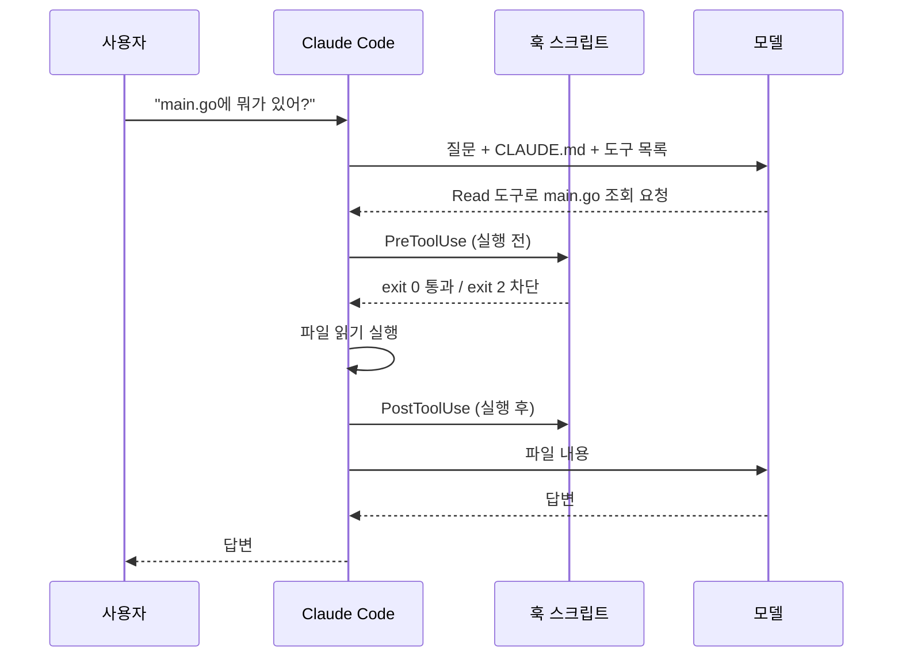
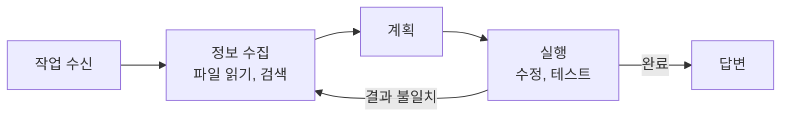
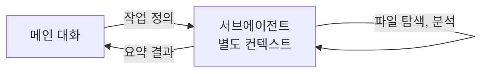

## 참고자료

- [Anthropic Academy - Claude Code in Action](https://anthropic.skilljar.com/claude-code-in-action)
- [Anthropic Academy - Claude Code 101](https://anthropic.skilljar.com/claude-code-101)
- [Anthropic Academy - Introduction to Subagents](https://anthropic.skilljar.com/introduction-to-subagents)
- [Anthropic Academy - Introduction to Agent Skills](https://anthropic.skilljar.com/introduction-to-agent-skills)
- [Claude Code Docs - Hooks](https://code.claude.com/docs/en/hooks)
- [Claude Code Docs - Memory (CLAUDE.md)](https://code.claude.com/docs/en/memory)
- [Claude Code Docs - Subagents](https://code.claude.com/docs/en/sub-agents)
- [Claude Code Docs - Skills](https://code.claude.com/docs/en/skills)
- [Claude Code Docs - Agent SDK](https://code.claude.com/docs/en/agent-sdk/overview)

---

## 배경

2026년 5월부터 프론트엔드, 백엔드, DevOps 개발자 3명이 Anthropic Academy 강의를 8주 일정으로 같이 들었다. 매주 배운 내용을 자기 업무에 적용한 결과물을 하나씩 공유하는 방식으로 진행했다.

Claude Code는 이전부터 매일 쓰고 있었지만 동작 방식을 모르는 부분이 많았다. `CLAUDE.md`에 적은 규칙이 지켜지지 않는 경우가 있었고, `settings.json`의 deny 목록이 모델의 판단으로 지켜지는 것인지 프로그램이 강제로 막는 것인지도 몰랐다.

1~2주차는 Claude Code 101, Claude Code in Action, 서브에이전트(별도 컨텍스트에서 일을 맡는 보조 에이전트), 스킬(작업 절차를 묶은 Claude Code 폴더) 강의였다. 정리하면서 확인하고 싶었던 것들이다.

- 모델은 텍스트만 생성하는데 파일 읽기와 명령 실행은 어떻게 처리되는가?
- `CLAUDE.md`는 언제 어떤 방식으로 모델에게 전달되는가?
- 훅(Hook, 정해진 시점에 자동 실행되는 셸 명령)은 모델이 실행하는가, Claude Code가 실행하는가?
- 서브에이전트와 스킬은 각각 언제 쓰는가?
- 로컬에서 클러스터에 접근할 수 없는 폐쇄망 환경에서는 어디에 적용할 수 있는가?

---

## 큰 그림

Claude Code는 원격의 모델과 로컬의 파일 시스템, 터미널 사이에서 요청을 중계하고 도구를 실행하는 프로그램이다.



1절은 모델과 Claude Code 사이의 도구 호출 루프, 2절은 매 요청에 포함되는 `CLAUDE.md`, 3절은 도구 실행 전후에 동작하는 훅, 4절과 5절은 작업을 분리해 실행하는 서브에이전트와 스킬, 6절은 업무에 적용한 내용이다.

---

## 1. 도구 호출 루프

언어 모델은 텍스트를 입력받아 텍스트를 출력한다. 파일을 열거나 명령을 실행하는 기능은 없다.

이를 보완하는 방식이 도구 사용(tool use)이다. 요청에 사용 가능한 도구의 이름과 입력 형식을 함께 보내면, 모델은 도구가 필요할 때 일반 답변 대신 "Read 도구로 main.go를 읽는다" 형식의 응답을 반환한다. Claude Code는 이 응답을 받아 실제로 파일을 읽고, 결과를 다음 요청에 담아 모델에게 보낸다. 모델은 결과를 보고 다음 도구를 요청하거나 최종 답변을 작성한다.

모델은 도구 호출 의도를 정해진 형식으로 출력할 뿐이고, 실행은 항상 Claude Code가 한다. 3절의 훅이 우회되지 않는 이유가 이 구조에 있다.

강의에서는 이 흐름을 4단계로 설명한다. 작업을 받고, 파일을 읽어 정보를 수집하고, 계획을 세우고, 수정이나 테스트를 실행한다. 결과가 기대와 다르면 정보 수집 단계로 돌아간다. 반복 횟수는 모델이 판단한다.



기본 도구는 `Read`, `Write`, `Edit`, `Bash`, `Glob`(파일 이름 패턴 검색), `Grep`(파일 내용 검색), `WebFetch` 등이다. "리팩터링" 같은 상위 수준 도구는 없고, 모델이 작은 도구를 조합해서 작업한다. 도구가 작고 범용적일수록 처음 보는 작업에도 조합해서 쓸 수 있다.

코드베이스 전체를 외부 서버에 올려 임베딩(의미가 비슷한 문장이 가까운 값을 갖도록 텍스트를 숫자 벡터로 바꾼 것) 색인을 만들어 두는 코딩 도구도 있다. Claude Code는 미리 색인하지 않고 필요할 때 `Grep`과 `Glob`으로 검색한다. 코드를 외부에 저장하지 않기 때문에 사내 보안 검토에서 설명하기 쉬웠다.

---

## 2. CLAUDE.md 로드 방식과 위치

`/init`을 실행하면 Claude Code가 코드베이스를 분석해 요약을 `CLAUDE.md`에 작성한다. 이 파일은 이후 모든 요청에 자동으로 포함된다.

파일 위치는 적용 범위에 따라 3가지다.

| 위치 | 적용 범위 | 작성할 내용 |
|---|---|---|
| `~/.claude/CLAUDE.md` | 해당 PC의 모든 프로젝트 | 답변 언어, 추측 표기 규칙 등 공통 규칙 |
| `<repo>/CLAUDE.md` | 저장소에 커밋, 팀 공유 | 기술 스택, 빌드 명령, 팀 규칙 |
| `<repo>/CLAUDE.local.md` | 개인용(gitignore) | 개인 환경 설정 |

세 파일은 합쳐서 읽히고, 내용이 충돌하면 적용 범위가 좁은 쪽이 우선한다.

규칙이 지켜지지 않던 원인은 파일 길이였다. `CLAUDE.md`는 매 요청에 전체가 포함되므로 길어질수록 개별 지시의 비중이 낮아진다. 강의에서도 `/init`이 생성한 초안은 대부분 코드에서 추론 가능한 내용(언어, 빌드 명령)이므로 삭제하고, 코드로는 알 수 없는 내용(구성 선택 이유, 사용 금지 명령)만 남기라고 권장한다.

이후 작성 기준을 바꿨다. 신규 팀원에게 매번 설명하던 내용만 넣고, 가끔 필요한 절차는 5절의 스킬로 분리한다.

`CLAUDE.md`에서 `@파일경로`로 다른 파일을 참조하면 해당 파일도 함께 포함된다. DB 스키마처럼 거의 매번 필요한 파일에만 쓰고, 가끔 필요한 파일까지 참조하면 다시 길어진다.

---

## 3. Hooks 실행 시점과 종료 코드

훅(hook)은 Claude Code가 특정 이벤트 시점에 실행하는 셸 명령이다. 가장 많이 쓰는 이벤트는 도구 실행 직전(`PreToolUse`)과 직후(`PostToolUse`)다.

훅은 Claude Code 프로세스가 실행한다. 도구 실행은 항상 Claude Code를 거치므로 모델은 훅을 우회할 수 없다. 모델이 훅의 존재를 모르거나 악의적인 지시가 섞인 문서를 읽은 경우에도 마찬가지다. deny 목록도 같은 방식으로 프로그램이 차단한다.

### 3.1 PreToolUse와 PostToolUse 비교

| 이벤트 | 시점 | 가능한 동작 | 사용 예 |
|---|---|---|---|
| PreToolUse | 도구 실행 직전 | 실행 차단 가능 | `.env` 읽기, `rm -rf` 차단 |
| PostToolUse | 도구 실행 직후 | 차단 불가, 결과에 대한 피드백만 가능 | 저장 후 포맷, 타입 검사, 테스트 실행 |

실행되면 안 되는 작업은 PreToolUse로 차단하고, 실행 결과를 검사해서 다음 작업에 반영할 내용은 PostToolUse로 처리한다.

### 3.2 입력 형식과 종료 코드

Claude Code는 훅 스크립트를 실행하면서 표준 입력(stdin)으로 도구 호출 정보를 JSON으로 전달한다.

```json
{
  "session_id": "2d6a1e4d-...",
  "hook_event_name": "PreToolUse",
  "tool_name": "Read",
  "tool_input": { "file_path": "/code/queries/.env" }
}
```

스크립트는 종료 코드(exit code)로 결과를 알린다.

- `exit 0`: 통과. 도구를 그대로 실행한다.
- `exit 2`: 차단. 표준 에러(stderr)로 출력한 메시지가 모델에게 전달되고, 모델은 이를 보고 다른 방법을 찾는다.
- 그 외 값: 훅 스크립트 자체의 오류로 처리된다. 차단 사유가 모델에게 전달되지 않는다.

`exit 1`이나 예외로 차단하려고 하면 훅 실패로 처리된다. 의도적인 차단은 `exit 2`를 사용한다.

`.env` 파일 읽기를 차단하는 설정과 스크립트다.

```json
{
  "hooks": {
    "PreToolUse": [
      {
        "matcher": "Read|Grep",
        "hooks": [{ "type": "command", "command": "node /Users/me/.claude/hooks/read_hook.js" }]
      }
    ]
  }
}
```

```javascript
const chunks = [];
process.stdin.on("data", (c) => chunks.push(c));
process.stdin.on("end", () => {
  const payload = JSON.parse(Buffer.concat(chunks).toString());
  const path = payload.tool_input?.file_path ?? payload.tool_input?.path ?? "";
  if (path.includes(".env")) {
    console.error(`.env 파일은 읽을 수 없다: ${path}`);
    process.exit(2);
  }
  process.exit(0);
});
```

`matcher`에는 `Read`와 함께 `Grep`도 지정해야 한다. `Grep`도 파일 내용을 읽기 때문이다. 도구마다 `tool_input`의 키가 다르다는 점도 주의한다. `Read`는 `file_path`, `Grep`은 `path`와 `pattern`, `Bash`는 `command`다. `matcher: "*"`에 `jq . > dump.json` 훅을 임시로 걸어 실제 입력값을 확인한 뒤 작성하는 방법이 확실하다.

### 3.3 훅 작성 시 보안 주의사항

훅은 사용자 계정 권한으로 실행되는 셸 명령이고, 입력값은 모델이 생성한다. 모델이 잘못 판단하거나 문서에 포함된 악성 지시를 따르면 비정상적인 경로나 명령이 훅 입력으로 들어온다. 훅을 검증 없이 작성하면 명령 실행 취약점이 된다.

강의에서 제시한 원칙은 5가지다.

| 원칙 | 이유 |
|---|---|
| 입력값의 키와 타입 검사 | 문자열 대신 객체가 들어오면 판단이 틀어진다 |
| 셸 변수는 큰따옴표로 감싸기 | 값에 공백이나 `;`가 있으면 다른 명령이 실행된다 |
| 경로에 `..` 포함 시 차단 | `./queries/../../etc/passwd`처럼 감시 범위를 벗어난다 |
| 훅 스크립트는 절대 경로로 지정 | 상대 경로는 Claude Code 실행 위치에 따라 다른 파일을 실행한다 |
| 민감 파일은 훅에서도 처리하지 않기 | 훅이 남기는 로그에 시크릿이 기록된다 |

### 3.4 별도 Claude 인스턴스로 검토하는 훅

강의 예제 중 중복 코드 방지 훅이 있다. 작업이 복잡해지면 Claude가 기존 함수를 찾지 않고 비슷한 함수를 새로 만드는 경우가 있다. 이를 막기 위해 `queries/` 디렉터리에 파일을 쓰기 직전 `PreToolUse` 훅이 Agent SDK로 별도 Claude Code 인스턴스를 실행한다. Agent SDK는 Claude Code를 프로그램에서 호출하는 라이브러리다. 새 인스턴스는 기존 대화 내용 없이 디렉터리를 검색해 같은 기능의 함수가 있는지 확인하고, 있으면 `exit 2`와 함께 "`getPendingOrders()`가 이미 있으므로 재사용할 것"을 반환한다.

파일을 수정할 때마다 모델을 한 번 더 호출하므로 비용이 늘어난다. 강의에서도 공용 함수가 모여 있는 디렉터리에만 적용하라고 권장한다. 작성하는 쪽과 검토하는 쪽의 대화 내용을 분리하는 방식은 장애 분석 도구를 설계할 때도 참고할 만하다.

---

## 4. 서브에이전트

긴 작업을 하면 대화에 읽은 파일과 검색 결과가 누적된다. 모델이 한 번에 처리할 수 있는 입력 크기(컨텍스트 윈도우)에는 한계가 있어서, 누적될수록 앞부분 내용을 정확하게 반영하지 못한다. `/compact`로 요약하거나 `/clear`로 비울 수 있지만 현재 작업 정보도 함께 줄어든다.

서브에이전트는 별도의 컨텍스트 윈도우에서 작업하는 실행 단위다. 메인 대화는 작업 내용만 전달하고, 서브에이전트가 파일 탐색과 분석을 수행한 뒤 요약 결과만 반환한다. 메인 대화에는 요약만 남는다.



정의는 `.claude/agents/이름.md` 파일 하나로 한다.

```markdown
---
name: security-reviewer
description: Use PROACTIVELY when reviewing code for security issues before merge
tools: Read, Grep, Glob
model: haiku
---
너는 보안 리뷰어다. 코드를 수정하지 않고 리뷰만 한다.
결과는 위험도, 발견 사항, 권장 조치 세 항목으로 작성한다. 추측은 추측이라고 표기한다.
```

`description`은 메인 Claude가 서브에이전트 호출 여부를 판단하는 기준이다. 모호하게 쓰면 호출되지 않거나 의도하지 않은 시점에 호출된다. `tools`는 필요한 도구만 지정한다. 리뷰 전용 서브에이전트에는 `Edit` 권한이 필요 없다. 단순 탐색이나 요약 작업은 `model`을 작은 모델로 지정해 비용을 줄인다.

결과를 바로 상세하게 확인해야 하는 작업은 요약 과정에서 정보가 빠지므로 서브에이전트에 적합하지 않다. 파일 1~2개 수준의 작업은 위임 비용이 더 크다. 서로 의존하지 않는 작업은 여러 서브에이전트를 병렬로 실행할 수 있다. 장애 진단에서 네트워크, 쿠버네티스, 데이터베이스 계층을 동시에 조사하는 경우가 해당한다.

---

## 5. 스킬

스킬(skill)은 `SKILL.md` 파일 하나로 정의하는 작업 절차서다.

| | CLAUDE.md | 스킬 |
|---|---|---|
| 로드 시점 | 세션 시작부터 모든 요청 | 필요할 때만(description 매칭 또는 `/이름` 호출) |
| 작성할 내용 | 프로젝트 정보, 금지 사항 | 특정 작업의 단계별 절차 |
| 분량 | 짧게 유지 | 작업에 필요한 만큼 |

2절의 `CLAUDE.md` 길이 문제를 스킬로 해결할 수 있다. 가끔 필요한 절차를 스킬로 분리하면 평소에는 description 한 줄만 컨텍스트를 차지한다.

스킬도 `description`으로 자동 호출된다. `Use when reviewing a Helm chart change before merge`처럼 상황과 시점을 구체적으로 쓴다. 본문에 `` !`git diff HEAD` `` 형식을 쓰면 스킬 로드 직전에 명령을 실행해서 결과를 본문에 삽입한다.

스킬은 작업 절차를 정의하고, 서브에이전트는 실행 환경을 분리한다. 스킬은 기본적으로 메인 대화 안에서 실행되고, `context: fork`를 지정하면 서브에이전트에서 실행된다. 서브에이전트에 `skills` 필드를 지정하면 시작할 때 스킬을 미리 로드한다. 두 기능은 함께 사용할 수 있다.

---

## 6. 업무 적용

회사 환경에는 제약이 있다. 로컬 PC에서 클러스터로 직접 접속할 수 없고 보안 솔루션을 거쳐야 명령을 실행할 수 있다. 외부 OAuth도 차단되어 있어 사내 메신저나 대시보드와 연동하는 MCP(Model Context Protocol, AI 앱과 외부 도구를 잇는 표준 프로토콜) 서버(외부 시스템을 모델의 도구로 연결하는 규격, 별도 글에서 정리)도 바로 쓸 수 없었다.

그래서 클러스터 접근이 필요한 작업은 제외하고, 로컬 파일로 처리할 수 있는 작업에 적용했다. Helm(매니페스트를 템플릿과 값으로 묶어 배포하는 도구) 차트 렌더링, `kubeconform` 매니페스트 문법 검증, Kyverno(쿠버네티스 리소스를 규칙으로 검사하는 정책 엔진) 정책 테스트, 이미지 스캔 결과 분석은 모두 로컬에서 실행된다.

### 6.1 훅: 산출물 검증 위주로 구성

로컬 `kubectl`로는 운영 클러스터에 접근할 수 없으므로 위험 명령 차단보다 생성한 파일을 바로 검사하는 훅이 더 유용했다.

| 훅 | 시점 | 동작 |
|---|---|---|
| PostToolUse | 매니페스트, 차트 파일 저장 직후 | `kubeconform`, `helm template`을 실행해 오류를 모델에게 반환 |
| PostToolUse | `values.yaml` 저장 직후 | `password`, `token` 등 키에 평문 값이 들어가면 경고 |
| PreToolUse | `git push` 직전 | 변경 파일에 kubeconfig, 개인 키, `.env`가 포함됐는지 검사 |

`settings.json`의 deny 목록(`kubectl delete ns`, `terraform destroy`, `git push --force`)은 유지했다. 로컬에서는 운영 환경에 접근할 수 없지만 개발 클러스터 작업에서의 실수를 막기 위해서다.

### 6.2 스킬: 반복 점검 절차 정리

차트 리뷰, ArgoCD(Git과 클러스터 상태를 맞춰 주는 GitOps 도구) 애플리케이션 리뷰, Kyverno 정책 리뷰, 알림 규칙 리뷰, 이미지 스캔 결과 분류를 스킬로 작성했다. 점검 결과가 매번 같은 순서와 형식으로 나오고, 수작업으로 점검할 때 빠지던 항목이 줄었다.

### 6.3 서브에이전트: 관점별 리뷰 분리

보안, 비용, 가용성 관점을 한 번에 리뷰하게 하면 먼저 다룬 관점에 다른 관점의 결과가 영향을 받는다. 관점별로 서브에이전트를 나누고 병렬로 실행한 뒤 메인 대화에서 결과를 합쳤더니 관점마다 다른 지적 사항이 나왔다. 이 구성을 팀 공용 PR 리뷰 에이전트(Agent, 도구를 골라 쓰며 스스로 다음 행동을 정하는 반복 구조)로 확장할 계획이다.

---

## 정리하며

처음 던진 질문들에 대한 답이다.

- **파일 읽기와 명령 실행은 어떻게 처리되는가?** 모델이 도구 호출 의도를 정해진 형식으로 출력하면 Claude Code가 실행하고 결과를 다음 요청에 담아 보낸다.
- **CLAUDE.md는 언제 전달되는가?** 매 요청에 전체가 포함된다. 길어질수록 개별 지시가 반영되지 않으므로 항상 필요한 내용만 남기고 나머지는 스킬로 분리했다.
- **훅은 누가 실행하는가?** Claude Code가 실행한다. 모델이 우회할 수 없어서 보안 통제 수단으로 쓸 수 있다. 차단은 `exit 2`, 사유는 stderr로 전달한다.
- **서브에이전트와 스킬은 각각 언제 쓰는가?** 스킬은 작업 절차를 정의할 때, 서브에이전트는 컨텍스트를 분리하거나 병렬로 실행할 때 쓴다. 함께 쓸 수 있다.
- **폐쇄망에서는 어디에 적용하는가?** 클러스터 접근이 필요한 작업은 제외하고 로컬 파일 기반 검증과 리뷰에 적용했다.

다음 주차는 Claude Code 내부에서 호출하는 Claude API를 직접 다뤘다.
