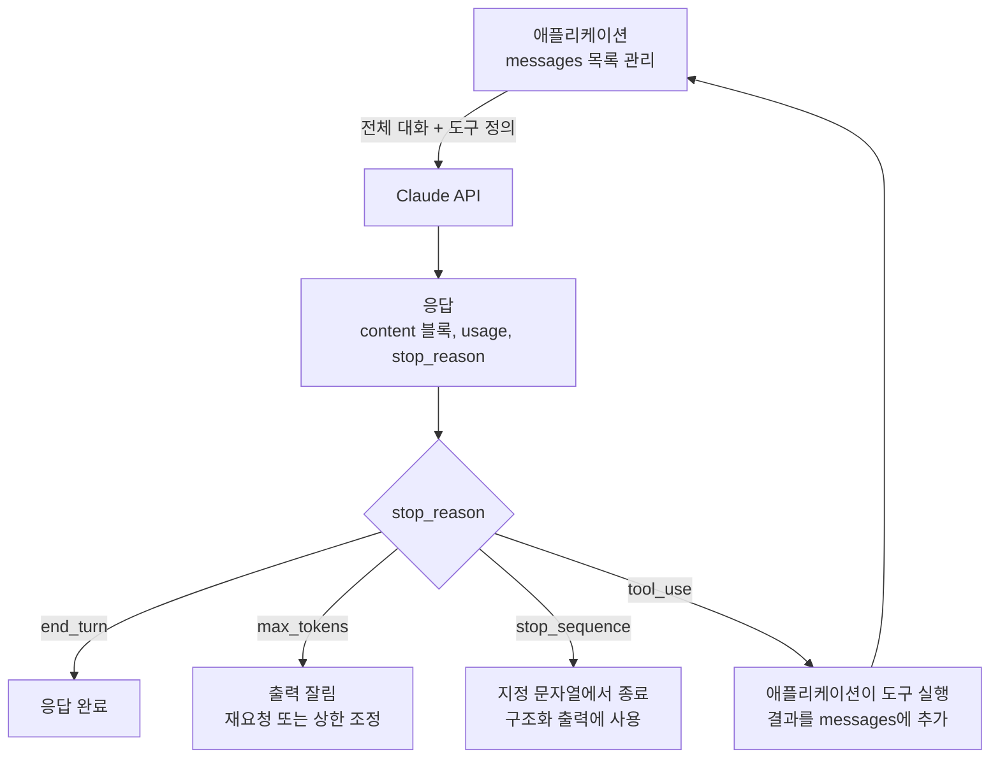
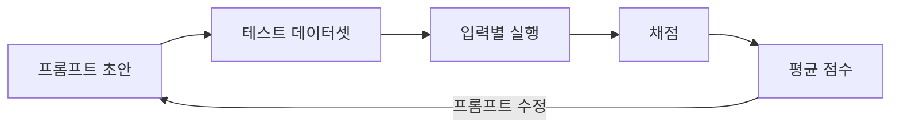
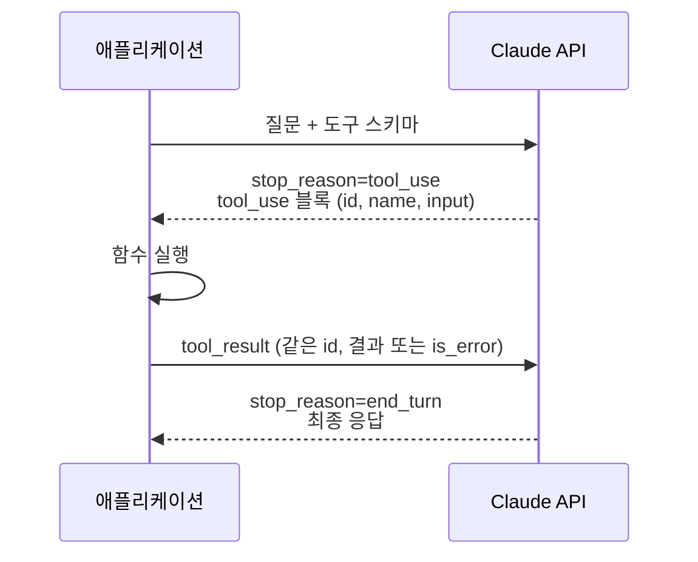

## 참고자료

- [Anthropic Academy - Building with the Claude API](https://anthropic.skilljar.com/claude-with-the-anthropic-api)
- [Claude Docs - Messages API](https://platform.claude.com/docs/en/api/messages)
- [Claude Docs - Tool use](https://platform.claude.com/docs/en/agents-and-tools/tool-use/overview)
- [Claude Docs - Prompt caching](https://platform.claude.com/docs/en/build-with-claude/prompt-caching)
- [Claude Docs - Define success criteria and build evaluations](https://platform.claude.com/docs/en/test-and-evaluate/develop-tests)

---

## 배경

스터디 3~4주차는 Claude API 강의였다. 1~2주차에 Claude Code 사용법을 다뤘다면, 이번에는 Claude Code가 내부에서 호출하는 API를 직접 호출해 봤다.

Claude Code와 채팅 앱만 쓸 때는 모델이 이전 대화를 기억한다고 생각했고, 프롬프트는 몇 번 실행해 보고 결과가 괜찮으면 충분하다고 판단했다. `messages.create()`를 직접 호출해 보니 두 가지 모두 사실과 달랐다.

정리하면서 확인하고 싶었던 것들이다.

- API가 대화 내용을 저장하지 않으면 멀티턴 대화는 어떻게 구현하는가? 비용은 어떻게 늘어나는가?
- 응답이 종료된 이유는 어떻게 확인하는가? `max_tokens`는 목표 길이인가?
- 프롬프트 수정 후 결과가 개선됐는지 어떻게 측정하는가?
- 도구 사용은 API 요청과 응답에서 어떤 형식인가?
- 프롬프트 캐싱은 어떤 조건에서 비용이 줄어드는가?

---

## 큰 그림

API 호출 흐름은 다음과 같다. 애플리케이션이 대화 전체를 전송하고, 응답의 `stop_reason`을 확인해서 다음 동작을 정한다.



1절은 멀티턴 대화 구현, 2절은 `stop_reason` 처리, 3절은 JSON 형식 출력, 4절은 프롬프트 평가, 5절은 도구 사용, 6절은 프롬프트 캐싱을 다룬다.

---

## 1. 멀티턴 대화 구현

Claude API는 무상태(stateless)다. 각 요청은 독립적으로 처리되고 서버는 이전 대화를 저장하지 않는다. "양자 컴퓨팅이 뭐야?" 다음 요청에 "한 문장 더 써 줘"만 보내면 모델은 앞 대화를 알 수 없다.

멀티턴 대화는 애플리케이션이 구현한다. 사용자 메시지와 모델 응답을 목록에 순서대로 추가하고, 요청마다 목록 전체를 전송한다.

```python
from anthropic import Anthropic

client = Anthropic()  # ANTHROPIC_API_KEY 환경 변수를 읽는다
messages = []

def chat(messages, system=None):
    params = {"model": "claude-sonnet-4-0", "max_tokens": 1000, "messages": messages}
    if system:
        params["system"] = system
    return client.messages.create(**params)

messages.append({"role": "user", "content": "양자 컴퓨팅을 한 문장으로 정의해 줘"})
res = chat(messages)
messages.append({"role": "assistant", "content": res.content[0].text})  # 모델 응답을 목록에 추가
messages.append({"role": "user", "content": "한 문장 더"})
res = chat(messages)  # 이전 대화 전체가 함께 전송된다
```

API 요금은 토큰(token) 단위로 계산한다. 토큰은 모델이 텍스트를 나누는 단위로, 단어 하나 또는 단어의 일부나 기호 하나에 해당한다. 대화가 길어질수록 요청마다 전송하는 입력 토큰이 늘어난다. 10번째 질문에는 앞의 9번 질문과 응답이 모두 포함된다. 장애 분석처럼 대화가 길어지는 작업은 중간에 요약해서 새 대화로 시작하는 것이 비용 면에서 낫다.

시스템 프롬프트(system prompt)는 대화 전체에 적용되는 지시다. 역할, 말투, 금지 사항을 사용자 메시지마다 반복하지 않고 `system` 파라미터로 전달한다. 시스템 프롬프트도 매 요청에 포함되므로 6절의 캐싱 대상이 된다.

API 키는 서버에만 둔다. 브라우저나 모바일 앱에서 API를 직접 호출하면 키가 노출된다. 클라이언트는 자체 서버를 호출하고, 서버가 API를 호출하는 구조로 만든다.

---

## 2. stop_reason 처리

응답에는 생성된 내용(`content`), 입력과 출력 토큰 수(`usage`), 종료 사유(`stop_reason`)가 포함된다.

`max_tokens`는 출력 토큰의 상한이다. 1000으로 지정하면 출력이 1000 토큰에서 잘린다. 필수 파라미터라 생략하면 요청이 실패한다.

자동화 코드에서는 응답을 사용하기 전에 `stop_reason`을 확인한다.

| stop_reason | 의미 | 처리 방법 |
|---|---|---|
| `end_turn` | 모델이 응답을 완료함 | 결과 사용 |
| `max_tokens` | 상한에 도달해 잘림 | 이어서 요청하거나 상한을 늘린다 |
| `stop_sequence` | 지정한 문자열이 나와서 종료 | 3절의 구조화 출력 |
| `tool_use` | 도구 호출 요청 | 5절의 도구 실행 루프 |

장애 요약이나 리뷰 결과를 다음 단계로 넘기는 스크립트에서 `max_tokens`로 잘린 응답을 그대로 넘기면 JSON 파싱이 실패하거나, 결론이 빠진 요약이 정상 결과로 처리된다. `stop_reason` 확인 한 줄로 막을 수 있다.

---

## 3. JSON 형식 출력: 프리필과 정지 문자열

리뷰 결과나 점수를 다음 코드에서 처리하려면 설명 문장 없이 JSON만 받아야 한다. "JSON으로만 답하라"고 지시해도 "다음은 결과입니다" 같은 문장이 앞에 붙는 경우가 있다.

강의에서는 프리필(prefill)을 사용했다. `assistant` 메시지의 시작 부분을 미리 채워서 보내고, 닫는 문자열을 정지 문자열(stop sequence)로 지정한다.

```python
messages.append({"role": "user", "content": prompt})
messages.append({"role": "assistant", "content": "```json"})  # 응답 시작 부분 지정
res = client.messages.create(
    model="claude-haiku-4-5", max_tokens=1000,
    messages=messages, stop_sequences=["```"],                 # 코드 블록이 닫히면 종료
)
data = json.loads(res.content[0].text)
```

응답이 코드 블록 안에서 시작되므로 JSON만 출력되고, 코드 블록을 닫는 시점에 생성이 종료된다.

현재는 도구 사용이나 구조화 출력 기능으로 스키마를 강제하는 방법이 더 안정적이다. 프리필 방식은 사내망에서 사용할 수 있는 SDK 버전이 낮을 때 기본 기능만으로 같은 결과를 얻기 위해 정리했다.

---

## 4. 프롬프트 평가

프롬프트를 수정한 뒤 2~3번 실행해 보고 결과가 괜찮으면 넘어가는 방식으로 작업했는데, 강의에서는 이 방식의 문제를 지적한다. 실제 입력은 테스트한 2~3건보다 다양하고, 테스트하지 않은 입력에서 오류가 발생한다.

평가(evaluation)는 별도 라이브러리 없이 애플리케이션 코드로 구현하는 검증 단계다. 같은 API를 테스트 입력마다 호출하고 결과를 채점한다. 절차는 5단계다.



테스트 데이터셋은 수십 건 이상이 필요하다. 직접 작성하기 어려우면 모델로 생성하는데, 비용과 속도를 고려해 작은 모델(Haiku)을 쓴다. 생성한 데이터셋은 파일로 저장해서 이후 평가에도 같은 입력을 쓴다. 입력이 바뀌면 점수를 비교할 수 없다.

채점기(grader)는 두 종류로 나눈다.

| 채점기 | 평가 항목 | 특징 |
|---|---|---|
| 코드 채점기 | JSON 파싱 여부, 문법, 형식 준수 | 같은 입력에 항상 같은 점수 |
| 모델 채점기 | 요청한 작업 수행 여부, 품질 | 판단 기준이 유연하지만 점수가 흔들림 |

모델 채점기에 점수만 요청하면 대부분 6점 근처로 나온다. 강점, 약점, 근거를 먼저 작성하게 한 뒤 점수를 요청하면 점수 분포가 넓어진다.

```python
eval_prompt = f"""
다음 결과를 평가해라.
작업: {task}
결과: {output}

JSON으로 답한다.
- strengths: 강점 1~3개
- weaknesses: 약점 1~3개
- reasoning: 판단 근거
- score: 1~10
"""
```

평가 점수가 있으면 프롬프트 수정이 실제 개선인지 확인할 수 있다. 강의 예제에서는 "충분히 자세히 답하라"는 문장 하나를 추가하자 평균 점수가 7.66에서 8.7로 올랐다.

---

## 5. Tool Use 요청과 응답 형식

도구는 JSON 스키마(입력값의 이름과 타입을 정의한 형식)로 정의해서 요청에 포함한다. 모델이 도구가 필요하다고 판단하면 `stop_reason`이 `tool_use`로 오고, `content`에 텍스트 블록과 `tool_use` 블록이 함께 들어 있다. `tool_use` 블록에는 도구 이름, 입력값, 호출 ID가 있다.



구현할 때 주의할 점은 3가지다.

- 응답 `content`는 블록 목록이다. 텍스트만 추출해서 대화 목록에 넣으면 `tool_use` 블록이 빠져서 다음 요청이 실패한다. 응답 블록 전체를 `assistant` 메시지로 추가한다.
- 도구 실행 결과는 `tool_use_id`로 요청과 연결한다. 도구 여러 개를 동시에 호출하면 이 ID로 결과를 구분한다.
- 도구 실행이 실패해도 결과로 반환한다. `is_error: true`와 "날짜 형식 오류" 같은 메시지를 보내면 모델이 입력값을 수정해서 다시 호출한다. 예외를 발생시키고 종료하면 재시도할 수 없다.

`stop_reason`이 `tool_use`가 아닐 때까지 이 과정을 반복하는 것이 도구 실행 루프다. 강의 예제는 "목요일로부터 일주일 뒤에 병원 알림 설정"이었다. 모델은 현재 날짜를 모르고 날짜 계산이 부정확할 수 있으므로, 현재 시각 조회, 기간 더하기, 알림 등록 도구 3개를 제공했고 모델이 순서대로 호출해서 처리했다. 큰 도구 하나보다 단일 기능 도구 여러 개를 조합하는 쪽이 낫다는 점은 Claude Code의 도구 구성과 같다.

도구 `description`의 품질에 따라 모델의 도구 선택 정확도가 달라진다. 도구를 언제 쓰는지, 각 입력값이 무엇인지 문장으로 명확하게 작성한다.

---

## 6. 프롬프트 캐싱

요청마다 시스템 프롬프트와 도구 정의를 다시 전송한다. 이 앞부분이 매번 같으면 프롬프트 캐싱으로 처리 비용을 줄일 수 있다. 프롬프트 캐싱은 요청의 앞부분(prefix) 처리 결과를 저장해 두고, 다음 요청의 앞부분이 같으면 재사용한다. 재사용된 부분은 입력 토큰 단가가 낮고 응답 지연도 줄어든다.

| 항목 | 내용 |
|---|---|
| 지정 방법 | `cache_control`로 캐시 지점(브레이크포인트) 지정 |
| 처리 순서 | 도구 정의, 시스템 프롬프트, 메시지 순서로 이어 붙인 앞부분 기준 |
| 브레이크포인트 | 최대 4개 |
| 유지 시간 | 기본 5분, 사용될 때마다 갱신. 추가 비용으로 1시간 설정 가능 |
| 최소 길이 | 모델별로 다름(강의 당시 1024 토큰). 이보다 짧으면 캐시되지 않음 |

스터디 노트에는 유지 시간을 1시간으로 적었는데, 이 글을 쓰면서 공식 문서를 확인해 보니 기본값은 5분이고 1시간은 추가 비용이 드는 옵션이었다. 5분 안에 같은 앞부분으로 다시 요청하지 않으면 캐시가 만료되고 캐시 생성 비용만 남는다.

캐싱으로 비용이 줄어드는 경우는 같은 시스템 프롬프트와 도구 정의로 짧은 간격에 여러 번 호출할 때다. 매니페스트 수십 개를 같은 리뷰 지침으로 연속 검사하거나, 같은 문서에 여러 질문을 하는 경우가 해당한다. 하루 몇 번 간헐적으로 호출하는 작업에는 효과가 없다.

캐시 적용 여부는 응답 `usage`의 `cache_read_input_tokens`와 `cache_creation_input_tokens`로 확인한다. 앞부분 중간에 날짜나 요청 ID처럼 요청마다 바뀌는 값이 있으면 그 뒤는 캐시되지 않으므로, 바뀌는 값은 뒤쪽에 둔다.

---

## 7. 업무 적용 계획

회사 환경은 로컬에서 클러스터에 접근할 수 없고 외부 OAuth가 차단되어 있다. 그래서 로컬에서 처리할 수 있는 작업부터 적용 순서를 정했다.

1. 2주차에 만든 Helm 차트 리뷰, Kyverno(쿠버네티스 리소스를 규칙으로 검사하는 정책 엔진) 정책 리뷰 스킬에 평가를 적용한다. `helm template`과 `kyverno test`가 로컬에서 실행되므로 코드 채점기를 만들 수 있다.
2. 이미지 취약점 분류와 리뷰 결과는 JSON으로 출력해서 후속 자동화에 넘긴다.
3. 캐싱은 같은 지침으로 연속 호출하는 일괄 리뷰 작업에만 적용한다.
4. 확장 사고(extended thinking, 응답 전에 추론 단계를 길게 거치게 하는 기능)는 비용과 지연이 늘어나므로 평가로 효과를 확인한 뒤 적용한다. 코드 실행 기능은 사내 데이터를 외부 샌드박스로 보내야 하므로 보안 정책 검토가 먼저다.

(2026년 6월 추가) 알림 기반 장애 진단 서비스를 만들 때 이 내용을 적용했다. 진단은 작은 모델로 실행하고, 시스템 프롬프트에 캐시를 지정하고, `stop_reason`을 확인한 뒤에만 메신저로 전송했다.

---

## 정리하며

처음 던진 질문들에 대한 답이다.

- **멀티턴 대화는 어떻게 구현하는가?** 애플리케이션이 대화 목록을 관리하고 요청마다 전체를 전송한다. 대화가 길어질수록 요청당 비용이 늘어난다.
- **응답 종료 사유는 어떻게 확인하는가?** `stop_reason`으로 확인한다. `max_tokens`는 상한이므로 잘림 여부를 먼저 확인한 뒤 결과를 사용한다.
- **프롬프트 개선은 어떻게 측정하는가?** 고정된 데이터셋으로 실행해 평균 점수를 비교한다. 형식은 코드로, 품질은 근거를 함께 작성하게 한 모델로 채점한다.
- **도구 사용은 어떤 형식인가?** `tool_use` 블록을 받아 애플리케이션이 실행하고, 같은 ID로 `tool_result`를 반환하는 과정을 반복한다. 실패도 결과로 반환한다.
- **캐싱은 어떤 조건에서 비용이 줄어드는가?** 같은 앞부분으로 5분 안에 다시 요청할 때다. 간헐적인 호출에는 효과가 없다.

다음 주차는 MCP 서버와 클라이언트 구현을 다뤘다.
