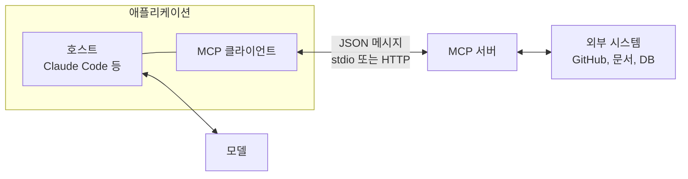
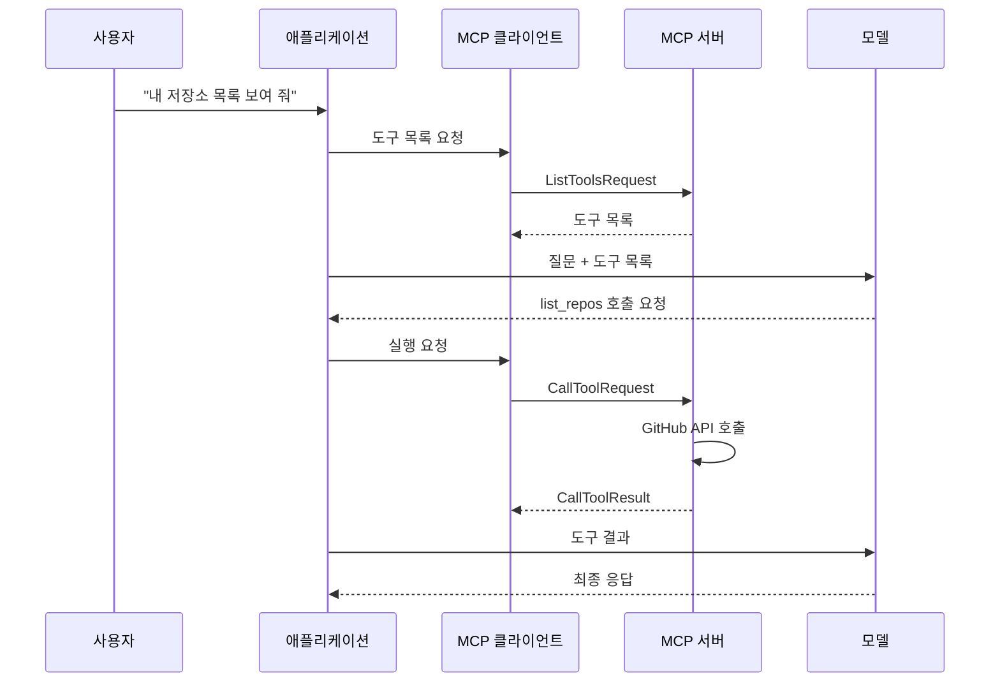

## 참고자료

- [Anthropic Academy - Introduction to Model Context Protocol](https://anthropic.skilljar.com/introduction-to-model-context-protocol)
- [Anthropic Academy - Model Context Protocol: Advanced Topics](https://anthropic.skilljar.com/model-context-protocol-advanced-topics)
- [Model Context Protocol - Specification](https://modelcontextprotocol.io/specification/latest)
- [Model Context Protocol - Transports](https://modelcontextprotocol.io/specification/latest/basic/transports)
- [MCP Python SDK](https://github.com/modelcontextprotocol/python-sdk)
- [Claude Code Docs - MCP](https://code.claude.com/docs/en/mcp)

---

## 배경

스터디 5주차는 MCP(Model Context Protocol) 입문과 심화 강의였다.

Claude Code에 `claude mcp add`로 MCP 서버를 연결해 쓰고 있었지만, 지난주에 정리한 도구 사용(tool use)과 무엇이 다른지, 서버를 별도로 두는 이유가 무엇인지는 설명하지 못했다.

강의를 따라 문서를 읽고 수정하는 MCP 서버와 그 서버에 연결하는 클라이언트를 모두 구현했다. 실무에서는 보통 한쪽만 만들지만, 양쪽을 구현하면 메시지 흐름을 확인할 수 있다.

정리하면서 확인하고 싶었던 것들이다.

- MCP는 도구 사용을 대체하는가, 보완하는가?
- 도구(tools) 외에 리소스(resources)와 프롬프트(prompts)를 따로 두는 이유는 무엇인가?
- 서버가 클라이언트에게 요청을 보내는 경우는 언제인가?
- 로컬에서 동작하던 서버가 HTTP로 배포한 뒤 일부 기능이 동작하지 않는 이유는 무엇인가?
- 외부 OAuth가 차단된 폐쇄망에서는 MCP를 어떻게 사용할 수 있는가?

---

## 큰 그림

MCP는 모델에게 제공할 도구와 데이터를 누가 구현하고 어떤 형식으로 전달할지 정의한 프로토콜이다. 구성 요소는 호스트, 클라이언트, 서버다.



모델과 통신하는 애플리케이션(호스트) 안에 MCP 클라이언트가 있고, 클라이언트가 MCP 서버와 JSON 메시지를 주고받는다. 외부 시스템 연동은 서버가 담당한다. 1절은 서버를 분리하는 이유, 2절은 서버가 제공하는 3가지 프리미티브, 3절은 메시지 종류와 서버 측 요청, 4절은 전송 방식을 다룬다.

---

## 1. 서버를 분리하는 이유

GitHub 정보를 조회하는 챗봇을 만든다고 하자. 도구 사용 방식으로 직접 구현하면 저장소 목록, PR, 이슈마다 도구 스키마를 작성하고, GitHub API를 호출하는 함수를 구현하고, GitHub API가 바뀌면 수정해야 한다. 연동할 서비스가 5개면 작업량도 5배다.

MCP는 이 작업을 서버로 분리한다. GitHub용 MCP 서버가 GitHub 기능을 표준 형식의 도구 목록으로 제공하고, 애플리케이션은 서버에 연결만 한다. 서비스 제공사가 공식 서버를 배포하기도 하고, 누구나 직접 만들 수도 있다.

MCP는 도구 사용을 대체하지 않는다. 모델이 도구를 선택하고 호출을 요청하는 방식은 도구 사용 그대로이고, 도구의 정의와 실행을 MCP 서버가 담당한다.



모델은 도구를 선택하고, 애플리케이션은 요청을 전달하고, 서버는 도구를 실행한다.

서버는 Python SDK의 `FastMCP`로 구현했다. 함수에 데코레이터를 붙이고 타입 힌트와 설명을 작성하면 SDK가 JSON 스키마를 생성한다.

```python
from mcp.server.fastmcp import FastMCP
from pydantic import Field

mcp = FastMCP("DocumentMCP")
docs = {"report.pdf": "20m 응축탑의 상태를 다룬 보고서다."}

@mcp.tool(name="read_doc_contents", description="문서 내용을 문자열로 반환한다.")
def read_document(doc_id: str = Field(description="읽을 문서의 ID")):
    if doc_id not in docs:
        raise ValueError(f"{doc_id} 문서가 없다")  # 예외는 오류 결과로 모델에 전달된다
    return docs[doc_id]
```

`mcp dev server.py`로 실행하면 브라우저에서 서버를 테스트하는 인스펙터가 열린다. 애플리케이션에 연결하기 전에 도구 목록 확인, 입력값을 넣은 실행, 수정 후 재조회를 바로 반복할 수 있다. 애플리케이션에 연결한 뒤 디버깅하면 오류 원인이 서버, 애플리케이션, 모델 중 어디인지 구분하기 어렵다.

---

## 2. 3가지 프리미티브: tools, resources, prompts

MCP 서버가 제공하는 기본 단위(프리미티브)는 3가지이고, 사용 여부를 결정하는 주체가 다르다.

| 프리미티브 | 사용 결정 주체 | 용도 | 예 |
|---|---|---|---|
| 도구(tools) | 모델 | 모델이 필요할 때 호출하는 기능 | 문서 수정, 계산 |
| 리소스(resources) | 애플리케이션 코드 | 애플리케이션이 조회해서 화면이나 대화에 넣는 데이터 | 문서 목록, 문서 내용 |
| 프롬프트(prompts) | 사용자 | 사용자가 선택해 실행하는 검증된 지시 템플릿 | "문서를 마크다운으로 변환" 명령 |

리소스는 HTTP의 GET 요청과 비슷하게 데이터를 조회하는 용도다. 강의 예제는 `@문서이름`으로 문서를 지정하는 기능이었다. `@`를 입력하면 애플리케이션이 문서 목록 리소스를 조회해 자동 완성을 표시하고, 선택하면 문서 내용을 프롬프트에 바로 포함한다. 모델이 도구를 호출해 문서를 읽는 단계가 하나 줄어든다.

```python
@mcp.resource("docs://documents", mime_type="application/json")
def list_docs() -> list[str]:          # 고정 URI
    return list(docs.keys())

@mcp.resource("docs://documents/{doc_id}", mime_type="text/plain")
def fetch_doc(doc_id: str) -> str:    # 파라미터가 포함된 URI 템플릿
    return docs[doc_id]
```

프롬프트는 서버 작성자가 미리 작성하고 테스트한 지시문이다. 예외 상황을 고려해 검증한 지시문이 사용자가 매번 직접 작성하는 지시문보다 결과가 안정적이다. Claude Code에서는 `/`를 입력하면 서버가 제공하는 프롬프트가 명령 목록에 표시된다.

서버를 설계할 때 기능마다 사용 결정 주체를 먼저 정한다. 운영 환경을 변경하는 기능을 모델이 판단해서 호출하는 도구로 둘지, 사용자가 실행하는 프롬프트로 둘지 검토해야 한다.

---

## 3. 메시지 종류와 서버 측 요청

MCP 통신은 JSON 메시지로 이뤄지고, 메시지는 2종류다.

| 종류 | 특징 | 예 |
|---|---|---|
| 요청과 결과 | 요청 후 결과를 기다린다 | 도구 호출, 프롬프트 목록, 리소스 조회, 초기화 |
| 알림(notification) | 단방향, 응답 없음 | 진행률, 로그, 도구 목록 변경 |

연결은 초기화 메시지 3개로 시작한다. 클라이언트가 초기화 요청을 보내고, 서버가 지원 기능 목록을 응답하고, 클라이언트가 초기화 완료 알림을 보낸다. 이 과정이 끝난 뒤 도구 호출 등의 요청을 보낼 수 있다.

MCP는 양방향 프로토콜이다. 클라이언트뿐 아니라 서버도 클라이언트에게 요청을 보낼 수 있다. 대표적인 기능이 샘플링과 루트 조회다.

### 3.1 샘플링

위키 문서를 수집해서 요약하는 서버가 있다고 하자. 서버가 직접 모델을 호출하려면 서버에 API 키가 있어야 하고 호출 비용도 서버 운영자가 부담한다. 공개 서버라면 모든 사용자의 요약 비용을 서버 운영자가 내야 한다.

샘플링(sampling)은 서버가 프롬프트를 만들어 클라이언트에게 모델 호출을 요청하는 기능이다. 클라이언트가 자신의 모델 연결로 호출하고 결과를 서버에 반환한다. 서버에는 API 키가 필요 없고, 비용은 기능을 사용하는 클라이언트가 부담한다.

```python
@mcp.tool()
async def summarize(text: str, ctx: Context):
    result = await ctx.session.create_message(        # 클라이언트에 모델 호출 요청
        messages=[SamplingMessage(role="user", content=TextContent(type="text", text=f"요약해라:\n{text}"))],
        max_tokens=4000,
    )
    return result.content.text
```

### 3.2 진행 알림과 루트

실행 시간이 긴 도구는 진행률과 로그를 알림으로 보낼 수 있다. 사용자는 작업이 진행 중인지 멈췄는지 확인할 수 있다.

루트(roots)는 클라이언트가 서버에 접근을 허용한 디렉터리 목록이다. "biking.mp4를 변환해 줘"처럼 파일 이름만 입력해도 서버가 루트 안에서 파일을 찾는다. SDK는 루트 범위를 자동으로 강제하지 않으므로, 요청 경로가 루트 안에 있는지 검사하는 코드는 서버에서 직접 구현해야 한다. Claude Code 훅에서 경로의 `..` 포함 여부를 검사하는 것과 같은 이유다.

---

## 4. 전송 방식: stdio와 StreamableHTTP

전송 방식(transport)은 JSON 메시지가 오가는 통신 채널이다.

### 4.1 stdio

클라이언트가 서버를 자식 프로세스로 실행하고, 서버의 표준 입력으로 메시지를 보내고 표준 출력으로 받는다. 양쪽 모두 언제든 메시지를 보낼 수 있어 3절의 서버 측 요청도 그대로 동작한다. 같은 PC에서만 사용할 수 있다. `claude mcp add 이름 -- uv run server.py`로 연결하는 로컬 서버가 이 방식이다.

### 4.2 StreamableHTTP

서버를 원격에 두려면 HTTP를 사용한다. 클라이언트는 서버 주소를 알기 때문에 요청을 보낼 수 있지만, 서버는 클라이언트 주소를 모르기 때문에 먼저 요청을 보낼 수 없다.

StreamableHTTP는 SSE(Server-Sent Events, 서버가 하나의 HTTP 응답으로 여러 메시지를 계속 보내는 방식)로 이 문제를 해결한다. 초기화 시 서버가 세션 ID를 발급하고, 클라이언트는 GET 요청으로 응답 스트림을 열어 둔다. 서버는 이 스트림으로 필요할 때 메시지를 보낸다. 도구를 호출하면 해당 호출 전용 스트림이 추가로 열렸다가 결과 전송 후 닫힌다.

서버를 여러 대로 확장하면 문제가 생긴다. 로드 밸런서가 GET 스트림은 1번 서버로, 도구 호출 POST는 2번 서버로 보낼 수 있다. 2번 서버가 샘플링 요청을 보내려면 1번 서버가 유지 중인 스트림을 써야 하므로 서버 간 조율이 필요하다.

이를 위해 설정 2개가 있다.

| 설정 | 동작 | 사용할 수 없게 되는 기능 |
|---|---|---|
| `stateless_http` | 세션 없이 요청마다 독립 처리. 어느 서버로 라우팅돼도 동작 | 서버 측 요청(샘플링, 루트 조회), 진행 알림, 구독 |
| `json_response` | 스트리밍 없이 최종 결과만 JSON 하나로 반환 | 실행 중 진행률과 로그 |

로컬 stdio에서 동작하던 서버를 HTTP로 배포한 뒤 진행 표시가 사라지거나 샘플링이 실패하면 이 설정을 먼저 확인한다. 강의에서는 개발 단계부터 운영과 같은 전송 방식으로 테스트하라고 권장한다. 개발은 stdio, 운영은 stateless HTTP로 다르게 구성하면 차이를 배포 후에 발견하게 된다.

---

## 5. 업무 적용 계획

회사 환경은 로컬에서 클러스터에 직접 접근할 수 없고 외부 OAuth가 차단되어 있다. 사내 메신저나 대시보드용 공개 MCP 서버는 대부분 OAuth 인증을 쓰기 때문에 바로 사용할 수 없었다.

그래서 다음과 같이 정했다.

1. 로컬 파일만 다루는 서버부터 직접 구현한다. 강의에서 만든 문서 서버를 수정해서 사내 PDF와 워드 문서를 마크다운으로 변환하는 도구를 stdio로 연결했다. 외부망이 필요 없다.
2. 조회 기능과 변경 기능을 분리한다. 조회는 모델이 호출하는 도구로 두고, 변경은 확인 인자가 명시적으로 전달될 때만 실행되게 한다.
3. 서버를 클러스터에 배포할 때는 처음부터 HTTP로 테스트하고, 서버 측 요청이 필요 없는 조회 전용 기능으로 시작한다.

(2026년 8월 추가) 조회 전용 MCP 서버를 클러스터 내부 파드로 배포해 팀에서 함께 쓰고 있다. 읽기 전용 ServiceAccount, 기본 차단 NetworkPolicy, 사용자별 API 키 인증을 적용했고, 배포 과정에서 게이트웨이 라우트 설정 오류로 기존 경로가 404를 반환한 장애가 있었다. 자세한 내용은 [인프라 운영 AI 에이전트 구축](/posts/ai-agent-for-infra-operations/) 글에 정리했다.

---

## 정리하며

처음 던진 질문들에 대한 답이다.

- **MCP는 도구 사용을 대체하는가?** 보완한다. 모델의 도구 선택과 호출 요청 방식은 그대로이고, 도구의 정의와 실행을 서버가 담당한다.
- **프리미티브를 3가지로 나눈 이유는?** 사용 결정 주체가 다르다. 도구는 모델, 리소스는 애플리케이션, 프롬프트는 사용자가 결정한다.
- **서버가 클라이언트에게 요청하는 경우는?** 샘플링으로 모델 호출을 요청하거나 루트 목록을 조회할 때다. 샘플링을 쓰면 서버에 API 키와 모델 호출 비용이 필요 없다.
- **HTTP 배포 후 일부 기능이 동작하지 않는 이유는?** HTTP에서는 서버가 먼저 요청을 보내기 어렵고, 확장을 위해 `stateless_http`를 켜면 서버 측 요청 기능을 쓸 수 없다. 개발 단계부터 운영과 같은 전송 방식으로 테스트한다.
- **폐쇄망에서는 어떻게 사용하는가?** 로컬 파일 기반 서버를 직접 구현해 stdio로 연결했고, 변경 기능은 사용자가 명시적으로 승인할 때만 실행되게 했다.

다음 주차는 AI Fluency 강의로 모델의 특성과 결과 검증 방법을 다뤘다.
