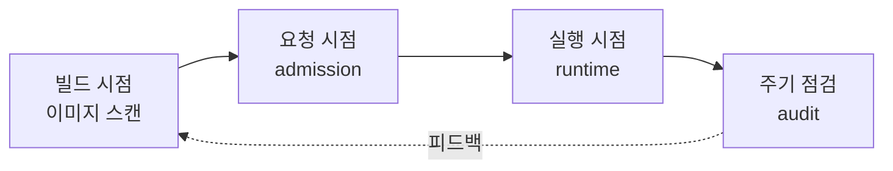
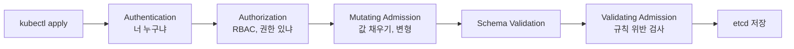
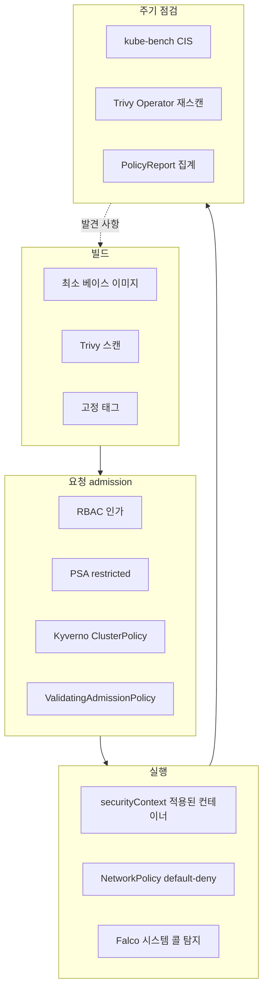

---

title: "Kubernetes 보안을 계층으로 나눠 세우기 (PSA, Kyverno, kube-bench, Falco, Trivy)"
date: 2026-06-15
categories: [Kubernetes, Security]
tags: [Kubernetes, Security, CKS, Kyverno, PodSecurity, kube-bench, CIS, Falco, Trivy, RBAC, NetworkPolicy]
layout: post
toc: true
math: true
mermaid: true

---

## 참고자료

- [Kubernetes - Security Checklist](https://kubernetes.io/docs/concepts/security/security-checklist/)
- [Kubernetes - Pod Security Standards](https://kubernetes.io/docs/concepts/security/pod-security-standards/)
- [Kubernetes - Pod Security Admission](https://kubernetes.io/docs/concepts/security/pod-security-admission/)
- [Kubernetes - Admission Controllers Reference](https://kubernetes.io/docs/reference/access-authn-authz/admission-controllers/)
- [Kubernetes - Dynamic Admission Control](https://kubernetes.io/docs/reference/access-authn-authz/extensible-admission-controllers/)
- [Kubernetes - Validating Admission Policy](https://kubernetes.io/docs/reference/access-authn-authz/validating-admission-policy/)
- [Kubernetes - RBAC Good Practices](https://kubernetes.io/docs/concepts/security/rbac-good-practices/)
- [Kubernetes - Securing a Cluster](https://kubernetes.io/docs/tasks/administer-cluster/securing-a-cluster/)
- [Kubernetes - Network Policies](https://kubernetes.io/docs/concepts/services-networking/network-policies/)
- [CIS Kubernetes Benchmark](https://www.cisecurity.org/benchmark/kubernetes)
- [kube-bench](https://github.com/aquasecurity/kube-bench)
- [Kyverno Documentation](https://kyverno.io/docs/)
- [Kyverno - Policy Exceptions](https://kyverno.io/docs/exceptions/)
- [Falco Documentation](https://falco.org/docs/)
- [Trivy Operator](https://aquasecurity.github.io/trivy-operator/latest/)
- [CKS 시험 커리큘럼](https://training.linuxfoundation.org/certification/certified-kubernetes-security-specialist/)

---

## 배경

CKS 커리큘럼을 훑고 나서도 정리가 안 되는 부분이 있었다. 배우는 항목은 많은데 그것들이 서로 어떤 관계인지가 안 보였다.

`securityContext`를 쓰면 Pod Security Admission은 왜 또 필요한가? PSA가 있는데 Kyverno는 왜 또 붙이는가? Kyverno가 막아주는데 Falco는 무엇을 더 보는가? kube-bench는 그것들과 어디가 다른가?

각 도구의 문서를 따로 읽으면 답이 안 나온다. **각 도구가 시간축의 어느 지점에서 동작하는지**를 놓고 봐야 정리가 됐다. 그 관점으로 다시 정리하고, 실제 클러스터에 적용하면서 겪은 것들을 덧붙였다.

회사 클러스터에서 쓰는 구성을 예로 들되, 내부 호스트명과 도메인은 일반화했다.

---

## 1. 도구를 시간축에 배치하기

보안 도구를 기능별로 나열하면 겹쳐 보인다. **리소스가 생겨나서 실행되기까지의 시간축**에 놓으면 겹치지 않는다.



| 시점 | 무엇을 보는가 | 도구 | 막을 수 있는가 |
|---|---|---|---|
| 빌드 | 이미지 안의 취약한 패키지, 시크릿 | Trivy, Harbor 스캔 | 파이프라인에서 차단 가능 |
| 요청 | API 요청의 리소스 정의 | PSA, Kyverno, ValidatingAdmissionPolicy | 생성 자체를 차단 |
| 실행 | 컨테이너 안에서 실제로 일어나는 시스템 콜 | Falco | 탐지만, 차단은 별도 |
| 주기 | 노드와 컨트롤플레인의 설정 파일 | kube-bench (CIS) | 탐지만, 조치는 사람 |

이 표에서 앞의 질문 몇 개가 바로 풀린다.

**Kyverno가 있는데 Falco는 왜 필요한가.** Kyverno는 요청 시점만 본다. `privileged: false`로 통과한 컨테이너가 실행 중에 `/etc/shadow`를 읽는 것은 admission이 알 수 없다. 그 시점의 시스템 콜을 보는 것이 Falco다.

**Kyverno가 있는데 kube-bench는 왜 필요한가.** Kyverno는 API 서버를 통과하는 요청만 본다. `kube-apiserver`가 `--anonymous-auth=true`로 떠 있거나 kubelet 설정 파일 권한이 `0777`인 것은 요청이 아니라 **호스트의 설정 상태**다. admission 웹훅에는 애초에 보이지 않는다.

**securityContext와 PSA는 무엇이 다른가.** `securityContext`는 내가 쓰는 것이고 PSA는 내가 쓴 것을 검사하는 것이다. `securityContext`를 안 써도 Pod는 뜬다. PSA는 그것을 안 쓴 Pod를 거부한다.

---

## 2. 요청 시점: 세 겹의 admission

가장 중요한 계층이다. 여기서 막힌 것은 클러스터에 아예 들어오지 못한다.

### 2.1 admission이 일어나는 자리

API 서버가 요청을 처리하는 순서는 정해져 있다.



Mutating이 Validating보다 먼저다. 사이드카를 주입하거나 기본값을 채워 넣는 웹훅이 앞에서 동작하고, 그 결과물을 검사하는 웹훅이 뒤에서 동작한다. 순서가 반대였다면 주입된 사이드카를 검사할 방법이 없다.

RBAC이 admission보다 앞에 있다는 점도 중요하다. **권한이 없으면 admission까지 오지도 않는다.** 정책 엔진으로 막는 것보다 애초에 권한을 주지 않는 편이 언제나 더 강하다.

### 2.2 첫 겹: Pod Security Admission

Kubernetes 1.25에서 PodSecurityPolicy가 제거되고 그 자리를 대신한 것이 PSA다. 내장 admission 컨트롤러라 별도 설치가 없다.

세 가지 표준이 있다.

[Pod Security Standards 문서](https://kubernetes.io/docs/concepts/security/pod-security-standards/)가 정의하는 세 단계를 정리하면 이렇다.

| 표준 | 무엇을 하는가 | 언제 쓰는가 |
|---|---|---|
| **Privileged** | 제한이 없다. 가능한 가장 넓은 권한을 허용한다 | 노드 접근이 꼭 필요한 인프라 컴포넌트 전용 |
| **Baseline** | 알려진 권한 상승 경로만 막는 최소한의 제한이다 | 기존 워크로드를 큰 수정 없이 얹을 때 |
| **Restricted** | 현재의 Pod 하드닝 모범 사례를 전부 요구한다 | 일반 애플리케이션의 기본값으로 삼을 것 |

**권한 상승(privilege escalation)** 이라는 말을 짚고 넘어간다. 컨테이너 안에서 시작한 프로세스가 원래 가진 것보다 더 큰 권한을 얻는 것을 말한다. root로 실행하거나, `privileged: true`로 커널 기능을 열거나, 호스트 경로를 마운트하면 컨테이너 경계를 넘어 노드까지 닿을 수 있다. Baseline이 막는 것이 이 경로들이다.

적용은 namespace 라벨로 한다.

```yaml
apiVersion: v1
kind: Namespace
metadata:
  name: app-namespace
  labels:
    pod-security.kubernetes.io/enforce: restricted
    pod-security.kubernetes.io/enforce-version: v1.31
    pod-security.kubernetes.io/audit: restricted
    pod-security.kubernetes.io/warn: restricted
```

모드가 셋인 것이 실무에서 유용하다.

| 모드 | 동작 |
|---|---|
| `enforce` | 위반 Pod 생성 거부 |
| `audit` | 감사 로그에만 기록, 생성은 허용 |
| `warn` | kubectl 응답에 경고 출력, 생성은 허용 |

새 정책을 넣을 때 `warn`과 `audit`부터 켜서 무엇이 걸리는지 본 다음 `enforce`로 올린다. 곧바로 `enforce`로 올리면 다음 롤아웃 때 전부 막힌다.

**restricted가 요구하는 것**을 실제 Pod로 보면 이렇다.

```yaml
spec:
  securityContext:
    runAsNonRoot: true
    seccompProfile:
      type: RuntimeDefault
  containers:
    - name: app
      securityContext:
        allowPrivilegeEscalation: false
        readOnlyRootFilesystem: true      # restricted 요구사항은 아니지만 함께 쓴다
        runAsNonRoot: true
        capabilities:
          drop: ["ALL"]
        seccompProfile:
          type: RuntimeDefault
```

여기서 실제로 걸렸던 것 두 가지를 적어둔다.

**`readOnlyRootFilesystem: true`를 켜면 로그를 못 쓴다.** 애플리케이션이 파일로 로그를 남기고 있으면 그 경로가 읽기 전용이 되어 기동 자체가 실패한다. 해결은 쓰기가 필요한 경로를 전부 볼륨으로 빼는 것이다.

```yaml
volumeMounts:
  - name: tmp
    mountPath: /tmp
  - name: logs
    mountPath: /app/log
volumes:
  - name: tmp
    emptyDir:
      sizeLimit: 512Mi
  - name: logs
    emptyDir:
      sizeLimit: 1Gi
```

`emptyDir`에 `sizeLimit`을 반드시 붙인다. 없으면 로그가 노드 디스크를 그대로 먹는다.

**`capabilities.drop: [ALL]`을 하면 80 포트를 못 연다.** 프론트엔드 컨테이너가 nginx 계열이면 1024 미만 포트를 바인딩하려고 `NET_BIND_SERVICE`가 필요하다. restricted 표준이 예외로 허용하는 유일한 capability다.

```yaml
capabilities:
  drop: ["ALL"]
  add: ["NET_BIND_SERVICE"]
```

이게 싫으면 컨테이너를 8080으로 띄우고 Service에서 포트를 매핑하는 편이 낫다.

### 2.3 둘째 겹: Kyverno

PSA로 안 되는 것이 있다. PSA는 **Pod 보안 표준이라는 고정된 규칙 집합**만 검사한다. 조직이 정한 규칙, 예를 들어 "이미지는 사내 레지스트리에서만", "라벨 세 개는 필수"는 PSA의 대상이 아니다.

그 자리를 채우는 것이 정책 엔진이다. Kyverno를 쓰고 있고, 예전에는 OPA Gatekeeper였다. 바꾼 이유는 정책을 Rego라는 별도 언어로 쓰지 않고 YAML로 쓴다는 점이 컸다. 팀원이 읽고 고칠 수 있어야 정책이 유지된다.

운영 중인 정책을 역할별로 나누면 이렇다.

| 번호대 | 역할 | 정책 |
|---|---|---|
| 00~04 | 워크로드 admission 검증 | 허용 레지스트리, privileged 차단, non-root 강제, 메모리 limit 강제, 필수 라벨 강제 |
| 05~07 | 예외 수명주기 | 만료일 없는 예외 차단, 만료된 예외 자동 삭제, cleanup 컨트롤러 RBAC |
| 08~09 | 리소스 전파 | 레지스트리 Secret을 애드온 namespace로 복제, 그에 필요한 RBAC |

정책 하나를 실제로 보면 이렇게 생겼다.

```yaml
apiVersion: kyverno.io/v1
kind: ClusterPolicy
metadata:
  name: require-resource-limits
  annotations:
    policies.kyverno.io/category: Resource Management
spec:
  validationFailureAction: Enforce
  background: true
  rules:
    - name: require-memory-limit
      match:
        any:
          - resources:
              kinds: [Pod]
              namespaces: [app-namespace]
      validate:
        message: "컨테이너에 memory limit이 필요하다."
        pattern:
          spec:
            containers:
              - resources:
                  limits:
                    memory: "?*"
```

**CPU limit은 의도적으로 검사하지 않는다.** 이 결정에는 이유가 있다. CPU limit을 걸면 CFS(Completely Fair Scheduler) 대역폭 제어가 활성화되어, 컨테이너가 할당량을 다 쓰면 남은 주기 동안 강제로 멈춘다. 이 throttling이 JVM 애플리케이션의 GC나 기동 구간에서 응답 지연으로 드러난다. 메모리는 초과하면 OOMKill이라는 명확한 실패로 끝나지만 CPU throttling은 조용히 느려지므로 원인을 찾기 어렵다. 그래서 메모리 limit은 강제하고 CPU limit은 두지 않는다.

### 2.4 두 개의 축을 헷갈리지 말 것

Kyverno를 붙이고 나서 가장 많이 헷갈렸던 부분이다. 비슷하게 생긴 설정이 두 개인데 서로 다른 상황을 정한다.

| 설정 | 정하는 것 | 값 |
|---|---|---|
| `validationFailureAction` | 검사 결과가 **위반일 때** | `Enforce`(차단), `Audit`(기록만) |
| `failurePolicy` | 검사기 **자체가 응답하지 못할 때** | `Fail`(차단), `Ignore`(통과) |

DEV 클러스터는 `validationFailureAction: Enforce` + `failurePolicy: Ignore`로 둔다. 정책 위반은 차단하되, Kyverno 웹훅 파드가 죽었을 때 클러스터 전체가 마비되지는 않게 한다는 뜻이다. 운영 환경에서는 `failurePolicy: Fail`이 맞다. 검사기가 죽은 동안 검사 없이 통과시키는 것이 더 위험하기 때문이다.

이 선택은 트레이드오프다. `Fail`로 두면 Kyverno가 죽었을 때 아무 Pod도 못 뜬다. Kyverno 자신을 포함해서. 그래서 `Fail`을 쓴다면 Kyverno 파드에 `priorityClass`를 높게 주고 복제본을 여러 개 두는 것이 함께 가야 한다.

### 2.5 예외를 만들되 영구 예외는 만들지 않기

정책을 강하게 걸면 반드시 걸리는 워크로드가 나온다. 이때 정책을 약하게 고치는 것이 가장 나쁜 선택이다. 하나를 위해 전체 기준이 내려간다.

Kyverno는 `PolicyException`이라는 별도 리소스로 이 문제를 푼다.

```yaml
apiVersion: kyverno.io/v2
kind: PolicyException
metadata:
  name: legacy-app-nonroot-exception
  namespace: app-namespace
  annotations:
    policies.kyverno.io/expires-at: "2026-12-31T00:00:00Z"
spec:
  exceptions:
    - policyName: require-non-root
      ruleNames: [must-run-as-non-root]
  match:
    any:
      - resources:
          kinds: [Pod]
          namespaces: [app-namespace]
          names: ["legacy-app-*"]
```

여기서 한 가지를 더 얹었다. **예외에 만료일을 강제하는 정책**을 따로 만들었다.

```yaml
# 만료일 annotation이 없는 PolicyException은 admission에서 거부된다
- name: require-expires-at
  match:
    any:
      - resources:
          kinds: [PolicyException]
  validate:
    message: "PolicyException에는 policies.kyverno.io/expires-at annotation이 필요하다."
    pattern:
      metadata:
        annotations:
          policies.kyverno.io/expires-at: "?*"
```

그리고 만료된 예외를 자동으로 지우는 `ClusterCleanupPolicy`를 붙인다.

```yaml
apiVersion: kyverno.io/v2
kind: ClusterCleanupPolicy
metadata:
  name: cleanup-expired-exceptions
spec:
  match:
    any:
      - resources:
          kinds: [PolicyException]
  conditions:
    all:
      - key: "{{ time_now_utc() }}"
        operator: GreaterThan
        value: "{{ target.metadata.annotations.\"policies.kyverno.io/expires-at\" }}"
  schedule: "0 4 * * *"
```

이렇게 하면 예외가 쌓여서 정책이 사실상 무력해지는 일이 구조적으로 막힌다. 계속 필요한 예외라면 그것은 예외가 아니라 정책 범위를 다시 정할 문제라는 신호로 읽는다.

### 2.6 Kyverno를 실제로 붙이면서 겪은 것들

문서에 없고 부딪혀야 알게 된 것들이다.

**기존 Pod는 통과하고 새 Pod만 막힌다.** admission은 요청 시점에만 동작하므로, 정책을 `Enforce`로 올려도 이미 떠 있는 Pod는 그대로 산다. 문제는 그다음 롤아웃이다. 노드를 재부팅하거나 이미지를 올리는 순간 새 Pod가 admission에서 막히고, 그때는 이미 기존 Pod가 종료된 뒤다.

그래서 `Enforce` 전환 PR은 머지 전에 **현재 실행 중인 워크로드가 그 정책을 통과하는지** 확인해야 한다. 인프라 DaemonSet이 특히 위험하다. 노드마다 하나씩 떠 있는데 전부 동시에 막힌다.

```bash
# 정책을 로컬에서 렌더된 매니페스트에 적용해본다
kyverno apply policies/02-require-non-root.yaml --resource rendered-deployment.yaml

# 현재 클러스터에서 위반 리소스를 먼저 찾는다 (Audit 모드로 돌린 뒤)
kubectl get policyreport -A -o json \
  | jq -r '.items[].results[] | select(.result=="fail") | "\(.policy) \(.resources[0].namespace)/\(.resources[0].name)"'
```

**시스템 namespace에는 정책이 적용되지 않는다.** Kyverno는 `resourceFilters` 설정으로 `kube-system`, 자기 자신의 namespace 등을 처리 대상에서 뺀다. 여기에 걸린 namespace는 validate도 generate도 동작하지 않는다.

이 사실이 실제로 문제가 된 것은 레지스트리 Secret 전파에서였다. Kyverno의 `generate` 정책으로 Secret을 애드온 namespace에 복제하는데, `kube-system`은 대상에서 빠져 있어 그 namespace만 클러스터 구축 스크립트가 직접 만들어야 했다.

여기서 `resourceFilters`를 푸는 선택은 하지 않았다. 풀면 모든 정책이 시스템 namespace의 admission까지 처리하게 되어 위험과 오버헤드가 함께 올라간다. 대상 리소스를 부트스트랩 쪽으로 옮기는 편이 맞다.

**Server-Side Apply와 정책 rule 제거가 충돌한다.** ArgoCD가 `ServerSideApply=true`로 동기화하는 환경에서, 정책의 `spec.rules` 리스트에서 rule 하나를 지우고 머지했는데 클러스터에는 그 rule이 남아 있었다. SSA가 리스트를 병합하면서 제거된 항목을 남긴 것이다.

증상이 특이하다. **git에 없는 내용을 참조하는 에러가 난다.** 이럴 때는 `Replace=true` 동기화 옵션으로 전체 PUT을 강제하거나 Application을 재생성한다.

**generate 정책에 변수 namespace를 쓰면 권한 검증에서 막힌다.** 복제 대상 namespace를 `{{request.object.metadata.name}}` 같은 변수로 쓰면, Kyverno가 백그라운드 컨트롤러의 쓰기 권한을 **클러스터 범위로** 검증한다. 권한을 namespace 단위 RoleBinding으로 최소화해둔 설계에서는 이 검증이 실패한다.

해결은 namespace마다 rule을 따로 쓰고 RoleBinding과 1:1로 맞추는 것이다. 규칙이 늘어나는 대신 권한 범위는 좁게 유지된다. 정책 엔진에 넓은 권한을 주면 그 엔진 자체가 공격 표면이 되므로, 이쪽이 맞는 방향이다.

### 2.7 Kyverno 없이 되는 것도 있다

Kubernetes 1.30부터 `ValidatingAdmissionPolicy`가 정식(GA) 기능이 됐다. CEL 표현식으로 정책을 쓰고, 별도 웹훅 파드 없이 API 서버 안에서 평가한다.

```yaml
apiVersion: admissionregistration.k8s.io/v1
kind: ValidatingAdmissionPolicy
metadata:
  name: require-memory-limit
spec:
  failurePolicy: Fail
  matchConstraints:
    resourceRules:
      - apiGroups: ["apps"]
        apiVersions: ["v1"]
        operations: ["CREATE", "UPDATE"]
        resources: ["deployments"]
  validations:
    - expression: >-
        object.spec.template.spec.containers.all(c,
          has(c.resources) && has(c.resources.limits) && has(c.resources.limits.memory))
      message: "모든 컨테이너에 memory limit이 필요하다."
```

웹훅 파드가 없다는 것이 가장 큰 차이다. 웹훅이 죽어서 클러스터가 멈추는 시나리오가 아예 없고, 네트워크 왕복도 없다.

대신 할 수 있는 일이 제한적이다. `generate`나 `mutate`가 없고, 외부 데이터를 조회할 수 없다. 그래서 단순한 검증 규칙은 이쪽으로 옮기고 복잡한 것만 정책 엔진에 남기는 조합이 합리적이다.

---

## 3. 실행 시점: Falco

admission을 통과한 컨테이너 안에서 무슨 일이 벌어지는지는 admission이 알 수 없다. 그 자리를 보는 것이 런타임 탐지다.

Falco는 커널에서 시스템 콜을 관찰한다. eBPF 프로브나 커널 모듈을 통해 `open`, `execve`, `connect` 같은 호출을 실시간으로 받아 규칙과 대조한다.

```yaml
- rule: Read sensitive file untrusted
  desc: 민감한 파일을 신뢰되지 않은 프로세스가 읽었다
  condition: >
    sensitive_files and open_read
    and not proc.name in (known_readers)
  output: >
    Sensitive file opened for reading
    (user=%user.name file=%fd.name container=%container.name)
  priority: WARNING
```

**Falco는 기본적으로 탐지만 한다.** 알림을 보내고 끝난다. 차단이 필요하면 Falco Talon 같은 대응 컴포넌트를 붙여 Pod를 종료하거나 라벨을 붙이는 식으로 연결해야 한다.

운영하면서 알게 된 것 두 가지가 있다.

**스크레이프가 끊겨도 조용하다.** Falco 자체는 잘 돌고 있는데 메트릭 수집 경로가 끊긴 채로 9일이 지난 적이 있다. 탐지 이벤트가 0건인 것과 수집이 안 되고 있는 것을 구분할 방법이 없었다. 그래서 탐지 도구에는 "탐지 결과"뿐 아니라 **"이 도구가 살아 있는가"에 대한 알림**을 따로 걸어야 한다. `up{job="falco"} == 0`처럼 명시적으로 본다.

**기본 규칙은 그대로 쓰면 소음이 심하다.** 정상 운영 중인 배포 작업, 로그 로테이션, 헬스체크가 규칙에 걸린다. 처음에는 전부 켜고 며칠 관찰하면서 자기 환경의 정상 동작을 예외로 빼는 작업이 필요하다. 이 작업을 안 하면 알림이 너무 많아 아무도 안 보게 되고, 그러면 탐지 도구를 켠 의미가 없어진다.

---

## 4. 주기 점검: kube-bench와 CIS Benchmark

### 4.1 CIS Benchmark가 보는 것

CIS Kubernetes Benchmark는 클러스터 구성 요소의 설정을 항목별로 점검하는 기준 문서다. admission이 보지 못하는 영역, 즉 **호스트 위의 설정 파일과 프로세스 인자**를 본다.

항목은 다섯 갈래로 나뉜다.

| 영역 | 예시 항목 |
|---|---|
| Control Plane 노드 설정 | apiserver 인자, 인증서 파일 권한, 매니페스트 파일 소유자 |
| etcd | 클라이언트 인증서 인증 여부, 데이터 디렉터리 권한 |
| Control Plane 구성 | 인증, 인가 설정, 감사 로그 활성화 |
| Worker 노드 | kubelet 인자, kubeconfig 파일 권한, 익명 접근 |
| Policies | RBAC, Pod Security, NetworkPolicy, Secret 관리 |

`kube-apiserver`가 `--anonymous-auth=true`로 떠 있는지, `/etc/kubernetes/manifests/*.yaml`의 권한이 `0600` 이하인지 같은 것이다. 이런 항목은 Kyverno로 검사할 수 없다. API 요청이 아니기 때문이다.

### 4.2 kube-bench를 Job으로 돌리기

kube-bench는 이 점검을 자동화한 도구다. 노드에 접속해서 파일과 프로세스를 직접 읽어야 하므로 실행 방식에 제약이 붙는다.

Control Plane 노드를 점검하는 CronJob을 이렇게 구성했다.

```yaml
apiVersion: batch/v1
kind: CronJob
metadata:
  name: kube-bench-master
  namespace: kube-bench
spec:
  schedule: "0 18 * * 0"          # 주 1회
  timeZone: Etc/UTC
  concurrencyPolicy: Forbid
  jobTemplate:
    spec:
      backoffLimit: 0
      ttlSecondsAfterFinished: 604800
      template:
        spec:
          hostPID: true
          automountServiceAccountToken: false
          restartPolicy: Never
          affinity:
            nodeAffinity:
              requiredDuringSchedulingIgnoredDuringExecution:
                nodeSelectorTerms:
                  - matchExpressions:
                      - key: node-role.kubernetes.io/control-plane
                        operator: Exists
          tolerations:
            - key: node-role.kubernetes.io/control-plane
              operator: Exists
              effect: NoSchedule
          containers:
            - name: kube-bench
              image: <레지스트리>/aquasecurity/kube-bench:v0.15.6
              command: ["kube-bench", "run", "--targets", "master,controlplane,etcd"]
              securityContext:
                runAsUser: 0                  # 노드 root 소유 설정 파일 읽기
                allowPrivilegeEscalation: false
                readOnlyRootFilesystem: true
                capabilities:
                  drop: ["ALL"]
              volumeMounts:
                - name: etc-kubernetes
                  mountPath: /etc/kubernetes
                  readOnly: true
```

설계에서 신경 쓴 부분들이다.

**전용 namespace를 따로 만들고 PSA를 `privileged`로 둔다.** `hostPID: true`와 호스트 경로 마운트가 필요해서 restricted를 통과할 수 없다. 워크로드 namespace에 넣으면 정책 예외를 뚫어야 하므로, 아예 격리된 namespace를 만들고 그곳만 완화한다. 정책을 약하게 만드는 대신 **약한 곳의 범위를 좁힌다**는 원칙이다.

**`runAsUser: 0`을 쓰되 나머지는 다 잠근다.** 노드의 root 소유 설정 파일을 읽어야 하므로 root는 불가피하다. 대신 `allowPrivilegeEscalation: false`, `readOnlyRootFilesystem: true`, `capabilities.drop: [ALL]`을 전부 걸고, 호스트 경로는 `readOnly: true`로만 붙인다. root라는 사실 하나로 다 열어주지 않는다.

**`automountServiceAccountToken: false`를 명시한다.** kube-bench의 노드 점검은 API 서버 호출이 필요 없다. 토큰을 마운트하지 않으면 컨테이너가 장악되어도 API 서버로 갈 자격 증명이 없다.

**`policies` 타겟은 뺐다.** 이 타겟은 API 조회가 필요해서 읽기 전용 ServiceAccount와 토큰 마운트가 함께 와야 한다. 대부분 `[MANUAL]` 판정 항목이라 자동화 가치가 낮아서, 필요한 권한을 붙이는 대신 제외했다.

**결과는 표준 출력으로 남기고 로그 수집기가 가져간다.** 별도 저장소나 API를 만들지 않고 기존 로그 파이프라인을 재사용한다. 점검 도구 하나 때문에 새 컴포넌트를 늘리지 않는다.

### 4.3 결과를 어떻게 다룰 것인가

kube-bench 결과는 `[PASS]`, `[FAIL]`, `[WARN]`, `[INFO]`로 나온다. 처음 돌리면 `[FAIL]`과 `[WARN]`이 수십 개 나오는데, 전부 고쳐야 하는 것은 아니다.

판정 기준을 이렇게 잡았다.

| 유형 | 대응 |
|---|---|
| 파일 권한, 소유자 | 즉시 조치. 자동화하기 쉽고 부작용이 없다 |
| apiserver, kubelet 인자 | 영향 평가 후 조치. 클러스터 재기동이 필요할 수 있다 |
| 관리형 클러스터에서 접근 불가한 항목 | 해당 없음으로 기록. 근거를 남긴다 |
| `[MANUAL]` 항목 | 사람이 판단해 결과를 문서에 남긴다 |

마지막 줄이 중요하다. **점검하지 않기로 한 항목도 기록해야 한다.** 그래야 다음 사람이 "이건 왜 안 고쳤나"를 다시 조사하지 않는다.

---

## 5. 빌드 시점: 이미지와 공급망

### 5.1 이미지 자체를 줄이기

가장 효과가 확실한 조치는 이미지에 들어 있는 것을 줄이는 것이다.

베이스 이미지를 `openjdk:17-jdk`(약 340MB)에서 `eclipse-temurin:17-jre-alpine`(약 80MB)으로 바꾸면서 크기가 76% 줄었다. 줄어든 것은 크기만이 아니다. **이미지에 들어 있는 패키지 수가 줄면 그 패키지들의 CVE도 함께 사라진다.** JDK 대신 JRE를 쓰면 컴파일러와 개발 도구가 통째로 빠지고, alpine 기반이면 배포판 패키지 수가 크게 준다.

부수 효과도 있다. 노드 디스크 사용량과 이미지 pull 전송량이 줄어 롤아웃이 빨라진다.

주의할 점은 alpine이 musl libc를 쓴다는 것이다. glibc를 전제로 한 네이티브 라이브러리가 있으면 동작하지 않는다. 이 경우 `-jre-jammy` 같은 slim 이미지가 대안이다.

### 5.2 레지스트리를 제한하기

이미지를 어디서 가져올 수 있는지를 정책으로 고정한다.

```yaml
- name: validate-registries
  match:
    any:
      - resources:
          kinds: [Pod]
  validate:
    message: "이미지는 사내 레지스트리에서만 가져올 수 있다."
    pattern:
      spec:
        =(initContainers):
          - image: "registry.internal.example/*"
        =(ephemeralContainers):
          - image: "registry.internal.example/*"
        containers:
          - image: "registry.internal.example/*"
```

`initContainers`와 `ephemeralContainers`를 함께 넣는 것이 요점이다. `containers`만 검사하면 init 컨테이너로 임의 이미지를 끌어올 수 있다. `=(...)` 문법은 "그 필드가 있으면 검사하고 없으면 통과"라는 뜻이라, init 컨테이너가 없는 Pod가 함께 막히지 않는다.

`ephemeralContainers`가 특히 중요하다. `kubectl debug`로 실행 중인 Pod에 컨테이너를 끼워 넣을 수 있는데, 여기에 제한이 없으면 디버그용이라는 이름으로 임의 이미지가 클러스터 안에서 실행된다.

### 5.3 태그를 고정하기

`latest` 태그를 금지한다. 이유가 두 가지다.

**첫째, 무엇이 돌고 있는지 알 수 없다.** 운영 중인 이미지가 어느 커밋에서 나온 것인지 추적할 방법이 없으면 장애 시 되돌릴 지점을 특정하지 못한다.

**둘째, GitOps에서 drift 추적이 안 된다.** git의 선언과 클러스터의 실제 상태를 비교하는 것이 GitOps인데, 태그가 `latest`면 양쪽 문자열이 같아도 실제 이미지가 다를 수 있다. 비교가 무의미해진다.

### 5.4 취약점 통보 경로 만들기

Trivy Operator를 클러스터에 두면 실행 중인 워크로드의 이미지를 주기적으로 스캔해 `VulnerabilityReport` 커스텀 리소스로 남긴다.

```bash
# 워크로드별 취약점 요약
kubectl get vulnerabilityreports -A \
  -o custom-columns='NS:.metadata.namespace,NAME:.metadata.name,CRITICAL:.report.summary.criticalCount,HIGH:.report.summary.highCount'
```

여기서 실제로 문제가 됐던 것은 도구가 아니라 **통보 경로**였다. 레지스트리의 기본 웹훅 연동이 스캔 결과를 빈 payload로 보내는 결함이 있어서, 스캔은 돌고 있는데 결과를 아무도 모르는 상태가 계속됐다.

중계 서비스를 하나 만들어 해결했다. 웹훅을 받아 레지스트리 API로 실제 스캔 결과를 조회하고, Critical과 High만 걸러 알림 채널로 보낸다.

여기서 얻은 교훈은 도구를 켜는 것과 그 결과가 사람에게 닿는 것이 별개의 일이라는 점이다. 스캐너를 붙였다는 사실만으로는 아무것도 개선되지 않는다.

---

## 6. 권한과 네트워크: 처음부터 좁게

### 6.1 ServiceAccount 토큰 자동 마운트 차단

기본 동작은 모든 Pod에 default ServiceAccount 토큰이 마운트되는 것이다. API 서버를 호출하지 않는 애플리케이션에도 자격 증명이 들어간다.

namespace 기본값으로 꺼둔다.

```yaml
apiVersion: v1
kind: ServiceAccount
metadata:
  name: default
  namespace: app-namespace
automountServiceAccountToken: false
```

API를 호출해야 하는 워크로드만 전용 ServiceAccount를 만들고 거기서 켠다. 공식 문서의 RBAC 모범 사례가 같은 순서를 권한다.

### 6.2 RBAC은 admission보다 앞선다

앞의 시간축에서 봤듯이 인가는 admission보다 먼저 일어난다. 정책 엔진으로 막는 것보다 권한을 안 주는 편이 항상 더 강하다.

특히 조심할 조합이 몇 가지 있다.

| 권한 | 위험 |
|---|---|
| `secrets` `get`/`list` | namespace의 모든 자격 증명 열람 |
| `pods/exec`, `pods/attach` | 실행 중인 컨테이너에 진입. 그 Pod의 권한을 그대로 획득 |
| `pods` `create` + 임의 SA 지정 | 더 높은 권한의 ServiceAccount로 Pod를 띄워 권한 상승 |
| `escalate`, `bind` | 자기가 가진 권한 이상으로 Role을 만들거나 바인딩 |
| 노드 접근 (`nodes/proxy`) | kubelet API 직접 호출 |

`pods` `create` 권한이 사실상 권한 상승 수단이라는 점이 자주 간과된다. Pod를 만들 수 있으면 그 Pod에 원하는 ServiceAccount를 붙일 수 있고, 호스트 경로를 마운트할 수 있으면 노드 파일 시스템에 닿는다. 그래서 Pod 생성 권한과 admission 정책은 함께 설계되어야 한다.

### 6.3 NetworkPolicy는 default-deny부터

NetworkPolicy가 없는 namespace는 모든 Pod가 모든 Pod와 통신할 수 있다. 하나가 뚫리면 거기서 다른 모든 것으로 갈 수 있다.

기본을 막고 필요한 것만 여는 순서로 간다.

```yaml
apiVersion: networking.k8s.io/v1
kind: NetworkPolicy
metadata:
  name: default-deny-all
  namespace: app-namespace
spec:
  podSelector: {}          # namespace의 모든 Pod
  policyTypes: [Ingress, Egress]
```

이걸 넣는 순간 DNS도 막힌다. Egress를 막았는데 `kube-dns`로 가는 53 포트를 안 열었기 때문이다. 그래서 default-deny와 DNS 허용은 항상 같이 들어간다.

```yaml
apiVersion: networking.k8s.io/v1
kind: NetworkPolicy
metadata:
  name: allow-dns
  namespace: app-namespace
spec:
  podSelector: {}
  policyTypes: [Egress]
  egress:
    - to:
        - namespaceSelector:
            matchLabels:
              kubernetes.io/metadata.name: kube-system
          podSelector:
            matchLabels:
              k8s-app: kube-dns
      ports:
        - protocol: UDP
          port: 53
        - protocol: TCP
          port: 53
```

**NetworkPolicy는 CNI가 구현해야 동작한다.** 이 리소스를 만들어도 CNI가 지원하지 않으면 아무 일도 일어나지 않는다. 에러도 나지 않는다. 적용했다고 믿고 넘어가는 것이 가장 위험하므로, 실제로 막히는지 확인해야 한다.

```bash
# 임시 Pod에서 차단 대상으로 접속을 시도해본다
kubectl run netcheck --rm -it --image=busybox --restart=Never -n app-namespace -- \
  sh -c 'wget -qO- --timeout=3 http://target-service:8080 || echo BLOCKED'
```

### 6.4 시크릿을 매니페스트에서 빼기

Kubernetes Secret은 기본적으로 base64 인코딩일 뿐 암호화가 아니다. 공식 문서가 명시한다.

[공식 문서](https://kubernetes.io/docs/concepts/configuration/secret/)가 명시하는 그대로다. Secret은 기본 설정에서 API 서버의 데이터 저장소인 etcd에 **암호화되지 않은 상태로** 저장된다.

그래서 세 가지가 함께 필요하다.

**저장 시 암호화(EncryptionConfiguration)** 를 켜서 etcd에 평문으로 남지 않게 한다. **Secret 읽기 권한을 좁게** 준다. 그리고 **git 매니페스트에 값을 넣지 않는다.**

세 번째가 실무에서 가장 많이 뚫린다. GitOps로 가면 모든 설정이 git에 들어가는데, values 파일에 API key가 평문으로 들어가 있으면 레포 접근 권한이 곧 자격 증명 접근 권한이 된다.

외부 시크릿 관리 도구를 두고 매니페스트에는 참조만 남기는 형태로 바꿨다.

```yaml
# 값을 쓰지 않고 이름만 참조한다
envFrom:
  - secretRef:
      name: app-secrets      # 오퍼레이터가 외부 저장소에서 동기화해 만든다
```

Secret이 갱신됐을 때 Pod가 새 값을 읽게 하려면 재시작이 필요하다. Reloader 같은 컴포넌트를 붙여 annotation으로 연결한다.

```yaml
metadata:
  annotations:
    secret.reloader.stakater.com/reload: "app-secrets"
```

여기서 실제로 사고가 하나 있었다. **시크릿 오퍼레이터가 다른 컴포넌트가 런타임에 생성한 키를 덮어썼다.** 오퍼레이터가 관리하는 Secret 이름과 그 컴포넌트가 자기 서명 키를 저장하는 Secret 이름이 겹쳤고, 동기화가 돌면서 런타임 키가 외부 저장소의 값으로 교체됐다. 그 컴포넌트의 UI와 API가 전부 내려갔다.

교훈은 **오퍼레이터가 관리하는 Secret과 컴포넌트가 스스로 만드는 Secret을 이름 공간에서 분리해야 한다**는 것이다. 자동 동기화는 편리한 만큼 덮어쓰기도 자동으로 한다.

---

## 7. 계층을 다시 붙여서 보기

지금까지 본 것을 하나로 겹치면 이렇게 된다.



각 계층이 앞 계층의 실패를 전제로 설계되어야 한다. 이미지 스캔이 놓친 것을 admission이 잡고, admission을 통과한 것 중 이상 동작을 런타임이 잡고, 그 어느 것도 보지 못하는 호스트 설정을 주기 점검이 잡는다.

한 계층이 전부를 막아준다고 생각하는 순간 그 계층이 뚫렸을 때 대안이 없어진다.

### 도입 순서

한꺼번에 다 켜면 무엇 때문에 막혔는지 알 수 없다. 다음 순서로 갔다.

1. **먼저 본다.** PSA를 `warn` + `audit`으로 켜고, Kyverno 정책을 `Audit`으로 넣고, kube-bench를 한 번 돌린다. 이 단계에서는 아무것도 막히지 않는다.
2. **걸리는 것을 고친다.** 애플리케이션이 root로 도는 이유, 쓰기 경로가 루트 파일 시스템에 있는 이유를 하나씩 처리한다. 여기가 제일 오래 걸린다.
3. **하나씩 올린다.** 고친 정책부터 `Enforce`로 전환한다. 전환 전에 현재 실행 중인 워크로드가 통과하는지 반드시 확인한다.
4. **탐지를 붙인다.** Falco와 Trivy Operator를 켜고, 며칠 관찰하며 자기 환경의 정상 동작을 예외로 정리한다.
5. **주기화한다.** kube-bench를 CronJob으로, 정책 위반 리포트를 주간 집계로 돌린다.

2단계를 건너뛰고 3단계로 가면 다음 롤아웃에서 서비스가 멈춘다. admission 정책은 기존 Pod를 건드리지 않으므로, 적용한 날에는 아무 일도 일어나지 않다가 며칠 뒤에 터진다.

---

## 정리하며

처음 던진 질문들에 대한 답이다.

**securityContext가 있는데 PSA는 왜 필요한가.** `securityContext`는 내가 쓰는 선언이고 PSA는 그 선언이 있는지 검사하는 장치다. 안 쓴 Pod도 그냥 뜨기 때문에, 강제하려면 검사하는 쪽이 따로 있어야 한다.

**PSA가 있는데 Kyverno는 왜 필요한가.** PSA는 Pod 보안 표준이라는 고정된 규칙만 검사한다. 허용 레지스트리, 필수 라벨, 예외 만료일처럼 조직이 정한 규칙은 PSA의 대상이 아니다.

**Kyverno가 막는데 Falco는 무엇을 더 보는가.** admission은 요청 시점만 본다. 정책을 통과한 컨테이너가 실행 중에 하는 시스템 콜은 admission에 보이지 않는다.

**kube-bench는 그것들과 어디가 다른가.** API 요청이 아니라 호스트의 설정 파일과 프로세스 인자를 본다. `--anonymous-auth=true`로 뜬 API 서버는 어떤 admission 웹훅에도 걸리지 않는다.

정리하고 나서 남은 것은 도구 목록이 아니라 **어느 시점에 무엇을 볼 수 있는가**라는 기준이었다. 새 도구를 검토할 때도 같은 질문부터 한다. 이건 시간축의 어디에 서는가, 그 자리에 이미 있는 것과 무엇이 다른가.

그리고 반복해서 확인한 것 하나가 더 있다. 도구를 켜는 일과 그 결과가 사람에게 닿는 일은 별개다. 스캐너를 붙였는데 통보 경로가 깨져 있었고, 런타임 탐지가 돌고 있는데 수집이 9일간 끊겨 있었다. 두 경우 모두 대시보드에는 문제가 없어 보였다. 그래서 탐지 도구에는 탐지 결과와 별개로 **그 도구가 살아 있는지에 대한 알림**을 반드시 따로 건다.
