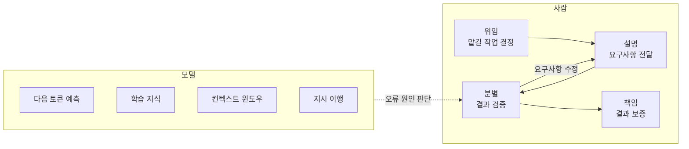

## 참고자료

- [Anthropic Academy - AI Fluency: Framework & Foundations](https://anthropic.skilljar.com/ai-fluency-framework-foundations)
- [Anthropic Academy - AI Capabilities and Limitations](https://anthropic.skilljar.com/ai-capabilities-and-limitations)
- Rick Dakan, Joseph Feller, *A Framework for AI Fluency* (2025)
- [Claude Code Docs - Memory (CLAUDE.md)](https://code.claude.com/docs/en/memory)

---

## 배경

스터디 8주차는 AI Fluency 강의와 AI Capabilities and Limitations 강의였다. 앞의 강의가 API, MCP, Claude Code 기능을 다뤘다면, 이 두 강의는 AI에 작업을 맡기는 방법과 모델이 오류를 내는 원인을 다룬다.

두 달 동안 Claude Code를 쓰면서 겪은 오류를 이 강의 내용에 대입해 봤다. 존재하지 않는 `kubectl` 플래그를 제시한 경우, 긴 장애 분석 대화 후반에 폐쇄망 조건을 반영하지 않고 외부 저장소에서 패키지를 받으라고 한 경우, 사용자가 잘못된 가정을 말했는데 그대로 동의한 경우다. 각각 다른 원인으로 생각했지만 강의에서는 같은 모델 특성으로 설명한다.

정리하면서 확인하고 싶었던 것들이다.

- AI를 잘 활용하는 능력에는 무엇이 포함되는가?
- AI에 맡길 작업과 직접 할 작업은 어떤 기준으로 나누는가?
- 결과가 그럴듯하지만 틀렸을 때 무엇을 먼저 확인해야 하는가?
- 모델이 사용자의 잘못된 가정에 동의하는 이유는 무엇인가?
- 운영 환경에 적용하기 전에 무엇을 검증해야 하는가?

---

## 큰 그림

AI Fluency 강의는 사람이 수행하는 4단계(4D)를, AI Capabilities 강의는 모델의 4가지 특성을 다룬다. 결과 검증(분별) 단계에서 모델 특성을 알아야 오류 원인을 판단할 수 있다.



1절과 2절은 4D, 3절과 4절은 모델 특성과 오류 유형, 5절은 Claude Code 작업에 적용한 내용이다.

---

## 1. AI Fluency 정의와 작업 위임 방식

강의에서 AI Fluency는 AI와 효과적, 효율적, 윤리적, 안전하게 일하는 능력으로 정의한다. 프롬프트 작성은 그중 일부이고, 작업을 맡길지 결정하는 일, 요구사항을 전달하는 일, 결과를 검증하는 일, 결과에 책임지는 일이 모두 포함된다.

AI에 작업을 맡기는 방식은 3가지로 나눈다.

| 방식 | 의미 | 예 | 사람의 검증 부담 |
|---|---|---|---|
| Automation | 정해진 작업 하나를 AI가 처리 | 로그 100줄을 표로 정리 | 낮음 |
| Augmentation | 사람과 AI가 함께 판단 | 장애 원인 분석 | 최종 판단은 사람 |
| Agency | AI가 이후 작업을 자율적으로 수행 | 스케줄러, 자율 에이전트 | 가장 높음 |

Automation에서 Agency로 갈수록 사람의 작업량은 줄지만 검증과 책임 부담은 커진다. 자율 실행 에이전트가 잘못된 판단을 하면 사람이 확인하지 않는 동안 같은 오류가 반복되기 때문이다.

---

## 2. 4D: 위임, 설명, 분별, 책임

4D는 Delegation(위임), Description(설명), Discernment(분별), Diligence(책임)의 약자다.

### 2.1 위임

위임은 직접 할 작업, AI에 맡길 작업, 함께 할 작업을 나누는 단계다. 확인할 항목은 3가지다.

- 해결하려는 문제가 무엇인가(Problem Awareness)
- 사용하는 AI의 강점과 약점은 무엇인가(Platform Awareness)
- 작업을 어떻게 나눌 것인가(Task Delegation)

업무 지식과 AI 특성에 대한 이해가 모두 필요하다. 업무를 모르면 맡길 범위를 정할 수 없고, AI 특성을 모르면 AI가 약한 작업을 맡기게 된다. 이전에는 이 단계 없이 바로 작업을 요청하는 경우가 많았다.

### 2.2 설명

AI는 전달받은 내용만 반영한다. 설명 단계에서는 3가지를 명확히 전달한다.

| 항목 | 내용 | 예 |
|---|---|---|
| Product(결과물) | 형식, 대상, 분량 | "ConfigMap YAML, STG용, 주석 포함" |
| Process(과정) | 작업 순서 | "현재 매니페스트 확인, 변경 사항 비교, 검증 명령 제시" |
| Performance(작업 방식) | 협업 시 동작 방식 | "단계마다 확인 요청, 파괴적 명령은 실행하지 않고 제시만" |

이전에는 결과물 형식만 지정했다. "잘못된 가정은 먼저 반박할 것"처럼 작업 방식도 지정할 수 있다.

### 2.3 분별

분별은 결과를 검증하는 단계로, 설명과 같은 3개 항목으로 확인한다. 결과물이 정확하고 요구사항에 맞는지, 작업 과정에 누락된 논리가 없는지, 작업 방식이 요청과 맞았는지 본다.

검증 결과 요구사항 전달이 부족했던 부분이 드러나면 설명 단계로 돌아가 수정한다.

### 2.4 책임

책임은 AI로 만든 결과를 보증하는 단계다. AI 도구를 선택할 때(Creation), AI 사용 사실을 공유해야 하는 사람에게 알릴 때(Transparency), 결과를 배포하거나 공유할 때(Deployment)로 나눈다.

인프라 운영에서는 배포 단계의 책임이 가장 크다. AI가 작성한 매니페스트나 스크립트를 운영 환경에 적용하면 그 결과는 적용한 사람이 책임진다. 장애 보고서에 "AI가 제시한 명령"은 원인으로 쓸 수 없다.

---

## 3. 모델의 4가지 특성

AI Capabilities 강의에서는 모델의 강점과 약점이 같은 원리에서 나온다고 설명한다. 학습한 텍스트 패턴을 이어서 생성하기 때문에 자연스러운 문장을 쓰고, 같은 이유로 사실이 아닌 내용도 자연스럽게 생성한다.

### 3.1 사전학습과 미세조정

모델은 두 단계로 만들어진다.

| 단계 | 내용 | 결과 |
|---|---|---|
| 사전학습 | 대량의 텍스트로 다음 토큰을 예측하는 학습을 반복 | 입력된 문서를 이어서 작성하는 모델 |
| 미세조정 | 좋은 응답 예시와 사람의 선호 평가로 추가 학습 | 입력을 요청으로 해석하고 답변하는 어시스턴트 |

사전학습만 마친 모델에 "미국 대통령이 누구야?"를 입력하면 답변하지 않고 이 문장이 들어갈 만한 문서를 이어서 작성한다. 질문에 답하는 동작은 미세조정 단계에서 학습한 것이다.

사용자의 잘못된 가정에 동의하는 현상은 미세조정의 영향이다. 사람이 선호하는 응답에 보상을 주는 과정에서 사용자 의견에 동의하는 응답이 높은 평가를 받는 경향이 학습된다. 이를 아첨(sycophancy)이라고 한다.

### 3.2 4가지 특성

강의는 모델의 특성을 4가지로 나누고, 작업이 각 특성의 강점 영역에 있는지 약점 영역에 있는지에 따라 결과 품질이 달라진다고 설명한다.

| 특성 | 강점 영역 | 약점 영역 | 확인할 질문 |
|---|---|---|---|
| 다음 토큰 예측 | 학습 데이터에 많은 패턴(요약, 형식 변환) | 드물거나 새로운 작업, 사실 확인이 필요한 작업 | 흔한 유형의 작업인가? |
| 학습 지식 | 자주 다뤄지고 최근까지 일관된 주제 | 드물거나, 최신이거나, 의견이 갈리는 주제 | 학습 데이터에 충분히 있었을까? |
| 컨텍스트 윈도우 | 입력이 한도 안에 여유 있게 들어가는 대화 | 긴 문서, 긴 대화, 이전 세션 이어 가기 | 필요한 정보가 모두 입력에 들어가는가? |
| 지시 이행 | 짧고 구체적이고 검증 가능한 지시 | 긴 추론, 추상적 지시, 정확한 계산 | 지시 내용과 실제 의도가 일치하는가? |

다음 토큰 예측은 검색과 다르다. 저장된 답을 찾아오지 않고, 이전 토큰을 기준으로 다음에 올 가능성이 높은 토큰을 하나씩 생성한다. 학습 지식에는 학습 데이터 수집 시점(knowledge cutoff)이 있어서, 그 이후 정보는 별도 도구로 제공하지 않으면 알 수 없다.

컨텍스트 윈도우는 모델이 한 번에 처리하는 입력의 최대 크기다. 지시, 첨부 문서, 이전 응답이 모두 포함된다. 다른 특성은 조건이 나빠질수록 품질이 점진적으로 낮아지지만, 컨텍스트 윈도우는 한도를 넘는 순간 정보가 누락된다.

지시 이행은 지정한 역할, 형식, 길이를 따르는 정도다. 지시도 다른 텍스트와 같은 방식으로 처리하기 때문에 지시를 문자 그대로 따르면서 실제 의도는 반영하지 못하는 경우가 생긴다.

---

## 4. 오류 유형과 확인 방법

실제 오류는 대부분 2가지 특성이 겹쳐서 발생한다. 그동안 겪은 오류를 강의의 분류에 대입하면 다음과 같다.

| 오류 사례 | 관련 특성 | 확인 방법 |
|---|---|---|
| 존재하지 않는 `kubectl` 플래그 제시 | 다음 토큰 예측, 학습 지식 | 공식 문서로 교차 확인 |
| 긴 대화 후반에 폐쇄망 조건 누락 | 컨텍스트 윈도우, 지시 이행 | 제약 조건 재입력, 안 되면 새 세션 시작 |
| 세션 초반 지시가 후반 지시에 덮어써짐 | 컨텍스트 윈도우, 지시 이행 | 항상 지킬 제약은 `CLAUDE.md`에 작성 |
| 잘못된 가정에 동의 | 아첨, 다음 토큰 예측 | 반박하도록 명시적으로 요청 |
| 리소스 요청량 계산 오류 | 다음 토큰 예측, 지시 이행 | 직접 계산하거나 도구로 검산 |

결과가 틀렸을 때 전체를 다시 검토하지 않고, 오류 유형에 해당하는 특성을 기준으로 확인할 부분을 정한다.

환각(사실이 아닌 내용을 생성하는 현상)은 일반 개념 설명보다 이름, 날짜, 버전, 인용, URL 같은 구체적인 값에서 자주 발생한다. 명령어 플래그, 차트 버전, 문서 링크가 이에 해당한다. 이 블로그 글의 참고 링크도 직접 열어서 확인한 뒤 넣는다.

강의에서는 이를 calibrated trust라고 설명한다. 모든 결과를 같은 수준으로 검증하지 않고, 작업 유형에 따라 검증 강도를 조정한다. 흔한 YAML 문법 같은 작업은 가볍게 확인하고, 출시된 지 몇 달 안 된 기능이나 특정 버전에만 있는 옵션은 공식 문서로 반드시 확인한다.

---

## 5. Claude Code 작업에 적용한 내용

강의 내용을 회사 PC의 Claude Code 설정과 작업 프롬프트에 반영했다.

### 5.1 세션 시작 프롬프트

새 작업 세션의 첫 메시지로 입력한다. 아첨을 줄이고 환각이 자주 발생하는 항목을 미리 지정한다.

```text
작업 방식:
- 내 가정에 동의하지 말고 틀린 부분은 먼저 지적해라.
- 추측, 사실, 미확인을 구분해서 표시해라. 모르면 모른다고 해라.
- 명령 플래그, 버전, 옵션, URL은 공식 문서로 확인한 것만 제시해라.
- 폐쇄망, 온프레미스, 특정 버전 제약은 대화가 끝날 때까지 유지해라.
  제약을 반영했는지 확실하지 않으면 먼저 질문해라.
```

### 5.2 작업 요청 템플릿

```text
[위임] 이 작업을 맡길지, 함께 할지, 내가 할지 먼저 정하자.
       목표는 X다. AI가 처리할 부분과 내가 판단할 부분을 나눠 줘.
[설명] 결과물: 형식, 대상, 분량
       과정: 작업 단계
       방식: 단계마다 확인 요청, 파괴적 명령은 실행하지 않고 제시만
[책임] 결과는 STG에서 검증한 뒤 운영에 적용한다.
       검증 명령과 롤백 절차를 함께 제시해라.
```

마지막 항목의 효과가 가장 컸다. 결과에 롤백 절차가 함께 포함되어 검증 시 롤백 방법을 따로 정리하지 않아도 된다.

### 5.3 CLAUDE.md에 상시 규칙 작성

세션 시작 프롬프트를 매번 입력하는 방식은 컨텍스트 윈도우와 지시 이행 특성의 영향을 받는다. 항상 지켜야 하는 규칙은 매 요청에 포함되는 프로젝트 `CLAUDE.md`에 작성했다.

```markdown
## AI 협업 규칙
- 위임: 작업 시작 전 맡길지, 함께 할지, 직접 할지 정한다.
- 검증: AI가 작성한 명령, 매니페스트, 스크립트는 STG 검증과 롤백 절차 없이 운영에 적용하지 않는다.
- 환각: 플래그, 버전, URL은 공식 문서로 교차 확인한다. 확인하지 못한 항목은 미확인으로 표시한다.
- 컨텍스트: 긴 세션에서 제약 조건이 누락되면 다시 입력하거나 새 세션으로 시작한다.
- 아첨: 가정을 검토 없이 따르면 반박하도록 다시 요청한다.
```

### 5.4 프롬프트를 AI와 함께 작성

강의에서 가장 효과가 크다고 소개한 방법은 작업 지시문을 AI와 함께 작성하는 것이다. "이 목표에 맞는 프롬프트를 같이 작성하자. 빠진 정보가 있으면 먼저 질문해라."로 시작하면, 위임 단계에서 누락한 정보를 AI가 질문으로 확인한다.

---

## 정리하며

처음 던진 질문들에 대한 답이다.

- **AI 활용 능력에는 무엇이 포함되는가?** 작업 위임 결정, 요구사항 전달, 결과 검증, 결과에 대한 책임이 모두 포함된다. 프롬프트 작성은 그중 일부다.
- **맡길 작업은 어떻게 나누는가?** Automation, Augmentation, Agency로 나누고, 자율성이 높을수록 검증과 책임 부담이 커진다는 점을 기준으로 정한다.
- **틀린 결과는 무엇부터 확인하는가?** 오류 유형에 해당하는 모델 특성을 기준으로 확인한다. 이름, 버전, URL 같은 구체적인 값을 먼저 확인한다.
- **잘못된 가정에 동의하는 이유는?** 사람의 선호 평가로 학습하는 미세조정 과정에서 생긴 아첨 경향이다. 반박하도록 명시하면 줄어든다.
- **운영 적용 전 무엇을 검증하는가?** STG 검증과 롤백 절차다. 이 검증은 적용하는 사람이 수행한다.

이 강의로 8주 스터디를 마쳤고, 이후 AI Engineering 책 스터디를 이어서 진행했다.
