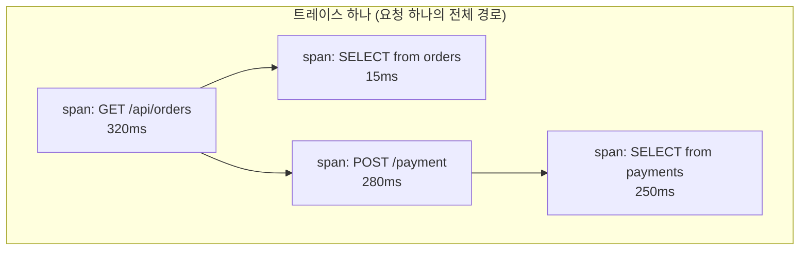
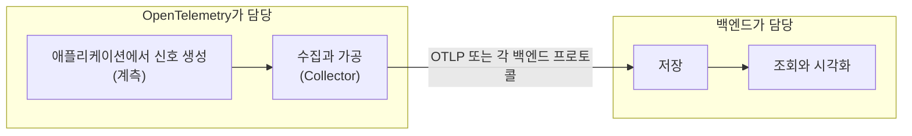
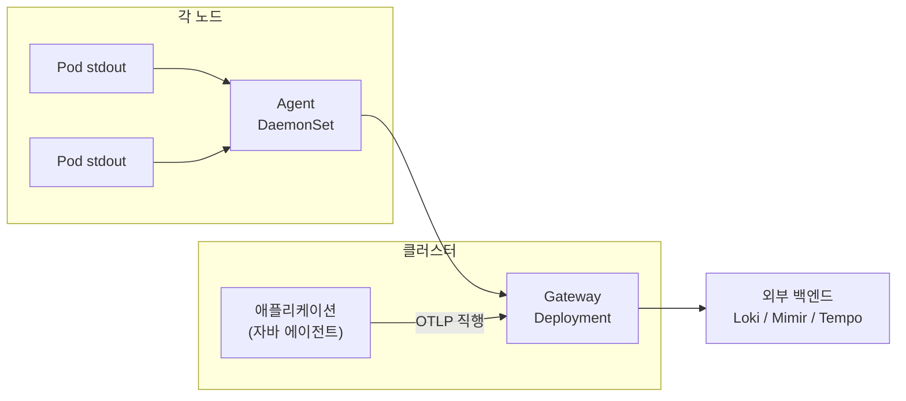
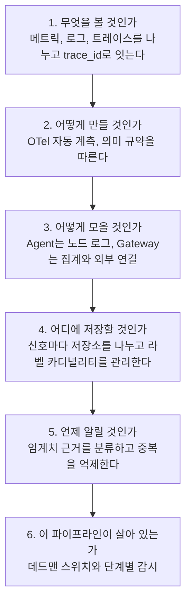

---

title: "관측성을 직접 세우면서 알게 된 것들 (OpenTelemetry, LGTM, 알림 설계)"
date: 2026-07-06
categories: [Observability, DevOps]
tags: [Observability, OpenTelemetry, OTel, LGTM, Loki, Mimir, Tempo, Grafana, Alerting, SLO]
layout: post
toc: true
math: true
mermaid: true

---

## 참고자료

- [OpenTelemetry - Signals](https://opentelemetry.io/docs/concepts/signals/)
- [OpenTelemetry - OTLP 명세](https://opentelemetry.io/docs/specs/otlp/)
- [OpenTelemetry - Semantic Conventions](https://opentelemetry.io/docs/concepts/semantic-conventions/)
- [OpenTelemetry - Collector Agent 배치](https://opentelemetry.io/docs/collector/deployment/agent/)
- [OpenTelemetry - Collector Gateway 배치](https://opentelemetry.io/docs/collector/deployment/gateway/)
- [OpenTelemetry - Java 자동 계측](https://opentelemetry.io/docs/zero-code/java/agent/)
- [Grafana Loki 문서](https://grafana.com/docs/loki/latest/)
- [Grafana Mimir 문서](https://grafana.com/docs/mimir/latest/)
- [Grafana Tempo 문서](https://grafana.com/docs/tempo/latest/)
- [Google SRE Workbook - Alerting on SLOs](https://sre.google/workbook/alerting-on-slos/)
- [Prometheus - Alerting 모범 사례](https://prometheus.io/docs/practices/alerting/)

---

## 배경

상용 APM을 쓰다가 관측성 스택을 직접 세우게 됐다. 도구를 켜는 것 자체는 문서대로 하면 되는데, 그 뒤에 답이 안 나오는 질문들이 남았다.

- 메트릭, 로그, 트레이스를 왜 굳이 셋으로 나누는가? 로그에 다 찍으면 안 되는가?
- OpenTelemetry는 정확히 무엇인가? Prometheus를 대체하는 것인가, 그 앞에 붙는 것인가?
- Collector를 왜 두 층으로 두는가? 하나면 안 되는가?
- 임계치를 얼마로 잡을 것인가? 하루에 열 번 넘게 울리는 알림은 무엇이 잘못된 것인가?
- SLO 기반 알림이 좋다는데, 그걸 넣으면 실제로 무엇이 나아지는가?

순서대로 정리했다. 마지막 질문에 대한 답이 예상과 달라서, 그 얘기를 제일 뒤에 따로 뒀다.

회사 구성을 예로 들되 내부 주소와 서비스 이름은 일반화했다.

---

## 1. 왜 셋으로 나누는가

### 1.1 세 가지 신호

관측성을 이야기할 때 나오는 세 가지가 있다. OpenTelemetry는 이것을 **신호(signal)** 라고 부른다.

**메트릭(Metric).** 시간에 따라 변하는 숫자다. `요청 수`, `응답 시간 95분위`, `메모리 사용량` 같은 것이다. 값이 규칙적인 간격으로 기록되고, 시간 축으로 집계할 수 있다.

**로그(Log).** 특정 시점에 일어난 일을 적은 텍스트다. `2026-09-01T10:00:00 ERROR Connection refused` 같은 것이다.

**트레이스(Trace).** 요청 하나가 여러 서비스를 지나간 경로다. 각 구간을 **스팬(span)** 이라고 부르고, 스팬들이 부모와 자식 관계로 이어져 하나의 트레이스를 이룬다.



### 1.2 로그에 다 찍으면 안 되는가

처음에 이 질문을 오래 붙들었다. 결론은 **각각이 답할 수 있는 질문이 다르다**는 것이었다.

| 신호 | 답할 수 있는 질문 | 답할 수 없는 질문 |
|---|---|---|
| 메트릭 | 지금 에러율이 몇 퍼센트인가, 어제보다 늘었는가 | 그 에러가 무슨 에러인가 |
| 로그 | 그 에러가 무슨 에러인가 | 전체 요청 중 몇 퍼센트인가 |
| 트레이스 | 320ms 중 어디서 280ms를 썼는가 | 이런 요청이 얼마나 자주 오는가 |

로그로 에러율을 계산할 수는 있다. 그런데 그러려면 모든 로그를 저장하고 매번 세어야 한다. 메트릭은 애초에 숫자로 집계된 상태로 저장되므로 훨씬 싸다.

**비용 구조가 다르다는 점이 실무에서 결정적이다.**

| 신호 | 저장량 | 조회 비용 |
|---|---|---|
| 메트릭 | 작다. 시계열마다 값 하나씩 | 싸다. 인덱스가 시계열 단위 |
| 로그 | 크다. 발생한 줄 수만큼 | 중간. 라벨로 좁힌 뒤 텍스트 검색 |
| 트레이스 | 매우 크다. 요청마다 스팬 여러 개 | 중간. 보통 샘플링해서 일부만 저장 |

그래서 실제 조사 흐름이 이렇게 굳는다.


**메트릭이 알림을 울리고, 로그가 무슨 일인지 알려주고, 트레이스가 어디인지 짚는다.** 셋을 나누는 이유가 이 흐름에 있다.

### 1.3 셋을 잇는 것

나누고 나면 새 문제가 생긴다. 메트릭에서 이상을 봤을 때 **그 시점의 로그와 트레이스로 어떻게 건너가는가.**

여기서 **컨텍스트 전파(context propagation)** 가 필요하다. 요청 하나에 고유한 `trace_id`를 붙이고, 그 요청이 만드는 로그에도 같은 `trace_id`를 넣는다. 그러면 트레이스에서 로그로, 로그에서 트레이스로 이동할 수 있다.

```
2026-09-01T10:00:00 ERROR [trace_id=4bf92f3577b34da6a3ce929d0e0e4736] Connection refused
```

이 연결이 되어 있는지 아닌지가 조사 속도를 크게 가른다. 없으면 시간 범위로 로그를 훑으면서 눈으로 맞춰야 한다.

---

## 2. OpenTelemetry가 무엇인가

### 2.1 Prometheus를 대체하는가

아니다. 층이 다르다.

**OpenTelemetry(OTel)는 신호를 만들어서 보내는 쪽의 표준**이다. 저장하고 조회하는 쪽은 별개다.



그래서 OTel과 Prometheus는 경쟁 관계가 아니다. OTel Collector가 메트릭을 모아 Prometheus 호환 저장소에 밀어 넣는 조합이 흔하다.

### 2.2 OTel이 실제로 제공하는 것

세 가지다.

**명세(Specification).** 신호가 어떤 모양이어야 하는지를 정한다. 그중 **의미 규약(semantic conventions)** 이 실무에서 중요하다. "HTTP 요청 메트릭의 이름은 `http.server.request.duration`이고 라벨은 `http.request.method`, `http.response.status_code`다" 같은 것을 정해둔 것이다.

이게 왜 중요한가. 같은 것을 서비스마다 다르게 이름 붙이면 하나의 쿼리로 전체를 볼 수 없다. 규약을 따르면 언어와 프레임워크가 달라도 같은 이름으로 나온다.

**SDK와 자동 계측.** 애플리케이션 코드에서 신호를 만드는 라이브러리다. 자바에서는 **자바 에이전트** 형태로 제공되어 코드를 하나도 안 고치고 계측할 수 있다.

```bash
java -javaagent:/opt/opentelemetry-javaagent.jar \
     -Dotel.service.name=backend-api \
     -Dotel.exporter.otlp.endpoint=http://collector:4317 \
     -jar app.jar
```

이것만으로 HTTP 요청, DB 쿼리, 메시지 큐 호출에 대한 트레이스와 메트릭이 나온다. 자바 에이전트가 바이트코드를 실행 시점에 고쳐서 계측 코드를 끼워 넣기 때문이다.

**Collector.** 신호를 받아서 가공하고 내보내는 별도 프로세스다. 3장에서 자세히 본다.

### 2.3 OTLP

**OTLP(OpenTelemetry Protocol)** 는 신호를 주고받는 전송 규격이다. gRPC(4317 포트)나 HTTP(4318 포트)로 동작한다.

이게 있어서 얻는 것은 **백엔드를 바꿔도 애플리케이션을 안 고쳐도 된다**는 점이다. 애플리케이션은 OTLP로 Collector에 보내고, 어느 저장소로 갈지는 Collector 설정에서 정한다.

실제로 상용 APM에서 자체 스택으로 옮길 때 이 구조가 이전 비용을 크게 줄였다. 애플리케이션 쪽 변경은 엔드포인트 주소 하나였다.

---

## 3. Collector를 왜 두 층으로 두는가

### 3.1 Collector가 하는 일

Collector 설정은 세 부분으로 나뉜다.

```yaml
receivers:      # 어디서 받을 것인가
  otlp:
    protocols:
      grpc:
        endpoint: 0.0.0.0:4317

processors:     # 받은 것을 어떻게 가공할 것인가
  memory_limiter:
    check_interval: 1s
    limit_percentage: 80
  batch:
    timeout: 10s
  k8sattributes:      # 쿠버네티스 메타데이터 부착

exporters:      # 어디로 보낼 것인가
  otlphttp/logs:
    endpoint: http://loki-gateway/otlp
  prometheusremotewrite:
    endpoint: http://mimir/api/v1/push

service:
  pipelines:    # 위 세 가지를 조합
    logs:
      receivers: [otlp]
      processors: [memory_limiter, k8sattributes, batch]
      exporters: [otlphttp/logs]
```

`processors`의 순서가 파이프라인의 처리 순서다. `memory_limiter`를 맨 앞에 두는 것이 관례인데, 메모리가 부족할 때 뒤쪽 처리를 시작하기 전에 거부하기 위해서다.

### 3.2 두 가지 배치 방식

OTel 문서는 두 가지 배치 패턴을 설명한다.

**에이전트(Agent) 배치.** 신호를 만드는 곳 가까이에 둔다. 쿠버네티스에서는 DaemonSet으로 노드마다 하나씩 띄운다.

**게이트웨이(Gateway) 배치.** 클러스터에 하나 또는 몇 개를 두고 모든 신호를 여기로 모은다. Deployment로 띄우고 앞에 Service를 둔다.

### 3.3 둘 다 쓰는 이유

각각이 잘하는 일이 다르다.



**에이전트만 할 수 있는 일**이 있다. 노드의 파일 시스템에서 컨테이너 로그를 읽는 것이다. 컨테이너가 표준 출력에 쓴 로그는 노드의 `/var/log/pods` 아래에 파일로 쌓인다. 이걸 읽으려면 그 노드에 있어야 한다.

**게이트웨이만 할 수 있는 일**도 있다. 클러스터 전체를 보고 집계하는 것, 그리고 **외부로 나가는 연결을 한 곳으로 모으는 것**이다.

두 번째가 실무에서 컸다. 폐쇄망 환경에서는 외부로 나가는 경로마다 방화벽 승인이 필요하다. 노드가 늘어날 때마다 승인을 다시 받아야 한다면 운영이 안 된다. 게이트웨이를 두면 나가는 지점이 하나로 고정된다.

### 3.4 실제로 나눈 방식

책임을 이렇게 갈랐다.

| Collector | 배치 | 책임 |
|---|---|---|
| 에이전트 | DaemonSet | 노드의 컨테이너 stdout 로그를 읽어 게이트웨이로 전달 |
| 게이트웨이 (애드온용) | Deployment | 애드온들이 노출하는 메트릭 엔드포인트를 수집해 메트릭 저장소로 전달 |
| 게이트웨이 (워크로드용) | Deployment | 애플리케이션이 OTLP로 보낸 신호를 백엔드로 분배 |

게이트웨이를 둘로 나눈 이유는 **관리 주체와 배포 주기가 다르기 때문**이다. 애드온용은 인프라 영역이고 워크로드용은 애플리케이션 영역이다. 하나로 합치면 애플리케이션 배포가 애드온 수집에 영향을 준다.

애플리케이션 로그가 에이전트를 거치지 않는 점도 짚어둔다. 자바 에이전트가 OTLP로 게이트웨이에 직접 보낸다. 파일을 거치지 않으므로 `trace_id`가 로그에 그대로 붙어 나온다. 1.3절에서 본 연결이 여기서 만들어진다.

### 3.5 에이전트를 붙이면서 걸린 것

**루트 권한이 필요하다.** `/var/log/pods`가 `root:root` 소유라 일반 사용자로는 읽을 수 없다. 보안 정책으로 non-root를 강제하는 환경에서는 이 컴포넌트만 예외를 줘야 한다.

예외를 주되 범위를 좁혔다. 호스트 경로는 읽기 전용으로만 붙이고, 권한 상승을 막고, capability를 전부 뺐다.

```yaml
securityContext:
  runAsUser: 0                    # /var/log/pods 읽기용
  allowPrivilegeEscalation: false
  readOnlyRootFilesystem: true
  capabilities:
    drop: ["ALL"]
volumeMounts:
  - name: varlogpods
    mountPath: /var/log/pods
    readOnly: true
```

**메모리 한도를 잡아야 한다.** 로그가 몰리면 Collector가 노드 메모리를 먹는다. `memory_limiter` 프로세서와 컨테이너 메모리 한도를 함께 건다. 전자가 없으면 컨테이너가 OOM으로 죽으면서 버퍼에 있던 로그를 통째로 잃는다.

---

## 4. LGTM 스택

Grafana Labs의 저장소 조합을 앞글자를 따서 부르는 이름이다. 각각이 신호 하나씩을 맡는다.

| 이름 | 무엇을 저장하는가 | 대응하는 신호 |
|---|---|---|
| **L**oki | 로그 | 로그 |
| **G**rafana | (저장소가 아니라 조회 UI) | 전부 |
| **T**empo | 트레이스 | 트레이스 |
| **M**imir | 메트릭 | 메트릭 |

### 4.1 Loki가 다른 로그 시스템과 다른 점

Loki는 **로그 본문에 인덱스를 만들지 않는다.** 라벨만 인덱싱하고 본문은 압축해서 통째로 저장한다.

이게 무엇을 뜻하는가. 전문 검색 엔진 계열은 모든 단어를 색인하므로 임의의 단어로 빠르게 찾을 수 있지만, 인덱스가 원본보다 커지기도 한다. Loki는 인덱스가 작은 대신 **먼저 라벨로 범위를 좁힌 다음** 그 안에서 본문을 훑는다.

```logql
{namespace="app-dev", app="backend-api"} |= "Connection refused"
```

앞의 `{}`가 라벨 선택이고 뒤의 `|=`가 본문 필터다. **라벨을 안 쓰고 본문만 검색하면 매우 느리다.** 전체를 훑어야 하기 때문이다.

여기서 나오는 함정이 **라벨 카디널리티**다. 라벨 값의 조합마다 별도의 스트림이 만들어지므로, `trace_id`나 `user_id`처럼 값이 무한한 것을 라벨로 만들면 스트림이 폭증한다.

```
# 하면 안 되는 것
{namespace="app-dev", trace_id="4bf92f35..."}   # trace_id 하나마다 스트림 하나
```

`trace_id`는 라벨이 아니라 **로그 본문에** 두고, 조회할 때 본문 필터로 찾는다.

### 4.2 Mimir와 Tempo

**Mimir**는 Prometheus와 호환되는 메트릭 저장소다. PromQL을 그대로 쓴다. Prometheus 대신 쓰는 이유는 장기 보존과 수평 확장 때문이다.

**Tempo**도 Loki와 같은 발상이다. 트레이스 본문에 인덱스를 만들지 않고 `trace_id`로만 조회한다. 그래서 "느린 요청을 찾아줘"가 아니라 "이 `trace_id`의 트레이스를 보여줘"가 기본 사용 방식이다.

그러면 `trace_id`를 어디서 얻는가. **메트릭이나 로그에서 얻는다.** 1.3절에서 본 연결이 여기서 쓰인다. 에러 로그를 찾고 거기 붙은 `trace_id`로 트레이스를 연다.

Grafana에서 이 이동을 설정으로 이어둘 수 있다. 로그의 `trace_id` 필드를 Tempo 데이터소스에 연결하면 로그 화면에서 바로 트레이스로 넘어간다.

### 4.3 유지 기간 설정에서 겪은 사고

Loki가 디스크 92%까지 차서 로그 수집이 멈춘 적이 있다.

원인을 찾아보니 유지 기간(retention) 설정이 잘못 들어가 있었다. 의도는 13시간이었는데 2160시간, 즉 90일로 설정되어 있었다. 값의 자릿수를 잘못 본 것이다.

여기서 배운 것 두 가지다.

**저장소 설정은 즉시 문제가 드러나지 않는다.** 유지 기간을 잘못 잡아도 그 기간이 차기 전까지는 아무 증상이 없다. 며칠 뒤에 디스크가 찬다.

**그래서 설정값 자체를 검증하는 알림이 필요하다.** 디스크 사용률만 보면 이미 늦다. 실제로는 디스크 사용률 알림과 함께 저장소 유지 기간 설정을 정기 점검 항목에 넣었다.

---

## 5. 알림을 어떻게 설계할 것인가

여기가 가장 오래 걸린 부분이다.

### 5.1 알림이 하루 열 번 울리면

인수인계받은 알림 규칙이 있었다. 알림 규칙 99개와 사전 계산 규칙 126개가 쌓여 있었고, 서비스 하나 기준으로 하루 열 번 넘게 울렸다.

이 상태의 문제는 알림이 많다는 것 자체가 아니다. **아무도 안 본다는 것**이다. 열 번 중 아홉 번이 조치가 필요 없으면, 열 번째의 진짜 장애도 같이 무시된다.

### 5.2 임계치의 근거를 네 단계로 나누기

임계치를 다시 정하면서, 값보다 **그 값을 어디서 가져왔는지**를 먼저 분류했다.

| 근거 단계 | 무엇인가 | 예시 |
|---|---|---|
| 1. 업계 표준 | 널리 합의된 값 | 디스크 사용률 85%, 인증서 만료 30일 전 |
| 2. 아키텍처 상수 | 설정에서 나오는 값 | 커넥션 풀 크기가 20이면 활성 18개가 경고선 |
| 3. 이 환경 실측 | 우리 환경에서 재본 값 | 평시 응답 시간 95분위가 200ms이면 500ms가 이상 |
| 4. 근거 없는 추정 | 일단 정한 값 | |

**4번을 문서에 그대로 4번이라고 적는 것**이 핵심이었다. 처음에는 전부 그럴듯한 이유를 붙이려 했는데, 그러면 근거 없는 값과 실측한 값을 구분할 수 없어진다.

4번으로 표시된 항목이 나중에 재조정 대상 목록이 된다. 실측 데이터가 쌓이면 3번으로 승격시킨다.

### 5.3 중복 발화를 억제하기

노드 하나가 죽으면 그 노드의 모든 것에 대해 알림이 온다. 노드 다운, 그 위 Pod들의 다운, 그 Pod들의 응답 없음, 그 서비스들의 에러율 증가.

**전부 같은 사건이다.** 알림은 하나면 된다.

Alertmanager의 억제(inhibit) 규칙이 이 일을 한다. "A가 울리는 동안 B는 보내지 마라"를 선언한다.

```yaml
inhibit_rules:
  # 같은 대상에 대해 critical이 울리면 warning은 억제
  - source_matchers:
      - severity="critical"
    target_matchers:
      - severity="warning"
    equal: ['alertname', 'instance']

  # 노드가 죽으면 그 노드의 나머지 알림 억제
  - source_matchers:
      - alertname="NodeExporterDown"
    target_matchers:
      - severity=~"warning|info"
    equal: ['instance']

  # 앱이 죽으면 그 앱의 성능 알림 억제
  - source_matchers:
      - alertname="AppDown"
    target_matchers:
      - alertname=~"HighError.*|HighResponse.*|Jvm.*|Hikari.*"
    equal: ['instance']
```

**`equal`이 중요하다.** 어떤 라벨이 같을 때만 억제할지를 정한다. 이게 없으면 A 노드가 죽었을 때 B 노드의 알림까지 억제된다.

여기서 실제로 문제가 됐던 것이 있다. **`critical` 알림과 `warning` 알림의 `alertname`이 서로 달라서 첫 번째 규칙이 동작하지 않았다.**

`HighErrorRate`와 `HighErrorRateCritical`처럼 이름을 따로 지어놓았던 것이다. `equal: ['alertname', 'instance']`가 이름이 같아야 억제하는데, 이름이 다르니 둘 다 나갔다.

같은 사건을 두 번 알리는 쌍이 열일곱 개 있었다. 이름 체계를 맞추고 억제 규칙을 정리했다.

### 5.4 임계치가 역전되어 있었다

같은 감사에서 나온 다른 문제다. `critical` 임계치가 `high` 임계치보다 **낮게** 설정된 경우가 있었다.

```yaml
# 잘못된 상태
- alert: MemoryHigh
  expr: memory_usage > 0.85
- alert: MemoryCritical
  expr: memory_usage > 0.80      # high보다 낮다
```

이러면 사용률이 82%일 때 `critical`만 울리고 `high`는 안 울린다. 심각도 순서가 뒤집힌다.

**이런 것은 눈으로 안 잡힌다.** 규칙 파일이 여러 개로 나뉘어 있고 같은 지표의 규칙이 서로 다른 파일에 있으면 특히 그렇다. 그래서 규칙 전체를 뽑아 지표별로 정렬해서 확인했다.

```bash
# 지표별로 임계치를 뽑아 심각도 순서를 확인한다
yq eval '.groups[].rules[] | select(.alert != null) |
  [.alert, .labels.severity, .expr] | @tsv' rules/*.yml \
  | sort -k3
```

### 5.5 알림에 조치 내용을 함께 적기

알림 메시지가 "메모리 사용률 90%"라고만 오면, 받은 사람이 무엇을 해야 하는지 다시 찾아야 한다.

그래서 모든 알림에 **무슨 일이 벌어지는지와 무엇을 확인해야 하는지**를 함께 넣었다.

```yaml
- alert: LogIngestionRateLimit
  expr: rate(discarded_samples_total{reason="rate_limited"}[5m]) > 0
  for: 5m
  labels:
    severity: warning
    component: observability
  annotations:
    summary: "로그 저장소가 초당 {{ $value | printf \"%.2f\" }}건을 rate-limit (로그 유실)"
    description: "폐기율 초당 {{ $value | printf \"%.2f\" }}건. 발화 기준 0/s 초과, 5분 지속. 수집 한도 25MB/s."
    consequence: "로그가 폐기된다. 장애 분석 시 빈 구간이 생긴다. 한도 상향 또는 카디널리티 폭증 원인 차단이 필요하다."
```

`consequence`라는 필드를 따로 만든 것이 실제로 효과가 있었다. **"이걸 무시하면 무슨 일이 생기는가"** 를 적으면 우선순위 판단이 빨라진다. 그리고 이 필드를 적으려다가 답이 안 나오는 알림이 나온다. 그런 알림은 지워도 되는 알림이다.

`description`에 발화 기준을 그대로 적어두는 것도 도움이 됐다. 알림을 받고 "이게 얼마나 심각한 건가"를 판단할 때 임계치를 다시 찾아보지 않아도 된다.

### 5.6 라벨이 비어 있던 문제

OTel로 넘어오면서 메트릭에 붙는 라벨 이름이 달라졌다. 기존 규칙은 `app`이라는 라벨을 쓰고 있었는데 OTel 메트릭에는 `service_name`만 있었다.

결과적으로 알림 메시지의 애플리케이션 이름 자리가 비어서 나갔다. 어느 서비스인지 모르는 알림이 온 것이다.

`label_replace`로 해결했다.

```promql
label_replace(
  rate(http_server_requests_seconds_count[5m]),
  "app", "$1", "service_name", "(.*)"
)
```

`service_name` 값을 `app` 라벨로 복사한다. 기존 규칙과 대시보드를 전부 고치는 대신 이쪽을 골랐다.

**여기서 배운 것은 계측 도구를 바꿀 때 라벨 이름 변경을 먼저 확인해야 한다는 점이다.** 값은 잘 들어오는데 라벨 이름이 달라서 기존 자산이 전부 어긋나는 상황이 생긴다.

---

## 6. SLO 기반 알림을 넣었다가 뺀 이야기

### 6.1 SLO와 오차 예산

먼저 용어를 정리한다.

**SLI(Service Level Indicator).** 서비스가 얼마나 잘 동작하는지를 나타내는 지표다. 예를 들어 "성공한 요청 수 나누기 전체 요청 수".

**SLO(Service Level Objective).** 그 지표의 목표값이다. "성공률 99.9%".

**오차 예산(Error Budget).** 목표를 100%에서 뺀 것이다. 99.9%가 목표면 0.1%까지는 실패해도 된다. 30일 기준으로 약 43분이다.

**소진율(Burn Rate).** 오차 예산을 얼마나 빠르게 쓰고 있는지다. 소진율 1이면 30일에 딱 맞춰 다 쓰는 속도이고, 14.4면 그보다 14.4배 빠른 속도다.

### 6.2 다중 창 다중 소진율

Google SRE Workbook이 제안하는 방식이다. 단순히 "에러율 5% 초과"로 알리면 두 가지 문제가 있다.

**짧은 스파이크에 반응한다.** 1분 동안 5%였다가 돌아온 것에도 알림이 간다.

**느린 누수를 놓친다.** 1%씩 계속 실패하면 임계치에 안 걸리는데 예산은 꾸준히 탄다.

그래서 **긴 창과 짧은 창을 함께** 본다. 긴 창은 "정말로 문제가 있는가"를 보고, 짧은 창은 "지금도 계속되고 있는가"를 본다.

```promql
# 빠른 소진: 1시간 창과 5분 창을 함께
(
  error_ratio_1h > (14.4 * 0.001)
  and
  error_ratio_5m > (14.4 * 0.001)
)
```

두 조건을 `and`로 묶는 것이 요점이다. 문제가 해소되면 짧은 창이 먼저 내려가므로 알림도 빨리 꺼진다.

### 6.3 그래서 넣었다

이 방식을 적용했다. SLO 목표를 99.9%로 잡고, 빠른 소진과 느린 소진 두 종류의 알림을 만들었다.

그런데 문서에 한 줄을 적어야 했다. **이 99.9%가 어디서 왔는가.**

조직이 합의한 값이 아니었다. SRE Workbook 예제의 기본값을 그대로 가져온 것이었다. 그 사실을 그대로 적었다.

### 6.4 그리고 뺐다

몇 달 뒤에 이 알림들을 제거했다. 제거하면서 파일에 이유를 남겼다.

**첫째, SLO 목표와 "성공 요청"의 정의가 합의되지 않았다.** SLI를 `1 - (5xx / 전체)`로 잡았는데, 4xx는 실패인가? 타임아웃은? 로그인 API의 실패와 조회 API의 실패를 같은 무게로 볼 것인가? 이 질문에 답이 없는 상태에서 나온 숫자는 그럴듯해 보일 뿐이었다.

**둘째, 트래픽이 적어서 통계적으로 의미가 없었다.** 사내 백오피스라 초당 요청 수가 0.05 수준인 서비스가 있었다. 이 정도면 실패 한 건이 에러율 몇 퍼센트가 된다. 소진율 알림이 상시로 울렸다.

이게 SLO 방식의 잘못이 아니다. **트래픽이 충분한 서비스를 전제로 만들어진 방식**을 그렇지 않은 환경에 적용한 것이 잘못이었다.

**셋째, 예산을 다 썼을 때 무엇을 할지가 정해져 있지 않았다.** SLO의 원래 목적은 "예산이 남았으면 기능을 배포하고, 다 썼으면 안정화에 집중한다"는 판단 기준을 주는 것이다. 그 판단을 실제로 하지 않는다면 지표만 있고 쓰임이 없다.

제거하면서 **다시 켜기 위한 조건**을 파일에 함께 적었다.

```
# 다시 켜려면 아래 네 가지가 먼저 충족되어야 한다.
# 1) 서비스 묶음별 가용성 목표 합의. 예: 인증 99.9%, 일반 백오피스 99.5%.
# 2) "성공 요청"의 명시적 정의. 현재 SLI는 1-(5xx/전체)뿐.
#    4xx, 타임아웃, 중요 경로 가중치 포함 여부를 결정해야 한다.
# 3) 최소 트래픽 게이트. 소진율은 요청 수가 충분한 서비스에만 의미가 있다.
#    and on(app) (sum by (app) (rate(http_server_requests_seconds_count[5m])) > 1)
# 4) 예산 소진 시 행동 규칙. 배포 동결 등.
groups: []
```

그리고 5xx 탐지가 비지 않도록, 직접 에러율 알림은 그대로 유지했다. 사전 계산 규칙도 남겨두었다. 대시보드에서 쓰고 있고 나중에 재도입할 때 필요하기 때문이다.

### 6.5 여기서 배운 것

처음 질문이 "SLO 기반 알림을 넣으면 무엇이 나아지는가"였다. 답은 **"조직이 목표에 합의했다면 나아지고, 아니면 근거 없는 숫자가 근거 있어 보이게 될 뿐"** 이었다.

이게 이 글에서 제일 오래 남은 교훈이다. **모범 사례를 도입할 때 그것이 전제하는 조건이 우리 환경에 있는지를 먼저 봐야 한다.** SLO 알림은 트래픽이 충분하고, 목표가 합의되어 있고, 예산 소진 시 행동이 정해져 있을 때 동작한다. 셋 중 하나라도 없으면 알림만 늘어난다.

그리고 **뺄 때 이유와 재도입 조건을 남기는 것**이 중요하다. 안 그러면 다음 사람이 "왜 SLO 알림이 없지?"라고 생각하고 같은 것을 다시 만든다.

---

## 7. 모니터링 자체를 모니터링하기

### 7.1 조용한 실패

관측성 스택을 세우고 나서 제일 무서운 상황은 **알림이 안 오는 것**이다. 문제가 없어서 안 오는 것인지, 시스템이 죽어서 안 오는 것인지 구분할 방법이 없다.

실제로 두 번 겪었다.

**런타임 탐지 도구의 메트릭 수집이 9일간 끊겨 있었다.** 도구 자체는 잘 돌고 있었는데 수집 경로가 끊겼다. 탐지 이벤트가 0건인 것과 수집이 안 되는 것이 대시보드에서 똑같이 보였다.

**메트릭 저장소가 시리즈 한도 초과로 30초마다 수백 건을 버리고 있었다.** 일부 지표가 안 보이는데 그게 원래 없는 건지 버려진 건지 알 수 없었다.

### 7.2 데드맨 스위치

첫 번째 대책이 **항상 울리는 알림**을 하나 두는 것이다.

```yaml
- alert: Watchdog
  expr: vector(1)          # 항상 참
  labels:
    severity: none
  annotations:
    summary: "모니터링 하트비트. 이 알림이 해소되면 모니터링 스택이 죽은 것이다."
```

`vector(1)`은 항상 1을 반환하므로 이 알림은 계속 발화 상태다. 그래서 **이 알림이 멈추면 규칙 평가 엔진이나 알림 전송 경로가 죽은 것**이다.

받는 쪽에서 이 알림이 일정 시간 안 오면 경보를 울리도록 설정한다. 알림 시스템 밖에서 감시하는 것이 요점이다. 안에서 감시하면 같이 죽는다.

### 7.3 파이프라인 각 단계를 감시하기

두 번째 대책은 **수집 파이프라인의 각 단계가 데이터를 흘리고 있는지**를 지표로 보는 것이다.

```yaml
# 수집기가 스팬을 거부하고 있는가
- alert: CollectorRefusedSpans
  expr: rate(otelcol_receiver_refused_spans_total[5m]) > 0
  for: 5m
  annotations:
    consequence: "트레이스가 유실된다. 메모리 한도 또는 다운스트림 병목을 확인한다."

# 규칙 평가가 실패하고 있는가
- alert: RuleEvaluationFailing
  expr: rate(prometheus_rule_evaluation_failures_total[10m]) > 0
  for: 10m
  labels:
    severity: critical
  annotations:
    consequence: "장애가 나도 알림이 안 나갈 수 있다. 규칙 문법이나 없는 메트릭 참조를 즉시 확인한다."

# 로그가 버려지고 있는가
- alert: LogIngestionRateLimit
  expr: rate(loki_discarded_samples_total{reason="rate_limited"}[5m]) > 0
  for: 5m
```

두 번째 규칙의 `consequence`가 이 절의 요점을 그대로 담고 있다. **규칙 평가가 실패하면 그 규칙이 감시하던 대상의 장애를 놓친다.** 이건 다른 어떤 알림보다 먼저 알아야 한다.

### 7.4 스크레이프 자체가 살아 있는지

가장 기본적인 것도 빠뜨리기 쉽다.

```promql
# 수집 대상이 응답하지 않는다
up == 0

# 특정 잡의 수집이 통째로 끊겼다
absent(up{job="falco"})
```

`up == 0`과 `absent(up{...})`는 다르다. 전자는 대상이 있는데 응답을 안 하는 것이고, **후자는 대상 자체가 목록에서 사라진 것**이다. 9일간 못 알아챈 사례가 후자였다. 대상이 사라지면 `up` 시계열도 없어지므로 `up == 0` 조건에 걸리지 않는다.

---

## 8. 정리하면

관측성을 직접 세우면서 정리된 순서다.



6번을 마지막에 두었지만 실제로는 **처음부터 함께 만들어야 한다.** 나중에 붙이면 그 전까지의 공백을 알 방법이 없다.

---

## 정리하며

처음 던진 질문들에 대한 답이다.

**메트릭, 로그, 트레이스를 왜 셋으로 나누는가.** 각각 답할 수 있는 질문이 다르고 저장 비용이 다르다. 메트릭이 알림을 울리고, 로그가 무슨 일인지 알려주고, 트레이스가 어디인지 짚는다. 셋을 `trace_id`로 이어두지 않으면 이 흐름이 끊긴다.

**OpenTelemetry는 Prometheus를 대체하는가.** 아니다. 층이 다르다. OTel은 신호를 만들고 모아서 보내는 쪽의 표준이고, 저장과 조회는 백엔드가 한다. 그래서 백엔드를 바꿔도 애플리케이션은 안 고쳐도 된다.

**Collector를 왜 두 층으로 두는가.** 노드의 로그 파일은 그 노드에 있어야 읽을 수 있고, 외부로 나가는 연결은 한 곳으로 모아야 방화벽 관리가 된다. 두 요구가 다른 배치를 필요로 한다.

**임계치를 얼마로 잡을 것인가.** 값보다 근거를 먼저 분류했다. 업계 표준, 아키텍처 상수, 이 환경 실측, 근거 없는 추정 네 단계로 나누고, 네 번째를 그대로 네 번째라고 적었다. 그래야 나중에 무엇을 다시 재야 하는지 알 수 있다.

**SLO 기반 알림을 넣으면 무엇이 나아지는가.** 조직이 목표에 합의했고, 트래픽이 충분하고, 예산 소진 시 행동이 정해져 있으면 나아진다. 셋 중 하나라도 없으면 근거 없는 숫자가 근거 있어 보이게 될 뿐이다. 실제로 넣었다가 뺐고, 뺀 이유와 다시 켜기 위한 조건을 파일에 남겼다.

가장 크게 바뀐 생각은 이것이다. **도구를 켜는 일과 그 결과가 사람에게 닿는 일은 별개다.** 수집기는 잘 돌고 있는데 수집 경로가 9일간 끊겨 있었고, 알림 규칙은 99개가 있는데 아무도 안 보고 있었다. 대시보드에는 두 경우 다 아무 문제가 없어 보였다.
