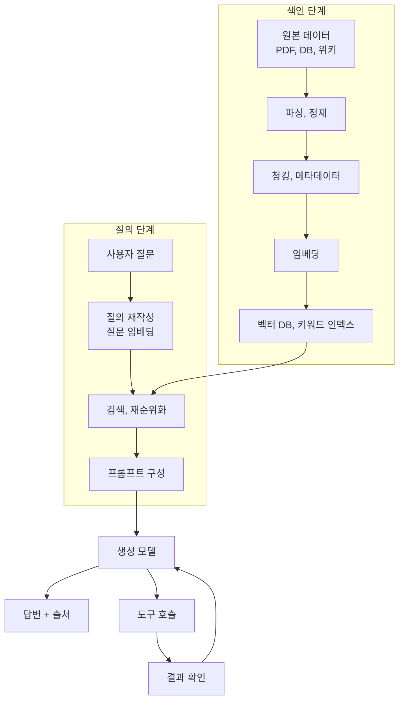
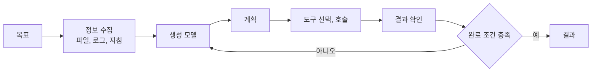
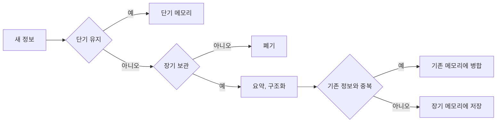

## 참고자료

- Chip Huyen, *AI Engineering: Building Applications with Foundation Models*, O'Reilly, 2025 (6장)
- [Claude Code Docs - Agent SDK](https://code.claude.com/docs/en/agent-sdk/overview)
- [Claude Code Docs - MCP](https://code.claude.com/docs/en/mcp)

---

## 배경

AI Engineering 책 스터디의 6장은 RAG(Retrieval-Augmented Generation)와 에이전트, 메모리를 다룬다. 지난 장에서 프롬프트를 작성하는 방법을 정리했다면, 이번 장은 프롬프트에 넣을 정보를 외부에서 찾아오는 방법과 모델이 도구를 반복 호출하며 작업하는 구조를 다룬다.

사내 런북과 장애 회고 문서를 모델이 참고하게 하려면 RAG 구성이 필요했다. 사내망은 외부 임베딩 API를 호출할 수 없어서, 어떤 구성 요소가 외부 서비스에 의존하는지 확인하는 것이 이번 정리의 목적이었다.

정리하면서 확인하고 싶었던 것들이다.

- RAG는 어떤 단계로 구성되고, 각 단계는 언제 실행되는가?
- 벡터 DB와 검색기(retriever)는 어떻게 다른가?
- 검색 품질에 영향을 주는 요소는 무엇인가?
- 에이전트는 RAG와 무엇이 다른가?
- 에이전트의 메모리는 어떻게 나뉘고 어떻게 관리하는가?

---

## 큰 그림

RAG는 미리 실행하는 색인 단계와 질문이 들어올 때 실행하는 질의 단계로 나뉜다. 에이전트는 질의 단계 뒤에서 도구 호출을 반복하는 구조다.

1절은 RAG 구성 요소, 2절은 검색 품질에 영향을 주는 요소, 3절은 에이전트, 4절은 메모리, 5절은 업무 적용 계획이다.

---

## 1. RAG 구성 요소

RAG는 질문과 관련된 외부 자료를 검색해서 생성 모델의 입력에 넣는 구조다. 모델이 학습 데이터에 없는 사내 문서나 최신 정보를 참고해서 답변할 수 있다.

| 구성 요소 | 역할 | 구현 예 |
|---|---|---|
| 파싱, 정제 | 원본에서 본문을 추출하고 중복과 깨진 텍스트를 제거 | PDF 파서, HTML 파서, ETL 스크립트 |
| 청킹 | 긴 문서를 검색 단위로 분할 | 문단, 문장, 토큰 수 기준 분할 |
| 메타데이터 | 검색 결과 필터링과 출처 표시용 정보 | 문서명, URL, 작성일, 접근 권한 |
| 임베딩 모델 | 텍스트를 숫자 벡터로 변환 | OpenAI, Cohere, Voyage 임베딩 모델 |
| 벡터 DB | 벡터를 저장하고 유사도 검색 수행 | Pinecone, Qdrant, pgvector, FAISS |
| 키워드 인덱스 | 단어 기반 검색 수행 | Elasticsearch, OpenSearch, Lucene |
| 검색기(retriever) | 벡터 검색, 키워드 검색, 필터, 재순위화를 조합해 최종 결과 선택 | LangChain, LlamaIndex, 자체 검색 API |
| 재순위화(reranker) | 1차 검색 결과를 관련성, 최신성, 권한 기준으로 다시 정렬 | cross-encoder, LLM 재순위화 |

벡터 DB와 검색기는 역할이 다르다. 벡터 DB는 벡터 저장과 유사도 검색을 담당하고, 검색기는 질문을 받아 벡터 검색, 키워드 검색, 권한 필터, 재순위화를 조합하는 애플리케이션 계층이다.

### 1.1 임베딩과 코사인 유사도

임베딩(embedding)은 텍스트를 수백에서 수천 차원의 숫자 벡터로 변환한 값이다. 의미가 비슷한 텍스트는 비슷한 방향의 벡터가 되도록 학습되어 있다. 질문과 문서 청크의 유사도는 주로 코사인 유사도로 계산한다.

$$
\text{cosine}(q, d) = \frac{q \cdot d}{\lVert q \rVert \, \lVert d \rVert}
$$

$q \cdot d$는 두 벡터의 내적, $\lVert q \rVert$와 $\lVert d \rVert$는 벡터의 길이다. 값이 1에 가까울수록 두 벡터의 방향이 같다. 질문과 문서에 같은 임베딩 모델을 써야 비교할 수 있다.

문서가 많으면 모든 벡터와 유사도를 계산할 수 없으므로 근사 최근접 이웃(ANN, Approximate Nearest Neighbor) 검색을 쓴다. HNSW(벡터를 여러 층의 그래프로 연결해 탐색 범위를 줄이는 방식), IVF(벡터를 군집으로 나눠 가까운 군집만 탐색하는 방식)가 대표적이다. 정확도를 일부 낮추는 대신 검색 속도를 높인다.

### 1.2 의미 검색과 키워드 검색

임베딩 기반 의미 검색은 "결제 실패 원인"으로 검색해도 "PG 승인 거절"이 포함된 문서를 찾을 수 있다. 반대로 장애 번호, 함수명, 에러 코드처럼 정확한 문자열을 찾는 데는 약하다. BM25(검색어가 문서에 나타나는 빈도와 문서 길이를 기준으로 점수를 매기는 키워드 검색 알고리즘) 같은 키워드 검색은 정확한 문자열 검색에 강하다. 실무에서는 두 방식의 결과를 합치는 하이브리드 검색을 쓰고, 두 결과 목록의 순위를 합치는 방법으로 RRF(Reciprocal Rank Fusion, 각 목록의 순위 역수를 더해 최종 순위를 정하는 방식)를 사용한다.

---

## 2. 검색 품질에 영향을 주는 요소

| 요소 | 내용 |
|---|---|
| 청크 크기 | 너무 크면 필요한 문장을 정확히 찾기 어렵고, 너무 작으면 문맥이 끊긴다 |
| 청크 겹침 | 겹침 없이 자르면 청크 경계에서 설명이 잘린다. 인접 청크 일부를 겹쳐서 자른다 |
| 청킹 기준 | 런북처럼 구조가 있는 문서는 제목 단위로, 회고처럼 자유 형식인 문서는 문장 단위로 자른다 |
| 질의 재작성 | 모호한 질문을 검색하기 좋은 질문으로 바꾼다. "에밀리 도는 어떤가요?"를 "에밀리 도가 마지막으로 구매한 날짜는?"으로 바꾸는 식이다 |
| 재순위화 | 검색 후보를 관련성, 최신성, 접근 권한, 입력 토큰 한도에 맞춰 다시 고른다 |

청크 크기를 생성 모델의 토크나이저 기준으로 정했다면, 생성 모델을 바꿀 때 청킹 결과도 다시 확인해야 한다.

---

## 3. 에이전트

에이전트는 목표를 달성하기 위해 모델이 도구를 선택하고, 실행 결과를 확인하고, 다음 행동을 정하는 과정을 반복하는 시스템이다. RAG가 정보를 찾아 프롬프트에 넣는 구조라면, 에이전트는 도구를 사용해 작업을 수행하는 구조다.

모델은 다음에 호출할 도구와 입력값을 결정하고, 실제 실행은 에이전트 런타임이 한다. 실행 결과가 다시 모델 입력에 들어가 다음 판단에 쓰인다. Claude Code가 이 구조의 코딩 에이전트이고, Claude Agent SDK나 OpenAI Agents SDK로 같은 구조를 직접 구현할 수 있다.

에이전트는 단계가 늘어날수록 오류가 누적된다. 단계별 성공률이 95%라도 10단계를 거치면 전체 성공률은 약 60%($0.95^{10} \approx 0.60$)가 된다. 그래서 복잡한 작업은 계획, 실행, 검증 단계를 분리하고, 테스트나 타입 검사처럼 모델이 직접 확인할 수 있는 완료 조건을 준다.

---

## 4. 메모리

### 4.1 메모리 종류

책에서는 AI 시스템의 메모리를 3가지로 나눈다.

| 종류 | 위치 | 특징 |
|---|---|---|
| 내부 지식 | 모델 파라미터 | 학습 시점에 고정된다. 모든 사실을 정확하게 저장하지는 않는다 |
| 단기 메모리 | 컨텍스트 윈도우 | 현재 작업에 필요한 정보. 세션이 끝나면 사라진다 |
| 장기 메모리 | 외부 저장소 | RAG로 조회하는 문서, 저장된 대화 기록. 세션이 끝나도 유지된다 |

메모리 시스템을 추가하면 컨텍스트 윈도우를 넘는 정보를 외부에 보관할 수 있고, 세션 간 정보를 유지할 수 있고, 이전 응답을 참조해 응답 일관성을 높일 수 있다. 표나 큐 같은 구조화된 데이터도 형식을 유지한 채 저장할 수 있다.

### 4.2 메모리 관리 방법

| 방법 | 동작 | 단점 |
|---|---|---|
| 선입선출 | 오래된 정보부터 외부 저장소로 이동 | 첫 메시지에 가장 중요한 정보가 있으면 품질이 떨어진다 |
| 요약 | 대화를 요약해 중복을 줄임 | 요약에서 빠진 정보는 별도로 보관해야 한다 |
| 성찰 기반 | 새 정보마다 저장, 병합, 폐기 여부를 모델이 판단 | 판단을 위한 모델 호출 비용이 추가된다 |

Claude Code에서는 `CLAUDE.md`가 매 세션에 로드되는 장기 메모리 역할을 하고, `/compact`가 대화를 요약하는 방식의 단기 메모리 관리에 해당한다.

---

## 5. 업무 적용 계획

사내 런북, 차트 작성 규칙, 장애 회고 문서를 검색해 모델이 참고하게 하는 RAG를 계획했다. 제약은 외부 임베딩 API를 사내망에서 호출할 수 없다는 점이었다.

| 항목 | 결정 |
|---|---|
| 1단계 검색 방식 | 외부 의존성이 없는 BM25 키워드 검색으로 시작한다. 장애 번호, 함수명, 에러 코드 같은 정확한 문자열 검색을 먼저 지원한다 |
| 2단계 | 임베딩 모델을 사내에서 실행하거나 외부망에서 색인을 생성해 가져올 수 있게 되면 하이브리드 검색으로 확장한다 |
| 청킹 | 런북은 `##` 제목 단위, 회고는 문장 단위로 자르고 인접 청크를 일부 겹친다 |
| 메타데이터 | 문서 경로, 작성일, 대상 환경(DEV, STG, LIVE)을 붙여 환경별로 필터링한다 |

장애 회고 검색에서는 의미 검색보다 장애 번호나 에러 메시지로 찾는 경우가 많아서, 키워드 검색만으로 시작해도 필요한 경우 대부분을 처리할 수 있다고 판단했다.

---

## 정리하며

처음 던진 질문들에 대한 답이다.

- **RAG는 어떤 단계로 구성되는가?** 파싱, 청킹, 임베딩, 저장까지는 색인 단계에서 미리 실행하고, 질의 재작성, 검색, 재순위화, 프롬프트 구성은 질문이 들어올 때 실행한다.
- **벡터 DB와 검색기는 어떻게 다른가?** 벡터 DB는 저장과 유사도 검색을, 검색기는 여러 검색 방식과 필터, 재순위화를 조합하는 애플리케이션 계층을 담당한다.
- **검색 품질에 영향을 주는 요소는?** 청크 크기와 겹침, 청킹 기준, 질의 재작성, 재순위화다. 정확한 문자열 검색이 필요하면 키워드 검색을 함께 쓴다.
- **에이전트는 RAG와 무엇이 다른가?** RAG는 정보를 찾아 프롬프트에 넣고, 에이전트는 도구 호출과 결과 확인을 반복하며 작업을 수행한다. 단계가 늘수록 오류가 누적되므로 검증 가능한 완료 조건이 필요하다.
- **메모리는 어떻게 나뉘는가?** 모델 파라미터의 내부 지식, 컨텍스트 윈도우의 단기 메모리, 외부 저장소의 장기 메모리로 나뉜다. 선입선출, 요약, 성찰 기반 방법으로 관리한다.
