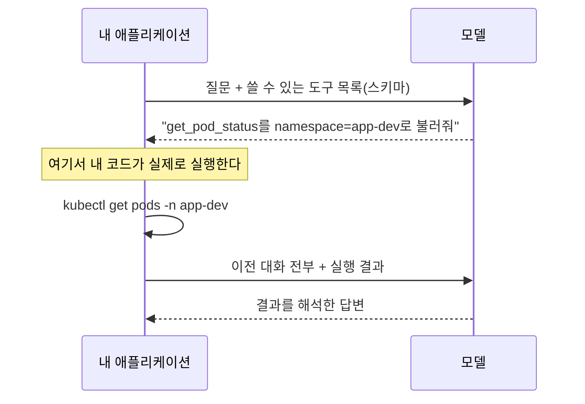
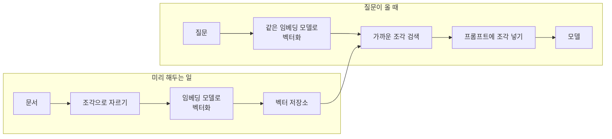
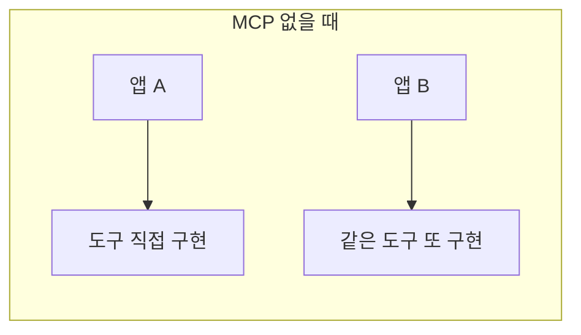
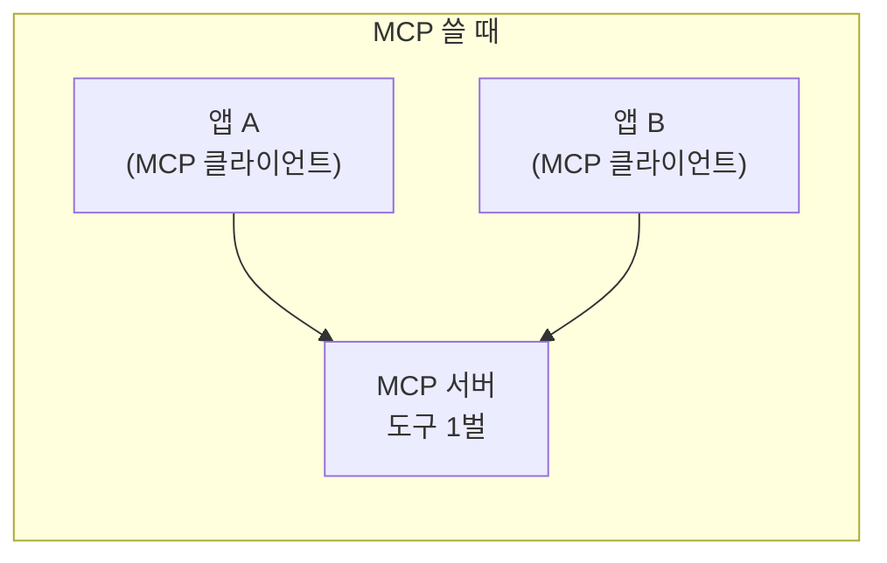
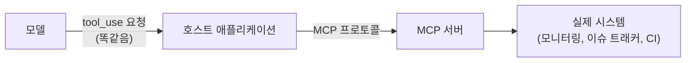
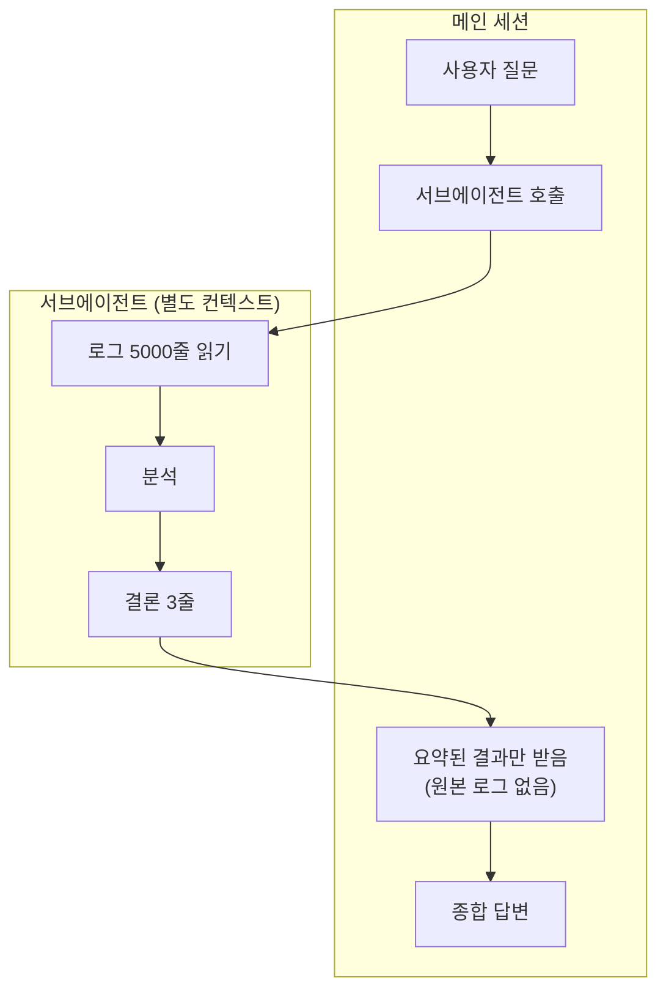
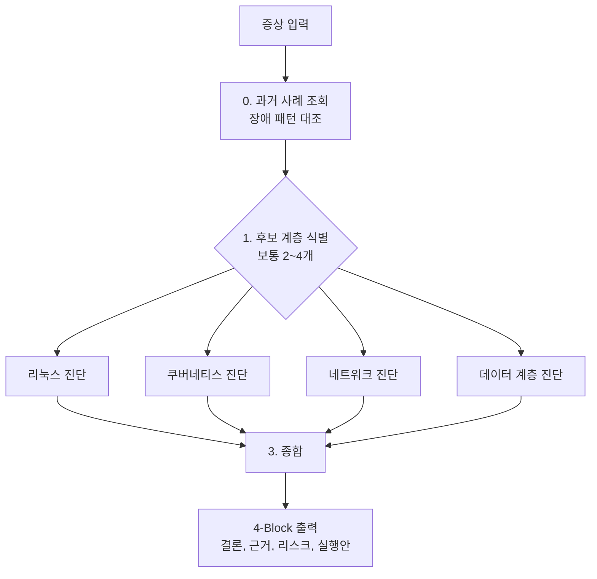
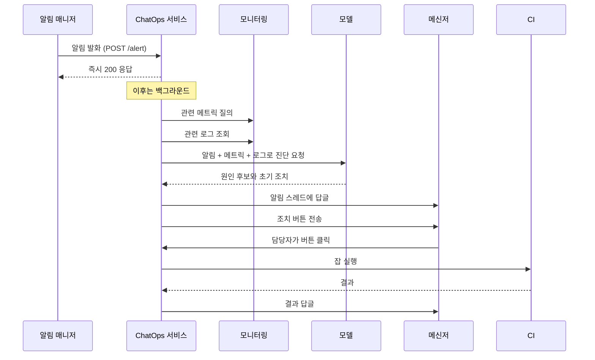
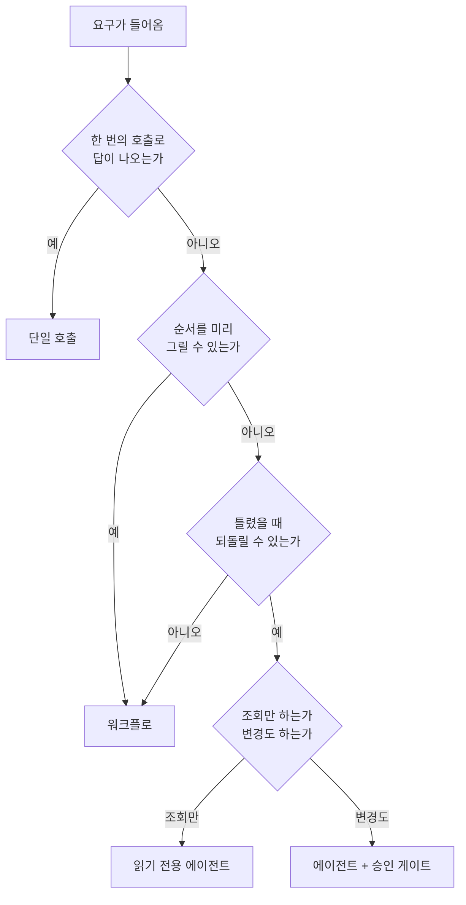

---

title: "인프라 운영에 AI 에이전트를 붙이면서 정한 것들"
date: 2026-08-03
categories: [AI, DevOps]
tags: [AI, Agent, LLM, MCP, ToolUse, RAG, Workflow, ChatOps, AIOps, Claude]
layout: post
toc: true
math: true
mermaid: true

---

## 참고자료

- [Anthropic - Tool use 개요](https://docs.claude.com/en/docs/agents-and-tools/tool-use/overview)
- [Anthropic - Building effective agents](https://www.anthropic.com/engineering/building-effective-agents)
- [Anthropic - Model Context Protocol 소개](https://docs.claude.com/en/docs/mcp)
- [Model Context Protocol 명세](https://modelcontextprotocol.io/specification)
- [Anthropic - Prompt caching](https://docs.claude.com/en/docs/build-with-claude/prompt-caching)
- [Anthropic - Agent Skills](https://docs.claude.com/en/docs/agents-and-tools/agent-skills)
- [Anthropic - Subagents](https://code.claude.com/docs/en/sub-agents)
- [OpenTelemetry - Semantic conventions for GenAI](https://opentelemetry.io/docs/specs/semconv/gen-ai/)
- [Gateway API 공식 문서](https://gateway-api.sigs.k8s.io/)
- [Model Context Protocol - Authorization](https://modelcontextprotocol.io/specification/draft/basic/authorization)
- [CNCF Sandbox Projects](https://www.cncf.io/sandbox-projects/)

---

## 배경

인프라 운영에 LLM을 붙이기 시작하면서, 용어가 먼저 걸림돌이었다. 도구 사용, RAG, 워크플로, 에이전트, MCP, 스킬, 서브에이전트가 다 나오는데 이것들이 서로 어떤 관계인지가 안 보였다.

- 도구 사용과 RAG는 무엇이 다른가? 둘 다 모델이 모르는 정보를 넣어주는 것 아닌가?
- 워크플로와 에이전트는 무엇이 다른가? 둘 다 여러 번 호출하는 것 아닌가?
- MCP는 도구 사용을 대체하는가?
- 스킬과 서브에이전트는 무엇이 다른가?
- 그리고 실제로 운영에 붙였을 때 무엇이 되고 무엇이 안 되는가?

개념부터 하나씩 쌓고, 실제로 팀에 배포한 것과 배포하지 못한 것을 뒤에 붙였다. 회사 구성을 예로 들되 내부 시스템 이름과 주소는 일반화했다.

---

## 1. 모델이 혼자 할 수 있는 것과 없는 것

### 1.1 LLM이 실제로 하는 일

**LLM(Large Language Model)** 은 다음에 올 텍스트를 확률적으로 예측하는 모델이다. 주어진 입력 뒤에 무엇이 오는 것이 가장 그럴듯한지를 계산해서 한 조각씩 내놓는다.

여기서 두 가지 성질이 따라 나온다.

**학습한 시점 이후의 일을 모른다.** 모델은 어느 시점까지의 데이터로 학습되고, 그 뒤로 세상이 바뀐 것을 모른다.

**아무것도 실행하지 않는다.** 텍스트를 만들 뿐이다. 파일을 읽지도, API를 부르지도, 명령을 실행하지도 않는다.

이 두 가지가 나머지 모든 개념의 출발점이다. 운영 업무에 쓰려면 **지금 이 순간의 상태**를 알아야 하고 **뭔가를 실행**해야 하는데, 모델은 둘 다 못 한다.

### 1.2 무상태다

또 하나 짚어둘 것이 있다. API 호출은 **무상태(stateless)** 다. 서버가 이전 대화를 기억하지 않는다.

그래서 대화가 이어지는 것처럼 보이는 것은 **매번 이전 대화를 전부 다시 보내기 때문**이다.

```text
1번째 요청: [사용자 질문 1]
2번째 요청: [사용자 질문 1] [모델 답변 1] [사용자 질문 2]
3번째 요청: [사용자 질문 1] [모델 답변 1] [사용자 질문 2] [모델 답변 2] [사용자 질문 3]
```

이 구조가 비용과 직결된다. 대화가 길어질수록 매 요청의 입력 토큰이 누적된다. 뒤에 나올 **프롬프트 캐싱**과 **서브에이전트**가 둘 다 이 문제에서 나온다.

---

## 2. 모르는 것을 알려주는 두 가지 방법

### 2.1 도구 사용

**도구 사용(tool use)** 은 모델에게 "이런 함수들을 쓸 수 있다"고 알려주고, 모델이 그 함수를 쓰겠다고 하면 **내가 대신 실행해서 결과를 돌려주는** 방식이다.

중요한 점은 **모델이 함수를 실행하지 않는다**는 것이다. 모델은 "이 함수를 이 인자로 불러 달라"고 요청할 뿐이고, 실행은 내 코드가 한다.



도구를 정의할 때 넘기는 것은 **이름, 설명, 입력 스키마**다.

```json
{
  "name": "query_metrics",
  "description": "지정한 PromQL 쿼리를 실행해 현재 메트릭 값을 반환한다. 과거 구간이 필요하면 query_metrics_range를 쓴다.",
  "input_schema": {
    "type": "object",
    "properties": {
      "query": { "type": "string", "description": "PromQL 표현식" },
      "env": { "type": "string", "enum": ["dev", "stg", "prod"] }
    },
    "required": ["query", "env"]
  }
}
```

**`description`이 실제로 제일 중요하다.** 모델은 이 설명만 보고 언제 이 도구를 쓸지 판단한다. 위 예에서 "과거 구간이 필요하면 다른 도구를 쓴다"고 적어둔 것이 그래서다. 이 문장이 없으면 모델이 현재값 도구로 과거를 물어보려 한다.

### 2.2 RAG

**RAG(Retrieval-Augmented Generation)** 는 질문과 관련된 문서 조각을 미리 찾아서 프롬프트에 넣어주는 방식이다.

왜 필요한가. 사내 문서가 수만 페이지인데 컨텍스트 창에 다 안 들어가기 때문이다. 그래서 **질문과 관련된 부분만 골라서** 넣는다.

고르는 방법이 보통 임베딩 기반이다. **임베딩(embedding)** 은 텍스트를 숫자 벡터로 바꾸는 것이고, 의미가 비슷한 텍스트는 벡터도 가깝게 나온다. 질문을 벡터로 바꾸고 문서 조각 중 가까운 것을 찾는다.



**임베딩 모델은 LLM이 아니다.** 텍스트를 벡터로 바꾸는 별도의 모델이다. 이걸 헷갈리면 "왜 임베딩 모델이 답을 안 해주지"라는 질문이 나온다.

### 2.3 그래서 둘은 무엇이 다른가

첫 질문의 답이다. 둘 다 모델이 모르는 정보를 넣어주지만, **누가 정보를 가져오기로 결정하는가**가 다르다.

| | RAG | 도구 사용 |
|---|---|---|
| 검색 시점 | 모델을 부르기 **전에** 내가 검색 | 모델이 필요하다고 판단한 **후에** 검색 |
| 결정 주체 | 내 코드 | 모델 |
| 적합한 대상 | 정적인 문서, 지식 | 실시간 상태, 외부 행동 |
| 호출 횟수 | 보통 1회 | 여러 번 돌 수 있음 |

**정적인 지식은 RAG, 실시간 상태와 행동은 도구 사용**이 기본 갈림이다.

운영 업무에서는 도구 사용 쪽이 훨씬 많이 쓰인다. "지금 Pod가 몇 개 떠 있는가"는 문서에 없고 지금 조회해야 하기 때문이다.

다만 둘을 섞기도 한다. 과거 장애 기록을 검색하는 것 자체를 **도구로 만들면** 모델이 필요할 때 스스로 검색한다. 이 경우 RAG의 검색이 도구 사용의 한 도구가 된다.

---

## 3. 여러 번 부르는 두 가지 방식

### 3.1 워크플로

**워크플로(workflow)** 는 **내가 단계를 미리 정해두는** 방식이다. 코드가 순서를 정한다.

```python
# 순서가 코드에 있다
분류 = 모델호출("이 알림이 어느 계층 문제인가?", 알림내용)
if 분류 == "kubernetes":
    상태 = kubectl_조회()
elif 분류 == "network":
    상태 = 네트워크_조회()
진단 = 모델호출("이 상태를 보고 원인을 진단해라", 상태)
```

### 3.2 에이전트

**에이전트(agent)** 는 **모델이 다음에 무엇을 할지 스스로 정하는** 방식이다.

```python
# 순서를 모델이 정한다
while True:
    응답 = 모델호출(대화기록, 도구목록)
    if 응답.멈춘이유 != "도구사용":
        break
    결과 = 도구실행(응답.도구요청)
    대화기록.추가(응답, 결과)
```

`while` 루프만 내가 쓰고, **무슨 도구를 몇 번 어떤 순서로 쓸지는 모델이 정한다.** 이것을 에이전틱 루프라고 부른다.

### 3.3 무엇을 고를 것인가

두 번째 질문의 답이다.

| | 워크플로 | 에이전트 |
|---|---|---|
| 경로를 정하는 것 | 코드 | 모델 |
| 예측 가능성 | 높다. 항상 같은 순서 | 낮다. 매번 다를 수 있다 |
| 비용 예측 | 쉽다 | 어렵다. 루프가 몇 번 돌지 모름 |
| 디버깅 | 쉽다 | 어렵다 |
| 적합한 경우 | 순서를 미리 그릴 수 있을 때 | 상황에 따라 조사 경로가 달라질 때 |

**기본값은 워크플로**로 잡았다. 순서를 그릴 수 있으면 그리는 편이 예측 가능하고 싸다.

에이전트를 쓸지 판단할 때 네 가지를 봤다.

**복잡도.** 미리 다 명세할 수 없는 일인가. "이 PDF에서 제목을 뽑아라"는 명세 가능하고, "이 장애의 원인을 찾아라"는 아니다.

**가치.** 결과가 높은 비용과 지연을 정당화하는가.

**실현 가능성.** 모델이 이 종류의 작업을 실제로 잘하는가.

**실패 비용.** 틀렸을 때 잡아내고 되돌릴 수 있는가.

넷 중 하나라도 "아니오"면 워크플로로 내려간다. 특히 **네 번째가 인프라 운영에서 결정적이다.** 코드는 테스트와 리뷰로 잡히지만 운영 클러스터 변경은 즉시 반영된다.

---

## 4. 도구를 표준화하는 것

### 4.1 문제

도구 사용은 애플리케이션마다 도구를 새로 짜야 한다. 같은 모니터링 시스템을 조회하는 도구를 A 애플리케이션에서 만들고, B에서 또 만든다.

### 4.2 MCP

**MCP(Model Context Protocol)** 는 이 중복을 없애기 위한 표준 인터페이스다. **도구를 제공하는 쪽(서버)과 쓰는 쪽(클라이언트)을 분리**한다.





MCP 서버가 제공하는 것이 세 가지다.

| 종류 | 무엇인가 | 누가 부르는가 |
|---|---|---|
| **도구(Tools)** | 실행할 수 있는 함수 | 모델이 판단해서 |
| **리소스(Resources)** | 읽을 수 있는 데이터 | 애플리케이션이 |
| **프롬프트(Prompts)** | 미리 만들어둔 프롬프트 템플릿 | 사용자가 선택해서 |

**MCP는 도구 사용을 대체하지 않는다.** 세 번째 질문의 답이다. 모델 입장에서는 여전히 도구 사용이다. MCP는 그 도구를 **어디서 어떻게 가져올 것인가**에 대한 규약이다.



### 4.3 전송 방식

MCP 서버와 클라이언트가 통신하는 방식이 두 가지다.

**stdio.** 서버를 자식 프로세스로 띄우고 표준 입출력으로 대화한다. 로컬에서 쓸 때 간단하다.

**Streamable HTTP.** HTTP로 통신한다. 서버를 원격에 두고 여러 클라이언트가 붙을 수 있다.

폐쇄망 환경에서 이 선택이 실제로 중요했다. 클러스터 안에 서버를 두고 원격으로 붙이려면 HTTP 방식이 필요하다.

---

## 5. 절차와 컨텍스트를 다루는 것

### 5.1 스킬

**스킬(Skill)** 은 자주 쓰는 작업 절차를 문서로 묶어두고 필요할 때 불러오는 것이다.

왜 필요한가. 같은 지침을 매번 프롬프트에 쓰기 싫고, 그렇다고 시스템 프롬프트에 전부 넣으면 관계없는 작업에도 그 지침이 컨텍스트를 차지한다.

스킬은 **이름과 설명만 먼저 로드하고, 실제로 필요할 때 본문을 읽는다.** 그래서 지침이 많아져도 평소 컨텍스트를 안 먹는다.

```markdown
---
name: incident-patterns
description: 사내 장애 패턴 P01~P12. 증상이 과거 사례와 맞는지 대조할 때 쓴다.
---

# 장애 패턴

## P03. 커넥션 풀 고갈
증상: 응답 시간 급증, 타임아웃 증가, DB 부하는 정상
확인: HikariCP 활성 커넥션 수와 대기 큐 길이
...
```

### 5.2 서브에이전트

**서브에이전트(subagent)** 는 별도의 컨텍스트에서 작업을 시키고 **결과 요약만 받아오는** 것이다.

왜 필요한가. 1.2절의 무상태 문제 때문이다. 로그 5000줄을 읽어서 원인을 찾는 작업을 메인 대화에서 하면, 그 5000줄이 이후 모든 요청에 계속 실려 간다.

서브에이전트에게 시키면 그 5000줄은 서브에이전트의 컨텍스트에만 있고, 메인에는 결론만 돌아온다.



### 5.3 둘은 무엇이 다른가

네 번째 질문의 답이다.

| | 스킬 | 서브에이전트 |
|---|---|---|
| 실행 위치 | 같은 대화 안 | 별도 컨텍스트 |
| 얻는 것 | 절차와 지침 | 격리된 작업 결과 |
| 중간 과정 | 대화에 남는다 | 대화에 안 남는다 |
| 쓰는 경우 | 매번 같은 절차를 따라야 할 때 | 중간 과정이 길고 결론만 필요할 때 |

**중간 과정이 필요한지가 갈림이다.** 리뷰 결과를 보고 다시 물어봐야 하면 스킬 쪽이고, 요약만 있으면 되면 서브에이전트다.

서브에이전트에는 비용이 붙는다는 점도 짚어둔다. **새 컨텍스트에서 시작하므로 지금까지의 대화를 모른다.** 필요한 배경을 프롬프트에 다시 넣어줘야 한다. 그래서 배경 설명이 결과 요약보다 길어질 것 같으면 서브에이전트를 안 쓰는 편이 낫다.

---

## 6. 실제로 만든 것

여기까지가 개념이고, 아래는 실제로 팀에 배포한 것들이다.

### 6.1 조회 도구를 MCP 서버 하나로 모으기

운영 조회 업무가 여러 시스템에 흩어져 있었다. 모니터링, 이슈 트래커, 위키, CI, 레지스트리, 코드 저장소.

이걸 **MCP 서버 하나**로 모았다. 도구가 쉰 개 남짓이고 영역별로 나뉜다.

| 영역 | 도구 예시 |
|---|---|
| 관측성 | 메트릭 질의(현재값, 구간), 로그 검색, 트레이스 조회, 알림 규칙 조회 |
| 이슈 관리 | 티켓 조회, 검색, 코멘트 |
| 문서 | 위키 페이지 조회와 검색 |
| CI | 잡 목록, 빌드 상태, 로그 |
| 코드 | PR 조회, diff, 코멘트 |
| 레지스트리 | 이미지 목록, 스캔 결과 |
| 정적 분석 | 매니페스트 렌더링 비교, 정책 재현, 차트 간 참조 정합 |

여기서 정한 규칙이 세 가지다.

**쓰기 도구에는 확인 게이트를 건다.** 조회는 바로 실행하고, 변경은 `confirm=true`가 명시적으로 들어와야 실행한다.

**시크릿 조회 도구는 값을 반환하지 않는다.** 존재 여부만 답한다. "이 키가 설정되어 있는가"는 알려주되 값은 안 준다.

**환경을 인자로 강제한다.** 환경마다 인스턴스가 분리되어 있으므로 도구가 환경을 추측하지 않게 했다. 인자를 안 주면 실패하도록.

### 6.2 역할별로 나눠 배포하기

도구만 있으면 "무엇을 언제 볼 것인가"는 여전히 사람 몫이다. 그래서 판단 기준을 역할별로 묶어 사내 마켓플레이스에 플러그인으로 올렸다.

| 역할 | 무엇을 담았는가 |
|---|---|
| devops | 빌드와 배포 자동화, 클러스터 구축. 나머지 넷의 기반이 되고 MCP 서버를 동봉 |
| sre | 계층별 진단 에이전트 8종, 장애 분류 커맨드, 장애 패턴 스킬 |
| devsecops | 정책 엔진 현황 분석, 보안 리뷰 체크리스트, 위험 명령 차단 훅 |
| finops | 자원 적정화 분석, 실측 기반 판정 게이트 |
| aiops | 워크플로 자동화 설계, MCP 서버 개발, AI 도구 표준 |

**역할로 나눈 이유**가 있다. 전부 한 덩어리로 만들면 리뷰 하나에 스무 개 관점이 붙어서 무엇이 중요한지 사라진다. 그리고 사람마다 필요한 역할이 다르다.

### 6.3 PR 리뷰 에이전트

가장 자주 쓰이는 것이 됐다. 인프라 코드 PR을 다섯 관점으로 리뷰하고 결과를 코멘트로 남긴다.

관점의 **순서를 고정한 것**이 핵심이었다.

```text
신뢰성 > 보안 > 관측성 > 비용 > 배포 편의 > 그 다음에야 가독성
```

이 순서가 없으면 리뷰가 변수명 얘기부터 시작한다. 순서를 박아두니 신뢰성 문제가 있을 때 그것이 항상 맨 위에 온다.

또 하나 넣은 것이 **"이 레포에서 실제로 반복되는 함정"** 목록이다. 범용 모범 사례보다 이걸 먼저 본다.

```markdown
- CPU limit은 전사 미설정이 의도적 설계다. CFS throttle 회피가 근거이고
  주석에 명시되어 있다. PR이 CPU limit을 추가하려 하면 이유를 먼저 묻는다.
  memory limit 누락은 그대로 차단 사유다.
- 특정 프론트엔드 차트는 probe가 values 대신 템플릿에 하드코딩되어 있어
  환경별 조정이 안 된다. 신규 차트가 이 패턴을 복사했는지 확인한다.
- 정책 엔진 강제 모드에서 기존 Pod는 통과하지만 롤아웃 시 새 Pod가 막힌다.
  Pod 스펙을 건드리는 PR은 이 영향을 평가한다.
```

**항목마다 "실측"이라고 라벨을 붙이고 확인 날짜를 적었다.** 그리고 90일이 지나면 재감사 대상이 되도록 했다. 이걸 안 하면 몇 달 뒤 사실과 다른 지침이 그대로 남는다.

### 6.4 계층별 진단과 병렬 조사

장애가 어느 계층인지 모호할 때가 많다. 504가 나는데 네트워크인지 애플리케이션인지 노드인지 알 수 없는 상황이다.

계층마다 진단 에이전트를 따로 만들고, **후보 계층에 동시에 투입**하는 커맨드를 만들었다.



여기서 정한 규칙들이다.

**과거 사례를 먼저 조회한다.** 같은 증상이 전에 있었으면 그것부터 본다. 없으면 "과거 사례 없음"이라고 명시한다. **지어내지 않는다.**

**빈 입력으로 여러 에이전트를 돌리지 않는다.** 붙여넣은 출력이 없으면 전부 "이 명령부터 실행하세요"만 돌아온다. 그럴 바에는 수집 명령을 먼저 요청한다.

**단일 우승자만 남기지 않는다.** 연쇄 장애는 계층 간 상관이 결론이다. 스왑이 GC를 유발하고 GC가 504를 만든 경우, 하나만 고르면 원인을 놓친다.

**기각한 가설도 근거와 함께 보고하게 한다.** 그리고 A가 기각한 원인을 B가 채택했으면 그 지점을 파고든다. 이게 실제로 원인을 좁히는 데 도움이 됐다.

**확신도를 병기한다.** 직접 출력으로 확인한 것, 정황으로 추정한 것, 가설인 것을 구분한다.

**전부 읽기 전용이다.** 변경은 실행하지 않고 확인할 명령만 만든다.

### 6.5 알림을 양방향으로 만들기

알림이 오면 사람이 대시보드를 열고 로그를 뒤지고 명령을 실행했다. 이 흐름을 자동화하는 서비스를 만들었다.

세 단계로 나눴다.

| 단계 | 무엇을 하는가 | 승인 |
|---|---|---|
| L1 | 알림 수신 즉시 메트릭과 로그를 조회해 원인 후보를 스레드에 답글 | 없음 (조회만) |
| L2 | 조치 버튼을 제안하고, 담당자가 누르면 CI 잡 실행 | 사람이 버튼 클릭 |
| L3 | 대응이 확립된 알림은 버튼 없이 자동 실행 | 없음 |



**즉시 200을 돌려주는 것**이 설계상 중요했다. 알림 매니저는 응답이 늦으면 재전송한다. 진단이 몇 초 걸리므로 먼저 받았다고 답하고 나머지는 백그라운드로 돌린다.

**L3의 자동 실행 조건을 세 겹으로 걸었다.** 알림 종류 분류, 자동 실행 허용 목록, 그리고 대상 네임스페이스 검증이다. 셋 다 독립적으로 확인한다. 하나가 뚫려도 나머지가 막도록.

그리고 **운영 환경은 L1만 허용**했다. 자동 조치는 개발 환경에서만 돈다.

### 6.6 외부로 나가는 데이터를 거르기

여기가 가장 신경 쓴 부분이다. 메트릭과 로그에는 내부 IP, 내부 도메인, 우연히 찍힌 토큰이 들어 있을 수 있다. 이걸 그대로 외부 API로 보내면 안 된다.

두 단계로 걸렀다.

**마스킹.** 내부 IP 대역, 내부 도메인, JWT 형태, 토큰 형태 등 아홉 가지 패턴을 자리표시자로 치환한다.

```text
10.0.1.5              -> <IP>
service.internal.corp -> <INTERNAL_DOMAIN>
eyJhbGciOiJIUzI1...   -> <JWT>
```

**송신 차단 게이트.** 마스킹 후에도 평문 시크릿이나 운영 환경 식별자가 남아 있으면 **API 호출 자체를 막는다.** 그리고 감사 로그에 기록한다.

두 번째가 요점이다. 마스킹은 정규식이라 놓칠 수 있다. 그래서 **마스킹 실패 시 전송을 포기하는 쪽**을 기본 동작으로 만들었다. 진단을 못 하는 것이 데이터가 나가는 것보다 낫다.

### 6.7 폐쇄망에서 클러스터를 조회하게 하기

팀원들이 Pod 상태 하나를 보려고 원격 작업 환경에 접속해야 했다. 로컬에서 클러스터에 닿지 않기 때문이다.

제약을 세 가지로 나눠 각각 풀었다.

**조회 경로.** MCP 서버를 클러스터 안에 파드로 띄우고 게이트웨이로 노출했다. 사내망에서 로컬 접근이 되도록.

여기서 사고가 하나 있었다. 새 DNS 신청을 피하려고 기존 API 경로에 라우트를 붙였는데, **호스트명을 명시했더니 전용 가상 호스트가 생기면서 기존 프론트엔드 라우트가 전부 404가 났다.** 되돌리고 경로 기반 매칭으로 다시 붙였다.

**권한 경계.** 읽기 전용 ServiceAccount만 쓰고, 외부 자격증명은 배치하지 않았다. 네트워크 정책을 기본 차단으로 두고 DNS와 API 서버로만 열었다. 게이트웨이에서 팀원별 키 인증을 걸었다.

**배포 경로.** 외부 패키지 저장소가 막혀 있어서 서버 소스를 플러그인에 동봉했다. 첫 세션에서 가상 환경이 자동으로 구성되도록.

그리고 **클러스터 안 파드는 조회 도구 네 개만 노출**하고 나머지는 로컬 프로파일이 담당하게 나눴다. 클러스터 안에 있는 것이 장악되어도 할 수 있는 일을 좁히기 위해서다.

---

## 7. 무엇이 잘 됐고 무엇이 안 됐는가

### 7.1 잘 된 것

**판단 기준이 단일화됐다.** 리뷰 품질이 검토자에 따라 달라지던 편차가 줄었다. 사람이 바뀌어도 같은 순서로 같은 것을 본다.

**표준이 기억이 아니라 도구 출력에 의존하게 됐다.** 차트를 자동 생성하는 도구를 만들면서, 신규 서비스를 배포 가능한 상태로 만드는 시간이 30분에서 5분 정도로 줄었다. 더 중요한 것은 쿠버네티스를 안 다뤄본 개발자도 probe, PDB, 종료 처리, 보안 컨텍스트가 들어간 설정을 직접 쓰게 됐다는 점이다.

**병목이 사라졌다.** 모든 신규 배포가 인프라 담당자를 거치던 구조에서, 도구가 표준을 적용하고 담당자는 예외만 보는 구조로 바뀌었다.

### 7.2 안 된 것과 배운 것

**배포하지 못한 것이 있다.** 알림 자동 게시 서비스는 테스트를 전부 통과했지만 실운영 배포가 보류됐다. 배포용 컨테이너 정의가 빠져 있었고, 외부 API로 나가는 방화벽 승인이 늦어졌다.

여기서 배운 것이 있다. **만드는 데 하루가 걸린 것이 배포에는 몇 주가 걸린다.** 폐쇄망 환경에서는 승인 경로를 먼저 확인하고 시작해야 한다.

**측정하지 못한 것이 있다.** 리뷰 시간이 얼마나 줄었는지를 재지 않았다. 설문을 돌리지 않았으므로 "줄었을 것"이라고 말할 수는 있어도 수치로는 못 댄다. 이건 미확정으로 남겨두었다.

**도구가 쌓이기만 하는 것을 막아야 했다.** 스킬과 도구를 계속 추가하다 보니 아무도 안 쓰는 것이 생겼다. 그래서 사용 로그를 텔레메트리 이벤트로 수집해서, 안 쓰이는 것을 확인하고 정리했다. 미사용 스킬 다섯 개를 지웠고 세 개를 팀 공용으로 승격했다.

**이것이 제일 중요한 배움이었다.** 도구를 만드는 것보다 **안 쓰이는 도구를 지우는 절차**가 없으면 결국 아무도 전체를 파악하지 못하게 된다.

---

## 8. 비용과 컨텍스트

### 8.1 프롬프트 캐싱

1.2절에서 본 무상태 구조 때문에 매 요청마다 같은 앞부분을 다시 보낸다. 시스템 프롬프트, 도구 정의, 큰 참조 문서가 매번 실린다.

**프롬프트 캐싱**은 이 앞부분을 캐시해서 반복 호출의 비용과 지연을 줄인다.

동작 원리 때문에 따라오는 제약이 있다. **접두사 일치 방식이라 앞부분의 바이트가 하나라도 바뀌면 그 뒤 전체가 무효화된다.**

그래서 배치 순서가 중요해진다.

```text
[안정적인 것을 앞에]
  시스템 프롬프트 (고정)
  도구 정의 (정렬해서 순서 고정)
  참조 문서
  ---- 캐시 경계 ----
[변하는 것을 뒤에]
  현재 시각
  이번 요청의 질문
```

시스템 프롬프트에 현재 시각을 넣으면 매 요청마다 캐시가 깨진다. 도구 목록의 순서가 매번 달라져도 마찬가지다.

캐시가 실제로 걸리고 있는지는 응답의 사용량 정보에서 캐시 읽기 토큰 수를 보면 된다. 반복 호출에서 계속 0이면 뭔가가 조용히 무효화하고 있는 것이다.

### 8.2 사용량을 관측하기

AI 도구를 팀이 쓰기 시작하면서 토큰과 비용이 개인별로 흩어져 규모를 알 수 없었다.

**기존 관측성 스택으로 수집**했다. 도구가 내보내는 텔레메트리 이벤트를 이미 있는 수집기로 받아서 대시보드를 만들었다. 인프라를 늘리지 않고 붙였다.

여기서 사고가 하나 있었다. **지표가 최대 115배 부풀려 표시되고 있었다.** 집계 방식을 잘못 잡아서 같은 값이 중복으로 더해졌다. 이대로 두면 비용 판단이 통째로 틀어진다.

배운 것은 **관측 지표 자체를 검증해야 한다**는 것이다. 대시보드에 숫자가 나온다는 것과 그 숫자가 맞다는 것은 다른 사실이다. 처음 며칠은 원본 로그와 대조해서 맞춰봐야 한다.

---

## 9. 판단 기준으로 정리하면

새 요구가 들어왔을 때 어디까지 갈 것인지를 이 순서로 판단한다.



그리고 무엇을 만들든 함께 정하는 것 네 가지다.

**권한 범위.** 읽기 전용인가, 쓰기가 있는가. 쓰기가 있으면 어디까지인가.

**승인 지점.** 사람이 어디서 확인하는가. 자동 실행이 있다면 그 조건이 무엇인가.

**나가는 데이터.** 외부로 무엇이 나가는가. 마스킹은 어디서 하는가. 마스킹이 실패하면 어떻게 되는가.

**정리 절차.** 안 쓰이면 어떻게 알아채고 어떻게 지우는가.

네 번째를 처음부터 정하지 않으면 반드시 쌓인다.

---

## 10. 에이전트를 위한 인프라: LLM/MCP 게이트웨이 고르기

여기까지는 에이전트를 운영에 붙이는 이야기였다. 그런데 팀 전체가 에이전트를 쓰기 시작하면 질문이 하나 더 생긴다. **LLM 호출과 MCP 트래픽을 누가 어떻게 중계하는가.** 개발자마다 API 키를 직접 관리하고 각자 방식대로 MCP 서버를 붙이면, 인증도 요금 제한도 관측도 전부 따로 논다.

이 문제를 풀려고 기존 서비스 클러스터와 노드풀, 네임스페이스, 게이트웨이를 분리한 별도 플랫폼을 만들었다. 분리한 이유는 단순하다. 한쪽에서 일어난 변경이 다른 쪽의 배포 갱신 주기나 캐시를 건드리지 않아야 하고, 나중에 권한과 소유가 갈릴 때 그 경계가 그대로 신뢰 경계가 되어야 하기 때문이다. 리소스 배치 자체는 한 클러스터 안에서도 격리할 수 있지만, 두 시스템의 배포 규약과 릴리스 흐름을 물리적으로 나눠 두는 편이 유지보수가 단순했다.

### LLM/MCP 게이트웨이를 실측으로 골랐다

이 플랫폼의 진입점 역할을 할 게이트웨이를 고르는 데 두 개의 [CNCF Sandbox](https://www.cncf.io/sandbox-projects/) 프로젝트를 후보로 놓고 직접 비교했다. 공식 문서와 소스를 전수 조사한 것에 더해, 로컬 kind 클러스터에 같은 조건으로 둘 다 설치해서 성능, 리소스, 기능을 실측했다.

**결론부터.** 순수 프록시 오버헤드는 반복 측정 편차(±5ms) 안에 묻혀서 성능이 선택 기준이 되지 못했다. LLM 호출 한 번이 수백 ms인 환경에서 프록시가 더하는 1~3ms는 무의미하다. 갈리는 지점은 기능 구조와 운영성이었다.

- 한쪽(Higress)은 helm 설치 한 번으로 AI 기능이 완결되고, AI 전용 플러그인 폭(17종 이상)과 지원 LLM 프로바이더 수가 가장 넓다. 시맨틱 캐시, RAG, 검색 주입까지 게이트웨이 안에서 끝난다. 대신 플러그인을 원격 OCI 레지스트리에서 받아오는 구조라, **레지스트리 접근이 막히면 에러 없이 플러그인만 빠진 채 트래픽이 그대로 통과했다(failopen).** 사내 TLS 인터셉션 환경에서 실제로 이 상황을 겪었는데, 플러그인이 죽은 걸 알아채려면 프록시 설정 덤프를 직접 열어봐야 했다.
- 다른 한쪽(kgateway)은 AI/MCP 기능이 별도 컨트롤플레인(agentgateway, Rust 데이터플레인)으로 분리돼 있다. 토큰 rate limit이 외부 의존(Redis 등) 없이 동작하고, MCP를 프록시가 아니라 네이티브로 다룬다. 여러 MCP 서버를 하나의 엔드포인트로 묶고(멀티플렉싱), 도구(tool) 단위로 접근 제어를 걸고, 세션을 유지한다. 대신 설치할 부품이 더 많고, 설치 과정에서 Gateway API의 experimental CRD가 기존 검증 정책과 충돌하는 걸 직접 지워야 했다. 프록시 메모리 사용량은 25~35Mi로, 다른 쪽(165Mi)의 5분의 1 수준이었다.

**최종적으로 두 번째(kgateway + agentgateway)를 골랐다.** 이유는 세 가지였다. 도입 목적의 한 축이 여러 MCP 서버를 통합 관리하는 것인데 이걸 네이티브로 지원하는 쪽이 이쪽뿐이었고, 이미 쓰고 있는 게이트웨이가 같은 Gateway API 계열이라 운영 지식이 그대로 이어졌고, 조용히 무방비 상태가 되는 failopen 위험이 없었다. 다만 두 프로젝트 다 아직 Sandbox 단계이고 AI 관련 API가 초기 버전이라, 이 판단은 개발 환경 검증 범주로 못 박아뒀다. 운영 도입은 API가 안정화된 뒤 다시 본다.

여기서 얻은 원칙은 벤치마크 자체보다 방법론에 가깝다. **"둘 다 빠르다"는 결론이 나오면 그다음 질문은 성능이 아니라 "무엇이 조용히 실패하는가"와 "실패했을 때 얼마나 빨리 알아챌 수 있는가"여야 한다.** 실제로 이번 비교에서 의사결정을 가른 것도 지연시간이 아니라 failopen이라는, 벤치마크 숫자에는 안 잡히는 실패 모드였다.

---

## 정리하며

처음 던진 질문들에 대한 답이다.

**도구 사용과 RAG는 무엇이 다른가.** 누가 정보를 가져오기로 결정하는지가 다르다. RAG는 모델을 부르기 전에 내 코드가 검색하고, 도구 사용은 모델이 필요하다고 판단한 뒤에 검색한다. 정적인 지식은 RAG, 실시간 상태와 행동은 도구 사용이다.

**워크플로와 에이전트는 무엇이 다른가.** 경로를 코드가 정하면 워크플로, 모델이 정하면 에이전트다. 기본값은 워크플로로 두고, 미리 명세할 수 없으면서 틀렸을 때 되돌릴 수 있는 일에만 에이전트를 쓴다.

**MCP는 도구 사용을 대체하는가.** 아니다. 모델 입장에서는 여전히 도구 사용이고, MCP는 그 도구를 어디서 어떻게 가져올지에 대한 규약이다.

**스킬과 서브에이전트는 무엇이 다른가.** 스킬은 같은 대화 안에서 절차를 불러오고, 서브에이전트는 별도 컨텍스트에서 일하고 요약만 돌려준다. 중간 과정이 필요하면 스킬, 결론만 필요하면 서브에이전트다.

**실제로 붙였을 때 무엇이 되고 무엇이 안 되는가.** 조회와 진단, 리뷰는 잘 됐다. 판단 기준이 단일화되고 병목이 줄었다. 반면 자동 조치는 승인 경로와 배포 절차 때문에 만드는 것보다 올리는 것이 훨씬 오래 걸렸다. 그리고 측정을 안 해두면 "좋아졌다"를 수치로 말할 수 없다.

돌아보면 기술적으로 어려운 부분은 많지 않았다. **어려운 것은 권한을 어디까지 줄 것인가, 무엇이 밖으로 나가게 할 것인가, 그리고 만든 것을 어떻게 정리할 것인가**였다. 이 셋은 모델 성능과 무관하게 사람이 정해야 하는 부분이다.
