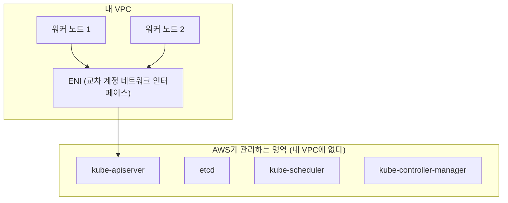
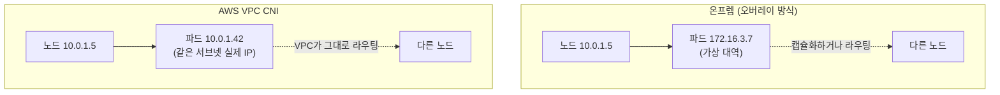
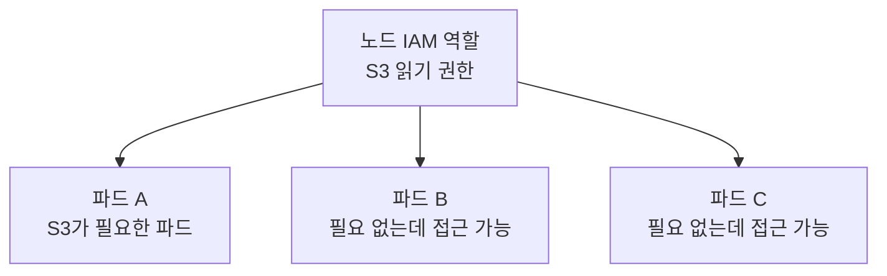
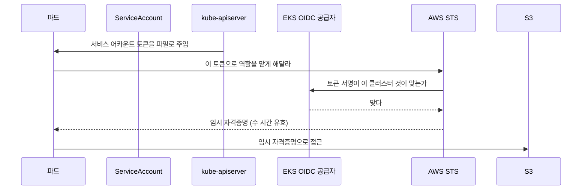

---

title: "온프렘 쿠버네티스를 EKS로 옮기면 무엇이 달라지는가"
date: 2026-08-17
categories: [AWS, Kubernetes]
tags: [AWS, EKS, IRSA, VPC, CNI, EKSCTL, Terraform]
layout: post
toc: true
math: true
mermaid: true

---

## 참고자료

- [Amazon EKS - What is Amazon EKS?](https://docs.aws.amazon.com/eks/latest/userguide/what-is-eks.html)
- [Amazon EKS - Managed node groups](https://docs.aws.amazon.com/eks/latest/userguide/managed-node-groups.html)
- [Amazon EKS - IAM roles for service accounts](https://docs.aws.amazon.com/eks/latest/userguide/iam-roles-for-service-accounts.html)
- [Amazon EKS - EKS Pod Identity](https://docs.aws.amazon.com/eks/latest/userguide/pod-identities.html)
- [Amazon EKS - Custom networking for pods](https://docs.aws.amazon.com/eks/latest/userguide/cni-custom-network.html)
- [Amazon VPC - NAT gateways](https://docs.aws.amazon.com/vpc/latest/userguide/vpc-nat-gateway.html)
- [CloudWatch - Container Insights](https://docs.aws.amazon.com/AmazonCloudWatch/latest/monitoring/ContainerInsights.html)
- [AWS Load Balancer Controller](https://kubernetes-sigs.github.io/aws-load-balancer-controller/latest/)
- [Amazon EKS 요금](https://aws.amazon.com/ko/eks/pricing/)
- [eksctl](https://eksctl.io/)

---

## 배경

지금 하는 일은 폐쇄망 온프렘이다. `kubeadm`으로 클러스터를 직접 세우고, CNI를 고르고, 인증서를 갱신하고, 로드밸런서 앞단은 물리 장비가 받는다.

**AWS를 실무로 써본 적이 없다.** 자격증 공부를 하면서 이론은 읽는데, 읽을수록 "그래서 지금 내가 손으로 하고 있는 이 일이 저쪽에서는 어디로 가는가"가 궁금해졌다.

그래서 **온프렘 스택의 축소판을 EKS로 한 번 올려봤다.** 실습용이라 세션마다 만들고 지우는 방식이었고, 규모도 노드 두 대짜리다. 운영 경험이라고 부를 수 있는 것은 아니다.

다만 **직접 만들고 지워보면서 알게 된 차이**는 문서만 읽어서는 안 보이던 것들이었다. 그것을 정리한다.

정리하면서 확인하고 싶었던 것들이다.

- 관리형 컨트롤 플레인이란 정확히 무엇을 안 해도 된다는 뜻인가?
- 온프렘에서 CNI가 하던 일을 AWS에서는 무엇이 하는가?
- Pod 하나에 권한을 주는 방식이 왜 온프렘과 다른가?
- 옮기면 편해지는 것과 오히려 어려워지는 것은 각각 무엇인가?

---

## 1. 무엇을 어디로 옮기는가

먼저 대응 관계를 정리했다.

| 온프렘에서 하던 것 | AWS에서 대응하는 것 |
|---|---|
| `kubeadm` HA 클러스터, etcd 직접 운영 | EKS 관리형 컨트롤 플레인 |
| CNI 직접 설치, 파드 대역 설계 | VPC CNI (또는 다른 CNI 선택) |
| 물리 L4 장비 라우팅 | ALB, NLB |
| 사설 레지스트리 | ECR |
| 시크릿 관리 도구 | Secrets Manager, Parameter Store |
| Prometheus, Loki, Grafana 직접 운영 | CloudWatch Container Insights (또는 그대로 유지) |
| 노드 증설을 사람이 준비 | 관리형 노드 그룹, Karpenter |

**대응이 1대 1로 딱 떨어지지 않는 항목이 많다.** 그 어긋나는 지점이 실제로 재미있는 부분이었다.

---

## 2. 관리형 컨트롤 플레인

첫 질문이다.

### 2.1 온프렘에서 컨트롤 플레인에 드는 일

직접 세워보면 컨트롤 플레인 유지에 들어가는 일이 계속 나온다.

**etcd를 돌본다.** 홀수 대로 구성하고, 백업 주기를 정하고, 디스크가 느려지면 클러스터 전체가 느려지므로 I/O를 본다. 데이터가 커지면 압축과 조각 모음도 해야 한다.

**인증서를 갱신한다.** `kubeadm`이 만든 인증서는 1년짜리다. 만료 전에 갱신하지 않으면 API 서버에 접근이 안 된다.

**업그레이드를 손으로 한다.** 컨트롤 플레인 노드를 하나씩 올리고, 그 사이 버전 차이를 견디는지 확인한다.

**API 서버 앞단을 준비한다.** 컨트롤 플레인이 여러 대면 그 앞에 로드밸런서가 있어야 한다.

### 2.2 EKS에서는

**위 항목이 전부 사라진다.** etcd도 API 서버도 스케줄러도 컨트롤러 매니저도 AWS 계정 안에 보이지 않는다.



**대신 볼 수도 없다.** 이게 온프렘과 가장 크게 다른 점이었다.

컨트롤 플레인 로그를 보려면 CloudWatch로 내보내도록 켜야 한다.

```yaml
cloudWatch:
  clusterLogging:
    enableTypes: ["api", "audit", "authenticator", "controllerManager", "scheduler"]
```

**기본값이 꺼져 있다.** 감사 로그가 필요하면 반드시 켜야 하고, 로그양이 많으므로 비용도 함께 본다.

그리고 **API 서버 설정을 마음대로 못 바꾼다.** 온프렘에서는 `--enable-admission-plugins`에 원하는 것을 넣거나 `--audit-policy-file`을 직접 쓸 수 있는데, EKS에서는 AWS가 정한 범위 안에서만 조정된다.

### 2.3 그래서 무엇을 안 해도 되는가

**"쿠버네티스가 안 뜨는 문제"를 안 겪는다.** 온프렘에서 장애를 겪으면 원인이 애플리케이션인지 컨트롤 플레인인지부터 갈라야 하는데, 그 절반이 사라진다.

**대신 값을 낸다.** 컨트롤 플레인만으로 시간당 요금이 붙는다. 워커 노드가 없어도 클러스터가 존재하는 동안 계속 나간다.

실습하면서 이걸 몸으로 배웠다. **클러스터를 띄워두고 잊으면 아무것도 안 하는데 요금이 쌓인다.** 그래서 세션마다 만들고 지우는 방식으로 갔다.

```makefile
up:
	eksctl create cluster -f cluster.yaml

down:
	eksctl delete cluster -f cluster.yaml
```

---

## 3. 네트워킹, 여기가 가장 많이 달랐다

두 번째 질문이다.

### 3.1 온프렘에서 CNI가 하던 일

파드에 IP를 주고, 노드를 넘어가는 통신을 이어주는 것이 CNI의 일이다.

온프렘에서는 **파드 대역을 노드 대역과 완전히 분리해서 설계한다.** 파드 IP는 클러스터 안에서만 의미가 있고, 밖으로 나갈 때는 노드 IP로 바뀐다.

그래서 파드를 몇 개 띄우든 **물리 네트워크는 그 사실을 모른다.** 노드 대역만 알면 된다.

### 3.2 VPC CNI는 다르게 동작한다

AWS의 기본 CNI는 **파드에 VPC 서브넷의 실제 IP를 준다.**



**얻는 것이 있다.** 캡슐화가 없으니 오버헤드가 없고, 보안 그룹과 VPC 흐름 로그가 파드 단위로 그대로 적용된다. 온프렘에서 파드 트래픽을 물리 장비에서 보려면 따로 손을 대야 하는데 그 문제가 없다.

**대신 IP를 훨씬 많이 쓴다.** 파드마다 서브넷 IP를 하나씩 먹는다.

이게 실제 제약이 된다. `/24` 서브넷이면 IP가 251개인데, **파드 200개를 띄우면 서브넷이 찬다.** 노드를 더 넣고 싶어도 IP가 없어서 못 넣는다.

온프렘에서는 겪을 일이 없던 문제다. 파드 대역을 넉넉하게 잡아두면 그만이었다.

### 3.3 노드 종류가 파드 개수를 제한한다

여기서 더 놀랐던 부분이다. **인스턴스 종류에 따라 띄울 수 있는 파드 수가 정해진다.**

VPC CNI는 노드에 ENI(네트워크 인터페이스)를 붙이고 거기에 보조 IP를 할당하는 방식으로 파드 IP를 나눠준다. 그런데 **인스턴스 종류마다 붙일 수 있는 ENI 수와 ENI당 IP 수가 다르다.**

작은 인스턴스는 파드를 몇 개 못 띄운다. **CPU와 메모리가 남아도 IP가 없어서 스케줄이 안 된다.**

온프렘에서 노드 사양을 고를 때는 CPU와 메모리만 봤는데, **여기서는 IP도 함께 봐야 한다.** 문서만 읽을 때는 그냥 표였는데 직접 부딪히니 성격이 다르게 보였다.

우회하는 방법들이 있다.

**접두사 위임(prefix delegation)** 을 켜면 ENI 하나에 IP를 하나씩이 아니라 `/28` 블록 단위로 할당해서 파드 밀도를 크게 올린다.

**사용자 지정 네트워킹**을 쓰면 파드를 노드와 다른 서브넷에 배치할 수 있다. 노드 서브넷의 IP 고갈을 피하는 방법이다.

**다른 CNI로 바꿀 수도 있다.** Cilium이나 Calico를 오버레이 모드로 쓰면 온프렘과 같은 방식이 된다. 대신 VPC CNI의 장점인 파드 단위 보안 그룹과 흐름 로그를 잃는다.

### 3.4 NAT 게이트웨이

실습에서 가장 자주 실수한 부분이다.

**프라이빗 서브넷의 노드가 밖으로 나가려면 NAT 게이트웨이가 필요하다.** 컨테이너 이미지를 받아오거나 외부 API를 부를 때 이 경로를 쓴다.

온프렘에서는 프록시 서버를 하나 두면 끝나는 일인데, **NAT 게이트웨이는 시간당 요금과 데이터 처리 요금이 둘 다 붙는다.**

고가용성을 위해 가용 영역마다 하나씩 두는 것이 기본 구성인데, **실습에서는 그러면 요금이 세 배가 된다.** 그래서 하나만 뒀다.

```yaml
vpc:
  nat:
    gateway: Single
```

**클러스터를 지웠는데 NAT 게이트웨이가 남아 있는 경우**가 실제로 있었다. 아무것도 안 하는데 요금이 계속 나가고 있었다. 삭제 후에 남은 자원을 확인하는 습관이 필요했다.

**여기서 온프렘과의 차이가 분명해진다.** 온프렘에서는 자원을 잘못 남겨도 전기값 정도다. 클라우드에서는 지우는 것까지가 작업이다.

---

## 4. Pod에 권한을 주는 방식

세 번째 질문이다. **여기가 가장 배울 것이 많았다.**

### 4.1 문제

파드가 S3에서 파일을 읽어야 한다. 어떻게 권한을 주는가.

가장 쉬운 방법은 **액세스 키를 시크릿에 넣는 것**이다. 온프렘에서 외부 시스템 자격증명을 다루던 방식과 같다.

```yaml
env:
  - name: AWS_ACCESS_KEY_ID
    valueFrom:
      secretKeyRef: { name: aws-creds, key: access-key }
```

**하지만 이건 하면 안 되는 방식이다.** 키가 만료되지 않고, 유출되면 그대로 쓰이고, 회전하려면 사람이 해야 한다.

### 4.2 노드 역할에 붙이는 방법과 그 문제

두 번째 방법은 **노드의 IAM 역할에 권한을 주는 것**이다. 노드에 붙은 역할은 그 위의 파드가 전부 쓸 수 있다.

키를 관리할 필요가 없어진다. 그런데 **그 노드의 모든 파드가 같은 권한을 갖는다.**



**최소 권한 원칙이 무너진다.** 파드 하나가 뚫리면 그 노드에 주어진 권한 전부가 넘어간다.

### 4.3 IRSA

세 번째 방법이 IRSA(IAM Roles for Service Accounts)다. **쿠버네티스의 서비스 어카운트에 IAM 역할을 연결한다.**

동작 방식이 흥미로웠다.



**핵심은 EKS 클러스터가 OIDC 공급자로 등록된다는 것**이다. 그러면 AWS가 그 클러스터가 발급한 토큰을 신뢰할 수 있게 된다.

파드는 자기 서비스 어카운트 토큰을 STS에 내밀고, **STS가 그걸 임시 자격증명으로 바꿔준다.** 이 자격증명은 몇 시간 뒤 만료되고 SDK가 알아서 갱신한다.

`eksctl`에서는 한 줄이면 켜진다.

```yaml
iam:
  withOIDC: true
```

**얻는 것이 명확하다.**

| | 액세스 키 | 노드 역할 | IRSA |
|---|---|---|---|
| 자격증명 저장 | 시크릿에 평문 | 없음 | 없음 |
| 만료 | 없음 | 자동 | 자동 |
| 권한 단위 | 키마다 | 노드마다 | 서비스 어카운트마다 |
| 회전 | 사람이 | 자동 | 자동 |

**서비스 어카운트 단위라는 것이 결정적이다.** 파드마다 필요한 만큼만 준다.

### 4.4 온프렘과 비교하면

온프렘에서 같은 문제를 풀려면 **시크릿 관리 도구를 따로 두고, 파드가 그것을 읽어오고, 회전은 그 도구가 맡는 구조**를 만들어야 한다. 도구 하나가 더 붙는다.

IRSA는 **그 역할을 클러스터와 클라우드의 신뢰 관계로 대체한다.** 저장할 것이 애초에 없어진다.

이게 클라우드 쪽에서 배운 것 중 가장 인상적이었다. **"비밀을 잘 보관하는 방법"이 아니라 "비밀을 만들지 않는 방법"** 이었다.

### 4.5 EKS Pod Identity

IRSA에도 불편한 점이 있다. **클러스터마다 OIDC 공급자를 등록하고, 역할의 신뢰 정책에 그 공급자와 서비스 어카운트를 하나씩 적어야 한다.** 클러스터가 늘어나면 이 설정이 늘어난다.

이걸 줄이려고 나중에 나온 것이 EKS Pod Identity다. **OIDC 설정 없이 클러스터, 네임스페이스, 서비스 어카운트, 역할을 연결하는 방식**이다.

새로 만든다면 이쪽이 설정이 적다. 다만 오래된 클러스터나 자료는 대부분 IRSA 기준이라 **둘 다 알아야 한다.**

---

## 5. 로드밸런서

### 5.1 온프렘에서

`Service`를 `LoadBalancer` 타입으로 만들어도 **아무 일도 일어나지 않는다.** 클라우드 공급자가 없으니 IP를 배정해줄 주체가 없고, 상태가 `Pending`으로 남는다.

그래서 MetalLB 같은 것을 따로 설치하거나, `NodePort`로 열고 앞단 물리 장비에서 그 포트로 보내도록 사람이 설정한다.

**Ingress도 마찬가지다.** 컨트롤러를 직접 설치하고, 그 컨트롤러 파드 앞을 다시 어떻게 노출할지 정해야 한다.

### 5.2 EKS에서

AWS Load Balancer Controller를 설치하면 **`Ingress`를 만드는 것만으로 ALB가 생긴다.**

```yaml
apiVersion: networking.k8s.io/v1
kind: Ingress
metadata:
  name: app
  annotations:
    kubernetes.io/ingress.class: alb
    alb.ingress.kubernetes.io/scheme: internet-facing
    alb.ingress.kubernetes.io/target-type: ip
spec:
  rules:
    - http:
        paths:
          - path: /
            pathType: Prefix
            backend:
              service:
                name: app
                port: { number: 80 }
```

**컨트롤러가 이 리소스를 보고 ALB, 리스너, 타깃 그룹을 직접 만든다.**

`target-type: ip`가 눈에 띄었다. **파드 IP를 타깃 그룹에 직접 등록한다는 뜻**이다. 3.2에서 본 대로 파드가 VPC의 실제 IP를 갖고 있으니 가능한 일이다.

노드를 거치지 않으니 홉이 하나 줄고, **`kube-proxy`의 부하 분산을 안 거치므로 트래픽 분배가 고르다.** 온프렘에서 `NodePort`를 쓰면 노드에 도착한 뒤 다시 분배되면서 쏠림이 생기는데 그 문제가 없다.

### 5.3 편한 대신 조심할 것

**리소스를 지우면 로드밸런서도 지워진다.** 반대로 **리소스가 남아 있으면 로드밸런서도 계속 요금을 낸다.**

실습에서 Ingress를 확인만 하고 지우지 않았다가 ALB가 계속 떠 있었다. 온프렘에서 `Ingress` 오브젝트를 남겨두는 것은 아무 비용이 아니지만, **여기서는 오브젝트 하나가 곧 요금**이다.

**쿠버네티스 리소스와 클라우드 자원의 수명이 묶인다**는 것이 이 방식의 성격이다. 편한 만큼 실수도 그대로 반영된다.

---

## 6. 관측성

### 6.1 온프렘에서 하던 방식

Prometheus로 지표를 모으고, Loki로 로그를 모으고, Grafana로 본다. 전부 직접 운영한다.

**저장 기간과 용량을 내가 정한다.** 디스크가 있으면 있는 만큼 쓴다.

**대신 그 스택 자체가 운영 대상**이다. 지표 수집기가 죽으면 그것도 장애다.

### 6.2 EKS에서

CloudWatch Container Insights를 켜면 노드와 파드 단위 지표, 로그가 CloudWatch로 모인다.

**설치할 것이 거의 없다.** 대시보드도 만들어져 있다.

**대신 저장한 만큼 요금이 나간다.** 지표 개수와 로그 용량으로 과금되므로, 온프렘에서 하던 대로 모든 것을 다 넣으면 요금이 빠르게 오른다.

**여기서 온프렘의 습관이 안 맞는다.** 디스크가 있으니 일단 다 남기던 방식이 그대로 옮겨오면 안 된다. 무엇을 남길지 먼저 정해야 한다.

기존 스택을 그대로 가져가는 선택지도 있다. Prometheus와 Grafana를 EKS 위에 그대로 올리면 **운영 부담은 남지만 비용은 예측 가능하다.** 관리형 서비스도 있어서 그 중간을 고를 수도 있다.

**어느 쪽이 낫다기보다 무엇을 지불할지의 문제**였다. 온프렘은 사람의 시간을, 클라우드는 돈을 낸다.

---

## 7. 노드를 늘리는 일

### 7.1 온프렘에서

노드를 하나 늘리려면 **장비를 준비하고, OS를 올리고, 런타임을 설치하고, `kubeadm join`을 한다.** 준비가 며칠 단위다.

그래서 **미리 넉넉하게 잡아둔다.** 평소에는 남는다.

### 7.2 EKS에서

관리형 노드 그룹을 쓰면 **원하는 노드 수를 바꾸는 것만으로 늘고 준다.** AMI도 AWS가 준비한 것을 쓴다.

Cluster Autoscaler나 Karpenter를 붙이면 **스케줄되지 못한 파드가 생겼을 때 알아서 노드를 만든다.**

**여기서 사고 방식이 바뀐다.** 온프렘에서는 "얼마나 준비해둘 것인가"를 정했는데, 여기서는 "언제 늘리고 언제 줄일 것인가"를 정한다.

### 7.3 그대로 옮기면 안 되는 것

온프렘의 습관 중에 여기서 문제가 되는 것이 있다.

**노드에 상태를 두는 것**이다. 온프렘에서는 노드가 잘 안 없어지니 로컬 디스크를 쓰거나 노드에 뭔가 설치해두는 일이 가능했다. **자동으로 노드가 사라지는 환경에서는 그런 것이 전부 날아간다.**

**노드 이름이나 IP에 의존하는 것**도 마찬가지다. 늘 바뀐다.

**파드가 종료 신호를 제대로 처리해야 한다.** 노드가 축소되면 파드가 옮겨지는데, 종료를 안 다루면 그때마다 요청이 끊긴다. 온프렘에서는 이런 일이 드물어서 잘 안 드러나던 문제다.

---

## 8. 실습을 IaC로 만들면서 배운 것

`eksctl`로 만든 구성을 Terraform으로 다시 써봤다.

**둘의 성격이 달랐다.**

`eksctl`은 EKS 전용이라 짧게 쓸 수 있다. 앞에서 본 `cluster.yaml`이 몇십 줄이다. 대신 **VPC나 서브넷을 알아서 만들어주기 때문에 그 안이 어떻게 생겼는지 모르고 지나간다.**

Terraform으로 다시 쓰면 VPC, 서브넷, 라우팅 테이블, 인터넷 게이트웨이, NAT 게이트웨이를 전부 명시해야 한다. **길어지는 대신 무엇이 만들어지는지 다 보인다.**

**이 과정에서 알게 된 것이 하나 있다.** `eksctl`이 만들어준 VPC를 뜯어보니 온프렘에서 사람이 정하던 것들이 그대로 대응됐다. 프라이빗 서브넷과 퍼블릭 서브넷을 나누는 것은 온프렘에서 서비스망과 관리망을 나누던 것과 같은 판단이고, 라우팅 테이블은 물리 장비의 라우팅 설정에 해당했다.

**클라우드가 새로운 개념을 들여온 것이 아니라 같은 것을 API로 만든 것**이라는 감각이 이때 잡혔다.

그리고 삭제도 확인해야 했다. `terraform destroy` 후에 **NAT 게이트웨이, 탄력적 IP, ALB, 볼륨이 남아 있지 않은지** 봐야 한다. 쿠버네티스가 만든 자원은 Terraform이 모르기 때문에, 컨트롤러가 만든 ALB나 볼륨이 남을 수 있다.

**삭제 순서가 있다.** 쿠버네티스 리소스를 먼저 지워서 컨트롤러가 만든 클라우드 자원을 정리하게 하고, 그다음에 클러스터를 지운다. 반대로 하면 지울 주체가 사라진 채로 자원만 남는다.

---

## 정리하며

처음 던진 질문들에 대한 답이다.

**관리형 컨트롤 플레인이 무엇을 안 해도 된다는 뜻인가.** etcd 운영, 인증서 갱신, 컨트롤 플레인 업그레이드, API 서버 앞단 구성이 사라진다. 대신 볼 수도 없어서 로그를 따로 내보내야 하고, API 서버 설정을 마음대로 못 바꾸며, 클러스터가 존재하는 것만으로 요금이 나간다.

**CNI가 하던 일을 무엇이 하는가.** VPC CNI가 파드에 VPC 서브넷의 실제 IP를 준다. 캡슐화가 없어 오버헤드가 적고 파드 단위로 보안 그룹과 흐름 로그가 적용되지만, 서브넷 IP를 파드마다 하나씩 쓰므로 IP 고갈이 실제 제약이 된다. 인스턴스 종류가 파드 밀도를 제한하는 것도 온프렘에는 없던 제약이다.

**Pod에 권한을 주는 방식이 왜 다른가.** IRSA는 클러스터를 OIDC 공급자로 등록해서 서비스 어카운트 토큰을 임시 자격증명으로 바꾼다. 저장할 자격증명이 애초에 없어지고, 권한 단위가 서비스 어카운트라서 최소 권한이 지켜진다. 온프렘에서 시크릿 관리 도구로 풀던 문제를 신뢰 관계로 대체한 것이다.

**편해지는 것과 어려워지는 것.** 컨트롤 플레인 운영, 노드 증설, 로드밸런서 프로비저닝, 권한 관리가 편해진다. 대신 자원을 지우는 것까지가 작업이 되고, 관측성의 저장 정책을 비용 기준으로 다시 정해야 하며, 노드가 언제든 사라진다는 전제로 애플리케이션을 만들어야 한다.

만들고 지워보고 나서 가장 크게 남은 것은 **온프렘에서 손으로 하던 판단이 사라지는 것이 아니라 옮겨간다는 것**이었다. 서브넷을 나누는 판단, 라우팅을 정하는 판단, 권한 범위를 정하는 판단은 그대로 있고 표현 수단만 바뀐다. 그래서 온프렘에서 그 판단을 해본 것이 쓸모없어지지 않았다.

**다만 이건 실습 규모에서 얻은 감각이다.** 노드 두 대짜리 클러스터를 몇 시간 띄웠다 지우는 것과 실제 운영은 다르다. 특히 비용 관리, 여러 계정 구조, 대규모 IP 설계 같은 것은 규모가 있어야 드러나는 문제라서 아직 모른다.
