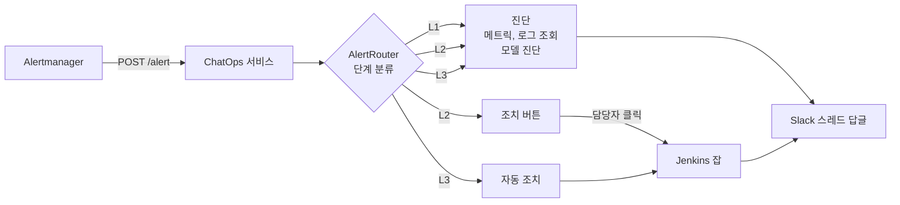

## 참고자료

- [Prometheus Alertmanager - Configuration (webhook_config)](https://prometheus.io/docs/alerting/latest/configuration/#webhook_config)
- [Slack - Socket Mode](https://api.slack.com/apis/socket-mode)
- [Slack - Block Kit](https://api.slack.com/block-kit)
- [Jenkins - Remote access API](https://www.jenkins.io/doc/book/using/remote-access-api/)
- [Claude Docs - Prompt caching](https://platform.claude.com/docs/en/build-with-claude/prompt-caching)

---

## 배경

알림은 Alertmanager에서 Slack 채널로 전송되고 있었다. 단방향이라 알림을 받은 사람이 Grafana에서 메트릭을 조회하고, Loki에서 로그를 검색하고, 원인을 판단한 뒤 서버나 클러스터에 접속해 조치했다. PromQL과 LogQL에 익숙한 사람에게 문의가 몰렸고, 야간이나 담당자 부재 시에는 1차 확인도 늦어졌다.

2026년 6월에 알림을 받으면 메트릭과 로그를 조회해 모델로 원인을 진단하고, Slack 버튼으로 조치를 실행하는 서비스를 만들었다. 7월에 중복 알림 억제와 진단 피드백을 추가했고, 8월에 테스트와 환경 구분 조건을 점검했다. 인프라 운영 AI 에이전트 전반은 [인프라 운영 AI 에이전트 구축](/posts/ai-agent-for-infra-operations/) 글에 정리했고, 이 글은 이 서비스의 구현 내용을 다룬다.

정리하면서 확인하고 싶었던 것들이다.

- 알림 단계는 어떤 기준으로 나누고, 자동 조치는 어디까지 허용하는가?
- Alertmanager 재전송과 같은 알림의 반복 발생은 어떻게 처리하는가?
- 외부 모델 API로 보내는 데이터에서 사내 정보를 어떻게 제거하는가?
- 운영 환경에서 자동 조치가 실행되지 않도록 어떻게 보장하는가?

---

## 큰 그림



모든 알림은 L1 진단을 거친다. L2 알림은 진단 결과와 함께 조치 버튼을 보내고, L3 알림은 버튼 없이 조치까지 실행한다. 실제 조치는 서비스가 직접 하지 않고 Jenkins 잡이 실행한다.

1절은 서비스 구성, 2절은 단계 분류 기준, 3절은 진단 과정, 4절은 중복 알림 억제와 피드백, 5절은 외부 전송 데이터 처리, 6절은 운영 환경 차단 조건이다.

---

## 1. 서비스 구성

Python(FastAPI)으로 구현했고 모니터링 서버에서 컨테이너로 실행한다.

| 모듈 | 역할 |
|---|---|
| `app.py` | Alertmanager 웹훅 수신, Slack Socket Mode 연결 |
| `router.py` | 알림 이름과 환경으로 L1, L2, L3 분류 |
| `l1_diagnose.py` | 알림별 PromQL, LogQL 조회 후 모델 진단 |
| `l2_propose.py`, `l2_execute.py` | 조치 버튼 생성, 버튼 클릭 시 Jenkins 잡 실행 |
| `l3_auto.py` | 자동 조치 규칙 |
| `dedup.py`, `feedback.py` | 중복 알림 억제, 진단 결과 피드백 기록 |

Slack 연동은 Socket Mode를 사용한다. Socket Mode는 서비스가 Slack으로 WebSocket 연결을 열어 두고 버튼 클릭 같은 이벤트를 받는 방식이라, 서비스에 공인 IP나 외부에서 접근 가능한 엔드포인트가 필요 없다. 사내망 서버에서 외부로 나가는 연결만 허용하면 된다.

Alertmanager 웹훅 요청은 Bearer 토큰으로 인증한다. Alertmanager 설정의 `credentials_file`에 토큰 파일 경로를 지정하고, 서비스는 같은 값을 환경 변수로 받는다.

```yaml
receivers:
  - name: chatops
    webhook_configs:
      - url: 'http://localhost:8080/alert'
        http_config:
          authorization:
            type: Bearer
            credentials_file: /etc/alertmanager/secrets/chatops_token
```

웹훅을 받으면 즉시 200을 반환하고 진단은 백그라운드 작업으로 처리한다. Alertmanager는 응답이 늦거나 실패하면 같은 알림을 재전송하는데, 진단에는 메트릭 조회, 로그 조회, 모델 호출로 수 초가 걸리기 때문이다.

---

## 2. 단계 분류 기준

| 단계 | 대상 알림 | 동작 |
|---|---|---|
| L1 | 아래 목록에 없는 모든 알림 | 진단 결과만 Slack 스레드에 게시 |
| L2 | JVM 힙 사용률, 커넥션 풀 고갈, 톰캣 스레드 풀, Kafka 컨슈머 랙, 애플리케이션 다운 | 진단 결과와 조치 버튼(파드 재시작, 알림 음소거, 재진단) 게시. 담당자가 버튼을 눌러야 실행 |
| L3 | 파드 OOMKilled, ArgoCD 동기화 실패, 디스크 사용량 임계 초과 | 진단 후 조치까지 자동 실행 |

L3에는 원인과 조치 방법이 정해져 있고, 조치를 실행해도 서비스에 영향이 적은 알림만 넣었다. OOMKilled 파드는 이미 재시작된 상태이고, ArgoCD 동기화 재시도는 Git에 선언된 상태로 다시 맞추는 작업이며, 디스크 정리는 기본값이 실제 삭제 없이 대상만 출력하는 모드(DRY_RUN)다.

L2의 파드 재시작은 서비스 영향이 있으므로 사람이 진단 결과를 확인한 뒤 실행하게 했다. 조치는 서비스가 직접 `kubectl`을 실행하지 않고 미리 등록한 Jenkins 잡 4개(파드 재시작, ArgoCD 동기화, 알림 음소거, 디스크 정리)를 파라미터와 함께 호출한다. 서비스에는 클러스터 접근 권한을 주지 않고, 실행할 수 있는 작업도 Jenkins 잡 4개로 한정된다.

분류 규칙은 코드에 집합으로 정의했다.

```python
_L3_ALERTS = {"KubePodOOMKilled", "ArgoCDAppDegraded", "DiskSpaceCritical"}
_L2_ALERTS = {
    "JvmHeapMemoryCritical", "JvmHeapMemoryHigh",
    "HikariConnectionPoolCritical", "HikariConnectionPoolExhausting",
    "TomcatThreadPoolCritical", "KafkaConsumerLagCritical", "SpringBootAppDown",
}

class AlertRouter:
    def classify(self, alert: AlertItem) -> AlertLevel:
        if alert.env not in ("dev", ""):
            return AlertLevel.L1_DIAGNOSE      # 개발 환경이 아니면 진단만
        if alert.alertname in _L3_ALERTS:
            return AlertLevel.L3_AUTO
        if alert.alertname in _L2_ALERTS:
            return AlertLevel.L2_APPROVAL
        return AlertLevel.L1_DIAGNOSE
```

자동 실행 여부는 모델 출력이 아니라 알림 이름과 환경 조건으로 코드에서 결정한다. 모델 입력에는 애플리케이션 로그가 포함되므로, 로그에 조작된 문장이 들어가더라도 모델이 조치 실행을 결정할 수 없게 하기 위해서다.

---

## 3. 진단 과정

알림 이름별로 조회할 PromQL과 LogQL을 매핑해 두었다.

```python
ALERT_QUERY_MAP = {
    "JvmHeapMemoryCritical": {
        "promql": 'jvm_memory_used_bytes{{app="{app}",area="heap"}} / jvm_memory_max_bytes{{app="{app}",area="heap"}}',
        "loki": '{{app="{app}"}} |~ "OutOfMemory|GC overhead"',
    },
    # ...
}
```

진단 순서는 다음과 같다.

1. 알림 라벨에서 애플리케이션 이름을 읽어 매핑된 PromQL로 현재 메트릭을 조회한다.
2. LogQL로 최근 30분 로그를 최대 50줄 조회한다.
3. 알림 내용, 메트릭, 로그를 모델에 보내 원인 후보와 초기 조치 방안을 요청한다.
4. 결과를 원래 알림 메시지의 Slack 스레드에 답글로 게시한다.

모델은 Claude Haiku를 사용한다. 알림 1건 진단에 입력 약 1,000 토큰, 출력 약 300 토큰을 쓰고, 비용은 약 0.002달러(약 3원)다. 하루 알림 100건이면 약 300원이다. 시스템 프롬프트에는 프롬프트 캐싱을 지정해 반복 호출 시 입력 비용을 줄였다.

새 알림 유형을 추가할 때는 `ALERT_QUERY_MAP`에 조회 쿼리를, `router.py`에 단계와 버튼을 등록한다.

---

## 4. 중복 알림 억제와 진단 피드백

### 4.1 중복 알림 억제

같은 알림이 짧은 간격으로 반복되면 같은 진단을 매번 모델에 요청하게 되고 Slack 스레드도 늘어난다. 7월에 같은 (알림 이름, 애플리케이션) 조합이 10분 안에 다시 들어오면 진단을 생략하도록 했다.

```python
class AlertDeduplicator:
    def __init__(self, window_s: float = 600.0, clock=time.monotonic):
        self._window = window_s
        self._clock = clock
        self._seen: dict[tuple[str, str], float] = {}

    def should_process(self, alert: AlertItem) -> bool:
        key = (alert.alertname, alert.app)
        now = self._clock()
        last = self._seen.get(key)
        if last is not None and now - last < self._window:
            return False
        self._seen[key] = now
        return True
```

상태를 메모리에 보관하므로 서비스가 재시작되면 초기화되고, 인스턴스를 여러 개 실행하면 인스턴스 간에 공유되지 않는다. 현재는 단일 인스턴스로 운영하고 있으며, 인스턴스를 늘릴 때는 Redis의 TTL 키로 교체하기로 코드 주석에 기록했다.

### 4.2 진단 피드백

진단 결과가 실제로 도움이 되는지 측정하기 위해 진단 답글 아래에 "도움됨", "수정 필요", "틀림" 버튼 3개를 붙였다. 클릭하면 서비스가 구조화 로그 한 줄을 남긴다.

```python
log.info("l1_feedback", kind=kind, alertname=alertname, app=app, user_id=user_id)
```

별도 저장소는 두지 않았다. 서비스 로그가 이미 Loki로 수집되고 있어서, Loki에서 `kind`별로 집계하면 알림 유형별 진단 채택률을 계산할 수 있다.

---

## 5. 외부 모델 API 전송 데이터 처리

메트릭 라벨과 로그에는 내부 IP, 사내 도메인, 로그에 출력된 토큰이 포함될 수 있다. 모델 API는 외부 서비스이므로 전송 전에 두 단계로 검사한다.

| 단계 | 처리 |
|---|---|
| 마스킹 | 내부 IP, 사내 도메인, JWT, 시크릿 관리 도구 토큰 등 9가지 패턴을 `<IP>`, `<INTERNAL_DOMAIN>` 같은 치환 문자열로 바꾼다 |
| 전송 차단 | 마스킹 후에도 평문 시크릿 패턴이나 운영 환경 식별 문자열(`-prod-`, `-live-`)이 남아 있으면 API 호출을 중단하고 감사 로그에 기록한다 |

마스킹만 적용하면 패턴에 없는 형식의 시크릿은 그대로 전송된다. 두 번째 단계에서 검사 기준을 하나 더 두어, 마스킹이 누락된 경우에도 운영 환경 데이터가 외부로 나가지 않게 했다.

---

## 6. 운영 환경 차단 조건

L2, L3 조치는 개발 환경에서만 실행되도록 3곳에서 각각 차단한다.

| 위치 | 차단 조건 | 차단 시 동작 |
|---|---|---|
| `AlertRouter.classify()` | 알림의 env 라벨이 개발 환경이 아님 | L1 진단만 실행 |
| `l3_auto.py` 자동 조치 규칙 | 규칙마다 `env == "dev"` 조건 필수 | Slack에 차단 메시지만 게시 |
| Jenkins 잡 | 대상 네임스페이스가 운영 네임스페이스 | 검증 단계에서 빌드 중단 |

한 곳의 조건이 잘못 설정되어도 나머지 두 곳에서 차단된다.

### 6.1 env 라벨 기본값 점검

8월에 코드를 점검하면서 의문이 생겼다. 알림에 env 라벨이 없으면 `AlertItem.env`의 기본값이 개발 환경 취급(빈 문자열 허용)이라, 라벨이 빠진 운영 알림이 자동 조치 대상이 될 수 있어 보였다.

실제 설정을 확인한 결과는 다음과 같았다.

- 이 서비스로 웹훅을 보내는 것은 개발 환경 Alertmanager뿐이다. 스테이징과 운영 Alertmanager에는 이 서비스로 보내는 receiver 설정이 없다.
- 개발 환경 알림 규칙 159개 중 env 라벨을 붙이는 규칙이 하나도 없다.

기본값을 바꾸면 개발 환경 알림까지 전부 L1으로 분류되어 L2 버튼과 L3 자동 조치가 동작하지 않게 된다. 현재 구성에서 환경 구분 기준은 알림 라벨이 아니라 웹훅을 보내는 Alertmanager다. 기본값은 유지하고, 이 전제를 회귀 테스트와 저장소의 `CLAUDE.md` 보안 항목에 기록했다. 다른 환경의 Alertmanager를 연결할 때는 env 라벨을 먼저 추가하고 기본값도 함께 바꿔야 한다.

같은 점검에서 테스트 파일 2개가 테스트 수집 단계에서 import 오류로 실행되지 않고 있던 것을 발견해 수정했다. 통과 테스트는 34건에서 39건, 커버리지는 84%에서 86%가 됐다.

---

## 정리하며

처음 던진 질문들에 대한 답이다.

- **단계는 어떤 기준으로 나누는가?** 원인과 조치가 정해져 있고 조치의 서비스 영향이 적은 알림만 L3 자동 조치로 두고, 서비스 영향이 있는 조치는 L2로 두어 사람이 버튼으로 승인한다. 나머지는 L1 진단만 한다.
- **반복 알림은 어떻게 처리하는가?** 웹훅에 즉시 응답해 Alertmanager 재전송을 막고, 같은 알림과 애플리케이션 조합은 10분 동안 진단을 생략한다.
- **외부 전송 데이터는 어떻게 처리하는가?** 9가지 패턴을 마스킹한 뒤, 마스킹 후에도 시크릿이나 운영 환경 식별 문자열이 남으면 호출을 중단한다.
- **운영 환경 자동 조치는 어떻게 막는가?** 분류 단계, 자동 조치 규칙, Jenkins 잡 3곳에서 각각 차단한다. 현재 구성에서는 개발 환경 Alertmanager만 이 서비스로 알림을 보낸다는 점이 환경 구분의 전제이고, 이 전제를 테스트로 고정했다.

조치 실행 여부를 모델 출력과 분리하고 실행 가능한 작업을 Jenkins 잡 4개로 제한한 구조 덕분에, 모델 진단이 틀려도 실행되는 조치의 범위는 사전에 정한 범위를 벗어나지 않는다.
