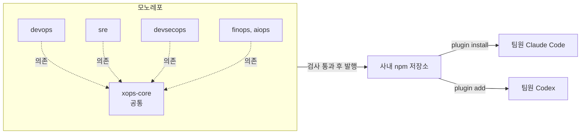

## 참고자료

- [Claude Code Docs - Plugins](https://code.claude.com/docs/en/plugins)
- [Claude Code Docs - Plugin marketplaces](https://code.claude.com/docs/en/plugin-marketplaces)
- [Claude Code Docs - Plugins reference](https://code.claude.com/docs/en/plugins-reference)
- [Claude Code Docs - Skills](https://code.claude.com/docs/en/skills)
- [Claude Code Docs - Hooks](https://code.claude.com/docs/en/hooks)
- [Semantic Versioning 2.0.0](https://semver.org/lang/ko/)

---

## 배경

인프라 작업에 쓰는 Claude Code 지침과 스킬(작업 절차를 묶은 Claude Code 폴더)을 개인 설정에만 두면 팀원은 같은 기준으로 작업할 수 없고, 지침을 고쳐도 다른 사람에게 반영되지 않는다. 팀이 같은 지침을 설치하고 같은 버전으로 갱신받을 수 있는 배포 방식이 필요했다.

사내에는 이미 동료가 구축한 Claude Code 플러그인 마켓플레이스 저장소가 있었다. 사내 npm 저장소에 플러그인을 패키지로 올리고, 각자 `/plugin install`로 설치하는 구조다. 2026년 7월부터 여기에 인프라 역할별 플러그인 5종(devops, sre, devsecops, finops, aiops)을 만들어 올렸고, 8월에 공통 자산을 별도 플러그인으로 분리했다. 역할 구분과 각 플러그인에 담은 내용은 [인프라 운영 AI 에이전트 구축](/posts/ai-agent-for-infra-operations/) 글에 정리했다. 이 글은 플러그인을 배포하고 유지보수하면서 정한 규칙을 다룬다.

정리하면서 확인하고 싶었던 것들이다.

- 여러 플러그인이 공통 자산을 쓸 때 의존 관계는 어떻게 표현하는가?
- 버전은 어떤 기준으로 올리고, 배포 전에 무엇을 검사하는가?
- 위험한 명령은 지침 외에 어떤 장치로 막는가?
- 지침 문서에 적힌 사실이 실제 환경과 달라지는 문제는 어떻게 잡는가?

---

## 큰 그림



플러그인은 하나의 저장소(모노레포)에서 관리하고, 플러그인마다 버전을 따로 매겨 npm 패키지로 발행한다. 역할 플러그인은 모두 공통 플러그인 xops-core에 의존한다.

1절은 플러그인 구성과 의존 관계, 2절은 버전 관리와 배포 전 검사, 3절은 위험 명령 차단 훅(Hook, 정해진 시점에 자동 실행되는 셸 명령), 4절은 지침이 실제 환경과 어긋나는 문제, 5절은 Codex 병행 지원이다.

---

## 1. 플러그인 구성과 의존 관계

Claude Code 플러그인은 스킬, 서브에이전트(별도 컨텍스트에서 일을 맡는 보조 에이전트), 슬래시 커맨드, 훅, MCP(Model Context Protocol, AI 앱과 외부 도구를 잇는 표준 프로토콜) 서버 설정을 하나로 묶어 배포하는 단위다. 스킬은 특정 작업에 필요한 절차와 참고 문서를 묶은 폴더로, 작업 내용이 스킬 설명과 맞을 때 모델이 불러와 읽는다. 서브에이전트는 별도 컨텍스트에서 실행되는 보조 에이전트(Agent, 도구를 골라 쓰며 스스로 다음 행동을 정하는 반복 구조)이고, 훅은 도구 실행 전후 같은 시점에 자동으로 실행되는 셸 명령이다.

처음에는 devops 플러그인이 조회용 MCP 서버와 공통 규칙을 갖고 있었고, 나머지 4개는 devops를 같이 설치해야 동작했다. sre 진단 에이전트만 쓰고 싶은 사람도 빌드, 배포 스킬까지 설치해야 했다.

8월에 역할과 무관한 자산을 xops-core 플러그인으로 분리했다.

| 플러그인 | 담은 것 |
|---|---|
| xops-core | 조회용 MCP 서버, 세션 시작 훅, 역할 공통 리뷰 에이전트, 문서 작성 규칙, 셸과 경로 규칙 |
| devops | Helm 차트 생성, Compose에서 Kubernetes 전환, ArgoCD, Jenkins 관련 스킬 |
| sre | 계층별 진단 에이전트, 장애 분류 커맨드, 장애 패턴 스킬 |
| devsecops | 보안 정책 분석 에이전트, 보안 리뷰 스킬, 위험 명령 차단 훅 |
| finops, aiops | 자원 적정화 분석, 자동화 설계와 MCP 서버 개발 |

역할 플러그인의 `plugin.json`에 의존 관계를 선언하면 설치 시 xops-core가 같이 설치된다.

```json
{
  "name": "devops",
  "dependencies": ["xops-core"]
}
```

분리 후에도 자산이 다시 한 플러그인으로 쌓이는 것을 막기 위해 검사 스크립트를 하나 두었다. 각 플러그인의 `ROLE.md`에 소속 자산 목록을 표로 적고, 스크립트가 이 표와 실제 `agents/`, `skills/` 폴더를 대조한다. 새 스킬을 추가하려면 어느 플러그인의 `ROLE.md`를 고칠지 정해야 하므로, 추가하는 시점에 소속을 판단하게 된다.

---

## 2. 버전 관리와 배포 전 검사

플러그인마다 독립적으로 시맨틱 버전(MAJOR.MINOR.PATCH)을 매긴다. 기준은 다음과 같다.

| 구분 | 기준 | 예 |
|---|---|---|
| MAJOR | 설치 방법이나 의존 관계가 바뀌어 기존 사용자가 조치해야 함 | MCP 서버를 xops-core로 이동 (devops 1.0.0) |
| MINOR | 스킬, 에이전트, 참고 문서 추가 | Compose에서 Kubernetes 전환 매핑표 추가 (devops 1.1.0) |
| PATCH | 기존 지침의 오류 수정 | 네임스페이스 이름 정정 (devops 1.2.2) |

버전 번호는 `plugin.json`, `package.json`, `CHANGELOG.md` 세 곳에 적힌다. 하나만 올리고 나머지를 놓치면 마켓플레이스에 표시되는 버전과 실제 설치되는 버전이 달라진다. 빌드 스크립트가 발행 전에 세 값이 같은지 확인하고, 다르면 발행을 중단한다.

`CHANGELOG.md`에는 무엇을 바꿨는지와 함께 바꾼 이유를 적는다. 지침을 바꾸면 모델의 동작이 바뀌는데, 이유가 없으면 몇 달 뒤 같은 지침을 다시 원래대로 되돌리는 일이 생긴다.

스킬 중 부작용이 있는 것은 모델이 스스로 호출하지 못하게 했다. PR 생성이나 배포 안내처럼 실제로 무언가를 실행하는 스킬은 frontmatter에 `disable-model-invocation: true`를 지정해 사람이 슬래시 커맨드로 직접 부를 때만 실행된다.

반대로 Kubernetes 규칙처럼 항상 적용되어야 하는 스킬은 `paths`를 지정했다. 지정한 경로 패턴의 파일을 다룰 때만 스킬이 컨텍스트에 들어가므로, 관련 없는 작업에서 컨텍스트를 차지하지 않는다.

```yaml
---
name: rule-kubernetes
description: Kubernetes manifest, Helm chart, Kustomize 경로를 작성하거나 리뷰할 때 적용하는 규칙
paths:
  - "**/charts/**/*.{yaml,yml}"
  - "**/clusters/**/*.{yaml,yml}"
  - "**/values*.{yaml,yml}"
---
```

---

## 3. 위험 명령 차단 훅

지침에 "`kubectl delete ns`는 실행하지 않는다"라고 적어도 모델이 항상 따른다는 보장은 없다. 지침은 모델이 읽는 텍스트이고, 컨텍스트가 길어지거나 다른 지침과 충돌하면 무시될 수 있다. 실행 자체를 막으려면 모델 바깥에서 검사해야 한다.

devsecops 플러그인에 `PreToolUse` 훅 2개를 넣었다. `PreToolUse`는 모델이 도구를 호출하기 직전에 실행되는 훅이고, 훅이 종료 코드 2로 끝나면 Claude Code가 해당 도구 호출을 취소하고 훅이 출력한 사유를 모델에게 전달한다.

```json
{
  "hooks": {
    "PreToolUse": [
      {
        "matcher": "Read|Edit|Write|Grep",
        "hooks": [{ "type": "command", "command": "bash \"${CLAUDE_PLUGIN_ROOT}/hooks/guard-protected-file.sh\"", "timeout": 5 }]
      },
      {
        "matcher": "Bash",
        "hooks": [{ "type": "command", "command": "bash \"${CLAUDE_PLUGIN_ROOT}/hooks/guard-dangerous-command.sh\"", "timeout": 5 }]
      }
    ]
  }
}
```

첫 번째 훅은 `.env`나 자격 증명 파일 같은 보호 대상 파일의 읽기와 수정을 막는다. 두 번째 훅은 셸 명령을 검사해 다음 명령을 차단한다.

| 분류 | 차단 대상 |
|---|---|
| Git | `push --force`, `reset --hard`, `clean -f`, `--no-verify` |
| Kubernetes | `delete --all`, `delete ns`, `delete pv`, `apply --force`, `helm uninstall`, `argocd app sync` |
| 컨테이너, IaC | `docker system prune`, `docker compose down`, `terraform apply`, `terraform destroy` |
| 디스크 | `rm -rf /`, `mkfs`, `dd` |

차단할 때는 사유와 대안을 함께 출력한다. 예를 들어 `git reset --hard`는 "미커밋 변경 소실, git stash로 보관 후 진행"을 출력한다. 모델은 이 메시지를 받고 대안 명령으로 다시 시도하거나 사용자에게 확인을 요청한다. 차단 내역은 홈 디렉터리의 JSONL 감사 로그에 남는다.

구현하면서 고려한 점이 2가지 있다.

첫째, 오탐이다. `grep "push --force" docs/`처럼 검색어나 커밋 메시지 안에 위험 문자열이 들어간 경우까지 막으면 작업이 계속 중단된다. 그래서 따옴표로 감싼 인자를 제거한 뒤 검사한다. 단 `bash -c "..."`, `eval "..."`처럼 따옴표 안이 실제로 실행되는 명령은 따옴표 안을 다시 검사한다.

둘째, 훅 자체가 실패하는 경우다. 훅은 `jq`로 입력 JSON을 파싱하는데, `jq`가 없거나 파싱에 실패하면 종료 코드 0으로 통과시킨다(fail-open). 이 훅이 실패할 때마다 모든 셸 명령이 막히면 팀원들이 훅을 꺼 버리게 되기 때문이다. 이 훅은 실수를 줄이는 장치이고, 운영 클러스터 보호는 클러스터 권한과 접근 제어에서 따로 한다. 훅 동작은 `test-hooks.sh`로 차단 대상과 오탐 사례를 함께 검증한다.

---

## 4. 지침과 실제 환경의 불일치

플러그인을 운영하면서 가장 자주 고친 것은 지침에 적힌 사실이 실제 환경과 다른 경우였다. 지침이 틀리면 모델은 틀린 내용을 확신을 갖고 적용한다.

실제로 고친 사례들이다.

| 버전 | 문제 | 원인 |
|---|---|---|
| devops 1.2.0 | 규칙 스킬은 CPU limit을 요구하고, 차트 생성 스킬은 걸지 말라고 함 | 두 스킬이 같은 컨텍스트에 들어가면 모델이 어느 쪽이든 고름. LimitRange 설정에 맞춰 메모리만 제한하도록 통일 |
| devops 1.2.0 | 차트 기본 템플릿에 Pod 라벨 3개 누락 | 정책 엔진이 해당 라벨을 강제하고 있어 템플릿대로 만들면 Pod가 생성되지 않음. 정책 11개를 실제로 적용해 확인 |
| devops 1.2.0, 1.2.2 | 네임스페이스 이름이 클러스터와 다름 | 두 번 수정했는데 두 번 모두 실제 클러스터를 조회하지 않고 고침. 1.2.2에서 조회 결과를 기준으로 확정 |
| devops 1.2.1 | 시크릿을 values 파일에서만 점검 | 시크릿을 외부 저장소로 주입해도 애플리케이션이 기동 로그에 값을 출력하면 로그 조회 권한이 있는 사람에게 노출됨. 배포 후 로그 확인 항목 추가 |

이 문제를 줄이기 위해 두 가지 규칙을 두었다.

첫째, 실제 환경을 조회해서 확인한 항목에는 "실측" 라벨과 확인 날짜를 적는다. 검사 스크립트가 라벨이 있는 문서의 확인 날짜를 읽고, 90일이 지나면 실패로 처리한다. 클러스터 설정은 계속 바뀌므로 확인 날짜가 오래된 항목은 다시 확인해야 한다.

둘째, 지침을 고칠 때는 실제 환경을 조회한 결과를 기준으로 한다. 네임스페이스 이름 사례는 다른 문서의 표기를 보고 고쳤다가 다시 틀린 경우다. 1.2.2부터는 `CHANGELOG.md`에 "2026-08-28 조회 결과"처럼 확인 방법과 날짜를 함께 적는다.

---

## 5. Codex 병행 지원

Claude Code 외에 OpenAI Codex에서도 같은 지침을 쓰기 위해, 두 도구용 지침을 따로 관리하지 않고 8월에 같은 저장소에서 두 도구용 산출물을 함께 만들도록 했다. 따로 관리하면 한쪽만 고쳐져 내용이 어긋난다.

| 구분 | Claude Code | Codex |
|---|---|---|
| 마켓플레이스 정의 | `.claude-plugin/marketplace.json` | `.agents/plugins/marketplace.json` |
| 스킬 | 원본 공유 | 원본 공유 |
| 에이전트, 커맨드 | 원본 | 빌드 스크립트가 Codex용 스킬과 TOML 설정으로 변환 |
| 훅 | `claude-hooks.json` | `codex-hooks.json` (호환되는 훅만) |

스킬은 두 도구 모두 같은 형식을 지원해서 원본을 그대로 쓴다. 에이전트와 커맨드는 형식이 달라 변환 스크립트를 두었고, `codex:check`로 변환 결과가 원본과 맞는지 검사한다. 훅은 입력 형식과 지원 이벤트가 달라 전부 옮기지 않고 호환되는 것만 연결했다.

---

## 정리하며

처음 던진 질문들에 대한 답이다.

- **공통 자산의 의존 관계는 어떻게 표현하는가?** 공통 자산을 xops-core 플러그인으로 분리하고, 역할 플러그인의 `plugin.json`에 `dependencies`로 선언한다. 자산이 다시 한쪽으로 쌓이지 않도록 `ROLE.md` 표와 실제 폴더를 대조하는 검사를 둔다.
- **버전은 어떻게 관리하는가?** 플러그인별 시맨틱 버전을 쓰고, 세 파일의 버전 번호가 같은지 발행 전에 확인한다. 변경 이유를 `CHANGELOG.md`에 남긴다.
- **위험 명령은 어떻게 막는가?** `PreToolUse` 훅으로 실행 직전에 검사하고 종료 코드 2로 차단한다. 따옴표 인자를 제외해 오탐을 줄이고, 훅 자체가 실패하면 통과시킨다.
- **지침과 실제 환경의 불일치는 어떻게 잡는가?** 실측 항목에 확인 날짜를 적고 90일이 지나면 검사에서 실패시킨다. 지침을 고칠 때는 실제 환경을 조회한 결과를 기준으로 한다.

2026년 8월 말 기준으로 xops-core를 포함한 6개 플러그인의 `CHANGELOG.md`에 기록된 릴리스는 87건이고, 그중 53건이 기존 지침을 고친 PATCH였다(MINOR 33건, MAJOR 1건). 팀이 함께 쓰는 지침은 코드와 같은 방식으로 검사하고 버전을 관리해야 한다는 것을 확인했다.
