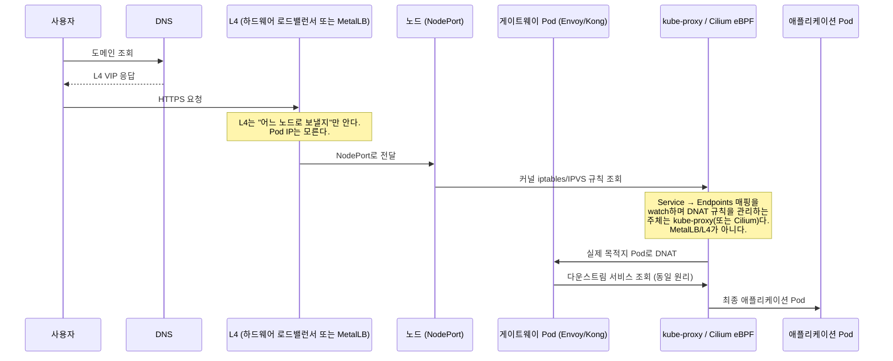

---

title: "Docker Compose를 걷어내며 뚫렸던 것들 — 게이트웨이, 네트워크, 배포"
date: 2026-08-28
categories: [Kubernetes, DevOps]
tags: [Kubernetes, DockerCompose, GatewayAPI, Envoy, MetalLB, kube-proxy, Cilium, Ansible, ChatOps, GitOps, CI/CD]
layout: post
toc: true
math: true
mermaid: true

---

## 참고자료

- [Kubernetes - Service](https://kubernetes.io/docs/concepts/services-networking/service/)
- [Kubernetes - Virtual IPs and Service Proxies (kube-proxy)](https://kubernetes.io/docs/reference/networking/virtual-ips/)
- [Kubernetes - Node-pressure Eviction](https://kubernetes.io/docs/concepts/scheduling-eviction/node-pressure-eviction/)
- [Kubernetes - Horizontal Pod Autoscaling](https://kubernetes.io/docs/tasks/run-application/horizontal-pod-autoscale/)
- [Gateway API 공식 문서](https://gateway-api.sigs.k8s.io/)
- [Envoy Gateway 공식 문서](https://gateway.envoyproxy.io/)
- [MetalLB 공식 문서](https://metallb.universe.tf/)
- [Cilium - kube-proxy replacement](https://docs.cilium.io/en/stable/network/kubernetes/kubeproxy-free/)
- [Docker - `docker stop` 레퍼런스](https://docs.docker.com/reference/cli/docker/container/stop/)
- [Ansible 공식 문서](https://docs.ansible.com/)
- [ArgoCD 공식 문서](https://argo-cd.readthedocs.io/)

---

## 배경

지금 하는 일은 1인 데브옵스로 개발/스테이지/운영 세 환경, 70여 대 서버를 혼자 보는 것이다. 그중 일부(37대)를 Docker Compose에서 Kubernetes(22대)로 옮기는 작업을 진행 중이고, 아직 절반 이상은 Compose로 돈다. 이 글은 그 전환 과정에서 설계와 실제가 갈렸던 지점, 그리고 면접에서 직접 설명하려다 막혔던 지점을 정리한 것이다.

먼저 정리하고 갈 오해가 두 가지 있다.

**"오토스케일링 때문에 옮겼다"는 아니다.** 지금 클러스터에 HPA는 켜 두었지만 최소·최대 replica가 같아서 실제로는 안 늘어난다. 켜 둔 이유는 트래픽에 따라 얼마나 늘려야 하는지 판단할 지표를 쌓기 위해서지, 지금 당장 자동으로 늘리려는 게 아니다.

**"장애 복구 때문"도 절반만 맞다.** 컨테이너가 죽으면 다시 뜨는 건 Compose도 `restart: always` 한 줄이면 된다. Compose로 안 되는 건 서버 한 대가 통째로 죽었을 때 그 위에 있던 걸 다른 서버로 옮기는 일이다.

실제로 옮긴 이유는 다른 데 있었다. 서버에 들어가서 직접 배포 스크립트를 실행하고, 라우팅 규칙은 게이트웨이 관리 화면에만 있고, 방화벽에 뭘 열었는지는 결재 문서에만 있고, 어느 앱이 자원을 얼마나 쓰는지는 어디에도 없는 상태 — 이렇게 흩어진 규칙을 한곳에 모으고 사람이 아니라 도구가 지키게 만드는 게 목적이었다.

## API 게이트웨이: 유지했다가, 걷어냈다가, 되돌렸다

Compose로 운영할 때는 앞단에 API 게이트웨이가 있었고, 컨테이너를 늘릴 때마다 그 게이트웨이 관리 화면에 라우트를 수동으로 추가하는 게 반복 작업의 대부분이었다. Kubernetes로 옮길 때 이 게이트웨이를 계속 쓸지부터 판단해야 했다.

처음에는 기존 게이트웨이를 그대로 유지하기로 했다. 이유는 단순했다 — 개발자들이 이미 그 위에 JWT 인증, 감사 로그 같은 커스텀 플러그인을 여러 개 만들어 둔 상태였고, 그걸 다른 게이트웨이로 이관하는 공수가 너무 컸다. 다행히 이 게이트웨이는 Kubernetes Ingress Controller 형태로 Helm 차트를 제공해서, 클러스터 안으로 그대로 편입시키는 선택지가 있었다.

그런데 이관을 진행하면서 남은 몇 개 경로(정적 리소스, 로그 수집, OpenAPI 문서 등 5개)를 [Gateway API](https://gateway-api.sigs.k8s.io/) 기반의 [Envoy Gateway](https://gateway.envoyproxy.io/)로 옮기는 시도를 했다. 커밋 로그를 보면 이 전환은 한 번에 성공하지 않았다 — 적용했다가 되돌리고, 문제를 고쳐서 다시 적용하는 과정을 거쳤다.

```
feat(gateway): 미이관 5경로 Envoy 이관 (hub/log/static/openapi)
  → Revert "..."
  → fix(gateway): 이중 클레임 해소 + 분기 확인항목 정리
  → Reapply "..." (되돌린 것 복원)
```

되돌린 이유를 커밋 메시지만으로 다 복원할 수는 없지만, 남아 있는 흔적은 명확하다. 헤더 클레임이 두 군데서 중복 처리되던 문제, 특정 경로의 라우팅 우선순위 충돌 같은 것들이었다. 이 경험에서 얻은 건 "게이트웨이를 바꾸는 작업은 되돌릴 수 있게 작게 쪼개서 커밋해야 한다"는 당연한 원칙을, 실제로 되돌려봐야 몸에 새겨진다는 사실이었다.

### "무중단"이라는 말을 다시 정의하게 된 계기

배포 파이프라인은 SSH로 접속해 컨테이너를 순차적으로 내리고 올리는 롤링 방식이었다. 이걸 두고 "무중단 배포"라고 불렀는데, 면접에서 이 표현을 그대로 썼다가 정정한 적이 있다.

게이트웨이의 헬스체크는 주기적으로 업스트림을 확인하고, 실패가 임계치를 넘으면 그 대상을 라우팅에서 제외한다. 문제는 이 확인 주기와 임계치만큼의 "윈도우"가 존재한다는 것이다. 컨테이너를 내리는 순간부터 헬스체크가 실패를 감지하기까지, 그 윈도우 동안 들어온 요청은 실패할 수 있다. 그러니 엄밀히는 완전한 무중단이 아니라 "실패 가능 구간이 아주 짧은 롤링 배포"였다.

이걸 완전한 무중단으로 만들려면 두 가지 층위를 분리해서 생각해야 한다.

1. **배포 전략** (카나리, 블루/그린) — 새 버전과 구 버전을 동시에 띄우고 트래픽을 서서히 옮기는 문제
2. **롤링 업데이트 자체의 중단 가능성** — 컨테이너를 내리기 *전에* 게이트웨이 라우팅에서 먼저 빼는가의 문제

업무 시스템 규모에서는 1번(카나리/블루그린)까지는 필요 없다고 판단했지만, 2번은 자동화할 수 있었다. 배포 스크립트가 대상 컨테이너를 내리기 전에 게이트웨이에서 그 타겟을 먼저 제거하고, 배포가 끝난 걸 확인한 뒤에 라우트를 다시 추가하는 순서로 바꾸면 된다. "먼저 빼고 나중에 붙인다"는 순서 하나가 무중단이라는 말을 실제로 성립시키는 지점이었다.

## 트래픽이 실제로 어떻게 들어오는가

이 전환에서 가장 오래 헤맨 부분은 게이트웨이 뒤가 아니라 앞이었다. 로드밸런서부터 파드까지 패킷이 어떻게 도달하는지를 정확히 설명하는 일이다.

설계 초기에는 [MetalLB](https://metallb.universe.tf/)로 L4 로드밸런서를 구성할 계획이었다. 온프레미스 환경에서 `LoadBalancer` 타입 서비스를 쓰려면 MetalLB나 그에 준하는 소프트웨어 로드밸런서가 필요하기 때문이다. 그런데 실제로 자리 잡은 구조는 달랐다 — 기존에 이미 있던 하드웨어 L4 장비가 트래픽을 받아서 각 노드의 `NodePort`로 바로 꽂아주는 방식으로 정리됐다. MetalLB는 최종적으로 도입하지 않았다.

이 결정 자체보다 중요한 건, 설계 문서를 실제 구성에 맞춰 정정하면서 "지금까지 내가 설명해온 트래픽 경로가 틀렸다"는 걸 인정해야 했던 순간이다. 면접에서 MetalLB 기준으로 트래픽 흐름을 설명하다가 완전히 무너진 적이 있는데, 돌이켜보면 무너진 이유는 MetalLB를 안 써서가 아니라 **각 계층이 정확히 무슨 책임을 지는지 구분하지 못했기 때문**이었다. 그 계층을 정리하면 이렇다.



정리하면 세 가지를 헷갈리지 않아야 한다.

- **L4(하드웨어 로드밸런서 또는 MetalLB)**: "어떤 노드가 이 가상 IP(VIP)를 지금 받을 수 있는가"만 안다. MetalLB의 경우 L2 모드에서는 리더 노드가 ARP로 자기 MAC 주소를 알려주는 방식으로 이걸 광고한다. **Pod IP는 이 계층의 책임이 아니다.**
- **kube-proxy (또는 Cilium의 kube-proxy replacement)**: Service와 Endpoints(또는 EndpointSlice)를 지속적으로 watch하면서, 트래픽을 실제 Pod IP로 보내는 iptables/IPVS(또는 eBPF) 규칙을 관리하는 주체다. **"어느 Pod가 이 서비스를 담당하는가"를 실제로 아는 건 여기다.**
- **CNI (Cilium 등)**: Pod 간 네트워크 자체(IP 할당, 오버레이/언더레이 라우팅)를 담당한다. kube-proxy와는 다른 레이어다.

면접에서 "kube-proxy가 일종의 CNI 역할을 한다"고 답한 적이 있는데 이게 정확히 틀린 지점이다. kube-proxy와 CNI는 둘 다 네트워킹을 다루지만 책임이 다르다. 이 세 계층을 분리해서 그릴 수 있으면, "L4가 Pod IP를 아는가 모르는가"라는 질문 자체가 성립하지 않는다는 걸 알 수 있다 — L4는 애초에 그걸 알 필요가 없는 계층이기 때문이다.

## Ansible 70여 대: 인증서와 롤백

Kubernetes로 옮기지 않은 나머지 서버는 여전히 [Ansible](https://docs.ansible.com/)로 관리한다. 여기서 반복적으로 손이 간 두 가지가 인증서 갱신과 배포 롤백이다.

### 인증서 감시를 바꾼 이유

처음에는 인증서 만료를 스크립트로 서버마다 직접 체크했다. 이 방식의 문제는 두 가지였다.

1. 스크립트 실행 자체가 실패하면 "만료가 임박하지 않다"와 "체크가 실패했다"를 구분할 수 없다.
2. 서버 개수가 늘수록 체크 스크립트를 서버마다 배포하고 실행 결과를 취합하는 일 자체가 관리 대상이 된다.

이걸 [blackbox_exporter](https://github.com/prometheus/blackbox_exporter) 기반의 TLS probe로 전환했다. 서버 안에서 스크립트를 도는 대신, 모니터링 서버가 밖에서 각 도메인의 TLS 핸드셰이크를 직접 열어보고 인증서 만료일을 메트릭으로 뽑아낸다. 이렇게 하면 "체크가 안 됐다"는 상태 자체가 메트릭 부재로 드러나서 놓치기 어렵다. 이후에는 만료까지 남은 일수를 D-Day 형식으로 알림에 노출하고, probe 주기를 5분에서 1분으로 좁혀서 갱신 실패를 더 빨리 잡도록 조정했다.

인증서 자동 갱신 자체는 Ansible 플레이북으로 처리한다. 서버 70여 대를 한 번에 밀지 않고 인벤토리를 그룹 단위로 나눠서 순차 적용하는데, 이렇게 하면 갱신 스크립트 자체에 문제가 있을 때 전체가 아니라 한 그룹만 영향을 받는다.

### 배포 자동 롤백

배포가 실패하면 이미 배포된 부분까지 되돌리는 파이프라인을 만들었다. 여기서 실제로 고민했던 지점은 "무엇을 되돌릴 수 있고, 무엇을 되돌릴 수 없는가"를 미리 갈라두는 것이었다. 애플리케이션 배포는 이전 이미지로 되돌리면 되지만, 스키마 변경이 섞인 배포는 단순 롤백이 위험할 수 있다. 이 문제는 배포 규칙 자체를 "컬럼을 추가만 하고, 이름 변경이나 삭제는 하지 않는다"로 제한해서 피해갔다 — 기술로 푸는 대신 규칙으로 위험을 없앤 경우다.

## 트러블슈팅에서 반복적으로 틀렸던 지점 두 가지

디스크와 네트워크 트러블슈팅에서 같은 실수를 몇 번 반복했다. 실무에서 겪은 뒤에야 정리된 것들이라 여기 남긴다.

### 용량은 남았는데 파일을 못 만드는 경우

`df -h`로 보면 여유 공간이 충분한데 "no space left on device" 오류가 나는 경우가 있다. 이때 반사적으로 용량 표시가 잘못됐다고 의심하게 되는데, 실제로는 **용량과 inode가 서로 다른 자원**이라서 생기는 일이다.

| 무엇 | 무엇을 세나 | 무엇 때문에 동나나 |
|---|---|---|
| 용량 | 바이트 수 | 큰 파일 |
| inode | 파일 개수 | 작은 파일이 아주 많이 |

파일 하나는 크기와 무관하게 inode를 하나씩 쓴다. 빈 파일도 하나, 기가바이트짜리 파일도 하나다. 그래서 세션 파일이나 잘게 쪼갠 로그처럼 작은 파일이 대량으로 쌓이는 워크로드는 용량이 넉넉해도 inode만 먼저 바닥난다. `df -i`로 따로 확인해야 드러나는 문제이고, 이 상태에서 **큰 파일을 지우는 건 도움이 안 된다** — inode 개수는 그대로이기 때문에 작은 파일을 지워야 한다. Kubernetes 환경에서는 이게 노드 파일시스템 자원이라 한 Pod가 inode를 다 쓰면 같은 노드의 다른 Pod까지 파일을 못 만드는 상태로 번진다는 점도 나중에야 알았다.

### 같은 서버에서는 되는데 옆 서버에서 안 되는 경우

`curl localhost`는 되는데 다른 서버에서 같은 포트로 접근하면 안 되는 상황에서, 첫 반응으로 방화벽 설정을 의심한 적이 있다. 이게 항상 틀린 건 아니지만, 우선순위가 잘못됐다. 먼저 봐야 하는 건 **그 프로그램이 어느 주소로 듣고 있는가**다.

```bash
ss -tlnp | grep <포트>
```

`127.0.0.1:9090`으로 듣고 있으면 애초에 그 서버 밖에서는 접근할 방법이 없다. 방화벽을 아무리 열어도 소용없는데, 이건 "길이 막힌 것"이 아니라 "받을 귀가 없는 것"이기 때문이다. 방화벽 문제와 리슨 주소 문제는 겉으로 보이는 실패 모양이 다르다 — 리슨 주소 문제는 즉시 연결이 거절되고, 방화벽 문제는 타임아웃까지 기다리게 된다. `time curl`로 걸린 시간만 재봐도 어느 쪽인지 구분할 수 있다. Kubernetes Pod 안에서는 이 문제가 더 알아채기 어려운 게, liveness probe는 같은 Pod 안에서 물어보기 때문에 이 상태에서도 Pod는 계속 "정상"으로 나온다.

## 장애 1차 대응을 자동화한 이유

70여 대를 혼자 보다 보니, 알림이 오면 "이게 지금 봐야 하는 건가"부터 판단하는 데 시간이 걸리는 게 문제였다. 이걸 줄이려고 Alertmanager 알림을 받으면 관련 메트릭과 로그를 자동으로 조회해서 LLM에게 1차 진단을 맡기고, 결과를 Slack 스레드에 답글로 남기는 서비스를 만들었다.

구조는 단순하다. 평소에는 아무것도 수집하지 않고 대기만 하다가, 알림이 오는 순간에만 깨어난다.

```
Alertmanager → alert firing → 자체 서비스가 메트릭/로그를 즉시 조회
                             → LLM에 진단 요청 → Slack 스레드에 답글
```

여기서 세 단계로 나눴다.

- **1단계**: 알림이 오면 자동으로 원인 후보와 초기 조치를 요약해 답글로 남긴다. 담당자가 Grafana와 로그를 직접 열어보는 시간을 줄이는 게 목적이다.
- **2단계**: LLM이 조치를 제안하고, 담당자가 Slack 버튼을 눌러야 실행된다. Pod 재시작 같은 조치를 여기 뒀다.
- **3단계**: OOMKill처럼 대응 방법이 이미 확립된 알림은 버튼 없이 자동 실행한다.

권한은 최소한으로 뒀다 — 이 서비스가 클러스터에 갖는 권한은 조회 위주고, 실행 가능한 조치도 재시작 정도로 제한했다. 비용은 예상보다 훨씬 작았다. 저렴한 모델 기준으로 진단 1회에 원 단위 비용이 들고, 하루 알림이 100건이어도 하루 비용은 커피 한 잔에도 못 미친다. 자동화 도입을 망설이게 만드는 건 대체로 기술적 난이도가 아니라 "이걸로 뭘 할 수 있는데 비용이 얼마나 들지 모른다"는 불확실성인데, 실제로 계산해보면 이 불확실성은 생각보다 빨리 걷힌다.

다만 이 자동화를 만들면서 뒤늦게 깨달은 게 있다. 원래 서버에 접속하려면 사내 보안 솔루션을 거쳐야 하는데, 이 자동화는 결과적으로 그 절차를 우회하는 경로가 됐다. 편의성만 보고 설계하면서 "이게 기존 통제 절차를 건너뛰는 행위"라는 프레이밍 자체를 못 하고 지나간 것이다. 조회 권한만 부여해 방어선을 뒀다는 변명은 있지만, 새 자동화를 만들 때 "이게 어떤 기존 승인 절차를 건너뛰는가"를 체크리스트에 넣지 않았다는 게 더 근본적인 문제였다.

## 아직 안 되는 것

세 환경이 전부 Kubernetes로 옮겨간 게 아니다. 개발 환경만 클러스터가 있고 나머지 두 환경은 여전히 Compose로 돈다. 그래서 환경 간 승격도 자동이 아니라 사람이 개발 환경에서 확인하고 사람이 다음 환경으로 넘긴다.

클러스터 밖에 남은 것도 많다. 데이터베이스, 캐시, 메시지 스트리밍은 밖에 있고 앞으로도 그럴 계획이다. 서비스 메시도 아직 넣지 않아서, 서비스 간 호출은 게이트웨이를 거치거나 서비스 이름으로 바로 나간다.

그리고 운영이 쉬워진 것도 아니다. 규칙이 한곳에 모인 대신 배워야 할 부품 수는 늘었다. 이 전환을 판단할 때 흔히 비용과 성능, 안정성을 보는데, 거기에 하나를 더 봐야 한다고 생각한다 — **사람과 도구가 지금 상태와 바라는 상태를 얼마나 쉽게 알아보고, 바꾼 걸 확인할 수 있는가.** 서버에 들어가야만 알 수 있는 상태와, 저장소를 읽으면 알 수 있는 상태는 다르다. 이 차이는 도입 초기 몇 달 동안은 잘 안 드러나다가, 몇 달 뒤 사람이 바뀌는 시점에야 값어치를 낸다.

이 판단을 다시 해야 할 조건도 정리해뒀다. 클러스터를 돌보는 사람이 계속 한 명이고 늘어날 기미가 없을 때, 워크로드가 줄어서 노드 몇 대로 충분해질 때, 배우는 비용이 얻는 것보다 크다고 판단될 때다. 지금은 아니라고 보고 있지만, 이 조건을 계속 의식하고 있어야 "일단 옮겼으니까 계속 쓴다"는 관성에 빠지지 않는다고 생각한다.
