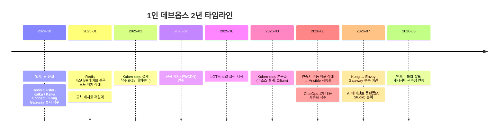

---

title: "1인 데브옵스 2년, 시간순으로 정리한다"
date: 2026-08-29
categories: [DevOps, 회고]
tags: [Kafka, KafkaConnect, Redis, RedisCluster, KongGateway, Kubernetes, Observability, ChatOps, Timeline]
layout: post
toc: true
math: true
mermaid: true

---

## 참고자료

- [Apache Kafka - Documentation](https://kafka.apache.org/documentation/)
- [Debezium - Documentation](https://debezium.io/documentation/)
- [Redis - Cluster Tutorial](https://redis.io/docs/latest/operate/oss_and_stack/management/scaling/)
- [Kong Gateway - Documentation](https://docs.konghq.com/gateway/latest/)
- [Kubernetes - Documentation](https://kubernetes.io/docs/home/)
- [Ansible - Documentation](https://docs.ansible.com/)

---

## 배경

이 블로그에 쓴 [Redis Cluster](/posts/RedisCluster/), [Compose에서 Kubernetes로 옮긴 기록](/posts/compose-to-kubernetes-migration-lessons/), [관측성](/posts/observability-otel-lgtm-alerting/), [AI 에이전트](/posts/ai-agent-for-infra-operations/) 글은 전부 기술 하나를 깊게 파는 글이었다. 이번엔 그 반대로, 무엇을 언제 왜 그 순서로 했는지를 시간순으로만 정리해본다.

입사했을 때 팀이 막 새로 만들어진 상태였고, 그 팀이 맡은 시스템에는 데이터 스트리밍 플랫폼도 원격 캐시도 컨테이너 표준도 없었다. 서버에 관리자가 직접 들어가서 애플리케이션을 손으로 올리는 방식이었다. 그래서 아래 나오는 것들은 대부분 기존 걸 고친 게 아니라 처음부터 만든 것들이다.

---

## 2024-10 ~ 2024-12: 세 가지를 동시에 시작했다

입사 전엔 개발 캠프 인턴으로 백엔드 포지션에 있었는데 실제로 맡은 일은 인프라를 구성하는 일이었다. 그게 재밌어서 입사 후 데브옵스 쪽으로 방향을 잡았고, 합류하자마자 세 가지를 거의 동시에 손댔다.

**Redis Cluster.** 원격 캐시가 없어서 클러스터를 처음 구성했다. 노드 3대에 마스터와 슬레이브를 하나씩 배치했는데, 이 배치가 몇 달 뒤 장애로 이어진다(아래 2025-01).

**Kafka와 Kafka Connect.** 데이터 스트리밍 플랫폼도 없어서 클러스터를 세우고 Kafka Connect로 CDC(Change Data Capture) 파이프라인을 붙이기 시작했다. 소스 데이터베이스의 변경을 실시간으로 토픽에 흘려보내는 구조인데, 이후 2025년 내내 연동 시스템(인사, 근태 같은 사내 업무 시스템)이 늘 때마다 커넥터가 하나씩 늘었다.

**Kong Gateway.** API 게이트웨이도 이때 관리 화면(Kong Manager)부터 구성하기 시작했다. Compose 환경에서는 컨테이너를 늘릴 때마다 이 게이트웨이에 라우트를 수동으로 추가하는 게 반복 작업의 대부분이었다는 얘기는 [이전 글](/posts/compose-to-kubernetes-migration-lessons/)에 이미 썼다.

세 가지를 동시에 시작한 이유는 단순했다. 순서를 기다릴 여유가 없었다. 신규 시스템이 계속 들어오는 상황에서 표준 미들웨어 없이는 매번 다르게 구성해야 했다.

---

## 2025-01: Redis 클러스터가 통째로 망가진 날

입사 3개월차, Redis Cluster 점검 작업 중에 클러스터 전체가 망가지는 사고가 났다. 마스터와 그 마스터의 레플리카를 같은 노드에 뒀던 게 원인이었다. 점검하려고 그 노드를 내리자 승격해야 할 레플리카까지 같이 사라지면서, 해당 슬롯 전체가 접근 불가 상태가 됐다.

이 장애를 계기로 레플리카를 다른 노드로 교차 배치하도록 다시 설계했다(1월 13일). 이 사고의 기술적 원인과 Redis Cluster의 슬롯 소유 구조는 [Redis Cluster 글](/posts/RedisCluster/)에 자세히 정리해뒀다.

지금 보면 이건 기술이 부족해서 난 사고가 아니라 속도를 우선한 대가에 가깝다. 세 가지를 동시에 세우느라 각각을 충분히 검증할 시간이 없었고, Redis가 죽으면 다른 노드가 알아서 대신 처리해줄 거라고 안일하게 가정한 채 넘어갔다. 이후로 새 미들웨어를 들일 때는 "장애 도메인이 무엇과 무엇을 분리시켜야 하는가"부터 먼저 답을 갖고 시작하게 됐다.

같은 시기 Kafka Connect 쪽에도 신규 업무 시스템 연동 커넥터가 하나씩 늘기 시작했다(1월 9일, 첫 업무 시스템 커넥터). 이 무렵부터 미들웨어를 세우는 일에서 미들웨어에 새 연동을 계속 얹는 일로 업무 성격이 조금씩 옮겨갔다.

---

## 2025-03 ~ 2025-06: Kubernetes 설계를 시작했다

3월 초, 처음으로 Kubernetes 전환 설계 문서를 만들었다("K8s draft"). 다만 서비스 전체를 한 번에 옮기지 않고 K3s 위에 배치(batch) 워크로드부터 얹었다. 상시로 트래픽을 받는 서비스보다 정해진 시각에 실행되고 끝나는 배치 작업이 리스크가 작았기 때문이다.

지금 생각해도 이 판단이 맞았던 건 컨테이너 오케스트레이션을 곧바로 전면 도입하지 않았다는 점이다. 처음 몇 달은 K3s로 개념을 검증하는 데 썼고, 본격적인 표준 Kubernetes 구축은 1년 가까이 지난 2026년 3월에야 시작했다. 그 사이 시간은 미들웨어를 넓히고 안정화하는 데 썼다.

6월에는 Kong Gateway를 로그 수집 스택과 연동했다. 이때까지도 관측성은 상용 APM(Dynatrace) 하나에 의존하고 있었다.

---

## 2025-07 ~ 2025-09: 새 시스템을 통째로 넘겨받았다

7월부터 팀이 새로운 시스템 하나를 통째로 넘겨받았다. 게임 서비스의 클라이언트 다운로드와 패치 파일을 서빙하는 CDN 성격의 캐시서버였다. 앞선 세 가지(Redis, Kafka, Kong)와 달리 이건 처음부터 설계한 게 아니라 운영을 이어받은 시스템이라 성격이 완전히 달랐다.

Nginx 기반으로 캐시 정책(cache_lock, lock_timeout, lock_age 같은 옵션)을 서버마다 손으로 맞추는 방식이었고, 인증서도 이 서버들에 별도로 발급해야 했다. 이 시스템은 2026년 8월에야 관측성 스택(LGTM)에 연동되고 전용 알림 규칙이 생긴다. 새로 만든 시스템은 처음부터 관측성을 얹지만 넘겨받은 레거시 시스템은 관측성이 뒤늦게 따라붙는다는 걸 이때 체감했다.

같은 시기 Kafka Connect에서는 커넥터 버그(특정 연동 데이터의 필드 매핑 오류)를 수정하는 작업도 있었다. CDC 파이프라인이 늘어날수록 커넥터 하나가 깨지면 그 뒤 시스템 전체가 오래된 데이터를 보게 되는 리스크도 같이 늘었다.

---

## 2025-10 ~ 2026-02: 관측성 전환은 실험에서 멈췄다

10월, 로컬 환경에서 LGTM 스택(Loki, Grafana, Tempo, Mimir)을 처음 실험해봤다. 실서비스에 붙이기까지는 아직 넉 달이 더 걸렸다. 상용 APM을 걷어내는 결정은 라이선스 비용(연 억 단위)이 쌓여야 무게가 실리는 결정이라 근거를 모으는 데 시간이 필요했다.

이 공백기 동안 다이나트레이스와 Kibana 로그 시스템을 병행 운영하면서 실제로 겪은 문제, 지표와 로그가 나뉘어 있어 연쇄 장애 사후 분석이 안 됐던 경험이 [관측성 글](/posts/observability-otel-lgtm-alerting/)에 쓴 전환 계기다.

---

## 2026-03 ~ 2026-05: Kubernetes 본구축

3월, 공식 문서를 근거로 리소스 할당 정책(requests/limits)을 다시 설계했다. K3s로 배치만 돌리던 것과 달리 이때부터는 상시 서비스를 올릴 클러스터를 실제로 만들기 시작했다.

5월에는 Cilium을 CNI로 선택하고 노드 네트워크 설정(rp_filter, firewalld)을 맞췄다. 이 시기 겪은 CiliumNetworkPolicy의 알려진 결함(네임스페이스와 Pod selector 조합이 정책 반영에서 누락되는 문제)과 회피 방법은 [Compose→K8s 이관 글](/posts/compose-to-kubernetes-migration-lessons/)에 정리했다.

---

## 2026-06: 인증서 사고와 그 뒤에 만든 것들

6월, 인증서를 서버 두 대에 사람이 직접 복사하다가 한 대는 파일 권한 오류로, 한 대는 짝이 안 맞는 인증서로 배포되면서 게이트웨이 전면이 다운되는 사고가 났다. 원인의 결이 2025-01 Redis 사고와 같다. 사람이 반복 작업을 손으로 하다가 생긴 실수였다.

이 사고 하나로 그 뒤 두 달의 작업 방향이 정해졌다.

- 인증서 배포를 Ansible 플레이북으로 코드화하고, 잘못되면 직전 상태로 즉시 되돌릴 수 있게 만들었다.
- 같은 달, 알림 체계를 실측 기반 임계치로 재설계했다.
- 알림이 오면 사람이 대시보드를 열기 전에 원인 후보를 먼저 요약해주는 ChatOps 자동화(MIS-ChatOps)에 착수했다(6월 22일).

손으로 하던 반복 작업이 두 번의 큰 장애를 냈고, 두 번 다 그 직후에 자동화로 이어졌다. 사전에 설계로 막았어야 할 걸 사후에 자동화로 메운 셈이다.

---

## 2026-07: 게이트웨이를 손보고 새 인프라를 하나 더 지었다

7월 13일, 남아있던 Kong Gateway 경로 일부를 Envoy Gateway(Gateway API)로 이관했다. 처음 시도가 문제를 일으켜 되돌렸다가, 원인(헤더 이중 처리)을 고치고 다시 적용했다. 무중단 배포를 둘러싼 판단과 이 게이트웨이 전환의 자세한 내용은 [Compose→K8s 이관 글](/posts/compose-to-kubernetes-migration-lessons/)에 있다.

같은 달, 성격이 다른 작업도 시작했다. 팀 전체가 LLM 에이전트를 쓰기 시작하면서 LLM/MCP 트래픽을 위한 별도 플랫폼(AI Studio)을 기존 클러스터와 노드풀, 네임스페이스를 분리해 새로 지었다. 이 게이트웨이를 고르는 과정에서 두 오픈소스 프로젝트를 직접 벤치마크한 내용은 [AI 에이전트 글](/posts/ai-agent-for-infra-operations/)에 정리했다.

7월 26일에는 지금까지의 전환 과정을 팀 내부에 공유하는 자료를 만들었다. 이 글에 쓴 KPI 수치(반복 작업 시간 75~100% 절감, 장애를 감지하고 복구하는 시간이 30분대에서 수십 초로 단축)가 그 자료에서 나온 실측치다.

---

## 2026-08: 지금

2025년 7월에 넘겨받았던 캐시서버가 관측성 스택에 연동됐다(8월 19일). 넘겨받은 지 1년 만이다. 새로 만든 시스템은 태어날 때부터 관측성을 갖지만 넘겨받은 시스템은 그 격차를 메우는 데 그만큼 시간이 걸린다는 걸 다시 확인했다.

이 글을 쓰면서 느낀 게 하나 있다. 지난 2년은 동작하게 만드는 것에 집중한 시간이었다. MetalLB, kube-proxy, CNI의 역할 구분이나 `docker stop`이 보내는 시그널처럼, 이미 손으로 다뤄본 것도 막상 남에게 설명하려면 막히는 지점들이 있었다. 도구를 설정할 줄 아는 것과 원리를 이해하는 것 사이의 격차인데, 이건 별도로 정리해뒀다.

---

## 정리하면

시간순으로 늘어놓고 보니 몇 가지가 뚜렷하게 보인다.

**장애가 두 번, 자동화가 두 번이었다.** Redis 사고 뒤에 교차 배치와 관측성 강화가 따라왔고, 인증서 사고 뒤에 Ansible 자동화와 ChatOps가 따라왔다. 다음에는 이 순서를 뒤집어야 한다.

**새로 짓는 것과 이어받는 것은 완전히 다른 일이다.** Redis, Kafka, Kong, Kubernetes는 처음부터 설계했고, 캐시서버(CDN)는 넘겨받았다. 이어받은 시스템에 표준(관측성, 인증서 자동화)을 뒤늦게 입히는 일이 훨씬 오래 걸렸다. 설계는 한 번이지만 이관은 기존 습관과 계속 부딪힌다.

**속도와 검증은 트레이드오프였다.** 세 가지를 동시에 시작한 것 자체는 지금도 맞는 판단이라고 본다. 다만 각각을 충분히 검증하지 않고 넘어간 부분이 결국 장애로 돌아왔다. 지금 새 시스템을 들일 때 장애 도메인 분리와 손으로 하는 반복 작업이 있는지를 먼저 체크하는 이유가 여기서 나왔다.
