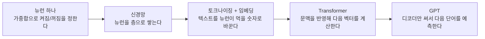
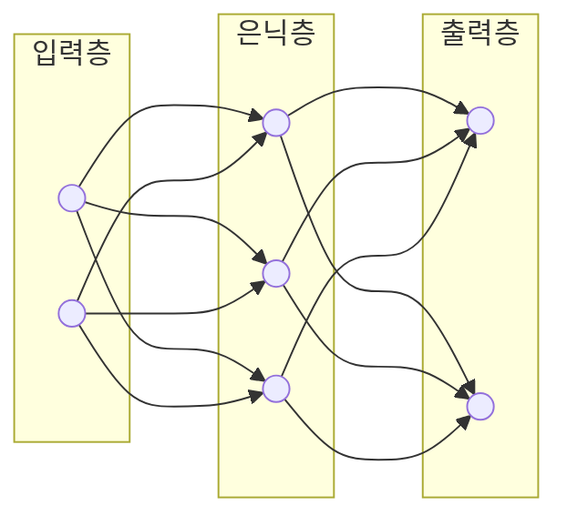
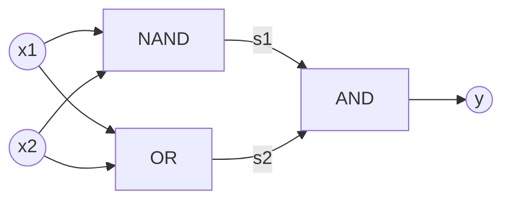
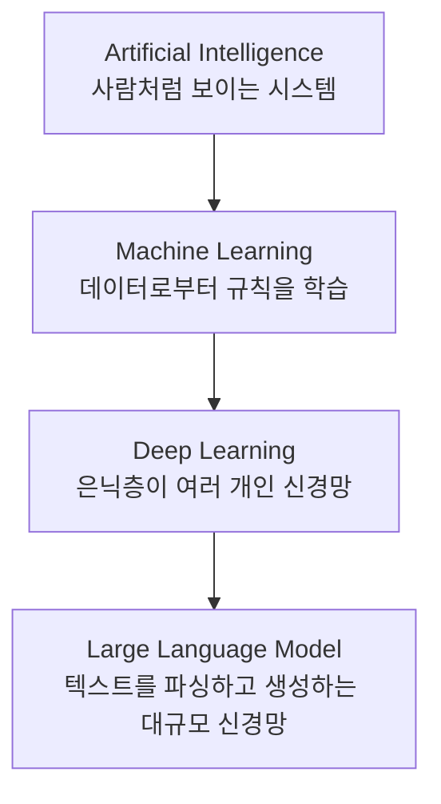

---

title: "퍼셉트론과 선형분리, 그리고 신경망이 LLM 구조로 이어지는 흐름"
date: 2026-09-02
categories: [AI, DeepLearning]
tags: [Perceptron, NeuralNetwork, LLM, Transformer, Tokenizing, Embedding]
layout: post
toc: true
math: true
mermaid: true

---

## 참고자료

- 사이토 고키, 『밑바닥부터 시작하는 딥러닝 1』(한빛미디어) - 2장 퍼셉트론, 3장 신경망
- Sebastian Raschka, [Build a Large Language Model (From Scratch)](https://github.com/rasbt/LLMs-from-scratch) (Manning)
- Vaswani et al., ["Attention Is All You Need"](https://arxiv.org/abs/1706.03762) (2017)
- [Perceptron - Wikipedia](https://en.wikipedia.org/wiki/Perceptron)

---

## 배경

생성형 AI 서비스 개발 실무 교육 1일차 자료가 퍼셉트론에서 시작했다. AND, OR, NAND, NOR 게이트를 퍼셉트론으로 구현하는 예제였는데, XOR 게이트 칸만 가중치와 임계값이 물음표로 남아 있었다.

여기서 막혔다. 게이트 넷 다 0과 1만 출력하는 건 똑같은데 왜 XOR만 안 되는지 감이 안 왔고, "퍼셉트론이 곧 신경망의 최소 단위"라는 말도 처음엔 이해가 안 갔다.

정리하면서 확인하고 싶었던 것들이다.

- 퍼셉트론이 뭔데, AND 게이트 같은 논리 회로와는 뭐가 다른가
- 퍼셉트론 하나가 신경망이라는 말은 무슨 뜻인가
- AND, OR, NAND는 되는데 XOR만 안 되는 이유가 뭔가
- XOR은 그럼 어떻게 만드는가
- 이 개념이 실제 LLM 구조로 어떻게 이어지는가

---

## 큰 그림

먼저 전체 지도를 펴놓는다. 지금 다루는 개념은 결국 이 다섯 칸을 순서대로 채우는 이야기다.



뉴런 하나(퍼셉트론)가 왜 혼자서는 부족한지가 첫 번째 칸이고, 그 부족함을 층을 쌓아 메운 것이 두 번째 칸이다. 세 번째 칸부터는 그 신경망에 텍스트를 태우는 방법이고, 그 끝에 GPT가 있다. 아래 절은 이 순서대로 하나씩 채운다.

---

## 1. 퍼셉트론은 게이트가 아니라 게이트를 흉내 내는 함수다

퍼셉트론은 입력 여러 개를 받아 가중치를 곱해 더하고, 그 합이 임계값을 넘는지로 0 또는 1을 내보내는 함수다.

$$
y = \begin{cases} 0 & (w_1x_1 + w_2x_2 \le \theta) \\ 1 & (w_1x_1 + w_2x_2 > \theta) \end{cases}
$$

- $x_1, x_2$: 입력
- $w_1, w_2$: 가중치, 입력마다 얼마나 중요한지
- $\theta$: 임계값, 이 값을 넘어야 켜진다

코드로 옮기면 이렇다.

```python
class Perceptron:
    def __init__(self, w1, w2, theta):
        self.w1 = w1
        self.w2 = w2
        self.theta = theta

    def run(self, x1, x2):
        tmp = x1 * self.w1 + x2 * self.w2
        return 1 if tmp > self.theta else 0
```

AND, OR, NAND는 이 구조 하나에 숫자만 바꿔서 만든다. AND 게이트를 예로 들면, 네 가지 입력 조합이 각각 만족해야 하는 부등식을 세우고 그걸 동시에 만족하는 $w_1, w_2, \theta$를 하나 찾으면 된다.

| $x_1$ | $x_2$ | $y$ | 조건 |
|---|---|---|---|
| 0 | 0 | 0 | $0 \le \theta$ |
| 0 | 1 | 0 | $w_2 \le \theta$ |
| 1 | 0 | 0 | $w_1 \le \theta$ |
| 1 | 1 | 1 | $w_1 + w_2 > \theta$ |

$w_1 = w_2 = 0.5$, $\theta = 0.7$이면 네 조건이 전부 성립한다. OR는 $\theta$를 낮추면 되고, NAND는 부호를 전부 뒤집으면 된다.

이 규칙을 왜 if-else로 하드코딩하지 않고 굳이 가중치와 임계값이라는 숫자로 표현하는가. if-else로 짜면 조건이 하나 바뀔 때마다 사람이 코드를 다시 써야 한다. 퍼셉트론은 $w_1, w_2, \theta$ 숫자 세 개만 조절하면 되는 형태라서, 이 숫자를 사람이 손으로 정하지 않고 데이터로부터 찾아내는 학습이 가능해진다. **AND 게이트와 퍼셉트론의 차이가 여기서 드러난다.** 게이트는 회로로 동작이 고정돼 있고, 퍼셉트론은 숫자 세 개로 AND도 OR도 NAND도 될 수 있는 조절 가능한 함수다.

---

## 2. 뉴런을 여러 개 쌓으면 신경망이 된다

1절의 퍼셉트론 하나는 신경망이 아니라 신경망을 이루는 뉴런 하나다. 그 뉴런을 여러 개, 여러 층으로 엮은 것을 신경망이라 부른다.

실제 뉴런에는 두 가지가 더 붙는다.

**편향(bias).** 임계값 $\theta$를 좌변으로 이항하면 $w_1x_1 + w_2x_2 + b > 0$ 형태가 된다. $b$가 편향이고, 얼마나 쉽게 켜지는가를 조절하는 역할을 한다.

**활성화 함수(activation function).** 가중합 이후에 씌우는 함수다. 원래 퍼셉트론이 쓰는 계단 함수(step)를 왜 그대로 안 쓰는가. 계단 함수는 0 아니면 1만 나오고 기울기가 없어서, 오차를 거꾸로 흘려보내 가중치를 조금씩 고치는 경사하강법을 적용할 수 없다. 그래서 기울기가 있는 시그모이드(sigmoid)나 ReLU를 쓴다. 그 결과로 뉴런의 출력을 미분할 수 있게 되고, 이게 신경망을 자동으로 학습시킬 수 있는 전제가 된다.

$$
a = w_1x_1 + w_2x_2 + b, \quad y = h(a)
$$

이 뉴런을 입력층, 은닉층, 출력층으로 쌓으면 신경망이 된다.



지금 다루는 GPT 같은 거대 LLM도 뜯어보면 이 가중합 계산을 하는 뉴런이 수천억 개 쌓여 있는 구조다. "70B 모델"이라는 말은 저 $w$ 값, 즉 파라미터가 700억 개 있다는 뜻이다. 복잡해 보이는 모델도 재료 자체는 1절의 퍼셉트론과 다르지 않고, 개수와 층수가 다를 뿐이다.

---

## 3. AND, OR, NAND는 되는데 XOR만 안 되는 이유

넷 다 0과 1만 출력하는 건 같다. 차이는 **입력 네 점 중에서 1인 점과 0인 점을 직선 하나로 갈라놓을 수 있는가**에 있다.

$x_1, x_2$를 사각형 네 꼭짓점이라고 하고, 출력값을 점 옆에 적어보면 이렇게 된다.

| | $x_1=0$ | $x_1=1$ |
|---|---|---|
| $x_2=1$ | AND 0 / OR 1 / NAND 1 / XOR 1 | AND 1 / OR 1 / NAND 0 / XOR 0 |
| $x_2=0$ | AND 0 / OR 0 / NAND 1 / XOR 0 | AND 0 / OR 1 / NAND 1 / XOR 1 |

AND는 1인 점이 $(1,1)$ 하나뿐이라 그 구석만 잘라내는 직선 하나로 나머지 셋과 갈라진다. OR는 0인 점이 $(0,0)$ 하나뿐이라 마찬가지고, NAND는 AND와 경계선이 같고 어느 쪽을 1로 보는가만 반대다. 셋 다 1인 점들이 한쪽에 뭉쳐 있다.

XOR은 1인 점 $(0,1), (1,0)$과 0인 점 $(0,0), (1,1)$이 서로 대각선으로 마주보고 있다. 두 대각선은 사각형 한가운데서 교차하는데, 그 교차점을 사이에 두고 한쪽 대각선의 두 점만 같은 편에 놓는 직선은 그릴 수 없다. 이 성질을 선형 분리 가능성(linear separability)이라 부르고, XOR은 선형 분리가 안 되는 첫 사례다.

가중합을 아무리 조절해도 직선 하나로 표현되는 경계밖에 못 그리기 때문에, 단일 퍼셉트론으로는 XOR에 대응하는 $w_1, w_2, \theta$가 존재하지 않는다. 실제로 네 조건을 부등식으로 세워보면 서로 모순이 나서 해가 없다.

이 문제를 사람이 직접 특징을 조합해서 풀 수도 있다. 예를 들어 "$x_1$과 $x_2$가 다르면 1"이라는 특징을 미리 계산해서 넣어주면 퍼셉트론 하나로도 된다. 문제는 이런 조합을 매번 사람이 손으로 설계해야 한다는 것이고, 다음 절에서 보는 다층 구조는 그 설계를 신경망이 알아서 학습하게 만든다.

---

## 4. XOR은 어떻게 만드는가, 스위치를 두 번 거친다

직선 하나로 안 되면 퍼셉트론을 층으로 쌓아서 우회한다. NAND와 OR을 먼저 통과시켜 각각 다른 경계선을 그은 다음, 그 결과 두 개를 AND로 다시 합친다.

$$
s_1 = \text{NAND}(x_1, x_2), \quad s_2 = \text{OR}(x_1, x_2), \quad y = \text{AND}(s_1, s_2)
$$



| $x_1$ | $x_2$ | $s_1$(NAND) | $s_2$(OR) | $y$(AND) |
|---|---|---|---|---|
| 0 | 0 | 1 | 0 | 0 |
| 0 | 1 | 1 | 1 | 1 |
| 1 | 0 | 1 | 1 | 1 |
| 1 | 1 | 0 | 1 | 0 |

XOR 진리표와 정확히 일치한다. 은닉층 하나(NAND, OR)를 거쳐 출력층(AND)에서 합치는 이 구조가 다층 퍼셉트론(MLP)이고, 3절에서 말한 "사람이 손으로 특징을 설계하는" 일을 층 하나를 늘리는 것으로 대신했다. 1969년 민스키와 페퍼트가 단일 퍼셉트론의 XOR 한계를 증명하면서 1차 AI 겨울이 왔고, 1986년 오차 역전파로 다층 구조의 학습이 가능해지면서 이 접근이 다시 주목받았다.

---

## 5. 이 구조가 LLM까지 어떻게 이어지는가

AI, ML, DL, LLM은 포함 관계로 정리된다.



GenAI는 이 신경망으로 텍스트, 이미지 등 새 콘텐츠를 만들어내는 활용 범주이고, LLM은 그중 텍스트를 다루는 신경망이다. 2절의 신경망이 결국 GPT 계열 LLM의 몸통이라는 뜻이다.

**신경망은 숫자만 먹는데 텍스트는 문자다.** 그래서 텍스트를 토큰 단위로 쪼개고 정수 ID로 바꾼 다음, 그 ID를 다시 실수 벡터(임베딩)로 바꿔서 신경망에 넣는다. 단어 전체를 통째로 사전에 담는 방식도 있지만, 그러면 사전에 없는 단어가 나올 때마다 처리할 방법이 없다. BPE(Byte Pair Encoding)는 사전에 없는 단어를 더 작은 하위 단어나 개별 문자로 쪼개서 처리하기 때문에, 미등록 단어를 위한 별도 토큰이 따로 필요 없다. 의미가 비슷한 단어는 이 벡터 공간에서 가까운 위치에 놓인다는 것이 임베딩의 핵심이고, 여기 쓰이는 가중치 행렬도 2절에서 말한 파라미터의 일부다.

**그 벡터를 신경망이 어떻게 다루는가.** 이전 방식은 문장을 한 단어씩 순서대로 읽는 구조(RNN)였다. 순서대로 읽어야 해서 병렬 계산이 어렵고, 문장이 길어지면 앞쪽 단어의 정보가 뒤로 갈수록 희미해지는 문제가 있었다. Transformer는 인코더가 입력 텍스트 전체를 한 번에 보고 문맥을 담은 임베딩을 만들고, 디코더가 그 임베딩을 받아 한 단어씩 출력을 만드는 구조다. BERT는 인코더만 써서 문장 중간에 가려진 단어를 맞히도록 학습하고(텍스트 분류, 감성 예측에 적합), GPT는 디코더만 써서 다음 단어를 예측하도록 학습한다(텍스트 생성에 적합).

**다음 단어 예측만으로 번역까지 되는 이유.** GPT는 번역을 위해 설계된 모델이 아니라 다음 단어 예측만 훈련받은 모델인데, 그 훈련만으로 번역, 요약 같은 능력이 명시적 지시 없이 나타난다. 이걸 창발적 행동(emergent behavior)이라 부른다. 학습 목표를 다음 단어 예측 하나로 단순화한 덕분에, 작업마다 별도 모델을 만들지 않아도 데이터와 파라미터 규모를 키우는 것만으로 여러 작업에 대응하는 능력이 따라왔다.

---

## 덧붙여, 실습에서 쓰는 도구들

1일차 후반부는 개념보다 실습 환경 소개였다. 질문으로 던지진 않았지만 세션 내용이라 짧게 남긴다.

- **Hugging Face**: 모델과 데이터셋을 올려두는 허브. 직접 학습시키지 않아도 API나 로컬에서 바로 추론을 돌려볼 수 있다.
- **OpenAI, Google GenAI**: 각 사가 제공하는 LLM API. SDK 설치 후 몇 줄로 채팅, 임베딩, 이미지 생성을 호출한다.
- **LangChain**: LLM 기반 애플리케이션을 조립하는 프레임워크. Chat Model(모델 호출 인터페이스), Message(역할별 대화 메시지), Prompt Template(재사용 가능한 프롬프트), Structured Output(정해진 JSON 형태로 응답 강제), LCEL(`prompt | model | parser`처럼 컴포넌트를 파이프로 연결하는 선언형 표현식), Tool Calling(모델이 외부 API나 함수를 스스로 판단해서 호출)이 기본 컴포넌트다.

LLM 혼자서는 실시간 데이터에 접근하지 못하고, 수학 계산에 약하고, 환각이 나기 때문에, Tool Calling으로 외부 도구와 묶어 쓰는 것이 실무 구성의 기본 전제였다. 위 큰 그림 지도에는 없지만, GPT 다음에 자연스럽게 붙는 조각이다.

---

## 정리하며

처음 던진 질문들에 대한 답이다.

**퍼셉트론이 뭔데 AND 게이트와 뭐가 다른가.** 게이트는 회로로 동작이 고정돼 있고, 퍼셉트론은 가중치와 임계값 세 숫자로 AND도 OR도 NAND도 될 수 있는 조절 가능한 함수다.

**퍼셉트론 하나가 신경망이라는 말이 무슨 뜻인가.** 정확히는 신경망의 최소 단위인 뉴런 하나다. 이 단위에 편향과 활성화 함수를 더하고 여러 층으로 쌓으면 신경망이 되고, 거대 LLM도 같은 단위가 수천억 개 쌓인 구조다.

**AND, OR, NAND는 되는데 XOR만 안 되는 이유.** 넷 다 이진 출력이라는 점은 같지만, 1인 점과 0인 점의 배치가 직선 하나로 갈리는가가 갈린다. XOR은 두 대각선이 서로 다른 값을 가져서 직선 하나로 못 가른다.

**XOR은 어떻게 만드는가.** NAND와 OR을 먼저 거쳐 각자 다른 경계선을 긋고, 그 결과를 AND로 다시 합친다. 층 하나를 늘려서 선형 분리 문제를 우회한 것이 다층 퍼셉트론이다.

**이 개념이 LLM으로 어떻게 이어지는가.** 텍스트를 토큰과 임베딩으로 바꿔 신경망에 넣고, Transformer가 그 벡터에 문맥을 반영하고, GPT는 그중 디코더만 써서 다음 단어 예측 하나로 학습한다. 그 단순한 목표에서 번역 같은 창발적 능력이 나온 것이 이번 자료에서 제일 인상적이었던 부분이다.

큰 그림으로 돌아가면, 뉴런에서 시작해 신경망으로, 텍스트를 숫자로 바꾸는 토크나이징과 임베딩을 거쳐, Transformer와 GPT까지 다섯 칸이 전부 채워졌다. 토크나이징, 임베딩, LangChain 컴포넌트는 아직 손으로 돌려본 게 아니라서 다음 실습 노트북에서 직접 확인하고 정리할 생각이다.
