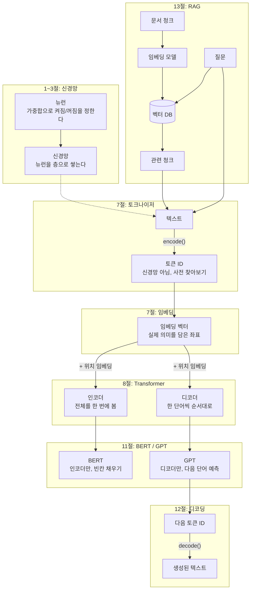
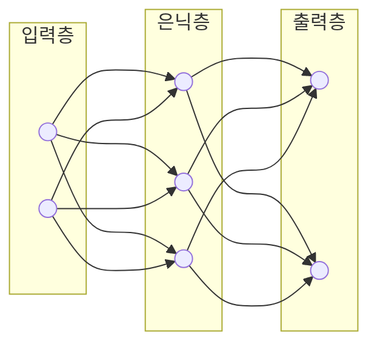
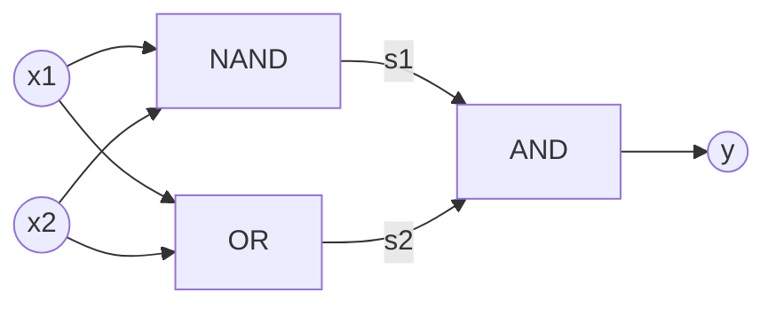
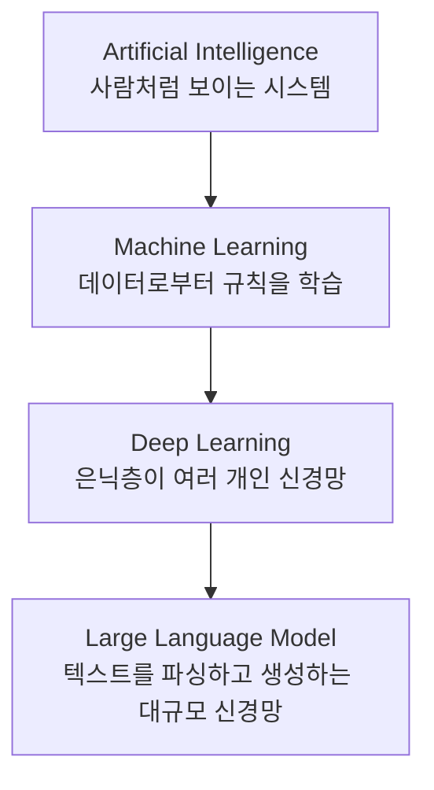
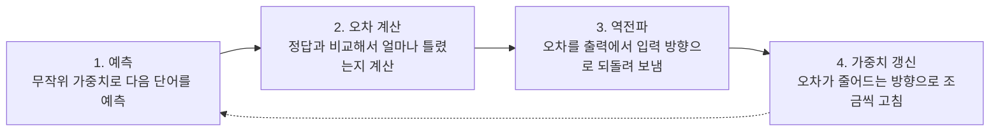
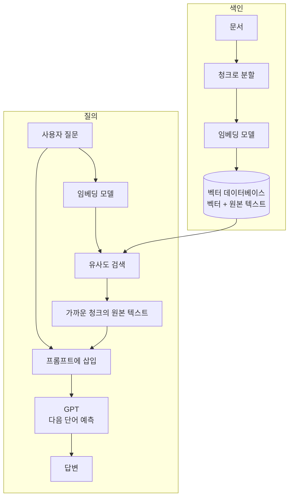

---

title: "가중치에서 LLM까지, 신경망이 텍스트를 배우는 흐름"
date: 2026-09-02
categories: [AI, DeepLearning]
tags: [Perceptron, NeuralNetwork, LLM, Transformer, Tokenizing, Embedding, RAG]
layout: post
toc: true
math: true
mermaid: true

---

## 참고자료

- 사이토 고키, 『밑바닥부터 시작하는 딥러닝 1』(한빛미디어) - 2장 퍼셉트론, 3장 신경망
- Sebastian Raschka, [Build a Large Language Model (From Scratch)](https://github.com/rasbt/LLMs-from-scratch) (Manning)
- Vaswani et al., ["Attention Is All You Need"](https://arxiv.org/abs/1706.03762) (2017)
- [Perceptron - Wikipedia](https://en.wikipedia.org/wiki/Perceptron)
- [Lucene과 역 인덱스에 관한 글](/posts/ElasticSearch/) (이 블로그의 이전 글)
- Lewis et al., ["Retrieval-Augmented Generation for Knowledge-Intensive NLP Tasks"](https://arxiv.org/abs/2005.11401) (2020)

---

## 배경

생성형 AI 서비스 개발 실무 교육 1일차 자료가 퍼셉트론에서 시작했다. AND, OR, NAND, NOR 게이트를 퍼셉트론으로 구현하는 예제였는데, XOR 게이트 칸만 가중치와 임계값이 물음표로 남아 있었다.

여기서 막혔다. "가중치"라는 말부터 뭘 가중한다는 건지 감이 안 왔고, 게이트 넷 다 0과 1만 출력하는 건 똑같은데 왜 XOR만 안 되는지도 이해가 안 갔다. 뒤로 가면서 LLM까지 이어 보려니 토크나이징, 임베딩, Transformer, 학습 과정, 파라미터 수 쪽에서도 막히는 지점이 계속 나왔다.

질문이 나온 순서와 상관없이, 이해에 필요한 순서대로 정리했다.

- 가중치란 정확히 뭘 가중한다는 건가
- 퍼셉트론이 뭔데, AND 게이트 같은 논리 회로와는 뭐가 다른가
- 퍼셉트론 하나가 신경망이라는 말은 무슨 뜻인가
- AND, OR, NAND는 되는데 XOR만 안 되는 이유가 뭔가
- XOR은 그럼 어떻게 만드는가
- 이 신경망이 왜 LLM으로 이어지는가
- 텍스트는 신경망에 어떻게 들어가는가
- 그 벡터를 신경망이 어떻게 다루는가
- 이 가중치들은 학습 과정에서 정확히 어떻게 정해지는가
- 파라미터가 늘어난다는 건 정확히 뭐가 늘어난다는 건가
- 인코더와 디코더를 어떻게 쓰느냐로 모델이 왜 갈리는가
- 다음 단어 예측만으로 번역까지 되는 이유가 뭔가
- 우리가 가진 문서를 벡터 데이터베이스에 넣어 RAG로 쓰는 것은 임베딩과 무슨 관계인가

---

## 큰 그림

먼저 전체 지도를 펴놓는다. 텍스트 한 문장이 신경망을 통과해 다시 텍스트로 나오기까지, 실제로 거치는 칸을 전부 그린다.



가중치 하나(1절)가 모여 뉴런이 되고, 뉴런이 쌓여 신경망이 된다(1~3절)는 게 지도의 왼쪽 절반이다. 7절에서 텍스트를 토큰 ID로, 다시 임베딩 벡터로 바꾸고 나서야 8절의 Transformer(진짜 신경망)에 들어간다. 인코더만 쓰면 11절의 BERT, 디코더만 쓰면 GPT가 되고, GPT가 뱉은 다음 토큰은 12절에서 다시 텍스트로 돌아온다. 13절의 RAG는 이 파이프라인에 들어가기 전 단계로, 질문과 검색된 문맥이 합쳐져 텍스트 자리로 들어간다.

4~6절, 9~10절은 이 지도 위에 별도 칸으로 없다. 왜 층을 쌓아야 하는지(4~5절), 신경망이 왜 LLM으로 이어지는지(6절), 이 가중치들이 어떻게 정해지는지(9절), 파라미터가 늘어나면 뭐가 커지는지(10절)를 설명하는 절이라, 칸과 칸 사이를 메우는 절이지 파이프라인의 칸 자체는 아니기 때문이다. 아래 절은 이 지도를 순서대로 채운다.

---

## 1. 가중치란 무엇인가

"가중"은 더할 가(加), 무거울 중(重), 무게를 더한다는 뜻이다. 뭘 가중하냐면, **입력값 하나하나에 매기는 중요도를 가중한다.**

가장 익숙한 예가 성적 계산이다. "중간고사 30%, 기말고사 70%"로 평균 내는 걸 가중평균이라 부른다. 이때 30%와 70%가 가중치다. 두 점수를 그냥 똑같이 더하는 게 아니라, 각 점수에 서로 다른 비중을 곱한 다음 더한다.

$$
\text{가중평균} = (\text{중간고사} \times 0.3) + (\text{기말고사} \times 0.7)
$$

신경망의 계산도 같은 형태다.

$$
y = (x_1 \times w_1) + (x_2 \times w_2) + b
$$

$x_1, x_2$는 입력값이고, $w_1, w_2$는 각 입력에 매겨진 비중, 즉 가중치다. $w_1$이 크면 $x_1$이 결과에 큰 영향을 주고, $w_1$이 0에 가까우면 $x_1$은 거의 무시된다. 여러 입력을 똑같이 취급하지 않고 입력마다 다른 무게를 매겨서 반영하는 것, 이게 "가중한다"의 정확한 뜻이다. $b$는 편향이라 부르는데, 입력과 무관하게 결과를 얼마나 쉽게 키우거나 줄이는지를 조절하는 별도의 숫자다.

학습이란 결국 이 $w_1, w_2, b$ 같은 숫자들을 데이터를 보면서 알맞은 값으로 조정해나가는 과정이다. 이 조정 과정은 9절에서 자세히 본다.

---

## 2. 퍼셉트론이란?

퍼셉트론은 입력 여러 개를 받아 가중치를 곱해 더하고, 그 합이 임계값을 넘는지로 0 또는 1을 내보내는 함수다.

$$
y = \begin{cases} 0 & (w_1x_1 + w_2x_2 \le \theta) \\ 1 & (w_1x_1 + w_2x_2 > \theta) \end{cases}
$$

$\theta$가 임계값이다. 이 값을 넘어야 켜진다. 코드로 옮기면 이렇다.

```python
class Perceptron:
    def __init__(self, w1, w2, theta):
        self.w1 = w1
        self.w2 = w2
        self.theta = theta

    def run(self, x1, x2):
        tmp = x1 * self.w1 + x2 * self.w2
        return 1 if tmp > self.theta else 0
```

AND, OR, NAND는 이 구조 하나에 숫자만 바꿔서 만든다. AND 게이트를 예로 들면, 네 가지 입력 조합이 각각 만족해야 하는 부등식을 세우고 그걸 동시에 만족하는 $w_1, w_2, \theta$를 하나 찾으면 된다.

| $x_1$ | $x_2$ | $y$ | 조건 |
|---|---|---|---|
| 0 | 0 | 0 | $0 \le \theta$ |
| 0 | 1 | 0 | $w_2 \le \theta$ |
| 1 | 0 | 0 | $w_1 \le \theta$ |
| 1 | 1 | 1 | $w_1 + w_2 > \theta$ |

$w_1 = w_2 = 0.5$, $\theta = 0.7$이면 네 조건이 전부 성립한다. OR는 $\theta$를 낮추면 되고, NAND는 부호를 전부 뒤집으면 된다.

이 규칙을 왜 if-else로 하드코딩하지 않고 굳이 가중치와 임계값이라는 숫자로 표현하는가. if-else로 짜면 조건이 하나 바뀔 때마다 사람이 코드를 다시 써야 한다. 퍼셉트론은 숫자 세 개만 조절하면 되는 형태라서, 이 숫자를 사람이 손으로 정하지 않고 데이터로부터 찾아내는 학습이 가능해진다. **AND 게이트와 퍼셉트론의 차이가 여기서 드러난다.** 게이트는 회로로 동작이 고정돼 있고, 퍼셉트론은 숫자 세 개로 AND도 OR도 NAND도 될 수 있는 조절 가능한 함수다.

---

## 3. 신경망이란?

2절의 퍼셉트론 하나는 신경망이 아니라 신경망을 이루는 뉴런 하나다. 그 뉴런을 여러 개, 여러 층으로 엮은 것을 신경망이라 부른다.

실제 뉴런에는 활성화 함수가 하나 더 붙는다. 가중합 이후에 씌우는 함수다. 원래 퍼셉트론이 쓰는 계단 함수(step)를 왜 그대로 안 쓰는가. 계단 함수는 0 아니면 1만 나오고 기울기가 없어서, 오차를 거꾸로 흘려보내 가중치를 조금씩 고치는 경사하강법을 적용할 수 없다. 그래서 기울기가 있는 함수로 바꾼다. 시그모이드(sigmoid)는 입력이 아무리 작거나 커도 출력을 0과 1 사이로 완만한 S자 곡선을 그리며 눌러 담는 함수고, ReLU는 입력이 0보다 작으면 0을, 0보다 크면 입력을 그대로 내보내는 더 단순한 함수다.

$$
a = w_1x_1 + w_2x_2 + b, \quad y = h(a)
$$

이 뉴런을 층으로 쌓으면 신경망이 된다. 층은 역할에 따라 세 가지로 나뉜다.

- **입력층(input layer)**: 원본 데이터가 그대로 들어오는 층. 계산은 하지 않고 값을 다음 층으로 넘기기만 한다.
- **은닉층(hidden layer)**: 입력층과 출력층 사이에 있는 층. 가중합과 활성화 함수를 거쳐 입력을 조합하고 변형하는 실질적인 계산이 여기서 일어난다. 은닉층이 하나면 얕은 신경망, 여러 개면 심층 신경망(deep neural network)이라 부르고, 딥러닝의 "딥"이 이 은닉층 개수를 가리킨다.
- **출력층(output layer)**: 최종 결과를 내보내는 층. 몇 개의 범주로 분류하느냐, 숫자를 예측하느냐에 따라 뉴런 개수와 활성화 함수가 달라진다.

아래 그림에서 왼쪽이 입력층, 가운데가 은닉층, 오른쪽이 출력층이다. 뒤에서 다룰 XOR 예시로 보면, NAND와 OR을 계산하는 부분이 은닉층이고 그 결과를 AND로 합치는 부분이 출력층에 해당한다.



뉴런마다 자기만의 $w$, $b$를 갖는다. 뉴런이 100개면 조절 가능한 숫자(가중치와 편향)도 그만큼 늘어난다. **이 조절 가능한 숫자 전체를 파라미터라고 부른다.** 뉴런 하나의 가중치 두세 개도 파라미터고, GPT 같은 LLM의 700억 개도 같은 종류의 숫자다. 개수만 다르다. 정확히 뭐가 얼마나 늘어나는지는 10절에서 자세히 본다.

---

## 4. 선형분리란?

넷 다 0과 1만 출력하는 건 같다. 차이는 **입력 네 점 중에서 1인 점과 0인 점을 직선 하나로 갈라놓을 수 있는가**에 있다.

$x_1, x_2$를 사각형 네 꼭짓점이라고 하고, 출력값을 점 옆에 적어보면 이렇게 된다.

| | $x_1=0$ | $x_1=1$ |
|---|---|---|
| $x_2=1$ | AND 0 / OR 1 / NAND 1 / XOR 1 | AND 1 / OR 1 / NAND 0 / XOR 0 |
| $x_2=0$ | AND 0 / OR 0 / NAND 1 / XOR 0 | AND 0 / OR 1 / NAND 1 / XOR 1 |

AND는 1인 점이 $(1,1)$ 하나뿐이라 그 구석만 잘라내는 직선 하나로 나머지 셋과 갈라진다. OR는 0인 점이 $(0,0)$ 하나뿐이라 마찬가지고, NAND는 AND와 경계선이 같고 어느 쪽을 1로 보는가만 반대다. 셋 다 1인 점들이 한쪽에 뭉쳐 있다.

XOR은 1인 점 $(0,1), (1,0)$과 0인 점 $(0,0), (1,1)$이 서로 대각선으로 마주보고 있다. 두 대각선은 사각형 한가운데서 교차하는데, 그 교차점을 사이에 두고 한쪽 대각선의 두 점만 같은 편에 놓는 직선은 그릴 수 없다. 이 성질을 선형 분리 가능성(linear separability)이라 부르고, XOR은 선형 분리가 안 되는 첫 사례다.

가중합을 아무리 조절해도 직선 하나로 표현되는 경계밖에 못 그리기 때문에, 단일 퍼셉트론으로는 XOR에 대응하는 $w_1, w_2, \theta$가 존재하지 않는다.

이 문제를 사람이 직접 특징을 조합해서 풀 수도 있다. 예를 들어 "$x_1$과 $x_2$가 다르면 1"이라는 특징을 미리 계산해서 넣어주면 퍼셉트론 하나로도 된다. 문제는 이런 조합을 매번 사람이 손으로 설계해야 한다는 것이고, 다음 절에서 보는 다층 구조는 그 설계를 신경망이 알아서 학습하게 만든다.

---

## 5. 다층 퍼셉트론이란?

직선 하나로 안 되면 퍼셉트론을 층으로 쌓아서 우회한다. NAND와 OR을 먼저 통과시켜 각각 다른 경계선을 그은 다음, 그 결과 두 개를 AND로 다시 합친다.

$$
s_1 = \text{NAND}(x_1, x_2), \quad s_2 = \text{OR}(x_1, x_2), \quad y = \text{AND}(s_1, s_2)
$$



| $x_1$ | $x_2$ | $s_1$(NAND) | $s_2$(OR) | $y$(AND) |
|---|---|---|---|---|
| 0 | 0 | 1 | 0 | 0 |
| 0 | 1 | 1 | 1 | 1 |
| 1 | 0 | 1 | 1 | 1 |
| 1 | 1 | 0 | 1 | 0 |

XOR 진리표와 정확히 일치한다. 은닉층 하나(NAND, OR)를 거쳐 출력층(AND)에서 합치는 이 구조가 다층 퍼셉트론(MLP)이고, 4절에서 말한 "사람이 손으로 특징을 설계하는" 일을 층 하나를 늘리는 것으로 대신했다. 1969년 민스키와 페퍼트가 단일 퍼셉트론의 XOR 한계를 증명하면서 신경망 연구에 대한 기대와 투자가 크게 꺾인 1차 AI 겨울이 왔고, 1986년 오차 역전파(backpropagation)로 다층 구조의 학습이 가능해지면서 이 접근이 다시 주목받았다. 역전파가 정확히 뭘 하는지는 9절에서 본다.

---

## 6. LLM이란?

AI, ML, DL, LLM은 포함 관계로 정리된다.



GenAI는 이 신경망으로 텍스트, 이미지 등 새 콘텐츠를 만들어내는 활용 범주이고, LLM은 그중 텍스트를 다루는 신경망이다. 3절의 신경망이 결국 GPT 계열 LLM의 몸통이라는 뜻이다. 다만 신경망은 숫자만 계산할 수 있는데 텍스트는 문자다. 그 틈을 메우는 게 다음 절이다.

---

## 7. 텍스트는 신경망에 어떻게 들어가는가

텍스트를 잘게 쪼개서 다루는 발상 자체는 새롭지 않다. [Lucene 같은 검색엔진도 Analyzer로 문서를 단어(Term) 단위로 쪼개고, 그 Term을 키로 삼아 어느 문서에 들어있는지 찾는 역 인덱스(inverted index)를 만든다](/posts/ElasticSearch/). LLM의 토크나이징도 텍스트를 쪼갠다는 점은 같지만, 역 인덱스는 쪼갠 단어를 문서 조회표의 키로 쓰고 LLM은 쪼갠 조각(토큰)을 신경망이 계산할 수 있는 숫자로 바꾸는 최소 단위로 쓴다는 게 다르다.

이 변환은 텍스트를 토큰 단위로 쪼개고 정수 ID로 바꾸는 것으로 시작한다. 코드로는 `tokenizer.encode(text)`가 이 변환을 맡고, 반대로 `tokenizer.decode(ids)`가 토큰 ID를 다시 글자로 되돌린다. 둘 다 사전을 찾아보는 것뿐이라 이 단계에는 신경망이 전혀 관여하지 않는다. 사전에 없는 단어는 BPE(Byte Pair Encoding, 자주 붙어 나오는 글자 쌍을 반복해서 하나의 토큰으로 합쳐나가는 방식)로 더 작은 하위 단어나 개별 문자로 쪼개 처리하기 때문에, 미등록 단어를 위한 별도 토큰이 따로 필요 없다. 서로 관련 없는 문서 여러 개를 이어붙여 학습 데이터로 쓸 때는 문서 사이에 `<|endoftext|>` 같은 경계 토큰도 끼워 넣는다.

여기까지는 텍스트를 번호로 바꾼 것뿐이다. 이 번호가 왜 그대로는 안 되는지가 다음 문제다. 토큰 ID는 사전에서 몇 번째 단어냐를 나타내는 색인일 뿐이라서 크기 비교가 의미 없다. "fox"가 2번이고 "dog"가 1번이라고 fox가 dog의 2배인 무언가는 아니고, 사전을 다른 순서로 다시 매기면 번호는 통째로 바뀌지만 단어 뜻은 그대로다. 반면 1절의 가중합 계산은 크기와 방향이 실제로 의미 있는 값을 요구한다. 토큰 ID를 그대로 이 자리에 넣으면 신경망은 사전 순서가 우연히 만든 숫자에 없는 의미를 억지로 읽어낸다.

그래서 토큰 ID를 실제 의미를 담은 값, 임베딩 벡터로 바꾸는 과정이 필요하다. 이 변환은 복잡한 계산이 아니라 표 조회에 가깝다. 임베딩 층은 단어마다 실수 벡터를 한 줄씩 적어놓은 표(가중치 행렬)이고, 토큰 ID는 몇 번째 줄을 볼지 가리키는 인덱스다. ID 2번(fox)이 들어오면 표의 2번 행을 그대로 꺼내 쓴다. 이 표도 3절에서 말한 파라미터의 일부라서, 학습하면서 의미가 비슷한 단어끼리 행이 가까워지도록 값이 조금씩 바뀐다.

| | 토큰 ID | 임베딩 벡터 |
|---|---|---|
| 정체 | 사전 색인 번호 | 실제 의미를 담은 좌표 |
| 크기 비교 | 의미 없음 | 의미 있음(가까우면 비슷한 뜻) |
| 계산에 쓸 수 있나 | 못 쓴다 | 쓴다 |
| 정해지는 방식 | 사전 순서로 그냥 매김 | 학습으로 값이 조정됨 |

숫자를 두 번 만드는 게 아니라, 찾기 위한 이름표와 계산하기 위한 값이 원래 다른 물건이었던 것뿐이다. 이 표의 값이 학습 중에 어떻게 갱신되는지는 9절에서 본다.

---

## 8. 그 벡터를 신경망이 어떻게 다루는가

예전에는 RNN(Recurrent Neural Network, 순환 신경망)을 썼다. 문장을 한 단어씩 순서대로 읽으면서 직전까지 읽은 내용을 다음 계산으로 계속 넘기는 구조다. 순서대로 읽어야 해서 병렬 계산이 어렵고, 문장이 길어지면 앞쪽 단어의 정보가 뒤로 갈수록 희미해지는 문제가 있었다.

Transformer는 2017년에 나온 신경망 구조로, 문장을 순서대로 읽는 대신 텍스트 전체를 한 번에 보고 각 단어가 서로 얼마나 관련 있는지를 계산한다. 이 계산 방식을 어텐션(attention)이라 부른다.

전체를 한 번에 본다는 것 자체가 새 문제를 만든다. 순서대로 안 읽으면 몇 번째 단어인지 정보가 사라진다. "개가 사람을 물었다"와 "사람이 개를 물었다"는 같은 단어를 순서만 바꾼 건데 뜻이 정반대다. 그래서 7절에서 만든 임베딩(이제부터 토큰 임베딩이라 부른다)에, 그 토큰이 문장에서 몇 번째 자리인지를 나타내는 위치 임베딩(positional embedding)을 더해서 넣는다. 위치 임베딩도 토큰 임베딩과 만드는 방식이 같다. 표를 하나 더 두는데, 이번엔 토큰 ID가 아니라 자리 번호로 행을 찾는다. 같은 토큰 ID는 문장 어디에 있든 항상 같은 토큰 임베딩을 가져오지만, 위치 임베딩은 몇 번째 자리에 있느냐에 따라 매번 다른 행을 가져온다. Transformer에 실제로 들어가는 입력 벡터는 이 두 표에서 각각 가져온 두 벡터를 더한 값이다.

그 안에서 인코더(encoder)는 입력 텍스트 전체를 보고 문맥을 담은 벡터를 만드는 부분이고, 디코더(decoder)는 그 벡터를 받아 한 단어씩 순서대로 출력을 만드는 부분이다.

여기서 나오는 인코더와 디코더는 7절에서 본 `tokenizer.encode()` / `tokenizer.decode()`와 이름만 같은 별개의 것이다. 토크나이저의 encode/decode는 텍스트와 토큰 ID 사이를 오가는 사전 찾아보기라 신경망이 관여하지 않는다. 반면 여기 인코더와 디코더는 임베딩 벡터를 받아 어텐션과 가중합 같은 실제 계산을 하는 신경망 절반이다. 순서로 보면 텍스트가 토크나이저의 encode를 거쳐 토큰 ID가 되고, 그 ID가 임베딩 벡터로 바뀐 다음에야 Transformer의 인코더와 디코더로 들어간다.

---

## 9. 이 가중치들은 학습 과정에서 어떻게 정해지는가

지금까지 나온 모든 가중치(뉴런의 $w, b$, 임베딩 표의 칸)는 학습이 시작되기 전엔 전부 무작위 값이다. 이 상태에서는 예측이 엉망이다. 학습은 이 무작위 값을 의미 있는 값으로 바꿔나가는 과정이고, 다음 네 단계를 반복한다.



**1. 예측(순전파).** 문장 하나를 신경망에 넣고 다음 단어를 예측시킨다. 지금 가중치가 무엇이든 일단 계산은 끝까지 진행된다.

**2. 오차 계산.** 예측한 단어와 실제 정답 단어를 비교해서 얼마나 틀렸는지를 숫자 하나로 계산한다.

**3. 역전파(backpropagation).** 이 오차를 출력층에서 입력층 방향으로 거꾸로 흘려보낸다. 이 계산에 관여했던 모든 가중치가 이 오차에 얼마나 책임이 있는지를 층마다 거슬러 올라가며 계산한다.

**4. 가중치 갱신(경사하강법).** 각 가중치를 "오차가 줄어드는 방향으로" 아주 조금씩 고친다. 3절에서 활성화 함수를 계단 함수 대신 시그모이드나 ReLU로 바꾼 이유가 여기서 쓰인다. 기울기가 있어야 "어느 방향으로 얼마나 고칠지"를 계산할 수 있다.

이 네 단계를 문장 하나가 아니라 수십억 개의 문장에 걸쳐 반복한다. 특정 토큰이 등장한 문맥에서 예측이 자꾸 틀리면, 그 토큰의 임베딩 행이 오차를 줄이는 방향으로 계속 갱신되고, 비슷한 문맥에서 반복적으로 등장하는 토큰들의 행이 서로 비슷한 값으로 수렴한다.

**학습이 끝나면 가중치는 고정된다.** 실제 서비스에서 질문에 답할 때(추론 시점)는 이 네 단계 중 1번(예측)만 실행한다. 이미 정해진 가중치를 그대로 읽어서 계산할 뿐, 2~4번의 오차 계산과 갱신은 일어나지 않는다. 7절에서 본 임베딩 표 조회가 "계산이 아니라 인덱싱"이라고 한 이유가 여기 있다. 표의 값은 학습 시점에 이미 결정된 것이고, 추론 시점엔 그 값을 꺼내 쓰기만 한다.

---

## 10. 파라미터가 늘어난다는 건 정확히 뭐가 늘어난다는 건가

파라미터는 3절에서 말한 조절 가능한 숫자 전체(모든 뉴런의 $w, b$, 임베딩 표의 모든 칸, 8절에서 다룬 Transformer 내부의 가중치 행렬들)를 합친 개수다. "70B 모델"이라는 말은 이 숫자가 700억 개 있다는 뜻이다.

파라미터가 많다는 것은 조절 가능한 독립적인 숫자가 그만큼 많다는 뜻이다. 4절에서 보듯 퍼셉트론 하나는 $w_1, w_2, \theta$ 세 개의 숫자로만 조절할 수 있어서 직선 하나짜리 경계밖에 표현하지 못했다. 5절에서 뉴런을 여러 개 겹치자 조절 가능한 숫자가 늘어나면서, 직선 하나로는 못 그리던 경계(XOR)도 표현할 수 있게 됐다. 이 관계를 그대로 확장하면, 파라미터가 700억 개인 모델은 조절 가능한 축이 700억 개 있다는 뜻이고, 그만큼 더 복잡하고 미세한 언어 패턴을 구분해서 표현할 여지가 있다는 뜻이다.

실제로 모델이 커질 때 늘어나는 자리는 균등하지 않다. 토큰 임베딩과 위치 임베딩은 더해져야 하므로 같은 차원(벡터 길이, 흔히 $d_{model}$이라 부른다)을 쓰는데, 이 두 표의 전체 크기는 차원에 비례해서 늘어나는 데 그친다. 반면 8절에서 다룬 어텐션과 피드포워드 계산에 쓰이는 행렬들은 크기가 차원의 제곱에 비례하고, 그 행렬을 담은 층 자체도 모델이 커질수록 여러 겹 늘어난다. GPT-2의 공개된 작은 구조(대략치)로 나눠보면 이렇다.

| 구성 요소 | 크기 | 파라미터 수(대략) |
|---|---|---|
| 토큰 임베딩 표 | 사전 5만 개 × 768차원 | 약 3,860만 |
| 위치 임베딩 표 | 최대 위치 1024 × 768차원 | 약 79만 |
| Transformer 층(12개) | 층마다 어텐션+피드포워드 행렬 | 약 8,500만 |
| 합계 | | 약 1억 2,400만 |

임베딩 표가 전체에서 차지하는 비중은 3%가 안 된다. 모델이 70B, 175B로 커진다고 할 때 늘어나는 대부분은 Transformer 층의 가중치 행렬과 층 개수다.

다만 파라미터 수가 많다고 무조건 더 잘 작동하는 것은 아니다. 그 많은 숫자를 9절의 방식으로 의미 있는 값으로 채우려면 그만큼 많은 학습 데이터와 계산량이 필요하다. 데이터가 부족한 채로 파라미터만 늘리면, 모델이 패턴을 일반화하는 대신 학습 데이터를 그대로 외워버리는 문제가 생길 수 있다.

---

## 11. 인코더와 디코더를 어떻게 쓰느냐로 모델이 갈린다

BERT(Bidirectional Encoder Representations from Transformers)는 인코더만 써서 문장 중간에 가려진 단어를 맞히도록 학습한다. 앞뒤 문맥을 양쪽에서 다 보고 판단해야 하는 텍스트 분류, 감성 예측에 적합하다. GPT(Generative Pre-trained Transformer)는 디코더만 써서 다음 단어를 예측하도록 학습한다. 앞쪽 내용만 보고 이어질 말을 만들면 되는 텍스트 생성에 적합하다.

---

## 12. 창발적 행동이란?

다음 단어 예측 학습 데이터는 슬라이딩 윈도우로 만든다. "LLMs learn to predict one word"라는 문장이 있으면, "LLMs"를 보여주고 "learn"을 정답으로 삼고, 그다음엔 "LLMs learn"을 보여주고 "to"를 정답으로 삼는 식으로 창을 한 칸씩 밀면서 (입력, 정답) 쌍을 계속 만들어낸다. 정답 라벨을 따로 안 만들어도 원본 텍스트 자체가 정답이 된다는 게 이 방식의 핵심이다.

GPT는 번역을 위해 설계된 모델이 아니라 다음 단어 예측만 훈련받은 모델인데, 그 훈련만으로 번역, 요약 같은 능력이 명시적 지시 없이 나타난다. 이걸 창발적 행동(emergent behavior)이라 부른다. 학습 목표를 다음 단어 예측 하나로 단순화한 덕분에, 작업마다 별도 모델을 만들지 않아도 데이터와 파라미터 규모를 키우는 것만으로 여러 작업에 대응하는 능력이 따라왔다.

---

## 13. RAG란?

7절에서 다룬 토큰 임베딩은 LLM 내부에 고정된 표였다. 토큰 하나에 벡터 하나가 대응하고, 그 표는 LLM의 파라미터 일부로 LLM과 함께 학습된다. RAG(Retrieval-Augmented Generation, 검색으로 보강한 생성)에서 쓰는 임베딩은 이것과 다른 층위에 있다. 토큰이 아니라 문장이나 문서 전체를 입력받아 벡터 하나를 출력하는 별도의 임베딩 모델을 쓴다.

이 임베딩 모델의 내부 구조도 지금까지 다룬 것과 같은 신경망이다. 1~3절의 뉴런을 층으로 쌓은 구조이고, 흔히 8절에서 다룬 Transformer의 인코더만 사용한다. 입력 텍스트를 토큰으로 쪼개 인코더에 통과시키면 토큰마다 벡터가 하나씩 나온다. 이 여러 개의 벡터를 문서 하나를 대표하는 벡터 하나로 압축하는 과정을 풀링(pooling)이라 부른다. 토큰 벡터들의 평균을 내거나, 문장 맨 앞에 붙인 특수 토큰의 출력 벡터 하나만 가져오는 방식을 쓴다. 이 임베딩 모델은 지금 다루는 GPT의 토큰 임베딩 표와 보통 다른 모델이고, 다른 가중치로 별도 학습돼 있다.

문서를 이 방식으로 미리 처리해서 저장해두는 과정은 다음 순서를 따른다.

1. 문서를 일정 크기로 쪼갠다. 이 조각을 청크(chunk)라 부른다.
2. 각 청크를 임베딩 모델에 통과시켜 벡터를 하나씩 얻는다.
3. 그 벡터와 청크의 원본 텍스트를 함께 벡터 데이터베이스(vector database)에 저장한다. 벡터 데이터베이스는 벡터 사이의 거리를 빠르게 계산해서 가장 가까운 벡터들을 찾아주는 저장소다.

이 과정에서 임베딩 모델의 가중치는 바뀌지 않는다. 이미 학습이 끝난 모델을 그대로 가져다 쓰고, 문서를 벡터로 바꿔서 데이터베이스에 쌓아두는 것뿐이다.



색인은 문서를 미리 한 번 처리해두는 과정이고, 질의는 요청이 올 때마다 반복되는 과정이다. 사용자 질문도 같은 임베딩 모델에 통과시켜 벡터로 만들고, 벡터 데이터베이스에서 가장 가까운 청크를 찾아 원본 텍스트를 질문과 함께 프롬프트에 끼워 넣는다. 11절에서 다룬 GPT 계열 LLM이 이 프롬프트를 입력받아 답을 생성한다. 이때 LLM 자체의 가중치는 바뀌지 않는다. 프롬프트에 들어간 텍스트를 문맥으로 삼아 12절의 다음 단어 예측을 반복할 뿐이다.

7절의 토큰 임베딩과 이 절의 문서 임베딩은 원리는 같다. 의미가 비슷하면 벡터가 가깝다는 성질을 이용한다. 다른 것은 무엇을 벡터 하나로 만드느냐다. 그리고 7절의 임베딩 표는 LLM 파라미터의 일부로 그 LLM 안에 고정돼 있지만, RAG의 임베딩 모델과 벡터 데이터베이스는 LLM과 분리된 별도 구성 요소다. 그래서 LLM 자체를 다시 학습시키지 않고도 벡터 데이터베이스에 문서를 추가하거나 빼는 것만으로 참고할 수 있는 정보를 바꿀 수 있다.

---

## 덧붙여, 실습에서 쓰는 도구들

1일차 후반부는 개념보다 실습 환경 소개였다. 질문으로 던지진 않았지만 세션 내용이라 짧게 남긴다.

- **Hugging Face**: 모델과 데이터셋을 올려두는 허브. 직접 학습시키지 않아도 API나 로컬에서 바로 추론을 돌려볼 수 있다.
- **OpenAI, Google GenAI**: 각 사가 제공하는 LLM API. SDK 설치 후 몇 줄로 채팅, 임베딩, 이미지 생성을 호출한다.
- **LangChain**: LLM 기반 애플리케이션을 조립하는 프레임워크. Chat Model(모델 호출 인터페이스), Message(역할별 대화 메시지), Prompt Template(재사용 가능한 프롬프트), Structured Output(정해진 JSON 형태로 응답 강제), LCEL(`prompt | model | parser`처럼 컴포넌트를 파이프로 연결하는 선언형 표현식), Tool Calling(모델이 외부 API나 함수를 스스로 판단해서 호출)이 기본 컴포넌트다.

LLM 혼자서는 실시간 데이터에 접근하지 못하고, 수학 계산에 약하고, 환각(hallucination, 사실이 아닌 내용을 그럴듯하게 지어내는 현상)이 나기 때문에, Tool Calling으로 외부 도구와 묶어 쓰는 것이 실무 구성의 기본 전제였다. 위 큰 그림 지도에는 없지만, GPT 다음에 자연스럽게 붙는 조각이다.

---

## 정리하며

처음 던진 질문들에 대한 답이다.

**가중치란 정확히 뭘 가중한다는 건가.** 입력값 하나하나에 매기는 중요도를 가중한다. 중간고사 30%, 기말고사 70%처럼 각 입력에 서로 다른 비중을 곱해서 반영하는 게 가중이고, 그 비중을 나타내는 숫자가 가중치다.

**퍼셉트론이 뭔데 AND 게이트와 뭐가 다른가.** 게이트는 회로로 동작이 고정돼 있고, 퍼셉트론은 가중치와 임계값 세 숫자로 AND도 OR도 NAND도 될 수 있는 조절 가능한 함수다.

**퍼셉트론 하나가 신경망이라는 말이 무슨 뜻인가.** 정확히는 신경망의 최소 단위인 뉴런 하나다. 여기에 활성화 함수를 더하고 여러 층으로 쌓으면 신경망이 되고, 거대 LLM도 같은 단위가 수천억 개 쌓인 구조다.

**AND, OR, NAND는 되는데 XOR만 안 되는 이유.** 넷 다 이진 출력이라는 점은 같지만, 1인 점과 0인 점의 배치가 직선 하나로 갈리는가가 갈린다. XOR은 두 대각선이 서로 다른 값을 가져서 직선 하나로 못 가른다.

**XOR은 어떻게 만드는가.** NAND와 OR을 먼저 거쳐 각자 다른 경계선을 긋고, 그 결과를 AND로 다시 합친다. 층 하나를 늘려서 선형 분리 문제를 우회한 것이 다층 퍼셉트론이다.

**이 신경망이 왜 LLM으로 이어지는가.** AI, ML, DL, LLM은 포함 관계이고, 은닉층을 여러 개 쌓은 신경망(딥러닝)이 텍스트를 다루면 LLM이 된다.

**텍스트는 신경망에 어떻게 들어가는가.** 토큰 단위로 쪼개고 정수 ID로 바꾼 다음, 그 ID를 다시 임베딩 벡터로 바꾼다. 토큰 ID는 사전 순서로 매긴 이름표라 크기 비교에 의미가 없어서, 계산 가능한 실제 값(임베딩)으로 바꿔치는 과정이 따로 필요하다.

**그 벡터를 신경망이 어떻게 다루는가.** 예전 RNN은 순서대로 읽어야 해서 느리고 문맥을 잃기 쉬웠다. Transformer는 어텐션으로 텍스트 전체를 한 번에 보는데, 여기 나오는 인코더/디코더는 토크나이저의 encode/decode와 이름만 같을 뿐 완전히 다른 신경망 절반이다.

**이 가중치들은 학습 과정에서 어떻게 정해지는가.** 처음엔 무작위 값이다. 예측하고, 오차를 계산하고, 역전파로 그 오차를 거슬러 보내고, 오차가 줄어드는 방향으로 가중치를 조금씩 고치는 네 단계를 수십억 문장에 걸쳐 반복한다. 학습이 끝나면 가중치는 고정되고, 실제 사용 시점에는 예측 단계만 실행한다.

**파라미터가 늘어난다는 건 정확히 뭐가 늘어난다는 건가.** 조절 가능한 축이 늘어난다는 뜻이다. 실제로는 임베딩 표(선형으로 증가)보다 Transformer 층의 계산 행렬(차원의 제곱으로 증가)과 층 개수가 대부분을 차지한다.

**인코더와 디코더를 어떻게 쓰느냐로 모델이 왜 갈리는가.** 인코더만 쓰면 BERT가 되어 양쪽 문맥을 보는 분류에 적합하고, 디코더만 쓰면 GPT가 되어 앞쪽만 보고 이어 쓰는 생성에 적합하다.

**다음 단어 예측만으로 번역까지 되는 이유.** 학습 목표를 다음 단어 예측 하나로 단순화한 덕분에, 별도 모델 없이도 번역 같은 창발적 능력이 데이터와 파라미터 규모만으로 따라왔다.

**우리 문서를 벡터 데이터베이스에 넣어 RAG로 쓰는 것은 임베딩과 무슨 관계인가.** 둘 다 의미가 비슷하면 벡터가 가깝다는 같은 원리를 쓰지만, 무엇을 벡터 하나로 만드느냐가 다르다. RAG의 임베딩 모델과 벡터 데이터베이스는 LLM과 분리돼 있어서, LLM을 다시 학습시키지 않고도 문서를 추가하거나 빼는 것만으로 참고 정보를 바꿀 수 있다.

큰 그림으로 돌아가면, 가중치 하나에서 시작해 뉴런과 신경망으로, 토크나이저의 `encode()`가 텍스트를 토큰 ID로, 임베딩이 그 ID를 벡터로 바꾸고, Transformer의 인코더/디코더가 그 벡터를 처리해 BERT와 GPT로 갈리고, `decode()`가 다시 텍스트로 돌려주고, RAG가 그 앞단에서 참고 문서를 붙여주기까지 지도 위 칸이 전부 채워졌다. LangChain 컴포넌트는 아직 손으로 돌려본 게 아니라서 다음 실습 노트북에서 직접 확인하고 정리할 생각이다.
